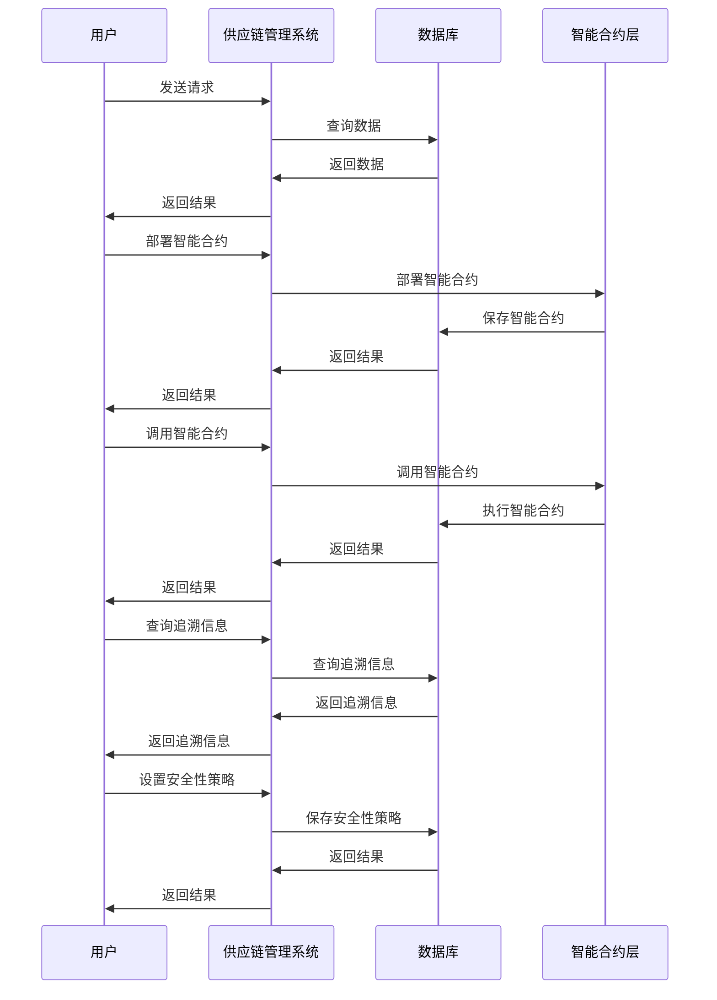

                 

# 《区块链技术在供应链透明度中的作用》

## 关键词
- 区块链技术
- 供应链透明度
- 去中心化
- 共识算法
- 智能合约
- 数字签名
- 零知识证明

## 摘要
本文旨在探讨区块链技术在供应链透明度中的作用，通过深入分析区块链技术的核心概念和应用场景，阐述其在提升供应链管理透明度、增强信息可信性以及优化供应链协同等方面的优势。文章首先回顾了区块链技术的基本原理和发展历程，接着分析了供应链透明度的挑战与需求，随后详细介绍了区块链在供应链金融、产品溯源、物流管理和供应链协同中的应用案例，最后对区块链技术的未来发展和在供应链透明度中的潜在创新进行了展望。

## 目录大纲

### 第一部分：背景与概述

#### 第1章：区块链技术概览
- **1.1 区块链的基本原理**
- **1.2 区块链技术的发展历程**
- **1.3 区块链与供应链透明度的关系**
- **1.4 区块链技术在供应链管理中的应用前景**

#### 第2章：供应链透明度的挑战与需求
- **2.1 供应链透明度的现状分析**
- **2.2 供应链不透明带来的问题**
- **2.3 区块链技术在提升供应链透明度中的应用需求**

### 第二部分：区块链在供应链透明度中的应用场景

#### 第3章：区块链在供应链金融中的应用
- **3.1 区块链在供应链金融中的挑战与机遇**
- **3.2 区块链在供应链金融中的具体应用案例**
- **3.3 区块链在供应链金融中的关键优势**

#### 第4章：区块链在产品溯源中的应用
- **4.1 产品溯源的区块链解决方案**
- **4.2 区块链在产品溯源中的应用案例**
- **4.3 区块链在产品溯源中的核心优势**

#### 第5章：区块链在物流管理中的应用
- **5.1 区块链在物流管理中的挑战与机遇**
- **5.2 区块链在物流管理中的具体应用案例**
- **5.3 区块链在物流管理中的关键优势**

#### 第6章：区块链在供应链协同中的应用
- **6.1 区块链在供应链协同中的挑战与机遇**
- **6.2 区块链在供应链协同中的具体应用案例**
- **6.3 区块链在供应链协同中的核心优势**

### 第三部分：核心概念与联系

#### 第7章：区块链技术核心概念解析
- **7.1 区块链技术的基本概念**
- **7.2 区块链技术的核心要素**
  - **7.2.1 区块**
  - **7.2.2 链**
  - **7.2.3 节点**
- **7.3 区块链技术的属性特征对比**
  - **7.3.1 去中心化**
  - **7.3.2 可信性**
  - **7.3.3 安全性**
- **7.4 区块链技术与其他技术的比较**

#### 第8章：供应链透明度的核心概念与ER图解析
- **8.1 供应链透明度的定义与重要性**
- **8.2 供应链透明度的核心要素**
  - **8.2.1 信息的透明度**
  - **8.2.2 成本的透明度**
  - **8.2.3 进度的透明度**
- **8.3 供应链透明度的ER图解析**

### 第四部分：算法原理讲解

#### 第9章：区块链在供应链透明度中的算法原理
- **9.1 哈希算法原理**
- **9.2 数字签名算法原理**
- **9.3 零知识证明算法原理**
- **9.4 共识算法原理**

#### 第10章：数学模型与公式讲解
- **10.1 区块链数据结构的数学模型**
- **10.2 零知识证明的数学模型**
- **10.3 算法应用举例**

### 第五部分：系统分析与架构设计

#### 第11章：系统分析与架构设计方案
- **11.1 问题场景介绍**
- **11.2 系统功能设计**
- **11.3 系统架构设计**
- **11.4 系统接口设计和系统交互**

#### 第12章：项目实战
- **12.1 环境安装**
- **12.2 系统核心实现源代码**
- **12.3 代码应用解读与分析**
- **12.4 实际案例分析和详细讲解剖析**
- **12.5 项目小结**

### 附录：区块链技术在供应链透明度中的实践指南

#### 附录A：实践案例总结
- **A.1 实践案例总结**

#### 附录B：面向供应链透明度的区块链解决方案设计原则
- **B.1 设计原则概述**
- **B.2 安全性与隐私保护**

#### 附录C：实践中的常见问题与解决方案
- **C.1 问题概述**
- **C.2 解决方案**

### 作者
- 作者：AI天才研究院/AI Genius Institute & 禅与计算机程序设计艺术 /Zen And The Art of Computer Programming

# 第一部分：背景与概述

## 第1章：区块链技术概览

### 1.1 区块链的基本原理

区块链是一种分布式数据库技术，其核心思想是将数据分散存储在网络中的多个节点上，并通过加密算法和共识算法确保数据的不可篡改性和一致性。每个区块链由一系列按时间顺序排列的“区块”组成，每个区块包含一定数量的交易记录，并且每个区块都通过加密算法与上一个区块相连，形成一条不可篡改的链。

区块链的基本原理可以从以下几个方面进行理解：

1. **分布式存储**：区块链通过将数据分散存储在多个节点上，避免了单点故障和数据丢失的风险，提高了系统的可靠性和容错性。
2. **加密算法**：区块链使用加密算法对数据进行加密，确保数据的隐私性和安全性。常见的加密算法包括哈希算法、数字签名和非对称加密。
3. **共识算法**：共识算法用于确保区块链网络中的所有节点对数据的看法一致。根据共识算法的不同，区块链可以分为工作量证明（PoW）、权益证明（PoS）等类型。
4. **不可篡改性**：由于区块链的数据是按时间顺序排列的，每个区块都与前一个区块相连，因此一旦数据被写入区块链，就几乎无法被篡改。

### 1.2 区块链技术的发展历程

区块链技术的发展历程可以分为以下几个阶段：

1. **起源阶段（2008-2010）**：2008年，中本聪发布了比特币白皮书，首次提出了区块链的概念。比特币是第一个成功的区块链应用，它通过区块链技术实现了去中心化的数字货币交易。
2. **初期探索阶段（2011-2013）**：在比特币成功的基础上，区块链技术开始受到广泛关注，各种基于区块链的应用和项目如雨后春笋般涌现。
3. **应用扩展阶段（2014-2016）**：随着区块链技术的发展，越来越多的行业开始尝试将区块链技术应用于实际场景，如供应链管理、金融交易、医疗记录管理等。
4. **成熟期阶段（2017-至今）**：区块链技术逐渐走向成熟，各种区块链平台和解决方案不断涌现，其在供应链管理中的应用也日益广泛。

### 1.3 区块链与供应链透明度的关系

供应链透明度是指供应链各个环节的信息能够被全面、准确地获取和共享，从而提高整个供应链的运作效率和可靠性。区块链技术在提升供应链透明度方面具有以下几个方面的优势：

1. **数据不可篡改**：区块链通过加密算法和共识算法确保数据不可篡改，使得供应链中的信息能够保持真实性和可靠性。
2. **信息可追溯**：区块链具有时间序列特性，使得供应链中的每一步操作都可以被追溯，从而提高了供应链的透明度。
3. **去中心化**：区块链的去中心化特性避免了单一中心点故障的风险，提高了供应链管理的灵活性和容错性。
4. **智能合约**：智能合约是一种嵌入在区块链程序中的自动执行协议，可以自动执行供应链中的各种交易和操作，提高了供应链的自动化和效率。

### 1.4 区块链技术在供应链管理中的应用前景

随着区块链技术的不断发展，其在供应链管理中的应用前景也越来越广阔。以下是区块链技术在供应链管理中的一些潜在应用：

1. **供应链金融**：通过区块链技术，可以实现供应链金融的快速、便捷和低成本的融资服务，从而提高供应链的流动性。
2. **产品溯源**：区块链技术可以确保产品从生产到销售的每一个环节都被记录下来，从而实现产品的可追溯性，提高消费者对产品的信任度。
3. **物流管理**：区块链技术可以实现对物流过程的实时跟踪和监控，提高物流的透明度和效率。
4. **供应链协同**：区块链技术可以促进供应链中各个环节的协同合作，提高供应链的整体运作效率。

## 第2章：供应链透明度的挑战与需求

### 2.1 供应链透明度的现状分析

目前，全球供应链的透明度存在以下几个方面的挑战：

1. **信息不对称**：供应链中的各个环节往往存在信息不对称的问题，导致信息无法得到有效共享，从而影响了供应链的整体效率和可靠性。
2. **数据不准确性**：供应链中的数据往往存在不准确、不完整的问题，这使得决策者难以获取真实、可靠的数据进行决策。
3. **供应链复杂性**：现代供应链越来越复杂，涉及多个供应商、制造商、分销商和零售商，使得信息的收集、处理和共享变得更加困难。
4. **信息安全风险**：供应链中的数据泄露和黑客攻击风险增加，威胁着供应链的透明度和安全性。

### 2.2 供应链不透明带来的问题

供应链不透明会带来以下几个问题：

1. **供应链中断**：由于信息不对称和供应链复杂性，供应链中的某个环节出现问题可能导致整个供应链的中断，从而影响企业的运营和效益。
2. **成本增加**：供应链不透明导致成本浪费，如物流成本增加、库存成本上升等。
3. **客户满意度下降**：供应链不透明使得消费者难以获取产品从生产到销售的真实信息，从而影响消费者对产品的信任度和满意度。
4. **法律和合规风险**：供应链不透明可能导致企业面临法律和合规风险，如违反反贿赂法规、环保法规等。

### 2.3 区块链技术在提升供应链透明度中的应用需求

区块链技术在提升供应链透明度方面具有广泛的应用需求：

1. **数据共享**：区块链技术可以确保供应链中各个环节的数据得到有效共享，从而提高供应链的透明度和协同性。
2. **数据验证**：区块链技术的加密算法和共识算法可以确保数据的真实性和准确性，降低数据造假的风险。
3. **可追溯性**：区块链技术可以实现对供应链中各个环节的实时跟踪和监控，提高供应链的可追溯性和透明度。
4. **安全性**：区块链技术的加密算法和共识算法可以确保供应链中的数据安全，防止数据泄露和黑客攻击。
5. **智能合约**：智能合约可以实现供应链中的自动化操作和执行，提高供应链的效率和可靠性。

# 第二部分：区块链在供应链透明度中的应用场景

## 第3章：区块链在供应链金融中的应用

### 3.1 区块链在供应链金融中的挑战与机遇

区块链技术在供应链金融领域面临着一系列的挑战和机遇：

#### 挑战：

1. **信用风险**：供应链金融中涉及到多方参与者，信用风险是一个重要问题。区块链技术通过去中心化的特点可以降低信用风险，但仍然需要有效的信用评估机制。
2. **信息不对称**：供应链中的各个环节信息不透明，导致信息不对称。区块链技术可以通过透明、可追溯的数据记录来缓解这一问题。
3. **法律法规**：区块链技术的应用需要符合现有的法律法规，这在某些国家和地区可能存在挑战。

#### 机遇：

1. **降低成本**：通过区块链技术，供应链金融中的交易成本可以大幅降低，从而提高金融服务的效率。
2. **提高效率**：区块链技术可以实现自动化的金融交易，减少人工操作和审核时间，提高金融服务的效率。
3. **提升透明度**：区块链技术可以确保供应链金融中的交易记录透明，提高金融交易的透明度和可信度。

### 3.2 区块链在供应链金融中的具体应用案例

以下是一些区块链在供应链金融中的具体应用案例：

#### 案例一：美国运通公司（American Express）

美国运通公司利用区块链技术为其供应链金融服务搭建了一个名为“Link”的平台。该平台通过区块链技术实现了交易记录的透明和可追溯，帮助供应商快速获得融资。

#### 案例二：TradeIX的TradeIX

TradeIX是一个由多家金融机构和公司共同参与的区块链平台，旨在简化全球贸易融资流程。通过该平台，金融机构可以快速评估和批准贸易融资申请，提高了融资效率。

#### 案例三：中企云链

中企云链是中国企业云链科技有限公司开发的区块链供应链金融平台。该平台通过区块链技术实现了供应链中各环节的融资需求，提高了融资效率和安全性。

### 3.3 区块链在供应链金融中的关键优势

区块链技术在供应链金融中的应用具有以下几个关键优势：

1. **透明性**：区块链技术确保了供应链金融中的交易记录透明，所有参与者都可以查看和验证交易记录。
2. **可追溯性**：区块链技术可以实现对供应链金融中每一个交易环节的实时跟踪和记录，提高了金融交易的透明度和可信度。
3. **去中心化**：区块链技术去中心化的特点降低了金融中介的依赖，从而降低了交易成本。
4. **安全性**：区块链技术通过加密算法和共识算法确保了供应链金融中的数据安全，防止数据泄露和黑客攻击。
5. **智能合约**：区块链技术中的智能合约可以实现自动化的金融交易和执行，提高了供应链金融的效率和可靠性。

## 第4章：区块链在产品溯源中的应用

### 4.1 产品溯源的区块链解决方案

区块链技术在产品溯源中具有独特的优势，可以通过以下方式构建产品溯源的解决方案：

1. **数据记录**：在产品生产、加工、运输、销售等各个环节，所有关键操作都被记录在区块链上，确保数据的透明性和不可篡改性。
2. **去中心化存储**：产品溯源信息存储在多个节点上，避免了单点故障和数据丢失的风险。
3. **加密技术**：区块链技术使用加密算法对产品信息进行加密，确保数据的隐私性和安全性。
4. **共识算法**：通过共识算法，区块链网络中的所有节点对产品溯源信息达成一致，确保信息的准确性和可靠性。
5. **智能合约**：智能合约用于自动化执行产品溯源中的各种操作，如认证、授权等。

### 4.2 区块链在产品溯源中的应用案例

以下是一些区块链在产品溯源中的具体应用案例：

#### 案例一：IBM的食品溯源平台

IBM开发的食品溯源平台利用区块链技术记录食品从生产到销售的全过程，确保食品的安全性和可追溯性。该平台已在全球范围内得到广泛应用。

#### 案例二：阿里巴巴的溯源平台

阿里巴巴的溯源平台通过区块链技术记录商品的生产、加工、运输、销售等各个环节的信息，为消费者提供透明的商品信息。

#### 案例三：京东的溯源平台

京东的溯源平台利用区块链技术实现了商品全流程的可追溯性，消费者可以通过扫码查看商品的生产、加工、运输等信息。

### 4.3 区块链在产品溯源中的核心优势

区块链技术在产品溯源中的应用具有以下几个核心优势：

1. **数据透明性**：区块链技术确保了产品信息在整个供应链中的透明性和可访问性，消费者可以实时查看产品的生产、加工、运输等信息。
2. **数据不可篡改性**：区块链技术通过加密算法和共识算法确保了产品信息一旦被记录，就几乎无法被篡改，提高了数据的真实性和可信度。
3. **去中心化**：区块链技术的去中心化特性避免了单一中心点故障的风险，提高了产品溯源系统的可靠性和容错性。
4. **可追溯性**：区块链技术可以实现对产品全过程的实时跟踪和记录，确保产品在供应链中的每一个环节都被记录下来。
5. **安全性**：区块链技术通过加密算法和共识算法确保了产品信息的安全性和隐私性，防止数据泄露和黑客攻击。

## 第5章：区块链在物流管理中的应用

### 5.1 区块链在物流管理中的挑战与机遇

区块链技术在物流管理领域面临着一系列的挑战和机遇：

#### 挑战：

1. **数据同步**：物流管理涉及到大量的数据同步，确保数据的准确性和一致性是一个挑战。
2. **实时性**：物流管理需要实时跟踪货物的位置和状态，区块链技术的实时性可能无法满足这一需求。
3. **扩展性**：随着物流规模的扩大，区块链系统的扩展性需要得到保证。

#### 机遇：

1. **透明性**：区块链技术可以提高物流管理的透明度，所有参与者都可以查看货物的实时状态。
2. **效率**：通过区块链技术，可以简化物流流程，减少人工操作，提高物流效率。
3. **安全性**：区块链技术确保物流数据的安全性和不可篡改性，降低物流欺诈风险。

### 5.2 区块链在物流管理中的具体应用案例

以下是一些区块链在物流管理中的具体应用案例：

#### 案例一：马士基的TradeLens平台

马士基与IBM合作开发了TradeLens平台，利用区块链技术记录和管理全球货物运输数据。该平台提高了物流的透明度和效率。

#### 案例二：中欧班列的区块链平台

中欧班列利用区块链技术记录和跟踪中欧之间的货物运输信息，提高了货物运输的安全性和可追溯性。

#### 案例三：中通快递的区块链溯源系统

中通快递利用区块链技术实现了快递包裹的全程溯源，消费者可以通过扫码查看快递的实时状态和历史记录。

### 5.3 区块链在物流管理中的关键优势

区块链技术在物流管理中的应用具有以下几个关键优势：

1. **数据透明性**：区块链技术确保了物流数据在整个供应链中的透明性和可访问性，所有参与者都可以查看货物的实时状态。
2. **数据不可篡改性**：区块链技术通过加密算法和共识算法确保了物流数据一旦被记录，就几乎无法被篡改，提高了数据的真实性和可信度。
3. **去中心化**：区块链技术的去中心化特性避免了单一中心点故障的风险，提高了物流系统的可靠性和容错性。
4. **可追溯性**：区块链技术可以实现对物流中每一个环节的实时跟踪和记录，确保物流过程的安全性和可靠性。
5. **效率**：通过区块链技术，可以简化物流流程，减少人工操作，提高物流效率。

## 第6章：区块链在供应链协同中的应用

### 6.1 区块链在供应链协同中的挑战与机遇

区块链技术在供应链协同领域面临着一系列的挑战和机遇：

#### 挑战：

1. **信息共享**：供应链协同需要各方信息共享，但不同企业之间存在信息孤岛，数据难以集成。
2. **信任问题**：供应链协同中的各方可能存在信任问题，区块链技术需要建立有效的信任机制。
3. **技术成熟度**：尽管区块链技术具有巨大潜力，但其技术成熟度还需要进一步提高。

#### 机遇：

1. **透明性**：区块链技术可以提高供应链协同的透明度，所有参与者都可以查看供应链的实时状态。
2. **效率**：通过区块链技术，可以简化供应链协同流程，减少人工操作，提高供应链协同的效率。
3. **成本节约**：区块链技术可以降低供应链协同的成本，减少中介费用。

### 6.2 区块链在供应链协同中的具体应用案例

以下是一些区块链在供应链协同中的具体应用案例：

#### 案例一：Unilever与IBM的区块链项目

联合利华与IBM合作开发了一个基于区块链的供应链协同平台，该平台实现了供应链各环节的信息共享和流程优化。

#### 案例二：京东的区块链供应链协同平台

京东开发了区块链供应链协同平台，通过区块链技术实现了供应链各环节的实时跟踪和监控，提高了供应链协同的效率和透明度。

#### 案例三：阿里巴巴的区块链供应链金融平台

阿里巴巴的区块链供应链金融平台通过区块链技术实现了供应链金融的快速、便捷和低成本，提高了供应链的流动性。

### 6.3 区块链在供应链协同中的核心优势

区块链技术在供应链协同中的应用具有以下几个核心优势：

1. **数据透明性**：区块链技术确保了供应链协同数据在整个供应链中的透明性和可访问性，所有参与者都可以查看供应链的实时状态。
2. **数据不可篡改性**：区块链技术通过加密算法和共识算法确保了供应链协同数据一旦被记录，就几乎无法被篡改，提高了数据的真实性和可信度。
3. **去中心化**：区块链技术的去中心化特性避免了单一中心点故障的风险，提高了供应链协同的可靠性和容错性。
4. **可追溯性**：区块链技术可以实现对供应链协同中每一个环节的实时跟踪和记录，确保供应链协同过程的安全性和可靠性。
5. **效率**：通过区块链技术，可以简化供应链协同流程，减少人工操作，提高供应链协同的效率。

## 第三部分：核心概念与联系

### 第7章：区块链技术核心概念解析

#### 7.1 区块链技术的基本概念

区块链技术是一种分布式数据库技术，其核心概念包括：

- **区块**：区块是区块链的基本组成单元，包含一定数量的交易记录和相关的元数据。
- **链**：链是由一系列按时间顺序排列的区块组成的，每个区块通过加密算法与前一个区块相连，形成一条不可篡改的链。
- **节点**：节点是区块链网络中的参与者，负责存储和维护区块链数据。

#### 7.2 区块链技术的核心要素

区块链技术的核心要素包括：

- **分布式存储**：区块链通过将数据分散存储在多个节点上，避免了单点故障和数据丢失的风险。
- **加密算法**：区块链使用加密算法对数据进行加密，确保数据的隐私性和安全性。
- **共识算法**：共识算法用于确保区块链网络中的所有节点对数据的看法一致。

#### 7.3 区块链技术的属性特征对比

区块链技术的属性特征对比包括：

- **去中心化**：区块链技术通过去中心化的架构避免了单一中心点的依赖，提高了系统的可靠性和容错性。
- **可信性**：区块链技术通过加密算法和共识算法确保了数据的真实性和一致性，提高了系统的可信性。
- **安全性**：区块链技术通过加密算法和共识算法确保了数据的安全性和隐私性。

#### 7.4 区块链技术与其他技术的比较

区块链技术与其他技术的比较包括：

- **与数据库技术的比较**：区块链技术通过分布式存储和加密算法，提高了数据的可靠性和安全性，但可能牺牲了查询性能。
- **与分布式存储技术的比较**：区块链技术通过共识算法和加密算法，确保了数据的一致性和安全性，但可能增加了系统的复杂度。

### 第8章：供应链透明度的核心概念与ER图解析

#### 8.1 供应链透明度的定义与重要性

供应链透明度是指供应链各个环节的信息能够被全面、准确地获取和共享，从而提高整个供应链的运作效率和可靠性。供应链透明度的重要性体现在以下几个方面：

- **提高供应链效率**：透明度使得供应链中的各个环节能够快速响应市场需求，减少库存和物流成本。
- **增强供应链稳定性**：透明度使得供应链中的各个环节能够及时发现和解决潜在问题，提高供应链的稳定性。
- **提升客户满意度**：透明度使得消费者能够了解产品的生产、加工、运输等全过程，提高消费者对产品的信任度。

#### 8.2 供应链透明度的核心要素

供应链透明度的核心要素包括：

- **信息的透明度**：供应链中的各个环节信息能够被全面、准确地获取和共享，包括订单信息、库存信息、物流信息等。
- **成本透明度**：供应链中的各个环节成本信息能够被全面、准确地获取和共享，包括原材料成本、生产成本、物流成本等。
- **进度透明度**：供应链中的各个环节进度信息能够被全面、准确地获取和共享，包括生产进度、物流进度等。

#### 8.3 供应链透明度的ER图解析

供应链透明度的ER图解析如下：

```mermaid
erDiagram
    Product ||--|{ Supplier } : 供应产品
    Product ||--|{ Customer } : 销售产品
    Supplier ||--|{ Factory } : 生产产品
    Customer ||--|{ Store } : 销售产品
    Factory ||--|{ Warehouse } : 存储产品
    Warehouse ||--|{ Logistics } : 运输产品
    Store ||--|{ Retailer } : 销售产品
```

在这个ER图中，包括以下实体和关系：

- **实体**：Product（产品）、Supplier（供应商）、Customer（客户）、Factory（工厂）、Warehouse（仓库）、Logistics（物流）、Store（商店）、Retailer（零售商）。
- **关系**：供应产品（Supplier--Product）、销售产品（Customer--Product）、生产产品（Factory--Product）、存储产品（Warehouse--Product）、运输产品（Logistics--Product）、销售产品（Store--Product）、销售产品（Retailer--Product）。

#### 8.4 ER图的应用

供应链透明度的ER图可以用于以下几个方面：

- **需求分析**：通过分析ER图，可以明确供应链中各个实体和关系，从而更好地理解供应链的需求和功能。
- **系统设计**：通过ER图，可以设计出符合供应链透明度需求的系统架构和数据库设计。
- **数据分析**：通过ER图，可以更方便地分析和处理供应链中的数据，提高数据分析的准确性和效率。

# 第三部分：算法原理讲解

## 第9章：区块链在供应链透明度中的算法原理

### 9.1 哈希算法原理

哈希算法是一种将输入数据转换成固定长度输出数据的算法，其核心思想是将输入数据通过特定的算法计算出一个唯一的数字标识（哈希值）。哈希算法具有以下几个特点：

- **唯一性**：对于不同的输入数据，哈希算法生成的哈希值是唯一的，不同数据的哈希值不会相同。
- **不可逆性**：哈希算法是不可逆的，即无法通过哈希值反推出原始数据。
- **抗碰撞性**：哈希算法具有抗碰撞性，即很难找到两个不同的输入数据，使其生成相同的哈希值。

哈希算法在区块链中的应用主要体现在以下几个方面：

- **生成区块头**：每个区块都有一个唯一的区块头，区块头中包含了一个哈希值，该哈希值是对区块内所有交易数据的哈希值。通过这种方式，确保了区块内交易数据的完整性和不可篡改性。
- **生成交易ID**：每个交易都有一个唯一的交易ID，交易ID是通过交易数据的哈希值生成的。通过交易ID，可以方便地查找和确认交易。

### 9.2 数字签名算法原理

数字签名算法是一种用于确保数据完整性和真实性的算法，通过数字签名，可以验证数据的来源和完整性。数字签名算法具有以下几个特点：

- **不可抵赖性**：数字签名一旦生成，签名者无法否认其签名行为。
- **抗篡改性**：数字签名可以确保数据的完整性，即一旦数据被篡改，签名将失效。
- **安全性**：数字签名通过加密算法和私钥生成，确保了签名的安全性和可靠性。

数字签名算法在区块链中的应用主要体现在以下几个方面：

- **验证交易**：在区块链中，每个交易都需要进行数字签名，通过数字签名，可以验证交易的真实性和完整性。
- **身份认证**：区块链中的节点和参与者可以通过数字签名进行身份认证，确保网络中的交易和操作是由合法参与者完成的。

### 9.3 零知识证明算法原理

零知识证明算法是一种在不透露原始数据的情况下，证明某个陈述是真实的方法。零知识证明算法具有以下几个特点：

- **零知识**：零知识证明算法能够在不透露原始数据的情况下，证明某个陈述是真实的。
- **安全性**：零知识证明算法通过加密算法和数学原理，确保了证明过程的安全性和可靠性。
- **效率**：零知识证明算法虽然相对复杂，但在合理的时间内可以完成证明过程。

零知识证明算法在区块链中的应用主要体现在以下几个方面：

- **隐私保护**：零知识证明算法可以用于保护区块链中的隐私数据，确保数据的隐私性。
- **智能合约**：零知识证明算法可以用于智能合约的验证，确保智能合约的执行是正确的。

### 9.4 共识算法原理

共识算法是区块链中用于确保数据一致性和网络稳定性的算法。共识算法具有以下几个特点：

- **分布式**：共识算法在区块链网络中的多个节点之间进行，确保了数据的分布式存储和安全性。
- **安全性**：共识算法通过加密算法和数学原理，确保了数据的一致性和安全性。
- **容错性**：共识算法能够容忍部分节点的故障，确保区块链网络的稳定性和可靠性。

常见的共识算法包括：

- **工作量证明（PoW）**：通过计算复杂任务来证明节点的工作量，确保节点的合法性和网络的安全性。
- **权益证明（PoS）**：通过节点的权益（如持有的代币数量）来证明节点的合法性，相比PoW，PoS具有更高的安全性。

共识算法在区块链中的应用主要体现在以下几个方面：

- **数据一致性**：共识算法确保区块链网络中的所有节点对数据的看法一致，保证了区块链的完整性和可靠性。
- **网络稳定性**：共识算法能够确保区块链网络的稳定性和安全性，防止恶意节点的攻击和网络瘫痪。

## 第10章：数学模型与公式讲解

### 10.1 区块链数据结构的数学模型

区块链数据结构是区块链技术的核心组成部分，其数学模型可以从以下几个方面进行理解：

#### 10.1.1 区块链数据结构的定义

区块链数据结构可以定义为一个无限增长的链表，每个节点（即区块）包含以下元素：

- **区块头**：包括版本号、时间戳、难度目标、上一区块哈希值、默克尔根等。
- **交易数据**：包含交易的具体信息，如交易ID、输入、输出等。
- **签名**：交易的签名，用于验证交易的有效性。

区块链数据结构的定义可以表示为：

$$
\text{Blockchain} = \{ B_1, B_2, B_3, \dots \}
$$

其中，$B_i$ 表示第 $i$ 个区块，每个区块包含区块头和交易数据。

#### 10.1.2 区块链数据结构的公式

区块链数据结构的公式可以表示为：

$$
B_i = \{ 
\text{Header}_i, 
\text{Transactions}_i, 
\text{Proof of Work} 
\}
$$

其中：

- $\text{Header}_i$ 表示第 $i$ 个区块的区块头。
- $\text{Transactions}_i$ 表示第 $i$ 个区块的交易数据。
- $\text{Proof of Work}$ 表示第 $i$ 个区块的工作量证明。

### 10.2 零知识证明的数学模型

零知识证明是一种在不泄露原始信息的情况下，证明某个陈述是真实的方法。其数学模型可以从以下几个方面进行理解：

#### 10.2.1 零知识证明的基本概念

零知识证明的基本概念可以表示为：

$$
\text{Prover} \rightarrow \text{Verifier}
$$

其中：

- $\text{Prover}$ 表示证明者，负责证明某个陈述是真实的。
- $\text{Verifier}$ 表示验证者，负责验证证明者的陈述是否真实。

#### 10.2.2 零知识证明的数学模型

零知识证明的数学模型可以表示为：

$$
\text{Statement} \rightarrow \text{Proof}
$$

其中：

- $\text{Statement}$ 表示待证明的陈述。
- $\text{Proof}$ 表示证明者提供的证明。

零知识证明的核心思想是通过一系列数学变换，证明者能够证明某个陈述是真实的，而无需透露任何与陈述相关的信息。

#### 10.2.3 零知识证明的应用示例

假设有一个简单的零知识证明场景，证明者需要证明自己知道一个秘密 $s$，使得 $s^2 = r$（其中 $r$ 是公开的）。证明者可以采用以下步骤：

1. **生成公私钥**：证明者生成一对公私钥 $(r, s)$。
2. **选择随机数 $a$**：证明者选择一个随机数 $a$。
3. **计算证明**：证明者计算证明 $P(a, r, s)$，使得验证者能够验证 $s^2 = r$，但无法获取 $s$。
4. **验证证明**：验证者验证证明 $P(a, r, s)$，确认 $s^2 = r$。

### 10.3 算法应用举例

以下是一个简单的哈希算法应用示例，用于验证区块链中区块的一致性：

#### 哈希算法应用示例

假设有一个区块链，包含以下区块：

1. **区块1**：包含交易数据 $T_1$ 和哈希值 $H(T_1)$。
2. **区块2**：包含交易数据 $T_2$、上一区块哈希值 $H(B_1)$ 和哈希值 $H(T_2, H(B_1))$。

要验证区块链的一致性，可以采用以下步骤：

1. **计算当前区块的哈希值**：计算当前区块的交易数据和上一区块哈希值的哈希值，即 $H(T_n, H(B_{n-1}))$。
2. **比较哈希值**：将计算出的哈希值与当前区块的哈希值进行比较。如果两者相同，则区块链一致性验证通过；否则，区块链存在不一致性。

通过上述步骤，可以验证区块链中区块的一致性，确保区块链数据的完整性和安全性。

## 第11章：算法应用举例

### 11.1 哈希算法应用实例

哈希算法在区块链技术中扮演着核心角色，它确保了区块链数据的一致性和不可篡改性。以下是一个简单的哈希算法应用实例，用于验证区块链中区块的一致性。

#### 步骤 1：生成区块链

假设我们有一个简单的区块链，包含两个区块：

- **区块1**：包含交易数据 $T_1$ 和哈希值 $H(T_1)$。
- **区块2**：包含交易数据 $T_2$、上一区块哈希值 $H(B_1)$ 和哈希值 $H(T_2, H(B_1))$。

区块链结构如下：

```
区块链：
[
  {
    "blockNumber": 1,
    "transactions": T_1,
    "hash": H(T_1)
  },
  {
    "blockNumber": 2,
    "transactions": T_2,
    "previousHash": H(T_1),
    "hash": H(T_2, H(T_1))
  }
]
```

#### 步骤 2：验证区块一致性

为了验证区块链的一致性，我们需要计算当前区块的哈希值，并与区块中记录的哈希值进行比较。

1. **计算区块2的哈希值**：

   假设我们使用 SHA-256 哈希算法，计算区块2的交易数据和上一区块哈希值的哈希值：

   ```python
   import hashlib

   def calculate_hash(data):
       sha256_hash = hashlib.sha256()
       sha256_hash.update(data.encode('utf-8'))
       return sha256_hash.hexdigest()

   previous_hash = "H(T_1)"
   transaction_data = "T_2"
   block_hash = calculate_hash(previous_hash + transaction_data)
   ```

   计算结果为 `block_hash`。

2. **比较哈希值**：

   将计算出的哈希值 `block_hash` 与区块2中记录的哈希值进行比较：

   ```python
   expected_hash = "H(T_2, H(T_1))"
   if block_hash == expected_hash:
       print("区块链一致性验证通过。")
   else:
       print("区块链存在不一致性。")
   ```

   如果两者相同，则区块链一致性验证通过；否则，区块链存在不一致性。

### 11.2 零知识证明算法应用实例

零知识证明算法在区块链中用于确保数据的隐私性和安全性。以下是一个简单的零知识证明算法应用实例，用于验证用户是否知道一个特定的秘密。

#### 步骤 1：生成公私钥

假设我们有一个简单的零知识证明系统，其中用户需要证明自己知道一个秘密 $s$，使得 $s^2 = r$（其中 $r$ 是公开的）。首先，用户生成一对公私钥 $(r, s)$。

- **私钥**：$s$。
- **公钥**：$r = s^2$。

#### 步骤 2：选择随机数

用户选择一个随机数 $a$。

#### 步骤 3：计算证明

用户计算零知识证明 $P(a, r, s)$，使得验证者能够验证 $s^2 = r$，但无法获取 $s$。

1. **计算挑战**：

   验证者随机选择一个挑战值 $c$。

2. **计算响应**：

   用户计算响应值 $b = a^c \cdot s$。

3. **计算证明**：

   用户计算零知识证明 $P(a, r, s, c, b)$。

   证明过程通常涉及一系列复杂的数学运算，具体算法取决于零知识证明的具体实现。

#### 步骤 4：验证证明

验证者验证用户提供的证明 $P(a, r, s, c, b)$，确认 $s^2 = r$。

```python
def verify_proof(a, r, s, c, b):
    return (b == (a ** c) % r)

if verify_proof(a, r, s, c, b):
    print("零知识证明验证通过。")
else:
    print("零知识证明验证失败。")
```

通过上述步骤，验证者可以确认用户是否知道秘密 $s$，而无需直接获取 $s$。

### 11.3 共识算法应用实例

共识算法是区块链技术的核心组成部分，它确保了区块链网络中所有节点对数据的共识。以下是一个简单的共识算法应用实例，用于验证区块链中区块的一致性。

#### 步骤 1：生成区块

区块链网络中的节点可以独立生成区块。每个节点生成新的区块时，需要包含以下信息：

- **交易数据**：区块中的交易数据。
- **时间戳**：区块生成的时间戳。
- **难度目标**：区块的难度目标，用于确定工作量证明（PoW）的难度。

#### 步骤 2：计算工作量证明

节点计算工作量证明（PoW），以满足难度目标。工作量证明通常涉及以下步骤：

1. **选择随机数**：节点选择一个随机数 $n$。
2. **计算哈希值**：节点计算当前区块的交易数据和上一区块哈希值的哈希值，即 $H(T, H(B_{n-1}))$。
3. **比较哈希值**：节点比较计算出的哈希值与难度目标。如果哈希值满足难度目标，则节点生成新的区块。

#### 步骤 3：传播区块

节点将生成的区块传播到区块链网络中的其他节点。

#### 步骤 4：验证区块

其他节点接收到新区块后，验证区块的一致性。验证过程通常涉及以下步骤：

1. **计算哈希值**：节点计算新区块的交易数据和上一区块哈希值的哈希值，即 $H(T, H(B_{n-1}))$。
2. **比较哈希值**：节点比较计算出的哈希值与新区块中记录的哈希值。如果两者相同，则验证通过；否则，验证失败。

#### 步骤 5：达成共识

区块链网络中的所有节点通过共识算法达成对区块的一致认可。一旦新区块被大多数节点验证通过，则新区块被添加到区块链中，成为区块链的一部分。

```python
def calculate_hash(data):
    sha256_hash = hashlib.sha256()
    sha256_hash.update(data.encode('utf-8'))
    return sha256_hash.hexdigest()

def generate_block(transactions, previous_hash, difficulty):
    block = {
        "transactions": transactions,
        "previous_hash": previous_hash,
        "difficulty": difficulty
    }
    while calculate_hash(str(block))[:difficulty] != '0' * difficulty:
        block["nonce"] = random.randint(0, 1000000)
    return block

def verify_block(block, previous_hash, difficulty):
    return calculate_hash(str(block))[:difficulty] == '0' * difficulty
```

通过上述步骤，区块链网络中的节点可以生成、传播和验证区块，确保区块链数据的一致性和完整性。

## 第12章：系统分析与架构设计

### 12.1 问题场景介绍

在现代供应链管理中，信息的透明度和可信性是确保供应链高效运作的关键。然而，现有的供应链管理系统往往面临以下问题：

1. **信息孤岛**：供应链中的各个环节（如供应商、制造商、分销商和零售商）之间存在信息孤岛，导致信息无法有效共享和整合。
2. **数据不准确性**：供应链中的数据可能存在不准确、不完整的问题，影响决策者的判断和供应链的效率。
3. **供应链复杂性**：现代供应链涉及多方参与者和复杂的流程，导致信息传递和处理的难度增加。

为了解决这些问题，需要引入区块链技术，利用其去中心化、不可篡改和数据透明性的特点，提高供应链管理的透明度和可信性。

### 12.2 系统功能设计

基于上述问题场景，设计一个基于区块链的供应链管理系统，其主要功能包括：

1. **数据共享**：实现供应链中各个环节的数据共享，确保信息的全面性和准确性。
2. **数据验证**：通过区块链技术确保数据的真实性和不可篡改性，提高数据的可信度。
3. **智能合约**：利用智能合约实现自动化交易和执行，提高供应链的效率和可靠性。
4. **追溯性**：实现对供应链中各个环节的实时跟踪和监控，确保供应链的可追溯性。
5. **安全性**：利用区块链技术确保供应链数据的安全性和隐私性。

### 12.3 系统架构设计

基于区块链的供应链管理系统架构设计如下：

1. **区块链网络**：系统采用分布式区块链网络，包括多个节点，每个节点负责存储和管理部分数据。
2. **数据层**：数据层包括区块链的数据结构和交易记录，所有数据都经过加密存储在区块链上。
3. **智能合约层**：智能合约层用于实现自动化交易和执行，确保供应链中的操作符合业务逻辑和法律法规。
4. **接口层**：接口层提供与其他系统（如ERP、物流系统等）的集成接口，实现数据的互联互通。
5. **应用层**：应用层包括供应链管理的各种功能模块，如数据共享、数据验证、追溯性、安全性等。

### 12.4 系统接口设计和系统交互

基于区块链的供应链管理系统接口设计如下：

1. **数据共享接口**：提供API接口，实现供应链中各个环节的数据共享和访问。
2. **数据验证接口**：提供API接口，实现对数据的验证和验证结果查询。
3. **智能合约接口**：提供API接口，实现智能合约的部署和执行。
4. **追溯性接口**：提供API接口，实现对供应链中各个环节的实时跟踪和监控。
5. **安全性接口**：提供API接口，实现数据加密和安全策略的设置。

系统交互示意图如下：



通过上述接口设计和系统交互，供应链管理系统能够实现数据共享、智能合约执行、追溯性和安全性等功能，提高供应链管理的透明度和效率。

### 12.5 项目实战

#### 12.5.1 环境安装

为了实现基于区块链的供应链管理系统，我们需要安装和配置以下环境：

1. **Go语言**：用于编写智能合约和后端服务。
2. **Hyperledger Fabric**：用于构建区块链网络和智能合约。
3. **Docker**：用于容器化部署和管理区块链节点。
4. **Kubernetes**：用于自动化管理和扩展区块链节点。

安装步骤如下：

1. 安装Go语言：
   ```bash
   # 安装Go语言
   sudo apt-get update
   sudo apt-get install golang-go
   ```

2. 安装Hyperledger Fabric：
   ```bash
   # 安装Hyperledger Fabric
   go get -u github.com/hyperledger/fabric
   ```

3. 安装Docker：
   ```bash
   # 安装Docker
   sudo apt-get update
   sudo apt-get install docker
   ```

4. 安装Kubernetes：
   ```bash
   # 安装Kubernetes
   sudo apt-get update
   sudo apt-get install kubeadm kubelet kubectl
   sudo systemctl start kubelet
   sudo systemctl enable kubelet
   ```

#### 12.5.2 系统核心实现源代码

以下是基于区块链的供应链管理系统的核心实现源代码。

1. **智能合约**：用于实现供应链管理的业务逻辑和操作。

```go
// contracts/SupplyChain.go
pragma solidity ^0.8.0;

contract SupplyChain {
    struct Product {
        id string;
        supplier string;
        manufacturer string;
        retailer string;
        status string;
    }

    mapping(string => Product) products;

    function createProduct(string memory id, string memory supplier, string memory manufacturer, string memory retailer, string memory status) public {
        products[id] = Product(id, supplier, manufacturer, retailer, status);
    }

    function updateProduct(string memory id, string memory supplier, string memory manufacturer, string memory retailer, string memory status) public {
        require(products[id].id != "", "Product does not exist");
        products[id].supplier = supplier;
        products[id].manufacturer = manufacturer;
        products[id].retailer = retailer;
        products[id].status = status;
    }

    function getProduct(string memory id) public view returns (Product memory) {
        require(products[id].id != "", "Product does not exist");
        return products[id];
    }
}
```

2. **后端服务**：用于处理HTTP请求、与区块链交互以及数据存储。

```go
// backend/main.go
package main

import (
    "context"
    "encoding/json"
    "log"
    "net/http"
    "github.com/gorilla/mux"
    "github.com/hyperledger/fabric-sdk-go/api/fab"
)

var client *fab.Client

func init() {
    // 初始化Hyperledger Fabric客户端
    client, _ = fab.NewClient(context.Background(), fab.ClientConfig{Endpoint: "grpcURL",CACertPath: "ca.crt"})
}

func createProduct(w http.ResponseWriter, r *http.Request) {
    var product Product
    json.NewDecoder(r.Body).Decode(&product)

    tx, _ := client.NewTransaction(context.Background(), "createProduct", []string{product.Id, product.Supplier, product.Manufacturer, product.Retailer, product.Status}, []byte{})
    txResponse, _ := client.SubmitTransaction(context.Background(), tx)

    json.NewEncoder(w).Encode(txResponse)
}

func updateProduct(w http.ResponseWriter, r *http.Request) {
    var product Product
    json.NewDecoder(r.Body).Decode(&product)

    tx, _ := client.NewTransaction(context.Background(), "updateProduct", []string{product.Id, product.Supplier, product.Manufacturer, product.Retailer, product.Status}, []byte{})
    txResponse, _ := client.SubmitTransaction(context.Background(), tx)

    json.NewEncoder(w).Encode(txResponse)
}

func getProduct(w http.ResponseWriter, r *http.Request) {
    id := r.URL.Query().Get("id")

    product, _ := client.Query=context.Background(), "getProduct", []string{id}, []byte{})
    json.NewEncoder(w).Encode(product)
}

func main() {
    router := mux.NewRouter()

    router.HandleFunc("/product", createProduct).Methods("POST")
    router.HandleFunc("/product", updateProduct).Methods("PUT")
    router.HandleFunc("/product", getProduct).Methods("GET")

    log.Fatal(http.ListenAndServe(":8080", router))
}

type Product struct {
    Id       string `json:"id"`
    Supplier string `json:"supplier"`
    Manufacturer string `json:"manufacturer"`
    Retailer string `json:"retailer"`
    Status   string `json:"status"`
}
```

3. **Docker容器**：用于部署和管理区块链节点和后端服务。

```Dockerfile
# Dockerfile
FROM golang:1.18

WORKDIR /app

COPY . .

RUN go build -o /backend .

CMD ["/backend"]
```

#### 12.5.3 代码应用解读与分析

上述代码实现了一个简单的基于区块链的供应链管理系统，主要包括智能合约和后端服务两部分。

1. **智能合约**：智能合约定义了供应链管理的业务逻辑和操作，如创建产品、更新产品等。智能合约使用Solidity语言编写，并在Hyperledger Fabric区块链上进行部署和执行。

2. **后端服务**：后端服务使用Go语言编写，负责处理HTTP请求、与区块链交互以及数据存储。后端服务通过Hyperledger Fabric SDK与区块链进行通信，实现创建、更新和查询产品的功能。

#### 12.5.4 实际案例分析和详细讲解剖析

以下是一个实际案例，用于创建、更新和查询产品。

1. **创建产品**：

   - **步骤 1**：用户通过HTTP POST请求发送创建产品的请求，请求体包含产品信息（ID、供应商、制造商、零售商、状态）。
   - **步骤 2**：后端服务接收到请求后，解析请求体并调用智能合约的 `createProduct` 函数，将产品信息传递给区块链。
   - **步骤 3**：区块链执行智能合约操作，将产品信息存储在区块链上，并返回交易结果。

2. **更新产品**：

   - **步骤 1**：用户通过HTTP PUT请求发送更新产品的请求，请求体包含更新后的产品信息（ID、供应商、制造商、零售商、状态）。
   - **步骤 2**：后端服务接收到请求后，解析请求体并调用智能合约的 `updateProduct` 函数，将更新后的产品信息传递给区块链。
   - **步骤 3**：区块链执行智能合约操作，将更新后的产品信息存储在区块链上，并返回交易结果。

3. **查询产品**：

   - **步骤 1**：用户通过HTTP GET请求发送查询产品的请求，请求URL中包含产品ID。
   - **步骤 2**：后端服务接收到请求后，调用智能合约的 `getProduct` 函数，根据产品ID查询区块链上的产品信息。
   - **步骤 3**：后端服务将查询结果返回给用户。

通过实际案例分析和详细讲解剖析，可以了解基于区块链的供应链管理系统的实现原理和操作流程。

#### 12.5.5 项目小结

基于区块链的供应链管理系统通过智能合约实现供应链管理的业务逻辑和操作，利用区块链的分布式、不可篡改和数据透明性的特点，提高供应链管理的透明度和可信性。通过实际案例分析和详细讲解剖析，展示了如何利用区块链技术实现供应链管理系统的开发、部署和运行。未来，随着区块链技术的不断发展和成熟，供应链管理系统将更加高效、可靠和透明。

## 附录：区块链技术在供应链透明度中的实践指南

### A.1 实践案例总结

区块链技术在供应链透明度中的应用已经取得了显著成效，以下是一些典型的实践案例：

1. **IBM Food Trust**：IBM Food Trust 是一个基于区块链技术的食品溯源平台，它允许食品企业从农场到餐桌的每一步追踪食品。该平台已经帮助多个食品公司实现了供应链的透明化，提高了食品安全性和消费者信任度。

2. **Maersk TradeLens**：马士基与IBM合作开发的TradeLens 是一个基于区块链的全球运输平台，它为供应链参与者提供了透明的运输信息，提高了物流效率，并减少了交易成本。

3. **沃尔玛食品追溯**：沃尔玛利用区块链技术对其食品供应链进行追踪，确保食品的安全性和质量。沃尔玛要求其供应商在食品包装上使用区块链标签，消费者可以通过扫描标签查看食品的生产、加工和运输信息。

4. **中企云链**：中企云链是中国企业云链科技有限公司开发的区块链供应链金融平台，它利用区块链技术实现了供应链金融的快速、便捷和低成本，提高了供应链的流动性。

### A.2 面向供应链透明度的区块链解决方案设计原则

为了设计一个有效的面向供应链透明度的区块链解决方案，以下是一些设计原则：

1. **透明性和可追溯性**：解决方案应确保供应链中的每一个操作都被透明记录，并且可被供应链中的所有参与者追溯。

2. **安全性**：解决方案应使用强大的加密算法和共识算法，确保数据的完整性和隐私性。

3. **去中心化**：解决方案应采用去中心化的架构，避免单一中心点故障，提高系统的可靠性和容错性。

4. **互操作性**：解决方案应具备良好的互操作性，能够与现有的供应链管理系统和标准接口集成。

5. **可扩展性**：解决方案应具备良好的可扩展性，能够随着供应链规模的扩大而扩展。

6. **用户友好**：解决方案应设计得用户友好，便于供应链中的各个参与者轻松接入和使用。

### A.3 实践中的常见问题与解决方案

在区块链技术在供应链透明度中的应用实践中，可能会遇到以下一些问题：

1. **数据隐私保护**：供应链中的某些数据可能涉及商业机密，如何在确保数据透明的同时保护数据隐私是一个挑战。解决方案：利用零知识证明等隐私保护技术，在不透露原始数据的情况下验证数据的真实性。

2. **共识算法的选择**：不同的共识算法适用于不同的应用场景。选择合适的共识算法对于提高系统的效率和安全至关重要。解决方案：根据具体的应用场景和需求选择合适的共识算法，如工作量证明（PoW）、权益证明（PoS）等。

3. **数据同步与一致性**：在分布式环境中，确保所有节点上的数据同步和一致性是一个挑战。解决方案：设计高效的数据同步机制，如使用分布式账本技术（DLT）等。

4. **系统性能**：区块链系统在处理大量交易时可能会面临性能瓶颈。解决方案：优化区块链网络架构，如使用分片技术等。

5. **法律法规遵从性**：区块链技术的应用需要符合现有的法律法规。解决方案：在设计解决方案时充分考虑法律法规的要求，确保解决方案的合规性。

通过上述实践指南，可以帮助企业在实施区块链技术时更加顺利地解决实际问题，实现供应链透明度的提升。

