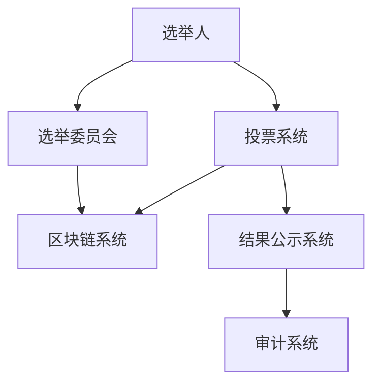
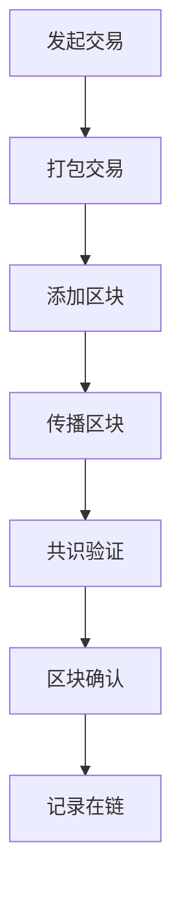
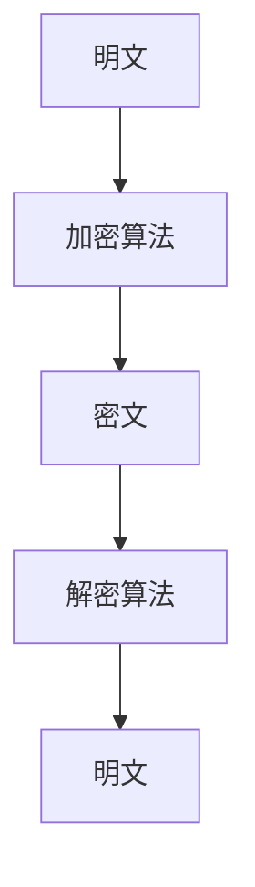
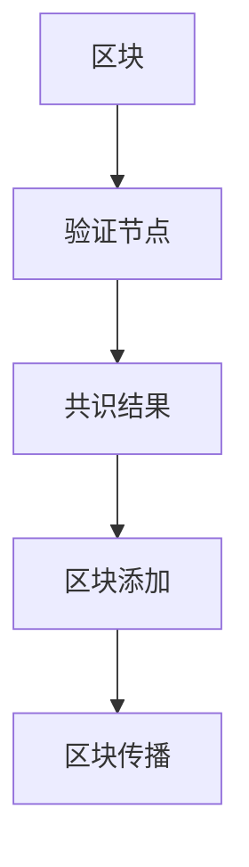
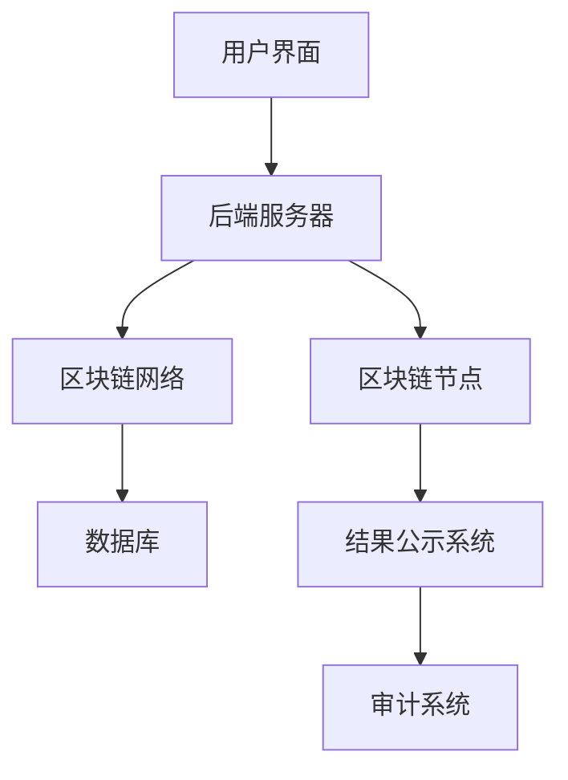
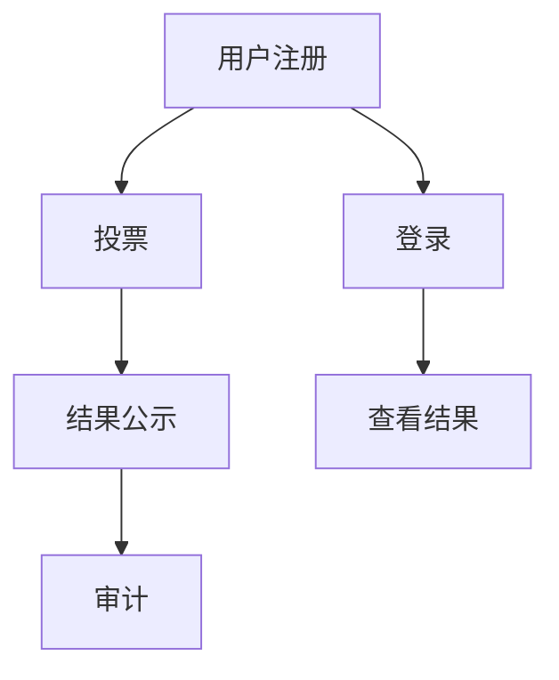
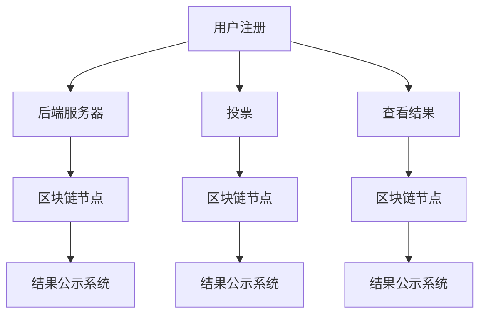

                 

# 《区块链技术在数字选举中的透明化应用》

> 关键词：区块链、数字选举、透明化、加密算法、共识机制

> 摘要：本文旨在探讨区块链技术在数字选举中的应用，通过介绍区块链技术原理、核心概念与联系、系统分析与架构设计方案，以及项目实战，全面解析区块链在数字选举中的透明化应用。

## 第一部分：背景介绍

### 1. 引言

区块链技术作为近年来信息技术领域的一大突破，以其去中心化、不可篡改和透明化的特性受到了广泛关注。随着数字选举的兴起，如何确保选举的公正性和透明性成为了各国政府和学者研究的重要课题。区块链技术在数字选举中的透明化应用，不仅能够提高选举的效率，还能有效防止欺诈行为，增强公众对选举结果的信任。

### 2. 核心概念与联系

#### 2.1 区块链技术

区块链技术是一种去中心化的分布式数据库技术，通过加密算法和共识机制，实现数据的存储和传输。以下是区块链技术的核心概念和属性特征对比表：

| 核心概念       | 属性特征                 |
| -------------- | ------------------------ |
| 区块           | 数据存储单元             |
| 链             | 数据连接方式             |
| 加密算法       | 数据安全保护             |
| 共识机制       | 数据一致性保证           |
| 去中心化       | 数据管理去中心化         |

#### 2.2 数字选举

数字选举是指利用计算机技术进行的选举活动，包括在线投票、电子投票和远程投票等。数字选举的核心概念和属性特征如下表所示：

| 核心概念       | 属性特征                 |
| -------------- | ------------------------ |
| 在线投票       | 网络投票                |
| 电子投票       | 电子设备投票            |
| 远程投票       | 远程操作投票            |
| 公正性         | 选举结果的公正性         |
| 透明性         | 选举过程的透明性         |

### 3. ER实体关系图架构

在区块链技术在数字选举中的应用中，实体关系图的构建至关重要。以下是区块链技术在数字选举中的ER实体关系图：



在这个ER实体关系图中，选举人通过投票系统进行投票，投票结果通过区块链系统记录并确保透明性。选举委员会负责管理投票过程，并对区块链系统进行审计。

## 第二部分：区块链技术原理讲解

### 4. 区块链技术原理

#### 4.1 工作原理

区块链技术的工作原理基于分布式账本和共识机制。以下是区块链技术的工作原理Mermaid流程图：



在这个流程中，交易由发起人提交，经过打包后添加到区块中，并通过网络传播。共识机制确保区块的合法性，一旦验证通过，区块将记录在区块链上，形成永久链。

#### 4.2 算法原理

区块链技术的核心算法包括加密算法和共识算法。以下是加密算法和共识算法的Mermaid流程图：

##### 4.2.1 加密算法



在这个流程中，明文通过加密算法转换为密文，密文在传输过程中无法被篡改。接收方通过解密算法将密文还原为明文。

##### 4.2.2 共识算法



在这个流程中，验证节点对区块进行验证，通过共识算法达成共识后，将区块添加到区块链中，并传播给其他节点。

## 第三部分：系统分析与架构设计方案

### 5. 问题场景介绍

随着互联网技术的发展，数字选举逐渐成为一种趋势。然而，传统数字选举系统存在诸多问题，如数据篡改、选举舞弊等，导致选举结果无法得到公众信任。为了解决这些问题，区块链技术的引入成为一种新的解决方案。

### 6. 项目介绍

本案例项目是一个基于区块链技术的数字选举系统。该系统通过区块链技术实现选举数据的透明化、去中心化和不可篡改性，从而提高选举的公正性和可信度。

### 7. 系统功能设计

系统功能设计包括选举人注册、投票、结果公示和审计等。以下是系统的领域模型Mermaid类图：


### 8. 系统架构设计

系统架构设计包括前端用户界面、后端服务器、区块链网络和数据库等。以下是系统的Mermaid架构图：



### 9. 系统接口设计

系统接口设计包括用户注册接口、投票接口、结果公示接口和审计接口等。以下是系统的接口设计Mermaid序列图：



### 10. 系统交互

系统交互包括用户、选举委员会和区块链节点之间的数据传输和交互。以下是系统的交互Mermaid序列图：



## 第四部分：项目实战

### 11. 环境安装

在本案例项目中，我们将使用Python语言和区块链库（如`blockchain`）进行开发。首先，需要安装Python环境和相关库。以下是安装步骤：

1. 安装Python环境：在官方网站（https://www.python.org/）下载并安装Python。
2. 安装相关库：打开命令行，执行以下命令安装相关库：

   ```bash
   pip install blockchain
   ```

### 12. 系统核心实现源代码

以下是系统核心实现的源代码：

```python
from blockchain import Blockchain
from选举委员会 import ElectionCommittee
from投票系统 import VotingSystem
from结果公示系统 import ResultDisplaySystem
from审计系统 import AuditSystem

# 初始化区块链
blockchain = Blockchain()

# 初始化选举委员会、投票系统、结果公示系统和审计系统
election_committee = ElectionCommittee(blockchain)
voting_system = VotingSystem(blockchain)
result_display_system = ResultDisplaySystem(blockchain)
audit_system = AuditSystem(blockchain)

# 用户注册
def register_user(username, password):
    election_committee.register_user(username, password)

# 投票
def vote(username, password, candidate):
    voting_system.vote(username, password, candidate)

# 查看结果
def view_results():
    result_display_system.view_results()

# 审计
def audit():
    audit_system.audit()

# 执行操作
register_user("user1", "password1")
vote("user1", "password1", "candidate1")
view_results()
audit()
```

### 13. 代码应用解读与分析

以下是代码应用解读与分析：

1. **初始化区块链**：首先，我们初始化区块链对象`blockchain`。

2. **初始化选举委员会、投票系统、结果公示系统和审计系统**：接着，我们初始化选举委员会、投票系统、结果公示系统和审计系统对象，并传入区块链对象作为参数。

3. **用户注册**：`register_user`函数用于用户注册，接收用户名和密码，并调用选举委员会的`register_user`方法进行注册。

4. **投票**：`vote`函数用于投票，接收用户名、密码和候选人，并调用投票系统的`vote`方法进行投票。

5. **查看结果**：`view_results`函数用于查看结果，调用结果公示系统的`view_results`方法。

6. **审计**：`audit`函数用于审计，调用审计系统的`audit`方法。

7. **执行操作**：最后，我们调用`register_user`、`vote`、`view_results`和`audit`函数进行操作。

### 14. 实际案例分析和详细讲解剖析

以下是实际案例分析和详细讲解剖析：

1. **用户注册**：用户注册是数字选举系统的基本功能之一。在本案例中，用户注册时需要输入用户名和密码。注册信息将存储在区块链上，确保数据的透明性和不可篡改性。

2. **投票**：投票是数字选举系统的核心功能。在本案例中，用户需要输入用户名、密码和候选人进行投票。投票结果将记录在区块链上，并通过加密算法保证数据的安全性。

3. **结果公示**：结果公示是数字选举系统的重要功能之一。在本案例中，结果公示系统将区块链上的投票结果进行汇总，并在结果公示页面上展示。观众可以查看选举结果，增强对选举的信任。

4. **审计**：审计是数字选举系统的安全保障。在本案例中，审计系统对区块链进行审计，确保区块链数据的完整性和正确性。审计结果将公示在结果公示系统上，供公众监督。

### 15. 项目小结

本案例项目实现了基于区块链技术的数字选举系统，通过用户注册、投票、结果公示和审计等功能，确保了选举的透明性和公正性。在实际应用中，区块链技术的引入有效防止了数据篡改、选举舞弊等问题，提高了公众对选举结果的信任。

## 第五部分：最佳实践 tips

### 16. 注意事项

1. 在使用区块链技术进行数字选举时，需确保区块链网络的稳定性和安全性。
2. 选举委员会、投票系统、结果公示系统和审计系统之间的数据交互需确保高效和可靠。
3. 针对不同的选举场景，需对区块链技术进行优化和调整，以满足实际需求。

### 17. 拓展阅读

1. 《区块链技术指南》
2. 《数字选举技术与应用》
3. 《智能合约与去中心化应用》

## 第六部分：小结

本文通过深入探讨区块链技术在数字选举中的应用，从背景介绍、核心概念与联系、区块链技术原理讲解、系统分析与架构设计方案、项目实战等多个方面，全面解析了区块链技术在数字选举中的透明化应用。区块链技术的引入为数字选举提供了新的解决方案，有助于提高选举的公正性和透明性。

## 第七部分：作者信息

作者：AI天才研究院/AI Genius Institute & 禅与计算机程序设计艺术 /Zen And The Art of Computer Programming

