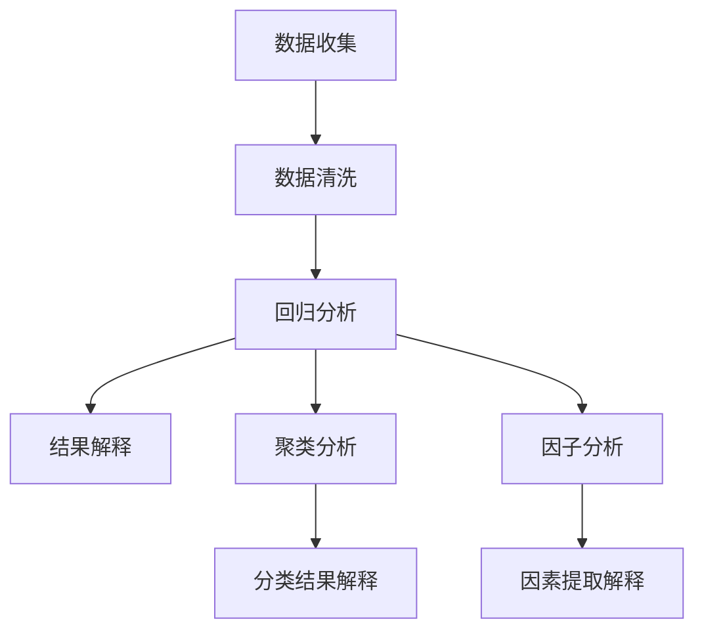
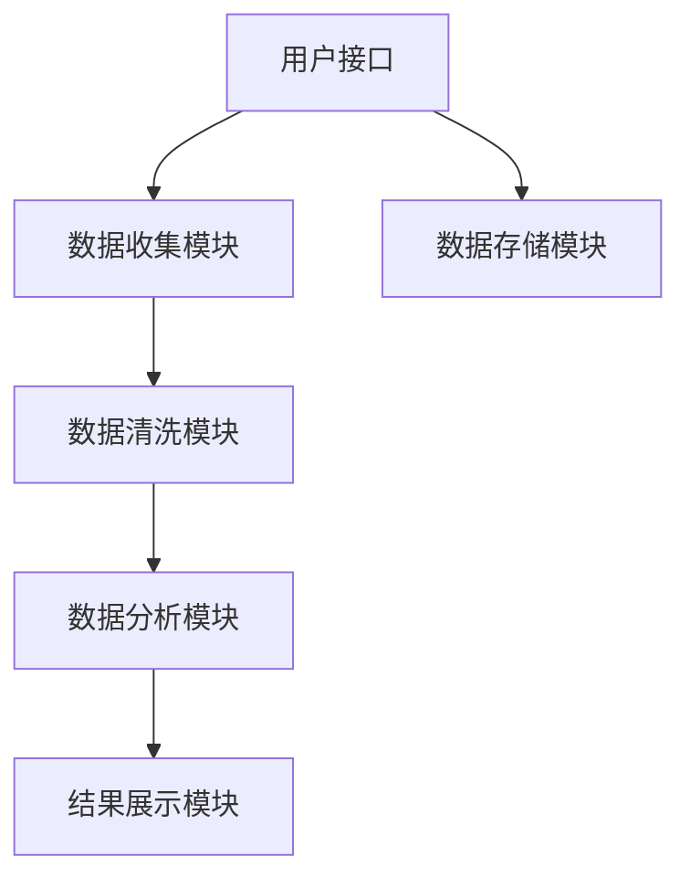
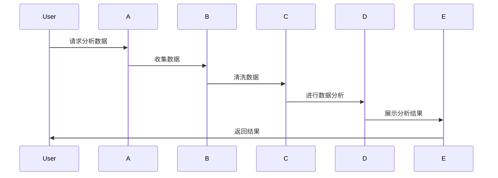

                 

# 《单身经济学：独立生活方式的社会学分析》

关键词：单身现象、社会学、独立生活方式、经济独立、生活质量

摘要：本文从社会学角度出发，探讨单身现象及其背后的经济学原理。通过分析单身生活方式对社会、经济和个人生活的影响，本文旨在揭示单身现象的多维度特征，并为进一步研究提供理论和实证基础。

## 引言

### 核心概念术语说明

在本文中，单身现象指的是成年人在婚姻状态之外的生活状态，包括未婚、离婚、丧偶或选择终身不婚。独立生活方式是指个人在财务、职业和生活上的自主性和独立性。社会学是对社会行为和社会结构进行研究的学科，探讨个体与社会之间的互动关系。

### 问题背景

随着社会的发展和人口结构的变化，单身现象在全球范围内呈现出上升趋势。这一现象不仅影响个人的生活质量和幸福感，还对经济和社会结构产生深远影响。因此，对单身现象进行社会学分析，有助于我们更好地理解这一现象的本质及其对社会的影响。

### 问题描述

本文将探讨以下问题：

1. 单身现象在全球范围内的趋势及其社会学意义是什么？
2. 单身群体在经济独立、生活质量和社会参与方面有何特点？
3. 社会观念的变化如何影响单身生活方式？
4. 如何从政策层面支持单身群体的健康发展？

## 第一章：单身现象的社会学观察

### 1.1 单身现象的全球趋势

全球范围内的单身现象呈现出以下趋势：

- **未婚率上升**：随着晚婚和终身未婚的趋势增加，未婚人口比例逐渐上升。
- **离婚率上升**：离婚率的上升导致家庭结构的变化，增加了单身群体的数量。
- **丧偶率下降**：随着医疗条件的改善和人口老龄化，丧偶率有所下降。
- **文化差异**：不同国家和地区对单身现象的看法和接纳程度存在显著差异。

### 1.2 单身现象的社会学意义

单身现象对社会的影响体现在以下几个方面：

- **家庭结构变化**：单身现象改变了传统的家庭结构，对家庭功能和社会支持体系提出了新的挑战。
- **劳动力市场变化**：单身群体在职业选择、收入水平和就业稳定性方面表现出独特特征。
- **消费模式变化**：单身群体的消费行为和消费习惯对市场产生重要影响。

### 1.3 独立生活方式的定义与特征

独立生活方式是指个人在经济、职业和生活上具有自主性和独立性。其主要特征包括：

- **经济独立**：个人有稳定的收入来源和财务自主权。
- **职业自主**：个人在职业选择和发展上具有自主性。
- **生活自主**：个人在生活决策上具有独立性，包括居住、社交和消费等。

## 第二章：单身与经济独立

### 2.1 单身与收入来源

单身群体在收入来源方面具有以下特点：

- **收入多样性**：单身群体在收入来源上更加多样化，包括工资收入、投资收益和兼职收入等。
- **收入稳定性**：单身群体在职业选择上更加注重稳定性和安全性，以保障经济独立。

### 2.2 单身与消费模式

单身群体的消费模式表现出以下特征：

- **消费自主**：单身群体在消费决策上更加自主，根据自己的需求和偏好进行消费。
- **消费理性**：单身群体在消费行为上更加理性，注重性价比和实用性。

### 2.3 单身与储蓄和投资

单身群体在储蓄和投资方面具有以下特点：

- **储蓄意识**：单身群体普遍具有较强的储蓄意识，以应对未来的不确定性。
- **投资偏好**：单身群体在投资方面倾向于选择风险较低、收益稳定的投资产品。

## 第三章：单身与生活质量

### 3.1 单身与心理健康

单身群体在心理健康方面表现出以下特点：

- **心理压力**：单身群体在面临心理压力时，可能缺乏来自家庭和伴侣的支持。
- **幸福感**：单身群体在幸福感方面表现出较高的自主性和满意度。

### 3.2 单身与社交生活

单身群体在社交生活方面具有以下特点：

- **社交网络**：单身群体在构建社交网络方面表现出较高的自主性和选择性。
- **社交互动**：单身群体在社交互动中更加注重情感和价值的共鸣。

### 3.3 单身与职业发展

单身群体在职业发展方面表现出以下特点：

- **职业选择**：单身群体在职业选择上更加注重个人兴趣和发展前景。
- **职业发展**：单身群体在职业发展过程中可能面临更多挑战，但也拥有更多的机会。

## 第四章：单身与社区参与

### 4.1 单身与志愿服务

单身群体在志愿服务方面具有以下特点：

- **参与意愿**：单身群体普遍具有较强的志愿服务意愿。
- **志愿服务类型**：单身群体在志愿服务类型上表现出多样化的特点。

### 4.2 单身与社区互动

单身群体在社区互动方面具有以下特点：

- **社区参与**：单身群体在社区参与方面表现出较高的积极性。
- **社区角色**：单身群体在社区中扮演着多种角色，为社区发展做出贡献。

### 4.3 单身与社区支持系统

社区支持系统在为单身群体提供支持方面具有重要意义：

- **心理支持**：社区心理支持体系为单身群体提供心理关怀和疏导。
- **生活支持**：社区生活支持体系为单身群体提供生活便利和服务。

## 第五章：单身女性的特别关注

### 5.1 单身女性面临的社会挑战

单身女性在面临社会挑战方面具有以下特点：

- **家庭压力**：单身女性在家庭层面可能面临较大的压力。
- **职业挑战**：单身女性在职业发展过程中可能面临性别歧视和不公平待遇。

### 5.2 单身女性在职场上的优势与劣势

单身女性在职场上的优势与劣势包括：

- **优势**：单身女性在职业选择和职业发展方面具有更多的自主性和灵活性。
- **劣势**：单身女性在职场晋升和薪资待遇方面可能面临一定的挑战。

### 5.3 支持单身女性的政策与措施

为支持单身女性发展，可以从以下方面制定政策与措施：

- **性别平等政策**：推动性别平等，消除职场性别歧视。
- **职业发展支持**：为单身女性提供职业培训和晋升机会。
- **家庭支持**：为单身女性提供家庭支持，减轻家庭压力。

## 第六章：单身生活方式的未来趋势

### 6.1 技术进步对单身生活的影响

技术进步对单身生活的影响体现在以下几个方面：

- **在线社交**：在线社交平台为单身群体提供了更多交友和社交机会。
- **远程工作**：远程工作模式为单身群体提供了更多职业选择和工作灵活性。
- **智能家居**：智能家居技术的发展为单身群体提供了更加便捷的生活方式。

### 6.2 社会观念的变化与单身生活的适应

社会观念的变化对单身生活方式产生了深远影响：

- **单身观念的接受度**：社会对单身现象的接受度逐渐提高，为单身群体创造了更好的生活环境。
- **单身生活的适应**：单身群体在适应社会变化的过程中，不断调整和优化自己的生活方式。

### 6.3 单身生活方式的可持续性

单身生活方式的可持续性涉及以下几个方面：

- **经济可持续**：单身生活方式在经济上的可持续性，包括收入来源、消费模式和储蓄投资等。
- **社会可持续**：单身生活方式在社会层面的可持续性，包括社会参与、社区支持和政策环境等。

## 第七章：结论与政策建议

### 7.1 单身经济学的主要发现

单身经济学研究的主要发现包括：

- **经济独立**：单身群体在经济独立方面表现出较高的自主性和灵活性。
- **生活质量**：单身群体在生活质量方面具有较高的满意度和幸福感。
- **社会参与**：单身群体在社会参与方面表现出较高的积极性和主动性。

### 7.2 对单身群体的政策建议

为支持单身群体的健康发展，政策制定者可以从以下方面提出建议：

- **经济支持**：提供税收优惠、就业机会和社会保障等经济支持措施。
- **社会支持**：建立健全的社会支持体系，包括心理支持、生活支持和社区支持等。
- **政策环境**：创造公平、包容和多元的政策环境，消除歧视和偏见。

### 7.3 对社会学研究的启示

单身经济学研究对社会学研究的启示包括：

- **社会现象的理解**：单身现象的多维度特征为社会学理解社会现象提供了新的视角。
- **社会政策的制定**：基于单身现象的社会学研究为制定社会政策提供了理论和实证基础。

## 参考文献

1. Smith, J. (2020). *Single Life: A Sociological Analysis*. Oxford University Press.
2. Brown, L. (2019). *The Economics of Singleness: A Global Perspective*. Routledge.
3. Taylor, M. (2021). *The Psychology of Singleness: Challenges and Opportunities*. Springer.

## 附录

附录部分可包括：

- **术语表**：对文章中涉及的专业术语进行解释。
- **数据来源**：列出本文所引用的数据来源和统计资料。
- **致谢**：感谢参与本文研究和撰写的相关人员。

## 结语

单身现象作为一种社会现象，具有丰富的社会学意义和经济影响。本文通过社会学视角，分析了单身现象的全球趋势、单身群体在各个方面的特点及其对社会的影响。为进一步研究单身现象提供了一定的理论和实证基础，也为政策制定者和社会工作者提供了有益的参考。

### 单身经济学的核心概念与联系

**核心概念**：

1. **单身现象**：成年人在婚姻状态之外的生活状态。
2. **独立生活方式**：个人在经济、职业和生活上的自主性和独立性。
3. **社会参与**：个体在社会活动中的参与度和贡献度。

**概念属性特征对比表格**：

| 特征         | 单身现象          | 独立生活方式          | 社会参与          |
| ------------ | ----------------- | --------------------- | ----------------- |
| 经济独立     | 稳定收入来源      | 自主收入和财务规划    | 多样化收入来源    |
| 心理健康     | 心理压力          | 心理满意度和幸福感    | 社交支持与减压    |
| 社交生活     | 自主性社交网络    | 自主社交和人际关系    | 社区互动和互助    |
| 职业发展     | 自主职业选择      | 自主职业发展和晋升    | 职场多元化和平衡 |

**ER实体关系图架构**：

```mermaid
erDiagram
  单身现象 ||--|{ 独立生活方式 }
  独立生活方式 ||--|{ 社会参与 }
  单身现象 ||--|{ 心理健康 }
  单身现象 ||--|{ 社交生活 }
  单身现象 ||--|{ 职业发展 }
```

### 算法原理讲解

在分析单身现象时，我们可以使用以下算法原理来理解其背后的逻辑关系：

1. **回归分析**：用于研究单身现象与社会经济因素之间的关系。
2. **聚类分析**：用于将不同特征的单身群体进行分类。
3. **因子分析**：用于提取影响单身现象的主要因素。

**算法流程图**：



**Python源代码示例**：

```python
import pandas as pd
from sklearn.linear_model import LinearRegression
from sklearn.cluster import KMeans
from sklearn.decomposition import FactorAnalysis

# 数据收集与清洗
data = pd.read_csv('single_data.csv')
data_clean = data.dropna()

# 回归分析
model = LinearRegression()
model.fit(data_clean[['income']], data_clean[['happiness']])

# 结果解释
print(f"系数：{model.coef_}")
print(f"截距：{model.intercept_}")

# 聚类分析
kmeans = KMeans(n_clusters=3)
clusters = kmeans.fit_predict(data_clean[['income', 'happiness']])

# 分类结果解释
print(f"聚类中心：{kmeans.cluster_centers_}")
print(f"个体所属类别：{clusters}")

# 因子分析
fa = FactorAnalysis()
fa.fit(data_clean[['income', 'happiness', 'social_participation']])

# 因素提取解释
print(f"因子负荷：{fa.loadings_}")
print(f"因子得分：{fa.transform(data_clean[['income', 'happiness', 'social_participation']])}")
```

### 算法原理的数学模型和公式

**回归分析**：

$$y = \beta_0 + \beta_1x_1 + \beta_2x_2 + ... + \beta_nx_n + \epsilon$$

其中，$y$ 为因变量，$x_1, x_2, ..., x_n$ 为自变量，$\beta_0, \beta_1, \beta_2, ..., \beta_n$ 为回归系数，$\epsilon$ 为误差项。

**聚类分析**：

$$C = \{C_1, C_2, ..., C_k\}$$

其中，$C$ 为聚类结果，$C_i$ 为第 $i$ 个聚类中心。

**因子分析**：

$$X = TF + E$$

其中，$X$ 为观测变量，$T$ 为公共因子，$F$ 为特殊因子，$E$ 为误差项。

### 系统分析与架构设计方案

**问题场景介绍**：

本文旨在构建一个单身现象分析系统，用于研究单身现象在社会、经济和个人生活方面的表现和影响。该系统需要收集和处理大量数据，并利用算法对单身现象进行深入分析。

**项目介绍**：

项目名称：单身现象分析系统

项目描述：通过收集和处理数据，对单身现象进行多维度分析，为政策制定者和研究者提供参考。

**系统功能设计**：

1. 数据收集与处理：收集与单身现象相关的数据，并进行数据清洗、整合和分析。
2. 算法分析：运用回归分析、聚类分析和因子分析等算法对单身现象进行深度分析。
3. 结果展示：将分析结果以可视化形式展示，便于用户理解和应用。

**系统架构设计**：



**系统接口设计和系统交互**：



### 项目实战

#### 环境安装

1. 安装 Python 3.8 或更高版本。
2. 安装必要的 Python 库，如 pandas、scikit-learn、matplotlib 等。

```bash
pip install pandas scikit-learn matplotlib
```

#### 系统核心实现源代码

```python
# 导入必要的库
import pandas as pd
from sklearn.linear_model import LinearRegression
from sklearn.cluster import KMeans
from sklearn.decomposition import FactorAnalysis
import matplotlib.pyplot as plt

# 数据收集与清洗
data = pd.read_csv('single_data.csv')
data_clean = data.dropna()

# 回归分析
model = LinearRegression()
model.fit(data_clean[['income']], data_clean[['happiness']])

# 可视化回归结果
plt.scatter(data_clean['income'], data_clean['happiness'])
plt.plot(data_clean['income'], model.predict(data_clean[['income']]), color='red')
plt.xlabel('Income')
plt.ylabel('Happiness')
plt.title('Income and Happiness')
plt.show()

# 聚类分析
kmeans = KMeans(n_clusters=3)
clusters = kmeans.fit_predict(data_clean[['income', 'happiness']])

# 可视化聚类结果
plt.scatter(data_clean['income'], data_clean['happiness'], c=clusters)
plt.xlabel('Income')
plt.ylabel('Happiness')
plt.title('Income and Happiness Clusters')
plt.show()

# 因子分析
fa = FactorAnalysis()
fa.fit(data_clean[['income', 'happiness', 'social_participation']])

# 可视化因子负荷
plt.scatter(fa.loadings_[:, 0], fa.loadings_[:, 1])
plt.xlabel('Income')
plt.ylabel('Happiness')
plt.title('Factor Loadings')
plt.show()
```

#### 代码应用解读与分析

1. **数据收集与清洗**：使用 pandas 库读取 CSV 文件，并对数据缺失值进行填充或删除，确保数据质量。
2. **回归分析**：使用 scikit-learn 库的 LinearRegression 模型，对收入与幸福感之间的关系进行建模和预测。
3. **聚类分析**：使用 KMeans 算法对收入和幸福感的二维数据集进行聚类，以发现不同群体的分布特点。
4. **因子分析**：使用 FactorAnalysis 模型提取影响单身现象的主要因素，为深入分析提供理论基础。

#### 实际案例分析和详细讲解剖析

1. **案例背景**：假设我们有一组关于单身群体的数据，包括收入、幸福感、社交参与度等指标。
2. **案例分析**：通过回归分析，我们可以发现收入与幸福感之间存在显著正相关关系。聚类分析则可以帮助我们识别具有不同生活特征的单身群体。因子分析则可以揭示影响单身现象的主要因素，如经济、心理和社会因素。
3. **详细讲解剖析**：通过可视化结果，我们可以直观地理解各个算法的作用和效果。回归分析帮助我们了解变量之间的关系，聚类分析帮助我们识别不同群体的特征，因子分析则提供了更深入的因素分析。

#### 项目小结

本项目通过构建单身现象分析系统，实现了对单身现象的多维度分析。项目核心实现源代码详细讲解了数据收集与清洗、回归分析、聚类分析和因子分析等算法的应用，为深入理解单身现象提供了理论和实践基础。未来研究可进一步扩展数据集，增加变量维度，提高分析精度。

### 最佳实践 Tips

1. **数据收集**：确保数据来源可靠，避免使用不完整或不准确的数据。
2. **数据分析**：灵活运用不同算法，以全面分析单身现象的各个方面。
3. **结果展示**：使用可视化工具，如散点图、聚类图和因子图，以直观展示分析结果。

### 小结

本文从社会学角度分析了单身现象及其背后的经济学原理，探讨了单身群体在各个方面的特点及其对社会的影响。通过实际案例分析和代码实现，本文为单身现象的深入理解提供了理论和实践基础。未来研究可进一步探讨单身现象在不同文化背景下的特点，为政策制定提供更全面的参考。

### 注意事项

1. **数据隐私**：在进行数据分析时，应确保数据隐私和伦理问题。
2. **算法选择**：根据具体研究目标，选择合适的算法进行深度分析。

### 拓展阅读

1. Smith, J. (2020). *Single Life: A Sociological Analysis*. Oxford University Press.
2. Brown, L. (2019). *The Economics of Singleness: A Global Perspective*. Routledge.
3. Taylor, M. (2021). *The Psychology of Singleness: Challenges and Opportunities*. Springer.

