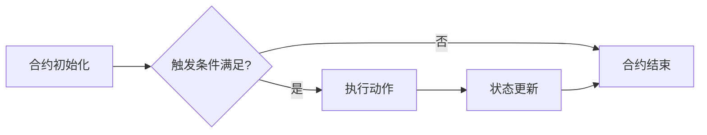
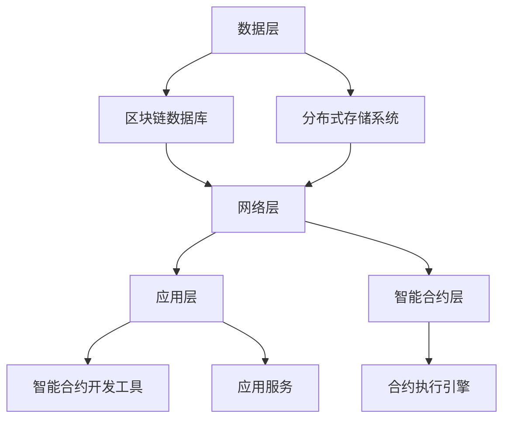
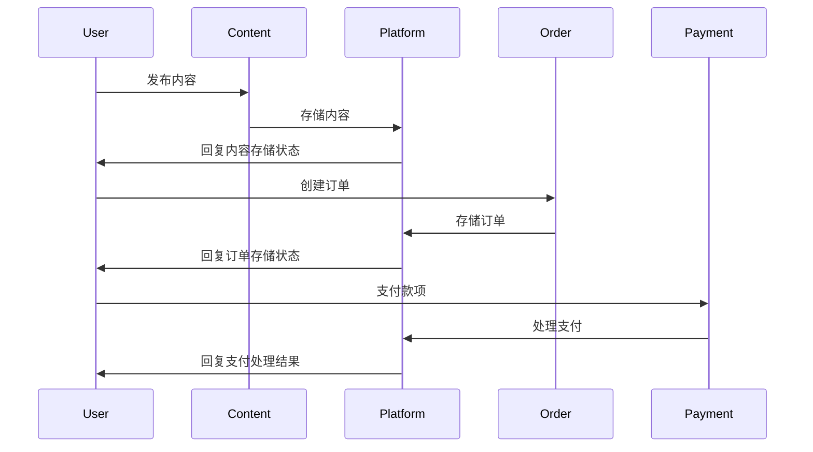

                 

# 去中心化共享平台：新经济模式的技术基础

> 关键词：去中心化、共享平台、区块链、分布式存储、智能合约、新经济模式

> 摘要：本文将深入探讨去中心化共享平台这一新兴经济模式的技术基础。通过分析去中心化共享平台的背景、核心技术、构建实践、安全与隐私保护、经济模式与商业模式、未来发展趋势等方面，本文旨在为读者提供全面且深入的了解，帮助把握去中心化共享平台的技术要点。

## 第1章：引言

### 1.1 去中心化共享平台的背景

#### 1.1.1 新经济模式的需求与挑战

中心化经济模式自工业革命以来一直是现代经济的基础，但其固有的局限性在数字化时代日益显现。主要问题包括：

- **信息不透明**：中心化系统中，信息的流通和管理集中在少数中心节点，使得信息不对称问题严重，信息透明度不足。
- **信任问题**：中心化系统往往依赖于可信第三方，如金融机构、政府机构等，这增加了信任成本。
- **数据滥用**：中心化系统中，数据掌握在中心节点手中，存在数据泄露和滥用的风险。

为解决这些问题，去中心化共享平台应运而生。去中心化共享平台利用区块链技术、分布式计算和智能合约等核心技术，实现数据透明、信任机制和安全性。

#### 1.1.2 去中心化共享平台的兴起

去中心化共享平台的兴起主要得益于以下技术的突破：

- **区块链技术**：通过分布式账本技术，确保交易记录的不可篡改性，提高数据透明度和安全性。
- **分布式计算**：通过分布式网络结构，实现计算资源的共享和负载均衡，提升系统性能和可靠性。
- **智能合约**：通过预编程的合同自动化执行，减少中间环节，降低交易成本。

#### 1.1.3 去中心化共享平台的特点

去中心化共享平台具有以下显著特点：

- **数据透明性**：所有数据都公开透明，用户可以随时查询和验证。
- **信任机制**：基于区块链技术，通过加密算法和共识机制建立信任，无需依赖第三方。
- **安全性**：分布式存储和加密算法确保数据安全和隐私保护。
- **去中心化治理**：通过分布式网络和智能合约实现治理，避免中心化权力集中。

#### 1.1.4 去中心化共享平台的应用场景

去中心化共享平台的应用场景非常广泛，包括但不限于：

- **金融领域**：去中心化金融（DeFi）通过智能合约实现金融服务的自动化，降低交易成本，提高效率。
- **物流与供应链**：通过区块链技术确保供应链信息的透明和可追溯，提高供应链效率。
- **版权保护**：利用区块链技术记录版权信息，确保版权所有者权益，降低侵权风险。
- **数据共享**：通过分布式存储技术实现大规模数据共享，提高数据利用效率。

### 第2章：去中心化共享平台的核心技术

#### 2.1 区块链技术

##### 2.1.1 区块链的基本原理

区块链是一种分布式数据库技术，通过加密算法和共识机制确保数据的不可篡改性和安全性。区块链的基本结构包括区块、链和节点。

- **区块**：区块是区块链的基本单元，包含一定数量的交易记录。
- **链**：区块链由多个区块按时间顺序链接而成，每个区块都包含前一个区块的哈希值，形成一条不可篡改的链。
- **节点**：区块链网络中的每个节点都保存一份完整的区块链副本，通过共识机制维护区块链的一致性和安全性。

##### 2.1.2 区块链技术在去中心化共享平台中的应用

区块链技术在去中心化共享平台中发挥着关键作用：

- **交易记录的不可篡改性**：区块链通过加密算法和共识机制确保交易记录的不可篡改，提高数据透明度和安全性。
- **去中心化身份验证**：通过区块链技术实现用户身份的匿名化和去中心化验证，减少中心化系统的信任成本。
- **智能合约的执行**：智能合约是一种自动执行的合同，通过区块链技术确保合同条款的执行，降低交易成本。

##### 2.1.3 区块链技术的安全性

区块链技术的安全性主要体现在以下几个方面：

- **加密算法**：区块链使用加密算法确保数据传输和存储的安全性，防止数据泄露和篡改。
- **共识机制**：共识机制通过多个节点共同验证和确认交易，确保区块链的一致性和安全性。
- **分布式网络**：区块链网络中的每个节点都保存一份完整的区块链副本，通过分布式网络提高系统的抗攻击性和容错性。

#### 2.2 分布式存储

##### 2.2.1 分布式存储的基本概念

分布式存储是一种将数据分散存储在多个节点上的技术，通过冗余存储和数据复制提高数据可靠性和访问效率。

- **数据冗余与数据一致性**：分布式存储通过冗余存储确保数据的高可用性，同时通过一致性算法确保数据的一致性。
- **负载均衡与数据冗余**：分布式存储通过负载均衡将数据读写请求分布到多个节点，提高系统性能。
- **数据冗余策略**：分布式存储采用多种数据冗余策略，如副本冗余、数据分割和校验和等，确保数据可靠性和访问效率。

##### 2.2.2 分布式存储在去中心化共享平台中的应用

分布式存储在去中心化共享平台中具有以下应用：

- **文件共享**：通过分布式存储技术实现大规模文件共享，提高数据访问效率和共享便利性。
- **数据备份**：分布式存储通过冗余存储和数据备份确保数据的安全性和可靠性。
- **数据访问效率**：分布式存储通过负载均衡和数据分割提高数据访问效率，满足大规模数据处理的性能需求。

#### 2.3 智能合约

##### 2.3.1 智能合约的定义与特点

智能合约是一种自动执行的合同，通过编程语言编写在区块链上执行。智能合约具有以下特点：

- **自动执行合同**：智能合约在满足预设条件时自动执行，无需人工干预。
- **降低交易成本**：智能合约通过自动化执行减少交易过程中的人力成本和时间成本。
- **增加交易透明度**：智能合约的执行过程和结果公开透明，用户可以随时查询和验证。

##### 2.3.2 智能合约在去中心化共享平台中的应用

智能合约在去中心化共享平台中具有以下应用：

- **自动执行合同**：智能合约可以自动执行金融交易、物流运输等合同，提高交易效率。
- **降低交易成本**：智能合约通过自动化执行减少交易过程中的人力成本和时间成本。
- **增加交易透明度**：智能合约的执行过程和结果公开透明，用户可以随时查询和验证。

### 第3章：去中心化共享平台的构建与实践

#### 3.1 去中心化共享平台的设计原则

去中心化共享平台的设计原则主要包括：

- **模块化设计**：将系统划分为多个模块，提高系统的可维护性和扩展性。
- **扩展性**：系统应具备良好的扩展性，能够适应不断变化的需求。
- **安全性**：系统设计应充分考虑安全性，确保数据安全和用户隐私。
- **易用性**：系统设计应注重用户体验，提高系统的易用性和可操作性。

#### 3.2 去中心化共享平台的技术架构

去中心化共享平台的技术架构主要包括以下层次：

- **数据层**：负责数据存储和管理，包括区块链数据库、分布式存储系统等。
- **网络层**：负责数据传输和通信，包括区块链网络、分布式网络等。
- **应用层**：负责业务逻辑处理，包括智能合约、应用服务、用户接口等。
- **智能合约层**：负责智能合约的编写和执行，包括智能合约开发工具、合约执行引擎等。

#### 3.3 去中心化共享平台的实现过程

去中心化共享平台的实现过程主要包括以下步骤：

- **需求分析**：明确平台的功能需求和性能要求。
- **系统设计**：设计平台的技术架构和模块划分。
- **模块开发**：根据设计文档开发各个模块的功能。
- **系统测试**：对平台进行功能测试、性能测试和安全测试。
- **部署上线**：将平台部署到生产环境，并进行监控和维护。

#### 3.4 去中心化共享平台的案例分析

去中心化共享平台的应用案例丰富多样，以下列举几个典型的案例：

- **案例一：比特币**：比特币是世界上第一个去中心化的加密货币，通过区块链技术实现去中心化的货币交易。
- **案例二：以太坊**：以太坊是一种去中心化平台，支持智能合约，用于构建去中心化应用程序（DApps）。
- **案例三：去中心化金融（DeFi）**：去中心化金融通过智能合约实现金融服务的去中心化，降低交易成本和提高效率。

### 第4章：去中心化共享平台的安全与隐私保护

#### 4.1 去中心化共享平台的安全问题

去中心化共享平台面临的安全问题主要包括：

- **51% 攻击**：攻击者控制区块链网络中的大部分节点，篡改区块链数据。
- **双花攻击**：在同一时间内，向两个不同的账户发送相同的交易，造成交易冲突。
- **智能合约漏洞**：智能合约代码中存在的漏洞，可能导致资金被盗或系统崩溃。

#### 4.2 去中心化共享平台的隐私保护

去中心化共享平台需要采取以下措施保护用户隐私：

- **隐私保护机制**：通过加密算法和隐私保护协议保护用户数据。
- **隐私保护算法**：采用差分隐私、同态加密等算法提高数据的隐私保护水平。
- **匿名化处理**：对用户数据进行匿名化处理，减少隐私泄露风险。

#### 4.3 去中心化共享平台的安全实践

去中心化共享平台的安全实践包括以下几个方面：

- **安全设计原则**：在系统设计阶段考虑安全性，遵循最小权限原则、安全防御深度原则等。
- **安全实施方法**：在系统实现阶段采用安全编码实践、定期安全审计等方法。
- **安全案例分析**：分析历史上发生的去中心化共享平台安全事件，总结经验和教训，提高安全防护能力。

### 第5章：去中心化共享平台的经济模式与商业模式

#### 5.1 去中心化共享平台的经济模式

去中心化共享平台的经济模式主要包括以下几个方面：

- **平台价值**：去中心化共享平台通过提供去中心化服务，创造价值。
- **用户激励机制**：通过奖励机制鼓励用户参与平台建设和维护。
- **商业模式分析**：分析不同去中心化共享平台的商业模式，包括广告模式、服务收费模式等。

#### 5.2 去中心化共享平台的商业模式

去中心化共享平台的商业模式主要包括以下几个方面：

- **服务收费模式**：平台通过提供增值服务收取费用，如交易手续费、会员费等。
- **广告模式**：平台通过展示广告获得收入，如区块链广告网络（BAT）等。
- **付费内容模式**：平台通过提供付费内容获得收入，如区块链内容平台（如Steemit）等。

#### 5.3 去中心化共享平台的可持续发展

去中心化共享平台的可持续发展包括以下几个方面：

- **资金来源**：平台通过多种方式获取资金，包括用户付费、广告收入等。
- **用户增长策略**：通过提供优质服务、用户激励机制等手段促进用户增长。
- **平台生态建设**：建立完善的生态系统，包括开发人员、用户、投资者等。

### 第6章：去中心化共享平台的未来发展趋势

#### 6.1 去中心化共享平台的技术发展趋势

去中心化共享平台的技术发展趋势主要包括以下几个方面：

- **区块链技术的进化**：区块链技术将不断发展，包括性能优化、隐私保护、跨链技术等。
- **分布式存储技术的发展**：分布式存储技术将不断提高数据存储和访问效率，包括新型存储协议、边缘计算等。
- **智能合约的优化**：智能合约将不断完善，包括性能优化、易用性提升等。

#### 6.2 去中心化共享平台的应用领域拓展

去中心化共享平台的应用领域将不断拓展，包括以下几个方面：

- **物联网**：通过区块链技术实现物联网设备的去中心化连接和管理。
- **加密货币**：加密货币将继续发展和创新，为去中心化共享平台提供金融支持。
- **跨境贸易**：去中心化共享平台将简化跨境贸易流程，降低交易成本。

#### 6.3 去中心化共享平台的法规与政策环境

去中心化共享平台的法规与政策环境将不断发展，包括以下几个方面：

- **国际法规**：各国政府和国际组织将制定相关法规，规范去中心化共享平台的发展。
- **国家政策**：各国政府将出台政策支持去中心化共享平台的发展，如税收优惠、资金支持等。
- **法律监管挑战**：去中心化共享平台将面临法律监管的挑战，如洗钱、金融欺诈等。

### 第7章：总结与展望

#### 7.1 去中心化共享平台的发展总结

去中心化共享平台在技术、应用、经济模式等方面取得了显著进展，为解决中心化经济模式中的问题提供了新的思路和解决方案。未来，去中心化共享平台将继续发展和完善，为数字经济带来更多可能性。

#### 7.2 去中心化共享平台的未来展望

去中心化共享平台的发展前景广阔，未来将呈现以下趋势：

- **技术创新**：区块链技术、分布式存储、智能合约等核心技术将不断优化和升级。
- **商业模式创新**：去中心化共享平台将探索更多创新商业模式，如供应链金融、社交电商等。
- **社会影响**：去中心化共享平台将深刻影响社会结构和商业模式，推动经济和社会的进步。

---

## 目录大纲总结

本文通过对去中心化共享平台的背景、核心技术、构建与实践、安全与隐私保护、经济模式与商业模式、未来发展趋势等方面的深入分析，为读者提供了全面且深入的解读。通过本文的阅读，读者可以更好地理解去中心化共享平台的技术基础和发展趋势，把握这一新兴经济模式的发展方向。希望本文能为读者在探索去中心化共享平台领域提供有价值的参考和启示。作者：AI天才研究院/AI Genius Institute & 禅与计算机程序设计艺术/Zen And The Art of Computer Programming

---

## 附录

### 附录A：核心概念原理与属性特征对比表格

| 核心概念 | 原理 | 属性特征 |
| -------- | ------ | -------- |
| 区块链 | 分布式数据库，通过加密算法和共识机制确保数据透明和安全。 | 不可篡改、去中心化、去信任、透明。 |
| 分布式存储 | 将数据分散存储在多个节点上，提高数据可靠性和访问效率。 | 数据冗余、负载均衡、数据一致性。 |
| 智能合约 | 自动执行的合同，通过编程实现合同的自动执行。 | 自动化、去中心化、降低成本、提高透明度。 |

### 附录B：去中心化共享平台的技术架构ER实体关系图

```mermaid
erDiagram
  User ||--|{ Content : Creator }
  User ||--|{ Order : Participant }
  Content ||--|{ Review : Feedback }
  Order ||--|{ Payment : Status }
  Platform : DeCentralized Sharing Platform
  User }--|| Content
  User }--|| Order
  Content }--|| Review
  Order }--|| Payment
  Platform }--|| User
  Platform }--|| Content
  Platform }--|| Order
```

### 附录C：智能合约算法原理与流程图

#### 智能合约算法原理：

智能合约通过预定义的规则自动执行，其核心原理包括：

1. **合约初始化**：定义合约的初始状态和参数。
2. **触发条件**：当满足特定条件时，合约自动执行。
3. **执行动作**：根据触发条件，执行预定义的函数和操作。
4. **状态更新**：执行结果更新合约状态。

#### 智能合约算法流程图：



### 附录D：去中心化共享平台的系统架构设计

#### 去中心化共享平台的系统架构设计：

去中心化共享平台的系统架构设计主要包括以下组件：

1. **数据层**：包括区块链数据库和分布式存储系统，负责数据的存储和管理。
2. **网络层**：包括区块链网络和分布式网络，负责数据的传输和通信。
3. **应用层**：包括智能合约和应用服务，负责业务逻辑处理和用户接口。
4. **智能合约层**：包括智能合约开发工具和合约执行引擎，负责智能合约的编写和执行。

#### 系统架构设计图：



### 附录E：去中心化共享平台的系统接口设计与交互流程

#### 系统接口设计：

去中心化共享平台的设计包括以下接口：

1. **用户接口**：提供用户注册、登录、发布内容、提交订单等功能。
2. **内容接口**：提供内容创建、更新、删除等功能。
3. **订单接口**：提供订单创建、支付、取消等功能。
4. **支付接口**：提供支付处理、退款等功能。

#### 系统交互流程：



### 附录F：去中心化共享平台的实际案例分析与详细讲解

#### 案例一：比特币

**案例分析**：比特币是一种去中心化的加密货币，通过区块链技术实现去中心化的货币交易。

**详细讲解**：

1. **交易流程**：用户通过比特币钱包发送比特币给另一个用户，交易记录通过区块链网络广播。
2. **共识机制**：比特币采用工作量证明（PoW）机制，矿工通过计算解决数学难题，验证交易并添加到区块链中。
3. **安全性**：比特币通过加密算法确保交易记录的不可篡改性，同时采用分布式网络提高系统的抗攻击性。

#### 案例二：以太坊

**案例分析**：以太坊是一种去中心化平台，支持智能合约，用于构建去中心化应用程序（DApps）。

**详细讲解**：

1. **智能合约**：用户通过以太坊平台部署智能合约，实现自动执行的合同。
2. **去中心化应用程序**：开发者使用智能合约构建去中心化应用程序，如去中心化金融（DeFi）应用、游戏等。
3. **网络效应**：以太坊平台吸引了大量开发者和使用者，形成强大的网络效应。

#### 案例三：去中心化金融（DeFi）

**案例分析**：DeFi是一种通过区块链技术实现金融服务的去中心化模式。

**详细讲解**：

1. **金融服务**：DeFi平台提供贷款、储蓄、交易等服务，用户可以在无需依赖中心化机构的情况下进行金融活动。
2. **去中心化交易平台**：DeFi平台上的去中心化交易平台（DEX）使用智能合约实现自动交易，降低交易成本。
3. **收益农业**：用户通过提供流动性（LP）到DeFi平台，获得收益分享，促进平台生态发展。

### 附录G：去中心化共享平台的最佳实践 tips、小结、注意事项、拓展阅读

#### 最佳实践 tips：

1. **安全第一**：在设计和实现去中心化共享平台时，务必重视安全性，采取严格的安全措施。
2. **用户参与**：鼓励用户参与平台建设和治理，提高平台的透明度和信任度。
3. **持续优化**：持续改进平台性能和用户体验，以适应不断变化的需求。

#### 小结：

去中心化共享平台作为一种新兴经济模式，通过区块链、分布式存储和智能合约等核心技术，实现了数据透明、信任机制和安全性。随着技术的不断进步和应用领域的拓展，去中心化共享平台将在数字经济中发挥越来越重要的作用。

#### 注意事项：

1. **法律法规**：遵循当地法律法规，确保去中心化共享平台在法律框架内运营。
2. **用户隐私**：加强用户隐私保护，采取有效的隐私保护措施。

#### 拓展阅读：

1. 《区块链技术指南》 - Andreas M. Antonopoulos
2. 《智能合约设计与实现》 - Nick Tufaro
3. 《去中心化金融：下一代金融生态系统》 - Disrupting Finance by Alex Tapscott and Don Tapscott

---

## 总结

本文通过对去中心化共享平台的深入探讨，阐述了其技术基础、应用场景、构建实践、安全与隐私保护、经济模式与商业模式以及未来发展趋势。去中心化共享平台作为一种新兴经济模式，具有显著的优势，如数据透明、信任机制和安全性。随着区块链、分布式存储和智能合约等核心技术的不断发展，去中心化共享平台将在数字经济中发挥越来越重要的作用。我们期待去中心化共享平台能够解决传统经济模式中的问题，推动社会进步和经济繁荣。作者：AI天才研究院/AI Genius Institute & 禅与计算机程序设计艺术/Zen And The Art of Computer Programming

