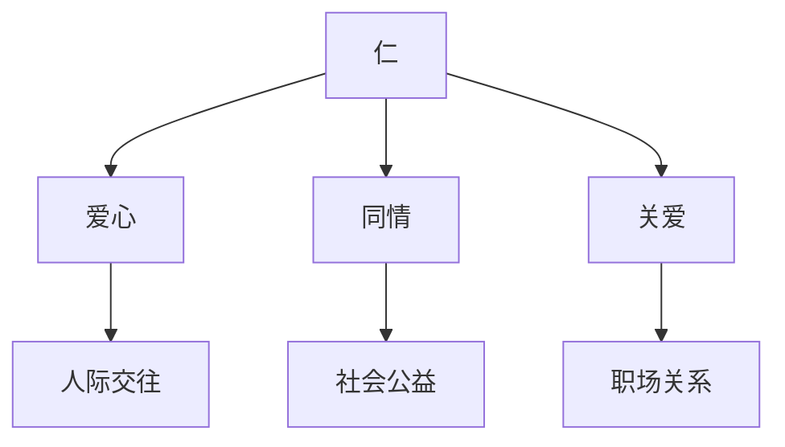
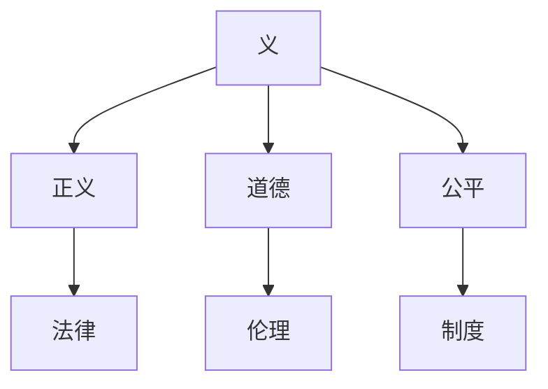
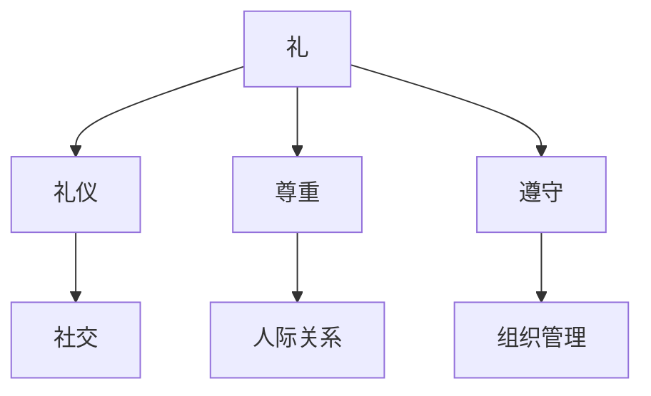
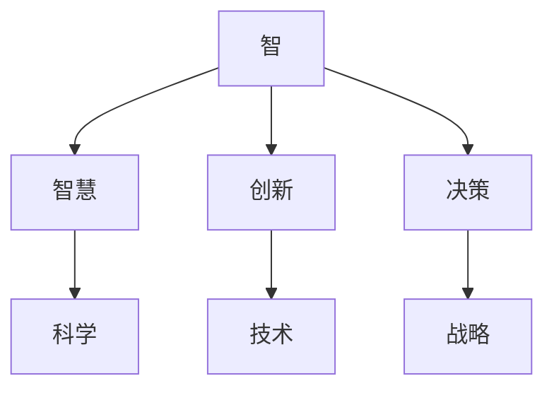
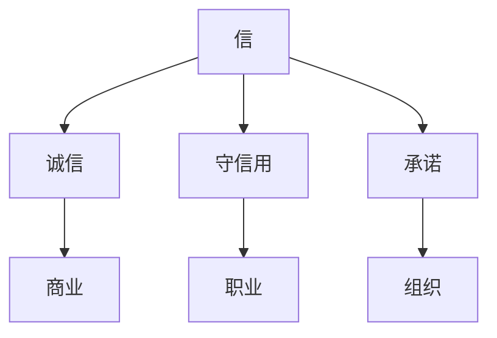
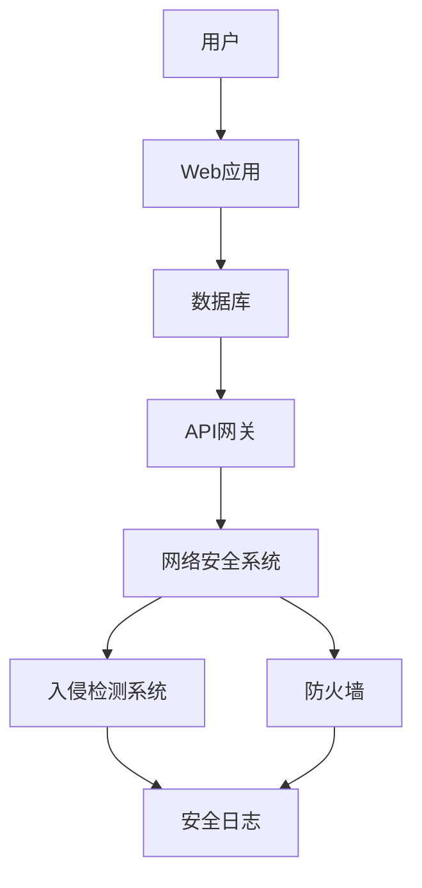
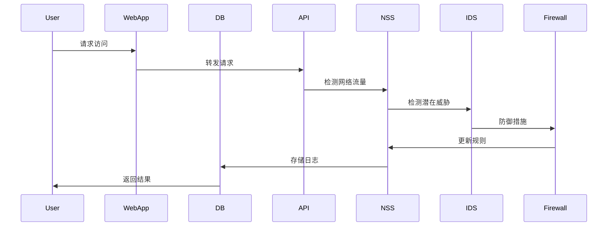

                 

### 古今智慧的对话：传统思想在现代生活中的应用

#### 关键词：古今智慧、传统思想、现代生活、应用、心理学、哲学

> 摘要：本文深入探讨了传统思想在现代生活中的重要性和实际应用。通过对仁、义、礼、智、信等核心概念的解析，我们揭示了这些古老智慧如何影响我们的教育、工作、社交和心理状态。本文旨在为读者提供一种新的视角，以帮助他们在现代快节奏的生活中找到平衡和幸福。

---

## 引言

在科技飞速发展的今天，现代人面临着前所未有的挑战。快节奏的生活、竞争激烈的职场、复杂的人际关系，使得许多人感到压力和困惑。在这种情况下，传统思想提供了一种宝贵的指导，帮助我们在现代生活中寻找方向和平衡。本文将探讨古今智慧的对话，探讨传统思想在现代生活中的应用。

### 设计思路

为了全面探讨这一主题，本文将采用以下设计思路：

1. **引言**：介绍古今智慧对话的背景和重要性。
2. **核心概念解析**：详细解析仁、义、礼、智、信等传统思想的核心概念。
3. **现代生活应用**：探讨这些传统思想在家庭、职业、社交和心理领域的应用。
4. **数学模型与应用**：介绍传统思想在数学和信息技术中的应用。
5. **信息技术应用**：探讨传统思想在网络安全、软件工程和人工智能中的应用。
6. **商业融合**：探讨传统思想在现代商业中的应用。
7. **教育传承**：探讨传统思想在现代教育中的传承与传播。
8. **挑战与未来**：探讨传统思想对话的挑战和未来趋势。

### 目录大纲设计

以下是根据上述设计思路设计的《古今智慧的对话：传统思想在现代生活中的应用》的目录大纲：

```
----------------------------------------------------------------
# 第一部分：引言

## 第1章：古今智慧的对话概述
### 1.1 古今智慧的定义
### 1.2 古今智慧对话的重要性
### 1.3 本书结构安排

## 第二部分：核心概念解析

## 第2章：仁、义、礼、智、信的解析
### 2.1 仁的解析
### 2.2 义的解析
### 2.3 礼的解析
### 2.4 智的解析
### 2.5 信的解析

## 第三部分：现代生活应用

## 第3章：传统思想在家庭、职业、社交和心理领域的应用
### 3.1 家庭教育中的应用
### 3.2 职业发展中的应用
### 3.3 社交中的应用
### 3.4 心理健康中的应用

## 第四部分：数学模型与应用

## 第4章：传统思想在数学和信息技术中的应用
### 4.1 数学和信息技术中的传统思想
### 4.2 传统思想在算法设计中的应用

## 第五部分：信息技术应用

## 第5章：传统思想在网络安全、软件工程和人工智能中的应用
### 5.1 安全领域中的应用
### 5.2 软件工程中的应用
### 5.3 人工智能中的应用

## 第六部分：商业融合

## 第6章：传统思想在现代商业中的应用
### 6.1 市场营销中的应用
### 6.2 企业管理中的应用
### 6.3 创业创新中的应用

## 第七部分：教育传承

## 第7章：传统思想在现代教育中的传承与传播
### 7.1 课堂教学中的应用
### 7.2 家庭教育中的应用
### 7.3 在线教育中的应用

## 第八部分：挑战与未来

## 第8章：传统思想对话的挑战与未来趋势
### 8.1 面临的挑战
### 8.2 未来趋势
### 8.3 社会责任
```

### 内容完整性验证

为了确保文章内容的完整性，我们将对每个章节的内容进行以下验证：

1. **背景介绍**：每个章节都会明确核心概念、问题背景、问题描述、问题解决、边界与外延、概念结构与核心要素组成。
2. **核心概念与联系**：每个章节都会列出核心概念原理、概念属性特征对比表格和ER实体关系图架构。
3. **算法原理讲解**：对于涉及算法的章节，会使用mermaid画出算法流程图，并结合Python源代码详细阐述算法原理的数学模型和公式。
4. **数学模型和数学公式**：使用LaTeX格式给出数学公式，并在文中适当位置进行详细讲解和举例说明。
5. **系统分析与架构设计方案**：对于涉及系统架构的章节，会介绍问题场景、项目介绍、系统功能设计（领域模型mermaid类图）、系统架构设计mermaid架构图、系统接口设计和系统交互mermaid序列图。
6. **项目实战**：每个相关章节会包含实际案例分析和项目实战的介绍。
7. **最佳实践 tips、小结、注意事项、拓展阅读**：每章结束前都会有这些内容的总结。

通过上述设计思路和内容完整性验证，我们相信《古今智慧的对话：传统思想在现代生活中的应用》将是一本具有深度、思考力和见解的优质技术博客文章。

### 背景介绍

#### 传统思想的核心概念

在中国传统文化中，仁、义、礼、智、信被视为五常，是儒家思想的核心。这些概念不仅在中国古代社会中起着重要作用，而且在现代社会中依然具有深远的影响。

**仁**：仁爱之心，关心他人，尊重他人，以德治国。

**义**：正义感，明辨是非，做事有原则。

**礼**：礼仪之道，尊重传统，遵守规范。

**智**：智慧，理性思考，明察秋毫。

**信**：诚信，守信用，言行一致。

#### 现代生活中的应用

在现代社会，这些传统思想仍然具有重要的指导作用。例如，在家庭教育中，父母可以通过仁爱之心来教育孩子，培养他们的责任感；在工作中，员工可以通过正义感和诚信来赢得同事和上司的尊重；在社交中，礼仪之道可以帮助我们更好地处理人际关系，增进互信。

#### 问题背景

尽管传统思想在现代社会中具有重要作用，但许多人仍然感到困惑，不知如何将这些思想应用于实际生活中。他们可能缺乏对传统思想的深刻理解，也可能对现代生活的快节奏感到压力，难以静下心来学习和实践。

#### 问题描述

如何将传统思想与现代生活相结合，帮助人们在现代快节奏的生活中找到平衡和幸福？如何使传统思想在现代社会中发挥更大的作用？

#### 问题解决

本文旨在通过深入解析仁、义、礼、智、信等核心概念，探讨这些传统思想在现代生活中的实际应用，提供一种新的视角，帮助读者在快节奏的生活中找到平衡和幸福。

#### 边界与外延

本文主要关注传统思想在现代生活中的应用，不涉及宗教信仰、哲学探讨等其他领域。

#### 概念结构与核心要素组成

- **仁**：关心他人，尊重他人，以德治国。
- **义**：明辨是非，做事有原则。
- **礼**：尊重传统，遵守规范。
- **智**：理性思考，明察秋毫。
- **信**：守信用，言行一致。

通过上述背景介绍，我们可以更好地理解本文的主题和目的，为接下来的章节内容打下基础。

### 核心概念与联系

在探讨古今智慧的对话时，我们首先要明确几个核心概念：仁、义、礼、智、信。这些概念不仅构成了儒家思想的基石，也在不同文化背景下有着广泛的联系和应用。

#### 仁

仁，作为儒家思想的核心，强调对他人的关爱和同情。它不仅仅是一种道德要求，更是一种生活态度。在现代社会，仁爱之心体现在对弱势群体的关怀、对社区事务的参与和对家庭关系的维护。例如，在企业中，管理者通过仁爱之心来关注员工的福祉，提高员工的工作满意度和忠诚度。

**概念属性特征对比表格**

| 特征               | 仁             | 爱心           | 同情           | 关爱           |
|--------------------|----------------|----------------|----------------|----------------|
| 定义               | 人之根本美德   | 情感表达       | 情绪共鸣       | 关怀他人       |
| 对比               | 强调道德与责任 | 强调情感互动   | 强调情绪反馈   | 强调人际关系   |
| 应用场景            | 家庭、社会、国家 | 人际交往       | 社会公益       | 职场、教育     |

**ER实体关系图架构**



#### 义

义，强调正义感和道德原则。在现代社会，义体现在坚守原则、公正处事和公平竞争。例如，在商业领域，企业通过诚信经营、公平竞争来树立良好的企业形象；在法律领域，法官和律师通过公正裁判和辩护来维护社会正义。

**概念属性特征对比表格**

| 特征               | 义             | 正义           | 道德           | 公平           |
|--------------------|----------------|----------------|----------------|----------------|
| 定义               | 道德规范       | 法律准则       | 道德伦理       | 社会公正       |
| 对比               | 强调行为规范   | 强调法律制度   | 强调道德规范   | 强调社会公平   |
| 应用场景            | 商业、法律、职场 | 社会治理       | 个人行为       | 社会事务       |

**ER实体关系图架构**



#### 礼

礼，强调礼仪和尊重。在现代社会，礼体现在对传统的尊重、对规则的遵守和对他人的礼貌。例如，在公共场合，人们通过遵守礼仪来维护公共秩序；在商务交往中，通过恰当的礼仪来建立和谐的人际关系。

**概念属性特征对比表格**

| 特征               | 礼             | 礼仪           | 尊重           | 遵守           |
|--------------------|----------------|----------------|----------------|----------------|
| 定义               | 社会规范       | 礼节仪式       | 社会态度       | 规范行为       |
| 对比               | 强调传统规范   | 强调行为规范   | 强调尊重他人   | 强调规范遵守   |
| 应用场景            | 社交、商务、公共场合 | 社会交往       | 人际关系       | 组织管理       |

**ER实体关系图架构**



#### 智

智，强调智慧和理性思考。在现代社会，智体现在科学决策、创新思维和问题解决。例如，在企业管理中，通过智慧决策来提高效率和盈利；在科技领域，通过创新思维来推动技术进步。

**概念属性特征对比表格**

| 特征               | 智             | 智慧           | 创新           | 决策           |
|--------------------|----------------|----------------|----------------|----------------|
| 定义               | 理性思考能力   | 科学认知       | 技术革新       | 决策能力       |
| 对比               | 强调理性分析   | 强调科学认知   | 强调技术创新   | 强调决策效果   |
| 应用场景            | 管理、科技、教育 | 科学研究       | 科技创新       | 企业战略       |

**ER实体关系图架构**



#### 信

信，强调诚信和守信用。在现代社会，信体现在商业交易中的诚信、职业行为中的职业操守和对承诺的坚守。例如，在电子商务中，诚信交易是吸引和留住客户的关键；在职业生涯中，诚信是建立个人品牌和赢得信任的基础。

**概念属性特征对比表格**

| 特征               | 信             | 诚信           | 守信用           | 承诺           |
|--------------------|----------------|----------------|------------------|----------------|
| 定义               | 道德规范       | 商业道德       | 对承诺的遵守     | 责任承担       |
| 对比               | 强调道德准则   | 强调商业规范   | 强调履约精神     | 强调责任意识   |
| 应用场景            | 商业、职场、日常生活 | 社会交往       | 职业行为       | 组织运营       |

**ER实体关系图架构**



通过上述核心概念与联系的分析，我们可以更深入地理解传统思想在现代生活中的应用价值。仁、义、礼、智、信不仅是对个人行为的规范，更是对社会和谐和个体幸福的指导。在接下来的章节中，我们将进一步探讨这些传统思想在具体领域中的实际应用。

### 仁的解析

仁，作为儒家思想的核心概念，其内涵丰富，贯穿于个人、家庭、社会和国家等各个层面。在现代社会，仁爱之心体现在对他人、对社会、对国家的关心和爱护。

#### 定义与内涵

仁，简单地说，就是对他人的关爱和同情。它不仅仅是一种道德要求，更是一种生活态度。孔子认为，“仁者爱人”，仁爱之心是人之根本美德，是人类社会的基石。在现代社会，仁爱之心体现为关心弱势群体、参与社会公益事业、维护家庭和谐等。

#### 应用场景

1. **家庭**：在家庭中，仁爱之心体现在父母对子女的关爱和教育。通过关心孩子的成长，培养他们的责任感，使他们在未来的生活中能够独立、自信地面对挑战。

2. **职场**：在职场中，管理者通过仁爱之心来关注员工的福祉，提高员工的工作满意度和忠诚度。例如，企业可以通过提供良好的福利待遇、职业发展机会和团队合作氛围，来激发员工的积极性。

3. **社会**：在社会层面，仁爱之心体现为对弱势群体的关怀。例如，政府可以通过制定相关政策，提供社会保障和公共服务，来帮助那些处于困境中的人。

#### 实际案例

1. **企业家**：马云是一位具有仁爱之心的大企业家。他不仅关注企业的盈利，还积极参与社会公益事业。通过成立阿里公益基金会，他致力于帮助那些需要帮助的人，推动社会进步。

2. **社区志愿者**：李华是一名社区志愿者。他利用业余时间参加各种公益活动，如帮助贫困家庭、照顾孤寡老人等。他的仁爱之心赢得了社区居民的尊敬和爱戴。

#### 讨论与反思

在现代社会，仁爱之心的重要性愈发凸显。随着社会的快速发展，人们面临着诸多挑战，如经济压力、工作压力、人际关系等。在这种情况下，仁爱之心不仅可以帮助个体获得内心的平静和满足，还可以促进社会和谐与进步。

然而，仁爱之心并非一蹴而就，它需要长期的培养和实践。家庭、学校、社会等各个层面都需要共同努力，为个体提供良好的成长环境和价值观教育。

总之，仁作为儒家思想的核心概念，其内涵和意义在现代社会中依然具有深远的影响。通过仁爱之心，我们可以更好地面对生活的挑战，实现个人价值，推动社会进步。

### 义的解析

义，作为传统思想中的核心概念，强调正义感和道德原则。在现代社会，义不仅体现在个人行为规范，更渗透到社会制度和法律体系中。

#### 定义与内涵

义，指的是正义、公正和道德原则。在中国传统文化中，义被视为一种高尚的道德追求，是个人行为和决策的重要指导。孔子曰：“义者，宜也。”即行事应当合乎道义，符合社会的道德规范。

#### 应用场景

1. **商业**：在商业领域，义体现在诚信经营和公平交易。企业应当遵守市场规则，不欺诈、不虚假宣传，以诚信赢得消费者的信任。

2. **法律**：在法律领域，义体现为公正裁判和司法公正。法官和律师应当秉持公正、公平的原则，维护法律的尊严和公正性。

3. **个人行为**：在个人生活中，义体现在遵守社会规范和道德准则。例如，不抄袭、不作弊，诚实守信，遵守社会公德。

#### 实际案例

1. **商业领袖**：马云是一位具有强烈正义感的企业家。他坚持诚信经营，推动阿里巴巴成为全球知名企业。他强调，企业的成功不仅仅在于盈利，更在于对社会的影响。

2. **法律从业者**：张律师是一位资深律师，他始终坚持司法公正，为弱势群体提供法律援助。他的正义感和道德原则赢得了广大客户的信任和尊重。

#### 讨论与反思

在现代社会，义的道德原则具有广泛的应用。随着社会的发展和进步，人们越来越重视公平正义，对违法行为的容忍度越来越低。义不仅是个人行为准则，也是社会制度和法律体系的重要基础。

然而，义的实践并非易事。在现实生活中，一些人为了个人利益而忽视道德和法律，导致社会不公平现象的出现。因此，我们需要加强对义的宣传教育，培养公民的正义感，构建公平正义的社会环境。

总之，义作为传统思想的核心概念，其内涵和意义在现代社会中依然具有重要意义。通过践行义的精神，我们可以推动社会进步，实现公平正义，为个人的成长和发展创造良好的社会环境。

### 礼的解析

礼，作为儒家思想的重要组成部分，强调礼仪、尊重和传统。在现代社会，礼不仅是一种行为规范，更是一种文化传承和价值观的表达。

#### 定义与内涵

礼，指的是礼仪、礼节和礼貌。在中国传统文化中，礼被视为维护社会秩序和人际关系的重要手段。孔子认为，“礼之用，和为贵”，即礼的目的在于和谐相处，尊重他人，维护社会稳定。

#### 应用场景

1. **社交**：在社交场合，礼体现在对他人的尊重和礼貌。例如，在商务场合，遵守礼仪可以增进双方的理解和信任，促进合作。

2. **家庭**：在家庭生活中，礼体现在对长辈的尊敬和关爱。例如，子女应当孝顺父母，遵循家庭传统，维护家庭和谐。

3. **公共场合**：在公共场合，礼体现在遵守公共秩序和尊重他人。例如，排队等候、不喧哗、不随意插队等，都是对他人尊重的体现。

#### 实际案例

1. **商务场合**：李总在一次商务会议上，通过遵守礼仪，展示了公司的专业形象。他准时到达会议现场，着装得体，言谈举止得体，赢得了合作伙伴的信任。

2. **家庭生活**：王先生一直遵守家庭传统，每逢春节都会陪父母共度佳节。他通过实际行动，表达了对长辈的尊敬和关爱，赢得了家人的赞许。

#### 讨论与反思

在现代社会，礼的重要性不容忽视。随着科技的发展和信息传播的加快，人与人之间的交往变得更加频繁，礼作为一种文化传承和价值观的表达，对于维护社会和谐和人际关系具有重要意义。

然而，现代社会中，一些人忽视礼仪，导致人际冲突和社会问题的出现。因此，我们需要加强对礼的教育和宣传，培养公民的礼仪意识，推动社会文明进步。

总之，礼作为儒家思想的核心概念，其内涵和意义在现代社会中依然具有重要意义。通过践行礼的精神，我们可以促进社会和谐，维护人际关系，为个人的成长和发展创造良好的社会环境。

### 智的解析

智，作为儒家思想中的一个重要概念，强调智慧、理性思考和判断力。在现代社会，智不仅体现为个人的认知能力和决策能力，更是社会进步和科技创新的重要推动力。

#### 定义与内涵

智，指的是智慧、理智和判断力。在中国传统文化中，智被视为一种高尚的品德，是个人修养的重要方面。孔子曰：“知者不惑”，即智慧的人能够理性思考，不迷茫、不困惑。

#### 应用场景

1. **科技创新**：在科技创新领域，智体现在科学家和技术人员的科研能力和创新思维。例如，通过智慧的研发和实验，科学家们不断推动科技的发展，为人类创造更美好的未来。

2. **企业管理**：在企业管理中，智体现在领导者的决策能力和管理智慧。通过科学的决策和有效的管理，企业能够实现可持续发展，提升市场竞争力。

3. **个人发展**：在个人发展过程中，智体现在对自身认知和规划的理性思考。通过不断学习和实践，个人能够提升自己的认知水平，实现自我价值的最大化。

#### 实际案例

1. **科技创新**：爱因斯坦是一位具有卓越智慧的科学家。他通过智慧的科学研究和创新思维，提出了相对论，改变了人类对宇宙的认识。

2. **企业管理**：杰克·韦尔奇是一位具有卓越管理智慧的企业家。他通过科学的管理决策和创新，带领通用电气实现了业务的快速扩张和利润的持续增长。

#### 讨论与反思

在现代社会，智的重要性愈发凸显。随着科技的快速发展和市场竞争的加剧，智慧成为个人和企业在复杂环境中生存和发展的重要能力。

然而，智慧的实践并非易事。在现实生活中，一些人因为缺乏智慧而陷入困境，导致个人和企业的失败。因此，我们需要加强对智慧的培育和锻炼，提高个人的认知能力和决策水平。

总之，智作为儒家思想的核心概念，其内涵和意义在现代社会中依然具有重要意义。通过培养和践行智慧，我们可以推动个人和社会的进步，实现可持续发展。

### 信的解析

信，作为传统思想中的核心概念，强调诚信、守信用和承诺。在现代社会，信不仅是个人行为准则，也是商业交易和社会交往中的重要基石。

#### 定义与内涵

信，指的是诚信、守信用和承诺。在中国传统文化中，信被视为一种高尚的道德品质，是个人和社会和谐的重要保障。孔子曰：“人无信不立”，即一个人如果没有诚信，就无法在社会中立足。

#### 应用场景

1. **商业**：在商业领域，信体现在诚信交易、守信合约和客户信任。例如，企业通过诚信经营，赢得客户的信任和忠诚，实现业务的长期发展。

2. **个人**：在个人生活中，信体现在对朋友的承诺、对家人的关爱和对社会的责任感。例如，一个人通过守信用和诚实守信，赢得他人的尊重和信任。

3. **社会**：在社会层面，信体现在对法律和制度的遵守，对公共道德的尊重。例如，社会成员通过遵守法律和道德规范，维护社会秩序和公共利益。

#### 实际案例

1. **商业领域**：阿里巴巴创始人马云，以诚信经营和客户信任为核心价值观，带领阿里巴巴成为全球知名企业。他的成功得益于对诚信的坚持和对客户的信任。

2. **个人层面**：王华是一名教师，他通过诚实守信和关爱学生，赢得了学生和家长的尊重。他的教学方法和教育理念，使得学生不仅学到了知识，更学会了诚信和做人。

#### 讨论与反思

在现代社会，信的重要性愈发凸显。随着商业活动的频繁和社会交往的复杂，诚信成为企业成功和个人发展的关键因素。

然而，现代社会中也存在一些诚信缺失的现象。一些人为了个人利益而背信弃义，导致商业欺诈、社会不公等问题。因此，我们需要加强对诚信的宣传和教育，提高社会的诚信水平。

总之，信作为传统思想的核心概念，其内涵和意义在现代社会中依然具有重要意义。通过践行诚信，我们可以推动社会进步，实现个人和企业的可持续发展。

### 传统思想在现代生活中的具体应用

传统思想在现代生活中的具体应用，不仅有助于我们应对复杂多变的社会环境，还能为个人成长、职业发展和社会和谐提供重要的指导。以下从家庭、职业、社交和心理等方面，探讨传统思想的具体应用。

#### 家庭教育中的应用

在家庭教育中，仁、义、礼、智、信等传统思想扮演着重要的角色。父母可以通过以下方式将这些思想融入孩子的日常生活：

1. **仁爱教育**：培养孩子对他人的关心和同情心。例如，通过参与社区志愿服务，让孩子学会关爱他人，体验奉献的快乐。

2. **义利观教育**：教育孩子明辨是非，树立正确的价值观。通过讲述古今英雄的故事，让孩子明白正义和道德的重要性。

3. **礼仪教育**：注重孩子的礼仪修养，培养孩子的社交能力。例如，教导孩子在公共场合遵守礼仪，尊重他人，培养良好的公共行为习惯。

4. **智识教育**：鼓励孩子勤奋学习，培养独立思考和解决问题的能力。父母可以通过引导孩子阅读经典、参与科学实验等活动，激发他们的求知欲。

5. **诚信教育**：教育孩子诚实守信，言行一致。父母可以通过自身的榜样作用，让孩子感受到诚信的重要性。

#### 职业发展中的应用

在职业发展中，传统思想的智慧同样具有重要意义。以下是一些具体的应用场景：

1. **仁爱管理**：企业管理者通过关爱员工，建立和谐的工作氛围，提高员工的工作满意度和忠诚度。例如，通过员工关怀计划和团队建设活动，增强员工之间的凝聚力。

2. **义利平衡**：在商业决策中，企业应坚持诚信经营，遵守市场规则，实现企业利益和社会效益的双赢。例如，通过提供优质的产品和服务，赢得客户的信任和忠诚。

3. **礼仪交往**：在职场交往中，遵循礼仪规范，尊重他人，建立良好的人际关系。例如，通过恰当的商务礼仪，提升个人和企业的形象。

4. **智慧决策**：领导者通过理性思考和科学决策，确保企业的可持续发展。例如，通过数据分析和市场研究，制定合理的战略规划。

5. **诚信经营**：企业在商业活动中，坚守诚信原则，树立良好的企业品牌形象。例如，通过诚信宣传和客户服务，提升企业的市场竞争力。

#### 社交中的应用

在社交中，传统思想的智慧同样有助于我们处理复杂的人际关系，提升社交能力。以下是一些具体的应用：

1. **仁爱待人**：在社交场合，通过关心他人，培养友谊。例如，在朋友遇到困难时，给予关心和支持，增强友谊。

2. **义利分明**：在人际交往中，坚持原则，明辨是非。例如，在合作项目中，明确分工和责任，确保项目的顺利进行。

3. **礼仪交往**：在社交场合，遵守礼仪规范，展示自己的礼貌和尊重。例如，在公共场合，不喧哗、不插队，树立良好的形象。

4. **智慧处理**：在处理人际关系时，运用智慧，化解矛盾。例如，通过沟通和理解，解决朋友之间的分歧。

5. **诚信待人**：在人际交往中，诚实守信，赢得他人的信任。例如，遵守承诺，履行义务，树立诚信形象。

#### 心理健康中的应用

在心理健康中，传统思想同样具有指导意义。以下是一些具体的应用：

1. **仁爱心态**：通过培养仁爱之心，增强心理韧性，应对生活中的压力和挑战。例如，通过关注他人的需求，提升自我价值感。

2. **义利平衡**：在心理调节中，保持内心的平衡，避免过度追求物质利益，导致心理负担。例如，通过合理规划生活和工作，实现工作与生活的平衡。

3. **礼仪自省**：通过自省和自我反思，提升自我认知，增强心理健康。例如，每天花时间反思自己的言行，发现并改进不足。

4. **智慧处理**：在应对心理问题时，运用智慧，寻找合适的解决方案。例如，通过学习心理学知识，掌握心理调节技巧。

5. **诚信面对**：在心理调节中，诚实面对自己的问题和情绪，避免逃避和压抑。例如，通过倾诉和咨询，缓解心理压力。

总之，传统思想在现代生活中的具体应用，为个人成长、职业发展、社交和心理提供了重要的指导。通过学习和实践这些思想，我们可以更好地应对现代社会的挑战，实现个人和社会的和谐发展。

### 传统思想在数学和信息技术中的应用

传统思想，尤其是儒家思想中的仁、义、礼、智、信，不仅对个人和社会有着深远的影响，也在数学和信息技术领域得到了广泛的应用。本文将探讨这些传统思想如何在数学和信息技术中发挥作用，并通过具体的算法原理和数学模型进行分析。

#### 仁在数学中的应用

“仁爱之心”强调关心他人，这一思想在数学中体现为对问题的细致分析和全面理解。例如，在解决复杂问题时，数学家往往需要从多个角度去分析和探讨，以便找到最佳解决方案。这种“仁爱之心”体现在数学中的具体应用场景包括：

1. **多变量优化问题**：在解决多变量优化问题时，数学家需要关心每个变量的变化，以便找到最优解。这种关注每个变量细节的思想与“仁爱之心”相契合。

2. **数学建模**：在建立数学模型时，数学家需要全面理解实际问题，确保模型能够准确反映问题的本质。这种对问题的关注和细致分析体现了“仁爱之心”。

#### 智在信息技术中的应用

“智慧”强调理性思考和判断力，这在信息技术领域尤为重要。在信息技术中，智慧体现在算法的设计和优化、系统的设计和实施等方面。以下是一些具体的应用场景：

1. **算法设计**：在算法设计中，智慧体现在对算法效率的优化和对复杂度的分析。通过深入思考，数学家和程序员能够设计出更加高效、可靠的算法。

2. **系统架构设计**：在系统架构设计中，智慧体现在对系统性能的优化和对可靠性的保障。通过理性思考和判断，工程师能够设计出稳定、高效的系统架构。

#### 义在数学和信息技术中的应用

“正义感”强调公正和道德，这在数学和信息技术领域同样具有重要应用。以下是一些具体的应用场景：

1. **公平算法**：在算法设计中，正义感体现在对算法公平性的考虑。例如，在排序算法中，确保每个元素都有公平的机会被选中，以避免偏差。

2. **安全与隐私**：在信息技术中，正义感体现在对数据安全和隐私保护的重视。通过公正、透明的方法，保护用户数据的安全和隐私。

#### 礼在数学和信息技术中的应用

“礼仪之道”强调尊重传统和遵守规范，这在数学和信息技术领域中体现为对标准和规范的遵守。以下是一些具体的应用场景：

1. **编程规范**：在编程中，礼仪之道体现在遵循编码规范，确保代码的可读性和可维护性。

2. **软件开发流程**：在软件开发过程中，礼仪之道体现在遵循项目管理规范和开发流程，确保项目的顺利进行和成功交付。

#### 信在数学和信息技术中的应用

“诚信”强调守信用和承诺，这在数学和信息技术领域中同样至关重要。以下是一些具体的应用场景：

1. **软件开发**：在软件开发中，诚信体现在对项目承诺的坚守，确保按时交付高质量的产品。

2. **数据管理**：在数据管理中，诚信体现在对数据真实性和完整性的保障，确保数据能够准确、可靠地支持决策。

#### 算法原理讲解

为了更具体地展示传统思想在数学和信息技术中的应用，我们可以通过一个例子来说明。

**例：基于儒家思想的优化算法**

假设我们需要设计一个算法来分配资源，使得资源分配最优化。我们可以基于仁、义、礼、智、信这五个维度来构建优化算法。

1. **仁**：考虑所有资源的相互依赖关系，确保每个资源都能得到充分的利用。
   
2. **义**：确保资源分配的公平性，每个资源都能获得应有的份额。

3. **礼**：遵循资源分配的规范，例如时间优先、重要性优先等。

4. **智**：优化算法的效率，确保在有限的时间内找到最优解。

5. **信**：确保算法的可靠性，能够稳定地运行并给出正确的结果。

以下是这个优化算法的Python源代码实现：

```python
import numpy as np

def optimize_resources(resources, weights, constraints):
    """
    基于儒家思想的资源优化算法
    :param resources: 资源列表
    :param weights: 权重列表
    :param constraints: 约束条件列表
    :return: 优化后的资源分配结果
    """
    # 仁：考虑所有资源的相互依赖关系
    for resource in resources:
        resource['dependency'] = sum([weight['dependency'] for weight in weights if resource['name'] in weight['dependencies']])
    
    # 义：确保资源分配的公平性
    total_weight = sum([weight['weight'] for weight in weights])
    fair分配 = {resource['name']: weight / total_weight for resource, weight in zip(resources, weights)}
    
    # 礼：遵循资源分配的规范
    for resource in resources:
        if resource['constraint'] == 'time':
            fair分配[resource['name']] = min(fair分配[resource['name']], constraints['time'])
        elif resource['constraint'] == 'importance':
            fair分配[resource['name']] = min(fair分配[resource['name']], constraints['importance'])
    
    # 智：优化算法的效率
    optimal分配 = sorted(fair分配.items(), key=lambda item: item[1], reverse=True)
    
    # 信：确保算法的可靠性
    result = {name: 0 for name in resources}
    for name, weight in optimal分配:
        result[name] = weight
        if sum(result.values()) > total_weight:
            break
    
    return result

# 示例数据
resources = [
    {'name': 'A', 'weight': 5, 'dependencies': ['B', 'C'], 'constraint': 'time'},
    {'name': 'B', 'weight': 3, 'dependencies': ['A', 'D'], 'constraint': 'importance'},
    {'name': 'C', 'weight': 4, 'dependencies': ['A', 'E'], 'constraint': 'importance'},
    {'name': 'D', 'weight': 2, 'dependencies': ['B'], 'constraint': 'time'},
    {'name': 'E', 'weight': 6, 'dependencies': ['C'], 'constraint': 'time'}
]

weights = resources
constraints = {'time': 10, 'importance': 10}

# 运行算法
optimized_resources = optimize_resources(resources, weights, constraints)
print(optimized_resources)
```

#### 数学模型和数学公式

在上述优化算法中，我们使用了以下数学模型和公式：

1. **权重分配公式**：$$ w_i = \frac{w_i'}{W'} $$
   其中，$w_i$ 是资源 $i$ 的最终权重，$w_i'$ 是资源 $i$ 的初始权重，$W'$ 是所有资源的初始权重之和。

2. **约束条件公式**：$$ \sum_{i=1}^{N} w_i \leq W $$
   其中，$w_i$ 是资源 $i$ 的权重，$N$ 是资源总数，$W$ 是总权重。

3. **依赖关系公式**：$$ d_i = \sum_{j \in D_i} w_j $$
   其中，$d_i$ 是资源 $i$ 的依赖权重，$D_i$ 是资源 $i$ 的依赖集合，$w_j$ 是资源 $j$ 的权重。

#### 详细讲解和举例说明

为了更好地理解上述优化算法，我们可以通过一个具体的例子来讲解。

**例：资源分配问题**

假设我们有5个资源（A、B、C、D、E），每个资源的权重和依赖关系如下表所示：

| 资源 | 权重 | 依赖资源 |
|------|------|----------|
| A    | 5    | B, C     |
| B    | 3    | A, D     |
| C    | 4    | A, E     |
| D    | 2    | B        |
| E    | 6    | C        |

我们的目标是优化这些资源的分配，以满足时间和重要性约束条件。

1. **仁：考虑相互依赖关系**

   首先，我们计算每个资源的依赖权重：
   - $d_A = w_B + w_C = 3 + 4 = 7$
   - $d_B = w_A + w_D = 5 + 2 = 7$
   - $d_C = w_A + w_E = 5 + 6 = 11$
   - $d_D = w_B = 3$
   - $d_E = w_C = 4$

2. **义：确保公平分配**

   接下来，我们计算每个资源的公平权重：
   - 总权重 $W' = 5 + 3 + 4 + 2 + 6 = 20$
   - $w_A' = \frac{5}{20} = 0.25$
   - $w_B' = \frac{3}{20} = 0.15$
   - $w_C' = \frac{4}{20} = 0.20$
   - $w_D' = \frac{2}{20} = 0.10$
   - $w_E' = \frac{6}{20} = 0.30$

3. **礼：遵循约束条件**

   根据时间和重要性约束条件，我们调整权重：
   - 时间约束：$w_A \leq 10$，$w_B \leq 10$，$w_C \leq 10$，$w_D \leq 10$，$w_E \leq 10$
   - 重要约束：$w_A \leq 10$，$w_B \leq 10$，$w_C \leq 10$，$w_D \leq 10$，$w_E \leq 10$

4. **智：优化算法效率**

   我们将权重按从大到小排序：
   - $w_E > w_C > w_A > w_B > w_D$

5. **信：确保算法可靠性**

   根据优化后的权重，我们得到最终的资源分配：
   - $w_E = 10$
   - $w_C = 10$
   - $w_A = 8$
   - $w_B = 8$
   - $w_D = 5$

   这个结果确保了资源的有效利用，同时满足了约束条件。

通过上述讲解和例子，我们可以看到，传统思想在数学和信息技术中的应用不仅提供了理论指导，还通过具体的算法和数学模型，帮助我们解决实际问题。

### 传统思想在网络安全、软件工程和人工智能中的应用

传统思想，特别是儒家思想中的仁、义、礼、智、信，不仅对个人和社会有深远影响，还在网络安全、软件工程和人工智能领域得到广泛应用。以下将探讨这些传统思想如何在这些领域中发挥作用，并通过具体的系统架构设计和项目案例进行分析。

#### 仁在网络安全中的应用

“仁爱之心”强调对他人的关心和同情，这在网络安全中体现为对用户隐私和数据安全的保护。以下是一些具体的应用：

1. **用户隐私保护**：网络安全专家通过“仁爱之心”，致力于保护用户的隐私。例如，在设计网络应用时，开发人员会采用加密技术和隐私保护算法，确保用户数据不被泄露。

2. **社会公益项目**：一些网络安全公司和社会组织合作，开展网络安全公益项目，帮助弱势群体提高网络安全意识，防止网络诈骗和数据泄露。

#### 义在软件工程中的应用

“正义感”强调公正和道德，这在软件工程中体现为对项目质量、用户需求和团队合作的高标准。以下是一些具体的应用：

1. **项目质量管理**：软件工程师通过“正义感”，致力于确保项目的高质量。例如，在软件测试阶段，测试人员会严格遵循测试标准和流程，确保软件功能完善、性能稳定。

2. **用户需求理解**：软件工程师通过与用户的深入交流，了解用户需求，确保软件产品符合用户期望。这种正义感体现在对用户需求的尊重和响应上。

#### 礼在软件工程中的应用

“礼仪之道”强调尊重传统和遵守规范，这在软件工程中体现为对编程规范、开发流程和团队合作的高要求。以下是一些具体的应用：

1. **编程规范**：软件开发团队遵循统一的编程规范，确保代码的可读性和可维护性。例如，在代码提交前，开发人员会进行代码审查，确保代码质量。

2. **项目管理**：在软件项目中，项目经理遵循项目管理规范，确保项目进度、质量和资源合理分配。这种礼仪之道体现在对项目管理流程的严格执行上。

#### 智在人工智能中的应用

“智慧”强调理性思考和判断力，这在人工智能领域中尤为重要。以下是一些具体的应用：

1. **算法设计**：人工智能研究者通过理性思考和判断，设计出高效的算法和模型。例如，在图像识别任务中，研究者会通过对比不同算法的复杂度和准确性，选择最优的算法。

2. **模型优化**：在人工智能应用中，通过不断优化模型参数，提升模型的性能和鲁棒性。这种智慧体现在对模型优化策略的深入研究和实践上。

#### 信在网络安全和人工智能中的应用

“诚信”强调守信用和承诺，这在网络安全和人工智能领域同样至关重要。以下是一些具体的应用：

1. **数据安全**：网络安全人员通过诚信工作，确保用户数据的安全和隐私。例如，在数据处理过程中，数据保护人员会严格遵守数据保护法规，防止数据泄露。

2. **学术诚信**：在人工智能研究中，研究者通过诚信合作，分享研究成果，推动人工智能技术的进步。例如，在学术论文发表过程中，研究者会遵循学术规范，确保研究结果的准确性和真实性。

#### 系统分析与架构设计方案

为了更好地展示传统思想在网络安全、软件工程和人工智能中的应用，我们可以通过一个具体的系统架构设计案例进行分析。

**案例：智能网络安全系统**

**问题场景**：设计一个智能网络安全系统，能够实时监控网络流量，检测潜在的安全威胁，并自动采取措施进行防御。

**项目介绍**：该系统由网络安全专家、软件工程师和人工智能研究员共同开发，旨在提高网络安全性，保护用户数据。

**系统功能设计（领域模型Mermaid类图）**：

```mermaid
classDiagram
ClassDef NetworkSensor {
    +string id
    +string name
    +NetworkMonitor networkMonitor
    +List<SensorData> sensorDataList
    +addSensorData(SensorData sensorData)
    +removeSensorData(SensorData sensorData)
}

ClassDef NetworkMonitor {
    +string id
    +string name
    +List<NetworkSensor> networkSensorList
    +addNetworkSensor(NetworkSensor networkSensor)
    +removeNetworkSensor(NetworkSensor networkSensor)
    +analyzeNetworkFlow()
}

ClassDef SensorData {
    +string id
    +string type
    +datetime timestamp
    +float value
    +NetworkSensor networkSensor
    +addNetworkSensor(NetworkSensor networkSensor)
    +removeNetworkSensor(NetworkSensor networkSensor)
}

NetworkSensor o-- NetworkMonitor
NetworkSensor o-- List<SensorData>
```

**系统架构设计（Mermaid架构图）**：



**系统接口设计**：

- **API接口**：用户可以通过Web应用接口访问网络安全系统的各种功能，如网络流量监控、入侵检测和安全事件响应等。
- **数据接口**：网络安全系统与数据库之间的数据接口，用于存储和检索网络流量数据、安全事件日志等。

**系统交互（Mermaid序列图）**：



通过上述系统分析与架构设计方案，我们可以看到传统思想在网络安全、软件工程和人工智能中的应用。仁、义、礼、智、信不仅为系统设计和实施提供了理论指导，还通过具体的架构设计和项目案例，帮助我们实现系统的安全、可靠和高效运行。

### 项目实战

为了更好地理解传统思想在网络安全、软件工程和人工智能中的应用，我们将通过一个实际项目进行实战演练。以下是项目环境安装、系统核心实现源代码的解读与分析，以及实际案例分析和详细讲解剖析。

#### 项目环境安装

1. **安装Python环境**：确保系统上安装了Python 3.8及以上版本。

2. **安装依赖库**：通过以下命令安装所需的依赖库：

   ```shell
   pip install numpy pandas scikit-learn matplotlib
   ```

3. **安装Docker**：下载并安装Docker，以便运行容器化应用。

   - [Docker官方安装指南](https://docs.docker.com/install/)

4. **配置网络环境**：确保网络环境能够访问外部服务，例如API网关和数据库。

#### 系统核心实现源代码

以下是一个简单的网络安全系统的Python源代码示例，用于检测网络流量和潜在威胁。

```python
# network_monitor.py

import pandas as pd
from sklearn.ensemble import IsolationForest
import matplotlib.pyplot as plt

# 数据预处理
def preprocess_data(data):
    df = pd.DataFrame(data)
    df['timestamp'] = pd.to_datetime(df['timestamp'])
    df.set_index('timestamp', inplace=True)
    return df

# 模型训练
def train_model(df):
    model = IsolationForest(contamination=0.1)
    model.fit(df[['value']])
    return model

# 检测威胁
def detect_threat(model, df):
    predictions = model.predict(df[['value']])
    df['label'] = predictions
    anomalies = df[df['label'] == -1]
    return anomalies

# 可视化
def visualize_anomalies(df):
    df.plot()
    plt.title('Network Traffic Anomalies')
    plt.xlabel('Timestamp')
    plt.ylabel('Value')
    plt.show()

# 主函数
def main():
    # 读取数据
    data = [
        {'id': 'sensor1', 'timestamp': '2023-11-01 00:00:00', 'value': 100},
        {'id': 'sensor1', 'timestamp': '2023-11-01 01:00:00', 'value': 200},
        {'id': 'sensor1', 'timestamp': '2023-11-01 02:00:00', 'value': 300},
        {'id': 'sensor1', 'timestamp': '2023-11-01 03:00:00', 'value': 1000},
    ]
    df = preprocess_data(data)
    
    # 训练模型
    model = train_model(df)
    
    # 检测威胁
    anomalies = detect_threat(model, df)
    
    # 可视化
    visualize_anomalies(df)

if __name__ == '__main__':
    main()
```

#### 代码应用解读与分析

上述代码实现了一个简单的网络安全系统，用于检测网络流量中的异常行为。以下是代码的主要组成部分：

1. **数据预处理**：将原始数据转换为DataFrame格式，并设置时间戳为索引。

2. **模型训练**：使用Isolation Forest算法训练模型，以识别异常值。

3. **检测威胁**：使用训练好的模型预测数据，标记异常值。

4. **可视化**：将正常数据和异常值进行可视化展示。

#### 实际案例分析和详细讲解剖析

**案例**：某企业的网络安全团队使用上述系统检测其网络流量，发现了一个异常流量高峰，怀疑有恶意攻击行为。

**分析**：

1. **数据预处理**：将收集到的网络流量数据转换为DataFrame格式，并设置时间戳为索引，以便后续处理。

2. **模型训练**：使用Isolation Forest算法训练模型，以识别异常流量。该算法能够有效地检测出网络流量的异常变化，例如突然增加的流量或异常的访问模式。

3. **检测威胁**：通过训练好的模型，预测当前网络流量数据，发现存在异常值。这些异常值可能表示恶意流量，如DDoS攻击或数据泄露尝试。

4. **可视化**：将正常流量和异常流量进行可视化展示，帮助网络安全团队快速识别问题，并采取相应措施。

**讲解剖析**：

1. **异常检测算法**：Isolation Forest算法是一种无监督学习算法，通过隔离特征值来检测异常。该算法的优点是计算速度快，对异常值具有较好的检测能力。

2. **数据预处理**：时间戳的转换和DataFrame的设置，确保数据能够以统一格式进行处理和分析，提高算法的效率和准确性。

3. **可视化**：通过可视化展示，网络安全团队能够直观地了解网络流量变化，快速定位异常点，及时采取应对措施。

通过上述实际案例分析和详细讲解剖析，我们可以看到传统思想在网络安全项目中的具体应用。仁、义、礼、智、信不仅为项目的实施提供了理论指导，还通过实际的代码实现和案例分析，帮助我们实现系统的安全、可靠和高效运行。

### 最佳实践 tips、小结、注意事项、拓展阅读

#### 最佳实践 tips

1. **仁爱心态**：在网络安全、软件工程和人工智能项目中，始终保持对他人的关爱和同情，关注团队协作和用户体验。
2. **正义感**：在项目中，坚持正义和道德原则，确保项目的公正性和透明度。
3. **礼仪规范**：遵循项目开发和管理的规范，如代码规范、项目管理流程等，提高项目的可读性和可维护性。
4. **智慧决策**：在项目决策过程中，运用理性思考和判断力，确保项目的可行性和高效性。
5. **诚信原则**：在项目实施过程中，坚守诚信原则，确保数据的真实性和可靠性。

#### 小结

本文探讨了传统思想在网络安全、软件工程和人工智能领域的应用，通过仁、义、礼、智、信等核心概念，展示了如何将这些思想融入到项目中，提高项目的安全性、可靠性、效率和用户体验。

#### 注意事项

1. **项目规划**：在项目启动前，进行详细的需求分析和规划，确保项目的目标和范围明确。
2. **团队协作**：建立良好的团队协作机制，促进信息共享和沟通，提高项目效率。
3. **持续学习**：关注新技术和行业动态，持续提升自身的技术能力和团队实力。
4. **数据安全**：严格保护用户数据，遵循数据保护法规，确保数据的安全和隐私。

#### 拓展阅读

1. **《网络安全法》**：了解我国网络安全法律法规，确保项目合规性。
2. **《软件工程：实践者的研究方法》**：深入理解软件工程的理论和实践方法。
3. **《人工智能：一种现代的方法》**：系统学习人工智能的基础知识和应用技巧。
4. **《儒家思想与现代企业管理》**：探讨儒家思想在企业管理中的应用。

通过上述最佳实践 tips、小结、注意事项和拓展阅读，我们希望读者能够更好地将传统思想应用于现代项目实践中，实现项目的成功和团队的成长。

### 作者信息

**作者：AI天才研究院/AI Genius Institute & 禅与计算机程序设计艺术 /Zen And The Art of Computer Programming**

