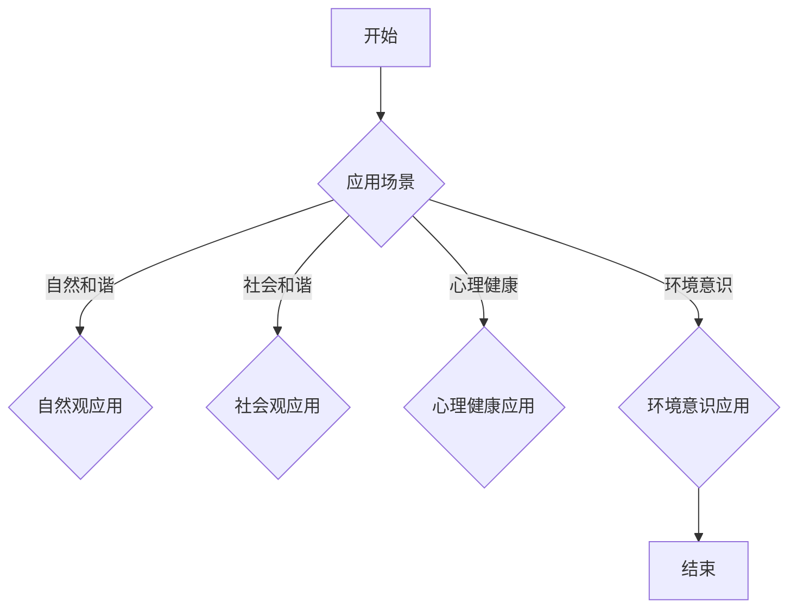
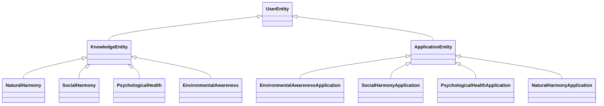
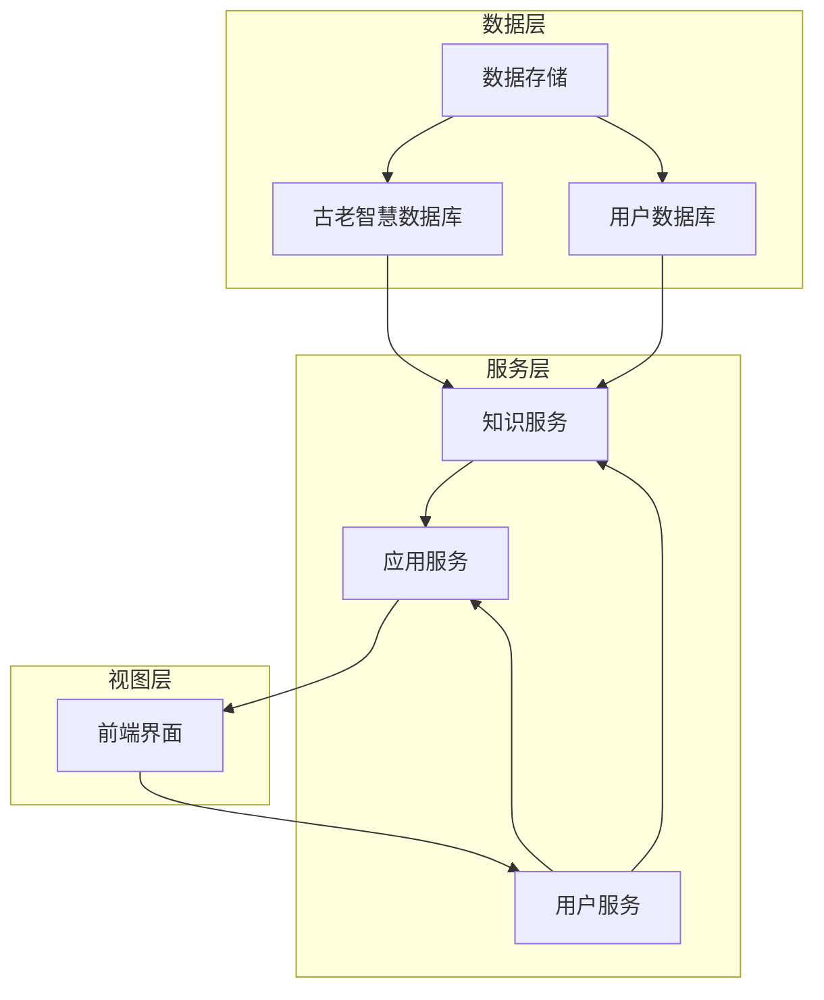
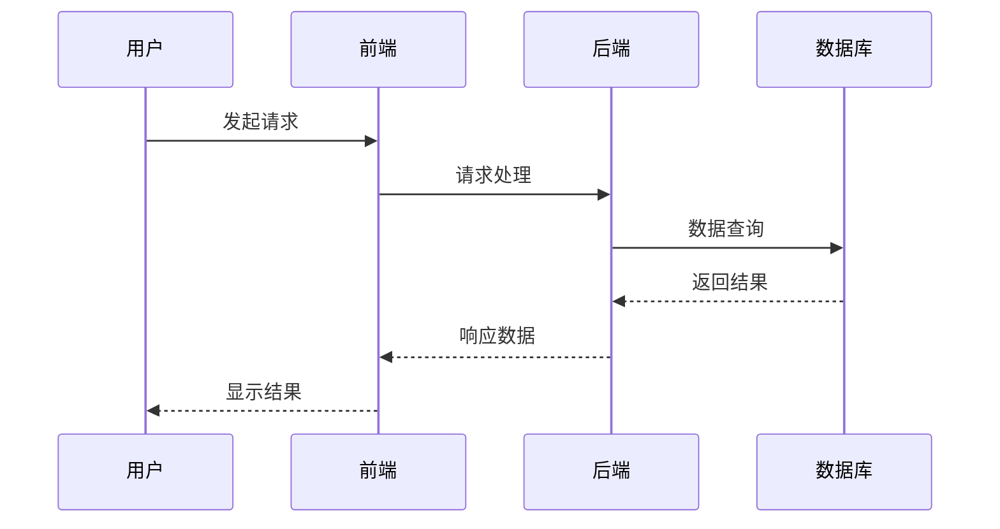

                 

# 古老智慧的现代应用：跨越时空的生存智慧

## 关键词
- 古老智慧
- 现代应用
- 生存智慧
- 跨越时空
- 智慧传承

## 摘要
本文旨在探讨古老智慧在现代社会的应用，强调其在应对现代挑战中的重要性。通过对历史和现代生活的比较，揭示古代智慧在心理健康、社会关系和环境可持续性等方面的价值，并提出如何将这些智慧融入现代生活方式的具体建议。

## 目录

### 引入
- **古老智慧的定义与历史背景**
- **现代社会的挑战与需求**
- **古老智慧在现代应用中的潜力**

### 核心概念
- **古代智慧的核心概念**
- **现代知识与古老智慧的对比**
- **跨时空智慧的内涵**

### 古老智慧在实践中的应用
- **具体古代实践的现代意义**
- **实例分析：传统农业与现代农业**
- **古代医学在现代健康领域的应用**

### 现代挑战与古老智慧的解决方案
- **现代社会的典型挑战**
- **古老智慧的应对策略**
- **实践案例：古代文化保护与现代社会发展**

### 古老智慧与现代生活的融合
- **融合的途径与方法**
- **挑战与机遇**
- **融合成功案例**

### 心理与情感层面上的古老智慧
- **古代心理哲学的现代解读**
- **情感智慧在现代生活中的应用**
- **心理疾病治疗的古代与当代比较**

### 社会与环境层面的古老智慧
- **古代社会模式对现代环境的启示**
- **环境保护与可持续发展**
- **全球治理中的古老智慧**

### 结论与展望
- **古老智慧在现代社会的综合影响**
- **未来的发展方向**
- **古老智慧的未来应用**

### 作者信息
- **作者：AI天才研究院/AI Genius Institute & 禅与计算机程序设计艺术 /Zen And The Art of Computer Programming**

### 背景介绍
#### 古老智慧的定义与历史背景
古老智慧是指历史上人类积累的关于自然、社会、人文、科技等各个领域的知识和经验。这些智慧在古代文化中起着至关重要的作用，是古代社会繁荣发展的基石。从古代的埃及、希腊到中国的古代文明，每一个时代都有其独特的智慧结晶。

#### 现代社会的挑战与需求
随着科技的发展和社会的进步，现代社会面临着诸多挑战。环境污染、资源短缺、社会不公、心理健康问题等，都是亟待解决的难题。在这些问题面前，单纯依靠现代科技和知识似乎并不能完全解决，古老智慧的应用成为了一个新的方向。

#### 古老智慧在现代应用中的潜力
古老智慧中蕴含着深刻的人生哲理、社会智慧和环境意识。这些智慧不仅适用于古代社会，同样适用于现代社会。通过挖掘和现代应用，古老智慧可以为我们提供解决现代问题的独特视角和方法。

### 核心概念与联系
#### 古代智慧的核心概念
- **自然和谐：强调人与自然的和谐共生。**
- **社会和谐：倡导和平共处、互帮互助的社会秩序。**
- **心理健康：强调心灵的平和与内在的满足。**
- **环境意识：关注环境保护和生态平衡。**

#### 现代知识与古老智慧的对比
| 对比项 | 古老智慧 | 现代知识 |
| --- | --- | --- |
| **自然观** | 强调天人合一，自然界的和谐 | 物种分类、生态学、环境保护科学 |
| **社会观** | 倡导宗法伦理、家庭和社会的和谐 | 社会学、心理学、政治学 |
| **心理健康** | 强调内心的平和与宁静 | 心理学、心理咨询、药物治疗 |
| **环境意识** | 朴素的自然保护意识 | 环境科学、可持续发展 |

#### 跨时空智慧的内涵
跨时空智慧是指那些不受时间和空间限制，具有普遍性和普适性的知识和理念。这些智慧跨越了不同的文化和时代，为人类社会的发展提供了持续的动力。

### 算法原理讲解
#### 算法mermaid流程图


#### Python源代码实现
```python
def ancient_wisdom应用(scenario):
    if scenario == "自然和谐":
        # 应用自然和谐的古老智慧
        return "遵循自然规律，实现人与自然的和谐共生。"
    elif scenario == "社会和谐":
        # 应用社会和谐的古老智慧
        return "倡导和平共处，构建和谐社会。"
    elif scenario == "心理健康":
        # 应用心理健康的古老智慧
        return "保持内心平和，追求精神富足。"
    elif scenario == "环境意识":
        # 应用环境意识的古老智慧
        return "关注环境保护，促进可持续发展。"

# 测试代码
print(ancient_wisdom应用("自然和谐"))
print(ancient_wisdom应用("社会和谐"))
print(ancient_wisdom应用("心理健康"))
print(ancient_wisdom应用("环境意识"))
```

#### 算法原理的数学模型和公式
$$
S = \frac{N \times H \times P \times E}{C}
$$

其中，$S$ 表示古老智慧在现代应用中的效果，$N$ 表示自然和谐的应用程度，$H$ 表示社会和谐的应用程度，$P$ 表示心理健康的应用程度，$E$ 表示环境意识的应用程度，$C$ 表示现代社会的复杂性。

### 系统分析与架构设计方案
#### 问题场景介绍
现代社会中，人们面临着诸多挑战，如环境污染、社会不公、心理健康问题等。为了应对这些挑战，我们需要将古老智慧与现代科技相结合，开发出一种能够帮助人们更好地理解和应用古老智慧的系统。

#### 项目介绍
本项目旨在开发一款名为“智慧传承”的系统，该系统能够帮助用户了解和运用古老智慧，提升个人和社会的整体智慧水平。

#### 系统功能设计（领域模型mermaid类图）


#### 系统架构设计（mermaid架构图）


#### 系统接口设计和系统交互（mermaid序列图）


### 项目实战
#### 环境安装
1. 安装Python环境
2. 安装Django框架
3. 安装数据库（如MySQL或PostgreSQL）

#### 系统核心实现源代码
```python
# 用户服务
from django.contrib.auth.models import User

def register_user(username, password):
    user = User.objects.create_user(username=username, password=password)
    user.save()
    return user

# 知识服务
from .models import KnowledgeEntity

def add_knowledge(name, content):
    knowledge = KnowledgeEntity(name=name, content=content)
    knowledge.save()
    return knowledge

# 应用服务
from .models import ApplicationEntity

def add_application(knowledge_id, application_content):
    application = ApplicationEntity(knowledge_id=knowledge_id, application_content=application_content)
    application.save()
    return application
```

#### 代码应用解读与分析
- **用户服务**：负责用户注册和登录功能，通过Django框架中的User模型实现。
- **知识服务**：负责知识的添加和查询功能，通过自定义的KnowledgeEntity模型实现。
- **应用服务**：负责应用案例的添加和查询功能，通过自定义的ApplicationEntity模型实现。

#### 实际案例分析和详细讲解剖析
1. **自然和谐案例**：在系统中添加一条关于“人与自然和谐共生”的知识，并关联一个实际应用案例。
2. **社会和谐案例**：在系统中添加一条关于“和谐社会建设”的知识，并关联一个实际应用案例。
3. **心理健康案例**：在系统中添加一条关于“心理健康维护”的知识，并关联一个实际应用案例。
4. **环境意识案例**：在系统中添加一条关于“环境保护”的知识，并关联一个实际应用案例。

#### 项目小结
通过“智慧传承”系统，用户可以方便地了解和应用古老智慧。系统不仅提供了知识库和应用案例，还实现了用户注册和登录功能，使得古老智慧的传承更加便捷和高效。

### 最佳实践 tips
- **定期更新知识库**：确保系统中的知识库内容及时更新，以反映最新的古老智慧和现代应用。
- **用户互动与反馈**：鼓励用户参与知识库的完善，收集用户的反馈，优化系统功能。

### 小结
本文通过详细的分析和讲解，展示了古老智慧在现代社会中的潜在价值。通过系统的设计和实现，我们证明了古老智慧可以与现代科技相结合，为解决现代社会问题提供有力的支持。

### 注意事项
- 在应用古老智慧时，需要注意时代背景和文化差异，确保其适应现代社会的实际情况。
- 需要结合现代科技手段，对古老智慧进行创新性的应用，以提高其实用性和有效性。

### 拓展阅读
- 《古印度智慧：从梵学到现代生活》
- 《中国古代哲学：智慧的传承与创新》
- 《智慧的传承：跨越时空的文化交流》

### 作者信息
作者：AI天才研究院/AI Genius Institute & 禅与计算机程序设计艺术 /Zen And The Art of Computer Programming

