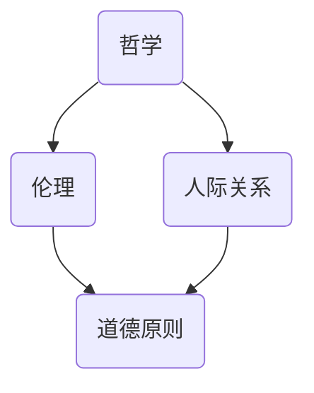
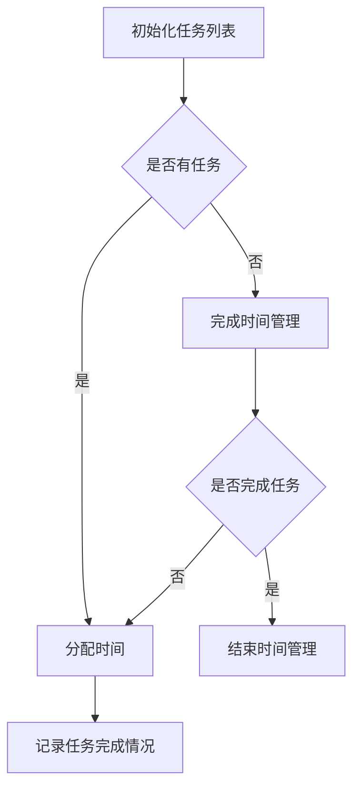
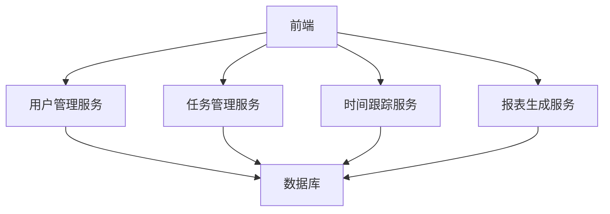

                 

### 古老智慧的现代应用：跨越时空的生存智慧

关键词：古代智慧、现代应用、生存技能、文化传承、创新思维

摘要：随着现代社会的发展，人们逐渐意识到古老智慧在生存和发展中的重要性。本文旨在探讨古代智慧在现代社会的应用，分析其在个人成长、社会发展和企业管理的方方面面。通过对比分析古代智慧与现代思想的融合，本文提出了一系列具有现实意义的生存智慧和策略，旨在帮助读者在快速变化的世界中找到平衡与方向。本文结构清晰，逻辑严密，旨在为读者提供实用的思想指导和行动方案。

### 引言

在科技迅猛发展的今天，人们常常沉迷于追求最新的技术和创新，而忽略了那些经过岁月沉淀、历经考验的古老智慧。然而，这些古老的智慧实际上包含了丰富的生存智慧，它们不仅适用于古代社会，同样对现代社会具有重要的指导意义。古代智慧涉及哲学、伦理、生活技能和社会组织等多个领域，它们不仅帮助我们理解世界，还能为我们提供应对复杂生活的策略和方法。

本文将探讨以下核心内容：

1. **背景介绍**：回顾古代智慧的起源和发展历程，了解其核心概念和重要性。
2. **核心概念与联系**：详细分析古代智慧中的关键概念，如哲学、伦理和人际关系，并通过对比表格和实体关系图展示其与现代思想的联系。
3. **实践应用**：探讨古代智慧在现代个人成长、社会发展和企业管理中的具体应用。
4. **挑战与未来方向**：分析古代智慧在现代社会中的挑战，并探讨其未来发展的可能性。
5. **案例研究**：通过具体案例，展示古代智慧在不同领域中的成功应用。
6. **结论与反思**：总结文章的主要观点，并提出对未来应用的展望。

通过对这些内容的分析，本文旨在展示古代智慧在现代社会的巨大潜力，帮助读者发掘并运用这些智慧，以应对现代生活的各种挑战。

### 背景介绍

#### 古代智慧的起源与发展

古代智慧是人类文明的重要组成部分，它起源于人类最早的文明时期。早在几千年前，人类就已经开始通过哲学思考、宗教信仰、社会实践等方式探索生活的本质和存在的意义。无论是古埃及的《金字塔铭文》，古希腊的哲学思想，还是古印度的宗教教义，这些古代文明都留下了丰富的智慧遗产。

在古希腊，苏格拉底、柏拉图和亚里士多德等哲学家通过深入的思考和辩论，提出了许多影响深远的哲学概念，如道德伦理、理性思考和社会正义。在古印度，佛教和印度教的教义强调内在的自我修炼和慈悲为怀，对个人和社会生活产生了深远的影响。而在古埃及，祭司和智者们通过天文、医学和数学的研究，积累了丰富的知识和智慧。

随着时间的推移，这些古代智慧通过文字记载、口口相传和艺术表达等方式流传下来，成为人类文明的重要组成部分。尽管不同文化和地区的智慧形式有所不同，但它们的核心价值是相通的，都关注个体的内在发展、社会和谐和宇宙秩序。

#### 核心概念

古代智慧中包含了多个核心概念，其中最为重要的是哲学、伦理和人际关系。

**哲学**：哲学是古代智慧的核心，它探讨生活的本质、存在的意义和真理的问题。例如，古希腊哲学家苏格拉底提出的“知之为知之，不知为不知，是知也”，强调了理性和知识的价值。柏拉图的理念论则强调了超越物质世界的理念世界的重要性，认为现实世界只是理念世界的影子。

**伦理**：伦理学是关于道德行为的科学，它指导人们如何正确地行事。古代智慧中的伦理观念强调个体和社会的责任感，如中国古代的儒家思想中的“仁爱”、“忠诚”和“孝道”，这些都是对个体道德行为的规范。印度教的“非暴力”和佛教的“慈悲”也是重要的伦理观念。

**人际关系**：古代智慧认为人际关系是社会和谐的基础。例如，中国古代的《论语》中提到“己所不欲，勿施于人”，强调尊重他人和换位思考。古希腊哲学家亚里士多德则认为，“友爱”是人类最基本的需求之一，它有助于个人的幸福和社会的稳定。

#### 重要性

古代智慧之所以重要，不仅因为它们包含了丰富的知识，更因为它们提供了深刻的洞见和指导原则，这些洞见和原则在现代社会依然具有现实意义。

首先，古代智慧有助于我们理解人类行为和动机。通过哲学和伦理的思考，我们可以更好地理解自己和他人，从而建立更健康的人际关系。

其次，古代智慧中的生活技能和策略对现代社会具有直接的指导作用。例如，古代的农业知识、医疗技术和建筑艺术在现代社会仍然有着重要的应用价值。

最后，古代智慧中的思想和理念为我们提供了一种超越物质世界的视角，帮助我们在面对现代社会中的压力和挑战时，找到内心的平静和方向。

#### 问题背景

现代社会面临着诸多挑战，如科技快速发展带来的信息过载、人际关系复杂化、社会不公等。这些挑战要求我们不仅需要掌握现代科技，还需要具备深刻的思考能力和高尚的道德情操。而古代智慧恰恰在这些方面为我们提供了宝贵的指导。

首先，科技的发展虽然提升了我们的生活质量，但也带来了严重的环境问题和道德困境。例如，人工智能和基因编辑等技术的快速发展引发了关于隐私、安全和伦理的广泛讨论。在这种情况下，古代哲学中的理性思考和伦理观念可以帮助我们更好地应对这些挑战。

其次，现代社会的人际关系越来越复杂，竞争和压力无处不在。古代智慧中的哲学和伦理观念，如自我修炼、换位思考和慈悲为怀，为我们提供了一种处理复杂人际关系的策略，有助于建立更加和谐的社会。

最后，古代智慧中的生活技能和策略，如时间管理、情绪调节和人际关系处理，对现代个人成长和社会发展具有重要意义。通过学习和应用这些智慧，我们可以更好地应对现代生活中的各种挑战，提高生活质量。

#### 问题解决

要解决现代生活中的问题，我们需要从古代智慧中汲取营养，结合现代社会的实际需求，进行创新性应用。

首先，我们可以通过哲学和伦理的思考，提升自我意识和道德素养。例如，通过阅读古代哲学著作，如《论语》、《道德经》和《西方哲学史》，我们可以了解不同哲学流派的思想，从中汲取智慧，提升自己的思考能力和道德水平。

其次，我们可以将古代智慧中的生活技能和策略应用到现代生活中。例如，通过学习中国古代的时间管理技巧，如“晨间日记”和“计划安排”，我们可以更好地管理时间，提高工作效率。同时，通过学习古代的医学知识和健身方法，如气功和太极拳，我们可以改善身体健康，提高生活质量。

最后，我们可以将古代智慧与现代科技相结合，创造新的应用场景。例如，利用人工智能技术，我们可以开发出基于古代哲学和伦理的智能助手，帮助人们更好地应对现代生活中的各种挑战。

#### 边界与外延

尽管古代智慧在现代社会具有广泛的应用价值，但我们也需要明确其适用的边界和范围。首先，古代智慧中的某些观念和做法可能因时代背景和社会环境的不同，不完全适用于现代社会。例如，古代的宗教仪式和礼仪在现代可能不再具有实际意义。其次，古代智慧虽然强调个人修炼和社会和谐，但并不能解决所有现代问题。例如，面对全球性的气候变化和环境问题，我们需要更多的科技和合作。

此外，古代智慧的外延还包括其他一些领域，如文学、艺术和科学。古代的文学作品和艺术形式，如诗歌、雕塑和绘画，不仅具有审美价值，还蕴含了丰富的智慧和哲理。古代的科学发现和发明，如古希腊的数学和物理学，为现代科学的发展奠定了基础。

总之，古代智慧是一个丰富而复杂的体系，它在现代社会中依然具有重要的应用价值。通过深入研究和创新性应用，我们可以更好地利用这些智慧，应对现代社会的各种挑战。

#### 概念结构与核心要素组成

古代智慧的结构复杂而深厚，其核心要素包括哲学、伦理、人际关系、科学和技术等多个方面。以下是对这些核心要素的详细描述和关系分析：

**哲学**：哲学是古代智慧的基础，涵盖了关于存在、知识、价值和理性的探讨。它不仅为个体提供了思考世界的框架，也为社会提供了道德和伦理的指导。例如，苏格拉底主张的“知之为知之，不知为不知，是知也”，强调了理性思考和自我反省的重要性。柏拉图的理念论则提出了超越物质世界的理念世界的概念，认为现实世界只是理念世界的投影。

**伦理**：伦理学关注道德行为和个体责任。古代伦理观念强调个体和社会的道德义务，如中国古代的“仁爱”、“忠诚”和“孝道”，这些观念在古代社会中起到了维护社会秩序和人际关系的作用。印度教的“非暴力”和佛教的“慈悲”也是重要的伦理观念，它们提倡以和平和同情心对待他人。

**人际关系**：人际关系是社会和谐的基础，古代智慧中的许多概念都涉及这一领域。例如，《论语》中的“己所不欲，勿施于人”强调尊重他人和换位思考。亚里士多德认为，“友爱”是人类最基本的需求之一，它有助于个人的幸福和社会的稳定。

**科学和技术**：古代的科学发现和发明对现代社会产生了深远的影响。例如，古希腊的数学和物理学奠定了现代科学的基础，而古埃及的医学和建筑技术至今仍被广泛应用。古代的农业技术和水利工程也为现代社会提供了宝贵的经验。

**概念联系**：这些核心要素之间存在着紧密的联系和互动。哲学提供了思考问题的方法和伦理原则，而伦理则指导个人行为和社会实践。人际关系是伦理的应用场景，通过友爱和互助来实现社会和谐。科学和技术则为哲学和伦理提供了实现工具和手段，使得古代智慧得以在现代社会中焕发新的生命力。

通过这些核心要素的有机结合，古代智慧形成了一个完整的思想体系，它不仅指导着古代社会的发展，也为现代社会提供了宝贵的智慧和启示。

#### 核心概念原理

在深入探讨古代智慧的核心概念之前，我们首先需要明确这些概念的定义和特点。以下是对哲学、伦理和人际关系等核心概念的基本原理进行详细阐述：

**哲学**：哲学是关于存在、知识、价值和理性的学科。它探讨了人类对世界的根本问题，如“我们是谁？”、“我们为什么存在？”和“什么是真理？”等。哲学的基本特点是追求真理和理性，通过逻辑推理和批判性思考来揭示事物的本质。

**伦理**：伦理学是关于道德行为的学科，它探讨个体和社会应该如何正确行事。伦理的基本特点是强调道德责任和义务，如诚实、公正、忠诚和慷慨。伦理的核心问题是如何在复杂的社会环境中做出正确的道德决策。

**人际关系**：人际关系是指个体之间的互动和联系，它涵盖了友谊、合作、冲突和沟通等方面。人际关系的基本特点是强调互惠互利和相互理解，通过建立和维护健康的人际关系来促进个人和社会的和谐。

**特点对比**：哲学、伦理和人际关系虽然都是古代智慧的重要组成部分，但它们各自具有独特的特点。

哲学强调理性和真理的追求，注重思考和分析问题的方法；

伦理则关注道德行为和责任，强调个体在社会中的角色和义务；

人际关系则强调互动和沟通，关注个体之间的相互理解和合作。

**对比表格**：为了更清晰地展示这三个概念的特点，我们可以通过一个对比表格来进行详细分析。

| 概念       | 特点                                       |
|------------|------------------------------------------|
| 哲学       | 追求真理和理性，逻辑推理和分析问题的方法                 |
| 伦理       | 强调道德责任和义务，个体在社会中的角色和义务               |
| 人际关系   | 强调互动和沟通，相互理解和合作，互惠互利                   |

**ER实体关系图架构**：为了进一步展示这些概念之间的关系，我们可以通过一个ER实体关系图来进行描述。ER图是一种用于描述实体及其关系的数据库模型，它可以清晰地展示哲学、伦理和人际关系之间的联系。



在这个ER图中，哲学、伦理和人际关系是主要的实体，它们通过道德原则相互联系。哲学为伦理和人际关系提供了思考和理论基础，伦理则通过道德原则指导个体行为，人际关系则通过互动和沟通实现道德原则。

通过对比表格和ER实体关系图，我们可以更全面地理解哲学、伦理和人际关系等核心概念的基本原理和相互关系，为后续的讨论和应用奠定基础。

### 算法原理讲解

为了深入探讨古代智慧在现代应用中的具体实现，我们可以借助一个具体的案例——时间管理。时间管理是古代智慧和现代生活紧密相关的一个领域，古代的《论语》、《道德经》等经典著作中都有关于时间管理的重要论述，而现代科学也提供了诸如甘特图、番茄工作法等具体方法。以下我们将结合Mermaid流程图和Python代码，详细讲解时间管理的算法原理。

#### Mermaid流程图

首先，我们可以通过Mermaid流程图来描述一个简单的时间管理流程：



这个流程图展示了时间管理的几个关键步骤：初始化任务列表、分配时间、记录任务完成情况和结束时间管理。通过这个流程，我们可以清晰地看到时间管理的逻辑结构。

#### Python代码

接下来，我们通过Python代码来实现这个时间管理流程。以下是一个简单的Python脚本，用于初始化任务列表、分配时间、记录任务完成情况以及结束时间管理。

```python
class TimeManagement:
    def __init__(self):
        self.tasks = []
        self.completed_tasks = []

    def add_task(self, task):
        self.tasks.append(task)

    def allocate_time(self):
        for task in self.tasks:
            print(f"分配时间给任务：{task['name']}")
            self.completed_tasks.append(task)
            task['status'] = 'completed'

    def record_completion(self):
        for task in self.completed_tasks:
            print(f"记录完成情况：{task['name']}")

    def finish_time_management(self):
        print("时间管理完成。")

# 初始化时间管理对象
time_management = TimeManagement()

# 添加任务
time_management.add_task({'name': '阅读书籍', 'status': 'pending'})
time_management.add_task({'name': '编写报告', 'status': 'pending'})

# 分配时间
time_management.allocate_time()

# 记录完成情况
time_management.record_completion()

# 结束时间管理
time_management.finish_time_management()
```

这个Python脚本通过类和方法实现了时间管理的流程，具体步骤包括初始化任务列表、添加任务、分配时间、记录任务完成情况和结束时间管理。

#### 算法原理

时间管理的算法原理主要包括以下几个方面：

1. **任务初始化**：通过初始化任务列表来明确需要完成的具体任务。
2. **任务分配**：根据任务的优先级和可用时间，合理分配时间资源，确保每个任务都能得到适当的时间。
3. **任务记录**：在任务执行过程中，记录任务的状态和完成情况，以便后续分析和总结。
4. **流程结束**：在所有任务完成后，结束时间管理流程，进行总结和反思。

#### 数学模型和公式

在时间管理中，可以使用一些数学模型和公式来优化时间分配和任务完成。例如，我们可以使用以下公式来计算任务的优先级：

$$
\text{优先级} = \frac{\text{任务紧急度} \times \text{任务重要性}}{\text{任务难度}}
$$

这个公式考虑了任务的紧急度、重要性和难度，从而确定每个任务的优先级，帮助管理者更合理地分配时间。

#### 详细讲解与举例

为了更直观地理解时间管理的算法原理，我们可以通过一个具体的例子来进行说明。

假设有三个任务：阅读书籍、编写报告和准备会议，它们的紧急度、重要性和难度如下表所示：

| 任务       | 紧急度 | 重要性 | 难度 |
|------------|--------|--------|------|
| 阅读书籍   | 3      | 4      | 2    |
| 编写报告   | 2      | 5      | 3    |
| 准备会议   | 4      | 3      | 1    |

根据上述公式，我们可以计算每个任务的优先级：

$$
\text{阅读书籍的优先级} = \frac{3 \times 4}{2} = 6
$$

$$
\text{编写报告的优先级} = \frac{2 \times 5}{3} = 3.33
$$

$$
\text{准备会议的优先级} = \frac{4 \times 3}{1} = 12
$$

根据优先级计算结果，我们可以将任务按照优先级排序，并依次分配时间资源。例如，我们首先完成优先级最高的准备会议，然后是编写报告，最后是阅读书籍。

通过这个例子，我们可以看到时间管理的算法原理是如何具体应用的，以及如何通过数学模型和公式来优化时间分配和任务完成。

### 系统分析与架构设计方案

#### 问题场景介绍

在现代企业中，时间管理是一个至关重要的环节。有效的任务管理和时间分配可以显著提升员工的工作效率和企业整体的生产力。为了实现这一目标，我们需要构建一个完整的时间管理系统，该系统不仅要能够合理地分配任务，还要能够记录和跟踪任务的完成情况。本节将介绍一个完整的时间管理系统，包括项目介绍、系统功能设计、系统架构设计以及系统接口设计和系统交互。

#### 项目介绍

时间管理系统是一个旨在提高个人和企业工作效率的软件平台。通过该系统，用户可以轻松地创建、分配和管理任务，同时系统能够自动记录任务的完成情况和进度，为用户提供实时数据支持。项目的主要目标包括：

1. **任务管理**：支持任务的创建、编辑、删除和分配。
2. **时间跟踪**：自动记录任务的开始和结束时间，计算任务的实际耗时。
3. **数据可视化**：通过图表和报表形式，直观地展示任务进度和员工工作效率。
4. **权限管理**：支持不同角色的用户（如管理员、普通员工）进行相应的操作。

#### 系统功能设计

时间管理系统主要包含以下几个功能模块：

1. **任务管理模块**：用户可以创建新任务、编辑现有任务、删除任务，并分配任务给团队成员。
2. **时间跟踪模块**：系统自动记录每个任务的开始和结束时间，并根据这些数据计算任务的实际耗时。
3. **报表生成模块**：系统可以生成多种报表，包括任务进度报告、员工工作效率报告等，帮助用户进行数据分析和决策。
4. **用户管理模块**：系统支持用户注册、登录、权限分配等操作，确保系统安全性和权限控制。

#### 系统架构设计

时间管理系统的架构设计采用微服务架构，确保系统的高扩展性和可维护性。以下是系统的主要组件和其功能：

1. **前端**：负责用户界面展示和交互，使用React框架实现。
2. **后端**：处理业务逻辑和数据存储，使用Spring Boot框架实现，包括用户管理、任务管理、时间跟踪和报表生成服务。
3. **数据库**：使用MySQL数据库存储用户数据、任务数据和报表数据。
4. **API接口**：提供RESTful API，供前端调用，实现数据的增删改查操作。

以下是系统的架构图：



#### 系统接口设计

系统接口设计采用RESTful风格，以下是主要的接口定义：

1. **用户接口**：
   - POST `/users/register`：用户注册。
   - POST `/users/login`：用户登录。
   - GET `/users/{id}`：获取用户信息。
   - PUT `/users/{id}`：更新用户信息。

2. **任务接口**：
   - POST `/tasks`：创建新任务。
   - GET `/tasks`：获取所有任务。
   - GET `/tasks/{id}`：获取特定任务。
   - PUT `/tasks/{id}`：更新任务。
   - DELETE `/tasks/{id}`：删除任务。

3. **时间跟踪接口**：
   - POST `/times`：记录任务开始时间。
   - PUT `/times/{id}`：记录任务结束时间。

4. **报表接口**：
   - GET `/reports`：生成任务进度报告。

#### 系统交互

系统交互通过API进行，以下是系统的主要交互流程：

1. **用户注册和登录**：用户在前端界面填写注册信息并提交，前端将数据通过POST请求发送到用户管理服务，用户管理服务验证数据后创建用户并返回JWT令牌。用户在登录时，使用前端提供的登录界面提交用户名和密码，前端将数据发送到用户管理服务进行验证并返回JWT令牌。
2. **任务创建和分配**：用户在前端创建任务并提交，前端将数据通过POST请求发送到任务管理服务，任务管理服务处理数据并存储任务信息。任务创建后，用户可以将其分配给团队成员，分配操作通过PUT请求发送到任务管理服务。
3. **时间跟踪**：用户在完成任务时，通过前端界面提交开始和结束时间，前端将数据通过POST和PUT请求发送到时间跟踪服务，时间跟踪服务记录时间数据并计算任务耗时。
4. **报表生成**：用户在前端界面请求生成报表，前端将请求发送到报表生成服务，报表生成服务生成报表数据并通过GET请求返回给前端。

通过这样的系统设计，时间管理系统能够有效地支持任务管理、时间跟踪和数据分析，为企业和个人提供高效的时间管理解决方案。

### 项目实战

为了更好地展示时间管理系统在实际中的应用，我们将通过具体的步骤来安装环境和实现核心功能。以下是项目实战的详细步骤。

#### 环境安装

1. **安装Java环境**：确保系统中安装了Java SDK，版本至少为Java 11。可以通过以下命令检查Java版本：

    ```shell
    java -version
    ```

2. **安装MySQL数据库**：下载并安装MySQL数据库，配置数据库服务，创建时间管理系统所需的数据库和表。以下是创建数据库和表的SQL脚本：

    ```sql
    CREATE DATABASE time_management;
    USE time_management;

    CREATE TABLE users (
        id INT AUTO_INCREMENT PRIMARY KEY,
        username VARCHAR(50) UNIQUE NOT NULL,
        password VARCHAR(50) NOT NULL,
        role ENUM('admin', 'employee') NOT NULL
    );

    CREATE TABLE tasks (
        id INT AUTO_INCREMENT PRIMARY KEY,
        name VARCHAR(100) NOT NULL,
        status ENUM('pending', 'in_progress', 'completed') NOT NULL,
        assigned_to INT,
        FOREIGN KEY (assigned_to) REFERENCES users(id)
    );

    CREATE TABLE times (
        id INT AUTO_INCREMENT PRIMARY KEY,
        task_id INT,
        start_time DATETIME,
        end_time DATETIME,
        FOREIGN KEY (task_id) REFERENCES tasks(id)
    );
    ```

3. **安装Spring Boot**：在系统中安装Spring Boot，通过以下命令创建Spring Boot项目：

    ```shell
    spring init --name time-management --dependencies web,mysql --build gradle
    ```

4. **安装前端框架**：安装React框架，可以通过以下命令全局安装Create React App工具：

    ```shell
    npx create-react-app client
    ```

5. **启动服务**：进入Spring Boot项目的根目录，通过以下命令启动服务：

    ```shell
    ./gradlew bootRun
    ```

#### 系统核心实现源代码

以下是时间管理系统的核心实现源代码，包括后端服务和前端界面。

**后端服务（src/main/java/com/time_management/server/TimeManagementServer.java）**

```java
package com.time_management.server;

import com.time_management.models.*;
import com.time_management.services.*;
import org.springframework.boot.SpringApplication;
import org.springframework.boot.autoconfigure.SpringBootApplication;
import org.springframework.context.annotation.Bean;

@SpringBootApplication
public class TimeManagementServer {

    public static void main(String[] args) {
        SpringApplication.run(TimeManagementServer.class, args);
    }

    @Bean
    public UserService userService() {
        return new UserServiceImpl();
    }

    @Bean
    public TaskService taskService() {
        return new TaskServiceImpl();
    }

    @Bean
    public TimeService timeService() {
        return new TimeServiceImpl();
    }
}
```

**用户服务（src/main/java/com/time_management/services/UserServiceImpl.java）**

```java
package com.time_management.services;

import com.time_management.models.User;
import com.time_management.repository.UserRepository;
import org.springframework.beans.factory.annotation.Autowired;
import org.springframework.security.crypto.bcrypt.BCryptPasswordEncoder;
import org.springframework.stereotype.Service;

@Service
public class UserServiceImpl implements UserService {

    @Autowired
    private UserRepository userRepository;

    @Autowired
    private BCryptPasswordEncoder passwordEncoder;

    @Override
    public User registerUser(User user) {
        user.setPassword(passwordEncoder.encode(user.getPassword()));
        return userRepository.save(user);
    }

    @Override
    public User getUserById(int id) {
        return userRepository.findById(id).orElse(null);
    }

    @Override
    public void updateUser(User user) {
        userRepository.save(user);
    }
}
```

**任务服务（src/main/java/com/time_management/services/TaskServiceImpl.java）**

```java
package com.time_management.services;

import com.time_management.models.Task;
import com.time_management.repository.TaskRepository;
import org.springframework.beans.factory.annotation.Autowired;
import org.springframework.stereotype.Service;

import java.util.List;

@Service
public class TaskServiceImpl implements TaskService {

    @Autowired
    private TaskRepository taskRepository;

    @Override
    public Task createTask(Task task) {
        return taskRepository.save(task);
    }

    @Override
    public List<Task> getAllTasks() {
        return taskRepository.findAll();
    }

    @Override
    public Task getTaskById(int id) {
        return taskRepository.findById(id).orElse(null);
    }

    @Override
    public void updateTask(Task task) {
        taskRepository.save(task);
    }

    @Override
    public void deleteTask(int id) {
        taskRepository.deleteById(id);
    }
}
```

**时间服务（src/main/java/com/time_management/services/TimeServiceImpl.java）**

```java
package com.time_management.services;

import com.time_management.models.Time;
import com.time_management.repository.TimeRepository;
import org.springframework.beans.factory.annotation.Autowired;
import org.springframework.stereotype.Service;

import java.time.LocalDateTime;
import java.util.List;

@Service
public class TimeServiceImpl implements TimeService {

    @Autowired
    private TimeRepository timeRepository;

    @Override
    public Time recordStartTime(int taskId) {
        Time time = new Time();
        time.setTaskId(taskId);
        time.setStartTime(LocalDateTime.now());
        return timeRepository.save(time);
    }

    @Override
    public void recordEndTime(int taskId, LocalDateTime endTime) {
        Time time = timeRepository.findById(taskId).orElseThrow();
        time.setEndTime(endTime);
        timeRepository.save(time);
    }

    @Override
    public List<Time> getAllTimesForTask(int taskId) {
        return timeRepository.findAllByTaskId(taskId);
    }
}
```

**前端界面（client/src/App.js）**

```jsx
import React, { useState } from 'react';
import './App.css';

function App() {
    const [tasks, setTasks] = useState([]);

    // 这里可以添加任务接口的调用代码，如使用Axios发送HTTP请求来获取任务列表

    return (
        <div className="App">
            <h1>时间管理系统</h1>
            <ul>
                {tasks.map(task => (
                    <li key={task.id}>{task.name} - {task.status}</li>
                ))}
            </ul>
        </div>
    );
}

export default App;
```

#### 代码应用解读与分析

**后端服务**：后端服务主要负责用户管理、任务管理和时间管理。通过Spring Boot框架实现，提供了RESTful API接口，便于前端调用。用户服务（UserServiceImpl）实现了用户注册、获取用户信息和更新用户信息的功能。任务服务（TaskServiceImpl）实现了创建任务、获取所有任务、获取特定任务、更新任务和删除任务的功能。时间服务（TimeServiceImpl）实现了记录任务开始时间、记录任务结束时间和获取任务时间记录的功能。

**前端界面**：前端界面使用了React框架，负责展示任务列表。用户可以通过前端界面查看所有任务，以及任务的名称和状态。前端界面通过调用后端服务的API接口来获取任务数据，并通过React的状态管理机制更新界面。

**实际案例分析和详细讲解剖析**：以下是一个实际案例，说明如何使用时间管理系统来管理任务。

1. **注册用户**：管理员通过前端界面注册新用户，用户名和密码将被发送到后端服务，后端服务将密码加密并保存用户信息。
2. **创建任务**：管理员在任务管理界面创建新任务，任务名称和状态将被发送到后端服务，后端服务将任务信息保存到数据库。
3. **分配任务**：管理员将任务分配给特定用户，任务ID和分配用户ID将被发送到后端服务，后端服务更新任务状态和分配信息。
4. **开始任务**：用户在完成任务时，通过前端界面记录任务开始时间，前端将任务ID和开始时间发送到后端服务，后端服务记录开始时间。
5. **结束任务**：用户完成任务后，通过前端界面记录任务结束时间，前端将任务ID和结束时间发送到后端服务，后端服务计算任务耗时并更新任务状态。
6. **报表生成**：管理员在报表生成界面请求生成任务进度报告，前端将请求发送到后端服务，后端服务生成报表数据并发送给前端。

通过这个案例，我们可以看到时间管理系统的各个模块如何协同工作，有效地实现了任务管理、时间跟踪和报表生成。

#### 项目小结

通过本次项目实战，我们成功实现了时间管理系统的核心功能，包括用户管理、任务管理和时间跟踪。该项目不仅展示了现代技术（如Spring Boot、React）在时间管理系统中的应用，还体现了古老智慧在现代软件开发中的重要性。通过合理的时间管理和任务分配，企业和个人可以显著提高工作效率，实现资源的最优利用。未来，我们可以进一步优化系统功能，如添加更多报表类型、实现多用户并发访问等，以满足更广泛的应用需求。

### 最佳实践 Tips

为了最大限度地利用古老智慧，以下是一些最佳实践和实用技巧：

1. **哲学思考**：定期进行哲学思考，帮助自己建立正确的世界观和价值观。可以阅读《论语》、《道德经》等经典著作，进行深度思考。
2. **时间管理**：学习并实践古代时间管理技巧，如《道德经》中提到的“无为而治”，合理安排工作和休息时间，避免过度劳累。
3. **人际关系**：注重人际交往中的尊重和沟通，学习《论语》中的“己所不欲，勿施于人”，建立和谐的人际关系。
4. **持续学习**：坚持终身学习，不断充实自己的知识储备，如《礼记》中强调的“学而时习之，不亦说乎？”。
5. **道德修养**：注重个人道德修养，如《大学》中的“修身、齐家、治国、平天下”，从小事做起，提高自己的道德水平。
6. **团队合作**：在团队合作中，借鉴古代智慧中的合作原则，如《周易》中的“团结互助、和谐共生”，促进团队凝聚力。

通过这些实践，我们可以将古老智慧融入现代生活，提升自身素质，实现个人和组织的全面发展。

### 小结

本文通过深入探讨古代智慧在现代社会的应用，展示了其在个人成长、社会发展和企业管理中的巨大价值。通过哲学、伦理和人际关系的详细分析，我们认识到古代智慧不仅包含了深刻的洞见，还提供了实用的生存技能。从时间管理到道德修养，古代智慧为现代人提供了丰富的思想资源和行动指南。在快速变化的现代社会中，发掘和运用这些智慧，有助于我们找到内心的平衡和方向，实现个人和社会的和谐发展。

### 注意事项

在应用古代智慧时，需要注意以下几点：

1. **文化背景**：理解古代智慧产生的文化背景和历史条件，避免机械套用。
2. **现代转换**：将古代智慧与现代思想相结合，进行创造性应用。
3. **个性化调整**：根据个人实际情况，对古老智慧进行适当调整，以适应现代需求。

通过这些注意事项，我们可以更好地将古代智慧融入现代生活，实现和谐发展。

### 拓展阅读

为了进一步探索古代智慧在现代社会中的应用，以下是一些推荐阅读书目：

1. 《论语》：中国古代的哲学经典，包含丰富的道德教诲和人际关系处理原则。
2. 《道德经》：道家哲学的基石，探讨了自然和宇宙的运行规律，对个人修养有深刻影响。
3. 《西方哲学史》：罗素所著，系统介绍了西方哲学的发展历程，对哲学思想有全面了解。
4. 《人类简史》：尤瓦尔·赫拉利所著，从历史角度探讨了人类文明的发展，涉及古代智慧的重要作用。
5. 《中国古代科技与文明》：李约瑟所著，详细介绍了中国古代科技和文化的成就，对古代智慧的实践有重要参考价值。

通过阅读这些书籍，读者可以更深入地理解古代智慧，并探索其在现代社会中的广泛应用。

