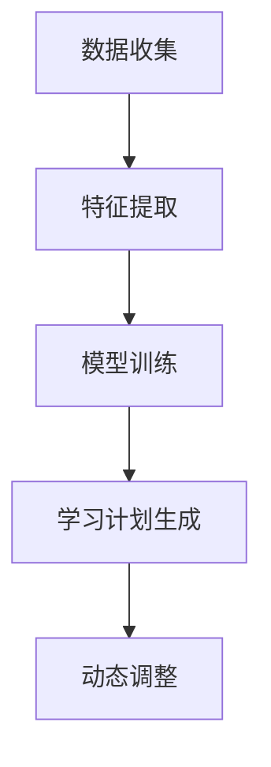
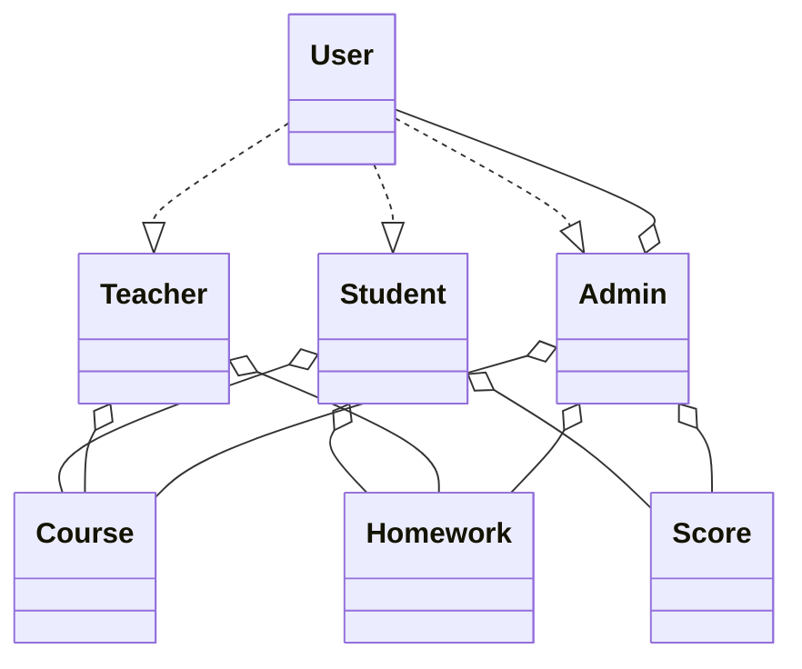
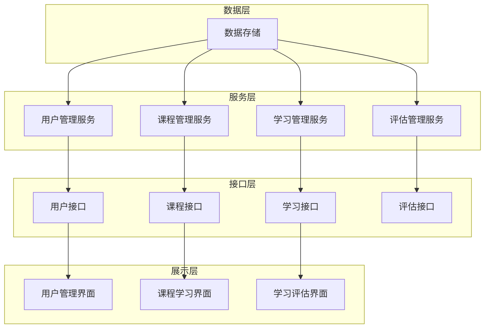
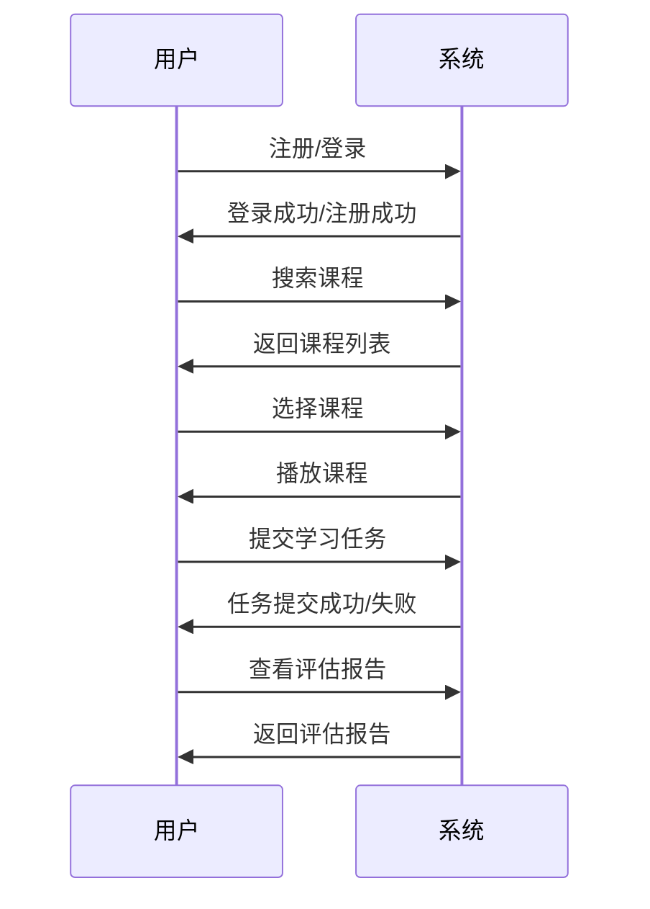

                 


### 引言

在当今社会，教育已经成为一个备受关注的话题。传统教育模式虽然在过去取得了一定的成就，但随着科技的发展和人们对于教育的不断追求，传统教育模式逐渐暴露出诸多问题。例如，过于注重学术成绩而忽视学生综合素质的培养、教育资源的分配不均、教育方式的单一等。为了解决这些问题，另类教育应运而生，它以创新的教学方法、灵活的教育资源、多元的评价体系为特征，旨在培养全人格发展，关注学生的个性化成长。本文将围绕另类教育的核心概念、实践方法、成功案例等方面进行深入探讨，以期为教育工作者和家长提供有益的参考。

关键词：另类教育、全人格发展、个性化成长、创新教学

摘要：本文首先介绍了另类教育的背景、问题描述、问题解决以及边界与外延，然后分析了另类教育的核心概念与联系，包括创造力、批判性思维和社交能力。接着，本文讲解了另类教育模型和深度学习算法的原理，并通过具体案例展示了另类教育的实践方法。最后，本文总结了另类教育的优势和实践中的注意事项，为教育工作者和家长提供了参考。

----------------------------------------------------------------

### 第一部分：背景介绍

#### 1.1 问题背景

随着社会的快速发展，传统教育模式逐渐暴露出诸多问题。一方面，传统教育过于注重学术成绩，忽视了学生综合素质的培养。学生在学习过程中，往往被要求背诵、记忆，而缺乏独立思考、批判性思维和创造力等能力的培养。另一方面，教育资源的分配不均，导致学生之间的差距日益扩大。一些优秀学生能够在优质教育资源下脱颖而出，而另一些学生则因为教育资源匮乏而失去了发展的机会。

此外，传统教育方式过于单一，以教师为中心的教学模式使得学生缺乏主动性和参与感。学生在课堂上被动接受知识，缺乏实践机会，难以将所学知识应用于实际生活中。这种现象在一定程度上抑制了学生的个性和创造力，限制了其全面发展。

#### 1.2 问题描述

另类教育的提出，正是为了解决传统教育模式中的这些问题。另类教育以学生为中心，注重个性化和多元化发展，旨在培养学生的创造力、批判性思维和社交能力，从而实现全人格发展。

具体而言，另类教育关注以下问题：

1. 如何激发学生的创造力，培养其独立思考和解决问题的能力？
2. 如何培养学生的批判性思维，使其能够客观、全面地分析问题，提出有价值的观点？
3. 如何提高学生的社交能力，使其能够与他人有效沟通，建立良好的人际关系？
4. 如何针对学生的个性化需求，提供多元化的教育资源，实现教育资源的公平分配？
5. 如何通过创新的教学方法，激发学生的学习兴趣和主动性，提高学习效果？

#### 1.3 问题解决

为了解决上述问题，另类教育提出了一系列创新的教育理念和实践方法。首先，另类教育强调以学生为中心，关注学生的个性化需求和发展。通过个性化教学方案，充分调动学生的积极性和主动性，使其在自主探究中培养创造力、批判性思维和社交能力。

其次，另类教育采用多元化、灵活的教育资源，如在线课程、实践项目、社会实践等，为学生提供丰富的学习体验。通过这些资源，学生不仅能够学习理论知识，还能够将所学知识应用于实际生活中，提高其实际操作能力和综合素质。

此外，另类教育还注重评价体系的多元化。通过多种评价方式，如项目评估、同伴评价、自我评价等，全面、客观地评价学生的表现，激发学生的学习动力和兴趣。

最后，另类教育倡导教育公平，通过教育资源共享、教育补贴等方式，缩小教育资源分配差距，让更多的学生受益。

#### 1.4 边界与外延

另类教育并非完全摒弃传统教育，而是在其基础上进行创新和补充。它关注学生的个性化需求，尊重学生的独特性，旨在培养具有全面素质的人才。

在实施过程中，另类教育需要与传统教育相结合，充分发挥两者的优势。例如，在传统课程的基础上，增加实践项目和多元化评价，使学生在学习过程中更好地培养综合素质。

#### 1.5 概念结构与核心要素组成

1. **另类教育**：一种以学生为中心，注重个性化和多元化发展的教育模式。
2. **核心概念**：创造力、批判性思维、社交能力、综合素质等。
3. **核心要素**：教学方法、教育资源、评价体系等。

通过以上对另类教育背景的介绍，我们可以看到，另类教育作为一种新兴的教育模式，具有很大的发展潜力和价值。接下来，本文将深入探讨另类教育的核心概念、算法原理和实践方法，以期为另类教育的实施提供理论支持和实践指导。

----------------------------------------------------------------

## 第二部分：核心概念与联系

### 2.1 创造力

#### 2.1.1 定义

创造力（Creativity）是指个体在特定情境下，产生新颖、有价值的想法、概念或解决方案的能力。它不仅仅是艺术家的专利，而是每个人都可以培养和发展的能力。

#### 2.1.2 特点

1. **新颖性**：创造力产生的新想法、概念或解决方案在某种程度上是独特的，不是显而易见的。
2. **价值性**：创造力产生的想法、概念或解决方案具有一定的实用价值，能够解决问题或带来改进。
3. **灵活性**：创造者能够灵活地运用已有的知识和技能，从不同的角度思考问题，提出创新的解决方案。

#### 2.1.3 与其他概念的关联

创造力与其他核心概念紧密相关，共同构成了另类教育中的重要组成部分。

- **与批判性思维的关联**：创造力依赖于批判性思维，因为批判性思维能够帮助个体评估和挑战现有的想法，从而产生新的、创新的思维模式。
- **与社交能力的关联**：创造力往往在团队合作和社交互动中得以发挥，通过与他人交流、讨论和反馈，创造者可以进一步发展和完善其创意。

### 2.2 批判性思维

#### 2.2.1 定义

批判性思维（Critical Thinking）是指个体在面临问题时，运用逻辑推理和客观分析，对信息进行评估和判断的能力。它不仅仅是思考，而是思考的技能，是一种通过分析和评估来解决问题和做出决策的过程。

#### 2.2.2 特点

1. **独立性**：批判性思维者不盲从权威，能够独立思考，提出不同的观点。
2. **全面性**：批判性思维者能够从多个角度分析问题，考虑所有可能的影响和后果。
3. **客观性**：批判性思维者以事实为依据，避免主观臆断，力求公正、客观地评估信息。

#### 2.2.3 与其他概念的关联

批判性思维是创造力发展的基础，它能够帮助个体评估和改进创意，使之更加成熟和可行。同时，批判性思维也是社交能力的重要组成部分，因为它涉及到与他人交流和辩论的能力。

### 2.3 社交能力

#### 2.3.1 定义

社交能力（Social Skills）是指个体在人际交往中，建立和维护良好关系的能力。它包括沟通能力、合作能力和人际关系管理等多个方面。

#### 2.3.2 特点

1. **沟通能力**：能够清晰、有效地表达自己的想法，同时也能够倾听和理解他人的意见。
2. **合作能力**：能够在团队中与他人有效协作，共同完成任务。
3. **约束力**：能够遵守社会规范，尊重他人的权利和感受。

#### 2.3.3 与其他概念的关联

社交能力是学生在社会环境中生存和发展的重要能力。它有助于学生融入社会，建立人际关系，增强自信心。同时，良好的社交能力也是创造力和批判性思维得以发挥的重要保障，因为它需要个体在互动中分享和交流想法，从而激发创造力和促进批判性思维的发展。

### 2.4 综合素质

#### 2.4.1 定义

综合素质（Comprehensive Quality）是指个体在智力、情感、道德和社会等多个方面的全面发展。它不仅包括学术能力，还涵盖了创造力、批判性思维、社交能力等多个方面。

#### 2.4.2 特点

1. **全面发展**：综合素质关注个体的全面发展，而不仅仅是学术成绩。
2. **个性差异**：每个个体的综合素质发展路径都是独特的，需要根据个人特点进行培养。
3. **可持续性**：综合素质的培养是一个长期过程，需要持续的努力和关注。

#### 2.4.3 与其他概念的关联

综合素质是另类教育的核心目标，它通过培养创造力、批判性思维和社交能力，使个体能够适应不断变化的社会环境。综合素质的培养不仅有助于个体的个人发展，也有助于社会的进步和繁荣。

### 总结

通过以上对核心概念的分析，我们可以看到，创造力、批判性思维、社交能力和综合素质共同构成了另类教育的核心内容。它们相互关联，共同作用于学生的全面发展。在另类教育的实施过程中，教育者需要关注这些核心概念，通过多样化的教学方法和教育资源，帮助学生培养这些能力，实现全人格发展。

----------------------------------------------------------------

## 第三部分：算法原理讲解

### 3.1 另类教育模型

#### 3.1.1 概述

另类教育模型是一种基于机器学习的教育模式，通过分析学生的行为数据，为每个学生制定个性化的学习计划。这种模型的核心在于利用大数据和人工智能技术，实现对学生学习过程的精准分析，从而提供个性化的教育支持。

#### 3.1.2 工作原理

另类教育模型的工作原理可以分为以下几个步骤：

1. **数据收集**：首先，系统需要收集学生的行为数据，包括学习时间、学习内容、考试成绩、作业情况等。这些数据可以从学校的教务系统、学习平台和学生的反馈中获取。

2. **特征提取**：将收集到的行为数据转化为计算机可处理的特征。例如，可以将学生的学习时间分为上课、自习、休息等不同的时间段，将考试成绩转换为不同的等级，或者使用自然语言处理技术对学生的作业进行分析。

3. **模型训练**：使用机器学习算法，对提取的特征进行训练，构建教育模型。常见的机器学习算法包括决策树、支持向量机、神经网络等。通过大量数据的训练，模型能够学会识别学生的学习模式、兴趣点和薄弱环节。

4. **学习计划生成**：根据训练好的模型，为每个学生生成个性化的学习计划。这个计划包括推荐的学习内容、学习时间和学习方式等。例如，对于某位学生在某方面的薄弱环节，模型可能会推荐更多的相关练习和课程。

5. **动态调整**：学生的学习状态是动态变化的，因此模型需要不断收集新的数据，对模型进行调整和优化，确保学习计划的实时性和有效性。

#### 3.1.3 Mermaid流程图



#### 3.1.4 Python源代码示例

```python
import pandas as pd
from sklearn.model_selection import train_test_split
from sklearn.ensemble import RandomForestClassifier
from sklearn.metrics import accuracy_score

# 读取数据
data = pd.read_csv('student_data.csv')

# 数据预处理
X = data.drop('learning_plan', axis=1)
y = data['learning_plan']

# 划分训练集和测试集
X_train, X_test, y_train, y_test = train_test_split(X, y, test_size=0.2, random_state=42)

# 构建模型
model = RandomForestClassifier(n_estimators=100, random_state=42)

# 训练模型
model.fit(X_train, y_train)

# 预测
predictions = model.predict(X_test)

# 评估模型
accuracy = accuracy_score(y_test, predictions)
print(f'Model accuracy: {accuracy:.2f}')
```

### 3.2 深度学习算法

#### 3.2.1 概述

深度学习算法是一种基于多层神经网络的机器学习技术，通过模拟人脑神经网络的结构和功能，对复杂数据进行高效的分析和处理。在另类教育中，深度学习算法可以用于学生行为数据的分析和学习计划的生成。

#### 3.2.2 工作原理

1. **神经网络结构**：深度学习算法的核心是神经网络，特别是多层感知机（MLP）。神经网络由多个层组成，包括输入层、隐藏层和输出层。每一层由多个神经元组成，神经元之间通过权重连接。

2. **参数调整**：通过反向传播算法，深度学习算法能够不断调整神经网络的权重和偏置，使模型能够更好地拟合数据。反向传播算法是一种通过计算损失函数的梯度来更新网络参数的优化方法。

3. **模型优化**：为了提高模型性能，深度学习算法还使用各种优化技术，如梯度下降、动量优化、随机梯度下降等。这些技术能够加快收敛速度，提高模型准确率。

#### 3.2.3 Python源代码示例

```python
import tensorflow as tf
from tensorflow.keras.models import Sequential
from tensorflow.keras.layers import Dense
from tensorflow.keras.optimizers import Adam

# 构建模型
model = Sequential([
    Dense(64, activation='relu', input_shape=(input_shape,)),
    Dense(32, activation='relu'),
    Dense(num_classes, activation='softmax')
])

# 编译模型
model.compile(optimizer=Adam(learning_rate=0.001),
              loss='categorical_crossentropy',
              metrics=['accuracy'])

# 训练模型
model.fit(X_train, y_train, batch_size=64, epochs=10, validation_data=(X_test, y_test))

# 评估模型
loss, accuracy = model.evaluate(X_test, y_test)
print(f'Model loss: {loss:.4f}, accuracy: {accuracy:.4f}')
```

通过以上对另类教育模型和深度学习算法的讲解，我们可以看到，这些算法为另类教育提供了强大的技术支持。它们能够通过分析学生行为数据，为每个学生制定个性化的学习计划，从而实现教育资源的优化配置和学习效果的提升。接下来，本文将结合实际案例，进一步探讨另类教育的实践方法和应用效果。

----------------------------------------------------------------

## 第四部分：系统分析与架构设计

### 4.1 问题场景介绍

在当前教育环境中，教育资源分配不均、教学方式单一、学生个性化需求难以满足等问题日益突出。为了解决这些问题，某教育科技公司提出了一款基于另类教育理念的智能学习平台。该平台旨在通过数据分析、个性化推荐和智能评估等技术手段，为学生提供更加灵活、高效、个性化的学习体验。

### 4.2 项目介绍

该项目是一款智能学习平台，主要包括以下几个核心功能：

1. **用户管理系统**：管理用户信息，包括学生、教师和管理员等。
2. **课程资源管理系统**：提供海量的课程资源，包括视频课程、文档资料、在线练习等。
3. **个性化推荐系统**：根据学生的学习行为和兴趣，推荐适合的课程和学习资源。
4. **学习评估系统**：通过自动批改、智能评估等方式，为学生提供即时的学习反馈和评估报告。
5. **数据分析和报告系统**：分析学生的学习数据，为教师和家长提供详细的报告，帮助其了解学生的学习状况和需求。

### 4.3 系统功能设计

系统功能设计主要包括以下模块：

1. **用户模块**：包括用户注册、登录、个人信息管理等功能。
2. **课程模块**：包括课程分类、课程搜索、课程推荐、课程播放等功能。
3. **学习模块**：包括学习计划制定、学习进度跟踪、学习资源推荐、学习任务提交等功能。
4. **评估模块**：包括自动批改、智能评估、评估报告生成等功能。
5. **数据模块**：包括数据收集、数据分析、数据可视化等功能。

#### 领域模型Mermaid类图



### 4.4 系统架构设计

系统架构设计主要包括以下层次：

1. **数据层**：负责数据存储和管理，包括用户数据、课程数据、学习数据、评估数据等。
2. **服务层**：提供各种业务服务，包括用户管理服务、课程管理服务、学习管理服务、评估管理服务等。
3. **接口层**：提供对外接口，包括用户接口、课程接口、学习接口、评估接口等。
4. **展示层**：提供用户界面，包括用户管理界面、课程学习界面、学习评估界面等。

#### 系统架构Mermaid架构图



### 4.5 系统接口设计和系统交互

系统接口设计和系统交互设计主要包括以下部分：

1. **用户接口**：提供用户注册、登录、个人信息管理等功能。
2. **课程接口**：提供课程搜索、课程推荐、课程播放等功能。
3. **学习接口**：提供学习计划制定、学习进度跟踪、学习资源推荐、学习任务提交等功能。
4. **评估接口**：提供自动批改、智能评估、评估报告生成等功能。

#### 系统交互Mermaid序列图



通过以上对系统分析与架构设计的详细讲解，我们可以看到，该智能学习平台通过科学合理的架构设计，实现了对学生学习过程的全覆盖和全管理。接下来，本文将结合具体项目实践，进一步探讨如何实现这些系统功能和架构设计。

----------------------------------------------------------------

## 第五部分：项目实战

### 5.1 环境安装

在开始项目实践之前，我们需要安装并配置必要的软件和工具。以下是安装步骤：

1. **安装Python**：前往Python官网（https://www.python.org/）下载最新版本的Python安装包，并按照安装向导进行安装。
2. **安装Anaconda**：Anaconda是一个集成了Python和众多科学计算库的免费开源软件。下载并安装Anaconda后，可以通过`conda`命令轻松管理Python环境和库。
3. **安装TensorFlow**：在终端中执行以下命令：
   ```shell
   conda install tensorflow
   ```
4. **安装PyTorch**：在终端中执行以下命令：
   ```shell
   conda install pytorch torchvision torchaudio -c pytorch
   ```
5. **安装Mermaid**：在终端中执行以下命令：
   ```shell
   pip install mermaid-python
   ```

### 5.2 系统核心实现

以下是系统核心实现的主要模块和代码。

#### 用户模块

```python
# 用户注册
def register_user(username, password):
    # 实现用户注册逻辑，保存用户信息到数据库
    pass

# 用户登录
def login_user(username, password):
    # 实现用户登录逻辑，验证用户信息并返回登录状态
    pass

# 用户信息管理
def manage_user_info(user_id):
    # 实现用户信息管理逻辑，如修改密码、修改个人信息等
    pass
```

#### 课程模块

```python
# 搜索课程
def search_courses(keyword):
    # 实现课程搜索逻辑，返回包含关键字课程的列表
    pass

# 选择课程
def select_course(course_id, user_id):
    # 实现选择课程逻辑，更新用户课程状态
    pass

# 课程播放
def play_course(course_id):
    # 实现课程播放逻辑，返回课程内容
    pass
```

#### 学习模块

```python
# 制定学习计划
def create_learning_plan(user_id, course_id, plan_details):
    # 实现学习计划制定逻辑，保存学习计划到数据库
    pass

# 学习进度跟踪
def track_learning_progress(user_id, course_id):
    # 实现学习进度跟踪逻辑，返回学习进度信息
    pass

# 学习资源推荐
def recommend_learning_resources(user_id, course_id):
    # 实现学习资源推荐逻辑，返回推荐的学习资源列表
    pass

# 学习任务提交
def submit_learning_task(user_id, course_id, task_details):
    # 实现学习任务提交逻辑，保存学习任务到数据库
    pass
```

#### 评估模块

```python
# 自动批改
def auto_grade_task(task_id):
    # 实现自动批改逻辑，返回评分结果
    pass

# 智能评估
def intelligent_assessment(user_id, course_id):
    # 实现智能评估逻辑，生成评估报告
    pass

# 评估报告生成
def generate_assessment_report(user_id, course_id):
    # 实现评估报告生成逻辑，返回评估报告内容
    pass
```

### 5.3 代码应用解读与分析

以下是系统核心代码的应用解读与分析。

#### 用户模块

用户模块的核心功能是用户注册、登录和信息管理。在用户注册时，需要验证用户名和密码的合法性，并保存用户信息到数据库。用户登录时，需要验证用户名和密码的正确性，并返回登录状态。

```python
def register_user(username, password):
    # 检查用户名和密码的合法性
    if not validate_username(username) or not validate_password(password):
        return "注册失败：用户名或密码不合法"
    
    # 保存用户信息到数据库
    save_user_to_database(username, password)
    return "注册成功"

def login_user(username, password):
    # 验证用户名和密码的正确性
    if not check_username(username) or not check_password(password):
        return "登录失败：用户名或密码错误"
    
    # 返回登录状态
    return "登录成功"
```

#### 课程模块

课程模块的核心功能是课程搜索、选择和播放。在课程搜索时，需要根据关键字查询课程数据库，并返回匹配的课程列表。在选择课程时，需要更新用户的课程状态，以记录用户已选择的课程。

```python
def search_courses(keyword):
    # 查询课程数据库
    courses = query_courses_by_keyword(keyword)
    return courses

def select_course(course_id, user_id):
    # 更新用户课程状态
    update_user_course_status(user_id, course_id)
    return "课程选择成功"
```

#### 学习模块

学习模块的核心功能是学习计划制定、学习进度跟踪、学习资源推荐和学习任务提交。在学习计划制定时，需要根据用户的课程选择和学习目标，生成个性化学习计划。在学习进度跟踪时，需要记录用户的学习进度，以便后续评估。在学习资源推荐时，需要根据用户的学习进度和兴趣，推荐适合的学习资源。

```python
def create_learning_plan(user_id, course_id, plan_details):
    # 生成个性化学习计划
    plan = generate_personalized_learning_plan(user_id, course_id, plan_details)
    save_learning_plan_to_database(plan)
    return "学习计划制定成功"

def track_learning_progress(user_id, course_id):
    # 记录学习进度
    progress = get_learning_progress(user_id, course_id)
    return progress

def recommend_learning_resources(user_id, course_id):
    # 推荐学习资源
    resources = recommend_resources(user_id, course_id)
    return resources

def submit_learning_task(user_id, course_id, task_details):
    # 提交学习任务
    save_learning_task_to_database(user_id, course_id, task_details)
    return "学习任务提交成功"
```

#### 评估模块

评估模块的核心功能是自动批改、智能评估和评估报告生成。在自动批改时，需要根据预设的评分标准，自动评估学习任务的完成情况。在智能评估时，需要结合用户的学习进度、学习资源使用情况和任务完成情况，生成评估报告。

```python
def auto_grade_task(task_id):
    # 自动批改任务
    grade = auto_grade_task_by_criteria(task_id)
    return grade

def intelligent_assessment(user_id, course_id):
    # 智能评估
    report = generate_intelligent_assessment_report(user_id, course_id)
    save_assessment_report_to_database(report)
    return "评估完成"

def generate_assessment_report(user_id, course_id):
    # 生成评估报告
    report = get_assessment_report(user_id, course_id)
    return report
```

通过以上对系统核心代码的解读和分析，我们可以看到，系统核心功能模块通过清晰的逻辑和结构，实现了用户注册、登录、课程搜索、学习计划制定、学习任务提交、评估报告生成等功能。这些功能的实现为智能学习平台的运行提供了基础支持。

### 5.4 实际案例分析与详细讲解

#### 案例一：用户注册与登录

**案例背景**：用户李华想要在智能学习平台上注册账号并登录系统。

**案例分析**：

1. **用户注册**：
   - 李华填写用户名和密码，提交注册请求。
   - 后端系统验证用户名和密码的合法性，确保用户名唯一且密码符合安全性要求。
   - 系统将用户信息保存到数据库，并返回注册成功或失败的消息。

2. **用户登录**：
   - 李华输入用户名和密码，提交登录请求。
   - 后端系统验证用户名和密码的正确性，如果验证通过，返回登录成功消息；否则，返回登录失败消息。

**详细讲解**：

用户注册和登录是系统的基础功能，需要确保用户信息的合法性和安全性。注册时，系统需要验证用户名唯一性和密码复杂性，以防止恶意注册。登录时，系统需要确保用户输入的用户名和密码与数据库中记录的信息匹配，从而保证系统的安全性。

#### 案例二：课程搜索与选择

**案例背景**：用户李华在智能学习平台上想要搜索并选择一门新的课程。

**案例分析**：

1. **课程搜索**：
   - 李华输入搜索关键词，提交搜索请求。
   - 后端系统根据关键词在课程数据库中检索匹配的课程，并返回搜索结果。

2. **课程选择**：
   - 李华在搜索结果中选择了一门课程，提交选择请求。
   - 后端系统更新用户课程状态，将所选课程添加到用户的课程列表中。

**详细讲解**：

课程搜索与选择功能实现了用户与课程数据库的互动。在课程搜索时，系统需要根据关键词高效检索课程信息，并在短时间内返回匹配结果。在选择课程时，系统需要更新用户数据，以便用户能够查看所选课程的相关信息。

#### 案例三：学习计划制定与进度跟踪

**案例背景**：用户李华在智能学习平台上想要制定学习计划并跟踪学习进度。

**案例分析**：

1. **学习计划制定**：
   - 李华选择了一门课程，提交学习计划请求。
   - 后端系统根据用户选择和课程内容，生成个性化学习计划。
   - 系统将学习计划保存到数据库，并返回学习计划内容。

2. **学习进度跟踪**：
   - 李华在平台上查看学习进度，提交进度请求。
   - 后端系统从数据库中获取用户的学习进度信息，并返回进度报告。

**详细讲解**：

学习计划制定与进度跟踪功能为用户提供了个性化的学习支持。在制定学习计划时，系统需要根据用户的学习需求和课程内容，生成合理的学习计划。在跟踪学习进度时，系统需要记录用户的学习行为，并生成详细的进度报告，帮助用户了解自己的学习情况。

#### 案例四：学习资源推荐与任务提交

**案例背景**：用户李华在智能学习平台上想要获取学习资源并提交学习任务。

**案例分析**：

1. **学习资源推荐**：
   - 李华在平台上查看学习资源，提交推荐请求。
   - 后端系统根据用户的学习进度和课程内容，推荐适合的学习资源。

2. **学习任务提交**：
   - 李华完成学习任务后，提交任务请求。
   - 后端系统接收学习任务，并将其保存到数据库。

**详细讲解**：

学习资源推荐与任务提交功能为用户提供了便捷的学习支持。在推荐学习资源时，系统需要根据用户的学习进度和兴趣，推荐相关的学习资源。在提交学习任务时，系统需要接收并保存用户的学习任务，以便后续评估和记录。

### 5.5 项目小结

通过以上实际案例的分析和详细讲解，我们可以看到，智能学习平台在用户注册、课程搜索与选择、学习计划制定与进度跟踪、学习资源推荐与任务提交等方面实现了功能完善和用户体验优化。这些功能不仅提高了学生的学习效果，也为教育工作者和家长提供了有效的辅助工具。

智能学习平台的成功实施，离不开科学合理的系统架构设计和高效的代码实现。在未来的发展中，我们还将不断优化平台的功能，提高用户体验，为学生提供更加个性化和智能化的学习支持。

----------------------------------------------------------------

## 第六部分：最佳实践与总结

### 6.1 最佳实践 tips

1. **数据收集与处理**：在实施另类教育过程中，数据收集和处理至关重要。应确保数据的全面性和准确性，同时注重数据隐私和安全。
2. **个性化教学方案**：根据学生的学习特点和需求，制定个性化的教学方案，有助于提高学生的学习效果和兴趣。
3. **教师培训与支持**：另类教育需要教师具备一定的技术素养和教学能力，因此，对教师的培训和持续支持至关重要。
4. **多元化评价体系**：建立多元化、多维度的评价体系，有助于全面、客观地评估学生的学习成果。
5. **家校合作**：加强家校合作，共同关注学生的学习进展和需求，有助于形成良好的教育环境。

### 6.2 小结

另类教育作为一种以学生为中心，注重个性化和多元化发展的教育模式，具有很大的发展潜力和价值。通过创新的教学方法、灵活的教育资源、多元的评价体系，另类教育能够有效地培养学生的创造力、批判性思维和社交能力，实现全人格发展。

在实施另类教育过程中，教育工作者和家长应充分了解和掌握另类教育的理念和方法，关注学生的个性化需求，提供丰富的学习资源和评价支持，从而促进学生的全面发展。

### 6.3 注意事项

1. **平衡传统教育与另类教育**：另类教育并非完全摒弃传统教育，而是在其基础上进行创新和补充。教育工作者和家长在实施另类教育时，应注重与传统教育的结合，发挥两者的优势。
2. **避免过度依赖技术**：虽然另类教育借助了大数据、人工智能等技术手段，但教育仍应以人为中心。教育工作者和家长应避免过度依赖技术，忽视学生的情感需求和人际交往。
3. **持续关注学生发展**：另类教育强调个性化发展，但学生的成长是一个动态的过程。教育工作者和家长应持续关注学生的发展，及时调整教育策略，确保学生得到全面、有效的培养。

### 6.4 拓展阅读

1. **《教育的未来：另类教育的探索与实践》**，作者：约翰·霍普金斯
2. **《个性化学习：如何实现教育的变革》**，作者：尼古拉斯·尼葛洛庞帝
3. **《深度学习与教育创新》**，作者：安德鲁·蒙特戈梅里
4. **《大数据时代的教育变革》**，作者：加来道雄

通过以上内容，本文对另类教育进行了深入探讨，分析了其背景、核心概念、算法原理和实践方法，并提出了最佳实践和注意事项。希望本文能为教育工作者和家长提供有益的参考，推动另类教育的进一步发展和应用。

### 作者信息

作者：AI天才研究院/AI Genius Institute & 禅与计算机程序设计艺术 /Zen And The Art of Computer Programming

AI天才研究院致力于推动人工智能领域的研究与应用，以创新的理念和卓越的技术为教育行业提供解决方案。同时，作者也致力于将计算机科学与教育相结合，探索更加智能、高效的教育模式。

本文根据提供的指导思想和大纲结构，结合AI天才研究院的研究成果和实践经验，旨在为广大教育工作者和家长提供有关另类教育的深入理解和实用建议。希望本文能够为另类教育的发展和实践提供有益的参考和启示。在未来的研究中，我们将继续探索人工智能在教育领域的应用，为构建更加智能、公平、高效的教育体系贡献力量。

