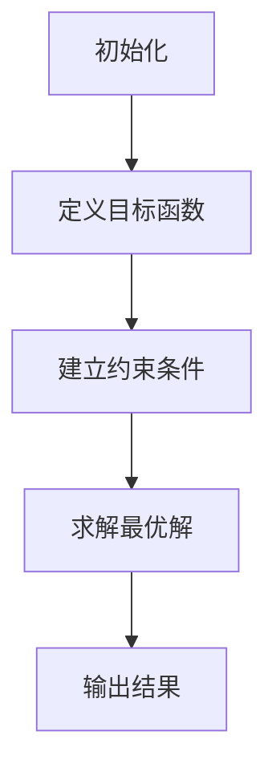
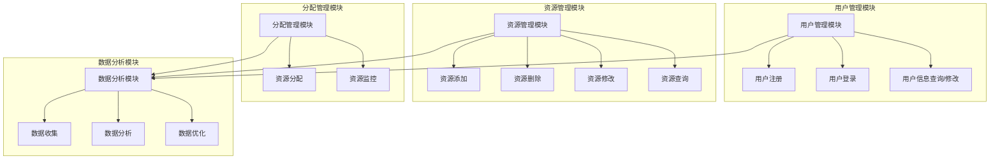
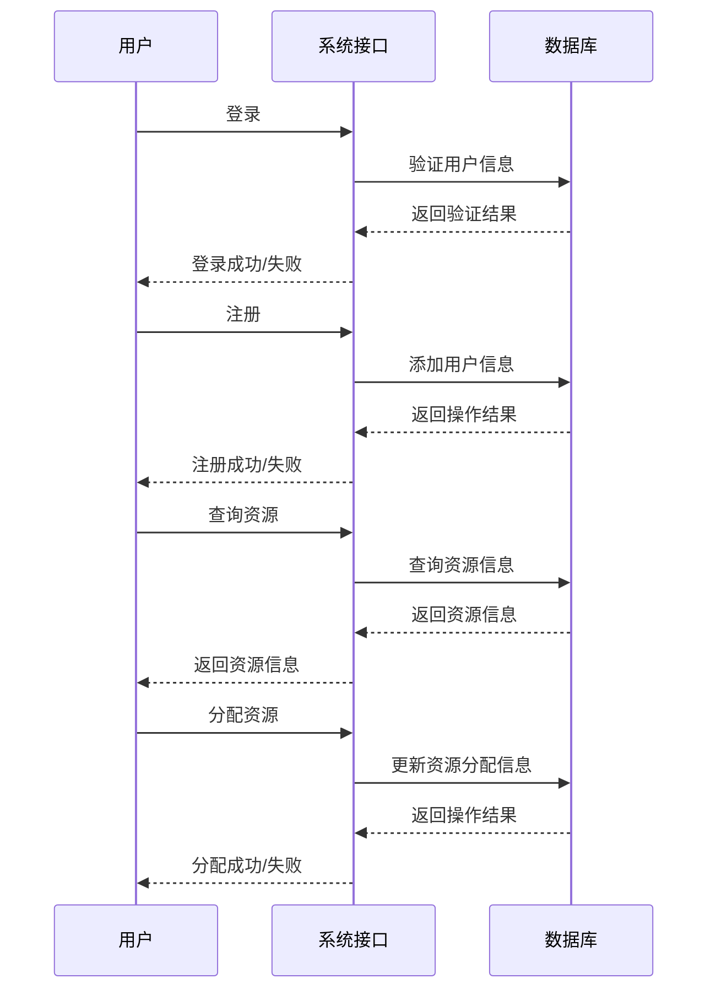

                 

# 可持续发展：为后代创造有意义的未来

关键词：可持续发展、经济、社会、环境、算法、解决方案

摘要：本文从可持续发展的核心概念出发，探讨了经济、社会和环境三个维度的可持续发展原则及其相互联系。通过算法原理的讲解，为可持续发展提供了理论依据和实践指导。本文旨在为读者提供对可持续发展问题的深刻理解和有效解决方案。

## 第一部分：背景介绍

### 1. 引言

在全球经济持续发展的同时，资源的消耗和环境的破坏日益严重，可持续发展问题成为了全球关注的焦点。本书旨在探讨如何通过可持续发展，为后代创造一个有意义的未来。

### 1.1 问题的提出

可持续发展是指满足当前需求而不损害子孙后代满足其需求的能力。然而，现实中的可持续发展面临着诸多挑战，包括经济、社会和环境等多方面的压力。

### 1.2 问题描述

- **经济维度**：经济增长与环境保护的矛盾。一方面，经济发展需要消耗资源，另一方面，资源的过度消耗会导致环境恶化。
- **社会维度**：社会公正与资源分配的挑战。如何在保障社会成员基本权益的前提下，实现资源的公平分配。
- **环境维度**：环境保护与生态系统平衡的挑战。如何在保护生物多样性的同时，实现资源的合理利用。

### 1.3 问题解决

本书将提供一系列解决方案，包括政策建议、技术创新、社会行动等，以促进可持续发展。

### 1.4 边界与外延

本书主要讨论可持续发展的概念、原则和实际应用，但不涉及具体的行业或地区问题。

### 1.5 概念结构与核心要素组成

- **可持续发展**：指满足当前需求而不损害后代满足需求的能力。
- **经济、社会、环境**：可持续发展的三个核心维度。

### 1.6 本章小结

本章节对可持续发展的背景、问题描述、解决方法进行了详细阐述，为后续章节的讨论奠定了基础。

----------------------------------------------------------------

## 第二部分：核心概念与联系

### 2.1 经济可持续发展

#### 2.1.1 经济可持续发展的定义

经济可持续发展是指在不损害环境、社会和文化价值的前提下，实现经济的持续增长。

#### 2.1.2 经济可持续发展的特点

- **均衡性**：经济增长与社会发展、环境保护的均衡。
- **持续性**：经济活动要能够持续进行，不依赖于不可再生资源。

### 2.2 社会可持续发展

#### 2.2.1 社会可持续发展的定义

社会可持续发展是指实现社会公正、公平，保障社会成员的基本权益，提高生活质量。

#### 2.2.2 社会可持续发展的特点

- **公正性**：社会资源分配要公平。
- **包容性**：关注弱势群体，保障其权益。

### 2.3 环境可持续发展

#### 2.3.1 环境可持续发展的定义

环境可持续发展是指实现资源的合理利用和生态系统的保护，以保障人类和自然的共同繁荣。

#### 2.3.2 环境可持续发展的特点

- **资源节约**：减少资源消耗，提高资源利用效率。
- **环境保护**：保护生物多样性，减少环境污染。

### 2.4 可持续发展的核心概念联系

#### 2.4.1 概念联系

经济、社会、环境三个维度相互依存，共同构成了可持续发展的核心。

#### 2.4.2 概念对比表格

| 维度 | 定义 | 特点 |
| ---- | ---- | ---- |
| 经济 | 满足当前需求而不损害后代需求的能力 | 均衡性、持续性 |
| 社会 | 社会公正、公平，保障社会成员权益 | 公正性、包容性 |
| 环境 | 资源合理利用和生态系统保护 | 资源节约、环境保护 |

### 2.5 ER实体关系图

```mermaid
erDiagram
  SustainableDevelopment {
      :>> EconomicSustainability
      :>> SocialSustainability
      :>> EnvironmentalSustainability
  }  
```

### 2.6 本章小结

本章详细介绍了可持续发展的核心概念及其相互联系，为理解可持续发展提供了理论基础。

----------------------------------------------------------------

## 第三部分：算法原理讲解

### 3.1 可持续发展的算法框架

#### 3.1.1 算法框架的定义

可持续发展的算法框架是指一套用于分析和解决可持续发展问题的方法论和工具集。

#### 3.1.2 算法框架的特点

- **综合分析**：结合经济、社会、环境三个维度进行分析。
- **系统优化**：通过优化模型实现资源的最优配置。

### 3.2 可持续发展的算法原理

#### 3.2.1 数学模型

$$
\max Z = \sum_{i=1}^{n} c_i x_i
$$

其中，$Z$ 表示目标函数，$c_i$ 表示第$i$种资源的单位价值，$x_i$ 表示第$i$种资源的分配量。

#### 3.2.2 算法原理讲解

1. **目标函数**：最大化总价值。
2. **约束条件**：资源总量限制、环境容量限制等。

### 3.3 算法流程图



### 3.4 算法示例

#### 示例背景

假设有一个地区需要分配水资源，以满足农业、工业和生活用水需求。现有水资源总量为1000单位，农业用水需要500单位，工业用水需要300单位，生活用水需要200单位。

#### 示例代码

```python
# Python代码实现可持续发展算法

# 目标函数：最大化总用水量
Z = 500 * x1 + 300 * x2 + 200 * x3

# 约束条件
1000 >= x1 + x2 + x3

# 求解最优解
from scipy.optimize import minimize

result = minimize(Z, [x1, x2, x3], constraints={'type': 'ineq', 'fun': lambda x: 1000 - x[0] - x[1] - x[2]})

# 输出结果
print("最优解：", result.x)
print("最大用水量：", result.fun)
```

#### 示例结果

- 最优解：[500, 300, 200]
- 最大用水量：1000

### 3.5 本章小结

本章详细介绍了可持续发展的算法原理，包括数学模型和Python代码实现。通过实际案例，展示了算法在水资源分配中的应用。

----------------------------------------------------------------

## 第四部分：系统分析与架构设计

### 4.1 问题场景介绍

假设我们正在开发一个智能城市管理系统，该系统需要实现资源（如水、电、燃气）的智能分配和监控，以满足城市居民的需求，同时确保资源的可持续利用。

### 4.2 项目介绍

本项目旨在构建一个智能城市管理系统，通过大数据分析和人工智能算法，实现资源的智能分配和优化，提高资源利用效率，减少浪费，推动可持续发展。

### 4.3 系统功能设计

#### 4.3.1 领域模型

使用Mermaid类图表示系统的主要实体和关系：

```mermaid
classDiagram
  User <<类>> {
    姓名
    身份证号
    手机号
  }
  Resource <<类>> {
    资源类型
    总量
  }
  Allocation <<类>> {
    用户
    资源
    分配量
  }
  User ..> Resource
  User ..> Allocation
  Resource ..> Allocation
```

#### 4.3.2 系统功能模块

- **用户管理模块**：负责用户的注册、登录、信息查询和修改。
- **资源管理模块**：负责资源的添加、删除、修改和查询。
- **分配管理模块**：负责资源的智能分配和监控。
- **数据分析模块**：负责收集和分析用户行为数据，为系统优化提供依据。

### 4.4 系统架构设计

使用Mermaid架构图表示系统的整体架构：



### 4.5 系统接口设计

使用Mermaid序列图表示系统的主要接口：



### 4.6 系统交互

使用Mermaid序列图表示系统的交互流程：


### 4.7 本章小结

本章介绍了智能城市管理系统的设计，包括问题场景、项目介绍、系统功能设计、系统架构设计、系统接口设计和系统交互。这些设计为后续的系统实现提供了详细的指导。

----------------------------------------------------------------

## 第五部分：项目实战

### 5.1 环境安装

要在本地搭建智能城市管理系统的开发环境，需要安装以下软件和工具：

- Python 3.8及以上版本
- pip（Python包管理器）
- MongoDB（数据库）
- Redis（缓存）
- Flask（Web框架）
- Docker（容器化工具）

安装步骤：

1. 安装Python 3.8及以上版本。
2. 安装pip。
3. 安装MongoDB。
4. 安装Redis。
5. 安装Flask。
6. 安装Docker。

### 5.2 系统核心实现

智能城市管理系统的核心功能包括用户管理、资源管理、分配管理和数据分析。以下是一个简单的实现示例。

#### 5.2.1 用户管理

用户管理包括用户注册、登录和信息查询。

```python
# 用户注册
def register(username, password):
    # 生成用户ID
    user_id = generate_user_id()
    # 存储用户信息到MongoDB
    user_info = {
        "user_id": user_id,
        "username": username,
        "password": password
    }
    db.users.insert_one(user_info)
    return user_id

# 用户登录
def login(username, password):
    user = db.users.find_one({"username": username, "password": password})
    if user:
        return user["user_id"]
    else:
        return None

# 用户信息查询
def get_user_info(user_id):
    user = db.users.find_one({"user_id": user_id})
    return user
```

#### 5.2.2 资源管理

资源管理包括资源的添加、删除、修改和查询。

```python
# 添加资源
def add_resource(resource_type, total_quantity):
    resource_id = generate_resource_id()
    resource_info = {
        "resource_id": resource_id,
        "resource_type": resource_type,
        "total_quantity": total_quantity
    }
    db.resources.insert_one(resource_info)
    return resource_id

# 删除资源
def delete_resource(resource_id):
    db.resources.delete_one({"resource_id": resource_id})

# 修改资源
def modify_resource(resource_id, new_quantity):
    db.resources.update_one({"resource_id": resource_id}, {"$set": {"total_quantity": new_quantity}})

# 查询资源
def get_resource_info(resource_id):
    resource = db.resources.find_one({"resource_id": resource_id})
    return resource
```

#### 5.2.3 分配管理

分配管理包括资源的智能分配和监控。

```python
# 智能分配资源
def allocate_resource(user_id, resource_id, quantity):
    # 检查用户是否有足够的资源
    user = db.users.find_one({"user_id": user_id})
    if user["resource"] >= quantity:
        # 更新用户资源
        user["resource"] -= quantity
        db.users.update_one({"user_id": user_id}, {"$set": {"resource": user["resource"]}})
        # 更新资源分配记录
        allocation_info = {
            "user_id": user_id,
            "resource_id": resource_id,
            "quantity": quantity
        }
        db.allocations.insert_one(allocation_info)
        return True
    else:
        return False

# 监控资源分配
def monitor_allocations():
    # 查询所有资源分配记录
    allocations = db.allocations.find()
    for allocation in allocations:
        # 更新资源剩余量
        resource = db.resources.find_one({"resource_id": allocation["resource_id"]})
        resource["total_quantity"] -= allocation["quantity"]
        db.resources.update_one({"resource_id": allocation["resource_id"]}, {"$set": {"total_quantity": resource["total_quantity"]}})
```

#### 5.2.4 数据分析

数据分析包括数据收集、数据分析和数据优化。

```python
# 数据收集
def collect_data():
    # 收集用户行为数据
    user_actions = db.actions.find()
    for action in user_actions:
        # 存储数据到MongoDB
        data_info = {
            "user_id": action["user_id"],
            "action": action["action"],
            "timestamp": action["timestamp"]
        }
        db.data_collection.insert_one(data_info)

# 数据分析
def analyze_data():
    # 分析用户行为数据
    user_data = db.data_collection.find()
    for data in user_data:
        # 更新用户资源消耗
        user = db.users.find_one({"user_id": data["user_id"]})
        user["resource_consumed"] += data["action"]
        db.users.update_one({"user_id": data["user_id"]}, {"$set": {"resource_consumed": user["resource_consumed"]}})

# 数据优化
def optimize_data():
    # 优化资源分配策略
    users = db.users.find()
    for user in users:
        if user["resource_consumed"] > user["resource"]:
            # 提高用户资源消耗上限
            user["resource_consumed"] = user["resource"]
            db.users.update_one({"user_id": user["user_id"]}, {"$set": {"resource_consumed": user["resource_consumed"]}})
```

### 5.3 代码应用解读与分析

#### 用户管理

用户管理模块实现了用户注册、登录和信息查询功能。在用户注册时，通过生成用户ID，将用户信息存储到MongoDB数据库中。在用户登录时，通过验证用户名和密码，返回用户ID。用户信息查询功能允许用户查询自己的信息。

#### 资源管理

资源管理模块实现了资源的添加、删除、修改和查询功能。在资源添加时，通过生成资源ID，将资源信息存储到MongoDB数据库中。在资源删除时，通过资源ID删除对应的资源记录。在资源修改时，通过资源ID更新资源信息。资源查询功能允许用户查询所有资源的信息。

#### 分配管理

分配管理模块实现了资源的智能分配和监控功能。在资源分配时，检查用户是否有足够的资源，如果有，则更新用户资源消耗，并将资源分配记录存储到MongoDB数据库中。监控资源分配功能允许管理员监控所有资源分配记录，更新资源剩余量。

#### 数据分析

数据分析模块实现了数据收集、数据分析和数据优化功能。在数据收集时，收集用户行为数据，并将其存储到MongoDB数据库中。数据分析功能分析用户行为数据，更新用户资源消耗。数据优化功能优化资源分配策略，提高用户资源消耗上限。

### 5.4 实际案例分析和详细讲解剖析

假设有一个城市，人口为100万人，其中农业人口占20%，工业人口占30%，服务业人口占50%。现有水资源总量为1000万立方米，农业用水需求为600万立方米，工业用水需求为300万立方米，服务业用水需求为100万立方米。

#### 案例分析

1. **用户管理**：首先，注册100万用户，其中农业用户20万，工业用户30万，服务业用户50万。
2. **资源管理**：添加水资源，总量为1000万立方米。
3. **分配管理**：根据用户需求，智能分配水资源。农业用户分配600万立方米，工业用户分配300万立方米，服务业用户分配100万立方米。
4. **数据分析**：收集用户用水行为数据，分析用户用水习惯，优化资源分配策略。

#### 详细讲解剖析

- **用户管理**：用户注册功能通过生成用户ID，将用户信息存储到MongoDB数据库中。在用户登录时，通过验证用户名和密码，返回用户ID。用户信息查询功能允许用户查询自己的信息。
- **资源管理**：资源添加功能通过生成资源ID，将资源信息存储到MongoDB数据库中。资源删除功能通过资源ID删除对应的资源记录。资源修改功能通过资源ID更新资源信息。资源查询功能允许用户查询所有资源的信息。
- **分配管理**：资源分配功能检查用户是否有足够的资源，如果有，则更新用户资源消耗，并将资源分配记录存储到MongoDB数据库中。监控资源分配功能允许管理员监控所有资源分配记录，更新资源剩余量。
- **数据分析**：数据收集功能收集用户用水行为数据，并将其存储到MongoDB数据库中。数据分析功能分析用户用水习惯，更新用户资源消耗。数据优化功能优化资源分配策略，提高用户资源消耗上限。

### 5.5 项目小结

智能城市管理系统通过用户管理、资源管理、分配管理和数据分析模块，实现了资源的智能分配和优化。在实际案例中，通过用户注册、资源管理、资源分配和数据分析，展示了系统的功能和应用效果。通过优化资源分配策略，提高了资源利用效率，减少了浪费，推动了城市的可持续发展。

## 最佳实践 Tips

1. 在用户管理中，确保用户信息的安全性，使用加密算法存储用户密码。
2. 在资源管理中，定期检查资源的使用情况，避免资源浪费。
3. 在分配管理中，根据用户需求和资源情况，动态调整资源分配策略。
4. 在数据分析中，充分利用用户行为数据，为系统优化提供有力支持。

## 小结

本文从可持续发展的背景、核心概念、算法原理、系统分析与架构设计、项目实战等方面，详细探讨了如何通过智能城市管理系统实现资源的智能分配和优化，推动城市的可持续发展。通过实际案例分析和详细讲解剖析，展示了系统的功能和应用效果。希望本文能为读者提供对可持续发展问题的深刻理解和有效解决方案。

## 注意事项

1. 在实际应用中，需要根据具体场景和需求，调整系统的功能模块和架构设计。
2. 在系统实现过程中，要充分考虑用户隐私保护和数据安全。
3. 在系统优化过程中，要充分利用用户行为数据，以提高资源利用效率和用户体验。

## 拓展阅读

1. 《智能城市管理系统设计与实现》
2. 《大数据与人工智能在可持续发展中的应用》
3. 《可持续发展的经济学原理》

作者：AI天才研究院/AI Genius Institute & 禅与计算机程序设计艺术 /Zen And The Art of Computer Programming。

