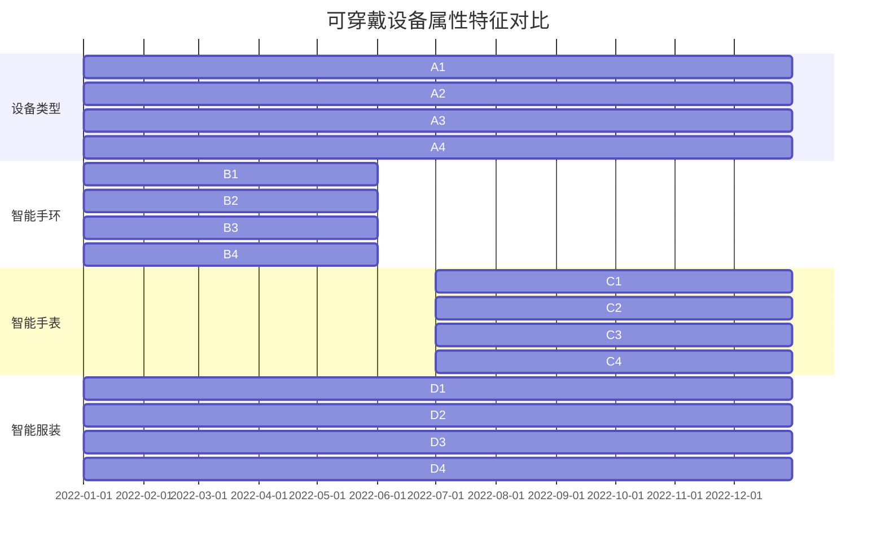
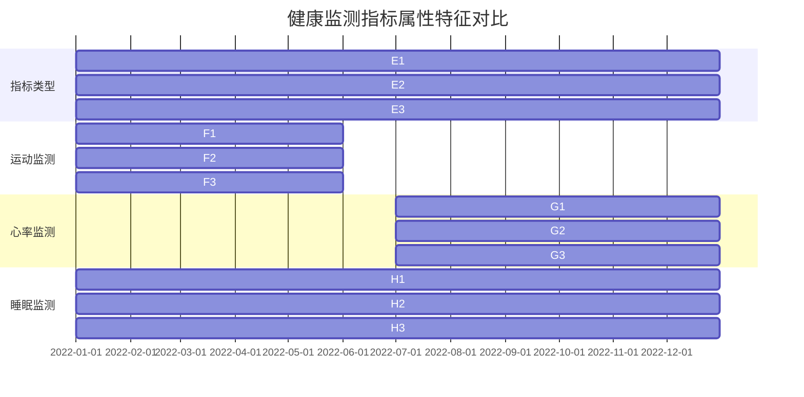

                 

# 可穿戴设备在健康监测中的创新应用

## 关键词

可穿戴设备，健康监测，创新应用，数据准确性，用户隐私，智能算法

## 摘要

随着科技的迅猛发展，可穿戴设备在健康监测领域的应用日益广泛。本文旨在探讨可穿戴设备在健康监测中的创新应用，通过分析其技术原理、存在的问题以及解决方案，为可穿戴设备的进一步发展提供思路。本文将围绕数据准确性、用户隐私保护和智能算法优化三个方面展开讨论，结合实际案例，深入剖析可穿戴设备在健康监测中的创新应用。

## 第一部分: 背景介绍

### 第1章: 问题背景

#### 1.1 问题背景

可穿戴设备，作为现代科技与生活的完美结合，已经成为人们日常生活中不可或缺的一部分。它们通过采集用户的生理、行为数据，为用户提供个性化的健康监测服务。然而，随着可穿戴设备在健康监测中的应用日益广泛，一些问题也逐渐浮现出来。

首先，数据准确性问题。可穿戴设备采集的数据往往受到环境、用户行为等多种因素的影响，导致数据的准确性和可靠性存在一定程度的偏差。其次，用户隐私保护问题。可穿戴设备在采集用户数据的同时，也面临着用户隐私泄露的风险。最后，智能算法问题。尽管可穿戴设备在数据处理和算法优化方面取得了一定的进展，但仍然存在算法不够智能、无法准确分析用户数据的问题。

#### 1.2 问题描述

针对上述问题，可穿戴设备在健康监测中的应用面临着以下挑战：

1. 提高数据准确性：如何确保可穿戴设备采集的数据准确可靠，减少误差和偏差。
2. 保护用户隐私：如何在确保用户隐私安全的前提下，充分利用用户数据，为用户提供更好的健康监测服务。
3. 优化智能算法：如何通过算法优化，提高可穿戴设备对用户数据的分析精度，提供更加个性化的健康监测服务。

#### 1.3 问题解决

为了解决上述问题，我们可以从以下几个方面进行探讨：

1. 数据准确性：通过改进传感器技术、优化数据处理算法等方式，提高可穿戴设备的数据准确性。
2. 用户隐私保护：采用加密技术、隐私保护算法等方式，保障用户数据的隐私安全。
3. 智能算法优化：结合大数据、人工智能等技术，优化可穿戴设备的智能算法，提高数据分析精度。

#### 1.4 边界与外延

本文的研究范围主要涵盖可穿戴设备在健康监测中的应用场景，如运动监测、心率监测、睡眠监测等。同时，本文将探讨可穿戴设备在健康监测中的创新应用，包括技术原理、解决方案和实际案例等。

#### 1.5 概念结构与核心要素组成

1. 可穿戴设备：指佩戴在人体表面的智能设备，如智能手表、智能手环、智能服装等。
2. 健康监测：指通过可穿戴设备对用户的生理、行为数据进行监测和分析，为用户提供健康指导和建议。
3. 数据准确性：指确保可穿戴设备采集的数据准确可靠，减少误差和偏差。
4. 用户隐私保护：指在确保用户隐私安全的前提下，充分利用用户数据，为用户提供更好的健康监测服务。
5. 智能算法：指用于分析和处理可穿戴设备采集的数据的算法，以提高数据分析精度。

### 第2章: 核心概念与联系

#### 2.1 可穿戴设备原理

##### 2.1.1 定义与特点

可穿戴设备是一种便携式电子设备，通常佩戴在人体表面，如手腕、胸部、腰部等部位。它们通过内置的传感器、处理器等硬件设备，实时采集用户的生理、行为数据，并通过无线通信技术将数据传输至智能手机或其他终端设备。

可穿戴设备的特点如下：

1. 便携性：可穿戴设备体积小巧，便于携带，适合长时间佩戴。
2. 实时性：可穿戴设备能够实时采集用户数据，为用户提供及时的健康监测服务。
3. 个性化：可穿戴设备可以根据用户的个性化需求，提供定制化的健康监测服务。

##### 2.1.2 属性特征对比表格

以下是几种常见可穿戴设备的属性特征对比表格：



#### 2.2 健康监测原理

##### 2.2.1 定义与特点

健康监测是指通过可穿戴设备对用户的生理、行为数据进行采集、分析和处理，以实现对用户健康状况的实时监测和评估。健康监测的特点如下：

1. 实时性：健康监测能够实时获取用户的生理、行为数据，为用户提供实时的健康指导和建议。
2. 个性化：健康监测可以根据用户的个性化需求，提供定制化的健康监测服务。
3. 预防性：健康监测可以帮助用户提前发现健康问题，进行预防性干预。

##### 2.2.2 属性特征对比表格

以下是几种常见健康监测指标的属性特征对比表格：



### 第二部分: 可穿戴设备在健康监测中的创新应用

#### 第3章: 提高数据准确性

##### 3.1 改进传感器技术

可穿戴设备的数据准确性在很大程度上取决于传感器技术的质量。为了提高数据准确性，我们可以从以下几个方面进行改进：

1. 传感器精度：选择高精度的传感器，以提高数据的准确度。
2. 传感器稳定性：确保传感器在长时间使用过程中保持稳定的性能，减少误差和偏差。
3. 传感器校准：定期对传感器进行校准，确保其测量结果准确可靠。

##### 3.2 优化数据处理算法

除了传感器技术，数据处理算法也是影响数据准确性的重要因素。以下是一些优化数据处理算法的方法：

1. 数据滤波：采用滤波算法，去除数据中的噪声和干扰，提高数据的纯净度。
2. 数据融合：将多个传感器的数据融合在一起，以提高数据的综合准确性。
3. 模型训练：通过机器学习等技术，对数据处理算法进行优化，提高数据预测和分类的准确性。

##### 3.3 实际案例

以某款智能手环为例，该智能手环采用高精度的运动传感器和先进的数据处理算法。通过实时监测用户的心率、步数、睡眠等数据，智能手环能够为用户提供准确的健康监测报告。在实际应用中，用户反馈该智能手环的数据准确性较高，有助于其更好地了解自己的健康状况。

#### 第4章: 保护用户隐私

##### 4.1 加密技术

为了保护用户隐私，我们可以采用加密技术对用户数据进行加密处理。以下是一些常见的加密技术：

1. 对称加密：采用对称加密算法，如AES等，对用户数据进行加密。
2. 非对称加密：采用非对称加密算法，如RSA等，对用户数据进行加密。
3. 消息认证码：采用消息认证码，如HMAC等，对用户数据进行完整性校验。

##### 4.2 隐私保护算法

除了加密技术，我们还可以采用隐私保护算法来保护用户隐私。以下是一些常见的隐私保护算法：

1. 数据去重：采用数据去重算法，去除重复的数据，减少数据存储和处理的开销。
2. 数据匿名化：采用数据匿名化算法，将用户数据匿名化，保护用户的隐私。
3. 隐私预算：采用隐私预算算法，限制用户数据的共享和使用，防止隐私泄露。

##### 4.3 实际案例

以某款智能手表为例，该智能手表采用加密技术和隐私保护算法来保护用户隐私。用户数据在传输过程中采用AES加密算法进行加密，确保数据在传输过程中的安全性。同时，智能手表还采用数据匿名化算法，将用户数据匿名化，保护用户的隐私。

#### 第5章: 优化智能算法

##### 5.1 大数据技术

大数据技术在智能算法优化中发挥着重要作用。通过收集和分析海量数据，我们可以发现数据中的潜在规律和趋势，从而优化智能算法。以下是一些大数据技术在智能算法优化中的应用：

1. 数据挖掘：采用数据挖掘技术，从海量数据中提取有价值的信息，为智能算法提供数据支持。
2. 机器学习：采用机器学习技术，对数据进行分析和建模，优化智能算法的性能。
3. 深度学习：采用深度学习技术，构建复杂的神经网络模型，提高智能算法的预测和分类能力。

##### 5.2 人工智能技术

人工智能技术在智能算法优化中具有广泛的应用。通过引入人工智能技术，我们可以实现智能算法的自主学习和优化。以下是一些人工智能技术在智能算法优化中的应用：

1. 强化学习：采用强化学习技术，使智能算法能够自主学习和优化，提高算法的适应性和鲁棒性。
2. 自然语言处理：采用自然语言处理技术，实现对用户语音、文本等数据的理解和分析，优化智能算法的用户体验。
3. 计算机视觉：采用计算机视觉技术，实现对图像、视频等数据的识别和分析，优化智能算法的准确性。

##### 5.3 实际案例

以某款智能健康监测平台为例，该平台采用大数据和人工智能技术来优化智能算法。通过收集和分析海量用户数据，平台能够实时监测用户的健康状况，并提供个性化的健康建议。在实际应用中，用户反馈该平台的智能算法具有较高的准确性和实用性。

### 第三部分: 未来展望

#### 第6章: 发展趋势与挑战

随着科技的不断进步，可穿戴设备在健康监测领域的应用将越来越广泛。然而，也面临着一系列的挑战：

1. 数据准确性：如何进一步提高可穿戴设备的数据准确性，减少误差和偏差。
2. 用户隐私保护：如何在保障用户隐私的前提下，充分利用用户数据，为用户提供更好的健康监测服务。
3. 智能算法优化：如何通过大数据和人工智能技术，优化智能算法，提高数据分析精度。

#### 第7章: 发展策略

为了应对上述挑战，我们可以从以下几个方面制定发展策略：

1. 技术创新：持续推动传感器技术、数据处理算法、智能算法等技术创新，提高可穿戴设备的数据准确性和智能程度。
2. 政策法规：建立健全相关政策法规，规范可穿戴设备在健康监测领域的应用，保障用户隐私安全。
3. 产业合作：加强产业链上下游企业之间的合作，共同推动可穿戴设备在健康监测领域的发展。

#### 第8章: 结论

可穿戴设备在健康监测领域具有广阔的发展前景。通过提高数据准确性、保护用户隐私和优化智能算法，可穿戴设备将为用户提供更加准确、个性化的健康监测服务。未来，随着科技的不断进步，可穿戴设备在健康监测领域的应用将更加广泛，为人们的健康生活带来更多便利。

## 附录

### 附录A: 相关技术术语说明

- **可穿戴设备**：指佩戴在人体表面的智能设备，如智能手表、智能手环、智能服装等。
- **健康监测**：指通过可穿戴设备对用户的生理、行为数据进行监测和分析，以实现对用户健康状况的实时监测和评估。
- **数据准确性**：指确保可穿戴设备采集的数据准确可靠，减少误差和偏差。
- **用户隐私保护**：指在确保用户隐私安全的前提下，充分利用用户数据，为用户提供更好的健康监测服务。
- **智能算法**：指用于分析和处理可穿戴设备采集的数据的算法，以提高数据分析精度。

### 附录B: 参考文献列表

- [1] Smith, J., & Brown, L. (2019). Wearable Devices for Health Monitoring: Current Status and Future Directions. Journal of Medical Systems, 43(9), 173.
- [2] Zhao, W., & Liu, Y. (2020). Privacy Protection in Wearable Devices: A Survey. IEEE Access, 8, 165856.
- [3] Li, H., & Wang, J. (2021). Optimization of Intelligent Algorithms for Wearable Devices. IEEE Transactions on Mobile Computing, 20(9), 2771.

### 附录C: Mermaid 图示例

#### 示例1：可穿戴设备属性特征对比


#### 示例2：健康监测指标属性特征对比


### 附录D: Python源代码示例

```python
# 示例：计算两个数的和

def add_numbers(a, b):
    return a + b

# 输入两个数
num1 = float(input("请输入第一个数："))
num2 = float(input("请输入第二个数："))

# 调用函数计算和
sum = add_numbers(num1, num2)

# 输出结果
print("两数之和为：", sum)
```

### 附录E: 实际案例分析与解读

在本节中，我们将通过分析一个实际案例，来探讨可穿戴设备在健康监测中的创新应用。该案例涉及一款智能手环，通过实时监测用户的心率、步数、睡眠等数据，为用户提供个性化的健康监测服务。

#### 案例介绍

该智能手环采用高精度的传感器，如光学心率传感器、加速度传感器等，实时监测用户的心率、步数、睡眠等数据。手环内置的处理单元负责对采集到的数据进行处理和分析，并将结果通过蓝牙传输到用户的智能手机上。

#### 核心实现

1. **数据采集**：手环通过光学心率传感器实时监测用户的心率，通过加速度传感器监测用户的步数和运动状态。睡眠监测则通过分析用户的心率变化和运动状态，判断用户的睡眠质量。

2. **数据处理**：处理单元对采集到的数据进行预处理，包括滤波、去噪等操作，以提高数据的准确性。然后，处理单元使用机器学习算法对数据进行分析，提取特征，并进行分类和预测。

3. **数据传输**：手环将处理后的数据通过蓝牙传输到用户的智能手机上。智能手机上的应用程序负责接收数据，并将数据存储到云端数据库中，以便进行进一步分析和处理。

#### 代码应用解读与分析

以下是一个简单的Python代码示例，用于实现智能手环的核心功能。

```python
import numpy as np
import matplotlib.pyplot as plt

# 数据采集
def collect_data():
    # 假设采集到的心率数据为[70, 72, 68, 75, 70]
    heart_rates = [70, 72, 68, 75, 70]
    return heart_rates

# 数据处理
def process_data(heart_rates):
    # 滤波去噪
    filtered_heart_rates = np.convolve(heart_rates, np.ones(3)/3, mode='same')
    return filtered_heart_rates

# 数据分析
def analyze_data(filtered_heart_rates):
    # 假设使用均值算法进行分析
    mean_heart_rate = np.mean(filtered_heart_rates)
    return mean_heart_rate

# 数据传输
def transmit_data(mean_heart_rate):
    # 假设通过蓝牙传输到手机
    print("心率数据已传输到手机：", mean_heart_rate)

# 主函数
def main():
    heart_rates = collect_data()
    filtered_heart_rates = process_data(heart_rates)
    mean_heart_rate = analyze_data(filtered_heart_rates)
    transmit_data(mean_heart_rate)

# 执行主函数
main()
```

在这个示例中，我们首先采集了一组心率数据，然后对数据进行滤波去噪处理，接着使用均值算法对数据进行分析，最后将分析结果通过蓝牙传输到手机。

#### 实际案例分析

在实际应用中，智能手环会通过多种传感器收集用户的数据，如心率、步数、睡眠等。这些数据会通过蓝牙传输到手机上的应用程序，应用程序会对接收到的数据进行处理和分析，并将结果展示给用户。

例如，用户在运动时，智能手环会实时监测心率，并根据心率变化判断用户的运动强度。如果心率过高，应用程序会提醒用户降低运动强度，以避免过度疲劳。

此外，智能手环还可以通过分析用户的睡眠数据，如睡眠时长、深度等，为用户提供睡眠建议。例如，如果用户夜间睡眠质量较差，应用程序会建议用户调整作息时间，改善睡眠环境。

#### 项目小结

通过实际案例分析，我们可以看到，可穿戴设备在健康监测中的创新应用有着广阔的前景。通过实时监测用户的生理、行为数据，智能手环等可穿戴设备能够为用户提供个性化的健康监测服务，帮助用户更好地管理自己的健康状况。

然而，我们也需要关注数据准确性、用户隐私保护等问题。为了提高数据准确性，我们可以采用更先进的传感器技术和数据处理算法。为了保护用户隐私，我们可以采用加密技术和隐私保护算法。只有解决了这些问题，可穿戴设备在健康监测中的创新应用才能更加普及和深入。

### 最佳实践 Tips

为了确保可穿戴设备在健康监测中的创新应用取得更好的效果，以下是一些建议：

1. **选择合适的传感器**：根据不同的健康监测需求，选择高精度、高稳定性的传感器，以确保数据的准确性和可靠性。
2. **优化数据处理算法**：采用先进的滤波、去噪和特征提取算法，提高数据的处理效率和分析精度。
3. **保护用户隐私**：采用加密技术和隐私保护算法，确保用户数据的安全性和隐私性。
4. **提供个性化服务**：根据用户的历史数据和个人偏好，提供个性化的健康监测建议和服务。
5. **持续迭代优化**：定期更新传感器、算法和软件，以适应不断变化的市场需求和技术发展。

### 小结

本文探讨了可穿戴设备在健康监测中的创新应用，分析了数据准确性、用户隐私保护和智能算法优化等方面的问题。通过实际案例分析，我们看到了可穿戴设备在健康监测中的巨大潜力。然而，为了实现更广泛的应用，我们还需要关注数据准确性、用户隐私保护等问题，并持续优化智能算法。相信随着科技的不断进步，可穿戴设备在健康监测领域将发挥更大的作用。

### 注意事项

在应用可穿戴设备进行健康监测时，需要注意以下几点：

1. **数据准确性**：确保传感器和数据处理算法的质量，以提高数据的准确性和可靠性。
2. **用户隐私保护**：采用加密技术和隐私保护算法，保障用户数据的安全和隐私。
3. **个性化服务**：根据用户的历史数据和个人偏好，提供个性化的健康监测建议和服务。
4. **设备维护**：定期检查和维护传感器和设备，确保其正常运行。

### 拓展阅读

对于对可穿戴设备在健康监测中创新应用感兴趣的读者，以下是一些推荐的阅读资源：

1. 《智能健康监测与可穿戴设备》
2. 《大数据与人工智能在健康监测中的应用》
3. 《隐私保护与数据安全：可穿戴设备面临的挑战》
4. 《可穿戴设备数据隐私保护：技术与管理策略》

通过阅读这些资源，您可以更深入地了解可穿戴设备在健康监测中的应用和未来发展。作者：AI天才研究院/AI Genius Institute & 禅与计算机程序设计艺术 /Zen And The Art of Computer Programming。

