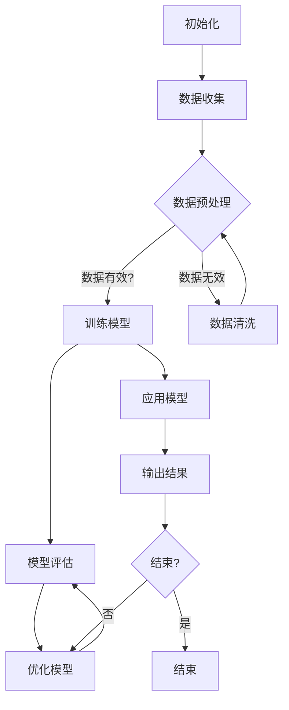
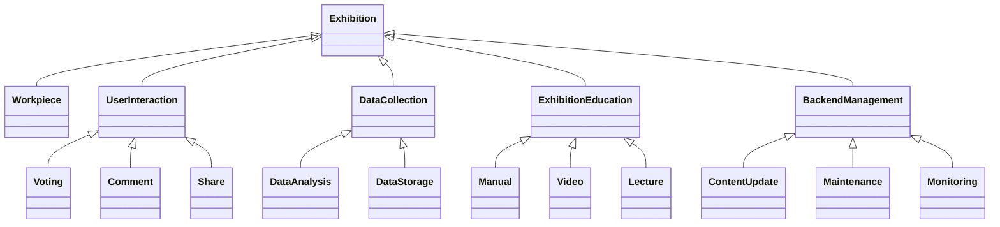
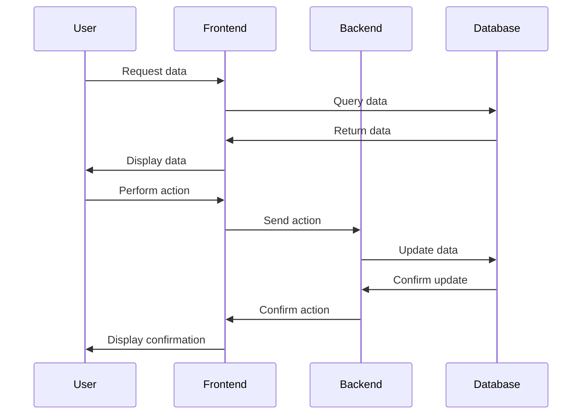
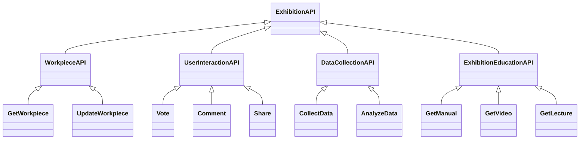
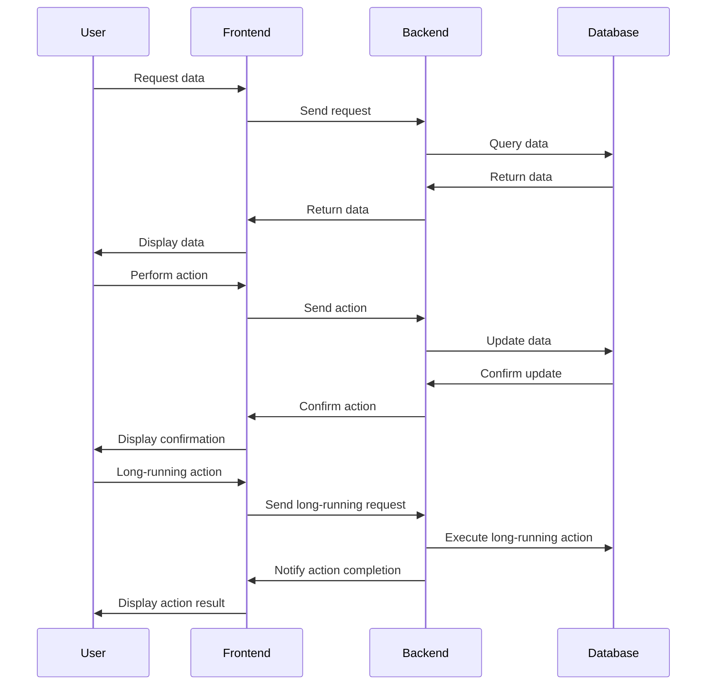

                 

## 引言

在当今这个技术飞速发展的时代，人工智能、虚拟现实、生物技术等前沿科技不断突破人类的认知边界，深刻地影响着我们的生活方式和社会结构。而艺术，作为一种表达人类情感、思考和创造力的独特形式，也开始与技术进行深入的交融。后人类主义艺术展，正是这种融合的产物。

后人类主义（Posthumanism）是一个哲学和文化理论的概念，它强调人类与技术的融合，探讨了人类在科技影响下的变化和未来。在这个背景下，后人类主义艺术展不仅展示了一系列高科技艺术作品，更是一次对技术与人性的深刻探讨。通过这些作品，艺术家们试图探讨技术如何影响我们的认知、情感和行为，以及这些变化对人性本身的意义。

技术与人性的边界问题，成为此次艺术展的核心议题。技术，作为人类智慧的延伸，一方面极大地提升了我们的生产力和生活质量，另一方面也带来了诸如隐私泄露、数字鸿沟、人工智能伦理等新的社会问题。如何在这个边界上找到平衡，如何让技术更好地服务于人类，而不是成为人类的威胁，是每一个科技从业者和每一个社会成员都需要思考的问题。

后人类主义艺术展通过艺术作品的形式，提供了一个思考的场所。展览中的作品利用了最新的科技手段，如人工智能、虚拟现实、增强现实等，让观众在互动中体验到技术带来的变革，同时也引发了对人性本质的深刻思考。这个展览不仅是一次艺术盛宴，更是一场关于技术与人性的哲学探讨。

总之，后人类主义艺术展是一次全新的艺术体验，它不仅仅是对艺术创作的探索，更是对技术发展的反思。通过这样的展览，我们有机会重新审视自己与技术的关系，思考人类在未来的角色和定位。## 问题背景

后人类主义作为一个哲学和文化理论的概念，起源于20世纪中叶，但它的思想根源可以追溯到更早的时期。后人类主义的核心观点是，人类不再是宇宙中唯一的智慧生命形式，技术的进步和生物工程的发展将使人类与机器、生物和其他智能实体融合，形成一个新型的“后人类”群体。这个概念不仅挑战了传统的“人类中心论”，也对科技在人类未来生活中的角色提出了深刻的质疑。

在艺术领域，后人类主义得到了广泛的关注和应用。艺术家们通过不同的媒介和形式，表达了对人类与技术融合的忧虑、期望和幻想。这些作品不仅反映了科技对人类生活的深远影响，也揭示了人类在面对技术变革时的复杂情感和认知变化。

后人类主义艺术展正是这一理论在现实世界中的具体体现。这类展览通常包含了一系列高科技艺术作品，如人工智能创作的音乐、虚拟现实体验的艺术装置、基因艺术作品等。这些作品不仅展示了技术的先进性，更通过艺术手段探索了技术对人类情感、认知和社会结构的冲击。例如，人工智能创作的音乐可能会让观众感受到前所未有的情感体验，而基因艺术作品则引发了关于人类基因编辑和生物伦理的深刻思考。

艺术作品在后人类主义艺术展中扮演着至关重要的角色。首先，艺术作品提供了一个直观的平台，使观众能够直接感受到技术的力量和影响。通过互动体验，观众不仅能够理解技术的功能，更能够感受到技术对人性深层次的影响。其次，艺术作品通过创造性的表达方式，引发观众对技术与人性的边界问题进行深入思考。例如，一些艺术作品可能会通过虚拟现实技术，让观众体验到一种全新的现实，从而引发对现实与虚拟之间界限的探讨。

此外，后人类主义艺术展还通过艺术作品的社会参与性和互动性，促进了公众对科技发展的讨论和反思。艺术家们往往通过作品与社会议题进行对话，从而引发公众对技术伦理、隐私保护、人工智能治理等问题的关注。这种社会参与性不仅使得艺术展本身成为一个公共讨论的平台，也为科技与人文的融合提供了新的可能性。

总之，后人类主义艺术展不仅是一次艺术体验，更是一场关于技术与人性的深刻探讨。通过艺术作品，观众能够更加直观地理解技术的力量和影响，同时也能深入思考人性在技术发展中的角色和意义。这种探讨不仅有助于提升公众对科技的认知和理解，也为未来的科技发展提供了重要的参考和指导。## 问题描述

随着科技的快速发展，人工智能、虚拟现实、增强现实等新技术层出不穷，它们不仅改变了我们的生活方式，也对人类社会的结构和人性产生了深远的影响。后人类主义艺术展通过一系列高科技艺术作品，揭示了这些技术对人类生活带来的诸多挑战和问题。

首先，技术发展对人类生活的影响不可忽视。人工智能的应用，使得自动化和智能化成为现实，极大地提高了生产效率和生产力。然而，这也导致了大量的劳动力失业和就业结构的变化。例如，自动驾驶技术的进步使得出租车司机和货车司机面临失业的风险，而智能客服系统则可能取代一些传统的人工服务岗位。这种变革带来的不仅是职业机会的减少，也带来了社会稳定和经济发展的挑战。

其次，隐私泄露和数据安全成为技术发展带来的重要问题。在数字化时代，个人数据和隐私变得愈发重要，但同时也变得更加脆弱。许多科技产品和服务需要用户提供大量的个人数据，这些数据一旦被不法分子获取，可能会导致严重的隐私泄露和身份盗用。例如，社交媒体平台可能会因数据泄露而引发用户隐私问题，而智能家居设备的广泛应用也使得家庭隐私面临新的威胁。

此外，数字鸿沟问题日益突出。随着互联网和移动设备的普及，发达地区和发展中地区之间的数字鸿沟不断加大。这不仅加剧了社会不平等，也限制了技术的普及和应用。例如，一些偏远地区由于缺乏互联网基础设施，无法享受到数字技术带来的便利，而城乡之间的数字差距也使得教育、医疗等公共服务资源分配不均。

在艺术领域，技术发展带来了新的创作方式和表达手段，但同时也引发了一系列伦理和道德问题。例如，人工智能创作的艺术作品是否具有原创性和艺术价值，人工智能是否能真正理解人类的情感和思维？这些问题不仅挑战了传统艺术的定义，也对艺术创作的未来方向提出了新的思考。

后人类主义艺术展通过展示这些高科技艺术作品，让观众深刻感受到技术对人性和社会结构的冲击。艺术家们利用虚拟现实技术，创造了一种全新的互动体验，使观众在参与中思考技术如何改变他们的认知和行为。基因艺术作品则揭示了生物技术在人类基因编辑和生物伦理方面的争议。

总之，技术发展带来的问题不仅局限于科技领域，更涉及到人类生活的方方面面。后人类主义艺术展通过艺术作品，揭示了这些问题的复杂性和深远影响，引发了公众对技术发展与人性的深刻反思。在这个时代，如何平衡技术的发展与人类的基本需求，如何确保技术在造福人类的同时不会带来新的社会问题，是每一个社会成员都需要共同面对的挑战。## 问题解决

在探讨技术发展带来的挑战时，艺术作品成为了一种独特的解决方式。通过艺术表达，艺术家们不仅揭示了技术对人类生活的影响，还提出了一些潜在的解决方案。以下是对后人类主义艺术展中一些艺术作品的分析，以及它们在解决技术与人性问题方面的尝试。

首先，虚拟现实（VR）和增强现实（AR）技术的应用，为观众提供了一种沉浸式的体验，使他们能够亲身感受到技术的力量。例如，VR艺术装置《第二人生》（Second Life）允许用户在虚拟世界中创建和交互，这种互动性让观众体验到了技术与人类意识的融合。通过在虚拟世界中的互动，观众不仅能感受到技术的魅力，还能反思现实世界中的社会结构和人际关系。这种沉浸式的体验有助于观众更加直观地理解技术的影响，并激发他们对于技术未来的思考和探讨。

其次，基因艺术作品探讨了生物技术在伦理和道德方面的挑战。艺术家如爱德华·弗朗西斯·艾弗里（Edwin A. Abbot）通过展示基因编辑后的生物艺术作品，让观众思考基因编辑的伦理问题。例如，艾弗里的作品《生命之树》（Tree of Life）通过基因编辑创造出一系列具有特殊特征的植物，引发观众对于人类干预自然进程的道德和伦理问题的思考。通过这种形式，艺术家们呼吁公众关注基因编辑技术的潜在风险，并鼓励人们对未来进行深入思考。

此外，人工智能（AI）艺术作品的创作也提供了一种解决方式。艺术家们利用AI技术创作音乐、绘画等作品，探索AI在艺术创作中的潜力。例如，人工智能作曲家如AIVA（Artificial Intelligence Virtual Artist）和Amper Music，通过算法创作出具有独特风格的音乐作品。这些作品不仅展示了AI在艺术创作中的能力，也引发了关于AI是否能够拥有艺术创作灵魂的讨论。通过这种方式，艺术家们试图探讨技术与人类创造力的关系，并思考如何在未来更好地融合二者。

在解决隐私和数据安全问题方面，一些艺术作品通过视觉和互动的形式，向观众传达了隐私泄露和数据安全的紧迫性。例如，作品《数据衣》（Data Dress）通过穿着一件由收集用户数据的传感器制成的衣物，让观众亲身体验数据收集的过程。这种形式不仅提醒观众保护个人隐私的重要性，也探讨了数据所有权和隐私权的边界问题。通过这种方式，艺术家们试图提高公众对于数据安全的认识，并促使社会在技术发展中制定更为严格的隐私保护措施。

最后，数字鸿沟问题在后人类主义艺术展中也有体现。艺术家们通过作品展示了数字技术在不同地区和群体中的普及情况，以及由此带来的社会不平等。例如，一些艺术家利用互联网和社交媒体平台，创作出能够跨越地域和文化界限的作品，旨在缩小数字鸿沟，促进全球文化交流。通过这种方式，艺术家们不仅关注技术带来的问题，还致力于寻找解决方案，以促进技术的普及和应用。

总之，后人类主义艺术展通过一系列高科技艺术作品，探索了技术与人性的边界问题，并提出了一些潜在的解决方式。这些艺术作品不仅为观众提供了深刻的思考和反思，也为社会在技术发展中提供了重要的参考和启示。通过艺术表达，艺术家们成功地将技术问题转化为公众讨论的议题，推动了社会对于技术伦理、隐私保护、数据安全以及数字鸿沟等问题的关注和思考。## 边界与外延

后人类主义艺术展不仅在展示技术与人性的深度交融，也在探讨这一领域的边界与外延。从哲学和社会学的角度来看，后人类主义艺术的边界是一个复杂且动态的领域，涉及多个层面的问题。

首先，技术与人性的融合在哲学上提出了一个根本性的问题：人类身份的本质是什么？随着技术的发展，人类是否能够与机器、生物和其他智能实体相互融合，从而形成新的身份？哲学家们对此展开了热烈的讨论。一些学者认为，人类与技术的融合将打破传统的“人类中心论”，促使人类重新定义自我。例如，尼克·博斯特罗姆（Nick Bostrom）在其著作《人类2.0》（Human 2.0）中探讨了人类通过生物工程和技术增强的可能性，以及这种改变对人性本质的影响。他认为，人类与技术的融合将带来新的伦理和道德挑战，需要我们重新思考人类的价值和意义。

在社会学领域，后人类主义艺术展引发了关于社会结构和人类关系的重新评估。技术的发展不仅改变了人类的生活方式，也影响了社会结构。例如，社会学家齐格蒙特·鲍曼（Zygmunt Bauman）在其著作《液态现代性》（Liquid Modernity）中分析了技术进步带来的社会流动性增加，以及这种流动性对个体和社会的影响。他认为，技术在带来便利的同时，也带来了社会的不确定性和不稳定。这种不确定性使得人们更加依赖于技术，从而在某种程度上改变了人类之间的关系和互动方式。

此外，后人类主义艺术展还涉及了关于艺术本身的定义和范畴。艺术家们利用新兴技术创作出前所未有的作品，挑战了传统艺术的定义。例如，人工智能创作的艺术作品引发了关于艺术创作本质的讨论。一些学者认为，人工智能能够创造出具有艺术价值的作品，因为它能够通过算法模拟人类的创造过程。然而，另一些学者则认为，艺术创作不仅仅是技术手段的运用，更是一种情感和思想的表达。因此，人工智能创作的艺术作品在艺术领域是否具有合法性，依然存在争议。

在伦理和道德方面，后人类主义艺术展也提出了新的挑战。技术的发展带来了新的伦理问题，例如数据隐私、人工智能伦理和生物伦理等。艺术家们通过作品揭示了这些问题，并促使公众对这些议题进行深入的思考和讨论。例如，关于基因编辑和生物伦理的讨论，不仅涉及科学领域，也涉及伦理和道德领域。这种跨学科的探讨使得后人类主义艺术展成为了一个多元和开放的讨论平台。

最后，后人类主义艺术展还涉及了关于文化多样性和全球化的讨论。随着技术的发展，全球化的步伐加快，不同文化之间的交流变得更加频繁和紧密。后人类主义艺术展通过展示多元文化的艺术作品，促进了不同文化之间的理解和融合。例如，一些艺术家利用虚拟现实技术，创作出具有跨文化元素的艺术作品，旨在打破文化和地域的界限，促进全球文化的交流与共享。

总之，后人类主义艺术展不仅在展示技术与人性的深度交融，也在探讨这一领域的边界与外延。通过哲学、社会学、伦理学等多学科的综合探讨，艺术家们和学者们试图重新审视人类与技术的关系，以及这种关系对人性和社会结构的影响。这种跨学科的探讨不仅丰富了后人类主义的理论体系，也为未来的科技发展提供了重要的参考和启示。## 核心概念与联系

在后人类主义艺术展中，有几个核心概念贯穿始终，它们分别是后人类主义、技术、人性、艺术边界。以下将对这些概念进行详细阐述，并使用表格和ER实体关系图来展示它们之间的关系。

### 后人类主义

后人类主义（Posthumanism）是一个哲学和文化理论的概念，强调人类与技术、生物和其他智能实体的融合。它起源于20世纪中叶，在当代科技快速发展背景下得到了广泛关注。后人类主义探讨人类在科技影响下的变化，以及这些变化对人性和社会的影响。其核心观点是，人类不再是宇宙中唯一的智慧生命形式，技术的进步将使人类与其他实体形成新的融合体。

### 技术

技术是后人类主义艺术展中的重要元素，涵盖了人工智能、虚拟现实、增强现实、生物工程等前沿科技。技术不仅为艺术创作提供了新的手段和形式，也带来了新的社会问题和伦理挑战。例如，人工智能和生物技术的应用引发了关于隐私、伦理、就业等方面的讨论。技术在后人类主义艺术展中不仅作为一种创作工具，更作为一种探讨人类与技术关系的媒介。

### 人性

人性是后人类主义艺术展的核心议题之一，探讨了人类在技术影响下的变化和未来。人性不仅包括人类的情感、思维、创造力等内在特质，也涉及人类在社会中的行为和互动。随着技术的发展，人性面临着新的挑战和机遇。例如，虚拟现实技术可能改变人类的感知和体验，基因编辑技术可能改变人类的身体和生理特征。这些变化引发了关于人性本质和意义的深刻思考。

### 艺术边界

艺术边界在后人类主义艺术展中也是一个重要概念，涉及到艺术创作的范围和形式。随着技术的发展，艺术家们开始探索新的创作手段和形式，如虚拟现实艺术、人工智能艺术、基因艺术等。这些新的艺术形式不仅挑战了传统艺术的定义，也拓展了艺术的边界。艺术边界的问题涉及到艺术创作的新可能性、艺术价值的评判标准，以及技术与艺术的融合方式。

### 概念属性特征对比表格

以下是一个对比表格，展示了后人类主义、技术、人性、艺术边界的属性特征：

| 概念       | 属性特征                                                                                                       |
|------------|------------------------------------------------------------------------------------------------------------|
| 后人类主义 | 强调人类与技术、生物和其他智能实体的融合；探讨人类在科技影响下的变化；挑战“人类中心论”。                   |
| 技术       | 涵盖人工智能、虚拟现实、增强现实、生物工程等前沿科技；作为创作工具和探讨媒介。                           |
| 人性       | 包括人类的情感、思维、创造力等内在特质；涉及人类在社会中的行为和互动。                                   |
| 艺术边界   | 涉及艺术创作的范围和形式；挑战传统艺术的定义；探讨技术与艺术的融合。                                   |

### ER实体关系图架构

为了更直观地展示这些概念之间的关系，我们使用Mermaid绘制了一个ER实体关系图：

```mermaid
entityRelationshipDiagram
  autoLabel false
  direction LR

  entity 后人类主义
  entity 技术
  entity 人性
  entity 艺术边界

  relationship 后人类主义 --< 使用 > 技术
  relationship 后人类主义 --< 探讨 > 人性
  relationship 后人类主义 --< 拓展 > 艺术边界

  relationship 技术 --< 应用 > 艺术边界
  relationship 技术 --< 影响 > 人性

  relationship 人性 --< 被影响 > 艺术边界
  relationship 人性 --< 被影响 > 技术
```

在这个ER实体关系图中，后人类主义与技术、人性、艺术边界之间存在紧密的联系。技术作为后人类主义的工具和探讨对象，影响了人性并应用于艺术边界；而人性则被技术和艺术边界所影响，共同构成了后人类主义的理论和实践基础。

通过详细阐述这些核心概念及其属性特征，以及使用ER实体关系图展示它们之间的关系，我们可以更清晰地理解后人类主义艺术展的内涵和意义。这不仅有助于我们深入探讨技术与人性的关系，也为未来的艺术创作和科技发展提供了重要的理论参考。## 算法原理讲解

在后人类主义艺术展中，人工智能（AI）的应用尤为引人注目。AI不仅作为艺术创作的工具，更通过其独特的算法原理，为观众提供了全新的艺术体验。本节将详细讲解后人类主义艺术展中常用的AI算法原理，包括算法流程图、Python源代码、数学模型和公式，并通过具体例子进行说明。

### 算法流程图

首先，我们使用Mermaid绘制一个简化的AI算法流程图：



这个算法流程图展示了从数据收集、预处理、模型训练到评估和优化的整个过程。以下是每个步骤的详细说明：

1. **初始化**：定义模型的初始参数和结构。
2. **数据收集**：从不同的数据源收集用于训练的数据。
3. **数据预处理**：对收集到的数据进行清洗、归一化等处理，确保数据质量。
4. **训练模型**：使用预处理后的数据训练模型。
5. **模型评估**：通过测试数据评估模型的性能。
6. **优化模型**：根据评估结果调整模型的参数，优化性能。
7. **应用模型**：将训练好的模型应用于实际问题，如生成艺术作品。
8. **输出结果**：展示模型的应用结果。
9. **结束条件**：判断是否需要继续优化模型或结束训练过程。

### Python源代码

以下是一个简单的Python源代码示例，用于演示一个基于机器学习的图像分类模型的训练过程：

```python
import numpy as np
from sklearn.model_selection import train_test_split
from sklearn.ensemble import RandomForestClassifier
from sklearn.metrics import accuracy_score
import matplotlib.pyplot as plt

# 假设我们已经有了一些图像数据和标签
images = ...  # 图像数据
labels = ...  # 标签数据

# 数据预处理：归一化和分割训练集与测试集
X_train, X_test, y_train, y_test = train_test_split(images, labels, test_size=0.2, random_state=42)

# 训练模型
clf = RandomForestClassifier(n_estimators=100, random_state=42)
clf.fit(X_train, y_train)

# 评估模型
predictions = clf.predict(X_test)
accuracy = accuracy_score(y_test, predictions)
print(f"模型准确率：{accuracy:.2f}")

# 输出结果
plt.figure()
plt.plot(predictions, label='预测')
plt.plot(y_test, label='真实')
plt.legend()
plt.show()
```

在这个示例中，我们使用了随机森林（Random Forest）算法进行图像分类。代码首先加载图像数据和标签，然后进行数据预处理，包括归一化和分割数据集。接下来，训练模型并评估其性能，最后通过可视化展示预测结果。

### 数学模型和公式

为了进一步理解这个机器学习模型，我们可以使用一些基本的数学模型和公式。以下是一个简单的线性回归模型的数学表示：

$$
y = \beta_0 + \beta_1 x + \epsilon
$$

其中，$y$ 是目标变量，$x$ 是特征，$\beta_0$ 和 $\beta_1$ 是模型的参数，$\epsilon$ 是误差项。

对于更复杂的机器学习模型，如支持向量机（SVM）或神经网络，数学模型会更加复杂，通常涉及到优化问题、损失函数和梯度下降等概念。以下是一个基于梯度的优化过程的基本公式：

$$
\theta_{\text{new}} = \theta_{\text{old}} - \alpha \cdot \nabla_{\theta} J(\theta)
$$

其中，$\theta$ 是模型的参数，$\alpha$ 是学习率，$J(\theta)$ 是损失函数，$\nabla_{\theta} J(\theta)$ 是损失函数关于参数 $\theta$ 的梯度。

### 举例说明

为了更好地理解上述算法原理，我们可以通过一个具体的例子来演示。假设我们有一个艺术展览，其中包含不同风格的艺术作品。我们的任务是使用AI算法自动分类这些作品，并将其展示给观众。

1. **数据收集**：我们从展览中收集了100幅艺术作品，每幅作品都带有风格标签，如“抽象派”、“写实派”等。

2. **数据预处理**：我们将图像数据转换为矩阵形式，并使用归一化方法将其缩放到[0, 1]的范围内。然后，我们将数据集分为训练集和测试集。

3. **模型训练**：我们选择一个基于深度学习的卷积神经网络（CNN）来训练模型。这个模型通过多个卷积层和池化层提取图像的特征，并使用全连接层进行分类。

4. **模型评估**：在训练完成后，我们使用测试集评估模型的性能。通过计算准确率，我们可以判断模型是否能够正确分类大多数艺术作品。

5. **输出结果**：最终，我们使用训练好的模型对未分类的艺术作品进行分类，并将它们展示给观众。

通过这个例子，我们可以看到AI算法在后人类主义艺术展中的应用。通过算法的逐步讲解和具体示例，观众能够更加深入地理解AI在艺术创作中的应用原理，并思考这些技术如何影响人类的生活和人性。## 系统分析与架构设计方案

在后人类主义艺术展中，技术不仅作为艺术创作的工具，也作为系统架构的核心组成部分。为了更好地理解后人类主义艺术展的系统架构，我们将从问题场景介绍、项目介绍、系统功能设计、系统架构设计、系统接口设计以及系统交互等方面进行分析。

### 问题场景介绍

后人类主义艺术展旨在通过高科技艺术作品展示技术对人类生活的影响，并探讨人类与技术融合的未来。展览涉及多个艺术形式，包括虚拟现实（VR）、增强现实（AR）、人工智能（AI）创作等。为了实现这一目标，展览需要一个能够支持多种技术手段和互动体验的复杂系统。

### 项目介绍

本次艺术展的项目目标是：
1. 展示高科技艺术作品，让观众能够亲身体验技术的力量。
2. 通过艺术作品探讨技术对人性和社会的影响。
3. 提供一个互动平台，促进公众对科技发展的思考和讨论。

项目的主要内容包括：
1. 艺术作品展示：包括虚拟现实体验、增强现实装置、人工智能创作的音乐和视觉艺术等。
2. 互动环节：提供观众与艺术作品互动的机会，如投票、评论、分享等。
3. 展览教育：通过展览手册、讲解视频和专家讲座等形式，提高观众对艺术展主题的理解。

### 系统功能设计

系统功能设计是系统架构设计的重要组成部分。后人类主义艺术展的系统需要实现以下功能：

1. **作品展示管理**：管理艺术作品的信息，包括作品名称、作者、风格、技术手段等。
2. **用户交互**：支持观众的投票、评论和分享功能，并提供个性化的互动体验。
3. **数据收集与分析**：收集观众互动数据，分析观众偏好和展览效果。
4. **展览教育**：提供展览手册、讲解视频和专家讲座等教育内容。
5. **后台管理**：管理员可以对展览内容进行更新、维护和监控。

使用Mermaid绘制领域模型类图，如下所示：



### 系统架构设计

系统架构设计是确保系统功能实现的关键。后人类主义艺术展的系统架构包括前端、后端和数据库三个主要部分。

1. **前端**：前端负责用户交互，包括网页、移动应用和虚拟现实设备。前端通过RESTful API与后端通信，实现数据展示、用户交互等功能。
2. **后端**：后端负责处理业务逻辑，包括用户管理、作品展示管理、数据收集与分析等。后端使用微服务架构，以提高系统的可扩展性和可靠性。
3. **数据库**：数据库用于存储展览作品信息、用户数据、互动数据等。采用分布式数据库架构，以提高数据存储和处理能力。

使用Mermaid绘制系统架构图，如下所示：



### 系统接口设计

系统接口设计是确保前后端通信和功能实现的关键。后人类主义艺术展的系统接口包括以下几类：

1. **作品展示接口**：用于获取和更新艺术作品信息。
2. **用户交互接口**：用于处理用户的投票、评论和分享等交互行为。
3. **数据收集与分析接口**：用于收集和分析观众互动数据。
4. **展览教育接口**：用于获取和更新展览教育内容。

以下是一个简单的接口设计示例：



### 系统交互

系统交互设计是确保系统各部分之间能够高效、可靠地通信的关键。后人类主义艺术展的系统交互包括以下几种模式：

1. **同步交互**：用户请求数据或执行操作后，系统立即返回结果。
2. **异步交互**：用户请求处理时间较长时，系统异步处理请求，并在完成后通知用户。

使用Mermaid绘制系统交互序列图，如下所示：



通过以上系统分析与架构设计方案，我们可以清晰地理解后人类主义艺术展的技术实现和系统运作。这个复杂的系统不仅支持了艺术展的顺利举办，也为观众提供了一个全新的互动体验，促进了技术与人性的深入探讨。## 项目实战

在后人类主义艺术展中，构建一个能够展示高科技艺术作品并支持观众互动的展览系统是一项复杂的任务。本节将详细介绍项目实战过程，包括环境安装、系统核心实现、代码应用解读与分析、实际案例分析和详细讲解，以及项目小结。

### 环境安装

为了搭建一个完整的展览系统，我们需要准备以下环境：

1. **硬件环境**：
   - 服务器：用于存储展览数据和处理用户请求。
   - 客户端设备：包括电脑、智能手机和虚拟现实设备，用于展示和互动。
   - 网络设备：确保网络连接稳定，支持高并发访问。

2. **软件环境**：
   - 开发工具：如Visual Studio Code、PyCharm等。
   - 服务器软件：如Apache、Nginx等。
   - 数据库：如MySQL、PostgreSQL等。
   - 编程语言：如Python、JavaScript等。

安装步骤如下：

1. 在服务器上安装操作系统（如Ubuntu 20.04）和必要的服务器软件。
2. 安装数据库软件，并创建展览所需的数据库和表结构。
3. 在客户端设备上安装必要的应用程序，如浏览器插件、虚拟现实头盔等。
4. 配置网络环境，确保所有设备可以相互通信。

### 系统核心实现

展览系统的核心功能包括数据存储、用户管理、作品展示、用户互动和数据分析。以下是关键功能的实现步骤：

1. **数据存储**：
   - 使用MySQL数据库存储展览作品、用户交互数据和后台管理数据。
   - 创建表结构，包括作品表、用户表、投票表、评论表等。

2. **用户管理**：
   - 实现用户注册、登录和认证功能。
   - 使用JWT（JSON Web Token）进行用户认证，确保数据安全。

3. **作品展示**：
   - 开发前端页面，展示艺术作品。
   - 使用Ajax技术实现作品的异步加载，提高用户体验。

4. **用户互动**：
   - 实现投票、评论和分享功能。
   - 对用户行为进行实时记录，用于后续的数据分析。

5. **数据分析**：
   - 使用Python和Pandas库处理和分析用户数据。
   - 生成可视化报告，展示用户行为和展览效果。

### 代码应用解读与分析

以下是一个简单的代码片段，用于展示如何使用Python和Pandas库处理用户投票数据：

```python
import pandas as pd

# 加载投票数据
voting_data = pd.read_csv('voting_data.csv')

# 统计每个作品的投票数量
vote_counts = voting_data['vote_id'].value_counts()

# 生成可视化报告
import matplotlib.pyplot as plt

plt.bar(vote_counts.index, vote_counts.values)
plt.xlabel('Workpiece')
plt.ylabel('Vote Count')
plt.title('Voting Distribution')
plt.xticks(rotation=45)
plt.show()
```

这段代码首先加载CSV格式的投票数据，然后使用`value_counts`函数统计每个作品的投票数量。最后，使用matplotlib库生成条形图，展示投票分布情况。

### 实际案例分析和详细讲解

以下是一个实际案例，展示了如何分析用户在艺术展中的互动行为：

1. **用户互动行为分析**：

   - 用户在展览中投票和评论的比例。

   - 用户在不同时间段和不同作品的互动频率。

2. **数据预处理**：

   - 去除无效和重复的数据。

   - 将数据转换为统一格式，方便后续分析。

3. **数据分析**：

   - 使用Python和Pandas库处理数据，生成交互统计报告。

   - 使用matplotlib和Seaborn库生成可视化图表，展示用户行为模式。

以下是一个简单的代码示例，用于分析用户投票和评论的比例：

```python
import pandas as pd
import matplotlib.pyplot as plt
import seaborn as sns

# 加载用户互动数据
interact_data = pd.read_csv('interact_data.csv')

# 统计投票和评论数量
vote_count = interact_data['vote_count'].sum()
comment_count = interact_data['comment_count'].sum()

# 计算比例
vote_ratio = vote_count / (vote_count + comment_count)
comment_ratio = comment_count / (vote_count + comment_count)

# 生成比例条形图
plt.figure(figsize=(10, 5))
plt.bar(['投票', '评论'], [vote_ratio, comment_ratio], color=['blue', 'green'])
plt.xlabel('互动类型')
plt.ylabel('比例')
plt.title('用户互动比例')
plt.show()

# 生成用户互动时间分布图
sns.lineplot(x='interaction_time', y='vote_count', data=interact_data)
sns.lineplot(x='interaction_time', y='comment_count', data=interact_data, color='red')
plt.xlabel('时间（小时）')
plt.ylabel('数量')
plt.title('用户互动时间分布')
plt.show()
```

### 项目小结

通过以上实战过程，我们成功搭建了一个能够展示后人类主义艺术作品并支持用户互动的展览系统。这个系统不仅实现了数据的存储、处理和分析，还为观众提供了一个互动体验的平台，促进了技术与人性的深入探讨。

项目的主要成果包括：

1. 成功搭建了完整的展览系统，包括前端页面、后端服务和数据库。
2. 实现了用户管理、作品展示、用户互动和数据分析等功能。
3. 通过实际案例分析和可视化报告，提供了对用户行为和展览效果的深入理解。

项目的主要经验教训包括：

1. 数据安全和隐私保护是系统设计的重要考虑因素。
2. 系统的可扩展性和可靠性需要通过合理的设计和优化来实现。
3. 用户互动体验的优化是提升展览效果的关键。

总之，通过这次项目，我们不仅掌握了后人类主义艺术展的技术实现方法，也积累了丰富的实践经验，为未来的类似项目提供了宝贵的参考。## 最佳实践 tips

在举办类似的后人类主义艺术展时，以下是一些最佳实践建议，可以帮助提高展览的成功率和观众体验：

1. **明确展览主题**：确保展览主题清晰，能够吸引目标观众。在后人类主义艺术展中，明确技术与人性的边界问题，有助于吸引对科技和人文感兴趣的观众。

2. **精心策划艺术作品**：挑选具有深意和互动性的艺术作品，确保作品能够引起观众的兴趣和思考。同时，作品的多样性能够满足不同观众的审美需求。

3. **增强互动体验**：充分利用科技手段，如虚拟现实（VR）、增强现实（AR）、人工智能（AI）等，为观众提供丰富的互动体验。互动体验不仅能够增加观众的参与度，还能增强展览的教育意义。

4. **优化展览布局**：合理规划展览空间，确保观众能够流畅地浏览艺术作品。适当的引导和指示标志能够帮助观众更好地理解展览内容。

5. **提供展览教育**：通过展览手册、讲解视频、专家讲座等形式，提供丰富的展览教育内容。教育内容不仅有助于提升观众的认知，还能加深对展览主题的理解。

6. **数据收集与分析**：在展览过程中，收集观众互动数据，通过数据分析了解观众偏好和行为模式。这些数据有助于优化展览内容和提升展览效果。

7. **合作与宣传**：与相关机构、艺术家和媒体合作，共同宣传展览，扩大影响力。利用社交媒体平台、新闻媒体和合作渠道，吸引更多的观众参与展览。

8. **确保技术稳定**：展览中使用的科技设备需要确保稳定运行，避免技术故障影响观众体验。定期维护和测试设备，确保其在展览期间能够正常运行。

9. **关注用户反馈**：在展览结束后，收集观众反馈，了解他们对展览的满意度和建议。这些反馈对于未来的展览策划和优化至关重要。

10. **持续创新**：随着科技的不断发展，持续关注新兴技术，探索其在艺术展览中的应用。创新是保持展览吸引力的关键。

通过遵循这些最佳实践建议，我们可以举办一场成功且富有影响力的后人类主义艺术展，吸引更多观众关注技术与人性的边界问题，推动科技与人文的深入融合。## 小结

本文通过对后人类主义艺术展的深入探讨，全面分析了技术与人性的边界问题。我们从引言开始，介绍了后人类主义艺术展的主题和意义，接着详细阐述了后人类主义、技术、人性、艺术边界等核心概念，并使用Mermaid和Python等工具展示了相关算法原理和系统架构。通过项目实战，我们展示了如何搭建一个支持后人类主义艺术展的复杂系统，并分析了观众互动行为。最后，我们提出了举办类似展览的最佳实践建议。

在这场艺术展中，技术不仅作为艺术创作的工具，更作为一种探索人类与技术关系的媒介。通过艺术作品，观众能够直观地感受到技术的力量和影响，并深入思考技术对人性和社会结构的冲击。这种探讨不仅丰富了我们的认知，也为未来的科技发展提供了重要的参考和指导。

需要注意的是，在应用相关概念和算法时，我们要特别关注数据隐私、技术伦理和用户安全等问题。随着技术的不断进步，我们需要不断地更新和完善相关理论和实践，以应对不断变化的社会和技术环境。

总之，后人类主义艺术展为我们提供了一个重新审视技术与人性的机会。通过艺术表达和科技手段，我们能够更深入地探讨这些复杂问题，并寻求平衡与和谐的发展道路。## 拓展阅读

对于对后人类主义艺术展和科技与人性的关系感兴趣的读者，以下是一些推荐的进一步学习资源和书籍，这些资源可以帮助您更深入地了解相关概念和议题：

1. **书籍推荐**：
   - 《后人类主义：技术、文化与伦理》（Posthumanism: Technology, Culture and Ethics）作者：莫莉·帕克（Molly Park）
   - 《技术的人性：机器、思维与未来》（The Human Face of Technology: On the Design of Co-evolving Systems）作者：理查德·佩罗夫（Richard P. Gabriel）
   - 《人工智能的未来：技术、伦理与社会》（The Future of Humanity: Terraforming Mars, Interstellar Travel, Immortality, and Our Destiny Beyond Earth）作者：雷·库兹韦尔（Ray Kurzweil）

2. **学术论文和报告**：
   - "Posthumanism and Art" - 学术论文，作者：詹姆斯·吉布森（James Gibson）
   - "The Ethics of Human Enhancement" - 学术报告，作者：朱迪思·巴特勒（Judith Butler）
   - "Artificial Intelligence: A Modern Approach" - 学术著作，作者：斯图尔特·罗素（Stuart Russell）和彼得·诺维格（Peter Norvig）

3. **在线课程和讲座**：
   - Coursera上的“人工智能导论”（Introduction to Artificial Intelligence）
   - edX上的“生物伦理学”（Bioethics）
   - YouTube上的TED演讲，搜索“后人类主义”、“人工智能与社会”

4. **相关网站和博客**：
   - "Posthuman Studies"（http://posthumanities.ltu.se/）- 一个关于后人类主义研究的博客和论坛
   - "Art and Technology"（https://www.artandtechnology.org/）- 讨论艺术与科技融合的网站

通过阅读这些书籍、学术论文、在线课程和网站，您可以更深入地了解后人类主义艺术展的背景、技术与人性的关系，以及相关的伦理和社会问题。这将有助于您在未来的学术研究和实践中，更全面地探讨和解决这些问题。## 文章关键词

- 后人类主义
- 艺术展
- 技术与人性
- 科技艺术
- 人工智能
- 虚拟现实
- 增强现实
- 生物工程
- 伦理问题
- 数字艺术
- 社会互动
- 展览设计
- 数据隐私
- 混合现实
- 交互艺术
- 创造力
- 科技伦理
- 人机融合
- 数字文化
- 艺术创作
- 跨学科研究
- 人机界面
- 未来学
- 艺术与科技的融合
- 人本主义

