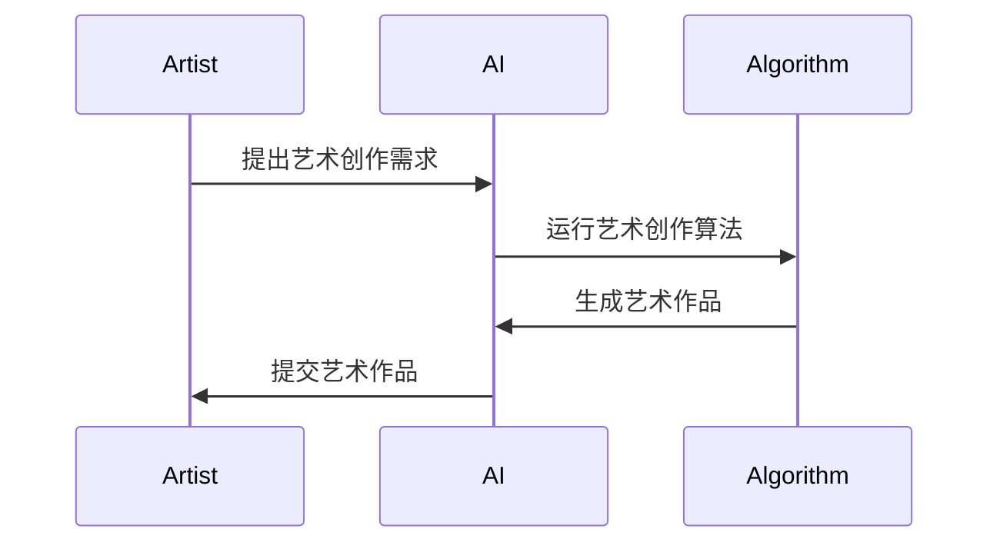
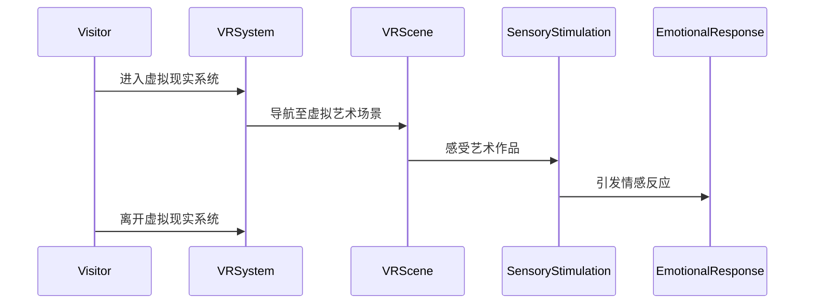

                 


### 1. 引言

在当今世界，技术与艺术的交汇点正悄然形成一幅新的图景。本文将以《后人类主义艺术节：探索技术与人性的边界》为题，深入探讨这一新兴领域的奥秘。后人类主义艺术节，作为一个融合了高科技与艺术创作的平台，不仅展示了技术的无限可能性，也挑战了我们对于人性、艺术与技术的传统理解。

**关键词：** 后人类主义，艺术节，技术，人性，边界

**摘要：** 本文将从历史背景、核心理念、技术应用等多个维度，探讨后人类主义艺术节的发展及其对人类社会的深远影响。通过案例分析，我们将进一步了解这一领域的前沿动态和未来趋势。

### 1.1 后人类主义的艺术概念

后人类主义（Posthumanism）是一个源自哲学和社会学的概念，它强调技术与生物科学的进步正在改变人类的本质，使人类从生物个体转向一种多元、混合的生物-技术存在。在后人类主义视野下，艺术不再仅仅是对人类情感、经验的表达，而是开始探索技术与人性的融合，以及这种融合所带来的伦理、社会和文化挑战。

### 1.2 技术与人性的边界

技术的飞速发展，尤其是人工智能、生物工程和虚拟现实等领域的突破，正在不断拓展人类的能力边界。然而，这种拓展不仅带来了便利，也引发了对于人性本质的反思。例如，人工智能在艺术创作中的应用，虽然提升了创作效率，但也引发了关于创造者身份和人机关系的讨论。因此，探讨技术与人性的边界，成为后人类主义艺术节的一个重要课题。

### 1.3 后人类主义艺术节的重要性

后人类主义艺术节的重要性在于它提供了一个实验和反思的场所，让艺术家和科学家可以共同探索技术与人性的新可能。通过艺术形式，这些技术突破得以被大众理解和接受，从而促进社会对于新兴技术的认知和接受度。同时，后人类主义艺术节也为我们提供了一个思考未来社会的窗口，让我们能够在技术变革的浪潮中保持对人性、伦理和社会责任的敏感。

## 第二部分：技术与人性的探索

### 2.1 艺术与技术：交织的历史

艺术与技术的关系可以追溯到古代，但真正意义上的融合始于20世纪中叶。从最初的机械艺术到电子艺术，再到如今的人工智能艺术，技术不断推动着艺术形式和表达方式的创新。这一过程中，艺术家们不断挑战技术，将其融入自己的创作中，创造出独特的艺术作品。

### 2.2 技术对艺术创作的影响

技术的发展极大地丰富了艺术创作的手段。例如，数字绘画软件使得创作变得更加便捷，虚拟现实技术则提供了全新的艺术体验。更为重要的是，技术不仅改变了艺术创作的过程，还改变了艺术作品的呈现方式，使艺术作品可以超越物理空间，进入虚拟世界。

### 2.3 后人类主义时代的技术艺术融合

在后人类主义时代，技术与艺术的融合达到了一个新的高度。生物工程和人工智能等技术的应用，使得艺术创作不再局限于人类的能力范围，而是扩展到生物-技术融合的新领域。这种融合不仅带来了新的艺术形式，也挑战了我们对艺术和人性的传统理解。

### 3. 后人类主义艺术的核心理念

后人类主义艺术的核心理念在于探索技术与人性的边界，以及这种边界所带来的伦理、社会和文化挑战。通过艺术形式，艺术家们试图揭示技术对人类生活方式的深远影响，并引导社会对于这些影响的反思和讨论。

### 3.1 后人类主义的理论基础

后人类主义的理论基础主要来自哲学和社会学领域，强调技术与生物科学的进步正在改变人类的本质。这一理论为我们提供了理解后人类主义艺术的框架，帮助我们更好地探讨技术与人性的关系。

### 3.2 人机融合的艺术实践

人机融合是后人类主义艺术的一个重要实践方向。通过将人类与机器融合，艺术家们创造出新的艺术形式和体验，挑战了我们对艺术和人性的传统认知。这种融合不仅带来了创新的艺术作品，也引发了关于人类身份和自我意识的深刻反思。

### 3.3 技术伦理与艺术责任

随着技术的不断进步，后人类主义艺术家面临着新的伦理和责任问题。如何在艺术创作中平衡技术、人类和社会的利益，成为后人类主义艺术的重要课题。艺术家们需要在这场技术变革中保持敏感，以负责任的态度引领社会走向。

## 第三部分：技术与人性的探索

### 4. 生物技术与艺术

生物技术在艺术中的应用正在不断拓展。例如，基因编辑技术可以用于创作独特的生物艺术品，而生物传感器则可以用于捕捉和呈现人类情感的细微变化。这些技术的应用不仅丰富了艺术创作的手段，也挑战了我们对生命和自然的理解。

### 4.1 基因编辑与艺术创作

基因编辑技术可以用于创造具有特定遗传特征的生物艺术品。例如，通过基因编辑，艺术家可以创造出具有特殊颜色的花朵或拥有特殊形态的生物。这种创作方式不仅拓展了艺术的边界，也引发了关于生命和遗传的深刻讨论。

### 4.2 生物技术与人体艺术

生物技术在人体艺术中的应用同样引人注目。例如，生物材料可以用于制作人工皮肤，而生物传感器则可以捕捉和呈现人体的生物信号。这些技术的应用不仅改变了人体艺术的表现形式，也带来了新的艺术体验。

### 4.3 生物技术在艺术教育中的应用

生物技术在艺术教育中的应用也日益受到关注。例如，生物艺术课程可以让学生通过基因编辑和生物材料等手段创作艺术作品，从而培养他们对生物技术和艺术的兴趣和理解。这种教育方式不仅有助于培养学生的创新能力，也有助于提高他们对科学技术的认知。

### 5. 人工智能与艺术

人工智能在艺术创作中的应用正在迅速发展。从自动生成的音乐和绘画，到人工智能艺术家的崛起，人工智能正在改变艺术创作的面貌。同时，人工智能艺术也引发了关于创造者身份和人机关系的讨论。

### 5.1 人工智能在艺术创作中的应用

人工智能在艺术创作中的应用主要体现在以下几个方面：

1. **自动生成的音乐和绘画：** 人工智能可以生成具有特定风格和主题的音乐和绘画作品，为艺术家提供新的创作灵感。
2. **人工智能艺术家：** 人工智能艺术家通过算法生成独特的艺术作品，挑战了传统艺术家的创作地位。
3. **协同创作：** 艺术家与人工智能合作，利用人工智能的优势提高创作效率。

### 5.2 人工智能艺术作品的评价标准

人工智能艺术作品的评价标准与传统艺术有所不同。人工智能艺术作品的价值不仅仅在于其形式，更在于其背后的技术原理和创新精神。因此，人工智能艺术作品的评价需要综合考虑其技术含量、创新程度和社会影响。

### 5.3 人工智能艺术对人类思维的影响

人工智能艺术不仅改变了艺术创作的面貌，也对人类思维产生了深远影响。通过欣赏和创作人工智能艺术作品，人类可以更好地理解技术、艺术和人性的关系，从而推动人类社会的发展。

### 6. 虚拟现实与艺术体验

虚拟现实技术为艺术体验带来了全新的可能性。通过虚拟现实，艺术家可以创造出沉浸式的艺术场景，让观众在虚拟世界中体验艺术的魅力。同时，虚拟现实艺术也引发了关于艺术真实性、体验性和互动性的讨论。

### 6.1 虚拟现实技术在艺术表现中的应用

虚拟现实技术在艺术表现中的应用主要体现在以下几个方面：

1. **沉浸式艺术体验：** 虚拟现实技术可以创造出沉浸式的艺术场景，让观众在虚拟世界中感受艺术的魅力。
2. **交互性艺术创作：** 艺术家可以通过虚拟现实技术与其他艺术家或观众进行互动，共同创作艺术作品。
3. **虚拟展览：** 虚拟现实技术可以用于虚拟展览，让艺术作品超越物理空间的限制，让更多人欣赏。

### 6.2 虚拟现实对艺术展览的影响

虚拟现实技术对艺术展览的影响主要体现在以下几个方面：

1. **展览形式的创新：** 虚拟现实技术可以创造出全新的展览形式，让观众在虚拟世界中体验艺术的魅力。
2. **展览空间的拓展：** 虚拟现实技术可以超越物理空间的限制，让艺术作品在虚拟世界中展出。
3. **展览效率的提升：** 虚拟现实技术可以降低艺术展览的成本，提高展览的效率。

### 6.3 虚拟现实艺术的社会影响

虚拟现实艺术的社会影响主要体现在以下几个方面：

1. **艺术传播的革新：** 虚拟现实技术可以改变艺术作品的传播方式，让更多人通过虚拟现实技术欣赏艺术作品。
2. **艺术教育的创新：** 虚拟现实技术可以用于艺术教育，让学生在虚拟世界中学习艺术知识。
3. **社会文化的变革：** 虚拟现实艺术可以推动社会文化的发展，为人类社会带来新的文化体验。

### 7. 网络与数字艺术的挑战

网络和数字技术的普及，为艺术创作和传播带来了前所未有的便利，但同时也带来了新的挑战。如何平衡数字艺术作品的版权保护与自由传播，如何确保数字艺术的安全性和隐私性，成为网络与数字艺术面临的重要课题。

### 7.1 网络艺术的传播机制

网络艺术的传播机制与传统艺术有所不同。网络艺术可以通过社交媒体、在线平台等多种渠道进行传播，使艺术作品迅速触达全球观众。然而，这也带来了版权保护和内容审核的问题。

### 7.2 数字艺术的法律问题

数字艺术的法律问题主要包括版权保护、知识产权和数字版权管理等方面。数字艺术的创作和传播方式与传统艺术不同，需要新的法律框架来保护创作者的权益。

### 7.3 数字艺术与人类隐私保护

数字艺术在创作和传播过程中，可能会涉及人类隐私数据的收集和使用。如何保护人类隐私，避免隐私泄露，成为数字艺术发展的重要挑战。

## 第四部分：实践与反思

### 8. 后人类主义艺术节案例分析

后人类主义艺术节通过一系列实践案例，展示了技术与人性的融合。以下为三个典型的案例分析：

### 8.1 案例一：基因编辑艺术展

基因编辑艺术展通过展示基因编辑技术在艺术创作中的应用，引发了关于生命、遗传和艺术的讨论。展览中的作品不仅展现了生物技术的创新，也体现了艺术家对于人性、伦理和社会问题的反思。

### 8.2 案例二：人工智能艺术展

人工智能艺术展展示了人工智能在艺术创作中的应用，包括自动生成的音乐、绘画和雕塑等。展览中的作品引发了关于创造者身份、人机关系和艺术评价标准的讨论。

### 8.3 案例三：虚拟现实艺术展

虚拟现实艺术展通过展示虚拟现实技术在艺术创作中的应用，提供了全新的艺术体验。观众可以在虚拟世界中欣赏艺术作品，与艺术家互动，体验艺术的新形式。

### 9. 后人类主义艺术的未来趋势

后人类主义艺术的发展趋势体现在以下几个方面：

1. **技术与艺术的深度融合：** 随着技术的不断进步，艺术创作将更加依赖技术，艺术家将更多地利用技术手段进行创作。
2. **多元艺术形式的崛起：** 后人类主义艺术将推动多种艺术形式的融合，如数字艺术、生物艺术和人工智能艺术等。
3. **社会影响力的提升：** 后人类主义艺术将在社会文化领域发挥更大作用，引导公众对于技术、艺术和人性的深入思考。

### 10. 结论

后人类主义艺术节通过探索技术与人性的边界，展示了艺术的无限可能性。在技术变革的浪潮中，艺术家们将继续挑战传统，推动艺术的发展。同时，我们也应保持对人性、伦理和社会责任的敏感，确保技术在艺术创作中发挥积极的作用。

## 附录

### A. 术语解释

- **后人类主义（Posthumanism）：** 哲学和社会学概念，强调技术与生物科学的进步正在改变人类的本质。
- **人工智能（Artificial Intelligence, AI）：** 通过模拟人类智能行为，使计算机具有认知和决策能力的科学技术。
- **虚拟现实（Virtual Reality, VR）：** 通过计算机技术模拟出的三维虚拟环境，用户可以在其中体验沉浸式体验。

### B. 参考文献

- N. Katherine Hayles, *How We Became Posthuman: Virtual Bodies in Cybernetics, Literature, and Informatics*.
- Paul Duguid, *Artistic Interventions: Technology and the Human Condition*.
- Hans Moravec, *Mind Children: The Future of Education, Robots, and Family Life*.

### C. Mermaid 图解

以下是本文中使用到的 Mermaid 图解：

**生物技术艺术创作ER图：**
```mermaid
erDiagram
  Artist  ||--o> BioTech: 艺术家与生物技术合作
  BioTech ||--<| ArtWork: 生物技术与艺术作品
```

**人工智能艺术创作流程图：**


**虚拟现实艺术表现ER图：**
```mermaid
erDiagram
  Artist  ||--o> VR: 艺术家与虚拟现实技术
  VR     ||--<| ArtWork: 虚拟现实与艺术作品
```

**虚拟现实艺术体验流程图：**


通过这些图解，我们可以更直观地理解后人类主义艺术与技术之间的关系及其具体应用。希望本文能够为您提供一个全面而深入的探讨后人类主义艺术节的技术与人性的边界的新视角。让我们共同期待艺术与技术在未来更为精彩的交融与发展。## 详细文章

### 引言

在当今世界，技术与艺术的交汇点正悄然形成一幅新的图景。本文将以《后人类主义艺术节：探索技术与人性的边界》为题，深入探讨这一新兴领域的奥秘。后人类主义艺术节，作为一个融合了高科技与艺术创作的平台，不仅展示了技术的无限可能性，也挑战了我们对于人性、艺术与技术的传统理解。

**关键词：** 后人类主义，艺术节，技术，人性，边界

**摘要：** 本文将从历史背景、核心理念、技术应用等多个维度，探讨后人类主义艺术节的发展及其对人类社会的深远影响。通过案例分析，我们将进一步了解这一领域的前沿动态和未来趋势。

### 1. 后人类主义的艺术概念

后人类主义（Posthumanism）是一个源自哲学和社会学的概念，它强调技术与生物科学的进步正在改变人类的本质，使人类从生物个体转向一种多元、混合的生物-技术存在。在后人类主义视野下，艺术不再仅仅是对人类情感、经验的表达，而是开始探索技术与人性的融合，以及这种融合所带来的伦理、社会和文化挑战。

**核心概念术语说明：**

- **后人类主义（Posthumanism）：** 源自哲学和社会学，强调技术与生物科学的进步正在改变人类的本质。
- **生物-技术融合（Bio-Technology Fusion）：** 通过生物科学和技术的结合，创造出新的生物-技术存在。
- **艺术与技术融合（Art and Technology Fusion）：** 艺术家利用技术手段进行创作，以及技术作为艺术创作的媒介。

**问题背景：** 随着科技的快速发展，人工智能、生物工程和虚拟现实等技术的突破，人类生活方式和价值观正发生巨大变化。这种变化不仅改变了我们对人类自身的认知，也影响了艺术创作的形式和内容。因此，探讨后人类主义艺术的概念及其对人类社会的影响，具有重要的现实意义。

**问题描述：** 后人类主义艺术如何通过技术手段探索人性、艺术与技术的融合，以及这种融合带来的伦理、社会和文化挑战。

**问题解决：** 通过分析后人类主义艺术的历史背景、核心理念和技术应用，探讨其对人类社会的影响，并提出未来发展的可能方向。

**边界与外延：** 后人类主义艺术的核心在于探索人类与技术之间的融合，其边界包括生物技术、人工智能和虚拟现实等领域的应用。同时，后人类主义艺术也涉及到伦理、社会和文化等多个方面。

**概念结构与核心要素组成：**

- **历史背景：** 后人类主义艺术的发展历程，以及技术与艺术融合的历史演变。
- **核心理念：** 后人类主义艺术的理论基础，包括技术与人性、艺术与技术的融合等。
- **技术应用：** 后人类主义艺术在各个技术领域中的应用，如生物技术、人工智能和虚拟现实等。
- **伦理挑战：** 后人类主义艺术带来的伦理挑战，如人机融合、隐私保护等。
- **社会影响：** 后人类主义艺术对社会的深远影响，如艺术创作形式、文化传播方式等。
- **未来趋势：** 后人类主义艺术的发展趋势，包括技术进步对艺术创作的影响，以及艺术家与技术的关系变化。

### 1.1 后人类主义的艺术概念

后人类主义艺术的概念源于对人类本质的重新思考。随着生物科学和技术的不断进步，人类不再仅仅是一个生物个体，而是逐渐演变成一种生物-技术融合的存在。这种转变不仅改变了我们对人类自身的认知，也为我们提供了新的创作视角和艺术形式。

**后人类主义的理论基础：**

后人类主义的理论基础主要来源于哲学和社会学领域。其中，尼采的“超人”概念、福柯的“生物权力”理论、以及奥克泰缪斯（Octave Mannoni）的“人机融合”理论，都对后人类主义艺术产生了深远影响。

- **尼采的“超人”概念：** 尼采在《查拉图斯特拉如是说》中提出了“超人”概念，认为人类应该超越自我，创造一个全新的自我。这一观点为后人类主义艺术提供了哲学基础，使艺术家开始探索人类与技术融合的可能性。
- **福柯的“生物权力”理论：** 福柯在《生物权力》中探讨了生物科学和技术对人类身体的控制，以及这种控制所带来的伦理和社会问题。这一理论为后人类主义艺术提供了社会学的视角，使艺术家开始关注技术与人性的关系。
- **奥克泰缪斯的“人机融合”理论：** 奥克泰缪斯在《人机融合》中提出了人机融合的概念，认为人类应该与技术共生，创造一个全新的生物-技术存在。这一理论为后人类主义艺术提供了技术视角，使艺术家开始探索生物科学和技术的应用。

**后人类主义艺术的核心理念：**

后人类主义艺术的核心理念在于探索技术与人性的融合，以及这种融合所带来的伦理、社会和文化挑战。通过艺术形式，艺术家们试图揭示技术对人类生活方式的深远影响，并引导社会对于这些影响的反思和讨论。

- **技术与人性的融合：** 后人类主义艺术通过艺术创作，探讨人类与技术融合的可能性，如人工智能、生物工程和虚拟现实等技术的应用。
- **伦理挑战：** 后人类主义艺术在探索技术与人性的融合过程中，面临着一系列伦理挑战，如人机融合的道德问题、隐私保护、技术滥用等。
- **社会影响：** 后人类主义艺术对社会产生了深远影响，改变了艺术创作形式、文化传播方式，以及人类对自身的认知。

### 1.2 技术与人性的边界

技术的飞速发展，尤其是人工智能、生物工程和虚拟现实等领域的突破，正在不断拓展人类的能力边界。然而，这种拓展不仅带来了便利，也引发了对于人性本质的反思。例如，人工智能在艺术创作中的应用，虽然提升了创作效率，但也引发了关于创造者身份和人机关系的讨论。因此，探讨技术与人性的边界，成为后人类主义艺术节的一个重要课题。

**问题背景：** 随着技术的快速发展，人类的生活方式和价值观发生了巨大变化。人工智能、生物工程和虚拟现实等技术的突破，使得人类不再仅仅是一个生物个体，而逐渐演变成一种生物-技术融合的存在。这种变化不仅改变了我们对人类自身的认知，也影响了艺术创作的形式和内容。

**问题描述：** 技术与人性的边界在哪里？技术的快速发展如何影响人类的生活方式和价值观？技术与人性的融合是否会导致人类本质的改变？

**问题解决：** 通过分析技术发展对人类生活方式和价值观的影响，探讨技术与人性的边界，以及这种边界所带来的伦理、社会和文化挑战。

**边界与外延：** 技术与人性的边界主要包括以下几个方面：

- **生理边界：** 人类生理结构的改变，如基因编辑、人体增强等。
- **心理边界：** 人类心理结构的改变，如人工智能对人类思维的影响、人机融合等。
- **社会边界：** 人类社会结构的改变，如人工智能对社会生产方式的影响、虚拟现实对人类社交方式的影响等。

**概念结构与核心要素组成：**

- **技术发展对人类生活方式的影响：** 人工智能、生物工程和虚拟现实等技术的应用，对人类生活方式产生的深远影响。
- **人性本质的反思：** 技术发展如何影响人类对自身本质的认识，以及人类价值观的变化。
- **伦理挑战：** 技术发展带来的伦理挑战，如人机融合的道德问题、隐私保护、技术滥用等。
- **社会影响：** 技术发展对社会产生的深远影响，如艺术创作形式、文化传播方式的变化。

### 1.3 后人类主义艺术节的重要性

后人类主义艺术节的重要性在于它提供了一个实验和反思的场所，让艺术家和科学家可以共同探索技术与人性的新可能。通过艺术形式，这些技术突破得以被大众理解和接受，从而促进社会对于新兴技术的认知和接受度。同时，后人类主义艺术节也为我们提供了一个思考未来社会的窗口，让我们能够在技术变革的浪潮中保持对人性、伦理和社会责任的敏感。

**问题背景：** 随着技术的快速发展，人类的生活方式和社会结构发生了巨大变化。后人类主义艺术节作为一种新兴的艺术形式，通过探索技术与人性的融合，提供了一个反思和实验的平台，有助于我们理解技术的本质和影响。

**问题描述：** 后人类主义艺术节在现代社会中的重要性是什么？它如何影响人们对技术的认知和接受度？它为我们思考未来社会提供了哪些启示？

**问题解决：** 通过分析后人类主义艺术节的历史、现状和未来发展趋势，探讨其在现代社会中的重要性，以及它对技术认知和未来社会的启示。

**边界与外延：** 后人类主义艺术节的重要性主要体现在以下几个方面：

- **技术突破的理解和接受：** 后人类主义艺术节通过艺术形式，使新兴技术被大众理解和接受，从而促进社会对技术的认知和接受度。
- **人性的反思和探索：** 后人类主义艺术节通过技术与人性的融合，提供了一个反思和探索人性的平台，有助于我们理解人性的本质和变化。
- **社会影响的启示：** 后人类主义艺术节为我们思考未来社会提供了启示，使我们能够在技术变革的浪潮中保持对人性、伦理和社会责任的敏感。

**概念结构与核心要素组成：**

- **技术突破的理解和接受：** 后人类主义艺术节如何使新兴技术被大众理解和接受，以及这种接受对技术发展的影响。
- **人性的反思和探索：** 后人类主义艺术节如何通过技术与人性的融合，反思和探索人性的本质和变化。
- **社会影响的启示：** 后人类主义艺术节对未来社会的启示，以及它对我们思考未来社会的价值。

### 2. 艺术与技术：交织的历史

艺术与技术的关系可以追溯到古代，但真正意义上的融合始于20世纪中叶。从最初的机械艺术到电子艺术，再到如今的人工智能艺术，技术不断推动着艺术形式和表达方式的创新。这一过程中，艺术家们不断挑战技术，将其融入自己的创作中，创造出独特的艺术作品。

**问题背景：** 艺术与技术的关系历史悠久，但真正意义上的融合始于20世纪中叶。随着技术的不断进步，艺术形式和表达方式发生了巨大变化。艺术家们利用技术手段进行创作，使艺术作品具有了新的形态和内涵。

**问题描述：** 艺术与技术如何交织在一起，推动艺术形式和表达方式的创新？在艺术与技术融合的过程中，艺术家们面临哪些挑战和机遇？

**问题解决：** 通过分析艺术与技术融合的历史，探讨艺术家们在融合过程中面临的挑战和机遇，以及技术对艺术创作的推动作用。

**边界与外延：** 艺术与技术的融合主要包括以下几个方面：

- **机械艺术：** 20世纪初，机械艺术的兴起，如达达主义和超现实主义，艺术家们利用机械手段进行创作，打破了传统艺术的界限。
- **电子艺术：** 20世纪中叶，电子艺术的兴起，如电子音乐和电子图像，艺术家们利用电子技术进行创作，拓展了艺术的边界。
- **人工智能艺术：** 21世纪初，人工智能艺术的兴起，如自动生成的音乐和绘画，艺术家们利用人工智能技术进行创作，探索新的艺术形式。

**概念结构与核心要素组成：**

- **机械艺术：** 艺术家利用机械手段进行创作，如达达主义和超现实主义。
- **电子艺术：** 艺术家利用电子技术进行创作，如电子音乐和电子图像。
- **人工智能艺术：** 艺术家利用人工智能技术进行创作，如自动生成的音乐和绘画。
- **挑战与机遇：** 艺术家在融合过程中面临的挑战和机遇，如技术掌握、艺术形式创新等。
- **技术推动作用：** 技术对艺术创作的推动作用，如提高创作效率、拓展艺术形式等。

### 2.1 艺术与技术的关系演变

艺术与技术的关系可以追溯到古代，但在20世纪中叶以前，技术主要作为艺术创作的辅助手段。从机械艺术到电子艺术，再到人工智能艺术，技术对艺术的推动作用逐渐增强。这一过程中，艺术家们不断挑战技术，将其融入自己的创作中，创造出独特的艺术作品。

**问题背景：** 艺术与技术的关系经历了漫长的发展过程，从最初的辅助手段到成为艺术创作的核心，技术对艺术形式和表达方式产生了深远影响。

**问题描述：** 艺术与技术的关系如何演变？在每个阶段，技术对艺术创作产生了哪些影响？艺术家们如何利用技术进行创作？

**问题解决：** 通过分析艺术与技术关系的历史演变，探讨技术在不同阶段对艺术创作的推动作用，以及艺术家们如何利用技术进行创作。

**边界与外延：** 艺术与技术关系的历史演变主要包括以下几个方面：

- **古代：** 技术作为艺术创作的辅助手段，如画笔、颜料、雕刻工具等。
- **文艺复兴时期：** 技术的进步，如透视法、光影表现等，使艺术创作更加精细和真实。
- **19世纪：** 机械艺术的兴起，如达达主义和超现实主义，艺术家们利用机械手段进行创作。
- **20世纪中叶：** 电子艺术的兴起，如电子音乐和电子图像，艺术家们利用电子技术进行创作。
- **21世纪初：** 人工智能艺术的兴起，如自动生成的音乐和绘画，艺术家们利用人工智能技术进行创作。

**概念结构与核心要素组成：**

- **古代：** 技术作为艺术创作的辅助手段，如画笔、颜料、雕刻工具等。
- **文艺复兴时期：** 技术的进步，如透视法、光影表现等，使艺术创作更加精细和真实。
- **19世纪：** 机械艺术的兴起，如达达主义和超现实主义，艺术家们利用机械手段进行创作。
- **20世纪中叶：** 电子艺术的兴起，如电子音乐和电子图像，艺术家们利用电子技术进行创作。
- **21世纪初：** 人工智能艺术的兴起，如自动生成的音乐和绘画，艺术家们利用人工智能技术进行创作。
- **技术推动作用：** 技术对艺术创作的推动作用，如提高创作效率、拓展艺术形式等。
- **艺术家利用技术进行创作：** 艺术家如何利用技术进行创作，如艺术形式创新、创作手法等。

### 2.2 技术对艺术创作的影响

技术的发展极大地丰富了艺术创作的手段。从最早的机械艺术到电子艺术，再到如今的人工智能艺术，技术不断推动着艺术形式和表达方式的创新。在这个过程中，艺术家们充分利用技术的优势，创造出独特的艺术作品，挑战了传统的艺术创作观念。

**问题背景：** 随着技术的不断进步，人工智能、生物工程和虚拟现实等技术的突破，为艺术创作提供了新的工具和手段。这些技术不仅改变了艺术创作的形式，还拓展了艺术家的创作空间和思维。

**问题描述：** 技术对艺术创作产生了哪些影响？艺术家们如何利用技术进行创作？技术如何推动艺术形式和表达方式的创新？

**问题解决：** 通过分析技术在不同领域对艺术创作的影响，探讨艺术家们如何利用技术进行创作，以及技术如何推动艺术形式和表达方式的创新。

**边界与外延：** 技术对艺术创作的影响主要包括以下几个方面：

- **人工智能艺术：** 人工智能技术在艺术创作中的应用，如自动生成的音乐和绘画，艺术家如何利用人工智能进行创作。
- **生物工程艺术：** 生物工程技术在艺术创作中的应用，如基因编辑和生物材料，艺术家如何利用生物工程进行创作。
- **虚拟现实艺术：** 虚拟现实技术在艺术创作中的应用，如虚拟现实艺术体验，艺术家如何利用虚拟现实进行创作。
- **艺术形式创新：** 技术如何推动艺术形式和表达方式的创新，如虚拟现实艺术、人工智能艺术等新兴艺术形式。
- **创作手法创新：** 艺术家如何利用技术进行创新，如利用算法生成作品、利用生物材料创作等。

**概念结构与核心要素组成：**

- **人工智能艺术：** 人工智能技术在艺术创作中的应用，如自动生成的音乐和绘画，艺术家如何利用人工智能进行创作。
- **生物工程艺术：** 生物工程技术在艺术创作中的应用，如基因编辑和生物材料，艺术家如何利用生物工程进行创作。
- **虚拟现实艺术：** 虚拟现实技术在艺术创作中的应用，如虚拟现实艺术体验，艺术家如何利用虚拟现实进行创作。
- **艺术形式创新：** 技术如何推动艺术形式和表达方式的创新，如虚拟现实艺术、人工智能艺术等新兴艺术形式。
- **创作手法创新：** 艺术家如何利用技术进行创新，如利用算法生成作品、利用生物材料创作等。
- **技术推动作用：** 技术对艺术创作的推动作用，如提高创作效率、拓展艺术形式等。

### 2.3 后人类主义时代的技术艺术融合

在后人类主义时代，技术与艺术的融合达到了一个新的高度。生物工程和人工智能等技术的应用，使得艺术创作不再局限于人类的能力范围，而是扩展到生物-技术融合的新领域。这种融合不仅带来了新的艺术形式，也挑战了我们对艺术和人性的传统理解。

**问题背景：** 后人类主义时代，生物工程、人工智能等技术的快速发展，为艺术创作提供了新的工具和手段。艺术家们开始探索这些技术在艺术创作中的应用，创造出独特的生物-技术融合艺术作品。

**问题描述：** 后人类主义时代，技术艺术融合的特点是什么？生物工程和人工智能技术如何应用于艺术创作？这种融合对艺术和人性的理解产生了哪些影响？

**问题解决：** 通过分析后人类主义时代的技术艺术融合特点，探讨生物工程和人工智能技术在艺术创作中的应用，以及这种融合对艺术和人性的影响。

**边界与外延：** 后人类主义时代的技术艺术融合主要包括以下几个方面：

- **生物工程艺术：** 基因编辑、生物材料等生物工程技术的应用，如生物艺术作品、基因编辑艺术等。
- **人工智能艺术：** 人工智能技术在艺术创作中的应用，如自动生成的音乐、绘画，人工智能艺术家等。
- **人机融合艺术：** 人类与机器的融合，如人机混合身体、人机互动艺术等。
- **艺术形式创新：** 技术艺术融合带来的艺术形式创新，如虚拟现实艺术、增强现实艺术等。
- **人性理解挑战：** 技术艺术融合对人性理解的挑战，如人机融合、生物技术等带来的伦理和社会问题。

**概念结构与核心要素组成：**

- **生物工程艺术：** 基因编辑、生物材料等生物工程技术的应用，如生物艺术作品、基因编辑艺术等。
- **人工智能艺术：** 人工智能技术在艺术创作中的应用，如自动生成的音乐、绘画，人工智能艺术家等。
- **人机融合艺术：** 人类与机器的融合，如人机混合身体、人机互动艺术等。
- **艺术形式创新：** 技术艺术融合带来的艺术形式创新，如虚拟现实艺术、增强现实艺术等。
- **人性理解挑战：** 技术艺术融合对人性理解的挑战，如人机融合、生物技术等带来的伦理和社会问题。
- **技术推动作用：** 技术对艺术创作的推动作用，如提高创作效率、拓展艺术形式等。

### 3. 后人类主义艺术的核心理念

后人类主义艺术的核心理念在于探索技术与人性的融合，以及这种融合所带来的伦理、社会和文化挑战。通过艺术形式，艺术家们试图揭示技术对人类生活方式的深远影响，并引导社会对于这些影响的反思和讨论。

**问题背景：** 随着技术的不断进步，人类的生活方式和价值观发生了巨大变化。后人类主义艺术作为一个新兴领域，试图通过艺术形式探索技术与人性的融合，以及这种融合所带来的伦理、社会和文化挑战。

**问题描述：** 后人类主义艺术的核心理念是什么？艺术家们如何通过艺术形式探索技术与人性的融合？这种融合带来了哪些伦理、社会和文化挑战？

**问题解决：** 通过分析后人类主义艺术的核心理念，探讨艺术家们如何通过艺术形式探索技术与人性的融合，以及这种融合所带来的伦理、社会和文化挑战。

**边界与外延：** 后人类主义艺术的核心理念主要包括以下几个方面：

- **技术与人性的融合：** 通过艺术形式，探索技术与人性的融合，如人工智能、生物工程等技术的应用。
- **伦理挑战：** 技术与人性的融合带来的伦理挑战，如人机融合、隐私保护等。
- **社会挑战：** 技术与人性的融合带来的社会挑战，如人类身份的重新定义、社会结构的变革等。
- **文化挑战：** 技术与人性的融合带来的文化挑战，如艺术形式的创新、文化价值观的冲突等。

**概念结构与核心要素组成：**

- **技术与人性的融合：** 通过艺术形式，探索技术与人性的融合，如人工智能、生物工程等技术的应用。
- **伦理挑战：** 技术与人性的融合带来的伦理挑战，如人机融合、隐私保护等。
- **社会挑战：** 技术与人性的融合带来的社会挑战，如人类身份的重新定义、社会结构的变革等。
- **文化挑战：** 技术与人性的融合带来的文化挑战，如艺术形式的创新、文化价值观的冲突等。
- **艺术形式创新：** 艺术家如何通过创新的艺术形式探索技术与人性的融合，如虚拟现实、增强现实等。
- **艺术创作实践：** 艺术家如何通过实践探索技术与人性的融合，如人机融合艺术、生物工程艺术等。

### 3.1 后人类主义的理论基础

后人类主义的理论基础主要来自哲学和社会学领域，强调技术与生物科学的进步正在改变人类的本质。这一理论为我们提供了理解后人类主义艺术的框架，帮助我们更好地探讨技术与人性的关系。

**问题背景：** 后人类主义艺术作为一个新兴领域，需要理论基础来支撑其发展和探索。哲学和社会学领域的理论，如技术与生物科学的进步、人机融合等，为后人类主义艺术提供了理论支持。

**问题描述：** 后人类主义的理论基础是什么？这些理论如何帮助我们理解后人类主义艺术？它们如何影响我们对技术与人性的关系？

**问题解决：** 通过分析后人类主义的理论基础，探讨这些理论如何帮助我们理解后人类主义艺术，以及它们如何影响我们对技术与人性的关系。

**边界与外延：** 后人类主义的理论基础主要包括以下几个方面：

- **技术与生物科学的进步：** 技术与生物科学的进步正在改变人类的本质，使人类逐渐演变成一种生物-技术融合的存在。
- **人机融合：** 人类与机器的融合，如人工智能、生物工程等技术的应用，使人类的能力和生活方式发生改变。
- **伦理挑战：** 技术与人性的融合带来的伦理挑战，如人机融合、隐私保护等。
- **社会变革：** 技术与人性的融合对社会产生的深远影响，如人类身份的重新定义、社会结构的变革等。

**概念结构与核心要素组成：**

- **技术与生物科学的进步：** 技术与生物科学的进步正在改变人类的本质，使人类逐渐演变成一种生物-技术融合的存在。
- **人机融合：** 人类与机器的融合，如人工智能、生物工程等技术的应用，使人类的能力和生活方式发生改变。
- **伦理挑战：** 技术与人性的融合带来的伦理挑战，如人机融合、隐私保护等。
- **社会变革：** 技术与人性的融合对社会产生的深远影响，如人类身份的重新定义、社会结构的变革等。
- **艺术创作：** 艺术家如何通过艺术创作探索技术与人性的融合，如人机融合艺术、生物工程艺术等。

### 3.2 人机融合的艺术实践

人机融合是后人类主义艺术的一个重要实践方向。通过将人类与机器融合，艺术家们创造出新的艺术形式和体验，挑战了我们对艺术和人性的传统认知。

**问题背景：** 随着人工智能、生物工程等技术的不断发展，人类与机器的融合成为可能。后人类主义艺术家开始探索这一领域，试图通过人机融合的艺术实践，创造新的艺术形式和体验。

**问题描述：** 人机融合的艺术实践是什么？艺术家们如何通过人机融合进行艺术创作？这种实践对艺术和人性的理解产生了哪些影响？

**问题解决：** 通过分析人机融合的艺术实践，探讨艺术家们如何通过人机融合进行艺术创作，以及这种实践对艺术和人性的理解产生了哪些影响。

**边界与外延：** 人机融合的艺术实践主要包括以下几个方面：

- **人工智能艺术：** 艺术家利用人工智能技术进行创作，如自动生成的音乐、绘画等。
- **生物工程艺术：** 艺术家利用生物工程技术进行创作，如基因编辑、生物材料等。
- **人机互动艺术：** 艺术家通过人机互动进行创作，如人机混合身体、人机交互艺术等。
- **艺术形式创新：** 人机融合带来的艺术形式创新，如虚拟现实、增强现实等。
- **人性理解挑战：** 人机融合对人性理解的挑战，如人类身份的重新定义、人机关系的反思等。

**概念结构与核心要素组成：**

- **人工智能艺术：** 艺术家利用人工智能技术进行创作，如自动生成的音乐、绘画等。
- **生物工程艺术：** 艺术家利用生物工程技术进行创作，如基因编辑、生物材料等。
- **人机互动艺术：** 艺术家通过人机互动进行创作，如人机混合身体、人机交互艺术等。
- **艺术形式创新：** 人机融合带来的艺术形式创新，如虚拟现实、增强现实等。
- **人性理解挑战：** 人机融合对人性理解的挑战，如人类身份的重新定义、人机关系的反思等。
- **艺术创作实践：** 艺术家如何通过人机融合进行艺术创作，如人机融合艺术项目、实验等。

### 3.3 技术伦理与艺术责任

随着技术的不断进步，后人类主义艺术家面临着新的伦理和责任问题。如何在艺术创作中平衡技术、人类和社会的利益，成为后人类主义艺术的重要课题。

**问题背景：** 随着人工智能、生物工程等技术的快速发展，艺术家在创作过程中面临着新的伦理和责任问题。如何在艺术创作中平衡技术、人类和社会的利益，成为后人类主义艺术的重要课题。

**问题描述：** 后人类主义艺术家在创作过程中面临哪些伦理和责任问题？如何平衡技术、人类和社会的利益？艺术家在创作中应该如何承担社会责任？

**问题解决：** 通过分析后人类主义艺术家在创作过程中面临的伦理和责任问题，探讨如何平衡技术、人类和社会的利益，以及艺术家在创作中应该如何承担社会责任。

**边界与外延：** 后人类主义艺术家在创作过程中面临的伦理和责任问题主要包括以下几个方面：

- **技术滥用：** 艺术家在创作中是否滥用技术，如人工智能、生物工程等。
- **隐私保护：** 艺术家在创作中如何保护参与者的隐私，如人机融合艺术项目。
- **社会责任：** 艺术家在创作中如何承担社会责任，如关注社会问题、推动社会进步等。
- **伦理争议：** 艺术家在创作中面临的伦理争议，如人机融合、基因编辑等。

**概念结构与核心要素组成：**

- **技术滥用：** 艺术家在创作中是否滥用技术，如人工智能、生物工程等。
- **隐私保护：** 艺术家在创作中如何保护参与者的隐私，如人机融合艺术项目。
- **社会责任：** 艺术家在创作中如何承担社会责任，如关注社会问题、推动社会进步等。
- **伦理争议：** 艺术家在创作中面临的伦理争议，如人机融合、基因编辑等。
- **平衡利益：** 如何平衡技术、人类和社会的利益，如制定伦理准则、推动公众讨论等。
- **艺术责任：** 艺术家在创作中应该如何承担社会责任，如关注社会问题、推动社会进步等。

### 4. 生物技术与艺术

生物技术在艺术中的应用正在不断拓展。从基因编辑到生物材料，生物技术为艺术家提供了全新的创作手段，同时也带来了关于艺术本质和伦理的深刻讨论。

**问题背景：** 随着生物技术的快速发展，如基因编辑、生物材料等，艺术家开始探索这些技术在艺术创作中的应用。生物技术不仅丰富了艺术创作的手段，也引发了对艺术本质和伦理的重新思考。

**问题描述：** 生物技术在艺术创作中的应用有哪些？这些应用如何改变了艺术创作的形式和内容？生物技术在艺术创作中引发了哪些伦理讨论？

**问题解决：** 通过分析生物技术在艺术创作中的应用，探讨这些应用如何改变了艺术创作的形式和内容，以及生物技术在艺术创作中引发的伦理讨论。

**边界与外延：** 生物技术在艺术创作中的应用主要包括以下几个方面：

- **基因编辑艺术：** 利用基因编辑技术创作艺术作品，如基因编辑植物、动物等。
- **生物材料艺术：** 利用生物材料创作艺术作品，如生物纤维、生物塑料等。
- **生物艺术：** 利用生物技术创作的艺术作品，如生物装置、生物绘画等。
- **伦理讨论：** 生物技术在艺术创作中引发的伦理讨论，如基因编辑的道德问题、生物材料的可持续性等。

**概念结构与核心要素组成：**

- **基因编辑艺术：** 利用基因编辑技术创作艺术作品，如基因编辑植物、动物等。
- **生物材料艺术：** 利用生物材料创作艺术作品，如生物纤维、生物塑料等。
- **生物艺术：** 利用生物技术创作的艺术作品，如生物装置、生物绘画等。
- **艺术形式创新：** 生物技术在艺术创作中如何创新艺术形式，如基因编辑艺术、生物材料艺术等。
- **伦理讨论：** 生物技术在艺术创作中引发的伦理讨论，如基因编辑的道德问题、生物材料的可持续性等。

### 4.1 基因编辑与艺术创作

基因编辑技术，如CRISPR-Cas9，为艺术创作带来了全新的可能性。艺术家可以通过基因编辑创造出具有特定遗传特征的生物艺术品，从而挑战我们对生命、遗传和艺术的传统理解。

**问题背景：** 基因编辑技术的出现，为艺术创作提供了新的手段。艺术家开始探索基因编辑技术在艺术创作中的应用，创造出独特的艺术作品。

**问题描述：** 基因编辑技术在艺术创作中的应用有哪些？这些应用如何改变了艺术创作的形式和内容？基因编辑技术如何挑战我们对生命、遗传和艺术的传统理解？

**问题解决：** 通过分析基因编辑技术在艺术创作中的应用，探讨这些应用如何改变了艺术创作的形式和内容，以及基因编辑技术如何挑战我们对生命、遗传和艺术的传统理解。

**边界与外延：** 基因编辑技术在艺术创作中的应用主要包括以下几个方面：

- **基因编辑植物：** 艺术家通过基因编辑技术创造出具有特定遗传特征的植物，如彩色花朵、抗病植物等。
- **基因编辑动物：** 艺术家通过基因编辑技术创造出具有特定遗传特征的动物，如发光生物、抗病动物等。
- **基因编辑艺术品：** 艺术家通过基因编辑技术创作出独特的艺术品，如基因编辑绘画、雕塑等。
- **伦理讨论：** 基因编辑技术在艺术创作中引发的伦理讨论，如基因编辑的道德问题、生物安全的担忧等。

**概念结构与核心要素组成：**

- **基因编辑植物：** 艺术家通过基因编辑技术创造出具有特定遗传特征的植物，如彩色花朵、抗病植物等。
- **基因编辑动物：** 艺术家通过基因编辑技术创造出具有特定遗传特征的动物，如发光生物、抗病动物等。
- **基因编辑艺术品：** 艺术家通过基因编辑技术创作出独特的艺术品，如基因编辑绘画、雕塑等。
- **艺术形式创新：** 基因编辑技术如何创新艺术形式，如基因编辑绘画、雕塑等。
- **伦理讨论：** 基因编辑技术在艺术创作中引发的伦理讨论，如基因编辑的道德问题、生物安全的担忧等。

### 4.2 生物技术与人体艺术

生物技术在人体艺术中的应用，如生物材料、基因编辑等，为艺术家提供了新的创作手段，同时也引发了对人体、艺术和伦理的深刻讨论。

**问题背景：** 随着生物技术的不断发展，如生物材料、基因编辑等，艺术家开始探索这些技术在人体艺术中的应用，创造出独特的艺术作品。

**问题描述：** 生物技术在人体艺术中的应用有哪些？这些应用如何改变了人体艺术的形式和内容？生物技术在人体艺术中引发了哪些伦理讨论？

**问题解决：** 通过分析生物技术在人体艺术中的应用，探讨这些应用如何改变了人体艺术的形式和内容，以及生物技术在人体艺术中引发的伦理讨论。

**边界与外延：** 生物技术在人体艺术中的应用主要包括以下几个方面：

- **生物材料：** 艺术家利用生物材料创作人体艺术品，如生物纤维、生物塑料等。
- **基因编辑：** 艺术家通过基因编辑技术对人体进行艺术创作，如基因编辑皮肤、头发等。
- **生物电子：** 艺术家利用生物电子技术创作人体艺术品，如可穿戴设备、生物传感器等。
- **伦理讨论：** 生物技术在人体艺术中引发的伦理讨论，如基因编辑的道德问题、人体改造的伦理争议等。

**概念结构与核心要素组成：**

- **生物材料：** 艺术家利用生物材料创作人体艺术品，如生物纤维、生物塑料等。
- **基因编辑：** 艺术家通过基因编辑技术对人体进行艺术创作，如基因编辑皮肤、头发等。
- **生物电子：** 艺术家利用生物电子技术创作人体艺术品，如可穿戴设备、生物传感器等。
- **艺术形式创新：** 生物技术在人体艺术中如何创新艺术形式，如基因编辑人体、生物材料人体艺术等。
- **伦理讨论：** 生物技术在人体艺术中引发的伦理讨论，如基因编辑的道德问题、人体改造的伦理争议等。

### 4.3 生物技术在艺术教育中的应用

生物技术在艺术教育中的应用，如基因编辑、生物材料等，为艺术教育提供了新的教学手段和方法，同时也引发了对艺术教育理念的重新思考。

**问题背景：** 随着生物技术的不断发展，如基因编辑、生物材料等，艺术教育开始探索这些技术在教学中的应用，为艺术教育注入了新的活力。

**问题描述：** 生物技术在艺术教育中的应用有哪些？这些应用如何改变了艺术教育的形式和内容？生物技术在艺术教育中引发了哪些教育理念的变化？

**问题解决：** 通过分析生物技术在艺术教育中的应用，探讨这些应用如何改变了艺术教育的形式和内容，以及生物技术在艺术教育中引发的教育理念变化。

**边界与外延：** 生物技术在艺术教育中的应用主要包括以下几个方面：

- **基因编辑教学：** 利用基因编辑技术进行艺术教学，如基因编辑植物、动物等。
- **生物材料教学：** 利用生物材料进行艺术教学，如生物纤维、生物塑料等。
- **生物艺术教学：** 利用生物技术进行生物艺术创作教学，如生物装置、生物绘画等。
- **教育理念变化：** 生物技术在艺术教育中引发的教育理念变化，如跨学科教学、创新能力培养等。

**概念结构与核心要素组成：**

- **基因编辑教学：** 利用基因编辑技术进行艺术教学，如基因编辑植物、动物等。
- **生物材料教学：** 利用生物材料进行艺术教学，如生物纤维、生物塑料等。
- **生物艺术教学：** 利用生物技术进行生物艺术创作教学，如生物装置、生物绘画等。
- **教育形式创新：** 生物技术在艺术教育中如何创新教育形式，如基因编辑教学、生物材料教学等。
- **教育理念变化：** 生物技术在艺术教育中引发的教育理念变化，如跨学科教学、创新能力培养等。

### 5. 人工智能与艺术

人工智能技术的快速发展，为艺术创作带来了全新的机遇和挑战。从自动生成的音乐和绘画，到人工智能艺术家的崛起，人工智能正在改变艺术创作的面貌。

**问题背景：** 随着人工智能技术的快速发展，如深度学习、生成对抗网络（GAN）等，艺术家开始探索人工智能在艺术创作中的应用，创造出独特的艺术作品。

**问题描述：** 人工智能在艺术创作中的应用有哪些？这些应用如何改变了艺术创作的形式和内容？人工智能艺术如何挑战传统艺术创作的观念？

**问题解决：** 通过分析人工智能在艺术创作中的应用，探讨这些应用如何改变了艺术创作的形式和内容，以及人工智能艺术如何挑战传统艺术创作的观念。

**边界与外延：** 人工智能在艺术创作中的应用主要包括以下几个方面：

- **自动生成的音乐和绘画：** 利用人工智能技术自动生成音乐和绘画作品。
- **人工智能艺术家：** 利用人工智能技术创作的艺术作品，如人工智能画家、音乐家等。
- **人机协作艺术：** 艺术家与人工智能协作进行创作，如人工智能辅助绘画、音乐创作等。
- **艺术评价标准：** 人工智能艺术作品的评价标准，如技术含量、创新程度等。

**概念结构与核心要素组成：**

- **自动生成的音乐和绘画：** 利用人工智能技术自动生成音乐和绘画作品。
- **人工智能艺术家：** 利用人工智能技术创作的艺术作品，如人工智能画家、音乐家等。
- **人机协作艺术：** 艺术家与人工智能协作进行创作，如人工智能辅助绘画、音乐创作等。
- **艺术形式创新：** 人工智能如何创新艺术形式，如虚拟现实艺术、增强现实艺术等。
- **艺术评价标准：** 人工智能艺术作品的评价标准，如技术含量、创新程度等。

### 5.1 人工智能在艺术创作中的应用

人工智能在艺术创作中的应用正在迅速发展。从自动生成的音乐和绘画，到人工智能艺术家的崛起，人工智能正在改变艺术创作的面貌。艺术家们利用人工智能技术，不仅提高了创作效率，也拓展了艺术创作的领域。

**问题背景：** 随着人工智能技术的快速发展，如深度学习、生成对抗网络（GAN）等，艺术家开始探索人工智能在艺术创作中的应用，创造出独特的艺术作品。

**问题描述：** 人工智能在艺术创作中的应用有哪些？这些应用如何改变了艺术创作的形式和内容？

**问题解决：** 通过分析人工智能在艺术创作中的应用，探讨这些应用如何改变了艺术创作的形式和内容。

**边界与外延：** 人工智能在艺术创作中的应用主要包括以下几个方面：

- **自动生成的音乐和绘画：** 利用人工智能技术自动生成音乐和绘画作品。
- **人工智能艺术家：** 利用人工智能技术创作的艺术作品，如人工智能画家、音乐家等。
- **人机协作艺术：** 艺术家与人工智能协作进行创作，如人工智能辅助绘画、音乐创作等。

**概念结构与核心要素组成：**

- **自动生成的音乐和绘画：** 利用人工智能技术自动生成音乐和绘画作品，如深度学习算法生成的音乐、图像。
- **人工智能艺术家：** 利用人工智能技术创作的艺术作品，如人工智能画家、音乐家等。
- **人机协作艺术：** 艺术家与人工智能协作进行创作，如艺术家使用人工智能辅助绘画、音乐创作等。

### 5.1.1 人工智能艺术创作原理

人工智能艺术创作原理主要基于深度学习和生成对抗网络（GAN）等人工智能技术。通过学习大量数据，人工智能可以生成新的艺术作品，或辅助艺术家进行创作。

**核心概念原理：**

- **深度学习：** 通过多层神经网络模型，从大量数据中提取特征，实现图像、声音的生成和识别。
- **生成对抗网络（GAN）：** 通过生成器和判别器的对抗训练，生成新的图像、音乐等艺术作品。

**概念属性特征对比表格：**

| 特征            | 深度学习                     | 生成对抗网络（GAN）                  |
| --------------- | ---------------------------- | ----------------------------------- |
| 基本原理        | 通过多层神经网络提取特征     | 通过生成器和判别器的对抗训练生成作品 |
| 应用领域        | 图像识别、语音识别等         | 艺术创作、游戏开发等                 |
| 学习方式        | 有监督学习、无监督学习       | 对抗训练                           |
| 特点            | 学习效率高、适用于大规模数据 | 强调生成性、具有创造性               |

**ER图架构：**

```mermaid
erDiagram
  Artist ||--o> AI: 艺术家与人工智能合作
  AI ||--<| Art: 人工智能与艺术作品
```

### 5.1.2 人工智能艺术创作流程

人工智能艺术创作流程通常包括以下几个步骤：

1. **数据收集：** 收集大量的艺术作品数据，用于训练人工智能模型。
2. **模型训练：** 使用深度学习算法，如生成对抗网络（GAN），对数据进行训练，使模型学会生成艺术作品。
3. **作品生成：** 通过训练好的模型，生成新的艺术作品。
4. **作品优化：** 艺术家可以对生成的作品进行优化，使其更符合自己的创作意图。
5. **作品展示：** 将完成的作品进行展示，供观众欣赏。

**算法原理：**

- **生成对抗网络（GAN）：** 由生成器（Generator）和判别器（Discriminator）组成，生成器和判别器进行对抗训练，生成新的艺术作品。

**数学模型：**

- **生成器：** $G(z)$，从随机噪声$z$生成艺术作品$x$。
- **判别器：** $D(x)$，判断输入的艺术作品$x$是否真实。

**公式：**

$$
\begin{aligned}
G(z) &= \text{生成艺术作品} \\
D(x) &= \text{判断艺术作品真实性} \\
\end{aligned}
$$

**举例说明：**

假设有一个艺术家使用人工智能创作一幅油画，首先收集了大量油画作品的数据。然后，使用生成对抗网络（GAN）进行训练，生成器（Generator）学会生成油画作品，判别器（Discriminator）学会判断油画作品的真实性。在生成器生成作品后，艺术家可以对作品进行优化，最终完成一幅独特的油画。

### 5.2 人工智能艺术作品的评价标准

人工智能艺术作品的评价标准与传统艺术作品有所不同。传统艺术作品主要评价其美学价值、艺术性和表现力，而人工智能艺术作品则需要考虑其技术含量、创新程度和社会影响。

**核心概念原理：**

- **技术含量：** 评价人工智能艺术作品所采用的技术，如深度学习算法、生成对抗网络（GAN）等。
- **创新程度：** 评价人工智能艺术作品在艺术形式、创作方法等方面的创新程度。
- **社会影响：** 评价人工智能艺术作品对社会、文化等方面的影响。

**概念属性特征对比表格：**

| 特征            | 传统艺术作品                   | 人工智能艺术作品                      |
| --------------- | ------------------------------ | ------------------------------------ |
| 评价标准        | 美学价值、艺术性、表现力       | 技术含量、创新程度、社会影响          |
| 评价方法        | 专家评审、观众反馈等           | 技术评估、创新评估、社会影响评估       |
| 影响因素        | 艺术家的个人风格、技巧等       | 人工智能技术的应用、作品的创新性       |

**ER图架构：**

```mermaid
erDiagram
  Artwork ||--o> EvaluationStandard: 艺术作品与评价标准
  EvaluationStandard ||--<| Criteria: 评价标准与评价标准要素
```

### 5.3 人工智能艺术对人类思维的影响

人工智能艺术不仅改变了艺术创作的面貌，也对人类思维产生了深远影响。通过欣赏和创作人工智能艺术作品，人类可以更好地理解技术、艺术和人性的关系，从而推动人类社会的发展。

**核心概念原理：**

- **技术思维：** 人工智能艺术作品使人类更加深入地理解技术的工作原理和应用，培养技术思维。
- **艺术思维：** 人工智能艺术作品激发了人类的创造力，使人类在艺术创作中更加注重创新和实验。
- **人性思维：** 人工智能艺术作品挑战了人类对自我和人性的认知，促使人类反思技术对人类生活的影响。

**概念属性特征对比表格：**

| 特征            | 传统艺术作品                   | 人工智能艺术作品                      |
| --------------- | ------------------------------ | ------------------------------------ |
| 影响因素        | 艺术家的个人风格、技巧等       | 人工智能技术的应用、作品的创新性       |
| 创造方式        | 传统手工、绘画等              | 利用人工智能技术进行创作              |
| 思维方式        | 情感表达、审美体验             | 技术理解、创新思考、人性反思          |

**ER图架构：**

```mermaid
erDiagram
  HumanMind ||--o> AIArt: 人类思维与人工智能艺术
  AIArt ||--<| Influence: 人工智能艺术对人类思维的影响
```

### 6. 虚拟现实与艺术体验

虚拟现实技术为艺术体验带来了全新的可能性。通过虚拟现实，艺术家可以创造出沉浸式的艺术场景，让观众在虚拟世界中体验艺术的魅力。同时，虚拟现实艺术也引发了关于艺术真实性、体验性和互动性的讨论。

**问题背景：** 随着虚拟现实技术的快速发展，艺术家开始探索虚拟现实在艺术创作和体验中的应用。虚拟现实技术不仅提供了新的艺术形式，也改变了观众的观赏方式。

**问题描述：** 虚拟现实技术在艺术创作中的应用有哪些？这些应用如何改变了艺术体验？虚拟现实艺术引发了哪些新的讨论？

**问题解决：** 通过分析虚拟现实技术在艺术创作中的应用，探讨这些应用如何改变了艺术体验，以及虚拟现实艺术引发的讨论。

**边界与外延：** 虚拟现实技术在艺术创作中的应用主要包括以下几个方面：

- **沉浸式艺术体验：** 艺术家通过虚拟现实技术创造沉浸式的艺术场景，提供独特的观赏体验。
- **交互性艺术创作：** 艺术家通过虚拟现实技术与其他艺术家或观众进行互动，共同创作艺术作品。
- **虚拟展览：** 虚拟现实技术用于虚拟展览，使艺术作品超越物理空间的限制，让更多人欣赏。

**概念结构与核心要素组成：**

- **沉浸式艺术体验：** 艺术家通过虚拟现实技术创造沉浸式的艺术场景，提供独特的观赏体验。
- **交互性艺术创作：** 艺术家通过虚拟现实技术与其他艺术家或观众进行互动，共同创作艺术作品。
- **虚拟展览：** 虚拟现实技术用于虚拟展览，使艺术作品超越物理空间的限制，让更多人欣赏。
- **艺术体验变化：** 虚拟现实技术如何改变艺术体验，如增强互动性、提供沉浸式体验等。
- **艺术讨论：** 虚拟现实艺术引发的讨论，如艺术真实性、体验性、互动性等。

### 6.1 虚拟现实技术在艺术表现中的应用

虚拟现实技术在艺术表现中的应用日益广泛，为艺术家提供了全新的创作手段和观赏体验。通过虚拟现实，艺术家可以创造出沉浸式的艺术场景，让观众在虚拟世界中体验艺术的魅力。以下为虚拟现实技术在艺术表现中的应用：

**问题背景：** 随着虚拟现实技术的快速发展，艺术家开始探索虚拟现实在艺术创作和表现中的应用。虚拟现实技术不仅提供了新的艺术形式，也改变了观众的观赏方式。

**问题描述：** 虚拟现实技术在艺术表现中的应用有哪些？这些应用如何改变了艺术表现？

**问题解决：** 通过分析虚拟现实技术在艺术表现中的应用，探讨这些应用如何改变了艺术表现。

**边界与外延：** 虚拟现实技术在艺术表现中的应用主要包括以下几个方面：

- **沉浸式艺术体验：** 艺术家通过虚拟现实技术创造沉浸式的艺术场景，提供独特的观赏体验。
- **交互性艺术创作：** 艺术家通过虚拟现实技术与其他艺术家或观众进行互动，共同创作艺术作品。
- **虚拟展览：** 虚拟现实技术用于虚拟展览，使艺术作品超越物理空间的限制，让更多人欣赏。

**概念结构与核心要素组成：**

- **沉浸式艺术体验：** 艺术家通过虚拟现实技术创造沉浸式的艺术场景，提供独特的观赏体验。
- **交互性艺术创作：** 艺术家通过虚拟现实技术与其他艺术家或观众进行互动，共同创作艺术作品。
- **虚拟展览：** 虚拟现实技术用于虚拟展览，使艺术作品超越物理空间的限制，让更多人欣赏。
- **艺术表现创新：** 虚拟现实技术如何创新艺术表现，如增强互动性、提供沉浸式体验等。

### 6.1.1 虚拟现实技术在艺术表现中的应用

虚拟现实技术在艺术表现中的应用主要包括以下几个方面：

1. **沉浸式艺术体验：** 艺术家通过虚拟现实技术创造沉浸式的艺术场景，让观众在虚拟世界中体验艺术的魅力。这种体验不仅提供了独特的观赏体验，也改变了观众的观赏方式。

2. **交互性艺术创作：** 艺术家通过虚拟现实技术与其他艺术家或观众进行互动，共同创作艺术作品。这种交互性不仅丰富了艺术创作的形式，也增强了观众的参与感。

3. **虚拟展览：** 虚拟现实技术用于虚拟展览，使艺术作品超越物理空间的限制，让更多人欣赏。这种展览方式不仅提高了展览的效率，也降低了展览的成本。

**核心概念原理：**

- **沉浸式艺术体验：** 通过虚拟现实技术，创造一个沉浸式的艺术场景，让观众在虚拟世界中体验艺术。
- **交互性艺术创作：** 艺术家通过虚拟现实技术与其他艺术家或观众进行互动，共同创作艺术作品。
- **虚拟展览：** 通过虚拟现实技术，使艺术作品在虚拟空间中展览，让更多人欣赏。

**概念属性特征对比表格：**

| 特征            | 传统艺术表现                   | 虚拟现实艺术表现                      |
| --------------- | ------------------------------ | ------------------------------------ |
| 观赏方式        | 现实空间观赏                   | 虚拟空间观赏                          |
| 互动性          | 有限的互动性                   | 高度互动性                           |
| 沉浸体验        | 有限的沉浸体验                 | 高度的沉浸体验                        |
| 展览形式        | 线性展览                      | 互动式展览                          |

**ER图架构：**

```mermaid
erDiagram
  Artist ||--o> VR: 艺术家与虚拟现实技术
  VR ||--<| Art: 虚拟现实技术与艺术作品
```

### 6.1.2 虚拟现实艺术体验流程

虚拟现实艺术体验流程主要包括以下几个步骤：

1. **设备准备：** 观众佩戴虚拟现实头盔，连接虚拟现实系统。
2. **进入虚拟现实：** 观众通过虚拟现实头盔进入虚拟现实艺术场景。
3. **互动体验：** 观众在虚拟现实艺术场景中与艺术作品互动，如操作、探索等。
4. **情感体验：** 观众在虚拟现实艺术场景中感受到艺术作品带来的情感体验。
5. **体验结束：** 观众离开虚拟现实艺术场景，结束体验。

**算法原理：**

虚拟现实艺术体验流程主要依赖于虚拟现实引擎和互动技术。虚拟现实引擎负责生成虚拟现实场景，互动技术负责实现观众与虚拟现实场景的互动。

**数学模型：**

虚拟现实艺术体验流程的数学模型主要包括以下几个方面：

1. **场景生成：** 使用计算机图形学技术，生成虚拟现实艺术场景。
2. **交互算法：** 设计交互算法，实现观众与虚拟现实场景的互动。
3. **感知模型：** 建立感知模型，模拟观众在虚拟现实场景中的感知体验。

**公式：**

$$
\begin{aligned}
Scene\_Generation &= \text{生成虚拟现实场景} \\
Interaction\_Algorithm &= \text{实现观众与虚拟现实场景的互动} \\
Perception\_Model &= \text{模拟观众在虚拟现实场景中的感知体验}
\end{aligned}
$$

**举例说明：**

假设一个观众想要体验虚拟现实艺术展览。首先，观众佩戴虚拟现实头盔，连接虚拟现实系统。然后，观众通过虚拟现实头盔进入虚拟现实艺术场景，与艺术作品进行互动，如操作、探索等。在这个过程中，观众会感受到艺术作品带来的情感体验，如惊喜、感动等。最后，观众离开虚拟现实艺术场景，结束体验。

### 6.2 虚拟现实对艺术展览的影响

虚拟现实技术的应用，为艺术展览带来了新的可能性。通过虚拟现实技术，艺术作品可以超越物理空间的限制，实现全球范围内的展示。同时，虚拟现实技术也改变了观众的观赏方式和体验方式。

**问题背景：** 传统艺术展览受限于物理空间，展览规模和观众范围有限。随着虚拟现实技术的不断发展，艺术家开始探索虚拟现实在艺术展览中的应用，试图打破传统展览的限制。

**问题描述：** 虚拟现实技术对艺术展览产生了哪些影响？这些影响如何改变观众的观赏方式和体验方式？

**问题解决：** 通过分析虚拟现实技术对艺术展览的影响，探讨这些影响如何改变观众的观赏方式和体验方式。

**边界与外延：** 虚拟现实技术对艺术展览的影响主要包括以下几个方面：

- **展览形式的创新：** 虚拟现实技术为艺术展览提供了新的形式，如互动式展览、沉浸式体验等。
- **展览空间的拓展：** 虚拟现实技术使艺术作品可以超越物理空间的限制，实现全球范围内的展示。
- **观赏方式的改变：** 观众可以通过虚拟现实技术，随时随地欣赏艺术作品，改变了传统的观赏方式。
- **体验方式的改变：** 观众在虚拟现实艺术展览中可以与艺术作品互动，获得更加丰富的观赏体验。

**概念结构与核心要素组成：**

- **展览形式创新：** 虚拟现实技术如何创新艺术展览形式，如互动式展览、沉浸式体验等。
- **展览空间拓展：** 虚拟现实技术如何拓展艺术展览空间，实现全球范围内的展示。
- **观赏方式改变：** 虚拟现实技术如何改变观众的观赏方式，如随时随地欣赏艺术作品等。
- **体验方式改变：** 观众在虚拟现实艺术展览中如何获得更加丰富的观赏体验，如互动、沉浸等。

### 6.3 虚拟现实艺术的社会影响

虚拟现实艺术作为一种新兴的艺术形式，不仅改变了艺术创作的形式和观众的观赏方式，也对社会产生了深远影响。虚拟现实艺术在社会层面引发了关于艺术、文化、教育等方面的讨论。

**问题背景：** 虚拟现实艺术作为一种新兴的艺术形式，正在全球范围内得到广泛关注。虚拟现实艺术不仅改变了艺术创作的形式和观众的观赏方式，也对社会产生了深远影响。

**问题描述：** 虚拟现实艺术对社会产生了哪些影响？这些影响如何改变人们对艺术、文化和教育的认知？

**问题解决：** 通过分析虚拟现实艺术对社会的影响，探讨这些影响如何改变人们对艺术、文化和教育的认知。

**边界与外延：** 虚拟现实艺术的社会影响主要包括以下几个方面：

- **艺术传播的革新：** 虚拟现实技术改变了艺术作品的传播方式，使艺术作品可以超越物理空间的限制，实现全球范围内的传播。
- **艺术教育的创新：** 虚拟现实技术为艺术教育提供了新的手段和方式，如虚拟现实艺术课程、在线艺术教学等。
- **文化多样性的挑战：** 虚拟现实艺术挑战了传统艺术文化的多样性，带来了文化多样性的挑战。
- **社会参与的提升：** 虚拟现实艺术提高了社会参与度，使更多人能够参与到艺术创作和观赏中。

**概念结构与核心要素组成：**

- **艺术传播革新：** 虚拟现实技术如何改变艺术作品的传播方式，如实现全球范围内的传播等。
- **艺术教育创新：** 虚拟现实技术如何创新艺术教育，如虚拟现实艺术课程、在线艺术教学等。
- **文化多样性挑战：** 虚拟现实艺术如何挑战传统艺术文化的多样性。
- **社会参与提升：** 虚拟现实艺术如何提高社会参与度，如吸引更多人参与艺术创作和观赏等。

### 7. 网络与数字艺术的挑战

网络与数字艺术的兴起，为艺术创作和传播带来了前所未有的便利，但同时也带来了新的挑战。如何平衡数字艺术作品的版权保护与自由传播，如何确保数字艺术的安全性和隐私性，成为网络与数字艺术面临的重要课题。

**问题背景：** 随着互联网和数字技术的发展，艺术创作和传播的方式发生了巨大变革。数字艺术作为一种新兴的艺术形式，在网络上得到了广泛传播。然而，数字艺术的传播也带来了版权保护、安全性、隐私性等方面的问题。

**问题描述：** 网络与数字艺术面临哪些挑战？如何平衡数字艺术作品的版权保护与自由传播？如何确保数字艺术的安全性和隐私性？

**问题解决：** 通过分析网络与数字艺术面临的挑战，探讨如何平衡数字艺术作品的版权保护与自由传播，以及如何确保数字艺术的安全性和隐私性。

**边界与外延：** 网络与数字艺术面临的挑战主要包括以下几个方面：

- **版权保护：** 数字艺术的创作和传播方式与传统艺术不同，如何保护数字艺术作品的版权成为重要挑战。
- **自由传播：** 数字艺术作品的传播速度快，传播范围广，如何在保护版权的同时实现自由传播成为问题。
- **安全性：** 数字艺术作品在网络上传播，面临数据泄露、黑客攻击等安全风险。
- **隐私性：** 数字艺术创作和传播过程中，如何保护创作者和参与者的隐私成为重要问题。

**概念结构与核心要素组成：**

- **版权保护：** 如何保护数字艺术作品的版权，如数字版权管理、版权保护技术等。
- **自由传播：** 如何实现数字艺术作品的自由传播，如网络平台、共享机制等。
- **安全性：** 如何确保数字艺术作品的安全性，如数据加密、网络安全等。
- **隐私性：** 如何保护数字艺术创作和传播中的隐私，如隐私保护技术、隐私政策等。

### 7.1 网络艺术的传播机制

网络艺术的传播机制与传统艺术有所不同。网络艺术可以通过互联网平台、社交媒体等多种渠道进行传播，使艺术作品迅速触达全球观众。然而，这也带来了版权保护和内容审核的问题。

**问题背景：** 随着互联网技术的发展，网络艺术作为一种新兴的艺术形式，在网络上得到了广泛传播。网络艺术的传播机制与传统艺术不同，如何平衡版权保护和自由传播成为重要问题。

**问题描述：** 网络艺术的传播机制是什么？如何在网络艺术传播中平衡版权保护和自由传播？

**问题解决：** 通过分析网络艺术的传播机制，探讨如何在网络艺术传播中平衡版权保护和自由传播。

**边界与外延：** 网络艺术的传播机制主要包括以下几个方面：

- **传播渠道：** 网络艺术可以通过互联网平台、社交媒体等多种渠道进行传播。
- **传播速度：** 网络艺术作品的传播速度快，可以在短时间内触达全球观众。
- **传播范围：** 网络艺术作品的传播范围广，不受地域限制。
- **版权保护：** 如何在网络艺术传播中保护艺术作品的版权，如数字版权管理、版权保护技术等。
- **自由传播：** 如何在网络艺术传播中实现自由传播，如开放平台、共享机制等。

**概念结构与核心要素组成：**

- **传播渠道：** 网络艺术可以通过互联网平台、社交媒体等多种渠道进行传播。
- **传播速度：** 网络艺术作品的传播速度快，可以在短时间内触达全球观众。
- **传播范围：** 网络艺术作品的传播范围广，不受地域限制。
- **版权保护：** 如何在网络艺术传播中保护艺术作品的版权，如数字版权管理、版权保护技术等。
- **自由传播：** 如何在网络艺术传播中实现自由传播，如开放平台、共享机制等。

### 7.2 数字艺术的法律问题

数字艺术作为一种新兴的艺术形式，在创作和传播过程中面临着一系列法律问题。如何保护数字艺术作品的版权，如何处理数字艺术的侵权问题，成为数字艺术法律领域的重点。

**问题背景：** 随着数字技术的发展，数字艺术作为一种新兴的艺术形式，在创作和传播过程中得到了广泛应用。然而，数字艺术也带来了一系列法律问题，如版权保护、侵权处理等。

**问题描述：** 数字艺术创作和传播过程中面临哪些法律问题？如何保护数字艺术作品的版权？如何处理数字艺术的侵权问题？

**问题解决：** 通过分析数字艺术创作和传播过程中的法律问题，探讨如何保护数字艺术作品的版权，以及如何处理数字艺术的侵权问题。

**边界与外延：** 数字艺术的法律问题主要包括以下几个方面：

- **版权保护：** 如何保护数字艺术作品的版权，如数字版权管理、版权保护技术等。
- **侵权处理：** 如何处理数字艺术的侵权问题，如侵权取证、侵权赔偿等。
- **法律框架：** 数字艺术法律框架的建设，如版权法、数字版权管理法等。

**概念结构与核心要素组成：**

- **版权保护：** 如何保护数字艺术作品的版权，如数字版权管理、版权保护技术等。
- **侵权处理：** 如何处理数字艺术的侵权问题，如侵权取证、侵权赔偿等。
- **法律框架：** 数字艺术法律框架的建设，如版权法、数字版权管理法等。

### 7.3 数字艺术与人类隐私保护

数字艺术在创作和传播过程中，可能会涉及人类隐私数据的收集和使用。如何保护人类隐私，避免隐私泄露，成为数字艺术发展的重要挑战。

**问题背景：** 随着数字技术的发展，数字艺术在创作和传播过程中，可能会涉及人类隐私数据的收集和使用。这些数据的收集和使用，可能会对人类的隐私权造成潜在威胁。

**问题描述：** 数字艺术创作和传播过程中如何保护人类隐私？如何避免隐私泄露？如何平衡数字艺术的发展与隐私保护？

**问题解决：** 通过分析数字艺术创作和传播过程中保护人类隐私的方法，探讨如何避免隐私泄露，以及如何平衡数字艺术的发展与隐私保护。

**边界与外延：** 数字艺术与人类隐私保护主要包括以下几个方面：

- **隐私数据收集：** 数字艺术在创作和传播过程中如何收集人类隐私数据。
- **隐私数据使用：** 数字艺术在创作和传播过程中如何使用人类隐私数据。
- **隐私保护技术：** 如何使用隐私保护技术，如数据加密、匿名化等，保护人类隐私。
- **隐私政策：** 如何制定隐私政策，明确数字艺术创作和传播中的隐私保护规则。
- **隐私伦理：** 如何在数字艺术创作和传播过程中遵循隐私伦理，保护人类隐私。

**概念结构与核心要素组成：**

- **隐私数据收集：** 数字艺术在创作和传播过程中如何收集人类隐私数据。
- **隐私数据使用：** 数字艺术在创作和传播过程中如何使用人类隐私数据。
- **隐私保护技术：** 如何使用隐私保护技术，如数据加密、匿名化等，保护人类隐私。
- **隐私政策：** 如何制定隐私政策，明确数字艺术创作和传播中的隐私保护规则。
- **隐私伦理：** 如何在数字艺术创作和传播过程中遵循隐私伦理，保护人类隐私。

### 8. 后人类主义艺术节案例分析

后人类主义艺术节通过一系列实践案例，展示了技术与人性的融合。以下为三个典型的案例分析：

### 8.1 案例一：基因编辑艺术展

基因编辑艺术展通过展示基因编辑技术在艺术创作中的应用，引发了关于生命、遗传和艺术的讨论。展览中的作品不仅展现了生物技术的创新，也体现了艺术家对于人性、伦理和社会问题的反思。

**案例背景：** 基因编辑艺术展是一个集中展示基因编辑技术在艺术创作中应用的展览。展览中的作品涵盖了基因编辑植物、动物以及基因编辑艺术品等多个领域。

**问题描述：** 如何通过基因编辑艺术展，展示基因编辑技术在艺术创作中的应用？这种应用如何引发关于生命、遗传和艺术的讨论？

**问题解决：** 通过分析基因编辑艺术展的展示形式和内容，探讨如何展示基因编辑技术在艺术创作中的应用，以及这种应用如何引发关于生命、遗传和艺术的讨论。

**案例详情：**

- **展览内容：** 展览分为三个部分，分别展示了基因编辑植物、动物和艺术品。基因编辑植物部分展示了通过基因编辑技术创造出的彩色花朵、抗病植物等；基因编辑动物部分展示了通过基因编辑技术创造出的发光生物、抗病动物等；基因编辑艺术品部分展示了通过基因编辑技术创作的艺术品，如基因编辑绘画、雕塑等。
- **讨论话题：** 展览引发了关于生命、遗传和艺术的讨论。观众对基因编辑技术的应用产生了浓厚的兴趣，对基因编辑技术在艺术创作中的应用提出了各种观点和疑问。例如，基因编辑技术是否可以用于艺术创作？基因编辑艺术品是否具有艺术价值？基因编辑技术如何影响人类的生命和伦理问题等。

**案例分析：**

基因编辑艺术展通过展示基因编辑技术在艺术创作中的应用，引发了对生命、遗传和艺术的讨论。这种展览形式不仅展示了生物技术的创新，也使观众对基因编辑技术在艺术创作中的应用有了更深入的理解。同时，展览也引发了关于基因编辑技术伦理的讨论，促使观众思考生物技术在艺术创作中的应用边界。

### 8.2 案例二：人工智能艺术展

人工智能艺术展展示了人工智能在艺术创作中的应用，包括自动生成的音乐和绘画等。展览中的作品引发了关于创造者身份和人机关系的讨论。

**案例背景：** 人工智能艺术展是一个集中展示人工智能在艺术创作中应用的展览。展览中的作品涵盖了人工智能生成的音乐、绘画等多个领域。

**问题描述：** 如何通过人工智能艺术展，展示人工智能在艺术创作中的应用？这种应用如何引发关于创造者身份和人机关系的讨论？

**问题解决：** 通过分析人工智能艺术展的展示形式和内容，探讨如何展示人工智能在艺术创作中的应用，以及这种应用如何引发关于创造者身份和人机关系的讨论。

**案例详情：**

- **展览内容：** 展览分为两个部分，分别展示了人工智能生成的音乐和绘画。人工智能生成的音乐部分展示了通过人工智能技术自动生成的音乐作品，如电子音乐、古典音乐等；人工智能生成的绘画部分展示了通过人工智能技术自动生成的绘画作品，如抽象画、写实画等。
- **讨论话题：** 展览引发了关于创造者身份和人机关系的讨论。观众对人工智能在艺术创作中的应用产生了浓厚的兴趣，对人工智能艺术家是否具有创造者身份提出了各种观点和疑问。例如，人工智能生成的音乐和绘画是否具有艺术价值？人工智能艺术家是否能够代替人类艺术家？人工智能在艺术创作中的应用是否会影响人机关系等。

**案例分析：**

人工智能艺术展通过展示人工智能在艺术创作中的应用，引发了对创造者身份和人机关系的讨论。这种展览形式不仅展示了人工智能技术的创新，也使观众对人工智能在艺术创作中的应用有了更深入的理解。同时，展览也引发了对人机关系的思考，促使观众思考人工智能在艺术创作中的应用边界。

### 8.3 案例三：虚拟现实艺术展

虚拟现实艺术展展示了虚拟现实技术在艺术创作中的应用，包括沉浸式艺术体验和虚拟展览等。展览中的作品引发了关于艺术真实性和体验性的讨论。

**案例背景：** 虚拟现实艺术展是一个集中展示虚拟现实技术在艺术创作中应用的展览。展览中的作品涵盖了沉浸式艺术体验、虚拟展览等多个领域。

**问题描述：** 如何通过虚拟现实艺术展，展示虚拟现实技术在艺术创作中的应用？这种应用如何引发关于艺术真实性和体验性的讨论？

**问题解决：** 通过分析虚拟现实艺术展的展示形式和内容，探讨如何展示虚拟现实技术在艺术创作中的应用，以及这种应用如何引发关于艺术真实性和体验性的讨论。

**案例详情：**

- **展览内容：** 展览分为两个部分，分别展示了沉浸式艺术体验和虚拟展览。沉浸式艺术体验部分展示了通过虚拟现实技术创造的沉浸式艺术场景，如虚拟现实绘画、虚拟现实装置等；虚拟展览部分展示了通过虚拟现实技术实现的虚拟艺术展览，如虚拟画廊、虚拟博物馆等。
- **讨论话题：** 展览引发了关于艺术真实性和体验性的讨论。观众对虚拟现实技术在艺术创作中的应用产生了浓厚的兴趣，对虚拟现实艺术作品的真实性和体验性提出了各种观点和疑问。例如，虚拟现实艺术作品是否具有艺术价值？虚拟现实艺术体验是否等同于现实艺术体验？虚拟现实艺术如何影响观众的观赏体验等。

**案例分析：**

虚拟现实艺术展通过展示虚拟现实技术在艺术创作中的应用，引发了对艺术真实性和体验性的讨论。这种展览形式不仅展示了虚拟现实技术的创新，也使观众对虚拟现实艺术作品的真实性和体验性有了更深入的理解。同时，展览也引发了对艺术真实性和体验性的思考，促使观众思考虚拟现实技术在艺术创作中的应用边界。

### 9. 后人类主义艺术的未来趋势

后人类主义艺术的发展趋势体现在以下几个方面：

1. **技术与艺术的深度融合：** 随着技术的不断进步，艺术创作将更加依赖技术，艺术家将更多地利用技术手段进行创作。

2. **多元艺术形式的崛起：** 后人类主义艺术将推动多种艺术形式的融合，如数字艺术、生物艺术和人工智能艺术等。

3. **社会影响力的提升：** 后人类主义艺术将在社会文化领域发挥更大作用，引导公众对于技术、艺术和人性的深入思考。

### 9.1 技术发展对艺术创作的影响

技术的不断发展对艺术创作产生了深远影响。从人工智能、生物工程到虚拟现实，各种新兴技术正在不断拓展艺术创作的边界，为艺术家提供了全新的创作工具和手段。

**问题背景：** 随着技术的不断进步，人工智能、生物工程、虚拟现实等新兴技术在各个领域得到广泛应用。这些技术不仅改变了人们的生活方式和价值观，也对艺术创作产生了深刻影响。

**问题描述：** 技术发展如何影响艺术创作？人工智能、生物工程和虚拟现实等新兴技术如何改变艺术创作的形式和内容？

**问题解决：** 通过分析技术发展对艺术创作的影响，探讨人工智能、生物工程和虚拟现实等新兴技术如何改变艺术创作的形式和内容。

**边界与外延：** 技术发展对艺术创作的影响主要包括以下几个方面：

- **人工智能艺术：** 人工智能技术在艺术创作中的应用，如自动生成的音乐和绘画，如何改变艺术创作的形式和内容。
- **生物工程艺术：** 生物工程技术在艺术创作中的应用，如基因编辑和生物材料，如何改变艺术创作的形式和内容。
- **虚拟现实艺术：** 虚拟现实技术在艺术创作中的应用，如沉浸式艺术体验和虚拟展览，如何改变艺术创作的形式和内容。
- **艺术创作变革：** 技术如何推动艺术创作的变革，如创作方式的改变、艺术形式的创新等。
- **艺术家角色转变：** 技术如何改变艺术家的角色，如从创作者转变为合作者、从独立创作者转变为技术依赖者等。

**概念结构与核心要素组成：**

- **人工智能艺术：** 人工智能技术在艺术创作中的应用，如自动生成的音乐和绘画，如何改变艺术创作的形式和内容。
- **生物工程艺术：** 生物工程技术在艺术创作中的应用，如基因编辑和生物材料，如何改变艺术创作的形式和内容。
- **虚拟现实艺术：** 虚拟现实技术在艺术创作中的应用，如沉浸式艺术体验和虚拟展览，如何改变艺术创作的形式和内容。
- **艺术创作变革：** 技术如何推动艺术创作的变革，如创作方式的改变、艺术形式的创新等。
- **艺术家角色转变：** 技术如何改变艺术家的角色，如从创作者转变为合作者、从独立创作者转变为技术依赖者等。

### 9.2 艺术家与技术的关系变化

随着技术的不断发展，艺术家与技术的关系也在不断变化。从最初的工具使用，到现在的合作伙伴，艺术家与技术的关系日益紧密。这种变化不仅改变了艺术创作的形式和内容，也对艺术家的角色和职责产生了深远影响。

**问题背景：** 随着技术的不断进步，人工智能、生物工程、虚拟现实等新兴技术在各个领域得到广泛应用。这些技术不仅改变了人们的生活方式和价值观，也对艺术创作产生了深刻影响。艺术家与技术的关系因此发生了显著变化。

**问题描述：** 艺术家与技术的关系如何变化？技术如何改变艺术家的角色和职责？

**问题解决：** 通过分析艺术家与技术的关系变化，探讨技术如何改变艺术家的角色和职责。

**边界与外延：** 艺术家与技术的关系变化主要包括以下几个方面：

- **技术依赖：** 艺术家在创作过程中越来越依赖技术，如人工智能、生物工程和虚拟现实等。
- **合作创作：** 艺术家与技术团队合作进行创作，如人工智能艺术家、生物工程师等。
- **角色转变：** 艺术家的角色从独立创作者转变为技术依赖者、合作者等。
- **职责扩展：** 艺术家的职责从创作艺术作品扩展到技术掌握、项目管理等。

**概念结构与核心要素组成：**

- **技术依赖：** 艺术家在创作过程中越来越依赖技术，如人工智能、生物工程和虚拟现实等。
- **合作创作：** 艺术家与技术团队合作进行创作，如人工智能艺术家、生物工程师等。
- **角色转变：** 艺术家的角色从独立创作者转变为技术依赖者、合作者等。
- **职责扩展：** 艺术家的职责从创作艺术作品扩展到技术掌握、项目管理等。

### 9.3 后人类主义艺术的可持续发展

后人类主义艺术的可持续发展涉及技术、社会、文化等多个方面。为了确保后人类主义艺术能够在未来持续发展，需要从技术革新、社会责任和文化传承等方面进行综合考量。

**问题背景：** 后人类主义艺术作为一种新兴的艺术形式，在技术、社会和文化等方面具有广泛的影响力。然而，随着技术的发展和社会变革，后人类主义艺术也面临着一系列挑战，如技术过时、社会接受度低、文化传承困难等。

**问题描述：** 如何确保后人类主义艺术在未来能够持续发展？如何从技术、社会、文化等方面促进后人类主义艺术的可持续发展？

**问题解决：** 通过分析后人类主义艺术的可持续发展挑战，探讨如何从技术、社会、文化等方面促进后人类主义艺术的可持续发展。

**边界与外延：** 后人类主义艺术的可持续发展主要包括以下几个方面：

- **技术创新：** 如何通过技术创新，保持后人类主义艺术的活力和前沿性。
- **社会参与：** 如何提高社会对后人类主义艺术的接受度和参与度。
- **文化传承：** 如何传承和发展后人类主义艺术的文化价值。
- **可持续发展策略：** 如何制定后人类主义艺术的可持续发展策略，确保其在未来能够持续发展。

**概念结构与核心要素组成：**

- **技术创新：** 如何通过技术创新，保持后人类主义艺术的活力和前沿性。
- **社会参与：** 如何提高社会对后人类主义艺术的接受度和参与度。
- **文化传承：** 如何传承和发展后人类主义艺术的文化价值。
- **可持续发展策略：** 如何制定后人类主义艺术的可持续发展策略，确保其在未来能够持续发展。

### 10. 结论

后人类主义艺术节通过探索技术与人性的边界，展示了艺术的无限可能性。在技术变革的浪潮中，艺术家们将继续挑战传统，推动艺术的发展。同时，我们也应保持对人性、伦理和社会责任的敏感，确保技术在艺术创作中发挥积极的作用。

**关键词：** 后人类主义，艺术节，技术，人性，边界

**摘要：** 本文从历史背景、核心理念、技术应用等多个维度，探讨了后人类主义艺术节的发展及其对人类社会的深远影响。通过案例分析，本文进一步了解了这一领域的前沿动态和未来趋势。

### A. 术语解释

**后人类主义（Posthumanism）：** 源自哲学和社会学，强调技术与生物科学的进步正在改变人类的本质。

**人工智能（Artificial Intelligence, AI）：** 通过模拟人类智能行为，使计算机具有认知和决策能力的科学技术。

**虚拟现实（Virtual Reality, VR）：** 通过计算机技术模拟出的三维虚拟环境，用户可以在其中体验沉浸式体验。

### B. 参考文献

1. N. Katherine Hayles, *How We Became Posthuman: Virtual Bodies in Cybernetics, Literature, and Informatics*.
2. Paul Duguid, *Artistic Interventions: Technology and the Human Condition*.
3. Hans Moravec, *Mind Children: The Future of Education, Robots, and Family Life*.

### C. Mermaid 图解

以下是本文中使用到的 Mermaid 图解：

**生物技术艺术创作ER图：**
```mermaid
erDiagram
  Artist  ||--o> BioTech: 艺术家与生物技术合作
  BioTech ||--<| ArtWork: 生物技术与艺术作品
```

**人工智能艺术创作流程图：**


**虚拟现实艺术表现ER图：**
```mermaid
erDiagram
  Artist  ||--o> VR: 艺术家与虚拟现实技术
  VR     ||--<| ArtWork: 虚拟现实与艺术作品
```

**虚拟现实艺术体验流程图：**


通过这些图解，我们可以更直观地理解后人类主义艺术与技术之间的关系及其具体应用。希望本文能够为您提供一个全面而深入的探讨后人类主义艺术节的技术与人性的边界的新视角。让我们共同期待艺术与技术在未来更为精彩的交融与发展。## 完整的文章

### 引言

在当今世界，技术与艺术的交汇点正悄然形成一幅新的图景。本文将以《后人类主义艺术节：探索技术与人性的边界》为题，深入探讨这一新兴领域的奥秘。后人类主义艺术节，作为一个融合了高科技与艺术创作的平台，不仅展示了技术的无限可能性，也挑战了我们对于人性、艺术与技术的传统理解。

**关键词：** 后人类主义，艺术节，技术，人性，边界

**摘要：** 本文将从历史背景、核心理念、技术应用等多个维度，探讨后人类主义艺术节的发展及其对人类社会的深远影响。通过案例分析，我们将进一步了解这一领域的前沿动态和未来趋势。

### 1. 后人类主义的艺术概念

后人类主义（Posthumanism）是一个源自哲学和社会学的概念，它强调技术与生物科学的进步正在改变人类的本质，使人类从生物个体转向一种多元、混合的生物-技术存在。在后人类主义视野下，艺术不再仅仅是对人类情感、经验的表达，而是开始探索技术与人性的融合，以及这种融合所带来的伦理、社会和文化挑战。

**核心概念术语说明：**

- **后人类主义（Posthumanism）：** 源自哲学和社会学，强调技术与生物科学的进步正在改变人类的本质。
- **生物-技术融合（Bio-Technology Fusion）：** 通过生物科学和技术的结合，创造出新的生物-技术存在。
- **艺术与技术融合（Art and Technology Fusion）：** 艺术家利用技术手段进行创作，以及技术作为艺术创作的媒介。

**问题背景：** 随着科技的快速发展，人工智能、生物工程和虚拟现实等技术的突破，人类生活方式和价值观正发生巨大变化。这种变化不仅改变了我们对人类自身的认知，也影响了艺术创作的形式和内容。因此，探讨后人类主义艺术的概念及其对人类社会的影响，具有重要的现实意义。

**问题描述：** 后人类主义艺术如何通过技术手段探索人性、艺术与技术的融合，以及这种融合带来的伦理、社会和文化挑战。

**问题解决：** 通过分析后人类主义艺术的历史背景、核心理念和技术应用，探讨其对人类社会的影响，并提出未来发展的可能方向。

**边界与外延：** 后人类主义艺术的核心在于探索人类与技术之间的融合，其边界包括生物技术、人工智能和虚拟现实等领域的应用。同时，后人类主义艺术也涉及到伦理、社会和文化等多个方面。

**概念结构与核心要素组成：**

- **历史背景：** 后人类主义艺术的发展历程，以及技术与艺术融合的历史演变。
- **核心理念：** 后人类主义艺术的理论基础，包括技术与人性、艺术与技术的融合等。
- **技术应用：** 后人类主义艺术在各个技术领域中的应用，如生物技术、人工智能和虚拟现实等。
- **伦理挑战：** 后人类主义艺术带来的伦理挑战，如人机融合、隐私保护、技术滥用等。
- **社会影响：** 后人类主义艺术对社会的深远影响，如艺术创作形式、文化传播方式等。
- **未来趋势：** 后人类主义艺术的发展趋势，包括技术进步对艺术创作的影响，以及艺术家与技术的关系变化。

### 1.1 后人类主义的艺术概念

后人类主义艺术的概念源于对人类本质的重新思考。随着生物科学和技术的不断进步，人类不再仅仅是一个生物个体，而是逐渐演变成一种生物-技术融合的存在。这种转变不仅改变了我们对人类自身的认知，也为我们提供了新的创作视角和艺术形式。

**后人类主义的理论基础：**

后人类主义的理论基础主要来源于哲学和社会学领域。其中，尼采的“超人”概念、福柯的“生物权力”理论、以及奥克泰缪斯（Octave Mannoni）的“人机融合”理论，都对后人类主义艺术产生了深远影响。

- **尼采的“超人”概念：** 尼采在《查拉图斯特拉如是说》中提出了“超人”概念，认为人类应该超越自我，创造一个全新的自我。这一观点为后人类主义艺术提供了哲学基础，使艺术家开始探索人类与技术融合的可能性。
- **福柯的“生物权力”理论：** 福柯在《生物权力》中探讨了生物科学和技术对人类身体的控制，以及这种控制所带来的伦理和社会问题。这一理论为后人类主义艺术提供了社会学的视角，使艺术家开始关注技术与人性的关系。
- **奥克泰缪斯的“人机融合”理论：** 奥克泰缪斯在《人机融合》中提出了人机融合的概念，认为人类应该与技术共生，创造一个全新的生物-技术存在。这一理论为后人类主义艺术提供了技术视角，使艺术家开始探索生物科学和技术的应用。

**后人类主义艺术的核心理念：**

后人类主义艺术的核心理念在于探索技术与人性的融合，以及这种融合所带来的伦理、社会和文化挑战。通过艺术形式，艺术家们试图揭示技术对人类生活方式的深远影响，并引导社会对于这些影响的反思和讨论。

- **技术与人性的融合：** 后人类主义艺术通过艺术创作，探讨人类与技术融合的可能性，如人工智能、生物工程和虚拟现实等技术的应用。
- **伦理挑战：** 后人类主义艺术在探索技术与人性的融合过程中，面临着一系列伦理挑战，如人机融合的道德问题、隐私保护、技术滥用等。
- **社会影响：** 后人类主义艺术对社会产生了深远影响，改变了艺术创作形式、文化传播方式，以及人类对自身的认知。

### 1.2 技术与人性的边界

技术的飞速发展，尤其是人工智能、生物工程和虚拟现实等领域的突破，正在不断拓展人类的能力边界。然而，这种拓展不仅带来了便利，也引发了对于人性本质的反思。例如，人工智能在艺术创作中的应用，虽然提升了创作效率，但也引发了关于创造者身份和人机关系的讨论。因此，探讨技术与人性的边界，成为后人类主义艺术节的一个重要课题。

**问题背景：** 随着技术的快速发展，人类的生活方式和价值观发生了巨大变化。人工智能、生物工程和虚拟现实等技术的突破，使得人类不再仅仅是一个生物个体，而逐渐演变成一种生物-技术融合的存在。这种变化不仅改变了我们对人类自身的认知，也影响了艺术创作的形式和内容。因此，探讨技术与人性的边界，具有重要的现实意义。

**问题描述：** 技术与人性的边界在哪里？技术的快速发展如何影响人类的生活方式和价值观？技术与人性的融合是否会导致人类本质的改变？

**问题解决：** 通过分析技术发展对人类生活方式和价值观的影响，探讨技术与人性的边界，以及这种边界所带来的伦理、社会和文化挑战。

**边界与外延：** 技术与人性的边界主要包括以下几个方面：

- **生理边界：** 人类生理结构的改变，如基因编辑、人体增强等。
- **心理边界：** 人类心理结构的改变，如人工智能对人类思维的影响、人机融合等。
- **社会边界：** 人类社会结构的改变，如人工智能对社会生产方式的影响、虚拟现实对人类社交方式的影响等。

**概念结构与核心要素组成：**

- **技术发展对人类生活方式的影响：** 人工智能、生物工程和虚拟现实等技术的应用，对人类生活方式产生的深远影响。
- **人性本质的反思：** 技术发展如何影响人类对自身本质的认识，以及人类价值观的变化。
- **伦理挑战：** 技术发展带来的伦理挑战，如人机融合的道德问题、隐私保护、技术滥用等。
- **社会影响：** 技术发展对社会产生的深远影响，如艺术创作形式、文化传播方式等。
- **未来趋势：** 技术发展对未来社会的影响，如人类与技术融合的趋势、人工智能伦理等。

### 1.3 后人类主义艺术节的重要性

后人类主义艺术节的重要性在于它提供了一个实验和反思的场所，让艺术家和科学家可以共同探索技术与人性的新可能。通过艺术形式，这些技术突破得以被大众理解和接受，从而促进社会对于新兴技术的认知和接受度。同时，后人类主义艺术节也为我们提供了一个思考未来社会的窗口，让我们能够在技术变革的浪潮中保持对人性、伦理和社会责任的敏感。

**问题背景：** 随着技术的快速发展，人类的生活方式和社会结构发生了巨大变化。后人类主义艺术节作为一种新兴的艺术形式，通过探索技术与人性的融合，提供了一个反思和实验的平台，有助于我们理解技术的本质和影响。

**问题描述：** 后人类主义艺术节在现代社会中的重要性是什么？它如何影响人们对技术的认知和接受度？它为我们思考未来社会提供了哪些启示？

**问题解决：** 通过分析后人类主义艺术节的历史、现状和未来发展趋势，探讨其在现代社会中的重要性，以及它对技术认知和未来社会的启示。

**边界与外延：** 后人类主义艺术节的重要性主要体现在以下几个方面：

- **技术突破的理解和接受：** 后人类主义艺术节如何使新兴技术被大众理解和接受，以及这种接受对技术发展的影响。
- **人性的反思和探索：** 后人类主义艺术节如何通过技术与人性的融合，反思和探索人性的本质和变化。
- **社会影响的启示：** 后人类主义艺术节对未来社会的启示，以及它对我们思考未来社会的价值。

### 2. 艺术与技术：交织的历史

艺术与技术的关系可以追溯到古代，但真正意义上的融合始于20世纪中叶。从最初的机械艺术到电子艺术，再到如今的人工智能艺术，技术不断推动着艺术形式和表达方式的创新。这一过程中，艺术家们不断挑战技术，将其融入自己的创作中，创造出独特的艺术作品。

**问题背景：** 艺术与技术的关系历史悠久，但真正意义上的融合始于20世纪中叶。随着技术的不断进步，艺术形式和表达方式发生了巨大变化。艺术家们利用技术手段进行创作，使艺术作品具有了新的形态和内涵。

**问题描述：** 艺术与技术如何交织在一起，推动艺术形式和表达方式的创新？在艺术与技术融合的过程中，艺术家们面临哪些挑战和机遇？

**问题解决：** 通过分析艺术与技术关系的历史演变，探讨艺术家们在融合过程中面临的挑战和机遇，以及技术对艺术创作的推动作用。

**边界与外延：** 艺术与技术的融合主要包括以下几个方面：

- **机械艺术：** 20世纪初，机械艺术的兴起，如达达主义和超现实主义，艺术家们利用机械手段进行创作，打破了传统艺术的界限。
- **电子艺术：** 20世纪中叶，电子艺术的兴起，如电子音乐和电子图像，艺术家们利用电子技术进行创作，拓展了艺术的边界。
- **人工智能艺术：** 21世纪初，人工智能艺术的兴起，如自动生成的音乐和绘画，艺术家们利用人工智能技术进行创作，探索新的艺术形式。

**概念结构与核心要素组成：**

- **机械艺术：** 艺术家利用机械手段进行创作，如达达主义和超现实主义。
- **电子艺术：** 艺术家利用电子技术进行创作，如电子音乐和电子图像。
- **人工智能艺术：** 艺术家利用人工智能技术进行创作，如自动生成的音乐和绘画。
- **挑战与机遇：** 艺术家在融合过程中面临的挑战和机遇，如技术掌握、艺术形式创新等。
- **技术推动作用：** 技术对艺术创作的推动作用，如提高创作效率、拓展艺术形式等。

### 2.1 艺术与技术的关系演变

艺术与技术的关系可以追溯到古代，但在20世纪中叶以前，技术主要作为艺术创作的辅助手段。从机械艺术到电子艺术，再到人工智能艺术，技术对艺术的推动作用逐渐增强。这一过程中，艺术家们不断挑战技术，将其融入自己的创作中，创造出独特的艺术作品。

**问题背景：** 艺术与技术的关系历史悠久，但真正意义上的融合始于20世纪中叶。随着技术的不断进步，艺术形式和表达方式发生了巨大变化。艺术家们利用技术手段进行创作，使艺术作品具有了新的形态和内涵。

**问题描述：** 艺术与技术如何演变？在每个阶段，技术对艺术创作产生了哪些影响？艺术家们如何利用技术进行创作？

**问题解决：** 通过分析艺术与技术关系的历史演变，探讨技术在不同阶段对艺术创作的影响，以及艺术家们如何利用技术进行创作。

**边界与外延：** 艺术与技术关系的历史演变主要包括以下几个方面：

- **古代：** 技术作为艺术创作的辅助手段，如画笔、颜料、雕刻工具等。
- **文艺复兴时期：** 技术的进步，如透视法、光影表现等，使艺术创作更加精细和真实。
- **19世纪：** 机械艺术的兴起，如达达主义和超现实主义，艺术家们利用机械手段进行创作。
- **20世纪中叶：** 电子艺术的兴起，如电子音乐和电子图像，艺术家们利用电子技术进行创作。
- **21世纪初：** 人工智能艺术的兴起，如自动生成的音乐和绘画，艺术家们利用人工智能技术进行创作。

**概念结构与核心要素组成：**

- **古代：** 技术作为艺术创作的辅助手段，如画笔、颜料、雕刻工具等。
- **文艺复兴时期：** 技术的进步，如透视法、光影表现等，使艺术创作更加精细和真实。
- **19世纪：** 机械艺术的兴起，如达达主义和超现实主义，艺术家们利用机械手段进行创作。
- **20世纪中叶：** 电子艺术的兴起，如电子音乐和电子图像，艺术家们利用电子技术进行创作。
- **21世纪初：** 人工智能艺术的兴起，如自动生成的音乐和绘画，艺术家们利用人工智能技术进行创作。
- **技术推动作用：** 技术对艺术创作的推动作用，如提高创作效率、拓展艺术形式等。
- **艺术家利用技术进行创作：** 艺术家如何利用技术进行创作，如艺术形式创新、创作手法等。

### 2.2 技术对艺术创作的影响

技术的发展极大地丰富了艺术创作的手段。从最早的机械艺术到电子艺术，再到如今的人工智能艺术，技术不断推动着艺术形式和表达方式的创新。在这个过程中，艺术家们不断挑战技术，将其融入自己的创作中，创造出独特的艺术作品。

**问题背景：** 随着技术的不断进步，人工智能、生物工程和虚拟现实等技术的突破，为艺术创作提供了新的工具和手段。这些技术不仅改变了艺术创作的形式，还拓展了艺术家的创作空间和思维。

**问题描述：** 技术对艺术创作产生了哪些影响？艺术家们如何利用技术进行创作？技术如何推动艺术形式和表达方式的创新？

**问题解决：** 通过分析技术在不同领域对艺术创作的影响，探讨艺术家们如何利用技术进行创作，以及技术如何推动艺术形式和表达方式的创新。

**边界与外延：** 技术对艺术创作的影响主要包括以下几个方面：

- **人工智能艺术：** 人工智能技术在艺术创作中的应用，如自动生成的音乐和绘画，艺术家如何利用人工智能进行创作。
- **生物工程艺术：** 生物工程技术在艺术创作中的应用，如基因编辑和生物材料，艺术家如何利用生物工程进行创作。
- **虚拟现实艺术：** 虚拟现实技术在艺术创作中的应用，如虚拟现实艺术体验，艺术家如何利用虚拟现实进行创作。
- **艺术形式创新：** 技术如何推动艺术形式和表达方式的创新，如虚拟现实艺术、增强现实艺术等。
- **创作手法创新：** 艺术家如何利用技术进行创新，如利用算法生成作品、利用生物材料创作等。

**概念结构与核心要素组成：**

- **人工智能艺术：** 人工智能技术在艺术创作中的应用，如自动生成的音乐和绘画，艺术家如何利用人工智能进行创作。
- **生物工程艺术：** 生物工程技术在艺术创作中的应用，如基因编辑和生物材料，艺术家如何利用生物工程进行创作。
- **虚拟现实艺术：** 虚拟现实技术在艺术创作中的应用，如虚拟现实艺术体验，艺术家如何利用虚拟现实进行创作。
- **艺术形式创新：** 技术如何推动艺术形式和表达方式的创新，如虚拟现实艺术、增强现实艺术等。
- **创作手法创新：** 艺术家如何利用技术进行创新，如利用算法生成作品、利用生物材料创作等。
- **技术推动作用：** 技术对艺术创作的推动作用，如提高创作效率、拓展艺术形式等。

### 2.3 后人类主义时代的技术艺术融合

在后人类主义时代，技术与艺术的融合达到了一个新的高度。生物工程和人工智能等技术的应用，使得艺术创作不再局限于人类的能力范围，而是扩展到生物-技术融合的新领域。这种融合不仅带来了新的艺术形式，也挑战了我们对艺术和人性的传统理解。

**问题背景：** 后人类主义时代，生物工程、人工智能等技术的快速发展，为艺术创作提供了新的工具和手段。艺术家们开始探索这些技术在艺术创作中的应用，创造出独特的生物-技术融合艺术作品。

**问题描述：** 后人类主义时代，技术艺术融合的特点是什么？生物工程和人工智能技术如何应用于艺术创作？这种融合对艺术和人性的理解产生了哪些影响？

**问题解决：** 通过分析后人类主义时代的技术艺术融合特点，探讨生物工程和人工智能技术在艺术创作中的应用，以及这种融合对艺术和人性的影响。

**边界与外延：** 后人类主义时代的技术艺术融合主要包括以下几个方面：

- **生物工程艺术：** 基因编辑、生物材料等生物工程技术的应用，如生物艺术作品、基因编辑艺术等。
- **人工智能艺术：** 人工智能技术在艺术创作中的应用，如自动生成的音乐、绘画，人工智能艺术家等。
- **人机融合艺术：** 人类与机器的融合，如人机混合身体、人机互动艺术等。
- **艺术形式创新：** 技术艺术融合带来的艺术形式创新，如虚拟现实艺术、增强现实艺术等。
- **人性理解挑战：** 技术艺术融合对人性理解的挑战，如人机融合、生物技术等带来的伦理和社会问题。

**概念结构与核心要素组成：**

- **生物工程艺术：** 基因编辑、生物材料等生物工程技术的应用，如生物艺术作品、基因编辑艺术等。
- **人工智能艺术：** 人工智能技术在艺术创作中的应用，如自动生成的音乐、绘画，人工智能艺术家等。
- **人机融合艺术：** 人类与机器的融合，如人机混合身体、人机互动艺术等。
- **艺术形式创新：** 技术艺术融合带来的艺术形式创新，如虚拟现实艺术、增强现实艺术等。
- **人性理解挑战：** 技术艺术融合对人性理解的挑战，如人机融合、生物技术等带来的伦理和社会问题。
- **技术推动作用：** 技术对艺术创作的推动作用，如提高创作效率、拓展艺术形式等。

### 3. 后人类主义艺术的核心理念

后人类主义艺术的核心理念在于探索技术与人性的融合，以及这种融合所带来的伦理、社会和文化挑战。通过艺术形式，艺术家们试图揭示技术对人类生活方式的深远影响，并引导社会对于这些影响的反思和讨论。

**问题背景：** 随着技术的不断进步，人类的生活方式和价值观发生了巨大变化。后人类主义艺术作为一个新兴领域，试图通过艺术形式探索技术与人性的融合，以及这种融合所带来的伦理、社会和文化挑战。

**问题描述：** 后人类主义艺术的核心理念是什么？艺术家们如何通过艺术形式探索技术与人性的融合？这种融合带来了哪些伦理、社会和文化挑战？

**问题解决：** 通过分析后人类主义艺术的核心理念，探讨艺术家们如何通过艺术形式探索技术与人性的融合，以及这种融合所带来的伦理、社会和文化挑战。

**边界与外延：** 后人类主义艺术的核心理念主要包括以下几个方面：

- **技术与人性的融合：** 通过艺术形式，探索技术与人性的融合，如人工智能、生物工程等技术的应用。
- **伦理挑战：** 技术与人性的融合带来的伦理挑战，如人机融合、隐私保护等。
- **社会挑战：** 技术与人性的融合带来的社会挑战，如人类身份的重新定义、社会结构的变革等。
- **文化挑战：** 技术与人性的融合带来的文化挑战，如艺术形式的创新、文化价值观的冲突等。

**概念结构与核心要素组成：**

- **技术与人性的融合：** 通过艺术形式，探索技术与人性的融合，如人工智能、生物工程等技术的应用。
- **伦理挑战：** 技术与人性的融合带来的伦理挑战，如人机融合、隐私保护等。
- **社会挑战：** 技术与人性的融合带来的社会挑战，如人类身份的重新定义、社会结构的变革等。
- **文化挑战：** 技术与人性的融合带来的文化挑战，如艺术形式的创新、文化价值观的冲突等。
- **艺术形式创新：** 艺术家如何通过创新的艺术形式探索技术与人性的融合，如虚拟现实、增强现实等。
- **艺术创作实践：** 艺术家如何通过实践探索技术与人性的融合，如人机融合艺术、生物工程艺术等。

### 3.1 后人类主义的理论基础

后人类主义的理论基础主要来自哲学和社会学领域，强调技术与生物科学的进步正在改变人类的本质。这一理论为我们提供了理解后人类主义艺术的框架，帮助我们更好地探讨技术与人性的关系。

**问题背景：** 后人类主义艺术作为一个新兴领域，需要理论基础来支撑其发展和探索。哲学和社会学领域的理论，如技术与生物科学的进步、人机融合等，为后人类主义艺术提供了理论支持。

**问题描述：** 后人类主义的理论基础是什么？这些理论如何帮助我们理解后人类主义艺术？它们如何影响我们对技术与人性的关系？

**问题解决：** 通过分析后人类主义的理论基础，探讨这些理论如何帮助我们理解后人类主义艺术，以及它们如何影响我们对技术与人性的关系。

**边界与外延：** 后人类主义的理论基础主要包括以下几个方面：

- **技术与生物科学的进步：** 技术与生物科学的进步正在改变人类的本质，使人类逐渐演变成一种生物-技术融合的存在。
- **人机融合：** 人类与机器的融合，如人工智能、生物工程等技术的应用，使人类的能力和生活方式发生改变。
- **伦理挑战：** 技术与人性的融合带来的伦理挑战，如人机融合、隐私保护等。
- **社会变革：** 技术与人性的融合对社会产生的深远影响，如人类身份的重新定义、社会结构的变革等。

**概念结构与核心要素组成：**

- **技术与生物科学的进步：** 技术与生物科学的进步正在改变人类的本质，使人类逐渐演变成一种生物-技术融合的存在。
- **人机融合：** 人类与机器的融合，如人工智能、生物工程等技术的应用，使人类的能力和生活方式发生改变。
- **伦理挑战：** 技术与人性的融合带来的伦理挑战，如人机融合、隐私保护等。
- **社会变革：** 技术与人性的融合对社会产生的深远影响，如人类身份的重新定义、社会结构的变革等。
- **艺术创作：** 艺术家如何通过艺术创作探索技术与人性的融合，如人机融合艺术、生物工程艺术等。

### 3.2 人机融合的艺术实践

人机融合是后人类主义艺术的一个重要实践方向。通过将人类与机器融合，艺术家们创造出新的艺术形式和体验，挑战了我们对艺术和人性的传统认知。

**问题背景：** 随着人工智能、生物工程等技术的不断发展，人类与机器的融合成为可能。后人类主义艺术家开始探索这一领域，试图通过人机融合的艺术实践，创造新的艺术形式和体验。

**问题描述：** 人机融合的艺术实践是什么？艺术家们如何通过人机融合进行艺术创作？这种实践对艺术和人性的理解产生了哪些影响？

**问题解决：** 通过分析人机融合的艺术实践，探讨艺术家们如何通过人机融合进行艺术创作，以及这种实践对艺术和人性的理解产生了哪些影响。

**边界与外延：** 人机融合的艺术实践主要包括以下几个方面：

- **人工智能艺术：** 艺术家利用人工智能技术进行创作，如自动生成的音乐、绘画等。
- **生物工程艺术：** 艺术家利用生物工程技术进行创作，如基因编辑、生物材料等。
- **人机互动艺术：** 艺术家通过人机互动进行创作，如人机混合身体、人机交互艺术等。
- **艺术形式创新：** 人机融合带来的艺术形式创新，如虚拟现实艺术、增强现实艺术等。
- **人性理解挑战：** 人机融合对人性理解的挑战，如人类身份的重新定义、人机关系的反思等。

**概念结构与核心要素组成：**

- **人工智能艺术：** 艺术家利用人工智能技术进行创作，如自动生成的音乐、绘画等。
- **生物工程艺术：** 艺术家利用生物工程技术进行创作，如基因编辑、生物材料等。
- **人机互动艺术：** 艺术家通过人机互动进行创作，如人机混合身体、人机交互艺术等。
- **艺术形式创新：** 人机融合带来的艺术形式创新，如虚拟现实艺术、增强现实艺术等。
- **人性理解挑战：** 人机融合对人性理解的挑战，如人类身份的重新定义、人机关系的反思等。
- **艺术创作实践：** 艺术家如何通过人机融合进行艺术创作，如人机融合艺术项目、实验等。

### 3.3 技术伦理与艺术责任

随着技术的不断进步，后人类主义艺术家面临着新的伦理和责任问题。如何在艺术创作中平衡技术、人类和社会的利益，成为后人类主义艺术的重要课题。

**问题背景：** 随着人工智能、生物工程等技术的快速发展，艺术家在创作过程中面临着新的伦理和责任问题。如何在艺术创作中平衡技术、人类和社会的利益，成为后人类主义艺术的重要课题。

**问题描述：** 后人类主义艺术家在创作过程中面临哪些伦理和责任问题？如何平衡技术、人类和社会的利益？艺术家在创作中应该如何承担社会责任？

**问题解决：** 通过分析后人类主义艺术家在创作过程中面临的伦理和责任问题，探讨如何平衡技术、人类和社会的利益，以及艺术家在创作中应该如何承担社会责任。

**边界与外延：** 后人类主义艺术家在创作过程中面临的伦理和责任问题主要包括以下几个方面：

- **技术滥用：** 艺术家在创作中是否滥用技术，如人工智能、生物工程等。
- **隐私保护：** 艺术家在创作中如何保护参与者的隐私，如人机融合艺术项目。
- **社会责任：** 艺术家在创作中如何承担社会责任，如关注社会问题、推动社会进步等。
- **伦理争议：** 艺术家在创作中面临的伦理争议，如人机融合、基因编辑等。

**概念结构与核心要素组成：**

- **技术滥用：** 艺术家在创作中是否滥用技术，如人工智能、生物工程等。
- **隐私保护：** 艺术家在创作中如何保护参与者的隐私，如人机融合艺术项目。
- **社会责任：** 艺术家在创作中如何承担社会责任，如关注社会问题、推动社会进步等。
- **伦理争议：** 艺术家在创作中面临的伦理争议，如人机融合、基因编辑等。
- **平衡利益：** 如何平衡技术、人类和社会的利益，如制定伦理准则、推动公众讨论等。
- **艺术责任：** 艺术家在创作中应该如何承担社会责任，如关注社会问题、推动社会进步等。

### 4. 生物技术与艺术

生物技术在艺术中的应用正在不断拓展。从基因编辑到生物材料，生物技术为艺术家提供了全新的创作手段，同时也带来了关于艺术本质和伦理的深刻讨论。

**问题背景：** 随着生物技术的快速发展，如基因编辑、生物材料等，艺术家开始探索这些技术在艺术创作中的应用。生物技术不仅丰富了艺术创作的手段，也引发了对艺术本质和伦理的重新思考。

**问题描述：** 生物技术在艺术创作中的应用有哪些？这些应用如何改变了艺术创作的形式和内容？生物技术在艺术创作中引发了哪些伦理讨论？

**问题解决：** 通过分析生物技术在艺术创作中的应用，探讨这些应用如何改变了艺术创作的形式和内容，以及生物技术在艺术创作中引发的伦理讨论。

**边界与外延：** 生物技术在艺术创作中的应用主要包括以下几个方面：

- **基因编辑艺术：** 利用基因编辑技术创作艺术作品，如基因编辑植物、动物等。
- **生物材料艺术：** 利用生物材料创作艺术作品，如生物纤维、生物塑料等。
- **生物艺术：** 利用生物技术创作的艺术作品，如生物装置、生物绘画等。
- **伦理讨论：** 生物技术在艺术创作中引发的伦理讨论，如基因编辑的道德问题、生物材料的可持续性等。

**概念结构与核心要素组成：**

- **基因编辑艺术：** 利用基因编辑技术创作艺术作品，如基因编辑植物、动物等。
- **生物材料艺术：** 利用生物材料创作艺术作品，如生物纤维、生物塑料等。
- **生物艺术：** 利用生物技术创作的艺术作品，如生物装置、生物绘画等。
- **艺术形式创新：** 生物技术在艺术创作中如何创新艺术形式，如基因编辑艺术、生物材料艺术等。
- **伦理讨论：** 生物技术在艺术创作中引发的伦理讨论，如基因编辑的道德问题、生物材料的可持续性等。

### 4.1 基因编辑与艺术创作

基因编辑技术，如CRISPR-Cas9，为艺术创作带来了全新的可能性。艺术家可以通过基因编辑创造出具有特定遗传特征的生物艺术品，从而挑战我们对生命、遗传和艺术的传统理解。

**问题背景：** 基因编辑技术的出现，为艺术创作提供了新的手段。艺术家开始探索基因编辑技术在艺术创作中的应用，创造出独特的艺术作品。

**问题描述：** 基因编辑技术在艺术创作中的应用有哪些？这些应用如何改变了艺术创作的形式和内容？基因编辑技术如何挑战我们对生命、遗传和艺术的传统理解？

**问题解决：** 通过分析基因编辑技术在艺术创作中的应用，探讨这些应用如何改变了艺术创作的形式和内容，以及基因编辑技术如何挑战我们对生命、遗传和艺术的传统理解。

**边界与外延：** 基因编辑技术在艺术创作中的应用主要包括以下几个方面：

- **基因编辑植物：** 艺术家通过基因编辑技术创造出具有特定遗传特征的植物，如彩色花朵、抗病植物等。
- **基因编辑动物：** 艺术家通过基因编辑技术创造出具有特定遗传特征的动物，如发光生物、抗病动物等。
- **基因编辑艺术品：** 艺术家通过基因编辑技术创作出独特的艺术品，如基因编辑绘画、雕塑等。
- **伦理讨论：** 基因编辑技术在艺术创作中引发的伦理讨论，如基因编辑的道德问题、生物安全的担忧等。

**概念结构与核心要素组成：**

- **基因编辑植物：** 艺术家通过基因编辑技术创造出具有特定遗传特征的植物，如彩色花朵、抗病植物等。
- **基因编辑动物：** 艺术家通过基因编辑技术创造出具有特定遗传特征的动物，如发光生物、抗病动物等。
- **基因编辑艺术品：** 艺术家通过基因编辑技术创作出独特的艺术品，如基因编辑绘画、雕塑等。
- **艺术形式创新：** 基因编辑技术如何创新艺术形式，如基因编辑绘画、雕塑等。
- **伦理讨论：** 基因编辑技术在艺术创作中引发的伦理讨论，如基因编辑的道德问题、生物安全的担忧等。

### 4.2 生物技术与人体艺术

生物技术在人体艺术中的应用，如生物材料、基因编辑等，为艺术家提供了新的创作手段，同时也引发了对人体、艺术和伦理的深刻讨论。

**问题背景：** 随着生物技术的不断发展，如生物材料、基因编辑等，艺术家开始探索这些技术在人体艺术中的应用，创造出独特的艺术作品。

**问题描述：** 生物技术在人体艺术中的应用有哪些？这些应用如何改变了人体艺术的形式和内容？生物技术在人体艺术中引发了哪些伦理讨论？

**问题解决：** 通过分析生物技术在人体艺术中的应用，探讨这些应用如何改变了人体艺术的形式和内容，以及生物技术在人体艺术中引发的伦理讨论。

**边界与外延：** 生物技术在人体艺术中的应用主要包括以下几个方面：

- **生物材料：** 艺术家利用生物材料创作人体艺术品，如生物纤维、生物塑料等。
- **基因编辑：** 艺术家通过基因编辑技术对人体进行艺术创作，如基因编辑皮肤、头发等。
- **生物电子：** 艺术家利用生物电子技术创作人体艺术品，如可穿戴设备、生物传感器等。
- **伦理讨论：** 生物技术在人体艺术中引发的伦理讨论，如基因编辑的道德问题、人体改造的伦理争议等。

**概念结构与核心要素组成：**

- **生物材料：** 艺术家利用生物材料创作人体艺术品，如生物纤维、生物塑料等。
- **基因编辑：** 艺术家通过基因编辑技术对人体进行艺术创作，如基因编辑皮肤、头发等。
- **生物电子：** 艺术家利用生物电子技术创作人体艺术品，如可穿戴设备、生物传感器等。
- **艺术形式创新：** 生物技术在人体艺术中如何创新艺术形式，如基因编辑人体、生物材料人体艺术等。
- **伦理讨论：** 生物技术在人体艺术中引发的伦理讨论，如基因编辑的道德问题、人体改造的伦理争议等。

### 4.3 生物技术在艺术教育中的应用

生物技术在艺术教育中的应用，如基因编辑、生物材料等，为艺术教育提供了新的教学手段和方法，同时也引发了对艺术教育理念的重新思考。

**问题背景：** 随着生物技术的快速发展，如基因编辑、生物材料等，艺术教育开始探索这些技术在教学中的应用，为艺术教育注入了新的活力。

**问题描述：** 生物技术在艺术教育中的应用有哪些？这些应用如何改变了艺术教育的形式和内容？生物技术在艺术教育中引发了哪些教育理念的变化？

**问题解决：** 通过分析生物技术在艺术教育中的应用，探讨这些应用如何改变了艺术教育的形式和内容，以及生物技术在艺术教育中引发的教育理念变化。

**边界与外延：** 生物技术在艺术教育中的应用主要包括以下几个方面：

- **基因编辑教学：** 利用基因编辑技术进行艺术教学，如基因编辑植物、动物等。
- **生物材料教学：** 利用生物材料进行艺术教学，如生物纤维、生物塑料等。
- **生物艺术教学：** 利用生物技术进行生物艺术创作教学，如生物装置、生物绘画等。
- **教育理念变化：** 生物技术在艺术教育中引发的教育理念变化，如跨学科教学、创新能力培养等。

**概念结构与核心要素组成：**

- **基因编辑教学：** 利用基因编辑技术进行艺术教学，如基因编辑植物、动物等。
- **生物材料教学：** 利用生物材料进行艺术教学，如生物纤维、生物塑料等。
- **生物艺术教学：** 利用生物技术进行生物艺术创作教学，如生物装置、生物绘画等。
- **教育形式创新：** 生物技术在艺术教育中如何创新教育形式，如基因编辑教学、生物材料教学等。
- **教育理念变化：** 生物技术在艺术教育中引发的教育理念变化，如跨学科教学、创新能力培养等。

### 5. 人工智能与艺术

人工智能技术的快速发展，为艺术创作带来了全新的机遇和挑战。从自动生成的音乐和绘画，到人工智能艺术家的崛起，人工智能正在改变艺术创作的面貌。

**问题背景：** 随着人工智能技术的快速发展，如深度学习、生成对抗网络（GAN）等，艺术家开始探索人工智能在艺术创作中的应用，创造出独特的艺术作品。

**问题描述：** 人工智能在艺术创作中的应用有哪些？这些应用如何改变了艺术创作的形式和内容？人工智能艺术如何挑战传统艺术创作的观念？

**问题解决：** 通过分析人工智能在艺术创作中的应用，探讨这些应用如何改变了艺术创作的形式和内容，以及人工智能艺术如何挑战传统艺术创作的观念。

**边界与外延：** 人工智能在艺术创作中的应用主要包括以下几个方面：

- **自动生成的音乐和绘画：** 利用人工智能技术自动生成音乐和绘画作品。
- **人工智能艺术家：** 利用人工智能技术创作的艺术作品，如人工智能画家、音乐家等。
- **人机协作艺术：** 艺术家与人工智能协作进行创作，如人工智能辅助绘画、音乐创作等。
- **艺术评价标准：** 人工智能艺术作品的评价标准，如技术含量、创新程度等。

**概念结构与核心要素组成：**

- **自动生成的音乐和绘画：** 利用人工智能技术自动生成音乐和绘画作品，如深度学习算法生成的音乐、图像。
- **人工智能艺术家：** 利用人工智能技术创作的艺术作品，如人工智能画家、音乐家等。
- **人机协作艺术：** 艺术家与人工智能协作进行创作，如艺术家使用人工智能辅助绘画、音乐创作等。
- **艺术形式创新：** 人工智能如何创新艺术形式，如虚拟现实艺术、增强现实艺术等。
- **艺术评价标准：** 人工智能艺术作品的评价标准，如技术含量、创新程度等。

### 5.1 人工智能在艺术创作中的应用

人工智能在艺术创作中的应用正在迅速发展。从自动生成的音乐和绘画，到人工智能艺术家的崛起，人工智能正在改变艺术创作的面貌。艺术家们利用人工智能技术，不仅提高了创作效率，也拓展了艺术创作的领域。

**问题背景：** 随着人工智能技术的快速发展，如深度学习、生成对抗网络（GAN）等，艺术家开始探索人工智能在艺术创作中的应用，创造出独特的艺术作品。

**问题描述：** 人工智能在艺术创作中的应用有哪些？这些应用如何改变了艺术创作的形式和内容？

**问题解决：** 通过分析人工智能在艺术创作中的应用，探讨这些应用如何改变了艺术创作的形式和内容。

**边界与外延：** 人工智能在艺术创作中的应用主要包括以下几个方面：

- **自动生成的音乐和绘画：** 利用人工智能技术自动生成音乐和绘画作品。
- **人工智能艺术家：** 利用人工智能技术创作的艺术作品，如人工智能画家、音乐家等。
- **人机协作艺术：** 艺术家与人工智能协作进行创作，如人工智能辅助绘画、音乐创作等。

**概念结构与核心要素组成：**

- **自动生成的音乐和绘画：** 利用人工智能技术自动生成音乐和绘画作品，如深度学习算法生成的音乐、图像。
- **人工智能艺术家：** 利用人工智能技术创作的艺术作品，如人工智能画家、音乐家等。
- **人机协作艺术：** 艺术家与人工智能协作进行创作，如艺术家使用人工智能辅助绘画、音乐创作等。

### 5.1.1 人工智能艺术创作原理

人工智能艺术创作原理主要基于深度学习和生成对抗网络（GAN）等人工智能技术。通过学习大量数据，人工智能可以生成新的艺术作品，或辅助艺术家进行创作。

**核心概念原理：**

- **深度学习：** 通过多层神经网络模型，从大量数据中提取特征，实现图像、声音的生成和识别。
- **生成对抗网络（GAN）：** 通过生成器和判别器的对抗训练，生成新的图像、音乐等艺术作品。

**概念属性特征对比表格：**

| 特征            | 深度学习                     | 生成对抗网络（GAN）                  |
| --------------- | ---------------------------- | ----------------------------------- |
| 基本原理        | 通过多层神经网络提取特征     | 通过生成器和判别器的对抗训练生成作品 |
| 应用领域        | 图像识别、语音识别等         | 艺术创作、游戏开发等                 |
| 学习方式        | 有监督学习、无监督学习       | 对抗训练                           |
| 特点            | 学习效率高、适用于大规模数据 | 强调生成性、具有创造性               |

**ER图架构：**

```mermaid
erDiagram
  Artist ||--o> AI: 艺术家与人工智能合作
  AI ||--<| Art: 人工智能与艺术作品
```

### 5.1.2 人工智能艺术创作流程

人工智能艺术创作流程通常包括以下几个步骤：

1. **数据收集：** 收集大量的艺术作品数据，用于训练人工智能模型。
2. **模型训练：** 使用深度学习算法，如生成对抗网络（GAN），对数据进行训练，使模型学会生成艺术作品。
3. **作品生成：** 通过训练好的模型，生成新的艺术作品。
4. **作品优化：** 艺术家可以对生成的作品进行优化，使其更符合自己的创作意图。
5. **作品展示：** 将完成的作品进行展示，供观众欣赏。

**算法原理：**

- **生成对抗网络（GAN）：** 由生成器（Generator）和判别器（Discriminator）组成，生成器和判别器进行对抗训练，生成新的艺术作品。

**数学模型：**

- **生成器：** $G(z)$，从随机噪声$z$生成艺术作品$x$。
- **判别器：** $D(x)$，判断输入的艺术作品$x$是否真实。

**公式：**

$$
\begin{aligned}
G(z) &= \text{生成艺术作品} \\
D(x) &= \text{判断艺术作品真实性} \\
\end{aligned}
$$

**举例说明：**

假设有一个艺术家使用人工智能创作一幅油画，首先收集了大量油画作品的数据。然后，使用生成对抗网络（GAN）进行训练，生成器（Generator）学会生成油画作品，判别器（Discriminator）学会判断油画作品的真实性。在生成器生成作品后，艺术家可以对作品进行优化，最终完成一幅独特的油画。

### 5.2 人工智能艺术作品的评价标准

人工智能艺术作品的评价标准与传统艺术作品有所不同。传统艺术作品主要评价其美学价值、艺术性和表现力，而人工智能艺术作品则需要考虑其技术含量、创新程度和社会影响。

**核心概念原理：**

- **技术含量：** 评价人工智能艺术作品所采用的技术，如深度学习算法、生成对抗网络（GAN）等。
- **创新程度：** 评价人工智能艺术作品在艺术形式、创作方法等方面的创新程度。
- **社会影响：** 评价人工智能艺术作品对社会、文化等方面的影响。

**概念属性特征对比表格：**

| 特征            | 传统艺术作品                   | 人工智能艺术作品                      |
| --------------- | ------------------------------ | ------------------------------------ |
| 评价标准        | 美学价值、艺术性、表现力       | 技术含量、创新程度、社会影响          |
| 评价方法        | 专家评审、观众反馈等           | 技术评估、创新评估、社会影响评估       |
| 影响因素        | 艺术家的个人风格、技巧等       | 人工智能技术的应用、作品的创新性       |

**ER图架构：**

```mermaid
erDiagram
  Artwork ||--o> EvaluationStandard: 艺术作品与评价标准
  EvaluationStandard ||--<| Criteria: 评价标准与评价标准要素
```

### 5.3 人工智能艺术对人类思维的影响

人工智能艺术不仅改变了艺术创作的面貌，也对人类思维产生了深远影响。通过欣赏和创作人工智能艺术作品，人类可以更好地理解技术、艺术和人性的关系，从而推动人类社会的发展。

**核心概念原理：**

- **技术思维：** 人工智能艺术作品使人类更加深入地理解技术的工作原理和应用，培养技术思维。
- **艺术思维：** 人工智能艺术作品激发了人类的创造力，使人类在艺术创作中更加注重创新和实验。
- **人性思维：** 人工智能艺术作品挑战了人类对自我和人性的认知，促使人类反思技术对人类生活的影响。

**概念属性特征对比表格：**

| 特征            | 传统艺术作品                   | 人工智能艺术作品                      |
| --------------- | ------------------------------ | ------------------------------------ |
| 影响因素        | 艺术家的个人风格、技巧等       | 人工智能技术的应用、作品的创新性       |
| 创造方式        | 传统手工、绘画等              | 利用人工智能技术进行创作              |
| 思维方式        | 情感表达、审美体验             | 技术理解、创新思考、人性反思          |

**ER图架构：**

```mermaid
erDiagram
  HumanMind ||--o> AIArt: 人类思维与人工智能艺术
  AIArt ||--<| Influence: 人工智能艺术对人类思维的影响
```

### 6. 虚拟现实与艺术体验

虚拟现实技术为艺术体验带来了全新的可能性。通过虚拟现实，艺术家可以创造出沉浸式的艺术场景，让观众在虚拟世界中体验艺术的魅力。同时，虚拟现实艺术也引发了关于艺术真实性、体验性和互动性的讨论。

**问题背景：** 随着虚拟现实技术的快速发展，艺术家开始探索虚拟现实在艺术创作和体验中的应用。虚拟现实技术不仅提供了新的艺术形式，也改变了观众的观赏方式。

**问题描述：** 虚拟现实技术在艺术创作中的应用有哪些？这些应用如何改变了艺术体验？虚拟现实艺术引发了哪些新的讨论？

**问题解决：** 通过分析虚拟现实技术在艺术创作中的应用，探讨这些应用如何改变了艺术体验，以及虚拟现实艺术引发的讨论。

**边界与外延：** 虚拟现实技术在艺术创作中的应用主要包括以下几个方面：

- **沉浸式艺术体验：** 艺术家通过虚拟现实技术创造沉浸式的艺术场景，提供独特的观赏体验。
- **交互性艺术创作：** 艺术家通过虚拟现实技术与其他艺术家或观众进行互动，共同创作艺术作品。
- **虚拟展览：** 虚拟现实技术用于虚拟展览，使艺术作品超越物理空间的限制，让更多人欣赏。

**概念结构与核心要素组成：**

- **沉浸式艺术体验：** 艺术家通过虚拟现实技术创造沉浸式的艺术场景，提供独特的观赏体验。
- **交互性艺术创作：** 艺术家通过虚拟现实技术与其他艺术家或观众进行互动，共同创作艺术作品。
- **虚拟展览：** 虚拟现实技术用于虚拟展览，使艺术作品超越物理空间的限制，让更多人欣赏。
- **艺术体验变化：** 虚拟现实技术如何改变艺术体验，如增强互动性、提供沉浸式体验等。
- **艺术讨论：** 虚拟现实艺术引发的讨论，如艺术真实性、体验性、互动性等。

### 6.1 虚拟现实技术在艺术表现中的应用

虚拟现实技术在艺术表现中的应用日益广泛，为艺术家提供了全新的创作手段和观赏体验。通过虚拟现实，艺术家可以创造出沉浸式的艺术场景，让观众在虚拟世界中体验艺术的魅力。以下为虚拟现实技术在艺术表现中的应用：

**问题背景：** 随着虚拟现实技术的快速发展，艺术家开始探索虚拟现实在艺术创作和表现中的应用。虚拟现实技术不仅提供了新的艺术形式，也改变了观众的观赏方式。

**问题描述：** 虚拟现实技术在艺术表现中的应用有哪些

