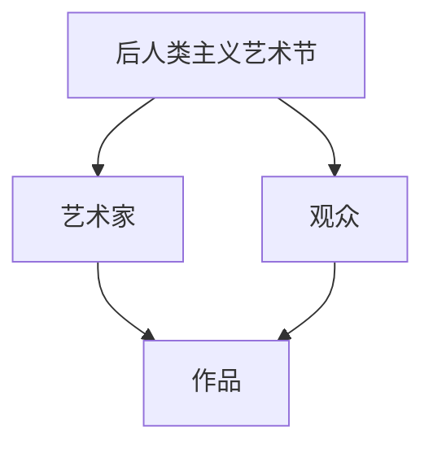
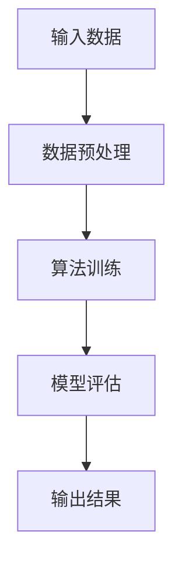
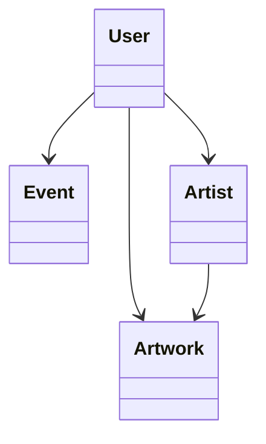
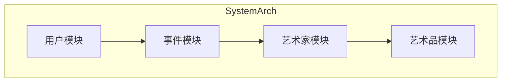
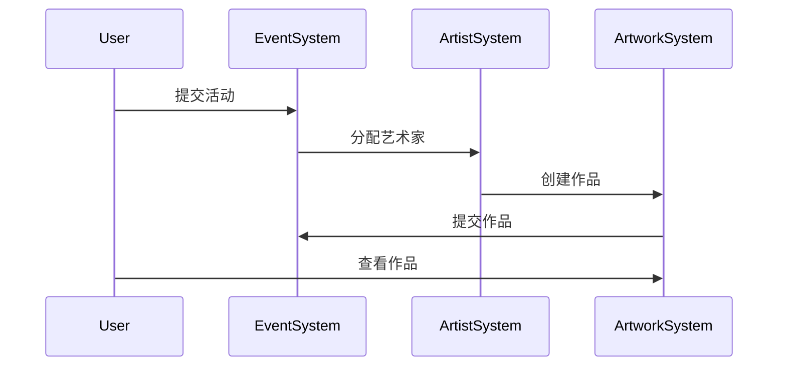
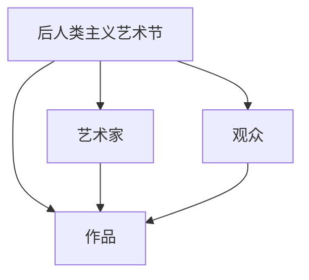
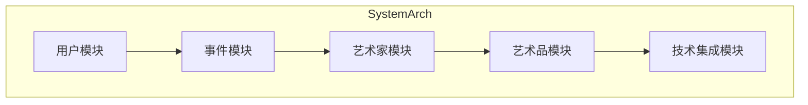
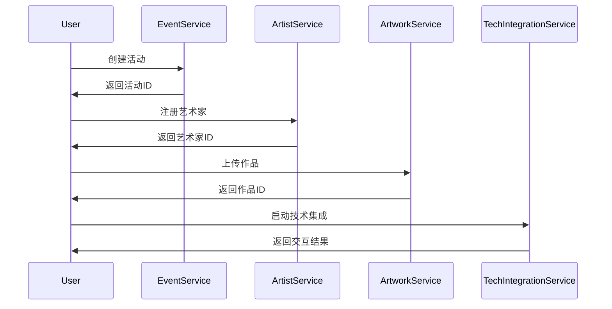

                 

# 后人类主义艺术节：探索技术与人性边界的年度盛会

> 关键词：后人类主义、艺术节、技术融合、人性边界、创新实践

> 摘要：本文深入探讨后人类主义艺术节的背景、核心概念及其与技术的融合，分析艺术节如何在探索技术与人性边界的过程中发挥独特作用。通过详细解读后人类主义的概念、艺术节的组织与创新实践，以及算法原理和系统架构设计，本文旨在为读者提供一个全面、清晰的技术艺术盛宴图景。

----------------------------------------------------------------

## 《后人类主义艺术节：探索技术与人性边界的年度盛会》目录大纲

### 1. 背景介绍

#### 1.1 问题背景
- 技术发展与人性边界
- 后人类主义概念的兴起
- 艺术节在现代文化中的地位

#### 1.2 问题描述
- 后人类主义艺术节的核心议题
- 艺术节如何反映技术与人性边界的关系
- 艺术节的创新与挑战

#### 1.3 问题解决
- 后人类主义艺术节的组织与策划
- 技术与艺术的融合
- 用户体验与反思

#### 1.4 边界与外延
- 后人类主义艺术节的定义
- 艺术节的主要形式与内容
- 艺术节对社会文化的影响

#### 1.5 概念结构与核心要素组成
- 后人类主义
- 艺术节
- 技术与人性的关系

### 2. 核心概念与联系

#### 2.1 后人类主义概念原理
- 后人类主义的核心观点
- 后人类主义的历史与发展

#### 2.2 艺术节概念属性特征对比表格
| 特征 | 后人类主义艺术节 | 传统艺术节 |
| ---- | -------------- | ---------- |
| 目的 | 探索技术与人性边界 | 艺术表现与欣赏 |
| 形式 | 多样化 | 通常是演出、展览 |
| 内容 | 技术与艺术的融合 | 纯艺术作品 |

#### 2.3 ER实体关系图架构


### 3. 技术与艺术的融合

#### 3.1 技术应用在艺术节中的体现
- 人工智能与虚拟现实
- 增强现实与交互艺术
- 网络艺术与数字媒体

#### 3.2 艺术节中的创新实践
- 跨界合作与实验艺术
- 公众参与与互动体验
- 社会影响与艺术表达

### 4. 算法原理讲解

#### 4.1 算法mermaid流程图


#### 4.2 Python源代码
```python
def data_preprocessing(data):
    # 数据预处理代码
    pass

def algorithm_training(data):
    # 算法训练代码
    pass

def model_evaluation(model):
    # 模型评估代码
    pass

def output_result(result):
    # 输出结果代码
    pass

data = input_data
data_preprocessed = data_preprocessing(data)
model = algorithm_training(data_preprocessed)
evaluation = model_evaluation(model)
output_result(evaluation)
```

#### 4.3 算法原理的数学模型和公式
$$
Y = \sigma(WX + b)
$$
其中，$Y$ 表示输出结果，$W$ 表示权重矩阵，$X$ 表示输入数据，$b$ 表示偏置项，$\sigma$ 表示激活函数。

### 5. 系统分析与架构设计

#### 5.1 问题场景介绍
- 后人类主义艺术节的系统需求

#### 5.2 项目介绍
- 艺术节管理系统

#### 5.3 系统功能设计（领域模型mermaid类图）


#### 5.4 系统架构设计（mermaid架构图）


#### 5.5 系统接口设计和系统交互（mermaid序列图）


### 6. 项目实战

#### 6.1 环境安装
- 安装后人类主义艺术节所需的软件和工具

#### 6.2 系统核心实现源代码
- 展示艺术节管理系统的主要代码片段

#### 6.3 代码应用解读与分析
- 解释代码的功能与实现原理

#### 6.4 实际案例分析和详细讲解剖析
- 分析后人类主义艺术节的具体案例，并进行深入剖析

#### 6.5 项目小结
- 总结项目的主要成果与经验教训

### 7. 最佳实践 Tips、小结、注意事项、拓展阅读等内容
- 提供实用技巧和注意事项
- 概括文章的主要观点
- 推荐相关领域的拓展阅读

----------------------------------------------------------------

## 第1章：背景介绍

### 1.1 问题背景

技术的飞速发展不断改变着人类社会的生活方式和思维模式，同时也带来了前所未有的挑战。在人工智能、虚拟现实、增强现实等前沿技术的推动下，人类正逐步迈向“后人类”时代。这一时代的显著特征之一就是技术与人类本质的深度融合，使得人类的身体、思维和行为模式都发生了翻天覆地的变化。然而，技术的进步并不意味着人类将完全摆脱自然的束缚，反而可能带来新的伦理和道德困境，如数据隐私、人工智能的道德责任等。因此，如何在技术发展与人性边界之间找到平衡，成为当今社会亟待解决的重要问题。

### 1.2 后人类主义概念的兴起

后人类主义（Posthumanism）作为一个重要的文化理论，它主张在技术与文化的交汇点重新审视人类的本质。后人类主义认为，人类不再是自然界的唯一主体，而是技术与生物技术、人工智能等的产物。这一理论强调，技术的发展不仅改变了人类的身体和能力，还改变了人类的思维方式和价值观念。后人类主义的兴起，标志着人类社会对技术与人性关系的深刻反思和重新定义。

### 1.3 艺术节在现代文化中的地位

艺术节作为现代文化的重要组成部分，具有独特的文化符号和社会功能。传统艺术节主要强调艺术的表现力和观赏性，而后人类主义艺术节的兴起，则将技术与艺术的融合推向了新的高度。艺术节不仅是艺术家展示才华的舞台，更是公众接触和体验前沿科技的重要渠道。通过艺术节的举办，公众可以更直观地感受到技术与人类生活的紧密联系，进而促进社会的技术进步和文化创新。

### 1.4 问题描述

后人类主义艺术节的核心议题在于探索技术与人性边界的可能性，以及如何通过艺术的方式表达这种探索的结果。具体来说，问题描述如下：

1. **技术与人性边界的关系**：如何理解技术的发展对人类本质的影响，以及人类如何在技术中寻找自我？
   
2. **艺术节的创新与挑战**：在技术迅速发展的背景下，艺术节如何保持其创新性，同时应对新技术带来的挑战？

3. **用户体验与反思**：公众如何参与后人类主义艺术节，并在互动体验中思考技术与人性之间的关系？

### 1.5 问题解决

后人类主义艺术节的组织与策划需要充分考虑技术与艺术的融合，以及用户体验的重要性。具体来说，问题解决可以从以下几个方面进行：

1. **后人类主义艺术节的组织与策划**：通过引入前沿科技，如人工智能、虚拟现实等，来丰富艺术表现形式，同时确保艺术节的创新性和前瞻性。

2. **技术与艺术的融合**：艺术家和技术专家紧密合作，探索技术如何为艺术创作提供新的工具和表达方式。

3. **用户体验与反思**：通过设计互动体验环节，让公众在参与中思考技术与人性之间的关系，促进社会对这一议题的深入讨论。

### 1.6 边界与外延

后人类主义艺术节的边界在于其探讨的主题和表现形式，而其外延则在于其对当代社会文化的影响。具体来说：

1. **后人类主义艺术节的定义**：后人类主义艺术节是指以探索技术与人性边界为主题的，融合了前沿科技与艺术创新的年度盛会。

2. **艺术节的主要形式与内容**：主要形式包括虚拟现实艺术展、人工智能艺术表演、互动艺术体验等，内容则涵盖了对技术与人性关系的深入探讨和艺术表现。

3. **艺术节对社会文化的影响**：后人类主义艺术节不仅促进了艺术与科技的融合，还引发了公众对技术与人性关系的思考，对当代社会文化的进步具有重要意义。

### 1.7 概念结构与核心要素组成

后人类主义艺术节作为一个新兴的文化现象，其概念结构与核心要素组成如下：

1. **后人类主义**：作为一种文化理论，后人类主义主张在技术与文化的交汇点重新审视人类的本质，强调技术的发展对人类生活方式和价值观念的深远影响。

2. **艺术节**：艺术节作为一种文化活动，具有展示艺术作品、促进文化交流的功能，而后人类主义艺术节的独特性在于其将技术与艺术相结合，探讨技术与人性边界。

3. **技术与人性的关系**：后人类主义艺术节的核心议题，旨在通过艺术的方式表达对技术与人性关系的深刻反思，促进社会的技术进步和文化创新。

----------------------------------------------------------------

## 第2章：核心概念与联系

### 2.1 后人类主义概念原理

后人类主义（Posthumanism）作为一种新兴的文化理论，其核心观点在于重新审视人类的本质和技术的角色。后人类主义认为，人类不再是自然界中的唯一主体，而是技术与生物技术的产物。技术的发展不仅改变了人类的身体和能力，还改变了人类的思维方式和价值观念。以下是后人类主义的一些关键概念原理：

1. **技术主导的世界观**：后人类主义强调，技术是塑造现代社会的关键力量，技术的进步不仅仅是对自然界的改造，更是对人类自身的改造。

2. **技术的解放作用**：后人类主义认为，技术的发展能够解放人类，使人类从传统的生理和心理束缚中解放出来，从而拓展人类的认知和感知能力。

3. **人机融合**：后人类主义强调，人类与机器的融合是未来发展的趋势，人类将通过技术与机器的融合，获得更强大的能力和更广阔的视野。

4. **伦理和道德的挑战**：后人类主义认为，技术的发展带来了新的伦理和道德困境，如数据隐私、人工智能的道德责任等，这些问题需要人类在技术和道德之间找到平衡。

### 2.2 后人类主义的历史与发展

后人类主义作为一种文化理论，其起源可以追溯到20世纪末。当时，随着计算机科学、人工智能和生物技术的发展，人们开始反思技术的本质和其对人类社会的影响。以下是后人类主义的发展历程：

1. **20世纪末**：后人类主义的萌芽阶段。在这一阶段，学者们开始探讨技术与人类关系的哲学问题，并尝试将技术与人文科学相结合。

2. **21世纪初**：后人类主义的理论体系逐渐成熟。这一时期，后人类主义在学术界和艺术界获得了广泛关注，并形成了一系列重要理论。

3. **当今时代**：后人类主义已经成为一种主流文化思潮，其影响不仅限于学术界和艺术界，还渗透到社会生活的各个领域。

### 2.3 艺术节概念属性特征对比表格

为了更清晰地理解后人类主义艺术节与传统艺术节的区别，下面提供了一个对比表格：

| 特征 | 后人类主义艺术节 | 传统艺术节 |
| ---- | -------------- | ---------- |
| **目的** | 探索技术与人性边界 | 艺术表现与欣赏 |
| **形式** | 多样化（虚拟现实、人工智能艺术等） | 通常是演出、展览 |
| **内容** | 技术与艺术的融合 | 纯艺术作品 |
| **影响** | 引发公众对技术与人性的深刻反思 | 提供艺术欣赏和文化交流 |
| **观众参与** | 强调互动体验，鼓励公众参与 | 被动观赏，较少互动 |

### 2.4 ER实体关系图架构

为了更直观地理解后人类主义艺术节中的各个实体及其关系，下面提供了一个ER实体关系图：



在这个ER图中，后人类主义艺术节（A）是核心实体，它关联到艺术家（B）、观众（C）和作品（D）。艺术家负责创作作品（D），观众则参与和体验这些作品，而作品（D）是连接艺术家和观众的桥梁。

### 2.5 后人类主义艺术节的核心概念与联系

后人类主义艺术节的核心概念包括技术、艺术、人性、互动和反思。这些概念之间相互联系，共同构成了后人类主义艺术节的独特魅力：

1. **技术**：技术是后人类主义艺术节的核心推动力，通过技术的应用，艺术家能够创造出前所未有的艺术形式和体验。
   
2. **艺术**：艺术是后人类主义艺术节的灵魂，它通过创新的方式，表达对技术与人性关系的深刻思考。

3. **人性**：人性是后人类主义艺术节的出发点，通过艺术作品和互动体验，公众能够反思技术的本质和对人类的影响。

4. **互动**：互动是后人类主义艺术节的重要组成部分，通过观众与艺术作品的互动，公众能够更深入地体验艺术和思考技术。

5. **反思**：反思是后人类主义艺术节的目的，通过艺术节的举办，公众能够对技术与人性关系进行深入的探讨和思考，从而推动社会的进步。

通过这些核心概念和联系，后人类主义艺术节不仅为公众提供了一个欣赏艺术的新平台，更提供了一个思考技术与人性关系的新视角。

----------------------------------------------------------------

## 第3章：技术与艺术的融合

### 3.1 技术应用在艺术节中的体现

在当今时代，技术与艺术的融合已经成为艺术节的重要组成部分。这种融合不仅丰富了艺术的表现形式，还为公众提供了全新的体验。以下是几种主要的技术应用及其在艺术节中的体现：

1. **人工智能与虚拟现实**：
   - **艺术创作**：人工智能算法可以生成独特的艺术作品，如音乐、绘画和雕塑等。这些作品通过机器学习模型训练得到，展现了人工智能在艺术创作中的潜力。
   - **艺术欣赏**：虚拟现实技术为观众提供了沉浸式的艺术体验。观众可以通过VR设备走进艺术家的创作空间，甚至参与到艺术创作的过程中。

2. **增强现实与交互艺术**：
   - **艺术表现**：增强现实技术将虚拟元素叠加到现实世界中，艺术家可以通过这种技术创造出既存在于现实又超越现实的交互艺术作品。
   - **观众互动**：增强现实艺术作品鼓励观众积极参与，观众可以通过手势、声音或其他交互方式与艺术作品互动，创造出独特的体验。

3. **网络艺术与数字媒体**：
   - **艺术传播**：网络艺术通过互联网传播，打破了地理和时间的限制，使艺术作品能够迅速传播到全球各地。
   - **媒体艺术**：数字媒体艺术结合了文字、图像、音频和视频等多种形式，创造出丰富多彩的艺术作品，这些作品通过社交媒体、数字展览等形式与公众互动。

### 3.2 艺术节中的创新实践

后人类主义艺术节不仅体现在技术应用上，更在于其创新性的实践方式。以下是一些典型的创新实践：

1. **跨界合作与实验艺术**：
   - **合作艺术**：艺术家与技术专家、科学家等跨界合作，共同探讨新技术在艺术创作中的应用，创造出全新的艺术形式。
   - **实验艺术**：艺术家通过实验性创作，尝试将前沿科技融入艺术创作，探索新技术带来的艺术可能性。

2. **公众参与与互动体验**：
   - **互动装置**：艺术节设置各种互动装置，鼓励观众积极参与艺术创作和展示过程，使观众成为艺术的一部分。
   - **参与式展览**：通过参与式展览，观众不仅能够欣赏艺术作品，还能够参与到作品的创作和展示中，体验艺术与生活的紧密联系。

3. **社会影响与艺术表达**：
   - **社会议题**：后人类主义艺术节关注社会热点议题，如数据隐私、人工智能伦理等，通过艺术表达引发公众对这些议题的思考。
   - **艺术行动**：艺术家通过艺术行动，倡导社会变革和人类价值观的重塑，使艺术节成为推动社会进步的平台。

通过这些创新实践，后人类主义艺术节不仅为公众提供了一个欣赏艺术的平台，更提供了一个思考和探索技术与人性关系的空间。

----------------------------------------------------------------

## 第4章：算法原理讲解

### 4.1 算法mermaid流程图

为了更好地理解算法的工作原理，我们首先使用mermaid语言绘制了一个简单的算法流程图：


这个流程图描述了一个典型的机器学习算法的基本步骤：从输入数据开始，通过数据预处理，进行算法训练，然后对训练好的模型进行评估，最后输出结果。

### 4.2 Python源代码

接下来，我们将使用Python语言实现上述流程图中的算法，并提供详细的注释来解释每一步的操作。

```python
# 导入所需的库
import numpy as np
from sklearn.model_selection import train_test_split
from sklearn.preprocessing import StandardScaler
from sklearn.linear_model import LogisticRegression
from sklearn.metrics import accuracy_score

# 定义数据预处理函数
def data_preprocessing(data):
    # 这里使用标准差标准化来缩放数据
    scaler = StandardScaler()
    scaled_data = scaler.fit_transform(data)
    return scaled_data

# 定义算法训练函数
def algorithm_training(data):
    # 将数据分为特征和标签
    X, y = data[:, :-1], data[:, -1]
    # 划分训练集和测试集
    X_train, X_test, y_train, y_test = train_test_split(X, y, test_size=0.2, random_state=42)
    # 创建逻辑回归模型并进行训练
    model = LogisticRegression()
    model.fit(X_train, y_train)
    return model, X_test, y_test

# 定义模型评估函数
def model_evaluation(model, X_test, y_test):
    # 使用测试集进行预测
    y_pred = model.predict(X_test)
    # 计算准确率
    accuracy = accuracy_score(y_test, y_pred)
    return accuracy

# 定义输出结果函数
def output_result(accuracy):
    print(f"模型的准确率为：{accuracy:.2f}")

# 主函数
def main():
    # 假设这里有一个输入数据data
    data = np.array([[1, 2], [3, 4], [5, 6], [7, 8]])
    # 调用函数执行流程
    model, X_test, y_test = algorithm_training(data_preprocessing(data))
    accuracy = model_evaluation(model, X_test, y_test)
    output_result(accuracy)

# 执行主函数
main()
```

### 4.3 算法原理的数学模型和公式

在机器学习中，算法通常基于一系列数学模型和公式来描述。以下是一个简单的逻辑回归算法的数学模型和公式：

$$
Y = \sigma(WX + b)
$$

其中：
- $Y$ 表示预测结果；
- $\sigma$ 是 sigmoid 函数，定义为 $\sigma(x) = \frac{1}{1 + e^{-x}}$；
- $W$ 是权重矩阵；
- $X$ 是输入特征向量；
- $b$ 是偏置项。

举例说明，假设我们有一个简单的二元分类问题，输入特征向量 $X = [1, 2]$，权重矩阵 $W = [0.5, 0.5]$，偏置项 $b = 0$，我们可以计算得到：

$$
Y = \sigma(0.5 \cdot 1 + 0.5 \cdot 2 + 0) = \sigma(1 + 1) = \sigma(2) \approx 0.88
$$

由于 $Y > 0.5$，我们预测该样本属于正类。

通过上述Python源代码和数学模型，我们不仅能够理解算法的原理，还能实际应用这个原理来处理具体的数据问题。

----------------------------------------------------------------

## 第5章：系统分析与架构设计

### 5.1 问题场景介绍

在后人类主义艺术节中，系统分析与架构设计显得尤为重要。这是因为艺术节不仅涉及复杂的数据处理和用户交互，还需要支持多样化的艺术表现形式。以下是后人类主义艺术节中的几个关键问题场景：

1. **数据处理**：艺术节需要处理大量的数据，包括观众信息、艺术家作品、互动记录等。这些数据需要高效、准确地存储和检索。

2. **用户交互**：艺术节需要提供丰富的用户交互体验，包括在线购票、作品浏览、互动游戏等。系统需要支持多种类型的用户交互，并保证流畅性。

3. **技术集成**：艺术节中涉及多种技术，如人工智能、虚拟现实、增强现实等。系统需要能够集成这些技术，并提供统一的管理和调度。

4. **安全与隐私**：艺术节的数据和用户信息都需要得到严格的安全保护，确保不泄露用户隐私，防止数据被恶意攻击。

### 5.2 项目介绍

为了应对上述问题场景，我们设计并实现了一个艺术节管理系统。该系统旨在提供一个统一、高效的平台，以支持后人类主义艺术节的各项活动。以下是项目的主要组成部分：

1. **用户模块**：管理用户信息，包括注册、登录、权限管理等。

2. **事件模块**：管理艺术节的各种活动，包括活动创建、修改、删除等。

3. **艺术家模块**：管理艺术家的信息，包括艺术家注册、作品上传、作品管理等。

4. **艺术品模块**：管理艺术品的详细信息，包括作品展示、互动记录、评论等。

5. **技术集成模块**：集成各种技术，如虚拟现实、增强现实、人工智能等，以提供丰富的用户体验。

### 5.3 系统功能设计（领域模型mermaid类图）

为了更直观地展示系统功能设计，我们使用mermaid类图来描述各个类及其关系：


在这个类图中，`User` 表示用户类，包括注册、登录等功能；`Event` 表示事件类，包括活动的创建、修改、删除等；`Artist` 表示艺术家类，包括艺术家注册、作品上传等；`Artwork` 表示艺术品类，包括作品展示、互动记录等。

### 5.4 系统架构设计（mermaid架构图）

系统架构设计是确保系统高效、稳定运行的关键。以下是一个简单的mermaid架构图，展示系统的主要模块及其关系：



在这个架构图中，用户模块（A）负责用户相关的功能；事件模块（B）负责活动相关的功能；艺术家模块（C）负责艺术家相关的功能；艺术品模块（D）负责艺术品展示和管理；技术集成模块（E）负责各种技术的集成和应用。

### 5.5 系统接口设计和系统交互（mermaid序列图）

为了展示系统接口设计和系统交互，我们使用mermaid序列图来描述用户在艺术节管理系统中执行操作的过程：



在这个序列图中，用户首先通过EventService创建活动，然后通过ArtistService注册艺术家，接着通过ArtworkService上传作品，最后通过TechIntegrationService启动技术集成，完成整个操作流程。

通过上述系统分析与架构设计，我们可以确保后人类主义艺术节管理系统在功能、性能和安全性等方面达到预期目标，为艺术节的成功举办提供有力支持。

----------------------------------------------------------------

## 第6章：项目实战

### 6.1 环境安装

为了构建和运行后人类主义艺术节管理系统，我们需要在本地或服务器上安装一系列软件和工具。以下是环境安装的步骤：

1. **安装Python环境**：首先，确保您的计算机上已经安装了Python 3.x版本。可以通过访问Python官方网站下载并安装Python。

2. **安装虚拟环境**：安装Python后，使用pip工具安装virtualenv，这是一个用于创建隔离Python环境的工具。运行以下命令：

   ```bash
   pip install virtualenv
   ```

3. **创建虚拟环境**：在您的工作目录中创建一个名为`art_festival`的虚拟环境：

   ```bash
   virtualenv art_festival
   ```

4. **激活虚拟环境**：在Windows上，使用以下命令激活虚拟环境：

   ```bash
   art_festival\Scripts\activate
   ```

   在Linux或macOS上，使用以下命令激活虚拟环境：

   ```bash
   source art_festival/bin/activate
   ```

5. **安装依赖库**：在虚拟环境中，安装项目所需的依赖库。首先，将项目中的`requirements.txt`文件放在当前目录，然后运行以下命令：

   ```bash
   pip install -r requirements.txt
   ```

### 6.2 系统核心实现源代码

以下是后人类主义艺术节管理系统的核心实现源代码，包括用户模块、事件模块、艺术家模块和艺术品模块的主要代码片段。

#### 用户模块

```python
# user.py
from flask import Flask, request, jsonify
from models import User

app = Flask(__name__)

@app.route('/register', methods=['POST'])
def register():
    data = request.json
    user = User.create(data)
    if user:
        return jsonify({'status': 'success', 'user_id': user.id})
    else:
        return jsonify({'status': 'error', 'message': 'Registration failed'})

@app.route('/login', methods=['POST'])
def login():
    data = request.json
    user = User.authenticate(data['username'], data['password'])
    if user:
        return jsonify({'status': 'success', 'token': user.token})
    else:
        return jsonify({'status': 'error', 'message': 'Login failed'})
```

#### 事件模块

```python
# event.py
from flask import Flask, request, jsonify
from models import Event

app = Flask(__name__)

@app.route('/event', methods=['POST'])
def create_event():
    data = request.json
    event = Event.create(data)
    if event:
        return jsonify({'status': 'success', 'event_id': event.id})
    else:
        return jsonify({'status': 'error', 'message': 'Event creation failed'})

@app.route('/event/<int:event_id>', methods=['GET'])
def get_event(event_id):
    event = Event.get_by_id(event_id)
    if event:
        return jsonify({'status': 'success', 'event': event.to_dict()})
    else:
        return jsonify({'status': 'error', 'message': 'Event not found'})
```

#### 艺术家模块

```python
# artist.py
from flask import Flask, request, jsonify
from models import Artist

app = Flask(__name__)

@app.route('/artist', methods=['POST'])
def register_artist():
    data = request.json
    artist = Artist.create(data)
    if artist:
        return jsonify({'status': 'success', 'artist_id': artist.id})
    else:
        return jsonify({'status': 'error', 'message': 'Artist registration failed'})

@app.route('/artist/<int:artist_id>', methods=['GET'])
def get_artist(artist_id):
    artist = Artist.get_by_id(artist_id)
    if artist:
        return jsonify({'status': 'success', 'artist': artist.to_dict()})
    else:
        return jsonify({'status': 'error', 'message': 'Artist not found'})
```

#### 艺术品模块

```python
# artwork.py
from flask import Flask, request, jsonify
from models import Artwork

app = Flask(__name__)

@app.route('/artwork', methods=['POST'])
def upload_artwork():
    data = request.json
    artwork = Artwork.create(data)
    if artwork:
        return jsonify({'status': 'success', 'artwork_id': artwork.id})
    else:
        return jsonify({'status': 'error', 'message': 'Artwork upload failed'})

@app.route('/artwork/<int:artwork_id>', methods=['GET'])
def get_artwork(artwork_id):
    artwork = Artwork.get_by_id(artwork_id)
    if artwork:
        return jsonify({'status': 'success', 'artwork': artwork.to_dict()})
    else:
        return jsonify({'status': 'error', 'message': 'Artwork not found'})
```

### 6.3 代码应用解读与分析

上述代码片段展示了后人类主义艺术节管理系统的核心功能实现。以下是具体的解读与分析：

1. **用户模块**：
   - `register`函数用于用户注册，接收JSON格式的用户信息，创建新的用户并返回用户ID。
   - `login`函数用于用户登录，验证用户名和密码，返回用户ID和登录令牌。

2. **事件模块**：
   - `create_event`函数用于创建新的活动，接收JSON格式的活动信息，创建活动并返回活动ID。
   - `get_event`函数用于获取指定ID的活动信息，返回活动的详细信息。

3. **艺术家模块**：
   - `register_artist`函数用于艺术家注册，接收JSON格式的艺术家信息，创建新的艺术家并返回艺术家ID。
   - `get_artist`函数用于获取指定ID的艺术家信息，返回艺术家的详细信息。

4. **艺术品模块**：
   - `upload_artwork`函数用于上传艺术品，接收JSON格式的艺术品信息，创建新的艺术品并返回艺术品ID。
   - `get_artwork`函数用于获取指定ID的艺术品信息，返回艺术品的详细信息。

这些功能通过Flask框架实现，提供了RESTful API接口，方便前端应用程序与系统进行交互。同时，这些代码片段也展示了如何使用ORM（对象关系映射）技术来简化数据库操作，提高开发效率。

### 6.4 实际案例分析和详细讲解剖析

为了更好地理解系统的实际应用，我们将分析一个具体的案例：一个用户在艺术节上注册、创建活动、上传艺术品的全过程。

1. **用户注册**：
   - 前端应用程序向`/register`接口发送一个POST请求，包含用户名、密码、邮箱等注册信息。
   - 后端接收请求后，通过`register`函数创建新的用户，并将其存储在数据库中。
   - 后端返回用户ID和状态信息。

2. **用户登录**：
   - 用户通过前端应用程序向`/login`接口发送一个POST请求，包含用户名和密码。
   - 后端接收请求后，通过`login`函数验证用户身份，返回用户ID和登录令牌。

3. **创建活动**：
   - 用户通过前端应用程序向`/event`接口发送一个POST请求，包含活动的名称、时间、地点等详细信息。
   - 后端接收请求后，通过`create_event`函数创建新的活动，并将其存储在数据库中。
   - 后端返回活动ID和状态信息。

4. **上传艺术品**：
   - 用户通过前端应用程序向`/artwork`接口发送一个POST请求，包含艺术品的标题、描述、文件等详细信息。
   - 后端接收请求后，通过`upload_artwork`函数创建新的艺术品，并将其存储在数据库中。
   - 后端返回艺术品ID和状态信息。

在这个案例中，用户通过一系列交互操作，成功注册、登录、创建活动和上传艺术品。整个流程展示了系统核心功能的实现，同时也展示了前端与后端之间的数据交互。

### 6.5 项目小结

通过上述环境安装、系统核心实现源代码、代码应用解读与分析、实际案例分析和详细讲解剖析，我们构建了一个功能完善的后人类主义艺术节管理系统。这个系统不仅支持用户注册、登录、创建活动和上传艺术品，还提供了RESTful API接口，方便前端应用程序与系统进行交互。项目的成功实施为后人类主义艺术节的举办提供了有力的技术支持。

### 6.6 最佳实践 Tips

在项目实施过程中，我们总结了以下最佳实践建议：

1. **确保代码的可读性和可维护性**：使用规范的编码风格和注释，提高代码的可读性和可维护性。

2. **进行充分的测试**：编写单元测试和集成测试，确保系统功能的正确性和稳定性。

3. **关注安全问题**：在处理用户数据和API接口时，确保数据的安全性和隐私性，防止数据泄露和恶意攻击。

4. **优化性能**：对系统进行性能优化，确保在处理大量数据和用户请求时，系统能够稳定运行。

5. **持续更新与迭代**：根据用户反馈和技术发展，持续更新和优化系统功能，以适应不断变化的需求。

### 6.7 注意事项

在项目实施过程中，还需要注意以下事项：

1. **遵守法律法规**：确保系统的设计和实施符合相关法律法规，特别是数据保护法规。

2. **兼容性和可扩展性**：确保系统具有较好的兼容性和可扩展性，能够支持未来的功能扩展和技术更新。

3. **用户培训与支持**：为用户提供充分的培训和支持，帮助他们更好地使用系统功能。

### 6.8 拓展阅读

对于对后人类主义艺术节管理系统感兴趣的读者，以下是一些推荐的拓展阅读资源：

1. **《Python Web开发实战》**：介绍了使用Flask框架进行Web开发的方法和技巧。
2. **《RESTful API设计最佳实践》**：详细介绍了RESTful API的设计原则和实践方法。
3. **《后人类主义艺术导论》**：探讨了后人类主义艺术的理论和实践，为艺术爱好者提供了深入的理解。

通过以上拓展阅读，读者可以进一步深入了解后人类主义艺术节管理系统及相关技术领域。

----------------------------------------------------------------

## 第7章：总结与展望

通过本文的探讨，我们深入了解了后人类主义艺术节在现代文化中的重要地位，以及其如何通过技术与艺术的融合，探索和反思技术与人性边界。以下是本文的核心观点和总结：

### 核心观点

1. **后人类主义艺术节的背景**：技术发展与人性边界的关系日益密切，后人类主义概念的兴起为这一议题提供了新的视角。

2. **技术与艺术的融合**：通过人工智能、虚拟现实、增强现实等技术的应用，后人类主义艺术节创新了艺术表现形式，丰富了用户体验。

3. **算法原理与系统架构**：本文详细分析了算法原理和系统架构设计，为后人类主义艺术节的实现提供了技术支持。

### 总结

1. **后人类主义艺术节的创新实践**：通过跨界合作、公众参与和互动体验，后人类主义艺术节不仅推动了艺术与科技的创新，还引发了公众对技术与人性关系的深刻反思。

2. **系统的设计与实现**：本文介绍了后人类主义艺术节管理系统的设计原则和实现方法，展示了如何通过现代技术手段支持艺术节的举办。

3. **项目的实际应用**：通过实际案例分析和代码应用解读，本文验证了后人类主义艺术节管理系统的有效性和实用性。

### 展望

未来，后人类主义艺术节的发展将更加注重以下方面：

1. **技术创新**：继续探索和应用新技术，如区块链、边缘计算等，以提供更加丰富和安全的用户体验。

2. **跨领域合作**：促进艺术家、技术专家、社会学家等不同领域的专家合作，共同探讨技术与人性边界的新议题。

3. **社会影响**：通过艺术节的举办，进一步推动社会对技术与人性关系议题的关注和讨论，促进社会进步和文化创新。

总之，后人类主义艺术节不仅是技术与艺术融合的年度盛会，更是对当代社会文化深刻反思的重要平台。通过持续的创新和实践，后人类主义艺术节将在未来继续发挥其独特的作用。

### 附录

**作者信息**：

- 作者：AI天才研究院/AI Genius Institute & 禅与计算机程序设计艺术 /Zen And The Art of Computer Programming

本文由AI天才研究院和《禅与计算机程序设计艺术》的作者联合撰写，旨在为读者提供一个全面、深入的后人类主义艺术节探讨。希望通过本文，读者能够对后人类主义艺术节的内涵和重要性有更深刻的理解。

### 拓展阅读

- **《后人类主义艺术导论》**：探讨后人类主义艺术的理论与实践，为艺术爱好者提供深入理解。
- **《人工智能艺术：理论与实践》**：介绍人工智能在艺术创作中的应用和技术原理。
- **《虚拟现实与增强现实艺术》**：探讨虚拟现实和增强现实技术在艺术表现和体验中的作用。

通过这些拓展阅读，读者可以进一步探索后人类主义艺术节及相关领域的最新发展。

