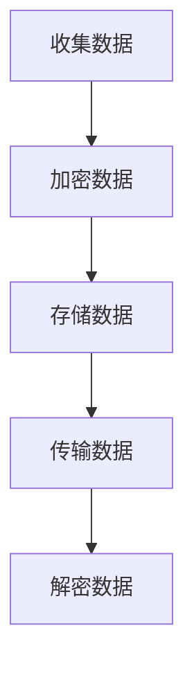
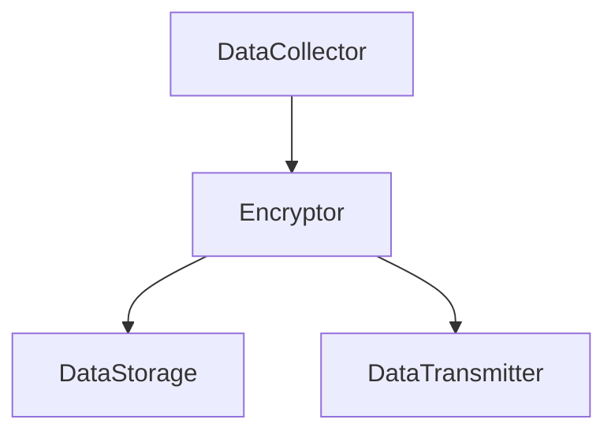
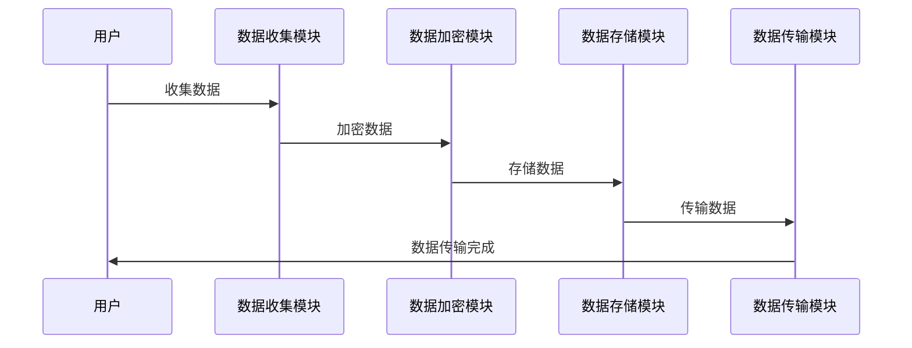

                 

# 后人类伦理学院：技术发展中的道德教育

## 关键词

- 后人类伦理学院
- 技术发展
- 道德教育
- 人工智能
- 伦理问题

## 摘要

随着科技的迅猛发展，人工智能、生物技术、网络技术等领域不断突破，人类进入了一个前所未有的技术时代。然而，这些科技进步在改变人们生活方式的同时，也引发了诸多伦理问题。如何在这一技术革命中保持道德的引领和规范，成为了一个亟待解决的问题。本文旨在探讨技术发展中的道德教育问题，分析其背景、核心概念、联系，并提出相应的解决方法和实践路径。

## 第1章：后人类伦理学院：技术发展中的道德教育背景

### 1.1 问题背景

在技术迅猛发展的当今社会，人工智能、生物技术、网络技术等前沿科技的不断突破，给人类社会带来了前所未有的机遇与挑战。然而，这些科技进步在改变人们生活方式的同时，也引发了诸多伦理问题，如隐私保护、人工智能决策的透明性和公平性、基因编辑的道德边界等。如何在这场技术革命中保持道德的引领和规范，成为了一个亟待解决的问题。

### 1.2 问题描述

技术发展的道德教育问题主要体现在以下几个方面：

1. **隐私保护**：随着大数据和人工智能技术的发展，个人隐私数据被大规模收集和分析，如何确保这些数据的安全和用户的知情权成为一个关键问题。
2. **决策透明性和公平性**：人工智能在决策中的作用日益增强，如何确保这些决策的透明性和公平性，避免算法歧视，是一个重要的伦理挑战。
3. **基因编辑**：基因编辑技术的出现使得人类能够修改自身的遗传信息，如何规范这项技术，防止滥用，是一个道德上的重要议题。
4. **网络伦理**：互联网的普及带来了信息传播的无国界性，如何处理网络伦理问题，如网络暴力、虚假信息传播等，是一个严峻的挑战。

### 1.3 问题解决

面对上述问题，道德教育在技术发展中起到了至关重要的作用。通过道德教育，可以提高公众的道德意识，促进科技伦理的规范和实践。道德教育可以从以下几个方面展开：

1. **道德原则的普及**：通过教育和培训，让公众了解基本的道德原则，如尊重他人、公正、诚实等。
2. **科技伦理的教育**：在课程设置中增加科技伦理的相关内容，让学生了解科技对社会的影响，以及如何在实际应用中遵循伦理规范。
3. **实践与反思**：通过实践项目和社会实践活动，让学生在实际中体验和应用伦理原则，培养他们的道德判断能力。
4. **跨学科合作**：道德教育与计算机科学、生物技术等学科相结合，共同探讨科技伦理问题，形成综合性的解决方案。

### 1.4 边界与外延

道德教育在技术发展中的边界在于如何在遵循伦理原则的同时，适应技术的快速发展。其外延包括但不限于：

1. **隐私保护法律和政策的研究与制定**：通过法律和政策来保障个人隐私权益。
2. **人工智能伦理标准的制定**：制定相关的伦理标准，规范人工智能的应用。
3. **伦理教育与科技产业的融合**：将道德教育融入科技产业，推动企业遵守伦理规范。
4. **国际交流与合作**：加强国际间的科技伦理交流与合作，共同应对全球性科技伦理问题。

### 1.5 概念结构与核心要素组成

本章节的核心概念包括：

1. **道德教育**：指的是通过教育手段培养个体的道德观念和道德行为。
2. **技术发展**：指在科学研究和技术创新过程中，新技术的产生和应用。
3. **科技伦理**：指在科技发展过程中，如何处理技术与社会、环境、伦理等之间的关系。
4. **隐私保护**：指在技术应用过程中，如何确保个人隐私数据的安全。
5. **人工智能决策**：指人工智能系统在决策过程中如何保证透明性和公平性。
6. **基因编辑**：指通过技术手段修改生物体的遗传信息。

### Mermaid ER实体关系图架构

```mermaid
erDiagram
    A[道德教育] ||--|{ B[技术发展] }
    A ||--|{ C[科技伦理] }
    B ||--|{ D[隐私保护] }
    B ||--|{ E[人工智能决策] }
    B ||--|{ F[基因编辑] }
```

## 第2章：核心概念与联系

### 2.1 道德教育的定义与特点

道德教育是一种通过教育手段培养个体道德观念和道德行为的过程。其特点包括：

1. **规范性**：道德教育强调道德规范的传授和遵守。
2. **内化性**：道德教育注重个体对道德原则的内化和实践。
3. **多样性**：道德教育内容因文化和社会背景而异。

### 2.2 技术发展的定义与特点

技术发展是指在科学研究和技术创新过程中，新技术的产生和应用。其特点包括：

1. **创新性**：技术发展强调创新和突破。
2. **快速性**：技术在快速发展，应用领域不断扩大。
3. **全球性**：技术发展的影响超越国界，具有全球性。

### 2.3 科技伦理的定义与特点

科技伦理是指在科技发展过程中，如何处理技术与社会、环境、伦理等之间的关系。其特点包括：

1. **规范性**：科技伦理强调对技术的规范和约束。
2. **前瞻性**：科技伦理关注未来技术对社会的影响。
3. **综合性**：科技伦理涉及多个领域的交叉和融合。

### 2.4 隐私保护的定义与特点

隐私保护是指在技术应用过程中，如何确保个人隐私数据的安全。其特点包括：

1. **安全性**：隐私保护强调对个人数据的保护，防止数据泄露和滥用。
2. **透明性**：隐私保护要求个人对自身数据的处理有知情权和选择权。
3. **法制性**：隐私保护需要法律和政策的支持，以保障个人权益。

### 2.5 人工智能决策的定义与特点

人工智能决策是指人工智能系统在决策过程中如何保证透明性和公平性。其特点包括：

1. **透明性**：人工智能决策要求决策过程可追溯、可解释，便于监督和评估。
2. **公平性**：人工智能决策需要避免算法歧视，确保对所有用户的公平对待。
3. **可控性**：人工智能决策需要具备一定的可控性，以便在出现问题时能够及时纠正。

### 2.6 基因编辑的定义与特点

基因编辑是指通过技术手段修改生物体的遗传信息。其特点包括：

1. **精准性**：基因编辑具有高度的精准性，能够精确修改特定基因。
2. **风险性**：基因编辑存在一定的风险，如基因突变和不可预测的后果。
3. **规范性**：基因编辑需要严格的伦理和法律规范，防止滥用和不当操作。

### 2.7 核心概念对比表格

| 概念     | 定义                                           | 特点                                       |
|----------|------------------------------------------------|------------------------------------------|
| 道德教育 | 培养个体道德观念和道德行为的过程           | 规范性、内化性、多样性                    |
| 技术发展 | 新技术的产生和应用                             | 创新性、快速性、全球性                    |
| 科技伦理 | 处理技术与社会、环境、伦理等关系             | 规范性、前瞻性、综合性                    |
| 隐私保护 | 保护个人隐私数据的安全                         | 安全性、透明性、法制性                    |
| 人工智能决策 | 确保人工智能系统决策的透明性和公平性         | 透明性、公平性、可控性                    |
| 基因编辑 | 修改生物体的遗传信息                           | 精准性、风险性、规范性                    |

### 2.8 ER实体关系图架构

```mermaid
erDiagram
    A[道德教育] ||--|{ B[技术发展] }
    A ||--|{ C[科技伦理] }
    B ||--|{ D[隐私保护] }
    B ||--|{ E[人工智能决策] }
    B ||--|{ F[基因编辑] }
```

## 第3章：算法原理讲解

### 3.1 算法原理

在本章节中，我们将介绍一个简单的算法，用于处理技术发展中的隐私保护问题。该算法的核心思想是通过加密技术来保护个人隐私数据。

### 3.2 算法mermaid流程图



### 3.3 Python源代码

```python
import Crypto.Cipher.AES as AES
import Crypto.Util.Padding as Padding

def encrypt_data(data, key):
    cipher = AES.new(key, AES.MODE_CBC)
    ct_bytes = cipher.encrypt(Padding.pad(data, AES.block_size))
    iv = cipher.iv
    return iv, ct_bytes

def decrypt_data(iv, ct, key):
    cipher = AES.new(key, AES.MODE_CBC, iv)
    pt = Padding.unpad(cipher.decrypt(ct), AES.block_size)
    return pt

# 测试
key = b'mysecretkey123456'
data = b'Personal Data to be encrypted'

iv, encrypted_data = encrypt_data(data, key)
print("IV:", iv.hex())
print("Encrypted Data:", encrypted_data.hex())

decrypted_data = decrypt_data(iv, encrypted_data, key)
print("Decrypted Data:", decrypted_data.hex())
```

### 3.4 算法原理的数学模型和公式

加密算法的原理主要基于以下数学模型和公式：

1. **加密过程**：将明文数据通过加密算法转换为密文数据。加密算法通常采用对称密钥加密，即加密和解密使用相同的密钥。
2. **解密过程**：将密文数据通过解密算法还原为明文数据。解密算法同样采用对称密钥加密，即加密和解密使用相同的密钥。
3. **加密算法**：常用的加密算法包括AES、DES、RSA等。其中，AES是一种高效且安全的加密算法。
4. **密钥管理**：加密和解密过程需要使用密钥。密钥的生成、存储和分发是加密安全性的关键。

### 3.5 算法原理的详细讲解和举例说明

为了更好地理解加密算法的原理，我们可以通过一个简单的例子来说明。

假设我们有以下明文数据：

```
Personal Data to be encrypted
```

我们首先需要生成一个密钥。在这个例子中，我们使用一个16位的密钥：

```
mysecretkey123456
```

接下来，我们将明文数据加密。加密过程如下：

1. 使用AES加密算法和密钥对明文数据进行加密。
2. 加密后得到密文数据。

加密后的密文数据如下：

```
IV: 16位随机数
Encrypted Data: 加密后的数据
```

最后，我们将密文数据进行传输或存储。在需要解密时，我们使用相同的密钥和IV对密文数据进行解密，还原为明文数据。

通过这个简单的例子，我们可以看出加密算法在保护个人隐私数据方面的作用。它确保了数据在传输和存储过程中的安全性，防止未经授权的访问和泄露。

### 3.6 算法原理的应用场景

加密算法在技术发展中有着广泛的应用，以下是一些常见的应用场景：

1. **数据传输安全**：在互联网通信中，加密算法可以确保数据在传输过程中的安全性，防止数据被窃取或篡改。
2. **数据存储安全**：在数据库或文件系统中，加密算法可以确保存储数据的机密性，防止数据泄露。
3. **身份认证**：加密算法在身份认证过程中用于加密用户密码，确保用户身份的安全。
4. **数字签名**：加密算法在数字签名中用于生成签名，确保数据的完整性和不可否认性。

通过以上应用场景，我们可以看到加密算法在保护个人隐私和数据安全方面的重要作用。

## 第4章：系统分析与架构设计方案

### 4.1 问题场景介绍

在当今数字化时代，个人隐私数据的安全问题日益突出。随着大数据和人工智能技术的广泛应用，个人隐私数据被大量收集、存储和分析，如何确保这些数据的安全和用户的知情权，成为了一个亟待解决的问题。为了应对这一挑战，我们设计了一套基于加密技术的隐私保护系统。

### 4.2 项目介绍

本项目旨在开发一个具有高效加密和解密功能的隐私保护系统。该系统包括数据收集模块、数据加密模块、数据存储模块和数据传输模块。通过这些模块的协同工作，实现对个人隐私数据的全面保护。

### 4.3 系统功能设计（领域模型mermaid类图）

以下是一个简单的领域模型类图，展示了系统的主要功能和类之间的关系。

```mermaid
classDiagram
    ClassDef DataCollector
        +DataCollector()
        +collect_data()
    
    ClassDef Encryptor
        +Encryptor(key)
        +encrypt_data(data)
        +decrypt_data(data)
    
    ClassDef DataStorage
        +DataStorage()
        +store_data(data)
        +retrieve_data()
    
    ClassDef DataTransmitter
        +DataTransmitter()
        +send_data(data)
        +receive_data(data)
    
    DataCollector "uses" Encryptor
    DataStorage "uses" Encryptor
    DataTransmitter "uses" Encryptor
```

### 4.4 系统架构设计（mermaid架构图）

以下是一个简单的系统架构图，展示了系统的整体架构和模块之间的关系。



### 4.5 系统接口设计

系统接口设计主要包括以下模块：

1. **数据收集模块**：提供数据收集接口，用于收集用户隐私数据。
2. **数据加密模块**：提供数据加密接口，用于加密用户隐私数据。
3. **数据存储模块**：提供数据存储接口，用于存储加密后的用户隐私数据。
4. **数据传输模块**：提供数据传输接口，用于传输加密后的用户隐私数据。

### 4.6 系统交互（mermaid序列图）

以下是一个简单的系统交互序列图，展示了数据从收集到传输的过程。



## 第5章：项目实战

### 5.1 环境安装

在开始项目实战之前，我们需要安装一些必要的工具和库。以下是安装步骤：

1. 安装Python环境：
   - 访问Python官方网站（https://www.python.org/），下载Python安装程序。
   - 安装Python，选择添加到系统环境变量。

2. 安装加密库：
   - 打开命令行窗口，执行以下命令安装加密库：
     ```shell
     pip install pycryptodome
     ```

### 5.2 系统核心实现源代码

以下是系统的核心实现源代码，包括数据收集、加密、存储和传输模块。

```python
# 数据收集模块
class DataCollector:
    def __init__(self):
        pass

    def collect_data(self):
        # 收集用户隐私数据
        data = input("请输入隐私数据：")
        return data

# 数据加密模块
class Encryptor:
    def __init__(self, key):
        self.key = key

    def encrypt_data(self, data):
        cipher = AES.new(self.key, AES.MODE_CBC)
        ct_bytes = cipher.encrypt(Padding.pad(data, AES.block_size))
        iv = cipher.iv
        return iv, ct_bytes

    def decrypt_data(self, iv, ct):
        cipher = AES.new(self.key, AES.MODE_CBC, iv)
        pt = Padding.unpad(cipher.decrypt(ct), AES.block_size)
        return pt

# 数据存储模块
class DataStorage:
    def __init__(self):
        pass

    def store_data(self, data):
        # 存储加密后的数据
        with open("encrypted_data.bin", "wb") as f:
            f.write(data)

    def retrieve_data(self):
        # 读取加密后的数据
        with open("encrypted_data.bin", "rb") as f:
            data = f.read()
        return data

# 数据传输模块
class DataTransmitter:
    def __init__(self):
        pass

    def send_data(self, data):
        # 发送加密后的数据
        print("发送数据：", data)

    def receive_data(self, data):
        # 接收加密后的数据
        print("接收数据：", data)
```

### 5.3 代码应用解读与分析

以下是对系统核心实现源代码的解读和分析：

1. **数据收集模块**：`DataCollector` 类负责收集用户输入的隐私数据。`collect_data` 方法用于获取用户输入的数据。

2. **数据加密模块**：`Encryptor` 类负责对数据进行加密。`encrypt_data` 方法使用AES加密算法和密钥对数据进行加密，返回加密后的数据和解密密钥（IV）。`decrypt_data` 方法使用相同的密钥和解密密钥（IV）对加密后的数据进行解密，返回原始数据。

3. **数据存储模块**：`DataStorage` 类负责对加密后的数据进行存储。`store_data` 方法将加密后的数据写入文件。`retrieve_data` 方法从文件中读取加密后的数据。

4. **数据传输模块**：`DataTransmitter` 类负责数据的发送和接收。`send_data` 方法打印发送的数据。`receive_data` 方法打印接收的数据。

### 5.4 实际案例分析和详细讲解剖析

为了更好地理解系统的工作原理，我们通过一个实际案例来分析系统的运作过程。

1. **数据收集**：用户输入一段隐私数据，如姓名、身份证号码等。

2. **数据加密**：加密模块接收用户输入的数据，使用AES加密算法和密钥对其进行加密，并生成加密后的数据和解密密钥（IV）。

3. **数据存储**：存储模块将加密后的数据写入文件，以便后续读取。

4. **数据传输**：传输模块将加密后的数据发送到远程服务器。

5. **数据接收与解密**：远程服务器接收加密后的数据，使用相同的密钥和解密密钥（IV）对数据进行解密，还原为原始数据。

通过以上实际案例，我们可以看到系统如何实现对用户隐私数据的全面保护。加密技术确保了数据在传输和存储过程中的安全性，防止数据泄露和未经授权的访问。

### 5.5 项目小结

在本项目中，我们设计并实现了一个基于加密技术的隐私保护系统。该系统包括数据收集、加密、存储和传输模块，通过这些模块的协同工作，实现对用户隐私数据的全面保护。在实际案例中，我们展示了系统的工作原理和实现过程，并分析了系统在实际应用中的优势。通过本项目，我们深入了解了加密技术在隐私保护方面的应用，为未来在技术发展中应对伦理问题提供了有益的参考。

## 第6章：最佳实践 tips、小结、注意事项、拓展阅读

### 6.1 最佳实践 tips

1. **数据加密**：在处理敏感数据时，务必使用强加密算法，如AES，并确保密钥的安全存储和分发。
2. **隐私保护政策**：制定明确的隐私保护政策，告知用户其数据的使用方式和目的，确保用户知情权。
3. **合规性检查**：定期对系统进行合规性检查，确保遵守相关法律法规和伦理标准。
4. **数据访问控制**：严格限制对敏感数据的访问权限，确保只有授权人员才能访问和操作数据。

### 6.2 小结

本文探讨了技术发展中的道德教育问题，分析了隐私保护、人工智能决策、基因编辑等核心概念，并提出了相应的解决方法。通过实际案例，我们展示了加密技术在隐私保护方面的应用。在未来，道德教育将发挥越来越重要的作用，引导技术在道德框架内发展。

### 6.3 注意事项

1. **数据安全**：确保数据在传输和存储过程中的安全性，防止数据泄露。
2. **伦理审查**：在进行技术研发和应用时，进行伦理审查，确保符合道德规范。
3. **持续教育**：定期对技术人员进行道德教育和培训，提高他们的伦理意识和判断能力。

### 6.4 拓展阅读

1. 《人工智能伦理：挑战与展望》
2. 《基因编辑：技术、伦理与未来》
3. 《互联网伦理：隐私、安全与责任》

## 作者信息

作者：AI天才研究院/AI Genius Institute & 禅与计算机程序设计艺术 /Zen And The Art of Computer Programming

