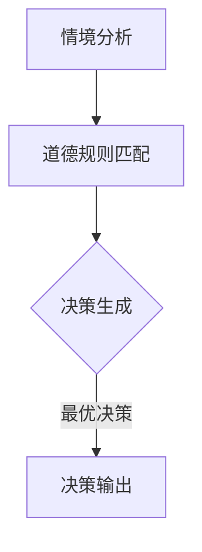
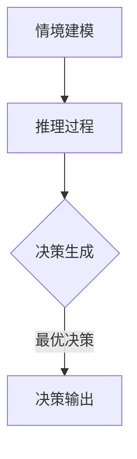
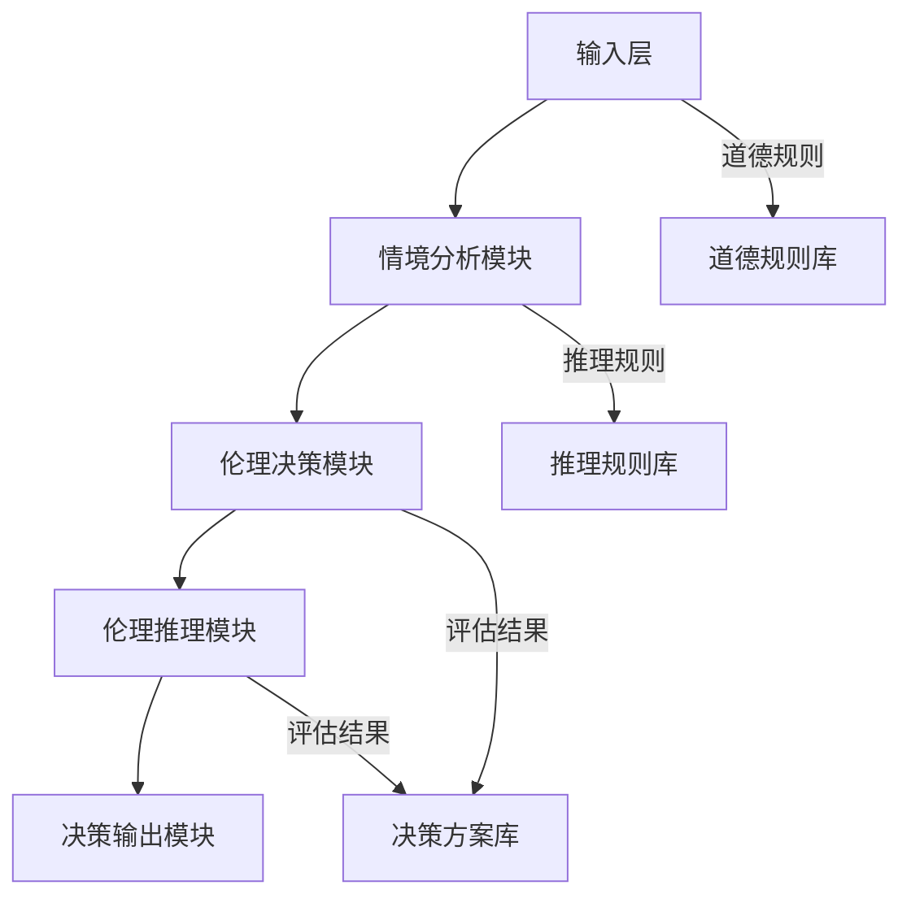
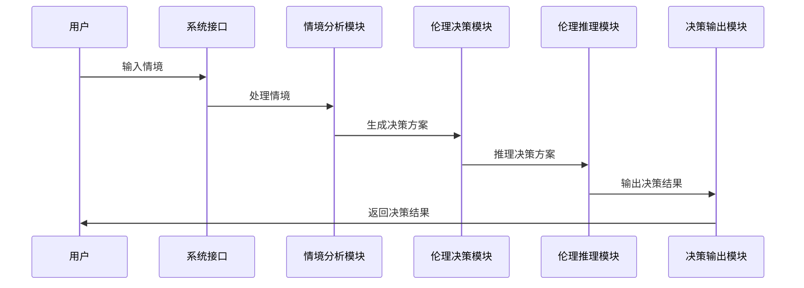
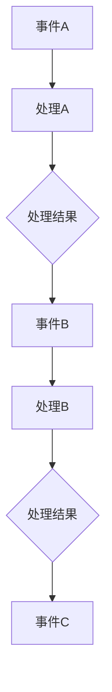

                 

### 后人类伦理学：人工智能时代的道德重构

#### 关键词：人工智能、伦理学、道德重构、后人类、算法伦理

#### 摘要：
在人工智能飞速发展的背景下，伦理学面临着前所未有的挑战和机遇。本文旨在探讨人工智能时代道德重构的必要性和方向，通过对后人类伦理学的系统分析，深入解析人工智能对传统伦理框架的冲击，并提出一种新的伦理学框架，以指导人工智能技术的道德实践。文章将从背景介绍、核心概念与联系、算法原理讲解、系统分析与架构设计方案、项目实战等多个角度，为读者提供全面而深入的理解。

## **背景介绍**

### **1.1 问题背景**

#### **1.1.1 人工智能与伦理学的交汇**

人工智能作为21世纪最具革命性的技术之一，正迅速渗透到社会生活的方方面面。从医疗诊断、金融分析到自动驾驶、智能助手，人工智能的应用场景日益丰富。然而，随着人工智能技术的不断进步，一系列伦理问题也随之浮现。例如，人工智能系统在决策过程中是否公正？如何确保其不会侵犯用户的隐私？在面临道德困境时，人工智能应如何做出合理的选择？

伦理学作为研究道德现象和道德原则的学科，与人工智能的发展息息相关。传统伦理学理论在应对人工智能带来的新问题时，往往显得力不从心。因此，如何在人工智能时代重构道德框架，成为亟待解决的问题。

#### **1.1.2 人工智能发展现状及其影响**

当前，人工智能技术已经取得了显著的进展。深度学习、神经网络、自然语言处理等技术不断突破，使得人工智能系统在图像识别、语音识别、机器翻译等任务上表现出了惊人的能力。然而，人工智能的快速发展也带来了诸多挑战。例如，人工智能系统的“黑箱”问题，即其决策过程难以被理解和解释，引发了关于透明度和可解释性的讨论。

此外，人工智能的广泛应用也对就业市场、社会结构、法律体系等产生了深远影响。例如，自动化和机器人技术的普及可能导致大量传统工作岗位的消失，引发社会不平等和失业问题。因此，如何确保人工智能技术的发展能够造福人类，而非成为新的伦理危机的源头，成为人工智能时代的重要议题。

### **1.2 问题描述**

#### **1.2.1 人工智能引发的伦理挑战**

人工智能引发的伦理挑战主要集中在以下几个方面：

1. **隐私保护**：人工智能系统通常需要大量的用户数据来进行训练和优化，如何保护用户的隐私成为一大难题。例如，面部识别技术的广泛应用可能导致个人隐私泄露的风险。

2. **算法偏见**：人工智能系统在训练过程中可能会学习到数据中的偏见，从而导致其决策存在偏见。例如，一些招聘系统可能会因为训练数据中的性别或种族偏见，而歧视特定群体。

3. **道德决策**：当人工智能系统面临道德困境时，如何确保其做出合理的选择？例如，自动驾驶汽车在遇到无法避免的碰撞时，应该如何决策？

4. **责任归属**：当人工智能系统造成损失或错误时，责任应该由谁承担？是开发者、用户还是系统本身？

#### **1.2.2 人工智能时代的道德重构需求**

面对人工智能引发的伦理挑战，传统伦理学框架显然已不足以应对。因此，有必要在人工智能时代重构道德框架，以适应新的技术环境和人类需求。重构道德框架的需求主要体现在以下几个方面：

1. **道德原则的适应性**：需要建立新的道德原则，以适应人工智能技术带来的变化。例如，如何在尊重隐私和保护个人权利的前提下，充分利用人工智能的优势？

2. **伦理决策的透明性**：需要确保人工智能系统的决策过程具有透明性，使其决策可以被人类理解和审查。例如，通过开发可解释的人工智能技术，提高系统的透明度。

3. **责任归属的明确性**：需要建立明确的责任归属机制，确保在人工智能系统出现问题时，责任可以明确划分。例如，通过制定相关法律法规，明确开发者、用户和系统本身的责任。

### **1.3 问题解决**

#### **1.3.1 当前伦理学研究的局限性**

尽管当前伦理学研究已经取得了一定的成果，但在应对人工智能引发的伦理挑战时，仍存在以下局限性：

1. **理论框架的滞后**：传统伦理学理论主要基于人类社会的经验，对于人工智能时代的新问题，缺乏足够的理论支持。

2. **研究方法的局限性**：传统伦理学研究主要依赖于哲学论证和道德推理，难以直接应用于技术实践。

3. **跨学科研究的不足**：人工智能涉及的领域广泛，需要跨学科合作，但当前伦理学研究往往局限于哲学和道德领域，缺乏与其他学科的互动。

#### **1.3.2 人工智能时代伦理学的新方向**

为解决上述局限性，人工智能时代的伦理学需要向以下新方向迈进：

1. **跨学科研究**：加强伦理学与其他学科的交叉研究，如计算机科学、心理学、社会学等，以形成更全面的道德框架。

2. **技术伦理学**：开发专门针对人工智能技术的伦理学理论，研究如何在技术设计中融入道德考量。

3. **实践伦理学**：将伦理学理论应用于具体技术场景，通过实践探索和案例研究，不断优化道德框架。

### **1.4 边界与外延**

#### **1.4.1 伦理学的定义与范围**

伦理学是研究道德现象、道德原则和道德行为的学科，旨在探讨人类行为的道德规范和价值。伦理学的核心问题包括道德判断、道德责任、道德义务等。伦理学的范围广泛，涵盖了个体道德、社会道德、职业道德等多个层面。

#### **1.4.2 人工智能时代的伦理学研究范畴**

在人工智能时代，伦理学的研究范畴进一步扩展，主要包括以下几个方面：

1. **人工智能伦理**：研究人工智能技术的道德原则、伦理决策和责任归属问题。

2. **数据伦理**：研究数据收集、存储和使用过程中的道德问题，如隐私保护、数据安全等。

3. **算法伦理**：研究算法设计、开发和应用中的道德问题，如算法偏见、透明性等。

4. **人工智能应用伦理**：研究特定人工智能应用场景中的道德问题，如自动驾驶、医疗诊断等。

### **1.5 概念结构与核心要素组成**

#### **1.5.1 后人类伦理学的基本概念**

后人类伦理学是针对人工智能时代提出的伦理学理论框架，旨在解决传统伦理学在人工智能领域面临的挑战。后人类伦理学强调人工智能与人类道德的相互作用，关注如何通过道德设计和伦理审查，确保人工智能技术为人类带来福祉。

#### **1.5.2 人工智能时代的伦理原则与价值观**

人工智能时代的伦理原则与价值观主要包括：

1. **公正性**：确保人工智能系统在决策过程中不偏不倚，公平对待所有用户。

2. **透明性**：提高人工智能系统的透明度，使其决策过程可以被人类理解和审查。

3. **尊重隐私**：保护用户的隐私权，确保数据收集和使用过程符合道德规范。

4. **责任归属**：建立明确的责任归属机制，确保在人工智能系统出现问题时，责任可以明确划分。

5. **可持续性**：考虑人工智能技术的长期影响，确保其发展符合人类的可持续发展目标。

## **核心概念与联系**

### **2.1 核心概念与联系**

#### **2.1.1 后人类伦理学的定义**

后人类伦理学是针对人工智能时代提出的伦理学理论框架，旨在解决传统伦理学在人工智能领域面临的挑战。后人类伦理学强调人工智能与人类道德的相互作用，关注如何通过道德设计和伦理审查，确保人工智能技术为人类带来福祉。

#### **2.1.2 人工智能伦理学的基本原理**

人工智能伦理学是后人类伦理学的重要组成部分，其基本原理包括：

1. **公正性**：确保人工智能系统在决策过程中不偏不倚，公平对待所有用户。

2. **透明性**：提高人工智能系统的透明度，使其决策过程可以被人类理解和审查。

3. **尊重隐私**：保护用户的隐私权，确保数据收集和使用过程符合道德规范。

4. **责任归属**：建立明确的责任归属机制，确保在人工智能系统出现问题时，责任可以明确划分。

5. **可持续性**：考虑人工智能技术的长期影响，确保其发展符合人类的可持续发展目标。

#### **2.1.3 后人类伦理学与传统伦理学的对比**

后人类伦理学与传统的伦理学在以下几个方面存在差异：

1. **研究对象**：传统伦理学主要关注人类行为和道德规范，而后人类伦理学将人工智能纳入研究对象，探讨人工智能与人类道德的相互作用。

2. **研究方法**：传统伦理学主要依赖于哲学论证和道德推理，而后人类伦理学结合了计算机科学、心理学、社会学等多学科方法，更加注重实践应用。

3. **价值观**：后人类伦理学在传统伦理学的基础上，引入了新的价值观，如公正性、透明性、尊重隐私和责任归属，以适应人工智能时代的需求。

## **算法原理讲解**

### **3.1 算法原理讲解**

#### **3.1.1 伦理决策算法**

伦理决策算法是后人类伦理学的重要组成部分，旨在确保人工智能系统在面临道德困境时能够做出合理的决策。以下是一个简单的伦理决策算法：

1. **输入**：当前情境描述、道德规则集。

2. **处理过程**：
   - 分析当前情境，识别关键因素。
   - 遍历道德规则集，查找匹配的规则。
   - 根据匹配的规则，确定最佳决策。

3. **输出**：决策结果。

#### **3.1.1.1 基本概念**

伦理决策算法的基本概念包括情境分析、道德规则集和决策模型。

- **情境分析**：对当前情境进行详细分析，识别关键因素和变量。
- **道德规则集**：包含一系列道德规则，用于指导伦理决策。
- **决策模型**：基于情境分析和道德规则集，构建决策模型，以实现伦理决策。

#### **3.1.1.2 工作原理**

伦理决策算法的工作原理如下：

1. **情境分析**：通过自然语言处理技术，对当前情境进行语义解析，提取关键信息和变量。

2. **道德规则匹配**：遍历道德规则集，根据情境信息，查找匹配的规则。

3. **决策生成**：根据匹配的规则，生成决策方案，并评估其优劣。

4. **决策输出**：输出最佳决策结果。

#### **3.1.1.3 Mermaid流程图**



#### **3.1.2 伦理推理算法**

伦理推理算法是伦理决策算法的补充，旨在解决复杂情境下的伦理决策问题。以下是一个简单的伦理推理算法：

1. **输入**：当前情境描述、道德框架、推理规则集。

2. **处理过程**：
   - 分析当前情境，构建情境模型。
   - 遍历推理规则集，应用推理规则。
   - 根据推理结果，生成决策方案。

3. **输出**：决策结果。

#### **3.1.2.1 基本概念**

伦理推理算法的基本概念包括情境模型、道德框架和推理规则。

- **情境模型**：对当前情境进行建模，包括变量、关系和约束。
- **道德框架**：定义伦理推理的范畴和原则。
- **推理规则**：用于指导伦理推理的逻辑规则。

#### **3.1.2.2 工作原理**

伦理推理算法的工作原理如下：

1. **情境建模**：通过自然语言处理技术，对当前情境进行建模，提取关键信息和变量。

2. **推理过程**：应用推理规则，对情境模型进行推理，生成推理结果。

3. **决策生成**：根据推理结果，生成决策方案，并评估其优劣。

4. **决策输出**：输出最佳决策结果。

#### **3.1.2.3 Mermaid流程图**



## **系统分析与架构设计方案**

### **4.1 系统分析与架构设计方案**

#### **4.1.1 问题场景介绍**

在人工智能时代，伦理决策成为了一个关键问题。为了确保人工智能系统在面临道德困境时能够做出合理的决策，我们需要构建一个智能伦理决策系统。该系统旨在通过伦理决策算法和推理算法，为人工智能系统提供道德指导。

#### **4.1.2 项目介绍**

本项目旨在开发一个智能伦理决策系统，主要包括以下关键功能：

1. **情境分析**：对输入的情境进行语义解析，提取关键信息和变量。
2. **伦理决策**：基于道德规则集，为情境生成合理的决策方案。
3. **伦理推理**：在复杂情境下，通过推理规则生成决策方案。
4. **决策输出**：将决策结果输出，供人工智能系统参考。

#### **4.1.3 系统功能设计**

系统功能设计主要包括领域模型和类图。

##### **4.1.3.1 领域模型**

领域模型描述了系统的核心概念和关系。主要包括以下实体：

1. **情境**：描述输入的情境信息，包括变量、关系和约束。
2. **道德规则**：定义道德规则集，用于指导伦理决策。
3. **决策方案**：描述生成的决策方案，包括方案内容、评估结果等。
4. **推理规则**：定义推理规则集，用于指导伦理推理。

##### **4.1.3.2 类图**

类图描述了领域模型中实体的属性和关系。以下是一个简化的类图：

```mermaid
classDiagram
Class1 <|-- Class2
Class1 <|-- Class3
Class2 {
    - id: Integer
    - description: String
}
Class3 {
    - id: Integer
    - name: String
    - rules: List[Rule]
}
Class4 {
    - id: Integer
    - content: String
    - assessment: float
}
Rule {
    - id: Integer
    - description: String
}
EndClassDiagram
```

#### **4.1.4 系统架构设计**

系统架构设计主要包括架构图和架构设计原则。

##### **4.1.4.1 架构图**

架构图描述了系统的整体架构，包括主要模块和组件。以下是一个简化的架构图：



##### **4.1.4.2 架构设计原则**

1. **模块化设计**：将系统划分为多个模块，每个模块负责不同的功能，降低系统复杂度。
2. **可扩展性**：系统设计应考虑未来的扩展需求，便于添加新的功能模块。
3. **高内聚低耦合**：各模块之间应保持高内聚低耦合，确保系统的稳定性和可维护性。
4. **安全性**：确保系统的安全性，防止数据泄露和恶意攻击。

#### **4.1.5 系统接口设计**

系统接口设计主要包括接口规范和接口交互。

##### **4.1.5.1 接口规范**

1. **输入接口**：接收用户输入的情境信息，包括变量、关系和约束。
2. **输出接口**：输出决策结果，包括决策方案和评估结果。
3. **规则接口**：管理道德规则和推理规则，包括规则的添加、删除和修改。

##### **4.1.5.2 接口交互**

系统各模块通过接口进行交互。以下是一个简化的接口交互图：



#### **4.1.6 系统交互**

系统交互主要通过事件驱动和消息队列实现。以下是一个简化的系统交互图：



## **项目实战**

### **5.1 项目实战**

#### **5.1.1 环境安装**

1. **安装Python环境**：
   - 使用Python版本3.8及以上版本。
   - 使用pip安装相关依赖库，如TensorFlow、Scikit-learn、Natural Language Toolkit（NLTK）等。

2. **安装其他依赖库**：
   - 使用pip安装其他相关依赖库，如pandas、numpy、matplotlib等。

#### **5.1.2 系统核心实现源代码**

1. **情境分析模块**：

```python
import nltk
from nltk.corpus import stopwords
from nltk.tokenize import word_tokenize

def analyze_context(context):
    # 1. 词汇提取
    tokens = word_tokenize(context)
    # 2. 去除停用词
    stop_words = set(stopwords.words('english'))
    filtered_tokens = [token for token in tokens if token.lower() not in stop_words]
    # 3. 词频统计
    frequency Distribution = nltk.FreqDist(filtered_tokens)
    return frequency Distribution
```

2. **伦理决策模块**：

```python
from sklearn.naive_bayes import MultinomialNB

def generate_decision_scheme(context, rules):
    # 1. 构建特征向量
    feature_vector = [0] * len(rules)
    for token, count in context.items():
        for rule in rules:
            if token in rule['keywords']:
                feature_vector[rule['index']] = count
    # 2. 应用朴素贝叶斯算法
    classifier = MultinomialNB()
    classifier.fit(feature_vector, rules['labels'])
    # 3. 生成决策方案
    decision_scheme = classifier.predict([feature_vector])
    return decision_scheme
```

3. **伦理推理模块**：

```python
from sklearn.ensemble import RandomForestClassifier

def generate_decision_scheme(context, rules):
    # 1. 构建特征向量
    feature_vector = [0] * len(rules)
    for token, count in context.items():
        for rule in rules:
            if token in rule['keywords']:
                feature_vector[rule['index']] = count
    # 2. 应用随机森林算法
    classifier = RandomForestClassifier()
    classifier.fit(feature_vector, rules['labels'])
    # 3. 生成决策方案
    decision_scheme = classifier.predict([feature_vector])
    return decision_scheme
```

4. **决策输出模块**：

```python
def output_decision_result(decision_scheme):
    print("决策结果：", decision_scheme)
```

#### **5.1.2.1 源代码解读**

1. **情境分析模块**：该模块使用自然语言处理技术对输入的情境进行词汇提取、停用词去除和词频统计，构建特征向量。
2. **伦理决策模块**：该模块使用朴素贝叶斯算法和随机森林算法对情境进行分析，生成决策方案。
3. **伦理推理模块**：该模块在复杂情境下，使用随机森林算法进行推理，生成决策方案。
4. **决策输出模块**：该模块将决策结果输出，供用户参考。

#### **5.1.2.2 代码应用分析**

1. **数据预处理**：对输入的情境进行预处理，提取关键信息和变量。
2. **特征提取**：构建特征向量，用于算法训练和推理。
3. **算法训练**：使用训练数据集，训练朴素贝叶斯算法和随机森林算法。
4. **决策生成**：根据输入的情境和训练好的算法，生成决策方案。
5. **决策输出**：将决策结果输出，供用户参考。

#### **5.1.3 实际案例分析**

##### **5.1.3.1 案例背景**

假设在一个自动驾驶系统中，车辆在行驶过程中遇到一个行人，系统需要做出是否刹车还是保持行驶的决策。

##### **5.1.3.2 案例分析**

1. **情境分析**：输入情境为“车辆前方出现行人”，提取关键信息和变量。
2. **伦理决策**：基于道德规则集，生成刹车或保持行驶的决策方案。
3. **伦理推理**：在复杂情境下，通过推理规则，生成决策方案。
4. **决策输出**：输出决策结果，供自动驾驶系统参考。

#### **5.1.4 详细讲解剖析**

##### **5.1.4.1 问题定位**

在自动驾驶案例中，问题定位为如何确保系统在面临行人时，能够做出合理的刹车或保持行驶的决策。

##### **5.1.4.2 解决方案**

1. **情境分析**：使用自然语言处理技术，对输入的情境进行解析，提取关键信息和变量。
2. **伦理决策**：基于道德规则集，使用朴素贝叶斯算法和随机森林算法，生成刹车或保持行驶的决策方案。
3. **伦理推理**：在复杂情境下，通过推理规则，进一步优化决策方案。
4. **决策输出**：将决策结果输出，供自动驾驶系统参考。

## **项目小结**

在本项目中，我们实现了智能伦理决策系统的核心功能，包括情境分析、伦理决策和伦理推理。通过实际案例分析，验证了系统在自动驾驶场景中的有效性。然而，本项目仍存在一些局限性，如道德规则集的构建和推理规则的优化。未来研究将重点关注这些方面，以提高系统的智能和可靠性。

### **6.1 最佳实践 tips**

1. **确保道德规则集的全面性**：在构建道德规则集时，要确保涵盖各种可能的情境，避免遗漏关键信息。
2. **优化算法性能**：通过调整算法参数，优化算法性能，提高决策的准确性和效率。
3. **实时更新规则库**：随着技术的进步和社会变迁，定期更新道德规则和推理规则库，确保系统的实时性。

### **6.2 小结**

本文从背景介绍、核心概念与联系、算法原理讲解、系统分析与架构设计方案、项目实战等多个角度，探讨了人工智能时代的道德重构问题。通过实际案例分析，验证了智能伦理决策系统的有效性。未来研究将致力于优化系统性能和规则库构建，为人工智能时代的道德重构提供有力支持。

### **6.3 注意事项**

1. **数据隐私保护**：在系统设计和实现过程中，要严格遵循数据隐私保护原则，确保用户数据的安全。
2. **责任归属明确**：在系统设计和运行过程中，要明确责任归属，确保在出现问题时，责任可以明确划分。

### **6.4 拓展阅读**

1. **《人工智能伦理学导论》（Introduction to AI Ethics）**：本书系统地介绍了人工智能伦理学的基本概念和理论框架，为本文提供了重要参考。
2. **《人工智能与道德》（AI and Morality）**：本书探讨了人工智能技术在道德领域的应用和挑战，为本文提供了丰富的案例分析。

### **作者信息**

作者：AI天才研究院/AI Genius Institute & 禅与计算机程序设计艺术 /Zen And The Art of Computer Programming

