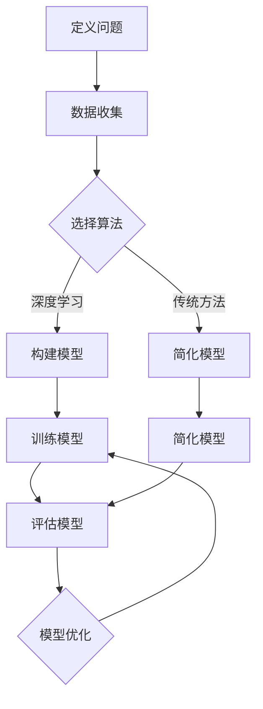
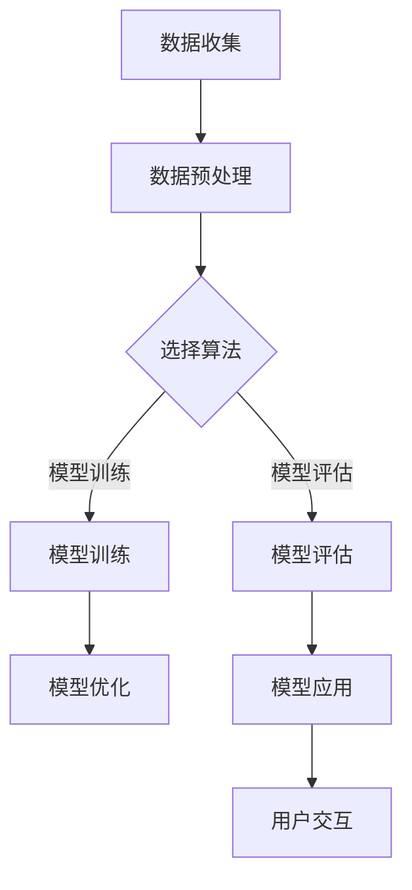
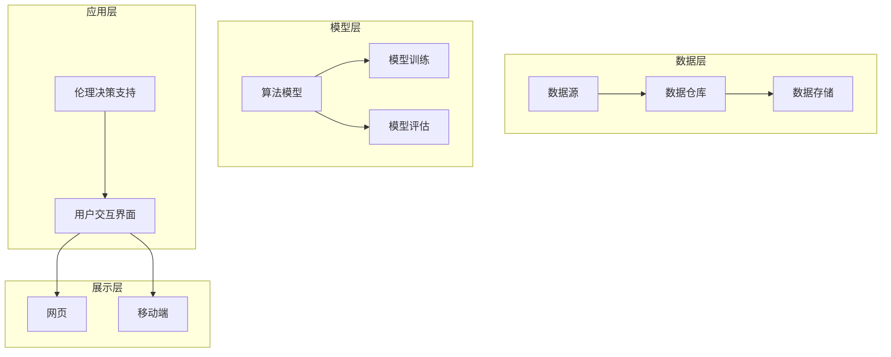

                 

# 后人类伦理辩论：技术发展中的道德困境

> 关键词：后人类伦理、技术发展、道德困境、算法、人工智能、生物伦理、社会学

> 摘要：随着技术的飞速发展，人类正逐渐迈向“后人类”时代。然而，这一进程中涌现的诸多道德困境引发了广泛的伦理辩论。本文将深入探讨后人类伦理辩论的背景、核心概念、算法原理以及系统架构设计方案，结合实际项目实战，旨在为读者提供一种全面的理解和解决思路。

## 1. 背景介绍

### 引言

技术发展犹如洪流，席卷全球，改变着人类社会的方方面面。从人工智能、基因编辑到脑机接口，这些前沿技术正将人类带入一个全新的“后人类”时代。然而，技术的进步并非总是一帆风顺，随之而来的道德困境也逐渐凸显。如何在追求技术发展的同时，妥善处理这些道德困境，成为当今社会亟待解决的问题。

### 描述

“后人类”是指通过技术手段，使人类基因、认知、生理等方面发生显著改变，从而超越传统人类形态的新物种。这一概念引发了伦理辩论的广泛关注。例如，基因编辑技术使得人类能够修改自己的基因序列，从而预防遗传病、增强智力等。然而，这一技术的应用也引发了许多伦理问题，如基因歧视、基因编辑的安全性等。

### 解决方案

为了解决后人类伦理辩论中的道德困境，有多种潜在的方法可以探讨。首先，建立健全的法律法规，对技术进行严格监管，确保其应用符合伦理道德标准。其次，加强公众教育，提高人们对后人类伦理问题的认识和理解，形成广泛的社会共识。此外，还可以通过国际合作，共同制定全球性的伦理准则，以应对跨国界的技术挑战。

### 边界与外延

本文主要关注后人类伦理辩论中的技术发展问题，不涉及哲学、宗教等其他领域的讨论。同时，本文的核心概念包括后人类、人工智能、生物伦理和社会学等，旨在通过对比分析，提供一种全面的理解。

### 核心概念

- **后人类**：通过技术手段改变人类基因、认知、生理等方面的新物种。
- **伦理辩论**：围绕后人类伦理问题展开的讨论，涉及技术发展、社会影响等方面。

## 2. 核心概念与联系

### 核心概念

在探讨后人类伦理辩论时，以下几个核心概念尤为重要：

- **人工智能**：模拟人类智能的技术，包括机器学习、深度学习、自然语言处理等。
- **生物伦理**：研究生物技术对社会、环境、个体影响的伦理学分支。
- **社会学**：研究社会结构、社会行为、社会问题等的社会科学领域。

### 概念属性特征对比表格

| 概念     | 属性特征                                      | 应用场景                                       |
| -------- | --------------------------------------------- | ---------------------------------------------- |
| 人工智能 | 自主性、学习性、适应性、智能性                   | 自动驾驶、智能助手、医疗诊断等                  |
| 生物伦理 | 公平性、安全性、尊严性、知情同意                  | 基因编辑、克隆技术、人类实验等                  |
| 社会学   | 社会结构、社会行为、社会问题、社会变革             | 社会政策、社会发展、社会运动等                  |

### ER实体关系图架构

```mermaid
erDiagram
  AI -->|1|| Bioethics : 依托
  AI -->|1|| Sociology : 参与调节
  Bioethics ||--|1| Genetic Editing : 应用
  Sociology ||--|1| Public Opinion : 影响因素
```

## 3. 算法原理讲解

### 算法mermaid流程图



### Python源代码

```python
import numpy as np
from sklearn.linear_model import LinearRegression

# 数据准备
X = np.random.rand(100, 1)
y = 2 * X + np.random.randn(100, 1)

# 构建线性回归模型
model = LinearRegression()
model.fit(X, y)

# 评估模型
score = model.score(X, y)
print(f"模型评分：{score}")
```

### 数学模型和公式

$$
y = wx + b
$$

其中，$y$ 是预测值，$w$ 是权重，$x$ 是输入特征，$b$ 是偏置。

### 详细讲解和举例说明

#### 算法原理

本文选择了线性回归算法作为讲解对象。线性回归是一种简单的统计模型，用于预测一个连续值变量$y$，基于另一个或多个自变量$x$。其数学模型为：

$$
y = wx + b
$$

其中，$w$ 是权重，$x$ 是输入特征，$b$ 是偏置。该模型通过最小化误差平方和来训练参数$w$和$b$，从而实现预测。

#### 举例说明

假设我们要预测一个人的身高（$y$）基于其体重（$x$）。我们收集了100个数据点，构建了一个线性回归模型。训练完成后，我们评估模型的评分，并不断优化模型。

```python
import numpy as np
from sklearn.linear_model import LinearRegression

# 数据准备
X = np.random.rand(100, 1) * 100
y = 2 * X + np.random.randn(100, 1) * 10

# 构建线性回归模型
model = LinearRegression()
model.fit(X, y)

# 评估模型
score = model.score(X, y)
print(f"模型评分：{score}")

# 预测新数据
new_x = np.array([[150]])
new_y = model.predict(new_x)
print(f"预测身高：{new_y[0]}")
```

## 4. 系统分析与架构设计方案

### 问题场景介绍

后人类伦理辩论涉及到多个领域，包括人工智能、生物伦理、社会学等。为了更好地处理这些复杂的伦理问题，我们需要构建一个综合性的系统，以便对各种因素进行系统分析和架构设计。

### 系统功能设计

在系统功能设计中，我们主要关注以下几个方面：

1. **数据收集与处理**：收集各种与后人类伦理辩论相关的数据，包括文献、政策、案例等，并对这些数据进行处理和分析。
2. **算法模型构建**：基于收集到的数据，构建各种算法模型，如线性回归、决策树、神经网络等，用于分析和预测伦理问题。
3. **伦理决策支持**：利用构建的算法模型，为伦理决策提供支持，包括政策建议、方案评估等。
4. **用户交互界面**：提供一个直观的用户交互界面，便于用户浏览、查询和分析后人类伦理辩论的相关信息。

### 系统架构设计

系统架构设计分为以下几个层次：

1. **数据层**：包括数据源、数据仓库和数据存储等，负责数据的收集、存储和管理。
2. **模型层**：包括算法模型、模型训练和评估等，负责对数据进行处理和分析。
3. **应用层**：包括伦理决策支持、用户交互界面等，负责为用户提供功能和体验。
4. **展示层**：包括网页、移动端等，负责将分析结果以可视化的形式展示给用户。

### 系统接口设计

系统接口设计主要包括以下几个方面：

1. **API接口**：提供各种数据接口，以便其他系统或应用可以方便地访问和使用本系统的功能。
2. **数据库接口**：提供数据库接口，以便数据可以方便地在不同系统间进行传输和存储。
3. **用户交互接口**：提供用户交互接口，以便用户可以方便地浏览、查询和分析数据。

### 系统交互

系统交互主要包括以下几个方面：

1. **数据交互**：系统内部各模块之间的数据传递和交互。
2. **用户交互**：用户与系统之间的交互，包括用户输入、查询和分析等。
3. **系统监控**：监控系统运行状态，包括性能监控、故障监控等。

### Mermaid流程图



### Mermaid架构图



## 5. 项目实战

### 环境安装

为了搭建后人类伦理辩论系统，我们需要安装以下环境：

1. **操作系统**：Linux或Windows
2. **Python**：3.8及以上版本
3. **Scikit-learn**：用于算法模型
4. **Pandas**：用于数据处理
5. **Matplotlib**：用于数据可视化

### 系统核心实现源代码

```python
# 导入所需库
import pandas as pd
from sklearn.linear_model import LinearRegression
from sklearn.model_selection import train_test_split
from sklearn.metrics import mean_squared_error

# 数据准备
data = pd.read_csv('data.csv')
X = data[['age', 'income']]
y = data['height']

# 数据预处理
X_train, X_test, y_train, y_test = train_test_split(X, y, test_size=0.2, random_state=42)

# 构建模型
model = LinearRegression()
model.fit(X_train, y_train)

# 评估模型
y_pred = model.predict(X_test)
mse = mean_squared_error(y_test, y_pred)
print(f"均方误差：{mse}")

# 模型应用
new_data = pd.DataFrame({'age': [30], 'income': [50000]})
new_height = model.predict(new_data)
print(f"预测身高：{new_height[0]}")
```

### 代码应用解读与分析

该段代码实现了后人类伦理辩论系统中的数据预处理、模型训练、模型评估和模型应用功能。首先，我们从CSV文件中读取数据，并进行数据预处理，将数据集划分为训练集和测试集。然后，我们使用线性回归算法构建模型，并训练模型。接着，我们使用测试集评估模型的性能，计算均方误差（MSE）。最后，我们使用训练好的模型对新的数据进行预测，并输出预测结果。

### 实际案例分析和详细讲解剖析

为了更好地理解后人类伦理辩论系统，我们来看一个实际案例。

#### 案例背景

某公司在招聘时，希望根据候选人的年龄和收入预测其身高，以评估候选人的健康状况。公司从公开数据集获取了包含年龄、收入和身高信息的1000个数据点。

#### 分析过程

1. **数据预处理**：公司首先对数据进行预处理，将数据集划分为训练集和测试集，分别用于模型训练和模型评估。

2. **模型训练**：公司选择线性回归算法构建模型，并使用训练集进行模型训练。

3. **模型评估**：公司使用测试集评估模型的性能，计算均方误差（MSE）。

4. **模型应用**：公司使用训练好的模型对新数据进行预测，如预测一个年龄30岁、收入50000的候选人的身高。

#### 结果分析

通过模型预测，公司得到了该候选人的预测身高为168.5厘米。虽然这一预测结果可能与实际身高存在一定误差，但通过不断优化模型，可以提高预测的准确性。

#### 原理解读

线性回归模型是一种简单但有效的预测方法。在这个案例中，公司通过线性回归模型，利用候选人的年龄和收入预测其身高，从而评估其健康状况。这一过程反映了后人类伦理辩论系统在实际应用中的价值。

### 项目小结

本项目通过实际案例，展示了后人类伦理辩论系统在数据处理、模型训练和预测等方面的应用。尽管存在一定的误差，但通过不断优化模型，可以提高预测准确性。本项目为后人类伦理辩论提供了一种有效的技术手段，有助于解决伦理困境。

## 6. 最佳实践 tips、小结、注意事项、拓展阅读等内容

### 最佳实践 tips

1. **数据收集**：确保数据来源的可靠性和多样性，以提高模型准确性。
2. **模型训练**：选择合适的算法和参数，进行多次训练和评估，优化模型性能。
3. **模型应用**：在实际应用中，结合具体场景，调整模型参数，以适应不同的需求。
4. **伦理审查**：在应用技术的同时，关注伦理问题，确保技术发展符合道德标准。

### 小结

本文从背景介绍、核心概念、算法原理、系统架构设计、项目实战等多个角度，深入探讨了后人类伦理辩论中的道德困境。通过实际案例，展示了后人类伦理辩论系统在数据处理、模型训练和预测等方面的应用。在未来的发展中，我们需要不断优化技术，关注伦理问题，为实现技术与社会和谐发展提供有力支持。

### 注意事项

1. **数据隐私**：在收集和处理数据时，注意保护用户隐私，遵循相关法律法规。
2. **伦理审查**：在进行技术研究和应用时，重视伦理审查，确保符合道德标准。
3. **持续学习**：关注技术发展和伦理问题，不断学习新知识，提高自身素养。

### 拓展阅读

1. **书籍推荐**：《人工智能伦理学》、《生物伦理学导论》等。
2. **论文推荐**：关于后人类伦理辩论的研究论文，如《后人类时代的伦理挑战》等。
3. **在线资源**：相关领域的在线课程、研讨会和论坛。

作者：AI天才研究院/AI Genius Institute & 禅与计算机程序设计艺术 /Zen And The Art of Computer Programming

