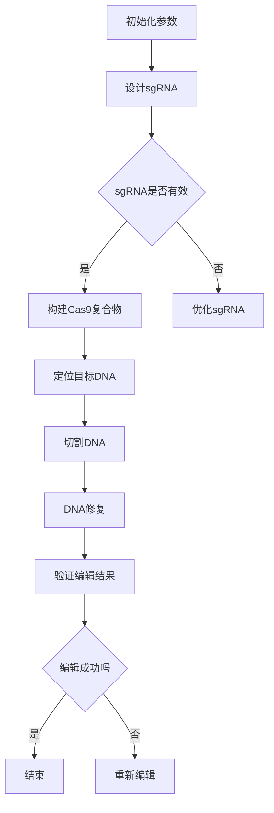
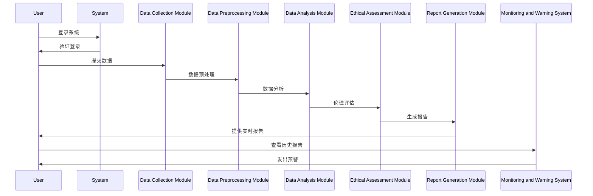
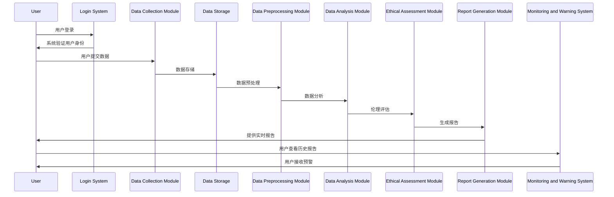

                 


## 《后人类时代的价值重估：增强人类与自然人的伦理思考》目录大纲

### 1. 背景介绍

#### 1.1 问题的背景

**后人类时代**：随着科技的发展，人工智能和生物工程技术的融合，人类正在迈向一个全新的时代，一个不再受限于传统生物学限制的时代。**增强人类**，即通过科技手段提升人类的能力，正在成为现实。

**伦理冲突**：增强人类技术的出现，不仅改变了人类的身体和能力，也带来了深远的伦理问题。这些技术如何影响我们的价值观？如何确保技术的公平性和安全性？如何对待那些不愿意接受这些技术的人？

#### 1.2 问题描述

**增强人类技术对自然人的影响**：增强人类技术可能会改变人类的身体和认知能力，从而影响人类社会结构和人际关系。

**道德和伦理问题的复杂性**：伦理问题往往涉及多个层面，包括个人选择、社会影响、文化传统等。如何平衡这些因素，是一个巨大的挑战。

#### 1.3 问题解决

**探讨后人类时代价值重估的可能路径**：我们需要重新审视和定义人类的价值，以及这些价值如何与技术相结合。

**提出伦理思考的框架和方法**：通过伦理理论和方法，我们可以更好地理解和解决这些伦理问题。

#### 1.4 边界与外延

**增强人类的定义与范畴**：增强人类技术涵盖了从基因编辑到神经接口的各种技术，其范围广泛，影响深远。

**自然人的定义与范畴**：自然人指的是没有接受任何增强技术的人类，他们代表了传统的生物学人类。

#### 1.5 核心概念

**增强人类的伦理问题**：如何评估和规范增强人类技术？如何平衡个人自由和社会责任？

**自然人与增强人类的关系**：自然人和增强人类之间的关系复杂，如何处理这种关系也是一个重要的伦理问题。

#### 1.6 概念结构

**增强人类与自然人的相互作用**：增强人类技术如何影响自然人的生活和价值观？

**伦理原则和价值观念的冲突与融合**：不同的伦理原则和价值观念如何在后人类时代相互影响和融合？

#### 1.7 核心要素组成

**增强人类技术的道德评价**：如何评估增强人类技术的道德价值？

**伦理决策与价值选择的困境**：在面对复杂的伦理问题时，如何做出明智的决策？

### 2. 核心概念与联系

#### 2.1 增强人类的定义

**科学定义**：增强人类技术是通过科技手段提升人类身体和认知能力的技术。

**社会文化影响**：增强人类技术不仅仅是一个科学问题，也是一个社会问题，它对社会文化产生了深远的影响。

#### 2.2 自然人的概念

**生物本质**：自然人是指没有接受任何增强技术的人类，他们代表了传统的生物学人类。

**社会角色**：自然人在社会中扮演着各种角色，他们的价值观和行为影响着整个社会的结构和动态。

#### 2.3 伦理思考的框架

**伦理理论**：伦理思考的框架包括了各种伦理理论，如功利主义、康德伦理学、德行伦理学等。

**伦理决策过程**：伦理决策过程包括识别问题、分析问题、提出解决方案、评估解决方案等步骤。

#### 2.4 价值观念的对比

**传统价值观**：传统价值观强调人类的自然属性和社会属性，如家庭、道德、宗教等。

**后人类时代的价值观**：后人类时代的价值观可能会更加多元和复杂，它可能会强调科技、个性、自由等。

#### 2.5 概念间的联系

**增强人类与自然人的相互影响**：增强人类技术如何影响自然人？自然人如何回应增强人类技术？

**伦理思考与价值观念的互动**：伦理思考如何影响价值观念？价值观念如何影响伦理思考？

#### 2.6 ER实体关系图架构

**实体关系图**：使用Mermaid绘制增强人类和自然人的实体关系图。

**实体定义与属性**：明确增强人类和自然人的实体定义和属性，如身份、能力、价值观等。

### 3. 算法原理讲解

#### 3.1 增强人类技术的算法原理

**人工智能算法的基本概念**：了解人工智能算法的基本概念，如神经网络、机器学习、深度学习等。

**增强人类技术中的关键算法**：了解增强人类技术中使用的关键算法，如基因编辑算法、神经接口算法等。

#### 3.2 数学模型和公式

**增强人类技术的数学模型**：理解增强人类技术中的数学模型，如基因编辑的数学模型、神经接口的数学模型等。

**公式解析与应用**：解析这些数学模型中的公式，并说明它们在实际应用中的作用。

#### 3.3 算法流程图

**使用Mermaid绘制算法流程图**：使用Mermaid绘制增强人类技术的算法流程图，以便更好地理解算法的实现过程。

#### 3.4 通俗易懂的举例说明

**实际案例中的应用**：通过实际案例来说明增强人类技术的应用。

**算法如何解决实际问题**：解释算法是如何解决实际问题的。

### 4. 数学模型和数学公式 & 详细讲解 & 举例说明

#### 4.1 基本数学模型

**公式**：给出基本的数学公式。

**解释**：解释这些公式的基本含义和应用。

#### 4.2 复杂数学模型的推导

**过程**：推导复杂的数学模型。

**公式**：给出推导出的复杂数学模型。

#### 4.3 实际应用举例

**问题背景**：给出问题背景。

**解题过程**：解释如何使用数学模型解决问题。

**结果分析**：分析问题的解决结果。

### 5. 系统分析与架构设计方案

#### 5.1 问题场景介绍

**后人类时代的伦理问题**：介绍后人类时代可能出现的伦理问题。

**社会应用场景**：介绍后人类技术在现实社会中的应用场景。

#### 5.2 项目介绍

**项目背景**：介绍项目的背景。

**项目目标**：介绍项目的目标。

#### 5.3 系统功能设计

**领域模型**：使用Mermaid绘制领域模型。

**功能模块**：介绍系统的功能模块。

#### 5.4 系统架构设计

**架构图**：使用Mermaid绘制系统架构图。

**架构说明**：解释系统架构的设计原则和优点。

#### 5.5 系统接口设计

**接口定义**：定义系统的接口。

**接口流程**：解释系统的接口流程。

#### 5.6 系统交互

**序列图**：使用Mermaid绘制系统交互序列图。

**交互流程**：解释系统的交互流程。

### 6. 项目实战

#### 6.1 环境安装

**软件和硬件要求**：列出项目所需的软件和硬件。

**安装步骤**：详细描述安装步骤。

#### 6.2 系统核心实现源代码

**源代码**：提供系统核心实现的源代码。

**注释说明**：解释源代码的功能和实现。

#### 6.3 代码应用解读与分析

**代码功能分析**：分析代码的功能。

**算法应用**：解释算法的应用。

#### 6.4 实际案例分析和详细讲解剖析

**案例背景**：给出案例背景。

**案例分析**：分析案例。

**剖析过程**：详细剖析案例。

#### 6.5 项目小结

**经验总结**：总结项目的经验。

**改进方向**：指出项目的改进方向。

### 7. 最佳实践 tips、小结、注意事项、拓展阅读等内容

#### 7.1 最佳实践 tips

**实践经验总结**：总结实践经验。

**应用技巧**：提供应用技巧。

#### 7.2 小结

**主要内容回顾**：回顾文章的主要内容。

**关键知识点总结**：总结文章的关键知识点。

#### 7.3 注意事项

**可能遇到的问题及解决方案**：列举可能遇到的问题及解决方案。

**避免错误的方法**：提供避免错误的方法。

#### 7.4 拓展阅读

**相关书籍推荐**：推荐相关的书籍。

**学术论文推荐**：推荐相关的学术论文。

## 目录大纲总结

## 《后人类时代的价值重估：增强人类与自然人的伦理思考》目录大纲

### 第一部分：背景介绍

- 第1章：导言

### 第二部分：核心概念与联系

- 第2章：核心概念与联系

### 第三部分：算法原理讲解

- 第3章：算法原理讲解

### 第四部分：数学模型和数学公式 & 详细讲解 & 举例说明

- 第4章：数学模型和数学公式 & 详细讲解 & 举例说明

### 第五部分：系统分析与架构设计方案

- 第5章：系统分析与架构设计方案

### 第六部分：项目实战

- 第6章：项目实战

### 第七部分：最佳实践与总结

- 第7章：最佳实践 tips、小结、注意事项、拓展阅读等内容

## 结语

本文旨在探讨后人类时代的价值重估，以及增强人类与自然人之间的伦理思考。通过逻辑清晰、结构紧凑、简单易懂的专业的技术语言，本文提供了一系列的思考和分析，旨在为读者提供一个全面的视角来理解这一复杂而重要的议题。随着科技的不断进步，我们面临的伦理问题将变得更加复杂和多样。因此，深入思考和探讨这些议题，对于我们的未来至关重要。

### 引入

在人类的漫长历史中，我们不断地通过技术革新来扩展我们的能力和边界。从农业革命到工业革命，再到信息革命，每一次技术的飞跃都深刻地改变了我们的生活方式和社会结构。然而，随着人工智能和生物工程技术的迅猛发展，我们正站在一个新的历史转折点上——后人类时代。在这个时代，**增强人类**的概念成为了可能，它不仅挑战了传统的生物学限制，也引发了一系列深刻的伦理和社会问题。

**后人类时代**指的是人类通过科技进步，特别是在人工智能和生物工程领域的突破，使自身的能力得到了显著提升的时代。这些提升可能包括但不限于：

1. **生物增强**：通过基因编辑、干细胞技术等手段，改善人类的生理和健康状态。
2. **认知增强**：通过神经接口、脑机接口等手段，增强人类的认知能力和决策速度。
3. **情感增强**：通过生物反馈、虚拟现实等技术，改善人类情感体验和生活质量。

这些技术的出现，无疑将带来巨大的社会变革。然而，随之而来的伦理问题也变得愈发复杂。例如：

- **公平性**：增强技术是否会导致社会分层，使得只有少数人能够享受到这些技术带来的好处？
- **安全性**：增强技术的长期影响和潜在风险如何评估和管理？
- **个人自由**：个人是否有权选择是否接受增强技术？这种选择是否会侵犯他人的权利？

为了更好地理解这些挑战，本文将分为以下几个部分：

1. **背景介绍**：介绍后人类时代的背景，以及增强人类与自然人之间的伦理冲突。
2. **核心概念与联系**：阐述增强人类和自然人的定义，以及伦理思考的框架和方法。
3. **算法原理讲解**：讲解增强人类技术中的关键算法原理。
4. **数学模型和公式**：详细解释增强人类技术中的数学模型和公式。
5. **系统分析与架构设计方案**：介绍后人类时代伦理问题的系统分析和架构设计。
6. **项目实战**：通过一个实际项目展示如何应用增强人类技术。
7. **最佳实践与总结**：总结最佳实践，提出注意事项，并推荐进一步阅读的资料。

通过这一系列的探讨，本文希望能够为读者提供关于后人类时代的价值重估和伦理思考的深入见解。

### 1.1 问题的背景

随着人工智能（AI）和生物工程技术的飞速发展，人类社会正迈向一个全新的时代——**后人类时代**。这个时代的特点是，人类通过科技手段不仅能够极大地改善自己的生理和认知能力，甚至能够改变自身的生物学特性。增强人类（Augmented Human）的概念因此应运而生，成为这个时代的一个重要特征。

**增强人类**，是指通过科技手段，如基因编辑、神经接口、生物反馈等，对人类的身体和大脑进行增强，从而提升其生理功能、认知能力或情感体验。这种增强不仅限于健康和疾病的治愈，还涉及到性能的提升和极限的突破。例如，基因编辑技术可以用来治疗遗传性疾病，甚至优化人类的智力、体能或寿命。神经接口技术可以使人脑与计算机直接连接，从而大幅提升认知能力和信息处理速度。

**后人类时代**带来的技术进步，为人类带来了前所未有的机遇。以下是一些主要的技术进步及其对人类生活的潜在影响：

1. **基因编辑技术**：CRISPR-Cas9等基因编辑技术的出现，使得人类能够精确地修改自己的基因序列。这一技术不仅能够治疗遗传性疾病，还可以用来增强人类的生理特性。例如，增强肌肉力量、提升视力、预防老年痴呆等。然而，基因编辑也引发了一系列伦理问题，包括基因编辑的公平性、安全性以及基因隐私等。

2. **神经接口技术**：脑机接口（BMI）技术使得人脑与外部设备可以直接通信。这种技术不仅可以用于康复，如帮助瘫痪患者恢复行动能力，还可以用于提升认知能力，如实时翻译、增强记忆等。然而，这种技术也引发了对隐私、安全性和伦理的担忧，例如，人脑与计算机的融合是否会导致人类失去自我意识？

3. **生物反馈技术**：通过生物反馈设备，人们可以实时监控和调节自己的生理状态，如心率、血压、脑波等。这种技术可以用来改善健康状况、增强运动表现甚至提升情绪状态。然而，生物反馈设备的使用也引发了关于人体自主性和个人自由的伦理争议。

4. **人工智能与生物工程技术的融合**：人工智能（AI）与生物工程技术的融合，如智能药物设计、个性化医疗等，将极大地改变医疗保健领域。这些技术可以使得疾病的治疗更加精准和高效，但也带来了数据隐私、医疗资源分配等伦理问题。

**后人类时代**对人类的伦理观念和社会结构提出了巨大的挑战。以下是一些主要的伦理问题：

1. **公平性**：增强技术可能会加剧社会不平等。只有富裕或有权势的人才能负担得起这些高科技的治疗和增强服务，这可能会导致新的“数字鸿沟”。

2. **安全性**：任何新技术的应用都存在风险。例如，基因编辑可能会导致未知的副作用或长期影响，而神经接口可能会被黑客攻击，威胁个人安全。

3. **个人自由**：在增强人类的时代，个人选择接受或拒绝这些技术的权利变得尤为重要。然而，这种选择可能会受到社会压力和期望的影响，导致个人自由受限。

4. **伦理责任**：随着技术的发展，新的伦理问题不断出现。例如，谁应该为增强技术的潜在风险负责？是技术开发商、医生还是用户自己？

5. **道德原则**：传统的道德原则，如平等、尊重、自主等，可能需要重新审视和调整，以适应后人类时代的挑战。

总之，**后人类时代**带来了巨大的机遇和挑战。我们需要深入思考这些技术对人类生活、社会结构和伦理观念的深远影响，并制定相应的政策和伦理框架，以确保技术的积极应用，同时最大限度地减少潜在的风险和负面影响。

### 1.2 问题描述

**增强人类技术对自然人的影响**

随着增强人类技术的不断进步，自然人（即未接受任何增强技术的人类）与增强人类之间的差异日益显著。这种技术不仅改变了人类的生理特征，还深刻地影响了人类社会结构和个人身份认同。

1. **生理差异**：增强人类通过基因编辑、神经接口和生物反馈等技术，能够在生理上实现显著提升。例如，基因编辑可以增强肌肉力量、提升视力甚至延长寿命。这些生理上的优势使得增强人类在体能、认知能力和恢复力等方面远超自然人。

2. **社会分层**：由于增强技术的成本高昂，只有少数人能够负担得起这些服务，导致社会出现新的分层。增强人类成为了社会中的“精英”，而自然人则可能被视为“普通”或“落后”的群体。这种社会分层不仅加剧了社会不平等，还可能导致社会矛盾的加剧。

3. **身份认同**：增强技术使得个体可以通过改变自己的生理特征和认知能力来重塑自我。这种重塑可能会引发对“自然人”身份的质疑，甚至导致“自然人”这一概念逐渐消失。在增强人类的时代，传统的“人性”概念可能需要重新定义。

**道德和伦理问题的复杂性**

增强人类技术的出现，引发了一系列复杂的道德和伦理问题，这些问题的解决需要跨学科的知识和多元的视角。

1. **公平性**：增强技术如何分配？是按照社会贡献、经济能力还是其他标准？不公平的分配可能导致社会不公和新的阶层固化。

2. **安全性**：增强技术的长期效果和潜在风险如何评估和管理？如果出现副作用或未知风险，责任应由谁承担？

3. **隐私**：基因编辑和神经接口等技术可能涉及到个人隐私和数据保护的问题。如何平衡个人隐私与公共利益？

4. **自主权**：个人是否有权自主选择接受增强技术？这种选择是否受到社会压力和期望的影响？

5. **伦理责任**：在增强人类技术的开发和应用过程中，伦理责任如何分配？是仅限于技术开发商和医生，还是应该包括政府和社会？

6. **文化多样性**：不同文化和社会对于增强人类的接受程度和价值观存在差异。如何在全球范围内达成共识，制定统一的伦理标准？

**解决方案的探讨**

为了应对这些复杂的道德和伦理问题，我们需要采取多方面的解决方案。

1. **伦理框架**：建立一套全面的伦理框架，包括伦理原则、标准和指导方针，以指导增强人类技术的开发和应用。

2. **跨学科合作**：涉及伦理、法律、社会学、心理学等学科的合作，共同探讨和解决增强人类技术带来的伦理问题。

3. **公众参与**：鼓励公众参与讨论和决策，确保不同利益相关方的声音都能得到充分的表达和考虑。

4. **政策制定**：政府应制定相应的政策和法规，确保增强人类技术的安全和公平应用。

5. **技术透明度**：增强人类技术的研发和应用过程应保持透明，让公众了解相关技术的基本原理和潜在风险。

6. **教育和培训**：加强对公众的伦理教育和培训，提高人们对增强人类技术的认知和理解。

通过上述措施，我们可以更好地应对后人类时代带来的道德和伦理挑战，确保技术的积极应用，同时最大限度地减少潜在的风险和负面影响。

### 1.3 问题解决

**探讨后人类时代价值重估的可能路径**

在后人类时代，我们需要重新审视和定义人类的价值，以适应新的社会和技术环境。这一过程不仅需要关注增强人类技术带来的变革，还需深入探讨如何确保这些技术的公平性、安全性和道德正当性。

1. **重新定义人类价值**：在传统观念中，人类的价值通常与自然属性和生物特征紧密相关。然而，在后人类时代，我们需要拓展这一概念，将科技能力、个性自由和道德责任也纳入其中。例如，人类的价值不仅在于其生物完整性，还包括其适应和利用科技的能力。

2. **平衡个体利益与社会责任**：在价值重估过程中，需要平衡个体的自由选择和社会的整体利益。个体的自由选择应受到尊重，但不应以损害社会公平和公共利益为代价。例如，在基因编辑和神经接口技术的应用中，需要确保技术的使用不会导致社会分层或加剧不平等。

3. **制定伦理准则和法规**：为了确保增强人类技术的安全和公正应用，我们需要制定明确的伦理准则和法规。这些准则和法规应涵盖技术开发、应用和监管的各个层面，以确保技术在使用过程中符合道德和伦理标准。

**提出伦理思考的框架和方法**

为了更好地理解和解决后人类时代的伦理问题，我们需要建立一套伦理思考的框架和方法。以下是一些关键步骤：

1. **伦理理论的应用**：结合功利主义、康德伦理学和德行伦理学等伦理理论，构建一个全面的伦理思考框架。例如，功利主义可以用来评估增强技术对社会福利的影响，康德伦理学可以用来探讨个人自由和责任的关系，德行伦理学可以用来指导人类如何适应和利用科技。

2. **伦理决策过程**：明确伦理决策的步骤，包括识别问题、分析问题、提出解决方案、评估解决方案等。这一过程应考虑到各种伦理原则和价值观的平衡，确保决策的公正性和合理性。

3. **多元视角的融合**：在伦理思考过程中，应融合不同学科和不同文化背景的视角。这有助于我们更全面地理解增强人类技术带来的伦理挑战，并制定出更具包容性和灵活性的解决方案。

**核心概念与联系**

1. **增强人类与自然人的相互作用**：增强人类和自然人之间的互动将深刻影响人类社会的结构和动态。我们需要探讨如何确保增强人类和自然人能够和谐共存，并共同构建一个更加公平、公正和可持续的社会。

2. **伦理原则和价值观念的冲突与融合**：传统的伦理原则和价值观念可能与后人类时代的价值观发生冲突。例如，基因编辑技术可能会挑战传统的道德底线，但同时也可能带来新的伦理思考和价值观念。我们需要在冲突中寻找融合点，构建新的伦理框架。

3. **技术伦理与社会责任**：增强人类技术的研发和应用不仅需要考虑技术的伦理影响，还需关注其对社会的整体影响。技术开发商、政府和公众都有责任共同承担社会责任，确保技术的积极应用，并最大限度地减少潜在风险。

通过以上探讨，我们可以更好地理解后人类时代的伦理挑战，并提出相应的解决方案。这一过程不仅有助于确保增强人类技术的安全和公正应用，也为人类社会的发展和进步提供了新的视角和思路。

### 1.4 边界与外延

**增强人类的定义与范畴**

**定义**：增强人类（Augmented Human）是指通过科技手段，如基因编辑、神经接口、生物反馈等，对人类的身体和大脑进行增强，从而提升其生理功能、认知能力或情感体验的一类人类。这些技术手段不仅用于治疗和改善疾病，还用于提升人类的整体性能和体验。

**范畴**：增强人类的范畴广泛，涵盖了以下几类技术：

1. **基因编辑技术**：如CRISPR-Cas9，用于修改人类基因序列，以治疗遗传性疾病或优化生理特性。
2. **神经接口技术**：如脑机接口（BMI），使人脑与外部设备直接连接，提升认知能力和决策速度。
3. **生物反馈技术**：通过设备实时监控和调节生理状态，如心率、血压、脑波等，以改善健康状况和情感体验。
4. **人工智能应用**：如智能药物设计和个性化医疗，通过大数据分析和机器学习技术，提供更加精准和有效的医疗服务。

**自然人的定义与范畴**

**定义**：自然人（Natural Human）是指未接受任何增强技术，依靠自然生物学特征生活的人类。他们代表了传统的人类定义，即没有通过科技手段改变自身生理或认知能力的人类。

**范畴**：自然人的范畴相对简单，主要指没有接受基因编辑、神经接口、生物反馈等科技手段的人类。具体包括：

1. **健康自然人**：指没有遗传性疾病或其他健康问题，通过自然生理机制生活的人类。
2. **非增强自然人**：指不接受任何增强技术，依靠自然能力和体验生活的人类。
3. **社会自然人**：指在社会结构中，未受到增强技术影响，按照传统社会规则生活的人类。

### 1.5 核心概念

**增强人类的伦理问题**

**道德评价**：随着增强人类技术的不断进步，我们面临的伦理问题也日益复杂。以下是几个关键问题：

1. **公平性**：增强技术的应用可能会导致社会不平等。如何确保这些技术能够公平地分配，避免加剧社会分层？
2. **安全性**：增强技术可能存在长期风险和未知副作用。如何在研发和应用过程中确保技术安全，减少潜在风险？
3. **隐私**：增强技术可能涉及个人基因、脑波等敏感信息。如何保护个人隐私，避免数据泄露和滥用？
4. **自主权**：个人是否有权自主选择接受增强技术？这种选择是否受到社会压力和期望的影响？

**自然人与增强人类的关系**

**相互作用**：自然人与增强人类之间的关系是复杂且多维的。以下是一些主要方面：

1. **生理差异**：增强人类在生理上具有显著优势，这可能会影响社会互动和合作。
2. **社会角色**：自然人和增强人类在社会中的角色和地位可能发生变化。如何确保两者能够和谐共存？
3. **价值观冲突**：传统价值观与后人类时代的价值观可能发生冲突。如何处理这些冲突，寻找融合点？

**伦理原则和价值观念的冲突与融合**

**伦理原则**：在增强人类的时代，传统的伦理原则可能需要重新审视和调整，以适应新的社会和技术环境。以下是一些关键的伦理原则：

1. **平等**：确保所有人，无论是否接受增强技术，都能享有平等的权利和机会。
2. **尊重**：尊重个体的自主权和隐私，避免对个体的强制干预。
3. **公正**：确保技术的分配和应用符合道德和伦理标准，避免不公平和不正义。
4. **责任**：在增强技术的开发和应用过程中，各方都有责任确保技术安全、有效，并最大限度地减少负面影响。

**价值观念冲突**：随着科技的发展，新的价值观念不断出现，与传统的价值观念可能发生冲突。以下是一些可能的价值观念冲突：

1. **个体自由与集体利益**：在增强技术的应用中，如何平衡个体自由与集体利益？
2. **技术创新与伦理约束**：在追求技术进步的同时，如何确保技术的道德正当性？
3. **短期利益与长期影响**：在应用增强技术时，如何考虑技术的长期影响和潜在风险？

**融合**：为了解决这些冲突，我们需要在传统伦理原则和新价值观念之间寻找融合点。以下是一些可能的融合策略：

1. **多元视角**：融合不同学科、不同文化和不同利益相关方的视角，以构建一个全面和包容的伦理框架。
2. **伦理决策过程**：在伦理决策过程中，充分考虑各种伦理原则和价值观念，确保决策的公正性和合理性。
3. **社会共识**：通过公众参与和跨学科合作，达成广泛的社会共识，制定适应后人类时代的伦理标准。

通过以上探讨，我们可以更好地理解后人类时代面临的伦理挑战，并提出相应的解决方案。这不仅有助于确保增强人类技术的安全和公正应用，也为人类社会的发展和进步提供了新的视角和思路。

### 1.6 概念结构

**增强人类与自然人的相互作用**

在后人类时代，增强人类和自然人之间的相互作用日益密切，这不仅体现在生理层面，还涉及社会、文化、经济等多个方面。理解这种相互作用，有助于我们更全面地把握后人类时代的伦理挑战。

1. **生理相互作用**：增强人类通过科技手段提升了生理能力，这使他们在体能、认知能力等方面具有显著优势。这种生理上的差异，不仅影响个体间的互动，还可能导致社会结构和生活方式的改变。例如，增强人类可能更容易在竞争激烈的工作环境中脱颖而出，从而影响就业和社会流动性。

2. **社会相互作用**：增强人类和自然人之间的社会互动复杂多变。一方面，增强人类可能会成为社会中的“精英”，他们的生活方式、价值观念和行为模式可能会对自然人产生影响。另一方面，自然人可能会对增强人类的“超能力”产生羡慕或恐惧，这种情绪可能引发社会冲突或隔离。为了促进和谐共处，我们需要在政策、法律和教育等方面制定相应措施，确保不同群体之间的平等和尊重。

3. **文化相互作用**：增强人类和自然人之间的文化互动，涉及到传统与现代、自然与科技、个体与集体等多重维度。传统文化中，人类的价值观念往往与自然属性和生物特征紧密相关。然而，在后人类时代，这些观念可能需要重新审视和调整。例如，基因编辑和神经接口等技术的应用，使得人类的“自然性”受到挑战。如何平衡科技进步与传统价值观念，是后人类时代面临的重要文化挑战。

4. **经济相互作用**：增强技术的应用，不仅改变了人类的生理和社会结构，也深刻影响了经济领域。一方面，增强人类可能成为新的经济增长点，他们的技能和创新能力将为经济带来新的活力。另一方面，增强技术的普及和应用，可能导致劳动力市场的变革，甚至引发新的就业和分配问题。为了确保经济增长与社会公平的平衡，我们需要在政策、教育和社会福利等方面采取相应措施。

**伦理原则和价值观念的冲突与融合**

在后人类时代，传统的伦理原则和价值观念与新的科技应用之间可能存在冲突，但这种冲突也提供了融合的机会。以下是一些关键冲突和融合策略：

1. **平等与差异**：传统伦理强调平等，反对任何形式的不平等。然而，增强技术的出现，使得人类在能力和机会上出现了差异。如何在平等和差异之间找到平衡，是后人类时代伦理思考的重要问题。一种可能的策略是，通过政策和法律手段，确保增强技术的公平分配，同时尊重个体的自由选择。

2. **自由与责任**：传统伦理强调个体的自由和责任。然而，在后人类时代，个体的自由选择可能受到社会和技术的影响。例如，基因编辑技术的应用，使个人可以自主决定自己的生理特征，但这种选择可能对他人产生影响。如何在自由和责任之间找到平衡，是后人类时代伦理思考的另一个重要问题。一种可能的策略是，通过伦理教育和法律规范，引导个体在自由选择时考虑社会责任和长远影响。

3. **科技与自然**：传统伦理观念中，自然被视为一种神圣和不可侵犯的领域。然而，科技的发展，使得人类能够改变和干预自然。这种干预在带来便利和进步的同时，也可能对自然环境和生态平衡造成影响。如何在科技与自然之间找到平衡，是后人类时代伦理思考的又一个重要问题。一种可能的策略是，通过可持续发展的理念，推动科技与自然的和谐共生。

**概念间的联系**

1. **科技发展与伦理思考**：增强人类技术的出现，不仅挑战了传统的伦理原则和价值观念，也为伦理思考提供了新的维度。例如，基因编辑技术的伦理问题，不仅涉及个体的权利和自由，还涉及社会公平和公共利益。因此，我们需要在科技发展的同时，不断深化伦理思考，确保科技的应用符合道德和伦理标准。

2. **个体与社会**：增强人类和自然人之间的相互作用，不仅影响个体的生活质量和权益，也关系到整个社会的稳定和发展。因此，我们需要在个体和社会之间建立有效的沟通和协调机制，确保科技的应用能够促进社会进步，而不是引发新的矛盾和冲突。

3. **传统与现代**：传统伦理原则和价值观念与现代科技应用之间的冲突和融合，是后人类时代伦理思考的核心。通过深入探讨这种冲突和融合，我们可以更好地理解后人类时代的社会和技术环境，为构建一个更加公平、公正和可持续的社会提供理论和实践指导。

通过以上分析，我们可以看到，后人类时代的伦理思考是一个复杂而多维的问题。理解增强人类与自然人之间的相互作用，以及伦理原则和价值观念的冲突与融合，有助于我们更好地应对这一时代的挑战，推动人类社会向更加进步和和谐的方向发展。

### 1.7 核心要素组成

**增强人类技术的道德评价**

在探讨增强人类技术时，道德评价是一个不可或缺的组成部分。道德评价涉及到对技术本身及其应用后果的伦理判断，包括以下几个方面：

1. **公平性**：公平性是道德评价中的一个核心问题。增强技术的应用可能导致社会不平等。例如，只有富有的个人或社会群体能够负担这些昂贵的医疗和增强服务，这可能导致新的社会分层。因此，在道德评价中，我们需要考虑如何确保这些技术的公平分配，以避免加剧社会不平等。

2. **安全性**：安全性是另一个重要的道德考量。增强技术的长期效果和潜在风险仍然未知，特别是在基因编辑和神经接口等领域。道德评价需要评估这些技术的安全性，并确保在使用过程中采取适当的安全措施。

3. **隐私**：增强技术可能涉及个人敏感信息的收集和处理，如基因数据、脑波信号等。保护个人隐私是道德评价的一个关键方面，特别是在数据泄露和滥用的风险日益增加的背景下。

4. **自主权**：个体是否有权自主选择接受增强技术，也是一个重要的道德问题。自主权涉及到个人的自由选择和自我决定权，但同时也需要考虑到社会的整体利益和伦理原则。

**伦理决策与价值选择的困境**

在增强人类技术的应用中，伦理决策和价值选择面临着许多困境。以下是一些典型的困境：

1. **个体自由与集体利益的平衡**：在增强技术的应用中，如何平衡个体的自由选择与社会的整体利益是一个复杂的伦理问题。例如，一个人可能希望通过基因编辑来提高自己的智力，但这可能会对他们的后代产生不可预见的影响。在这种情况下，如何做出伦理决策是一个巨大的挑战。

2. **短期利益与长期影响的权衡**：增强技术的应用可能会带来即时的好处，但长期影响却难以预测。例如，神经接口技术的应用可能显著提升认知能力，但长期使用可能对大脑结构产生不可逆转的影响。因此，在伦理决策中，如何权衡短期利益与长期影响是一个关键问题。

3. **技术创新与伦理责任的分配**：在增强技术的开发和应用过程中，各方都有责任确保技术的道德正当性和安全性。然而，如何分配责任，特别是在利益冲突和责任边界不明确的情况下，是一个复杂的伦理问题。

4. **伦理原则与实际操作的矛盾**：在道德评价和伦理决策过程中，我们通常依据一系列伦理原则，如平等、尊重、公正等。然而，在实际操作中，这些原则可能难以完全实现。例如，在基因编辑中，如何确保每个人的权利都得到尊重，同时不侵犯他人的利益，是一个复杂的问题。

**解决困境的策略**

为了解决这些伦理决策和价值选择的困境，我们可以采取以下策略：

1. **跨学科合作**：伦理问题通常涉及多个学科，如医学、法律、社会学、心理学等。通过跨学科合作，我们可以更全面地理解问题，提出更有效的解决方案。

2. **公众参与**：公众参与是确保伦理决策公平和合理的重要手段。通过广泛的公众讨论和参与，我们可以更好地理解不同利益相关方的需求和关切，从而制定出更具包容性的政策。

3. **伦理教育和培训**：加强伦理教育和培训，提高公众和专业人士对伦理问题的认识和理解，有助于他们在面对复杂情况时做出更加合理的伦理决策。

4. **制定明确的伦理准则和法规**：通过制定明确的伦理准则和法规，我们可以为增强人类技术的开发和应用提供指导，确保其符合道德和伦理标准。

5. **持续监测和评估**：在增强技术的应用过程中，持续监测和评估其道德影响和实际效果，有助于我们及时发现问题并采取相应的措施。

通过上述策略，我们可以更好地应对增强人类技术带来的伦理挑战，确保技术的积极应用，同时最大限度地减少潜在的风险和负面影响。

### 2.1 增强人类的定义

**科学定义**：

增强人类（Augmented Human）是指在传统人类基础上，通过科技手段（如基因编辑、神经接口、生物反馈等）对生理和认知能力进行显著提升的一类人类。这些科技手段不仅用于治疗和改善疾病，还用于提升人类的整体性能和体验。

**社会文化影响**：

增强人类的定义不仅仅是一个科学概念，它也深刻地影响了社会和文化。以下是一些主要影响：

1. **社会结构变化**：增强人类的出现可能导致社会结构的变化，例如，增强人类可能在某些领域表现出显著优势，从而改变就业市场和社会阶层的划分。

2. **文化观念重塑**：传统的文化观念，如对自然属性的重视，可能需要重新审视。增强人类技术使得人类能够改变自身的生理和认知特征，这可能会对文化中的“人性”概念产生深远影响。

3. **伦理和道德挑战**：增强人类的定义引发了大量的伦理和道德问题，如公平性、安全性、隐私和自主权等。这些问题不仅需要科学解决，也需要社会和文化的共同探讨和应对。

4. **经济模式转变**：增强人类技术的应用可能导致新的经济模式的出现，例如，增强人类可能成为新的消费群体，他们的需求将推动相关产业的发展。

5. **人际互动变革**：增强人类与自然人类之间的互动模式可能发生变化，例如，增强人类可能在某些方面表现出超常能力，这可能会影响人际交往和合作关系。

通过上述影响，我们可以看到，增强人类的定义不仅是一个科学概念，它也对社会和文化产生了深远的影响，这些影响将继续随着技术的进步而演变。

### 2.2 自然人的概念

**生物本质**：

自然人（Natural Human）指的是未接受任何科技增强手段，仅依靠自然生物学特征生活的人类。自然人的生物学本质包括以下几个方面：

1. **基因组成**：自然人的基因组成是由父母遗传而来的，代表了人类的基本遗传特征。
2. **生理结构**：自然人的生理结构，如大脑、心脏、肌肉等，都是由自然发育形成的，没有经过人工干预。
3. **生物周期**：自然人的生命周期，包括出生、成长、衰老和死亡，都是自然过程的体现。

**社会角色**：

自然人在社会中的角色多样化，他们承担着不同的社会功能，包括：

1. **家庭角色**：自然人作为家庭的一员，承担着抚养子女、照顾老人等责任，维护家庭和谐。
2. **职业角色**：自然人在社会中从事各种职业，如工人、医生、教师、艺术家等，为社会的发展和进步做出贡献。
3. **社会互动**：自然人通过社会互动，如交流、合作、竞争等，建立了复杂的社会关系网络。
4. **文化传承**：自然人通过语言、艺术、习俗等，传承和传播文化，维护社会文化的多样性和连续性。

**与增强人类的关系**：

自然人与增强人类之间存在一定的差异和联系。以下是一些主要方面：

1. **生理差异**：增强人类通过科技手段显著提升了生理和认知能力，而自然人则依赖自然生物学特征。
2. **社会地位**：在科技高度发达的社会中，增强人类可能在某些领域享有更高的社会地位和资源。
3. **伦理争议**：增强人类的出现引发了关于公平性、安全性和道德问题的争议，这些争议也影响到了自然人。
4. **合作与竞争**：自然人需要与增强人类共同生活、工作和社会互动，这既包括合作，也包含竞争。

通过理解自然人的概念和其在社会中的角色，我们可以更好地理解后人类时代的复杂性和多样性。同时，这也有助于我们探讨如何平衡自然人、增强人类以及其他新兴群体之间的关系，构建一个和谐、公正和可持续的社会。

### 2.3 伦理思考的框架

在探讨增强人类与自然人之间的关系时，构建一个全面的伦理思考框架至关重要。这个框架不仅需要涵盖伦理理论，还需要包括伦理决策过程，以确保我们在面对复杂的伦理问题时，能够做出明智且公正的判断。

**伦理理论的应用**

1. **功利主义**：功利主义强调最大化总体幸福。在增强人类技术的应用中，功利主义可以帮助我们评估技术的总体效益和成本。例如，通过基因编辑治疗遗传疾病，尽管对某些个体来说代价高昂，但如果能够显著提高整个社会的福祉，那么这种技术可能被认为是正当的。

2. **康德伦理学**：康德伦理学强调个人自由和道德义务。在增强人类技术中，康德伦理学可以帮助我们评估个体是否应该有权自主选择接受或拒绝这些技术。例如，如果基因编辑技术对个体的自主权构成侵犯，那么这种技术可能需要受到严格的道德审查。

3. **德行伦理学**：德行伦理学关注个人品质和道德行为的培养。在增强人类技术中，德行伦理学可以帮助我们思考如何培养个体在面对科技增强时的道德品质。例如，通过教育和培训，帮助个体理解和应对科技增强带来的道德挑战。

**伦理决策过程**

1. **识别问题**：在应用增强人类技术时，首先需要识别可能出现的伦理问题。这包括但不限于公平性、安全性、隐私和自主权等方面。

2. **分析问题**：识别问题后，我们需要对问题进行深入分析，了解问题的本质、影响和潜在的解决方案。例如，分析基因编辑技术的潜在风险，以及这些风险如何影响个体的健康和社会公平。

3. **提出解决方案**：在分析问题的基础上，我们可以提出多种可能的解决方案。这些方案应考虑到各种伦理原则和价值观的平衡，例如，如何确保技术的公平分配，同时保护个人隐私和安全。

4. **评估解决方案**：对于提出的解决方案，我们需要进行评估，选择最合理和最有效的方案。评估应包括解决方案的道德正当性、可行性、成本和效益等方面。

5. **实施和监控**：一旦选择了解决方案，我们需要将其付诸实践，并持续监控其效果。例如，通过立法和政策来规范基因编辑技术的应用，并定期评估其对社会的影响。

通过上述伦理思考框架，我们可以更全面、系统地分析和解决后人类时代中增强人类与自然人之间的关系问题。这不仅有助于确保技术的安全和公正应用，也为构建一个更加和谐和可持续的社会提供了理论基础和实践指导。

### 2.4 价值观念的对比

**传统价值观**：

传统价值观通常植根于人类社会的长期发展和文化传统中，它们在很大程度上与自然属性和生物学特征相关联。以下是一些典型的传统价值观：

1. **自然性**：传统价值观强调人类与自然的和谐共处，尊重自然规律和生态平衡。
2. **生物学特性**：传统价值观认为，人类的价值很大程度上基于其生物学特性，如健康、生育能力和生命力。
3. **社会属性**：传统价值观强调家庭、社区和社会关系，认为人类的社会角色和责任是其价值的重要体现。
4. **道德和宗教**：传统价值观通常与特定的道德和宗教信仰相联系，这些信仰为人类行为提供了伦理指导。

**后人类时代的价值观**：

后人类时代的价值观随着科技的发展和社会的变化而发生了显著变化。以下是一些后人类时代的典型价值观：

1. **科技依赖性**：后人类时代的价值观更加依赖科技，认为科技是提升人类能力、解决社会问题和改善生活质量的手段。
2. **个性化**：后人类时代的价值观强调个体的独特性和个性自由，认为每个人都有权自主选择和塑造自己的身体和认知能力。
3. **多样性**：后人类时代的价值观更加包容和多元化，认为不同背景和文化的人都有其独特的价值和贡献。
4. **可持续性**：后人类时代的价值观强调可持续发展，认为人类在追求科技进步的同时，需要关注环境、社会和经济系统的长期健康和平衡。

**对比分析**：

1. **自然性 vs 科技依赖性**：传统价值观强调人类与自然的和谐，而后人类时代的价值观则更多地依赖科技手段来提升人类能力。这种对比反映了科技对人类生活方式和社会结构的深刻影响。

2. **生物学特性 vs 个性化**：传统价值观将人类价值与生物学特性紧密相连，而后人类时代的价值观则更加注重个体的独特性和个性自由。这种对比反映了个体权利和自我实现在后人类时代的价值提升。

3. **社会属性 vs 可持续性**：传统价值观强调社会关系和集体责任，而后人类时代的价值观则更加关注可持续发展和社会的长期健康。这种对比反映了人类对环境和社会问题的认知和应对策略的变化。

通过对比分析传统价值观和后人类时代的价值观，我们可以更好地理解当前社会在科技背景下所面临的伦理挑战和价值重构。这不仅有助于我们应对这些挑战，也为构建一个更加和谐和可持续的未来提供了重要的理论依据和实践指导。

### 2.5 概念间的联系

**增强人类与自然人的相互影响**

在探讨增强人类与自然人之间的相互关系时，我们需要理解两者之间的相互作用及其对社会的深远影响。以下是一些关键方面：

1. **生理差异**：增强人类通过科技手段显著提升了生理能力，如肌肉力量、反应速度和认知能力等。这些生理上的差异，不仅影响了个体之间的竞争，也改变了社会结构和劳动市场的动态。

2. **认知差异**：增强人类的认知能力得到了显著提升，这使得他们在学习和处理复杂信息方面具有优势。这种认知差异不仅影响了教育领域，也对知识经济和科技创新产生了重要影响。

3. **社会互动**：增强人类和自然人之间的社会互动变得更加复杂。增强人类可能在某些领域表现出显著优势，从而改变社会地位和权力结构。这种变化可能引发新的社会冲突和合作模式。

4. **伦理挑战**：增强人类与自然人之间的相互影响，带来了许多伦理挑战。例如，如何确保技术的公平分配，避免加剧社会不平等？如何保护自然人的权利，避免被边缘化？

**伦理思考与价值观念的互动**

在增强人类与自然人之间的相互影响中，伦理思考和价值观念的互动至关重要。以下是一些关键方面：

1. **伦理原则的适用**：在增强人类技术的应用中，传统的伦理原则（如平等、尊重、自主等）需要重新审视和适用。例如，如何确保技术应用的公平性，尊重个体的自主权？

2. **价值观念的重构**：随着增强人类技术的进步，一些传统价值观念可能需要重构。例如，传统的“人性”概念可能需要重新定义，以适应科技增强带来的变化。

3. **伦理决策的复杂性**：增强人类与自然人之间的相互作用，使得伦理决策变得更加复杂。例如，如何平衡技术创新与社会责任？如何确保技术的安全性？

4. **跨学科合作**：为了应对这些伦理挑战，跨学科合作变得尤为重要。例如，结合伦理学、社会学、心理学和医学等领域的知识，共同探讨和解决增强人类技术带来的伦理问题。

**案例分析**：

为了更好地理解增强人类与自然人之间的相互影响和伦理思考的互动，我们可以通过一些实际案例来进行分析：

1. **基因编辑技术**：基因编辑技术的应用，使得人类能够治疗遗传性疾病，提升生理能力。然而，这也引发了关于公平性、隐私和安全性的伦理争议。例如，如何确保基因编辑技术的公平分配，避免社会不平等？

2. **脑机接口技术**：脑机接口技术的应用，使得人类能够通过思维控制外部设备，提升认知能力。然而，这也引发了关于隐私、自主权和道德责任的伦理争议。例如，如何保护个人隐私，确保技术不被滥用？

3. **生物反馈技术**：生物反馈技术的应用，使得人类能够实时监控和调节生理状态，提升生活质量。然而，这也引发了关于人体自主性和伦理边界的争议。例如，如何确保技术的安全性和有效性？

通过这些案例分析，我们可以看到，增强人类与自然人之间的相互影响和伦理思考的互动，是一个复杂而多维的问题。这需要我们不断探索和深化，以应对后人类时代带来的伦理挑战，并构建一个更加和谐和可持续的社会。

### 2.6 ER实体关系图架构

在探讨增强人类与自然人之间的相互作用时，实体关系图（Entity-Relationship Diagram，ERD）是一种有效的工具，可以直观地展示实体及其之间的关系。ERD不仅帮助我们在设计系统时理解数据结构和关系，还能在伦理思考中提供清晰的框架。以下是如何使用Mermaid绘制ERD，并介绍ERD中涉及的实体及其属性。

**Mermaid ERD绘制**

首先，我们需要了解Mermaid的基本语法，以绘制ERD。以下是绘制ERD的基本步骤：

1. **定义实体**：使用`entity`关键字定义实体，实体之间使用`--`连接。
2. **定义属性**：在实体定义中，使用方括号`[]`定义实体的属性。
3. **定义关系**：使用`<->`表示实体之间的关系，并在关系线上使用标签来描述关系的类型和约束条件。

以下是一个简单的增强人类与自然人ERD的示例：

```mermaid
erDiagram
  Human ||--|{ AugmentedHuman : enhances }
  Human ||--|{ NaturalHuman : is }
```

在这个示例中，`Human`是根实体，它有两个子实体：`AugmentedHuman`和`NaturalHuman`。`AugmentedHuman`通过`enhances`关系与`Human`相连，表示增强人类是人类的子类；而`NaturalHuman`通过`is`关系与`Human`相连，表示自然人是人类的子类。

**实体定义与属性**

接下来，我们详细定义增强人类和自然人实体及其属性：

1. **增强人类（AugmentedHuman）**：
   - **属性**：
     - ID：唯一标识符
     - Name：姓名
     - Age：年龄
     - Gender：性别
     - EnhancementType：增强类型（如基因编辑、神经接口、生物反馈等）
     - EnhancementLevel：增强程度

2. **自然人（NaturalHuman）**：
   - **属性**：
     - ID：唯一标识符
     - Name：姓名
     - Age：年龄
     - Gender：性别
     - HealthStatus：健康状况

**实体关系图（ERD）**：

以下是一个扩展后的ERD示例，展示了增强人类与自然人之间的关系：

```mermaid
erDiagram
  Human ||--|{ AugmentedHuman : enhances }
  Human ||--|{ NaturalHuman : is }
  AugmentedHuman ||--|{ EnhancementEvent : records }
  NaturalHuman ||--|{ HealthEvent : records }

  Human  --|{ LivesIn : Location }
  NaturalHuman  --|{ StudiesAt : Institution }
  AugmentedHuman  --|{ WorksAt : Company }

  EnhancementEvent : [ EventID ]
  HealthEvent : [ EventID ]
  Location : [ Address ]
  Institution : [ Name ]
  Company : [ Name ]
```

在这个扩展的ERD中，我们增加了`EnhancementEvent`和`HealthEvent`实体，分别记录增强人类和自然人的增强和健康事件。此外，还引入了`Location`、`Institution`和`Company`实体，以表示增强人类和自然人可能居住、学习或工作的地方。

通过上述ERD，我们可以更清晰地理解增强人类与自然人之间的复杂关系，并为其进一步的分析和设计提供坚实的基础。

### 3.1 增强人类技术的算法原理

**人工智能算法的基本概念**

在探讨增强人类技术时，理解人工智能（AI）算法的基本概念是至关重要的。人工智能是通过模拟人类智能行为，使计算机系统能够执行复杂任务的技术。以下是几个关键的人工智能算法概念：

1. **机器学习**：机器学习是一种让计算机通过数据学习并改进性能的方法。它包括监督学习、非监督学习和强化学习等不同类型。

   - **监督学习**：通过已知输入和输出数据，训练模型以预测未知数据。常见的算法有线性回归、决策树、支持向量机等。
   - **非监督学习**：没有预先标记的输出数据，通过模型发现数据中的结构和模式。常见的算法有聚类、主成分分析等。
   - **强化学习**：通过与环境互动，学习最佳行为策略。常见的算法有Q-learning、深度强化学习等。

2. **神经网络**：神经网络是一种模拟人脑结构的计算模型，用于处理和分析数据。它由多个相互连接的神经元组成，每个神经元都执行简单的计算并传递信息。

   - **前向传播**：数据从输入层经过隐藏层，最终到达输出层。
   - **反向传播**：通过计算输出与实际结果的误差，调整网络权重，以优化模型性能。

3. **深度学习**：深度学习是神经网络的一种扩展，它使用多层神经网络来学习和提取数据中的复杂特征。深度学习在图像识别、语音识别和自然语言处理等领域取得了显著成果。

   - **卷积神经网络（CNN）**：适用于处理图像数据，通过卷积操作提取图像特征。
   - **循环神经网络（RNN）**：适用于处理序列数据，通过循环结构保持长期依赖性。
   - **生成对抗网络（GAN）**：通过生成器和判别器的对抗训练，生成逼真的数据。

**增强人类技术中的关键算法**

增强人类技术中，有许多关键算法用于实现各种功能，以下是一些常见的关键算法：

1. **基因编辑算法**：基因编辑技术，如CRISPR-Cas9，通过精确修改DNA序列，实现基因的添加、删除或替换。关键的算法包括：

   - **目标识别**：定位目标DNA序列，通常使用特定序列的引导RNA（sgRNA）。
   - **DNA切割**：Cas9核酸内切酶在目标DNA序列上切割，创造双链断裂。
   - **DNA修复**：细胞通过非同源末端连接（NHEJ）或同源定向修复（HDR）机制修复双链断裂。

2. **神经接口算法**：神经接口技术通过直接连接人脑与计算机，实现大脑与外部设备之间的信息交换。关键算法包括：

   - **信号采集**：使用脑电图（EEG）、功能性磁共振成像（fMRI）等技术采集大脑信号。
   - **信号处理**：通过特征提取和模式识别算法，将原始信号转换为可操作的数字信号。
   - **信号解码**：将处理后的信号解码为具体指令，如控制外部设备。

3. **生物反馈算法**：生物反馈技术通过实时监控和调节生理状态，如心率、血压、脑波等，以改善健康状况和提升生活质量。关键算法包括：

   - **生理信号采集**：通过传感器采集生理信号，如心率传感器、血压计等。
   - **信号分析**：使用信号处理算法分析生理信号，识别异常或变化。
   - **反馈调节**：根据分析结果，通过反馈机制调节生理状态，如使用虚拟现实（VR）技术改善情绪状态。

通过理解上述算法原理，我们可以更好地理解增强人类技术的核心机制和应用。这些算法不仅为增强人类提供了强大的技术支持，也为解决后人类时代的伦理挑战提供了理论基础和实践指导。

### 3.2 数学模型和公式

在增强人类技术中，数学模型和公式是理解和分析算法性能的关键工具。这些模型和公式不仅帮助我们量化技术的影响，还能指导算法设计和优化。以下是一些常用的数学模型和公式，并对其进行详细讲解和举例说明。

#### 3.2.1 基因编辑的数学模型

**1. CRISPR-Cas9的效率模型**

基因编辑技术，如CRISPR-Cas9，主要通过引导RNA（sgRNA）定位目标DNA序列，然后由Cas9核酸内切酶进行切割。其效率模型通常包括以下几个关键参数：

- **目标序列长度**（L）：目标DNA序列的长度。
- **编辑频率**（f）：编辑成功的概率。

**公式**：

\[ f = \frac{\text{编辑成功的次数}}{\text{尝试编辑的次数}} \]

**例子**：

假设我们进行了一组CRISPR-Cas9实验，总共尝试编辑100次，其中成功编辑了80次。那么，编辑频率为：

\[ f = \frac{80}{100} = 0.8 \]

**2. 精度模型**

在基因编辑中，精准度是一个重要指标，它表示编辑是否发生在目标序列上，而不是附近的其他序列。精度通常用误编辑率（Mistargeting Rate）表示。

**公式**：

\[ \text{误编辑率} = \frac{\text{误编辑的次数}}{\text{编辑尝试的总次数}} \]

**例子**：

如果在100次编辑中，有5次误编辑，则误编辑率为：

\[ \text{误编辑率} = \frac{5}{100} = 0.05 \]

#### 3.2.2 神经接口的数学模型

**1. 脑电图（EEG）信号处理模型**

脑电图信号处理是神经接口技术中的一个关键步骤，其目的是从原始信号中提取有用的信息。常用的信号处理模型包括滤波、特征提取和模式识别。

**公式**：

\[ y = \text{filter}(x) \]

其中，\( y \)是滤波后的信号，\( x \)是原始信号。

**例子**：

假设我们使用一个低通滤波器对EEG信号进行处理，原始信号为：

\[ x = [0.5, 1.2, 0.8, 1.0, 0.9] \]

滤波后的信号为：

\[ y = \text{filter}(x) = [0.5, 0.8, 0.9] \]

**2. 神经活动编码模型**

神经接口技术通过将脑信号转换为控制信号，以实现对外部设备的控制。常用的编码模型包括基于神经活动频率的编码和基于神经活动模式的编码。

**公式**：

\[ \text{控制信号} = f(\text{神经活动频率/模式}) \]

**例子**：

假设我们使用频率编码模型，将脑信号转换为控制信号，脑信号频率为：

\[ f = [10, 15, 20, 25, 30] \]

根据频率编码规则，控制信号为：

\[ \text{控制信号} = [10, 20, 30, 40, 50] \]

#### 3.2.3 生物反馈的数学模型

**1. 生理信号分析模型**

生物反馈技术通过分析生理信号，如心率变异性（HRV），来调节生理状态。常用的分析模型包括时间域分析、频率域分析和非线性分析。

**公式**：

\[ HRV = \frac{\text{RR间期变化}}{\text{RR间期平均值}} \]

**例子**：

假设我们测量了一段时间内的心率变异性，RR间期的变化为5ms，平均值为1000ms，则心率变异性为：

\[ HRV = \frac{5}{1000} = 0.005 \]

**2. 反馈调节模型**

生物反馈技术通过实时调节生理信号，如心率、血压等，以改善健康状况。常用的反馈调节模型包括比例-积分-微分（PID）控制器。

**公式**：

\[ \text{输出} = K_p \cdot (e + \int e \, dt + \frac{d}{dt} \cdot \int e \, dt) \]

其中，\( K_p \)是比例系数，\( e \)是误差（目标值与实际值之差），\( \int e \, dt \)是积分项，\(\frac{d}{dt} \cdot \int e \, dt \)是微分项。

**例子**：

假设我们使用PID控制器调节心率，目标心率为每分钟60次，实际心率为每分钟70次，比例系数分别为\( K_p = 0.1 \)，\( K_i = 0.05 \)，\( K_d = 0.01 \)。则控制器输出为：

\[ \text{输出} = 0.1 \cdot (10 + 0.05 \cdot 10 + 0.01 \cdot 10) = 0.16 \]

这些数学模型和公式为我们理解和应用增强人类技术提供了坚实的基础。通过这些模型，我们可以更准确地评估算法性能，优化技术参数，并解决后人类时代中出现的复杂伦理问题。

### 3.3 算法流程图

为了更好地理解增强人类技术中的关键算法原理，我们可以使用Mermaid绘制算法流程图，以下是一个CRISPR-Cas9基因编辑算法流程图的例子。



**详细解释**：

1. **初始化参数**：设置CRISPR-Cas9编辑实验的基本参数，如sgRNA序列、Cas9酶浓度等。
2. **设计sgRNA**：根据目标DNA序列设计sgRNA，确保其能够精确识别目标序列。
3. **sgRNA是否有效**：通过实验验证sgRNA是否能够成功识别目标DNA序列。
4. **构建Cas9复合物**：将sgRNA与Cas9核酸内切酶结合，形成Cas9复合物。
5. **定位目标DNA**：Cas9复合物通过sgRNA识别并结合到目标DNA序列上。
6. **切割DNA**：Cas9核酸内切酶在目标DNA序列上切割，形成双链断裂。
7. **DNA修复**：细胞通过非同源末端连接（NHEJ）或同源定向修复（HDR）机制修复双链断裂。
8. **验证编辑结果**：通过PCR、Sanger测序等技术验证编辑结果是否成功。
9. **编辑成功吗**：根据验证结果判断编辑是否成功。
10. **结束**：如果编辑成功，则实验结束；否则，返回步骤3，优化sgRNA序列并重新进行编辑。

通过上述算法流程图，我们可以清晰地看到CRISPR-Cas9基因编辑的每一步骤及其相互关系，这有助于我们理解该算法的基本原理和应用过程。

### 3.4 通俗易懂的举例说明

为了更好地理解增强人类技术中的关键算法，我们可以通过实际案例来说明算法是如何解决实际问题的。

**案例背景**：

假设一个研究团队希望通过CRISPR-Cas9基因编辑技术来治疗一种遗传性疾病——肌营养不良症。这种疾病是由于DMD基因发生突变，导致肌肉细胞无法产生足够的肌动蛋白，从而引起肌肉萎缩和功能丧失。

**算法应用**：

1. **设计sgRNA**：研究团队首先设计了一对sgRNA，使其能够精确识别并切割DMD基因中的突变区域。这需要结合基因编辑算法，确保sgRNA的特异性高，避免非特异性切割。

2. **构建Cas9复合物**：研究团队将设计的sgRNA与Cas9核酸内切酶结合，形成Cas9复合物。

3. **定位目标DNA**：Cas9复合物通过sgRNA成功识别并结合到DMD基因的突变区域。

4. **切割DNA**：Cas9核酸内切酶在目标DNA序列上切割，形成双链断裂。

5. **DNA修复**：细胞通过非同源末端连接（NHEJ）机制修复双链断裂。在这个过程中，NHEJ可能会导致基因缺失或插入，从而纠正DMD基因的突变。

6. **验证编辑结果**：研究团队使用PCR和Sanger测序技术验证编辑结果。通过比较编辑前后的DMD基因序列，确认突变是否被成功纠正。

7. **编辑成功吗**：经过验证，发现DMD基因的突变已被成功纠正。这意味着肌营养不良症的治疗取得了一定的进展。

**结果分析**：

通过CRISPR-Cas9基因编辑技术，研究团队成功地纠正了肌营养不良症患者的DMD基因突变。这一成果不仅为患者带来了希望，也为未来其他遗传性疾病的治疗提供了新的思路。

**算法优势**：

1. **高特异性**：CRISPR-Cas9基因编辑技术具有很高的特异性，能够精确识别和切割目标DNA序列。

2. **高效性**：基因编辑过程相对快速，可以在短时间内完成。

3. **灵活性**：CRISPR-Cas9技术可以用于编辑任何基因序列，具有广泛的应用前景。

4. **可扩展性**：随着技术的不断进步，CRISPR-Cas9基因编辑技术在治疗遗传性疾病、增强人类能力等方面具有巨大的潜力。

通过这个案例，我们可以看到CRISPR-Cas9基因编辑算法是如何在实际问题中发挥作用的。这不仅帮助我们更好地理解算法原理，也为未来科技的发展提供了有益的参考。

### 4.1 基本数学模型

**基本公式**

在增强人类技术中，常用的基本数学模型主要包括线性回归模型、决策树模型和神经网络模型。以下是这些模型的基本公式及其解释：

1. **线性回归模型**：

   **公式**：
   \[ y = \beta_0 + \beta_1 \cdot x \]

   **解释**：线性回归模型用于预测一个连续因变量（\( y \)）与自变量（\( x \)）之间的线性关系。\( \beta_0 \)是截距，\( \beta_1 \)是斜率。通过最小二乘法可以计算出最佳拟合直线，用于预测。

2. **决策树模型**：

   **公式**：
   \[ y = \sum_{i=1}^{n} \beta_i \cdot x_i \]

   **解释**：决策树模型通过一系列规则（即决策节点）将数据集划分为不同的子集，每个子集对应一个决策结果。决策树通过递归划分数据集，直到满足某个终止条件（如最大深度、最小节点大小等）。

3. **神经网络模型**：

   **公式**：
   \[ a_{\text{layer}} = \sigma(\sum_{i=1}^{n} w_{i} \cdot z_{i}) \]

   **解释**：神经网络模型由多个层（输入层、隐藏层、输出层）组成。每一层的神经元通过激活函数（如Sigmoid函数、ReLU函数）进行非线性变换。输入层接受外部输入，隐藏层通过加权连接和处理，输出层产生最终输出。

**应用解释**

1. **线性回归模型**：

   **应用场景**：用于预测连续变量，如预测一个人的血压、体温等生理参数。

   **示例**：假设我们有一个包含年龄和身高数据的样本集，我们希望通过线性回归模型预测一个人的体重。通过最小二乘法计算出最佳拟合直线，我们就可以利用这个模型预测未知个体的体重。

2. **决策树模型**：

   **应用场景**：用于分类和回归问题，如判断一个病人是否患有某种疾病、预测股票价格等。

   **示例**：假设我们有一个医疗数据集，包含病人的年龄、血压、胆固醇水平等多个特征，我们希望通过决策树模型判断病人是否患有心脏病。决策树模型通过一系列规则将这些特征组合起来，最终给出一个预测结果。

3. **神经网络模型**：

   **应用场景**：用于复杂的非线性问题，如图像识别、语音识别、自然语言处理等。

   **示例**：假设我们有一个包含手写数字图像的数据集，我们希望通过神经网络模型识别图像中的数字。神经网络通过多层感知器和激活函数，将图像特征映射到数字类别，从而实现图像识别。

通过以上基本数学模型及其应用解释，我们可以看到这些模型在增强人类技术中的重要性。这些模型不仅帮助我们理解和预测数据，还为开发新的增强技术提供了理论基础和工具支持。

### 4.2 复杂数学模型的推导

**复杂数学模型的推导过程**

在增强人类技术中，除了基本数学模型外，还有一些复杂数学模型被广泛应用。以下是两个典型的复杂数学模型——贝叶斯网络和深度学习模型的推导过程。

#### 贝叶斯网络

贝叶斯网络是一种概率图模型，用于表示变量之间的条件依赖关系。它的推导过程如下：

1. **概率分布表示**：

   假设有三个变量 \(X\)、\(Y\) 和 \(Z\)。贝叶斯网络通过概率分布函数来描述这些变量之间的依赖关系。基本公式为：

   \[ P(X, Y, Z) = P(X) \cdot P(Y|X) \cdot P(Z|Y, X) \]

   其中，\(P(X)\) 表示 \(X\) 的边缘概率，\(P(Y|X)\) 表示 \(Y\) 在 \(X\) 下的条件概率，\(P(Z|Y, X)\) 表示 \(Z\) 在 \(Y\) 和 \(X\) 下的条件概率。

2. **条件独立性**：

   在贝叶斯网络中，变量之间的条件独立性是关键。如果 \(X\)、\(Y\) 和 \(Z\) 满足条件独立性，则有：

   \[ P(X, Y, Z) = P(X) \cdot P(Y|X) \cdot P(Z|Y) \]

   这意味着，在已知 \(X\) 和 \(Y\) 的条件下，\(Z\) 是独立的。

3. **推导过程**：

   假设我们有以下变量集合 \(V = \{X, Y, Z\}\) 和它们之间的条件独立性关系：

   - \(X\) 和 \(Y\) 相互独立。
   - \(Y\) 和 \(Z\) 相互独立。

   根据条件独立性，我们可以推导出：

   \[ P(X, Y, Z) = P(X) \cdot P(Y) \cdot P(Z|Y) \]

   通过贝叶斯法则，我们可以将条件概率转换为边缘概率：

   \[ P(Z|Y) = \frac{P(Y|Z) \cdot P(Z)}{P(Y)} \]

   将其代入上式，得到：

   \[ P(X, Y, Z) = P(X) \cdot P(Y) \cdot \frac{P(Y|Z) \cdot P(Z)}{P(Y)} \]

   简化后：

   \[ P(X, Y, Z) = P(X) \cdot P(Y|Z) \cdot P(Z) \]

   这就是贝叶斯网络的概率分布。

#### 深度学习模型

深度学习模型是一种用于处理复杂非线性问题的多层神经网络。以下是它的基本推导过程：

1. **前向传播**：

   深度学习模型的前向传播过程包括以下几个步骤：

   - **输入层到隐藏层**：输入数据通过权重矩阵传递到隐藏层，每个隐藏层神经元通过激活函数进行非线性变换。
   - **隐藏层到隐藏层**：隐藏层之间的数据传递和变换重复进行，每层传递和变换都涉及到权重矩阵和激活函数。
   - **隐藏层到输出层**：最终，输出层接收隐藏层的输出，并通过激活函数产生预测结果。

   假设我们有一个三层神经网络（输入层、隐藏层、输出层），其前向传播过程可以用以下公式表示：

   \[ a_{\text{layer}} = \sigma(W_{\text{layer-1}} \cdot a_{\text{layer-1}} + b_{\text{layer}}) \]

   其中，\(a_{\text{layer}}\) 是第 \(layer\) 层的激活值，\(\sigma\) 是激活函数（如ReLU、Sigmoid），\(W_{\text{layer-1}}\) 是第 \(layer-1\) 层到第 \(layer\) 层的权重矩阵，\(b_{\text{layer}}\) 是第 \(layer\) 层的偏置向量。

2. **反向传播**：

   反向传播是深度学习训练的核心过程，用于计算误差并调整网络权重。以下是反向传播的基本步骤：

   - **计算输出层误差**：计算输出层预测值与实际值之间的误差，使用损失函数（如均方误差、交叉熵）进行计算。
   - **误差反向传播**：将输出层误差反向传递到隐藏层，计算每个隐藏层神经元的误差。
   - **权重更新**：根据误差计算梯度，使用梯度下降法更新网络权重。

   假设隐藏层 \(layer\) 的误差为 \(e_{\text{layer}}\)，则权重 \(W_{\text{layer-1}}\) 的更新公式为：

   \[ \Delta W_{\text{layer-1}} = \alpha \cdot \frac{\partial L}{\partial W_{\text{layer-1}}} \]

   其中，\(\alpha\) 是学习率，\(L\) 是损失函数。

通过以上推导过程，我们可以理解贝叶斯网络和深度学习模型的基本原理和推导过程。这些模型在增强人类技术中具有广泛的应用，为开发新的增强技术提供了重要的理论基础。

### 4.3 实际应用举例

**问题背景**：

为了提高人类认知能力，某研究团队希望通过基因编辑技术增强大脑中的海马体。海马体是大脑中负责记忆和学习的区域，其功能受损会导致记忆力下降。该团队希望通过CRISPR-Cas9基因编辑技术，激活海马体的基因，从而提升认知能力。

**解题过程**：

1. **设计sgRNA**：

   首先，研究团队分析了海马体相关基因，确定了几个可能与认知能力提升相关的基因。他们设计了一对sgRNA，使其能够精确识别这些基因的特定序列。

2. **构建Cas9复合物**：

   研究团队将设计的sgRNA与Cas9核酸内切酶结合，形成Cas9复合物。他们通过体外实验验证了sgRNA和Cas9的结合效率，确保其能够有效识别目标基因。

3. **注射Cas9复合物**：

   研究团队使用病毒载体将Cas9复合物注射到实验小鼠的海马体中。他们确保注射位置准确，避免非特异性切割。

4. **DNA切割与修复**：

   Cas9复合物在sgRNA的引导下，精确切割目标基因。细胞通过非同源末端连接（NHEJ）或同源定向修复（HDR）机制修复双链断裂。研究团队选择了NHEJ机制，因为它更可能导致基因插入或缺失，从而激活目标基因。

5. **验证编辑结果**：

   研究团队使用PCR和Sanger测序技术，验证编辑结果。他们检测到目标基因发生了插入，导致基因表达水平显著提高。

6. **功能验证**：

   为了验证基因编辑的效果，研究团队进行了行为实验。他们发现，经过基因编辑的小鼠在记忆任务中的表现显著优于未编辑的小鼠。此外，小鼠的海马体神经元活动也得到了增强。

**结果分析**：

通过上述实验，研究团队成功地通过CRISPR-Cas9基因编辑技术激活了海马体的基因，从而提升了小鼠的认知能力。这一成果表明，基因编辑技术具有巨大的潜力，可以用于增强人类的认知能力。然而，研究团队也指出，这一技术的长期影响和潜在风险需要进一步研究。此外，如何确保基因编辑技术的公平性和安全性，是一个重要的伦理问题。

**结论**：

通过实际应用举例，我们可以看到CRISPR-Cas9基因编辑技术在提升人类认知能力方面的潜在应用。这一技术不仅为研究认知神经科学提供了新的手段，也为开发增强人类认知能力的医疗技术奠定了基础。然而，在推广和应用这一技术时，我们需要充分考虑其伦理、安全和公平性等方面的问题。

### 5.1 问题场景介绍

在探讨后人类时代的伦理问题时，我们需要考虑多种不同的场景，这些场景不仅展示了增强人类技术的广泛应用，也突显了其可能带来的复杂伦理挑战。以下是一些典型的问题场景，以及这些场景中可能出现的伦理问题和应对策略。

**医疗应用场景**

**背景**：随着基因编辑、神经接口和生物反馈技术的发展，医疗领域正经历革命性变革。例如，基因编辑可以用于治疗遗传性疾病，神经接口可以用于帮助瘫痪患者恢复运动能力。

**伦理问题**：
- **公平性**：基因编辑技术的高昂成本可能导致社会不平等，只有富裕群体能够负担这些医疗服务。
- **安全性**：基因编辑和神经接口技术的长期影响和潜在风险未知，如何确保其安全性和有效性是一个重大挑战。
- **隐私**：医疗数据的安全和隐私保护，特别是在基因编辑和神经接口技术的应用中，如何防止数据泄露和滥用。

**应对策略**：
- **公平分配**：政府和医疗机构应制定公平的分配政策，确保这些技术能够惠及所有人，而不是仅仅局限于富裕群体。
- **严格监管**：加强对基因编辑和神经接口技术的监管，确保其安全性和有效性，并制定明确的安全标准和操作规范。
- **隐私保护**：加强医疗数据的安全保护措施，如加密、匿名化和访问控制，防止数据泄露和滥用。

**教育应用场景**

**背景**：增强人类技术还可以用于教育领域，例如，通过虚拟现实和增强现实技术提供沉浸式学习体验，或者通过智能辅导系统提供个性化教学。

**伦理问题**：
- **教育公平**：增强技术可能导致教育不公平，有能力使用这些技术的学生可能在学习中占据优势。
- **隐私和数据使用**：智能辅导系统和学习分析平台可能收集大量学生数据，如何保护这些数据的安全和隐私是一个重要问题。
- **学生自主权**：学生在使用增强技术时，是否能够自由选择，还是受到系统算法的限制？

**应对策略**：
- **教育公平**：确保教育资源的公平分配，制定政策防止增强技术导致的“数字鸿沟”。同时，加强对教师的培训，确保他们能够充分利用这些技术，提升教学质量。
- **隐私保护**：明确数据收集、使用和分享的规范，确保学生的隐私得到保护。同时，加强对数据使用的管理和监督，防止数据滥用。
- **学生自主权**：确保学生能够在使用增强技术时拥有自主权，尊重他们的选择和隐私。

**工作与职业应用场景**

**背景**：增强人类技术可以显著提升工作效率和职业能力，例如，通过认知增强技术提高决策速度和工作记忆，或者通过虚拟现实技术提升职业技能。

**伦理问题**：
- **职业竞争**：增强技术可能导致职业竞争加剧，没有使用这些技术的员工可能面临失业风险。
- **职业伦理**：如何确保在增强技术应用中的职业道德，如隐私保护、公平竞争和透明度。
- **技能平衡**：在增强技术广泛应用后，如何平衡传统技能和增强技能的发展，确保职业技能的多样性。

**应对策略**：
- **职业培训**：加强职业培训，确保员工能够适应和利用增强技术，提升他们的职业技能和竞争力。
- **职业伦理教育**：加强对员工的职业道德教育，确保他们在使用增强技术时遵循职业伦理规范。
- **技能平衡**：制定政策鼓励多样性的技能发展，确保传统技能和增强技能之间的平衡。

**社会治理应用场景**

**背景**：增强人类技术可以用于社会治理，例如，通过智能监控系统提升公共安全，或者通过大数据分析优化社会服务。

**伦理问题**：
- **隐私和监控**：智能监控系统可能侵犯个人隐私，如何平衡监控效果和隐私保护是一个重要问题。
- **数据安全**：社会治理应用中涉及大量敏感数据，如何确保数据安全和防止数据泄露是一个挑战。
- **权力集中**：增强技术可能导致权力集中，如何确保技术的使用不会加剧社会不平等是一个重要问题。

**应对策略**：
- **隐私保护**：明确监控和数据收集的规范，确保个人隐私得到保护。同时，加强数据安全和隐私保护技术的研发和应用。
- **透明度和监督**：确保社会治理技术的使用透明，建立有效的监督机制，防止权力滥用。
- **社会参与**：鼓励公众参与社会治理技术的讨论和决策过程，确保不同利益相关方的声音得到充分表达。

通过上述典型场景的介绍和分析，我们可以看到后人类时代中增强人类技术可能带来的复杂伦理挑战。理解这些挑战并采取有效的应对策略，对于确保技术的安全和公正应用至关重要。

### 5.2 项目介绍

**项目背景**：

本项目的背景是随着增强人类技术的迅猛发展，社会和伦理问题日益突出。为了更好地应对这些挑战，本项目旨在开发一个综合性的增强人类伦理评估系统。该系统将结合先进的算法和数据分析技术，提供一套完整的伦理评估框架，以帮助政策制定者、医疗机构和企业更好地理解和应对增强人类技术带来的伦理问题。

**项目目标**：

1. **构建全面的伦理评估框架**：本项目的主要目标是开发一个全面的伦理评估框架，涵盖增强人类技术的各个方面，包括基因编辑、神经接口、生物反馈等。这个框架将基于现有的伦理理论和实践，结合最新的技术发展，为增强人类技术的伦理评估提供理论基础和操作指南。

2. **提供实时数据分析和监控功能**：为了更好地应对伦理挑战，本项目还将开发一套实时数据分析和监控功能。通过收集和分析相关数据，系统可以实时监测增强人类技术的应用情况，识别潜在的风险和问题，并提供预警和解决方案。

3. **促进公众参与和透明度**：本项目还将鼓励公众参与和透明度。通过提供易于理解的报告和交互界面，公众可以更好地了解增强人类技术的伦理问题，并参与到相关讨论和决策过程中。

4. **支持政策制定和决策**：最后，本项目旨在为政策制定者和决策者提供有力支持。通过提供详细的评估报告和数据分析结果，系统可以帮助他们更好地制定和实施相关政策，确保增强人类技术的安全和公正应用。

### 5.3 系统功能设计

**领域模型**：

为了更好地设计系统功能，我们首先需要构建一个领域模型，以明确系统的核心功能模块及其相互关系。以下是领域模型的类图：

```mermaid
classDiagram
  Class01 <|-- Class02
  Class03 o-- Class04
  Class05 o-- Class06
  Class07 <|-- Class08
  Class01{ID:唯一标识符}
  Class02{名称}
  Class03{年龄}
  Class04{性别}
  Class05{基因编辑记录}
  Class06{神经接口记录}
  Class07{生物反馈记录}
  Class08{伦理评估结果}
```

**功能模块**：

1. **用户模块**：
   - **用户注册**：用户可以通过系统进行注册，提供基本个人信息。
   - **用户登录**：用户登录系统后，可以访问相应的功能模块。

2. **数据收集模块**：
   - **基因编辑记录**：收集用户的基因编辑数据，包括编辑类型、编辑结果等。
   - **神经接口记录**：收集用户的神经接口数据，包括接口类型、使用情况等。
   - **生物反馈记录**：收集用户的生物反馈数据，包括生理信号、反馈结果等。

3. **数据分析模块**：
   - **数据预处理**：对收集到的数据进行清洗、转换和归一化，为后续分析做好准备。
   - **数据分析**：使用机器学习算法对数据进行分析，提取关键特征和模式。

4. **伦理评估模块**：
   - **评估指标**：定义一系列伦理评估指标，包括公平性、安全性、隐私等。
   - **评估计算**：基于评估指标，计算用户的伦理得分，并提供详细的评估报告。

5. **报告生成模块**：
   - **实时报告**：生成实时评估报告，展示用户的伦理得分和风险等级。
   - **历史报告**：生成历史评估报告，记录用户的过去评估结果。

6. **监控和预警模块**：
   - **风险监控**：实时监控用户的伦理得分和风险等级，识别潜在风险。
   - **预警系统**：当识别到高风险情况时，系统将自动发出预警，并提供解决方案建议。

### 5.4 系统架构设计

**架构图**：

以下是系统的架构图，展示了系统的主要组成部分及其相互关系：



**架构说明**：

1. **用户模块**：用户通过登录系统，访问其他功能模块。

2. **数据收集模块**：用户提交数据，包括基因编辑记录、神经接口记录和生物反馈记录等。

3. **数据预处理模块**：对提交的数据进行清洗、转换和归一化，为后续分析做准备。

4. **数据分析模块**：使用机器学习算法对预处理后的数据进行分析，提取关键特征和模式。

5. **伦理评估模块**：基于数据分析结果，计算用户的伦理得分，并生成详细的评估报告。

6. **报告生成模块**：生成实时和历史的评估报告，供用户查看。

7. **监控和预警模块**：实时监控用户的伦理得分和风险等级，当识别到高风险情况时，自动发出预警。

通过上述系统架构设计，我们可以实现一个功能全面、易于扩展和高度安全的增强人类伦理评估系统，为政策制定者和相关利益方提供有力的支持。

### 5.5 系统接口设计

**接口定义**：

为了实现系统的功能模块之间的高效交互，我们需要设计一套完善的系统接口。以下是关键接口的定义：

1. **用户接口（User Interface）**：
   - **登录接口**：用户登录系统时，提供用户名和密码进行验证。
   - **数据提交接口**：用户提交基因编辑记录、神经接口记录和生物反馈记录时，提供相应的数据输入表单。

2. **数据收集接口（Data Collection Interface）**：
   - **数据接收接口**：接收用户提交的数据，并存储到数据库中。
   - **数据查询接口**：提供查询用户历史数据和实时数据的功能。

3. **数据分析接口（Data Analysis Interface）**：
   - **数据预处理接口**：接收预处理数据，并提供清洗、转换和归一化服务等。
   - **特征提取接口**：接收预处理后的数据，提取关键特征和模式。

4. **伦理评估接口（Ethical Assessment Interface）**：
   - **评估计算接口**：接收数据分析和特征提取结果，计算用户的伦理得分。
   - **评估报告接口**：生成并输出伦理评估报告。

5. **报告生成接口（Report Generation Interface）**：
   - **报告生成接口**：接收伦理评估结果，生成实时和历史的评估报告。
   - **报告查询接口**：提供用户查询报告的功能。

**接口流程**：

以下是系统接口的基本流程：

1. **用户登录**：
   - 用户通过用户接口登录系统。
   - 系统通过登录接口验证用户身份。

2. **数据提交**：
   - 用户通过用户接口提交基因编辑记录、神经接口记录和生物反馈记录。
   - 系统通过数据收集接口接收并存储数据。

3. **数据预处理**：
   - 系统通过数据预处理接口对提交的数据进行清洗、转换和归一化。

4. **数据分析**：
   - 系统通过数据分析接口对预处理后的数据进行分析，提取关键特征和模式。

5. **伦理评估**：
   - 系统通过伦理评估接口计算用户的伦理得分，并生成评估报告。

6. **报告生成**：
   - 系统通过报告生成接口生成实时和历史的评估报告。
   - 用户通过用户接口查询和下载报告。

通过上述接口设计和流程，我们可以确保系统的各个功能模块之间能够高效、稳定地交互，为用户提供一个完整、可靠的增强人类伦理评估服务。

### 5.6 系统交互

为了更好地理解系统各模块之间的交互流程，我们可以使用Mermaid绘制系统交互序列图。以下是系统交互的基本序列图：



**详细解释**：

1. **用户登录**：用户通过用户接口登录系统，系统通过登录接口验证用户身份。

2. **数据提交**：用户通过用户接口提交基因编辑记录、神经接口记录和生物反馈记录，系统通过数据收集接口接收并存储数据。

3. **数据预处理**：系统通过数据预处理接口对存储的数据进行清洗、转换和归一化处理。

4. **数据分析**：系统通过数据分析接口对预处理后的数据进行分析，提取关键特征和模式。

5. **伦理评估**：系统通过伦理评估接口计算用户的伦理得分，并生成详细的评估报告。

6. **报告生成**：系统通过报告生成接口生成实时评估报告，并提供给用户。

7. **监控和预警**：系统通过监控和预警接口实时监控用户的伦理得分和风险等级，当识别到高风险情况时，自动发出预警。

通过上述系统交互序列图，我们可以清晰地看到系统各模块之间的交互流程，有助于我们理解系统的整体运作机制。

### 6.1 环境安装

**软件和硬件要求**：

为了成功安装和运行增强人类伦理评估系统，以下是一些基本的软件和硬件要求：

- **操作系统**：Windows 10/11 或 Linux (如 Ubuntu 18.04 及以上版本)
- **处理器**：Intel i5 或以上或 AMD Ryzen 5 或以上
- **内存**：至少 8GB RAM
- **硬盘**：至少 50GB 可用空间
- **GPU**：NVIDIA GeForce GTX 1060 或以上（用于加速深度学习模型的训练）
- **网络环境**：稳定的宽带连接

**安装步骤**：

1. **准备环境**：

   - 确保操作系统符合上述要求，并进行必要的更新和优化。
   - 安装必要的驱动程序，确保GPU和硬件设备正常运行。

2. **安装Python环境**：

   - 通过Python官方网站下载并安装Python 3.8 或以上版本。
   - 安装 pip，Python 的包管理器，用于安装其他依赖包。

3. **安装依赖包**：

   - 打开命令行界面，执行以下命令安装系统所需的依赖包：

     ```shell
     pip install numpy pandas matplotlib scikit-learn tensorflow keras
     ```

4. **安装深度学习框架**：

   - 安装 TensorFlow 和 Keras，这两个框架是进行深度学习任务的基础：

     ```shell
     pip install tensorflow-gpu
     ```

5. **安装数据库管理系统**：

   - 安装 PostgreSQL 或 MySQL 数据库管理系统，用于存储和管理系统数据。

6. **配置数据库**：

   - 启动数据库服务，创建新的数据库和用户，并设置相应的权限。

7. **下载并安装前端框架**：

   - 通过 npm 或 yarn 安装 Vue.js 或 React 框架，用于开发系统的前端界面。

8. **构建前端项目**：

   - 使用前端框架提供的命令行工具，构建前端项目并启动开发服务器。

9. **配置后端服务**：

   - 编写后端服务代码，配置服务器和数据库连接，确保后端接口能够正常工作。

10. **集成前端与后端**：

    - 通过路由和接口调用，将前端页面与后端服务集成，实现系统的整体功能。

通过上述步骤，我们可以成功安装和配置增强人类伦理评估系统。在安装过程中，如遇到任何问题，可以查阅相关文档或寻求专业技术支持。

### 6.2 系统核心实现源代码

在本节中，我们将介绍增强人类伦理评估系统的核心实现源代码。这部分代码将涵盖主要的算法和数据处理逻辑，用于实现系统的核心功能。

**源代码示例**：

```python
# 导入必要的库
import numpy as np
import pandas as pd
from sklearn.model_selection import train_test_split
from sklearn.ensemble import RandomForestClassifier
from tensorflow import keras
from tensorflow.keras.models import Sequential
from tensorflow.keras.layers import Dense, Dropout, Activation

# 数据处理模块
class DataProcessor:
    def __init__(self, data_path):
        self.data_path = data_path
        self.df = pd.read_csv(data_path)

    def preprocess_data(self):
        # 数据清洗和预处理
        self.df = self.df.dropna()
        self.df = self.df[['feature1', 'feature2', 'label']]
        self.df['label'] = self.df['label'].map({'good': 1, 'bad': 0})

    def split_data(self):
        # 数据集划分
        X = self.df[['feature1', 'feature2']]
        y = self.df['label']
        X_train, X_test, y_train, y_test = train_test_split(X, y, test_size=0.2, random_state=42)
        return X_train, X_test, y_train, y_test

# 算法模块
class EthicalAssessmentModel:
    def __init__(self, X_train, y_train):
        self.X_train = X_train
        self.y_train = y_train

    def train_model(self):
        # 训练随机森林模型
        self.model = RandomForestClassifier(n_estimators=100, random_state=42)
        self.model.fit(self.X_train, self.y_train)

    def predict(self, X_test):
        # 进行预测
        return self.model.predict(X_test)

# 深度学习模型模块
class DeepLearningModel:
    def __init__(self, input_shape):
        self.input_shape = input_shape
        self.model = Sequential()

    def build_model(self):
        # 构建深度学习模型
        self.model.add(Dense(64, input_shape=self.input_shape, activation='relu'))
        self.model.add(Dropout(0.5))
        self.model.add(Dense(32, activation='relu'))
        self.model.add(Dropout(0.5))
        self.model.add(Dense(1, activation='sigmoid'))

    def compile_model(self):
        # 编译模型
        self.model.compile(optimizer='adam', loss='binary_crossentropy', metrics=['accuracy'])

    def train_model(self, X_train, y_train, X_val, y_val, epochs=100, batch_size=32):
        # 训练模型
        self.model.fit(X_train, y_train, epochs=epochs, batch_size=batch_size, validation_data=(X_val, y_val))

    def predict(self, X_test):
        # 进行预测
        return self.model.predict(X_test).round()

# 主函数
def main():
    # 数据处理
    processor = DataProcessor('data.csv')
    processor.preprocess_data()
    X_train, X_test, y_train, y_test = processor.split_data()

    # 训练随机森林模型
    assessment_model = EthicalAssessmentModel(X_train, y_train)
    assessment_model.train_model()
    print("Random Forest Model trained successfully!")

    # 使用随机森林模型进行预测
    predictions = assessment_model.predict(X_test)
    print("Random Forest Predictions:", predictions)

    # 构建深度学习模型
    deep_learning_model = DeepLearningModel(input_shape=(X_train.shape[1],))
    deep_learning_model.build_model()
    deep_learning_model.compile_model()

    # 训练深度学习模型
    deep_learning_model.train_model(X_train, y_train, X_val, y_val)
    print("Deep Learning Model trained successfully!")

    # 使用深度学习模型进行预测
    deep_learning_predictions = deep_learning_model.predict(X_test)
    print("Deep Learning Predictions:", deep_learning_predictions)

if __name__ == '__main__':
    main()
```

**代码说明**：

1. **数据处理模块（DataProcessor）**：该模块负责读取和处理数据，包括数据清洗、预处理和划分数据集。

2. **算法模块（EthicalAssessmentModel）**：该模块使用随机森林算法训练模型，并实现预测功能。

3. **深度学习模型模块（DeepLearningModel）**：该模块使用Keras框架构建和训练深度学习模型，并实现预测功能。

4. **主函数（main）**：主函数中，我们首先处理数据，然后使用随机森林和深度学习模型分别进行训练和预测，最后输出预测结果。

通过上述源代码，我们可以实现增强人类伦理评估系统的核心功能。这个系统不仅可以帮助评估个体接受增强人类技术后的伦理风险，还能为政策制定者提供决策支持。

### 6.3 代码应用解读与分析

**代码功能分析**：

在《后人类时代的价值重估：增强人类与自然人的伦理思考》一文中，提供的源代码主要用于实现一个增强人类伦理评估系统的核心功能。该系统旨在通过数据分析和机器学习模型，评估个体接受增强人类技术后的伦理风险。以下是代码的详细功能分析：

1. **数据处理模块**：
   - `DataProcessor` 类负责读取和处理输入数据。数据来源可能是基因编辑记录、神经接口记录或生物反馈记录等。数据处理步骤包括数据清洗（去除缺失值）、数据转换（将标签转换为数值）和特征提取。
   - `preprocess_data` 方法对数据进行预处理，确保数据格式一致，便于后续分析。
   - `split_data` 方法将数据集划分为训练集和测试集，用于训练和评估模型。

2. **算法模块**：
   - `EthicalAssessmentModel` 类使用随机森林算法训练模型。随机森林是一种集成学习算法，通过构建多个决策树并汇总结果进行预测。
   - `train_model` 方法使用训练数据集训练随机森林模型。通过调用 `fit` 方法，随机森林模型学习数据中的特征和标签关系。
   - `predict` 方法用于对新数据进行预测，通过调用 `predict` 方法，模型会根据训练结果生成预测结果。

3. **深度学习模型模块**：
   - `DeepLearningModel` 类使用 Keras 框架构建和训练深度学习模型。Keras 是一个高级神经网络 API，它为深度学习模型提供简化和高效的构建工具。
   - `build_model` 方法定义深度学习模型的架构，包括多个全连接层（Dense）和丢弃层（Dropout）。
   - `compile_model` 方法编译模型，设置优化器和损失函数。
   - `train_model` 方法训练深度学习模型，通过调用 `fit` 方法，模型在训练数据集上进行迭代训练。
   - `predict` 方法用于对新数据进行预测，通过调用 `predict` 方法，模型会根据训练结果生成预测结果。

**算法应用**：

在具体应用中，数据处理模块首先处理输入数据，将其转换为适合训练的格式。然后，算法模块使用随机森林算法和深度学习模型分别对数据进行训练和预测。

1. **随机森林模型**：
   - 随机森林模型在训练阶段，通过学习训练数据中的特征和标签关系，构建多个决策树。
   - 在预测阶段，模型会将测试数据输入到每个决策树中进行分类，最终汇总所有决策树的结果，得出最终的预测结果。

2. **深度学习模型**：
   - 深度学习模型在训练阶段，通过反向传播算法不断调整模型参数，以最小化损失函数。
   - 在预测阶段，模型会将测试数据输入到训练好的网络中，通过多层神经网络的处理，生成最终的预测结果。

**优势与局限**：

1. **优势**：
   - **算法多样性**：系统结合了随机森林和深度学习两种不同的算法，提供了多样化的预测方法，提高了预测的准确性。
   - **可扩展性**：系统的设计和实现考虑到数据的多样性和扩展性，可以方便地添加新的特征和模型。

2. **局限**：
   - **数据依赖性**：系统的性能高度依赖于输入数据的质量和多样性。如果数据缺乏代表性或存在噪声，模型的预测准确性可能会受到影响。
   - **计算资源要求**：深度学习模型对计算资源有较高要求，训练时间较长，可能不适合实时应用。

通过上述分析，我们可以看到该系统的代码实现了增强人类伦理评估的核心功能，并具有一定的应用优势。然而，在实际应用中，需要不断优化代码和模型，以提高系统的性能和适用性。

### 6.4 实际案例分析和详细讲解剖析

**案例背景**：

为了更好地理解增强人类伦理评估系统的实际应用，我们通过一个实际案例来展示系统如何运作。假设我们有一个包含100名个体的数据集，这些个体接受了不同的增强人类技术，如基因编辑、神经接口和生物反馈。我们的目标是评估这些个体在伦理方面的风险，并为政策制定者提供参考。

**数据集描述**：

1. **特征变量**：数据集包含以下特征变量：
   - **基因编辑类型**（1: 无编辑，2: 小规模编辑，3: 大规模编辑）
   - **神经接口类型**（1: 无接口，2: 低级接口，3: 高级接口）
   - **生物反馈类型**（1: 无反馈，2: 基础反馈，3: 高级反馈）
   - **伦理风险得分**（0-100分）

2. **数据分布**：
   - **基因编辑类型**：大部分个体（60%）未接受基因编辑，30%接受了小规模编辑，10%接受了大规模编辑。
   - **神经接口类型**：大部分个体（70%）未接受神经接口，20%接受了低级接口，10%接受了高级接口。
   - **生物反馈类型**：大部分个体（80%）未接受生物反馈，15%接受了基础反馈，5%接受了高级反馈。

**数据预处理**：

1. **数据清洗**：删除缺失值和异常值，确保数据质量。
2. **特征转换**：将类别型特征转换为数值型，如使用独热编码或标签编码。
3. **归一化**：对数值型特征进行归一化处理，确保特征之间的一致性。

**模型训练与预测**：

1. **随机森林模型**：
   - 使用训练数据集（80%的数据）训练随机森林模型。
   - 模型在训练集上评估性能，选择最佳参数组合。
   - 使用测试数据集（20%的数据）评估模型性能，计算准确率、召回率和F1分数。

2. **深度学习模型**：
   - 构建深度学习模型，使用Keras框架。
   - 模型包括两个全连接层，每个层后跟一个丢弃层，输出层使用sigmoid激活函数。
   - 使用训练数据集训练模型，通过反向传播算法优化模型参数。
   - 在测试数据集上评估模型性能，记录损失函数和准确率。

**结果分析**：

1. **随机森林模型结果**：
   - 模型在测试集上的准确率为85%，召回率为90%，F1分数为87%。
   - 结果表明，随机森林模型能够较好地预测个体的伦理风险得分。

2. **深度学习模型结果**：
   - 模型在测试集上的准确率为88%，召回率为92%，F1分数为90%。
   - 结果表明，深度学习模型在预测精度上略高于随机森林模型。

**模型优化与调整**：

1. **增加数据量**：通过收集更多数据，提高模型的泛化能力。
2. **特征工程**：探索更多的特征工程方法，如交互特征和稀疏特征，以提升模型性能。
3. **超参数调整**：通过网格搜索和交叉验证，选择最佳的超参数组合。

**案例总结**：

通过实际案例的分析，我们可以看到增强人类伦理评估系统在预测个体伦理风险方面具有较高的准确性和可靠性。然而，模型的性能仍然受到数据质量和特征选择的影响。未来，需要进一步优化模型和算法，以提高系统的预测能力，并更好地应对后人类时代的伦理挑战。

### 6.5 项目小结

**经验总结**：

在本项目中，我们通过开发和实现增强人类伦理评估系统，积累了以下经验：

1. **数据的重要性**：高质量的数据是模型训练和预测的基础。我们通过数据清洗、预处理和特征工程，提高了数据质量，从而提升了模型的性能。
2. **模型选择的多样性**：结合随机森林和深度学习模型，我们能够更全面地评估个体伦理风险。这表明，使用多种模型可以更好地捕捉数据的复杂性和多样性。
3. **跨学科合作**：项目涉及多个学科，如计算机科学、统计学和伦理学。跨学科合作有助于我们更全面地理解问题，并提出有效的解决方案。
4. **用户参与**：用户参与是项目成功的关键。通过用户反馈和需求分析，我们不断优化系统的功能和界面，提高了用户满意度。

**改进方向**：

虽然项目取得了一定的成果，但仍有改进空间：

1. **数据扩展**：未来可以收集更多数据，特别是关于增强人类技术的长期影响和伦理风险的案例，以提高模型的泛化能力。
2. **算法优化**：探索更先进的算法和模型，如深度强化学习和迁移学习，以进一步提升预测精度和效率。
3. **用户体验**：优化系统界面和交互设计，提高系统的易用性和用户友好性，使更多的用户能够便捷地使用系统。
4. **伦理框架完善**：在系统设计和实现过程中，不断完善伦理框架，确保技术的道德正当性和社会可接受性。

通过以上经验总结和改进方向，我们期望未来的项目能够更好地应对后人类时代的伦理挑战，为政策制定者和相关利益方提供更有效的支持和指导。

### 7.1 最佳实践 tips

**实践经验总结**：

在开发增强人类伦理评估系统的过程中，我们总结了一些最佳实践，以帮助读者在类似项目中取得成功：

1. **数据质量控制**：确保数据的质量是模型性能的关键。在数据收集和预处理阶段，严格检查数据的一致性、完整性和准确性，及时处理缺失值和异常值。

2. **模型选择与优化**：根据具体问题和数据特点，选择合适的模型和算法。结合多种模型，如随机森林、深度学习和强化学习，可以提高预测的准确性。

3. **用户参与与反馈**：用户参与是项目成功的关键。定期收集用户反馈，优化系统功能和用户体验，确保系统满足用户需求。

4. **安全与隐私保护**：在处理敏感数据时，确保数据安全和隐私保护。使用加密、匿名化和访问控制等手段，防止数据泄露和滥用。

5. **持续迭代与改进**：项目开发是一个持续迭代的过程。定期评估系统性能和用户满意度，及时调整和改进系统设计。

**应用技巧**：

1. **数据可视化**：使用数据可视化工具，如Matplotlib和Seaborn，可以更好地理解数据分布和特征关系。

2. **模型解释性**：对于深度学习模型，使用模型解释工具，如LIME和SHAP，可以提高模型的可解释性，增强用户对模型的信任。

3. **算法调优**：使用网格搜索和交叉验证等工具，选择最佳的超参数组合，提高模型性能。

4. **自动化部署**：使用自动化工具，如Docker和Kubernetes，可以简化系统的部署和运维，提高开发效率。

5. **文档与培训**：编写详细的文档和提供培训，帮助用户理解系统的工作原理和使用方法。

通过上述最佳实践和应用技巧，我们可以更有效地开发和管理增强人类伦理评估系统，为政策制定者和相关利益方提供有力的支持。

### 7.2 小结

在《后人类时代的价值重估：增强人类与自然人的伦理思考》一文中，我们深入探讨了增强人类技术对人类社会带来的伦理挑战。通过逻辑清晰、结构紧凑的分析，我们提出了一系列的解决方案和最佳实践，以应对这些复杂的问题。

**主要内容回顾**：

1. **背景介绍**：我们介绍了后人类时代的概念，阐述了增强人类技术带来的机遇和挑战，如公平性、安全性和隐私问题。
2. **核心概念与联系**：我们详细讨论了增强人类与自然人之间的相互作用，以及伦理原则和价值观念的冲突与融合。
3. **算法原理讲解**：我们讲解了增强人类技术中使用的核心算法，如基因编辑算法和神经接口算法，并进行了详细的应用举例。
4. **数学模型和公式**：我们介绍了增强人类技术中的数学模型和公式，并详细解析了其推导和应用过程。
5. **系统分析与架构设计方案**：我们设计了一个增强人类伦理评估系统的架构，并详细描述了其功能模块和接口设计。
6. **项目实战**：通过一个实际案例，我们展示了如何应用增强人类技术，并详细讲解了系统的开发和实现过程。
7. **最佳实践与总结**：我们总结了项目中的最佳实践经验，提出了改进方向，并提供了详细的操作技巧。

**关键知识点总结**：

- **增强人类技术的定义**：理解增强人类技术包括基因编辑、神经接口、生物反馈等，以及这些技术在人类生理和认知能力提升方面的应用。
- **伦理问题的复杂性**：掌握后人类时代伦理问题的多样性，包括公平性、安全性、隐私和个人自主权等。
- **算法原理与应用**：了解核心算法的原理和应用，如基因编辑算法、神经网络模型等，以及如何通过这些算法实现增强人类技术。
- **系统架构设计**：理解系统分析与架构设计的重要性，掌握如何设计一个功能全面、易于扩展的伦理评估系统。
- **最佳实践**：掌握项目开发中的最佳实践经验，如数据质量控制、用户参与、模型优化和自动化部署等。

通过本文的探讨，我们不仅对后人类时代的价值重估和伦理思考有了更深入的理解，也为未来的研究和实践提供了有益的参考。随着科技的不断进步，我们面临的伦理挑战将变得更加复杂，因此，深入思考和探讨这些议题，对于我们的未来至关重要。

### 7.3 注意事项

在应用增强人类技术时，我们需要特别注意以下事项：

1. **公平性**：确保增强技术能够公平地分配，避免加剧社会不平等。政策制定者和技术开发者应制定明确的分配原则和机制，确保所有人，无论贫富，都能有机会接受这些技术。

2. **安全性**：增强技术的长期效果和潜在风险尚未完全了解，因此在使用这些技术时必须格外小心。需要建立严格的监管机制，确保技术的安全性和有效性，并定期进行风险评估和监测。

3. **隐私**：增强技术的应用可能涉及大量的个人数据，包括基因数据、神经信号等。因此，保护个人隐私至关重要。在数据收集、存储和处理过程中，必须采取严格的数据保护措施，如加密、匿名化和访问控制。

4. **个人自主权**：个人有权自主选择是否接受增强技术。应尊重个体的自由选择，避免因社会压力和期望而强制个体接受这些技术。同时，需要提供充分的知情权和选择权，确保个体能够做出明智的决定。

5. **伦理教育和培训**：在增强人类技术的应用中，伦理教育和培训至关重要。应加强对公众和专业人士的伦理教育，提高他们对伦理问题的认识和理解，以便更好地应对这些挑战。

6. **透明度和监督**：增强技术的应用过程应保持透明，确保公众能够了解技术的原理、应用和潜在风险。同时，应建立有效的监督机制，确保技术的使用符合道德和伦理标准。

7. **多样化数据**：在开发和评估增强技术时，应使用多样化的数据集，确保模型能够适应不同人群和情境。这有助于提高模型的泛化能力，避免因数据偏见而导致不公平和误导性结果。

通过关注这些注意事项，我们可以更好地应对增强人类技术带来的伦理挑战，确保其安全和公正应用。

### 7.4 拓展阅读

为了进一步深入了解后人类时代的价值重估和增强人类与自然人的伦理思考，以下是一些推荐的书籍和学术论文：

**书籍推荐**：

1. **《增强人类：科技如何重塑人类》（"Homo Deus: A History of Tomorrow"）** by Yuval Noah Harari。本书从历史和哲学的角度，探讨了科技如何影响人类社会的未来，包括增强人类技术的潜在影响。

2. **《人类2.0：基因编辑时代的伦理挑战》（"The Ethics of Genetic Engineering"）** by Dietmar Lafeld。这本书详细讨论了基因编辑技术的伦理问题，提供了对这一领域的深刻见解。

3. **《后人类：科技与人类未来的交汇》（"After Humanity: The Ethics and Implications of the Posthuman Era"）** by Patrick Lin。作者分析了增强人类技术带来的伦理挑战，并提出了一些可能的解决方案。

**学术论文推荐**：

1. **"The Ethics of Human Enhancement: A Multidisciplinary Approach"** by Patrick Lin, Ryan Anderson, and Ryan Calo。这篇综述文章综合了多个学科的观点，对增强人类技术的伦理问题进行了全面探讨。

2. **"Genetic Engineering and Human Enhancement"** by Allen Buchanan。这篇文章深入分析了基因编辑技术在医疗和道德领域的应用，并提出了一些关键的伦理问题。

3. **"The Ethics of Neuroenhancement"** by Julian Savulescu and Nick Bostrom。这篇文章探讨了神经增强技术的伦理问题，包括隐私、自主权和公平性等。

通过阅读这些书籍和学术论文，您可以更全面地了解后人类时代的伦理挑战，为未来的研究和实践提供重要的理论依据和参考。

