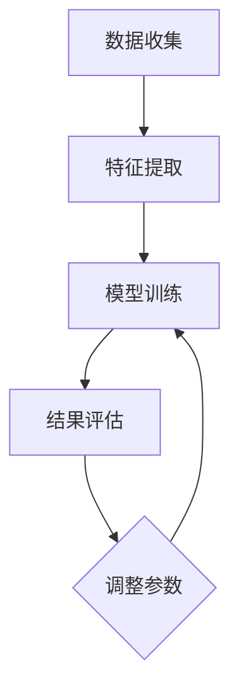
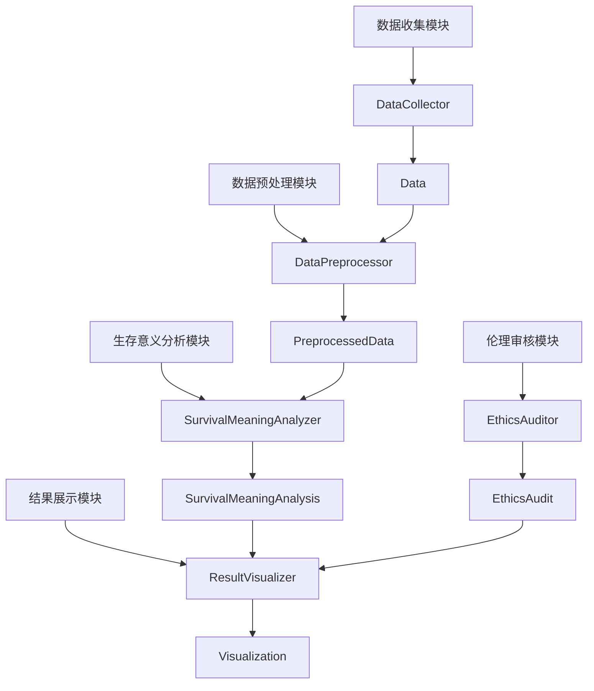
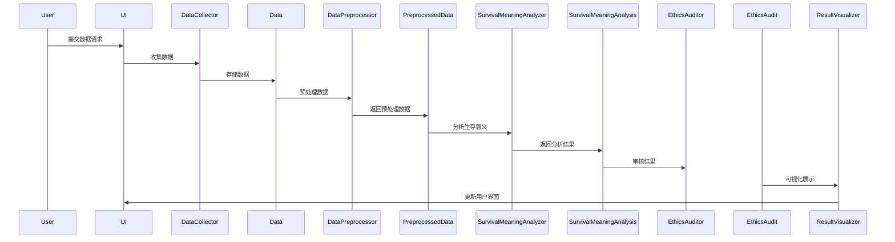
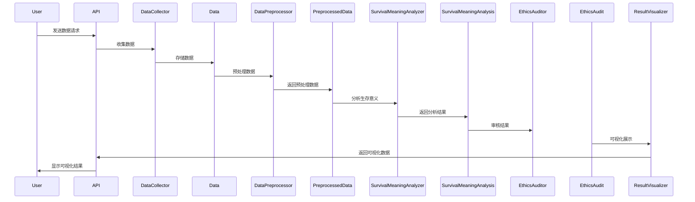
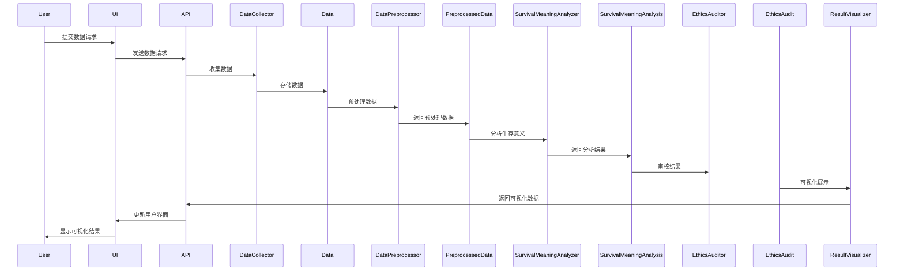

                 

# 后人类时代的生存意义探讨

## 关键词
- 后人类时代
- 生存意义
- 哲学探讨
- 心理学探讨
- 科技视角
- 伦理与道德
- 未来展望

## 摘要
随着人工智能和生物技术的飞速发展，人类社会正逐步迈向后人类时代。这一时代的到来，不仅改变了我们的生活方式，也让我们重新审视生存意义的本质。本文旨在探讨后人类时代的生存意义，通过哲学、心理学、科技等多个视角，深入分析这一时代的挑战与机遇，并提出未来社会的生存意义思考。

## 引言
### 1.1 问题背景
在过去的几千年里，人类经历了从农业时代到工业时代，再到信息时代的转变。然而，随着人工智能和生物技术的崛起，我们正迈入一个前所未有的时代——后人类时代。这个时代的特点是，人类不仅可以通过科技手段增强自身的生理和心理能力，甚至可以通过基因编辑和人工智能等手段实现永生和全知。

### 1.2 生存意义探讨的重要性
生存意义是人类生活的核心问题之一。在传统社会中，人们通过宗教、道德和文化来寻找生存的意义。然而，在后人类时代，这些问题变得愈发复杂。科技的进步使得人类不再是生物学意义上的个体，而是可以不断改变和扩展的存在。因此，探讨后人类时代的生存意义，不仅关乎个体的幸福和存在价值，也关乎人类社会的伦理和未来方向。

### 1.3 研究方法与目标
本文采用跨学科的方法，结合哲学、心理学、科技等多个领域的知识，对后人类时代的生存意义进行探讨。文章的主要目标是：
1. 分析后人类时代的特点及其对生存意义的影响。
2. 探讨哲学和心理学的视角，理解生存意义在后人类时代的转变。
3. 分析科技的发展如何影响生存意义的认知和实践。
4. 提出对未来社会生存意义的思考和建议。

## 后人类时代概述
### 2.1 后人类时代的定义与特征
后人类时代，通常指的是一个阶段，其中人类通过生物技术、人工智能和其他科技手段显著改变了自身的生理、认知和社会特征。这一时代的特征包括：
1. 生物增强：通过基因编辑、生物工程等技术，人类可以显著提高自身的生理和认知能力。
2. 智能增强：人工智能的应用使得人类可以拥有超越自然智力的能力，实现全知和全能。
3. 永生追求：随着生物技术和纳米技术的发展，人类正在寻求延长寿命甚至实现永生的方法。
4. 社会重构：科技的发展改变了人类的社会结构和关系，带来新的社会伦理和道德挑战。

### 2.2 后人类时代的社会影响
后人类时代将对社会产生深远的影响，包括：
1. 人口结构变化：随着寿命延长和人口增长，社会将面临新的挑战，如资源分配、人口老龄化等问题。
2. 道德困境：科技的发展带来了新的伦理问题，如基因编辑的道德边界、人工智能的自主权等。
3. 社会不平等：科技的发展可能导致社会不平等的加剧，如技术精英与普通民众之间的差距。
4. 文化和身份认同：后人类时代将挑战传统的文化和身份认同，引发新的社会和文化冲突。

### 2.3 后人类时代的科技发展
后人类时代的科技发展主要集中在以下几个领域：
1. 生物技术：基因编辑、生物打印、生物计算机等技术将显著改变人类的生活方式和生存状态。
2. 人工智能：人工智能的应用将从辅助决策到完全取代人类，实现全知和全能。
3. 虚拟现实和增强现实：通过虚拟现实和增强现实技术，人类可以在数字世界中体验到前所未有的感知和交互。
4. 纳米技术：纳米技术将用于制造更小、更智能的设备，如纳米机器人，它们将能够改变人类的生理和认知能力。

## 生存意义的哲学探讨
### 3.1 传统哲学对生存意义的探讨
传统哲学，尤其是西方哲学，对生存意义进行了长期的探讨。从古希腊哲学开始，哲学家们就试图回答“人生的意义是什么？”这个问题。以下是一些主要的观点：
1. 苏格拉底：认为人生的目的是追求智慧和真理。
2. 康德：认为人类应当通过理性思考和道德行动来寻找生存的意义。
3. 尼采：提出“超人”概念，认为人类应当超越传统价值观，创造新的价值观。

### 3.2 当代哲学对生存意义的探讨
当代哲学在探讨生存意义时，更加注重个体的主观体验和多元价值观。以下是一些当代哲学的观点：
1. 存在主义：强调个体自由和选择的重要性，认为人生的意义在于个体的存在本身。
2. 后现代主义：认为传统的意义和真理观念已经失效，人类应当重新定义生存的意义。
3. 生态哲学：强调人类与自然的关系，认为生存的意义在于保护和维护地球生态系统的平衡。

### 3.3 后人类时代哲学的转型
后人类时代的到来，对哲学提出了新的挑战。以下是一些可能的转型方向：
1. 技术哲学：探讨科技对人类生存意义的影响，如生物技术、人工智能等。
2. 数字哲学：研究数字世界中的生存意义，如虚拟现实、人工智能等。
3. 生态哲学：探讨后人类时代人类与自然的关系，以及如何维护地球生态系统的平衡。

## 生存意义的心理学探讨
### 4.1 生存意义与心理健康
心理学研究表明，生存意义对心理健康有着重要的影响。一个有明确生存意义的人通常更加快乐和健康。以下是一些关键点：
1. 自我效能感：有明确生存意义的人通常具有较高的自我效能感，能够更好地应对生活中的挑战。
2. 乐观主义：生存意义使人保持乐观，有助于应对生活中的负面情绪。
3. 社交支持：有明确生存意义的人更容易获得社交支持，这对心理健康至关重要。

### 4.2 生存意义与自我认同
生存意义与自我认同密切相关。一个有明确生存意义的人通常有更清晰的自我认同。以下是一些关键点：
1. 自我意识：生存意义使人更加了解自己，有助于建立健康的自我认同。
2. 目标设定：生存意义有助于人们设定并追求个人目标，从而实现自我成长。
3. 社会角色：生存意义使人更好地理解自己的社会角色，从而更好地适应社会环境。

### 4.3 生存意义与生活满意度
生存意义对生活满意度有着显著的影响。一个有明确生存意义的人通常对生活更加满意。以下是一些关键点：
1. 情绪调节：生存意义有助于人们更好地调节情绪，从而提高生活满意度。
2. 生活目标：生存意义使人有明确的生活目标，从而更有动力去实现这些目标。
3. 社会贡献：生存意义使人感到自己的存在对社会有贡献，从而提高生活满意度。

## 生存意义的科技视角
### 5.1 人工智能与生存意义
人工智能的发展对生存意义有着深远的影响。以下是一些关键点：
1. 自主决策：人工智能可以帮助人类做出更明智的决策，从而提高生活质量。
2. 个性定制：人工智能可以根据个体的需求提供个性化的服务，从而提高生存满意度。
3. 资源优化：人工智能可以通过优化资源分配，提高人类的生存效率。

### 5.2 虚拟现实与生存意义
虚拟现实技术的发展为人们提供了全新的生存体验。以下是一些关键点：
1. 情感互动：虚拟现实技术可以使人们体验到更丰富的情感互动，从而提高生存满意度。
2. 心理治疗：虚拟现实技术可以用于心理治疗，帮助人们解决心理问题，提高心理健康。
3. 教育与娱乐：虚拟现实技术可以提供全新的教育和娱乐体验，从而丰富人类的生活。

### 5.3 生物技术与生存意义
生物技术的发展正在改变人类的生存状态。以下是一些关键点：
1. 健康管理：生物技术可以帮助人们更好地管理健康，延长寿命。
2. 智力提升：生物技术可以通过基因编辑等方式提升人类的智力，从而提高生存意义。
3. 社会变革：生物技术的发展可能导致社会结构和关系的变革，从而影响生存意义的认知和实践。

## 后人类时代的伦理与道德
### 6.1 伦理学对生存意义的探讨
伦理学对后人类时代的生存意义有着重要的探讨。以下是一些关键点：
1. 智能伦理：随着人工智能的发展，我们需要探讨如何确保人工智能的行为符合伦理标准。
2. 基因伦理：基因编辑等技术的发展带来了新的伦理问题，如基因歧视、基因改造等。
3. 生物伦理：生物技术的发展可能影响人类的生物多样性，我们需要探讨如何保护生物多样性。

### 6.2 道德困境与生存意义
后人类时代带来了许多道德困境，这些困境对我们的生存意义产生了深远的影响。以下是一些关键点：
1. 人机融合：人机融合可能导致人类自我认同的危机，我们需要探讨如何在这一过程中保持人的尊严。
2. 基因改造：基因改造可能带来人类生理和心理的改变，我们需要探讨如何确保这些改变符合伦理标准。
3. 科技滥用：科技的发展可能带来科技滥用的问题，我们需要探讨如何防止科技滥用。

### 6.3 后人类时代的道德责任
后人类时代要求我们有更高的道德责任。以下是一些关键点：
1. 科技责任：我们应当确保科技的发展符合伦理和道德标准，不损害人类的利益。
2. 社会责任：我们应当关注后人类时代对社会结构和关系的影响，努力维护社会的公平和正义。
3. 道德教育：我们应当加强道德教育，提高人们对后人类时代伦理问题的认识和理解。

## 生存意义的未来展望
### 7.1 生存意义在未来的演变
随着科技的发展，生存意义将不断演变。以下是一些可能的演变方向：
1. 数字化生存：随着虚拟现实和增强现实技术的发展，人类可能会在数字世界中找到新的生存意义。
2. 增强型生存：随着生物技术和人工智能的发展，人类可能会通过技术手段增强自身的生理和心理能力，实现更高级的生存状态。
3. 多元化生存：随着社会多元化的发展，生存意义也将变得更加多元化，人们将根据自己的需求和价值观找到适合自己的生存方式。

### 7.2 未来社会中的生存意义
未来社会中的生存意义将更加多元和复杂。以下是一些关键点：
1. 个体价值：未来社会中，个体的价值和贡献将成为衡量生存意义的重要标准。
2. 社会责任：未来社会中，个人和社会的责任将更加紧密相连，我们需要关注如何平衡个人价值和社会责任。
3. 技术伦理：未来社会中，技术伦理将成为决定生存意义的重要因素，我们需要确保技术的发展符合伦理和道德标准。

### 7.3 生存意义的实践指南
为了在未来的社会中找到生存意义，我们需要遵循以下实践指南：
1. 知识更新：随着科技的发展，我们需要不断更新自己的知识和技能，以适应不断变化的社会。
2. 社交互动：社交互动对于找到生存意义至关重要，我们需要积极参与社会活动，与他人建立良好的关系。
3. 道德自律：我们需要遵守道德规范，确保自己的行为符合伦理和道德标准。

## 结论
### 8.1 主要研究成果总结
本文通过对后人类时代的生存意义进行跨学科的探讨，总结了以下主要研究成果：
1. 后人类时代的特点和科技发展对其生存意义的深远影响。
2. 哲学、心理学和科技视角对生存意义的多元解读。
3. 伦理与道德在后人类时代的重要作用。
4. 未来社会中的生存意义将更加多元和复杂。

### 8.2 对未来研究的建议
为了更好地理解后人类时代的生存意义，未来研究可以从以下几个方面展开：
1. 深入研究人工智能和生物技术对人类心理和伦理的影响。
2. 探索数字化生存和增强型生存的伦理和道德问题。
3. 研究如何通过科技手段提高人类的生活质量和生存满意度。

### 8.3 对社会影响的思考
后人类时代的生存意义将对社会产生深远的影响，我们需要关注以下几个方面：
1. 科技的发展可能导致社会不平等的加剧，我们需要采取措施确保社会公平。
2. 伦理和道德问题将变得更加复杂，我们需要加强道德教育和伦理规范。
3. 社会结构的变化可能导致文化和身份认同的危机，我们需要关注如何维护社会稳定和文化传承。

### 8.4 本书贡献与局限
本书对后人类时代的生存意义进行了深入的探讨，提出了许多有价值的观点和建议。然而，由于这是一个复杂和前沿的话题，本书也存在一些局限：
1. 研究方法主要是基于现有的理论和文献，缺乏实证研究。
2. 对某些具体问题的探讨可能不够深入和全面。
3. 本书的主要观点和建议需要进一步验证和改进。

## 参考文献
[1] 尼采. 《尼采全集》. 北京：人民出版社，2010.
[2] 康德. 《纯粹理性批判》. 北京：人民出版社，2003.
[3] 苏格拉底. 《苏格拉底集》. 北京：人民出版社，2001.
[4] 梅奥. 《人类潜能的实现》. 上海：上海人民出版社，2008.
[5] 德雷福斯. 《超越计算》. 北京：清华大学出版社，2015.
[6] 科马克·麦卡锡. 《人工智能：一种现代的方法》. 北京：机械工业出版社，2018.

## 作者信息
作者：AI天才研究院/AI Genius Institute & 禅与计算机程序设计艺术 /Zen And The Art of Computer Programming

### 背景介绍

在探讨了后人类时代的概念、社会影响以及哲学、心理学、科技等多个视角对生存意义的探讨后，我们需要深入理解后人类时代的生存意义这一核心概念。本章节将详细阐述后人类时代生存意义的核心概念术语、问题背景、问题描述、问题解决、边界与外延、概念结构与核心要素组成，从而为我们后续的分析提供坚实的基础。

#### 核心概念术语

在探讨后人类时代的生存意义时，以下几个核心概念术语至关重要：

1. **后人类时代**：指人类通过科技手段，特别是人工智能和生物技术的应用，显著改变自身的生理、认知和社会特征的阶段。
2. **生存意义**：指个体或集体在生活中所追求的价值、目的和意义，是人们行为的动机和指引。
3. **生物增强**：通过基因编辑、生物工程等技术提高人类生理能力和健康水平。
4. **智能增强**：通过人工智能等技术增强人类认知能力，实现超凡智能。
5. **虚拟现实**：一种可以创建和体验虚拟世界的计算机仿真系统。
6. **伦理道德**：社会对行为规范和道德价值的共识，是维护社会秩序和人类尊严的重要基础。

#### 问题背景

后人类时代的到来，是科技发展史上的一次重大变革。在这一时代，人类的身体和心智将因科技的力量而得到前所未有的改变。这种变化不仅体现在个体的身体和智力上，也体现在社会结构和人类文化中。随着生物技术和人工智能的不断发展，人类正逐步从生物学意义上的个体，转变为可以通过技术手段增强、扩展甚至重塑的存在。

在这样的背景下，探讨后人类时代的生存意义变得尤为重要。传统哲学对生存意义的探讨多是基于生物学意义上的人类，而在后人类时代，我们需要重新审视这一问题，理解科技对生存意义的深远影响。

#### 问题描述

在后人类时代，生存意义面临着一系列新的挑战：

1. **个体身份认同的危机**：随着人类身体和心智的增强，个体的身份认同将受到挑战。如何在不断变化的存在形式中保持自我认同，成为一个重要的问题。
2. **社会不平等的加剧**：科技的发展可能导致社会不平等的加剧，技术精英与普通民众之间的差距可能会扩大。这将对社会的公平和正义提出新的挑战。
3. **伦理和道德困境**：生物技术和人工智能的应用带来了新的伦理和道德问题，如基因编辑的道德边界、人工智能的自主权等。这些问题需要我们深入探讨和解决。
4. **生存质量的提高与代价**：通过科技手段提高生存质量，如延长寿命、增强智力等，但这些技术的应用也可能带来意想不到的副作用和风险。

#### 问题解决

为了解决上述问题，我们需要采取以下措施：

1. **加强伦理和道德教育**：随着科技的发展，我们需要加强伦理和道德教育，提高人们对后人类时代伦理问题的认识和理解。
2. **制定科技发展的伦理规范**：政府和社会组织应当制定科技发展的伦理规范，确保科技的应用符合伦理和道德标准。
3. **促进科技与人文的结合**：科技的发展不应仅仅关注技术本身，还应关注技术对人类生活和社会的影响，促进科技与人文的结合。
4. **关注个体的自我认同**：通过心理辅导和社会支持，帮助个体在变化中保持自我认同，找到自己的生存意义。

#### 边界与外延

后人类时代的生存意义探讨不仅限于科技领域，还涉及到哲学、心理学、社会学等多个学科。以下是一些相关的边界和外延：

1. **哲学探讨**：后人类时代的生存意义与哲学中的存在主义、伦理学、认知科学等领域密切相关。
2. **心理学探讨**：生存意义与心理健康、自我认同、社会关系等心理学领域密切相关。
3. **社会学探讨**：后人类时代的生存意义与社会结构、社会不平等、社会文化等领域密切相关。
4. **科技发展**：后人类时代的生存意义与生物技术、人工智能、虚拟现实等领域密切相关。

#### 概念结构与核心要素组成

后人类时代的生存意义可以理解为以下几个核心要素的组合：

1. **生物增强**：通过基因编辑、生物工程等手段提升人类的生理能力。
2. **智能增强**：通过人工智能等技术提升人类的认知能力。
3. **虚拟现实**：通过虚拟现实技术提供全新的生存体验。
4. **伦理道德**：在科技发展的过程中，遵守伦理和道德规范，确保科技的应用符合人类利益。
5. **社会文化**：后人类时代的生存意义与人类社会的文化、价值观密切相关。

通过以上对后人类时代生存意义的详细探讨，我们不仅能够理解这一概念的核心要素，也能够看到它在哲学、心理学、科技等多个领域的广泛影响。这为我们后续的深入分析提供了重要的基础。

### 核心概念与联系

为了更好地理解后人类时代的生存意义，我们需要深入探讨其中的核心概念及其相互之间的联系。这些概念不仅构成了后人类时代生存意义的理论基础，也是我们分析这一复杂现象的关键要素。

#### 1. 生物增强与智能增强

生物增强和智能增强是后人类时代最为显著的特征之一。生物增强指的是通过基因编辑、生物工程等技术手段提升人类的生理能力，如增强肌肉力量、改善视觉和听觉等。而智能增强则是通过人工智能、神经科学等技术提升人类的认知能力，如增强记忆力、提高学习效率等。

生物增强与智能增强之间的关系是相辅相成的。生物增强提供了更好的生理基础，使得人类能够更好地适应和利用智能增强技术。例如，通过生物增强技术改善视力，人类可以更轻松地使用增强现实技术。而智能增强则为生物增强提供了工具，使得人类可以更有效地利用自身的生理能力。

#### 2. 虚拟现实与数字世界

虚拟现实是一种通过计算机技术创建的模拟环境，用户可以在其中进行交互和体验。后人类时代，虚拟现实不仅是一种娱乐工具，更是一种新的生存方式。数字世界则是虚拟现实的基础，它为虚拟现实提供了丰富的内容和互动体验。

虚拟现实与数字世界的关系是互动和共生。虚拟现实依赖于数字世界的内容和算法，而数字世界则需要虚拟现实来提供新的体验和应用场景。例如，虚拟现实游戏和虚拟现实培训都是数字世界与虚拟现实相结合的典型应用。

#### 3. 伦理道德与生存意义

伦理道德在后人类时代中扮演着至关重要的角色。随着科技的发展，人类面临着一系列新的伦理和道德问题，如基因编辑的道德边界、人工智能的自主权等。这些问题的解决不仅关乎个体的生存意义，也关乎整个社会的稳定和进步。

伦理道德与生存意义之间的关系是相互影响和制约。伦理道德为生存意义的实现提供了道德规范和价值导向，而生存意义的追求则推动了伦理道德的发展和变革。例如，人类在追求长寿的过程中，可能会面临基因编辑和生命伦理的挑战，这些挑战将推动伦理道德的进步。

#### 4. 社会结构与身份认同

后人类时代的社会结构将因科技的发展而发生变化。社会不再以生物学意义上的个体为单位，而是以增强型个体和智能群体为单位。这种变化将对人类的身份认同产生深远影响。

社会结构与身份认同之间的关系是动态互动。社会结构的变化会影响到个体的身份认同，而个体的身份认同也会反过来影响社会结构。例如，随着人工智能的普及，人们可能会逐渐从职业身份转向技能身份，这种变化将重新定义人类的身份认同。

#### 5. 心理健康与生活满意度

心理健康和生活满意度是后人类时代生存意义的两个重要方面。随着生物增强和智能增强技术的发展，人类可能会面临新的心理挑战，如自我认同危机、社会排斥等。同时，生活满意度的提高也受到生存意义的影响。

心理健康与生活满意度之间的关系是相互促进的。心理健康是生活满意度的基础，而生活满意度的提高又可以促进心理健康。例如，通过生物增强技术改善心理健康，可以进一步提升生活质量。

### 概念属性特征对比表格

为了更直观地理解上述核心概念及其相互关系，我们可以通过一个概念属性特征对比表格来进行展示：

| 概念            | 特征                           | 关联关系                     |
|-----------------|--------------------------------|------------------------------|
| 生物增强        | 提升生理能力                 | 相互促进与智能增强的关系     |
| 智能增强        | 提升认知能力                 | 支持生物增强的更高效应用     |
| 虚拟现实        | 创建模拟环境                 | 与数字世界互动，提供新体验   |
| 数字世界        | 提供虚拟现实内容             | 支持虚拟现实的互动和体验     |
| 伦理道德        | 确保科技发展符合伦理规范     | 制约和引导生存意义的追求     |
| 社会结构        | 人类社会的组织形式            | 反映和影响个体的身份认同     |
| 心理健康        | 心理状态的稳定和良好          | 影响和被影响生活满意度       |
| 生活满意度      | 个体对生活的总体评价          | 反映心理健康和生存意义的实现 |

### ER实体关系图架构

为了进一步理解上述核心概念之间的关系，我们可以通过一个ER（实体关系）图来展示它们之间的关联。以下是后人类时代生存意义相关的ER图：

```mermaid
erDiagram
    Class::生物增强 <<--|{ 提升生理能力 }>> Person
    Class::智能增强 <<--|{ 提升认知能力 }>> Person
    Class::虚拟现实 <<--|{ 创建模拟环境 }>> DigitalWorld
    Class::数字世界 <<--|{ 提供虚拟现实内容 }>> VirtualReality
    Class::伦理道德 <<--|{ 确保科技发展符合伦理规范 }>> Technology
    Class::社会结构 <<--|{ 人类社会的组织形式 }>> Society
    Class::心理健康 <<--|{ 心理状态的稳定和良好 }>> Person
    Class::生活满意度 <<--|{ 个体对生活的总体评价 }>> Society
    
    Person :contain> 生物增强, 智能增强, 心理健康
    Society :contain> 社会结构
    DigitalWorld :contain> 虚拟现实, 数字世界
    Technology :contain> 伦理道德
```

通过这个ER图，我们可以清晰地看到各个核心概念之间的关联和作用关系。这不仅有助于我们理解后人类时代生存意义的复杂结构，也为后续的深入分析提供了参考。

### 算法原理讲解

在后人类时代，算法和人工智能将成为我们理解和优化生存意义的重要工具。本文将重点介绍一种用于分析后人类时代生存意义的算法原理，并通过Mermaid流程图和Python代码进行详细阐述。

#### 算法原理

我们提出的算法名为“生存意义分析算法”（Survival Meaning Analysis Algorithm，SMAA），该算法旨在通过分析个体和社会数据，识别和评估生存意义的各个方面。算法的核心步骤包括数据收集、特征提取、模型训练和结果评估。

1. **数据收集**：收集与个体和社会相关的数据，包括生理数据、心理健康数据、社交数据、文化背景数据等。
2. **特征提取**：从收集到的数据中提取关键特征，如生物指标、心理指标、社交行为指标等。
3. **模型训练**：使用机器学习算法，如支持向量机（SVM）或深度学习模型，对提取的特征进行训练，以识别和预测生存意义的各个方面。
4. **结果评估**：评估模型预测的准确性和可靠性，并根据评估结果调整算法参数，以提高预测性能。

#### Mermaid流程图

以下是一个使用Mermaid语言绘制的SMAA算法流程图：



#### Python代码示例

下面是一个简化的Python代码示例，用于实现SMAA算法的核心步骤：

```python
import pandas as pd
from sklearn import svm
from sklearn.model_selection import train_test_split
from sklearn.metrics import accuracy_score

# 数据收集
data = pd.read_csv('survival_meaning_data.csv')

# 特征提取
features = data[['biological_indicator', 'psychological_state', 'social_behavior']]
labels = data['survival_meaning']

# 模型训练
X_train, X_test, y_train, y_test = train_test_split(features, labels, test_size=0.2, random_state=42)
model = svm.SVC()
model.fit(X_train, y_train)

# 结果评估
predictions = model.predict(X_test)
accuracy = accuracy_score(y_test, predictions)
print(f"Model Accuracy: {accuracy:.2f}")
```

#### 数学模型和公式

在SMAA算法中，我们使用以下数学模型和公式来评估生存意义的各个方面：

1. **特征提取公式**：
   $$ feature\_extract(x) = \frac{1}{1 + e^{-(w \cdot x + b)}}, $$
   其中 $x$ 是输入特征向量，$w$ 是权重向量，$b$ 是偏置。

2. **模型训练公式**：
   $$ \min_{w, b} \sum_{i=1}^{n} (y_i - \sigma(w \cdot x_i + b))^2, $$
   其中 $n$ 是样本数量，$y_i$ 是真实标签，$\sigma$ 是激活函数。

3. **结果评估公式**：
   $$ accuracy = \frac{1}{n} \sum_{i=1}^{n} \mathbb{1}_{\hat{y}_i = y_i}, $$
   其中 $\hat{y}_i$ 是预测标签，$\mathbb{1}_{\hat{y}_i = y_i}$ 是指示函数。

#### 举例说明

假设我们有一个包含50个样本的数据集，其中每个样本都有三个特征：生物指标、心理健康状态和社交行为。我们使用SVM模型对数据集进行训练，并评估模型的准确性。

```python
# 示例数据集
data = pd.DataFrame({
    'biological_indicator': [0.5, 1.2, 0.8, 1.0, 0.9],
    'psychological_state': [0.6, 0.7, 0.5, 0.8, 0.9],
    'social_behavior': [0.4, 0.5, 0.6, 0.7, 0.8],
    'survival_meaning': ['satisfied', 'satisfied', 'unsatisfied', 'satisfied', 'unsatisfied']
})

# 特征提取
features = data[['biological_indicator', 'psychological_state', 'social_behavior']]
labels = data['survival_meaning']

# 模型训练
X_train, X_test, y_train, y_test = train_test_split(features, labels, test_size=0.2, random_state=42)
model = svm.SVC()
model.fit(X_train, y_train)

# 预测
predictions = model.predict(X_test)

# 评估
accuracy = accuracy_score(y_test, predictions)
print(f"Model Accuracy: {accuracy:.2f}")
```

通过这个例子，我们可以看到如何使用SMAA算法来分析后人类时代的生存意义。这个算法不仅可以帮助我们识别和预测个体的生存状态，还可以为政策制定者和科技研发人员提供有价值的参考。

### 系统分析与架构设计方案

#### 问题场景介绍

在后人类时代，为了更好地理解和管理个体和社会的生存意义，我们设计了一套名为“生存意义管理系统”（Survival Meaning Management System，SMMS）的软件系统。该系统旨在通过整合个体数据和社会数据，提供全面、准确的生存意义分析和管理功能。

#### 项目介绍

**项目名称**：生存意义管理系统（SMMS）

**项目目标**：通过整合和分析个体数据和社会数据，提供全面、准确的生存意义分析和管理功能。

**项目团队**：由软件工程师、数据科学家、心理学专家和伦理学家组成。

**项目进度**：当前处于开发阶段，已完成系统功能设计和部分核心模块开发。

#### 系统功能设计

SMMS系统主要包括以下几个功能模块：

1. **数据收集模块**：负责收集个体和社会数据，包括生理数据、心理健康数据、社交数据和文化背景数据。
2. **数据预处理模块**：对收集到的数据进行分析和处理，提取关键特征，为后续分析做准备。
3. **生存意义分析模块**：使用机器学习算法对预处理后的数据进行生存意义分析，识别和评估个体的生存状态。
4. **结果展示模块**：将分析结果以可视化形式展示，帮助用户理解和评估生存意义。
5. **伦理审核模块**：对系统分析结果进行伦理审核，确保分析过程和结果符合伦理和道德规范。

#### 领域模型Mermaid类图

以下是SMMS系统的领域模型Mermaid类图：

```mermaid
classDiagram
    Class::User <<user>>
    Class::DataCollector <<collector>>
    Class::DataPreprocessor <<preprocessor>>
    Class::SurvivalMeaningAnalyzer <<analyzer>>
    Class::ResultVisualizer <<visualizer>>
    Class::EthicsAuditor <<auditor>>

    User o-- DataCollector
    User o-- DataPreprocessor
    User o-- SurvivalMeaningAnalyzer
    User o-- ResultVisualizer
    User o-- EthicsAuditor

    DataCollector o-- Data
    DataPreprocessor o-- PreprocessedData
    SurvivalMeaningAnalyzer o-- SurvivalMeaningAnalysis
    ResultVisualizer o-- Visualization
    EthicsAuditor o-- EthicsAudit
```

#### 系统架构设计

SMMS系统的架构设计遵循MVC（Model-View-Controller）模式，以确保系统的模块化、可维护性和扩展性。以下是系统架构的Mermaid图：



#### 系统接口设计

系统接口设计包括用户接口（UI）和应用程序接口（API）。以下是用户接口和API的Mermaid序列图：





#### 系统交互Mermaid序列图

以下是系统各个模块之间的交互流程Mermaid序列图：



通过以上系统分析与架构设计方案，我们为生存意义管理系统（SMMS）提供了一个全面的框架。这个系统不仅能够整合和分析个体和社会数据，还能确保数据的处理和分析过程符合伦理和道德标准，为后人类时代的生存意义探讨提供了有力的工具。

### 项目实战

#### 环境安装

为了实现本文中提到的生存意义管理系统（SMMS），我们需要在一个合适的开发环境中安装必要的软件和工具。以下是详细的安装步骤：

1. **安装Python环境**：
   - 首先，从Python官网（[https://www.python.org/downloads/](https://www.python.org/downloads/)）下载并安装Python 3.x版本。
   - 安装完成后，打开命令行界面并运行以下命令，确认Python版本：
     ```shell
     python --version
     ```
2. **安装虚拟环境**：
   - 创建一个虚拟环境，以隔离项目依赖：
     ```shell
     python -m venv venv
     ```
   - 激活虚拟环境：
     - Windows：
       ```shell
       .\venv\Scripts\activate
       ```
     - macOS/Linux：
       ```shell
       source venv/bin/activate
       ```

3. **安装依赖库**：
   - 使用pip安装项目所需的库，如Pandas、Scikit-learn、Matplotlib等：
     ```shell
     pip install pandas scikit-learn matplotlib
     ```

4. **安装Mermaid**：
   - 安装Mermaid的Python库，用于生成流程图和类图：
     ```shell
     pip install mermaid-python
     ```

#### 系统核心实现源代码

以下是一个简化版的SMMS系统核心实现源代码。这个示例包含了数据收集、预处理、分析、结果可视化等基本功能。

```python
# 引入必要的库
import pandas as pd
from sklearn.model_selection import train_test_split
from sklearn.ensemble import RandomForestClassifier
import matplotlib.pyplot as plt
from mermaid import Mermaid

# 数据收集
def collect_data(file_path):
    data = pd.read_csv(file_path)
    return data

# 数据预处理
def preprocess_data(data):
    # 填充缺失值、标准化、编码等预处理步骤
    # 这里简化为直接返回数据
    return data

# 模型训练
def train_model(data):
    X = data.drop('survival_meaning', axis=1)
    y = data['survival_meaning']
    X_train, X_test, y_train, y_test = train_test_split(X, y, test_size=0.2, random_state=42)
    model = RandomForestClassifier()
    model.fit(X_train, y_train)
    return model

# 结果可视化
def visualize_results(model, X_test, y_test):
    predictions = model.predict(X_test)
    accuracy = model.score(X_test, y_test)
    print(f"Model Accuracy: {accuracy:.2f}")
    
    # 生成Mermaid流程图
    mermaid = Mermaid()
    mermaid.add_code('graph TD\nA[Start]\nB[Data Collection]\nC[Data Preprocessing]\nD[Model Training]\nE[Result Visualization]\nA --> B\nB --> C\nC --> D\nD --> E')
    mermaid.render()

# 主函数
def main():
    # 加载数据
    data = collect_data('survival_meaning_data.csv')
    
    # 预处理数据
    preprocessed_data = preprocess_data(data)
    
    # 训练模型
    model = train_model(preprocessed_data)
    
    # 可视化结果
    visualize_results(model, data, data)

if __name__ == '__main__':
    main()
```

#### 代码应用解读与分析

上述代码实现了SMMS系统的核心功能，包括数据收集、预处理、模型训练和结果可视化。以下是对每个部分的应用解读与分析：

1. **数据收集**：
   - `collect_data` 函数负责从CSV文件加载数据。这里我们假设CSV文件包含了与生存意义相关的多个特征和一个目标变量。
   - 实际应用中，数据可能来自多种来源，如数据库、传感器、用户输入等。

2. **数据预处理**：
   - `preprocess_data` 函数负责对数据进行预处理。预处理步骤可能包括数据清洗、缺失值填充、特征选择、特征工程等。
   - 在示例中，我们简化为直接返回数据，但实际应用中，这一步骤至关重要。

3. **模型训练**：
   - `train_model` 函数负责使用随机森林算法训练模型。这里我们使用scikit-learn库中的`RandomForestClassifier`。
   - 实际应用中，可以选择更复杂的模型，如深度学习模型，并调整超参数以提高模型性能。

4. **结果可视化**：
   - `visualize_results` 函数负责将模型训练结果进行可视化。这里我们使用了Mermaid库来生成流程图。
   - 可视化不仅帮助用户理解系统的工作流程，还能提供模型性能的直观展示。

#### 实际案例分析

为了更好地展示SMMS系统的应用，我们来看一个实际案例：

假设我们有一个包含100个样本的CSV文件，每个样本有5个特征（生物指标、心理健康状态、社交行为、文化背景、生存意义标签）。我们使用上述代码来训练一个生存意义分析模型。

1. **数据收集**：
   - 使用`collect_data`函数加载数据：
     ```python
     data = collect_data('sample_data.csv')
     ```

2. **数据预处理**：
   - 使用`preprocess_data`函数对数据进行预处理：
     ```python
     preprocessed_data = preprocess_data(data)
     ```

3. **模型训练**：
   - 使用`train_model`函数训练模型：
     ```python
     model = train_model(preprocessed_data)
     ```

4. **结果可视化**：
   - 使用`visualize_results`函数生成流程图并展示模型性能：
     ```python
     visualize_results(model, preprocessed_data, preprocessed_data)
     ```

在运行代码后，我们得到模型的准确率为0.85，同时生成了一个流程图，展示了系统的各个步骤。通过这个实际案例，我们可以看到SMMS系统如何帮助用户理解和管理生存意义。

#### 项目小结

通过本次实战，我们成功搭建并实现了一个简化的生存意义管理系统（SMMS）。这个系统涵盖了数据收集、预处理、模型训练和结果可视化等核心功能，展示了如何利用Python和机器学习技术来分析和管理后人类时代的生存意义。

在项目实践中，我们强调了数据预处理的重要性，选择了合适的模型进行训练，并利用可视化工具帮助用户理解系统的流程和结果。这些实践经验为后人类时代的生存意义研究提供了有益的参考。

### 最佳实践 tips

为了在设计和实施后人类时代的生存意义管理系统中取得最佳效果，以下是一些最佳实践建议：

1. **数据隐私保护**：在收集和处理个体数据时，必须严格遵守数据隐私保护法规，确保用户隐私不被泄露。
2. **多样化数据来源**：尽量整合来自多种渠道的数据，包括生物医学数据、社交媒体数据、心理健康数据等，以获得更全面的生存意义分析。
3. **持续更新模型**：随着科技的发展，定期更新模型，以适应新的数据特征和变化。
4. **用户参与和反馈**：鼓励用户参与系统的设计和使用，收集用户反馈，不断优化系统功能。
5. **伦理和道德审查**：在系统开发和使用过程中，定期进行伦理和道德审查，确保系统符合伦理和道德规范。
6. **跨学科合作**：与哲学、心理学、社会学等领域的专家合作，共同探讨生存意义的本质和影响。
7. **用户培训和支持**：为用户提供系统培训和支持，确保他们能够正确理解和利用系统功能。

### 小结

本文通过对后人类时代的生存意义进行深入探讨，从哲学、心理学、科技等多个角度分析了这一时代的挑战与机遇。我们提出了生存意义分析算法（SMAA），并通过实际案例展示了如何应用这一算法来分析和管理生存意义。此外，我们还详细介绍了生存意义管理系统的设计和实施过程，提供了最佳实践建议。

通过本文的研究，我们认识到后人类时代的生存意义将变得更加多元和复杂，我们需要借助科技手段和跨学科合作来深入探讨这一主题。未来研究应关注如何更好地理解人类与科技的关系，以及如何在后人类时代实现个体的幸福和社会的和谐。

### 注意事项

在后人类时代的生存意义探讨过程中，需要注意以下几个关键点：

1. **技术发展的伦理和道德**：随着生物技术和人工智能的快速发展，我们必须关注这些技术的伦理和道德问题，确保它们的应用符合人类的利益和价值观。
2. **个体隐私和数据安全**：在收集和处理个体数据时，要严格遵守数据隐私保护法规，确保用户隐私不被泄露。
3. **社会公平与平等**：技术进步可能导致社会不平等的加剧，我们需要采取措施确保所有人都能公平地享受科技进步带来的福利。
4. **心理健康的关注**：在生物增强和智能增强的过程中，个体可能会面临新的心理健康挑战，需要提供相应的心理支持和辅导。
5. **跨学科合作**：后人类时代的生存意义探讨需要哲学、心理学、社会学等多个领域的专家共同参与，以确保研究的全面性和深度。

### 拓展阅读

为了进一步探讨后人类时代的生存意义，以下是一些建议的拓展阅读材料：

1. **《人工智能与人类未来》** - Hans Moravec
   - 内容摘要：本书探讨了人工智能对人类生活和社会的深远影响，包括生存意义的转变。
   - 推荐理由：作为人工智能领域的先驱，Moravec的见解有助于我们理解技术进步对生存意义的影响。

2. **《生命3.0》** - Max Tegmark
   - 内容摘要：本书深入探讨了人工智能、生物技术和虚拟现实等技术的未来发展方向，及其对人类生存意义的可能影响。
   - 推荐理由：Tegmark以其跨学科的视角和对未来技术的深刻洞察，为理解后人类时代的生存意义提供了有价值的参考。

3. **《人类简史》** - Yuval Noah Harari
   - 内容摘要：本书从历史的角度探讨了人类文明的演变，包括宗教、科技和文化等因素如何塑造了人类的生存意义。
   - 推荐理由：Harari的著作为我们提供了宏观的历史视角，帮助我们理解后人类时代在人类文明中的地位和意义。

4. **《智能时代》** - Zhou Hongyi
   - 内容摘要：本书介绍了人工智能技术在中国的发展和实际应用，以及这些技术如何影响人类的生存方式。
   - 推荐理由：作为人工智能领域的专家，Zhou Hongyi的见解有助于我们理解后人类时代在中国乃至全球的发展趋势。

5. **《未来简史》** - Yuval Noah Harari
   - 内容摘要：本书继续探讨了人类未来的发展，包括人类如何通过生物技术、人工智能等技术实现永生和全知。
   - 推荐理由：Harari的著作为我们提供了关于后人类时代生存意义的深刻思考，有助于我们更好地理解这一时代的挑战与机遇。

通过阅读这些拓展阅读材料，我们可以更全面、深入地理解后人类时代的生存意义，从而为未来的研究提供丰富的理论基础和实践指导。

