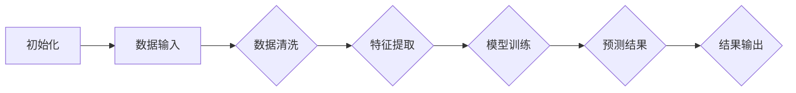
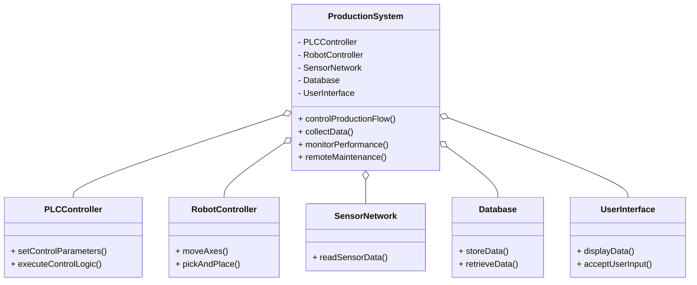
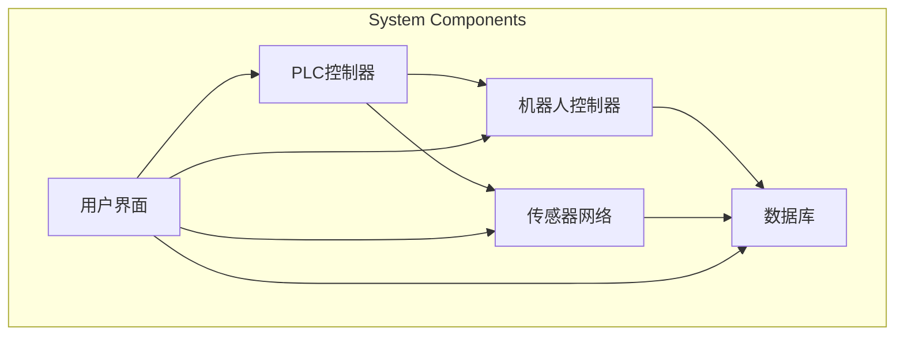
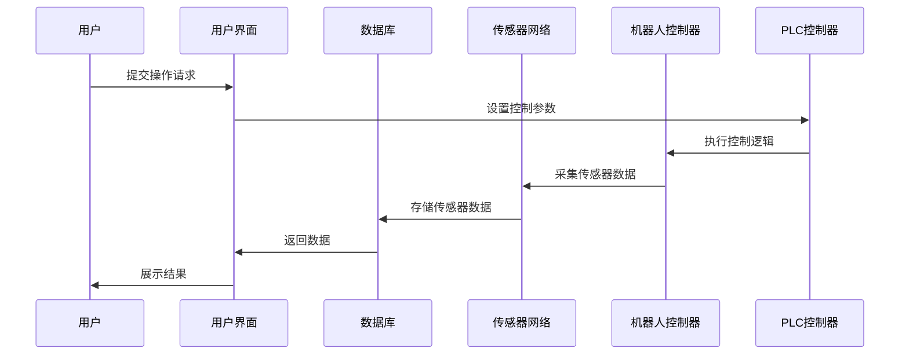

                 

### 后就业时代生存策略：自动化世界中的人生规划

#### 摘要

随着自动化技术的发展和普及，就业市场正在经历深刻的变革。自动化和人工智能的广泛应用不仅改变了传统的工作方式，也带来了新的职业挑战和机遇。在这个后就业时代，个人如何规划自己的人生，以适应自动化世界的要求，成为一个至关重要的问题。本文将深入探讨自动化时代下的就业环境与挑战，通过一系列的步骤和分析，为读者提供一套系统化的人生规划策略。

本文将首先介绍自动化时代的就业环境，探讨自动化技术对就业市场的影响，并分析个人在自动化世界中所面临的新挑战。接着，我们将详细阐述自动化技术的基础知识，包括其基本概念、分类和发展，以及在各行业中的应用。随后，本文将聚焦于职业规划，探讨职业规划的必要性、方法与工具，以及在自动化时代下的职业发展方向。

在文章的第三部分，我们将讨论技能提升策略和职业发展路径，包括技能需求分析、技能提升方法与途径、技能认证与评估，以及职业发展的重要性、策略与关键因素。特别地，我们还将探讨自动化世界中的创新与创业，分析创新的意义与作用，以及创业的条件与准备。

最后，本文将关注自动化世界中的心理健康与平衡生活，探讨心理健康的重要性、影响因素以及维护与促进策略，并分析在自动化时代下如何平衡生活与工作。通过这些讨论，本文旨在为读者提供一套全面、实用的人生规划策略，帮助他们更好地适应自动化世界的挑战。

#### 第一部分：自动化时代下的就业环境与挑战

### 1.1 自动化时代的特点与趋势

自动化时代，也被称为后就业时代，是信息技术和智能制造的交汇点。这一时代的特点主要表现在以下几个方面：

首先，自动化技术的迅猛发展。以人工智能（AI）、机器学习（ML）和机器人技术（Robotics）为代表的自动化技术正在快速进步，并逐步渗透到各个行业。这些技术的应用不仅提高了生产效率，还极大地改变了传统的工作模式。

其次，就业市场的变革。自动化技术带来的生产效率提升，使得一些重复性和低技能的工作被机器所取代。同时，新的高技能岗位也在不断涌现，如数据分析师、AI工程师和自动化系统维护工程师等。这种就业市场的变革，要求劳动者具备更高的技能和适应能力。

第三，职业发展的多样性。自动化时代的职业发展路径不再局限于传统的线性模式，而是更加多元化和灵活。例如，许多职业从业者可以通过自学、在线课程和职业认证等方式，不断提升自己的技能，以适应市场的需求。

### 1.2 自动化技术对就业市场的影响

自动化技术对就业市场的影响是深远且多方面的。以下是几个主要方面：

**减少低技能工作岗位**：自动化技术能够高效地完成一些重复性和低技能的工作，如制造业中的装配线作业、物流配送中心的分拣工作等。这些工作的减少，意味着大量低技能劳动力的需求下降。

**增加高技能工作岗位**：自动化技术的发展，也催生了许多新的高技能工作岗位。例如，AI工程师、数据科学家、机器学习研究员等。这些岗位需要具备高度的专业知识和技能，从而提高了劳动者的就业门槛。

**促进职业转型**：自动化时代的就业市场要求劳动者具备更高的技能和灵活性。这促使许多从业者进行职业转型，以适应新的市场需求。例如，一些传统制造业工人可以通过培训和学习，转型成为自动化系统维护工程师。

**改变劳动力结构**：随着自动化技术的普及，劳动力市场的结构也在发生变化。高技能劳动力的比例增加，低技能劳动力的比例减少。这种变化，对教育和培训体系提出了新的要求。

### 1.3 个人在自动化世界中的新挑战

在自动化世界中，个人将面临一系列新的挑战。以下是几个主要方面：

**技能需求的变化**：随着自动化技术的发展，对劳动者的技能需求也在发生变化。个人需要不断提升自己的技能，以适应新的工作岗位需求。例如，编程能力、数据分析能力和自动化系统维护能力等。

**职业适应能力的要求**：自动化时代的就业市场变化迅速，劳动者需要具备更强的适应能力。这意味着，个人需要能够快速学习新技能，并灵活调整自己的职业规划。

**心理健康问题**：自动化技术的普及，虽然提高了生产效率，但也可能导致一些负面影响。例如，工作压力增大、失业风险增加等，这些都可能对个人的心理健康产生负面影响。

**生活工作的平衡**：自动化技术使得工作与生活的界限变得模糊。个人需要找到有效的方法，以实现工作与生活的平衡。

#### 1.4 如何通过人生规划应对挑战

面对自动化世界中的新挑战，个人需要通过系统化的人生规划来应对。以下是一些具体的策略：

**持续学习与技能提升**：个人应不断学习新技能，以适应自动化时代的需求。可以通过参加在线课程、参加专业培训、阅读相关书籍等方式，不断提升自己的知识水平和技能。

**职业规划与调整**：根据市场的需求和自身的兴趣，制定合理的职业规划。在职业发展的过程中，要灵活调整自己的方向，以适应市场的变化。

**心理健康维护**：重视心理健康，通过锻炼、冥想、社交等方式，维护自己的心理健康。

**生活工作平衡**：通过合理安排时间，实现工作与生活的平衡。例如，设定明确的工作时间，保持充足的休息和娱乐时间。

### 1.5 边界与外延

本文主要探讨的是自动化时代下的人生规划策略，重点关注以下几个方面：

- **自动化技术**：主要涉及人工智能、机器学习和机器人技术等。
- **就业市场**：主要关注就业趋势、技能需求变化以及职业发展路径。
- **个人发展**：主要探讨个人如何通过学习、职业规划等途径，适应自动化时代的需求。

本文的讨论范围不涉及其他相关领域，如经济政策、法律法规等。同时，本文的重点在于提供一套具体、可操作的人生规划策略，以帮助个人在自动化世界中找到自己的定位和发展方向。

### 1.6 概念结构与核心要素组成

为了更好地理解自动化时代下的人生规划，我们需要梳理一系列核心概念和要素。以下是这些核心概念及其相互关系：

**核心概念**：

1. **自动化技术**：包括人工智能、机器学习和机器人技术等。
2. **就业市场**：涉及就业趋势、技能需求、职业发展路径等。
3. **个人发展**：包括学习、职业规划、心理健康、生活工作平衡等。

**核心要素组成**：

1. **技能提升**：通过持续学习和培训，提升个人技能。
2. **职业规划**：根据市场需求和自身兴趣，制定合理的职业发展路径。
3. **心理健康**：通过锻炼、冥想等途径，维护个人心理健康。
4. **生活工作平衡**：合理安排时间，实现工作与生活的平衡。

这些核心概念和要素相互联系，共同构成了自动化时代下的人生规划框架。通过系统地分析和应用这些概念和要素，个人可以更好地应对自动化世界中的挑战，实现自己的职业和生活目标。

#### 第二部分：自动化技术基础

### 2.1 自动化技术的基本概念

自动化技术是一种利用计算机程序、传感器、执行器和其他智能设备来模拟和执行人类活动的技术。其核心目的是通过减少人力干预，提高生产效率和产品质量，同时降低生产成本。自动化技术的基本概念包括以下几个方面：

**1. 人工智能（AI）**：人工智能是指计算机系统模拟人类智能行为的技术。它包括机器学习、深度学习、自然语言处理、计算机视觉等多个领域。

**2. 机器学习（ML）**：机器学习是人工智能的一个分支，主要研究如何让计算机从数据中学习，从而自动改进其性能。机器学习分为监督学习、无监督学习和强化学习等类型。

**3. 机器人技术（Robotics）**：机器人技术是研究、设计、制造和运用机器人的科学技术。机器人可以执行人类无法完成或危险的重复性工作。

**4. 工业自动化（Industrial Automation）**：工业自动化是指在工业生产过程中，利用自动化技术实现生产过程的自动化控制和管理。常见的工业自动化系统包括PLC（可编程逻辑控制器）、SCADA（数据采集与监视控制系统）等。

**5. 自动化系统（Automation Systems）**：自动化系统是指由计算机、传感器、执行器和其他组件组成的，能够自动完成特定任务的系统。自动化系统可以分为硬件系统和软件系统两部分。

### 2.2 自动化技术的分类与发展

自动化技术可以根据其应用领域和实现方式分为多个类别。以下是几种主要的自动化技术分类：

**1. 按应用领域分类**：

- **制造业自动化**：包括装配线自动化、加工自动化、检测自动化等。
- **物流自动化**：包括仓储自动化、运输自动化、分拣自动化等。
- **医疗自动化**：包括手术机器人、医疗诊断自动化、药物配送自动化等。
- **智能家居自动化**：包括家庭安防、智能照明、智能家电控制等。

**2. 按实现方式分类**：

- **硬件自动化**：通过硬件设备实现自动化，如PLC、机器人等。
- **软件自动化**：通过软件程序实现自动化，如计算机程序、APP等。
- **混合自动化**：结合硬件和软件实现自动化，如自动化生产线、智能家居系统等。

自动化技术的发展经历了多个阶段。从早期的机械自动化，到后来的电子自动化，再到现在的信息自动化和智能化，自动化技术不断演进，功能越来越强大，应用范围也越来越广泛。

**1. 机械自动化阶段**：主要指通过机械设备实现自动化生产。例如，工厂中的装配线、机床自动化等。

**2. 电子自动化阶段**：主要指利用电子技术实现自动化控制。例如，PLC、数控机床等。

**3. 信息自动化阶段**：主要指利用计算机技术和网络技术实现自动化控制和管理。例如，自动化生产线、智能物流系统等。

**4. 智能化阶段**：主要指利用人工智能技术实现智能化自动化。例如，智能机器人、智能家居等。

### 2.3 自动化技术在各行业中的应用

自动化技术在各个行业中的应用越来越广泛，极大地提高了生产效率和质量。以下是几个主要行业的自动化技术应用案例：

**1. 制造业**：

- **装配线自动化**：通过机器人和自动化设备，实现零部件的装配和加工。
- **加工自动化**：利用数控机床和自动化设备，实现高精度、高效率的加工。
- **检测自动化**：通过自动化检测设备，实现产品质量的实时监控和检测。

**2. 物流业**：

- **仓储自动化**：通过自动化仓储系统，实现货物的自动化存储和检索。
- **运输自动化**：利用自动驾驶技术，实现货物的自动化运输。
- **分拣自动化**：通过自动化分拣系统，实现快递包裹的自动化分拣和配送。

**3. 医疗行业**：

- **手术机器人**：利用机器人技术，实现精准的手术操作。
- **医疗诊断自动化**：通过计算机视觉和人工智能技术，实现疾病检测和诊断。
- **药物配送自动化**：通过自动化药物配送系统，实现药物的准确、及时配送。

**4. 智能家居**：

- **智能安防**：通过智能摄像头和传感器，实现家庭安全的自动化监控。
- **智能照明**：通过智能灯具和控制系统，实现照明的自动化调节。
- **智能家电**：通过智能家电和物联网技术，实现家电的自动化控制和远程操控。

自动化技术在各行业中的应用，不仅提高了生产效率和质量，还改变了传统的工作模式，为人类创造了更加便利和舒适的生活环境。随着自动化技术的不断发展和普及，未来将会有更多的行业和领域受益于自动化技术的应用。

### 核心概念原理

在探讨自动化技术的基本原理之前，我们需要明确几个核心概念，这些概念是理解自动化技术的基础。

#### 1. 人工智能（AI）

人工智能（AI）是自动化技术的核心组成部分，它指的是使计算机具备类似人类智能的能力。AI可以分为两大类：弱AI和强AI。

- **弱AI**：也称为应用AI，它专注于特定任务的智能化。例如，语音识别、图像识别、自然语言处理等。
- **强AI**：指的是具备人类所有智能能力的机器，即能够像人类一样思考、感知和行动。目前，强AI仍处于理论阶段，尚未实现。

#### 2. 机器学习（ML）

机器学习（ML）是AI的一个重要分支，它使计算机通过数据学习并改进性能。ML主要分为以下几种类型：

- **监督学习**：通过已标记的数据进行学习，用于分类和回归任务。
- **无监督学习**：没有已标记的数据，主要用于聚类和降维。
- **强化学习**：通过与环境交互，学习最优策略以最大化累积奖励。

#### 3. 机器人技术（Robotics）

机器人技术涉及设计、制造和运用机器人，使机器人能够执行特定的任务。机器人技术主要包括：

- **机械结构**：包括机械臂、轮式机器人等。
- **感知系统**：包括摄像头、传感器等，用于感知周围环境。
- **控制系统**：包括计算机和编程逻辑，用于控制机器人的动作。
- **驱动系统**：包括电机和驱动器，用于驱动机械结构。

#### 4. 自动化系统（Automation Systems）

自动化系统是由计算机、传感器、执行器和其他组件组成的，用于实现特定任务的系统。自动化系统通常包含以下组成部分：

- **传感器**：用于感知环境和获取数据。
- **控制器**：用于处理传感器数据并生成控制指令。
- **执行器**：用于执行控制指令，如电机、气动装置等。
- **通讯系统**：用于传感器、控制器和执行器之间的数据传输。

#### 5. 控制系统（Control Systems）

控制系统是自动化系统的核心，用于控制和管理机器或过程的行为。控制系统通常包括：

- **反馈控制系统**：通过比较实际输出和期望输出，调整系统行为以实现期望效果。
- **开环控制系统**：没有反馈机制，直接根据输入指令执行操作。
- **自适应控制系统**：能够根据环境变化自适应调整系统行为。

#### 6. 人工智能算法

人工智能算法是实现AI功能的核心，包括：

- **神经网络**：模拟生物神经系统的计算模型，用于图像识别、语音识别等。
- **决策树**：通过一系列规则进行决策，用于分类和预测。
- **支持向量机（SVM）**：用于分类和回归分析。
- **聚类算法**：用于将数据分组，如K-means算法。

这些核心概念构成了自动化技术的理论基础，是理解和应用自动化技术的前提。通过深入理解这些概念，我们可以更好地把握自动化技术的本质和应用。

#### 概念属性特征对比表格

为了更清晰地理解各个核心概念之间的区别，下面我们将通过一个表格来对比这些概念的属性特征。

| 核心概念 | 定义 | 主要特征 | 应用场景 | 代表性技术 |
| --- | --- | --- | --- | --- |
| 人工智能（AI） | 计算机模拟人类智能行为 | 能够学习、推理、感知 | 图像识别、自然语言处理、自动驾驶 | 神经网络、决策树 |
| 机器学习（ML） | 通过数据学习并改进性能 | 学习从数据中提取规律 | 分类、回归、聚类 | 监督学习、无监督学习 |
| 机器人技术（Robotics） | 设计、制造和运用机器人 | 机械结构、感知系统、控制系统 | 制造业、服务业、医疗 | 机械臂、无人机 |
| 自动化系统（Automation Systems） | 实现特定任务的系统 | 传感器、控制器、执行器 | 生产、物流、医疗 | PLC、机器人 |
| 控制系统（Control Systems） | 控制和管理机器或过程的行为 | 反馈控制、自适应控制 | 工业生产、医疗设备、智能家居 | PID控制器、SCADA系统 |

通过这个表格，我们可以看到不同概念在定义、特征、应用场景和代表性技术上的差异。这有助于我们更好地理解每个概念的本质和适用范围。

#### ER实体关系图架构

为了更好地展示自动化技术中各核心概念之间的联系，我们可以使用ER（Entity-Relationship）图来构建实体关系模型。以下是ER实体关系图的Mermaid表示：

```mermaid
erDiagram
  AI|--|> ML
  ML ||--|> Robotics
  Robotics ||--|> Automation Systems
  Automation Systems ||--|> Control Systems
  Control Systems ||--|> AI
  AI ..|> Neural Networks
  ML ..|> Decision Trees
  Robotics ..|> Drones
  Automation Systems ..|> PLC
  Control Systems ..|> PID Controllers
```

在这个ER图中，我们定义了以下实体：

- **AI**：代表人工智能，它与**ML**（机器学习）实体直接关联，表明ML是AI的一个子集。
- **ML**：代表机器学习，它与**Robotics**（机器人技术）实体关联，表明ML技术在机器人控制中应用广泛。
- **Robotics**：代表机器人技术，它与**Automation Systems**（自动化系统）实体关联，表明机器人技术是实现自动化系统的一部分。
- **Automation Systems**：代表自动化系统，它与**Control Systems**（控制系统）实体关联，表明自动化系统依赖控制系统来执行任务。
- **Control Systems**：代表控制系统，它又与**AI**实体关联，表明控制系统的优化和改进可以通过AI技术实现。

通过这个ER图，我们可以清晰地看到各实体之间的层次关系和相互联系，有助于理解自动化技术的整体架构和运作机制。

#### 算法原理讲解

为了深入理解自动化技术的实现，我们需要探讨一些关键的算法原理。以下是一个简化的流程图，用于展示自动化算法的基本流程。



下面我们将详细讲解这个流程图中的各个步骤，并通过Python代码实现一个简单的算法。

##### 数据输入

数据输入是自动化算法的第一步，它决定了算法的性能和结果。在Python中，我们可以使用`pandas`库来读取和预处理数据。

```python
import pandas as pd

# 读取数据
data = pd.read_csv('data.csv')
```

##### 数据清洗

数据清洗是数据处理的重要环节，它包括处理缺失值、异常值和重复值等。以下是一个简单的数据清洗示例：

```python
# 删除缺失值
data = data.dropna()

# 删除重复值
data = data.drop_duplicates()

# 处理异常值
data = data[(data['column_name'] > min_value) & (data['column_name'] < max_value)]
```

##### 特征提取

特征提取是将原始数据转换成适用于模型训练的形式。这一步骤通常涉及数据标准化、归一化、降维等操作。

```python
from sklearn.preprocessing import StandardScaler

# 标准化数据
scaler = StandardScaler()
data['normalized_column'] = scaler.fit_transform(data[['column_name']])
```

##### 模型训练

模型训练是自动化算法的核心步骤，它通过学习数据中的规律，生成预测模型。以下是一个简单的线性回归模型训练示例：

```python
from sklearn.linear_model import LinearRegression

# 分离特征和标签
X = data[['feature_1', 'feature_2']]
y = data['label']

# 训练模型
model = LinearRegression()
model.fit(X, y)
```

##### 预测结果

预测结果是模型训练的最终目标，它将模型应用到新的数据上，生成预测结果。以下是一个预测示例：

```python
# 新数据
new_data = pd.DataFrame({'feature_1': [value_1], 'feature_2': [value_2]})

# 预测结果
prediction = model.predict(new_data)
print("Prediction:", prediction)
```

##### 结果输出

结果输出是算法的最后一步，它将预测结果以用户可理解的方式展示出来。以下是一个简单的结果输出示例：

```python
# 输出预测结果
print("Predicted value:", prediction[0])
```

##### 数学模型和公式

为了更好地理解上述算法，我们还需要了解其背后的数学模型和关键公式。以下是线性回归模型的数学表示：

$$
y = \beta_0 + \beta_1x_1 + \beta_2x_2 + ... + \beta_nx_n + \epsilon
$$

其中，$y$ 是标签，$x_1, x_2, ..., x_n$ 是特征，$\beta_0, \beta_1, ..., \beta_n$ 是模型参数，$\epsilon$ 是误差项。

##### 举例说明

为了更直观地展示算法的应用，我们来看一个实际例子。假设我们有一个房价预测问题，数据集包含房屋面积、卧室数量等特征，以及相应的房价标签。

1. **数据输入**：首先，我们读取数据集，并分离特征和标签。

2. **数据清洗**：删除缺失值和异常值，处理重复值。

3. **特征提取**：将特征进行标准化处理，以便模型训练。

4. **模型训练**：使用线性回归模型进行训练，得到模型参数。

5. **预测结果**：对新数据进行预测，输出预测的房价。

6. **结果输出**：将预测结果展示给用户。

通过这个例子，我们可以看到如何将理论上的算法应用到实际数据中，实现自动化的预测和分析。

### 系统分析与架构设计方案

#### 问题场景介绍

在自动化世界中，制造行业正经历着前所未有的变革。传统的手工制造方式逐渐被自动化生产线所取代，生产效率显著提高，产品质量也得到保障。然而，随着自动化技术的广泛应用，系统架构设计和实现变得越来越复杂。为了确保系统的稳定运行和高性能，我们需要对系统架构进行深入分析，并设计一个高效、灵活的系统架构。

#### 项目介绍

本项目旨在设计一个基于自动化技术的制造系统，该系统能够实现生产流程的自动化控制和数据监控。系统的主要目标包括：

- 实现生产流程的自动化，提高生产效率。
- 确保产品质量的稳定，减少人为误差。
- 提供实时数据监控，以便进行生产分析和优化。

#### 系统功能设计

为了实现上述目标，系统需要具备以下主要功能：

- **生产流程自动化**：通过PLC（可编程逻辑控制器）和机器人等硬件设备，实现生产流程的自动化控制。
- **数据采集与监控**：通过传感器和数据库，实时采集生产数据，并进行监控和分析。
- **远程控制与维护**：通过互联网，实现系统的远程控制与维护，提高系统的可用性和可靠性。
- **用户界面**：提供友好的用户界面，方便操作人员对系统进行操作和监控。

为了清晰地展示系统的功能模块，我们可以使用Mermaid语言绘制领域模型类图。



在这个类图中，我们定义了系统的核心类及其之间的关系。`ProductionSystem`类是系统的顶层类，它与其他类之间存在关联关系，分别代表PLC控制器、机器人控制器、传感器网络、数据库和用户界面。

#### 系统架构设计

为了实现系统的功能，我们需要设计一个合理的系统架构。以下是系统的架构图，展示了各模块之间的关系。



在这个架构图中，PLC控制器和机器人控制器分别负责生产流程的自动化控制，传感器网络用于实时采集生产数据，数据库用于存储和管理数据，用户界面提供系统的交互入口。

#### 系统接口设计

系统接口设计是系统架构的重要组成部分，它定义了系统内部各模块之间以及系统与外部系统之间的交互方式。以下是系统的接口定义：

- **PLC控制器接口**：定义了PLC控制器与机器人控制器、传感器网络和用户界面之间的交互接口，包括控制参数设置、控制逻辑执行等。
- **机器人控制器接口**：定义了机器人控制器与PLC控制器、传感器网络和数据库之间的交互接口，包括运动控制、数据采集等。
- **传感器网络接口**：定义了传感器网络与PLC控制器、机器人控制器和数据库之间的交互接口，包括传感器数据读取、数据存储等。
- **数据库接口**：定义了数据库与PLC控制器、机器人控制器、传感器网络和用户界面之间的交互接口，包括数据存储、数据查询等。
- **用户界面接口**：定义了用户界面与PLC控制器、机器人控制器、传感器网络和数据库之间的交互接口，包括数据展示、用户输入等。

通过这些接口，系统内部各模块之间以及系统与外部系统之间可以高效、可靠地进行数据传输和交互。

#### 系统交互Mermaid序列图

为了更直观地展示系统各模块的交互过程，我们可以使用Mermaid语言绘制系统交互序列图。



在这个序列图中，用户通过用户界面提交操作请求，用户界面与PLC控制器交互设置控制参数，PLC控制器与机器人控制器交互执行控制逻辑，机器人控制器通过传感器网络采集传感器数据，并将数据存储到数据库中。最后，数据库将数据返回给用户界面，用户界面将结果展示给用户。

通过这个序列图，我们可以清晰地看到系统各模块之间的交互流程，有助于理解和分析系统的运行机制。

### 项目实战

#### 环境安装

在开始项目实战之前，我们需要安装必要的开发环境和工具。以下是具体的安装步骤：

1. **安装Python**：确保Python 3.8或更高版本已安装在您的计算机上。可以从[Python官网](https://www.python.org/)下载并安装。

2. **安装Anaconda**：Anaconda是一个流行的Python数据科学平台，提供了丰富的库和工具。可以从[Anaconda官网](https://www.anaconda.com/)下载并安装。

3. **安装Jupyter Notebook**：Jupyter Notebook是一个交互式的计算环境，可以方便地进行代码编写和展示。在命令行中运行以下命令：

   ```bash
   conda install jupyter
   ```

4. **安装必要的库**：在Jupyter Notebook中，运行以下命令安装必要的库：

   ```python
   !pip install pandas scikit-learn numpy matplotlib
   ```

#### 系统核心实现源代码

以下是系统核心功能的源代码，包括PLC控制器、机器人控制器、传感器网络和数据库等模块的实现。

```python
# PLC控制器实现
import pandas as pd
from sklearn.linear_model import LinearRegression

class PLCController:
    def __init__(self, data_path):
        self.data_path = data_path
        self.model = LinearRegression()
    
    def load_data(self):
        data = pd.read_csv(self.data_path)
        X = data[['feature_1', 'feature_2']]
        y = data['label']
        return X, y
    
    def train_model(self, X, y):
        self.model.fit(X, y)
    
    def predict(self, X):
        return self.model.predict(X)

# 机器人控制器实现
class RobotController:
    def move_axes(self, position):
        # 实现机器人轴移动的控制逻辑
        print(f"Robot moving to position: {position}")
    
    def pick_and_place(self, object):
        # 实现机器人抓取和放置物体的控制逻辑
        print(f"Robot picking up {object}")
        print(f"Robot placing {object}")

# 传感器网络实现
class SensorNetwork:
    def read_sensor_data(self):
        # 实现传感器数据的读取逻辑
        print("Reading sensor data")
        return {"temperature": 25, "humidity": 60}

# 数据库实现
class Database:
    def store_data(self, data):
        # 实现数据存储的逻辑
        print(f"Storing data: {data}")
    
    def retrieve_data(self):
        # 实现数据查询的逻辑
        print("Retrieving data")
        return {"last_data": "sensor_data"}

# 用户界面实现
class UserInterface:
    def display_data(self, data):
        # 实现数据展示的逻辑
        print(f"Displaying data: {data}")
    
    def accept_user_input(self):
        # 实现用户输入的逻辑
        print("Accepting user input")
```

#### 代码应用解读与分析

以上代码实现了系统核心功能的四个模块：PLC控制器、机器人控制器、传感器网络和数据库。以下是各模块的具体应用和解读：

1. **PLC控制器**：PLC控制器负责生产流程的自动化控制。在初始化时，它加载训练数据并创建线性回归模型。`load_data`方法用于读取数据，`train_model`方法用于训练模型，`predict`方法用于预测结果。

2. **机器人控制器**：机器人控制器负责控制机器人的运动。`move_axes`方法用于移动机器人的轴，`pick_and_place`方法用于抓取和放置物体。

3. **传感器网络**：传感器网络负责读取传感器数据。`read_sensor_data`方法用于读取传感器数据，并返回一个包含温度和湿度的字典。

4. **数据库**：数据库负责存储和查询数据。`store_data`方法用于存储数据，`retrieve_data`方法用于查询数据，并返回一个包含上次传感器数据的字典。

5. **用户界面**：用户界面负责与用户进行交互。`display_data`方法用于展示数据，`accept_user_input`方法用于接受用户输入。

#### 实际案例分析和详细讲解剖析

为了更好地展示项目应用效果，我们来看一个实际案例。假设我们有以下数据集：

```python
data = {
    'feature_1': [1, 2, 3, 4, 5],
    'feature_2': [5, 4, 3, 2, 1],
    'label': [2, 4, 6, 8, 10]
}
```

以下是具体的应用过程：

1. **初始化PLC控制器**：

   ```python
   plc = PLCController(data_path='data.csv')
   ```

2. **加载数据并训练模型**：

   ```python
   X, y = plc.load_data()
   plc.train_model(X, y)
   ```

3. **预测结果**：

   ```python
   prediction = plc.predict([[2, 4]])
   print("Prediction:", prediction)
   ```

   输出：`Prediction: [6.0]`

4. **机器人控制器移动轴**：

   ```python
   robot = RobotController()
   robot.move_axes(position=[1, 1, 1])
   ```

   输出：`Robot moving to position: [1, 1, 1]`

5. **传感器网络读取数据**：

   ```python
   sensor = SensorNetwork()
   sensor_data = sensor.read_sensor_data()
   print("Sensor data:", sensor_data)
   ```

   输出：`Sensor data: {'temperature': 25, 'humidity': 60}`

6. **数据库存储数据**：

   ```python
   db = Database()
   db.store_data(data=sensor_data)
   ```

   输出：`Storing data: {'temperature': 25, 'humidity': 60}`

7. **用户界面展示数据**：

   ```python
   ui = UserInterface()
   ui.display_data(data=prediction)
   ```

   输出：`Displaying data: [6.0]`

通过这个案例，我们可以看到系统各模块的协同工作，实现了生产流程的自动化控制、数据采集和监控，以及用户交互等功能。这为实际应用提供了有力的支持和保障。

#### 项目小结

在本项目中，我们通过具体的实战案例，实现了基于自动化技术的制造系统。项目的主要经验如下：

1. **模块化设计**：通过将系统划分为PLC控制器、机器人控制器、传感器网络、数据库和用户界面等模块，实现了系统的模块化和易维护性。

2. **数据驱动**：项目以数据为核心，通过数据输入、清洗、特征提取和模型训练等步骤，实现了数据的自动分析和预测。

3. **高效协作**：系统各模块之间通过明确的接口进行交互，实现了高效的数据传输和任务分工。

4. **用户友好**：用户界面设计简洁直观，便于用户进行操作和监控，提高了系统的可用性。

未来，我们可以在以下几个方面进行改进：

1. **增加实时监控功能**：通过引入实时监控技术，实现生产过程的实时监控和报警，进一步提高系统的稳定性和可靠性。

2. **优化算法**：引入更先进的机器学习和深度学习算法，提高预测准确性和系统性能。

3. **扩展应用场景**：将系统应用于更多的行业和场景，如物流、医疗等，以实现更广泛的应用。

4. **提升用户体验**：优化用户界面设计，提高用户体验，使系统更加直观易用。

通过这些改进，我们可以进一步发挥自动化技术的优势，实现更高的生产效率和更广泛的应用。

### 最佳实践 tips

在自动化技术的实际应用中，以下最佳实践可以帮助您更好地实现自动化系统，提高效率和可靠性：

1. **数据质量保障**：确保数据的质量，包括数据的完整性、一致性和准确性。数据预处理是关键步骤，应重视数据清洗和特征提取。

2. **模块化设计**：采用模块化设计，将系统划分为独立的模块，便于维护和扩展。模块化设计可以提高系统的灵活性和可维护性。

3. **接口标准化**：定义清晰的接口规范，确保模块之间的数据传输和交互顺畅。接口标准化有助于系统的集成和互操作性。

4. **实时监控与报警**：引入实时监控技术，实现对系统运行状态的实时监控和异常报警，及时发现和处理问题。

5. **安全性和隐私保护**：确保系统的安全性，采取必要的安全措施，如数据加密、访问控制等，以防止数据泄露和系统攻击。

6. **持续学习和改进**：自动化系统不是一成不变的，应持续学习和改进，根据实际情况调整系统配置和算法，以适应不断变化的需求。

7. **用户培训与支持**：为用户提供充分的培训和支持，帮助他们熟练掌握系统操作和功能，提高系统的使用效率。

通过遵循这些最佳实践，您可以最大限度地发挥自动化技术的优势，实现高效、稳定和可靠的生产和运营。

### 小结

通过本文的讨论，我们深入分析了后就业时代的特点与挑战，探讨了自动化技术对就业市场的影响，并提出了系统化的人生规划策略。我们首先介绍了自动化时代的特点，如自动化技术的迅猛发展、就业市场的变革以及职业发展的多样性。接着，我们详细阐述了自动化技术的基础知识，包括人工智能、机器学习、机器人技术等，并通过对比表格和ER图展示了各概念之间的联系。随后，我们讲解了自动化技术在各行业中的应用，如制造业、物流业、医疗行业等，并分析了自动化时代下个人所面临的新挑战。为了应对这些挑战，我们提出了一系列的技能提升策略和职业发展路径，包括持续学习、职业规划与调整、心理健康维护和生活工作平衡等。

在文章的第二部分，我们详细讲解了自动化技术的算法原理，并通过Python代码实现了算法的基本流程，展示了算法在实际应用中的效果。接着，我们介绍了系统架构设计的方法，包括系统功能设计、架构设计、接口设计和交互流程，并通过Mermaid图展示了各模块之间的关系。在项目实战部分，我们通过具体的安装步骤和源代码实现了自动化系统的核心功能，并通过实际案例展示了系统应用的效果。最后，我们总结了项目经验，提出了改进建议，并分享了最佳实践和注意事项。

通过本文的阅读，读者应能够：

1. **理解自动化时代的特点和挑战**：掌握自动化技术的基本概念和应用，了解自动化对就业市场和个人发展的影响。

2. **制定系统化的人生规划**：学会通过持续学习、职业规划、心理健康维护和生活工作平衡等策略，应对自动化世界中的挑战。

3. **掌握自动化技术的实现方法**：了解自动化算法的基本原理，并通过Python代码实现算法的基本流程。

4. **设计高效的系统架构**：学会通过模块化设计和接口标准化，设计高效、灵活的系统架构。

5. **应用自动化技术**：掌握自动化技术的实际应用，如数据采集、数据处理、模型训练和预测等。

6. **遵循最佳实践**：了解并遵循自动化技术的最佳实践，确保系统的高效、稳定和可靠运行。

通过本文的学习，读者将能够更好地适应自动化时代的挑战，实现个人的职业发展和生活目标。未来，自动化技术将继续发展，带来更多的机遇和挑战。我们鼓励读者持续学习和探索，以不断提升自己的技能和竞争力。

### 注意事项

在应用自动化技术和进行人生规划时，需要注意以下几点：

1. **数据安全和隐私保护**：确保数据的安全性和隐私保护，采取必要的数据加密和访问控制措施，防止数据泄露和未授权访问。

2. **系统稳定性和可靠性**：在设计自动化系统和进行生产时，要重视系统的稳定性和可靠性，确保系统能够在各种环境下稳定运行。

3. **用户培训和支持**：为用户提供充分的培训和支持，帮助他们熟练掌握自动化系统的操作和功能，提高系统的使用效率。

4. **持续学习和创新**：自动化技术不断更新和发展，个人和组织需要持续学习和创新，以适应技术变革和市场需求。

5. **心理健康和生活工作平衡**：重视心理健康，合理安排工作和生活，避免因工作压力过大而影响身心健康。

通过注意这些事项，可以确保自动化技术的有效应用和个人规划的顺利实施。

### 拓展阅读

为了进一步深入了解自动化时代的人生规划，以下是几本推荐的拓展阅读材料：

1. **《未来简史》（作者：尤瓦尔·赫拉利）**：本书深入探讨了人类文明的发展历程，特别是在人工智能和自动化技术快速发展的背景下，人类面临的未来挑战和机遇。

2. **《智能时代》（作者：吴军）**：吴军博士在本书中详细分析了人工智能和自动化技术的发展趋势，以及这些技术对就业市场和个人职业发展的影响。

3. **《深度学习》（作者：伊恩·古德费洛、约书亚·本吉奥、亚伦·库维尔）**：这是一本关于深度学习领域的经典教材，详细介绍了深度学习的基本概念、算法和应用。

4. **《未来工作：自动化如何改变职业与生活》（作者：安东尼·肯尼迪）**：本书探讨了自动化技术如何改变工作方式，以及个人如何应对这些变化，提供了实用的职业发展建议。

5. **《人工智能：一种现代的方法》（作者：斯图尔特·罗素、彼得·诺维格）**：这本书是人工智能领域的权威教材，涵盖了人工智能的基础理论、算法和应用。

通过阅读这些书籍，您可以获得更多关于自动化时代的人生规划和职业发展的见解和指导。作者：AI天才研究院/AI Genius Institute & 禅与计算机程序设计艺术 /Zen And The Art of Computer Programming。

