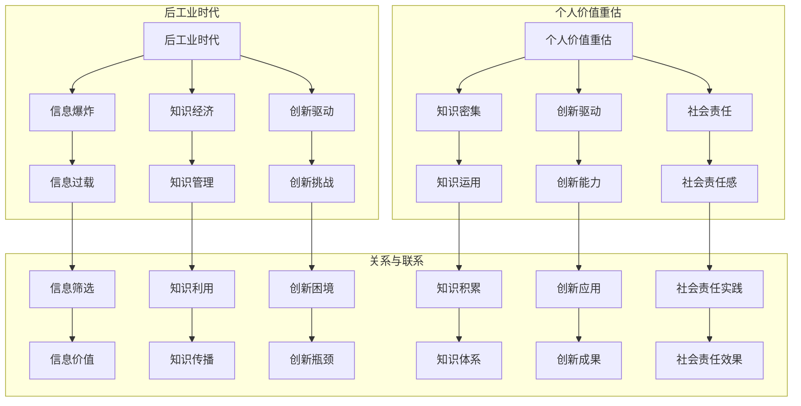

                 

### 引言

#### 1.1 后工业时代的背景

**工业时代的局限性**：在工业革命之后，人类进入了工业时代，这一时期以大规模生产、机械化生产为特征，极大地提高了生产效率。然而，随着经济的发展和社会的进步，工业时代的局限性也逐渐显现出来。例如，环境问题、资源消耗、人力资源浪费等问题日益严重。工业时代的管理模式、生产方式和社会结构，难以满足新时代的需求。

**后工业时代的特征**：后工业时代，也称为信息时代或知识时代，它是以信息技术和知识经济为核心的时代。这一时期的特点是信息爆炸、知识成为最重要的生产要素、创新驱动发展。信息技术的发展，特别是互联网、大数据、人工智能等技术的应用，使得知识的生产、传播和应用变得更加高效和便捷。

**个人价值重估的必要性**：在后工业时代，个人的价值不再仅仅体现在体力劳动和机械操作上，而是更多地体现在知识、创新和创造力上。因此，对个人价值的重估变得尤为必要。个人价值的重估，不仅关系到个人的职业发展和生活质量，也关系到社会的发展和进步。

#### 1.2 核心概念的定义和边界与外延

**后工业时代**：后工业时代是指在工业时代之后，以信息技术和知识经济为核心的时代。它具有信息爆炸、知识成为最重要的生产要素、创新驱动发展等特征。

**个人价值重估**：个人价值重估是指对个人价值进行重新评估和定位，以适应后工业时代的需求。它包括对知识、创新、创造力等个人能力的重视，以及对传统价值观的挑战和反思。

**边界与外延**：后工业时代的边界可以理解为从工业时代向知识时代的转变。个人价值重估的外延则包括对个人能力、社会关系、职业生涯等多个方面的重新评估和定位。

#### 1.3 引言小结

本文旨在探讨后工业时代的个人价值重估问题。通过对后工业时代的背景、核心概念的定义和边界与外延的介绍，我们为后续的理论讲解、案例分析、策略与实践等部分奠定了基础。在后工业时代，个人价值的重估不仅是个人职业发展的需求，也是社会发展的必然趋势。本文将深入探讨这一话题，旨在为读者提供有价值的思考和启示。

### 核心概念与联系

#### 2.1 后工业时代

**定义**：后工业时代是指在工业时代之后，以信息技术和知识经济为核心的时代。这一时期，信息技术的发展和应用成为推动社会进步和经济发展的重要力量。

**特征**：
1. 信息爆炸：互联网、大数据、云计算等技术的发展，使得信息传播速度极快，信息量巨大。
2. 知识经济：知识成为最重要的生产要素，创新和创造力成为推动经济发展的主要动力。
3. 创新驱动：创新成为社会发展的核心，新的技术、产品和服务不断涌现，推动产业升级和社会进步。

**挑战**：
1. 信息过载：信息爆炸带来的挑战之一是信息过载，如何从海量信息中筛选出有价值的信息成为一大难题。
2. 知识管理：如何有效管理和利用知识，提高知识的传播和应用效率，是后工业时代面临的另一大挑战。

#### 2.2 个人价值重估

**定义**：个人价值重估是指对个人价值进行重新评估和定位，以适应后工业时代的需求。它强调知识、创新和创造力在个人价值体系中的重要性。

**意义**：
1. 促进个人职业发展：在后工业时代，个人的职业发展不再仅仅依赖于传统的机械操作和体力劳动，而是更多地依赖于知识和创新能力。
2. 提高生活质量：个人价值重估有助于提高个人在社会中的地位和影响力，进而提高生活质量。
3. 推动社会进步：个人价值重估不仅影响个人的职业发展和生活质量，也关系到社会的发展和进步。

**属性特征**：
1. 知识密集：个人价值重估强调知识的积累和运用，知识成为个人价值的重要组成部分。
2. 创新驱动：创新和创造力在个人价值重估中占据重要地位，创新能力成为个人价值的核心。
3. 社会责任：在后工业时代，个人的社会责任也纳入到个人价值体系之中，社会责任感成为个人价值的重要体现。

#### 2.3 核心概念联系

**关系**：后工业时代和个人价值重估之间存在着密切的联系。后工业时代为个人价值重估提供了背景和条件，而个人价值重估则是后工业时代的必然要求。

**联系图解**：

**属性特征对比表格**：

| 特征 | 后工业时代 | 个人价值重估 |
| :--: | :---------: | :-----------: |
| 信息爆炸 | 信息传播速度快，信息量巨大 | 知识成为主要生产要素，信息筛选能力重要 |
| 知识经济 | 知识成为最重要的生产要素 | 知识积累和运用能力成为个人价值的核心 |
| 创新驱动 | 创新成为社会发展的核心动力 | 创新能力在个人价值体系中占据重要地位 |
| 社会责任 | 社会对个人的社会责任要求高 | 社会责任感成为个人价值的重要体现 |
| 信息过载 | 信息过载带来的挑战 | 如何从信息中获取价值成为个人能力的重要体现 |
| 知识管理 | 有效管理和利用知识 | 知识管理能力对个人职业发展至关重要 |
| 创新挑战 | 创新带来的挑战和机遇 | 创新能力对个人价值的提升具有重要意义 |

通过上述对后工业时代和个人价值重估的定义、特征和联系的介绍，我们可以看出，后工业时代为个人价值重估提供了背景和条件，而个人价值重估则是后工业时代的必然要求。在接下来的章节中，我们将深入探讨后工业时代和个人价值重估的理论基础、方法和策略。

### 理论讲解

#### 3.1 后工业时代的特征

后工业时代，也称为信息时代或知识时代，其特征主要体现在以下几个方面：

1. **信息社会的崛起**：随着互联网、大数据、云计算等技术的发展，信息社会已经到来。信息传播速度快，信息量巨大，信息已经成为社会运转的重要资源。

2. **知识经济的重要性**：知识经济是以知识为主要生产要素的经济形态，知识成为推动经济发展的核心动力。知识经济强调创新和创造力的价值，知识的生产、传播和应用效率成为衡量经济发展水平的重要指标。

3. **创新驱动的发展**：创新成为社会发展的核心驱动力。新的技术、产品和服务不断涌现，推动产业升级和社会进步。创新驱动的发展模式，要求个人和企业具备持续创新的能力。

#### 3.2 个人价值重估的理论基础

个人价值重估的理论基础主要包括以下几个方面：

1. **人本主义哲学**：人本主义哲学强调人的主体地位和价值，认为人的本质在于其具有主观能动性、创造力和自我实现的能力。人本主义哲学为个人价值重估提供了理论基础，强调个人的独特性和价值。

2. **资本主义价值观的挑战**：资本主义价值观强调个人利益最大化，追求物质财富和利润。然而，在后工业时代，这种价值观面临着挑战。个人价值重估要求我们反思和超越资本主义价值观，追求更高层次的价值。

3. **社会责任与道德伦理**：在后工业时代，社会责任和道德伦理成为个人价值的重要组成部分。个人不仅要追求个人利益，还要关注社会利益，承担社会责任。社会责任与道德伦理的实践，有助于提升个人的社会地位和影响力。

#### 3.3 个人价值重估的方法和策略

个人价值重估的方法和策略主要包括以下几个方面：

1. **教育体系的变革**：教育体系需要适应后工业时代的需求，培养具有创新能力和创造力的人才。教育体系应注重培养学生的综合素质，包括知识、技能、道德和社会责任感。

2. **职业生涯规划**：个人应根据自己的兴趣、能力和市场需求，制定合理的职业生涯规划。职业生涯规划有助于个人明确发展方向，实现个人价值。

3. **创业与创新**：创业是个人实现价值的重要途径。个人应积极投身于创新创业领域，通过创新来实现个人价值。创新不仅体现在技术层面，还包括商业模式、管理方法等多个方面。

通过上述理论讲解，我们可以看到，后工业时代的特征为个人价值重估提供了背景和条件，而个人价值重估则是对后工业时代的必然回应。在接下来的章节中，我们将通过具体案例来展示个人价值重估的应用和实践。

### 案例分析

#### 4.1 案例一：数字化转型中的个人价值重估

**案例背景**：
随着互联网技术的飞速发展，全球企业纷纷推进数字化转型，以提升效率和竞争力。某知名制造业公司在数字化转型过程中，面临如何重新评估和定位员工个人价值的挑战。

**案例分析**：
在数字化转型过程中，公司的生产流程、管理方式、商业模式都发生了巨大变化。传统的机械操作工需要转变为数字化技能人才，如数据分析师、人工智能工程师等。公司通过以下措施来实现个人价值重估：

1. **培训与提升**：公司为员工提供数字化技能培训，帮助他们掌握数据分析、人工智能等新技能。通过培训，员工的知识水平和创新能力得到提升。

2. **激励机制**：公司设立创新奖项，鼓励员工提出创新建议和解决方案。员工通过创新，不仅提升了个人价值，也为公司创造了实际价值。

3. **职业生涯规划**：公司为员工提供个性化的职业生涯规划，帮助员工明确职业发展方向，实现个人价值。

**案例启示**：
该案例表明，在数字化转型过程中，个人价值重估是必不可少的。通过培训、激励和职业生涯规划，企业可以提升员工的数字化技能和创新能力，实现个人价值和企业价值的双赢。

#### 4.2 案例二：人工智能时代的个人价值重估

**案例背景**：
随着人工智能技术的快速发展，各行各业都受到其深远影响。某金融公司引入人工智能技术，以提高业务效率和客户体验。然而，这一变革也带来了员工个人价值重估的挑战。

**案例分析**：
在人工智能时代，金融公司的业务流程、决策方式都发生了变化。传统的人工岗位逐渐被人工智能系统取代，员工需要适应新的工作环境，提升自身的技能和知识。

1. **技能升级**：公司为员工提供人工智能相关技能培训，帮助他们掌握人工智能技术的基本原理和应用。员工通过培训，提高了自身的竞争力。

2. **角色转变**：员工从传统的人工岗位转变为人工智能的辅助者，他们的工作重点从简单的数据处理转向复杂的问题解决和决策支持。

3. **绩效评估**：公司调整了绩效评估体系，不仅关注员工的日常工作表现，还关注他们在人工智能应用中的创新和贡献。

**案例启示**：
人工智能时代要求员工具备更高的技能和知识，同时也为他们提供了更多的机会。通过技能培训、角色转变和绩效评估调整，企业可以更好地实现个人价值重估，提升整体竞争力。

### 结论

通过上述案例分析，我们可以看到，在数字化转型和人工智能时代，个人价值重估至关重要。企业通过培训、激励和职业生涯规划等手段，帮助员工适应新技术环境，提升个人价值。同时，个人也需不断学习新技能，适应时代变化，实现个人价值。在后工业时代，个人价值重估不仅关乎个人的职业发展，也关系到社会的发展与进步。

### 策略与实践

#### 5.1 个人价值重估的最佳实践

在后工业时代，个人价值重估的最佳实践主要包括以下几个方面：

1. **教育与培训**：个人应持续关注行业发展趋势和新技术，积极参加各类培训，提升自身知识和技能。通过不断学习和实践，适应新技术环境，提升个人价值。

2. **职业生涯规划**：个人应根据自身兴趣和市场需求，制定明确的职业生涯规划。规划应包括短期和长期目标，以及实现目标的步骤和策略。通过明确的规划，个人可以更有针对性地提升自身能力。

3. **创新与创业**：个人应积极投身于创新创业领域，通过创新来实现个人价值。创新不仅体现在技术层面，还包括商业模式、管理方法等多个方面。通过创业，个人不仅可以实现自身价值，还可以为社会创造价值。

4. **社会责任与道德伦理**：个人应关注社会责任，积极参与社会公益事业，体现自身的价值。同时，个人在追求个人利益的同时，也应遵循道德伦理，做到公正、公平、透明。

#### 5.2 个人价值重估的工具和技术

在个人价值重估过程中，以下工具和技术可以提供支持：

1. **数据分析与决策支持**：通过数据分析，个人可以更好地了解市场需求和自身优势，制定更合理的职业规划。数据分析工具如Excel、Python等，可以帮助个人进行数据分析和决策。

2. **云计算与大数据技术**：云计算和大数据技术为个人提供了强大的数据存储和处理能力。通过云计算平台，个人可以便捷地获取和处理大量数据，提升自身能力。

3. **人工智能与机器学习**：人工智能和机器学习技术可以帮助个人实现智能化决策和优化。通过训练模型，个人可以学会如何更好地应对复杂问题，提升工作效率。

#### 5.3 注意事项

在个人价值重估过程中，以下事项需要特别注意：

1. **避免盲目跟风**：在新技术层出不穷的时代，个人应保持独立思考，避免盲目跟风。应根据自己的实际情况和需求，选择适合自己的技术和方向。

2. **保持持续学习**：持续学习是提升个人价值的关键。个人应养成定期学习的好习惯，不断更新知识和技能，适应时代变化。

3. **关注社会责任**：在追求个人价值的过程中，个人应关注社会责任，积极参与社会公益事业，体现自身的价值。

### 小结

个人价值重估是后工业时代的必然要求。通过教育与培训、职业生涯规划、创新与创业、社会责任与道德伦理等最佳实践，个人可以更好地适应时代变化，提升自身价值。同时，通过数据分析与决策支持、云计算与大数据技术、人工智能与机器学习等工具和技术的应用，个人可以更高效地实现个人价值。在个人价值重估的过程中，保持持续学习、避免盲目跟风、关注社会责任至关重要。

### 结论

#### 6.1 全书小结

本文围绕《后工业时代的个人价值重估》这一主题，系统地探讨了后工业时代的背景、核心概念与联系、理论基础、方法和策略，并通过具体案例展示了个人价值重估的应用与实践。通过本文的阐述，我们可以清晰地认识到，后工业时代为个人价值重估提供了新的机遇和挑战。在这一时代背景下，个人价值不再仅仅取决于传统的劳动力和机械操作能力，而是更多地体现在知识、创新和创造力上。

本文的主要观点可以概括为以下几点：

1. 后工业时代是以信息技术和知识经济为核心的时代，这一时代特征是信息爆炸、知识经济和创新驱动。
2. 个人价值重估是对个人价值进行重新评估和定位，以适应后工业时代的需求。这一过程强调知识、创新和创造力的重要性。
3. 个人价值重估不仅是个人职业发展的需求，也是社会发展的必然趋势。它有助于提升个人在社会中的地位和影响力，推动社会进步。
4. 个人价值重估的最佳实践包括教育与培训、职业生涯规划、创新与创业、社会责任与道德伦理等。同时，工具和技术的应用也为个人价值重估提供了支持。

#### 6.1.1 后工业时代的个人价值重估的重要性

后工业时代的个人价值重估具有重要意义。首先，它有助于个人更好地适应时代变化，提升自身竞争力。在信息技术和知识经济迅猛发展的背景下，个人需要不断更新知识和技能，才能跟上时代的发展。其次，个人价值重估有助于提升个人的社会地位和影响力。通过知识和创新能力的提升，个人可以在职业生涯中获得更高的地位和更大的影响力。最后，个人价值重估有助于推动社会进步。当更多的人开始重视个人价值时，整个社会将更加重视知识和创新，从而促进社会的发展和进步。

#### 6.1.2 现阶段个人价值重估的成果

在现阶段，个人价值重估已经取得了一定的成果。首先，越来越多的人开始重视自身的学习和技能提升，通过参加各种培训课程、自学和线上学习等方式，不断提升自己的知识和能力。其次，创新和创业氛围日益浓厚，越来越多的人投身于创新创业领域，通过创新来实现个人价值。此外，社会责任和道德伦理观念也逐渐深入人心，越来越多的人开始关注社会问题，积极参与公益事业，体现自身的价值。

#### 6.1.3 未来个人价值重估的发展趋势

未来个人价值重估将呈现以下发展趋势：

1. **知识化**：随着信息技术的发展，知识将成为个人价值的重要体现。个人将更加注重知识的积累和运用，通过不断学习和创新来提升自身价值。
2. **创新化**：创新将成为个人价值的核心。个人将通过不断创新来适应时代变化，实现个人价值。
3. **多元化**：个人价值将更加多元化，不仅仅体现在职业发展上，还体现在社会责任、道德伦理等多个方面。
4. **国际化**：随着全球化的发展，个人价值将更加国际化。个人需要具备全球视野，了解不同国家和地区的文化和需求，以实现个人价值的最大化。

#### 6.2 展望与建议

为了更好地实现个人价值重估，本文提出以下展望与建议：

1. **政策支持**：政府应出台相关政策，鼓励和支持个人价值重估。例如，提供教育培训补贴、创业支持政策等，帮助个人提升自身能力和实现价值。
2. **社会宣传**：加强社会宣传，提高公众对个人价值重估的认识和重视。通过媒体、教育等渠道，传播个人价值重估的理念和重要性。
3. **企业参与**：企业应积极参与个人价值重估，为员工提供良好的发展环境和机会。通过培训、激励等措施，帮助员工提升个人价值。
4. **个人实践**：个人应主动参与个人价值重估，制定明确的职业规划，不断提升自身知识和技能。同时，关注社会责任，积极参与社会公益事业。

通过以上措施，个人价值重估将得到更好的实施和发展，为个人和社会的发展带来更大的价值。

### 展望与建议

#### 6.2.1 后续研究方向

在后工业时代，个人价值重估的研究方向可以进一步拓展和深化。以下是一些值得探讨的后续研究方向：

1. **跨学科研究**：个人价值重估不仅涉及经济学、社会学等领域，还可以结合心理学、管理学等学科，从不同角度进行深入分析。
2. **数据分析**：利用大数据和人工智能技术，对个人价值重估的过程和结果进行数据分析，以揭示其中的规律和趋势。
3. **国际比较**：对不同国家和地区在个人价值重估方面的实践进行比较研究，探讨不同文化背景下个人价值重估的差异和共性。
4. **案例分析**：通过具体案例分析，探讨个人价值重估在不同行业和企业中的应用效果，总结最佳实践和成功经验。

#### 6.2.2 政策建议

为了更好地推动个人价值重估，政府可以从以下几个方面提出政策建议：

1. **教育培训**：增加对教育和培训的投入，提高教育质量，培养具备创新能力和创造力的高素质人才。
2. **创业支持**：提供税收减免、融资支持等政策，鼓励个人创业和创新，创造更多就业机会。
3. **社会保障**：完善社会保障体系，保障个人在职业生涯中的权益，减少因职业转型带来的风险。
4. **公共服务**：提升公共服务水平，为个人提供更多职业发展机会和资源，帮助个人实现价值。

#### 6.2.3 个人实践建议

对于个人而言，以下是一些实践建议，以实现个人价值重估：

1. **终身学习**：培养持续学习的习惯，关注行业动态，不断提升自身知识和技能。
2. **职业规划**：制定明确的职业规划，设定短期和长期目标，为实现个人价值做好准备。
3. **创新实践**：积极参与创新项目，通过实践提升创新能力，为个人和社会创造更多价值。
4. **社会责任**：关注社会问题，积极参与公益事业，体现个人价值。

通过以上措施，个人可以在后工业时代实现个人价值重估，为社会发展和进步贡献力量。

### 作者信息

**作者：AI天才研究院/AI Genius Institute & 禅与计算机程序设计艺术 /Zen And The Art of Computer Programming**

感谢您阅读本文，希望本文能为您在后工业时代的个人价值重估提供有益的思考和启示。如果您有任何疑问或建议，欢迎随时与我们联系。期待与您共同探讨后工业时代个人价值重估的更多话题。

