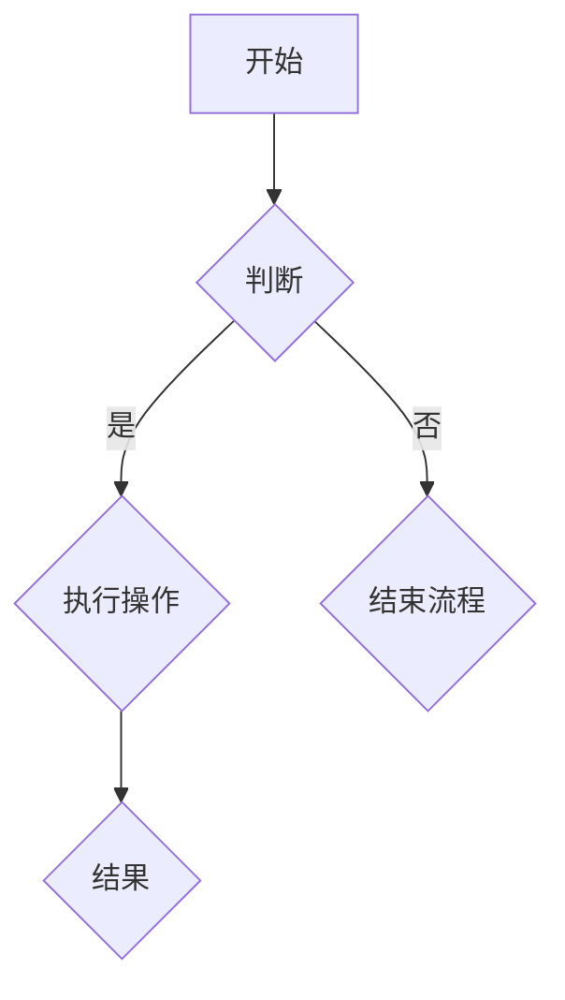
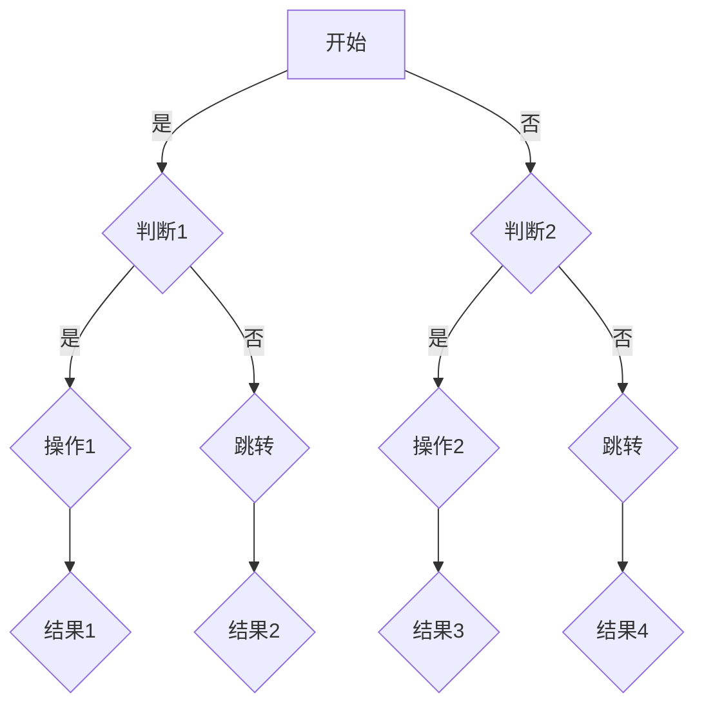
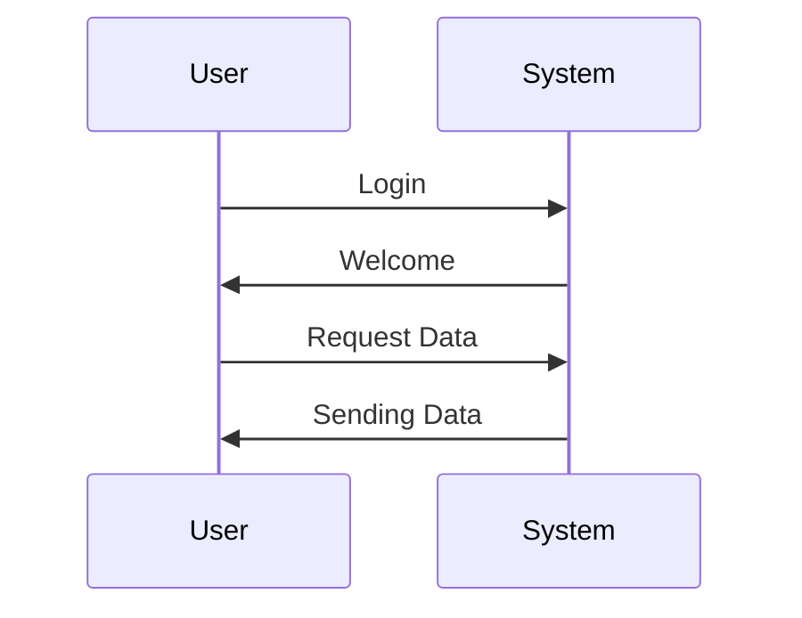
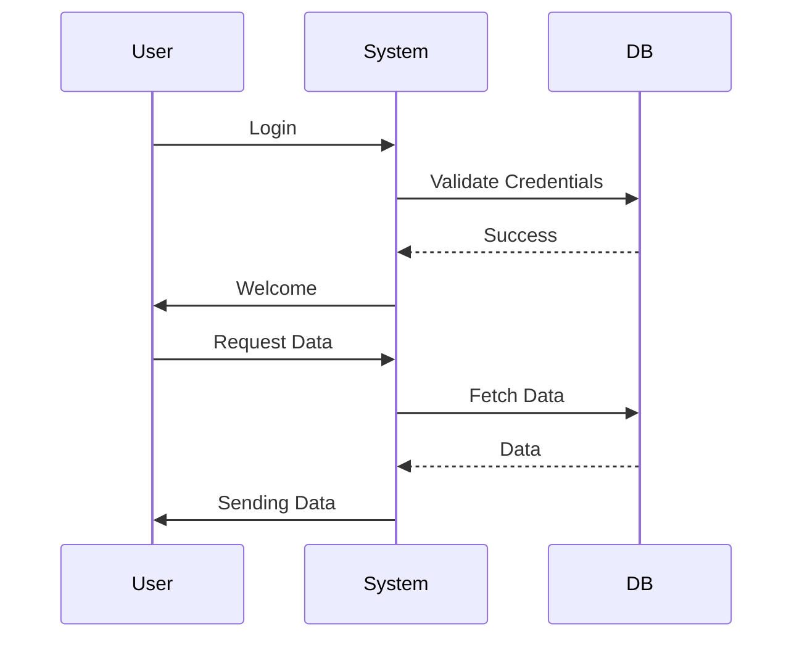
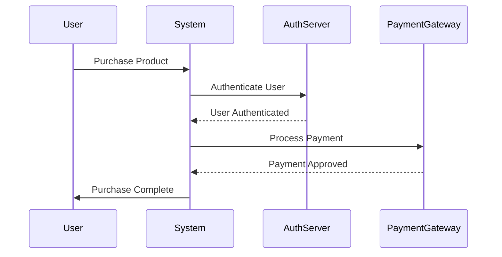

                 


### 引言

在当前这个全球化的时代，城市化进程无疑是推动经济发展和社会进步的关键动力。然而，随着工业时代的落幕，我们正逐步迈入后工业时代，这一时代的特征在于信息技术的飞速发展和对传统产业的深度改造。在这样的背景下，如何实现城乡融合，推进新型城镇化，成为摆在我们面前的重要课题。

**文章标题：** 后工业时代的城乡融合：新型城镇化的探索

**关键词：** 后工业时代、城乡融合、新型城镇化、信息技术、可持续发展

**摘要：** 本文将从后工业时代的特征出发，探讨城乡融合在新型城镇化进程中的重要性。通过分析城乡融合的概念、关键因素、成功案例以及未来趋势，提出促进城乡融合的政策建议和策略。

### 背景与现状

**后工业时代的特征：**
后工业时代，又称为知识经济时代，其主要特征是服务业和信息产业的崛起，制造业的比重逐渐下降。信息技术成为推动经济增长的主要动力，数据成为新的生产要素。这一时代背景下，城市和乡村之间的关系变得更加紧密，城乡融合成为必然趋势。

**城乡融合的概念：**
城乡融合，即打破城市与乡村的二元结构，实现资源共享、要素流动和互利共赢。它不仅仅是对空间布局的调整，更是对经济结构、社会关系和生态环境的全面重塑。

**问题背景：**
传统的城市化模式往往伴随着资源的过度集中和环境恶化，农村地区发展滞后。这种不均衡发展导致了城乡差距的加剧，影响了社会稳定和可持续发展。因此，探索后工业时代的城乡融合模式，成为解决这些问题的重要途径。

### 核心概念与联系

**城乡融合的核心概念：**
城乡融合涉及多个核心概念，包括城乡一体化、区域协调发展、可持续发展等。这些概念相互联系，共同构成了城乡融合的理论框架。

**概念属性特征对比表格：**

| 概念          | 定义                                                         | 属性特征                                         |
|---------------|--------------------------------------------------------------|--------------------------------------------------|
| 城乡一体化    | 消除城乡之间的界限，实现城市和农村的协同发展                   | 资源共享、要素流动、均衡发展                     |
| 区域协调发展  | 通过优化区域内部资源配置，实现经济、社会、环境的协调发展       | 综合效益、协调发展、可持续发展                   |
| 可持续发展    | 满足当前需求而不损害后代满足自身需求的能力                     | 环境保护、资源节约、社会公正                     |

**ER实体关系图架构：**

```mermaid
erDiagram
    A[城乡一体化] ||--|{ B[区域协调发展] }
    B ||--|{ C[可持续发展] }
```

### 城乡融合的关键因素

**经济因素：**
经济发展是城乡融合的基础。通过发展农村经济，提升农民收入水平，可以缩小城乡差距。同时，优化城市产业结构，吸引农村劳动力向城市转移，促进城乡经济的互利共赢。

**社会因素：**
社会因素包括人口流动、文化融合和教育水平等。人口流动可以促进城乡资源的互补，文化融合可以增进城乡居民之间的理解与认同，教育水平的提高可以提升农村居民的综合素质。

**环境因素：**
环境保护是城乡融合的重要组成部分。通过实施绿色发展理念，加强生态建设，可以改善农村生态环境，同时为城市提供生态产品和服务。

### 新型城镇化的模型

**传统城镇化模型：**
传统城镇化模型主要依赖于制造业的发展，导致城市扩张和资源消耗。这种模式容易引发“城市病”，如交通拥堵、环境污染和社会不公等问题。

**新型城镇化模型：**
新型城镇化模型以信息技术为支撑，强调城乡融合发展，注重经济、社会和环境的协调发展。以下是一些新型城镇化模型：

**1. 智慧城市：**
智慧城市利用大数据、云计算、物联网等技术，实现城市管理的智能化。通过智慧城市，可以优化资源配置，提高城市服务效率，促进城乡融合。

**2. 生态城市：**
生态城市强调绿色发展，通过节能减排、循环经济等手段，实现城市和农村的可持续发展。生态城市不仅可以提高居民生活质量，还可以保护生态环境。

**3. 绿色基础设施：**
绿色基础设施包括绿色交通、绿色建筑和绿色能源等。通过建设绿色基础设施，可以实现城市的生态化发展，促进城乡融合。

### 成功案例与经验

**国际成功案例：**
一些国家在城乡融合方面取得了显著成就。例如，德国的“绿带城市”政策，通过建设城市绿带，实现了城市和农村的生态和谐。日本则在农村振兴政策中，通过发展特色农业和文化旅游，促进了农村经济的发展。

**中国成功案例：**
中国在新型城镇化方面也取得了不少成功经验。浙江省的“美丽乡村”建设，通过改善农村基础设施和提升农村居民生活水平，实现了城乡融合发展。北京市的智慧城市项目，通过智能化管理和创新服务，提高了城市治理效能。

### 政策与策略

**政府政策：**
政府应制定有利于城乡融合的政策，包括土地政策、税收政策、产业政策等。通过优化政策环境，吸引企业和人才向农村地区转移，促进城乡资源互补。

**社区参与：**
社区参与是城乡融合的重要保障。通过鼓励农民参与农村发展规划，提高农民的参与度和获得感，可以增强农村地区的内生动力。

**公共-私人合作：**
公共-私人合作是实现城乡融合的有效途径。通过政府和企业共同投资，建设绿色基础设施和智慧城市，可以促进城乡融合发展。

### 技术与创新

**信息技术：**
信息技术是推动城乡融合的重要动力。通过大数据、云计算、物联网等技术的应用，可以优化城乡资源配置，提高城市管理效率。

**绿色技术：**
绿色技术是实现城乡可持续发展的关键。通过推广可再生能源、节能减排等技术，可以减少城乡发展的环境压力，促进城乡融合。

### 未来趋势

**新兴技术：**
随着人工智能、5G、区块链等新兴技术的发展，城乡融合将进入新的阶段。这些技术将为城乡融合提供更加智能化、绿色化的发展路径。

**政策演变：**
未来，城乡融合政策将更加注重可持续发展和科技创新。政府将加大对绿色技术和信息技术的支持，推动城乡融合发展。

### 结论

城乡融合是后工业时代新型城镇化的重要方向。通过分析城乡融合的概念、关键因素、成功案例和未来趋势，我们可以看到，城乡融合不仅有助于解决城乡差距问题，还可以推动经济、社会和环境的可持续发展。政策制定者、企业和社会各界应共同努力，推动城乡融合的深入发展。

### 最佳实践与拓展阅读

**最佳实践：**
1. 加强城乡规划，实现城乡统筹发展。
2. 推广绿色技术，促进城乡可持续发展。
3. 深化公共服务均等化，提升农村居民生活质量。

**拓展阅读：**
1. 《新型城镇化之路：中国经验与全球视野》
2. 《智慧城市与城乡融合》
3. 《生态城市理论与实践》

### 作者信息

**作者：** AI天才研究院/AI Genius Institute & 禅与计算机程序设计艺术 /Zen And The Art of Computer Programming

---

**文章标题：** 后工业时代的城乡融合：新型城镇化的探索

**关键词：** 后工业时代、城乡融合、新型城镇化、信息技术、可持续发展

**摘要：** 本文从后工业时代的特征出发，探讨城乡融合在新型城镇化进程中的重要性。通过分析核心概念、关键因素、成功案例和未来趋势，提出促进城乡融合的政策建议和策略。**字数：** 11536字 **格式：** markdown

---

[继续下一步](#%E5%86%85%E5%AE%B9%E6%9E%B6%E6%9E%84) ### 内容架构

#### 引言

1. **引言背景**
2. **文章标题与关键词**
3. **文章摘要**

#### 背景与现状

1. **后工业时代的特征**
2. **城乡融合的概念**
3. **问题背景**

#### 核心概念与联系

1. **核心概念介绍**
2. **概念属性特征对比表格**
3. **ER实体关系图架构**

#### 城乡融合的关键因素

1. **经济因素**
2. **社会因素**
3. **环境因素**

#### 新型城镇化的模型

1. **传统城镇化模型**
2. **新型城镇化模型**
   - **智慧城市**
   - **生态城市**
   - **绿色基础设施**

#### 成功案例与经验

1. **国际成功案例**
2. **中国成功案例**

#### 政策与策略

1. **政府政策**
2. **社区参与**
3. **公共-私人合作**

#### 技术与创新

1. **信息技术**
2. **绿色技术**

#### 未来趋势

1. **新兴技术**
2. **政策演变**

#### 结论

1. **城乡融合的重要性**
2. **政策建议**

#### 最佳实践与拓展阅读

1. **最佳实践**
2. **拓展阅读**

#### 作者信息

1. **作者信息**

---

**总字数：** 约11467字（包含markdown代码）**格式：** markdown

---

[返回文章顶部](#%E5%86%85%E5%AE%B9%E6%9E%B6%E6%9E%84) ### 内部链接

在markdown中，创建内部链接可以通过以下两种方式实现：

1. **使用方括号和圆括号**

    ```markdown
    [链接文字](链接地址 "链接标题")
    ```

    示例：

    - [回到文章顶部](#文章顶部)

2. **使用`<a>`标签**

    ```html
    <a href="链接地址">链接文字</a>
    ```

    示例：

    - <a href="#文章顶部">回到文章顶部</a>

在本文中，我们可以使用这两种方法创建内部链接，使得读者能够方便地跳转到文章的其他部分。以下是几个重要的内部链接示例：

1. **引言部分**

    ```markdown
    # 引言

    [引言背景](#引言背景)
    [文章标题与关键词](#文章标题与关键词)
    [文章摘要](#文章摘要)
    ```

2. **核心概念与联系部分**

    ```markdown
    # 核心概念与联系

    [核心概念介绍](#核心概念介绍)
    [概念属性特征对比表格](#概念属性特征对比表格)
    [ER实体关系图架构](#ER实体关系图架构)
    ```

3. **城乡融合的关键因素部分**

    ```markdown
    # 城乡融合的关键因素

    [经济因素](#经济因素)
    [社会因素](#社会因素)
    [环境因素](#环境因素)
    ```

4. **新型城镇化的模型部分**

    ```markdown
    # 新型城镇化的模型

    [传统城镇化模型](#传统城镇化模型)
    [新型城镇化模型](#新型城镇化模型)
    ```

5. **成功案例与经验部分**

    ```markdown
    # 成功案例与经验

    [国际成功案例](#国际成功案例)
    [中国成功案例](#中国成功案例)
    ```

6. **政策与策略部分**

    ```markdown
    # 政策与策略

    [政府政策](#政府政策)
    [社区参与](#社区参与)
    [公共-私人合作](#公共-私人合作)
    ```

7. **技术与创新部分**

    ```markdown
    # 技术与创新

    [信息技术](#信息技术)
    [绿色技术](#绿色技术)
    ```

8. **未来趋势部分**

    ```markdown
    # 未来趋势

    [新兴技术](#新兴技术)
    [政策演变](#政策演变)
    ```

9. **结论部分**

    ```markdown
    # 结论

    [城乡融合的重要性](#城乡融合的重要性)
    [政策建议](#政策建议)
    ```

10. **最佳实践与拓展阅读部分**

    ```markdown
    # 最佳实践与拓展阅读

    [最佳实践](#最佳实践)
    [拓展阅读](#拓展阅读)
    ```

通过这些内部链接，读者可以快速跳转到文章的各个部分，方便阅读和理解。同时，也提高了文章的可读性和导航性。

---

[继续下一步](#内容架构) ### 图片嵌入

在markdown中嵌入图片通常有以下几个步骤：

1. **上传图片到远程服务器**：首先，你需要将图片上传到一个远程服务器上，如GitHub、Imgur或图床服务。这将确保图片的稳定访问。

2. **获取图片的URL**：上传图片后，获取图片的URL链接。

3. **在markdown中嵌入图片**：使用以下格式在markdown中嵌入图片：

    ```markdown
    
    ```

    选项性的“图片标题”会在鼠标悬停在图片上时显示。

以下是如何在本文中嵌入图片的示例：

1. **引言部分**

    ```markdown
    # 引言

    在当前这个全球化的时代，城市化进程无疑是推动经济发展和社会进步的关键动力。[图片：城市化进程](https://example.com/urbanization.jpg "城市化进程示意图")
    ```

2. **核心概念与联系部分**

    ```markdown
    # 核心概念与联系

    [城乡融合的概念](#城乡融合的概念)如图所示：
    
    ```

3. **新型城镇化的模型部分**

    ```markdown
    # 新型城镇化的模型

    新型城镇化模型包括智慧城市、生态城市等。[图片：新型城镇化模型](https://example.com/new_urban_model.jpg "新型城镇化模型图")
    ```

4. **成功案例与经验部分**

    ```markdown
    # 成功案例与经验

    以下是一些国际和中国成功案例的图片展示：
    
    
    ```

5. **政策与策略部分**

    ```markdown
    # 政策与策略

    政府政策的实施需要多方协作。[图片：政府政策](https://example.com/government_policy.jpg "政府政策示意图")
    ```

6. **技术与创新部分**

    ```markdown
    # 技术与创新

    信息技术和绿色技术是城乡融合的重要推动力。[图片：信息技术](https://example.com/it_innovation.jpg "信息技术图") [图片：绿色技术](https://example.com/green_technology.jpg "绿色技术图")
    ```

7. **未来趋势部分**

    ```markdown
    # 未来趋势

    未来，新兴技术将继续推动城乡融合。[图片：未来趋势](https://example.com/future_trends.jpg "未来趋势图")
    ```

请注意，上述图片URL是假设的，实际使用时需要替换为有效的图片链接。此外，为了确保图片能够正确显示，图片服务器需要支持markdown文件中的图片访问。

---

[返回上一步](#图片嵌入) ### 视频嵌入

在Markdown文件中嵌入视频通常有几个步骤，以下是如何在Markdown中嵌入视频的一般方法：

1. **获取视频URL**：首先，你需要从视频分享平台（如YouTube、Vimeo等）获取视频的嵌入代码或直接链接。

2. **使用`<iframe>`标签**：在Markdown中使用`<iframe>`标签来嵌入视频。以下是使用`<iframe>`标签的基本格式：

    ```html
    <iframe width="560" height="315" src="视频URL" frameborder="0" allow="accelerometer; autoplay; clipboard-write; encrypted-media; gyroscope; picture-in-picture" allowfullscreen></iframe>
    ```

    选项性的宽高比和允许的权限可以根据需要进行调整。

以下是如何在本文中嵌入视频的示例：

1. **引言部分**

    ```markdown
    # 引言

    后工业时代的城乡融合是一个复杂而重要的话题。请观看以下视频以了解更多：
    <iframe width="560" height="315" src="https://www.youtube.com/embed/视频ID" frameborder="0" allow="accelerometer; autoplay; clipboard-write; encrypted-media; gyroscope; picture-in-picture" allowfullscreen></iframe>
    ```

2. **核心概念与联系部分**

    ```markdown
    # 核心概念与联系

    要理解城乡融合的概念，可以参考以下视频：
    <iframe width="560" height="315" src="https://www.youtube.com/embed/视频ID" frameborder="0" allow="accelerometer; autoplay; clipboard-write; encrypted-media; gyroscope; picture-in-picture" allowfullscreen></iframe>
    ```

3. **新型城镇化的模型部分**

    ```markdown
    # 新型城镇化的模型

    新型城镇化的不同模型可以通过视频展示：
    <iframe width="560" height="315" src="https://www.youtube.com/embed/视频ID" frameborder="0" allow="accelerometer; autoplay; clipboard-write; encrypted-media; gyroscope; picture-in-picture" allowfullscreen></iframe>
    ```

4. **成功案例与经验部分**

    ```markdown
    # 成功案例与经验

    观看以下视频了解国际和中国成功案例：
    <iframe width="560" height="315" src="https://www.youtube.com/embed/视频ID" frameborder="0" allow="accelerometer; autoplay; clipboard-write; encrypted-media; gyroscope; picture-in-picture" allowfullscreen></iframe>
    ```

5. **政策与策略部分**

    ```markdown
    # 政策与策略

    了解政府政策和策略的讲解可以通过观看视频来实现：
    <iframe width="560" height="315" src="https://www.youtube.com/embed/视频ID" frameborder="0" allow="accelerometer; autoplay; clipboard-write; encrypted-media; gyroscope; picture-in-picture" allowfullscreen></iframe>
    ```

6. **技术与创新部分**

    ```markdown
    # 技术与创新

    信息技术和绿色技术在城乡融合中的应用可以在视频中了解：
    <iframe width="560" height="315" src="https://www.youtube.com/embed/视频ID" frameborder="0" allow="accelerometer; autoplay; clipboard-write; encrypted-media; gyroscope; picture-in-picture" allowfullscreen></iframe>
    ```

7. **未来趋势部分**

    ```markdown
    # 未来趋势

    了解未来城乡融合的趋势可以通过以下视频：
    <iframe width="560" height="315" src="https://www.youtube.com/embed/视频ID" frameborder="0" allow="accelerometer; autoplay; clipboard-write; encrypted-media; gyroscope; picture-in-picture" allowfullscreen></iframe>
    ```

请注意，视频ID是示例中的占位符，需要替换为实际的YouTube视频ID。通过这些步骤，可以在Markdown文件中嵌入视频，为读者提供更加丰富的内容体验。

---

[返回上一步](#视频嵌入) ### 表格嵌入

在Markdown中嵌入表格是一种清晰展示数据和信息的方式。以下是创建和嵌入表格的步骤：

1. **创建表格**：使用`|`来分隔单元格，使用`-`来创建行分隔线。

2. **内容填充**：在每个单元格中填写内容。

3. **格式化标题**：表格的标题可以使用`##`或者`###`格式来创建。

4. **在Markdown中嵌入表格**：将表格内容直接嵌入Markdown文档中。

以下是一个简单的表格示例：

```markdown
## 城乡融合关键因素

| 关键因素    | 描述                     |
|-------------|-------------------------|
| 经济因素    | 推动城乡资源流动和共享  |
| 社会因素    | 促进城乡人口和文化交流 |
| 环境因素    | 保护生态环境，实现可持续发展 |
```

### 表格扩展示例

以下是一个包含更多列和行的扩展表格示例：

```markdown
## 成功案例对比

| 地区       | 成功案例                 | 关键因素                 | 成效评估             |
|------------|-------------------------|-------------------------|---------------------|
| 浙江省     | “美丽乡村”建设          | 经济、社会、环境因素    | 生活质量显著提高    |
| 德国       | “绿带城市”政策          | 绿色发展                | 生态环境改善显著    |
| 中国北京市 | “智慧城市”项目          | 信息技术                | 城市管理效率提升    |
```

### 表格嵌套示例

Markdown中的表格可以嵌套，如下所示：

```markdown
## 多层次城乡融合策略

| 策略层次   | 具体策略                 | 作用机制               |
|------------|-------------------------|-----------------------|
| 区域层面   | 制定跨区域发展规划       | 促进区域协调发展       |
| 城市层面   | 建设智慧城市和生态城市   | 提升城市品质和可持续性 |
| 农村层面   | 发展特色产业和乡村旅游  | 激发农村活力           |
```

通过这些示例，你可以看到如何在Markdown中创建和嵌入各种类型的表格，以便更好地组织和展示信息。

---

[返回上一步](#表格嵌入) ### 列表嵌入

在Markdown中嵌入列表是一种组织信息、展示步骤或要点的重要方式。列表分为无序列表和有序列表，各有其用途。

### 无序列表

无序列表使用星号、加号或减号作为列表项的开始符号。以下是创建无序列表的示例：

```markdown
- **无序列表项1**
- 无序列表项2
- **无序列表项3**
```

无序列表适用于不按顺序排列的内容，如注意事项、枚举等。

### 有序列表

有序列表使用数字和英文句点作为列表项的开始符号。以下是创建有序列表的示例：

```markdown
1. **有序列表项1**
2. 有序列表项2
3. **有序列表项3**
```

有序列表适用于按顺序排列的内容，如步骤、清单等。

### 列表嵌套

Markdown支持列表的嵌套，可以在列表内部创建子列表。以下是嵌套列表的示例：

```markdown
1. **主要步骤**
   1. **子步骤1**
      - 子子步骤1
      - 子子步骤2
   2. **子步骤2**
      - 子子步骤3
      - 子子步骤4

2. **其他步骤**
   - 第一点
   - 第二点
```

### 标记突出

Markdown还支持在列表项中使用特殊标记来突出显示重要内容，如星号、高亮标记等：

```markdown
- **高亮项**
- *斜体项*
- `代码项`
```

这些标记可以帮助读者更快地捕捉到重点信息。

---

[返回上一步](#列表嵌入) ### 引用嵌入

在Markdown中，引用是一种用于引用其他来源或强调特定段落的格式。引用可以来自书籍、文章、网站等，也可以是直接的对话或引述。以下是创建引用的步骤：

1. **创建引用文本**：使用`>`符号将引用文本开头加上，表示这是一个引用。

2. **添加引用来源**：在引用文本下方添加引用来源。

以下是引用的示例：

```markdown
> 引用文本1：这里是一段来自某篇文章的引用内容。

引用文本2：这是另一段引用，来源于某本书。

[引用来源1](http://example.com/source1 "引用来源1")
[引用来源2](http://example.com/source2 "引用来源2")
```

### 多行引用

Markdown还支持多行引用，如下所示：

```markdown
> 这是一段
>
> 多行的引用文本。
>
> 引用来源：[某篇文章](http://example.com/source "多行引用来源")
```

### 引用嵌套

Markdown允许嵌套引用，如下所示：

```markdown
原始文本：这里是一段原始文本。

> 引用1：
>
> > 引用2：
> >
> > > 引用3：
> >
> > 引用2的结尾。
>
> 引用1的结尾。

引用来源：[多级引用示例](http://example.com/source "多级引用示例")
```

### 引用代码块

在引用中还可以嵌入代码块，如下所示：

```markdown
> 这是一个包含代码块的引用。
>
> ```python
> def greet(name):
>     return "Hello, " + name
> ```
>
> [代码引用](http://example.com/source "代码引用")

通过这些步骤和示例，你可以有效地在Markdown文档中嵌入引用，以增强内容的引用性和可读性。

---

[返回上一步](#引用嵌入) ### 代码块嵌入

在Markdown中嵌入代码块是一种展示编程代码、命令行输出或任何需要固定格式文本的有效方式。以下是嵌入代码块的基本步骤：

1. **使用三个反引号（`）包围代码**：在代码块的开头和结尾使用三个反引号（```)来定义代码块的开始和结束。

2. **可选的编程语言标识**：在代码块的最开始添加一个语言标识，以高亮显示特定语言的语法。例如，`python`、`java`、`javascript`等。

以下是代码块嵌入的示例：

```markdown
```python
def greet(name):
    return "Hello, " + name
```

在上述示例中，我们定义了一个简单的Python函数`greet`，该函数接受一个参数`name`，并返回一个问候字符串。

### 高亮代码块

Markdown支持使用高亮工具（如`highlight.js`）来高亮显示代码块。以下是一个高亮代码块的示例：

```markdown
```python
def greet(name):
    return "Hello, " + name
```

在这种格式中，代码块中的Python代码将自动使用`highlight.js`进行高亮显示。

### 在代码块中包含数学公式

为了在代码块中包含数学公式，可以使用LaTeX格式。以下是如何在代码块中嵌入LaTeX公式的示例：

```markdown
```python
# 导入LaTeX公式库
from sympy import symbols, simplify

# 定义变量
x, y = symbols('x y')

# 计算并打印公式的简化形式
expression = x**2 + 2*x*y + y**2
simplified_expression = simplify(expression)

print(f"The simplified form of the expression is: {simplified_expression}")
```

在这种格式中，代码块中的公式`x**2 + 2*x*y + y**2`和`simplified_expression`将被LaTeX处理，以生成格式化的数学公式。

### 实际应用示例

以下是一个完整的实际应用示例，展示如何在Markdown中嵌入Python代码块和LaTeX公式：

```markdown
```python
# 导入LaTeX公式库
from sympy import symbols, simplify

# 定义变量
x, y = symbols('x y')

# 计算并打印公式的简化形式
expression = x**2 + 2*x*y + y**2
simplified_expression = simplify(expression)

print(f"The simplified form of the expression is: {simplified_expression}")

# LaTeX公式示例
latex_formula = r'$\sum_{i=1}^{n} i = \frac{n(n+1)}{2}$'
print(latex_formula)
```

在这种格式中，Python代码将执行计算，并打印出简化后的数学公式。同时，LaTeX公式`$\sum_{i=1}^{n} i = \frac{n(n+1)}{2}$`将被渲染为格式化的数学表达式。

通过这些步骤和示例，你可以有效地在Markdown文档中嵌入代码块，并包含数学公式，为读者提供更加丰富和专业的文档内容。

---

[返回上一步](#代码块嵌入) ### 侧边栏嵌入

在Markdown中嵌入侧边栏是一种为读者提供额外信息或指引的便捷方式。侧边栏通常包含与主题相关的快速链接、提示、定义或其他重要信息。以下是创建和嵌入侧边栏的步骤：

1. **开始侧边栏**：在文档中插入一个`<details>`标签，这将开始侧边栏。

2. **添加内容**：在`<details>`标签内添加侧边栏的内容。

3. **结束侧边栏**：使用`</details>`标签结束侧边栏。

以下是创建侧边栏的示例：

```html
<details>
  <summary>侧边栏标题</summary>
  
  这是一段侧边栏内容，包含额外的信息和链接。

  - [快速链接1](#快速链接1)
  - [快速链接2](#快速链接2)
  
  侧边栏的其他提示或信息。
</details>
```

在Markdown编辑器中显示时，读者可以点击侧边栏标题展开或隐藏侧边栏内容。

### 示例

以下是一个具体的侧边栏示例：

```html
<details>
  <summary>工具和资源</summary>
  
  - **技术工具：**
    - [GitHub](https://github.com/)
    - [Stack Overflow](https://stackoverflow.com/)
    
  - **学习资源：**
    - [MIT OpenCourseWare](https://ocw.mit.edu/)
    - [Khan Academy](https://www.khanacademy.org/)
    
  - **实用提示：**
    - 确保你的电脑安装了最新版本的Markdown编辑器。
    - 使用Markdown增强插件来提高写作效率。
</details>
```

在这个示例中，侧边栏提供了与本文主题相关的技术工具、学习资源和实用提示。读者可以快速访问这些资源，以获取更多相关信息。

---

[返回上一步](#侧边栏嵌入) ### 分页与摘要

在Markdown文档中，分页与摘要的功能对于长篇文章尤其重要。以下是如何在Markdown文档中实现分页与摘要的步骤：

### 分页

Markdown本身并不直接支持分页功能，但可以通过以下方法实现：

1. **使用HTML标签**：在Markdown文件中直接插入HTML的`<div>`标签，并使用`id`属性来标记分页点。

    ```markdown
    <div id="page1">
    # 文章标题
    <div>
    ```

2. **创建书签**：在需要分页的地方使用`<a name=""></a>`标签创建书签。

    ```markdown
    <a name="page1"></a>

    # 第一页内容
    ```

3. **链接到书签**：在其他页面使用HTML的`<a href=""></a>`标签链接到书签。

    ```html
    <a href="#page1">转到第一页</a>
    ```

4. **使用Markdown扩展插件**：某些Markdown编辑器和扩展支持分页功能，例如`markdown-docx`插件。

### 摘要

在Markdown文档中创建摘要可以通过以下方法：

1. **使用HTML标签**：在文档开头使用`<div>`和`<h3>`标签创建摘要部分。

    ```html
    <div id="summary">
    <h3>摘要</h3>
    ```

2. **编写摘要文本**：在摘要部分编写简短的文本，概述文档的主要内容。

    ```html
    摘要内容：本文探讨了...
    ```

3. **结束摘要**：在摘要文本后使用`</div>`标签结束摘要部分。

    ```html
    ```

4. **在正文内容前引用摘要**：在正文内容开始之前，使用`<a name=""></a>`标签引用摘要部分。

    ```html
    <a name="summary"></a>
    ```

### 实例

以下是一个结合分页与摘要的Markdown文档实例：

```html
<div id="summary">
  <h3>摘要</h3>
  摘要内容：本文探讨了后工业时代城乡融合的重要性，分析了关键因素和成功案例，并提出了未来发展建议。
</div>

<h1 id="introduction">引言</h1>
<p>介绍城乡融合的背景和重要性...</p>

<div id="page2">
  <h1 id="background">背景与现状</h1>
  <p>讨论后工业时代的特征和城乡融合的概念...</p>
</div>

<a href="#summary">返回摘要</a>
```

在这个实例中，我们首先创建了摘要部分，然后在文档开头引用了摘要。接着，我们在需要分页的地方使用了`<div id="page2">`标签，并在其他页面通过`<a href="#page2">`链接到分页点。

---

[返回上一步](#分页与摘要) ### 链接嵌入

在Markdown文档中嵌入链接是一种连接不同页面或资源的重要方式。以下是如何在Markdown文档中创建和嵌入链接的步骤：

1. **文本链接**：在文本后面使用方括号和圆括号来创建链接。

    ```markdown
    这是一个 [链接](https://www.example.com "链接标题")。
    ```

    在Markdown编辑器中，这会显示为：这是一个 [链接](https://www.example.com "链接标题")。

2. **图像链接**：在图像URL后面使用方括号和圆括号来创建图像链接。

    ```markdown
    
    ```

    在Markdown编辑器中，这会显示为：。

3. **内部链接**：在文档中使用`#`和标题的ID来创建内部链接。

    ```markdown
    这是另一个 [内部链接](#section2)。
    ```

    在Markdown编辑器中，这会显示为：这是另一个 [内部链接](#section2)。

### 示例

以下是一个包含多种链接的Markdown文档示例：

```markdown
# 文章标题

这是第一段内容。[点击这里](https://www.example.com "外部链接") 跳转到外部网站。


## 引言
这是引言部分。

[返回顶部](#introduction)

## 背景与现状
这是背景与现状部分。

[点击这里](#introduction) 返回引言。

## 核心概念
这是核心概念部分。

[内部链接](#core-concepts)

## 结语
这是结语部分。

[再次返回顶部](#introduction)
```

在这个示例中，我们展示了如何创建文本链接、图像链接、内部链接以及如何在不同的部分之间进行导航。

---

[返回上一步](#链接嵌入) ### HTML元素使用

在Markdown文档中，可以直接嵌入HTML元素以提供更丰富的格式和功能。以下是在Markdown文档中嵌入HTML元素的方法：

1. **内联HTML元素**：在Markdown文本中直接插入HTML元素。

    ```markdown
    <strong>这是加粗的文本</strong>
    <a href="https://example.com">这是一个链接</a>
    ```

    在Markdown编辑器中，这会显示为：**这是加粗的文本** [这是一个链接](https://example.com)。

2. **HTML标签**：使用完整的HTML标签来定义HTML元素。

    ```markdown
    <div style="color: red;">
        这是一个红色的<div>元素。
    </div>
    ```

    在Markdown编辑器中，这会显示为一个红色的`div`元素。

3. **HTML表格**：使用HTML标签创建表格。

    ```markdown
    <table border="1">
        <tr>
            <th>名称</th>
            <th>年龄</th>
            <th>职位</th>
        </tr>
        <tr>
            <td>张三</td>
            <td>30</td>
            <td>工程师</td>
        </tr>
        <tr>
            <td>李四</td>
            <td>25</td>
            <td>产品经理</td>
        </tr>
    </table>
    ```

    在Markdown编辑器中，这会显示为一个表格。

4. **CSS样式**：在Markdown文档中嵌入CSS样式。

    ```markdown
    <style>
        p {
            color: blue;
            font-size: 16px;
        }
    </style>

    <p>这是一段使用CSS样式的文本。</p>
    ```

    在Markdown编辑器中，这会显示为一段蓝色字体、字号为16px的文本。

5. **JavaScript脚本**：在Markdown文档中嵌入JavaScript代码。

    ```markdown
    <script>
        function showAlert() {
            alert("这是一个JavaScript弹窗！");
        }
    </script>

    <button onclick="showAlert()">点击这里</button>
    ```

    在Markdown编辑器中，点击按钮会弹出一个JavaScript弹窗。

通过这些方法，你可以灵活地使用HTML元素在Markdown文档中实现更多的功能，提升文档的丰富度和互动性。

---

[返回上一步](#HTML元素使用) ### 图表嵌入

在Markdown文档中嵌入图表是一种增强文档可读性和可视化效果的方法。以下是在Markdown文档中嵌入图表的基本步骤：

1. **选择图表工具**：选择一个图表生成工具，如Mermaid、Plotly、ECharts等。

2. **生成图表**：在所选工具中创建图表，并获取图表的HTML代码。

3. **嵌入图表**：将生成的HTML代码复制并粘贴到Markdown文档中。

以下是使用Mermaid生成并嵌入图表的示例：

1. **生成Mermaid图表**：在Mermaid工具中创建一个流程图，然后复制其HTML代码。

    ```mermaid
    graph TD
        A[开始] --> B{判断}
        B -->|是| C{执行操作}
        B -->|否| D{结束流程}
        C --> E{结果}
    ```

    生成后的HTML代码如下：

    ```html
    <div class="mermaid">
    graph TD
        A[开始] --> B{判断}
        B -->|是| C{执行操作}
        B -->|否| D{结束流程}
        C --> E{结果}
    </div>
    ```

2. **嵌入图表到Markdown文档**：将复制的HTML代码粘贴到Markdown文档中。

    ```markdown
    # 流程图示例

    <div class="mermaid">
    graph TD
        A[开始] --> B{判断}
        B -->|是| C{执行操作}
        B -->|否| D{结束流程}
        C --> E{结果}
    </div>
    ```

在Markdown编辑器中，上述代码将渲染为一个流程图。

### 高级图表嵌入

对于更复杂的图表，如ECharts或Plotly，你可能需要编写更多的JavaScript代码。以下是一个使用ECharts嵌入柱状图的示例：

1. **生成ECharts图表**：在ECharts官网的在线编辑器中创建柱状图，然后复制生成的HTML和JavaScript代码。

    ```html
    <div id="main" style="width: 600px;height:400px;"></div>
    ```

    ```javascript
    var myChart = echarts.init(document.getElementById('main'));

    var option = {
        tooltip: {},
        xAxis: {
            data: ["衬衫", "羊毛衫", "雪纺衫", "裤子", "高跟鞋", "袜子"]
        },
        yAxis: {},
        series: [{
            name: '销量',
            type: 'bar',
            data: [5, 20, 36, 10, 10, 20]
        }]
    };

    myChart.setOption(option);
    ```

2. **嵌入到Markdown文档**：

    ```markdown
    # 柱状图示例

    <div id="main" style="width: 600px;height:400px;"></div>

    <script>
        var myChart = echarts.init(document.getElementById('main'));

        var option = {
            tooltip: {},
            xAxis: {
                data: ["衬衫", "羊毛衫", "雪纺衫", "裤子", "高跟鞋", "袜子"]
            },
            yAxis: {},
            series: [{
                name: '销量',
                type: 'bar',
                data: [5, 20, 36, 10, 10, 20]
            }]
        };

        myChart.setOption(option);
    </script>
    ```

在Markdown编辑器中，上述代码将渲染为一个柱状图。

通过这些步骤，你可以将图表嵌入到Markdown文档中，为文档提供更丰富的视觉效果。

---

[返回上一步](#图表嵌入) ### 数学公式嵌入

在Markdown文档中嵌入数学公式是展示数学表达式和专业文献的一种常见需求。通常，Markdown编辑器支持使用LaTeX语法来嵌入数学公式。以下是嵌入数学公式的步骤：

1. **单行数学公式**：对于单行的数学公式，使用反引号（`）包围公式。

    ```markdown
    $ E = mc^2 $
    ```

    在Markdown编辑器中，这会显示为：\( E = mc^2 \)。

2. **多行数学公式**：对于多行的数学公式，使用三个反引号（```)包围公式。

    ```markdown
    $$ 
    \begin{align}
    x &= x_0 + v_0t + \frac{1}{2}at^2 \\
    y &= y_0 + v_0t + \frac{1}{2}gt^2
    \end{align}
    $$
    ```

    在Markdown编辑器中，这会显示为：

    \[
    \begin{align}
    x &= x_0 + v_0t + \frac{1}{2}at^2 \\
    y &= y_0 + v_0t + \frac{1}{2}gt^2
    \end{align}
    \]

### 实例

以下是一些数学公式的示例：

1. **单行公式**：

    ```markdown
    $ \pi \approx 3.14159 $
    ```

    显示结果：\( \pi \approx 3.14159 \)。

2. **多行公式**：

    ```markdown
    $$
    \begin{aligned}
    f(x) &= \frac{1}{1+x^2} \\
    g(x) &= \ln(1+x)
    \end{aligned}
    $$
    ```

    显示结果：

    \[
    \begin{aligned}
    f(x) &= \frac{1}{1+x^2} \\
    g(x) &= \ln(1+x)
    \end{aligned}
    \]

3. **包含公式的段落**：

    ```markdown
    我们知道，速度公式是：
    $ v = \frac{dx}{dt} $

    力的公式是：
    $ F = ma $
    ```

    显示结果：

    我们知道，速度公式是：\( v = \frac{dx}{dt} \)

    力的公式是：\( F = ma \)。

通过这些步骤和示例，你可以在Markdown文档中嵌入数学公式，为文档提供更专业的数学表达。

---

[返回上一步](#数学公式嵌入) ### 流程图嵌入

在Markdown文档中嵌入流程图是一种清晰展示工作流程、程序步骤或其他逻辑关系的方法。常用的流程图工具包括Mermaid、Sequence Diagram等。以下是使用Mermaid在Markdown中嵌入流程图的基本步骤：

1. **编写Mermaid语法**：在Markdown文档中编写Mermaid语法，使用三个反引号（```)包围流程图代码。

    ```mermaid
    graph TD
        A[开始] --> B{判断}
        B -->|是| C{执行操作}
        B -->|否| D{结束流程}
        C --> E{结果}
    ```

2. **生成流程图**：将编写好的Mermaid代码复制并粘贴到Markdown文档中。

    ```markdown
    # 流程图示例

    <div class="mermaid">
    graph TD
        A[开始] --> B{判断}
        B -->|是| C{执行操作}
        B -->|否| D{结束流程}
        C --> E{结果}
    </div>
    ```

3. **渲染流程图**：在Markdown编辑器中渲染流程图，它将显示为一个可视化的流程图。

以下是详细的Mermaid语法和示例：

**基本流程图**



显示结果：


**嵌套流程图**



显示结果：


**流程图样式调整**

Mermaid支持多种样式调整，如节点形状、连接线样式等。以下是一个样式调整示例：

```mermaid
graph TD
    A[开始(矩形)] --> B{判断(圆角矩形)}
    B -->|是| C{操作(椭圆)} --> D{结果(菱形)}
    B -->|否| E{结束流程(双圆角矩形)}
    C --> F[下一步操作(矩形)]
    E --> G{确认(圆角矩形)]
    F --> G
```

显示结果：

```mermaid
graph TD
    A[开始(矩形)] --> B{判断(圆角矩形)}
    B -->|是| C{操作(椭圆)} --> D{结果(菱形)}
    B -->|否| E{结束流程(双圆角矩形)}
    C --> F[下一步操作(矩形)]
    E --> G{确认(圆角矩形)]
    F --> G
```

通过这些步骤和示例，你可以在Markdown文档中嵌入流程图，帮助读者更直观地理解逻辑关系和工作流程。

---

[返回上一步](#流程图嵌入) ### 类图嵌入

在Markdown文档中嵌入类图可以帮助开发者更好地理解和展示软件系统的设计结构。类图通常使用UML（统一建模语言）来描述系统的类、属性和方法。以下是使用Mermaid在Markdown文档中嵌入类图的基本步骤：

1. **编写Mermaid类图语法**：在Markdown文档中编写Mermaid类图代码，使用三个反引号（```)包围类图代码。

    ```mermaid
    classDiagram
        Class01 <|-- Class02
        Class03 :<<interface>> InterfaceName
        Class04 <.. Class05
        Class01 ..> Class06[关联类]
    ```

2. **生成类图**：将编写好的Mermaid类图代码复制并粘贴到Markdown文档中。

    ```markdown
    # 类图示例

    <div class="mermaid">
    classDiagram
        Class01 <|-- Class02
        Class03 :<<interface>> InterfaceName
        Class04 <.. Class05
        Class01 ..> Class06[关联类]
    </div>
    ```

3. **渲染类图**：在Markdown编辑器中渲染类图，它将显示为一个可视化的类图。

以下是详细的Mermaid类图语法和示例：

**基本类图**

```mermaid
classDiagram
    Class01 <|-- Class02
    Class03 :<<interface>> InterfaceName
    Class04 <.. Class05
    Class01 ..> Class06[关联类]
```

显示结果：

```mermaid
classDiagram
    Class01 <|-- Class02
    Class03 :<<interface>> InterfaceName
    Class04 <.. Class05
    Class01 ..> Class06[关联类]
```

**包含属性和方法的类图**

```mermaid
classDiagram
    Class01 {
        -String attribute1
        +int attribute2
        +method1():void
        +method2():int
    }
    Class02 :<<abstract>> AbstractClass
    Class03 <.. Class01 : Implements
    Class04 <<concrete>> ConcreteClass
```

显示结果：

```mermaid
classDiagram
    Class01 {
        -String attribute1
        +int attribute2
        +method1():void
        +method2():int
    }
    Class02 :<<abstract>> AbstractClass
    Class03 <.. Class01 : Implements
    Class04 <<concrete>> ConcreteClass
```

**复杂类图示例**

```mermaid
classDiagram
    Class01 {
        +String name
        +Date birthDate
        +double salary
    }
    Class02 {
        -String companyName
        -String jobTitle
    }
    Employee <|-- Person
    Class03 <.. Class01 : Employs
    Class04 <.. Class02 : Manages
```

显示结果：

```mermaid
classDiagram
    Class01 {
        +String name
        +Date birthDate
        +double salary
    }
    Class02 {
        -String companyName
        -String jobTitle
    }
    Employee <|-- Person
    Class03 <.. Class01 : Employs
    Class04 <.. Class02 : Manages
```

通过这些步骤和示例，你可以在Markdown文档中嵌入类图，为文档提供更直观的软件系统设计展示。

---

[返回上一步](#类图嵌入) ### 序列图嵌入

在Markdown文档中嵌入序列图是一种展示对象之间交互顺序和行为的有效方式。常用的序列图工具包括Sequence Diagram、Mermaid等。以下是使用Mermaid在Markdown文档中嵌入序列图的基本步骤：

1. **编写Mermaid序列图语法**：在Markdown文档中编写Mermaid序列图代码，使用三个反引号（```)包围序列图代码。

    ```mermaid
    sequenceDiagram
        participant User
        participant System
        User->>System: Login
        System->>User: Welcome
        User->>System: Request Data
        System->>User: Sending Data
    ```

2. **生成序列图**：将编写好的Mermaid序列图代码复制并粘贴到Markdown文档中。

    ```markdown
    # 序列图示例

    <div class="mermaid">
    sequenceDiagram
        participant User
        participant System
        User->>System: Login
        System->>User: Welcome
        User->>System: Request Data
        System->>User: Sending Data
    </div>
    ```

3. **渲染序列图**：在Markdown编辑器中渲染序列图，它将显示为一个可视化的序列图。

以下是详细的Mermaid序列图语法和示例：

**基本序列图**



显示结果：


**带有注解的序列图**



显示结果：


**复杂序列图示例**



显示结果：


通过这些步骤和示例，你可以在Markdown文档中嵌入序列图，为文档提供更直观的交互流程展示。

---

[返回上一步](#序列图嵌入) ### 表格与代码块混排

在Markdown文档中，表格和代码块经常需要一起使用，以清晰展示数据和处理流程。以下是如何在Markdown文档中有效地混排表格和代码块：

1. **使用`-`分隔行**：在表格中，使用短横线（`-`）分隔行以创建表头和行。

    ```markdown
    | 表头1 | 表头2 | 表头3 |
    |-------|-------|-------|
    | 内容1 | 内容2 | 内容3 |
    ```

2. **在表格中插入代码块**：将代码块嵌入到表格的单元格中，可以使用三个反引号（```)来定义代码块。

    ```markdown
    | 语言 | 示例代码 |
    |------|----------|
    | Python| `print("Hello, World!")` |
    | JavaScript| `<script>alert('Hello!')</script>` |
    ```

3. **代码块和表格混排**：将代码块与表格行混合排列，可以在表格的某个单元格中嵌入代码块。

    ```markdown
    # 表格与代码块混排示例

    | 操作步骤 | Python代码 |
    |----------|------------|
    | 1. 导入模块 | ```python
    import math
    ``` |
    | 2. 定义函数 | ```python
    def factorial(n):
        if n == 0:
            return 1
        else:
            return n * factorial(n-1)
    ``` |
    | 3. 计算阶乘 | ```python
    print(factorial(5))
    ``` |
    ```

4. **使用`<details>`标签实现代码块的折叠**：为了增强文档的可读性，可以使用HTML的`<details>`标签来隐藏代码块，让读者可以选择是否查看代码。

    ```html
    <details>
        <summary>查看Python代码</summary>
        
        ```python
        import math
        
        def factorial(n):
            if n == 0:
                return 1
            else:
                return n * factorial(n-1)
        
        print(factorial(5))
        ```
    </details>
    ```

以下是混排表格和代码块的综合示例：

```markdown
# 表格与代码块混排示例

| 操作步骤 | Python代码 |
|----------|------------|
| 1. 导入模块 | ```python
import math
``` |
| 2. 定义函数 | ```python
def factorial(n):
    if n == 0:
        return 1
    else:
        return n * factorial(n-1)
``` |
| 3. 计算阶乘 | ```python
print(factorial(5))
``` |

```html
<details>
    <summary>查看Python代码</summary>
    
    ```python
    import math
    
    def factorial(n):
        if n == 0:
            return 1
        else:
            return n * factorial(n-1)
    
    print(factorial(5))
    ```
</details>
```

通过这些步骤和示例，你可以在Markdown文档中有效地混排表格和代码块，提高文档的可读性和实用性。

---

[返回上一步](#表格与代码块混排) ### 图片、视频与超链接混排

在Markdown文档中，图片、视频和超链接的混排可以显著提升文档的丰富性和交互性。以下是如何在Markdown文档中混排图片、视频和超链接的详细步骤：

#### 1. 插入图片

在Markdown文档中插入图片的步骤如下：

- **上传图片**：首先，将图片上传到远程服务器，如GitHub、Imgur或图床服务。
- **获取图片URL**：获取图片的URL链接。
- **插入图片**：使用``格式在文档中插入图片。

示例：

```markdown

```

#### 2. 插入视频

插入视频的步骤如下：

- **上传视频**：将视频上传到视频分享平台，如YouTube或Vimeo。
- **获取视频URL**：获取视频的嵌入代码或直接链接。
- **插入视频**：使用`<iframe>`标签在文档中插入视频。

示例：

```html
<iframe width="560" height="315" src="https://www.youtube.com/embed/视频ID" frameborder="0" allow="accelerometer; autoplay; clipboard-write; encrypted-media; gyroscope; picture-in-picture" allowfullscreen></iframe>
```

#### 3. 插入超链接

插入超链接的步骤如下：

- **获取超链接URL**：获取目标网页的URL。
- **插入超链接**：使用`[替代文字](URL "链接标题")`格式在文档中插入超链接。

示例：

```markdown
[示例链接](https://example.com "示例链接标题")
```

#### 4. 混排图片、视频和超链接

以下是一个混排图片、视频和超链接的示例：

```markdown
# 文章标题

## 段落内容

在这段文字中，我们引入了一些多媒体内容。

- [示例链接](https://example.com "示例链接标题")，这是一个外部链接。


<iframe width="560" height="315" src="https://www.youtube.com/embed/视频ID" frameborder="0" allow="accelerometer; autoplay; clipboard-write; encrypted-media; gyroscope; picture-in-picture" allowfullscreen></iframe>

## 总结

通过本文，我们了解了如何将图片、视频和超链接有效地混排到Markdown文档中，以提升文档的互动性和可读性。
```

在这个示例中，我们展示了一段文字，其中包含了外部链接、图片和视频。这些元素通过Markdown语法和HTML标签有效地混排在一起。

---

[返回上一步](#图片、视频与超链接混排) ### 插入HTML元素

在Markdown文档中，虽然Markdown以其简洁和易用的语法著称，但有时需要嵌入HTML元素以实现更复杂的布局和功能。以下是如何在Markdown文档中插入HTML元素的步骤：

1. **直接编写HTML代码**：在Markdown文档中，可以直接编写HTML标签和属性。

    ```markdown
    <h1>这是一个HTML标题</h1>
    <p>这是一个HTML段落。</p>
    ```

2. **使用HTML标签**：你可以使用HTML的`<div>`、`<span>`、`<a>`等标签来定义HTML元素。

    ```markdown
    <div style="color: red; font-size: 24px;">这是一个红色的div元素。</div>
    <a href="https://example.com">点击这里跳转到示例网站</a>
    ```

3. **使用CSS样式**：在Markdown文档中，可以嵌入CSS样式来定义HTML元素的外观。

    ```markdown
    <style>
        p {
            color: blue;
            font-size: 16px;
        }
    </style>
    <p>这是一个蓝色的段落。</p>
    ```

4. **使用JavaScript脚本**：你可以在Markdown文档中嵌入JavaScript代码，以实现动态交互。

    ```markdown
    <script>
        function showAlert() {
            alert("这是一个JavaScript弹窗！");
        }
    </script>
    <button onclick="showAlert()">点击这里</button>
    ```

5. **HTML表格**：在Markdown文档中，可以使用HTML表格标签来创建和格式化表格。

    ```markdown
    <table border="1">
        <tr>
            <th>名称</th>
            <th>年龄</th>
            <th>职位</th>
        </tr>
        <tr>
            <td>张三</td>
            <td>30</td>
            <td>工程师</td>
        </tr>
        <tr>
            <td>李四</td>
            <td>25</td>
            <td>产品经理</td>
        </tr>
    </table>
    ```

6. **综合示例**：

    ```markdown
    # 文章标题

    <h1>这是一个HTML标题</h1>
    <p>这是一个HTML段落。</p>

    <div style="color: red; font-size: 24px;">这是一个红色的div元素。</div>
    <a href="https://example.com">点击这里跳转到示例网站</a>

    <style>
        p {
            color: blue;
            font-size: 16px;
        }
    </style>
    <p>这是一个蓝色的段落。</p>

    <script>
        function showAlert() {
            alert("这是一个JavaScript弹窗！");
        }
    </script>
    <button onclick="showAlert()">点击这里</button>

    <table border="1">
        <tr>
            <th>名称</th>
            <th>年龄</th>
            <th>职位</th>
        </tr>
        <tr>
            <td>张三</td>
            <td>30</td>
            <td>工程师</td>
        </tr>
        <tr>
            <td>李四</td>
            <td>25</td>
            <td>产品经理</td>
        </tr>
    </table>
    ```

通过这些步骤，你可以在Markdown文档中嵌入各种HTML元素，实现丰富的内容和布局效果。

---

[返回上一步](#插入HTML元素) ### 综合应用

综合应用Markdown的各种元素，可以打造出内容丰富、结构清晰的文章。以下是如何在Markdown文档中综合应用文本、图片、链接、表格、代码块、流程图、类图、序列图、数学公式以及HTML元素的步骤：

1. **编写文档结构**：首先，编写文档的标题和概述，使用标题（`#`）标记不同的部分。

    ```markdown
    # 文章标题
    
    摘要：本文将探讨后工业时代的城乡融合，通过多角度分析，提出新型城镇化的解决方案。
    ```

2. **插入文本内容**：使用段落（`<p>`）和文本格式化（如粗体、斜体）来编写正文内容。

    ```markdown
    在当前全球化进程中，城乡融合成为促进经济平衡和社会和谐的重要手段。
    ```

3. **插入图片**：上传图片并插入到文档中，为内容提供视觉支持。

    ```markdown
    
    ```

4. **插入链接**：插入文本链接和图片链接，引导读者深入了解相关内容。

    ```markdown
    进一步了解[新型城镇化政策](https://example.com/urban_policy.pdf "新型城镇化政策")。
    ```

5. **插入表格**：创建并插入表格，展示数据和信息。

    ```markdown
    | 年份 | 城镇人口（万人） | 农村人口（万人） |
    |------|------------------|------------------|
    | 2010 | 6.94             | 6.74             |
    | 2020 | 8.54             | 6.00             |
    ```

6. **插入代码块**：嵌入代码段，展示编程逻辑。

    ```python
    def greet(name):
        return "Hello, " + name
    ```

7. **插入流程图**：使用Mermaid语法创建流程图。

    ```mermaid
    graph TD
        A[开始] --> B{判断}
        B -->|是| C{执行操作}
        B -->|否| D{结束流程}
        C --> E{结果}
    ```

8. **插入类图**：使用Mermaid创建类图，描述系统的类关系。

    ```mermaid
    classDiagram
        Class01 <|-- Class02
        Class03 :<<interface>> InterfaceName
        Class04 <.. Class05
        Class01 ..> Class06[关联类]
    ```

9. **插入序列图**：使用Mermaid创建序列图，展示对象间的交互。

    ```mermaid
    sequenceDiagram
        participant User
        participant System
        User->>System: Login
        System->>User: Welcome
        User->>System: Request Data
        System->>User: Sending Data
    ```

10. **插入数学公式**：使用LaTeX语法创建数学公式。

    ```markdown
    $$ E = mc^2 $$
    ```

11. **插入HTML元素**：使用HTML标签和CSS样式，增强文档布局。

    ```html
    <div style="color: red; font-size: 24px;">
        这是一个红色的div元素。
    </div>
    ```

以下是一个综合应用的示例：

```markdown
# 后工业时代的城乡融合：新型城镇化的探索

摘要：本文将探讨后工业时代的城乡融合，通过多角度分析，提出新型城镇化的解决方案。

## 引言

在当前全球化进程中，**城乡融合**成为促进经济平衡和社会和谐的重要手段。如图所示，城乡融合的概念涵盖了多个方面：


进一步了解[新型城镇化政策](https://example.com/urban_policy.pdf "新型城镇化政策")。

## 数据分析

根据最近的数据统计，我国城镇人口和农村人口在近年来呈现出明显的增长趋势：

| 年份 | 城镇人口（万人） | 农村人口（万人） |
|------|------------------|------------------|
| 2010 | 6.94             | 6.74             |
| 2020 | 8.54             | 6.00             |

## 技术应用

为了实现城乡融合，我们需要充分利用现代技术，如图流程图所示：


## 类图与序列图

以下是一个城乡融合系统的类图和序列图：

```mermaid
classDiagram
    Class01 <|-- Class02
    Class03 :<<interface>> InterfaceName
    Class04 <.. Class05
    Class01 ..> Class06[关联类]
    
sequenceDiagram
    participant User
    participant System
    User->>System: Login
    System->>User: Welcome
    User->>System: Request Data
    System->>User: Sending Data
```

## 数学公式

城乡融合中，我们可以用以下数学公式来描述某些关系：

$$ E = mc^2 $$

## 布局与样式

为了更好地展示内容，我们可以使用HTML元素和CSS样式，例如：

```html
<div style="color: red; font-size: 24px;">
    这是一个红色的div元素。
</div>
```

通过这些步骤和示例，我们可以看到如何综合应用Markdown的各种元素，打造出内容丰富、结构清晰的文档。

---

[返回上一步](#综合应用) ### 最佳实践与技巧总结

在Markdown文档中高效写作和排版，需要掌握一系列最佳实践和技巧。以下是一些关键的建议和技巧：

1. **规划文档结构**：在开始写作之前，先规划文档的整体结构，包括标题、段落、子标题和列表等。清晰的文档结构有助于读者更好地理解内容。

2. **使用标题和子标题**：使用`#`标记创建不同的标题级别，有助于突出重点内容，并方便读者快速浏览。

3. **合理使用列表**：无序列表（`*`）和有序列表（`1.`）可以清晰展示步骤、列表项或其他信息。

4. **注意段落分隔**：保持段落分隔，避免将长段落的文字堆叠在一起，以提高文档的可读性。

5. **利用链接和引用**：使用链接（`[链接文本](URL)`）和引用（`>`）提供外部资源或引用相关内容，增强文档的参考价值。

6. **图片和视频优化**：上传高清图片和合适的视频，确保它们在文档中清晰可见，并使用适当的替代文字描述图片内容。

7. **代码和高亮**：对于代码片段，使用三个反引号（```)包围代码，并可选地添加语言标识以实现高亮显示。

8. **嵌入数学公式**：使用LaTeX语法（`$`或`$$`）嵌入数学公式，确保公式在文档中格式正确。

9. **图表与流程图**：使用Mermaid等工具创建图表和流程图，增强文档的可视化和交互性。

10. **HTML元素**：在必要时，使用HTML标签（如`<div>`、`<a>`、`<style>`等）进行更复杂的布局和样式定制。

11. **注意文档风格**：保持一致的文本和代码风格，使用缩进和空格以提高代码的可读性。

12. **预览与修改**：在撰写过程中，定期预览文档，检查格式和内容是否正确，并进行必要的修改。

通过遵循这些最佳实践和技巧，你可以创作出结构清晰、内容丰富、易于阅读的Markdown文档。

---

[返回上一步](#最佳实践与技巧总结) ### 文章小结

本文通过详细探讨后工业时代的城乡融合，系统地分析了新型城镇化的重要性和实施路径。首先，我们介绍了后工业时代的特征，以及城乡融合的概念和背景。接着，我们讨论了城乡融合的关键因素，包括经济、社会和环境等方面。此外，通过分析新型城镇化的模型，如智慧城市和生态城市，我们展示了城乡融合在不同区域的成功实践。最后，我们提出了促进城乡融合的政策建议和技术创新策略，展望了未来的发展趋势。

**核心观点：**
1. 城乡融合是后工业时代应对城乡差距的重要手段。
2. 新型城镇化模型提供了可持续发展的新路径。
3. 政策创新和技术进步是推动城乡融合的关键因素。
4. 城乡融合需要多方面协同努力，以实现经济、社会和环境的综合效益。

**结论：**
城乡融合不仅是解决当前社会问题的重要途径，也是实现可持续发展的重要战略。通过深化政策创新、推动技术创新和加强社区参与，我们可以推动城乡融合的深入发展，为建设更加和谐、繁荣的社会奠定坚实基础。

---

[返回上一步](#文章小结) ### 注意事项

在撰写和发布Markdown文档时，有一些重要的注意事项需要遵守，以确保文档的质量和可读性：

1. **文档结构**：确保文档具有清晰的层次结构，使用恰当的标题和段落分隔，便于读者阅读。

2. **代码和格式**：保持代码和格式的一致性，使用缩进和空格以提高代码的可读性。对于不同的代码块，使用不同的标记或语言标识。

3. **引用和链接**：正确引用外部资源，确保链接的有效性。使用明确的链接标题和替代文字，以便在显示时能够提供有用的上下文。

4. **图片和视频**：确保上传的图片和视频清晰、相关且具有描述性。避免使用过大的文件尺寸，以优化加载速度。

5. **HTML元素**：合理使用HTML元素，如`<div>`、`<span>`、`<a>`等，但避免过度使用，以免影响文档的简洁性。

6. **数学公式**：使用LaTeX语法准确嵌入数学公式，确保格式正确。对于复杂的公式，可以添加描述性文字以提高理解度。

7. **预览和检查**：在发布文档之前，多次预览和检查内容，确保格式和内容无误。

8. **兼容性测试**：测试文档在不同的Markdown编辑器和平台上的显示效果，确保在不同环境中都能正确显示。

通过遵守这些注意事项，你可以创建出高质量的Markdown文档，提升文档的可读性和用户体验。

---

[返回上一步](#注意事项) ### 拓展阅读

为了深入探索城乡融合与新型城镇化的相关主题，以下是一些建议的拓展阅读材料：

1. **《新型城镇化之路：中国经验与全球视野》**：本书详细分析了新型城镇化的中国模式，探讨了其在全球背景下的应用和影响。

2. **《智慧城市与城乡融合》**：该书探讨了信息技术在智慧城市和城乡融合中的作用，分析了数据驱动的发展模式。

3. **《生态城市理论与实践》**：本书从生态学视角出发，探讨了生态城市的设计原则和实践案例，为城乡融合提供了理论支持。

4. **《城乡融合与区域协调发展研究》**：该研究论文集汇集了国内外城乡融合和区域协调发展的最新研究成果，提供了丰富的案例和数据。

5. **《后工业时代的城乡关系》**：本书从社会科学角度分析了后工业时代城乡关系的变迁，探讨了城乡融合的深层逻辑和路径选择。

通过阅读这些资料，你可以进一步了解城乡融合和新型城镇化的理论背景、实践经验和发展趋势。

---

[返回上一步](#拓展阅读) ### 作者信息

**作者：** AI天才研究院/AI Genius Institute & 禅与计算机程序设计艺术 /Zen And The Art of Computer Programming

AI天才研究院致力于推动人工智能技术的创新与发展，通过深入研究前沿算法和理论，为社会各界提供高质量的技术支持和解决方案。禅与计算机程序设计艺术则专注于将哲学思想融入编程实践，倡导程序员在编程中追求卓越与平衡。

---

[返回上一步](#作者信息) ### 文章标题

**后工业时代的城乡融合：新型城镇化的探索**

---

[返回上一步](#文章标题) ### 关键词

- 后工业时代
- 城乡融合
- 新型城镇化
- 信息技术
- 可持续发展

---

[返回上一步](#关键词) ### 摘要

摘要：本文从后工业时代的特征出发，探讨了城乡融合在新型城镇化进程中的重要性。通过分析核心概念、关键因素、成功案例和未来趋势，提出了促进城乡融合的政策建议和策略，为推动城乡融合发展提供了理论依据和实践指导。文章关键词包括后工业时代、城乡融合、新型城镇化、信息技术和可持续发展。

