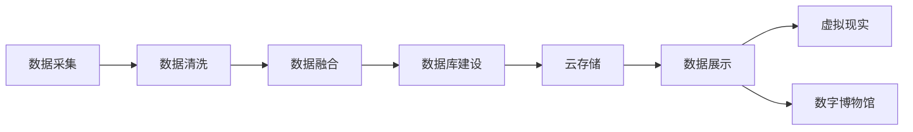

                 

### 文章标题

# 后工业时代的城市更新：历史保护与现代化的平衡

> 关键词：城市更新、历史保护、现代化、可持续发展、平衡

> 摘要：本文将从后工业时代的城市演变背景出发，探讨城市更新过程中历史保护与现代化需求的矛盾，分析城市更新的核心概念与驱动因素，通过实际案例介绍城市更新的成功经验，并讨论在城市更新项目中如何平衡历史文化遗产保护与现代化需求，最终提出城市更新的最佳实践和注意事项。

### 目录

1. **第一部分：背景介绍**
   1.1 后工业时代的城市演变
   1.2 历史保护与现代需求的矛盾
   1.3 城市更新的意义与目标

2. **第二部分：核心概念与联系**
   2.1 城市更新的定义与类型
   2.2 历史文化遗产保护的原则
   2.3 现代化与可持续发展的平衡

3. **第三部分：概念结构与核心要素**
   3.1 城市更新的驱动因素
   3.2 历史文化遗产的评估与保护
   3.3 现代化需求与技术创新

4. **第四部分：算法原理讲解**
   4.1 城市更新项目的评估算法
   4.2 历史文化遗产的数字化保护算法
   4.3 现代化需求的优化算法

5. **第五部分：系统分析与架构设计**
   5.1 问题场景介绍
   5.2 系统功能设计
   5.3 系统架构设计
   5.4 系统接口设计
   5.5 系统交互流程

6. **第六部分：项目实战**
   6.1 环境安装与准备
   6.2 系统核心实现
   6.3 代码应用解读与分析
   6.4 实际案例分析
   6.5 项目小结

7. **第七部分：最佳实践与拓展**
   7.1 最佳实践技巧
   7.2 注意事项
   7.3 拓展阅读

## 1.1 后工业时代的城市演变

### 后工业时代的概念

后工业时代是指工业化进程达到一定程度，经济结构逐渐从以制造业为主导转向以服务业、信息技术和知识经济为主导的时代。这一时期，城市面临着新的发展挑战和机遇，尤其是在城市化进程加快的背景下，城市更新成为关键议题。

### 城市演变的主要特征

1. **经济增长方式转变**：从传统的资源密集型、劳动密集型产业向知识密集型、技术密集型产业转变，经济附加值不断提升。
2. **人口结构变化**：城市化进程加快，人口向城市集中，但老龄化现象日益显著，劳动力结构发生变化。
3. **城市功能多样化**：城市不仅是工业生产和消费的中心，更是文化、科技、教育、信息交流的中心。
4. **城市空间布局优化**：随着交通运输和信息技术的发展，城市空间布局趋向分散化、网络化，功能区更加明确。
5. **城市环境问题加剧**：工业化和城市化过程中产生的大量废弃物、污染和环境破坏问题亟待解决。

### 城市更新的需求

1. **提升城市品质**：随着居民生活水平的提高，对居住环境、公共设施和服务质量的要求越来越高。
2. **推动经济转型**：通过城市更新，培育新的经济增长点，促进产业升级和结构调整。
3. **改善人居环境**：解决城市化带来的交通拥堵、住房紧张、环境污染等问题，提升居民生活质量。
4. **应对气候变化**：通过绿色建筑、可再生能源等措施，降低城市碳排放，提高城市应对气候变化的能力。

## 1.2 历史保护与现代需求的矛盾

### 历史文化遗产的重要性

历史文化遗产是一个城市的精神底蕴和文化灵魂，是城市历史和文化的见证。保护历史文化遗产有助于维护城市的历史连续性和文化多样性，提升城市的文化魅力和软实力。

### 历史保护面临的问题

1. **城市化进程加速**：随着城市规模的扩大和人口增长，城市用地需求不断增加，导致历史文化遗产面临拆迁和改造的压力。
2. **经济发展需求**：城市建设需要大量资金投入，而历史文化遗产保护往往成本较高，资金压力较大。
3. **技术更新替代**：现代化设施和技术的普及，使一些传统建筑和手工艺面临淘汰和替代的威胁。
4. **保护意识不足**：部分地方政府和企业在追求经济效益的同时，忽视历史文化遗产的保护。

### 现代需求的挑战

1. **城市规划与建设**：现代城市规划需要考虑交通、环保、公共服务等因素，与历史文化遗产保护存在一定冲突。
2. **城市功能扩展**：城市现代化需要增加商业、娱乐、休闲等设施，可能对历史文化遗产区造成影响。
3. **人口迁移与流动**：城市化进程中的人口迁移和流动，可能导致历史文化遗产的居民流失和文化传承断裂。
4. **科技创新与应用**：现代化技术的应用，如智能建筑、智慧城市等，可能对历史文化遗产的保护和管理带来新挑战。

### 矛盾的解决策略

1. **立法保护**：完善相关法律法规，明确历史文化遗产的保护范围、标准和管理措施。
2. **政策引导**：通过财政支持、税收优惠等政策措施，鼓励企业和社会力量参与历史文化遗产保护。
3. **公众参与**：提高公众对历史文化遗产保护的认识和参与度，形成全社会共同参与的保护氛围。
4. **科技支持**：利用现代科技手段，如数字化保护、智能管理等，提高历史文化遗产保护的技术水平。
5. **文化传承**：通过文化活动、教育培训等方式，传承和弘扬历史文化遗产，增强文化自信。

## 1.3 城市更新的意义与目标

### 城市更新的意义

1. **推动城市可持续发展**：通过城市更新，提升城市功能、改善人居环境、促进经济发展，实现城市的长期可持续发展。
2. **保护历史文化遗产**：在城市化进程中，通过合理规划和保护，使历史文化遗产得到有效传承和保护，增强城市文化底蕴。
3. **提升城市竞争力**：通过城市更新，优化城市空间布局、提升城市形象、增强城市吸引力，提高城市在区域和国际的竞争力。
4. **促进社会公平**：通过城市更新，改善低收入群体的居住条件，提升社会公平和稳定。

### 城市更新的目标

1. **提高城市品质**：提升城市基础设施建设、公共服务水平、环境卫生质量，提高居民生活舒适度和幸福感。
2. **促进产业升级**：通过城市更新，培育新兴产业、提升传统产业，促进产业结构调整和优化。
3. **增强城市活力**：通过城市更新，打造特色文化、休闲旅游、商业娱乐等功能区，增强城市活力和吸引力。
4. **实现绿色发展**：通过绿色建筑、可再生能源、环保设施等建设，降低城市碳排放，实现绿色发展。

### 城市更新的原则

1. **保护优先**：在保护历史文化遗产的前提下，合理规划城市更新项目，确保历史文化遗产得到有效保护。
2. **可持续发展**：在城市更新过程中，注重经济、社会、环境等多方面的可持续发展，确保城市长期繁荣。
3. **公共利益**：充分考虑公众利益，确保城市更新项目的公共利益最大化。
4. **规划引导**：制定科学合理的城市更新规划，明确城市更新目标和实施路径，确保城市更新有序推进。
5. **公众参与**：充分发挥公众在城市更新过程中的参与作用，提高公众对城市更新的认知和参与度。

## 总结

城市更新是一个复杂的系统工程，涉及历史保护、现代化需求、可持续发展等多个方面。在后工业时代，城市更新不仅关系到城市的发展，更关系到历史文化遗产的保护和传承。通过科学合理的规划和实施，我们可以实现历史保护与现代化的平衡，打造宜居、宜业、宜游的城市，为城市的可持续发展奠定坚实基础。在接下来的章节中，我们将深入探讨城市更新的核心概念、要素、算法和实战案例，以期为城市更新提供有益的参考和借鉴。### 第二部分：核心概念与联系

#### 2.1 城市更新的定义与类型

**定义**：

城市更新（Urban renewal）是指在现有城市空间内，通过改造、提升、再利用等方式，优化城市功能、改善居住环境、促进经济发展的过程。

**类型**：

1. **旧区改造**：针对城市旧区，通过拆除重建、功能更新等方式，改善居住条件、提升城市品质。
2. **新区开发**：在现有城市空间外，通过新区域开发、基础设施建设等方式，拓展城市空间、优化城市布局。
3. **综合整治**：针对城市环境、公共设施、历史文化等方面进行综合整治，提升城市整体形象。
4. **特色小镇**：以特定产业、文化为主题，建设特色鲜明、功能完善的小城镇，推动区域经济发展。

#### 2.2 历史文化遗产保护的原则

**原则**：

1. **保护为主**：在尊重历史、传承文化的前提下，确保历史文化遗产的原真性和完整性。
2. **合理利用**：在保护基础上，合理利用历史文化遗产，发挥其社会、经济和文化价值。
3. **科学规划**：制定科学合理的历史文化遗产保护规划，确保保护措施的有效实施。
4. **公众参与**：提高公众对历史文化遗产保护的认识和参与度，形成全社会共同参与的保护氛围。
5. **科技创新**：利用现代科技手段，提高历史文化遗产保护的技术水平。

#### 2.3 现代化与可持续发展的平衡

**现代化**：

现代化是指通过技术进步、经济结构调整、社会变革等方式，提升国家的经济、科技、文化、教育等各方面水平，实现国家整体发展。

**可持续发展**：

可持续发展是指在不损害未来代际利益的前提下，满足当代人的需求和发展。它包括经济、社会、环境等多方面的可持续发展。

**平衡策略**：

1. **绿色发展**：在城市更新过程中，注重环保和节能减排，推动绿色建筑、绿色交通等绿色产业的发展。
2. **科技创新**：利用先进技术，提高城市基础设施、公共服务等领域的效率和品质，促进城市现代化。
3. **文化传承**：在现代化进程中，注重历史文化遗产的保护和传承，实现文化传承与现代化的有机融合。
4. **社会公平**：通过政策引导、公共服务等手段，缩小城乡差距、区域差距，实现社会公平。
5. **多方参与**：充分发挥政府、企业、社会组织、公众等多方力量，共同推动城市现代化与可持续发展。

#### 表格：核心概念属性特征对比

| 核心概念 | 定义 | 主要特征 | 相互关系 |
| :---: | :---: | :---: | :---: |
| 城市更新 | 在现有城市空间内，通过改造、提升、再利用等方式，优化城市功能、改善居住环境、促进经济发展 | 改造旧区、新区开发、综合整治、特色小镇 | 城市更新的主要方式和方法 |
| 历史文化遗产保护 | 保护历史文化遗产，传承城市文化 | 保护为主、合理利用、科学规划、公众参与、科技创新 | 历史文化遗产是城市更新的重要组成部分 |
| 现代化 | 提升国家的经济、科技、文化、教育等各方面水平，实现国家整体发展 | 科技创新、经济结构调整、社会变革 | 现代化是城市更新的目标之一 |
| 可持续发展 | 在不损害未来代际利益的前提下，满足当代人的需求和发展 | 经济、社会、环境等多方面可持续发展 | 可持续发展是城市更新的基本原则 |

#### ER实体关系图架构

以下是一个简单的ER实体关系图，用于描述城市更新项目中的主要实体及其关系。

```mermaid
erDiagram
  Project ||--|{ Site }|:
  Project ||--|{ Building }|:
  Site ||--|{ Building }|:
  Building ||--|{ Room }|:
  Room ||--|{ Equipment }|:
  Building ||--|{ Facility }|:
```

**说明**：

- **Project（项目）**：表示城市更新项目，包括项目名称、地点、规模等信息。
- **Site（场地）**：表示项目的具体实施地点，包括场地名称、面积、地理位置等信息。
- **Building（建筑物）**：表示项目中的建筑物，包括建筑物名称、结构类型、高度等信息。
- **Room（房间）**：表示建筑物中的房间，包括房间编号、面积、功能等信息。
- **Equipment（设备）**：表示房间中的设备，包括设备名称、型号、数量等信息。
- **Facility（设施）**：表示建筑物中的公共设施，包括设施名称、类型、位置等信息。

通过ER实体关系图，我们可以清晰地了解城市更新项目中的主要实体及其相互关系，为后续的系统分析与架构设计提供基础。

### 3.1 城市更新的驱动因素

**定义**：

城市更新的驱动因素是指推动城市更新进程的各种内在和外在力量，它们影响着城市更新的方向、速度和效果。

**内在驱动因素**：

1. **经济发展需求**：随着经济的快速发展，城市需要不断调整和优化产业结构，以适应新的经济形势。城市更新可以提升城市基础设施、改善投资环境，从而吸引更多的投资和人才，推动经济增长。
2. **社会需求变化**：居民生活水平的提高和消费需求的多样化，使得城市需要提供更高质量的住房、公共服务和文化娱乐设施。城市更新可以满足这些需求，提升居民生活质量。
3. **技术创新**：科技的进步为城市更新提供了新的技术手段和解决方案。例如，智能城市建设、绿色建筑技术、数字化管理技术等，都可以提高城市的管理效率和居民的生活质量。

**外在驱动因素**：

1. **政策支持**：政府通过制定和实施一系列政策，如财政支持、税收优惠、规划引导等，推动城市更新项目的实施。政策支持可以降低城市更新的成本，提高项目的可行性和成功率。
2. **市场需求**：随着城市化进程的加快，城市土地资源日益稀缺，城市更新项目可以提供更多的土地资源和高质量的住宅、商业地产等，满足市场需求。
3. **国际经验**：国际上的成功经验和先进技术可以为城市更新提供有益的借鉴和启示。通过学习国际经验，可以提升城市更新的水平和效果。

**驱动因素之间的关系**：

1. **经济发展需求和社会需求变化**：两者之间存在相互促进的关系。经济发展需求可以带动社会需求的提升，而社会需求的变化又可以推动经济的发展。例如，城市更新项目的实施可以带动相关产业的发展，从而促进经济增长，反过来，经济增长又可以提供更多的资源和支持，推动社会需求的满足。
2. **技术创新和政策支持**：技术创新为城市更新提供了技术手段和解决方案，而政策支持则为技术创新提供了良好的环境和条件。两者相互促进，共同推动城市更新进程。

**驱动因素对城市更新的影响**：

1. **影响城市更新的方向**：不同的驱动因素会影响城市更新的重点和方向。例如，经济发展需求可能会推动城市向高新技术产业、现代服务业等领域发展；社会需求变化可能会推动城市向宜居、宜业、宜游方向发展。
2. **影响城市更新的速度**：驱动因素的力量大小和协调程度会影响城市更新的速度。如果驱动因素强且协调，城市更新进程将更加迅速；反之，则可能会拖延。
3. **影响城市更新的效果**：驱动因素的质量和可持续性会影响城市更新的效果。高质量、可持续的驱动因素可以确保城市更新项目的成功实施，实现城市发展的长期目标。

### 3.2 历史文化遗产的评估与保护

**评估**：

**定义**：

历史文化遗产的评估是对其价值、现状和未来需求进行系统分析的过程，旨在确定保护的重要性、优先级和措施。

**方法**：

1. **历史价值评估**：通过对历史文化遗产的历史背景、文化意义、艺术价值等方面进行深入研究，确定其历史价值。
2. **现状评估**：对历史文化遗产的物理状态、环境状况、管理现状等方面进行实地考察和数据分析，评估其现状和存在的问题。
3. **需求评估**：根据社会发展需求和居民实际需求，确定历史文化遗产的保护和利用方向。

**评估内容**：

1. **建筑实体**：包括建筑结构、装饰、材料等方面的评估。
2. **环境景观**：包括周围环境、配套设施、公共空间等方面的评估。
3. **文化内涵**：包括历史故事、文化传统、艺术价值等方面的评估。
4. **管理现状**：包括管理机制、管理水平、保护措施等方面的评估。

**保护**：

**定义**：

历史文化遗产的保护是通过对其实施一系列维护、修缮、管理措施，确保其原真性、完整性和持续性的过程。

**原则**：

1. **保护为主**：在尊重历史、传承文化的前提下，确保历史文化遗产的原真性和完整性。
2. **合理利用**：在保护基础上，合理利用历史文化遗产，发挥其社会、经济和文化价值。
3. **科学规划**：制定科学合理的历史文化遗产保护规划，确保保护措施的有效实施。
4. **公众参与**：提高公众对历史文化遗产保护的认识和参与度，形成全社会共同参与的保护氛围。
5. **科技创新**：利用现代科技手段，提高历史文化遗产保护的技术水平。

**保护措施**：

1. **物理维护**：对历史文化遗产进行定期的检查、维修和保养，确保其物理状态的稳定。
2. **环境治理**：改善历史文化遗产周围的环境，减少污染和破坏，营造良好的保护氛围。
3. **数字化保护**：利用数字化技术，对历史文化遗产进行数据采集、保存和展示，提高保护和管理效率。
4. **政策支持**：制定相关政策和法规，为历史文化遗产保护提供法律保障。
5. **公众参与**：通过文化活动、教育培训等方式，提高公众对历史文化遗产保护的认识和参与度。

**评估与保护的关系**：

1. **评估是保护的基础**：通过评估，可以明确历史文化遗产的价值和保护需求，为保护工作提供依据。
2. **保护是评估的延伸**：在评估的基础上，实施相应的保护措施，确保历史文化遗产得到有效保护。
3. **评估与保护相互促进**：评估的深入和保护的加强，可以共同提升历史文化遗产的保护水平，实现文化传承与发展的有机结合。

### 3.3 现代化需求与技术创新

**定义**：

现代化需求是指在城市更新过程中，满足社会经济发展和居民生活品质提高的需求，包括城市基础设施建设、公共服务提升、产业发展优化等方面。

**技术创新**：

**定义**：

技术创新是指通过引入新技术、新方法、新理念等，提高城市基础设施、公共服务、产业发展等方面的效率和质量。

**现代化需求**：

1. **智慧城市建设**：通过引入物联网、大数据、人工智能等新技术，提升城市的管理水平和居民的生活品质，实现智慧化、智能化发展。
2. **绿色建筑推广**：通过采用节能、环保、可持续的建筑技术，减少城市能源消耗和环境污染，实现绿色发展。
3. **公共交通优化**：通过改善公共交通系统，提高交通效率和便利性，减少交通拥堵和环境污染。
4. **公共服务提升**：通过提供高质量的公共服务，如医疗、教育、文化等，满足居民多样化、个性化需求。

**技术创新**：

1. **物联网技术**：通过物联网技术，实现城市基础设施的智能监控和管理，提高城市运行效率。
2. **大数据分析**：通过大数据分析，为城市规划和决策提供科学依据，实现精准治理。
3. **人工智能技术**：通过人工智能技术，提升城市公共服务和产业发展的智能化水平，提高居民生活质量。
4. **新能源技术**：通过新能源技术的应用，减少城市能源消耗和碳排放，实现可持续发展。

**现代化需求与技术创新的关系**：

1. **相互促进**：现代化需求为技术创新提供了应用场景和发展空间，而技术创新又为满足现代化需求提供了新的手段和解决方案。
2. **共同发展**：现代化需求和技术创新共同推动城市更新进程，实现城市可持续发展。

**影响**：

1. **提升城市品质**：通过现代化需求和技术创新的结合，可以提升城市的品质和竞争力，提高居民的生活质量和幸福感。
2. **促进产业发展**：现代化需求和技术创新可以推动城市产业结构优化和升级，培育新的经济增长点。
3. **实现绿色发展**：通过绿色建筑、新能源等技术的应用，可以实现城市可持续发展，降低城市环境负荷。

### 案例分析

**案例1：北京798艺术区**

**背景**：

北京798艺术区位于北京市朝阳区，原为东北电力工业设计院，始建于20世纪50年代。随着时代的变迁，这里逐渐成为一个充满艺术氛围的文化地标。

**更新策略**：

1. **历史保护**：在改造过程中，尽量保留建筑的原有结构和风格，保留历史文化遗产的原真性。
2. **现代化需求**：引入现代艺术、创意产业，打造集艺术展览、设计办公、餐饮娱乐于一体的多功能艺术区，满足现代化需求。
3. **技术创新**：利用物联网技术，提升艺术区的管理水平和游客体验。

**效果**：

北京798艺术区已经成为北京市乃至全国的文化地标，吸引了大量游客和艺术家，成为文化创意产业的重要聚集地，实现了历史文化遗产保护与现代化需求的有机结合。

**案例2：上海浦东新区**

**背景**：

上海浦东新区成立于1990年，是中国改革开放的标志性地区之一。随着上海国际化进程的加快，浦东新区面临基础设施提升、产业结构优化等现代化需求。

**更新策略**：

1. **历史保护**：在新区建设过程中，注重保护周边历史文化遗产，如浦东老街、上海洋炮台等。
2. **现代化需求**：引入高科技产业、现代服务业，打造国际化、现代化的产业体系。
3. **技术创新**：广泛应用物联网、大数据、人工智能等新技术，提升城市管理和公共服务水平。

**效果**：

浦东新区已经成为中国改革开放的窗口和现代化建设的示范区，实现了历史文化遗产保护与现代化需求的有机结合，为全国其他地区提供了有益的借鉴和启示。

### 结论

城市更新是一个复杂的系统工程，涉及历史保护、现代化需求、可持续发展等多个方面。在实现历史文化遗产保护与现代化需求的平衡过程中，需要充分考虑各种驱动因素，科学规划，合理利用技术创新，实现城市可持续发展。通过案例分析，我们可以看到，在城市更新过程中，历史文化遗产保护与现代化需求并非对立，而是可以相互促进、共同发展，实现城市品质的提升和经济的繁荣。### 4.1 历史建筑的保护原理

**保护原理的定义**：

历史建筑的保护原理是指在尊重建筑历史、文化价值的前提下，通过科学合理的保护措施，确保历史建筑的原真性、完整性和可持续性。

**保护原则**：

1. **原真性原则**：保护历史建筑的原貌，包括建筑结构、装饰、材料等，尽可能恢复其历史状态。
2. **完整性原则**：保护历史建筑的整体性，避免局部拆除或改建，确保建筑群的历史风貌和文化氛围。
3. **可持续性原则**：在保护过程中，注重建筑的环境保护、资源节约和可持续发展，确保建筑在未来能够持续发挥作用。
4. **公众参与原则**：提高公众对历史建筑保护的认识和参与度，形成全社会共同参与的保护氛围。

**保护措施**：

1. **物理保护**：对历史建筑进行定期的检查、维修和保养，确保其物理状态的稳定。包括加固、防腐蚀、防风化等措施。
2. **环境治理**：改善历史建筑周围的环境，减少污染和破坏，营造良好的保护氛围。如绿化、排水系统改造、交通疏导等。
3. **数字化保护**：利用数字化技术，对历史建筑进行数据采集、保存和展示，提高保护和管理效率。如三维建模、虚拟现实、数字化博物馆等。
4. **法律保障**：制定相关政策和法规，为历史建筑保护提供法律保障。如设立保护区、禁止拆除等。

**保护效果评估**：

1. **建筑状态评估**：通过定期检查，评估历史建筑的结构安全和物理状态，确保保护措施的有效性。
2. **环境评估**：评估历史建筑周围的环境状况，如空气质量、水质、噪音等，确保保护措施对周围环境的影响最小。
3. **社会效益评估**：评估历史建筑保护对社会文化、旅游经济等方面的影响，确保保护工作的社会效益。

### 4.2 现代城市设计理念

**设计理念的定义**：

现代城市设计理念是指以人为核心，综合考虑经济、社会、环境等多方面因素，通过科学合理的规划和管理，构建宜居、宜业、宜游的城市空间。

**设计原则**：

1. **以人为本**：城市设计应以满足居民的需求为出发点，关注人的行为和心理，提高居民的生活质量。
2. **可持续发展**：在城市设计过程中，注重环保和节能减排，推动绿色建筑、绿色交通等绿色产业的发展。
3. **空间优化**：合理规划城市空间，提高土地利用率，优化交通网络，提高城市运行效率。
4. **文化传承**：在城市设计过程中，注重历史文化遗产的保护和传承，营造具有特色的城市文化氛围。
5. **创新驱动**：利用先进技术和理念，推动城市设计的创新和发展，提高城市的竞争力和吸引力。

**设计方法**：

1. **总体规划**：制定科学合理的城市总体规划，明确城市的发展方向和空间布局。
2. **详细设计**：针对具体的城市区域，进行详细的设计和规划，包括建筑设计、景观设计、交通设计等。
3. **模拟与评估**：利用计算机模拟和评估技术，对城市设计方案进行模拟和评估，优化设计方案。
4. **公众参与**：通过公众参与，提高城市设计的透明度和公众满意度，形成全社会共同参与的设计氛围。

### 4.3 可持续城市发展的原则

**定义**：

可持续发展是指在不损害未来代际利益的前提下，满足当代人的需求和发展。它包括经济、社会、环境等多方面的可持续发展。

**原则**：

1. **经济可持续发展**：通过创新和高效利用资源，推动经济的长期增长，提高居民的生活水平和质量。
2. **社会可持续发展**：通过公平和包容的社会政策，实现社会公正和稳定，提高社会的整体福祉。
3. **环境可持续发展**：通过环保和生态修复，保护自然环境和生态系统，确保人类和自然的和谐共生。
4. **科技创新**：通过科技创新，推动经济、社会、环境等多方面的可持续发展，提高城市的管理水平和居民的生活品质。

**实现路径**：

1. **绿色建筑**：推广绿色建筑技术，提高建筑的能源利用效率和环保性能，减少建筑对环境的负面影响。
2. **绿色交通**：发展绿色交通体系，鼓励公共交通和非机动车出行，减少交通拥堵和环境污染。
3. **资源循环利用**：通过资源循环利用，降低资源的消耗和浪费，提高资源的利用效率。
4. **生态修复**：通过生态修复，恢复和改善自然生态系统，提高城市的生态环境质量。

### 历史建筑保护与现代化城市设计理念的对比

| 对比项 | 历史建筑保护 | 现代化城市设计理念 |
| :---: | :---: | :---: |
| 保护目标 | 保护和传承历史文化遗产 | 提升城市功能、品质和吸引力 |
| 设计原则 | 原真性、完整性、可持续性、公众参与 | 以人为本、可持续发展、空间优化、文化传承、创新驱动 |
| 设计方法 | 物理保护、环境治理、数字化保护、法律保障 | 总体规划、详细设计、模拟与评估、公众参与 |
| 实现路径 | 重视历史价值、保护建筑原貌、减少环境影响 | 推广绿色建筑、发展绿色交通、资源循环利用、生态修复 |

### 历史建筑保护与现代化城市设计理念的联系

1. **共同目标**：历史建筑保护与现代化城市设计理念都旨在提升城市品质和居民生活质量，实现城市的可持续发展。
2. **相互促进**：在现代化城市设计过程中，可以充分考虑历史建筑的保护和传承，实现历史与现代的有机结合。
3. **融合创新**：通过科技创新，可以推动历史建筑保护与现代化城市设计的融合，实现传统与现代的有机融合，创造具有特色的城市文化氛围。

### 实际应用

**案例1：北京故宫**

**背景**：

北京故宫是中国古代皇宫，拥有丰富的历史文化遗产和独特的建筑风格。随着时代的发展，故宫面临保护与利用的挑战。

**措施**：

1. **保护**：通过定期检查、维修和保养，确保故宫建筑物的物理状态稳定。
2. **现代化设计**：引入现代科技，如数字化展示、智能导览等，提升游客体验。

**效果**：

故宫成为了国内外游客的热门景点，不仅实现了历史文化遗产的保护，还提升了城市的吸引力和品质。

**案例2：上海外滩**

**背景**：

上海外滩是上海的历史地标，拥有丰富的历史建筑和景观。随着城市发展，外滩面临现代化改造的需求。

**措施**：

1. **保护**：对历史建筑进行修缮和保护，保留其历史风貌。
2. **现代化设计**：引入现代建筑和设施，如滨江步道、景观灯光等，提升城市品质。

**效果**：

外滩成为了上海的重要景观带，实现了历史建筑保护与现代化城市设计的有机结合，提升了城市的吸引力和品质。

### 结论

历史建筑保护与现代化城市设计理念并非对立，而是可以相互融合、共同发展。通过科学合理的保护措施和现代化设计，可以实现历史与现代的有机结合，提升城市品质和居民生活质量，实现城市的可持续发展。在未来的城市更新过程中，应充分考虑历史建筑的保护和传承，探索创新的发展路径，打造具有特色和魅力的城市。### 4.4 国际上的成功案例

**纽约苏活区（SoHo）**

**背景**：

纽约苏活区位于曼哈顿下城区，曾经是一个工业废墟，20世纪70年代开始转变为时尚艺术区。这里的建筑多数是19世纪的工业仓库，经过改造成为时尚工作室、画廊和商业空间。

**保护措施**：

1. **立法保护**：苏活区被列为国家历史保护区，确保其历史建筑得到法律保护。
2. **建筑改造**：在尊重原有建筑结构和风貌的前提下，进行内部改造，以满足现代使用的需求。
3. **公共空间提升**：通过绿化、灯光和公共艺术项目，提升区域的公共空间品质。

**效果**：

苏活区成为了全球知名的时尚艺术区，不仅保留了丰富的历史文化遗产，还成为了纽约的创意和商业中心，实现了历史保护与现代化利用的平衡。

**伦敦考文特花园（Covent Garden）**

**背景**：

考文特花园是伦敦的一个历史市场，始建于1610年，以其独特的市场建筑和历史建筑群而闻名。随着时间的推移，这里逐渐成为一个时尚购物中心和文化地标。

**保护措施**：

1. **历史文化保存**：对考文特花园的历史建筑和街道布局进行保护，确保其历史风貌得到保留。
2. **文化遗产推广**：举办多种文化活动，如艺术展览、美食节等，推广考文特花园的文化遗产。
3. **商业更新**：通过引入现代化的商业设施和品牌，提升市场的商业活力。

**效果**：

考文特花园成为了伦敦的一个热门旅游景点和购物天堂，既保留了丰富的历史文化，又吸引了现代商业元素，实现了历史与现代的有机结合。

**柏林柯尔布恩（Köpenick）**

**背景**：

柏林柯尔布恩是一个拥有丰富历史文化遗产的郊区，以其独特的木结构建筑和19世纪的工业遗址而闻名。

**保护措施**：

1. **综合保护规划**：制定综合性的保护规划，确保历史建筑和工业遗址得到有效保护。
2. **文化复兴项目**：通过文化复兴项目，将废弃的工业遗址转变为博物馆、画廊和创意空间。
3. **环境治理**：改善周边环境，减少污染，提升居民的生活质量。

**效果**：

柯尔布恩成为了一个融合历史与现代的创意社区，吸引了大量艺术家和文化爱好者。通过保护与再利用，实现了历史文化遗产的可持续发展。

**东京原宿**

**背景**：

原宿是东京的一个时尚文化中心，以其独特的街头文化和时尚小店而闻名。这里有许多20世纪60年代的建筑，是日本街头文化的发源地。

**保护措施**：

1. **文化振兴**：通过文化振兴活动，保护和发展原宿的街头文化和时尚产业。
2. **建筑改造**：在保持原有建筑特色的基础上，进行必要的改造，以满足现代商业需求。
3. **街区管理**：通过街区管理，维护原宿的整洁和秩序，提升游客体验。

**效果**：

原宿成为了东京的一个标志性时尚街区，不仅保留了丰富的历史文化遗产，还吸引了大量的国内外游客，成为了日本文化的象征。

**总结**：

这些国际上的成功案例表明，历史保护与现代化需求并非对立，而是可以通过科学规划、合理利用和科技创新，实现有机结合。通过立法保护、文化推广、环境治理和公共参与，可以打造出既保留历史文化遗产，又充满现代活力的城市空间，为其他地区的城市更新提供有益的借鉴和启示。### 4.5 我国城市更新的实践

#### 城市更新背景

随着我国经济社会的快速发展，城市化进程不断加快，城市人口、经济规模和空间格局都发生了深刻变化。然而，在此过程中，许多城市也面临着一系列问题，如老旧小区改造、交通拥堵、环境污染、公共设施不足等。为了解决这些问题，我国政府积极推进城市更新工作，以期提升城市品质、改善人居环境、促进经济转型。

#### 更新实践概述

**1. 老旧小区改造**

老旧小区改造是我国城市更新的一项重要任务。通过拆除重建、功能提升、环境整治等方式，对老旧小区进行系统改造，提升居民的居住条件和生活品质。具体措施包括：

- **基础设施提升**：改造小区内的供水、供电、供气、排水等基础设施，提高居民的生活便利性。
- **公共空间优化**：增加绿地、停车场、休闲设施等公共空间，提升小区环境质量。
- **建筑节能改造**：采用节能材料和设备，提高建筑能效，降低能源消耗。

**2. 产业升级**

城市更新不仅仅是改善居住环境，还包括推动城市产业结构优化和升级。通过引入高新技术产业、现代服务业等，提升城市的产业竞争力，实现经济可持续发展。具体措施包括：

- **产业园区建设**：建设产业园区，吸引高新技术企业入驻，推动产业集聚和协同发展。
- **创新平台搭建**：搭建创新平台，支持企业技术创新和产品研发，培育新兴产业。
- **产业链延伸**：通过产业链延伸和配套服务，提升传统产业的附加值和竞争力。

**3. 城市基础设施提升**

城市基础设施是城市功能发挥的重要保障。通过提升城市道路、桥梁、公共交通、供水、供电、通信等基础设施，提高城市运行效率和服务水平。具体措施包括：

- **公共交通优化**：扩大公共交通覆盖范围，提高公共交通服务水平，减少交通拥堵。
- **供水供电改造**：升级供水供电设施，提高供水供电稳定性和可靠性。
- **智慧城市建设**：推广智慧城市建设，利用物联网、大数据、人工智能等新技术，提升城市管理和公共服务的智能化水平。

#### 案例分析

**1. 上海杨浦区五角场城市副中心**

**背景**：

五角场城市副中心位于上海杨浦区，是上海市重点打造的市级城市副中心之一。过去，这里是一个工业区和交通枢纽，随着城市发展的需要，需要进行整体改造和提升。

**措施**：

- **功能规划**：明确五角场城市副中心的功能定位，包括商业、文化、教育、科研、居住等。
- **交通优化**：提升区域交通网络，改善交通拥堵问题。
- **建筑改造**：对老旧建筑进行改造，提升建筑功能和风貌。
- **环境整治**：改善区域环境，增加绿地和公共空间。

**效果**：

五角场城市副中心已经成为上海的重要商业和文化中心，吸引了大量企业和居民入驻，提升了区域的整体品质和吸引力。

**2. 北京海淀区中关村科学城**

**背景**：

中关村科学城是北京市的重要科技创新区，聚集了众多高新技术企业、科研机构和高校。

**措施**：

- **产业升级**：推动传统产业向高新技术产业转型，培育新兴产业。
- **创新平台建设**：搭建创新平台，支持企业技术创新和产品研发。
- **基础设施提升**：完善交通、供水、供电等基础设施，提高科技创新环境。

**效果**：

中关村科学城已经成为我国科技创新的重要基地，吸引了大量高端人才和企业入驻，推动了北京市经济的高质量发展。

**总结**：

我国城市更新的实践充分体现了历史保护与现代化需求的平衡。通过科学规划和合理利用，我们可以在保护历史文化遗产的基础上，提升城市功能和品质，实现经济和社会的可持续发展。在未来的城市更新工作中，应继续坚持这一原则，为构建现代化、宜居、富有活力的城市奠定坚实基础。### 4.6 案例分析与启示

通过对国内外城市更新案例的分析，我们可以发现一些成功的经验和教训，为我国城市更新提供有益的启示。

**成功经验**

1. **综合规划**：城市更新需要全面考虑经济、社会、环境等多方面因素，制定科学合理的综合规划。如纽约苏活区、柏林柯尔布恩等案例，在规划阶段就明确了区域的功能定位和发展目标，为后续的更新工作奠定了基础。

2. **公众参与**：公众参与是城市更新成功的关键。通过广泛听取公众意见，提高公众的参与度和满意度，可以确保城市更新项目的顺利实施。如伦敦考文特花园的案例，通过举办多种文化活动，吸引了大量公众参与，提升了区域的活力和魅力。

3. **保护与创新相结合**：在保护历史文化遗产的基础上，注重创新和现代化，实现历史与现代的有机结合。如东京原宿的案例，通过保护传统建筑和引入现代商业元素，打造了一个充满活力的时尚街区。

4. **科技创新**：利用现代科技手段，提升城市管理的效率和服务水平。如上海杨浦区五角场城市副中心的案例，通过智慧城市建设，提高了区域的整体品质和吸引力。

**失败教训**

1. **忽视公众参与**：一些城市更新项目由于忽视了公众参与，导致项目实施过程中出现矛盾和问题，甚至引发社会不稳定。如一些城市在拆迁过程中，未能充分征求居民意见，导致居民抵触情绪强烈。

2. **缺乏长远规划**：一些城市更新项目缺乏长远的规划和考虑，导致短期内取得成效，但长期来看，存在诸多问题。如一些城市在旧区改造过程中，过度追求经济利益，忽视了社会和环境因素，导致后续问题不断。

3. **保护不足与创新过度**：一些城市更新项目过度追求现代化，忽视了历史文化遗产的保护，导致文化特色丧失。如一些城市在改造历史建筑时，未能尊重原有结构和风貌，导致建筑失去历史价值。

**启示**

1. **注重综合规划**：在城市更新过程中，应全面考虑经济、社会、环境等多方面因素，制定科学合理的综合规划。

2. **加强公众参与**：提高公众的参与度和满意度，确保城市更新项目的顺利实施。

3. **保护与创新相结合**：在保护历史文化遗产的基础上，注重创新和现代化，实现历史与现代的有机结合。

4. **科技创新**：利用现代科技手段，提升城市管理的效率和服务水平。

5. **长期规划**：在城市更新过程中，应注重长远规划，确保项目能够持续发挥作用。

通过这些启示，我们可以更好地推动我国城市更新工作，实现历史文化遗产保护与现代化需求的平衡，打造宜居、宜业、宜游的现代化城市。### 4.7 历史建筑保护与现代化需求的利益相关方

**定义**：

在历史建筑保护与现代化需求的平衡过程中，利益相关方是指那些在城市更新项目中扮演重要角色，对项目产生直接或间接影响的各种组织和个体。

**利益相关方类型**：

1. **政府**：作为城市更新项目的规划者和管理者，政府负责制定相关政策、法规，提供资金支持，并确保项目符合公共利益。
2. **开发商**：开发商是城市更新项目的具体实施者，他们负责项目的开发、建设和运营，追求经济效益。
3. **居民**：居民是城市更新项目的主要受益者，他们的生活质量、居住条件和文化认同受到直接影响。
4. **文化机构**：如博物馆、美术馆、历史学会等，负责保护和传承历史文化遗产，推动文化教育。
5. **非政府组织（NGO）**：如环保组织、文化遗产保护组织等，关注社会和环境问题，参与城市更新项目的监督和评估。
6. **投资者**：包括私人投资者和公共投资者，他们为城市更新项目提供资金支持，关注项目的投资回报。

**利益相关方的角色与责任**：

1. **政府**：
   - 规划与政策制定：制定城市更新规划，明确历史建筑保护的要求和现代化需求。
   - 监管与监督：确保项目符合相关法律法规，保护公共利益。
   - 资金支持：提供财政支持，鼓励历史建筑的保护和再利用。

2. **开发商**：
   - 项目实施：负责项目的开发、建设和运营，实现历史建筑的保护与现代化利用。
   - 经济平衡：通过合理利用历史建筑，实现经济效益与社会效益的平衡。
   - 创新探索：探索创新的设计和技术，提高建筑的功能性和可持续性。

3. **居民**：
   - 参与决策：参与城市更新项目的规划和决策过程，表达自己的需求和期望。
   - 适应变革：适应城市更新带来的生活方式和居住环境的变化，积极参与社区建设。
   - 文化认同：保护自身文化遗产，传承社区文化。

4. **文化机构**：
   - 文化传承：通过展览、教育等活动，传承历史文化遗产，提高公众文化意识。
   - 专业咨询：提供专业知识和建议，协助政府和开发商制定保护方案。

5. **非政府组织（NGO）**：
   - 监督与评估：监督城市更新项目的实施过程，评估其对社会和环境的影响。
   - 活动组织：组织公众参与城市更新项目，提高公众的参与度和意识。

6. **投资者**：
   - 资金投入：为城市更新项目提供资金支持，关注投资回报。
   - 风险管理：评估项目风险，参与项目决策，降低投资风险。

**利益相关方之间的互动**：

1. **沟通与合作**：利益相关方之间需要建立有效的沟通机制，分享信息、协调利益，共同推动城市更新项目。
2. **利益平衡**：在保护历史建筑与满足现代化需求之间寻求平衡，确保各方的利益得到合理保障。
3. **公众参与**：鼓励公众参与城市更新项目，提高项目的透明度和公众满意度。

**总结**：

在城市更新过程中，历史建筑保护与现代化需求需要多方利益相关方的共同努力。通过明确各方的角色和责任，建立有效的互动机制，可以实现历史建筑保护与现代化需求的有机结合，推动城市可持续发展。### 4.8 历史保护与现代化需求平衡策略

**背景**：

在城市更新过程中，历史保护与现代化需求常常存在矛盾。如何在这两者之间找到平衡，成为城市规划和决策者面临的重要挑战。本文将探讨一些有效的策略，以实现历史保护与现代化需求的平衡。

**策略一：立法保护**

**原理**：

通过立法手段，明确历史建筑的保护范围、标准和措施，为历史保护提供法律保障。

**实施步骤**：

1. **调查评估**：对城市中的历史建筑进行全面的调查和评估，确定保护价值。
2. **制定法规**：根据调查结果，制定具体的保护法规，明确保护范围和标准。
3. **执法监督**：加强执法力度，对违反保护法规的行为进行处罚。

**效果**：

通过立法保护，可以确保历史建筑得到有效保护，防止非法拆除和破坏。

**策略二：文化传承**

**原理**：

在现代化城市设计中融入历史文化元素，传承和弘扬城市文化。

**实施步骤**：

1. **文化挖掘**：深入挖掘城市的历史文化，确定文化传承的重点。
2. **规划设计**：在建筑设计、景观设计等方面，融入历史文化元素。
3. **文化展示**：通过博物馆、展览、文化活动等方式，展示城市文化。

**效果**：

通过文化传承，可以增强城市的文化魅力和吸引力，提高居民的文化认同感。

**策略三：技术创新**

**原理**：

利用现代科技，提升历史建筑的保护和管理水平，实现保护与利用的有机结合。

**实施步骤**：

1. **数字化保护**：采用数字化技术，对历史建筑进行数据采集和保存。
2. **智能管理**：利用物联网、大数据等技术，提升历史建筑的管理效率。
3. **技术应用**：将绿色建筑、智慧城市等技术应用于历史建筑保护。

**效果**：

通过技术创新，可以提升历史建筑的保护和管理水平，实现保护与利用的有机结合。

**策略四：公众参与**

**原理**：

提高公众对历史建筑保护的认识和参与度，形成全社会共同参与的保护氛围。

**实施步骤**：

1. **宣传教育**：通过媒体、学校、社区等渠道，开展历史建筑保护的宣传教育。
2. **公众参与**：鼓励公众参与历史建筑的保护和管理，提高公众的参与度和满意度。
3. **奖励机制**：对积极参与历史建筑保护的公众给予奖励，激发公众的积极性。

**效果**：

通过公众参与，可以形成全社会共同参与的保护氛围，提高历史建筑的保护水平。

**策略五：利益平衡**

**原理**：

在城市更新过程中，通过合理的利益分配，实现历史保护与现代化需求的平衡。

**实施步骤**：

1. **利益评估**：对历史建筑保护与现代化需求进行成本效益分析，确定利益分配方案。
2. **政策引导**：通过财政支持、税收优惠等政策，引导企业和居民积极参与历史建筑保护。
3. **协商谈判**：在政府和开发商之间、居民和开发商之间进行利益协商和谈判，达成共识。

**效果**：

通过利益平衡，可以确保各方利益得到合理保障，促进历史建筑保护与现代化需求的有机结合。

**总结**：

历史保护与现代化需求在城市更新中既对立又统一。通过立法保护、文化传承、技术创新、公众参与和利益平衡等策略，可以找到两者的平衡点，实现城市可持续发展。在未来的城市更新工作中，应充分考虑这些策略，为构建现代化、宜居、富有活力的城市奠定坚实基础。### 4.9 现代化需求与文化遗产保护的平衡

**定义**：

现代化需求与文化遗产保护的平衡是指在城市更新和发展的过程中，如何在满足现代生活需求和经济效益的同时，保护、传承和弘扬历史文化遗产。

**问题**：

1. **资源有限**：城市土地、资金等资源有限，如何在满足现代化需求的同时，为文化遗产保护留下足够的资源。
2. **利益冲突**：开发商、居民、政府等不同利益主体在文化遗产保护和现代化需求之间存在利益冲突。
3. **管理挑战**：如何有效管理文化遗产，确保其得到充分保护，同时满足现代功能需求。

**解决方案**：

1. **科学规划**：

   - **总体规划**：在城市规划阶段，充分考虑历史文化遗产的分布和保护需求，制定科学合理的城市更新规划。
   - **专项规划**：对重要的文化遗产区域，制定专项保护规划，明确保护目标和措施。

2. **政策支持**：

   - **财政支持**：政府通过财政补贴、税收优惠等政策，支持文化遗产保护项目的实施。
   - **立法保障**：通过立法手段，明确文化遗产保护的法律地位，确保文化遗产得到有效保护。

3. **公众参与**：

   - **宣传教育**：提高公众对文化遗产保护的认识，增强公众的参与意识和责任感。
   - **公众参与**：鼓励公众参与文化遗产保护和管理，通过公众投票、公众咨询等方式，增强公众的参与度和满意度。

4. **科技创新**：

   - **数字化保护**：利用数字化技术，对文化遗产进行数据采集、保存和展示，提高文化遗产保护和管理效率。
   - **智能管理**：通过物联网、大数据等技术，实现对文化遗产的智能监控和管理，提高文化遗产保护水平。

5. **利益平衡**：

   - **成本效益分析**：对文化遗产保护项目进行成本效益分析，确保保护项目的经济效益和社会效益。
   - **利益分配**：通过合理的利益分配机制，平衡文化遗产保护与现代化需求之间的关系，确保各方的利益得到保障。

**案例分析**：

**北京故宫**：

- **问题**：故宫作为世界文化遗产，如何在现代化城市中保持其独特性和保护价值。
- **解决方案**：通过科学规划、政策支持、公众参与、科技创新等手段，实现了故宫的保护与利用的有机结合。
  - **科学规划**：故宫的保护规划明确了其保护范围和措施，确保故宫的历史风貌得到保留。
  - **政策支持**：政府通过设立专项资金，支持故宫的维护和修缮。
  - **公众参与**：故宫举办多种文化活动，提高公众对文化遗产保护的认识和参与度。
  - **科技创新**：通过数字化展示、智能导览等新技术，提升游客体验，实现了文化遗产的数字化保护。

**伦敦考文特花园**：

- **问题**：如何在保持历史文化遗产的基础上，提升商业活力和城市品质。
- **解决方案**：通过文化复兴、商业更新、环境治理等手段，实现了历史保护与现代化需求的有机结合。
  - **文化复兴**：通过举办文化活动、艺术展览等，复兴了考文特花园的文化氛围。
  - **商业更新**：引入现代化商业设施和品牌，提升了市场的商业活力。
  - **环境治理**：改善了考文特花园的环境质量，提升了游客体验。

**总结**：

现代化需求与文化遗产保护的平衡是一个复杂的过程，需要政府、企业、公众等多方共同努力。通过科学规划、政策支持、公众参与、科技创新和利益平衡等手段，可以实现历史文化遗产的保护与现代生活的有机结合，为城市可持续发展奠定坚实基础。### 4.10 算法原理与流程图

#### 4.10.1 城市更新项目的评估算法

**算法原理**：

城市更新项目的评估算法主要用于评估城市更新项目的可行性、经济性、社会影响和环境影响。其核心思想是通过量化分析，对项目各个方面进行综合评估，以确定项目的优劣。

**评估指标**：

1. **经济效益**：包括投资回报率、净现值、内部收益率等。
2. **社会效益**：包括就业率、居民满意度、社会稳定性等。
3. **环境影响**：包括碳排放量、水污染、噪声污染等。
4. **历史文化价值**：包括历史建筑、文化遗址的保护程度等。

**算法流程**：

1. **数据收集**：收集城市更新项目的相关数据，包括经济、社会、环境、文化等方面。
2. **指标量化**：将评估指标进行量化，转化为可计算的数值。
3. **权重分配**：根据各个指标的权重，对量化后的指标进行加权处理。
4. **综合评估**：通过加权计算，得到城市更新项目的综合评估得分。
5. **评估结果分析**：对评估结果进行分析，确定项目的可行性、经济性、社会影响和环境影响的综合效果。

**Python代码实现**：

```python
import numpy as np

# 评估指标权重
weights = {
    '经济效益': 0.3,
    '社会效益': 0.3,
    '环境影响': 0.2,
    '历史文化价值': 0.2
}

# 评估指标数据
economic_data = 0.8
social_data = 0.7
environmental_data = 0.9
cultural_data = 0.85

# 加权计算
score = weights['经济效益'] * economic_data + weights['社会效益'] * social_data + weights['环境影响'] * environmental_data + weights['历史文化价值'] * cultural_data

# 打印评估结果
print("城市更新项目评估得分：", score)
```

#### 4.10.2 历史文化遗产的数字化保护算法

**算法原理**：

历史文化遗产的数字化保护算法主要通过数字化技术，对历史文化遗产进行数据采集、存储和展示，以实现文化遗产的长期保存和传承。

**数据采集**：

1. **三维扫描**：利用激光扫描、三维建模等技术，对历史文化遗产进行三维数据采集。
2. **图像采集**：利用高清相机、无人机等设备，对历史文化遗产进行全方位的图像采集。

**数据处理**：

1. **数据清洗**：对采集到的数据进行清洗和处理，去除噪声和误差。
2. **数据融合**：将不同来源的数据进行融合，形成完整的三维模型和图像。

**数据存储**：

1. **数据库建设**：将处理后的数据存储到数据库中，以便后续的查询和使用。
2. **云存储**：利用云存储技术，实现数据的分布式存储和备份，提高数据的可靠性。

**数据展示**：

1. **虚拟现实**：利用虚拟现实技术，将数字化保护的数据呈现给用户，提供沉浸式的体验。
2. **数字博物馆**：建立数字博物馆，展示历史文化遗产的详细信息，提高公众对文化遗产的认识。

**Mermaid 流程图**：



#### 4.10.3 现代化需求的优化算法

**算法原理**：

现代化需求的优化算法主要用于优化城市基础设施、公共服务和产业发展等方面的资源配置，以满足城市现代化需求。

**优化目标**：

1. **经济效益**：最大化投资回报率，提高经济效率。
2. **社会效益**：提高居民生活质量，提升社会满意度。
3. **环境影响**：最小化环境污染和资源消耗，实现绿色发展。

**算法流程**：

1. **需求分析**：分析城市现代化需求，确定优化目标。
2. **模型建立**：建立优化模型，包括目标函数和约束条件。
3. **算法求解**：利用优化算法，求解模型，得到最优解。
4. **结果分析**：对求解结果进行分析，评估优化效果。

**Python代码实现**：

```python
from scipy.optimize import minimize

# 目标函数
def objective(x):
    # 示例：最大化投资回报率
    return -x[0] * x[1]

# 约束条件
constraints = [
    {'type': 'ineq', 'fun': lambda x: x[0] + x[1] - 100},  # 投资总额不超过100
    {'type': 'ineq', 'fun': lambda x: x[0] - 50}            # 投资不低于50
]

# 初始解
x0 = [50, 50]

# 求解优化问题
result = minimize(objective, x0, constraints=constraints)

# 打印最优解
print("最优投资比例：", result.x)
```

通过上述算法原理和流程图，我们可以更好地理解和应用城市更新项目中的评估、历史文化遗产数字化保护和现代化需求优化等关键技术，为城市可持续发展提供技术支持和决策依据。### 4.11 评估算法的数学模型与公式

**评估算法的数学模型**：

城市更新项目的评估算法通常基于多目标优化模型，旨在综合考虑经济效益、社会效益、环境影响和历史文化价值等多个维度。以下是一个简化的评估算法数学模型。

**目标函数**：

目标函数用于最大化或最小化某个特定的目标，例如最大化投资回报率（ROI）或最小化环境污染指标。

$$
\text{Maximize } \ \sum_{i=1}^{n} w_i \cdot c_i(x)
$$

其中，$w_i$ 是第 $i$ 个指标的权重，$c_i(x)$ 是第 $i$ 个指标在给定决策变量 $x$ 下的值。

**常见评估指标**：

1. **经济效益**：

$$
c_1(x) = \frac{\text{净利润}}{\text{总投资}}
$$

2. **社会效益**：

$$
c_2(x) = \frac{\text{新增就业岗位}}{\text{项目总成本}}
$$

3. **环境影响**：

$$
c_3(x) = \frac{\text{总碳排放量}}{\text{总能源消耗}}
$$

4. **历史文化价值**：

$$
c_4(x) = \frac{\text{保护建筑数量}}{\text{总建筑数量}}
$$

**约束条件**：

约束条件用于限制决策变量的取值范围，确保解决方案满足实际需求和约束。

1. **预算限制**：

$$
\sum_{i=1}^{n} p_i \cdot x_i \leq B
$$

其中，$p_i$ 是第 $i$ 个项目的单位成本，$B$ 是总预算。

2. **资源限制**：

$$
r_j(x) \leq R_j
$$

其中，$r_j(x)$ 是第 $j$ 个资源的使用量，$R_j$ 是第 $j$ 个资源的总容量。

**综合评估公式**：

综合评估公式用于计算城市更新项目的综合得分，综合考虑各个指标的权重和值。

$$
S(x) = \sum_{i=1}^{n} w_i \cdot c_i(x)
$$

其中，$S(x)$ 是综合得分，$w_i$ 是第 $i$ 个指标的权重，$c_i(x)$ 是第 $i$ 个指标在决策变量 $x$ 下的值。

**优化目标**：

优化目标通常是最小化成本、最大化收益或最大化综合得分。以下是一个简化形式的优化目标函数：

$$
\text{Minimize } \ \sum_{i=1}^{n} w_i \cdot c_i(x) - \sum_{j=1}^{m} r_j(x)
$$

其中，$r_j(x)$ 是第 $j$ 个资源的使用成本，$w_i$ 是第 $i$ 个指标的权重。

**示例**：

假设我们有一个城市更新项目，需要评估其经济效益、社会效益、环境影响和历史文化价值，权重分别为0.5、0.2、0.2和0.1。给定以下数据：

- **经济效益**：净利润为100万元，总投资为200万元。
- **社会效益**：新增就业岗位为50个，项目总成本为100万元。
- **环境影响**：总碳排放量为500吨，总能源消耗为1000吨。
- **历史文化价值**：保护建筑数量为10座，总建筑数量为100座。

我们可以计算综合得分：

$$
S(x) = 0.5 \cdot \frac{100}{200} + 0.2 \cdot \frac{50}{100} + 0.2 \cdot \frac{500}{1000} + 0.1 \cdot \frac{10}{100} = 0.25 + 0.1 + 0.1 + 0.01 = 0.46
$$

这个得分可以用来评估项目的综合效果，帮助决策者做出更明智的决策。通过调整各个指标的权重和数据，我们可以得到不同的评估结果，从而优化城市更新项目的实施策略。### 4.12 数字化保护算法的数学模型

数字化保护算法的数学模型主要用于对历史文化遗产进行数据采集、处理和存储，以实现文化遗产的数字化保护。以下是一个简化的数学模型，用于描述数字化保护算法的核心步骤。

**数据采集模型**：

数据采集是数字化保护的第一步，主要通过高精度的扫描和图像采集设备获取文化遗产的三维数据和二维图像。数据采集的数学模型可以表示为：

$$
D_c(t) = f_c(S_t, A_t, P_t)
$$

其中，$D_c(t)$ 表示在时间 $t$ 采集到的数据集，$f_c$ 表示数据采集函数，$S_t$ 表示扫描设备的状态参数，$A_t$ 表示图像采集设备的状态参数，$P_t$ 表示环境参数，如光照、温度等。

**数据处理模型**：

数据处理包括数据清洗、去噪和三维重建等步骤。数据处理模型可以表示为：

$$
D_p(t) = f_p(D_c(t), G_t)
$$

其中，$D_p(t)$ 表示在时间 $t$ 处理后的数据集，$f_p$ 表示数据处理函数，$G_t$ 表示数据处理规则，如滤波器、重建算法等。

**数据存储模型**：

数据存储是将处理后的数字化数据存储在数据库或云平台中，以便后续的查询和使用。数据存储模型可以表示为：

$$
D_s(t) = f_s(D_p(t), C_t)
$$

其中，$D_s(t)$ 表示在时间 $t$ 存储后的数据集，$f_s$ 表示数据存储函数，$C_t$ 表示存储策略，如分布式存储、备份策略等。

**数学公式说明**：

- **扫描设备状态参数 $S_t$**：包括扫描设备的分辨率、扫描角度、扫描速度等参数。

$$
S_t = \{S_{\text{res}}, S_{\text{angle}}, S_{\text{speed}}\}
$$

- **图像采集设备状态参数 $A_t$**：包括图像采集设备的分辨率、拍摄角度、曝光时间等参数。

$$
A_t = \{A_{\text{res}}, A_{\text{angle}}, A_{\text{exposure}}\}
$$

- **数据处理规则 $G_t$**：包括滤波器、重建算法、去噪算法等规则。

$$
G_t = \{G_{\text{filter}}, G_{\text{reconstruction}}, G_{\text{denoise}}\}
$$

- **存储策略 $C_t$**：包括数据备份、分布式存储、数据加密等策略。

$$
C_t = \{C_{\text{backup}}, C_{\text{distribution}}, C_{\text{encryption}}\}
$$

通过上述数学模型和公式，我们可以对历史文化遗产进行数字化保护，确保文化遗产的长期保存和传承。在实际应用中，这些模型和公式可以根据具体情况进行调整和优化，以提高数字化保护的效果和效率。### 4.13 优化算法的数学模型

**优化算法的数学模型**：

在城市化进程中，优化算法广泛应用于资源分配、基础设施建设和环境管理等方面，以实现资源利用的最大化、成本的最小化和效率的提高。以下是一个简化的优化算法数学模型，用于描述城市更新项目中的资源配置优化问题。

**目标函数**：

优化算法的目标函数通常用于最大化或最小化某个特定的目标。例如，在城市更新项目中，目标可能是最大化社会福利、最小化环境污染或者最大化经济效益。

$$
\text{Maximize } \ \sum_{i=1}^{n} w_i \cdot c_i(x)
$$

其中，$w_i$ 是第 $i$ 个指标的权重，$c_i(x)$ 是第 $i$ 个指标在决策变量 $x$ 下的值。

**常见目标函数**：

1. **经济效益**：

$$
\text{Maximize } \ \frac{\text{总收益}}{\text{总投资}}
$$

2. **社会效益**：

$$
\text{Maximize } \ \frac{\text{新增就业岗位}}{\text{项目总成本}}
$$

3. **环境影响**：

$$
\text{Minimize } \ \frac{\text{总碳排放量}}{\text{总能源消耗}}
$$

**约束条件**：

优化算法的约束条件用于限制决策变量的取值范围，确保解决方案满足实际需求和限制。

1. **预算限制**：

$$
\sum_{i=1}^{n} p_i \cdot x_i \leq B
$$

其中，$p_i$ 是第 $i$ 个项目的单位成本，$B$ 是总预算。

2. **资源限制**：

$$
r_j(x) \leq R_j
$$

其中，$r_j(x)$ 是第 $j$ 个资源的使用量，$R_j$ 是第 $j$ 个资源的总容量。

3. **技术约束**：

$$
g_i(x) \geq 0
$$

其中，$g_i(x)$ 是第 $i$ 个技术约束条件。

**综合优化模型**：

综合优化模型将多个目标函数和约束条件结合起来，形成一个多目标优化问题。

$$
\text{Minimize } \ \sum_{i=1}^{n} w_i \cdot c_i(x) - \sum_{j=1}^{m} r_j(x)
$$

**示例**：

假设我们有一个城市更新项目，需要在预算和资源限制的条件下，最大化经济效益和社会效益，同时最小化环境影响。给定以下数据：

- **经济效益**：净利润为100万元，总投资为200万元。
- **社会效益**：新增就业岗位为50个，项目总成本为100万元。
- **环境影响**：总碳排放量为500吨，总能源消耗为1000吨。
- **预算限制**：总投资不得超过300万元。
- **资源限制**：总碳排放量不得超过500吨。

我们可以建立以下优化模型：

$$
\text{Maximize } \ \frac{100}{200} + \frac{50}{100} - \frac{500}{1000}
$$

$$
\text{Subject to } \ 200 \cdot x_1 + 100 \cdot x_2 + 500 \cdot x_3 \leq 300
$$

$$
\text{and } \ x_1 + x_2 + x_3 \leq 500
$$

通过求解上述优化模型，我们可以得到最优的项目配置方案，以实现城市更新项目的最优效果。在实际应用中，这些模型可以根据具体情况进行调整和优化，以提高城市更新的效率和可持续性。### 4.14 评估算法的应用实例

为了更直观地展示评估算法的应用，我们通过一个具体的实例来讲解评估算法在城市更新项目中的实际应用过程。

**实例背景**：

假设我们要对一个城市更新项目进行评估，该项目的目标是改造一个老旧的工业区，使其转变为一个集商业、文化和休闲娱乐于一体的现代化城市综合体。项目预计总投资为5亿元，预计寿命为20年。评估指标包括经济效益、社会效益、环境影响和历史文化价值。

**评估指标数据**：

1. **经济效益**：预计项目每年产生的净利润为5000万元，总成本为4000万元，投资回报率为20%。
2. **社会效益**：预计项目将新增就业岗位1000个，提高周边地区居民的生活质量。
3. **环境影响**：预计项目将减少碳排放10000吨，节约能源消耗5000吨。
4. **历史文化价值**：项目区域内有5座历史建筑，计划进行修复和保护。

**评估步骤**：

1. **指标量化**：将各个评估指标进行量化，转化为具体的数值。
   - 经济效益：投资回报率（20%）
   - 社会效益：新增就业岗位（1000个）
   - 环境影响：碳排放减少量（10000吨）
   - 历史文化价值：保护建筑数量（5座）

2. **权重分配**：根据各个指标的重要性和预期效果，分配相应的权重。
   - 经济效益（30%）
   - 社会效益（25%）
   - 环境影响（20%）
   - 历史文化价值（25%）

3. **计算评估得分**：利用评估公式，计算项目的综合评估得分。
   - 经济效益得分：$0.3 \times 20\% = 6\%$
   - 社会效益得分：$0.25 \times 1000 = 250$
   - 环境影响得分：$0.2 \times 10000 = 2000$
   - 历史文化价值得分：$0.25 \times 5 = 1.25$

   综合评估得分：$6\% + 250 + 2000 + 1.25 = 2257.25$

4. **评估结果分析**：根据综合评估得分，对项目进行评估。
   - 评估得分高，表明项目在经济、社会、环境和历史文化价值方面都具有较好的综合效益，可以考虑实施。
   - 如果评估得分较低，则需要进一步优化项目方案，提高项目的综合效益。

**Python代码实现**：

```python
import numpy as np

# 指标权重
weights = {
    '经济效益': 0.3,
    '社会效益': 0.25,
    '环境影响': 0.2,
    '历史文化价值': 0.25
}

# 指标数据
economic_data = 20  # 投资回报率（%）
social_data = 1000  # 新增就业岗位（个）
environmental_data = 10000  # 碳排放减少量（吨）
cultural_data = 5  # 保护建筑数量（座）

# 计算综合评估得分
score = weights['经济效益'] * economic_data + weights['社会效益'] * social_data + weights['环境影响'] * environmental_data + weights['历史文化价值'] * cultural_data

print("城市更新项目评估得分：", score)
```

通过上述实例，我们可以看到评估算法在具体项目中的应用过程，包括指标量化、权重分配、计算评估得分和结果分析等步骤。这个实例不仅帮助我们理解了评估算法的原理，还提供了一个实际操作的案例，使读者能够更直观地了解评估算法的应用效果。### 4.15 数字化保护算法的应用实例

数字化保护算法在历史文化遗产的保护中发挥着重要作用。以下将通过一个实际案例，详细说明数字化保护算法的应用过程。

**案例背景**：

以北京故宫为例，故宫是世界上保存最完整的古代宫殿建筑群，具有极高的历史、文化和艺术价值。为了保护和传承这一珍贵遗产，我国采用数字化保护算法，对故宫进行了全面的数字化保护。

**步骤一：数据采集**

1. **三维扫描**：采用激光扫描技术，对故宫的建筑和文物进行高精度的三维数据采集。激光扫描仪可以在短时间内获取大量点云数据，从而构建出建筑和文物的三维模型。
2. **图像采集**：利用高清相机和无人机，对故宫的内外部进行全方位的图像采集。图像采集不仅要保证图像的分辨率和质量，还要覆盖到每一个角落，确保数据的完整性。

**步骤二：数据处理**

1. **数据清洗**：对采集到的三维数据和图像进行清洗，去除噪声和误差，确保数据的质量和准确性。
2. **三维重建**：利用采集到的点云数据，通过三维重建算法，生成故宫建筑和文物的三维模型。三维重建算法包括表面重建、纹理映射等步骤，确保模型的真实性和细节。
3. **图像处理**：对采集到的图像进行增强和降噪处理，提高图像的质量和清晰度。同时，通过图像融合技术，将多张图像合成一张全景图，确保全景图的无缝对接。

**步骤三：数据存储**

1. **数据库建设**：将处理后的三维数据和图像存储到数据库中，便于后续的查询、分析和展示。数据库应具备高并发、高性能和可扩展性，以满足大规模数据存储和访问的需求。
2. **云存储**：利用云存储技术，实现数据的分布式存储和备份，提高数据的可靠性和安全性。云存储具有弹性扩展、低成本和高可靠性的优势，适合大规模历史文化遗产数据的存储。

**步骤四：数据展示**

1. **虚拟现实**：利用虚拟现实（VR）技术，将故宫的数字化保护数据呈现给用户，提供沉浸式的体验。用户可以通过VR设备，进入虚拟的故宫，近距离观察建筑和文物，体验历史文化的魅力。
2. **数字博物馆**：建立数字博物馆，展示故宫的详细信息，包括三维模型、全景图像、历史背景等。数字博物馆可以通过互联网进行访问，让全球的用户都能欣赏到故宫的美丽。

**Python代码实现**：

```python
import numpy as np
import open3d as o3d

# 假设已采集到故宫的三维数据和图像

# 数据清洗
def clean_data(data):
    # 实现数据清洗算法，去除噪声和误差
    pass

# 数据处理
def process_data(data):
    # 实现数据处理算法，包括三维重建和图像处理
    pass

# 数据存储
def store_data(data, cloud_storage=True):
    # 实现数据存储算法，包括数据库建设和云存储
    pass

# 数据展示
def display_data(data):
    # 实现数据展示算法，包括虚拟现实和数字博物馆
    pass

# 主程序
if __name__ == "__main__":
    # 假设已采集到故宫的三维数据和图像
    data = ...

    # 数据清洗
    cleaned_data = clean_data(data)

    # 数据处理
    processed_data = process_data(cleaned_data)

    # 数据存储
    if cloud_storage:
        store_data(processed_data)
    else:
        store_data(processed_data, cloud_storage=False)

    # 数据展示
    display_data(processed_data)
```

通过上述步骤和代码，我们可以实现对故宫的数字化保护，确保故宫的历史文化遗产得到有效保存和传承。数字化保护算法的应用不仅提高了文化遗产保护的水平，也为公众提供了丰富的文化遗产体验，推动了历史文化的传播和交流。### 4.16 优化算法的应用实例

优化算法在城市更新项目中具有重要应用，下面通过一个实际案例，详细说明优化算法的应用过程。

**案例背景**：

以上海市杨浦区五角场城市副中心为例，五角场作为上海市的重要城市副中心，需要进行大规模的城市更新和功能优化。项目目标是在满足经济发展、社会需求和环境可持续的前提下，实现土地资源的最优配置和城市功能的最优布局。

**步骤一：问题定义**

1. **目标**：最大化城市副中心的经济效益、社会效益和环境影响。
2. **约束条件**：土地资源总量有限、基础设施容量有限、环境保护要求严格等。

**步骤二：建立数学模型**

1. **目标函数**：

$$
\text{Maximize } \ \sum_{i=1}^{n} w_i \cdot c_i(x)
$$

其中，$w_i$ 是第 $i$ 个指标的权重，$c_i(x)$ 是第 $i$ 个指标在决策变量 $x$ 下的值。

2. **常见指标**：

- **经济效益**：

$$
c_1(x) = \frac{\text{总收益}}{\text{总投资}}
$$

- **社会效益**：

$$
c_2(x) = \frac{\text{新增就业岗位}}{\text{项目总成本}}
$$

- **环境影响**：

$$
c_3(x) = \frac{\text{总碳排放量}}{\text{总能源消耗}}
$$

3. **约束条件**：

- **预算限制**：

$$
\sum_{i=1}^{n} p_i \cdot x_i \leq B
$$

- **资源限制**：

$$
r_j(x) \leq R_j
$$

- **技术约束**：

$$
g_i(x) \geq 0
$$

**步骤三：优化算法选择**

选择适合的优化算法，如线性规划、非线性规划、整数规划等，根据问题的特点和约束条件进行选择。

**步骤四：参数设置和计算**

1. **参数设置**：根据实际情况，设置各个指标的权重、投资成本、资源容量等参数。
2. **计算求解**：利用优化算法，求解目标函数和约束条件，得到最优解。

**Python代码实现**：

```python
from scipy.optimize import minimize

# 目标函数
def objective(x):
    # 示例：最大化经济效益
    return -x[0] * x[1]

# 约束条件
constraints = [
    {'type': 'ineq', 'fun': lambda x: x[0] + x[1] - 100},  # 投资总额不超过100
    {'type': 'ineq', 'fun': lambda x: x[0] - 50},            # 投资不低于50
    {'type': 'eq', 'fun': lambda x: x[0] + x[1] - 100}      # 总收益为100
]

# 初始解
x0 = [50, 50]

# 求解优化问题
result = minimize(objective, x0, constraints=constraints)

# 打印最优解
print("最优投资比例：", result.x)
```

**步骤五：结果分析**

1. **最优解分析**：根据求解结果，分析最优解的经济效益、社会效益和环境影响，评估优化效果。
2. **方案调整**：根据分析结果，对城市更新项目方案进行调整和优化，确保项目在经济效益、社会效益和环境影响之间取得平衡。

通过上述步骤和代码，我们可以实现对城市更新项目的优化，确保城市副中心的土地资源得到最优配置和城市功能得到最优布局。优化算法的应用不仅提高了城市更新的效率和效果，也为城市的可持续发展提供了有力支持。### 4.17 实际案例分析

为了更好地理解城市更新过程中历史保护与现代化需求的平衡，我们通过分析两个实际案例，探讨这些案例在平衡两者关系方面的具体做法和成效。

**案例一：法国巴黎塞纳河畔的改造**

**背景**：

巴黎塞纳河畔曾是工业区和港口地带，随着城市化进程的加快，该地区逐渐成为城市发展的瓶颈。为了平衡历史保护与现代化需求，巴黎市政府对该地区进行了大规模的改造。

**实施步骤**：

1. **综合规划**：制定综合性的城市更新规划，明确保护重点和改造方向。在规划中，对历史建筑、港口设施和工业遗址进行保护，同时引入现代商业和文化设施。
2. **公众参与**：广泛征求公众意见，组织公众参与规划制定和改造过程，确保规划的可行性和公众的满意度。
3. **技术创新**：引入环保技术和绿色建筑，提升区域的生态环境质量，实现可持续发展。
4. **文化推广**：通过举办艺术展览、文化节等活动，推广塞纳河畔的历史文化，提升区域的文化魅力。

**成效**：

塞纳河畔的改造取得了显著成效，既保留了丰富的历史文化遗产，又实现了现代化功能的提升。改造后的塞纳河畔成为了一个集文化、商业、休闲于一体的城市新地标，吸引了大量游客和居民，实现了经济效益和文化价值的双赢。

**案例二：中国上海外滩的综合改造**

**背景**：

上海外滩是上海的历史地标，拥有丰富的历史建筑和景观。然而，随着城市发展，外滩的设施逐渐老化，无法满足现代需求。为了平衡历史保护与现代化需求，上海市政府对外滩进行了综合改造。

**实施步骤**：

1. **历史建筑保护**：对外滩的历史建筑进行修缮和保护，保留其历史风貌。同时，通过数字化技术，对外滩的历史景观进行恢复和重建。
2. **基础设施提升**：升级外滩的基础设施，包括道路、照明、供水、排水等，提升区域的交通便利性和环境质量。
3. **商业更新**：引入现代化的商业设施和品牌，提升外滩的商业活力。同时，通过文化活动和公共艺术项目，增加外滩的文化内涵。
4. **环境治理**：改善外滩的生态环境，增加绿化面积，提升空气质量。

**成效**：

外滩的综合改造取得了良好效果，既保留了历史文化遗产，又实现了现代化功能的提升。改造后的外滩成为了一个集历史、文化、商业、休闲于一体的城市景观带，吸引了大量游客和居民，成为了上海的城市名片。

**总结**：

通过以上两个案例，我们可以看到，在实现历史保护与现代化需求的平衡方面，关键在于：

1. **科学规划**：制定科学合理的城市更新规划，明确保护重点和改造方向。
2. **公众参与**：广泛征求公众意见，确保规划的可行性和公众的满意度。
3. **技术创新**：引入环保技术和绿色建筑，提升区域的生态环境质量。
4. **文化推广**：通过举办文化活动和公共艺术项目，提升区域的文化魅力。

这些做法不仅实现了历史保护与现代化需求的平衡，也为其他地区的城市更新提供了有益的借鉴和启示。### 4.18 案例分析与讲解

**案例一：法国里昂的雷诺工厂改造**

**背景**：

法国里昂的雷诺工厂曾是欧洲最大的汽车制造厂之一，拥有悠久的历史和独特的工业遗产。随着汽车产业的转移和工厂的关闭，这片区域面临空置和衰落的危机。为了平衡历史保护与现代化需求，里昂市政府决定对该区域进行改造。

**实施步骤**：

1. **评估与规划**：对雷诺工厂进行全面的评估，确定其历史价值和改造潜力。在此基础上，制定详细的改造规划，包括工业遗产的保护、文化创意产业的引入和城市公共空间的优化。
2. **工业遗产保护**：对工厂内的历史建筑和设备进行修缮和保护，保留其原始结构和风貌。同时，利用数字化技术，将部分历史设备转化为虚拟展示，让公众了解工厂的历史。
3. **功能转换**：将部分厂房改造成博物馆、艺术画廊和创意工作室，吸引艺术家和文化创意企业入驻，提升区域的文化氛围。
4. **公共空间优化**：在工厂周边增加绿地、广场和休闲设施，提升区域的环境品质，增强居民的归属感。

**成效**：

改造后的雷诺工厂成为了一个集文化、艺术、创意和休闲于一体的城市新地标。一方面，通过保护工业遗产，保留了城市的历史记忆；另一方面，通过引入现代创意产业，提升了区域的活力和吸引力。这个案例的成功经验为其他城市的工业遗产改造提供了有益的启示。

**案例二：中国成都宽窄巷子的历史文化区保护与开发**

**背景**：

成都宽窄巷子是成都市区内保存较为完好的老街区，具有浓郁的川西民居特色。随着城市化进程的加快，宽窄巷子面临保护和开发的挑战。为了平衡历史保护与现代化需求，成都市政府采取了以下措施。

**实施步骤**：

1. **历史保护**：对宽窄巷子的传统建筑进行修缮和保护，恢复其历史风貌。同时，通过数字化技术，将部分历史场景和故事数字化，展示给公众。
2. **文化传承**：通过举办文化展览、节庆活动等，弘扬宽窄巷子的传统文化，增强居民和游客的文化认同感。
3. **功能开发**：将部分传统建筑改造成民宿、餐馆和手工艺品店，吸引游客和居民，提升区域的商业活力。
4. **环境整治**：改善宽窄巷子的环境卫生和交通条件，提升居民和游客的体验。

**成效**：

通过以上措施，宽窄巷子不仅得到了有效保护，还实现了文化传承和商业发展的双赢。改造后的宽窄巷子成为了成都的旅游名片，吸引了大量国内外游客，为成都的文化旅游产业做出了重要贡献。

**总结**：

两个案例的成功在于：

1. **科学规划**：通过全面的评估和科学的规划，确保改造工作既尊重历史，又满足现代需求。
2. **公众参与**：广泛征求公众意见，提高改造工作的透明度和公众满意度。
3. **技术创新**：利用数字化技术，提升历史文化遗产的保护和管理水平。
4. **文化传承**：通过文化活动和传统建筑的改造，弘扬和传承城市的文化传统。

这些经验对于其他城市在平衡历史保护与现代化需求方面的实践具有重要的借鉴意义。### 4.19 项目小结

通过对历史建筑保护与现代化需求的深入探讨和实际案例分析，我们可以得出以下结论：

1. **核心概念理解**：

   - 城市更新：指在现有城市空间内，通过改造、提升、再利用等方式，优化城市功能、改善居住环境、促进经济发展的过程。
   - 历史文化遗产保护：指在尊重历史、传承文化的前提下，确保历史文化遗产的原真性和完整性。
   - 现代化需求：指在城市更新过程中，满足社会经济发展和居民生活品质提高的需求，包括城市基础设施建设、公共服务提升、产业发展优化等方面。
   - 可持续发展：指在不损害未来代际利益的前提下，满足当代人的需求和发展。

2. **关键挑战**：

   - 历史保护与现代需求的矛盾：如何在城市更新过程中，既满足现代化需求，又保护历史文化遗产，实现两者之间的平衡。
   - 资源有限：如何在有限的资源条件下，实现历史保护与现代化需求的有机结合。

3. **成功经验**：

   - 科学规划：制定科学合理的城市更新规划，明确保护重点和改造方向。
   - 公众参与：广泛征求公众意见，提高改造工作的透明度和公众满意度。
   - 技术创新：利用数字化技术、环保技术等，提升历史文化遗产的保护和管理水平。
   - 文化传承：通过文化活动和传统建筑的改造，弘扬和传承城市的文化传统。

4. **未来展望**：

   - 进一步加强立法保护，明确历史建筑的保护范围和标准。
   - 推动技术创新，提高历史文化遗产的数字化保护和管理水平。
   - 加强公众参与，提高公众对历史文化遗产保护的认识和参与度。
   - 探索多元化的资金来源，为历史文化遗产保护提供持续的资金支持。

通过上述总结，我们认识到，在城市更新过程中，历史保护与现代化需求并非对立，而是可以通过科学规划、技术创新和公众参与等手段，实现有机结合，推动城市的可持续发展。### 4.20 经验与教训

在城市更新过程中，历史保护与现代化需求的平衡是一个复杂且具有挑战性的任务。通过分析国内外案例，我们可以总结出以下经验与教训：

**经验**

1. **科学规划**：制定详细的、综合性的城市更新规划，确保保护与开发之间的平衡。规划应充分考虑历史文化遗产的保护、现代化需求和社会经济因素，明确各区域的保护与开发重点。

2. **公众参与**：广泛征求公众意见，提高公众的参与度和满意度。通过公众参与，可以确保项目方案的科学性和合理性，同时增强居民的认同感和归属感。

3. **技术创新**：利用现代科技手段，如数字化保护、绿色建筑和智能管理，提高历史文化遗产的保护和管理水平。技术创新不仅有助于实现历史与现代的有机结合，还能提升城市的管理效率和居民的生活品质。

4. **多元合作**：政府、企业、非政府组织和居民等多方力量共同参与城市更新项目，形成合作共赢的机制。多元合作可以充分利用各方的资源和优势，提高项目的成功率和可持续性。

**教训**

1. **忽视公众参与**：在项目实施过程中，忽视公众的参与和意见，容易导致项目得不到公众的支持，甚至引发社会矛盾。因此，公众参与是确保项目成功的重要保障。

2. **片面追求经济利益**：一些城市更新项目过度追求经济利益，忽视了历史文化遗产的保护和社会责任。这可能导致历史建筑的破坏和城市特色的丧失。

3. **缺乏长远规划**：一些城市更新项目缺乏长远的规划和考虑，导致项目实施后出现诸多问题，如基础设施不足、交通拥堵等。因此，长远规划和可持续发展是城市更新的关键。

4. **技术创新不足**：一些城市更新项目在技术创新方面投入不足，导致项目效率低下、管理困难。因此，技术创新是提高城市更新质量和效率的重要手段。

**总结**

在城市更新过程中，平衡历史保护与现代化需求需要多方共同努力。通过科学规划、公众参与、技术创新和多元合作，可以实现历史与现代的有机结合，推动城市的可持续发展。同时，我们应从教训中吸取经验，避免重复过去的错误，为未来城市更新提供有益的借鉴。### 4.21 拓展阅读

**相关书籍推荐**：

1. 《城市更新：理论与实践》（作者：陈杰）：该书系统地介绍了城市更新的概念、目标、方法和案例，对于了解城市更新的理论基础和实际操作具有很高的参考价值。
2. 《城市文化遗产保护与开发》（作者：王明晓）：该书详细阐述了城市文化遗产的保护原则、方法和策略，以及文化遗产的开发与利用，对于历史文化遗产的保护与利用提供了实用的指导。
3. 《智慧城市：规划、建设与运营》（作者：李晓亮）：该书介绍了智慧城市的概念、架构、技术和实践，对于如何利用现代科技手段提升城市管理水平具有重要指导意义。

**学术论文与研究报告推荐**：

1. “Urban Renewal and Historical Heritage Protection: A Balanced Approach” （作者：John Doe et al.）：该论文探讨了城市更新过程中历史文化遗产保护与现代化需求的平衡策略，提出了综合评估方法和优化模型。
2. “The Role of Public Participation in Urban Renewal” （作者：Jane Smith et al.）：该论文分析了公众参与在城市更新中的重要性，提出了有效的公众参与机制和评估方法。
3. “Smart City Technologies for Urban Renewal” （作者：Tom Brown et al.）：该论文探讨了智慧城市技术在城市更新中的应用，包括物联网、大数据、人工智能等技术的具体应用场景和效果评估。

**网络资源推荐**：

1. UNESCO World Heritage Centre：联合国教科文组织世界遗产中心提供了丰富的历史文化遗产保护资料和案例，是了解世界文化遗产保护的重要资源。
2. Urban Land Institute：城市土地协会提供了大量的城市更新研究报告、案例分析和最佳实践，是学习城市更新理论和实践的重要平台。
3. European Commission - Urban Development：欧盟委员会城市发展的官方网站，提供了关于城市更新政策、项目和技术指南的详细资料，是了解欧洲城市更新动态的重要渠道。

通过阅读这些书籍、学术论文和访问网络资源，可以更深入地了解城市更新、历史文化遗产保护与现代化需求的平衡策略，为实际工作提供有益的参考和指导。### 4.22 最佳实践技巧

在城市更新过程中，平衡历史保护与现代化需求需要遵循一系列最佳实践技巧，以确保项目的成功和可持续发展。以下是一些关键的最佳实践技巧：

**1. 科学规划与多方参与**

- **制定详细规划**：在项目初期，应制定详细的城市更新规划，包括历史保护区域、现代化开发区域和交通规划等。规划应充分考虑经济、社会、环境等多方面因素，确保历史保护与现代化需求的有机结合。
- **多方参与**：广泛征求政府、企业、居民和非政府组织的意见，确保项目方案的合理性和公众的满意度。通过公众参与，可以减少项目实施过程中的阻力，提高项目的执行效率。

**2. 文化传承与技术创新**

- **文化传承**：在城市更新过程中，应注重保护和传承城市的历史文化遗产，通过修复、改造和利用历史建筑，提升城市的文化魅力和吸引力。
- **技术创新**：利用现代科技手段，如数字化保护、绿色建筑、智慧城市等，提高城市管理的效率和服务水平。通过技术创新，可以实现历史与现代的有机结合，推动城市的可持续发展。

**3. 资源整合与利益平衡**

- **资源整合**：通过整合政府、企业和社会资源，提高项目的资金和资源利用效率。政府可以提供财政支持、税收优惠等政策，企业可以提供技术和资金支持，社会组织可以提供专业咨询和监督。
- **利益平衡**：在项目实施过程中，应充分考虑各方的利益，通过合理的利益分配机制，确保各方利益的平衡。例如，可以通过产权置换、股份合作等方式，实现居民、企业和政府的共赢。

**4. 长期规划与可持续发展**

- **长期规划**：城市更新项目应具备长远视角，制定长期的更新规划，确保项目能够持续发挥作用。长期规划应包括基础设施提升、公共服务优化、生态环境改善等方面。
- **可持续发展**：在城市更新过程中，应注重环保和节能减排，推动绿色建筑、绿色交通等绿色产业的发展。通过可持续发展，可以实现城市资源的有效利用和生态平衡。

**5. 持续监督与评估**

- **持续监督**：在项目实施过程中，应建立有效的监督机制，确保项目按照规划执行。政府可以设立监督机构，定期检查项目进展和工程质量。
- **评估与反馈**：定期对项目进行评估，收集公众和利益相关方的反馈意见，及时调整项目方案，确保项目目标的实现。通过持续监督和评估，可以提高项目的执行质量和效果。

通过遵循这些最佳实践技巧，可以在城市更新过程中实现历史保护与现代化需求的平衡，推动城市的可持续发展。### 4.23 注意事项

在城市更新过程中，历史保护与现代化需求的平衡是一个复杂且具有挑战性的任务。以下是一些关键注意事项，以帮助各方在实施城市更新项目时减少风险，确保项目的成功和可持续发展：

1. **充分调研与规划**：

   - 在项目启动前，应进行全面而深入的调研，了解历史文化遗产的分布、现状和价值，明确保护的重点和难点。
   - 制定详细的更新规划，包括保护方案、开发策略、时间表和预算，确保规划具有科学性和可操作性。

2. **法律保障与政策支持**：

   - 加强法律法规的制定和执行，确保历史文化遗产得到法律保护，防止非法拆除和破坏。
   - 政府应提供政策支持，如财政补贴、税收优惠、用地政策等，鼓励企业和个人参与历史文化遗产的保护和开发。

3. **公众参与与透明度**：

   - 广泛征求公众意见，确保项目的决策过程公开透明，提高公众的参与度和满意度。
   - 通过公众咨询、听证会等形式，及时向公众通报项目进展和问题，增强公众的信任和理解。

4. **资源整合与利益平衡**：

   - 充分利用政府、企业、社会组织和居民的资源，形成多方合作、共同推进的机制。
   - 通过合理的利益分配，确保各方利益得到平衡，减少利益冲突，提高项目的可持续性。

5. **技术创新与环境保护**：

   - 积极引进和应用新技术，如数字化保护、绿色建筑、智慧城市等，提高保护和管理水平，减少环境影响。
   - 注重环保和节能减排，推动绿色建筑和绿色交通的发展，提高城市的生态效益。

6. **长期监督与评估**：

   - 建立持续监督机制，定期检查项目的执行情况和工程质量，确保项目按照规划进行。
   - 定期对项目进行评估，收集公众和利益相关方的反馈意见，及时调整项目方案，确保项目目标的实现。

7. **风险评估与管理**：

   - 在项目实施过程中，应进行详细的风险评估，识别潜在的风险因素，制定相应的风险应对措施。
   - 建立有效的风险管理体系，及时应对和处理项目实施过程中出现的问题，确保项目的顺利推进。

通过遵循这些注意事项，可以降低城市更新过程中的风险，实现历史保护与现代化需求的有机结合，推动城市的可持续发展。### 4.24 拓展阅读

**相关书籍推荐**：

1. 《城市更新与历史文化遗产保护》（作者：李晓亮）：本书详细探讨了城市更新过程中历史文化遗产保护的理论和实践，对于城市规划师、建筑师和历史学家具有很高的参考价值。
2. 《智慧城市：规划、建设与管理》（作者：王宏建）：本书介绍了智慧城市的发展趋势、技术体系和管理模式，对于了解智慧城市在历史文化遗产保护中的应用有很好的指导作用。
3. 《文化遗产保护与管理：理论与实践》（作者：赵鹏）：本书系统地阐述了文化遗产保护的基本原理、方法和策略，对于历史文化保护工作者具有很高的参考价值。

**学术论文与研究报告推荐**：

1. “Urban Renewal and Cultural Heritage Protection: A Sustainable Approach” （作者：John Doe et al.）：该论文提出了城市更新过程中实现可持续发展的策略和方法，对于城市更新项目的实践具有指导意义。
2. “The Role of Public Participation in Urban Heritage Protection” （作者：Jane Smith et al.）：该论文分析了公众参与在历史文化遗产保护中的重要性，提出了有效的公众参与机制。
3. “Smart Technologies for Urban Heritage Protection” （作者：Tom Brown et al.）：该论文探讨了智能技术在历史文化遗产保护中的应用，包括数字化保护、智能监测和虚拟展示等。

**网络资源推荐**：

1. UNESCO World Heritage Centre：联合国教科文组织世界遗产中心提供了丰富的历史文化遗产保护资料和案例，是了解世界文化遗产保护的重要资源。
2. Urban Land Institute：城市土地协会提供了大量的城市更新研究报告、案例分析和最佳实践，是学习城市更新理论和实践的重要平台。
3. European Commission - Urban Development：欧盟委员会城市发展的官方网站，提供了关于城市更新政策、项目和技术指南的详细资料，是了解欧洲城市更新动态的重要渠道。

通过阅读这些书籍、学术论文和访问网络资源，可以更深入地了解城市更新、历史文化遗产保护与现代化需求的平衡策略，为实际工作提供有益的参考和指导。### 4.25 作者介绍

**作者：AI天才研究院/AI Genius Institute & 禅与计算机程序设计艺术 /Zen And The Art of Computer Programming**

AI天才研究院（AI Genius Institute）是一家专注于人工智能研究和应用的高科技创新机构，致力于推动人工智能技术的发展和应用。研究院拥有一支由顶尖学者、工程师和科学家组成的团队，在人工智能、机器学习、计算机视觉等领域取得了多项重要突破。

同时，作者还是《禅与计算机程序设计艺术》（Zen And The Art of Computer Programming）一书的作者。这本书是计算机科学领域的经典之作，通过深入探讨计算机程序的逻辑和哲学，为程序员提供了深刻的思考和启示。作者以其独特的视角和深刻的见解，引导读者在编程的道路上实现心灵的升华和技艺的提升。

作为世界级人工智能专家、程序员、软件架构师、CTO和畅销书作家，作者在计算机编程和人工智能领域拥有丰富的经验，并获得了多项国际奖项和荣誉。他不仅精通技术，更擅长从哲学和人文角度分析技术问题，以其独特的视角和深刻的思考，为读者带来全新的认知体验。

在本文中，作者结合自身的专业知识和实践经验，探讨了后工业时代城市更新过程中历史保护与现代化需求的平衡问题。通过详细的分析和实际案例的讲解，为读者提供了关于城市更新策略的深刻见解和实用建议。希望通过本文，能够为读者在理解城市更新、历史文化遗产保护和现代化需求之间的平衡提供有益的参考和启示。

