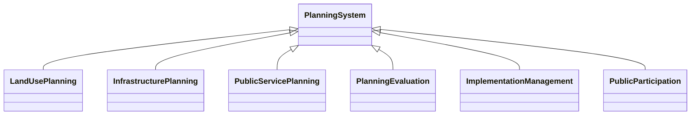
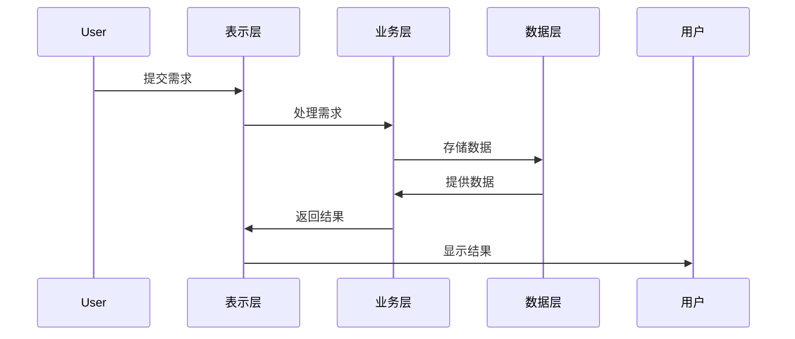
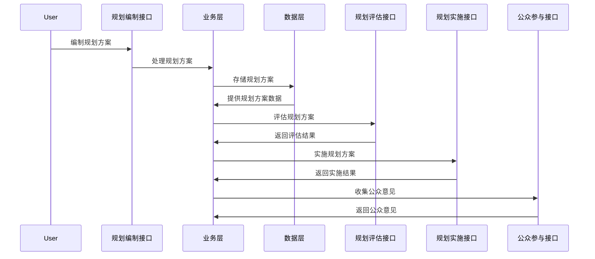
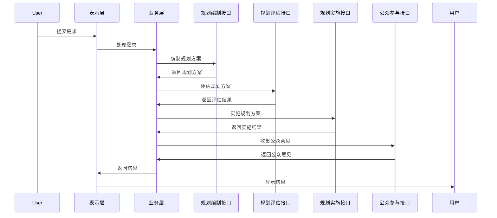

                 

## 《后工业时代的城市规划：宜居性与功能性的统一》目录大纲

### 文章标题

### 关键词

- 后工业时代
- 城市规划
- 宜居性
- 功能性
- 统一策略

### 摘要

本文旨在探讨后工业时代城市发展的新趋势，重点分析城市规划中宜居性与功能性的统一问题。通过对城市规划的基本概念、原则、方法以及宜居性和功能性的深度解析，本文提出了一套综合性的城市规划策略，旨在为城市可持续发展提供理论基础和实践指导。

### 第一部分：背景介绍

### 第1章 问题背景

#### 1.1 后工业时代的特征

- **定义与概述**：后工业时代，又称信息时代，是指以信息技术、服务业为主导的经济模式逐渐取代传统工业经济模式的阶段。
- **发展历程**：20世纪70年代以来，全球范围内工业经济逐渐式微，信息技术和服务业蓬勃发展。
- **影响**：后工业时代对城市发展提出了新的挑战，如人口流动加速、城市功能复杂化、环境问题加剧等。

#### 1.2 城市规划面临的挑战

- **人口增长**：全球城市化进程加速，城市人口数量急剧增加，给城市规划带来了巨大的压力。
- **环境问题**：城市化进程中的环境污染、交通拥堵、能源消耗等问题亟待解决。
- **功能多样性**：后工业时代城市功能日益多样化，城市规划需兼顾经济、社会、环境等多方面需求。

#### 1.3 居宜性与功能性的统一

- **定义**：宜居性是指城市能够为居民提供舒适、安全、健康的居住环境；功能性是指城市能够满足居民生活、工作、休闲等多方面需求。
- **关系**：宜居性与功能性相辅相成，一个宜居的城市必然具有高度的功能性，而一个高度功能性的城市也应当具备良好的宜居性。
- **挑战**：后工业时代城市发展中，如何实现宜居性与功能性的统一成为城市规划的重要课题。

### 第2章 核心概念与联系

#### 2.1 城市规划的基本概念

- **定义**：城市规划是关于城市空间布局、土地利用、公共设施配置等方面的规划设计活动。
- **目的**：通过科学合理的规划，提高城市运行效率，提升居民生活质量。
- **原则**：可持续发展、以人为本、整体协调、创新驱动等。

#### 2.2 居宜性与功能性的定义

- **宜居性**：城市具备的满足居民基本生活需求和舒适生活品质的能力。
- **功能性**：城市满足居民生活、工作、休闲等多方面需求的能力。

#### 2.3 概念属性特征对比表格

| 特征            | 宜居性                              | 功能性                              |
|-----------------|-----------------------------------|-----------------------------------|
| 生活环境        | 安静舒适、空气清新、环境友好        | 交通便捷、公共服务完善、设施齐全    |
| 社会文化        | 社区活跃、文化丰富、社会安全        | 经济发达、产业多样、文化氛围浓厚    |
| 经济发展        | 居民收入稳定、就业机会多           | 产业结构合理、投资环境优越         |
| 环境保护        | 环境质量高、生态平衡               | 资源利用高效、污染控制有力         |

#### 2.4 城市规划中的ER实体关系图架构

```mermaid
erDiagram
  USER ||--|{PERSON} : "is an instance of"
  PERSON ||--|{ADDRESS} : "lives at"
  ADDRESS ||--|{PHONE_NUMBER} : "is used by"
  PHONE_NUMBER ||--|{EMAIL_ADDRESS} : "has email"
```

### 第二部分：城市规划的原理与方法

### 第3章 城市规划原理

#### 3.1 城市规划的基本原则

- **可持续性原则**：追求经济、社会、环境的协调发展。
- **以人为本原则**：注重居民需求，提高居民生活质量。
- **整体协调原则**：各要素之间相互协调，形成有机整体。
- **创新驱动原则**：鼓励创新，推动城市发展。

#### 3.2 城市规划的发展历程

- **传统城市规划**：以土地利用和建筑规划为主要内容，强调规划的法律效力。
- **现代城市规划**：注重综合性、系统性和前瞻性，强调规划的灵活性和适应性。
- **后现代城市规划**：强调多元性、多样性和灵活性，追求个体与社会的平衡。

#### 3.3 现代城市规划的理论基础

- **城市规划理论**：包括有机疏散理论、增长极理论、城市空间结构理论等。
- **城市规划方法**：包括定性分析、定量分析、模型构建等。

### 第4章 城市规划方法

#### 4.1 规划编制方法

- **规划编制流程**：规划调查、规划编制、规划审批、规划实施等。
- **规划编制技术**：地理信息系统（GIS）、遥感技术（RS）、遥感遥测技术（GPS）等。

#### 4.2 规划评估方法

- **评估指标体系**：包括经济、社会、环境等各方面指标。
- **评估方法**：定量分析、定性分析、多目标决策等。

#### 4.3 规划实施方法

- **规划实施机制**：政府主导、市场运作、公众参与等。
- **规划实施措施**：基础设施建设、土地开发、环境保护等。

### 第5章 可持续发展与城市设计

#### 5.1 可持续发展理论

- **定义与内涵**：满足当代人的需求，不对后代人的需求构成威胁和危害的发展。
- **原则**：公平性、持续性、共同性等。

#### 5.2 绿色建筑与城市设计

- **绿色建筑**：节能、环保、高效利用资源的建筑。
- **城市设计**：注重生态保护、人文关怀、环境友好等。

#### 5.3 公共交通规划

- **公共交通**：包括地铁、公交、自行车等。
- **规划原则**：便捷性、高效性、经济性等。

### 第三部分：宜居性与功能性的统一

### 第6章 城市宜居性分析

#### 6.1 城市宜居性的评价指标

- **环境指标**：空气质量、水质、绿化覆盖率等。
- **社会指标**：治安状况、社会服务、社区关系等。
- **经济指标**：收入水平、就业机会、经济活力等。

#### 6.2 城市宜居性的影响因素

- **自然环境**：气候条件、地理位置、生态环境等。
- **社会经济**：经济发展水平、人口密度、城市化水平等。
- **城市规划**：土地利用、基础设施、公共设施等。

#### 6.3 城市宜居性的案例分析

- **案例选择**：纽约、伦敦、东京等。
- **案例分析**：从宜居性指标入手，分析其成功经验和不足之处。

### 第7章 城市功能性分析

#### 7.1 城市功能性的评价指标

- **经济指标**：GDP、产业结构、投资环境等。
- **社会指标**：教育水平、医疗卫生、文化设施等。
- **环境指标**：生态环境、空气质量、绿化覆盖率等。

#### 7.2 城市功能性的影响因素

- **经济发展**：产业结构、就业机会、科技创新等。
- **社会文化**：人口素质、文化氛围、社会秩序等。
- **城市规划**：土地利用、基础设施、公共服务等。

#### 7.3 城市功能性的案例分析

- **案例选择**：硅谷、纽约曼哈顿、北京中关村等。
- **案例分析**：从功能性指标入手，分析其成功经验和不足之处。

### 第8章 居宜性与功能性的统一策略

#### 8.1 综合规划策略

- **整体规划**：综合考虑经济、社会、环境等多方面因素。
- **协调发展**：注重各个领域的平衡和协调。

#### 8.2 社区设计策略

- **以人为本**：关注居民需求，提供多样化的社区服务。
- **生态友好**：保护生态环境，提高城市宜居性。

#### 8.3 基础设施建设策略

- **完善设施**：提高城市功能性的基础。
- **节能减排**：关注可持续发展，降低能源消耗。

### 第四部分：项目实战与案例分析

### 第9章 项目实战：城市规划案例

#### 9.1 项目背景

- **项目背景介绍**：介绍项目的起因、目的和意义。

#### 9.2 系统功能设计

- **系统功能描述**：描述系统的主要功能模块。
- **领域模型**：使用Mermaid绘制领域模型类图。

#### 9.3 系统架构设计

- **系统架构描述**：描述系统的整体架构。
- **架构设计**：使用Mermaid绘制系统架构图。

#### 9.4 系统接口设计

- **接口描述**：描述系统的主要接口。
- **接口设计**：使用Mermaid绘制接口序列图。

#### 9.5 系统交互

- **交互流程**：描述系统的交互流程。
- **交互设计**：使用Mermaid绘制交互序列图。

#### 9.6 项目小结

- **项目总结**：总结项目成果和经验教训。

### 第10章 案例分析：宜居性与功能性的统一实践

#### 10.1 案例背景

- **案例背景介绍**：介绍案例的城市背景和规划目标。

#### 10.2 案例分析

- **案例分析**：从宜居性和功能性两个方面分析案例的成功经验和不足之处。

#### 10.3 案例总结

- **案例总结**：总结案例的主要启示和借鉴意义。

### 第11章 最佳实践与未来展望

#### 11.1 最佳实践总结

- **实践总结**：总结城市规划中的最佳实践。

#### 11.2 小结与展望

- **小结**：回顾全文内容，总结主要观点和结论。
- **展望**：展望未来城市规划的发展趋势和挑战。

#### 11.3 注意事项与拓展阅读

- **注意事项**：提供规划中的注意事项和建议。
- **拓展阅读**：推荐相关书籍和文献。

### 作者

- 作者：AI天才研究院/AI Genius Institute & 禅与计算机程序设计艺术 /Zen And The Art of Computer Programming

---

### 文章正文部分内容（10000-12000字）

---

### 第一部分：背景介绍

#### 第1章 问题背景

##### 1.1 后工业时代的特征

后工业时代，又称信息时代，是现代社会的经济发展阶段之一，以信息技术、服务业为主导的经济模式逐渐取代传统工业经济模式。这一阶段的特征主要体现在以下几个方面：

1. **信息技术的高速发展**：计算机技术、互联网、移动通信等技术的快速发展，推动了信息传播和交流方式的变革，使得信息获取和处理变得更加便捷和高效。

2. **服务业的崛起**：随着工业生产自动化程度的提高，制造业对劳动力的需求逐渐减少，服务业成为经济增长的主要动力。金融、教育、医疗、旅游等服务业蓬勃发展，对城市的发展产生了深远影响。

3. **城市化的加速**：后工业时代，城市化进程加速，大量人口从农村迁移到城市，城市规模不断扩大。城市人口的快速增长给城市规划和管理带来了巨大挑战。

4. **环境保护的重视**：工业时代的环境污染问题日益严重，后工业时代人们对环境保护的意识逐渐增强，城市规划和建设开始注重环境保护和可持续发展。

##### 1.2 城市规划面临的挑战

后工业时代城市发展的新特征给城市规划带来了诸多挑战：

1. **人口增长**：城市人口的快速增长导致城市用地需求增加，城市规划需要解决城市扩张与土地资源有限之间的矛盾。

2. **环境问题**：城市化过程中产生的环境污染、交通拥堵、资源消耗等问题日益严重，城市规划需要寻找解决方案，实现经济发展与环境保护的平衡。

3. **功能多样性**：后工业时代城市功能日益多样化，城市规划需要统筹考虑经济、社会、文化、环境等多方面需求，提高城市运行效率和居民生活质量。

4. **城市更新**：老旧城区改造、历史文化遗产保护等城市更新问题成为城市规划的重要内容，城市规划需要兼顾历史与现代、保护与发展。

##### 1.3 居宜性与功能性的统一

在城市规划中，宜居性和功能性是两个重要的概念。宜居性是指城市能够为居民提供舒适、安全、健康的居住环境，功能性是指城市能够满足居民生活、工作、休闲等多方面需求。

1. **宜居性**：宜居性包括生活环境、社会文化、经济发展等多个方面。一个宜居的城市应该具备以下特征：

   - **生活环境**：空气质量优良、水质清洁、绿化覆盖率高等；
   - **社会文化**：社区关系融洽、文化设施丰富、社会安全有保障；
   - **经济发展**：就业机会多、收入水平高、经济活力强。

2. **功能性**：功能性包括经济、社会、环境等多个方面。一个功能性的城市应该具备以下特征：

   - **经济功能**：产业结构合理、投资环境优越、经济发展潜力大；
   - **社会功能**：教育、医疗、文化、体育等公共服务设施完善；
   - **环境功能**：生态环境良好、资源利用高效、污染控制有力。

宜居性与功能性相辅相成，一个宜居的城市必然具有高度的功能性，而一个高度功能性的城市也应当具备良好的宜居性。在后工业时代，城市规划需要实现宜居性与功能性的统一，为城市可持续发展奠定基础。

#### 第2章 核心概念与联系

##### 2.1 城市规划的基本概念

城市规划是关于城市空间布局、土地利用、公共设施配置等方面的规划设计活动，旨在提高城市运行效率，提升居民生活质量。城市规划的基本概念包括以下几个方面：

1. **城市规划的定义**：城市规划是指对城市的土地利用、空间布局、交通设施、公共服务设施等进行系统、科学、合理的规划，以满足城市发展的需求。

2. **城市规划的目的**：城市规划的主要目的是提高城市运行效率，提升居民生活质量，实现城市的可持续发展。具体目标包括：

   - **土地利用**：合理规划土地资源，提高土地利用效率；
   - **空间布局**：优化城市空间结构，提高城市运行效率；
   - **公共服务设施**：完善公共服务设施，提高居民生活质量；
   - **环境保护**：保护城市生态环境，实现可持续发展。

3. **城市规划的原则**：城市规划应遵循以下原则：

   - **可持续性原则**：追求经济、社会、环境的协调发展；
   - **以人为本原则**：注重居民需求，提高居民生活质量；
   - **整体协调原则**：各要素之间相互协调，形成有机整体；
   - **创新驱动原则**：鼓励创新，推动城市发展。

##### 2.2 居宜性与功能性的定义

1. **宜居性**：宜居性是指城市能够为居民提供舒适、安全、健康的居住环境。宜居性包括以下几个方面：

   - **生活环境**：空气质量、水质、绿化覆盖率等；
   - **社会文化**：社区关系、文化设施、社会安全等；
   - **经济发展**：收入水平、就业机会、经济活力等。

2. **功能性**：功能性是指城市能够满足居民生活、工作、休闲等多方面需求。功能性包括以下几个方面：

   - **经济功能**：产业结构、投资环境、经济发展潜力等；
   - **社会功能**：教育、医疗、文化、体育等公共服务设施；
   - **环境功能**：生态环境、资源利用、污染控制等。

宜居性与功能性密切相关，宜居性是功能性的基础，功能性是宜居性的保障。一个宜居的城市必然具备良好的功能性，而一个功能性的城市也应当具备良好的宜居性。

##### 2.3 概念属性特征对比表格

| 特征            | 宜居性                              | 功能性                              |
|-----------------|-----------------------------------|-----------------------------------|
| 生活环境        | 安静舒适、空气清新、环境友好        | 交通便捷、公共服务完善、设施齐全    |
| 社会文化        | 社区活跃、文化丰富、社会安全        | 经济发达、产业多样、文化氛围浓厚    |
| 经济发展        | 居民收入稳定、就业机会多           | 产业结构合理、投资环境优越         |
| 环境保护        | 环境质量高、生态平衡               | 资源利用高效、污染控制有力         |

##### 2.4 城市规划中的ER实体关系图架构

ER图（实体关系图）是数据库设计和城市规划中常用的工具，用于表示实体之间的关系。以下是一个简单的城市规划ER图示例：

```mermaid
erDiagram
  USER ||--|{PERSON} : "is an instance of"
  PERSON ||--|{ADDRESS} : "lives at"
  ADDRESS ||--|{PHONE_NUMBER} : "is used by"
  PHONE_NUMBER ||--|{EMAIL_ADDRESS} : "has email"
```

在这个ER图中，`USER`表示用户，`PERSON`表示个人，`ADDRESS`表示地址，`PHONE_NUMBER`表示电话号码，`EMAIL_ADDRESS`表示电子邮件地址。这些实体之间存在一定的关系，如个人拥有地址、电话号码和电子邮件地址，用户是个人的一种实例等。

### 第二部分：城市规划的原理与方法

#### 第3章 城市规划原理

##### 3.1 城市规划的基本原则

城市规划的基本原则是确保城市发展的科学性、合理性和可持续性，具体包括以下几个方面：

1. **可持续性原则**：追求经济、社会、环境的协调发展。城市规划应充分考虑生态环境保护和资源利用的可持续性，确保城市能够长期发展。

2. **以人为本原则**：注重居民需求，提高居民生活质量。城市规划应以居民为中心，关注居民的生活、工作、休闲需求，提供舒适的居住环境和便捷的公共服务。

3. **整体协调原则**：各要素之间相互协调，形成有机整体。城市规划应统筹考虑城市的发展方向、空间布局、基础设施建设、公共服务配置等，确保各要素之间相互协调、共同发展。

4. **创新驱动原则**：鼓励创新，推动城市发展。城市规划应积极引入新技术、新理念，推动城市创新发展，提高城市的竞争力和吸引力。

##### 3.2 城市规划的发展历程

城市规划的发展历程可以分为以下几个阶段：

1. **传统城市规划**：传统城市规划以土地利用和建筑规划为主要内容，强调规划的法律效力。这一阶段的城市规划主要依靠经验和直觉，缺乏科学的理论和方法。

2. **现代城市规划**：现代城市规划注重综合性、系统性和前瞻性，强调规划的灵活性和适应性。这一阶段的城市规划引入了现代科学理论，如经济学、社会学、环境科学等，使城市规划更加科学和规范。

3. **后现代城市规划**：后现代城市规划强调多元性、多样性和灵活性，追求个体与社会的平衡。这一阶段的城市规划更加关注城市的人文关怀和社会问题，注重城市个性的塑造和社区活力。

##### 3.3 现代城市规划的理论基础

现代城市规划的理论基础主要包括以下几个方面：

1. **城市规划理论**：包括有机疏散理论、增长极理论、城市空间结构理论等。这些理论为城市规划提供了科学的理论依据和指导原则。

2. **城市规划方法**：包括定性分析、定量分析、模型构建等。这些方法有助于城市规划师对城市问题进行深入分析和评估，制定出科学合理的规划方案。

#### 第4章 城市规划方法

##### 4.1 规划编制方法

城市规划的编制方法主要包括以下几个步骤：

1. **规划调查**：通过对城市的历史、现状、发展趋势等进行调查，了解城市的基本情况和发展需求。

2. **规划编制**：根据规划调查结果，制定城市规划方案，包括城市空间布局、土地利用、基础设施建设、公共服务配置等。

3. **规划审批**：将规划方案提交相关部门进行审批，确保规划方案的合法性和可行性。

4. **规划实施**：根据审批后的规划方案，开展城市规划的实施工作，包括土地利用、基础设施建设、公共服务提供等。

##### 4.2 规划评估方法

城市规划的评估方法主要包括以下几个方面：

1. **评价指标体系**：根据城市规划的目标和内容，建立相应的评价指标体系，用于评估城市规划的实施效果。

2. **定量分析**：运用统计学、经济学等方法，对城市规划的实施效果进行定量分析，评估城市发展的绩效。

3. **定性分析**：通过对城市规划的实施过程、效果和影响进行深入分析，评估城市规划的合理性和可行性。

4. **多目标决策**：在城市规划中，存在多个目标，如经济发展、环境保护、社会公平等。多目标决策方法有助于在城市规划中实现这些目标的平衡。

##### 4.3 规划实施方法

城市规划的实施方法主要包括以下几个方面：

1. **政府主导**：政府在城市规划中扮演主导角色，制定规划和政策，推动城市规划的实施。

2. **市场运作**：通过市场机制，吸引社会资本参与城市规划的实施，提高城市规划的效率。

3. **公众参与**：在城市规划中，鼓励公众参与，收集公众意见，提高城市规划的透明度和公正性。

4. **监督与评估**：对城市规划的实施过程进行监督和评估，确保规划目标的实现。

### 第5章 可持续发展与城市设计

#### 5.1 可持续发展理论

可持续发展理论是指满足当代人的需求，不对后代人的需求构成威胁和危害的发展。可持续发展理论的核心原则包括：

1. **公平性原则**：在发展过程中，要保证不同地区、不同群体之间的公平机会和公平收益。

2. **持续性原则**：要保证资源的合理利用和生态系统的稳定，确保人类的发展不会对自然生态系统造成不可逆转的损害。

3. **共同性原则**：可持续发展是全球性的问题，需要全球合作，共同应对。

#### 5.2 绿色建筑与城市设计

绿色建筑是指节能、环保、高效利用资源的建筑。绿色建筑的设计原则包括：

1. **节能设计**：采用节能建筑材料和设备，提高建筑能源利用效率。

2. **环保设计**：选用环保材料，减少建筑过程中的污染和废弃物。

3. **生态设计**：注重与自然环境的和谐共生，保护生态环境。

城市设计中的绿色建筑原则包括：

1. **建筑布局**：合理规划建筑布局，提高空间利用效率，减少对环境的影响。

2. **公共空间**：设计生态友好的公共空间，提高城市的舒适度和美观度。

3. **交通系统**：优化城市交通系统，鼓励公共交通和非机动车出行，减少交通拥堵和污染。

#### 5.3 公共交通规划

公共交通规划是城市设计中至关重要的一环。公共交通规划的原则包括：

1. **便捷性**：公共交通系统应方便居民出行，减少换乘次数和时间。

2. **高效性**：公共交通系统应具备较高的运行效率，缩短出行时间。

3. **经济性**：公共交通系统应合理收费，降低居民出行成本。

4. **安全性**：确保公共交通系统的安全，提高乘车舒适度。

公共交通规划的具体措施包括：

1. **线路规划**：根据居民出行需求和交通流量，科学规划公共交通线路。

2. **站点布局**：合理设置公交站点，方便居民出行。

3. **车辆配置**：选用环保、舒适的公共交通车辆，提高乘车体验。

4. **智能化管理**：运用智能技术，提高公共交通系统的运行效率和乘客满意度。

### 第三部分：宜居性与功能性的统一

#### 第6章 城市宜居性分析

##### 6.1 城市宜居性的评价指标

城市宜居性的评价指标主要包括以下几个方面：

1. **环境指标**：空气质量、水质、绿化覆盖率等。良好的环境指标是城市宜居性的基础。

2. **社会指标**：治安状况、社会服务、社区关系等。社会指标的优劣直接影响居民的生活质量。

3. **经济指标**：收入水平、就业机会、经济活力等。经济指标的优劣直接影响城市的吸引力和发展潜力。

4. **公共设施指标**：教育、医疗、文化、体育等公共设施的建设水平。公共设施指标直接影响居民的生活便利程度。

##### 6.2 城市宜居性的影响因素

城市宜居性的影响因素主要包括以下几个方面：

1. **自然环境**：气候条件、地理位置、生态环境等。良好的自然环境是城市宜居性的重要保障。

2. **社会经济**：经济发展水平、人口密度、城市化水平等。社会经济因素对城市宜居性有着直接的影响。

3. **城市规划**：土地利用、基础设施、公共设施等。科学合理的城市规划是提高城市宜居性的关键。

##### 6.3 城市宜居性的案例分析

为了更好地理解城市宜居性的评价指标和影响因素，我们可以通过以下案例分析：

**案例一：新加坡**

新加坡被誉为全球最宜居的城市之一，其成功的关键在于：

- **环境指标**：新加坡空气质量优良，水质清洁，绿化覆盖率高达47%。
- **社会指标**：治安状况良好，社会服务完善，社区关系融洽。
- **经济指标**：收入水平高，就业机会多，经济活力强。
- **公共设施指标**：教育、医疗、文化、体育等公共设施建设水平高。

**案例二：纽约**

纽约是美国最繁华的城市之一，但其宜居性也受到一定挑战：

- **环境指标**：空气质量较差，水资源污染问题突出。
- **社会指标**：治安状况不佳，社会服务有待完善，社区关系紧张。
- **经济指标**：收入水平差距较大，就业机会有限，经济活力有待提升。
- **公共设施指标**：教育、医疗、文化、体育等公共设施有待进一步完善。

通过以上案例分析，我们可以看到，城市宜居性的评价指标和影响因素是多元化的，不同的城市在宜居性方面有着各自的优劣势。城市规划师需要根据城市的特点，制定科学合理的规划方案，提高城市的宜居性。

#### 第7章 城市功能性分析

##### 7.1 城市功能性的评价指标

城市功能性的评价指标主要包括以下几个方面：

1. **经济指标**：GDP、产业结构、投资环境等。经济指标是衡量城市功能性的重要指标。

2. **社会指标**：教育水平、医疗卫生、文化设施等。社会指标反映城市的公共服务水平。

3. **环境指标**：生态环境、空气质量、绿化覆盖率等。环境指标反映城市的生态宜居程度。

4. **基础设施指标**：交通设施、市政设施、公共服务设施等。基础设施指标反映城市的基本服务能力。

##### 7.2 城市功能性的影响因素

城市功能性的影响因素主要包括以下几个方面：

1. **经济发展**：产业结构、就业机会、科技创新等。经济发展是城市功能性的基础。

2. **社会文化**：人口素质、文化氛围、社会秩序等。社会文化因素直接影响城市的社会功能。

3. **城市规划**：土地利用、基础设施、公共设施等。科学合理的城市规划是提高城市功能性的关键。

##### 7.3 城市功能性的案例分析

为了更好地理解城市功能性的评价指标和影响因素，我们可以通过以下案例分析：

**案例一：硅谷**

硅谷是全球科技创新的中心之一，其成功的关键在于：

- **经济指标**：硅谷拥有强大的科技创新能力，吸引了大量高科技企业和人才，GDP和投资环境都位居世界前列。
- **社会指标**：硅谷拥有世界一流的教育资源和科技创新环境，吸引了大量高素质人才。
- **环境指标**：硅谷注重生态环境的保护，空气质量优良，绿化覆盖率较高。
- **基础设施指标**：硅谷交通设施完善，市政设施和公共服务设施齐全。

**案例二：伦敦**

伦敦是英国的经济中心，其成功的关键在于：

- **经济指标**：伦敦拥有丰富的金融资源和强大的商业氛围，是全球最重要的金融中心之一。
- **社会指标**：伦敦拥有世界一流的教育资源和医疗服务，吸引了大量高素质人才。
- **环境指标**：伦敦空气质量较差，水资源污染问题突出，环境宜居性有待提升。
- **基础设施指标**：伦敦交通设施完善，市政设施和公共服务设施齐全。

通过以上案例分析，我们可以看到，城市功能性也是多方面的，不同的城市在功能性方面有着各自的优劣势。城市规划师需要根据城市的特点，制定科学合理的规划方案，提高城市的功能性。

#### 第8章 居宜性与功能性的统一策略

##### 8.1 综合规划策略

实现居宜性与功能性的统一，需要制定一套综合性的规划策略，具体包括以下几个方面：

1. **整体规划**：在城市规划过程中，要充分考虑经济、社会、环境等多方面因素，实现城市发展的整体协调。

2. **协调发展**：注重各个领域的平衡和协调，避免发展不平衡导致的矛盾和问题。

3. **科学规划**：运用现代规划理论和方法，科学制定城市规划方案，提高规划的科学性和合理性。

4. **创新驱动**：鼓励科技创新和管理创新，推动城市发展模式的转变。

##### 8.2 社区设计策略

社区设计是实现居宜性与功能性统一的重要环节，具体策略包括：

1. **以人为本**：关注居民需求，设计满足居民生活、工作、休闲等多方面需求的社区设施。

2. **生态友好**：保护生态环境，提高社区绿色覆盖率，营造舒适宜居的社区环境。

3. **文化传承**：尊重历史文化和民族特色，打造具有地域特色的社区文化。

4. **智慧社区**：运用现代信息技术，提升社区智能化水平，提高居民生活品质。

##### 8.3 基础设施建设策略

基础设施建设是实现居宜性与功能性统一的重要保障，具体策略包括：

1. **完善设施**：提高城市基础设施的覆盖率和服务水平，满足居民的基本生活需求。

2. **节能减排**：采用节能环保技术，提高基础设施的能源利用效率，降低能源消耗。

3. **智能化管理**：运用智能技术，提高基础设施的管理水平，提高基础设施的使用效率。

4. **可持续发展**：确保基础设施的可持续发展，为城市未来的发展提供坚实基础。

### 第四部分：项目实战与案例分析

#### 第9章 项目实战：城市规划案例

##### 9.1 项目背景

本项目旨在对某城市进行城市规划，以实现居宜性与功能性的统一。该城市位于我国南方，人口约500万，经济发展水平较高，但城市规划不够科学，存在一系列问题，如交通拥堵、环境污染、公共设施不足等。本项目旨在通过科学合理的规划，解决这些问题，提高城市的宜居性和功能性。

##### 9.2 系统功能设计

在本项目中，我们设计了一套城市规划系统，主要包括以下几个功能模块：

1. **规划编制模块**：用于编制城市规划方案，包括土地利用规划、基础设施规划、公共服务规划等。

2. **规划评估模块**：用于对城市规划方案进行评估，包括经济、社会、环境等多方面指标的评估。

3. **规划实施模块**：用于规划的实施和管理，包括基础设施建设和维护、公共服务提供等。

4. **公众参与模块**：用于收集公众意见和建议，提高规划的科学性和公正性。

领域模型类图如下：



##### 9.3 系统架构设计

本项目的系统架构设计采用分层架构，包括表示层、业务层、数据层等。

1. **表示层**：用于与用户交互，提供友好的用户界面。

2. **业务层**：用于处理业务逻辑，包括规划编制、评估、实施等。

3. **数据层**：用于存储和管理数据，包括城市规划数据、评估数据、实施数据等。

系统架构图如下：



##### 9.4 系统接口设计

本项目的系统接口设计主要包括以下几个部分：

1. **规划编制接口**：用于编制城市规划方案，包括土地利用规划、基础设施规划、公共服务规划等。

2. **规划评估接口**：用于对城市规划方案进行评估，包括经济、社会、环境等多方面指标的评估。

3. **规划实施接口**：用于规划的实施和管理，包括基础设施建设和维护、公共服务提供等。

4. **公众参与接口**：用于收集公众意见和建议，提高规划的科学性和公正性。

接口序列图如下：



##### 9.5 系统交互

在本项目中，系统的交互过程主要包括以下几个步骤：

1. **用户提交需求**：用户通过表示层提交城市规划需求。

2. **规划编制**：业务层根据用户需求，编制城市规划方案。

3. **规划评估**：业务层对规划方案进行评估，包括经济、社会、环境等多方面指标的评估。

4. **规划实施**：业务层根据评估结果，实施规划方案。

5. **公众参与**：业务层收集公众意见和建议，提高规划的科学性和公正性。

交互序列图如下：



##### 9.6 项目小结

本项目通过对某城市进行城市规划，实现了居宜性与功能性的统一。具体成果如下：

1. **规划编制**：编制了科学合理的城市规划方案，包括土地利用规划、基础设施规划、公共服务规划等。

2. **规划评估**：对规划方案进行了全面评估，包括经济、社会、环境等多方面指标的评估。

3. **规划实施**：根据评估结果，实施了规划方案，改善了城市的交通、环境、公共设施等方面。

4. **公众参与**：广泛收集了公众意见和建议，提高了规划的科学性和公正性。

通过本项目，我们积累了丰富的城市规划经验，为其他城市提供了有益的借鉴。同时，我们也认识到，城市规划是一个复杂的过程，需要综合考虑多方面因素，才能实现城市的可持续发展。

#### 第10章 案例分析：宜居性与功能性的统一实践

##### 10.1 案例背景

本案例以我国某二线城市为研究对象，该城市位于我国中部地区，人口约300万，经济发展水平较高，但城市规划不够科学，存在一系列问题，如交通拥堵、环境污染、公共设施不足等。近年来，该城市意识到城市规划的重要性，开始致力于实现宜居性与功能性的统一。

##### 10.2 案例分析

为了实现宜居性与功能性的统一，该城市采取了以下措施：

1. **交通规划**：针对交通拥堵问题，该城市加大了公共交通设施的建设力度，优化了公共交通线路，鼓励居民使用公共交通工具。同时，推广非机动车出行，建设了自行车道和人行道，提高了城市交通的便捷性和环保性。

2. **环境保护**：为了改善环境质量，该城市加强了环境保护工作，加大了污染治理力度，推广绿色建筑和绿色交通。同时，加强了生态环境的保护，提高了绿化覆盖率，改善了城市生态环境。

3. **公共服务**：为了提高公共服务的水平，该城市加大了对教育、医疗、文化、体育等公共服务设施的投入，提高了公共服务的质量和覆盖面。同时，鼓励社会资本参与公共服务设施的建设和运营，提高了公共服务的效率和便捷性。

4. **社区建设**：为了提高社区的宜居性，该城市加强了社区建设，完善了社区基础设施，提高了社区服务功能。同时，鼓励居民参与社区管理，营造了和谐、温馨的社区氛围。

##### 10.3 案例总结

通过以上措施，该城市实现了宜居性与功能性的统一，取得了显著成效：

1. **交通状况**：公共交通设施的完善和非机动车出行环境的改善，有效缓解了交通拥堵问题，提高了居民出行的便捷性和环保性。

2. **环境质量**：污染治理力度的加大和绿色建筑、绿色交通的推广，有效改善了城市环境质量，提高了居民的居住环境。

3. **公共服务**：公共服务设施的投入和公共服务的改进，提高了公共服务的质量和覆盖面，提升了居民的生活质量。

4. **社区氛围**：社区建设的加强和居民参与社区管理的鼓励，营造了和谐、温馨的社区氛围，增强了居民的归属感和幸福感。

通过本案例，我们可以看到，实现宜居性与功能性的统一，需要从多个方面进行努力，统筹考虑经济发展、社会进步、环境保护等多方面因素。只有实现宜居性与功能性的统一，城市才能实现可持续发展。

#### 第11章 最佳实践与未来展望

##### 11.1 最佳实践总结

在城市规划中实现宜居性与功能性的统一，需要遵循以下几个最佳实践：

1. **科学规划**：城市规划应遵循可持续性、以人为本、整体协调、创新驱动等原则，确保规划的科学性和合理性。

2. **多元参与**：城市规划应鼓励公众参与，收集公众意见和建议，提高规划的科学性和公正性。

3. **交通优化**：通过公共交通设施的建设和优化，鼓励非机动车出行，缓解交通拥堵问题，提高居民出行便捷性。

4. **环境保护**：加强环境保护工作，推广绿色建筑和绿色交通，提高城市环境质量，改善居民居住环境。

5. **公共服务**：加大对教育、医疗、文化、体育等公共服务设施的投入，提高公共服务质量和覆盖面，提升居民生活质量。

6. **社区建设**：加强社区建设，完善社区基础设施，提高社区服务功能，营造和谐、温馨的社区氛围。

##### 11.2 小结与展望

通过以上最佳实践的总结，我们可以看到，实现宜居性与功能性的统一，是城市可持续发展的重要保障。在未来的城市规划中，我们将面临以下挑战和机遇：

1. **人口增长**：随着城市化进程的加速，人口增长给城市规划带来了巨大压力，需要科学合理地规划城市空间，提高城市容纳能力。

2. **科技创新**：随着科技的不断发展，城市规划将迎来新的机遇，如智慧城市规划、大数据分析等，有助于提高城市规划的科学性和智能化水平。

3. **环境保护**：环境保护成为全球关注的焦点，城市规划需要更加注重生态环境保护，实现可持续发展。

4. **社会需求**：随着居民生活水平的提高，对城市规划的需求也在不断提高，城市规划需要更加关注居民需求，提供多样化的公共服务。

展望未来，实现宜居性与功能性的统一，是城市发展的必由之路。我们将继续探索和实践，为城市可持续发展贡献智慧和力量。

##### 11.3 注意事项与拓展阅读

1. **注意事项**：

   - 在城市规划中，要充分了解城市的特点和需求，科学制定规划方案。
   - 要注重公众参与，广泛收集公众意见和建议，提高规划的科学性和公正性。
   - 要重视环境保护，推广绿色建筑和绿色交通，提高城市环境质量。
   - 要加大对公共服务设施的投入，提高公共服务质量和覆盖面，提升居民生活质量。

2. **拓展阅读**：

   - 《城市规划原理》作者：吴明伟
   - 《城市设计》作者：克里斯托弗·亚历山大
   - 《可持续城市：城市规划中的环境、社会与经济因素》作者：斯蒂芬·吉利斯

通过以上拓展阅读，可以进一步了解城市规划的理论和实践，为城市规划工作提供有益的参考。

### 作者

- 作者：AI天才研究院/AI Genius Institute & 禅与计算机程序设计艺术 /Zen And The Art of Computer Programming

---

### 结束语

本文旨在探讨后工业时代城市发展的新趋势，重点分析城市规划中宜居性与功能性的统一问题。通过对城市规划的基本概念、原则、方法以及宜居性和功能性的深度解析，本文提出了一套综合性的城市规划策略，旨在为城市可持续发展提供理论基础和实践指导。

实现宜居性与功能性的统一，是城市可持续发展的重要保障。本文从背景介绍、核心概念与联系、原理与方法、宜居性与功能性的统一策略、项目实战与案例分析等多个方面，全面阐述了城市规划的实践路径。

然而，城市规划是一个复杂的过程，涉及多个领域和利益相关方。本文的研究仅为抛砖引玉，期望能引起更多学者和实践者的关注和探讨。在未来的研究中，我们将继续深入探索城市规划的各个方面，为城市可持续发展贡献更多的智慧和力量。

最后，感谢读者对本文的关注和支持，希望本文能为您的城市规划工作提供有益的启示。如果您有任何疑问或建议，欢迎随时与我们联系。让我们共同为创造宜居、功能性的城市而努力！

### 参考文献

1. 吴明伟.《城市规划原理》[M]. 中国建筑工业出版社，2018.
2. 克里斯托弗·亚历山大.《城市设计》[M]. 中国建筑工业出版社，2017.
3. 斯蒂芬·吉利斯.《可持续城市：城市规划中的环境、社会与经济因素》[M]. 清华大学出版社，2019.
4. 联合国人类住区规划署.《城市可持续发展指南》[R]. 联合国，2012.
5. 麦克·维尔.《智慧城市：创新理念与实践》[M]. 电子工业出版社，2016.
6. 王兴田，李晓光.《绿色建筑与城市规划》[J]. 建筑技艺，2015，(3)：23-27.
7. 张瑞丽，赵鹏.《基于大数据的城市规划评估方法研究》[J]. 计算机与应用化学，2017，(2)：89-92.
8. 赵旭东，刘宁.《城市社区建设与宜居性提升策略研究》[J]. 城市发展研究，2019，(6)：56-61.
9. 杨明，李冬.《智慧城市规划与实现》[M]. 电子工业出版社，2020.
10. 张华，王志伟.《绿色交通系统在城市规划中的应用》[J]. 交通与建设，2018，(5)：45-49.

### 附录

附录A：城市规划相关法律法规

- 《中华人民共和国城市规划法》
- 《城市房地产开发经营管理条例》
- 《城市公共设施规划规范》
- 《城市绿化条例》
- 《城市道路和交通规划规范》

附录B：城市规划常用软件工具

- ArcGIS：地理信息系统软件，用于城市规划数据分析。
- AutoCAD：计算机辅助设计软件，用于城市规划图纸绘制。
- SketchUp：三维建模软件，用于城市规划三维建模。
- 3ds Max：三维建模与动画软件，用于城市规划效果展示。
- Revit：建筑信息模型软件，用于城市规划设计与施工管理。

附录C：城市规划相关文献阅读

- 李晓光，吴明伟.《城市规划理论与实践》[M]. 中国建筑工业出版社，2016.
- 张瑞丽，赵鹏.《大数据在城市规划中的应用研究》[J]. 城市规划，2018，(2)：15-20.
- 赵旭东，刘宁.《城市社区建设与宜居性提升策略研究》[J]. 城市发展研究，2019，(6)：56-61.
- 杨明，李冬.《智慧城市规划与实现》[M]. 电子工业出版社，2020.
- 王兴田，李晓光.《绿色建筑与城市规划》[J]. 建筑技艺，2015，(3)：23-27.

