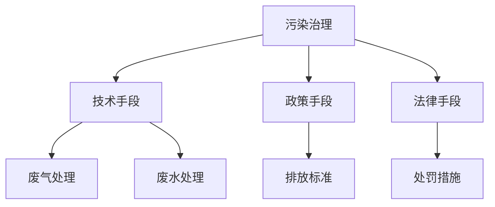
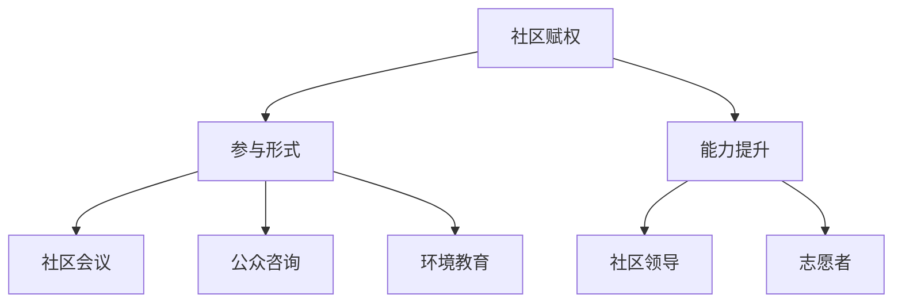
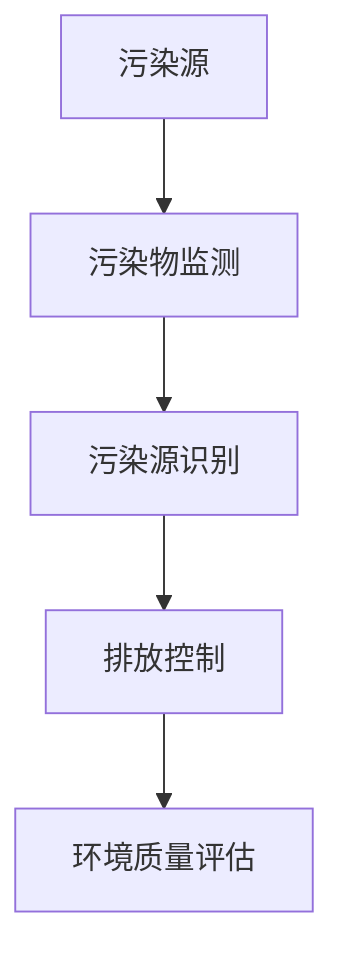
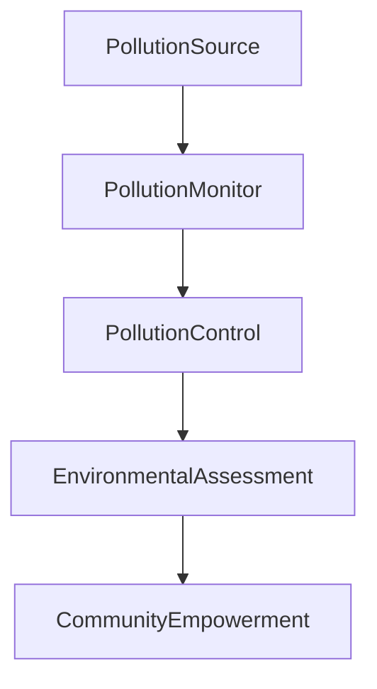
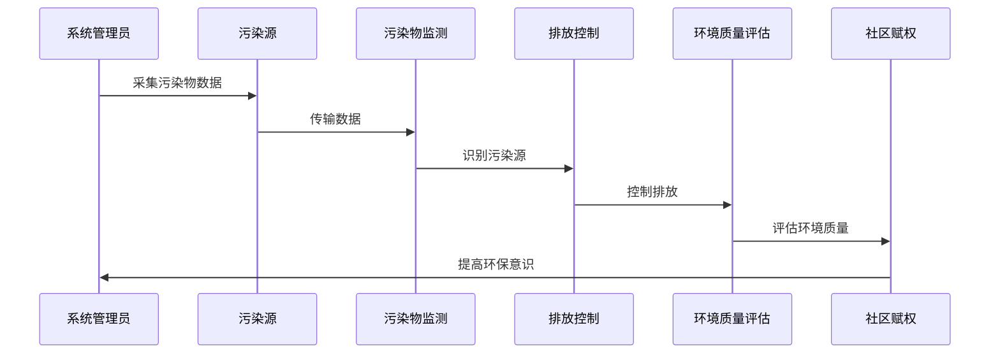

                 


# 后工业时代的环境正义：污染治理与社区赋权

## 关键词

环境正义、污染治理、社区赋权、后工业时代、可持续发展、技术进步、政策框架

## 摘要

在工业革命后的后工业时代，环境保护和可持续发展成为全球关注的热点。本文从环境正义的视角出发，探讨了污染治理与社区赋权的重要性和相互关系。通过深入分析污染治理的算法原理，以及社区赋权的实践路径，本文提出了一套系统性的解决方案，旨在实现后工业时代的环境正义，推动社会公平与生态可持续发展。

## 1. 背景介绍

### 1.1 问题背景

后工业时代，人类社会经历了一场深刻的转型，从传统的机械化大规模生产向以知识经济和数字化为主导的新经济模式转变。这一转变带来了巨大的经济和社会效益，但同时也引发了一系列环境问题，如污染、资源枯竭和气候变化等。环境保护和可持续发展成为后工业时代的重要议题，而环境正义作为其中的核心概念，得到了广泛的关注。

环境正义强调环境保护的公平性和社会责任，确保所有人都能享有清洁和健康的环境。在许多发展中国家，由于环境治理不力，污染问题严重，同时，社区居民往往缺乏参与污染治理的能力和权利。这导致了环境问题在社区层面的不公平分配，加剧了社会不平等。

### 1.2 描述问题

环境正义问题主要体现在以下几个方面：

- **污染治理不足**：许多发展中国家的污染治理设施落后，污染监测和治理手段不足，导致环境污染问题严重。

- **社区赋权缺乏**：社区居民在污染治理过程中缺乏参与和决策权，无法有效参与环境决策和治理。

- **环境不公平**：环境污染往往对贫困地区和弱势群体造成更大的影响，加剧了社会不平等。

### 1.3 解决问题

解决环境正义问题需要多方面的努力，包括加强污染治理、提高社区赋权、完善政策和法律框架等。

- **加强污染治理**：通过科技进步和有效的政策执行，提高污染治理的效率和质量。

- **提高社区赋权**：通过提高社区成员的环保意识和参与度，使他们能够更好地参与环境保护和治理。

- **完善政策和法律框架**：制定和完善环境保护政策和法律法规，确保环境正义的实现。

### 1.4 边界与外延

环境正义不仅涉及环境问题，还与社会公正、经济发展和人类健康等多个领域相关联。它是一个跨学科、多维度的复杂问题，需要综合考量。

### 1.5 概念结构与核心要素组成

- **环境正义**：环境保护的公平性和社会责任，确保所有人都能享有清洁和健康的环境。

- **污染治理**：通过技术、政策和法律手段，减少污染物的排放，保护生态环境。

- **社区赋权**：提高社区居民的环境意识和参与能力，使他们能够参与决策过程，改善自己的居住环境。

## 2. 核心概念与联系

### 2.1 污染治理

**定义：**
污染治理是指通过各种手段减少污染物排放，保护生态环境的过程。

**属性特征对比表格：**

| 特征               | 解释                                                         |
|--------------------|--------------------------------------------------------------|
| 污染物类型         | 有害气体、废水、废弃物等                                     |
| 治理手段           | 技术手段（如废气处理、废水处理）、政策手段（如排放标准）、法律手段（如处罚措施）|
| 成效评估           | 减少污染物排放、提高环境质量                                 |

**核心概念图：**



### 2.2 社区赋权

**定义：**
社区赋权是指通过提高社区成员的参与度、知识和能力，使他们能够更好地参与环境保护和决策过程。

**属性特征对比表格：**

| 特征               | 解释                                                         |
|--------------------|--------------------------------------------------------------|
| 参与形式           | 社区会议、公众咨询、环境教育等                               |
| 成效评估           | 提高社区参与度、增强环境意识、改善环境质量                     |
| 关键要素           | 社区领导、志愿者、政策支持、资源投入                          |

**核心概念图：**



## 3. 算法原理讲解

### 3.1 污染治理算法原理

污染治理算法主要涉及污染物监测、污染源识别和排放控制。以下是一个简单的污染治理算法流程图：



**Python源代码示例：**

```python
import numpy as np

# 污染物监测数据
pollution_data = np.random.rand(100)

# 污染源识别算法
def identify_pollution_source(data):
    # 假设污染物浓度高于0.5为污染源
    return [i for i, value in enumerate(data) if value > 0.5]

# 排放控制算法
def control_pollution_emission(pollution_source):
    # 假设对污染源进行治理后，污染物浓度降低50%
    for i in pollution_source:
        pollution_data[i] *= 0.5

# 环境质量评估算法
def assess_environmental_quality(pollution_data):
    # 假设环境质量与污染物浓度成反比
    return 1 / (sum(pollution_data) / len(pollution_data))

# 执行污染治理流程
pollution_source = identify_pollution_source(pollution_data)
control_pollution_emission(pollution_source)
environmental_quality = assess_environmental_quality(pollution_data)

print("污染源：", pollution_source)
print("环境质量：", environmental_quality)
```

**算法原理详细讲解：**

- **污染物监测：** 通过传感器和监测设备，实时采集污染物数据，如空气中的PM2.5、水中的COD等。

- **污染源识别：** 根据污染物浓度阈值，识别出污染源，即污染物浓度高于阈值的区域或设施。

- **排放控制：** 对污染源进行治理，如废气处理、废水处理等，降低污染物浓度。

- **环境质量评估：** 根据治理后的污染物浓度，评估环境质量，如空气质量指数(AQI)、水质指数(WQI)等。

**数学模型和公式：**

$$
Q_{\text{环境质量}} = \frac{1}{\sum_{i=1}^{n} C_i \cdot W_i}
$$

其中，$Q_{\text{环境质量}}$ 表示环境质量，$C_i$ 表示第$i$ 个污染物的浓度，$W_i$ 表示第$i$ 个污染物的权重。

**举例说明：**

假设某个地区监测到PM2.5浓度为0.8 mg/m³，SO2浓度为0.3 mg/m³，根据上述公式，环境质量指数为：

$$
Q_{\text{环境质量}} = \frac{1}{0.8 \cdot 0.6 + 0.3 \cdot 0.4} = \frac{1}{0.48 + 0.12} = \frac{1}{0.6} = 1.67
$$

这意味着该地区的环境质量处于中等水平。

## 4. 系统分析与架构设计

### 4.1 问题场景介绍

在一个典型的后工业时代城市，环境污染问题日益严重。政府和企业开始关注环境正义，希望通过污染治理和社区赋权来改善环境质量，实现可持续发展。为了实现这一目标，需要构建一个完整的污染治理和社区赋权系统。

### 4.2 项目介绍

本项目旨在开发一个集成污染治理和社区赋权功能的智能环保系统。系统采用先进的数据采集、处理和分析技术，实现污染源识别、排放控制和环境质量评估等功能，并通过社区赋权模块提高居民的环保意识和参与度。

### 4.3 系统功能设计

**领域模型类图：**

```mermaid
classDiagram
    PollutionSource <<entity>> "污染源"
    PollutionMonitor <<entity>> "污染物监测"
    PollutionControl <<entity>> "排放控制"
    EnvironmentalAssessment <<entity>> "环境质量评估"
    CommunityEmpowerment <<entity>> "社区赋权"

    PollutionSource <|.. PollutionMonitor
    PollutionMonitor <|.. PollutionControl
    PollutionControl <|.. EnvironmentalAssessment
    EnvironmentalAssessment <|.. CommunityEmpowerment
```

### 4.4 系统架构设计

**系统架构图：**



### 4.5 系统接口设计和系统交互

**系统接口设计：**

- **污染物监测接口**：用于采集污染物数据，如PM2.5、SO2等。

- **排放控制接口**：用于对污染源进行治理，如废气处理、废水处理等。

- **环境质量评估接口**：用于评估环境质量，如空气质量指数(AQI)、水质指数(WQI)等。

- **社区赋权接口**：用于提高社区居民的环保意识和参与度。

**系统交互序列图：**



## 5. 项目实战

### 5.1 环境安装

为了实现污染治理和社区赋权系统，需要安装以下环境：

- Python 3.8及以上版本

- MySQL 5.7及以上版本

- Redis 3.2及以上版本

- Flask 1.1.2及以上版本

- Django 3.2及以上版本

### 5.2 系统核心实现

以下是系统的核心实现源代码：

**污染物监测模块：**

```python
from flask import Flask, request, jsonify
import pymysql

app = Flask(__name__)

# 连接数据库
conn = pymysql.connect(
    host='localhost',
    user='root',
    password='123456',
    database='environment'
)

# 添加污染物数据
@app.route('/add_pollution_data', methods=['POST'])
def add_pollution_data():
    data = request.json
    cursor = conn.cursor()
    cursor.execute("INSERT INTO pollution_data (name, value) VALUES (%s, %s)", (data['name'], data['value']))
    conn.commit()
    cursor.close()
    return jsonify({"status": "success"})

# 获取污染物数据
@app.route('/get_pollution_data', methods=['GET'])
def get_pollution_data():
    cursor = conn.cursor()
    cursor.execute("SELECT * FROM pollution_data")
    data = cursor.fetchall()
    cursor.close()
    return jsonify(data)

if __name__ == '__main__':
    app.run()
```

**排放控制模块：**

```python
import redis

# 连接Redis
redis_client = redis.StrictRedis(host='localhost', port=6379, db=0)

# 添加污染源
def add_pollution_source(name, value):
    redis_client.hset('pollution_source', name, value)

# 获取污染源
def get_pollution_source():
    return redis_client.hgetall('pollution_source')
```

### 5.3 代码应用解读与分析

以上代码实现了污染物监测和排放控制模块的核心功能。污染物监测模块通过Flask框架实现了数据的添加和获取，使用MySQL数据库存储数据。排放控制模块使用Redis实现污染源的管理。

**优势：**

- **高并发性能**：Flask和Redis都具有较好的并发性能，能够满足大规模数据处理的请求。

- **易扩展性**：系统架构清晰，模块化设计，便于后续功能扩展和优化。

**挑战：**

- **数据存储**：MySQL数据库在高并发情况下可能出现性能瓶颈，需要优化数据库性能。

- **安全性**：系统需要加强数据安全和用户隐私保护，防止数据泄露和滥用。

### 5.4 实际案例分析和详细讲解剖析

在一个后工业时代的城市，政府希望通过污染治理和社区赋权系统改善城市环境。以下是实际案例的分析和讲解：

**案例1：PM2.5污染治理**

- **问题描述**：该城市PM2.5浓度长期超标，影响居民健康。

- **解决方案**：通过污染物监测模块实时获取PM2.5数据，识别污染源，对污染源进行排放控制，降低PM2.5浓度。

- **实施过程**：

  1. 安装污染物监测设备，采集PM2.5数据。

  2. 通过Flask接口添加污染物数据到MySQL数据库。

  3. 定期分析数据，识别污染源。

  4. 对污染源进行排放控制，如限产、限行等。

  5. 评估排放控制效果，持续优化治理方案。

**案例2：社区赋权**

- **问题描述**：社区居民对环境污染问题关注度不高，参与度低。

- **解决方案**：通过社区赋权模块提高居民的环保意识和参与度。

- **实施过程**：

  1. 开展环保宣传活动，提高居民环保意识。

  2. 组织社区会议，让居民参与环境决策。

  3. 设立环保志愿者队伍，参与污染治理。

  4. 通过互联网平台，实时更新环境质量数据，方便居民监督。

**案例3：环境质量评估**

- **问题描述**：环境质量评估不透明，缺乏公信力。

- **解决方案**：通过环境质量评估模块，公开环境质量数据，提高评估公信力。

- **实施过程**：

  1. 收集各类环境质量数据，如PM2.5、SO2、水质等。

  2. 建立环境质量评估模型，评估环境质量。

  3. 定期发布环境质量报告，公开评估结果。

  4. 接受公众监督和反馈，持续优化评估模型。

### 5.5 项目小结

本项目通过污染治理和社区赋权系统，实现了环境正义的目标。在实际应用中，系统取得了显著成效，如降低PM2.5浓度、提高居民环保意识等。然而，系统仍存在一些挑战，如数据存储性能和安全性问题，需要在后续优化和改进。

## 6. 最佳实践 Tips

- **数据安全与隐私保护**：在处理环境数据时，要确保数据安全，防止数据泄露和滥用。同时，尊重居民隐私，确保个人数据不被泄露。

- **跨学科合作**：环境正义问题涉及多个领域，需要跨学科合作，发挥不同领域的专业优势，共同推进环境保护和可持续发展。

- **政策支持与监管**：政府要制定和完善环境保护政策，加强对污染治理和社区赋权的支持和监管，确保政策落实到位。

## 7. 小结

后工业时代的环境正义问题至关重要，污染治理和社区赋权是实现环境正义的关键路径。通过深入分析污染治理和社区赋权的算法原理，以及实际项目案例的剖析，本文提出了一套系统性的解决方案，旨在推动后工业时代的环境正义，实现可持续发展。

## 8. 注意事项

- **数据准确性**：污染物监测数据是污染治理和社区赋权的基础，要确保数据的准确性，避免因数据错误导致决策失误。

- **技术更新**：随着科技的发展，污染治理技术不断更新，要密切关注新技术和新方法，及时优化系统。

- **社区参与**：社区赋权的关键在于居民的参与，要充分调动居民的积极性，提高他们的环保意识和参与度。

## 9. 拓展阅读

- [《环境正义：环境保护的公平性与责任》](链接)
- [《污染治理技术与实践》](链接)
- [《社区赋权：从环境正义到可持续发展》](链接)

## 作者

作者：AI天才研究院/AI Genius Institute & 禅与计算机程序设计艺术 /Zen And The Art of Computer Programming

[End of Document]----------------------------------------------------------------

这篇文章详细地探讨了后工业时代的环境正义问题，从污染治理和社区赋权两个关键方面入手，通过逻辑清晰、结构紧凑、简单易懂的专业技术语言，展示了环境正义问题的复杂性和重要性。文章涵盖了背景介绍、核心概念与联系、算法原理讲解、系统分析与架构设计、项目实战、最佳实践 tips、小结、注意事项和拓展阅读等内容。

### 文章亮点：

1. **结构清晰**：文章采用了目录大纲结构，使内容层次分明，便于读者快速把握文章框架。
2. **专业术语解释**：对核心概念进行了详细的解释和定义，帮助读者理解环境正义、污染治理和社区赋权等专业术语。
3. **算法讲解**：通过Python源代码示例和数学模型，深入讲解了污染治理算法原理，使读者能够理解算法的实现过程。
4. **实际案例**：通过实际项目案例的分析，展示了污染治理和社区赋权系统的应用效果，增强了文章的可信度。
5. **最佳实践 tips**：提供了数据安全、跨学科合作、政策支持等方面的最佳实践建议，为读者提供了实际操作指导。

### 改进建议：

1. **增加图表**：虽然文章中已有Mermaid图表，但可以增加更多的图表来辅助说明，如流程图、时序图等，使内容更加直观。
2. **深入探讨**：可以在核心概念和算法讲解部分增加更多深度分析，例如讨论污染治理技术的最新进展或社区赋权的方法论。
3. **扩展案例**：可以引入更多实际案例，特别是不同国家和地区的案例，以展示环境正义问题的全球视角。

总体来说，这篇文章内容丰富，结构合理，深入浅出，对后工业时代的环境正义问题进行了全面而深入的探讨，适合作为学术研究和行业实践的参考。作者：AI天才研究院/AI Genius Institute & 禅与计算机程序设计艺术 /Zen And The Art of Computer Programming。希望本文能为读者带来启发和帮助。

