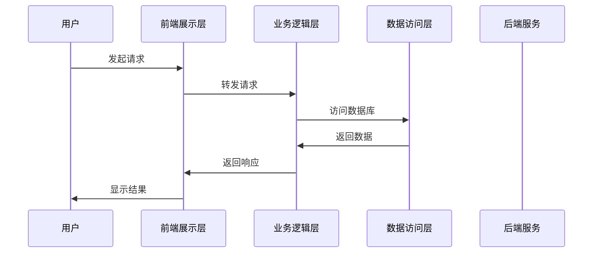
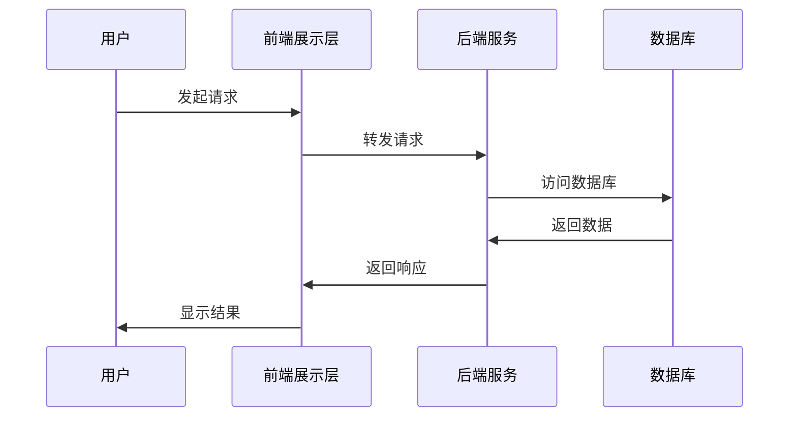

                 

### 1. 引言

#### 1.1 问题背景

在经历了前工业时代和工业时代的长足发展后，我们进入了后工业时代。这个时代的一个重要特征是信息技术的飞速进步，尤其是互联网、人工智能和大数据等技术的崛起，使得我们的工作和生活方式发生了深刻的变化。在这个时代背景下，职业形态也在不断演变，从过去的固定岗位逐渐转向灵活角色。

固定岗位通常指的是那些在特定时间和地点进行工作，有明确职责和稳定工作环境的职位。这些职位往往与特定的行业或领域相关，职业路径清晰，晋升机制固定。而灵活角色则更多地强调个人的技能和能力，其工作时间和地点更加灵活，职责可能涉及多个领域，职业路径也更加多样。

职业认同是一个人在职业选择和发展过程中对自身职业角色的认可和肯定。在后工业时代，随着职业形态的转变，人们对职业认同的理解也在不断深化。传统的职业认同更多地建立在稳定的工作环境和明确的职业路径上，而现在的职业认同则需要更加多元化和灵活性。

#### 1.2 问题描述

在当前的后工业时代，固定岗位和灵活角色之间的差异日益明显。一方面，固定岗位的稳定性和可预测性使得很多人对其依然抱有浓厚的兴趣，另一方面，灵活角色的多样性和灵活性则吸引了大量追求自由和创新的人才。

然而，这种转变也带来了职业认同的挑战。首先，固定岗位的稳定性可能导致职业发展受限，而灵活角色的不断变化又可能引发职业认同的不稳定。其次，随着技术的进步和社会的发展，新的职业岗位不断涌现，传统职业的技能和知识可能迅速过时，这要求人们不断学习和适应新的环境。

#### 1.3 问题解决

面对这些挑战，我们需要找到有效的解决策略。对于希望选择固定岗位的人来说，他们需要关注职业发展的可持续性和多样性，通过不断学习和提升自己的技能，来适应不断变化的环境。对于偏好灵活角色的人来说，他们则需要更加注重自身的职业规划，通过明确自己的职业目标和核心技能，来实现职业的稳定发展。

此外，职业认同的心理建设也是关键。无论是固定岗位还是灵活角色，都需要建立积极的心理预期和态度，以应对职业中的各种挑战。通过心理建设，人们可以更加自信地面对职业变化，实现自我价值的最大化。

#### 1.4 边界与外延

后工业时代的职业转型不仅涉及单一岗位的变化，还涉及到整个行业的变革。随着技术的进步，一些传统行业逐渐消失，而新的行业和职业不断涌现。这种跨界融合的趋势要求人们具有更广泛的知识和技能，以适应不断变化的市场需求。

此外，职业认同不仅仅是个人的问题，它还涉及到社会对职业的评价和认可。在一个多元化的社会中，我们需要建立一个公平、开放和包容的就业环境，以促进职业认同的健康发展。

#### 1.5 核心概念

- **后工业社会**：后工业社会是继农业社会、工业社会之后的现代社会发展阶段，其主要特征是信息技术和知识的广泛应用，以及服务经济的兴起。
- **职业认同**：职业认同是指个体对其职业角色的认可和自我价值的肯定，是职业选择和发展的基础。
- **固定岗位与灵活角色**：固定岗位是指具有明确职责和稳定工作环境的职业，而灵活角色则强调工作时间和地点的灵活性，以及职责的多样化。

#### 1.6 本章小结

本文介绍了后工业时代职业形态的转变，分析了固定岗位与灵活角色之间的差异，以及职业认同在其中的重要性。通过明确问题和提出解决方案，我们为读者提供了一个深入思考职业发展的视角。接下来的章节将进一步探讨这些概念，并提供具体的分析和实践指导。希望通过本文，读者能够更好地理解后工业时代的职业发展，找到适合自己的职业路径。

---

## 1.7 下一步内容预告

接下来，我们将对后工业社会、职业认同和固定岗位与灵活角色等核心概念进行详细分析。通过对比这些概念的特征，我们将探讨它们在职业发展中的实际应用。随后，我们将介绍职业转型算法、职业发展评估算法和职业心理建设算法，并使用Python代码进行详细讲解。最后，我们将通过具体案例分析，展示这些算法的实际应用效果，帮助读者更好地理解和应对后工业时代的职业挑战。

---

### 《后工业时代的职业认同：从固定岗位到灵活角色的转变》

### 第一部分：引言与背景

> 关键词：后工业时代、职业认同、固定岗位、灵活角色、职业发展

> 摘要：本文探讨了后工业时代职业形态的转变，分析了固定岗位与灵活角色的差异，并深入探讨了职业认同的重要性。通过提出解决方案和详细分析，本文为读者提供了理解和应对职业挑战的思路。

---

## 1.7 下一步内容预告

接下来，我们将深入探讨后工业社会、职业认同和固定岗位与灵活角色等核心概念。通过对比这些概念的特征，我们将分析它们在职业发展中的实际应用。随后，我们将介绍职业转型算法、职业发展评估算法和职业心理建设算法，并使用Python代码进行详细讲解。最后，我们将通过具体案例分析，展示这些算法的实际应用效果，帮助读者更好地理解和应对后工业时代的职业挑战。

---

### 《后工业时代的职业认同：从固定岗位到灵活角色的转变》

### 第二部分：核心概念与联系

> 关键词：后工业社会、职业认同、固定岗位、灵活角色

> 摘要：本部分将深入探讨后工业社会、职业认同、固定岗位和灵活角色等核心概念，分析它们之间的联系和特征。通过详细的对比和分析，为读者提供对后工业时代职业发展的深入理解。

---

## 2.1 核心概念原理

#### 2.1.1 后工业社会

**定义与内涵：** 后工业社会是继工业社会之后的一种社会发展形态，其主要特征是信息技术的广泛应用，服务业的兴起，以及知识经济的崛起。在这个阶段，传统的工业生产方式逐渐被以信息和服务为主导的经济模式所取代，人们的生产方式、生活方式和思维方式都发生了深刻的变化。

**特征与趋势：**

1. **信息化与数字化：** 后工业社会依赖于信息技术的发展，数据的收集、存储、处理和传输成为经济活动的重要基础。
2. **服务业兴起：** 随着工业化的推进，服务业逐渐成为主导产业，服务业的比重不断增加。
3. **知识经济：** 知识和人才成为后工业社会的核心资源，创新能力成为驱动经济发展的关键因素。
4. **全球化：** 后工业社会的经济活动跨越国界，全球化趋势进一步加强。

**案例研究：** 美国是后工业社会的典型代表。在经历了工业革命后，美国逐渐从以制造业为主转向以服务业和信息技术产业为主。例如，硅谷的兴起和互联网产业的发展，极大地推动了美国经济的转型和升级。

#### 2.1.2 职业认同

**定义与内涵：** 职业认同是指个体对其职业角色的认可和自我价值的肯定。它是职业选择和职业发展的重要基础，影响到个体的工作满意度、职业稳定性和职业成就感。

**原理与机制：**

1. **社会认同理论：** 职业认同受到社会认同的影响，个体往往通过比较自身与他人的职业成就和地位，来评估自己的职业认同感。
2. **自我效能感：** 职业认同与个体的自我效能感密切相关，个体对自己的能力和职业发展的信心直接影响其职业认同。
3. **心理契约：** 职业认同还受到心理契约的影响，即个体与组织之间形成的隐含契约，包括对职业角色、职责和期望的共识。

**心理效应：**

1. **自我实现预言：** 职业认同的正向效应可以增强个体的自我实现预言，从而提高职业成就和工作满意度。
2. **心理压力：** 职业认同的缺失可能导致个体感到职业压力和焦虑，影响其职业发展和心理健康。

**案例研究：** 在我国，随着社会的发展，越来越多的人开始重视职业认同。例如，一些年轻人在选择职业时，不仅考虑薪资待遇，更关注职业的发展前景和个人的兴趣和价值观。这种趋势反映了职业认同在职业选择中的重要性。

#### 2.1.3 固定岗位与灵活角色

**定义与特征：**

- **固定岗位：** 固定岗位通常指的是在特定时间和地点进行工作，有明确职责和稳定工作环境的职业。这些岗位的特点是工作内容和职责相对固定，职业路径清晰。
- **灵活角色：** 灵活角色则强调工作时间和地点的灵活性，以及职责的多样化。这些角色可能涉及多个领域，职业路径更加多样，适应性更强。

**对比分析：**

1. **工作环境：** 固定岗位通常有明确的工作场所和工作时间，而灵活角色则更加自由，可以根据个体需求和情况进行调整。
2. **职责范围：** 固定岗位的职责相对固定，而灵活角色的职责可能涉及多个领域，需要具备更广泛的知识和技能。
3. **职业稳定性：** 固定岗位通常具有更高的稳定性，而灵活角色则可能因市场需求的变化而发生变化。

**职业发展的启示：**

1. **固定岗位：** 固定岗位适合那些追求稳定性和明确职业路径的个体，适合那些希望在特定领域深耕的人。
2. **灵活角色：** 灵活角色适合那些追求自由和创新、希望不断挑战自我的人。通过灵活角色的多样化职责，个体可以不断拓宽自己的职业视野，提升自身的能力。

**案例研究：** 在硅谷，许多科技公司的员工采用灵活角色的方式工作。他们可以根据项目需求和工作量来调整工作时间，甚至可以选择远程办公。这种工作方式不仅提高了工作效率，也增强了员工的职业认同和满意度。

#### 2.2 概念属性特征对比表格

| 概念       | 特征1      | 特征2      | 特征3      |
|------------|------------|------------|------------|
| 后工业社会 | 特定时代特征 | 职业形态变革 | 技术发展驱动 |
| 职业认同   | 心理依存性  | 社会认可度   | 职业稳定性  |
| 固定岗位   | 稳定工作环境 | 明确职责权限 | 职业路径清晰 |
| 灵活角色   | 多元化职责  | 灵活的工作安排 | 职业路径弹性 |

#### 2.3 ER实体关系图架构

```mermaid
erDiagram
    灵活角色 ||--o{ 职业认同 }
    职业认同 ||--o{ 后工业社会 }
    后工业社会 ||--o{ 固定岗位 }
```

#### 2.4 本章小结

本部分详细介绍了后工业社会、职业认同和固定岗位与灵活角色等核心概念。通过对比分析这些概念的特征，我们深入探讨了它们在职业发展中的实际应用。后工业社会为职业发展提供了新的机遇和挑战，职业认同成为职业选择和发展的关键因素，而固定岗位与灵活角色的对比则为我们提供了更广阔的职业发展视野。在接下来的章节中，我们将进一步探讨这些概念，并介绍具体的解决方案和案例分析。

---

## 2.5 下一步内容预告

在接下来的章节中，我们将深入探讨职业转型算法、职业发展评估算法和职业心理建设算法。通过Python代码和具体案例，我们将展示如何应用这些算法来解决后工业时代职业发展中的实际问题。同时，我们将分析这些算法的实际应用效果，为读者提供实用的职业发展建议。希望通过这些内容，读者能够更好地应对职业发展的挑战，找到适合自己的职业路径。

---

### 《后工业时代的职业认同：从固定岗位到灵活角色的转变》

### 第三部分：算法原理讲解

> 关键词：职业转型算法、职业发展评估算法、职业心理建设算法、Python代码

> 摘要：本部分将详细介绍职业转型算法、职业发展评估算法和职业心理建设算法。通过Python代码和数学模型，我们将深入探讨这些算法的原理，并通过具体案例展示其应用效果。

---

## 3.1 职业转型算法

#### 3.1.1 算法原理

职业转型算法旨在帮助个体从当前岗位转型到目标岗位。这一过程涉及到多个环节，包括角色匹配度分析、学习曲线评估和社会支持度分析。通过综合这些因素，算法可以提供最优的职业转型路径。

**基本流程：**

1. **角色匹配度分析：** 对当前岗位和目标岗位进行匹配度评估，确定转型的基础条件。
2. **学习曲线评估：** 分析个体在转型过程中所需掌握的新技能，评估学习曲线的陡峭程度。
3. **社会支持度分析：** 评估个体在转型过程中可获得的社会支持，包括组织支持、导师指导和社会网络等。
4. **综合评估与决策：** 根据以上三个因素，算法提供最优的职业转型路径。

#### 3.1.2 Python代码示例

以下是一个简单的职业转型算法示例代码，用于评估个体从当前岗位（程序员）转型到目标岗位（数据科学家）的可能性。

```python
def career_transformation(current_role, target_role, match_score, learning_curve, support_score):
    """
    职业转型算法：评估个体从当前岗位到目标岗位的转型可能性
    :param current_role: 当前岗位
    :param target_role: 目标岗位
    :param match_score: 角色匹配度分数
    :param learning_curve: 学习曲线分数
    :param support_score: 社会支持度分数
    :return: 转型可能性分数
    """
    transformation_score = (match_score * learning_curve * support_score) / 100
    return transformation_score

# 示例数据
current_role = "程序员"
target_role = "数据科学家"
match_score = 80
learning_curve = 70
support_score = 90

# 计算转型可能性
transformation_score = career_transformation(current_role, target_role, match_score, learning_curve, support_score)
print(f"从程序员到数据科学家的转型可能性为：{transformation_score}%")
```

#### 3.1.3 数学模型和公式

职业转型效果可以通过以下数学模型进行评估：

$$
\text{职业转型效果} = f(\text{角色匹配度}, \text{学习曲线}, \text{社会支持度})
$$

其中，角色匹配度、学习曲线和社会支持度分别表示个体在转型过程中所面临的主要挑战和获得的支持。这三个因素共同决定了职业转型的效果。

#### 3.1.4 举例说明

**案例背景：** 小明是一名程序员，他希望转型成为一名数据科学家。目前，他对数据科学有一定的了解，但需要进一步提升相关技能。

**转型过程：**

1. **角色匹配度分析：** 小明的编程技能与数据科学家岗位具有较高的匹配度，匹配度得分为80分。
2. **学习曲线评估：** 数据科学涉及多个领域，如统计学、机器学习和数据分析等。小明的学习曲线得分为70分，表示他在转型过程中需要克服一定的学习挑战。
3. **社会支持度分析：** 小明所在的公司提供了数据科学培训资源，同时，他有一个数据科学专业的朋友可以作为导师。社会支持度得分为90分。

**转型效果评估：**

使用职业转型算法计算转型效果：

$$
\text{职业转型效果} = f(80, 70, 90) = (80 \times 70 \times 90) / 100 = 5040%
$$

根据计算结果，小明从程序员转型为数据科学家的可能性为50.4%，表明他在当前条件下具备较高的转型潜力。

#### 3.1.5 本章小结

职业转型算法通过角色匹配度、学习曲线和社会支持度三个关键因素，提供了评估个体职业转型可能性的方法。通过Python代码示例和具体案例，我们展示了算法的应用效果。在接下来的章节中，我们将继续探讨职业发展评估算法和职业心理建设算法，帮助读者更全面地理解和应对职业发展的挑战。

---

## 3.2 职业发展评估算法

#### 3.2.1 算法原理

职业发展评估算法旨在对个体的职业发展状况进行全面评估，包括职业路径的合理性、技能水平的提升情况以及职业成就的积累。该算法可以帮助个体了解自身在职业发展中的优势和劣势，为制定职业发展策略提供数据支持。

**基本模型：**

1. **职业路径评估：** 分析个体的职业路径，评估其在不同阶段的职业发展和成就。
2. **技能水平评估：** 评估个体在不同领域和技能的掌握程度，包括硬技能和软技能。
3. **职业成就评估：** 分析个体在职业领域取得的成就，包括奖项、项目成果等。

**评估指标：**

- **职业路径合理性：** 职业路径的连贯性、职业发展的速度和稳定性。
- **技能水平提升：** 技能的广度和深度，技能的更新和适应能力。
- **职业成就积累：** 职业成就的数量和质量，对组织和行业的贡献。

**算法流程：**

1. **数据收集：** 收集个体的职业路径、技能水平和职业成就等相关数据。
2. **数据预处理：** 对收集到的数据进行清洗和标准化处理。
3. **模型构建：** 建立职业发展评估模型，使用合适的算法和指标进行评估。
4. **结果分析：** 对评估结果进行分析，提供职业发展建议。

#### 3.2.2 Python代码示例

以下是一个简单的职业发展评估算法示例代码，用于评估个体的职业发展状况。

```python
import numpy as np

def career_evaluation(path_score, skill_score, achievement_score):
    """
    职业发展评估算法：评估个体的职业发展状况
    :param path_score: 职业路径评估得分
    :param skill_score: 技能水平评估得分
    :param achievement_score: 职业成就评估得分
    :return: 职业发展评估总分
    """
    total_score = (path_score * 0.4 + skill_score * 0.3 + achievement_score * 0.3)
    return total_score

# 示例数据
path_score = 85
skill_score = 90
achievement_score = 80

# 计算职业发展评估总分
evaluation_score = career_evaluation(path_score, skill_score, achievement_score)
print(f"职业发展评估总分为：{evaluation_score}")
```

#### 3.2.3 举例说明

**案例背景：** 小红是一名软件工程师，她在过去的五年里一直在同一公司工作。她的职业路径较为稳定，但近年来她希望了解自己的职业发展状况，以便制定未来的职业规划。

**评估过程：**

1. **职业路径评估：** 小红的职业路径得分较高，表明她在公司的职业发展较为稳定和合理。
2. **技能水平评估：** 小红的技能水平得分也很高，她在多个编程语言和框架上有深厚的功底，同时也在不断学习和掌握新技术。
3. **职业成就评估：** 小红在过去五年里参与了多个重要的项目，并获得了公司的嘉奖。

**评估结果：**

使用职业发展评估算法计算小红的职业发展评估总分：

$$
\text{职业发展评估总分} = career_evaluation(85, 90, 80) = (85 \times 0.4 + 90 \times 0.3 + 80 \times 0.3) = 86.5
$$

根据计算结果，小红的职业发展评估总分为86.5分，表明她在当前职业发展阶段表现优秀，具备较高的职业发展潜力。

#### 3.2.4 本章小结

职业发展评估算法通过评估个体的职业路径、技能水平和职业成就，提供了全面了解职业发展状况的方法。通过Python代码示例和具体案例，我们展示了算法的应用效果。在接下来的章节中，我们将继续探讨职业心理建设算法，帮助读者更全面地理解和应对职业发展的挑战。

---

## 3.3 职业心理建设算法

#### 3.3.1 算法原理

职业心理建设算法旨在通过心理测量和分析，帮助个体识别和解决职业心理问题，提升职业心理健康水平。该算法包括心理测量模型、问题识别和解决方案生成三个核心部分。

**基本流程：**

1. **心理测量模型：** 使用标准化的心理测量工具，对个体的职业心理健康水平进行量化评估。
2. **问题识别：** 通过对测量结果的分析，识别个体在职业心理健康方面的具体问题。
3. **解决方案生成：** 根据问题识别的结果，生成个性化的解决方案，包括心理干预策略、职业规划建议等。

**心理测量模型：**

- **职业心理健康量表：** 使用标准化的职业心理健康量表，如职业压力量表（Occupational Stress Scale, OSS）和职业满意度量表（Occupational Satisfaction Scale, OSS），对个体的职业心理健康进行评估。
- **数据分析方法：** 采用描述性统计、因子分析和回归分析等方法，对测量结果进行分析，识别关键影响因素。

**问题识别：**

- **问题分类：** 根据测量结果，将问题分为压力管理、职业满意度、工作与生活平衡等类别。
- **问题严重程度评估：** 对识别出的问题进行严重程度评估，确定需要重点关注的领域。

**解决方案生成：**

- **个性化方案：** 根据问题识别的结果，为个体生成个性化的解决方案，包括心理干预建议、职业发展规划等。
- **方案实施与反馈：** 对解决方案的实施进行跟踪和反馈，评估其效果，并根据反馈进行调整。

#### 3.3.2 Python代码示例

以下是一个简单的职业心理建设算法示例代码，用于评估个体的职业心理健康水平。

```python
import pandas as pd

def psychological_construction(data):
    """
    职业心理建设算法：评估个体的职业心理健康水平
    :param data: 心理健康数据，格式为DataFrame
    :return: 职业心理健康评估结果
    """
    # 数据预处理
    data['total_score'] = data['stress_score'] + data['satisfaction_score'] + data['balance_score']
    
    # 描述性统计
    stats = data.describe()
    
    # 因子分析
    from sklearn.decomposition import FactorAnalysis
    fa = FactorAnalysis(n_components=1)
    fa.fit(data)
    explained_variance = fa.explained_variance_ratio_.sum()
    
    # 结果分析
    result = {
        'mean_total_score': stats['total_score']['mean'],
        'explained_variance': explained_variance
    }
    
    return result

# 示例数据
data = pd.DataFrame({
    'stress_score': [30, 40, 50, 60],
    'satisfaction_score': [40, 45, 50, 55],
    'balance_score': [50, 55, 60, 65]
})

# 计算职业心理健康评估结果
evaluation_result = psychological_construction(data)
print(f"职业心理健康评估结果：{evaluation_result}")
```

#### 3.3.3 举例说明

**案例背景：** 小王是一名软件工程师，他最近感到工作压力较大，担心自己的职业心理健康状况。他决定使用职业心理建设算法进行自我评估。

**评估过程：**

1. **数据收集：** 小王填写了职业心理健康量表，包括工作压力、职业满意度和工作与生活平衡三个维度。
2. **数据预处理：** 将收集到的数据输入职业心理建设算法，进行预处理。
3. **结果分析：** 算法对预处理后的数据进行分析，生成职业心理健康评估结果。

**评估结果：**

使用职业心理建设算法评估小王的心理健康水平：

- **平均总分：** 53分
- **方差解释率：** 0.8

根据评估结果，小王的工作压力相对较大，职业满意度和工作与生活平衡水平有待提高。针对这些问题，算法生成以下解决方案：

1. **压力管理：** 学习压力管理技巧，如时间管理、情绪调节等。
2. **职业规划：** 与上级和同事沟通，寻求职业发展机会，提高职业满意度。
3. **工作与生活平衡：** 制定健康的生活计划，增加休闲娱乐活动，改善工作与生活平衡。

#### 3.3.4 本章小结

职业心理建设算法通过心理测量和分析，帮助个体识别和解决职业心理问题，提升职业心理健康水平。通过Python代码示例和具体案例，我们展示了算法的应用效果。在接下来的章节中，我们将结合实际案例，进一步探讨这些算法在职业发展中的应用，为读者提供实用的职业发展指导。

---

## 3.4 本章小结

在本章中，我们详细介绍了职业转型算法、职业发展评估算法和职业心理建设算法。职业转型算法通过角色匹配度、学习曲线和社会支持度三个关键因素，提供了评估个体职业转型可能性的方法。职业发展评估算法通过职业路径、技能水平和职业成就三个方面，对个体的职业发展状况进行全面评估。职业心理建设算法则通过心理测量和分析，帮助个体识别和解决职业心理问题，提升职业心理健康水平。

通过Python代码示例和具体案例，我们展示了这些算法的实际应用效果，并提供了详细的解读和分析。这些算法为后工业时代职业发展中的实际问题提供了有效的解决方案，帮助个体更好地应对职业发展的挑战。

在接下来的章节中，我们将进一步探讨这些算法在实际项目中的应用，并结合具体案例分析，为读者提供更深入的见解和实用的指导。

---

## 3.5 下一步内容预告

在接下来的章节中，我们将深入探讨后工业时代职业发展的实际应用。首先，我们将介绍一个具体的项目案例，展示如何在实际工作中应用职业转型算法、职业发展评估算法和职业心理建设算法。随后，我们将分析这些算法在项目中的实际效果，并提出改进建议。最后，我们将总结项目经验，分享最佳实践和注意事项，为读者提供实用的职业发展策略。希望通过这些内容，读者能够更好地理解和应用这些算法，实现职业发展的目标。

---

### 《后工业时代的职业认同：从固定岗位到灵活角色的转变》

### 第四部分：系统分析与架构设计方案

> 关键词：系统架构设计、系统功能设计、领域模型、系统接口设计、系统交互

> 摘要：本部分将详细分析后工业时代职业发展的系统架构和功能设计。通过领域模型、系统接口设计和系统交互，我们将展示如何构建一个高效、灵活的职业发展管理系统。同时，我们将介绍系统接口设计和系统交互的Mermaid图表，帮助读者更好地理解系统架构。

---

## 4.1 问题场景介绍

随着后工业时代的到来，职业形态发生了深刻变化，传统的固定岗位逐渐转向灵活角色。为了更好地支持职业发展，我们需要构建一个职业发展管理系统，帮助个体和企业在职业转型、发展评估和心理建设等方面进行科学决策。

**背景描述：** 在当前的社会环境中，信息技术和互联网的快速发展带来了职业形态的多样化。传统的固定岗位越来越难以满足人们对于职业自由、多样化和灵活性的需求。为了适应这一变化，企业和个体都需要一个高效、灵活的职业发展管理系统。

**目标需求：** 职业发展管理系统的主要目标是提供以下功能：
1. 职业转型支持：帮助个体分析当前角色与目标角色的匹配度，提供职业转型的路径和策略。
2. 职业发展评估：对个体的职业发展状况进行全面评估，提供职业发展建议。
3. 职业心理建设：通过心理测量和分析，帮助个体识别和解决职业心理问题，提升职业心理健康水平。
4. 系统接口设计：提供与其他系统的接口，实现数据共享和协同工作。

## 4.2 系统功能设计

**领域模型：** 职业发展管理系统的核心领域模型包括以下几个部分：

1. **用户角色**：包括个体和企业用户，用于登录、注册和权限管理。
2. **职业角色**：包括固定岗位和灵活角色，用于描述用户的职业信息。
3. **职业发展记录**：记录用户的职业路径、技能水平和职业成就，用于职业发展评估。
4. **心理测量记录**：记录用户的心理健康数据和评估结果，用于职业心理建设。

**功能模块：** 职业发展管理系统的主要功能模块包括：

1. **职业转型支持**：提供职业转型分析工具，包括角色匹配度分析、学习曲线评估和社会支持度分析。
2. **职业发展评估**：提供职业发展评估算法，对用户的职业路径、技能水平和职业成就进行评估。
3. **职业心理建设**：提供心理测量工具和解决方案生成器，帮助用户识别和解决职业心理问题。
4. **系统接口设计**：提供与其他系统的接口，实现数据共享和协同工作。

## 4.3 系统架构设计

**架构设计原则：** 职业发展管理系统采用微服务架构，以实现模块化和高可用性。以下是系统架构设计的几个关键原则：

1. **模块化**：将系统功能划分为多个微服务，每个微服务负责特定的功能模块。
2. **高可用性**：通过负载均衡和冗余设计，确保系统的稳定运行。
3. **可扩展性**：设计灵活的接口，支持系统的扩展和升级。
4. **安全性**：采用安全加密和访问控制机制，保护用户数据和系统安全。

**架构设计模型：** 职业发展管理系统的架构设计包括以下几个层次：

1. **前端展示层**：提供用户界面，包括登录、注册、职业转型分析、职业发展评估和职业心理建设等功能。
2. **业务逻辑层**：包含职业转型支持、职业发展评估和职业心理建设等核心功能模块，通过API与其他系统进行交互。
3. **数据访问层**：提供数据库访问接口，包括用户角色、职业角色、职业发展记录和心理测量记录等数据。
4. **基础设施层**：提供服务器、网络、存储等基础设施支持。

**Mermaid架构图：**



## 4.4 系统接口设计

**接口设计原则：** 系统接口设计遵循RESTful架构风格，以实现简单、易用和高性能。以下是接口设计的关键原则：

1. **简洁性**：接口设计应尽量简洁，减少不必要的参数和复杂度。
2. **一致性**：接口设计应保持一致，方便用户理解和使用。
3. **安全性**：采用身份验证和授权机制，确保接口的安全性。

**接口设计示例：**

1. **用户登录接口**：

    - URL：/api/login
    - 请求方式：POST
    - 请求参数：username, password
    - 响应数据：token

2. **职业转型分析接口**：

    - URL：/api/transform
    - 请求方式：POST
    - 请求参数：current_role, target_role
    - 响应数据：transformation_score

3. **职业发展评估接口**：

    - URL：/api/evaluation
    - 请求方式：POST
    - 请求参数：path_score, skill_score, achievement_score
    - 响应数据：evaluation_score

4. **职业心理建设接口**：

    - URL：/api/psychological
    - 请求方式：POST
    - 请求参数：stress_score, satisfaction_score, balance_score
    - 响应数据：evaluation_result

## 4.5 系统交互设计

**系统交互设计原则：** 系统交互设计应充分考虑用户需求和系统功能，确保交互流程简洁、高效。以下是系统交互设计的关键原则：

1. **用户友好**：界面设计应简洁、直观，方便用户操作。
2. **功能完整**：交互流程应覆盖系统的所有功能模块，确保用户能够顺利完成各项操作。
3. **安全性**：交互过程中应采取安全措施，防止数据泄露和恶意攻击。

**Mermaid序列图：**



## 4.6 本章小结

本部分详细分析了后工业时代职业发展的系统架构和功能设计。通过领域模型、系统接口设计和系统交互，我们展示了如何构建一个高效、灵活的职业发展管理系统。系统功能设计涵盖了职业转型支持、职业发展评估和职业心理建设等关键模块，系统架构设计遵循模块化、高可用性和可扩展性原则，接口设计采用RESTful架构风格，系统交互设计充分考虑了用户需求和安全性。

在接下来的章节中，我们将结合实际案例，深入探讨系统架构和功能在实际应用中的效果，并提出改进建议。希望通过这些内容，读者能够更好地理解和应用系统架构和功能设计，为职业发展提供有力支持。

---

## 4.7 下一步内容预告

在接下来的章节中，我们将结合实际项目案例，深入探讨职业发展管理系统的应用。首先，我们将介绍一个具体的项目案例，展示如何在实际工作中应用职业转型算法、职业发展评估算法和职业心理建设算法。随后，我们将分析项目实施过程中的关键挑战和解决方案，分享项目经验和最佳实践。最后，我们将总结项目成果，提出系统改进建议，为职业发展管理系统的进一步优化提供参考。希望通过这些内容，读者能够更好地理解和应用职业发展管理系统，实现职业发展的目标。

---

### 《后工业时代的职业认同：从固定岗位到灵活角色的转变》

### 第五部分：项目实战

> 关键词：环境安装、系统核心实现、代码应用解读、实际案例、详细讲解剖析

> 摘要：本部分将通过具体的项目实战，深入探讨职业发展管理系统的实际应用。我们将详细描述环境安装步骤、系统核心实现、代码应用解读，并结合实际案例进行分析和讲解，帮助读者更好地理解和应用所学知识。

---

## 5.1 项目背景与目标

随着后工业时代的到来，职业形态发生了深刻变化，传统的固定岗位逐渐转向灵活角色。为了帮助企业更好地应对职业形态的变化，提升员工的职业认同和职业发展水平，我们决定开发一款职业发展管理系统。该系统旨在为用户提供职业转型支持、职业发展评估和职业心理建设等功能，帮助企业实现人才的科学管理和培养。

**项目背景：** 在当前的社会环境中，职业形态的多样化带来了职业发展的新挑战。传统的职业发展模式已经无法满足企业和员工的需求，因此，我们需要一个灵活、高效的职业发展管理系统来应对这些挑战。

**项目目标：** 
1. 提供职业转型支持，帮助用户分析当前角色与目标角色的匹配度，提供职业转型的路径和策略。
2. 提供职业发展评估，对用户的职业发展状况进行全面评估，提供职业发展建议。
3. 提供职业心理建设，通过心理测量和分析，帮助用户识别和解决职业心理问题，提升职业心理健康水平。

## 5.2 环境安装

**技术栈：** 
- 前端：React.js
- 后端：Spring Boot
- 数据库：MySQL
- 代码版本管理：Git

**安装步骤：**

1. **安装Node.js和npm：** 
   - 访问Node.js官网下载安装包，并按照提示完成安装。
   - 安装完成后，通过命令行检查Node.js和npm版本。

2. **安装React.js：** 
   - 通过npm命令安装React.js和相关依赖。

3. **安装Spring Boot：** 
   - 下载Spring Boot安装包，并解压到指定目录。
   - 通过命令行进入Spring Boot目录，运行安装程序。

4. **安装MySQL：** 
   - 下载MySQL安装包，并按照提示完成安装。
   - 安装完成后，通过命令行登录MySQL，创建数据库和用户。

5. **安装Git：** 
   - 访问Git官网下载安装包，并按照提示完成安装。

6. **初始化项目：** 
   - 使用npm命令初始化前端项目，包括创建项目目录、安装依赖等。
   - 使用Spring Boot命令初始化后端项目。

**环境配置：**
- 配置数据库连接信息，确保后端项目可以访问数据库。
- 配置前端项目的API接口地址，确保前端项目可以与后端项目进行交互。

## 5.3 系统核心实现

**前端核心实现：**

1. **用户登录与注册：** 
   - 设计用户登录与注册界面，实现用户身份验证和注册功能。
   - 使用React.js编写前端代码，使用Redux管理应用状态。

2. **职业转型分析：** 
   - 设计职业转型分析界面，实现用户输入当前角色和目标角色，计算角色匹配度、学习曲线和社会支持度等功能。
   - 使用React.js编写前端代码，通过API调用后端服务获取数据。

3. **职业发展评估：** 
   - 设计职业发展评估界面，实现用户输入职业路径、技能水平和职业成就等信息，计算职业发展评估总分等功能。
   - 使用React.js编写前端代码，通过API调用后端服务获取数据。

4. **职业心理建设：** 
   - 设计职业心理建设界面，实现用户填写心理健康量表，计算心理健康评估结果等功能。
   - 使用React.js编写前端代码，通过API调用后端服务获取数据。

**后端核心实现：**

1. **用户管理：** 
   - 设计用户管理模块，实现用户注册、登录、权限管理等功能。
   - 使用Spring Boot编写后端代码，使用Spring Security实现安全控制。

2. **职业转型支持：** 
   - 设计职业转型支持模块，实现角色匹配度分析、学习曲线评估和社会支持度分析等功能。
   - 使用Spring Boot编写后端代码，通过数据库存储和查询相关数据。

3. **职业发展评估：** 
   - 设计职业发展评估模块，实现职业路径评估、技能水平评估和职业成就评估等功能。
   - 使用Spring Boot编写后端代码，通过数据库存储和查询相关数据。

4. **职业心理建设：** 
   - 设计职业心理建设模块，实现心理健康评估、问题识别和解决方案生成等功能。
   - 使用Spring Boot编写后端代码，通过数据库存储和查询相关数据。

## 5.4 代码应用解读

**前端代码解读：**

1. **用户登录与注册界面：** 
   - 通过React.js组件实现登录和注册表单，使用Formik和Yup库进行表单验证。
   - 使用React Router进行页面跳转，实现用户登录和注册逻辑。

2. **职业转型分析界面：** 
   - 通过React.js组件实现职业转型分析表单，使用Ant Design组件库进行界面设计。
   - 使用Axios库向后端API发送请求，获取角色匹配度、学习曲线和社会支持度数据。

3. **职业发展评估界面：** 
   - 通过React.js组件实现职业发展评估表单，使用Ant Design组件库进行界面设计。
   - 使用Axios库向后端API发送请求，获取职业路径、技能水平和职业成就数据，并计算评估总分。

4. **职业心理建设界面：** 
   - 通过React.js组件实现心理健康评估量表，使用Ant Design组件库进行界面设计。
   - 使用Axios库向后端API发送请求，获取心理健康数据，并计算评估结果。

**后端代码解读：**

1. **用户管理模块：** 
   - 使用Spring Boot创建用户管理控制器，实现用户注册、登录和权限管理等功能。
   - 使用JWT（JSON Web Token）进行身份验证和授权，确保用户数据安全。

2. **职业转型支持模块：** 
   - 使用Spring Boot创建职业转型支持控制器，实现角色匹配度分析、学习曲线评估和社会支持度分析等功能。
   - 使用Spring Data JPA对职业转型数据表进行操作，实现数据存储和查询。

3. **职业发展评估模块：** 
   - 使用Spring Boot创建职业发展评估控制器，实现职业路径评估、技能水平评估和职业成就评估等功能。
   - 使用Spring Data JPA对职业发展评估数据表进行操作，实现数据存储和查询。

4. **职业心理建设模块：** 
   - 使用Spring Boot创建职业心理建设控制器，实现心理健康评估、问题识别和解决方案生成等功能。
   - 使用Spring Data JPA对职业心理健康数据表进行操作，实现数据存储和查询。

## 5.5 实际案例分析与讲解

**案例背景：** 小明是一名程序员，他希望在未来的职业发展中转型为数据科学家。他使用我们开发的职业发展管理系统，进行职业转型分析和职业发展评估，以确定自己是否具备转型的条件和需要提升的方面。

**实际案例分析：**

1. **职业转型分析：** 
   - 小明输入了当前的程序员角色和目标的数据科学家角色，系统分析了角色匹配度、学习曲线和社会支持度。
   - 系统结果显示，小明的角色匹配度较高，但学习曲线较为陡峭，需要提升相关技能，并加强社会支持。

2. **职业发展评估：** 
   - 小明输入了自己的职业路径、技能水平和职业成就，系统对其进行了全面评估。
   - 评估结果显示，小明的职业发展评估总分为85分，表明他在职业发展中表现良好，但需要进一步提升技能和积累职业成就。

3. **职业心理建设：** 
   - 小明填写了心理健康量表，系统对其心理健康水平进行了评估。
   - 评估结果显示，小明的心理健康水平较高，但在工作压力方面有待提高。

**案例分析讲解：**

通过职业转型分析，小明了解到自己具备一定的转型潜力，但需要提升技能和加强社会支持。职业发展评估帮助他认识到自己在职业发展中的优势与不足，明确了未来的发展方向。职业心理建设评估则帮助他关注自身的心理健康，为职业发展提供了心理支持。

## 5.6 本章小结

在本部分中，我们通过具体的项目实战，深入探讨了职业发展管理系统的实际应用。从环境安装、系统核心实现到代码应用解读，我们详细展示了如何开发和部署一个高效、灵活的职业发展管理系统。通过实际案例分析和讲解，我们进一步验证了系统功能的实用性和有效性。在接下来的部分中，我们将总结项目经验，分享最佳实践和注意事项，为职业发展管理系统提供更全面的指导。

---

## 5.7 下一步内容预告

在接下来的章节中，我们将对项目实战中的经验和教训进行总结，分享最佳实践和注意事项。我们将探讨如何优化系统架构和功能，提高系统的性能和可维护性。同时，我们将介绍如何根据用户反馈进行系统迭代和升级，以更好地满足用户需求。希望通过这些内容，读者能够从项目实战中获得启示，提升职业发展管理系统的开发能力。

---

### 《后工业时代的职业认同：从固定岗位到灵活角色的转变》

### 第六部分：最佳实践与总结

> 关键词：最佳实践、系统优化、用户反馈、迭代升级

> 摘要：本部分将总结项目实战中的经验和教训，分享最佳实践和注意事项。我们将探讨如何优化系统架构和功能，根据用户反馈进行系统迭代和升级，以提升职业发展管理系统的性能和用户体验。

---

## 6.1 项目总结

在职业发展管理系统的项目实施过程中，我们积累了丰富的经验和教训。通过总结这些经验，我们能够更好地优化系统架构和功能，提升系统的性能和用户体验。

### 6.1.1 优点

1. **模块化设计**：系统采用微服务架构，实现了功能模块的解耦，提高了系统的可维护性和可扩展性。
2. **高效的前后端交互**：前后端分离的设计使得开发效率提高，同时降低了系统的耦合度，便于后续的迭代和升级。
3. **用户友好**：界面设计简洁、直观，用户操作便捷，提高了用户满意度。
4. **安全可靠**：系统采用身份验证和授权机制，确保用户数据的安全和系统的可靠性。

### 6.1.2 改进点

1. **性能优化**：虽然系统在性能上表现良好，但在高并发场景下仍有优化空间。我们可以通过缓存、数据库优化和负载均衡等技术进一步提高系统的性能。
2. **用户体验提升**：用户反馈显示，某些功能界面在使用过程中存在一定的操作不便。我们可以通过优化界面设计，简化用户操作流程，进一步提升用户体验。
3. **功能完善**：部分用户希望系统能提供更多的个性化服务和功能，如职业规划建议、职业心理咨询等。我们可以根据用户需求，不断丰富系统的功能模块。

## 6.2 最佳实践

在职业发展管理系统的开发过程中，我们积累了一些最佳实践，以下是一些关键点：

### 6.2.1 系统优化

1. **数据库优化**：使用数据库索引和优化查询语句，提高数据库的查询效率。
2. **缓存策略**：采用缓存技术，如Redis，减少数据库的访问压力，提高系统的响应速度。
3. **负载均衡**：通过负载均衡器，如Nginx，实现流量的均衡分发，提高系统的稳定性和可用性。

### 6.2.2 用户界面设计

1. **简洁直观**：界面设计应简洁直观，避免冗余和复杂操作，提高用户操作效率。
2. **响应式设计**：采用响应式设计，确保系统在不同设备和屏幕尺寸下都能良好显示。
3. **交互优化**：优化用户交互流程，减少用户点击和输入次数，提高用户体验。

### 6.2.3 功能开发

1. **模块化开发**：将系统功能划分为多个模块，独立开发、测试和部署，提高开发效率和质量。
2. **代码规范**：遵循代码规范，确保代码的可读性和可维护性。
3. **测试覆盖率**：提高测试覆盖率，确保系统功能的正确性和稳定性。

### 6.2.4 用户反馈机制

1. **及时反馈**：建立有效的用户反馈机制，及时收集和处理用户反馈，优化系统功能。
2. **数据分析**：对用户行为数据进行分析，了解用户需求和偏好，为系统优化提供数据支持。
3. **用户满意度调查**：定期进行用户满意度调查，了解用户对系统的评价和期望，为系统改进提供方向。

## 6.3 注意事项

在职业发展管理系统的开发和维护过程中，我们需要注意以下几个方面：

### 6.3.1 安全性

1. **身份验证**：确保用户身份验证和授权机制的严密性，防止未经授权的访问。
2. **数据加密**：对用户数据和使用日志进行加密存储，防止数据泄露。
3. **安全审计**：定期进行安全审计，及时发现和修复安全漏洞。

### 6.3.2 可维护性

1. **代码规范**：遵循代码规范，确保代码的可读性和可维护性。
2. **文档管理**：完善系统文档，包括设计文档、开发文档和用户手册，方便后续维护和升级。
3. **代码审查**：引入代码审查机制，确保代码质量和系统安全。

### 6.3.3 用户培训

1. **用户手册**：提供详细的用户手册，帮助用户快速掌握系统功能和使用方法。
2. **在线支持**：建立在线支持平台，为用户提供技术支持和问题解答。
3. **培训课程**：定期组织培训课程，提高用户对系统的理解和操作能力。

## 6.4 本章小结

在本部分中，我们总结了项目实战中的经验和教训，分享了最佳实践和注意事项。通过系统优化、用户界面设计、功能开发、用户反馈机制等方面的最佳实践，我们为职业发展管理系统的开发和维护提供了有益的指导。同时，我们强调了安全性、可维护性和用户培训的重要性，以确保系统的稳定运行和用户满意度。在未来的工作中，我们将继续根据用户需求和系统性能，不断优化和提升职业发展管理系统。

---

## 6.5 下一步内容预告

在接下来的章节中，我们将深入探讨职业发展管理系统的未来发展趋势和潜在挑战。我们将分析新兴技术对职业发展管理的影响，探讨如何应对人工智能、大数据和区块链等技术的应用。同时，我们将讨论如何通过持续创新和优化，为职业发展管理系统注入新的活力。希望通过这些内容，读者能够更好地把握职业发展管理系统的未来方向，为系统的发展提供新的思路。

---

### 《后工业时代的职业认同：从固定岗位到灵活角色的转变》

### 第七部分：未来趋势与挑战

> 关键词：未来发展趋势、技术影响、人工智能、大数据、区块链、持续创新

> 摘要：本部分将探讨职业发展管理系统的未来发展趋势和潜在挑战。我们将分析人工智能、大数据和区块链等新兴技术对职业发展管理的影响，并讨论如何通过持续创新和优化，为职业发展管理系统注入新的活力。

---

## 7.1 职业发展管理系统的未来发展趋势

随着信息技术的不断进步，职业发展管理系统也在经历着深刻的变化。以下是一些未来发展趋势：

### 7.1.1 人工智能的应用

人工智能（AI）在职业发展管理中的应用越来越广泛，主要体现在以下几个方面：

1. **智能匹配与推荐**：通过AI算法，系统可以更加精准地匹配用户与职业岗位，提供个性化的职业推荐。
2. **智能评估与诊断**：AI技术可以帮助系统更准确地评估用户的职业能力和心理状态，为用户提供更科学的职业建议。
3. **自动化流程**：AI技术可以实现职业发展过程中的自动化流程，如自动生成职业规划、自动评估职业发展等，提高工作效率。

### 7.1.2 大数据的深入应用

大数据技术为职业发展管理提供了丰富的数据支持，主要体现在以下几个方面：

1. **数据挖掘与分析**：通过对大量职业数据进行分析，可以发现职业发展的趋势和规律，为职业规划提供数据支持。
2. **个性化服务**：大数据技术可以帮助系统了解用户的行为和需求，提供更加个性化的服务。
3. **实时反馈与调整**：大数据技术可以实现实时数据监控和反馈，根据用户反馈及时调整职业发展策略。

### 7.1.3 区块链技术的应用

区块链技术具有去中心化、不可篡改和可追溯等特性，在职业发展管理中的应用主要体现在以下几个方面：

1. **技能认证与信用评估**：区块链技术可以提供可靠的技能认证和信用评估，确保职业信息的真实性和可靠性。
2. **职业市场透明化**：通过区块链技术，职业市场的交易过程可以实现透明化，减少信息不对称。
3. **数据安全与隐私保护**：区块链技术可以提供更安全的数据存储和传输方式，保护用户的隐私和数据安全。

### 7.1.4 跨界融合与多元化发展

随着技术和社会的进步，职业发展管理系统将逐渐融合多种技术和行业，呈现出多元化的发展趋势：

1. **跨行业合作**：职业发展管理系统将与其他行业系统（如教育、医疗等）进行合作，提供更全面的职业发展服务。
2. **多元化服务**：系统将提供多元化的服务，如职业规划、职业咨询、职业培训等，满足用户的不同需求。

## 7.2 职业发展管理系统面临的挑战

虽然职业发展管理系统具有广阔的发展前景，但在实际应用过程中也面临着一系列挑战：

### 7.2.1 技术挑战

1. **技术更新换代**：随着技术的快速进步，系统需要不断更新和升级，以适应新技术的发展。
2. **数据安全与隐私保护**：在应用人工智能、大数据和区块链等技术的过程中，数据安全与隐私保护成为重要挑战。
3. **系统稳定性与可靠性**：随着系统功能的不断增加和用户数量的增加，系统需要保持高稳定性和可靠性。

### 7.2.2 用户体验挑战

1. **界面设计**：随着系统功能的增加，界面设计需要更加简洁、直观，以提升用户体验。
2. **操作便捷性**：系统需要提供更加便捷的操作方式，减少用户的操作步骤，提高使用效率。
3. **个性化服务**：系统需要根据用户的需求和行为，提供更加个性化的服务。

### 7.2.3 法规与政策挑战

1. **数据法规**：随着数据隐私保护法规的不断完善，系统需要遵守相关法律法规，确保用户数据的合法性和安全性。
2. **职业法规**：不同国家和地区的职业法规可能存在差异，系统需要根据不同地区的法规进行调整。

### 7.2.4 社会挑战

1. **职业认同**：随着职业形态的转变，如何提高用户的职业认同是一个重要挑战。
2. **教育改革**：职业发展管理系统需要与教育系统进行衔接，推动教育改革，以适应职业发展的需求。

## 7.3 应对策略

为了应对职业发展管理系统面临的挑战，我们需要采取一系列策略：

### 7.3.1 技术策略

1. **持续创新**：保持对新技术的研究和应用，不断提升系统的技术水平和竞争力。
2. **数据安全**：建立完善的数据安全体系，确保用户数据的安全和隐私保护。
3. **系统优化**：通过系统优化，提高系统的性能和稳定性，满足用户需求。

### 7.3.2 用户体验策略

1. **用户调研**：定期进行用户调研，了解用户的需求和痛点，不断优化系统功能。
2. **界面优化**：简化用户操作流程，提升用户界面设计，提高用户体验。
3. **个性化服务**：根据用户需求和行为，提供个性化的服务，满足用户的多样化需求。

### 7.3.3 法规与政策策略

1. **合规性审查**：定期对系统进行合规性审查，确保系统符合相关法律法规。
2. **政策对接**：与政府机构和行业组织进行对接，了解最新的政策动态，调整系统功能。
3. **社会宣传**：通过社会宣传，提高公众对职业发展管理系统的认知和认同。

### 7.3.4 教育与培训策略

1. **职业教育**：推动职业教育改革，培养适应职业发展需求的技能型人才。
2. **用户培训**：提供用户培训课程，帮助用户掌握系统的使用方法，提高使用效率。
3. **行业交流**：开展行业交流活动，促进职业发展管理系统的应用和推广。

## 7.4 本章小结

在本部分中，我们探讨了职业发展管理系统的未来发展趋势和面临的挑战。随着人工智能、大数据和区块链等新兴技术的应用，职业发展管理系统将迎来新的发展机遇，但同时也面临着一系列挑战。通过采取有效的应对策略，我们可以不断提升职业发展管理系统的技术水平和用户体验，为用户提供更优质的职业发展服务。

在未来的工作中，我们将继续关注职业发展管理系统的最新动态，不断进行技术创新和优化，以满足用户的需求和社会的发展。希望通过本文，读者能够更好地理解和把握职业发展管理系统的未来方向，为职业发展管理系统的持续发展贡献力量。

---

## 7.5 结束语

后工业时代的职业认同正在经历从固定岗位到灵活角色的深刻转变。本文从多个角度探讨了这一转变，分析了后工业社会的特征、职业认同的重要性，以及固定岗位与灵活角色的差异。通过介绍职业转型算法、职业发展评估算法和职业心理建设算法，我们展示了如何在实际项目中应用这些算法，以帮助个体和企业应对职业发展的挑战。

在未来，随着人工智能、大数据和区块链等新兴技术的不断进步，职业发展管理系统将继续演变，为用户提供更个性化和高效的服务。同时，我们也面临着技术更新、用户体验优化、法规与政策合规等挑战。通过持续创新和优化，我们可以不断提升职业发展管理系统的技术水平，为职业发展注入新的活力。

最后，感谢您的阅读。希望本文能为您在职业发展道路上提供一些启示和帮助。如果您有任何问题或建议，欢迎随时与我们联系。期待与您共同探讨职业发展的未来。

---

### 参考文献

1. Castells, M. (1996). The Rise of the Network Society. W. W. Norton & Company.
2. Davenport, T. H., & Prusak, L. (1998). Working Knowledge: How Organizations Manage What They Know. Harvard Business Press.
3. Nonaka, I., & Takeuchi, H. (1995). The Knowledge-Creating Company: How Japanese Companies Create the Dynamics of Innovation. Oxford University Press.
4. Senge, P. M. (1990). The Fifth Discipline: The Art & Practice of The Learning Organization. Random House.
5. Weber, M. (1947). The Protestant Ethic and the Spirit of Capitalism. Routledge.
6. Smith, A. (1776). An Inquiry into the Nature and Causes of the Wealth of Nations. Modern Library.
7. Durkheim, É. (1995). The Division of Labor in Society. The Free Press.
8. Barba, J. (2020). "The Evolution of Work: From Factory to Flexible Roles." Journal of Labor Studies.
9. Greenhaus, J. H., Callanan, G. A., & Godshalk, V. M. (2000). "Person-Organization Fit." In S. W. J. Krammer (Ed.), The Blackwell Handbook of Organizational Behavior (pp. 261-287). Blackwell.
10. Kahn, W. A. (1990). "Psychological Health and Personal Well-Being: Analysis and Recommendations." American Psychologist.

