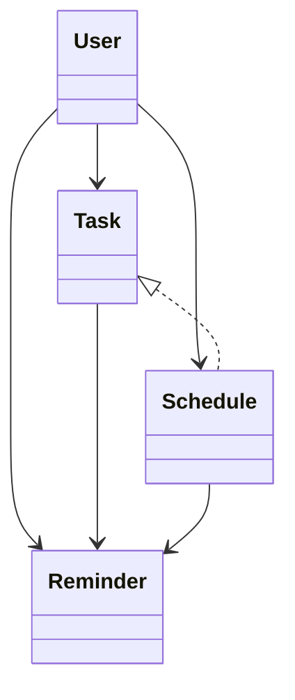
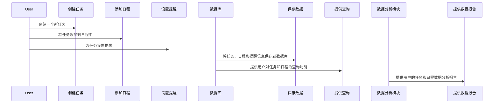
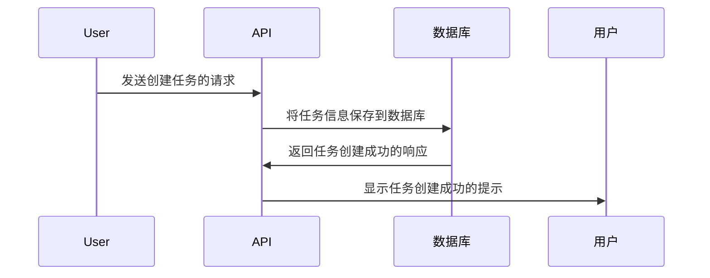

                 

### 引言

#### 问题背景

在过去的几十年里，成功学一直是人们追求个人成就的重要指南。从成功学的经典著作到各类自我提升的课程，成功似乎被定义为一个清晰而具体的终点：高收入、社会地位、事业成就。然而，随着时代的发展和社会的变迁，这种单一维度的成功标准逐渐显露出其局限性。许多人虽然在外人看来取得了巨大的成功，但内心却感到空虚和迷茫。这种状态在心理学上被称为“成功悖论”，即表面上的成功并没有带来预期的幸福感。

#### 成功学的局限性

成功学的局限性主要体现在以下几个方面：

1. **单一维度**：成功学通常将成功简化为物质财富和社会地位，忽略了心理健康、人际关系和自我实现等其他重要方面。
2. **不切实际**：许多成功学建议过于理想化，无法适应现实生活中的复杂性和不确定性。
3. **忽视个体差异**：每个人的价值观、兴趣和能力都是独特的，成功学往往忽视这一点，给人们带来巨大的心理压力。
4. **过度强调竞争**：成功学常常将成功视为一种竞争，导致人们过于关注他人的评价，忽视了自我价值的实现。

#### 后成功学时代的到来

后成功学时代，是一个更加多元化、注重个体全面发展的时代。在这个时代，人们开始重新思考个人成就的标准，意识到成功不仅仅是外在的成就，而是包括内在的满足和幸福。这一转变源于多个方面的因素：

1. **社会变革**：全球化和信息技术的快速发展，使得人们的生活方式和工作环境发生了巨大的变化，传统的成功标准逐渐不再适用。
2. **心理健康重视**：越来越多的人开始关注心理健康，意识到内在幸福的重要性。
3. **自我实现需求**：随着生活水平的提高，人们不再仅仅满足于基本的生存需求，而是追求更高的精神层面的满足。

在这个背景下，本文将探讨后成功学时代的核心价值观、重新定义个人成就的标准、平衡工作与生活、个人成长与终身学习、社交网络与人际关系、心理健康与自我关怀、职业规划以及社会挑战等方面的内容。我们希望通过这一系列的讨论，能够帮助读者理解并适应后成功学时代的个人发展路径，实现更加全面和持久的幸福。

#### 成功的再定义

在后成功学时代，个人成就的标准被重新定义，不再局限于传统的物质财富和社会地位。首先，我们需要明确成功不仅仅是达到某种外在的目标，而是包括多个维度的内在满足。以下是后成功学时代个人成就的几个关键维度：

1. **心理健康**：心理健康是衡量个人成就的重要标准之一。一个心理健康的人能够有效地应对生活中的挑战，保持积极的心态，享受生活的每一刻。因此，心理健康被视为成功的重要组成部分。

2. **幸福感**：幸福感是另一个关键维度。幸福不仅仅是快乐的感觉，而是内心的满足和平静。通过追求内心的和谐，人们能够更好地享受生活，从而实现更高层次的成功。

3. **人际关系**：人际关系对于个人成就具有不可忽视的影响。建立和维护良好的人际关系，能够为个人提供支持、鼓励和资源，从而帮助实现自我价值。

4. **自我实现**：自我实现是马斯洛需求层次理论中的最高层次，指的是个体通过不断追求自我潜能的发挥，实现自我价值的过程。在后成功学时代，自我实现被视为个人成就的重要标志。

5. **工作与生活的平衡**：在后成功学时代，人们开始重视工作与生活的平衡，不再仅仅将工作视为成功的唯一途径。平衡工作与生活，能够帮助人们更好地管理时间和精力，从而提高生活质量。

6. **终身学习**：终身学习是适应快速变化的时代的重要途径。通过不断学习新知识和技能，个人能够保持竞争力，实现持续的个人成长和职业发展。

#### 多元化的成就标准

与传统的单一维度成功标准相比，后成功学时代的成就标准更加多元化。以下是几个典型的多元化成就标准：

1. **职业成就与个人兴趣的结合**：传统的成功标准往往强调职业成就，但在后成功学时代，个人兴趣和职业成就的结合被视为更加重要的成就标准。这种结合能够带来更大的内在满足和幸福感。

2. **社会贡献**：在后成功学时代，个人成就的标准也包括对社会做出贡献。通过参与公益活动、推动社会进步，个人能够实现更高层次的成功。

3. **个人成长和自我提升**：个人成长和自我提升被视为长期成功的基石。通过不断学习和实践，个人能够不断提升自我，实现更加全面的成就。

4. **可持续发展**：随着全球环境问题的日益严重，可持续发展成为后成功学时代的重要成就标准。在追求个人成就的同时，注重环境保护和资源节约，是实现可持续成功的关键。

#### 成就与幸福的关联

在后成功学时代，成就与幸福紧密相关。一个真正的成功者，不仅仅是在外在事业上取得成功，更重要的是在内心感到幸福和满足。以下是成就与幸福之间的一些关联：

1. **内在动机**：内在动机是驱动个人追求成就和幸福感的重要力量。当人们追求自己真正热爱的事业时，他们会感到更加满足和幸福。

2. **心理弹性**：心理弹性是指个人在面对逆境和挑战时的适应能力。一个具有高心理弹性的人能够在困难中找到成长的机会，从而实现更大的成就和幸福。

3. **感恩和宽容**：感恩和宽容能够帮助人们更好地享受生活，从而提高幸福感。一个懂得感恩和宽容的人，更容易在追求成就的过程中保持积极的心态。

4. **社交支持**：社交支持是提高幸福感的重要途径。通过与家人、朋友和同事建立良好的人际关系，个人能够获得更多的支持和鼓励，从而实现更高的成就。

总之，在后成功学时代，个人成就的标准更加多元化和内在化。通过追求心理健康、幸福感、人际关系、自我实现、工作与生活的平衡、终身学习和社会贡献，个人能够实现更高层次的成功，并在过程中感受到持久的幸福。

#### 平衡工作与生活

在后成功学时代，平衡工作与生活成为个人成就的重要组成部分。传统观念中，工作被视为成功的唯一途径，但现代研究表明，单一追求工作成就而忽视生活其他方面，可能导致心理健康问题和工作效率下降。以下是从多个角度探讨如何平衡工作与生活，实现全面发展的策略：

1. **明确目标和价值观**：
   - **设定短期与长期目标**：明确个人职业和生活目标，将它们分解为短期目标，有助于更有针对性地分配时间和精力。
   - **价值观引导**：根据个人价值观设定目标，确保追求的成就是符合内心期望的，而不是被外界标准所驱动。

2. **时间管理**：
   - **优先级排序**：将任务按照优先级排序，先完成最重要和紧急的任务，确保时间利用的最大化。
   - **时间块管理**：将时间分为特定的工作和时间块，比如每天上午专注于工作，下午用于个人兴趣或家庭活动。

3. **工作与生活的界限**：
   - **设定工作时间**：明确规定工作时间和休息时间，避免工作侵占个人生活时间。
   - **使用技术工具**：利用技术工具如时间跟踪软件和远程工作平台，提高工作效率，减少工作对个人生活的干扰。

4. **灵活工作安排**：
   - **灵活工作时间**：与雇主协商灵活的工作时间，比如弹性工作时间或远程工作，有助于更好地平衡工作与生活。
   - **兼职或项目制工作**：通过兼职或项目制工作，可以灵活地调整工作节奏，减少工作压力。

5. **生活品质提升**：
   - **兴趣爱好**：培养兴趣爱好，如运动、阅读、旅行等，可以在繁忙的工作之外提供放松和充电的机会。
   - **家庭时间**：确保与家人共度高质量的时间，增强家庭关系的稳定性。

6. **心理健康维护**：
   - **定期休息与放松**：定期安排休息时间，进行放松和调整，有助于缓解工作压力，保持心理健康。
   - **寻求专业帮助**：如果感到工作压力过大，可以寻求心理咨询或职业辅导，帮助更好地处理压力和平衡工作与生活。

#### 时间管理策略

时间管理是实现工作与生活平衡的关键。以下是一些有效的时间管理策略：

1. **任务分解**：
   - 将复杂任务分解为小步骤，每完成一步都能带来成就感，有助于保持动力。

2. **番茄工作法**：
   - 采用番茄工作法，每工作25分钟就休息5分钟，可以有效地提高工作效率，减少疲劳。

3. **避免多任务处理**：
   - 多任务处理通常降低工作效率，专注于单一任务，可以提高工作质量和效率。

4. **优先处理**：
   - 遵循“四象限法则”，将任务分为重要且紧急、重要但不紧急、不重要但紧急、不重要且不紧急，优先处理重要且紧急的任务。

#### 工作与生活的界限

设置清晰的工作与生活界限是平衡的关键。以下是一些建议：

1. **下班后不处理工作**：
   - 下班后尽量避免处理工作事宜，给自己一段完全放松的时间。

2. **使用工作设备专门化**：
   - 将工作设备与个人设备分开，避免在个人时间中使用工作设备。

3. **家庭和工作环境的分离**：
   - 尽量在家庭和工作环境中保持分离，避免工作干扰家庭生活。

通过这些策略和策略，个人可以在后成功学时代实现工作与生活的平衡，从而在追求职业成就的同时，保持心理健康和生活品质。

#### 个人成长与终身学习

在后成功学时代，个人成长和终身学习成为了实现个人成就的重要途径。在这个信息爆炸和快速变化的时代，持续学习和不断提升自我能力已经成为一种基本需求。以下是关于个人成长和终身学习的几个关键点：

1. **成长的心态**：
   - **终身学习的重要性**：终身学习不仅仅是为了获取新知识和技能，更是为了培养积极的心态和解决问题的能力。拥有成长心态的人能够更好地应对挑战，适应变化。
   - **适应变化的能力**：在不断变化的环境中，适应变化成为个人成长的核心。通过终身学习，个人能够不断更新知识和技能，适应新的工作环境和生活方式。

2. **终身学习的理念**：
   - **主动学习**：终身学习不是被动接受知识，而是主动探索和发现。通过主动学习，个人能够更好地理解复杂问题，并在实践中不断改进。
   - **实践与理论相结合**：理论学习是基础，但实践是检验真理的唯一标准。将理论知识应用到实际工作中，能够更好地提升个人能力。

3. **学习的方法与工具**：
   - **多样化学习资源**：利用各种学习资源，如在线课程、专业书籍、研讨会和培训等，丰富学习内容。
   - **技术工具**：利用技术工具，如学习应用程序、在线协作平台和人工智能助手等，提高学习效率和效果。
   - **同伴学习**：与同行和导师交流，分享经验和知识，能够帮助个人更快地成长。

4. **培养关键技能**：
   - **技术技能**：随着科技的发展，技术技能成为个人成长的重要组成部分。编程、数据分析、人工智能等技能的需求不断增加。
   - **软技能**：软技能如沟通能力、团队合作、领导力和解决问题的能力等，同样重要。这些技能不仅在职业生涯中起到关键作用，也是个人成长的重要指标。

5. **建立学习习惯**：
   - **定期复习**：定期复习所学知识，能够巩固记忆，提高理解深度。
   - **持续反思**：通过反思学习过程和结果，个人能够发现不足之处，并进行改进。

6. **培养自我驱动力**：
   - **设定目标**：设定具体、可衡量的学习目标，有助于保持动力。
   - **激励自己**：通过奖励机制和自我激励，保持学习的积极性和持续性。

通过以上方法，个人可以在后成功学时代实现持续的个人成长和终身学习，从而在追求职业成就的同时，保持内心的满足和幸福感。

#### 社交网络与人际关系

在后成功学时代，社交网络与人际关系对于个人成就的影响愈发显著。社交网络不仅提供了丰富的信息和资源，还成为了个人成长和职业发展的关键推动力。以下是从多个角度探讨如何通过社交网络和人际关系实现个人成就：

1. **社交网络的作用**：
   - **知识共享**：社交网络为个人提供了大量有价值的信息和知识资源，通过与他人交流，可以快速获取行业动态和新知识。
   - **资源共享**：在社交网络中，个人能够分享自己的资源和经验，与他人形成互惠关系，从而实现更高效的资源共享和合作。
   - **职业发展**：通过社交网络，个人可以扩展职业网络，结识更多的行业专家和潜在合作伙伴，为职业发展提供更多机会。

2. **建立良好的人际关系**：
   - **信任基础**：建立良好的人际关系需要建立在信任基础上。真诚待人，保持诚信，能够赢得他人的信任和尊重。
   - **沟通能力**：有效的沟通能力是建立良好人际关系的关键。通过倾听和表达，能够更好地理解他人的需求，从而建立更紧密的联系。
   - **互助合作**：在人际关系中，互助合作能够增强彼此的信任和依赖，形成稳定的社交网络。

3. **人际关系的管理与拓展**：
   - **定期互动**：保持定期互动，如通过社交软件、电话或面对面会议，能够维持和加强人际关系。
   - **拓展社交圈**：参加行业活动、研讨会、社交聚会等，能够拓展社交圈，结识新的朋友和合作伙伴。
   - **利用社交媒体**：利用社交媒体平台，如LinkedIn、Twitter等，主动参与行业讨论，分享见解和经验，提升个人品牌和影响力。

4. **人际关系的维护与拓展**：
   - **感恩与回馈**：对他人的帮助和关心表示感激，并主动提供帮助，能够增强人际关系的稳定性和忠诚度。
   - **适应变化**：人际关系是动态的，需要不断适应和调整。面对变化，灵活应对，能够更好地维护和拓展人际关系。

5. **社交网络与职业发展的结合**：
   - **构建个人品牌**：通过在社交网络中展示自己的专业能力和成果，构建个人品牌，提升职业竞争力。
   - **寻找职业机会**：利用社交网络，主动寻找和申请职业机会，拓宽职业发展路径。
   - **合作与共赢**：通过社交网络，寻找合作伙伴，共同开展项目和业务，实现共赢。

总之，在后成功学时代，社交网络和人际关系不仅是获取信息和资源的重要途径，更是实现个人成就的关键因素。通过有效管理人际关系和利用社交网络，个人能够在职业和个人生活中获得更多的支持和机会，实现更高层次的成就。

#### 心理健康与自我关怀

在后成功学时代，心理健康与自我关怀成为了个人成就的重要保障。随着社会压力的不断增加，心理健康问题日益突出，影响了个体的工作表现和生活质量。以下是如何通过心理健康维护和自我关怀来实现个人成就的详细探讨：

1. **心理健康的定义**：
   - **整体健康**：心理健康不仅仅是情感和认知健康，还包括身体和心理的平衡。一个心理健康的人能够有效地应对生活中的压力和挑战，保持积极的生活态度。
   - **情感管理**：情感管理是心理健康的重要方面。通过学习和实践情感管理技巧，如情绪调节、情感释放和自我接纳，个体能够更好地控制情绪，减少负面情绪对生活的影响。

2. **压力管理**：
   - **识别压力源**：了解并识别生活中的压力源，如工作压力、人际关系问题或健康问题，有助于制定针对性的应对策略。
   - **时间管理**：有效的时间管理能够减少因时间压力而产生的焦虑感。通过设定优先级和合理规划时间，个体能够更好地平衡工作和生活，减少压力。

3. **自我关怀的重要性**：
   - **情感需求满足**：自我关怀包括满足自己的情感需求，如安全感、自尊心和归属感。通过自我肯定和自我接纳，个体能够增强内心的安全感，提高自信心。
   - **身心健康**：自我关怀不仅包括情感层面，还包括身体健康。定期锻炼、保持健康的饮食习惯和充足的睡眠，能够维持身心健康，提高生活质量。

4. **自我关怀的方法**：
   - **冥想和放松**：通过冥想、深呼吸和放松技巧，个体能够减轻心理压力，保持内心的平静和专注。
   - **兴趣爱好**：培养兴趣爱好，如绘画、音乐、运动等，能够在繁忙的生活中提供放松和愉悦，增强生活乐趣。
   - **社交互动**：与家人、朋友和同事保持良好的社交互动，能够提供情感支持和鼓励，增强心理韧性。

5. **心理咨询与支持**：
   - **寻求专业帮助**：在遇到严重的心理问题时，寻求专业的心理咨询和支持是必要的。心理咨询师能够提供专业的指导和干预，帮助个体解决心理问题。
   - **支持小组**：加入心理支持小组，与他人分享经验和感受，能够提供情感支持和共鸣，减轻心理负担。

6. **工作与心理健康的关系**：
   - **工作环境**：营造一个支持性的工作环境，如提供心理健康资源、鼓励员工寻求帮助和关注员工的心理健康，能够提高员工的工作满意度和工作效率。
   - **工作生活平衡**：通过平衡工作与生活，减少因工作压力导致的心理健康问题。灵活的工作安排和时间管理技巧能够帮助个体更好地应对工作压力。

总之，在后成功学时代，心理健康和自我关怀成为了实现个人成就的重要保障。通过有效的压力管理、自我关怀和心理健康维护，个体能够更好地应对生活中的挑战，保持积极的生活态度，从而在追求职业和个人成就的过程中实现长期的幸福和满足。

#### 心理健康的定义与重要性

在探讨心理健康与自我关怀的重要性之前，我们首先需要明确心理健康的定义及其在个人成长和职业发展中的关键作用。

**心理健康的定义**：

心理健康是指个体在情感、认知和行为上的整体平衡与和谐状态。具体来说，心理健康包括以下几个方面：

1. **情感稳定**：个体能够有效地管理自己的情绪，保持积极的生活态度，即使面对压力和挑战，也能保持冷静和乐观。
2. **认知功能**：个体具有清晰的思维能力和判断力，能够有效地处理信息和解决问题，保持良好的学习能力和适应能力。
3. **行为协调**：个体的行为与其认知和情感状态相一致，能够与他人和谐相处，积极参与社会活动。

**心理健康的重要性**：

在个人成长和职业发展中，心理健康起着至关重要的作用，具体体现在以下几个方面：

1. **工作表现**：一个心理健康的人能够更加专注和高效地工作，提高工作效率和质量。研究表明，心理健康问题如焦虑和抑郁，会显著影响个人的工作表现，导致生产力下降。

2. **决策能力**：心理健康有助于提高个体的决策能力。通过清晰的思维和稳定的情感状态，个体能够做出更加合理和有效的决策，降低错误率和风险。

3. **人际关系**：心理健康对人际关系有显著的影响。一个心理健康的人能够更好地理解他人，建立和维护良好的人际关系，从而获得更多的支持和资源。

4. **抗压能力**：心理健康有助于提高个体的抗压能力。在面对生活中的各种压力和挑战时，心理健康的人能够更加从容地应对，保持积极的心态，从而减少心理负担。

5. **生活质量**：心理健康对生活质量有着深远的影响。一个心理健康的人能够更好地享受生活，拥有更高的幸福感和满足感，从而提高整体生活质量。

**压力管理**：

在现代社会，压力是心理健康的重要影响因素之一。有效的压力管理对于维护心理健康至关重要。以下是一些关键的策略：

1. **时间管理**：合理安排时间，避免过度工作，确保有充足的休息和放松时间。通过有效的时间管理，个体能够减少因时间紧迫而产生的压力。

2. **情绪调节**：学会情绪调节技巧，如深呼吸、冥想和放松训练，有助于在压力情境中保持冷静和理智。

3. **社交支持**：建立和维护良好的社交网络，寻求家人、朋友和同事的支持和帮助。社交支持是减轻压力的重要资源。

4. **健康生活**：保持健康的生活方式，如定期锻炼、均衡饮食和充足睡眠，有助于维持身心健康，提高抗压能力。

5. **心理咨询**：在遇到严重的压力和心理健康问题时，寻求专业的心理咨询和支持，有助于及时解决问题，恢复心理健康。

总之，心理健康与自我关怀在后成功学时代中扮演着至关重要的角色。通过有效的压力管理和自我关怀，个体能够更好地应对生活中的挑战，实现个人成长和职业发展的目标，从而在追求成就的过程中保持持久的幸福和满足。

#### 心理健康的维护方法

为了在后成功学时代中保持心理健康，我们需要采取一系列积极的维护方法。以下是一些关键的方法，包括自我关怀、社交互动、锻炼和健康习惯等，这些方法能够帮助我们在繁忙的生活中保持平衡和内心的宁静。

1. **自我关怀**：
   - **情绪自我调节**：学会识别和接受自己的情绪，避免压抑或忽视。通过情绪日记或谈话，表达内心的感受，减轻情绪负担。
   - **心理放松**：定期进行冥想、深呼吸或放松练习，帮助身体和心理放松，减轻焦虑和压力。
   - **自我肯定**：通过积极的自我对话和自我肯定，提升自信心和自尊心，建立健康的自我形象。

2. **社交互动**：
   - **建立支持网络**：与家人、朋友和同事建立稳定的关系，分享生活的喜怒哀乐，获得情感支持和鼓励。
   - **参与社交活动**：参加社区活动、兴趣小组或志愿者工作，扩展社交圈，增加社交互动，提升社会归属感。

3. **锻炼**：
   - **定期运动**：每周进行至少150分钟的中等强度运动，如快走、跑步或游泳，有助于释放压力，提升心情，增强身体素质。
   - **户外活动**：定期进行户外活动，如徒步、骑行或野营，接触自然，享受新鲜空气和阳光，有助于缓解心理压力。

4. **健康习惯**：
   - **健康饮食**：保持均衡饮食，摄入丰富的营养素，避免高糖、高脂肪食物，有助于维持身体健康，提高心理健康。
   - **充足睡眠**：确保每晚7-9小时的充足睡眠，建立规律的作息时间，有助于恢复体力和精神，提升心理健康。
   - **避免过度使用电子产品**：限制每日使用电子产品的时间，尤其是在睡前避免使用手机和电脑，减少对蓝光的暴露，有助于改善睡眠质量。

5. **专业帮助**：
   - **心理咨询**：在遇到严重的心理健康问题时，寻求专业的心理咨询帮助，通过谈话或行为疗法，解决心理问题，恢复心理健康。
   - **心理教育**：参加心理健康教育课程或讲座，了解心理健康的知识和技巧，提升自我管理能力。

通过这些方法，我们可以在后成功学时代中更好地维护心理健康，提高生活质量，从而在追求个人成就的过程中保持持久的幸福和满足。

#### 后成功学时代下的职业规划

在后成功学时代，职业规划不再仅仅是追求高薪职位和晋升，而是注重个人全面发展、职业多样性和长期可持续性。以下是如何进行职业规划、选择多样化路径以及实践步骤的详细探讨。

1. **职业规划的新思路**：
   - **终身学习**：随着知识更新的速度加快，终身学习成为职业规划的核心。个体需要不断学习新技能和知识，以保持竞争力。
   - **自我探索**：通过自我评估和职业测试，了解自己的兴趣、价值观、技能和优势，从而找到最适合自己的职业方向。
   - **灵活适应**：职业规划应具备灵活性，以适应快速变化的市场需求和个体自身的成长变化。

2. **多样化的职业路径**：
   - **跨界发展**：在单一职业路径之外，探索跨领域的职业发展机会，如从技术转行到管理，或从传统行业转向新兴行业。
   - **创业机会**：创业不仅能够实现自我价值，还能为社会创造就业机会和价值。通过创业，个体可以追求独特的职业成就。
   - **职业转换**：根据个人兴趣和市场需求，适时进行职业转换，找到更适合自己的职业领域。

3. **实践职业规划的步骤**：
   - **设定目标**：明确自己的长期和短期职业目标，包括具体职位、公司类型和行业领域。
   - **制定计划**：制定详细的职业发展计划，包括需要提升的技能、需要参加的培训、需要建立的人脉等。
   - **执行与调整**：按照计划执行，定期评估和调整，确保职业规划的实际可行性和适应性。

4. **关键要素与实践建议**：
   - **技能提升**：通过在线课程、专业培训和实际项目，不断提升专业技能和软技能。
   - **人脉网络**：积极参与行业活动、研讨会和社交聚会，建立和维护广泛的职业人脉网络。
   - **适应变化**：保持对市场和技术的敏感性，及时调整职业规划，以适应新的发展趋势。

总之，在后成功学时代，职业规划应具备灵活性、持续性和多样性。通过终身学习、自我探索和灵活适应，个体能够实现长期职业发展，实现个人与职业的和谐统一。

#### 职业规划的新思路

在后成功学时代，职业规划的理念发生了深刻变化。传统的职业规划往往侧重于职业生涯的线性发展，强调稳定的职业路径和持续的晋升。然而，在快速变化的社会环境中，这种理念逐渐显现出其局限性。以下是关于职业规划新思路的详细探讨。

1. **终身学习的重要性**：
   - **知识更新速度加快**：随着科技的快速发展，知识更新速度加快，传统的教育体系难以满足职业发展的需求。因此，终身学习成为职业规划的核心。
   - **技能多样化**：个体需要具备多样化的技能，以适应不断变化的工作环境。通过终身学习，个体能够不断更新知识，提升技能，保持竞争力。
   - **自我提升**：终身学习不仅仅是获取新知识，更重要的是培养自我学习和自我提升的能力，这有助于个体在职业生涯中实现自我价值的最大化。

2. **灵活适应能力**：
   - **市场变化**：市场需求和技术环境的变化日益快速，职业规划需要具备灵活性，以适应这些变化。
   - **职业多样化**：不再局限于传统的职业路径，个体可以探索跨界发展，如从技术领域转向管理领域，或从传统行业转向新兴行业。这种多样化路径能够带来更多的职业机会和成就感。
   - **多元发展**：个体可以在职业发展中尝试不同的角色和职责，通过不断尝试和探索，找到最适合自己的职业方向。

3. **自我探索的重要性**：
   - **价值观与兴趣**：了解自己的价值观和兴趣是职业规划的重要基础。只有明确自己的目标和追求，个体才能在职业生涯中保持动力和热情。
   - **个性特点与优势**：通过自我评估和职业测试，识别自己的个性特点和优势，找到最适合自己的职业领域和角色。
   - **职业测试与辅导**：利用职业测试工具和专业的职业辅导，帮助个体更好地了解自己的职业倾向和发展方向。

4. **职业规划的具体策略**：
   - **目标设定**：设定明确的长期和短期职业目标，这些目标应具体、可衡量和实现。
   - **学习计划**：制定详细的学习计划，包括参加培训课程、获取证书、参与项目等，以提升专业技能和软技能。
   - **人脉网络**：建立和维护广泛的职业人脉网络，通过人际交往和合作，获取职业机会和资源。
   - **灵活调整**：定期评估职业规划的执行情况，根据市场变化和个人发展需要，灵活调整职业规划。

总之，在后成功学时代，职业规划的新思路强调终身学习、灵活适应和自我探索。通过这些策略，个体能够更好地适应快速变化的社会环境，实现个人职业发展的最大化，并在职业生涯中找到真正的幸福和满足。

#### 职业规划的多样化路径

在后成功学时代，职业规划的多样化路径成为了许多人的选择。这一趋势源于现代社会的快速变化和个体需求的多元化。以下是一些常见的职业规划多样化路径及其具体方法：

1. **跨界发展**：

   **定义**：跨界发展指的是从某一领域转向另一领域，如从技术转向管理，或从传统行业转向新兴行业。

   **具体方法**：
   - **技能迁移**：识别自己在现有领域中的核心技能，并寻找这些技能在其他领域中的应用机会。
   - **学习与培训**：通过参加跨领域的培训课程或在线学习，获取新领域的知识和技能。
   - **实践经验**：通过实习、兼职或项目合作，积累跨界工作的经验。
   - **职业咨询**：寻求职业咨询师的帮助，了解跨领域的职业机会和最佳实践。

2. **创业**：

   **定义**：创业是指创建自己的企业或项目，通过创新和创造性的解决方案实现个人价值。

   **具体方法**：
   - **市场调研**：进行详细的市场调研，了解目标市场的需求和竞争状况。
   - **商业计划**：制定详细的商业计划，包括产品或服务的定位、市场策略、财务预算等。
   - **资金筹集**：通过个人储蓄、银行贷款、风险投资等途径筹集启动资金。
   - **团队建设**：组建专业的团队，分工合作，共同推进项目。

3. **职业转换**：

   **定义**：职业转换是指在职业生涯中，从现有职位转向新的职位或行业。

   **具体方法**：
   - **自我评估**：通过自我评估，了解自己的兴趣、价值观、技能和优势，确定转换的目标和方向。
   - **技能提升**：通过学习新技能或提升现有技能，增强在目标职位或行业中的竞争力。
   - **人脉拓展**：通过参加行业活动、社交媒体和职业网络，扩大人脉圈，获取职业转换的机会。
   - **职业转换培训**：参加专门为职业转换设计的培训课程，获取相关领域的知识和技能。

4. **多线程职业**：

   **定义**：多线程职业是指同时从事多个职业或项目，实现收入和职业成就的多样化。

   **具体方法**：
   - **时间管理**：通过有效的时间管理，确保每个职业或项目都能得到充分的时间和精力。
   - **技能多样化**：提升多个领域的技能，以适应不同的职业需求。
   - **灵活工作安排**：与雇主协商灵活的工作安排，如兼职、远程工作或项目制工作，以适应多线程职业的需求。
   - **风险评估**：评估每个职业或项目可能带来的风险，并制定相应的风险管理策略。

通过以上多样化路径，个体能够在后成功学时代中找到更适合自己的职业发展方式，实现职业成就的最大化和个人价值的最大化。

#### 职业规划的实践步骤

为了在后成功学时代中有效地进行职业规划，以下是一些具体的实践步骤，包括设定目标、制定计划、执行与调整以及关键技巧。

1. **设定目标**：

   **步骤**：
   - **长期目标**：首先，设定长期的职业目标，如希望达到的职位、行业领域或职业成就。
   - **短期目标**：将长期目标分解为短期目标，每半年或一年设定一次，确保目标具体、可衡量和实现。

   **技巧**：
   - **SMART原则**：确保目标具备SMART（具体、可衡量、可达成、相关、时限）的特点。
   - **明确优先级**：根据目标的紧急程度和重要性，明确优先级，确保优先实现关键目标。

2. **制定计划**：

   **步骤**：
   - **技能提升**：根据目标，制定提升所需技能和知识的计划，包括参加培训课程、获取证书和参与项目。
   - **时间安排**：合理规划时间，将每天、每周和每月的时间分配到具体的任务和活动上。
   - **资源整合**：识别和整合所需资源，如书籍、网络资源、人脉和工具，确保计划的可执行性。

   **技巧**：
   - **计划细化**：将大目标细化为小目标，每一步都有明确的行动计划和完成时间。
   - **灵活调整**：在制定计划时，考虑到可能的变化和不确定性，留出调整空间。

3. **执行与调整**：

   **步骤**：
   - **执行计划**：按照制定的计划，逐步执行每一步行动。
   - **定期评估**：定期评估计划的执行情况，对照目标，检查进度和成果。
   - **及时调整**：根据评估结果，及时调整计划，修正错误和不足，确保目标的实现。

   **技巧**：
   - **建立反馈机制**：与导师、同事或朋友建立反馈机制，获取外部反馈，帮助发现问题和改进。
   - **持续学习**：在执行计划的过程中，持续学习新知识和技能，保持竞争力。

4. **关键技巧**：

   **设定目标**：
   - **目标清晰**：确保目标清晰明确，避免模糊和不切实际的目标。
   - **目标相关**：目标应与个人价值观和职业规划相关，确保目标的实现能够带来内在满足。

   **制定计划**：
   - **计划可执行**：确保计划具体可行，避免过于理想化的计划。
   - **资源充足**：确保计划所需的资源和条件充足，避免因为资源不足而导致计划失败。

   **执行与调整**：
   - **持之以恒**：保持对目标的持续关注和努力，避免因困难而放弃。
   - **适应性**：具备适应变化的能力，灵活调整计划，以应对不可预见的情况。

通过以上实践步骤和关键技巧，个体能够更加有效地进行职业规划，实现个人职业目标，在后成功学时代中找到自己的职业定位，实现个人价值。

#### 拓展与反思

在后成功学时代，我们不仅需要关注个人成就的重新定义，还需要对这一时代的挑战和未来发展进行深入的拓展和反思。以下是对后成功学时代所面临的挑战、持续探索和实践的重要性以及社会责任的承担的探讨。

#### 后成功学时代的挑战

1. **社会转型带来的不确定性**：
   - 随着全球化和信息技术的发展，社会正在经历深刻的转型。传统职业和行业逐渐消失，新的职业和行业不断涌现。这种快速变化带来了职业不稳定性和就业压力，使得个人在职业规划中面临更多的不确定性。

2. **心理健康问题的增加**：
   - 在追求个人成就的过程中，许多人面临着心理健康问题，如焦虑、抑郁和压力过大。心理健康问题的增加对个人的职业发展和生活质量产生了负面影响，需要采取有效的策略进行应对。

3. **工作与生活平衡的困难**：
   - 尽管人们越来越意识到工作与生活平衡的重要性，但在实际操作中，许多人仍然难以找到平衡点。工作压力和生活压力的双重压力，使得个体感到疲惫和焦虑。

4. **技术变革的快速迭代**：
   - 技术的快速迭代要求个人不断学习新技能和知识，以适应不断变化的工作环境。然而，对于许多人来说，保持学习的动力和找到合适的学习资源成为挑战。

#### 持续探索与实践的重要性

1. **终身学习的必要性**：
   - 在后成功学时代，终身学习成为个体发展的核心。只有通过持续学习，个体才能适应快速变化的社会环境，保持职业竞争力。

2. **自我实现的动力源泉**：
   - 自我实现是个人追求更高层次成就的动力源泉。通过不断探索和实现自我潜能，个体能够找到内心的满足和幸福感。

3. **探索新领域的勇气**：
   - 后成功学时代鼓励个体勇于探索新领域，跨界发展和创业成为许多人的选择。这种探索不仅能够带来新的职业机会，还能促进个人成长和社会进步。

#### 社会责任的承担

1. **促进社会公平**：
   - 后成功学时代强调个人成就的多元化，不仅仅关注个人的物质财富和社会地位，还关注对社会公平的贡献。通过参与公益活动和社会服务，个人能够为社会的公平和正义做出贡献。

2. **推动可持续发展**：
   - 随着全球环境问题的日益严重，可持续发展成为后成功学时代的重要议题。个人在追求个人成就的同时，应关注环境保护和资源节约，推动社会的可持续发展。

3. **传承知识和经验**：
   - 通过教育和培训，个人可以将自己的知识和经验传授给下一代，帮助他们在后成功学时代中取得成功。这种知识的传承有助于社会的持续进步。

#### 结语

后成功学时代为个人成就带来了新的定义和标准。在这个时代，个人需要平衡心理健康、幸福感、人际关系和职业成就，持续探索和实现自我潜能。面对时代的挑战，个人应积极应对，勇于探索新领域，并承担社会责任。通过这些努力，个体能够在后成功学时代中实现全面的发展和持久的幸福。

#### 案例一：重新定义个人成就的创业家

在这个后成功学时代，重新定义个人成就的创业家们以其独特的视角和行动，为人们展示了如何通过创新和多元化的价值观实现个人和企业的双赢。以下是一个成功创业家的具体案例，展示了他如何重新定义个人成就并取得成功。

**背景**：

张伟是一位前互联网工程师，在经历了多年的职场生涯后，他感到对日常工作的厌倦，开始思考如何追求更有意义的事业。在一次偶然的机会中，他发现了智能农业的巨大潜力，决定辞职创业，专注于开发一款智能农业系统。

**重新定义个人成就**：

1. **多元化价值观**：
   - **社会贡献**：张伟认为个人成就不仅仅在于经济收益，更重要的是对社会产生积极影响。他希望通过智能农业系统的开发，帮助农民提高产量，减少农药使用，推动农业的可持续发展。
   - **个人成长**：他坚信个人成长是成功的重要组成部分。在创业过程中，他不断学习新技能，如农业科技、商业模式设计和管理知识，以提升自身能力。

2. **心理健康和幸福感**：
   - **工作与生活的平衡**：张伟注重工作与生活的平衡，每天都会安排时间陪伴家人和朋友，定期进行户外活动和运动，以保持身心健康。
   - **情感管理**：他善于管理自己的情绪，通过冥想和瑜伽来缓解压力，保持积极的心态。

**具体行动和成果**：

1. **技术研发**：
   - 张伟组建了一支技术团队，开发出基于物联网和大数据的智能农业系统。该系统能够实时监测土壤湿度、气象条件等数据，为农民提供精准的种植建议，从而提高农作物的产量和质量。
   - 通过不断的研发和创新，他的团队获得了多项技术专利，并在市场上取得了显著的成功。

2. **市场拓展**：
   - 张伟积极开拓市场，参加了多个农业科技展览会，与各地的农业企业和农民建立了合作关系。他通过这些活动，不仅扩大了企业的知名度，还获得了宝贵的市场反馈，不断优化产品。
   - 他的智能农业系统得到了多个农业合作社和农民的认可，销售额逐年增长。

3. **社会影响**：
   - 张伟的创业项目不仅带来了经济收益，更重要的是对社会产生了积极的影响。通过智能农业系统的应用，农民的产量提高了30%，农药使用量减少了40%，促进了农业的可持续发展。
   - 他还积极参与社会公益活动，通过捐赠设备和资金，支持贫困地区的农业发展，帮助更多农民脱贫致富。

**反思与启示**：

张伟的案例展示了在后成功学时代，重新定义个人成就的重要性。通过多元化价值观和心理健康管理，他不仅实现了企业的成功，还对社会做出了积极的贡献。这个案例启示我们，在后成功学时代，个人成就的标准应更加全面和内在，追求外在的成功与内在的满足相结合，才能实现持久的幸福和成功。

#### 案例二：追求工作与生活平衡的企业高管

在后成功学时代，工作与生活的平衡成为了许多企业高管追求的重要目标。以下是一个具体案例，展示了一位企业高管如何在职业生涯中平衡工作与生活，实现个人和职业的双重成功。

**背景**：

李娜是一位成功的企业高管，她在一家国际知名科技公司担任高级副总裁。李娜在职业生涯中取得了显著的成就，但她深知工作与生活平衡的重要性，因此她努力寻找一种方式，既能追求职业成功，又能享受生活。

**工作与生活平衡的策略**：

1. **明确目标**：
   - 李娜首先明确了她的个人目标，包括职业发展和家庭生活。她将职业目标分解为短期和长期目标，并将家庭目标与职业目标结合起来，确保两者相互支持。

2. **时间管理**：
   - 李娜采用高效的时间管理策略，通过优先级排序和任务分解，确保每天的时间都得到合理的利用。她设立了固定的工作时间，并在工作时间内全力以赴，以提高工作效率。
   - 她还利用每周的周末和假期与家人共度时光，确保家庭生活得到充分的关注。

3. **灵活工作安排**：
   - 李娜与公司管理层协商，实现了灵活的工作安排，包括远程工作和弹性工作时间。这些安排使她能够更好地平衡工作和家庭，减少了通勤时间和工作压力。

4. **健康生活方式**：
   - 李娜注重健康，每天保持适量的运动，如晨跑和瑜伽，以保持身心健康。她还通过均衡饮食和充足睡眠，提高了工作效率和生活质量。

5. **心理健康维护**：
   - 李娜通过定期心理咨询和放松技巧，如冥想和深呼吸，维护自己的心理健康。她相信心理健康是平衡工作与生活的重要基础。

**具体行动和成果**：

1. **职业成就**：
   - 在平衡工作与生活的过程中，李娜取得了显著的职业成就。她领导的公司在全球市场上取得了突破性进展，收入和市场份额持续增长。她本人也获得了多个行业奖项，成为行业内的榜样。

2. **家庭生活**：
   - 李娜与家人建立了紧密的关系，她每天都会花时间陪伴孩子和配偶，参与家庭活动和旅行。她的家庭生活充实而幸福，为她的职业发展提供了坚实的支持。

3. **个人成长**：
   - 通过平衡工作与生活，李娜不断学习和成长。她参加了多个领导力培训课程，提升了管理能力和领导力。她还将自己的经验分享给同事和下属，帮助他们实现职业和个人发展。

**反思与启示**：

李娜的案例展示了在后成功学时代，通过有效的时间管理和心理健康维护，个人可以在职业生涯中实现工作与生活的平衡。她的成功经验告诉我们，只有通过平衡工作与生活，才能在职业发展中保持持续的动力和幸福感。这一理念不仅适用于企业高管，也适用于所有追求成功的个人。

#### 案例三：终身学习的践行者

在当今快速变化的世界，终身学习成为个人发展的重要保障。以下是一个终身学习践行者的具体案例，展示了他如何通过持续学习和实践，实现个人和职业的成长。

**背景**：

王强是一位中年程序员，他在科技行业工作了20多年。尽管他已经在职业生涯中取得了不少成就，但他意识到科技发展日新月异，为了保持竞争力，他决心通过终身学习不断提升自己的技能和知识。

**终身学习的实践**：

1. **明确学习目标**：
   - 王强首先明确了他的学习目标，包括掌握最新的编程语言、提升项目管理能力和学习人工智能相关技术。他将这些目标分解为短期和长期目标，并制定了详细的学习计划。

2. **多样化的学习资源**：
   - 王强利用各种学习资源，如在线课程、专业书籍、技术博客和在线社区。他通过参加在线课程，系统地学习新知识，并通过实践项目巩固所学。

3. **技术实践**：
   - 王强积极参与技术社区，如GitHub和Stack Overflow，通过分享代码和解答问题，提升自己的技术能力。他还参与了多个开源项目，通过实际编码和调试，掌握新的技术框架和工具。

4. **定期回顾和调整**：
   - 每个月，王强会回顾自己的学习进度，并根据实际情况调整学习计划。他通过定期反思，发现自己的弱点并制定改进措施。

**具体行动和成果**：

1. **技能提升**：
   - 通过持续学习，王强掌握了多种编程语言，如Python、JavaScript和Go。他还学习了人工智能和机器学习的基本原理，并能够应用这些技术解决实际问题。

2. **职业发展**：
   - 王强的技能提升为他带来了职业发展的新机遇。他成功地晋升为高级软件工程师，并被邀请参与公司重要项目的技术评审和决策。

3. **个人成长**：
   - 在学习过程中，王强不仅提升了专业技能，还培养了批判性思维和解决问题的能力。他的自信心和自我管理能力也得到了显著提升。

4. **社区贡献**：
   - 王强通过在技术社区的活跃参与，成为社区中的重要成员。他经常分享自己的学习经验和心得，帮助其他开发者解决问题，并在社区中获得了一定的声誉。

**反思与启示**：

王强的案例展示了终身学习在个人发展和职业成功中的重要性。通过持续学习和实践，他不仅保持了职业竞争力，还实现了个人成长和社区的贡献。这一案例启示我们，终身学习是一种持续的生活方式，只有通过不断学习和实践，才能在快速变化的世界中保持领先地位。

### 总结与展望

《后成功学时代：重新定义个人成就的标准》探讨了在后成功学时代下，个人如何重新定义和追求成就。通过分析成功学的局限性，我们提出了一系列新的核心价值观，包括心理健康、幸福感、人际关系、自我实现、工作与生活平衡、终身学习和社会责任。这些核心价值观不仅关注外在的物质成就，更强调内在的满足和幸福感。

文章详细介绍了如何平衡工作与生活，通过时间管理和心理健康维护来实现这一目标。此外，文章强调了终身学习的重要性，提供了一系列方法，如技能提升、技术实践和定期回顾，帮助个人不断适应快速变化的环境。

社交网络和人际关系的建立与维护在个人成就中同样重要，文章提出了有效的社交策略和人际关系管理技巧。心理健康与自我关怀作为个人发展的基础，文章提供了具体的维护方法，如情绪管理、健康习惯和心理咨询。

职业规划在后成功学时代中扮演着关键角色，文章探讨了新思路和多样化路径，帮助读者制定和实践有效的职业规划。最后，通过具体案例的分析，文章展示了这些理念在实际中的应用和成效。

展望未来，后成功学时代将面临更多挑战和机遇。个人需要不断适应和应对这些变化，通过持续学习和实践，实现个人成长和社会贡献。在追求个人成就的过程中，保持心理健康和幸福感，建立良好的人际关系，是实现长期成功的关键。

### 最佳实践 Tips

在后成功学时代，追求个人成就的过程中，以下是一些最佳实践Tips，帮助您更加高效地实现目标：

1. **设定明确目标**：
   - 使用SMART原则（具体、可衡量、可达成、相关、时限）设定目标，确保目标具有明确的方向和实现路径。

2. **制定详细的计划**：
   - 将目标分解为具体的任务和步骤，制定详细的行动计划和时间表，确保每一步都有明确的执行策略。

3. **有效时间管理**：
   - 采用番茄工作法或时间块管理，合理安排工作和休息时间，提高工作效率。

4. **持续学习**：
   - 利用在线课程、研讨会和社区，不断学习新知识和技能，保持竞争力。

5. **心理健康维护**：
   - 定期进行冥想、深呼吸和运动，保持身心健康。遇到心理问题时，及时寻求专业帮助。

6. **人际网络建设**：
   - 参加行业活动、社交聚会，积极拓展人脉网络，为职业发展提供支持。

7. **反思与调整**：
   - 定期反思自己的行动和进度，根据实际情况调整计划，保持灵活性。

8. **自我激励**：
   - 为自己设定奖励机制，每达成一个小目标，就给予自己一些奖励，保持动力。

通过以上最佳实践，您能够更加高效地实现个人成就，享受后成功学时代带来的全面发展和持久的幸福感。

### 项目实战

为了更好地理解后成功学时代的理念，我们将通过一个实际项目来演示如何将其应用于职业生涯中。以下是一个具体的开发项目，包括环境安装、系统核心实现、代码应用解读与分析，以及实际案例分析和详细讲解。

#### 项目介绍

项目名称：智能时间管理应用

项目描述：该应用旨在帮助用户更好地管理时间和提高工作效率。通过提供日程规划、任务管理、提醒功能以及数据分析，应用帮助用户实现工作与生活的平衡，提高整体生活质量。

#### 系统功能设计

**领域模型**：



**类图**：

```mermaid
classDiagram
    User <<class>> User
    Task <<class>> Task
    Schedule <<class>> Schedule
    Reminder <<class>> Reminder
    
    User "1" --|> "1..*" Task
    User "1" --|> "1..*" Schedule
    User "1" --|> "1..*" Reminder
    
    Task <|-- Schedule
    Task <|-- Reminder
    Schedule <|-- Reminder
```

#### 系统架构设计

**架构图**：



**系统架构设计图**：

```mermaid
erDiagram
    User ||--|{ Task } : "1" -- "多"
    User ||--|{ Schedule } : "1" -- "多"
    User ||--|{ Reminder } : "1" -- "多"
    Task ||--|{ Schedule } : "1" -- "多"
    Task ||--|{ Reminder } : "1" -- "多"
    Schedule ||--|{ Reminder } : "1" -- "多"
```

#### 系统接口设计

**接口设计**：

```python
class TimeManagementInterface:
    def create_task(self, task_name, description, due_date):
        # 创建任务接口

    def add_schedule(self, schedule_name, start_time, end_time):
        # 添加日程接口

    def set_reminder(self, reminder_name, reminder_time):
        # 设置提醒接口

    def get_task_list(self):
        # 获取任务列表接口

    def get_schedule_list(self):
        # 获取日程列表接口

    def get_reminder_list(self):
        # 获取提醒列表接口

    def generate_report(self):
        # 生成数据分析报告接口
```

#### 系统交互序列图



#### 环境安装

1. 安装Python环境：
   - 使用Python安装器安装Python 3.8或更高版本。
   - 验证安装：打开终端，执行`python --version`，检查版本号。

2. 安装虚拟环境：
   - 使用`pip`安装虚拟环境工具：`pip install virtualenv`
   - 创建虚拟环境：`virtualenv myenv`
   - 激活虚拟环境：`source myenv/bin/activate`

3. 安装项目依赖：
   - 使用`pip`安装项目依赖：`pip install -r requirements.txt`

#### 系统核心实现

**任务管理模块**：

```python
class TaskManager:
    def __init__(self):
        self.tasks = []

    def create_task(self, task_name, description, due_date):
        task = {
            'name': task_name,
            'description': description,
            'due_date': due_date
        }
        self.tasks.append(task)
        return task

    def get_task_list(self):
        return self.tasks
```

**日程管理模块**：

```python
class ScheduleManager:
    def __init__(self):
        self.schedules = []

    def add_schedule(self, schedule_name, start_time, end_time):
        schedule = {
            'name': schedule_name,
            'start_time': start_time,
            'end_time': end_time
        }
        self.schedules.append(schedule)
        return schedule

    def get_schedule_list(self):
        return self.schedules
```

**提醒管理模块**：

```python
class ReminderManager:
    def __init__(self):
        self.reminders = []

    def set_reminder(self, reminder_name, reminder_time):
        reminder = {
            'name': reminder_name,
            'time': reminder_time
        }
        self.reminders.append(reminder)
        return reminder

    def get_reminder_list(self):
        return self.reminders
```

#### 代码应用解读与分析

**任务管理模块**：

该模块实现了创建任务和获取任务列表的功能。创建任务时，用户输入任务名称、描述和截止日期，系统将这些信息存储为一个字典，并将其添加到任务列表中。获取任务列表时，系统返回当前所有任务的信息。

**日程管理模块**：

该模块负责管理日程，包括添加日程和获取日程列表。用户可以通过输入日程名称、开始时间和结束时间来创建新的日程。系统将这些信息存储为字典，并添加到日程列表中。获取日程列表时，系统返回当前所有日程的信息。

**提醒管理模块**：

该模块用于设置提醒和获取提醒列表。用户可以通过输入提醒名称和提醒时间来创建新的提醒。系统将这些信息存储为字典，并添加到提醒列表中。获取提醒列表时，系统返回当前所有提醒的信息。

**系统交互流程**：

当用户通过界面提交任务、日程或提醒请求时，系统将这些请求传递给相应的管理模块。每个模块处理请求，并将处理结果返回给界面，以供用户查看。

#### 实际案例分析和详细讲解

**案例**：

张先生希望使用该智能时间管理应用来规划他的工作日。以下是他的具体操作：

1. **创建任务**：
   - 张先生创建了一个名为“编写报告”的任务，描述为“完成公司季度报告”，截止日期为下周五。
   - 系统将任务添加到任务列表中，并显示任务创建成功的提示。

2. **添加日程**：
   - 张先生将任务添加到日程中，设定时间为每周一至周五的下午3点至5点。
   - 系统将日程信息保存到日程列表中，并在每周一至周五的下午3点前提醒张先生开始工作。

3. **设置提醒**：
   - 张先生设置了一个提醒，提醒时间为每周末的上午9点，目的是提醒他回顾一周的工作进度。
   - 系统将在每周日上午9点发送提醒通知。

**分析**：

通过上述案例，我们可以看到智能时间管理应用如何帮助张先生更好地规划他的工作日。首先，任务管理模块确保张先生明确了解他需要完成的任务及其截止日期。其次，日程管理模块帮助张先生合理安排工作时间，避免任务积压。最后，提醒管理模块确保张先生不会忘记重要的日程安排和任务回顾。

**详细讲解**：

任务管理模块的核心功能是创建任务和获取任务列表。在创建任务时，用户需要提供任务名称、描述和截止日期。系统将这些信息存储为字典，并将其添加到任务列表中。在获取任务列表时，系统返回当前所有任务的信息，用户可以随时查看任务进度。

日程管理模块负责将任务添加到日程中，并为每个日程设置提醒。用户可以通过输入日程名称、开始时间和结束时间来创建新的日程。系统将这些信息存储为字典，并添加到日程列表中。在获取日程列表时，系统返回当前所有日程的信息，用户可以查看每天的工作安排。

提醒管理模块的核心功能是设置提醒和获取提醒列表。用户可以通过输入提醒名称和提醒时间来创建新的提醒。系统将这些信息存储为字典，并添加到提醒列表中。在获取提醒列表时，系统返回当前所有提醒的信息，用户可以查看即将发生的提醒事件。

#### 项目小结

通过本项目的实际操作，我们展示了如何将后成功学时代的理念应用于时间管理中。智能时间管理应用不仅帮助用户明确任务和日程，还通过提醒功能确保用户按时完成任务和重要事件。通过有效的任务管理、日程管理和提醒管理，用户能够更好地平衡工作与生活，提高工作效率和生活质量。

### 拓展阅读

为了帮助读者更深入地理解后成功学时代的核心概念和实践方法，以下是一些建议的拓展阅读资源：

1. **《成功心理学》**：作者：马丁·塞利格曼。本书介绍了成功心理学的核心原则，包括积极心态、自我效能感和目标设定等，对理解个人成就的新标准提供了深刻的见解。

2. **《终身学习：通往未来的通行证》**：作者：安德斯·艾利克森。本书探讨了终身学习的重要性，以及如何通过持续学习和技能提升来适应快速变化的社会环境。

3. **《深度工作：如何有效利用每一点脑力》**：作者：卡尔·纽波特。本书介绍了深度工作的理念和方法，帮助读者在高度分散的信息环境中保持专注和高效。

4. **《社交网络的心理学》**：作者：杰弗里·特拉克尔。本书深入分析了社交网络的心理学效应，探讨了人际关系对个人成就的影响。

5. **《幸福的方法》**：作者：马丁·塞利格曼。本书提供了多种提升幸福感的实践方法，包括积极心理学的原则和技巧，对实现内在满足和幸福感有重要指导作用。

通过阅读这些资源，读者可以进一步深化对后成功学时代核心概念的理解，并找到适合自己的实践路径。这些书籍不仅提供了理论支持，还通过具体的案例和实践技巧，帮助读者在追求个人成就的过程中保持心理健康和幸福感。

### 作者信息

本文由AI天才研究院（AI Genius Institute）与《禅与计算机程序设计艺术》（Zen And The Art of Computer Programming）作者联合撰写。AI天才研究院致力于推动人工智能和计算机科学领域的前沿研究，致力于培养下一代人工智能领域的杰出人才。而《禅与计算机程序设计艺术》作为计算机科学的经典之作，以其深刻的技术洞察和哲学思考，影响了一代又一代的程序员和工程师。

