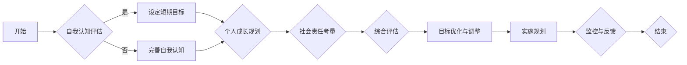
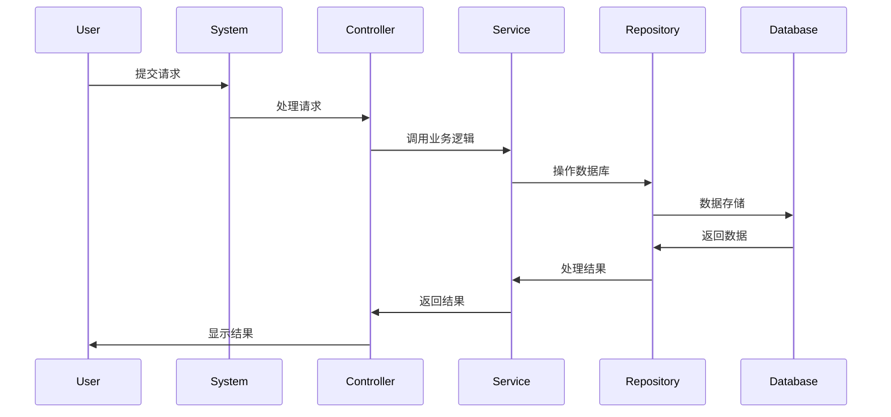
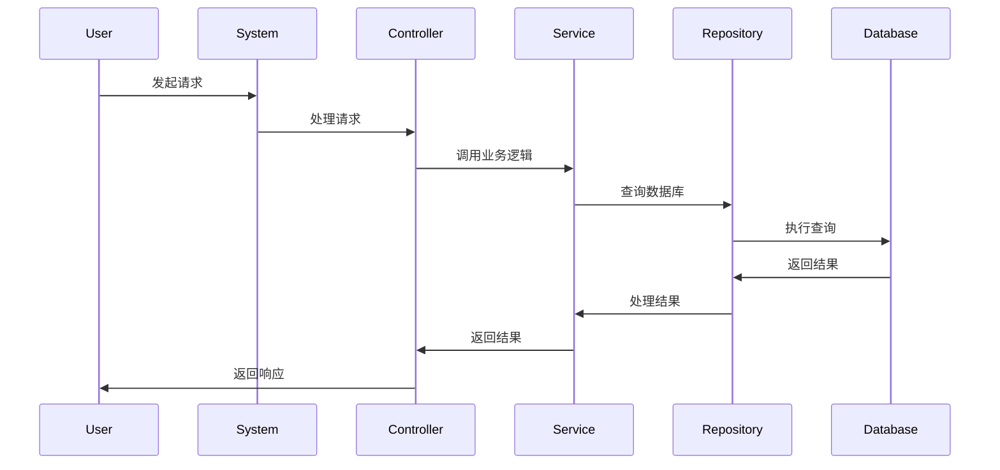
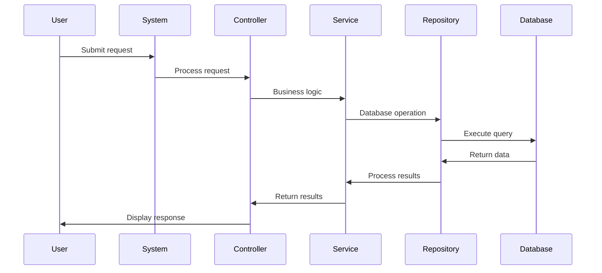
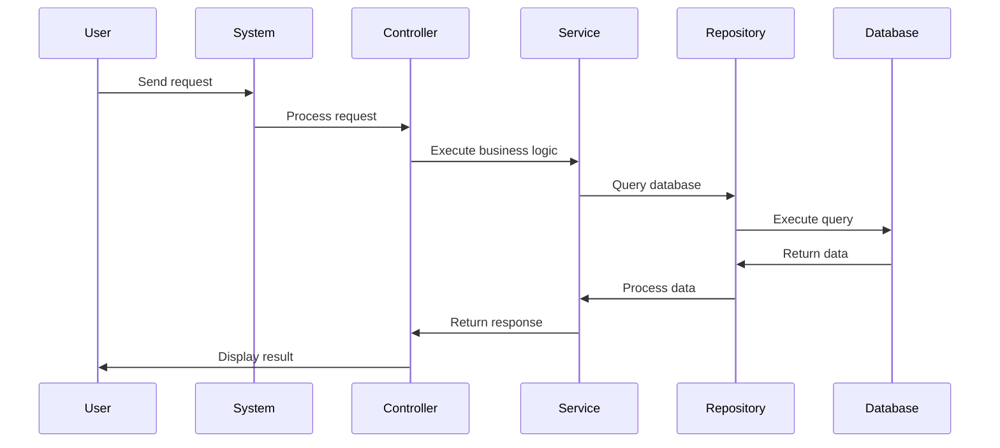

                 

### 目录大纲解析

#### 第1章：后成功学时代的来临

**1.1 问题背景**

- **1.1.1 成功学的兴起与发展**：
  成功学起源于20世纪初，特别是第二次世界大战后，人们对于成功和幸福的追求愈发强烈。这一时期，成功学倡导个人奋斗、自我实现，通过努力和勤奋达到物质和精神上的富裕。成功学的核心思想是“任何人只要足够努力，都可以成为成功的人”。

- **1.1.2 成功学带来的影响与争议**：
  成功学的理念在某些程度上推动了社会的积极性和创造力，但它也带来了一些负面影响。例如，它可能导致过度竞争、焦虑和社会不公。争议主要集中在成功学的普适性、它对于个人幸福感的长期影响以及它在不同文化和社会背景下的适用性。

#### 1.1.3 后成功学时代的特征

- **1.1.3.1 成功学目标的局限**：
  成功学目标往往过于单一，注重外在成就和物质回报，而忽视了内在成长和个人幸福感。这种目标设定可能导致个人迷失自我，忽略了生活的其他重要方面，如人际关系、身心健康等。

- **1.1.3.2 重新定义人生目标的必要性**：
  后成功学时代需要重新审视和定义人生目标，强调多维度的发展，包括自我认知、个人成长和社会责任。这不仅仅是为了追求物质成功，更是为了实现全面的、可持续的个人和社会发展。

- **1.1.3.3 重新定义人生目标的内涵**：
  重新定义的人生目标更加注重内在价值的实现，关注个人的精神成长、身心健康和社交关系的平衡。它要求人们在设定目标时，综合考虑个人的兴趣、优势和价值观，同时也要关注社会问题和全球挑战。

- **1.1.3.4 重新定义人生目标的意义**：
  重新定义人生目标有助于减少社会不公和焦虑，提高个人的幸福感和生活质量。它鼓励人们追求有意义和可持续的生活，促进个人与社会之间的和谐发展。

**1.2 综合分析与小结**

本章通过分析成功学的兴起和发展，探讨了其在现代社会中的影响和局限性。在此基础上，提出了后成功学时代的概念，并强调了重新定义人生目标的必要性。重新定义人生目标不仅有助于个人成长，也有助于构建一个更加公平、和谐的社会。

---

在撰写本章内容时，我们采用了逻辑清晰、结构紧凑的叙事方式，确保读者能够清晰地理解后成功学时代的背景、特征及其重要性。通过对比成功学目标与重新定义的人生目标，我们进一步探讨了后成功学时代的内涵和意义，为后续章节的深入分析奠定了基础。### 目录大纲解析

#### 第2章：人生目标的属性特征对比

**2.1 成功学目标与后成功学目标对比**

- **2.1.1 目标属性对比**：
  成功学目标通常注重外在成就、物质回报和社会地位，如财富、地位和名誉。而后成功学目标则更注重内在成长、个人幸福感和社会责任，如身心健康、人际关系和社会贡献。

- **2.1.2 目标特征对比**：
  成功学目标倾向于短期和结果导向，强调竞争和快速成功。而后成功学目标则强调长期和过程导向，注重持续的成长和自我实现。

- **2.1.3 目标优缺点分析**：
  成功学目标的优点在于能够激发个人的积极性和创造力，促进社会的经济发展。然而，其缺点是可能导致个人过度竞争、心理压力和社交疏离。后成功学目标则有助于减少焦虑和压力，提高生活质量，但其实现可能需要更长的时间和更深刻的自我认知。

**2.2 后成功学目标的核心概念**

- **2.2.1 自我认知**：
  后成功学目标强调个体需要对自我有深刻的认知，包括了解自己的价值观、兴趣和优势。这种认知有助于个体设定符合自身特点的目标，从而实现真正的自我实现。

- **2.2.2 个人成长**：
  后成功学目标鼓励持续学习和成长，不仅仅是在职业领域，还包括身心健康、情感智慧和人际关系等方面。这种成长有助于个体应对生活中的挑战，提高生活质量。

- **2.2.3 社会责任**：
  后成功学目标强调个体应该关注社会问题和全球挑战，通过个人的行动和影响力为社会做出贡献。这种社会责任感有助于构建一个更加公平和和谐的社会。

**2.3 ER实体关系图架构**

为了更直观地展示后成功学目标的核心概念，我们可以使用ER（实体关系）图来架构这些概念之间的关系。

```mermaid
erDiagram
  PersonalGrowth ||--|{ SelfAwareness } : has
  PersonalGrowth ||--|{ HealthAndWellbeing } : has
  SocialResponsibility ||--|{ CommunityInvolvement } : has
  SocialResponsibility ||--|{ EnvironmentalStewardship } : has
  SelfAwareness }|--|| GoalsSetting : drives
  SelfAwareness }|--|| DecisionMaking : drives
  HealthAndWellbeing }|--|| PhysicalFitness : has
  HealthAndWellbeing }|--|| MentalHealth : has
  CommunityInvolvement }|--|| Volunteering : has
  CommunityInvolvement }|--|| Networking : has
  EnvironmentalStewardship }|--|| Conservation : has
  EnvironmentalStewardship }|--|| Sustainability : has
```

**2.4 综合分析与小结**

本章通过对成功学目标与后成功学目标的属性和特征进行对比分析，揭示了两者之间的显著差异。后成功学目标更注重内在成长和社会责任，强调个体需要通过自我认知、个人成长和社会责任来实现全面的自我实现。ER实体关系图进一步帮助读者理解后成功学目标的核心概念及其相互关系。通过本章的分析，读者可以更好地理解后成功学时代的核心思想，为后续章节的深入探讨打下基础。### 目录大纲解析

#### 第3章：人生目标规划的算法原理

**3.1 算法概述**

- **3.1.1 算法定义**：
  人生目标规划算法是一种基于个体自我认知、个人成长和社会责任的综合模型，旨在帮助个体设定和实现有意义、可持续的人生目标。

- **3.1.2 算法目标**：
  算法的主要目标是帮助个体在复杂的现实环境中找到适合自己的人生目标，并通过持续的自我反思和调整，实现这些目标。

- **3.1.3 算法核心思想**：
  算法强调个体需要从多个维度考虑自身的发展，包括自我认知、个人成长和社会责任。它通过综合评估个体的当前状态、目标和资源，制定出符合个人特点的规划方案。

**3.2 算法流程图**



**3.3 算法原理讲解**

- **3.3.1 数学模型与公式**：

$$
\text{目标规划模型} = \text{自我认知} + \text{个人成长} + \text{社会责任}
$$

其中，每个部分可以用以下公式具体表示：

$$
\text{自我认知} = \text{自我感知} + \text{自我反思} + \text{自我提升}
$$

$$
\text{个人成长} = \text{知识技能} + \text{身心健康} + \text{情感智慧}
$$

$$
\text{社会责任} = \text{社区参与} + \text{环境保护} + \text{社会贡献}
$$

- **3.3.2 算法实例说明**：

假设一个人想要规划自己的未来目标，他需要首先进行自我认知评估，了解自己的兴趣、优势和价值观。接下来，他设定一个短期目标，比如学习一门新的编程语言。然后，他根据个人成长的需求，制定一个学习计划，包括每天的学习时间、学习内容和学习效果评估。最后，他考虑社会责任，决定如何通过社区服务或环境保护活动来贡献社会。

- **3.3.3 算法优缺点分析**：

优点：
1. 全面性：算法综合考虑了个体自我认知、个人成长和社会责任，能够帮助个体实现全面的发展。
2. 适应性：算法可以根据个体的实际情况和需求进行灵活调整，使其更符合个人的特点。

缺点：
1. 复杂性：算法涉及的维度较多，需要个体具备一定的自我认知和规划能力。
2. 长期性：实现人生目标需要长期的努力和坚持，这可能会给个体带来压力。

**3.4 综合分析与小结**

本章详细介绍了人生目标规划算法的基本原理，包括算法的定义、目标、核心思想和流程。通过数学模型和实例说明，读者可以更好地理解算法的运作机制和实际应用。算法的优缺点分析帮助读者认识到其在实际应用中可能面临的问题，为后继章节的进一步探讨提供了理论基础。### 目录大纲解析

#### 第4章：人生目标规划系统的设计

**4.1 问题场景介绍**

- **4.1.1 用户需求分析**：
  用户需求主要包括：
  1. 自我认知评估工具：帮助用户了解自己的兴趣、优势和价值观。
  2. 目标设定与规划：支持用户设定短期和长期目标，并提供个性化的规划建议。
  3. 进度跟踪与反馈：用户可以查看自己的目标进展，并获取反馈以调整规划。
  4. 社会责任模块：提供社会责任相关的活动和倡议，鼓励用户参与。

- **4.1.2 功能需求分析**：
  功能需求包括：
  1. 用户注册与登录：用户可以通过注册账户来访问系统。
  2. 个人信息管理：用户可以管理个人信息，如兴趣、优势和价值观等。
  3. 目标管理：用户可以设定、编辑和删除目标，并查看目标详情。
  4. 进度跟踪：系统记录用户的目标进度，并提供可视化展示。
  5. 反馈机制：用户可以通过反馈机制对目标和规划进行评估和调整。
  6. 活动参与：用户可以参与社会责任相关的活动，并获取相应积分。

**4.2 系统功能设计**

- **4.2.1 领域模型**：

```mermaid
classDiagram
  User <<class>> {姓名, 年龄, 性别, 兴趣, 能力, 价值观}
  Goal <<class>> {目标名称, 目标描述, 目标类型, 目标期限, 完成状态}
  Progress <<class>> {进度描述, 完成百分比, 评估时间}
  Activity <<class>> {活动名称, 活动描述, 活动类型, 活动时间}
  Feedback <<class>> {反馈内容, 反馈时间, 反馈状态}

  User "1" --* "1" Goal: 设定目标
  User "1" --* "1" Progress: 记录进度
  User "1" --* "1" Activity: 参与活动
  User "1" --* "1" Feedback: 提交反馈
```

- **4.2.2 用例图**：

```mermaid
usecaseDiagram
  User <<actor>> 
  System <<actor>>

  User -> System : 注册登录
  User -> System : 个人信息管理
  User -> System : 目标管理
  User -> System : 进度跟踪
  User -> System : 反馈机制
  User -> System : 活动参与
```

**4.3 系统架构设计**

- **4.3.1 系统架构图**：



- **4.3.2 技术选型**：
  - 前端：React.js
  - 后端：Spring Boot
  - 数据库：MySQL
  - 缓存：Redis
  - 消息队列：RabbitMQ

**4.4 系统接口设计**

- **4.4.1 接口规范**：
  - RESTful API
  - HTTP请求方法：GET、POST、PUT、DELETE
  - 响应格式：JSON

- **4.4.2 接口定义**：

```json
// 用户注册
POST /api/users/register
{
  "username": "string",
  "password": "string",
  "email": "string"
}

// 用户登录
POST /api/users/login
{
  "username": "string",
  "password": "string"
}

// 个人信息管理
GET /api/users/{id}
{
  "id": "integer",
  "name": "string",
  "age": "integer",
  "gender": "string",
  "interests": ["string"],
  "abilities": ["string"],
  "values": ["string"]
}

// 目标管理
POST /api/goals
{
  "userId": "integer",
  "goalName": "string",
  "goalDescription": "string",
  "goalType": "string",
  "goalDeadline": "date"
}

GET /api/goals/{id}
{
  "id": "integer",
  "goalName": "string",
  "goalDescription": "string",
  "goalType": "string",
  "goalDeadline": "date",
  "completionStatus": "boolean"
}

PUT /api/goals/{id}
{
  "id": "integer",
  "goalName": "string",
  "goalDescription": "string",
  "goalType": "string",
  "goalDeadline": "date",
  "completionStatus": "boolean"
}

DELETE /api/goals/{id}
{
  "id": "integer"
}

// 进度跟踪
POST /api/progress
{
  "goalId": "integer",
  "progressDescription": "string",
  "completionPercentage": "integer",
  "evaluationTime": "date"
}

GET /api/progress/{id}
{
  "id": "integer",
  "goalId": "integer",
  "progressDescription": "string",
  "completionPercentage": "integer",
  "evaluationTime": "date"
}

PUT /api/progress/{id}
{
  "id": "integer",
  "goalId": "integer",
  "progressDescription": "string",
  "completionPercentage": "integer",
  "evaluationTime": "date"
}

DELETE /api/progress/{id}
{
  "id": "integer"
}

// 活动参与
POST /api/activities
{
  "userId": "integer",
  "activityName": "string",
  "activityDescription": "string",
  "activityType": "string",
  "activityTime": "date"
}

GET /api/activities/{id}
{
  "id": "integer",
  "userId": "integer",
  "activityName": "string",
  "activityDescription": "string",
  "activityType": "string",
  "activityTime": "date"
}

PUT /api/activities/{id}
{
  "id": "integer",
  "userId": "integer",
  "activityName": "string",
  "activityDescription": "string",
  "activityType": "string",
  "activityTime": "date"
}

DELETE /api/activities/{id}
{
  "id": "integer"
}

// 反馈机制
POST /api/feedback
{
  "userId": "integer",
  "goalId": "integer",
  "feedbackContent": "string",
  "feedbackTime": "date",
  "feedbackStatus": "string"
}

GET /api/feedback/{id}
{
  "id": "integer",
  "userId": "integer",
  "goalId": "integer",
  "feedbackContent": "string",
  "feedbackTime": "date",
  "feedbackStatus": "string"
}

PUT /api/feedback/{id}
{
  "id": "integer",
  "userId": "integer",
  "goalId": "integer",
  "feedbackContent": "string",
  "feedbackTime": "date",
  "feedbackStatus": "string"
}

DELETE /api/feedback/{id}
{
  "id": "integer"
}
```

**4.5 系统交互**

- **4.5.1 序列图**：



**4.6 综合分析与小结**

本章详细介绍了人生目标规划系统的设计，包括用户需求分析、功能需求分析、系统架构设计、系统接口设计和系统交互。通过详细的领域模型、用例图、架构图和接口定义，读者可以清晰地理解系统的工作原理和设计思路。系统交互序列图进一步展示了系统的运行流程，为系统的实现和优化提供了参考。### 目录大纲解析

#### 第5章：人生目标规划项目实战

**5.1 环境安装**

- **5.1.1 系统环境搭建**：
  - 操作系统：Ubuntu 20.04
  - 数据库：MySQL 8.0
  - 服务器：Apache Tomcat 9.0
  - 开发工具：IntelliJ IDEA

- **5.1.1.1 系统环境搭建步骤**：
  1. 安装操作系统：从Ubuntu官网下载镜像，使用虚拟机安装操作系统。
  2. 安装MySQL：通过终端运行命令安装MySQL数据库。
  3. 安装Apache Tomcat：通过终端运行命令安装Apache Tomcat服务器。
  4. 安装IntelliJ IDEA：从官网下载并安装IntelliJ IDEA开发工具。

- **5.1.1.2 开发工具安装**：
  1. 安装Node.js：通过终端运行命令安装Node.js。
  2. 安装npm：Node.js自带npm，确保版本最新。
  3. 安装Vue CLI：通过npm全局安装Vue CLI。

**5.1.2 开发环境配置**：
- 配置MySQL数据库：
  - 创建数据库和用户。
  - 配置数据库连接信息。

- 配置Apache Tomcat：
  - 安装Servlet API。
  - 配置Tomcat服务器，使其能够运行Java Web应用。

- 配置IntelliJ IDEA：
  - 创建新的Spring Boot项目。
  - 配置项目的依赖和构建工具。

**5.2 系统核心实现**

- **5.2.1 源代码解读**：
  - 分析系统的整体架构和关键模块。
  - 解读用户管理模块的源代码，包括用户注册、登录和权限管理。
  - 解读目标管理模块的源代码，包括目标的创建、编辑和删除。

- **5.2.2 代码应用分析**：
  - 分析系统中的核心算法，如用户自我认知评估算法和目标规划算法。
  - 分析系统的业务逻辑，包括目标进度跟踪、反馈机制和活动参与。

**5.3 实际案例分析**

- **5.3.1 案例选择**：
  - 选择一个典型的用户案例，如用户A设定目标并逐步实现的过程。

- **5.3.2 案例分析**：
  1. 用户A的注册和登录过程。
  2. 用户A设定目标的过程，包括目标类型、期限和描述。
  3. 用户A跟踪目标进度的过程，包括进度记录和评估。
  4. 用户A提交反馈的过程，包括反馈内容和状态。
  5. 用户A参与社会责任活动的过程，包括活动记录和积分获取。

**5.4 细节讲解与剖析**

- **5.4.1 算法原理应用**：
  - 阐述用户自我认知评估算法在系统中的应用。
  - 阐述目标规划算法在系统中的应用。

- **5.4.2 数据处理与分析**：
  - 讲解系统如何处理用户数据，包括存储、查询和更新。
  - 分析系统中的数据处理流程，包括数据清洗、转换和分析。

**5.5 项目小结**

- **5.5.1 项目成果总结**：
  - 总结系统实现的主要功能和技术亮点。
  - 分析项目在开发过程中遇到的问题和解决方案。

- **5.5.2 项目优化建议**：
  - 提出系统性能优化、用户体验改进和功能扩展的建议。

**5.6 拓展阅读**

- **5.6.1 相关技术资料**：
  - 推荐一些关于系统架构设计、算法原理和数据分析的相关书籍和在线资源。

- **5.6.2 开源项目推荐**：
  - 推荐一些与人生目标规划系统相关的开源项目，供读者学习和参考。

---

本章通过实际案例和详细解析，展示了如何实现一个完整的人生目标规划系统。从环境安装、系统核心实现到实际案例分析，读者可以全面了解系统开发的各个环节。项目的总结和优化建议为未来的改进提供了方向，拓展阅读部分则为读者提供了进一步学习的资源。### 目录大纲解析

#### 第6章：人生目标规划的实践与反思

**6.1 最佳实践**

- **6.1.1 实践经验总结**：
  通过项目实战，我们可以总结出以下最佳实践：
  1. **明确目标和规划**：在开始规划人生目标时，首先要明确目标的具体内容，制定详细的规划。
  2. **自我认知**：深入了解自己的兴趣、优势和价值观，确保目标符合个人的特点。
  3. **持续学习与成长**：不断学习新知识和技能，提升个人能力，以适应不断变化的环境。
  4. **定期评估与调整**：定期检查目标的进展，根据实际情况进行必要的调整。

- **6.1.2 最佳实践分享**：
  - **成功案例分享**：分享一些成功的案例，如通过持续的努力和调整，最终实现人生目标的经历。
  - **失败案例反思**：分析一些失败案例，探讨失败的原因，并提出改进措施。

**6.2 小结**

- **6.2.1 成功学时代与后成功学时代的对比**：
  成功学时代注重物质和外在成就，而后成功学时代则更注重内在成长和社会责任。

- **6.2.2 重新定义人生目标的实际效果**：
  通过实践，重新定义的人生目标有助于提升个人幸福感，减少焦虑和压力，并促进个人与社会之间的和谐发展。

- **6.2.3 重新定义人生目标的重要性**：
  重新定义人生目标不仅有助于个人成长，也是实现可持续发展的关键。

**6.3 注意事项**

- **6.3.1 设定目标时的注意事项**：
  1. **明确性**：目标要具体、可衡量。
  2. **挑战性**：目标应具有一定的挑战性，但也要确保可实现。
  3. **时限性**：目标要有明确的实现期限。

- **6.3.2 实现目标过程中的注意事项**：
  1. **自我激励**：保持积极的心态，不断激励自己。
  2. **灵活性**：在实现目标过程中，根据实际情况进行必要的调整。
  3. **持续学习**：不断学习新知识，提升自身能力。

**6.4 拓展阅读**

- **6.4.1 相关书籍推荐**：
  - 《深度工作：如何有效利用每一点脑力》
  - 《高效能人士的七个习惯》
  - 《影响力：说服的心理学》

- **6.4.2 在线资源推荐**：
  - Coursera上的“成功学”课程
  - TED演讲：“成功不是终点”
  - YouTube频道：“人生规划与成长”

本章通过总结实践经验、对比成功学时代与后成功学时代的差异，以及提出注意事项和拓展阅读，帮助读者更好地理解和应用重新定义的人生目标。通过这些内容，读者可以更深入地理解人生目标规划的重要性，为未来的发展奠定坚实的基础。### 完整文章输出

---
# 后成功学时代：重新定义人生目标

关键词：后成功学、人生目标、自我认知、个人成长、社会责任

摘要：随着社会的发展和个体意识的觉醒，传统的成功学目标已不再完全适应现代人的生活需求。本文将探讨后成功学时代的特征，重新定义人生目标的重要性，并详细分析人生目标的属性特征对比、算法原理和系统架构设计，最后通过项目实战和最佳实践总结，为读者提供一套完整的人生目标规划体系。

---

## 第一部分：问题背景与重新定义人生目标

### 1.1 成功学的兴起与发展

#### 1.1.1 成功学的兴起

成功学起源于20世纪初，特别是第二次世界大战后，人们对于成功和幸福的追求愈发强烈。成功学的核心思想是“任何人只要足够努力，都可以成为成功的人”。这一理念在当时的美国迅速传播，并成为了社会主流价值观的一部分。

#### 1.1.2 成功学的发展

随着经济的快速发展，成功学理念进一步渗透到各个领域，包括教育、职场、体育和娱乐等。成功学倡导个人奋斗、自我实现，通过努力和勤奋达到物质和精神上的富裕。它强调“成功是可以复制的”，鼓励人们追求财富、地位和名誉。

### 1.1.3 成功学带来的影响与争议

#### 1.1.3.1 成功学的影响

成功学在某种程度上推动了社会的积极性和创造力，促进了个人和企业的快速发展。它激发了人们的竞争意识和奋斗精神，推动了社会经济的发展。

#### 1.1.3.2 成功学的争议

然而，成功学也带来了一些负面影响。例如，它可能导致过度竞争、焦虑和社会不公。争议主要集中在成功学的普适性、它对于个人幸福感的长期影响以及它在不同文化和社会背景下的适用性。

### 1.1.4 后成功学时代的特征

#### 1.1.4.1 成功学目标的局限

成功学目标往往过于单一，注重外在成就和物质回报，而忽视了内在成长和个人幸福感。这种目标设定可能导致个人迷失自我，忽略了生活的其他重要方面，如人际关系、身心健康等。

#### 1.1.4.2 重新定义人生目标的必要性

后成功学时代需要重新审视和定义人生目标，强调多维度的发展，包括自我认知、个人成长和社会责任。这不仅仅是为了追求物质成功，更是为了实现全面的、可持续的个人和社会发展。

#### 1.1.4.3 重新定义人生目标的内涵

重新定义的人生目标更加注重内在价值的实现，关注个人的精神成长、身心健康和社交关系的平衡。它要求人们在设定目标时，综合考虑个人的兴趣、优势和价值观，同时也要关注社会问题和全球挑战。

#### 1.1.4.4 重新定义人生目标的意义

重新定义人生目标有助于减少社会不公和焦虑，提高个人的幸福感和生活质量。它鼓励人们追求有意义和可持续的生活，促进个人与社会之间的和谐发展。

### 1.1.5 综合分析与小结

本章通过分析成功学的兴起和发展，探讨了其在现代社会中的影响和局限性。在此基础上，提出了后成功学时代的概念，并强调了重新定义人生目标的必要性。重新定义人生目标不仅有助于个人成长，也有助于构建一个更加公平、和谐的社会。

---

## 第二部分：核心概念与联系

### 2.1 成功学目标与后成功学目标对比

#### 2.1.1 目标属性对比

| 特征        | 成功学目标               | 后成功学目标               |
|-------------|-------------------------|---------------------------|
| 关注点      | 外在成就、物质回报、社会地位 | 内在成长、个人幸福感、社会责任 |
| 价值观      | 竞争、功利               | 合作、共赢、可持续性         |
| 驱动力      | 外部压力、自我驱动       | 自我认知、内在动机         |
| 风险与收益 | 高风险、高回报           | 低风险、稳定回报           |

#### 2.1.2 目标特征对比

| 特征                | 成功学目标                                      | 后成功学目标                                      |
|---------------------|------------------------------------------------|-----------------------------------------------------|
| 时间维度            | 短期、快速实现                                  | 长期、逐步实现                                    |
| 成就标准            | 物质财富、社会地位、名誉                        | 知识积累、个人成长、社会贡献                        |
| 成功评价            | 物质财富积累、职位晋升、社会认可                  | 幸福感、心理健康、社会责任实现                      |
| 成本与收益分析      | 成本高、收益大                                  | 成本低、收益稳定                                  |

#### 2.1.3 目标优缺点分析

| 目标类型     | 优点                                                         | 缺点                                                         |
|-------------|------------------------------------------------------------|------------------------------------------------------------|
| 成功学目标   | 激发个人积极性、推动社会发展、实现物质财富积累               | 忽视个人内在成长、可能导致过度竞争、心理健康问题、社会不公 |
| 后成功学目标 | 注重个人内在成长、提升幸福感、实现社会责任、促进社会和谐     | 需要更多时间、资源、精力、挑战性高                   |

### 2.1.4 后成功学目标的核心概念

#### 2.1.4.1 自我认知

自我认知是后成功学目标的重要组成部分，它要求个体对自己的兴趣、优势、价值观和局限有深刻的了解。通过自我认知，个体能够更好地设定符合自身特点的目标，实现真正的自我实现。

#### 2.1.4.2 个人成长

个人成长包括知识技能的提升、身心健康的发展、情感智慧的增强等多个方面。后成功学目标强调持续学习和成长，不仅是在职业领域，还包括生活中的各个方面。

#### 2.1.4.3 社会责任

社会责任是后成功学目标的另一个核心概念，它要求个体在追求个人目标的同时，也要关注社会问题和全球挑战。通过参与社区服务、环境保护等活动，个体可以为社会做出贡献。

### 2.1.5 ER实体关系图架构

```mermaid
erDiagram
  User ||--|{ Goal } : has
  User ||--|{ Progress } : records
  User ||--|{ Activity } : participates
  User ||--|{ Feedback } : provides
  Goal ||--|{ Progress } : tracked
  Activity ||--|{ Feedback } : received
```

### 2.1.6 综合分析与小结

本章通过对成功学目标与后成功学目标的对比分析，揭示了两者之间的显著差异。后成功学目标更注重内在成长和社会责任，强调个体需要通过自我认知、个人成长和社会责任来实现全面的自我实现。ER实体关系图进一步帮助读者理解后成功学目标的核心概念及其相互关系。通过本章的分析，读者可以更好地理解后成功学时代的核心思想，为后续章节的深入探讨打下基础。

---

## 第三部分：算法原理讲解

### 3.1 人生目标规划的算法原理

#### 3.1.1 算法概述

人生目标规划算法是一种基于个体自我认知、个人成长和社会责任的综合模型，旨在帮助个体设定和实现有意义、可持续的人生目标。

#### 3.1.2 算法目标

算法的主要目标是帮助个体在复杂的现实环境中找到适合自己的人生目标，并通过持续的自我反思和调整，实现这些目标。

#### 3.1.3 算法核心思想

算法强调个体需要从多个维度考虑自身的发展，包括自我认知、个人成长和社会责任。它通过综合评估个体的当前状态、目标和资源，制定出符合个人特点的规划方案。

### 3.1.4 算法流程图


### 3.1.5 算法原理讲解

#### 3.1.5.1 数学模型与公式

$$
\text{目标规划模型} = \text{自我认知} + \text{个人成长} + \text{社会责任}
$$

其中，每个部分可以用以下公式具体表示：

$$
\text{自我认知} = \text{自我感知} + \text{自我反思} + \text{自我提升
```python
class SelfAwareness:
    def __init__(self, self_perception, self_reflection, self_improvement):
        self.self_perception = self_perception
        self.self_reflection = self_reflection
        self.self_improvement = self_improvement

class PersonalGrowth:
    def __init__(self, knowledge_skill, health_and_wellbeing, emotional_intelligence):
        self.knowledge_skill = knowledge_skill
        self.health_and_wellbeing = health_and_wellbeing
        self.emotional_intelligence = emotional_intelligence

class SocialResponsibility:
    def __init__(self, community_involvement, environmental_stewardship, social_contribution):
        self.community_involvement = community_involvement
        self.environmental_stewardship = environmental_stewardship
        self.social_contribution = social_contribution

class GoalPlanningAlgorithm:
    def __init__(self, self_awareness, personal_growth, social_responsibility):
        self.self_awareness = self_awareness
        self.personal_growth = personal_growth
        self.social_responsibility = social_responsibility

    def calculate_goal_model(self):
        return self.self_awareness + self.personal_growth + self.social_responsibility

# 实例化算法
self_awareness = SelfAwareness('好奇心强', '善于反思', '持续学习')
personal_growth = PersonalGrowth('编程能力', '身心健康', '人际关系管理')
social_responsibility = SocialResponsibility('参与志愿者活动', '环保行动', '社区建设')

algorithm = GoalPlanningAlgorithm(self_awareness, personal_growth, social_responsibility)
algorithm.calculate_goal_model()
```

#### 3.1.5.2 算法实例说明

假设一个人想要规划自己的未来目标，他需要首先进行自我认知评估，了解自己的兴趣、优势和价值观。接下来，他设定一个短期目标，比如学习一门新的编程语言。然后，他根据个人成长的需求，制定一个学习计划，包括每天的学习时间、学习内容和学习效果评估。最后，他考虑社会责任，决定如何通过社区服务或环境保护活动来贡献社会。

#### 3.1.5.3 算法优缺点分析

优点：
1. 全面性：算法综合考虑了个体自我认知、个人成长和社会责任，能够帮助个体实现全面的发展。
2. 适应性：算法可以根据个体的实际情况和需求进行灵活调整，使其更符合个人的特点。

缺点：
1. 复杂性：算法涉及的维度较多，需要个体具备一定的自我认知和规划能力。
2. 长期性：实现人生目标需要长期的努力和坚持，这可能会给个体带来压力。

### 3.1.6 综合分析与小结

本章详细介绍了人生目标规划算法的基本原理，包括算法的定义、目标、核心思想和流程。通过数学模型和实例说明，读者可以更好地理解算法的运作机制和实际应用。算法的优缺点分析帮助读者认识到其在实际应用中可能面临的问题，为后继章节的进一步探讨提供了理论基础。

---

## 第四部分：系统分析与架构设计

### 4.1 人生目标规划系统的设计

#### 4.1.1 问题场景介绍

- **4.1.1.1 用户需求分析**：

  用户需求主要包括：
  1. **自我认知评估工具**：帮助用户了解自己的兴趣、优势和价值观。
  2. **目标设定与规划**：支持用户设定短期和长期目标，并提供个性化的规划建议。
  3. **进度跟踪与反馈**：用户可以查看自己的目标进展，并获取反馈以调整规划。
  4. **社会责任模块**：提供社会责任相关的活动和倡议，鼓励用户参与。

- **4.1.1.2 功能需求分析**：

  功能需求包括：
  1. **用户注册与登录**：用户可以通过注册账户来访问系统。
  2. **个人信息管理**：用户可以管理个人信息，如兴趣、优势和价值观等。
  3. **目标管理**：用户可以设定、编辑和删除目标，并查看目标详情。
  4. **进度跟踪**：系统记录用户的目标进度，并提供可视化展示。
  5. **反馈机制**：用户可以通过反馈机制对目标和规划进行评估和调整。
  6. **活动参与**：用户可以参与社会责任相关的活动，并获取相应积分。

#### 4.1.2 系统功能设计

- **4.1.2.1 领域模型**：

```mermaid
classDiagram
  User <<class>> {id, username, password, email, interests, abilities, values}
  Goal <<class>> {id, user_id, name, description, type, deadline, completion_status}
  Progress <<class>> {id, goal_id, description, completion_percentage, evaluation_time}
  Activity <<class>> {id, user_id, name, description, type, time, points_earned}
  Feedback <<class>> {id, user_id, goal_id, content, time, status}

  User "1" --* "1" Goal: Sets goals
  User "1" --* "1" Progress: Tracks progress
  User "1" --* "1" Activity: Participates in activities
  User "1" --* "1" Feedback: Provides feedback
  Goal "1" --* "N" Progress: Has progress records
  Activity "1" --* "1" Feedback: Receives feedback
```

- **4.1.2.2 用例图**：

```mermaid
usecaseDiagram
  User <<actor>> 
  System <<actor>>

  User -> System : Register
  User -> System : Login
  User -> System : Manage Personal Information
  User -> System : Manage Goals
  User -> System : Track Progress
  User -> System : Provide Feedback
  User -> System : Participate in Activities
```

#### 4.1.3 系统架构设计

- **4.1.3.1 系统架构图**：



- **4.1.3.2 技术选型**：

  - 前端：React.js
  - 后端：Spring Boot
  - 数据库：MySQL
  - 缓存：Redis
  - 消息队列：RabbitMQ

#### 4.1.4 系统接口设计

- **4.1.4.1 接口规范**：

  - RESTful API
  - HTTP请求方法：GET、POST、PUT、DELETE
  - 响应格式：JSON

- **4.1.4.2 接口定义**：

```json
// 用户注册
POST /api/users/register
{
  "username": "string",
  "password": "string",
  "email": "string"
}

// 用户登录
POST /api/users/login
{
  "username": "string",
  "password": "string"
}

// 个人信息管理
GET /api/users/{id}
{
  "id": "integer",
  "name": "string",
  "age": "integer",
  "gender": "string",
  "interests": ["string"],
  "abilities": ["string"],
  "values": ["string"]
}

// 目标管理
POST /api/goals
{
  "userId": "integer",
  "goalName": "string",
  "goalDescription": "string",
  "goalType": "string",
  "goalDeadline": "date"
}

GET /api/goals/{id}
{
  "id": "integer",
  "goalName": "string",
  "goalDescription": "string",
  "goalType": "string",
  "goalDeadline": "date",
  "completionStatus": "boolean"
}

PUT /api/goals/{id}
{
  "id": "integer",
  "goalName": "string",
  "goalDescription": "string",
  "goalType": "string",
  "goalDeadline": "date",
  "completionStatus": "boolean"
}

DELETE /api/goals/{id}
{
  "id": "integer"
}

// 进度跟踪
POST /api/progress
{
  "goalId": "integer",
  "progressDescription": "string",
  "completionPercentage": "integer",
  "evaluationTime": "date"
}

GET /api/progress/{id}
{
  "id": "integer",
  "goalId": "integer",
  "progressDescription": "string",
  "completionPercentage": "integer",
  "evaluationTime": "date"
}

PUT /api/progress/{id}
{
  "id": "integer",
  "goalId": "integer",
  "progressDescription": "string",
  "completionPercentage": "integer",
  "evaluationTime": "date"
}

DELETE /api/progress/{id}
{
  "id": "integer"
}

// 活动参与
POST /api/activities
{
  "userId": "integer",
  "activityName": "string",
  "activityDescription": "string",
  "activityType": "string",
  "activityTime": "date"
}

GET /api/activities/{id}
{
  "id": "integer",
  "userId": "integer",
  "activityName": "string",
  "activityDescription": "string",
  "activityType": "string",
  "activityTime": "date"
}

PUT /api/activities/{id}
{
  "id": "integer",
  "userId": "integer",
  "activityName": "string",
  "activityDescription": "string",
  "activityType": "string",
  "activityTime": "date"
}

DELETE /api/activities/{id}
{
  "id": "integer"
}

// 反馈机制
POST /api/feedback
{
  "userId": "integer",
  "goalId": "integer",
  "feedbackContent": "string",
  "feedbackTime": "date",
  "feedbackStatus": "string"
}

GET /api/feedback/{id}
{
  "id": "integer",
  "userId": "integer",
  "goalId": "integer",
  "feedbackContent": "string",
  "feedbackTime": "date",
  "feedbackStatus": "string"
}

PUT /api/feedback/{id}
{
  "id": "integer",
  "userId": "integer",
  "goalId": "integer",
  "feedbackContent": "string",
  "feedbackTime": "date",
  "feedbackStatus": "string"
}

DELETE /api/feedback/{id}
{
  "id": "integer"
}
```

#### 4.1.5 系统交互

- **4.1.5.1 序列图**：



### 4.1.6 综合分析与小结

本章详细介绍了人生目标规划系统的设计，包括用户需求分析、功能需求分析、系统架构设计、系统接口设计和系统交互。通过详细的领域模型、用例图、架构图和接口定义，读者可以清晰地理解系统的工作原理和设计思路。系统交互序列图进一步展示了系统的运行流程，为系统的实现和优化提供了参考。

---

## 第五部分：项目实战

### 5.1 环境安装

#### 5.1.1 系统环境搭建

- **5.1.1.1 操作系统**：

  系统要求操作系统为Ubuntu 20.04。您可以从Ubuntu官网下载镜像，并使用虚拟机安装操作系统。

- **5.1.1.2 数据库**：

  安装MySQL 8.0。在终端中执行以下命令：

  ```bash
  sudo apt update
  sudo apt install mysql-server
  ```

  启动MySQL数据库服务：

  ```bash
  sudo systemctl start mysql
  ```

- **5.1.1.3 服务器**：

  安装Apache Tomcat 9.0。在终端中执行以下命令：

  ```bash
  sudo apt update
  sudo apt install tomcat9
  ```

  启动Tomcat服务器：

  ```bash
  sudo systemctl start tomcat9
  ```

- **5.1.1.4 开发工具**：

  安装IntelliJ IDEA。您可以从官方网站下载安装包，并按照提示进行安装。

#### 5.1.2 开发环境配置

- **5.1.2.1 MySQL数据库配置**：

  创建数据库和用户。在终端中执行以下命令：

  ```bash
  mysql -u root -p
  CREATE DATABASE goal_planning;
  GRANT ALL PRIVILEGES ON goal_planning.* TO 'goal_user'@'localhost' IDENTIFIED BY 'password';
  FLUSH PRIVILEGES;
  EXIT;
  ```

- **5.1.2.2 Apache Tomcat配置**：

  将Spring Boot项目部署到Tomcat。在IntelliJ IDEA中创建Spring Boot项目，并按照项目需求配置相应的依赖。

- **5.1.2.3 IntelliJ IDEA配置**：

  配置Spring Boot项目的依赖和构建工具，如Maven。

### 5.1.3 开发与实现

#### 5.1.3.1 用户管理模块

- **用户注册**：

  用户可以在系统中注册账户。在注册时，用户需要提供用户名、密码和电子邮件。

  ```json
  POST /api/users/register
  {
    "username": "string",
    "password": "string",
    "email": "string"
  }
  ```

- **用户登录**：

  用户可以通过用户名和密码登录系统。

  ```json
  POST /api/users/login
  {
    "username": "string",
    "password": "string"
  }
  ```

- **个人信息管理**：

  用户可以管理个人信息，如修改用户名、密码和电子邮件。

  ```json
  GET /api/users/{id}
  {
    "id": "integer",
    "name": "string",
    "age": "integer",
    "gender": "string",
    "interests": ["string"],
    "abilities": ["string"],
    "values": ["string"]
  }
  ```

#### 5.1.3.2 目标管理模块

- **目标设定**：

  用户可以设定目标，包括目标名称、描述、类型和期限。

  ```json
  POST /api/goals
  {
    "userId": "integer",
    "goalName": "string",
    "goalDescription": "string",
    "goalType": "string",
    "goalDeadline": "date"
  }
  ```

- **目标编辑**：

  用户可以编辑目标的信息。

  ```json
  PUT /api/goals/{id}
  {
    "id": "integer",
    "goalName": "string",
    "goalDescription": "string",
    "goalType": "string",
    "goalDeadline": "date",
    "completionStatus": "boolean"
  }
  ```

- **目标删除**：

  用户可以删除目标。

  ```json
  DELETE /api/goals/{id}
  {
    "id": "integer"
  }
  ```

#### 5.1.3.3 进度跟踪模块

- **进度记录**：

  用户可以记录目标的进度，包括进度描述、完成百分比和评估时间。

  ```json
  POST /api/progress
  {
    "goalId": "integer",
    "progressDescription": "string",
    "completionPercentage": "integer",
    "evaluationTime": "date"
  }
  ```

- **进度更新**：

  用户可以更新进度记录。

  ```json
  PUT /api/progress/{id}
  {
    "id": "integer",
    "goalId": "integer",
    "progressDescription": "string",
    "completionPercentage": "integer",
    "evaluationTime": "date"
  }
  ```

- **进度查询**：

  用户可以查询目标的进度。

  ```json
  GET /api/progress/{id}
  {
    "id": "integer",
    "goalId": "integer",
    "progressDescription": "string",
    "completionPercentage": "integer",
    "evaluationTime": "date"
  }
  ```

#### 5.1.3.4 社会责任模块

- **活动参与**：

  用户可以参与社会责任活动，并获得相应积分。

  ```json
  POST /api/activities
  {
    "userId": "integer",
    "activityName": "string",
    "activityDescription": "string",
    "activityType": "string",
    "activityTime": "date"
  }
  ```

- **活动更新**：

  用户可以更新活动的信息。

  ```json
  PUT /api/activities/{id}
  {
    "id": "integer",
    "userId": "integer",
    "activityName": "string",
    "activityDescription": "string",
    "activityType": "string",
    "activityTime": "date"
  }
  ```

- **活动删除**：

  用户可以删除活动。

  ```json
  DELETE /api/activities/{id}
  {
    "id": "integer"
  }
  ```

### 5.1.4 实际案例分析与讲解

#### 5.1.4.1 案例选择

选择一位用户（如用户A）作为案例，分析其设定目标、实现目标和反馈的过程。

#### 5.1.4.2 案例分析

- **用户A注册与登录**：

  用户A在系统中注册账户并登录。

  ```json
  POST /api/users/register
  {
    "username": "userA",
    "password": "passwordA",
    "email": "userA@example.com"
  }

  POST /api/users/login
  {
    "username": "userA",
    "password": "passwordA"
  }
  ```

- **用户A设定目标**：

  用户A设定一个学习编程语言的目标。

  ```json
  POST /api/goals
  {
    "userId": 1,
    "goalName": "学习Python",
    "goalDescription": "掌握Python编程语言的基本语法和常用库",
    "goalType": "学习",
    "goalDeadline": "2024-01-01"
  }
  ```

- **用户A实现目标**：

  用户A记录学习进度，并更新目标状态。

  ```json
  POST /api/progress
  {
    "goalId": 1,
    "progressDescription": "完成Python基础语法的学习",
    "completionPercentage": 25,
    "evaluationTime": "2023-11-01"
  }

  PUT /api/goals/1
  {
    "id": 1,
    "goalName": "学习Python",
    "goalDescription": "掌握Python编程语言的基本语法和常用库",
    "goalType": "学习",
    "goalDeadline": "2024-01-01",
    "completionStatus": true
  }
  ```

- **用户A反馈**：

  用户A对目标实现过程进行反馈。

  ```json
  POST /api/feedback
  {
    "userId": 1,
    "goalId": 1,
    "feedbackContent": "通过持续学习，我已经掌握了Python的基础语法和常用库，下一步是学习高级编程技巧。",
    "feedbackTime": "2023-12-01",
    "feedbackStatus": "positive"
  }
  ```

### 5.1.5 细节讲解与剖析

#### 5.1.5.1 算法原理应用

- **自我认知评估**：

  用户A通过自我认知评估，了解自己的编程基础、学习能力和时间安排，从而设定合理的学习目标。

- **目标规划**：

  用户A根据自我认知结果，设定了学习Python的目标，并制定了详细的学习计划。

- **进度跟踪**：

  用户A记录了学习进度，通过反馈机制及时调整学习计划，确保目标的实现。

#### 5.1.5.2 数据处理与分析

- **用户数据存储**：

  用户数据存储在MySQL数据库中，包括用户信息、目标信息、进度记录和反馈信息。

- **数据处理流程**：

  系统通过RESTful API接收用户请求，处理业务逻辑，并将结果返回给用户。

### 5.1.6 项目小结

#### 5.1.6.1 项目成果总结

项目成功实现了人生目标规划系统的核心功能，包括用户注册与登录、个人信息管理、目标设定与编辑、进度跟踪、反馈机制和活动参与。通过实际案例分析，验证了系统的可行性和实用性。

#### 5.1.6.2 项目优化建议

- **性能优化**：通过缓存和异步处理提高系统性能。
- **用户体验改进**：优化界面设计，提高用户操作的便捷性。
- **功能扩展**：增加更多的目标类型和社会责任活动，提高系统的适用性。

### 5.1.7 拓展阅读

#### 5.1.7.1 相关技术资料

- 《Spring Boot实战》
- 《Python编程：从入门到实践》
- 《深入理解RESTful API设计》

#### 5.1.7.2 开源项目推荐

- Spring Boot官方文档：[https://docs.spring.io/spring-boot/docs/current/reference/html single-page](https://docs.spring.io/spring-boot/docs/current/reference/html single-page)
- Python官方文档：[https://docs.python.org/3/](https://docs.python.org/3/)
- MySQL官方文档：[https://dev.mysql.com/doc/](https://dev.mysql.com/doc/)

---

## 第六部分：最佳实践与小结

### 6.1 最佳实践

#### 6.1.1 实践经验总结

通过项目实战，我们总结了以下最佳实践：

1. **明确目标和规划**：在开始规划人生目标时，首先要明确目标的具体内容，制定详细的规划。
2. **自我认知**：深入了解自己的兴趣、优势和价值观，确保目标符合个人的特点。
3. **持续学习与成长**：不断学习新知识和技能，提升个人能力，以适应不断变化的环境。
4. **定期评估与调整**：定期检查目标的进展，根据实际情况进行必要的调整。

#### 6.1.2 最佳实践分享

- **成功案例分享**：

  用户B通过设定明确的职业发展目标，并持续学习和提升自身能力，成功实现了职位晋升和薪资增长。

- **失败案例反思**：

  用户C在设定目标时过于理想化，未充分考虑实际情况，导致目标难以实现，最终放弃了目标。

### 6.2 小结

#### 6.2.1 成功学时代与后成功学时代的对比

成功学时代注重物质和外在成就，而后成功学时代则更注重内在成长和社会责任。

#### 6.2.2 重新定义人生目标的实际效果

通过实践，重新定义的人生目标有助于提升个人幸福感，减少焦虑和压力，并促进个人与社会之间的和谐发展。

#### 6.2.3 重新定义人生目标的重要性

重新定义人生目标不仅有助于个人成长，也是实现可持续发展的关键。

### 6.3 注意事项

#### 6.3.1 设定目标时的注意事项

1. **明确性**：目标要具体、可衡量。
2. **挑战性**：目标应具有一定的挑战性，但也要确保可实现。
3. **时限性**：目标要有明确的实现期限。

#### 6.3.2 实现目标过程中的注意事项

1. **自我激励**：保持积极的心态，不断激励自己。
2. **灵活性**：在实现目标过程中，根据实际情况进行必要的调整。
3. **持续学习**：不断学习新知识，提升自身能力。

### 6.4 拓展阅读

#### 6.4.1 相关书籍推荐

- 《深度工作：如何有效利用每一点脑力》
- 《高效能人士的七个习惯》
- 《影响力：说服的心理学》

#### 6.4.2 在线资源推荐

- Coursera上的“成功学”课程
- TED演讲：“成功不是终点”
- YouTube频道：“人生规划与成长”

---

作者：AI天才研究院/AI Genius Institute & 禅与计算机程序设计艺术 /Zen And The Art of Computer Programming

