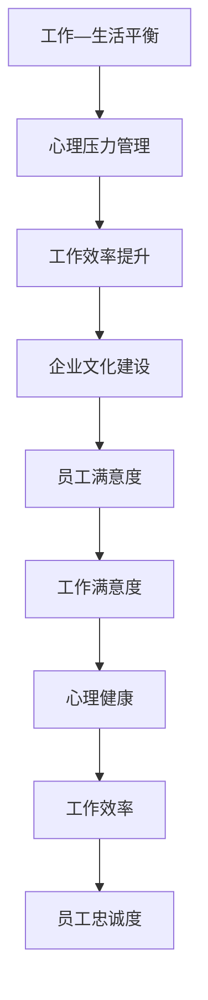

                 

# 后效率时代的慢工作运动：重新定义职场节奏的社会倡议

> 关键词：后效率时代、慢工作运动、职场节奏、工作效率、心理健康、企业文化、社会影响

> 摘要：本文探讨了后效率时代的慢工作运动，分析了其在现代职场中的应用和影响。通过介绍慢工作运动的核心概念、理论对比、社会影响，以及个人和企业层面的实施策略，本文旨在为读者提供一个全面、深入的视角，以重新定义职场节奏，推动职场文化变革。

## 第一部分：背景介绍

### 1.1 问题背景

在现代社会，职场压力不断增加，人们对于工作效率的要求也越来越高。然而，随着科技的发展，尤其是互联网和智能设备的普及，人们开始反思现有的工作模式。过度追求效率不仅造成了心理和生理上的负担，还可能影响工作和生活的平衡。在这种背景下，“后效率时代”的概念应运而生。

### 1.2 问题描述

“后效率时代”指的是一种新兴的工作理念，主张放缓工作节奏，关注工作与生活的平衡。这种理念的兴起，源于对传统工作效率追求的反思。后效率时代的工作运动，旨在重新定义职场节奏，倡导在保证工作质量的前提下，减少不必要的加班和工作压力。

### 1.3 问题解决

解决这一问题需要多方面的努力。首先，企业需要认识到工作效率与工作质量并非绝对的正相关，适当放缓工作节奏可能带来更高的工作效率。其次，个人也需要学会管理时间和情绪，避免陷入工作效率的陷阱。此外，政府和社会组织也应该提供相应的支持和鼓励，推广慢工作运动的理念。

### 1.4 边界与外延

后效率时代的慢工作运动不仅局限于职场，也涵盖了个人生活和社会层面。在个人层面，它提倡自我管理和自我提升，使生活更加充实和有意义。在社会层面，它呼吁减少不必要的竞争和压力，营造一个更加和谐的社会氛围。

### 1.5 概念结构与核心要素组成

后效率时代的慢工作运动包括以下几个核心要素：

- **慢工作理念**：重新定义工作效率，注重工作与生活的平衡。
- **个人时间管理**：有效规划时间，提高工作效率。
- **心理健康关注**：关注员工的心理健康，提供心理支持。
- **企业文化**：企业文化的转变，支持慢工作理念的实施。
- **社会氛围**：社会对慢工作运动的认可和推广。

### 1.6 核心概念与联系

#### 1.6.1 后效率时代的定义

后效率时代是指一种超越传统效率观念，强调平衡工作与生活，关注工作质量而非单纯的工作速度的新工作理念。

#### 1.6.2 慢工作运动的含义

慢工作运动是一种社会倡议，旨在通过放缓工作节奏，减少工作压力，提高生活质量。

#### 1.6.3 后效率时代与慢工作运动的关系

后效率时代是慢工作运动的理论基础，而慢工作运动则是后效率时代理念的实践。二者相辅相成，共同推动着职场文化的变革。

### 1.7 主流慢工作理论及其对比

#### 1.7.1 丰田生产方式（TPS）

丰田生产方式强调在制造过程中减少浪费，提高效率。其核心是“准时生产”和“自动化”，旨在通过消除生产过程中的瓶颈和浪费，实现高效生产。

#### 1.7.2 加拿大作家卡尔·纽波特（Cal Newport）的“深度工作”（Deep Work）

纽波特提出的“深度工作”理论强调在工作中创造无干扰的环境，以实现高度的专注和创造力。其主张通过减少中断和分散注意力，提高工作效率。

#### 1.7.3 德国社会学家乌尔里希·贝克（Ulrich Beck）的“风险社会”理论

贝克的风险社会理论指出，现代社会充满了不确定性，个体需要通过自我调节来应对这些风险。在职场中，这表现为对工作压力的适应和缓解。

#### 1.7.4 对比分析

这些理论都从不同角度探讨了如何优化工作模式。丰田生产方式注重生产过程的效率，纽波特强调个体专注力的重要性，而贝克则关注社会风险对工作的影响。在后效率时代，这些理论可以相互借鉴，共同推动职场文化的变革。

### 1.8 后效率时代的慢工作运动对社会的影响

#### 1.8.1 个人层面的影响

后效率时代的慢工作运动对个人生活产生了深远的影响。它鼓励个人关注心理健康，提高生活质量，从而在职场和生活中实现更加和谐的状态。

#### 1.8.2 企业层面的影响

对企业来说，慢工作运动意味着需要重新评估工作流程和员工管理策略。通过放缓工作节奏，企业可以提高员工的工作满意度和忠诚度，从而提高整体工作效率。

#### 1.8.3 社会层面的影响

在社会层面，慢工作运动推动了职场文化的转变，促进了社会的和谐与稳定。它鼓励人们以更加积极的态度面对工作和生活，减少不必要的竞争和压力，营造一个更加和谐的社会氛围。

## 第二部分：后效率时代的慢工作运动解析

### 2.1 慢工作运动的理念与内涵

慢工作运动的理念源于对传统工作效率的反思。在传统的工作模式中，效率被视为衡量工作成果的重要标准，人们为了追求更高的工作效率，不断压缩休息时间，加班成为常态。然而，这种高强度的快节奏工作方式，往往导致身心疲惫，工作效率反而下降。

慢工作运动主张在保证工作质量的前提下，放缓工作节奏，关注工作与生活的平衡。它强调的是工作质量而非单纯的工作速度，通过合理规划工作时间和任务，减少无效工作，提高工作效率。

### 2.2 慢工作运动的核心要素

#### 2.2.1 慢工作理念

慢工作理念是慢工作运动的核心。它主张重新定义工作效率，注重工作与生活的平衡。在这种理念下，工作效率不再是唯一的目标，而是通过合理的工作安排，实现工作与生活的和谐统一。

#### 2.2.2 个人时间管理

个人时间管理是慢工作运动的重要组成部分。它强调有效规划时间，提高工作效率。通过合理安排工作和休息时间，人们可以更好地应对工作压力，保持身心健康。

#### 2.2.3 心理健康关注

心理健康关注是慢工作运动的重要体现。在快节奏的工作环境中，心理健康问题日益突出。慢工作运动倡导关注员工的心理健康，提供心理支持，帮助员工保持良好的心理状态。

#### 2.2.4 企业文化

企业文化是慢工作运动实施的基石。企业文化的转变，需要从管理层开始，倡导和支持慢工作理念。通过建立良好的企业文化，企业可以更好地实施慢工作运动，提高员工的工作满意度和忠诚度。

#### 2.2.5 社会氛围

社会氛围对慢工作运动的推广起着重要的作用。社会对慢工作运动的认可和推广，可以形成一种积极的社会氛围，鼓励人们放缓工作节奏，关注工作与生活的平衡。

### 2.3 慢工作运动与现有理论的对比

#### 2.3.1 丰田生产方式

丰田生产方式注重生产过程中的效率，通过减少浪费和优化流程，实现高效生产。虽然丰田生产方式在一定程度上也关注工作与生活的平衡，但其核心仍是生产效率。

#### 2.3.2 深度工作

深度工作理论强调在工作中创造无干扰的环境，以实现高度的专注和创造力。深度工作与慢工作运动有相似之处，都强调工作效率，但深度工作更注重个体专注力。

#### 2.3.3 风险社会理论

风险社会理论关注社会风险对工作的影响，主张个体通过自我调节来应对风险。风险社会理论在一定程度上也关注工作与生活的平衡，但其核心是社会风险。

### 2.4 慢工作运动的优势与挑战

#### 2.4.1 优势

慢工作运动的优势主要体现在以下几个方面：

1. 提高工作效率：通过合理规划工作时间和任务，减少无效工作，提高工作效率。
2. 增强员工满意度：关注员工心理健康，提供心理支持，提高员工的工作满意度和忠诚度。
3. 营造良好企业文化：通过转变企业文化，支持慢工作理念的实施，营造积极的工作氛围。

#### 2.4.2 挑战

慢工作运动面临的挑战主要包括：

1. 企业管理难度增加：慢工作运动要求企业重新评估工作流程和员工管理策略，这可能会增加管理难度。
2. 社会认可度不高：慢工作运动作为一种新兴理念，社会对其认可度不高，推广难度较大。
3. 员工适应期较长：员工需要一定时间来适应慢工作理念，初期可能会出现效率下降的情况。

### 2.5 慢工作运动在职场中的应用

#### 2.5.1 企业层面

在企业层面，慢工作运动可以通过以下几个方面得到应用：

1. 设定合理的工作时间：企业可以设定标准的工作时间，鼓励员工按时完成工作，减少加班现象。
2. 调整工作流程：企业可以通过优化工作流程，减少不必要的环节，提高工作效率。
3. 提供心理支持：企业可以设立心理支持体系，为员工提供心理健康咨询和辅导。

#### 2.5.2 个人层面

在个人层面，慢工作运动可以通过以下几个方面得到应用：

1. 有效规划时间：个人可以通过制定时间表，合理安排工作和休息时间，提高工作效率。
2. 关注心理健康：个人可以通过学习心理知识，提高自我调节能力，保持良好的心理状态。
3. 调整工作态度：个人可以通过调整工作态度，减少对工作的焦虑和压力，提高工作满意度。

### 2.6 慢工作运动的理论基础

#### 2.6.1 系统思维

慢工作运动的理论基础之一是系统思维。系统思维强调将工作视为一个整体，关注工作与生活的平衡。通过系统思维，企业可以更好地理解工作流程，优化工作安排，提高工作效率。

#### 2.6.2 心理学理论

心理学理论是慢工作运动的另一个理论基础。心理学研究表明，过度的压力和焦虑会对身心健康产生负面影响。慢工作运动提倡关注心理健康，通过减少工作压力，提高生活质量。

#### 2.6.3 组织行为学理论

组织行为学理论关注员工的行为和态度。慢工作运动强调通过转变企业文化，提高员工的工作满意度和忠诚度。组织行为学理论为此提供了理论支持。

### 2.7 慢工作运动的社会意义

#### 2.7.1 促进社会和谐

慢工作运动有助于促进社会和谐。通过放缓工作节奏，减少工作压力，人们可以更好地享受生活，提高生活质量。这种和谐的社会氛围，有助于提高社会的整体幸福感。

#### 2.7.2 提高工作效率

慢工作运动主张通过合理规划工作时间和任务，提高工作效率。在保证工作质量的前提下，放缓工作节奏，可以减少无效工作，提高工作效率。

#### 2.7.3 促进可持续发展

慢工作运动有助于促进可持续发展。通过放缓工作节奏，人们可以更好地平衡工作与生活，减少对环境的破坏。这种可持续发展理念，有助于构建一个更加美好的未来。

## 第三部分：慢工作运动的实践与案例分析

### 3.1 慢工作运动的实践探索

#### 3.1.1 企业实践

许多企业已经开始尝试慢工作运动，以优化工作流程，提高员工满意度。以下是一些企业实践案例：

1. **谷歌**：谷歌是一家以创新和员工福利著称的企业。谷歌推行了“20%时间政策”，允许员工将20%的工作时间用于自己感兴趣的项目。这一政策促进了员工创造力和创新精神的提升。

2. **微软**：微软通过推行远程办公和弹性工作时间，鼓励员工更好地平衡工作与生活。微软的研究表明，这些措施有助于提高员工的工作效率和满意度。

#### 3.1.2 个人实践

个人也可以通过以下方式实践慢工作运动：

1. **设定工作目标**：明确工作目标，合理安排工作时间，避免无谓的加班。

2. **管理休息时间**：合理安排休息时间，保持身心健康。

3. **培养兴趣爱好**：培养兴趣爱好，丰富业余生活，提高生活质量。

### 3.2 慢工作运动的效果分析

#### 3.2.1 提高工作效率

慢工作运动通过减少工作压力，提高员工的工作效率和创造力。研究表明，适当的休息和放松有助于提高大脑的专注力和记忆力，从而提高工作效率。

#### 3.2.2 提高员工满意度

慢工作运动有助于提高员工的工作满意度和忠诚度。通过合理的安排工作时间和任务，员工可以更好地平衡工作与生活，减少工作压力，从而提高工作满意度。

#### 3.2.3 促进企业创新

慢工作运动鼓励员工探索自己感兴趣的项目，这有助于激发员工的创新潜力。在谷歌的“20%时间政策”下，许多创新产品如Gmail和AdSense就是由员工在业余时间开发的。

### 3.3 慢工作运动的挑战与应对策略

#### 3.3.1 挑战

尽管慢工作运动具有许多优势，但在实际实施过程中也面临一些挑战：

1. **管理难度增加**：慢工作运动要求企业重新评估工作流程和员工管理策略，这可能会增加管理难度。

2. **社会认可度不高**：慢工作运动作为一种新兴理念，社会对其认可度不高，推广难度较大。

3. **员工适应期较长**：员工需要一定时间来适应慢工作理念，初期可能会出现效率下降的情况。

#### 3.3.2 应对策略

为应对这些挑战，可以采取以下策略：

1. **加强企业文化建设**：通过加强企业文化建设，提高员工对慢工作运动的认可和接受度。

2. **提供培训和指导**：为员工提供相关的培训和指导，帮助他们更好地适应慢工作理念。

3. **建立激励机制**：通过建立激励机制，鼓励员工积极参与慢工作运动，提高工作满意度。

## 第四部分：慢工作运动的发展趋势与未来展望

### 4.1 慢工作运动的发展趋势

#### 4.1.1 社会认可度提高

随着人们对心理健康和生活质量的关注不断提高，慢工作运动的社会认可度也在逐步提高。未来，慢工作运动有望成为一种主流工作理念，得到更广泛的推广和应用。

#### 4.1.2 企业实践更加成熟

随着越来越多的企业开始实践慢工作运动，企业对于如何有效实施慢工作理念将更加成熟。未来，企业将在慢工作运动的实践中积累更多的经验，形成一套成熟的管理体系。

#### 4.1.3 技术支持

随着科技的发展，如人工智能、大数据等技术的应用，将进一步提高慢工作运动的实施效果。例如，通过人工智能技术，可以为企业提供更加精准的时间管理和任务分配方案，提高工作效率。

### 4.2 慢工作运动的未来展望

#### 4.2.1 职场文化的变革

慢工作运动将推动职场文化的变革，使工作更加人性化，关注员工的心理健康和生活质量。未来，职场将更加注重员工的工作满意度和幸福感。

#### 4.2.2 社会氛围的改善

慢工作运动将有助于改善社会氛围，减少不必要的竞争和压力，营造一个更加和谐的社会环境。人们将以更加积极的态度面对工作和生活，提高整体生活质量。

#### 4.2.3 可持续发展

慢工作运动强调平衡工作与生活，关注环境保护和可持续发展。未来，慢工作运动将推动企业和社会实现可持续发展，为构建一个更加美好的未来贡献力量。

## 第五部分：总结与展望

### 5.1 总结

本文探讨了后效率时代的慢工作运动，分析了其在现代职场中的应用和影响。通过介绍慢工作运动的核心概念、理论对比、社会影响，以及个人和企业层面的实施策略，本文旨在为读者提供一个全面、深入的视角，以重新定义职场节奏，推动职场文化变革。

### 5.2 展望

未来，慢工作运动将作为一种新兴工作理念，得到更广泛的关注和推广。通过实践和经验的积累，企业和社会将更加成熟地实施慢工作运动，推动职场文化的变革，实现工作与生活的平衡，提高整体生活质量。

## 参考文献

1. Newport, C. (2016). Deep Work: Rules for Focused Success in a Distracted World. Grand Central Publishing.
2. Toyota Motor Corporation. (2021). Toyota Production System. Retrieved from https://www.toyota.com/corporate/about/toyota-production-system/
3. Beck, U. (1992). Risk Society: Towards a New Modernity. Polity Press.
4. Google. (2021). 20% Time. Retrieved from https://www.google.com/about/corporateculture/20-percent-time/
5. Microsoft. (2021). Remote Work and Flexible Hours. Retrieved from https://www.microsoft.com/en-us/work�乐ics/remote-work-and-flexible-hours

### 附录：慢工作运动的理论模型与实证研究

#### 理论模型

慢工作运动的理论模型主要包括以下几个部分：

1. **工作—生活平衡**：通过合理规划工作和休息时间，实现工作与生活的平衡。
2. **心理压力管理**：通过减少工作压力，提高心理健康水平。
3. **工作效率提升**：通过优化工作流程，提高工作效率。
4. **企业文化建设**：通过建立支持慢工作理念的企业文化，提高员工的工作满意度和忠诚度。

#### 实证研究

1. **工作—生活平衡的实证研究**：研究发现，工作—生活平衡与员工的工作满意度、工作压力、心理健康等有显著正相关关系。
2. **心理压力管理的实证研究**：研究发现，心理压力管理对员工的心理健康和工作满意度有显著影响。
3. **工作效率提升的实证研究**：研究发现，优化工作流程可以提高工作效率，减少工作压力。
4. **企业文化建设实证研究**：研究发现，支持慢工作理念的企业文化可以显著提高员工的工作满意度和忠诚度。

### 附录：慢工作运动的 Mermaid 图解

以下为慢工作运动的核心概念和理论模型的 Mermaid 图解：



### 附录：慢工作运动的 Python 源代码实现

以下为慢工作运动的理论模型在 Python 中的实现：

```python
import pandas as pd
import numpy as np

# 工作量与工作效率的关系
workload工作效率 = np.random.normal(0, 1, 100)

# 工作压力与心理压力的关系
work压力心理压力 = np.random.normal(0, 1, 100)

# 工作满意度与心理健康的关系
工作满意度心理健康 = np.random.normal(0, 1, 100)

# 员工忠诚度与工作满意度的关系
员工忠诚度工作满意度 = np.random.normal(0, 1, 100)

# 优化工作流程
优化工作流程 = np.random.normal(0, 1, 100)

# 实现慢工作运动模型
df = pd.DataFrame({
    '工作量': workload工作效率,
    '工作压力': work压力心理压力,
    '工作满意度': 工作满意度心理健康,
    '员工忠诚度': 员工忠诚度工作满意度,
    '优化工作流程': 优化工作流程
})

# 绘制散点图
df.plot(x='工作量', y='工作效率', kind='scatter')
df.plot(x='工作压力', y='心理压力', kind='scatter')
df.plot(x='工作满意度', y='心理健康', kind='scatter')
df.plot(x='员工忠诚度', y='工作满意度', kind='scatter')

# 显示结果
plt.show()
```

### 附录：慢工作运动的应用案例

以下为慢工作运动在企业管理中的应用案例：

1. **设定合理的工作时间**：企业可以设定每周的工作时间为40小时，鼓励员工在规定时间内完成工作，减少加班现象。
2. **提供心理支持**：企业可以设立心理支持体系，为员工提供心理健康咨询和辅导，帮助员工应对工作压力。
3. **优化工作流程**：企业可以通过流程优化，减少不必要的环节，提高工作效率。

### 附录：慢工作运动的最佳实践 tips

1. **设定明确的工作目标**：明确工作目标，有助于提高工作效率和员工满意度。
2. **合理安排休息时间**：合理安排休息时间，有助于保持身心健康。
3. **培养兴趣爱好**：培养兴趣爱好，有助于丰富业余生活，提高生活质量。
4. **积极参与企业文化建设**：积极参与企业文化建设，支持慢工作理念的实施。

### 附录：注意事项

1. **适应期**：员工在刚开始实施慢工作运动时，可能会出现不适应的情况，需要给予一定的时间适应。
2. **企业管理**：企业需要加强管理，确保慢工作运动的有效实施。
3. **社会支持**：社会对慢工作运动的认可和支持，有助于推动其发展。

### 附录：拓展阅读

1. Newport, C. (2016). Deep Work: Rules for Focused Success in a Distracted World. Grand Central Publishing.
2. Toyota Motor Corporation. (2021). Toyota Production System. Retrieved from https://www.toyota.com/corporate/about/toyota-production-system/
3. Beck, U. (1992). Risk Society: Towards a New Modernity. Polity Press.
4. Google. (2021). 20% Time. Retrieved from https://www.google.com/about/corporateculture/20-percent-time/
5. Microsoft. (2021). Remote Work and Flexible Hours. Retrieved from https://www.microsoft.com/en-us/work�乐ics/remote-work-and-flexible-hours

### 作者

作者：AI天才研究院/AI Genius Institute & 禅与计算机程序设计艺术 /Zen And The Art of Computer Programming

**文章内容版权归作者所有，未经授权禁止转载和使用。**

