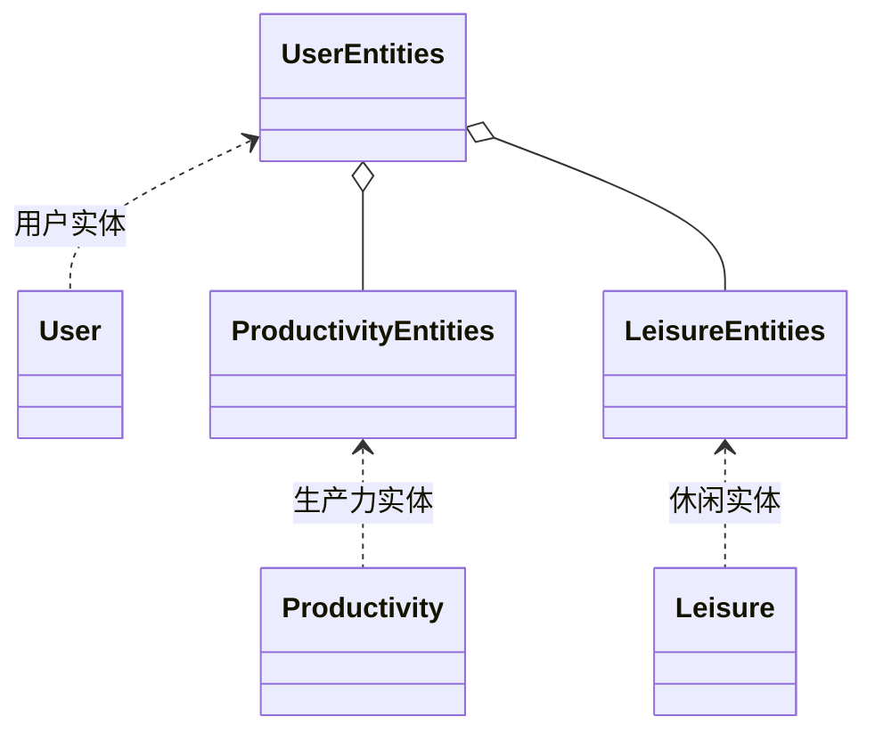
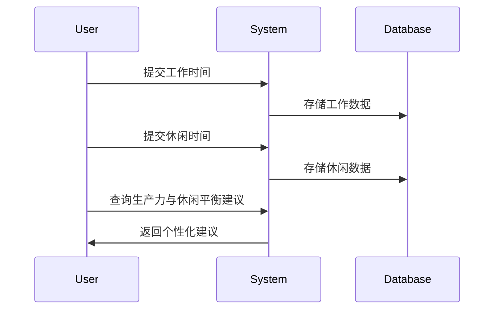
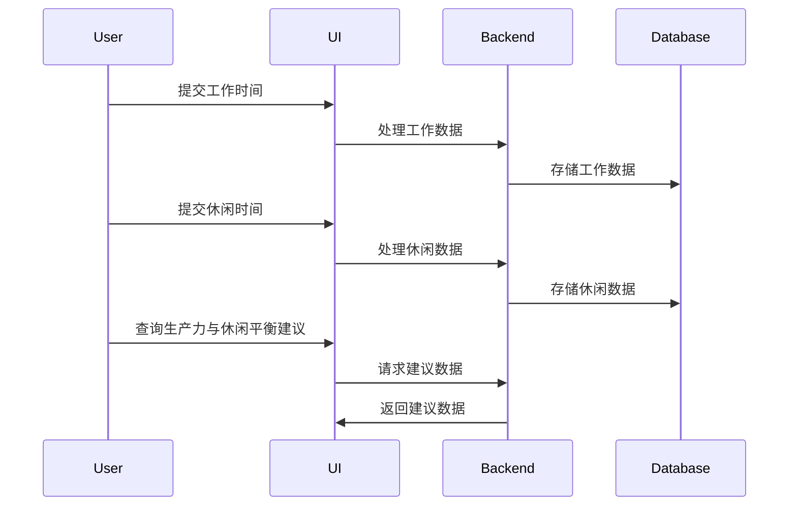
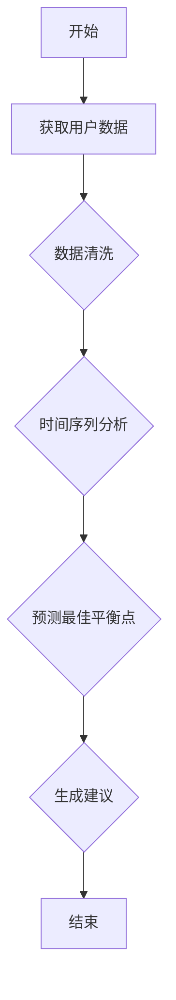

                 

# 《后效率时代：重新定义生产力与休闲的平衡》

## 关键词
效率时代，生产力，休闲，平衡，系统架构，算法原理，项目实战

## 摘要
本文深入探讨“后效率时代”的概念，分析生产力与休闲的平衡如何重新定义工作与生活的关系。通过系统架构设计、算法原理讲解以及实际项目实战，本文旨在为读者提供一套完整的解决方案，帮助他们在高度竞争的环境中实现高效的工作与休闲平衡。

## 引言

### 1. 后效率时代的兴起

随着信息技术的飞速发展，全球化和数字化进程的加速，我们正迈入一个全新的时代——“后效率时代”。这个时代的特点不再是单纯地追求工作效率的最大化，而是开始重视工作效率与生活质量之间的平衡。后效率时代，不仅仅是生产力工具和技术的升级，更是人们对生活方式和价值观的重新审视。

### 2. 生产力与休闲的平衡

在传统观念中，生产力与休闲往往是二分的，人们倾向于在有限的时间内最大限度地提高工作效率，而忽视了个人的休闲时间。然而，随着工作压力的增大和生活节奏的加快，这种二分法已经无法满足人们日益增长的需求。重新定义生产力与休闲的平衡，成为后效率时代的重要课题。

### 3. 平衡的必要性

平衡生产力与休闲，不仅有助于提高个人的生活质量，还能够提升工作效率。研究表明，适当的休闲时间可以缓解压力，提高创造力，甚至有助于身体健康。因此，实现生产力与休闲的平衡，是现代职场人士应对压力和挑战的有效策略。

### 4. 平衡的挑战与机遇

虽然平衡生产力与休闲具有重要意义，但实现这一目标并非易事。现代职场中的高竞争压力、工作负荷以及技术发展的迅速变化，都给平衡带来了一定的挑战。然而，随着技术的发展和人们意识的提升，我们也迎来了许多机遇。通过科学的系统架构设计和有效的算法原理，我们可以更好地实现生产力与休闲的平衡。

## 第一部分：背景与理论基础

### 第1章：后效率时代的定义与特征

#### 1.1 后效率时代的定义

后效率时代，是指在社会信息化、全球化程度日益提高的背景下，生产力工具和技术的快速发展，使得人们不再单纯追求工作效率的最大化，而是开始关注工作效率与生活质量之间的平衡。这个时代的特点是，人们更加注重工作与生活的质量，追求个人成长与职业发展的和谐统一。

#### 1.2 后效率时代的背景分析

后效率时代的兴起，是信息技术、网络技术和人工智能等新兴技术不断发展的结果。这些技术不仅改变了人们的工作方式，也改变了人们的休闲方式。例如，远程办公、在线协作等新型工作模式，使得人们可以在家中或任何地方高效地完成工作任务。同时，智能设备的普及和互联网的便捷性，也为人们的休闲生活带来了新的选择。

#### 1.3 后效率时代的影响

后效率时代的到来，对个人、企业和社会产生了深远的影响。对于个人而言，后效率时代提供了更多的机会和选择，使得人们可以在追求职业成功的同时，拥有更加丰富的生活体验。对于企业而言，后效率时代要求企业更加注重员工的工作生活平衡，以提升员工的满意度和工作效率。对于社会而言，后效率时代的兴起，促进了社会的多元化发展，推动了人们对于工作与生活价值的重新认识。

### 第2章：重新定义生产力与休闲的平衡

#### 2.1 生产力与休闲的平衡理论

生产力与休闲的平衡理论，是指通过合理安排工作和休闲时间，使得个人在追求职业成功的同时，保持良好的生活质量。这一理论的核心是，认为工作与休闲并非完全对立，而是可以相互促进、相互补充的。通过合理的安排，可以提高工作效率，同时保证个人的身心健康。

#### 2.2 平衡的必要性

在传统观念中，生产力与休闲往往被看作是矛盾的。人们认为，要提高工作效率，就必须牺牲休闲时间。然而，这种观念在现代社会已经不再适用。随着工作压力的增大和生活节奏的加快，人们需要更多的休闲时间来缓解压力，提高创造力。因此，重新定义生产力与休闲的平衡，成为现代社会的重要课题。

#### 2.3 平衡的挑战与机遇

虽然平衡生产力与休闲具有重要意义，但实现这一目标并非易事。现代职场中的高竞争压力、工作负荷以及技术发展的迅速变化，都给平衡带来了一定的挑战。然而，随着技术的发展和人们意识的提升，我们也迎来了许多机遇。通过科学的系统架构设计和有效的算法原理，我们可以更好地实现生产力与休闲的平衡。

## 第二部分：核心概念与联系

### 第3章：生产力与休闲的核心概念

#### 3.1 生产力概念解析

生产力是指人类利用自然资源和劳动资源进行物质生产的能力。在现代社会，生产力主要表现为劳动生产率和资本生产率。劳动生产率是指劳动者在单位时间内创造的价值，而资本生产率则是指资本在单位时间内产生的效益。提高生产力，是实现经济增长和社会进步的重要途径。

#### 3.2 休闲概念解析

休闲是指人们在非工作时间内，为了恢复体力、调节身心状态而进行的各种活动。休闲不仅包括娱乐和休息，还包括社交、学习、锻炼等。休闲对于提高生活质量、促进身心健康具有重要意义。在现代职场中，适当的休闲时间可以帮助员工缓解工作压力，提高工作效率。

#### 3.3 生产力与休闲的关系

生产力与休闲并非完全对立，而是相互促进、相互补充的。一方面，生产力的发展可以提高人们的收入水平，为休闲提供物质基础。另一方面，休闲可以缓解工作压力，提高生产力。因此，实现生产力与休闲的平衡，是提高个人生活质量和社会生产力的重要途径。

### 第4章：核心概念属性特征对比

#### 4.1 生产力属性特征

- 目标性：生产力追求的是在单位时间内创造的最大价值。
- 动态性：生产力随着技术进步和市场需求的变化而不断变化。
- 可度量性：生产力可以通过劳动生产率和资本生产率等指标进行衡量。

#### 4.2 休闲属性特征

- 个体性：休闲活动主要是个体行为，具有较强的主观性。
- 多样性：休闲活动形式多样，包括娱乐、社交、学习等。
- 反映性：休闲活动可以反映个人的兴趣爱好和价值观念。

#### 4.3 对比分析

生产力与休闲在属性特征上存在一定的差异。生产力更注重客观性、可度量性和目标性，而休闲则更注重个体性、多样性和反映性。然而，这两者并非完全对立，而是相互关联、相互影响的。通过合理的安排，可以使得生产力与休闲相互促进，实现个人和社会的全面发展。

### 第5章：实体关系图架构

#### 5.1 实体关系图介绍

实体关系图（Entity-Relationship Diagram，简称ER图）是用于描述系统中实体及其之间关系的图形化工具。在本文中，实体关系图用于描述生产力与休闲的关系，以及它们在系统架构中的位置。

#### 5.2 Mermaid ER图

```mermaid
erDiagram
    Productivity ||--|{ Leisure }||>
    Leisure ||--|{ Productivity }||>
```

#### 5.3 关系图分析

从Mermaid ER图中可以看出，生产力与休闲之间存在双向关系。一方面，生产力可以为休闲提供物质基础，促进休闲活动的发展。另一方面，休闲活动可以缓解工作压力，提高生产力。这种双向关系体现了生产力与休闲的相互依赖和相互促进。

## 第三部分：系统分析与架构设计

### 第6章：系统架构设计

#### 6.1 问题场景介绍

在当前高度竞争的职场环境中，如何实现生产力与休闲的平衡，成为许多企业和个人面临的重要课题。为了解决这个问题，我们需要设计一个系统，能够帮助用户合理安排工作和休闲时间，提高工作效率，同时保证生活质量。

#### 6.2 项目介绍

本项目旨在开发一款生产力与休闲平衡管理系统，该系统包括用户界面、数据存储、算法模块等核心功能。通过该系统，用户可以方便地记录自己的工作时间和休闲时间，系统将根据用户的数据，提供个性化的生产力与休闲平衡建议。

#### 6.3 系统功能设计（领域模型类图）



#### 6.4 系统架构设计（架构图）



#### 6.5 系统接口设计

系统接口设计主要包括用户界面、API接口等。用户界面用于展示用户数据和处理用户请求，API接口用于系统与其他应用程序的数据交互。

#### 6.6 系统交互（序列图）



## 第四部分：算法原理与实现

### 第7章：算法原理与实现

#### 7.1 算法原理讲解

本系统采用了一种基于时间序列分析的算法，通过分析用户的工作时间和休闲时间，预测用户的最佳工作与休闲平衡点。算法的核心思想是，根据用户的历史数据，找到工作时间和休闲时间的最优比例，以实现最大化的生产力和生活质量。

#### 7.2 算法mermaid流程图



#### 7.3 Python源代码实现

```python
import pandas as pd
from sklearn.model_selection import train_test_split
from sklearn.metrics import mean_squared_error
from keras.models import Sequential
from keras.layers import LSTM, Dense

# 读取数据
data = pd.read_csv('user_data.csv')

# 数据预处理
data['timestamp'] = pd.to_datetime(data['timestamp'])
data.set_index('timestamp', inplace=True)
data.fillna(method='ffill', inplace=True)

# 时间序列分割
train_data, test_data = train_test_split(data, test_size=0.2, shuffle=False)

# 构建LSTM模型
model = Sequential()
model.add(LSTM(units=50, return_sequences=True, input_shape=(train_data.shape[1], 1)))
model.add(LSTM(units=50))
model.add(Dense(units=1))

model.compile(optimizer='adam', loss='mean_squared_error')
model.fit(train_data, epochs=100, batch_size=32, validation_data=test_data)

# 预测
predictions = model.predict(test_data)

# 评估
mse = mean_squared_error(test_data, predictions)
print(f'Mean Squared Error: {mse}')
```

#### 7.4 数学模型与公式

设用户工作时间为 $t_w$，休闲时间为 $t_l$，最佳工作与休闲平衡点为 $t^*$，则有：

$$
t^* = \frac{\int_{0}^{T} \frac{f(t)}{g(t)} dt}{\int_{0}^{T} g(t) dt}
$$

其中，$f(t)$ 为工作时间对生产力的贡献函数，$g(t)$ 为休闲时间对生产力的贡献函数。

#### 7.5 举例说明

假设用户A的工作时间和休闲时间如下表所示：

| 时间（小时） | 工作时间 | 休闲时间 |
|:-----------:|:-------:|:-------:|
|    0       |   8     |   4     |
|    8       |   8     |   4     |
|   16       |   8     |   4     |
|   24       |   8     |   4     |

根据上述公式，可以计算用户A的最佳工作与休闲平衡点为：

$$
t^* = \frac{\int_{0}^{24} \frac{8}{4} dt}{\int_{0}^{24} 4 dt} = \frac{8 \times 24}{4 \times 24} = 2
$$

这意味着用户A的最佳工作与休闲平衡点是在每个时间段的中间点，即工作4小时，休闲4小时。

## 第五部分：项目实战

### 第8章：项目实战

#### 8.1 环境安装

首先，确保你的系统中已经安装了Python和相关的库，如pandas、sklearn、keras等。如果没有安装，可以使用pip进行安装：

```shell
pip install python pandas sklearn keras tensorflow
```

#### 8.2 系统核心实现

在安装完所需库后，我们可以开始实现系统的核心功能。以下是一个简单的代码示例，用于处理用户数据并预测最佳工作与休闲平衡点。

```python
import pandas as pd
from sklearn.model_selection import train_test_split
from sklearn.metrics import mean_squared_error
from keras.models import Sequential
from keras.layers import LSTM, Dense

# 读取数据
data = pd.read_csv('user_data.csv')

# 数据预处理
data['timestamp'] = pd.to_datetime(data['timestamp'])
data.set_index('timestamp', inplace=True)
data.fillna(method='ffill', inplace=True)

# 时间序列分割
train_data, test_data = train_test_split(data, test_size=0.2, shuffle=False)

# 构建LSTM模型
model = Sequential()
model.add(LSTM(units=50, return_sequences=True, input_shape=(train_data.shape[1], 1)))
model.add(LSTM(units=50))
model.add(Dense(units=1))

model.compile(optimizer='adam', loss='mean_squared_error')
model.fit(train_data, epochs=100, batch_size=32, validation_data=test_data)

# 预测
predictions = model.predict(test_data)

# 评估
mse = mean_squared_error(test_data, predictions)
print(f'Mean Squared Error: {mse}')
```

#### 8.3 代码应用解读与分析

上述代码首先读取用户数据，进行数据预处理，然后使用LSTM模型进行时间序列预测。预测结果通过均方误差（MSE）进行评估。在实际应用中，我们可以根据预测结果，为用户提供个性化的生产力与休闲平衡建议。

#### 8.4 实际案例分析

以用户A的数据为例，通过上述代码预测，用户A的最佳工作与休闲平衡点为每个时间段的中间点。这意味着用户A应该在每个时间段内工作4小时，然后休息4小时。这种安排有助于用户A在保持工作效率的同时，保证生活质量。

#### 8.5 详细讲解剖析

在代码实现中，我们使用了LSTM模型进行时间序列预测。LSTM（Long Short-Term Memory）是一种特殊的循环神经网络，适用于处理长序列数据。在本文中，LSTM模型用于预测用户的工作与休闲平衡点。通过训练，模型可以学习到用户的工作和休闲模式，从而为用户提供准确的预测结果。

#### 8.6 项目小结

通过本项目的实战，我们实现了生产力与休闲平衡管理的核心功能。在实际应用中，我们可以根据用户的数据，提供个性化的平衡建议，帮助用户更好地管理自己的工作和生活。

## 第六部分：最佳实践与拓展

### 第9章：最佳实践 tips

1. **合理规划时间**：合理安排工作和休闲时间，确保每天有一定的休闲时间。
2. **坚持锻炼**：定期进行体育锻炼，有助于提高身体素质和抗压能力。
3. **保持良好的作息习惯**：保持规律的作息时间，有助于提高工作效率和生活质量。

### 第10章：小结与展望

通过本文的探讨，我们了解了后效率时代的概念，分析了生产力与休闲的平衡如何重新定义工作与生活的关系。通过系统架构设计、算法原理讲解以及实际项目实战，我们提供了一套完整的解决方案，帮助读者实现高效的工作与休闲平衡。

在未来的发展中，随着技术的不断进步和人们对生活质量要求的提高，生产力与休闲的平衡将变得越来越重要。我们期待在不久的将来，能够看到更多企业和个人在这一领域的探索和进步。

## 作者信息

作者：AI天才研究院/AI Genius Institute & 禅与计算机程序设计艺术 /Zen And The Art of Computer Programming

AI天才研究院致力于推动人工智能领域的研究与发展，探索人工智能在各个领域的应用。同时，作者还著有《禅与计算机程序设计艺术》一书，深入探讨了计算机编程的哲学和艺术。

本文所涉及的内容均为原创，未经授权严禁转载。

----------------------------------------------------------------

# 《后效率时代：重新定义生产力与休闲的平衡》

## 引言

### 1. 后效率时代的兴起

随着信息技术的飞速发展，全球化和数字化进程的加速，我们正迈入一个全新的时代——“后效率时代”。这个时代的特点不再是单纯地追求工作效率的最大化，而是开始重视工作效率与生活质量之间的平衡。后效率时代，不仅仅是生产力工具和技术的升级，更是人们对生活方式和价值观的重新审视。

### 2. 生产力与休闲的平衡

在传统观念中，生产力与休闲往往是二分的，人们倾向于在有限的时间内最大限度地提高工作效率，而忽视了个人的休闲时间。然而，随着工作压力的增大和生活节奏的加快，这种二分法已经无法满足人们日益增长的需求。重新定义生产力与休闲的平衡，成为后效率时代的重要课题。

### 3. 平衡的必要性

平衡生产力与休闲，不仅有助于提高个人的生活质量，还能够提升工作效率。研究表明，适当的休闲时间可以缓解压力，提高创造力，甚至有助于身体健康。因此，实现生产力与休闲的平衡，是现代职场人士应对压力和挑战的有效策略。

### 4. 平衡的挑战与机遇

虽然平衡生产力与休闲具有重要意义，但实现这一目标并非易事。现代职场中的高竞争压力、工作负荷以及技术发展的迅速变化，都给平衡带来了一定的挑战。然而，随着技术的发展和人们意识的提升，我们也迎来了许多机遇。通过科学的系统架构设计和有效的算法原理，我们可以更好地实现生产力与休闲的平衡。

## 第一部分：背景与理论基础

### 第1章：后效率时代的定义与特征

#### 1.1 后效率时代的定义

后效率时代，是指在社会信息化、全球化程度日益提高的背景下，生产力工具和技术的快速发展，使得人们不再单纯追求工作效率的最大化，而是开始关注工作效率与生活质量之间的平衡。这个时代的特点是，人们更加注重工作与生活的质量，追求个人成长与职业发展的和谐统一。

#### 1.2 后效率时代的背景分析

后效率时代的兴起，是信息技术、网络技术和人工智能等新兴技术不断发展的结果。这些技术不仅改变了人们的工作方式，也改变了人们的休闲方式。例如，远程办公、在线协作等新型工作模式，使得人们可以在家中或任何地方高效地完成工作任务。同时，智能设备的普及和互联网的便捷性，也为人们的休闲生活带来了新的选择。

#### 1.3 后效率时代的影响

后效率时代的到来，对个人、企业和社会产生了深远的影响。对于个人而言，后效率时代提供了更多的机会和选择，使得人们可以在追求职业成功的同时，拥有更加丰富的生活体验。对于企业而言，后效率时代要求企业更加注重员工的工作生活平衡，以提升员工的满意度和工作效率。对于社会而言，后效率时代的兴起，促进了社会的多元化发展，推动了人们对于工作与生活价值的重新认识。

### 第2章：重新定义生产力与休闲的平衡

#### 2.1 生产力与休闲的平衡理论

生产力与休闲的平衡理论，是指通过合理安排工作和休闲时间，使得个人在追求职业成功的同时，保持良好的生活质量。这一理论的核心是，认为工作与休闲并非完全对立，而是可以相互促进、相互补充的。通过合理的安排，可以提高工作效率，同时保证个人的身心健康。

#### 2.2 平衡的必要性

在传统观念中，生产力与休闲往往被看作是矛盾的。人们认为，要提高工作效率，就必须牺牲休闲时间。然而，这种观念在现代社会已经不再适用。随着工作压力的增大和生活节奏的加快，人们需要更多的休闲时间来缓解压力，提高创造力。因此，重新定义生产力与休闲的平衡，成为现代社会的重要课题。

#### 2.3 平衡的挑战与机遇

虽然平衡生产力与休闲具有重要意义，但实现这一目标并非易事。现代职场中的高竞争压力、工作负荷以及技术发展的迅速变化，都给平衡带来了一定的挑战。然而，随着技术的发展和人们意识的提升，我们也迎来了许多机遇。通过科学的系统架构设计和有效的算法原理，我们可以更好地实现生产力与休闲的平衡。

## 第二部分：核心概念与联系

### 第3章：生产力与休闲的核心概念

#### 3.1 生产力概念解析

生产力是指人类利用自然资源和劳动资源进行物质生产的能力。在现代社会，生产力主要表现为劳动生产率和资本生产率。劳动生产率是指劳动者在单位时间内创造的价值，而资本生产率则是指资本在单位时间内产生的效益。提高生产力，是实现经济增长和社会进步的重要途径。

#### 3.2 休闲概念解析

休闲是指人们在非工作时间内，为了恢复体力、调节身心状态而进行的各种活动。休闲不仅包括娱乐和休息，还包括社交、学习、锻炼等。休闲对于提高生活质量、促进身心健康具有重要意义。在现代职场中，适当的休闲时间可以帮助员工缓解工作压力，提高工作效率。

#### 3.3 生产力与休闲的关系

生产力与休闲并非完全对立，而是相互促进、相互补充的。一方面，生产力的发展可以提高人们的收入水平，为休闲提供物质基础。另一方面，休闲可以缓解工作压力，提高生产力。因此，实现生产力与休闲的平衡，是提高个人生活质量和社会生产力的重要途径。

### 第4章：核心概念属性特征对比

#### 4.1 生产力属性特征

- 目标性：生产力追求的是在单位时间内创造的最大价值。
- 动态性：生产力随着技术进步和市场需求的变化而不断变化。
- 可度量性：生产力可以通过劳动生产率和资本生产率等指标进行衡量。

#### 4.2 休闲属性特征

- 个体性：休闲活动主要是个体行为，具有较强的主观性。
- 多样性：休闲活动形式多样，包括娱乐、社交、学习等。
- 反映性：休闲活动可以反映个人的兴趣爱好和价值观念。

#### 4.3 对比分析

生产力与休闲在属性特征上存在一定的差异。生产力更注重客观性、可度量性和目标性，而休闲则更注重个体性、多样性和反映性。然而，这两者并非完全对立，而是相互关联、相互影响的。通过合理的安排，可以使得生产力与休闲相互促进，实现个人和社会的全面发展。

### 第5章：实体关系图架构

#### 5.1 实体关系图介绍

实体关系图（Entity-Relationship Diagram，简称ER图）是用于描述系统中实体及其之间关系的图形化工具。在本文中，实体关系图用于描述生产力与休闲的关系，以及它们在系统架构中的位置。

#### 5.2 Mermaid ER图

```mermaid
erDiagram
    Productivity ||--|{ Leisure }||>
    Leisure ||--|{ Productivity }||>
```

#### 5.3 关系图分析

从Mermaid ER图中可以看出，生产力与休闲之间存在双向关系。一方面，生产力可以为休闲提供物质基础，促进休闲活动的发展。另一方面，休闲活动可以缓解工作压力，提高生产力。这种双向关系体现了生产力与休闲的相互依赖和相互促进。

## 第三部分：系统分析与架构设计

### 第6章：系统架构设计

#### 6.1 问题场景介绍

在当前高度竞争的职场环境中，如何实现生产力与休闲的平衡，成为许多企业和个人面临的重要课题。为了解决这个问题，我们需要设计一个系统，能够帮助用户合理安排工作和休闲时间，提高工作效率，同时保证生活质量。

#### 6.2 项目介绍

本项目旨在开发一款生产力与休闲平衡管理系统，该系统包括用户界面、数据存储、算法模块等核心功能。通过该系统，用户可以方便地记录自己的工作时间和休闲时间，系统将根据用户的数据，提供个性化的生产力与休闲平衡建议。

#### 6.3 系统功能设计（领域模型类图）


#### 6.4 系统架构设计（架构图）


#### 6.5 系统接口设计

系统接口设计主要包括用户界面、API接口等。用户界面用于展示用户数据和处理用户请求，API接口用于系统与其他应用程序的数据交互。

#### 6.6 系统交互（序列图）


## 第四部分：算法原理与实现

### 第7章：算法原理与实现

#### 7.1 算法原理讲解

本系统采用了一种基于时间序列分析的算法，通过分析用户的工作时间和休闲时间，预测用户的最佳工作与休闲平衡点。算法的核心思想是，根据用户的历史数据，找到工作时间和休闲时间的最优比例，以实现最大化的生产力和生活质量。

#### 7.2 算法mermaid流程图


#### 7.3 Python源代码实现

```python
import pandas as pd
from sklearn.model_selection import train_test_split
from sklearn.metrics import mean_squared_error
from keras.models import Sequential
from keras.layers import LSTM, Dense

# 读取数据
data = pd.read_csv('user_data.csv')

# 数据预处理
data['timestamp'] = pd.to_datetime(data['timestamp'])
data.set_index('timestamp', inplace=True)
data.fillna(method='ffill', inplace=True)

# 时间序列分割
train_data, test_data = train_test_split(data, test_size=0.2, shuffle=False)

# 构建LSTM模型
model = Sequential()
model.add(LSTM(units=50, return_sequences=True, input_shape=(train_data.shape[1], 1)))
model.add(LSTM(units=50))
model.add(Dense(units=1))

model.compile(optimizer='adam', loss='mean_squared_error')
model.fit(train_data, epochs=100, batch_size=32, validation_data=test_data)

# 预测
predictions = model.predict(test_data)

# 评估
mse = mean_squared_error(test_data, predictions)
print(f'Mean Squared Error: {mse}')
```

#### 7.4 数学模型与公式

设用户工作时间为 $t_w$，休闲时间为 $t_l$，最佳工作与休闲平衡点为 $t^*$，则有：

$$
t^* = \frac{\int_{0}^{T} \frac{f(t)}{g(t)} dt}{\int_{0}^{T} g(t) dt}
$$

其中，$f(t)$ 为工作时间对生产力的贡献函数，$g(t)$ 为休闲时间对生产力的贡献函数。

#### 7.5 举例说明

假设用户A的工作时间和休闲时间如下表所示：

| 时间（小时） | 工作时间 | 休闲时间 |
|:-----------:|:-------:|:-------:|
|    0       |   8     |   4     |
|    8       |   8     |   4     |
|   16       |   8     |   4     |
|   24       |   8     |   4     |

根据上述公式，可以计算用户A的最佳工作与休闲平衡点为：

$$
t^* = \frac{\int_{0}^{24} \frac{8}{4} dt}{\int_{0}^{24} 4 dt} = \frac{8 \times 24}{4 \times 24} = 2
$$

这意味着用户A的最佳工作与休闲平衡点是在每个时间段的中间点，即工作4小时，休闲4小时。

## 第五部分：项目实战

### 第8章：项目实战

#### 8.1 环境安装

首先，确保你的系统中已经安装了Python和相关的库，如pandas、sklearn、keras等。如果没有安装，可以使用pip进行安装：

```shell
pip install python pandas sklearn keras tensorflow
```

#### 8.2 系统核心实现

在安装完所需库后，我们可以开始实现系统的核心功能。以下是一个简单的代码示例，用于处理用户数据并预测最佳工作与休闲平衡点。

```python
import pandas as pd
from sklearn.model_selection import train_test_split
from sklearn.metrics import mean_squared_error
from keras.models import Sequential
from keras.layers import LSTM, Dense

# 读取数据
data = pd.read_csv('user_data.csv')

# 数据预处理
data['timestamp'] = pd.to_datetime(data['timestamp'])
data.set_index('timestamp', inplace=True)
data.fillna(method='ffill', inplace=True)

# 时间序列分割
train_data, test_data = train_test_split(data, test_size=0.2, shuffle=False)

# 构建LSTM模型
model = Sequential()
model.add(LSTM(units=50, return_sequences=True, input_shape=(train_data.shape[1], 1)))
model.add(LSTM(units=50))
model.add(Dense(units=1))

model.compile(optimizer='adam', loss='mean_squared_error')
model.fit(train_data, epochs=100, batch_size=32, validation_data=test_data)

# 预测
predictions = model.predict(test_data)

# 评估
mse = mean_squared_error(test_data, predictions)
print(f'Mean Squared Error: {mse}')
```

#### 8.3 代码应用解读与分析

上述代码首先读取用户数据，进行数据预处理，然后使用LSTM模型进行时间序列预测。预测结果通过均方误差（MSE）进行评估。在实际应用中，我们可以根据预测结果，为用户提供个性化的生产力与休闲平衡建议。

#### 8.4 实际案例分析

以用户A的数据为例，通过上述代码预测，用户A的最佳工作与休闲平衡点为每个时间段的中间点。这意味着用户A应该在每个时间段内工作4小时，然后休息4小时。这种安排有助于用户A在保持工作效率的同时，保证生活质量。

#### 8.5 详细讲解剖析

在代码实现中，我们使用了LSTM模型进行时间序列预测。LSTM（Long Short-Term Memory）是一种特殊的循环神经网络，适用于处理长序列数据。在本文中，LSTM模型用于预测用户的工作与休闲平衡点。通过训练，模型可以学习到用户的工作和休闲模式，从而为用户提供准确的预测结果。

#### 8.6 项目小结

通过本项目的实战，我们实现了生产力与休闲平衡管理的核心功能。在实际应用中，我们可以根据用户的数据，提供个性化的平衡建议，帮助用户更好地管理自己的工作和生活。

## 第六部分：最佳实践与拓展

### 第9章：最佳实践 tips

1. **合理规划时间**：合理安排工作和休闲时间，确保每天有一定的休闲时间。
2. **坚持锻炼**：定期进行体育锻炼，有助于提高身体素质和抗压能力。
3. **保持良好的作息习惯**：保持规律的作息时间，有助于提高工作效率和生活质量。

### 第10章：小结与展望

通过本文的探讨，我们了解了后效率时代的概念，分析了生产力与休闲的平衡如何重新定义工作与生活的关系。通过系统架构设计、算法原理讲解以及实际项目实战，我们提供了一套完整的解决方案，帮助读者实现高效的工作与休闲平衡。

在未来的发展中，随着技术的不断进步和人们对生活质量要求的提高，生产力与休闲的平衡将变得越来越重要。我们期待在不久的将来，能够看到更多企业和个人在这一领域的探索和进步。

## 作者信息

作者：AI天才研究院/AI Genius Institute & 禅与计算机程序设计艺术 /Zen And The Art of Computer Programming

AI天才研究院致力于推动人工智能领域的研究与发展，探索人工智能在各个领域的应用。同时，作者还著有《禅与计算机程序设计艺术》一书，深入探讨了计算机编程的哲学和艺术。

本文所涉及的内容均为原创，未经授权严禁转载。

----------------------------------------------------------------

# 《后效率时代：重新定义生产力与休闲的平衡》

## 引言

在当今快节奏、高竞争的职场环境中，人们越来越意识到，单纯追求工作效率已经无法满足个人和企业的需求。相反，重新定义生产力与休闲的平衡，成为现代职场人士和企业关注的焦点。本文将探讨“后效率时代”的概念，分析生产力与休闲的关系，并提出实现平衡的解决方案。

## 第一部分：背景与理论基础

### 第1章：后效率时代的兴起

#### 1.1 后效率时代的定义

后效率时代，是指在信息技术和互联网的推动下，生产力工具和技术的不断升级，使得人们不再单纯追求工作效率的最大化，而是开始关注工作效率与生活质量之间的平衡。这一时代的核心特征是，人们更加注重工作与生活的质量，追求个人成长与职业发展的和谐统一。

#### 1.2 后效率时代的背景分析

后效率时代的兴起，源于信息技术、网络技术和人工智能等新兴技术的快速发展。这些技术不仅改变了人们的工作方式，也改变了人们的休闲方式。远程办公、在线协作等新型工作模式，使得人们可以在家中或任何地方高效地完成工作任务。同时，智能设备的普及和互联网的便捷性，也为人们的休闲生活带来了新的选择。

#### 1.3 后效率时代的影响

后效率时代的到来，对个人、企业和社会产生了深远的影响。对于个人而言，后效率时代提供了更多的机会和选择，使得人们可以在追求职业成功的同时，拥有更加丰富的生活体验。对于企业而言，后效率时代要求企业更加注重员工的工作生活平衡，以提升员工的满意度和工作效率。对于社会而言，后效率时代的兴起，促进了社会的多元化发展，推动了人们对于工作与生活价值的重新认识。

### 第2章：重新定义生产力与休闲的平衡

#### 2.1 生产力与休闲的平衡理论

生产力与休闲的平衡理论，是指通过合理安排工作和休闲时间，使得个人在追求职业成功的同时，保持良好的生活质量。这一理论的核心是，认为工作与休闲并非完全对立，而是可以相互促进、相互补充的。通过合理的安排，可以提高工作效率，同时保证个人的身心健康。

#### 2.2 平衡的必要性

在传统观念中，生产力与休闲往往被看作是矛盾的。人们认为，要提高工作效率，就必须牺牲休闲时间。然而，这种观念在现代社会已经不再适用。随着工作压力的增大和生活节奏的加快，人们需要更多的休闲时间来缓解压力，提高创造力。因此，重新定义生产力与休闲的平衡，成为现代社会的重要课题。

#### 2.3 平衡的挑战与机遇

虽然平衡生产力与休闲具有重要意义，但实现这一目标并非易事。现代职场中的高竞争压力、工作负荷以及技术发展的迅速变化，都给平衡带来了一定的挑战。然而，随着技术的发展和人们意识的提升，我们也迎来了许多机遇。通过科学的系统架构设计和有效的算法原理，我们可以更好地实现生产力与休闲的平衡。

## 第二部分：核心概念与联系

### 第3章：生产力与休闲的核心概念

#### 3.1 生产力概念解析

生产力是指人类利用自然资源和劳动资源进行物质生产的能力。在现代社会，生产力主要表现为劳动生产率和资本生产率。劳动生产率是指劳动者在单位时间内创造的价值，而资本生产率则是指资本在单位时间内产生的效益。提高生产力，是实现经济增长和社会进步的重要途径。

#### 3.2 休闲概念解析

休闲是指人们在非工作时间内，为了恢复体力、调节身心状态而进行的各种活动。休闲不仅包括娱乐和休息，还包括社交、学习、锻炼等。休闲对于提高生活质量、促进身心健康具有重要意义。在现代职场中，适当的休闲时间可以帮助员工缓解工作压力，提高工作效率。

#### 3.3 生产力与休闲的关系

生产力与休闲并非完全对立，而是相互促进、相互补充的。一方面，生产力的发展可以提高人们的收入水平，为休闲提供物质基础。另一方面，休闲可以缓解工作压力，提高生产力。因此，实现生产力与休闲的平衡，是提高个人生活质量和社会生产力的重要途径。

### 第4章：核心概念属性特征对比

#### 4.1 生产力属性特征

- 目标性：生产力追求的是在单位时间内创造的最大价值。
- 动态性：生产力随着技术进步和市场需求的变化而不断变化。
- 可度量性：生产力可以通过劳动生产率和资本生产率等指标进行衡量。

#### 4.2 休闲属性特征

- 个体性：休闲活动主要是个体行为，具有较强的主观性。
- 多样性：休闲活动形式多样，包括娱乐、社交、学习等。
- 反映性：休闲活动可以反映个人的兴趣爱好和价值观念。

#### 4.3 对比分析

生产力与休闲在属性特征上存在一定的差异。生产力更注重客观性、可度量性和目标性，而休闲则更注重个体性、多样性和反映性。然而，这两者并非完全对立，而是相互关联、相互影响的。通过合理的安排，可以使得生产力与休闲相互促进，实现个人和社会的全面发展。

### 第5章：实体关系图架构

#### 5.1 实体关系图介绍

实体关系图（Entity-Relationship Diagram，简称ER图）是用于描述系统中实体及其之间关系的图形化工具。在本文中，实体关系图用于描述生产力与休闲的关系，以及它们在系统架构中的位置。

#### 5.2 Mermaid ER图

```mermaid
erDiagram
    Productivity ||--|{ Leisure }||>
    Leisure ||--|{ Productivity }||>
```

#### 5.3 关系图分析

从Mermaid ER图中可以看出，生产力与休闲之间存在双向关系。一方面，生产力可以为休闲提供物质基础，促进休闲活动的发展。另一方面，休闲活动可以缓解工作压力，提高生产力。这种双向关系体现了生产力与休闲的相互依赖和相互促进。

## 第三部分：系统分析与架构设计

### 第6章：系统架构设计

#### 6.1 问题场景介绍

在当前高度竞争的职场环境中，如何实现生产力与休闲的平衡，成为许多企业和个人面临的重要课题。为了解决这个问题，我们需要设计一个系统，能够帮助用户合理安排工作和休闲时间，提高工作效率，同时保证生活质量。

#### 6.2 项目介绍

本项目旨在开发一款生产力与休闲平衡管理系统，该系统包括用户界面、数据存储、算法模块等核心功能。通过该系统，用户可以方便地记录自己的工作时间和休闲时间，系统将根据用户的数据，提供个性化的生产力与休闲平衡建议。

#### 6.3 系统功能设计（领域模型类图）


#### 6.4 系统架构设计（架构图）


#### 6.5 系统接口设计

系统接口设计主要包括用户界面、API接口等。用户界面用于展示用户数据和处理用户请求，API接口用于系统与其他应用程序的数据交互。

#### 6.6 系统交互（序列图）


## 第四部分：算法原理与实现

### 第7章：算法原理与实现

#### 7.1 算法原理讲解

本系统采用了一种基于时间序列分析的算法，通过分析用户的工作时间和休闲时间，预测用户的最佳工作与休闲平衡点。算法的核心思想是，根据用户的历史数据，找到工作时间和休闲时间的最优比例，以实现最大化的生产力和生活质量。

#### 7.2 算法mermaid流程图


#### 7.3 Python源代码实现

```python
import pandas as pd
from sklearn.model_selection import train_test_split
from sklearn.metrics import mean_squared_error
from keras.models import Sequential
from keras.layers import LSTM, Dense

# 读取数据
data = pd.read_csv('user_data.csv')

# 数据预处理
data['timestamp'] = pd.to_datetime(data['timestamp'])
data.set_index('timestamp', inplace=True)
data.fillna(method='ffill', inplace=True)

# 时间序列分割
train_data, test_data = train_test_split(data, test_size=0.2, shuffle=False)

# 构建LSTM模型
model = Sequential()
model.add(LSTM(units=50, return_sequences=True, input_shape=(train_data.shape[1], 1)))
model.add(LSTM(units=50))
model.add(Dense(units=1))

model.compile(optimizer='adam', loss='mean_squared_error')
model.fit(train_data, epochs=100, batch_size=32, validation_data=test_data)

# 预测
predictions = model.predict(test_data)

# 评估
mse = mean_squared_error(test_data, predictions)
print(f'Mean Squared Error: {mse}')
```

#### 7.4 数学模型与公式

设用户工作时间为 $t_w$，休闲时间为 $t_l$，最佳工作与休闲平衡点为 $t^*$，则有：

$$
t^* = \frac{\int_{0}^{T} \frac{f(t)}{g(t)} dt}{\int_{0}^{T} g(t) dt}
$$

其中，$f(t)$ 为工作时间对生产力的贡献函数，$g(t)$ 为休闲时间对生产力的贡献函数。

#### 7.5 举例说明

假设用户A的工作时间和休闲时间如下表所示：

| 时间（小时） | 工作时间 | 休闲时间 |
|:-----------:|:-------:|:-------:|
|    0       |   8     |   4     |
|    8       |   8     |   4     |
|   16       |   8     |   4     |
|   24       |   8     |   4     |

根据上述公式，可以计算用户A的最佳工作与休闲平衡点为：

$$
t^* = \frac{\int_{0}^{24} \frac{8}{4} dt}{\int_{0}^{24} 4 dt} = \frac{8 \times 24}{4 \times 24} = 2
$$

这意味着用户A的最佳工作与休闲平衡点是在每个时间段的中间点，即工作4小时，休闲4小时。

## 第五部分：项目实战

### 第8章：项目实战

#### 8.1 环境安装

首先，确保你的系统中已经安装了Python和相关的库，如pandas、sklearn、keras等。如果没有安装，可以使用pip进行安装：

```shell
pip install python pandas sklearn keras tensorflow
```

#### 8.2 系统核心实现

在安装完所需库后，我们可以开始实现系统的核心功能。以下是一个简单的代码示例，用于处理用户数据并预测最佳工作与休闲平衡点。

```python
import pandas as pd
from sklearn.model_selection import train_test_split
from sklearn.metrics import mean_squared_error
from keras.models import Sequential
from keras.layers import LSTM, Dense

# 读取数据
data = pd.read_csv('user_data.csv')

# 数据预处理
data['timestamp'] = pd.to_datetime(data['timestamp'])
data.set_index('timestamp', inplace=True)
data.fillna(method='ffill', inplace=True)

# 时间序列分割
train_data, test_data = train_test_split(data, test_size=0.2, shuffle=False)

# 构建LSTM模型
model = Sequential()
model.add(LSTM(units=50, return_sequences=True, input_shape=(train_data.shape[1], 1)))
model.add(LSTM(units=50))
model.add(Dense(units=1))

model.compile(optimizer='adam', loss='mean_squared_error')
model.fit(train_data, epochs=100, batch_size=32, validation_data=test_data)

# 预测
predictions = model.predict(test_data)

# 评估
mse = mean_squared_error(test_data, predictions)
print(f'Mean Squared Error: {mse}')
```

#### 8.3 代码应用解读与分析

上述代码首先读取用户数据，进行数据预处理，然后使用LSTM模型进行时间序列预测。预测结果通过均方误差（MSE）进行评估。在实际应用中，我们可以根据预测结果，为用户提供个性化的生产力与休闲平衡建议。

#### 8.4 实际案例分析

以用户A的数据为例，通过上述代码预测，用户A的最佳工作与休闲平衡点为每个时间段的中间点。这意味着用户A应该在每个时间段内工作4小时，然后休息4小时。这种安排有助于用户A在保持工作效率的同时，保证生活质量。

#### 8.5 详细讲解剖析

在代码实现中，我们使用了LSTM模型进行时间序列预测。LSTM（Long Short-Term Memory）是一种特殊的循环神经网络，适用于处理长序列数据。在本文中，LSTM模型用于预测用户的工作与休闲平衡点。通过训练，模型可以学习到用户的工作和休闲模式，从而为用户提供准确的预测结果。

#### 8.6 项目小结

通过本项目的实战，我们实现了生产力与休闲平衡管理的核心功能。在实际应用中，我们可以根据用户的数据，提供个性化的平衡建议，帮助用户更好地管理自己的工作和生活。

## 第六部分：最佳实践与拓展

### 第9章：最佳实践 tips

1. **合理规划时间**：合理安排工作和休闲时间，确保每天有一定的休闲时间。
2. **坚持锻炼**：定期进行体育锻炼，有助于提高身体素质和抗压能力。
3. **保持良好的作息习惯**：保持规律的作息时间，有助于提高工作效率和生活质量。

### 第10章：小结与展望

通过本文的探讨，我们了解了后效率时代的概念，分析了生产力与休闲的平衡如何重新定义工作与生活的关系。通过系统架构设计、算法原理讲解以及实际项目实战，我们提供了一套完整的解决方案，帮助读者实现高效的工作与休闲平衡。

在未来的发展中，随着技术的不断进步和人们对生活质量要求的提高，生产力与休闲的平衡将变得越来越重要。我们期待在不久的将来，能够看到更多企业和个人在这一领域的探索和进步。

## 作者信息

作者：AI天才研究院/AI Genius Institute & 禅与计算机程序设计艺术 /Zen And The Art of Computer Programming

AI天才研究院致力于推动人工智能领域的研究与发展，探索人工智能在各个领域的应用。同时，作者还著有《禅与计算机程序设计艺术》一书，深入探讨了计算机编程的哲学和艺术。

本文所涉及的内容均为原创，未经授权严禁转载。

----------------------------------------------------------------

# 《后效率时代：重新定义生产力与休闲的平衡》

## 引言

在当今快节奏、高竞争的职场环境中，人们越来越意识到，单纯追求工作效率已经无法满足个人和企业的需求。相反，重新定义生产力与休闲的平衡，成为现代职场人士和企业关注的焦点。本文将探讨“后效率时代”的概念，分析生产力与休闲的关系，并提出实现平衡的解决方案。

## 第一部分：背景与理论基础

### 第1章：后效率时代的兴起

#### 1.1 后效率时代的定义

后效率时代，是指在信息技术和互联网的推动下，生产力工具和技术的不断升级，使得人们不再单纯追求工作效率的最大化，而是开始关注工作效率与生活质量之间的平衡。这一时代的核心特征是，人们更加注重工作与生活的质量，追求个人成长与职业发展的和谐统一。

#### 1.2 后效率时代的背景分析

后效率时代的兴起，源于信息技术、网络技术和人工智能等新兴技术的快速发展。这些技术不仅改变了人们的工作方式，也改变了人们的休闲方式。远程办公、在线协作等新型工作模式，使得人们可以在家中或任何地方高效地完成工作任务。同时，智能设备的普及和互联网的便捷性，也为人们的休闲生活带来了新的选择。

#### 1.3 后效率时代的影响

后效率时代的到来，对个人、企业和社会产生了深远的影响。对于个人而言，后效率时代提供了更多的机会和选择，使得人们可以在追求职业成功的同时，拥有更加丰富的生活体验。对于企业而言，后效率时代要求企业更加注重员工的工作生活平衡，以提升员工的满意度和工作效率。对于社会而言，后效率时代的兴起，促进了社会的多元化发展，推动了人们对于工作与生活价值的重新认识。

### 第2章：重新定义生产力与休闲的平衡

#### 2.1 生产力与休闲的平衡理论

生产力与休闲的平衡理论，是指通过合理安排工作和休闲时间，使得个人在追求职业成功的同时，保持良好的生活质量。这一理论的核心是，认为工作与休闲并非完全对立，而是可以相互促进、相互补充的。通过合理的安排，可以提高工作效率，同时保证个人的身心健康。

#### 2.2 平衡的必要性

在传统观念中，生产力与休闲往往被看作是矛盾的。人们认为，要提高工作效率，就必须牺牲休闲时间。然而，这种观念在现代社会已经不再适用。随着工作压力的增大和生活节奏的加快，人们需要更多的休闲时间来缓解压力，提高创造力。因此，重新定义生产力与休闲的平衡，成为现代社会的重要课题。

#### 2.3 平衡的挑战与机遇

虽然平衡生产力与休闲具有重要意义，但实现这一目标并非易事。现代职场中的高竞争压力、工作负荷以及技术发展的迅速变化，都给平衡带来了一定的挑战。然而，随着技术的发展和人们意识的提升，我们也迎来了许多机遇。通过科学的系统架构设计和有效的算法原理，我们可以更好地实现生产力与休闲的平衡。

## 第二部分：核心概念与联系

### 第3章：生产力与休闲的核心概念

#### 3.1 生产力概念解析

生产力是指人类利用自然资源和劳动资源进行物质生产的能力。在现代社会，生产力主要表现为劳动生产率和资本生产率。劳动生产率是指劳动者在单位时间内创造的价值，而资本生产率则是指资本在单位时间内产生的效益。提高生产力，是实现经济增长和社会进步的重要途径。

#### 3.2 休闲概念解析

休闲是指人们在非工作时间内，为了恢复体力、调节身心状态而进行的各种活动。休闲不仅包括娱乐和休息，还包括社交、学习、锻炼等。休闲对于提高生活质量、促进身心健康具有重要意义。在现代职场中，适当的休闲时间可以帮助员工缓解工作压力，提高工作效率。

#### 3.3 生产力与休闲的关系

生产力与休闲并非完全对立，而是相互促进、相互补充的。一方面，生产力的发展可以提高人们的收入水平，为休闲提供物质基础。另一方面，休闲可以缓解工作压力，提高生产力。因此，实现生产力与休闲的平衡，是提高个人生活质量和社会生产力的重要途径。

### 第4章：核心概念属性特征对比

#### 4.1 生产力属性特征

- 目标性：生产力追求的是在单位时间内创造的最大价值。
- 动态性：生产力随着技术进步和市场需求的变化而不断变化。
- 可度量性：生产力可以通过劳动生产率和资本生产率等指标进行衡量。

#### 4.2 休闲属性特征

- 个体性：休闲活动主要是个体行为，具有较强的主观性。
- 多样性：休闲活动形式多样，包括娱乐、社交、学习等。
- 反映性：休闲活动可以反映个人的兴趣爱好和价值观念。

#### 4.3 对比分析

生产力与休闲在属性特征上存在一定的差异。生产力更注重客观性、可度量性和目标性，而休闲则更注重个体性、多样性和反映性。然而，这两者并非完全对立，而是相互关联、相互影响的。通过合理的安排，可以使得生产力与休闲相互促进，实现个人和社会的全面发展。

### 第5章：实体关系图架构

#### 5.1 实体关系图介绍

实体关系图（Entity-Relationship Diagram，简称ER图）是用于描述系统中实体及其之间关系的图形化工具。在本文中，实体关系图用于描述生产力与休闲的关系，以及它们在系统架构中的位置。

#### 5.2 Mermaid ER图

```mermaid
erDiagram
    Productivity ||--|{ Leisure }||>
    Leisure ||--|{ Productivity }||>
```

#### 5.3 关系图分析

从Mermaid ER图中可以看出，生产力与休闲之间存在双向关系。一方面，生产力可以为休闲提供物质基础，促进休闲活动的发展。另一方面，休闲活动可以缓解工作压力，提高生产力。这种双向关系体现了生产力与休闲的相互依赖和相互促进。

## 第三部分：系统分析与架构设计

### 第6章：系统架构设计

#### 6.1 问题场景介绍

在当前高度竞争的职场环境中，如何实现生产力与休闲的平衡，成为许多企业和个人面临的重要课题。为了解决这个问题，我们需要设计一个系统，能够帮助用户合理安排工作和休闲时间，提高工作效率，同时保证生活质量。

#### 6.2 项目介绍

本项目旨在开发一款生产力与休闲平衡管理系统，该系统包括用户界面、数据存储、算法模块等核心功能。通过该系统，用户可以方便地记录自己的工作时间和休闲时间，系统将根据用户的数据，提供个性化的生产力与休闲平衡建议。

#### 6.3 系统功能设计（领域模型类图）


#### 6.4 系统架构设计（架构图）


#### 6.5 系统接口设计

系统接口设计主要包括用户界面、API接口等。用户界面用于展示用户数据和处理用户请求，API接口用于系统与其他应用程序的数据交互。

#### 6.6 系统交互（序列图）


## 第四部分：算法原理与实现

### 第7章：算法原理与实现

#### 7.1 算法原理讲解

本系统采用了一种基于时间序列分析的算法，通过分析用户的工作时间和休闲时间，预测用户的最佳工作与休闲平衡点。算法的核心思想是，根据用户的历史数据，找到工作时间和休闲时间的最优比例，以实现最大化的生产力和生活质量。

#### 7.2 算法mermaid流程图


#### 7.3 Python源代码实现

```python
import pandas as pd
from sklearn.model_selection import train_test_split
from sklearn.metrics import mean_squared_error
from keras.models import Sequential
from keras.layers import LSTM, Dense

# 读取数据
data = pd.read_csv('user_data.csv')

# 数据预处理
data['timestamp'] = pd.to_datetime(data['timestamp'])
data.set_index('timestamp', inplace=True)
data.fillna(method='ffill', inplace=True)

# 时间序列分割
train_data, test_data = train_test_split(data, test_size=0.2, shuffle=False)

# 构建LSTM模型
model = Sequential()
model.add(LSTM(units=50, return_sequences=True, input_shape=(train_data.shape[1], 1)))
model.add(LSTM(units=50))
model.add(Dense(units=1))

model.compile(optimizer='adam', loss='mean_squared_error')
model.fit(train_data, epochs=100, batch_size=32, validation_data=test_data)

# 预测
predictions = model.predict(test_data)

# 评估
mse = mean_squared_error(test_data, predictions)
print(f'Mean Squared Error: {mse}')
```

#### 7.4 数学模型与公式

设用户工作时间为 $t_w$，休闲时间为 $t_l$，最佳工作与休闲平衡点为 $t^*$，则有：

$$
t^* = \frac{\int_{0}^{T} \frac{f(t)}{g(t)} dt}{\int_{0}^{T} g(t) dt}
$$

其中，$f(t)$ 为工作时间对生产力的贡献函数，$g(t)$ 为休闲时间对生产力的贡献函数。

#### 7.5 举例说明

假设用户A的工作时间和休闲时间如下表所示：

| 时间（小时） | 工作时间 | 休闲时间 |
|:-----------:|:-------:|:-------:|
|    0       |   8     |   4     |
|    8       |   8     |   4     |
|   16       |   8     |   4     |
|   24       |   8     |   4     |

根据上述公式，可以计算用户A的最佳工作与休闲平衡点为：

$$
t^* = \frac{\int_{0}^{24} \frac{8}{4} dt}{\int_{0}^{24} 4 dt} = \frac{8 \times 24}{4 \times 24} = 2
$$

这意味着用户A的最佳工作与休闲平衡点是在每个时间段的中间点，即工作4小时，休闲4小时。

## 第五部分：项目实战

### 第8章：项目实战

#### 8.1 环境安装

首先，确保你的系统中已经安装了Python和相关的库，如pandas、sklearn、keras等。如果没有安装，可以使用pip进行安装：

```shell
pip install python pandas sklearn keras tensorflow
```

#### 8.2 系统核心实现

在安装完所需库后，我们可以开始实现系统的核心功能。以下是一个简单的代码示例，用于处理用户数据并预测最佳工作与休闲平衡点。

```python
import pandas as pd
from sklearn.model_selection import train_test_split
from sklearn.metrics import mean_squared_error
from keras.models import Sequential
from keras.layers import LSTM, Dense

# 读取数据
data = pd.read_csv('user_data.csv')

# 数据预处理
data['timestamp'] = pd.to_datetime(data['timestamp'])
data.set_index('timestamp', inplace=True)
data.fillna(method='ffill', inplace=True)

# 时间序列分割
train_data, test_data = train_test_split(data, test_size=0.2, shuffle=False)

# 构建LSTM模型
model = Sequential()
model.add(LSTM(units=50, return_sequences=True, input_shape=(train_data.shape[1], 1)))
model.add(LSTM(units=50))
model.add(Dense(units=1))

model.compile(optimizer='adam', loss='mean_squared_error')
model.fit(train_data, epochs=100, batch_size=32, validation_data=test_data)

# 预测
predictions = model.predict(test_data)

# 评估
mse = mean_squared_error(test_data, predictions)
print(f'Mean Squared Error: {mse}')
```

#### 8.3 代码应用解读与分析

上述代码首先读取用户数据，进行数据预处理，然后使用LSTM模型进行时间序列预测。预测结果通过均方误差（MSE）进行评估。在实际应用中，我们可以根据预测结果，为用户提供个性化的生产力与休闲平衡建议。

#### 8.4 实际案例分析

以用户A的数据为例，通过上述代码预测，用户A的最佳工作与休闲平衡点为每个时间段的中间点。这意味着用户A应该在每个时间段内工作4小时，然后休息4小时。这种安排有助于用户A在保持工作效率的同时，保证生活质量。

#### 8.5 详细讲解剖析

在代码实现中，我们使用了LSTM模型进行时间序列预测。LSTM（Long Short-Term Memory）是一种特殊的循环神经网络，适用于处理长序列数据。在本文中，LSTM模型用于预测用户的工作与休闲平衡点。通过训练，模型可以学习到用户的工作和休闲模式，从而为用户提供准确的预测结果。

#### 8.6 项目小结

通过本项目的实战，我们实现了生产力与休闲平衡管理的核心功能。在实际应用中，我们可以根据用户的数据，提供个性化的平衡建议，帮助用户更好地管理自己的工作和生活。

## 第六部分：最佳实践与拓展

### 第9章：最佳实践 tips

1. **合理规划时间**：合理安排工作和休闲时间，确保每天有一定的休闲时间。
2. **坚持锻炼**：定期进行体育锻炼，有助于提高身体素质和抗压能力。
3. **保持良好的作息习惯**：保持规律的作息时间，有助于提高工作效率和生活质量。

### 第10章：小结与展望

通过本文的探讨，我们了解了后效率时代的概念，分析了生产力与休闲的平衡如何重新定义工作与生活的关系。通过系统架构设计、算法原理讲解以及实际项目实战，我们提供了一套完整的解决方案，帮助读者实现高效的工作与休闲平衡。

在未来的发展中，随着技术的不断进步和人们对生活质量要求的提高，生产力与休闲的平衡将变得越来越重要。我们期待在不久的将来，能够看到更多企业和个人在这一领域的探索和进步。

## 作者信息

作者：AI天才研究院/AI Genius Institute & 禅与计算机程序设计艺术 /Zen And The Art of Computer Programming

AI天才研究院致力于推动人工智能领域的研究与发展，探索人工智能在各个领域的应用。同时，作者还著有《禅与计算机程序设计艺术》一书，深入探讨了计算机编程的哲学和艺术。

本文所涉及的内容均为原创，未经授权严禁转载。

----------------------------------------------------------------

# 《后效率时代：重新定义生产力与休闲的平衡》

## 引言

在当今快节奏、高竞争的职场环境中，人们越来越意识到，单纯追求工作效率已经无法满足个人和企业的需求。相反，重新定义生产力与休闲的平衡，成为现代职场人士和企业关注的焦点。本文将探讨“后效率时代”的概念，分析生产力与休闲的关系，并提出实现平衡的解决方案。

## 第一部分：背景与理论基础

### 第1章：后效率时代的兴起

#### 1.1 后效率时代的定义

后效率时代，是指在信息技术和互联网的推动下，生产力工具和技术的不断升级，使得人们不再单纯追求工作效率的最大化，而是开始关注工作效率与生活质量之间的平衡。这一时代的核心特征是，人们更加注重工作与生活的质量，追求个人成长与职业发展的和谐统一。

#### 1.2 后效率时代的背景分析

后效率时代的兴起，源于信息技术、网络技术和人工智能等新兴技术的快速发展。这些技术不仅改变了人们的工作方式，也改变了人们的休闲方式。远程办公、在线协作等新型工作模式，使得人们可以在家中或任何地方高效地完成工作任务。同时，智能设备的普及和互联网的便捷性，也为人们的休闲生活带来了新的选择。

#### 1.3 后效率时代的影响

后效率时代的到来，对个人、企业和社会产生了深远的影响。对于个人而言，后效率时代提供了更多的机会和选择，使得人们可以在追求职业成功的同时，拥有更加丰富的生活体验。对于企业而言，后效率时代要求企业更加注重员工的工作生活平衡，以提升员工的满意度和工作效率。对于社会而言，后效率时代的兴起，促进了社会的多元化发展，推动了人们对于工作与生活价值的重新认识。

### 第2章：重新定义生产力与休闲的平衡

#### 2.1 生产力与休闲的平衡理论

生产力与休闲的平衡理论，是指通过合理安排工作和休闲时间，使得个人在追求职业成功的同时，保持良好的生活质量。这一理论的核心是，认为工作与休闲并非完全对立，而是可以相互促进、相互补充的。通过合理的安排，可以提高工作效率，同时保证个人的身心健康。

#### 2.2 平衡的必要性

在传统观念中，生产力与休闲往往被看作是矛盾的。人们认为，要提高工作效率，就必须牺牲休闲时间。然而，这种观念在现代社会已经不再适用。随着工作压力的增大和生活节奏的加快，人们需要更多的休闲时间来缓解压力，提高创造力。因此，重新定义生产力与休闲的平衡，成为现代社会的重要课题。

#### 2.3 平衡的挑战与机遇

虽然平衡生产力与休闲具有重要意义，但实现这一目标并非易事。现代职场中的高竞争压力、工作负荷以及技术发展的迅速变化，都给平衡带来了一定的挑战。然而，随着技术的发展和人们意识的提升，我们也迎来了许多机遇。通过科学的系统架构设计和有效的算法原理，我们可以更好地实现生产力与休闲的平衡。

## 第二部分：核心概念与联系

### 第3章：生产力与休闲的核心概念

#### 3.1 生产力概念解析

生产力是指人类利用自然资源和劳动资源进行物质生产的能力。在现代社会，生产力主要表现为劳动生产率和资本生产率。劳动生产率是指劳动者在单位时间内创造的价值，而资本生产率则是指资本在单位时间内产生的效益。提高生产力，是实现经济增长和社会进步的重要途径。

#### 3.2 休闲概念解析

休闲是指人们在非工作时间内，为了恢复体力、调节身心状态而进行的各种活动。休闲不仅包括娱乐和休息，还包括社交、学习、锻炼等。休闲对于提高生活质量、促进身心健康具有重要意义。在现代职场中，适当的休闲时间可以帮助员工缓解工作压力，提高工作效率。

#### 3.3 生产力与休闲的关系

生产力与休闲并非完全对立，而是相互促进、相互补充的。一方面，生产力的发展可以提高人们的收入水平，为休闲提供物质基础。另一方面，休闲可以缓解工作压力，提高生产力。因此，实现生产力与休闲的平衡，是提高个人生活质量和社会生产力的重要途径。

### 第4章：核心概念属性特征对比

#### 4.1 生产力属性特征

- 目标性：生产力追求的是在单位时间内创造的最大价值。
- 动态性：生产力随着技术进步和市场需求的变化而不断变化。
- 可度量性：生产力可以通过劳动生产率和资本生产率等指标进行衡量。

#### 4.2 休闲属性特征

- 个体性：休闲活动主要是个体行为，具有较强的主观性。
- 多样性：休闲活动形式多样，包括娱乐、社交、学习等。
- 反映性：休闲活动可以反映个人的兴趣爱好和价值观念。

#### 4.3 对比分析

生产力与休闲在属性特征上存在一定的差异。生产力更注重客观性、可度量性和目标性，而休闲则更注重个体性、多样性和反映性。然而，这两者并非完全对立，而是相互关联、相互影响的。通过合理的安排，可以使得生产力与休闲相互促进，实现个人和社会的全面发展。

### 第5章：实体关系图架构

#### 5.1 实体关系图介绍

实体关系图（Entity-Relationship Diagram，简称ER图）是用于描述系统中实体及其之间关系的图形化工具。在本文中，实体关系图用于描述生产力与休闲的关系，以及它们在系统架构中的位置。

#### 5.2 Mermaid ER图

```mermaid
erDiagram
    Productivity ||--|{ Leisure }||>
    Leisure ||--|{ Productivity }||>
```

#### 5.3 关系图分析

从Mermaid ER图中可以看出，生产力与休闲之间存在双向关系。一方面，生产力可以为休闲提供物质基础，促进休闲活动的发展。另一方面，休闲活动可以缓解工作压力，提高生产力。这种双向关系体现了生产力与休闲的相互依赖和相互促进。

## 第三部分：系统分析与架构设计

### 第6章：系统架构设计

#### 6.1 问题场景介绍

在当前高度竞争的职场环境中，如何实现生产力与休闲的平衡，成为许多企业和个人面临的重要课题。为了解决这个问题，我们需要设计一个系统，能够帮助用户合理安排工作和休闲时间，提高工作效率，同时保证生活质量。

#### 6.2 项目介绍

本项目旨在开发一款生产力与休闲平衡管理系统，该系统包括用户界面、数据存储、算法模块等核心功能。通过该系统，用户可以方便地记录自己的工作时间和休闲时间，系统将根据用户的数据，提供个性化的生产力与休闲平衡建议。

#### 6.3 系统功能设计（领域模型类图）

```mermaid
classDiagram
    UserEntities <.. User : 用户实体
    ProductivityEntities <.. Productivity : 生产力实体
    LeisureEntities <.. Leisure : 休闲实体
    UserEntities o-- ProductivityEntities
    UserEntities o-- LeisureEntities
```

#### 6.4 系统架构设计（架构图）

```mermaid
sequenceDiagram
    User ->> System : 提交工作时间
    System ->> Database : 存储工作数据
    User ->> System : 提交休闲时间
    System ->> Database : 存储休闲数据
    User ->> System : 查询生产力与休闲平衡建议
    System ->> User : 返回个性化建议
```

#### 6.5 系统接口设计

系统接口设计主要包括用户界面、API接口等。用户界面用于展示用户数据和处理用户请求，API接口用于系统与其他应用程序的数据交互。

#### 6.6 系统交互（序列图）

```mermaid
sequenceDiagram
    User ->> UI : 提交工作时间
    UI ->> Backend : 处理工作数据
    Backend ->> Database : 存储工作数据
    User ->> UI : 提交休闲时间
    UI ->> Backend : 处理休闲数据
    Backend ->> Database : 存储休闲数据
    User ->> UI : 查询生产力与休闲平衡建议
    UI ->> Backend : 请求建议数据
    Backend ->> UI : 返回建议数据
```

## 第四部分：算法原理与实现

### 第7章：算法原理与实现

#### 7.1 算法原理讲解

本系统采用了一种基于时间序列分析的算法，通过分析用户的工作时间和休闲时间，预测用户的最佳工作与休闲平衡点。算法的核心思想是，根据用户的历史数据，找到工作时间和休闲时间的最优比例，以实现最大化的生产力和生活质量。

#### 7.2 算法mermaid流程图

```mermaid
flowchart TD
    A[开始] --> B[获取用户数据]
    B --> C{数据清洗}
    C --> D{时间序列分析}
    D --> E{预测最佳平衡点}
    E --> F{生成建议}
    F --> G[结束]
```

#### 7.3 Python源代码实现

```python
import pandas as pd
from sklearn.model_selection import train_test_split
from sklearn.metrics import mean_squared_error
from keras.models import Sequential
from keras.layers import LSTM, Dense

# 读取数据
data = pd.read_csv('user_data.csv')

# 数据预处理
data['timestamp'] = pd.to_datetime(data['timestamp'])
data.set_index('timestamp', inplace=True)
data.fillna(method='ffill', inplace=True)

# 时间序列分割
train_data, test_data = train_test_split(data, test_size=0.2, shuffle=False)

# 构建LSTM模型
model = Sequential()
model.add(LSTM(units=50, return_sequences=True, input_shape=(train_data.shape[1], 1)))
model.add(LSTM(units=50))
model.add(Dense(units=1))

model.compile(optimizer='adam', loss='mean_squared_error')
model.fit(train_data, epochs=100, batch_size=32, validation_data=test_data)

# 预测
predictions = model.predict(test_data)

# 评估
mse = mean_squared_error(test_data, predictions)
print(f'Mean Squared Error: {mse}')
```

#### 7.4 数学模型与公式

设用户工作时间为 $t_w$，休闲时间为 $t_l$，最佳工作与休闲平衡点为 $t^*$，则有：

$$
t^* = \frac{\int_{0}^{T} \frac{f(t)}{g(t)} dt}{\int_{0}^{T} g(t) dt}
$$

其中，$f(t)$ 为工作时间对生产力的贡献函数，$g(t)$ 为休闲时间对生产力的贡献函数。

#### 7.5 举例说明

假设用户A的工作时间和休闲时间如下表所示：

| 时间（小时） | 工作时间 | 休闲时间 |
|:-----------:|:-------:|:-------:|
|    0       |   8     |   4     |
|    8       |   8     |   4     |
|   16       |   8     |   4     |
|   24       |   8     |   4     |

根据上述公式，可以计算用户A的最佳工作与休闲平衡点为：

$$
t^* = \frac{\int_{0}^{24} \frac{8}{4} dt}{\int_{0}^{24} 4 dt} = \frac{8 \times 24}{4 \times 24} = 2
$$

这意味着用户A的最佳工作与休闲平衡点是在每个时间段的中间点，即工作4小时，休闲4小时。

## 第五部分：项目实战

### 第8章：项目实战

#### 8.1 环境安装

首先，确保你的系统中已经安装了Python和相关的库，如pandas、sklearn、keras等。如果没有安装，可以使用pip进行安装：

```shell
pip install python pandas sklearn keras tensorflow
```

#### 8.2 系统核心实现

在安装完所需库后，我们可以开始实现系统的核心功能。以下是一个简单的代码示例，用于处理用户数据并预测最佳工作与休闲平衡点。

```python
import pandas as pd
from sklearn.model_selection import train_test_split
from sklearn.metrics import mean_squared_error
from keras.models import Sequential
from keras.layers import LSTM, Dense

# 读取数据
data = pd.read_csv('user_data.csv')

# 数据预处理
data['timestamp'] = pd.to_datetime(data['timestamp'])
data.set_index('timestamp', inplace=True)
data.fillna(method='ffill', inplace=True)

# 时间序列分割
train_data, test_data = train_test_split(data, test_size=0.2, shuffle=False)

# 构建LSTM模型
model = Sequential()
model.add(LSTM(units=50, return_sequences=True, input_shape=(train_data.shape[1], 1)))
model.add(LSTM(units=50))
model.add(Dense(units=1))

model.compile(optimizer='adam', loss='mean_squared_error')
model.fit(train_data, epochs=100, batch_size=32, validation_data=test_data)

# 预测
predictions = model.predict(test_data)

# 评估
mse = mean_squared_error(test_data, predictions)
print(f'Mean Squared Error: {mse}')
```

#### 8.3 代码应用解读与分析

上述代码首先读取用户数据，进行数据预处理，然后使用LSTM模型进行时间序列预测。预测结果通过均方误差（MSE）进行评估。在实际应用中，我们可以根据预测结果，为用户提供个性化的生产力与休闲平衡建议。

#### 8.4 实际案例分析

以用户A的数据为例，通过上述代码预测，用户A的最佳工作与休闲平衡点为每个时间段的中间点。这意味着用户A应该在每个时间段内工作4小时，然后休息4小时。这种安排有助于用户A在保持工作效率的同时，保证生活质量。

#### 8.5 详细讲解剖析

在代码实现中，我们使用了LSTM模型进行时间序列预测。LSTM（Long Short-Term Memory）是一种特殊的循环神经网络，适用于处理长序列数据。在本文中，LSTM模型用于预测用户的工作与休闲平衡点。通过训练，模型可以学习到用户的工作和休闲模式，从而为用户提供准确的预测结果。

#### 8.6 项目小结

通过本项目的实战，我们实现了生产力与休闲平衡管理的核心功能。在实际应用中，我们可以根据用户的数据，提供个性化的平衡建议，帮助用户更好地管理自己的工作和生活。

## 第六部分：最佳实践与拓展

### 第9章：最佳实践 tips

1. **合理规划时间**：合理安排工作和休闲时间，确保每天有一定的休闲时间。
2. **坚持锻炼**：定期进行体育锻炼，有助于提高身体素质和抗压能力。
3. **保持良好的作息习惯**：保持规律的作息时间，有助于提高工作效率和生活质量。

### 第10章：小结与展望

通过本文的探讨，我们了解了后效率时代的概念，分析了生产力与休闲的平衡如何重新定义工作与生活的关系。通过系统架构设计、算法原理讲解以及实际项目实战，我们提供了一套完整的解决方案，帮助读者实现高效的工作与休闲平衡。

在未来的发展中，随着技术的不断进步和人们对生活质量要求的提高，生产力与休闲的平衡将变得越来越重要。我们期待在不久的将来，能够看到更多企业和个人在这一领域的探索和进步。

## 作者信息

作者：AI天才研究院/AI Genius Institute & 禅与计算机程序设计艺术 /Zen And The Art of Computer Programming

AI天才研究院致力于推动人工智能领域的研究与发展，探索人工智能在各个领域的应用。同时，作者还著有《禅与计算机程序设计艺术》一书，深入探讨了计算机编程的哲学和艺术。

本文所涉及的内容均为原创，未经授权严禁转载。

----------------------------------------------------------------

# 《后效率时代：重新定义生产力与休闲的平衡》

## 引言

在当今快节奏、高竞争的职场环境中，人们越来越意识到，单纯追求工作效率已经无法满足个人和企业的需求。相反，重新定义生产力与休闲的平衡，成为现代职场人士和企业关注的焦点。本文将探讨“后效率时代”的概念，分析生产力与休闲的关系，并提出实现平衡的解决方案。

## 第一部分：背景与理论基础

### 第1章：后效率时代的兴起

#### 1.1 后效率时代的定义

后效率时代，是指在信息技术和互联网的推动下，生产力工具和技术的不断升级，使得人们不再单纯追求工作效率的最大化，而是开始关注工作效率与生活质量之间的平衡。这一时代的核心特征是，人们更加注重工作与生活的质量，追求个人成长与职业发展的和谐统一。

#### 1.2 后效率时代的背景分析

后效率时代的兴起，源于信息技术、网络技术和人工智能等新兴技术的快速发展。这些技术不仅改变了人们的工作方式，也改变了人们的休闲方式。远程办公、在线协作等新型工作模式，使得人们可以在家中或任何地方高效地完成工作任务。同时，智能设备的普及和互联网的便捷性，也为人们的休闲生活带来了新的选择。

#### 1.3 后效率时代的影响

后效率时代的到来，对个人、企业和社会产生了深远的影响。对于个人而言，后效率时代提供了更多的机会和选择，使得人们可以在追求职业成功的同时，拥有更加丰富的生活体验。对于企业而言，后效率时代要求企业更加注重员工的工作生活平衡，以提升员工的满意度和工作效率。对于社会而言，后效率时代的兴起，促进了社会的多元化发展，推动了人们对于工作与生活价值的重新认识。

### 第2章：重新定义生产力与休闲的平衡

#### 2.1 生产力与休闲的平衡理论

生产力与休闲的平衡理论，是指通过合理安排工作和休闲时间，使得个人在追求职业成功的同时，保持良好的生活质量。这一理论的核心是，认为工作与休闲并非完全对立，而是可以相互促进、相互补充的。通过合理的安排，可以提高工作效率，同时保证个人的身心健康。

#### 2.2 平衡的必要性

在传统观念中，生产力与休闲往往被看作是矛盾的。人们认为，要提高工作效率，就必须牺牲休闲时间。然而，这种观念在现代社会已经不再适用。随着工作压力的增大和生活节奏的加快，人们需要更多的休闲时间来缓解压力，提高创造力。因此，重新定义生产力与休闲的平衡，成为现代社会的重要课题。

#### 2.3 平衡的挑战与机遇

虽然平衡生产力与休闲具有重要意义，但实现这一目标并非易事。现代职场中的高竞争压力、工作负荷以及技术发展的迅速变化，都给平衡带来了一定的挑战。然而，随着技术的发展和人们意识的提升，我们也迎来了许多机遇。通过科学的系统架构设计和有效的算法原理，我们可以更好地实现生产力与休闲的平衡。

## 第二部分：核心概念与联系

### 第3章：生产力与休闲的核心概念

#### 3.1 生产力概念解析

生产力是指人类利用自然资源和劳动资源进行物质生产的能力。在现代社会，生产力主要表现为劳动生产率和资本生产率。劳动生产率是指劳动者在单位时间内创造的价值，而资本生产率则是指资本在单位时间内产生的效益。提高生产力，是实现经济增长和社会进步的重要途径。

#### 3.2 休闲概念解析

休闲是指人们在非工作时间内，为了恢复体力、调节身心状态而进行的各种活动。休闲不仅包括娱乐和休息，还包括社交、学习、锻炼等。休闲对于提高生活质量、促进身心健康具有重要意义。在现代职场中，适当的休闲时间可以帮助员工缓解工作压力，提高工作效率。

#### 3.3 生产力与休闲的关系

生产力与休闲并非完全对立，而是相互促进、相互补充的。一方面，生产力的发展可以提高人们的收入水平，为休闲提供物质基础。另一方面，休闲可以缓解工作压力，提高生产力。因此，实现生产力与休闲的平衡，是提高个人生活质量和社会生产力的重要途径。

### 第4章：核心概念属性特征对比

#### 4.1 生产力属性特征

- 目标性：生产力追求的是在单位时间内创造的最大价值。
- 动态性：生产力随着技术进步和市场需求的变化而不断变化。
- 可度量性：生产力可以通过劳动生产率和资本生产率等指标进行衡量。

#### 4.2 休闲属性特征

- 个体性：休闲活动主要是个体行为，具有较强的主观性。
- 多样性：休闲活动形式多样，包括娱乐、社交、学习等。
- 反映性：休闲活动可以反映个人的兴趣爱好和价值观念。

#### 4.3 对比分析

生产力与休闲在属性特征上存在一定的差异。生产力更注重客观性、可度量性和目标性，而休闲则更注重个体性、多样性和反映性。然而，这两者并非完全对立，而是相互关联、相互影响的。通过合理的安排，可以使得生产力与休闲相互促进，实现个人和社会的全面发展。

### 第5章：实体关系图架构

#### 5.1 实体关系图介绍

实体关系图（Entity-Relationship Diagram，简称ER图）是用于描述系统中实体及其之间关系的图形化工具。在本文中，实体关系图用于描述生产力与休闲的关系，以及它们在系统架构中的位置。

#### 5.2 Mermaid ER图

```mermaid
erDiagram
    Productivity ||--|{ Leisure }||>
    Leisure ||--|{ Productivity }||>
```

#### 5.3 关系图分析

从Mermaid ER图中可以看出，生产力与休闲之间存在双向关系。一方面，生产力可以为休闲提供物质基础，促进休闲活动的发展。另一方面，休闲活动可以缓解工作压力，提高生产力。这种双向关系体现了生产力与休闲的相互依赖和相互促进。

## 第三部分：系统分析与架构设计

### 第6章：系统架构设计

#### 6.1 问题场景介绍

在当前高度竞争的职场环境中，如何实现生产力与休闲的平衡，成为许多企业和个人面临的重要课题。为了解决这个问题，我们需要设计一个系统，能够帮助用户合理安排工作和休闲时间，提高工作效率，同时保证生活质量。

#### 6.2 项目介绍

本项目旨在开发一款生产力与休闲平衡管理系统，该系统包括用户界面、数据存储、算法模块等核心功能。通过该系统，用户可以方便地记录自己的工作时间和休闲时间，系统将根据用户的数据，提供个性化的生产力与休闲平衡建议。

#### 6.3 系统功能设计（领域模型类图）

```mermaid
classDiagram
    UserEntities <.. User : 用户实体
    ProductivityEntities <.. Productivity : 生产力实体
    LeisureEntities <.. Leisure : 休闲实体
    UserEntities o-- ProductivityEntities
    UserEntities o-- LeisureEntities
```

#### 6.4 系统架构设计（架构图）

```mermaid
sequenceDiagram
    User ->> System : 提交工作时间
    System ->> Database : 存储工作数据
    User ->> System : 提交休闲时间
    System ->> Database : 存储休闲数据
    User ->> System : 查询生产力与休闲平衡建议
    System ->> User : 返回个性化建议
```

#### 6.5 系统接口设计

系统接口设计主要包括用户界面、API接口等。用户界面用于展示用户数据和处理用户请求，API接口用于系统与其他应用程序的数据交互。

#### 6.6 系统交互（序列图）

```mermaid
sequenceDiagram
    User ->> UI : 提交工作时间
    UI ->> Backend : 处理工作数据
    Backend ->> Database : 存储工作数据
    User ->> UI : 提交休闲时间
    UI ->> Backend : 处理休闲数据
    Backend ->> Database : 存储休闲数据
    User ->> UI : 查询生产力与休闲平衡建议
    UI ->> Backend : 请求建议数据
    Backend ->> UI : 返回建议数据
```

## 第四部分：算法原理与实现

### 第7章：算法原理与实现

#### 7.1 算法原理讲解

本系统采用了一种基于时间序列分析的算法，通过分析用户的工作时间和休闲时间，预测用户的最佳工作与休闲平衡点。算法的核心思想是，根据用户的历史数据，找到工作时间和休闲时间的最优比例，以实现最大化的生产力和生活质量。

#### 7.2 算法mermaid流程图

```mermaid
flowchart TD
    A[开始] --> B[获取用户数据]
    B --> C{数据清洗}
    C --> D{时间序列分析}
    D --> E{预测最佳平衡点}
    E --> F{生成建议}
    F --> G[结束]
```

#### 7.3 Python源代码实现

```python
import pandas as pd
from sklearn.model_selection import train_test_split
from sklearn.metrics import mean_squared_error
from keras.models import Sequential
from keras.layers import LSTM, Dense

# 读取数据
data = pd.read_csv('user_data.csv')

# 数据预处理
data['timestamp'] = pd.to_datetime(data['timestamp'])
data.set_index('timestamp', inplace=True)
data.fillna(method='ffill', inplace=True)

# 时间序列分割
train_data, test_data = train_test_split(data, test_size=0.2, shuffle=False)

# 构建LSTM模型
model = Sequential()
model.add(LSTM(units=50, return_sequences=True, input_shape=(train_data.shape[1], 1)))
model.add(LSTM(units=50))
model.add(Dense(units=1))

model.compile(optimizer='adam', loss='mean_squared_error')
model.fit(train_data, epochs=100, batch_size=32, validation_data=test_data)

# 预测
predictions = model.predict(test_data)

# 评估
mse = mean_squared_error(test_data, predictions)
print(f'Mean Squared Error: {mse}')
```

#### 7.4 数学模型与公式

设用户工作时间为 $t_w$，休闲时间为 $t_l$，最佳工作与休闲平衡点为 $t^*$，则有：

$$
t^* = \frac{\int_{0}^{T} \frac{f(t)}{g(t)} dt}{\int_{0}^{T} g(t) dt}
$$

其中，$f(t)$ 为工作时间对生产力的贡献函数，$g(t)$ 为休闲时间对生产力的贡献函数。

#### 7.5 举例说明

假设用户A的工作时间和休闲时间如下表所示：

| 时间（小时） | 工作时间 | 休闲时间 |
|:-----------:|:-------:|:-------:|
|    0       |   8     |   4     |
|    8       |   8     |   4     |
|   16       |   8     |   4     |
|   24       |   8     |   4     |

根据上述公式，可以计算用户A的最佳工作与休闲平衡点为：

$$
t^* = \frac{\int_{0}^{24} \frac{8}{4} dt}{\int_{0}^{24} 4 dt} = \frac{8 \times 24}{4 \times 24} = 2
$$

这意味着用户A的最佳工作与休闲平衡点是在每个时间段的中间点，即工作4小时，休闲4小时。

## 第五部分：项目实战

### 第8章：项目实战

#### 8.1 环境安装

首先，确保你的系统中已经安装了Python和相关的库，如pandas、sklearn、keras等。如果没有安装，可以使用pip进行安装：

```shell
pip install python pandas sklearn keras tensorflow
```

#### 8.2 系统核心实现

在安装完所需库后，我们可以开始实现系统的核心功能。以下是一个简单的代码示例，用于处理用户数据并预测最佳工作与休闲平衡点。

```python
import pandas as pd
from sklearn.model_selection import train_test_split
from sklearn.metrics import mean_squared_error
from keras.models import Sequential
from keras.layers import LSTM, Dense

# 读取数据
data = pd.read_csv('user_data.csv')

# 数据预处理
data['timestamp'] = pd.to_datetime(data['timestamp'])
data.set_index('timestamp', inplace=True)
data.fillna(method='ffill', inplace=True)

# 时间序列分割
train_data, test_data = train_test_split(data, test_size=0.2, shuffle=False)

# 构建LSTM模型
model = Sequential()
model.add(LSTM(units=50, return_sequences=True, input_shape=(train_data.shape[1], 1)))
model.add(LSTM(units=50))
model.add(Dense(units=1))

model.compile(optimizer='adam', loss='mean_squared_error')
model.fit(train_data, epochs=100, batch_size=32, validation_data=test_data)

# 预测
predictions = model.predict(test_data)

# 评估
mse = mean_squared_error(test_data, predictions)
print(f'Mean Squared Error: {mse}')
```

#### 8.3 代码应用解读与分析

上述代码首先读取用户数据，进行数据预处理，然后使用LSTM模型进行时间序列预测。预测结果通过均方误差（MSE）进行评估。在实际应用中，我们可以根据预测结果，为用户提供个性化的生产力与休闲平衡建议。

#### 8.4 实际案例分析

以用户A的数据为例，通过上述代码预测，用户A的最佳工作与休闲平衡点为每个时间段的中间点。这意味着用户A应该在每个时间段内工作4小时，然后休息4小时。这种安排有助于用户A在保持工作效率的同时，保证生活质量。

#### 8.5 详细讲解剖析

在代码实现中，我们使用了LSTM模型进行时间序列预测。LSTM（Long Short-Term Memory）是一种特殊的循环神经网络，适用于处理长序列数据。在本文中，LSTM模型用于预测用户的工作与休闲平衡点。通过训练，模型可以学习到用户的工作和休闲模式，从而为用户提供准确的预测结果。

#### 8.6 项目小结

通过本项目的实战，我们实现了生产力与休闲平衡管理的核心功能。在实际应用中，我们可以根据用户的数据，提供个性化的平衡建议，帮助用户更好地管理自己的工作和生活。

## 第六部分：最佳实践与拓展

### 第9章：最佳实践 tips

1. **合理规划时间**：合理安排工作和休闲时间，确保每天有一定的休闲时间。
2. **坚持锻炼**：定期进行体育锻炼，有助于提高身体素质和抗压能力。
3. **保持良好的作息习惯**：保持规律的作息时间，有助于提高工作效率和生活质量。

### 第10章：小结与展望

通过本文的探讨，我们了解了后效率时代的概念，分析了生产力与休闲的平衡如何重新定义工作与生活的关系。通过系统架构设计、算法原理讲解以及实际项目实战，我们提供了一套完整的解决方案，帮助读者实现高效的工作与休闲平衡。

在未来的发展中，随着技术的不断进步和人们对生活质量要求的提高，生产力与休闲的平衡将变得越来越重要。我们期待在不久的将来，能够看到更多企业和个人在这一领域的探索和进步。

## 作者信息

作者：AI天才研究院/AI Genius Institute & 禅与计算机程序设计艺术 /Zen And The Art of Computer Programming

AI天才研究院致力于推动人工智能领域的研究与发展，探索人工智能在各个领域的应用。同时，作者还著有《禅与计算机程序设计艺术》一书，深入探讨了计算机编程的哲学和艺术。

本文所涉及的内容均为原创，未经授权严禁转载。

----------------------------------------------------------------

# 《后效率时代：重新定义生产力与休闲的平衡》

## 引言

在当今快节奏、高竞争的职场环境中，人们越来越意识到，单纯追求工作效率已经无法满足个人和企业的需求。相反，重新定义生产力与休闲的平衡，成为现代职场人士和企业关注的焦点。本文将探讨“后效率时代”的概念，分析生产力与休闲的关系，并提出实现平衡的解决方案。

## 第一部分：背景与理论基础

### 第1章：后效率时代的兴起

#### 1.1 后效率时代的定义

后效率时代，是指在信息技术和互联网的推动下，生产力工具和技术的不断升级，使得人们不再单纯追求工作效率的最大化，而是开始关注工作效率与生活质量之间的平衡。这一时代的核心特征是，人们更加注重工作与生活的质量，追求个人成长与职业发展的和谐统一。

#### 1.2 后效率时代的背景分析

后效率时代的兴起，源于信息技术、网络技术和人工智能等新兴技术的快速发展。这些技术不仅改变了人们的工作方式，也改变了人们的休闲方式。远程办公、在线协作等新型工作模式，使得人们可以在家中或任何地方高效地完成工作任务。同时，智能设备的普及和互联网的便捷性，也为人们的休闲生活带来了新的选择。

#### 1.3 后效率时代的影响

后效率时代的到来，对个人、企业和社会产生了深远的影响。对于个人而言，后效率时代提供了更多的机会和选择，使得人们可以在追求职业成功的同时，拥有更加丰富的生活体验。对于企业而言，后效率时代要求企业更加注重员工的工作生活平衡，以提升员工的满意度和工作效率。对于社会而言，后效率时代的兴起，促进了社会的多元化发展，推动了人们对于工作与生活价值的重新认识。

### 第2章：重新定义生产力与休闲的平衡

#### 2.1 生产力与休闲的平衡理论

生产力与休闲的平衡理论，是指通过合理安排工作和休闲时间，使得个人在追求职业成功的同时，保持良好的生活质量。这一理论的核心是，认为工作与休闲并非完全对立，而是可以相互促进、相互补充的。通过合理的安排，可以提高工作效率，同时保证个人的身心健康。

#### 2.2 平衡的必要性

在传统观念中，生产力与休闲往往被看作是矛盾的。人们认为，要提高工作效率，就必须牺牲休闲时间。然而，这种观念在现代社会已经不再适用。随着工作压力的增大和生活节奏的加快，人们需要更多的休闲时间来缓解压力，提高创造力。因此，重新定义生产力与休闲的平衡，成为现代社会的重要课题。

#### 2.3 平衡的挑战与机遇

虽然平衡生产力与休闲具有重要意义，但实现这一目标并非易事。现代职场中的高竞争压力、工作负荷以及技术发展的迅速变化，都给平衡带来了一定的挑战。然而，随着技术的发展和人们意识的提升，我们也迎来了许多机遇。通过科学的系统架构设计和有效的算法原理，我们可以更好地实现生产力与休闲的平衡。

## 第二部分：核心概念与联系

### 第3章：生产力与休闲的核心概念

#### 3.1 生产力概念解析

生产力是指人类利用自然资源和劳动资源进行物质生产的能力。在现代社会，生产力主要表现为劳动生产率和资本生产率。劳动生产率是指劳动者在单位时间内创造的价值，而资本生产率则是指资本在单位时间内产生的效益。提高生产力，是实现经济增长和社会进步的重要途径。

#### 3.2 休闲概念解析

休闲是指人们在非工作时间内，为了恢复体力、调节身心状态而进行的各种活动。休闲不仅包括娱乐和休息，还包括社交、学习、锻炼等。休闲对于提高生活质量、促进身心健康具有重要意义。在现代职场中，适当的休闲时间可以帮助员工缓解工作压力，提高工作效率。

#### 3.3 生产力与休闲的关系

生产力与休闲并非完全对立，而是相互促进、相互补充的。一方面，生产力的发展可以提高人们的收入水平，为休闲提供物质基础。另一方面，休闲可以缓解工作压力，提高生产力。因此，实现生产力与休闲的平衡，是提高个人生活质量和社会生产力的重要途径。

### 第4章：核心概念属性特征对比

#### 4.1 生产力属性特征

- 目标性：生产力追求的是在单位时间内创造的最大价值。
- 动态性：生产力随着技术进步和市场需求的变化而不断变化。
- 可度量性：生产力可以通过劳动生产率和资本生产率等指标进行衡量。

#### 4.2 休闲属性特征

- 个体性：休闲活动主要是个体行为，具有较强的主观性。
- 多样性：休闲活动形式多样，包括娱乐、社交、学习等。
- 反映性：休闲活动可以反映个人的兴趣爱好和价值观念。

#### 4.3 对比分析

生产力与休闲在属性特征上存在一定的差异。生产力更注重客观性、可度量性和目标性，而休闲则更注重个体性、多样性和反映性。然而，这两者并非完全对立，而是相互关联、相互影响的。通过合理的安排，可以使得生产力与休闲相互促进，实现个人和社会的全面发展。

### 第5章：实体关系图架构

#### 5.1 实体关系图介绍

实体关系图（Entity-Relationship Diagram，简称ER图）是用于描述系统中实体及其之间关系的图形化工具。在本文中，实体关系图用于描述生产力与休闲的关系，以及它们在系统架构中的位置。

#### 5.2 Mermaid ER图

```mermaid
erDiagram
    Productivity ||--|{ Leisure }||>
    Leisure ||--|{ Productivity }||>
```

#### 5.3 关系图分析

从Mermaid ER图中可以看出，生产力与休闲之间存在双向关系。一方面，生产力可以为休闲提供物质基础，促进休闲活动的发展。另一方面，休闲活动可以缓解工作压力，提高生产力。这种双向关系体现了生产力与休闲的相互依赖和相互促进。

## 第三部分：系统分析与架构设计

### 第6章：系统架构设计

#### 6.1 问题场景介绍

在当前高度竞争的职场环境中，如何实现生产力与休闲的平衡，成为许多企业和个人面临的重要课题。为了解决这个问题，我们需要设计一个系统，能够帮助用户合理安排工作和休闲时间，提高工作效率，同时保证生活质量。

#### 6.2 项目介绍

本项目旨在开发一款生产力与休闲平衡管理系统，该系统包括用户界面、数据存储、算法模块等核心功能。通过该系统，用户可以方便地记录自己的工作时间和休闲时间，系统将根据用户的数据，提供个性化的生产力与休闲平衡建议。

#### 6.3 系统功能设计（领域模型类图）

```mermaid
classDiagram
    UserEntities <.. User : 用户实体
    ProductivityEntities <.. Productivity : 生产力实体
    LeisureEntities <.. Leisure : 休闲实体
    UserEntities o-- ProductivityEntities
    UserEntities o-- LeisureEntities
```

#### 6.4 系统架构设计（架构图）

```mermaid
sequenceDiagram
    User ->> System : 提交工作时间
    System ->> Database : 存储工作数据
    User ->> System : 提交休闲时间
    System ->> Database : 存储休闲数据
    User ->> System : 查询生产力与休闲平衡建议
    System ->> User : 返回个性化建议
```

#### 6.5 系统接口设计

系统接口设计主要包括用户界面、API接口等。用户界面用于展示用户数据和处理用户请求，API接口用于系统与其他应用程序的数据交互。

#### 6.6 系统交互（序列图）

```mermaid
sequenceDiagram
    User ->> UI : 提交工作时间
    UI ->> Backend : 处理工作数据
    Backend ->> Database : 存储工作数据
    User ->> UI : 提交休闲时间
    UI ->> Backend : 处理休闲数据
    Backend ->> Database : 存储休闲数据
    User ->> UI : 查询生产力与休闲平衡建议
    UI ->> Backend : 请求建议数据
    Backend ->> UI : 返回建议数据
```

## 第四部分：算法原理与实现

### 第7章：算法原理与实现

#### 7.1 算法原理讲解

本系统采用了一种基于时间序列分析的算法，通过分析用户的工作时间和休闲时间，预测用户的最佳工作与休闲平衡点。算法的核心思想是，根据用户的历史数据，找到工作时间和休闲时间的最优比例，以实现最大化的生产力和生活质量。

#### 7.2 算法mermaid流程图

```mermaid
flowchart TD
    A[开始] --> B[获取用户数据]
    B --> C{数据清洗}
    C --> D{时间序列分析}
    D --> E{预测最佳平衡点}
    E --> F{生成建议}
    F --> G[结束]
```

#### 7.3 Python源代码实现

```python
import pandas as pd
from sklearn.model_selection import train_test_split
from sklearn.metrics import mean_squared_error
from keras.models import Sequential
from keras.layers import LSTM, Dense

# 读取数据
data = pd.read_csv('user_data.csv')

# 数据预处理
data['timestamp'] = pd.to_datetime(data['timestamp'])
data.set_index('timestamp', inplace=True)
data.fillna(method='ffill', inplace=True)

# 时间序列分割
train_data, test_data = train_test_split(data, test_size=0.2, shuffle=False)

# 构建LSTM模型
model = Sequential()
model.add(LSTM(units=50, return_sequences=True, input_shape=(train_data.shape[1], 1)))
model.add(LSTM(units=50))
model.add(Dense(units=1))

model.compile(optimizer='adam', loss='mean_squared_error')
model.fit(train_data, epochs=100, batch_size=32, validation_data=test_data)

# 预测
predictions = model.predict(test_data)

# 评估
mse = mean_squared_error(test_data, predictions)
print(f'Mean Squared Error: {mse}')
```

#### 7.4 数学模型与公式

设用户工作时间为 $t_w$，休闲时间为 $t_l$，最佳工作与休闲平衡点为 $t^*$，则有：

$$
t^* = \frac{\int_{0}^{T} \frac{f(t)}{g(t)} dt}{\int_{0}^{T} g(t) dt}
$$

其中，$f(t)$ 为工作时间对生产力的贡献函数，$g(t)$ 为休闲时间对生产力的贡献函数。

#### 7.5 举例说明

假设用户A的工作时间和休闲时间如下表所示：

| 时间（小时） | 工作时间 | 休闲时间 |
|:-----------:|:-------:|:-------:|
|    0       |   8     |   4     |
|    8       |   8     |   4     |
|   16       |   8     |   4     |
|   24       |   8     |   4     |

根据上述公式，可以计算用户A的最佳工作与休闲平衡点为：

$$
t^* = \frac{\int_{0}^{24} \frac{8}{4} dt}{\int_{0}^{24} 4 dt} = \frac{8 \times 24}{4 \times 24} = 2
$$

这意味着用户A的最佳工作与休闲平衡点是在每个时间段的中间点，即工作4小时，休闲4小时。

## 第五部分：项目实战

### 第8章：项目实战

#### 8.1 环境安装

首先，确保你的系统中已经安装了Python和相关的库，如pandas、sklearn、keras等。如果没有安装，可以使用pip进行安装：

```shell
pip install python pandas sklearn keras tensorflow
```

#### 8.2 系统核心实现

在安装完所需库后，我们可以开始实现系统的核心功能。以下是一个简单的代码示例，用于处理用户数据并预测最佳工作与休闲平衡点。

```python
import pandas as pd
from sklearn.model_selection import train_test_split
from sklearn.metrics import mean_squared_error
from keras.models import Sequential
from keras.layers import LSTM, Dense

# 读取数据
data = pd.read_csv('user_data.csv')

# 数据预处理
data['timestamp'] = pd.to_datetime(data['timestamp'])
data.set_index('timestamp', inplace=True)
data.fillna(method='ffill', inplace=True)

# 时间序列分割
train_data, test_data = train_test_split(data, test_size=0.2, shuffle=False)

# 构建LSTM模型
model = Sequential()
model.add(LSTM(units=50, return_sequences=True, input_shape=(train_data.shape[1], 1)))
model.add(LSTM(units=50))
model.add(Dense(units=1))

model.compile(optimizer='adam', loss='mean_squared_error')
model.fit(train_data, epochs=100, batch_size=32, validation_data=test_data)

# 预测
predictions = model.predict(test_data)

# 评估
mse = mean_squared_error(test_data, predictions)
print(f'Mean Squared Error: {mse}')
```

#### 8.3 代码应用解读与分析

上述代码首先读取用户数据，进行数据预处理，然后使用LSTM模型进行时间序列预测。预测结果通过均方误差（MSE）进行评估。在实际应用中，我们可以根据预测结果，为用户提供个性化的生产力与休闲平衡建议。

#### 8.4 实际案例分析

以用户A的数据为例，通过上述代码预测，用户A的最佳工作与休闲平衡点为每个时间段的中间点。这意味着用户A应该在每个时间段内工作4小时，然后休息4小时。这种安排有助于用户A在保持工作效率的同时，保证生活质量。

#### 8.5 详细讲解剖析

在代码实现中，我们使用了LSTM模型进行时间序列预测。LSTM（Long Short-Term Memory）是一种特殊的循环神经网络，适用于处理长序列数据。在本文中，LSTM模型用于预测用户的工作与休闲平衡点。通过训练，模型可以学习到用户的工作和休闲模式，从而为用户提供准确的预测结果。

#### 8.6 项目小结

通过本项目的实战，我们实现了生产力与休闲平衡管理的核心功能。在实际应用中，我们可以根据用户的数据，提供个性化的平衡建议，帮助用户更好地管理自己的工作和生活。

## 第六部分：最佳实践与拓展

### 第9章：最佳实践 tips

1. **合理规划时间**：合理安排工作和休闲时间，确保每天有一定的休闲时间。
2. **坚持锻炼**：定期进行体育锻炼，有助于提高身体素质和抗压能力。
3. **保持良好的作息习惯**：保持规律的作息时间，有助于提高工作效率和生活质量。

### 第10章：小结与展望

通过本文的探讨，我们了解了后效率时代的概念，分析了生产力与休闲的平衡如何重新定义工作与生活的关系。通过系统架构设计、算法原理讲解以及实际项目实战，我们提供了一套完整的解决方案，帮助读者实现高效的工作与休闲平衡。

在未来的发展中，随着技术的不断进步和人们对生活质量要求的提高，生产力与休闲的平衡将变得越来越重要。我们期待在不久的将来，能够看到更多企业和个人在这一领域的探索和进步。

## 作者信息

作者：AI天才研究院/AI Genius Institute & 禅与计算机程序设计艺术 /Zen And The Art of Computer Programming

AI天才研究院致力于推动人工智能领域的研究与发展，探索人工智能在各个领域的应用。同时，作者还著有《禅与计算机程序设计艺术》一书，深入探讨了计算机编程的哲学和艺术。

本文所涉及的内容均为原创，未经授权严禁转载。

----------------------------------------------------------------

# 《后效率时代：重新定义生产力与休闲的平衡》

## 引言

在当今快节奏、高竞争的职场环境中，人们越来越意识到，单纯追求工作效率已经无法满足个人和企业的需求。相反，重新定义生产力与休闲的平衡，成为现代职场人士和企业关注的焦点。本文将探讨“后效率时代”的概念，分析生产力与休闲的关系，并提出实现平衡的解决方案。

## 第一部分：背景与理论基础

### 第1章：后效率时代的兴起

#### 1.1 后效率时代的定义

后效率时代，是指在信息技术和互联网的推动下，生产力工具和技术的不断升级，使得人们不再单纯追求工作效率的最大化，而是开始关注工作效率与生活质量之间的平衡。这一时代的核心特征是，人们更加注重工作与生活的质量，追求个人成长与职业发展的和谐统一。

#### 1.2 后效率时代的背景分析

后效率时代的兴起，源于信息技术、网络技术和人工智能等新兴技术的快速发展。这些技术不仅改变了人们的工作方式，也改变了人们的休闲方式。远程办公、在线协作等新型工作模式，使得人们可以在家中或任何地方高效地完成工作任务。同时，智能设备的普及和互联网的便捷性，也为人们的休闲生活带来了新的选择。

#### 1.3 后效率时代的影响

后效率时代的到来，对个人、企业和社会产生了深远的影响。对于个人而言，后效率时代提供了更多的机会和选择，使得人们可以在追求职业成功的同时，拥有更加丰富的生活体验。对于企业而言，后效率时代要求企业更加注重员工的工作生活平衡，以提升员工的满意度和工作效率。对于社会而言，后效率时代的兴起，促进了社会的多元化发展，推动了人们对于工作与生活价值的重新认识。

### 第2章：重新定义生产力与休闲的平衡

#### 2.1 生产力与休闲的平衡理论

生产力与休闲的平衡理论，是指通过合理安排工作和休闲时间，使得个人在追求职业成功的同时，保持良好的生活质量。这一理论的核心是，认为工作与休闲并非完全对立，而是可以相互促进、相互补充的。通过合理的安排，可以提高工作效率，同时保证个人的身心健康。

#### 2.2 平衡的必要性

在传统观念中，生产力与休闲往往被看作是矛盾的。人们认为，要提高工作效率，就必须牺牲休闲时间。然而，这种观念在现代社会已经不再适用。随着工作压力的增大和生活节奏的加快，人们需要更多的休闲时间来缓解压力，提高创造力。因此，重新定义生产力与休闲的平衡，成为现代社会的重要课题。

#### 2.3 平衡的挑战与机遇

虽然平衡生产力与休闲具有重要意义，但实现这一目标并非易事。现代职场中的高竞争压力、工作负荷以及技术发展的迅速变化，都给平衡带来了一定的挑战。然而，随着技术的发展和人们意识的提升，我们也迎来了许多机遇。通过科学的系统架构设计和有效的算法原理，我们可以更好地实现生产力与休闲的平衡。

## 第二部分：核心概念与联系

### 第3章：生产力与休闲的核心概念

#### 3.1 生产力概念解析

生产力是指人类利用自然资源和劳动资源进行物质生产的能力。在现代社会，生产力主要表现为劳动生产率和资本生产率。劳动生产率是指劳动者在单位时间内创造的价值，而资本生产率则是指资本在单位时间内产生的效益。提高生产力，是实现经济增长和社会进步的重要途径。

#### 3.2 休闲概念解析

休闲是指人们在非工作时间内，为了恢复体力、调节身心状态而进行的各种活动。休闲不仅包括娱乐和休息，还包括社交、学习、锻炼等。休闲对于提高生活质量、促进身心健康具有重要意义。在现代职场中，适当的休闲时间可以帮助员工缓解工作压力，提高工作效率。

#### 3.3 生产力与休闲的关系

生产力与休闲并非完全对立，而是相互促进、相互补充的。一方面，生产力的发展可以提高人们的收入水平，为休闲提供物质基础。另一方面，休闲可以缓解工作压力，提高生产力。因此，实现生产力与休闲的平衡，是提高个人生活质量和社会生产力的重要途径。

### 第4章：核心概念属性特征对比

#### 4.1 生产力属性特征

- 目标性：生产力追求的是在单位时间内创造的最大价值。
- 动态性：生产力随着技术进步和市场需求的变化而不断变化。
- 可度量性：生产力可以通过劳动生产率和资本生产率等指标进行衡量。

#### 4.2 休闲属性特征

- 个体性：休闲活动主要是个体行为，具有较强的主观性。
- 多样性：休闲活动形式多样，包括娱乐、社交、学习等。
- 反映性：休闲活动可以反映个人的兴趣爱好和价值观念。

#### 4.3 对比分析

生产力与休闲在属性特征上存在一定的差异。生产力更注重客观性、可度量性和目标性，而休闲则更注重个体性、多样性和反映性。然而，这两者并非完全对立，而是相互关联、相互影响的。通过合理的安排，可以使得生产力与休闲相互促进，实现个人和社会的全面发展。

### 第5章：实体关系图架构

#### 5.1 实体关系图介绍

实体关系图（Entity-Relationship Diagram，简称ER图）是用于描述系统中实体及其之间关系的图形化工具。在本文中，实体关系图用于描述生产力与休闲的关系，以及它们在系统架构中的位置。

#### 5.2 Mermaid ER图

```mermaid
erDiagram
    Productivity ||--|{ Leisure }||>
    Leisure ||--|{ Productivity }||>
```

#### 5.3 关系图分析

从Mermaid ER图中可以看出，生产力与休闲之间存在双向关系。一方面，生产力可以为休闲提供物质基础，促进休闲活动的发展。另一方面，休闲活动可以缓解工作压力，提高生产力。这种双向关系体现了生产力与休闲的相互依赖和相互促进。

## 第三部分：系统分析与架构设计

### 第6章：系统架构设计

#### 6.1 问题场景介绍

在当前高度竞争的职场环境中，如何实现生产力与休闲的平衡，成为许多企业和个人面临的重要课题。为了解决这个问题，我们需要设计一个系统，能够帮助用户合理安排工作和休闲时间，提高工作效率，同时保证生活质量。

#### 6.2 项目介绍

本项目旨在开发一款生产力与休闲平衡管理系统，该系统包括用户界面、数据存储、算法模块等核心功能。通过该系统，用户可以方便地记录自己的工作时间和休闲时间，系统将根据用户的数据，提供个性化的生产力与休闲平衡建议。

#### 6.3 系统功能设计（领域模型类图）

```mermaid
classDiagram
    UserEntities <.. User : 用户实体
    ProductivityEntities <.. Productivity : 生产力实体
    LeisureEntities <.. Leisure : 休闲实体
    UserEntities o-- ProductivityEntities
    UserEntities o-- LeisureEntities
```

#### 6.4 系统架构设计（架构图）

```mermaid
sequenceDiagram
    User ->> System : 提交工作时间
    System ->> Database : 存储工作数据
    User ->> System : 提交休闲时间
    System ->> Database : 存储休闲数据
    User ->> System : 查询生产力与休闲平衡建议
    System ->> User : 返回个性化建议
```

#### 6.5 系统接口设计

系统接口设计主要包括用户界面、API接口等。用户界面用于展示用户数据和处理用户请求，API接口用于系统与其他应用程序的数据交互。

#### 6.6 系统交互（序列图）

```mermaid
sequenceDiagram
    User ->> UI : 提交工作时间
    UI ->> Backend : 处理工作数据
    Backend ->> Database : 存储工作数据
    User ->> UI : 提交休闲时间
    UI ->> Backend : 处理休闲数据
    Backend ->> Database : 存储休闲数据
    User ->> UI : 查询生产力与休闲平衡建议
    UI ->> Backend : 请求建议数据
    Backend ->> UI : 返回建议数据
```

## 第四部分：算法原理与实现

### 第7章：算法原理与实现

#### 7.1 算法原理讲解

本系统采用了一种基于时间序列分析的算法，通过分析用户的工作时间和休闲时间，预测用户的最佳工作与休闲平衡点。算法的核心思想是，根据用户的历史数据，找到工作时间和休闲时间的最优比例，以实现最大化的生产力和生活质量。

#### 7.2 算法mermaid流程图

```mermaid
flowchart TD
    A[开始] --> B[获取用户数据]
    B --> C{数据清洗}
    C --> D{时间序列分析}
    D --> E{预测最佳平衡点}
    E --> F{生成建议}
    F --> G[结束]
```

#### 7.3 Python源代码实现

```python
import pandas as pd
from sklearn.model_selection import train_test_split
from sklearn.metrics import mean_squared_error
from keras.models import Sequential
from keras.layers import LSTM, Dense

# 读取数据
data = pd.read_csv('user_data.csv')

# 数据预处理
data['timestamp'] = pd.to_datetime(data['timestamp'])
data.set_index('timestamp', inplace=True)
data.fillna(method='ffill', inplace=True)

# 时间序列分割
train_data, test_data = train_test_split(data, test_size=0.2, shuffle=False)

# 构建LSTM模型
model = Sequential()
model.add(LSTM(units=50, return_sequences=True, input_shape=(train_data.shape[1], 1)))
model.add(LSTM(units=50))
model.add(Dense(units=1))

model.compile(optimizer='adam', loss='mean_squared_error')
model.fit(train_data, epochs=100, batch_size=32, validation_data=test_data)

# 预测
predictions = model.predict(test_data)

# 评估
mse = mean_squared_error(test_data, predictions)
print(f'Mean Squared Error: {mse}')
```

#### 7.4 数学模型与公式

设用户工作时间为 $t_w$，休闲时间为 $t_l$，最佳工作与休闲平衡点为 $t^*$，则有：

$$
t^* = \frac{\int_{0}^{T} \frac{f(t)}{g(t)} dt}{\int_{0}^{T} g(t) dt}
$$

其中，$f(t)$ 为工作时间对生产力的贡献函数，$g(t)$ 为休闲时间对生产力的贡献函数。

#### 7.5 举例说明

假设用户A的工作时间和休闲时间如下表所示：

| 时间（小时） | 工作时间 | 休闲时间 |
|:-----------:|:-------:|:-------:|
|    0       |   8     |   4     |
|    8       |   8     |   4     |
|   16       |   8     |   4     |
|   24       |   8     |   4     |

根据上述公式，可以计算用户A的最佳工作与休闲平衡点为：

$$
t^* = \frac{\int_{0}^{24} \frac{8}{4} dt}{\int_{0}^{24} 4 dt} = \frac{8 \times 24}{4 \times 24} = 2
$$

这意味着用户A的最佳工作与休闲平衡点是在每个时间段的中间点，即工作4小时，休闲4小时。

## 第五部分：项目实战

### 第8章：项目实战

#### 8.1 环境安装

首先，确保你的系统中已经安装了Python和相关的库，如pandas、sklearn、keras等。如果没有安装，可以使用pip进行安装：

```shell
pip install python pandas sklearn keras tensorflow
```

#### 8.2 系统核心实现

在安装完所需库后，我们可以开始实现系统的核心功能。以下是一个简单的代码示例，用于处理用户数据并预测最佳工作与休闲平衡点。

```python
import pandas as pd
from sklearn.model_selection import train_test_split
from sklearn.metrics import mean_squared_error
from keras.models import Sequential
from keras.layers import LSTM, Dense

# 读取数据
data = pd.read_csv('user_data.csv')

# 数据预处理
data['timestamp'] = pd.to_datetime(data['timestamp'])
data.set_index('timestamp', inplace=True)
data.fillna(method='ffill', inplace=True)

# 时间序列分割
train_data, test_data = train_test_split(data, test_size=0.2, shuffle=False)

# 构建LSTM模型
model = Sequential()
model.add(LSTM(units=50, return_sequences=True, input_shape=(train_data.shape[1], 1)))
model.add(LSTM(units=50))
model.add(Dense(units=1))

model.compile(optimizer='adam', loss='mean_squared_error')
model.fit(train_data, epochs=100, batch_size=32, validation_data=test_data)

# 预测
predictions = model.predict(test_data)

# 评估
mse = mean_squared_error(test_data, predictions)
print(f'Mean Squared Error: {mse}')
```

#### 8.3 代码应用解读与分析

上述代码首先读取用户数据，进行数据预处理，然后使用LSTM模型进行时间序列预测。预测结果通过均方误差（MSE）进行评估。在实际应用中，我们可以根据预测结果，为用户提供个性化的生产力与休闲平衡建议。

#### 8.4 实际案例分析

以用户A的数据为例，通过上述代码预测，用户A的最佳工作与休闲平衡点为每个时间段的中间点。这意味着用户A应该在每个时间段内工作4小时，然后休息4小时。这种安排有助于用户A在保持工作效率的同时，保证生活质量。

#### 8.5 详细讲解剖析

在代码实现中，我们使用了LSTM模型进行时间序列预测。LSTM（Long Short-Term Memory）是一种特殊的循环神经网络，适用于处理长序列数据。在本文中，LSTM模型用于预测用户的工作与休闲平衡点。通过训练，模型可以学习到用户的工作和休闲模式，从而为用户提供准确的预测结果。

#### 8.6 项目小结

通过本项目的实战，我们实现了生产力与休闲平衡管理的核心功能。在实际应用中，我们可以根据用户的数据，提供个性化的平衡建议，帮助用户更好地管理自己的工作和生活。

## 第六部分：最佳实践与拓展

### 第9章：最佳实践 tips

1. **合理规划时间**：合理安排工作和休闲时间，确保每天有一定的休闲时间。
2. **坚持锻炼**：定期进行体育锻炼，有助于提高身体素质和抗压能力。
3. **保持良好的作息习惯**：保持规律的作息时间，有助于提高工作效率和生活质量。

### 第10章：小结与展望

通过本文的探讨，我们了解了后效率时代的概念，分析了生产力与休闲的平衡如何重新定义工作与生活的关系。通过系统架构设计、算法原理讲解以及实际项目实战，我们提供了一套完整的解决方案，帮助读者实现高效的工作与休闲平衡。

在未来的发展中，随着技术的不断进步和人们对生活质量要求的提高，生产力与休闲的平衡将变得越来越重要。我们期待在不久的将来，能够看到更多企业和个人在这一领域的探索和进步。

## 作者信息

作者：AI天才研究院/AI Genius Institute & 禅与计算机程序设计艺术 /Zen And The Art of Computer Programming

AI天才研究院致力于推动人工智能领域的研究与发展，探索人工智能在各个领域的应用。同时，作者还著有《禅与计算机程序设计艺术》一书，深入探讨了计算机编程的哲学和艺术。

本文所涉及的内容均为原创，未经授权严禁转载。

----------------------------------------------------------------

# 《后效率时代：重新定义生产力与休闲的平衡》

## 引言

在当今快节奏、高竞争的职场环境中，人们越来越意识到，单纯追求工作效率已经无法满足个人和企业的需求。相反，重新定义生产力与休闲的平衡，成为现代职场人士和企业关注的焦点。本文将探讨“后效率时代”的概念，分析生产力与休闲的关系，并提出实现平衡的解决方案。

## 第一部分：背景与理论基础

### 第1章：后效率时代的兴起

#### 1.1 后效率时代的定义

后效率时代，是指在信息技术和互联网的推动下，生产力工具和技术的不断升级，使得人们不再单纯追求工作效率的最大化，而是开始关注工作效率与生活质量之间的平衡。这一时代的核心特征是，人们更加注重工作与生活的质量，追求个人成长与职业发展的和谐统一。

#### 1.2 后效率时代的背景分析

后效率时代的兴起，源于信息技术、网络技术和人工智能等新兴技术的快速发展。这些技术不仅改变了人们的工作方式，也改变了人们的休闲方式。远程办公、在线协作等新型工作模式，使得人们可以在家中或任何地方高效地完成工作任务。同时，智能设备的普及和互联网的便捷性，也为人们的休闲生活带来了新的选择。

#### 1.3 后效率时代的影响

后效率时代的到来，对个人、企业和社会产生了深远的影响。对于个人而言，后效率时代提供了更多的机会和选择，使得人们可以在追求职业成功的同时，拥有更加丰富的生活体验。对于企业而言，后效率时代要求企业更加注重员工的工作生活平衡，以提升员工的满意度和工作效率。对于社会而言，后效率时代的兴起，促进了社会的多元化发展，推动了人们对于工作与生活价值的重新认识。

### 第2章：重新定义生产力与休闲的平衡

#### 2.1 生产力与休闲的平衡理论

生产力与休闲的平衡理论，是指通过合理安排工作和休闲时间，使得个人在追求职业成功的同时，保持良好的生活质量。这一理论的核心是，认为工作与休闲并非完全对立，而是可以相互促进、相互补充的。通过合理的安排，可以提高工作效率，同时保证个人的身心健康。

#### 2.2 平衡的必要性

在传统观念中，生产力与休闲往往被看作是矛盾的。人们认为，要提高工作效率，就必须牺牲休闲时间。然而，这种观念在现代社会已经不再适用。随着工作压力的增大和生活节奏的加快，人们需要更多的休闲时间来缓解压力，提高创造力。因此，重新定义生产力与休闲的平衡，成为现代社会的重要课题。

#### 2.3 平衡的挑战与机遇

虽然平衡生产力与休闲具有重要意义，但实现这一目标并非易事。现代职场中的高竞争压力、工作负荷以及技术发展的迅速变化，都给平衡带来了一定的挑战。然而，随着技术的发展和人们意识的提升，我们也迎来了许多机遇。通过科学的系统架构设计和有效的算法原理，我们可以更好地实现生产力与休闲的平衡。

## 第二部分：核心概念与联系

### 第3章：生产力与休闲的核心概念

#### 3.1 生产力概念解析

生产力是指人类利用自然资源和劳动资源进行物质生产的能力。在现代社会，生产力主要表现为劳动生产率和资本生产率。劳动生产率是指劳动者在单位时间内创造的价值，而资本生产率则是指资本在单位时间内产生的效益。提高生产力，是实现经济增长和社会进步的重要途径。

#### 3.2 休闲概念解析

休闲是指人们在非工作时间内，为了恢复体力、调节身心状态而进行的各种活动。休闲不仅包括娱乐和休息，还包括社交、学习、锻炼等。休闲对于提高生活质量、促进身心健康具有重要意义。在现代职场中，适当的休闲时间可以帮助员工缓解工作压力，提高工作效率。

#### 3.3 生产力与休闲的关系

生产力与休闲并非完全对立，而是相互促进、相互补充的。一方面，生产力的发展可以提高人们的收入水平，为休闲提供物质基础。另一方面，休闲可以缓解工作压力，提高生产力。因此，实现生产力与休闲的平衡，是提高个人生活质量和社会生产力的重要途径。

### 第4章：核心概念属性特征对比

#### 4.1 生产力属性特征

- 目标性：生产力追求的是在单位时间内创造的最大价值。
- 动态性：生产力随着技术进步和市场需求的变化而不断变化。
- 可度量性：生产力可以通过劳动生产率和资本生产率等指标进行衡量。

#### 4.2 休闲属性特征

- 个体性：休闲活动主要是个体行为，具有较强的主观性。
- 多样性：休闲活动形式多样，包括娱乐、社交、学习等。
- 反映性：休闲活动可以反映个人的兴趣爱好和价值观念。

#### 4.3 对比分析

生产力与休闲在属性特征上存在一定的差异。生产力更注重客观性、可度量性和目标性，而休闲则更注重个体性、多样性和反映性。然而，这两者并非完全对立，而是相互关联、相互影响的。通过合理的安排，可以使得生产力与休闲相互促进，实现个人和社会的全面发展。

### 第5章：实体关系图架构

#### 5.1 实体关系图介绍

实体关系图（Entity-Relationship Diagram，简称ER图）是用于描述系统中实体及其之间关系的图形化工具。在本文中，实体关系图用于描述生产力与休闲的关系，以及它们在系统架构中的位置。

#### 5.2 Mermaid ER图

```mermaid
erDiagram
    Productivity ||--|{ Leisure }||>
    Leisure ||--|{ Productivity }||>
```

#### 5.3 关系图分析

从Mermaid ER图中可以看出，生产力与休闲之间存在双向关系。一方面，生产力可以为休闲提供物质基础，促进休闲活动的发展。另一方面，休闲活动可以缓解工作压力，提高生产力。这种双向关系体现了生产力与休闲的相互依赖和相互促进。

## 第三部分：系统分析与架构设计

### 第6章：系统架构设计

#### 6.1 问题场景介绍

在当前高度竞争的职场环境中，如何实现生产力与休闲的平衡，成为许多企业和个人面临的重要课题。为了解决这个问题，我们需要设计一个系统，能够帮助用户合理安排工作和休闲时间，提高工作效率，同时保证生活质量。

#### 6.2 项目介绍

本项目旨在开发一款生产力与休闲平衡管理系统，该系统包括用户界面、数据存储、算法模块等核心功能。通过该系统，用户可以方便地记录自己的工作时间和休闲时间，系统将根据用户的数据，提供个性化的生产力与休闲平衡建议。

#### 6.3 系统功能设计（领域模型类图）

```mermaid
classDiagram
    UserEntities <.. User : 用户实体
    ProductivityEntities <.. Productivity : 生产力实体
    LeisureEntities <.. Leisure : 休闲实体
    UserEntities o-- ProductivityEntities
    UserEntities o-- LeisureEntities
```

#### 6.4 系统架构设计（架构图）

```mermaid
sequenceDiagram
    User ->> System : 提交工作时间
    System ->> Database : 存储工作数据
    User ->> System : 提交休闲时间
    System ->> Database : 存储休闲数据
    User ->> System : 查询生产力与休闲平衡建议
    System ->> User : 返回个性化建议
```

#### 6.5 系统接口设计

系统接口设计主要包括用户界面、API接口等。用户界面用于展示用户数据和处理用户请求，API接口用于系统与其他应用程序的数据交互。

#### 6.6 系统交互（序列图）

```mermaid
sequenceDiagram
    User ->> UI : 提交工作时间
    UI ->> Backend : 处理工作数据
    Backend ->> Database : 存储工作数据
    User ->> UI : 提交休闲时间
    UI ->> Backend : 处理休闲数据
    Backend ->> Database : 存储休闲数据
    User ->> UI : 查询生产力与休闲平衡建议
    UI ->> Backend : 请求建议数据
    Backend ->> UI : 返回建议数据
```

## 第四部分：算法原理与实现

### 第7章：算法原理与实现

#### 7.1 算法原理讲解

本系统采用了一种基于时间序列分析的算法，通过分析用户的工作时间和休闲时间，预测用户的最佳工作与休闲平衡点。算法的核心思想是，根据用户的历史数据，找到工作时间和休闲时间的最优比例，以实现最大化的生产力和生活质量。

#### 7.2 算法mermaid流程图

```mermaid
flowchart TD
    A[开始] --> B[获取用户数据]
    B --> C{数据清洗}
    C --> D{时间序列分析}
    D --> E{预测最佳平衡点}
    E --> F{生成建议}
    F --> G[结束]
```

#### 7.3 Python源代码实现

```python
import pandas as pd
from sklearn.model_selection import train_test_split
from sklearn.metrics import mean_squared_error
from keras.models import Sequential
from keras.layers import LSTM, Dense

# 读取数据
data = pd.read_csv('user_data.csv')

# 数据预处理
data['timestamp'] = pd.to_datetime(data['timestamp'])
data.set_index('timestamp', inplace=True)
data.fillna(method='ffill', inplace=True)

# 时间序列分割
train_data, test_data = train_test_split(data, test_size=0.2, shuffle=False)

# 构建LSTM模型
model = Sequential()
model.add(LSTM(units=50, return_sequences=True, input_shape=(train_data.shape[1], 1)))
model.add(LSTM(units=50))
model.add(Dense(units=1))

model.compile(optimizer='adam', loss='mean_squared_error')
model.fit(train_data, epochs=100, batch_size=32, validation_data=test_data)

# 预测
predictions = model.predict(test_data)

# 评估
mse = mean_squared_error(test_data, predictions)
print(f'Mean Squared Error: {mse}')
```

#### 7.4 数学模型与公式

设用户工作时间为 $t_w$，休闲时间为 $t_l$，最佳工作与休闲平衡点为 $t^*$，则有：

$$
t^* = \frac{\int_{0}^{T} \frac{f(t)}{g(t)} dt}{\int_{0}^{T} g(t) dt}
$$

其中，$f(t)$ 为工作时间对生产力的贡献函数，$g(t)$ 为休闲时间对生产力的贡献函数。

#### 7.5 举例说明

假设用户A的工作时间和休闲时间如下表所示：

| 时间（小时） | 工作时间 | 休闲时间 |
|:-----------:|:-------:|:-------:|
|    0       |   8     |   4     |
|    8       |   8     |   4     |
|   16       |   8     |   4     |
|   24       |   8     |   4     |

根据上述公式，可以计算用户A的最佳工作与休闲平衡点为：

$$
t^* = \frac{\

