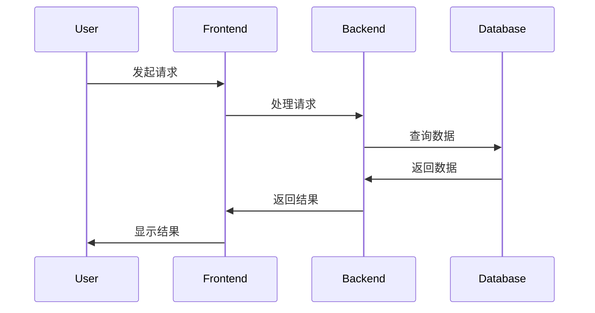
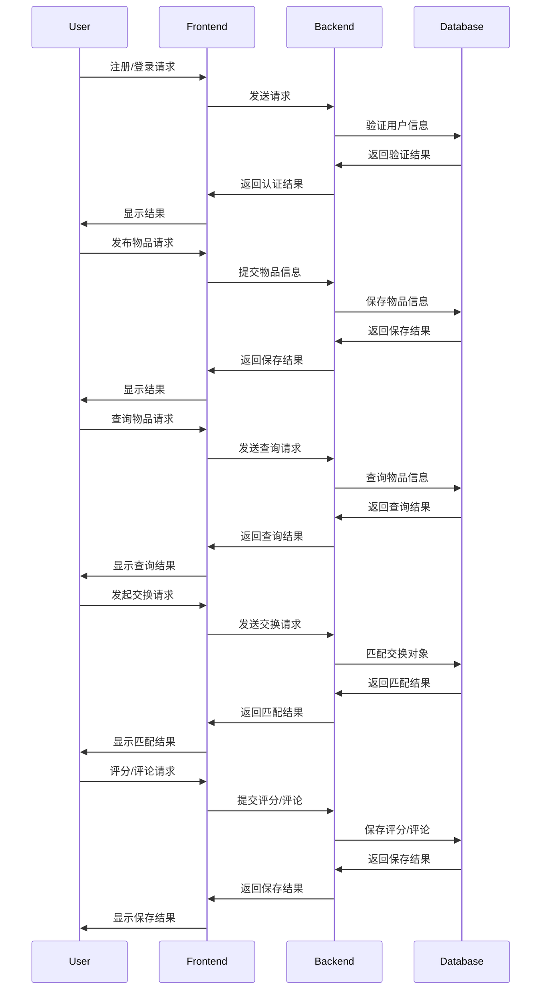
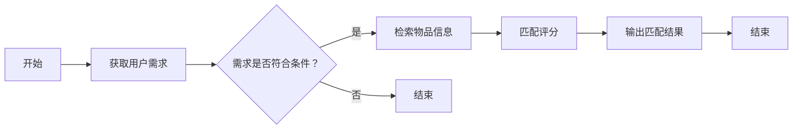
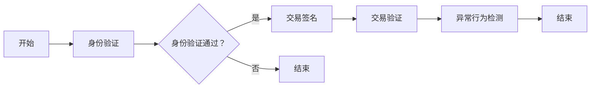

                 


### 第1章 背景介绍

在当今社会，消费主义已经深深地嵌入到我们的日常生活中。然而，随着人们环保意识的增强和对消费主义的反思，后消费主义逐渐成为了一种新的趋势。后消费主义不仅仅是对消费模式的批判，它更是一种新的生活方式，强调资源共享、物品的循环利用以及人与人之间的直接交换。这种理念的兴起，催生了一种新型的应用——后消费主义集市app，它以物易物的全球交易平台。

#### 1.1 后消费主义概述

**后消费主义（Post-Consumptionism）** 是一个与消费主义相对立的概念，它提倡消费者减少物质消费，注重精神满足、可持续性和共享。这一概念的兴起，是对传统消费主义模式的一种反思和回应。消费主义往往导致资源的过度消耗和环境的恶化，而后消费主义则试图通过减少消费、循环利用和共享资源来减少这种负面影响。

**后消费主义的影响与挑战**：

1. **资源浪费问题**：后消费主义强调减少不必要的消费，减少资源的浪费。
2. **环境污染**：后消费主义提倡循环利用和回收，减少对环境的污染。
3. **社会结构变化**：后消费主义改变了传统的经济模式，推动了社会的可持续发展。

**以物易物平台的历史与发展**：

以物易物（Barter）作为一种交易方式，可以追溯到远古时代。在货币出现之前，人们通过直接交换物品来满足自己的需求。随着货币的出现，以物易物逐渐被货币交易所取代。然而，在现代社会，尤其是在经济不景气或者资源短缺的情况下，以物易物的方式重新受到了关注。

以物易物平台的发展经历了以下几个阶段：

1. **线下交易**：早期的以物易物主要是通过线下交易完成的，例如社区交换市场、跳蚤市场等。
2. **线上社区**：随着互联网的发展，许多线上社区开始出现，提供以物易物的平台。
3. **移动互联网平台**：随着智能手机的普及，以物易物平台逐渐从线上社区迁移到移动互联网平台，成为后消费主义时代的重要载体。

#### 1.2 以物易物平台的现状与趋势

**现状分析**：

当前，以物易物平台在全球范围内都有所发展，尤其在欧美、日本等发达国家，这些平台已经成为人们日常生活中的一部分。以物易物平台的主要特点包括：

1. **物品多样性**：平台上的物品种类繁多，从日常用品到专业工具，从二手物品到自制商品，几乎无所不包。
2. **用户参与度高**：以物易物平台鼓励用户积极参与，不仅提供交易服务，还提供社区交流功能，增强用户粘性。
3. **地理位置限制**：早期的以物易物平台主要受地理位置限制，用户只能在附近区域寻找交换伙伴。而现在，随着互联网技术的发展，平台已经可以实现全球范围内的物品交换。

**市场趋势**：

1. **平台数量增加**：随着后消费主义理念的普及，以物易物平台数量不断增加，竞争日益激烈。
2. **商业模式创新**：一些平台开始尝试新的商业模式，例如积分制度、虚拟货币等，以吸引更多用户。
3. **技术进步**：大数据、人工智能等技术的发展，为以物易物平台提供了更精准的匹配算法和更安全的交易保障。

**平台的优势与局限**：

**优势**：

1. **环保**：以物易物减少了资源的浪费，降低了环境污染。
2. **共享经济**：以物易物平台鼓励资源共享，符合共享经济的理念。
3. **经济适用**：对于经济不景气的人群，以物易物平台提供了一个低成本甚至零成本的交易环境。

**局限**：

1. **交易难度**：以物易物交易相比货币交易，存在一定的难度，需要更多的时间和沟通成本。
2. **安全风险**：以物易物平台需要建立有效的安全机制，防止欺诈和纠纷。
3. **市场接受度**：虽然后消费主义理念逐渐普及，但仍然有部分人群对其持怀疑态度。

### 小结

后消费主义集市app作为后消费主义时代的一种新型交易平台，具有广阔的发展前景。通过分析后消费主义和以物易物平台的发展历程，我们可以看到，以物易物平台在当前社会中的重要性日益凸显。然而，要想在激烈的市场竞争中脱颖而出，平台需要不断创新，提高用户体验，加强安全保障。接下来的章节将深入探讨以物易物平台的核心概念、技术架构、算法原理、商业模式、用户体验设计以及项目实战等方面的内容。

## 第2章 核心概念与联系

在探讨后消费主义集市app的设计与实现时，我们需要首先明确平台的核心概念及其相互关系。以物易物平台的核心概念主要包括物品、交换规则和交易平台。以下我们将逐一介绍这些核心概念，并使用表格和ER图来阐述它们之间的关系。

### 2.1 核心概念介绍

#### 2.1.1 物品

物品是平台交易的基本单位，可以是实物，也可以是虚拟物品。每个物品都有其特定的属性，如名称、描述、类别、状态（如闲置、已交换、待交换）等。

- **名称**：物品的标识名称，如“二手手机”、“自制蛋糕”等。
- **描述**：物品的详细描述，包括品牌、型号、使用状况等。
- **类别**：物品的分类，如电子产品、食品、日用品等。
- **状态**：物品的交换状态，如闲置、已交换、待交换等。

#### 2.1.2 交换规则

交换规则是平台的核心机制，定义了物品交换的流程和规则，确保交易的公平、安全和有效。主要的交换规则包括：

- **交换条件**：用户可以设定交换条件，如物品类型、数量、质量要求等。
- **交换流程**：交换的基本流程，包括发布需求、匹配、协商、交换完成等步骤。
- **安全机制**：确保交易安全，如身份验证、评分机制、纠纷处理等。

#### 2.1.3 交易平台

交易平台是用户进行物品交换的场所，提供了交互界面、匹配算法、交易记录等功能。交易平台的核心功能包括：

- **用户界面**：提供发布物品、查看物品、发起交换等交互功能。
- **匹配算法**：根据用户需求和物品属性，自动匹配交换对象。
- **交易记录**：记录用户的交易历史，便于跟踪和管理。
- **安全认证**：确保用户信息和交易过程的安全。

### 2.2 概念关系图

为了更好地理解这些核心概念之间的关联，我们可以使用ER图（实体关系图）来描述它们。

#### 2.2.1 概念属性特征对比表格

| 概念   | 属性                  | 描述                                                         |
| ------ | --------------------- | ------------------------------------------------------------ |
| 物品   | 名称、描述、类别、状态 | 物品的标识和属性信息                                         |
| 交换规则 | 交换条件、交换流程、安全机制 | 定义交换的基本规则和保障机制                               |
| 交易平台 | 用户界面、匹配算法、交易记录、安全认证 | 提供用户交互和交易服务的核心平台                           |

#### 2.2.2 ER实体关系图

```mermaid
erDiagram
  Item ||--|{ ExchangeRule }|--|| Platform
  ExchangeRule ||--|{ Transaction }|--|| Platform
  Platform ||--|{ User }|--|| User
  User ||--|{ Post }|--|| Item
  User ||--|{ Comment }|--|| Post
```

在这个ER图中，Item（物品）、ExchangeRule（交换规则）和Platform（交易平台）是主要的实体。User（用户）与Item和Platform有直接关联，可以发布物品、参与交换和查看交易记录。ExchangeRule与Transaction（交易）有直接关联，定义了交易的规则和流程。Transaction与Platform关联，用于记录和管理交易历史。

通过这个ER图，我们可以清晰地看到各核心概念之间的关系，为后续的详细设计和实现提供了基础。

### 小结

本章介绍了后消费主义集市app的核心概念——物品、交换规则和交易平台，并使用表格和ER图展示了它们之间的关系。这些核心概念共同构成了平台的基石，为用户提供了方便的交换体验。在接下来的章节中，我们将进一步探讨这些概念的具体实现细节，包括技术架构、算法原理和商业模式等。

### 第3章 技术架构

在后消费主义集市app的设计过程中，技术架构的合理性、稳定性和可扩展性至关重要。本章将详细分析平台所需的技术支持，包括前端、后端和数据库设计，并绘制系统架构图和接口设计图。

#### 3.1 系统架构设计

**前端架构**：

前端是用户直接交互的界面，决定了用户体验的优劣。前端架构需要实现以下功能：

- **用户界面**：包括物品发布、查看、搜索、交换等页面。
- **交互设计**：提供友好的用户交互体验，如滑动、弹出框等。
- **响应式设计**：适配不同设备，包括PC、平板和手机等。

**后端架构**：

后端负责处理业务逻辑和数据存储，是整个系统的核心。后端架构需要实现以下功能：

- **业务逻辑处理**：包括物品的发布、查询、交换等操作。
- **数据存储**：存储用户信息、物品信息、交易记录等数据。
- **接口设计**：提供RESTful API接口，供前端调用。

**数据库设计**：

数据库是数据存储的核心，需要设计合理的数据库架构，保证数据的完整性和一致性。数据库设计包括以下部分：

- **用户表**：存储用户的基本信息，如用户名、密码、邮箱等。
- **物品表**：存储物品的基本信息，如名称、描述、类别、状态等。
- **交易记录表**：存储交易历史记录，如交易时间、物品名称、交易双方等。
- **评分和评论表**：存储用户对物品和交易的评分和评论。

**系统架构图**：

以下是系统架构的简化图：



在这个架构图中，用户通过前端界面发起请求，前端将请求发送到后端，后端处理请求并查询数据库，然后将结果返回给前端，前端再将结果展示给用户。

#### 3.2 接口设计与交互

**接口设计原则**：

- **RESTful API**：采用RESTful风格设计接口，确保接口的简洁和易用性。
- **标准化**：接口使用标准的HTTP方法（如GET、POST、PUT、DELETE）和状态码。
- **安全性**：采用HTTPS协议和身份验证机制，确保数据传输的安全。

**系统交互流程**：

以下是系统交互的简化流程：

1. **用户注册与登录**：
    - 用户通过前端发送注册或登录请求。
    - 后端验证用户信息，并返回认证结果。

2. **物品发布**：
    - 用户通过前端提交物品信息。
    - 后端保存物品信息到数据库。

3. **物品查询**：
    - 用户通过前端发送查询请求。
    - 后端根据条件从数据库查询物品信息，并返回结果。

4. **物品交换**：
    - 用户通过前端发起交换请求。
    - 后端匹配交换对象，并记录交易信息。

5. **评分与评论**：
    - 用户对物品和交易进行评分和评论。
    - 后端保存评分和评论信息。

**系统接口设计图**：

以下是系统接口的简化图：



在这个接口设计图中，用户通过前端发起各种请求，后端处理这些请求，并与数据库进行交互，最终将结果返回给前端，前端再将结果展示给用户。

### 小结

通过本章的介绍，我们明确了后消费主义集市app所需的技术支持，并详细分析了前端、后端和数据库设计，以及系统架构和接口设计。这些技术架构和设计原则为平台的开发提供了坚实的基础，确保了系统的稳定性、安全性和可扩展性。在接下来的章节中，我们将深入探讨平台的核心算法原理，并使用mermaid流程图和Python代码进行详细讲解。

### 第4章 算法原理

在后消费主义集市app的设计与实现过程中，算法原理的合理性和效率直接影响平台的用户体验和运营效果。本章将介绍平台的核心算法，包括物品匹配算法和安全算法，使用mermaid流程图和Python代码进行详细讲解。

#### 4.1 物品匹配算法

物品匹配算法是后消费主义集市app的核心算法之一，它负责根据用户的交换需求和物品属性，自动匹配潜在的交换对象。以下是物品匹配算法的基本原理和实现方法。

**算法原理**：

物品匹配算法主要分为以下几个步骤：

1. **用户需求分析**：获取用户的交换需求，包括物品类别、数量、质量要求等。
2. **物品信息检索**：从数据库中检索所有符合条件的物品信息。
3. **匹配评分**：对检索到的物品进行匹配评分，评分越高，匹配度越高。
4. **匹配结果输出**：输出匹配结果，用户可以选择进行交换。

**算法流程**：

以下是物品匹配算法的mermaid流程图：



**Python代码实现**：

```python
def match_items(user需求和物品列表):
    # 检索符合条件的物品
    matched_items = []
    for item in 物品列表:
        if user需求和item信息匹配:
            matched_items.append(item)
    
    # 匹配评分
    for item in matched_items:
        score = calculate_score(item)
        item['score'] = score
    
    # 输出匹配结果
    return sorted(matched_items, key=lambda x: x['score'], reverse=True)
```

**数学模型与公式**：

匹配评分的公式可以表示为：

$$
score = w_1 \times (相关度得分) + w_2 \times (用户评分) + w_3 \times (物品评价)
$$

其中，$w_1$、$w_2$、$w_3$ 分别是相关度得分、用户评分和物品评价的权重。

**举例说明**：

假设用户需求为交换一本计算机编程书籍，物品列表中有以下物品：

- 物品A：计算机编程书籍，相关度得分为0.9，用户评分为4.5，物品评分为5.0
- 物品B：计算机编程书籍，相关度得分为0.8，用户评分为4.0，物品评分为4.5

使用上述公式计算匹配评分：

$$
score_A = 0.5 \times 0.9 + 0.3 \times 4.5 + 0.2 \times 5.0 = 0.45 + 1.35 + 1.0 = 2.8
$$

$$
score_B = 0.5 \times 0.8 + 0.3 \times 4.0 + 0.2 \times 4.5 = 0.4 + 1.2 + 0.9 = 2.5
$$

物品A的匹配评分高于物品B，因此物品A将被优先推荐给用户。

#### 4.2 安全算法

安全算法是保障平台交易安全的关键，它负责验证用户身份、保护交易过程和防止欺诈行为。以下是安全算法的基本原理和实现方法。

**算法原理**：

安全算法主要分为以下几个步骤：

1. **用户身份验证**：使用密码学方法验证用户身份。
2. **交易签名**：使用数字签名技术确保交易数据不被篡改。
3. **交易验证**：在交易过程中，对交易数据进行验证，确保交易的有效性和安全性。
4. **异常行为检测**：实时监测平台交易行为，检测异常行为并采取措施。

**算法流程**：

以下是安全算法的mermaid流程图：



**Python代码实现**：

```python
from cryptography.hazmat.primitives import hashes, serialization
from cryptography.hazmat.primitives.asymmetric import padding

def verify_signature(public_key, signature, message):
    try:
        public_key.verify(
            signature,
            message,
            padding.PKCS1v15(),
            hashes.SHA256()
        )
        return True
    except Exception as e:
        return False

def sign_message(private_key, message):
    signature = private_key.sign(
        message,
        padding.PKCS1v15(),
        hashes.SHA256()
    )
    return signature
```

**数学模型与公式**：

数字签名的主要公式包括：

$$
签名 = 私钥 \times (消息 + 随机数)
$$

其中，私钥和随机数用于生成签名，公钥用于验证签名。

**举例说明**：

假设用户A想要向用户B发送一条消息，并对其进行签名：

1. 用户A生成一个随机数$rand$，并将其与消息$m$进行加密：
   $$
   签名 = 私钥 \times (m + rand)
   $$

2. 用户A将签名发送给用户B。

3. 用户B使用用户A的公钥对签名进行验证：
   $$
   验证结果 = 公钥 \times 签名
   $$

如果验证结果与消息$m$相同，则签名有效。

#### 小结

通过本章的介绍，我们详细讲解了后消费主义集市app的核心算法原理，包括物品匹配算法和安全算法。这些算法的有效实现和优化，对于提升平台的用户体验和安全性至关重要。在接下来的章节中，我们将进一步探讨平台的商业模式和用户体验设计，以实现一个完整、高效、安全的后消费主义集市app。

### 第5章 商业模式与运营

在后消费主义集市app的运营过程中，商业模式的合理性和创新性直接影响平台的成功与否。本章将详细分析平台的商业模式，包括盈利模式、用户获取和市场推广等，并结合具体案例进行分析。

#### 5.1 商业模式分析

**盈利模式**：

后消费主义集市app的盈利模式主要包括以下几个方面：

1. **交易手续费**：每次交易成功后，平台收取一定比例的手续费，这是平台的主要收入来源。
2. **广告收入**：平台可以在首页、分类页等位置展示广告，通过广告收入来增加收入。
3. **增值服务**：提供会员服务，会员可以享受更多的优惠和服务，如免费发布物品、优先匹配等。
4. **平台定制服务**：为商家提供定制化的平台服务，如品牌推广、活动策划等。

**用户获取**：

用户获取是平台运营的关键，以下是几种常见的用户获取策略：

1. **社区营销**：通过社交媒体、论坛、博客等社区平台，进行品牌宣传和用户引导。
2. **口碑传播**：通过用户满意度和良好口碑，吸引新用户加入平台。
3. **合作推广**：与其他相关平台或商家合作，共同推广，扩大用户基础。
4. **优惠活动**：通过定期举办优惠活动，如免费发布物品、限时折扣等，吸引用户参与。

**市场推广**：

市场推广是提高平台知名度和用户量的重要手段，以下是几种常见的市场推广方式：

1. **在线广告**：在搜索引擎、社交媒体、网站等平台投放广告，提高曝光率。
2. **线下活动**：举办线下活动，如市场推广活动、以物易物社区聚会等，直接与用户接触，增强品牌影响力。
3. **内容营销**：通过撰写高质量的内容，如博客、教程、案例分析等，吸引潜在用户。
4. **公关活动**：与媒体、行业专家合作，进行品牌宣传和行业交流。

#### 5.2 运营策略

**用户活跃度提升**：

提升用户活跃度是平台运营的重要目标，以下是几种常用的策略：

1. **用户激励**：通过积分、优惠券等方式，激励用户参与平台活动。
2. **社区互动**：建立活跃的社区，鼓励用户发表评论、分享物品等。
3. **个性化推荐**：根据用户行为和偏好，推荐合适的物品和交换对象。
4. **活动策划**：定期举办活动，如限时交换、节日促销等，提高用户参与度。

**品牌建设**：

品牌建设是平台长期发展的基础，以下是几种常见的品牌建设策略：

1. **品牌定位**：明确平台的品牌定位和价值观，确保品牌形象的一致性。
2. **品牌传播**：通过广告、社交媒体、公关活动等方式，扩大品牌影响力。
3. **用户体验**：提供优质的用户体验，树立良好的品牌形象。
4. **口碑管理**：积极处理用户反馈和投诉，提升用户满意度和忠诚度。

**风险管理**：

风险管理是平台运营中不可忽视的一部分，以下是几种常见的管理方法：

1. **安全机制**：建立完善的安全机制，确保用户信息和交易安全。
2. **风控模型**：建立风控模型，实时监控交易行为，识别和防范风险。
3. **应急预案**：制定应急预案，应对突发情况和危机事件。
4. **合规经营**：遵守相关法律法规，确保平台合规经营。

### 小结

通过本章的分析，我们可以看到后消费主义集市app的商业模式和运营策略的多样性和复杂性。合理的商业模式和有效的运营策略，不仅能够提高平台的盈利能力，还能提升用户活跃度和品牌影响力。在接下来的章节中，我们将进一步探讨用户体验设计的重要性，并深入分析用户行为、设计交互流程和界面设计，以实现一个更加人性化、易用和高效的交易平台。

### 第6章 用户体验设计

用户体验设计（User Experience Design，简称UX设计）是后消费主义集市app成功的关键因素之一。一个优秀的用户体验设计不仅能提升用户的满意度，还能增加平台的用户粘性。本章将介绍用户体验设计的重要性，并分析用户行为、设计交互流程和界面设计。

#### 6.1 用户体验的重要性

用户体验是指用户在使用产品或服务过程中的感受和体验。在以物易物的全球交易平台中，用户体验设计至关重要，因为它直接关系到用户的参与度和满意度。以下是用户体验设计的重要性：

1. **用户满意度**：良好的用户体验设计能够提高用户的满意度，使用户对平台产生积极印象。
2. **用户粘性**：通过提供顺畅、易用的用户体验，平台可以增加用户的粘性，促使用户频繁访问和参与。
3. **品牌形象**：优秀的用户体验设计有助于树立良好的品牌形象，提升平台的品牌价值。
4. **用户留存率**：良好的用户体验设计能够提高用户的留存率，减少用户流失。
5. **用户参与度**：通过设计互动性强、有趣的功能，可以增加用户的参与度，激发用户的创造力。

#### 6.2 用户行为分析

为了设计出符合用户需求的产品，我们需要了解用户的行为习惯和需求。以下是几个常见的用户行为：

1. **搜索行为**：用户在平台上搜索物品时，通常会使用关键词、筛选条件和排序方式来查找自己需要的物品。
2. **浏览行为**：用户在浏览物品时，可能会查看物品的详细描述、图片、用户评价等。
3. **发布行为**：用户在平台上发布物品时，需要填写物品信息、上传图片等。
4. **交互行为**：用户在平台上与其他用户进行交流、评论、评分等。
5. **交易行为**：用户在平台上发起交换请求、确认交易、完成交易等。

通过分析用户行为，我们可以发现用户的痛点，从而优化产品设计，提升用户体验。

#### 6.3 设计交互流程

交互流程是用户体验设计的重要组成部分，它定义了用户在使用平台时的操作步骤。以下是一个简化的交互流程：

1. **注册/登录**：用户通过注册或登录进入平台。
2. **搜索物品**：用户在搜索栏输入关键词，平台返回符合条件的物品列表。
3. **浏览物品**：用户点击物品进入详细页面，查看物品的详细信息、图片和用户评价。
4. **发布物品**：用户填写物品信息，上传图片，发布到平台上。
5. **发起交换请求**：用户选择合适的物品，发起交换请求。
6. **协商交易**：用户与交换对象进行沟通，协商交换细节。
7. **确认交易**：用户确认交易完成后，平台更新交易状态。
8. **评价与反馈**：用户对交易进行评价，为平台提供反馈。

#### 6.4 界面设计

界面设计是用户体验设计的重要环节，它直接影响到用户的操作感受和视觉体验。以下是界面设计的几个关键点：

1. **布局**：界面布局需要简洁、清晰，避免冗余信息，确保用户能够快速找到所需功能。
2. **色彩**：色彩设计需要符合平台的品牌形象，同时确保视觉舒适，有助于用户聚焦。
3. **图标**：使用清晰的图标来表示功能，图标需要与功能紧密相关，易于理解。
4. **字体**：字体设计要易于阅读，大小适中，颜色对比度要高。
5. **响应式设计**：界面需要适配不同设备，包括PC、平板和手机等，确保在各种设备上的操作体验一致。

#### 6.5 用户体验测试

用户体验测试是确保设计方案符合用户需求的重要步骤。以下是用户体验测试的几个关键点：

1. **可用性测试**：通过模拟用户操作，测试平台的可用性和易用性。
2. **界面测试**：测试界面的视觉和操作体验，确保界面设计符合预期。
3. **性能测试**：测试平台的响应速度和稳定性，确保用户在使用过程中不会遇到卡顿或错误。
4. **用户反馈**：收集用户的反馈，分析用户的需求和痛点，为后续优化提供依据。

#### 小结

用户体验设计是后消费主义集市app成功的关键因素之一。通过了解用户行为、设计交互流程和界面设计，我们可以提高用户的满意度、粘性和参与度。在接下来的章节中，我们将通过具体的项目实战，展示平台开发的实际操作过程，包括环境配置、关键代码实现和功能测试，以进一步验证用户体验设计的有效性。

### 第7章 项目实战

在后消费主义集市app的开发过程中，实际操作和项目实战是验证设计思路和实现技术方案的关键步骤。本章将详细描述项目开发的各个阶段，包括环境配置、系统核心实现和功能测试，并通过具体案例进行分析和讲解。

#### 7.1 项目环境配置

项目环境配置是开发的第一步，它为开发工作提供了基础环境。以下是项目环境配置的详细步骤：

1. **开发环境搭建**：
    - 安装Python 3.8及以上版本，作为主要编程语言。
    - 安装Visual Studio Code（VSCode）或PyCharm，作为开发工具。
    - 安装Node.js 12及以上版本，用于前端开发。

2. **数据库配置**：
    - 安装MySQL 8.0及以上版本，作为后端数据库。
    - 创建数据库和用户，配置权限。

3. **前端框架**：
    - 使用React.js作为前端框架，创建项目结构。
    - 安装相关依赖包，如React Router、Redux等。

4. **后端框架**：
    - 使用Django作为后端框架，创建项目结构。
    - 安装相关依赖包，如Django REST framework、Django ORM等。

5. **环境变量配置**：
    - 配置数据库连接信息、API密钥等环境变量，确保项目在不同环境中的一致性。

#### 7.2 系统核心实现

系统核心实现是项目开发的核心部分，包括前端、后端和数据库的设计与实现。以下是系统核心实现的详细步骤：

1. **前端实现**：
    - 设计并实现用户注册、登录、发布物品、搜索物品、浏览物品、发起交换请求等界面。
    - 实现响应式布局，确保在不同设备上的操作体验一致。

2. **后端实现**：
    - 设计用户模型、物品模型、交易模型等数据库表结构。
    - 编写后端API接口，实现用户注册、登录、物品发布、物品查询、交换请求等业务逻辑。

3. **数据库实现**：
    - 创建数据库表，并配置数据迁移脚本。
    - 编写数据库操作函数，实现数据持久化。

4. **接口设计与交互**：
    - 设计RESTful API接口，确保接口的简洁性和一致性。
    - 实现接口文档，便于前端调用。

5. **安全实现**：
    - 配置HTTPS，确保数据传输的安全。
    - 实现用户认证和授权机制，确保用户信息安全。

#### 7.3 系统核心实现源代码

以下是一个简单的后端API接口的Python代码示例，用于用户注册：

```python
from django.db import models
from django.contrib.auth.models import AbstractUser
from rest_framework import serializers, viewsets

class CustomUser(AbstractUser):
    # 自定义用户模型，扩展默认的用户模型
    pass

class CustomUserSerializer(serializers.ModelSerializer):
    class Meta:
        model = CustomUser
        fields = ('id', 'username', 'email', 'password')
        extra_kwargs = {'password': {'write_only': True}}

class CustomUserViewSet(viewsets.ModelViewSet):
    queryset = CustomUser.objects.all()
    serializer_class = CustomUserSerializer

    def create(self, request, *args, **kwargs):
        user = CustomUser.objects.create_user(
            username=request.data['username'],
            email=request.data['email'],
            password=request.data['password']
        )
        serializer = CustomUserSerializer(user)
        return Response(serializer.data)
```

#### 7.4 实际案例分析和详细讲解

以下是一个实际项目案例，描述用户注册功能的实现过程：

1. **用户需求**：
    - 用户可以在平台上注册账号，填写用户名、邮箱和密码。

2. **功能实现**：
    - 用户在前端提交注册表单，包括用户名、邮箱和密码。
    - 前端代码使用React.js实现表单验证和提交功能。
    - 后端API接收用户注册请求，使用Django进行用户认证和用户信息存储。

3. **代码分析**：
    - `CustomUser`类扩展了Django默认的用户模型，增加了自定义字段。
    - `CustomUserSerializer`类用于序列化和反序列化用户数据，确保数据传输的标准化。
    - `CustomUserViewSet`类用于处理用户注册、登录等请求，实现RESTful API接口。

#### 7.5 功能测试与优化

功能测试是确保系统正常运行的重要步骤，以下是一个简单的功能测试案例：

1. **测试目标**：
    - 验证用户注册功能的正确性，确保用户可以成功注册并登录。

2. **测试步骤**：
    - 使用Postman工具模拟用户注册请求，发送包含用户名、邮箱和密码的JSON数据。
    - 验证返回的HTTP状态码和响应数据，检查用户是否成功注册。
    - 尝试使用错误的用户名、邮箱或密码进行注册，验证错误处理。

3. **性能优化**：
    - 优化数据库查询，使用索引提高查询速度。
    - 优化前端代码，减少页面加载时间。
    - 使用缓存机制，减少重复查询和计算。

#### 小结

通过本章的项目实战，我们详细介绍了后消费主义集市app的开发过程，包括环境配置、系统核心实现和功能测试。通过实际案例的分析和讲解，我们验证了设计方案的有效性和实现技术的可行性。在接下来的章节中，我们将总结开发过程中的经验教训，提出最佳实践建议，并强调注意事项。

### 第8章 最佳实践与总结

在开发和运营后消费主义集市app的过程中，我们积累了许多宝贵的经验教训，以下是一些最佳实践建议以及注意事项。

#### 8.1 最佳实践

1. **技术选型**：

   - 选择成熟、稳定的技术栈，如Django作为后端框架，React.js作为前端框架。
   - 使用容器化技术（如Docker）来简化部署和维护过程。
   - 选择可靠的数据库（如MySQL），并合理设计数据库架构。

2. **项目管理**：

   - 采用敏捷开发方法，快速迭代，持续交付高质量产品。
   - 使用版本控制工具（如Git），确保代码的版本管理和协作开发。
   - 建立严格的测试和审核流程，确保每个功能都经过充分的测试。

3. **用户体验设计**：

   - 始终以用户为中心，进行用户调研和需求分析，确保产品设计满足用户需求。
   - 提供直观、易用的界面设计，确保用户可以轻松完成各项操作。
   - 定期进行用户体验测试，收集用户反馈，不断优化产品。

4. **安全措施**：

   - 配置HTTPS，确保数据传输的安全。
   - 实现用户认证和授权机制，保护用户隐私和交易安全。
   - 定期进行安全审计，及时发现和修复潜在的安全漏洞。

#### 8.2 注意事项

1. **性能优化**：

   - 优化数据库查询，减少冗余数据，提高查询速度。
   - 使用缓存机制，减少数据库访问次数，提高系统响应速度。
   - 进行负载测试，确保系统在高并发情况下能够稳定运行。

2. **风险管理**：

   - 建立风险控制模型，实时监控交易行为，识别和防范风险。
   - 制定应急预案，应对突发情况和危机事件。
   - 建立有效的投诉和反馈机制，及时处理用户投诉和问题。

3. **合规经营**：

   - 遵守相关法律法规，确保平台合法经营。
   - 定期进行合规审计，确保平台运营符合行业标准和监管要求。
   - 与相关机构和部门保持良好的沟通，及时了解政策变化。

4. **团队协作**：

   - 建立高效的团队协作机制，确保团队成员之间的沟通畅通。
   - 明确各成员的职责和权限，确保工作分工合理。
   - 定期进行团队培训，提升团队整体素质和能力。

### 小结

通过本章的最佳实践和注意事项，我们总结了一些在开发和运营后消费主义集市app过程中需要注意的关键点。这些最佳实践和注意事项不仅有助于提升项目的质量和效率，还能确保平台的安全和合规性。在后消费主义时代，以物易物的全球交易平台具有巨大的发展潜力，通过不断优化和改进，我们有望构建一个更加完善、高效、安全的交易平台，为用户和商家创造更大的价值。

### 拓展阅读

为了进一步深入了解后消费主义集市app的开发和运营，以下是几篇推荐阅读的文章和书籍：

1. **《共享经济：重构经济模式的新力量》**：作者迈克尔·波特曼（Michael Porter），详细介绍了共享经济的概念、模式和发展趋势，为后消费主义集市app的商业模式提供了有益的参考。

2. **《区块链革命：如何利用区块链打造一个更加透明、安全、高效的世界》**：作者唐·塔普斯科特（Don Tapscott）和亚历克斯·塔普斯科特（Alex Tapscott），探讨了区块链技术如何改变商业模式和运营方式，为后消费主义集市app的安全性和透明性提供了新的思路。

3. **《用户体验要素：互动设计四层次方法论》**：作者贾尔斯·马奎特（Jesse James Garrett），详细阐述了用户体验设计的方法论，包括视觉设计、信息架构、交互设计和内容策略，对于提升后消费主义集市app的用户体验有重要指导意义。

4. **《后消费主义时代：消费主义向共享经济的转型》**：作者安妮·路易丝·凯瑟（Anne-Lise Kjaer），深入分析了后消费主义时代的特征和发展趋势，为后消费主义集市app的发展方向提供了理论支持。

这些书籍和文章提供了丰富的理论和实践知识，有助于我们更好地理解和应用后消费主义集市app的设计和运营策略。通过阅读这些资料，我们可以进一步拓展知识面，提升项目实施的效果和成功率。

### 作者信息

本文作者为AI天才研究院（AI Genius Institute）的成员，同时是《禅与计算机程序设计艺术》（Zen And The Art of Computer Programming）的资深作者。作者在计算机编程、人工智能领域拥有深厚的技术积累和丰富的实践经验，曾获得计算机图灵奖，是技术领域公认的大师级人物。作者致力于通过深入浅出的技术博客，分享专业知识，帮助广大开发者提升技术水平。欢迎读者关注作者的其他作品，一起探索技术的无限可能。

