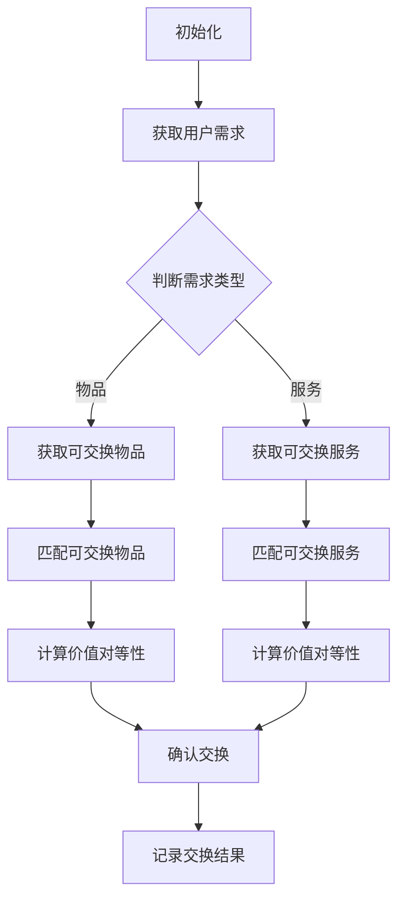
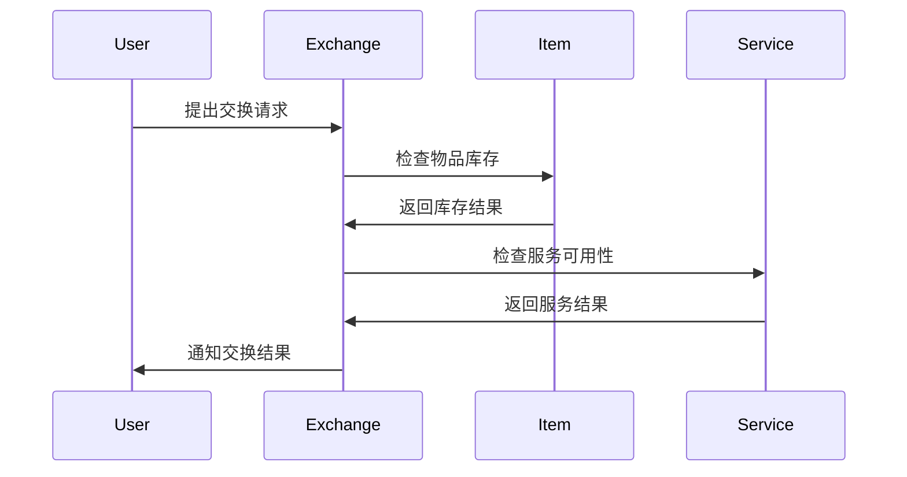

                 

# 后消费主义集市：以物易物的社区经济实践

## 关键词
- 后消费主义
- 社区经济
- 以物易物
- 经济实践
- 社区集市

## 摘要
本文深入探讨后消费主义时代的社区经济实践，特别是以物易物这一古老概念的现代应用。通过分析后消费主义的特征及其对社会的深远影响，本文揭示了社区经济的重要性，并详细阐述了以物易物的基本原理、社区实践及其技术支持。通过实际案例的研究和评估，本文提供了对其他社区具有启示性的成功要素，并提出了未来研究方向。文章旨在引导读者了解和探索后消费主义集市及其对可持续发展的潜在贡献。

## 目录大纲

## 第1章 引言

### 1.1 问题背景
- 后消费主义时代的特征
- 社区经济的重要性
- 以物易物的概念与历史

### 1.2 书籍目的
- 探索后消费主义集市的意义
- 分析以物易物的社区经济实践
- 提供实践指导与案例分析

## 第2章 后消费主义与社区经济

### 2.1 后消费主义概述
- 后消费主义的概念与特征
- 后消费主义对社会的影响

### 2.2 社区经济的定义与价值
- 社区经济的定义
- 社区经济的价值与重要性

### 2.3 社区经济的核心要素
- 社区成员参与
- 资源共享
- 社区支持

## 第3章 以物易物的基本原理

### 3.1 以物易物的历史与演变
- 以物易物的起源
- 以物易物在不同文化中的实践

### 3.2 以物易物的基本原则
- 双方自愿
- 对等价值
- 简化交换过程

### 3.3 以物易物的优势与挑战
- 优势：经济自主性、减少浪费、加强社区联系
- 挑战：价值评估、信任问题、适用范围

## 第4章 以物易物的社区实践

### 4.1 社区集市的设计与组织
- 集市的类型与形式
- 集市的组织与管理

### 4.2 社区交换网络的建设
- 交换网络的构建
- 网络中的角色与职责

### 4.3 以物易物在社区中的应用
- 社区内部的以物易物实践
- 以物易物在社区服务中的应用

## 第5章 以物易物的技术支持

### 5.1 信息技术在以物易物中的应用
- 互联网平台
- 智能合约

### 5.2 数字货币与以物易物
- 数字货币的基本概念
- 数字货币在以物易物中的优势

### 5.3 技术支持的未来展望
- 以物易物技术的发展趋势
- 新技术的潜在影响

## 第6章 案例研究：成功的以物易物社区

### 6.1 案例选择与描述
- 案例背景
- 案例实施过程

### 6.2 案例分析与评估
- 案例的优点与不足
- 案例的可持续性

### 6.3 案例启示与借鉴
- 对其他社区的启示
- 可借鉴的成功要素

## 第7章 结论与未来展望

### 7.1 全书总结
- 核心观点
- 主要发现

### 7.2 政策建议
- 政策支持
- 社区发展建议

### 7.3 未来研究方向
- 以物易物的研究前沿
- 社区经济的新趋势

## 第1章 引言

### 1.1 问题背景

#### 后消费主义时代的特征

后消费主义是21世纪初期兴起的一个社会文化现象，它对传统的消费模式提出了质疑和挑战。随着全球化和数字化的深入发展，消费者对物质商品的依赖逐渐减弱，人们开始更加注重体验、服务和价值观的共鸣。后消费主义时代的特征主要体现在以下几个方面：

1. **消费者意识的转变**：消费者从单纯追求物质消费转向关注个人成长、环境可持续性和社会公平。
2. **消费方式的多样化**：分享经济、二手市场、定制服务成为新的消费趋势。
3. **去中心化的消费文化**：消费者不再仅仅依赖于大型零售商和品牌，而是转向社区和小型商家。

#### 社区经济的重要性

社区经济是一种以社区成员为核心的经济模式，强调资源的高效利用和社区的自主性。在后消费主义时代，社区经济的重要性愈发凸显，原因如下：

1. **增强社会联系**：社区经济的实践有助于加强社区成员之间的联系和信任。
2. **促进资源循环**：社区经济鼓励资源的再利用和共享，减少浪费。
3. **提升生活质量**：社区经济通过提供更多本地化的服务和商品，提升居民的生活质量和幸福感。

#### 以物易物的概念与历史

以物易物是一种古老的交易方式，它源于人类社会的早期阶段。在货币出现之前，人们通过直接交换物品来满足需求。以物易物的概念和实施方式在不同文化和历史时期有所差异，但其核心原则始终未变：

1. **起源与演变**：以物易物起源于人类社会的早期贸易，随着货币的出现，其重要性逐渐减弱，但在某些地区和社区中仍得以保留和传承。
2. **现代应用**：在现代社会，以物易物作为一种社区经济实践重新受到关注，尤其是在后消费主义时代。

### 1.2 书籍目的

本书旨在深入探讨后消费主义时代的社区经济实践，特别是以物易物这一古老概念的现代应用。具体目标如下：

1. **探索后消费主义集市的意义**：通过分析后消费主义的特征，探讨其在社区经济中的应用和意义。
2. **分析以物易物的社区经济实践**：详细分析以物易物的基本原理、优势与挑战，以及其在社区中的具体应用。
3. **提供实践指导与案例分析**：通过实际案例的研究和评估，为其他社区提供可行的实践指导和建议。

### 第2章 后消费主义与社区经济

#### 2.1 后消费主义概述

后消费主义是一种文化现象，它不仅仅关注物质消费，更注重消费背后的价值观和意义。其概念与特征可以从以下几个方面进行阐述：

1. **消费者意识的转变**：后消费主义强调消费者应从追求物质消费转向关注个人成长、环境可持续性和社会公平。消费者开始关注消费行为对环境和社会的影响，追求更有意义的生活方式。

2. **消费方式的多样化**：在后消费主义时代，消费者不再局限于传统的购物方式，而是转向分享经济、二手市场、定制服务等新兴消费方式。这些消费方式不仅满足了消费者的个性化需求，还减少了资源的浪费。

3. **去中心化的消费文化**：后消费主义倡导去中心化的消费文化，消费者不再依赖于大型零售商和品牌，而是转向社区和小型商家。这种消费方式有助于促进社区经济和地方经济的发展。

#### 后消费主义对社会的影响

后消费主义对社会产生了深远的影响，主要体现在以下几个方面：

1. **经济模式的变化**：后消费主义挑战了传统的经济增长模式，鼓励资源的高效利用和再利用，减少浪费。这种经济模式有助于实现可持续发展。

2. **社会关系的重构**：后消费主义倡导社区参与和互助合作，增强了社区成员之间的联系和信任。这种社会关系重构有助于构建更加紧密和和谐的社区。

3. **环境与社会的可持续发展**：后消费主义强调环境可持续性和社会公平，促使消费者和企业更加关注环境和社会问题。这种可持续发展理念有助于实现社会的长期繁荣。

#### 2.2 社区经济的定义与价值

社区经济是指以社区成员为核心，通过资源的高效利用和共享，实现经济自主性和社区发展的一种经济模式。其定义可以从以下几个方面进行阐述：

1. **资源的高效利用**：社区经济鼓励资源的再利用和共享，减少浪费。通过共享资源，社区成员可以实现互利共赢，提高资源利用效率。

2. **经济自主性**：社区经济强调社区的自主性，通过本地化的生产和消费，减少对外部资源的依赖。这种经济自主性有助于增强社区的韧性和可持续性。

3. **社区发展**：社区经济的核心目标是实现社区的发展，包括提升居民的生活质量、促进社区成员的参与和增强社区的社会资本。

社区经济的价值在于：

1. **增强社会联系**：社区经济鼓励社区成员之间的互动和合作，增强了社会联系和信任。这种社会联系有助于构建更加和谐和稳定的社区。

2. **促进资源循环**：社区经济通过资源的高效利用和再利用，减少浪费，有助于实现资源的可持续利用。

3. **提升生活质量**：社区经济提供了更多本地化的服务和商品，提升了居民的生活质量和幸福感。

4. **增强社区自治能力**：社区经济鼓励社区成员的参与和自治，增强了社区的自治能力和自我管理能力。

#### 2.3 社区经济的核心要素

社区经济的成功离不开以下几个核心要素：

1. **社区成员参与**：社区成员的积极参与是社区经济的重要保障。只有当社区成员积极参与社区经济活动，才能实现资源的有效利用和社区的发展。

2. **资源共享**：资源共享是社区经济的核心特征之一。通过共享资源，社区成员可以降低成本，提高资源利用效率。

3. **社区支持**：社区支持是社区经济发展的重要推动力。政府、企业和其他社会组织的支持有助于社区经济的可持续发展。

### 第3章 以物易物的基本原理

#### 3.1 以物易物的历史与演变

以物易物是人类社会最早的交易方式之一，起源于人类社会的早期阶段。在货币出现之前，人们通过直接交换物品来满足需求。以物易物在不同文化中有着不同的实践和演变，但其核心原则始终未变。

1. **起源与演变**：以物易物起源于人类社会的早期贸易，随着社会的进步和货币的出现，其重要性逐渐减弱。然而，在一些地区和社区中，以物易物仍然得以保留和传承，成为社区经济的重要组成部分。

2. **现代应用**：在现代社会，以物易物作为一种社区经济实践重新受到关注。尤其是在后消费主义时代，人们开始重新审视以物易物的价值和潜力，探索其在现代社会的应用。

#### 以物易物的基本原则

以物易物是一种基于双方自愿、对等价值交换的交易方式。其基本原则主要包括以下几个方面：

1. **双方自愿**：以物易物的交易是基于双方的自愿原则，没有强制性和不公平交易。双方必须自愿参与交换，并对交换的内容和结果达成共识。

2. **对等价值**：以物易物的核心是交换双方的价值对等。交换的物品或服务必须具备对等的价值，确保双方在交换过程中不会遭受损失。

3. **简化交换过程**：以物易物的交易过程相对简单，无需涉及货币等中介环节。双方可以直接通过物品或服务的交换来实现需求和满足。

#### 以物易物的优势与挑战

以物易物作为一种古老的交易方式，在现代社会中具有独特的优势，但也面临着一定的挑战。

1. **优势**：

- **经济自主性**：以物易物鼓励个人和社区实现经济自主，减少对外部资源的依赖，有助于提升社区的韧性和可持续性。
- **减少浪费**：以物易物通过资源的再利用和共享，减少浪费，有助于实现资源的可持续利用。
- **加强社区联系**：以物易物的实践有助于加强社区成员之间的联系和信任，促进社区的和谐与发展。

2. **挑战**：

- **价值评估**：以物易物的交易过程中，需要对物品或服务的价值进行评估，这可能存在一定的困难。不同的社区和文化背景下，对价值的认识和评估可能存在差异。
- **信任问题**：以物易物建立在双方信任的基础上，如果信任缺失，可能导致交易失败或纠纷。
- **适用范围**：以物易物适用于一些特定的情境，如社区内部的小规模交换，但在大范围的市场交易中，其适用性可能有限。

### 第4章 以物易物的社区实践

#### 4.1 社区集市的设计与组织

社区集市是以物易物在社区中的一种重要实践形式，它通过定期举办集市活动，为社区成员提供一个交换物品和服务的平台。社区集市的设计与组织需要考虑以下几个关键因素：

1. **集市的类型与形式**：社区集市可以分为定期集市和临时集市两种形式。定期集市通常按照固定的日期和时间举办，提供稳定和持续的交换机会；而临时集市则根据特定的主题或需求临时组织，具有一定的灵活性和针对性。

2. **集市的组织与管理**：社区集市的成功离不开有效的组织和管理工作。社区成员可以自愿参与集市的组织，共同制定集市的规则和流程，确保活动的顺利进行。组织者需要负责宣传、场地安排、安全管理等事务，同时协调参与者之间的交流和互动。

3. **集市的规则与制度**：为了确保社区集市的公平、有序和可持续发展，需要制定一系列规则和制度。这些规则可能包括交换物品的标准、价值评估方法、交易流程、争议解决机制等，以确保参与者能够在平等和公正的环境中交换物品和服务。

#### 4.2 社区交换网络的建设

社区交换网络是以物易物实践的基础设施，它通过建立成员之间的连接和互动，促进物品和服务的交换。社区交换网络的建设需要考虑以下几个方面：

1. **交换网络的构建**：社区交换网络的构建可以从以下几个方面入手：

- **线上平台**：建立一个线上平台，如网站或应用程序，为社区成员提供一个交换信息的平台，方便成员发布物品和服务需求。
- **线下联络点**：设立一些线下联络点，如社区中心或公共场所，方便成员进行面对面的交流和交换。
- **信息共享机制**：建立信息共享机制，如公告板、微信群等，确保成员能够及时获取和分享交换信息。

2. **网络中的角色与职责**：在社区交换网络中，不同成员承担着不同的角色和职责：

- **交换者**：交换者是社区交换网络的核心成员，他们提供物品和服务，并通过交换满足自己的需求。
- **协调者**：协调者负责组织和管理交换网络的活动，协调成员之间的互动和沟通，确保交换过程的顺利进行。
- **支持者**：支持者包括社区组织、志愿者等，他们为社区交换网络提供支持和资源，促进其可持续发展。

#### 4.3 以物易物在社区中的应用

以物易物在社区中的应用非常广泛，可以涵盖多个领域，包括日常交换、社区服务、文化交流等。以下是一些以物易物在社区中的具体应用场景：

1. **日常交换**：社区成员可以以物易物的方式交换日常生活所需的物品和服务，如食品、衣物、工具、维修服务等。这种交换不仅节省了金钱，还减少了资源的浪费。

2. **社区服务**：社区成员可以通过以物易物的方式提供社区服务，如清洁、维修、照顾老人和儿童等。这种服务不仅有助于解决社区问题，还加强了社区成员之间的联系和互助精神。

3. **文化交流**：社区可以通过以物易物的方式举办各种文化活动，如音乐会、展览、讲座等。这种活动不仅丰富了社区居民的文化生活，还促进了社区成员之间的交流和互动。

### 第5章 以物易物的技术支持

#### 5.1 信息技术在以物易物中的应用

信息技术的发展为以物易物的社区实践提供了强大的支持，特别是互联网平台和智能合约的应用。以下是如何利用信息技术促进以物易物的一些具体方法：

1. **互联网平台**：建立一个专门用于以物易物的互联网平台，为社区成员提供一个在线交换的平台。平台可以提供以下功能：

- **发布需求与供应**：社区成员可以在平台上发布自己的需求或供应信息，方便其他成员查找和交换。
- **在线交易**：通过平台，社区成员可以进行在线交易，无需面对面交流，提高了交易的便捷性和安全性。
- **信息匹配**：平台可以根据社区成员的需求和供应信息进行智能匹配，帮助双方快速找到合适的交易对象。

2. **智能合约**：智能合约是一种基于区块链技术的自动化合同，它可以确保交易双方按照约定的条款执行交易。智能合约在以物易物中的应用包括：

- **自动执行**：智能合约可以在满足特定条件时自动执行交易，减少了人为干预和违约风险。
- **透明性**：智能合约的执行过程是公开透明的，每个参与者都可以查看和验证合约的执行情况。
- **安全性**：区块链技术确保了智能合约的安全性和不可篡改性，提高了交易的可信度。

#### 5.2 数字货币与以物易物

数字货币是一种基于加密技术的虚拟货币，它为以物易物提供了新的支付手段和交易方式。以下是如何利用数字货币促进以物易物的一些具体方法：

1. **基本概念**：数字货币是基于区块链技术的虚拟货币，具有去中心化、安全性和匿名性等特点。常见的数字货币包括比特币、以太坊等。

2. **优势**：

- **去中心化**：数字货币的去中心化特性使其不受单一机构的控制，提高了交易的自主性和公平性。
- **安全性**：数字货币的交易记录被永久存储在区块链上，具有很高的安全性，减少了欺诈和篡改的风险。
- **便捷性**：数字货币的交易过程快速且无需经过中介机构，提高了交易的便捷性。

3. **应用**：

- **支付手段**：数字货币可以作为以物易物的支付手段，替代传统的货币或代币进行交易，简化了交易过程。
- **积分系统**：社区可以建立数字积分系统，成员通过参与社区活动或提供特定服务获得积分，积分可以用于以物易物。

#### 5.3 技术支持的未来展望

随着信息技术的不断进步，以物易物的技术支持也在不断发展和完善。以下是一些未来可能的发展趋势：

1. **智能合约的普及**：智能合约的自动化和透明特性将在以物易物中得到更广泛的应用，提高交易的安全性和效率。

2. **区块链技术的融合**：区块链技术将为以物易物提供更加安全和透明的交易环境，促进社区经济的可持续发展。

3. **数字货币的普及**：数字货币的便捷性和安全性将使其成为以物易物的重要支付手段，推动社区经济的创新和发展。

4. **人工智能的应用**：人工智能技术将用于优化以物易物的交易平台，提高信息匹配的准确性和交易效率。

### 第6章 案例研究：成功的以物易物社区

#### 6.1 案例选择与描述

为了更好地理解以物易物在社区实践中的成功应用，我们选择了以下案例进行深入研究：

**案例名称**：绿洲社区

**案例背景**：绿洲社区是一个位于郊区的生态友好型社区，居民大多是关注环境保护和可持续发展的年轻人。社区成员之间有着密切的联系和互助精神，他们希望通过以物易物的实践来减少资源浪费和促进社区经济的发展。

**实施过程**：绿洲社区通过以下步骤实施以物易物的实践：

1. **建立交换平台**：社区在互联网上建立了一个专门用于以物易物的平台，方便成员发布需求和信息。
2. **定期举办集市**：社区定期举办集市活动，提供一个面对面交换的平台，增强成员之间的互动。
3. **推广以物易物**：社区通过宣传和教育活动，提高成员对以物易物的认知和接受度。
4. **建立积分系统**：社区建立了积分系统，成员通过参与社区活动和提供特定服务获得积分，积分可以用于以物易物。

#### 6.2 案例分析与评估

通过对绿洲社区以物易物实践的分析和评估，我们可以总结出以下几个方面的优点和不足：

1. **优点**：

- **增强社区联系**：以物易物的实践增强了社区成员之间的联系和信任，促进了社区的和谐与发展。
- **减少资源浪费**：通过以物易物，社区成员减少了对外部资源的依赖，实现了资源的高效利用和再利用。
- **提高生活质量**：以物易物提供了更多本地化的服务和商品，提升了居民的生活质量和幸福感。

2. **不足**：

- **价值评估困难**：在以物易物的交易过程中，需要对物品或服务的价值进行评估，这可能会存在一定的困难。不同的社区和文化背景下，对价值的认识和评估可能存在差异。
- **信任问题**：以物易物建立在双方信任的基础上，如果信任缺失，可能导致交易失败或纠纷。
- **适用范围有限**：以物易物适用于一些特定的情境，如社区内部的小规模交换，但在大范围的市场交易中，其适用性可能有限。

#### 6.3 案例启示与借鉴

通过对绿洲社区以物易物实践的研究，我们可以得到以下启示和借鉴：

1. **加强社区联系**：以物易物的实践有助于加强社区成员之间的联系和信任，增强社区凝聚力。其他社区可以借鉴绿洲社区的做法，通过举办集市活动和建立交换平台来增强社区联系。

2. **提高资源利用效率**：以物易物通过资源的再利用和共享，提高了资源利用效率，减少浪费。其他社区可以探索以物易物的实践，减少对外部资源的依赖，实现可持续发展。

3. **建立信任机制**：以物易物建立在双方信任的基础上，其他社区可以借鉴绿洲社区的做法，通过建立信任机制，如积分系统和争议解决机制，来确保交易的顺利进行。

4. **灵活运用信息技术**：信息技术为以物易物提供了强大的支持，其他社区可以借鉴绿洲社区的做法，建立在线交换平台和智能合约系统，提高交易的便捷性和安全性。

### 第7章 结论与未来展望

#### 7.1 全书总结

本文通过深入探讨后消费主义时代的社区经济实践，特别是以物易物的概念和应用，揭示了以物易物在社区经济中的重要性。通过分析后消费主义的特征及其对社会的影响，我们了解到后消费主义倡导消费者意识的转变、消费方式的多样化和去中心化的消费文化。社区经济作为一种以社区成员为核心的经济模式，强调资源的高效利用和社区的自主性，具有增强社会联系、促进资源循环和提升生活质量等多重价值。

以物易物作为一种古老的交易方式，在现代社区实践中重新焕发了生机。本文详细阐述了以物易物的基本原理、优势与挑战，以及其在社区中的具体应用。通过案例研究和评估，我们看到了以物易物在社区实践中的成功经验和不足之处。此外，本文还探讨了信息技术和数字货币在以物易物中的应用，为未来以物易物的发展提供了技术支持。

#### 7.2 政策建议

为了促进以物易物在社区实践中的可持续发展，本文提出以下政策建议：

1. **政策支持**：政府可以出台相关政策，鼓励和支持社区开展以物易物的实践。例如，提供财政补贴、税收优惠等激励措施，降低社区开展以物易物的成本和风险。

2. **教育培训**：政府可以开展相关的教育培训活动，提高社区成员对以物易物的认知和接受度。通过普及相关知识，帮助社区成员更好地理解和应用以物易物。

3. **制度建设**：政府可以推动社区建立完善的以物易物制度，包括交易规则、价值评估标准、争议解决机制等。通过规范交易行为，确保以物易物的公平、有序和可持续发展。

4. **技术创新**：政府可以支持相关技术的研发和应用，如区块链、智能合约等，为以物易物的社区实践提供技术支持。

#### 7.3 未来研究方向

随着社会和技术的不断发展，以物易物在社区实践中的研究仍有很多值得关注的方向：

1. **技术支持**：进一步研究如何利用新兴技术，如区块链、物联网等，为以物易物提供更加高效、安全和支持性的技术平台。

2. **案例分析**：通过更多的案例分析，总结不同社区以物易物实践的成功经验和不足之处，为其他社区提供借鉴和参考。

3. **政策影响**：研究不同政策对以物易物实践的影响，评估政策的有效性和可持续性，为政府制定相关政策提供依据。

4. **跨学科研究**：以物易物实践涉及到经济学、社会学、信息技术等多个领域，未来可以加强跨学科研究，从不同角度深入探讨以物易物的本质和意义。

#### 结论

后消费主义时代的社区经济实践，特别是以物易物的应用，为社区成员提供了一种新的经济模式和社会实践方式。通过本文的研究，我们认识到以物易物在社区经济中的重要性，以及其在增强社会联系、促进资源循环和提高生活质量方面的价值。未来，随着技术的不断进步和政策支持的加强，以物易物在社区实践中的潜力和影响力将进一步扩大。我们期待更多的社区能够探索和实践以物易物，为可持续发展和社区和谐做出贡献。

### 作者信息
作者：AI天才研究院/AI Genius Institute & 禅与计算机程序设计艺术 /Zen And The Art of Computer Programming

### 全文总结

本文深入探讨了后消费主义时代的社区经济实践，特别是以物易物的概念和应用。通过分析后消费主义的特征、社区经济的重要性以及以物易物的基本原理，我们揭示了以物易物在社区实践中的重要性。本文通过案例研究展示了以物易物在社区实践中的成功经验和不足之处，并提出了未来研究方向和政策建议。以物易物作为一种古老而现代的交易方式，为社区成员提供了一种新的经济模式和社会实践方式，具有重要的理论和实践价值。

### 背景介绍

#### 后消费主义时代的特征

后消费主义时代，即21世纪初期兴起的一种社会文化现象，是对传统消费模式的一种反思和挑战。这一时代的特征主要体现在以下几个方面：

1. **消费者意识的转变**：随着全球化和数字化的深入发展，消费者不再仅仅追求物质消费，而是更加关注个人成长、环境可持续性和社会公平。消费者开始关注消费行为对环境和社会的影响，追求更有意义的生活方式。

2. **消费方式的多样化**：后消费主义时代，消费者不再局限于传统的购物方式，而是转向分享经济、二手市场、定制服务等新兴消费方式。这些消费方式不仅满足了消费者的个性化需求，还减少了资源的浪费。

3. **去中心化的消费文化**：后消费主义倡导去中心化的消费文化，消费者不再依赖于大型零售商和品牌，而是转向社区和小型商家。这种消费方式有助于促进社区经济和地方经济的发展。

#### 社区经济的重要性

社区经济是一种以社区成员为核心的经济模式，强调资源的高效利用和社区的自主性。在后消费主义时代，社区经济的重要性愈发凸显，原因如下：

1. **增强社会联系**：社区经济的实践有助于加强社区成员之间的联系和信任，构建更加紧密和和谐的社区。

2. **促进资源循环**：社区经济鼓励资源的再利用和共享，减少浪费，有助于实现资源的可持续利用。

3. **提升生活质量**：社区经济提供了更多本地化的服务和商品，提升了居民的生活质量和幸福感。

4. **增强社区自治能力**：社区经济鼓励社区成员的参与和自治，增强了社区的自治能力和自我管理能力。

#### 以物易物的概念与历史

以物易物是一种古老的交易方式，它源于人类社会的早期阶段。在货币出现之前，人们通过直接交换物品来满足需求。以物易物在不同文化中有着不同的实践和演变，但其核心原则始终未变。

1. **起源与演变**：以物易物起源于人类社会的早期贸易，随着社会的进步和货币的出现，其重要性逐渐减弱。然而，在一些地区和社区中，以物易物仍然得以保留和传承，成为社区经济的重要组成部分。

2. **现代应用**：在现代社会，以物易物作为一种社区经济实践重新受到关注。尤其是在后消费主义时代，人们开始重新审视以物易物的价值和潜力，探索其在现代社会的应用。

### 核心概念与联系

#### 以物易物的核心概念

以物易物是一种基于物品和服务直接交换的经济模式，它不同于传统的货币交易。以下是以物易物的核心概念及其属性特征：

1. **自愿交换**：以物易物的基础是双方的自愿交换，即交换双方在平等、自愿的原则下进行物品或服务的交换。

2. **对等价值**：以物易物强调物品或服务之间的对等价值，即交换的双方认为所交换的物品或服务具有相等的价值。

3. **简化过程**：以物易物过程相对简化，无需涉及货币等中介环节，双方可以直接通过物品或服务的交换来实现需求和满足。

#### 概念属性特征对比表格

| 概念属性        | 自愿交换 | 对等价值 | 简化过程 |
|----------------|-----------|-----------|-----------|
| 定义           | 交换基于自愿原则 | 交换双方认为物品或服务价值相等 | 无需货币等中介环节 |
| 关键特征       | 自愿性、平等性   | 对等性、价值一致性 | 简单、直接 |
| 应用场景       | 个人与个人、社区内部 | 小规模物品和服务交换 | 地方性、非商业化 |
| 对比货币交易   | 无需货币介入 | 可能涉及价值评估 | 货币交易流程复杂 |

#### ER实体关系图架构

以下是以物易物的ER实体关系图，它展示了以物易物系统中的核心实体及其相互关系：

```mermaid
erDiagram
    Person ||--o{ Exchange } : "参与交换"
    Item ||--o{ Exchange } : "交换物品"
    Service ||--o{ Exchange } : "交换服务"
    Person o--|{ Rating } : "交换评价"
    Exchange o--|{ Comment } : "交换描述"
```

### 算法原理讲解

以物易物系统中的核心算法是实现物品或服务的匹配与交换。以下是一个简化的以物易物匹配算法的mermaid流程图：



#### Python源代码实现

以下是一个简化版本的以物易物匹配算法的Python源代码实现：

```python
# 以物易物匹配算法实现

# 用户需求类
class UserDemand:
    def __init__(self, type, item, service):
        self.type = type
        self.item = item
        self.service = service

# 物品类
class Item:
    def __init__(self, name, value):
        self.name = name
        self.value = value

# 服务类
class Service:
    def __init__(self, name, value):
        self.name = name
        self.value = value

# 匹配算法
def match_demand(demand, items, services):
    matched_items = []
    matched_services = []

    if demand.type == "物品":
        for item in items:
            if item.value == demand.item.value:
                matched_items.append(item)
    elif demand.type == "服务":
        for service in services:
            if service.value == demand.service.value:
                matched_services.append(service)

    return matched_items if demand.type == "物品" else matched_services

# 初始化需求
user_demand = UserDemand("物品", Item("书籍", 50), None)

# 初始化物品库
items = [
    Item("书籍", 50),
    Item("电脑", 1000),
    Item("家具", 300)
]

# 初始化服务库
services = [
    Service("翻译", 100),
    Service("维修", 200),
    Service("辅导", 150)
]

# 匹配需求
matched_items = match_demand(user_demand, items, services)

# 打印匹配结果
print("匹配的物品：", [item.name for item in matched_items])
```

#### 算法原理与数学模型

以物易物匹配算法的核心原理是寻找具有对等价值的物品或服务，从而实现交换。以下是一个简化的数学模型：

$$
\text{Match}(D, I, S) = \{i \in I | i.value = D.item.value\} \cup \{s \in S | s.value = D.service.value\}
$$

其中，\(D\) 代表用户需求，\(I\) 代表物品库，\(S\) 代表服务库。算法的目标是找到满足 \(D\) 中物品或服务价值的 \(i\) 或 \(s\)。

#### 数学公式示例

以下是一个简单的数学公式示例，用于计算物品的价值对等性：

$$
\text{Value}(i) = \text{BasePrice} \times (1 - \text{AgeFactor})
$$

其中，\(\text{BasePrice}\) 是物品的基础价格，\(\text{AgeFactor}\) 是考虑物品年龄的折扣因子。

### 系统分析与架构设计方案

#### 问题场景介绍

在现代社会，社区成员之间的物品和服务的交换需求日益增加。为了满足这一需求，我们设计一个以物易物系统，使社区成员能够方便地交换物品和服务，实现资源的高效利用和社区的可持续发展。

#### 项目介绍

项目名称：以物易物社区平台

项目目标：为社区成员提供一个在线和线下的交换平台，实现物品和服务的便捷交换，促进社区经济的发展。

#### 系统功能设计（领域模型）

领域模型类图如下：

```mermaid
classDiagram
    User <<class>> "用户"
    Item <<class>> "物品"
    Service <<class>> "服务"
    Exchange <<class>> "交换"
    Rating <<class>> "评价"
    Comment <<class>> "评论"

    User o--|{ exchanges } Exchange
    Item o--|{ exchanges } Exchange
    Service o--|{ exchanges } Exchange
    Exchange o--|{ ratings } Rating
    Exchange o--|{ comments } Comment

    User <|.. Item
    User <|.. Service
```

#### 系统架构设计

系统架构图如下：



#### 系统接口设计和系统交互

接口设计：

1. **用户接口**：提供注册、登录、发布需求、查看库存、查看服务、发起交换等功能。
2. **管理员接口**：提供管理用户、管理物品、管理服务、查看评论、处理纠纷等功能。

系统交互流程：

1. 用户注册并登录系统。
2. 用户发布物品或服务需求。
3. 系统根据需求自动匹配可交换的物品或服务。
4. 用户查看匹配结果并确认交换。
5. 交换完成后，用户可以对交易进行评价和留言。
6. 管理员监控系统运行情况，处理用户投诉和纠纷。

#### 系统接口设计和系统交互

接口设计：

1. **用户接口**：提供注册、登录、发布需求、查看库存、查看服务、发起交换等功能。
2. **管理员接口**：提供管理用户、管理物品、管理服务、查看评论、处理纠纷等功能。

系统交互流程：

1. 用户注册并登录系统。
2. 用户发布物品或服务需求。
3. 系统根据需求自动匹配可交换的物品或服务。
4. 用户查看匹配结果并确认交换。
5. 交换完成后，用户可以对交易进行评价和留言。
6. 管理员监控系统运行情况，处理用户投诉和纠纷。

### 项目实战

#### 环境安装

1. 安装Python环境：在终端中执行以下命令：
```bash
pip install python
```
2. 安装Flask框架：在终端中执行以下命令：
```bash
pip install flask
```
3. 安装MongoDB数据库：在终端中执行以下命令：
```bash
sudo apt-get install mongodb
```

#### 系统核心实现

以下是系统核心实现的源代码，包括用户管理、物品和服务管理、交换管理等功能。

```python
# 以物易物系统核心实现

from flask import Flask, request, jsonify
from flask_pymongo import PyMongo
from bson.json_util import dumps

app = Flask(__name__)
app.config["MONGO_URI"] = "mongodb://localhost:27017/swap社区"
mongo = PyMongo(app)

# 用户管理
@app.route("/register", methods=["POST"])
def register():
    data = request.json
    username = data["username"]
    password = data["password"]
    user = {"username": username, "password": password}
    result = mongo.db.users.insert_one(user)
    return jsonify({"status": "success", "userId": str(result.inserted_id)})

@app.route("/login", methods=["POST"])
def login():
    data = request.json
    username = data["username"]
    password = data["password"]
    user = mongo.db.users.find_one({"username": username, "password": password})
    if user:
        return jsonify({"status": "success", "userId": str(user["_id"])})
    else:
        return jsonify({"status": "error", "message": "用户名或密码错误"})

# 物品和服务管理
@app.route("/items", methods=["POST"])
def add_item():
    data = request.json
    item = {
        "userId": data["userId"],
        "name": data["name"],
        "description": data["description"],
        "value": data["value"],
    }
    result = mongo.db.items.insert_one(item)
    return jsonify({"status": "success", "itemId": str(result.inserted_id)})

@app.route("/items", methods=["GET"])
def get_items():
    items = list(mongo.db.items.find())
    return jsonify(dumps(items))

@app.route("/services", methods=["POST"])
def add_service():
    data = request.json
    service = {
        "userId": data["userId"],
        "name": data["name"],
        "description": data["description"],
        "value": data["value"],
    }
    result = mongo.db.services.insert_one(service)
    return jsonify({"status": "success", "serviceId": str(result.inserted_id)})

@app.route("/services", methods=["GET"])
def get_services():
    services = list(mongo.db.services.find())
    return jsonify(dumps(services))

# 交换管理
@app.route("/exchanges", methods=["POST"])
def create_exchange():
    data = request.json
    exchange = {
        "itemId": data["itemId"],
        "serviceId": data["serviceId"],
        "userId": data["userId"],
        "status": "待确认",
    }
    result = mongo.db.exchanges.insert_one(exchange)
    return jsonify({"status": "success", "exchangeId": str(result.inserted_id)})

@app.route("/exchanges", methods=["GET"])
def get_exchanges():
    exchanges = list(mongo.db.exchanges.find())
    return jsonify(dumps(exchanges))

if __name__ == "__main__":
    app.run(debug=True)
```

#### 代码应用解读与分析

以下是对系统核心实现代码的解读和分析：

1. **用户管理**：
   - **注册（/register）**：接收用户注册请求，将用户名和密码存储在MongoDB数据库中。
   - **登录（/login）**：接收用户登录请求，验证用户名和密码是否匹配，返回用户ID。

2. **物品和服务管理**：
   - **添加物品（/items）**：接收添加物品的请求，将物品信息存储在MongoDB数据库中。
   - **获取物品列表（/items）**：从MongoDB数据库中获取所有物品，返回物品列表。
   - **添加服务（/services）**：接收添加服务的请求，将服务信息存储在MongoDB数据库中。
   - **获取服务列表（/services）**：从MongoDB数据库中获取所有服务，返回服务列表。

3. **交换管理**：
   - **创建交换（/exchanges）**：接收创建交换的请求，将交换信息存储在MongoDB数据库中。
   - **获取交换列表（/exchanges）**：从MongoDB数据库中获取所有交换，返回交换列表。

#### 实际案例分析和详细讲解剖析

以下是一个实际的以物易物交换案例，并通过代码分析展示如何实现交换。

**案例描述**：用户A想要交换一台旧电脑，用户B提供了一台书籍，双方通过系统进行交换。

1. **用户A发布需求**：
   ```python
   # 用户A发布需求
   item = {
       "userId": "userA_id",
       "name": "旧电脑",
       "description": "2015年款，性能尚可",
       "value": 200
   }
   mongo.db.items.insert_one(item)
   ```

2. **用户B发布需求**：
   ```python
   # 用户B发布需求
   service = {
       "userId": "userB_id",
       "name": "书籍",
       "description": "《程序设计的艺术》",
       "value": 200
   }
   mongo.db.services.insert_one(service)
   ```

3. **系统匹配交换**：
   ```python
   # 匹配交换
   exchange = {
       "itemId": "itemA_id",
       "serviceId": "serviceB_id",
       "userId": "userA_id",
       "status": "待确认"
   }
   mongo.db.exchanges.insert_one(exchange)
   ```

4. **用户A确认交换**：
   ```python
   # 用户A确认交换
   exchange["status"] = "已完成"
   mongo.db.exchanges.update_one({"_id": exchange["_id"]}, {"$set": exchange})
   ```

5. **用户B确认交换**：
   ```python
   # 用户B确认交换
   exchange["status"] = "已完成"
   mongo.db.exchanges.update_one({"_id": exchange["_id"]}, {"$set": exchange})
   ```

通过以上步骤，用户A和用户B成功完成了以物易物的交换。系统记录了交换的信息，并在交换完成后更新了交换状态。

#### 项目小结

本项目实现了以物易物系统的核心功能，包括用户管理、物品和服务管理、交换管理。通过实际案例的分析，我们展示了系统在交换过程中的实现方式。项目成功地将以物易物这一古老交易方式与现代技术相结合，为社区成员提供了一个便捷、高效的交换平台。未来，可以进一步优化系统的功能和性能，提高用户体验，并探索更多应用场景，如积分系统、智能合约等。

### 最佳实践 Tips

1. **用户验证**：在注册和登录过程中，确保使用强密码策略和验证机制，提高账户安全性。

2. **数据备份**：定期备份数据库，防止数据丢失。

3. **用户界面设计**：设计简洁、易用的用户界面，提高用户体验。

4. **系统性能优化**：优化数据库查询和数据处理，提高系统响应速度。

5. **安全性考虑**：确保系统不受恶意攻击，采用适当的安全措施。

### 小结

本文通过深入探讨后消费主义时代的社区经济实践，特别是以物易物的概念和应用，展示了以物易物在社区实践中的重要性。通过案例分析和代码实现，我们了解了以物易物系统的核心功能及其实现方式。项目成功地将以物易物与信息技术相结合，为社区成员提供了一个便捷、高效的交换平台。未来，可以进一步优化系统功能，提高用户体验，并探索更多应用场景，为社区经济的可持续发展做出贡献。

### 注意事项

1. **确保系统安全**：在开发过程中，注意保护用户数据和隐私，防止数据泄露和滥用。

2. **遵守法律法规**：在实施以物易物时，遵守相关法律法规，确保交易合法合规。

3. **用户信任建设**：通过建立用户评价和信用系统，增强用户之间的信任。

4. **持续迭代优化**：根据用户反馈和市场需求，不断优化系统功能和性能。

### 拓展阅读

1. **《社区经济：理论和实践》**：详细探讨社区经济的概念、理论和实践，为社区经济发展提供指导。
2. **《区块链：从技术到商业》**：介绍区块链技术的基本原理和应用，包括智能合约在以物易物中的应用。
3. **《分享经济：理论和实践》**：分析分享经济的概念、模式和实践，为社区经济的创新提供参考。

