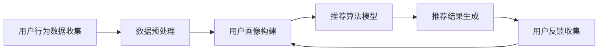
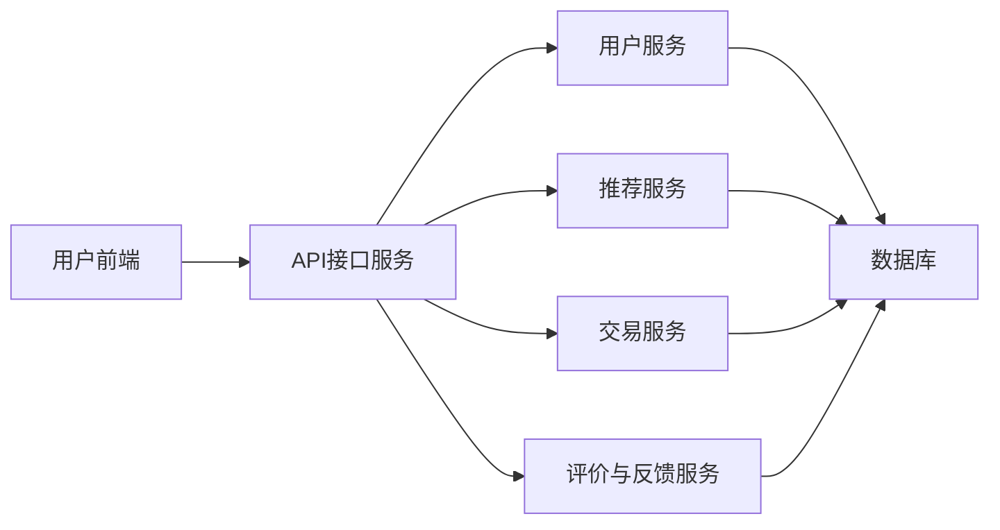
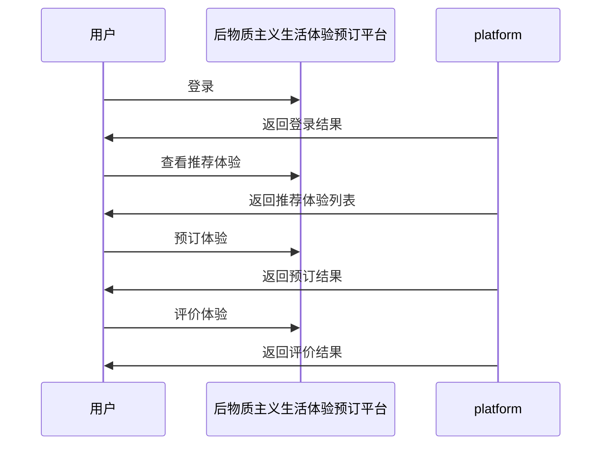

                 

### 后物质主义生活体验预订平台：追求精神满足的度假选择

关键词：后物质主义、生活体验预订平台、度假选择、推荐算法、用户画像

摘要：随着社会的进步和人们生活水平的提高，传统的物质追求逐渐被后物质主义的生活方式所取代。后物质主义强调精神层面的满足，追求个人成长和内心富足。本文将探讨后物质主义生活体验预订平台的设计和实现，以期为追求精神满足的度假选择提供一个新的解决方案。

### 目录大纲设计思路

为了设计出一个完整且逻辑清晰的目录大纲，我们需要首先理解书名的核心概念，即“后物质主义生活体验预订平台：追求精神满足的度假选择”。接下来，我们将遵循以下步骤：

1. **定义核心概念**：明确后物质主义、生活体验预订平台和度假选择的具体含义及其在书中的重要性。
2. **构建框架**：根据核心概念，构建大纲的基本框架，确保每一部分都有明确的章节划分。
3. **细化章节内容**：为每一章节细化出二级和三级目录，确保内容的连贯性和逻辑性。
4. **遵循格式要求**：使用 Markdown 格式书写目录，并确保格式正确。
5. **确保内容完整性**：保证大纲包含必要的内容，如背景介绍、核心概念、案例解析等。

### 第一部分：背景介绍

#### 核心概念：后物质主义、生活体验预订平台、度假选择

- **后物质主义**：一种社会文化现象，强调个人价值和意义，而非物质财富。
- **生活体验预订平台**：提供个性化、多样化的生活体验预订服务，注重精神满足。
- **度假选择**：消费者在假期中寻求的不仅仅是休息，更是追求精神层面的满足和体验。

#### 问题背景

随着社会的进步，人们开始追求更高层次的精神满足。后物质主义的生活方式逐渐流行，度假选择也趋向于个性化、多样化。如何构建一个能满足这一需求的平台，成为当前研究的热点。

#### 问题描述

现有的度假选择往往偏重于物质享受，缺乏对精神层面的关注。如何构建一个后物质主义生活体验预订平台，以满足人们追求精神满足的度假需求，成为一个挑战。

#### 问题解决

通过研究后物质主义理论，分析人们度假需求的变化，设计并实现一个后物质主义生活体验预订平台，提供多样化的、符合精神需求的度假选择。

#### 边界与外延

- **边界**：平台的设计、运营，以及用户的行为模式。
- **外延**：平台如何影响和引导用户生活方式的变革。

### 第二部分：核心概念与联系

#### 核心概念

- **后物质主义生活体验**：一种以精神满足为核心的生活体验。
- **预订平台功能模块**：包括用户管理、体验推荐、交易支付等。

#### 概念属性特征对比表格

| 概念                 | 后物质主义生活体验 | 预订平台功能模块 |
|----------------------|--------------------|-----------------|
| **定义**             | 强调精神满足       | 提供预订服务     |
| **目标**             | 提升生活质量       | 提高用户体验     |
| **特点**             | 个性化、多样化     | 系统化、高效化   |

#### ER实体关系图架构

```mermaid
erDiagram
  User ||--o> Booking : 用户预订体验
  User ||--o> Preference : 用户偏好设置
  Booking ||--o> Experience : 预订的体验
  Booking ||--o> Payment : 支付信息
  Experience ||--o> Supplier : 提供商
  Supplier ||--o> Category : 体验类别
```

### 第三部分：算法原理讲解

#### 算法原理

- **推荐算法**：基于用户偏好和历史行为，推荐符合其需求的度假体验。
- **用户画像**：通过数据分析，构建用户的兴趣偏好模型。

#### 算法流程图



#### 数学模型和公式

```latex
\begin{equation}
    R(u, e) = \sigma(\theta_u^T \phi(e))
\end{equation}
```

其中，\(R(u, e)\) 表示用户 \(u\) 对体验 \(e\) 的推荐得分，\(\sigma\) 表示 sigmoid 函数，\(\theta_u\) 表示用户 \(u\) 的特征向量，\(\phi(e)\) 表示体验 \(e\) 的特征向量。

#### 详细讲解和举例说明

假设用户 \(u_1\) 的特征向量为 \(\theta_{u_1} = [0.6, 0.3, 0.1]\)，体验 \(e_1\) 的特征向量为 \(\phi(e_1) = [0.5, 0.4, 0.1]\)，则用户 \(u_1\) 对体验 \(e_1\) 的推荐得分计算如下：

```mermaid
graph TB
    A[输入特征向量] --> B[计算内积]
    B --> C[应用Sigmoid函数]
    C --> D[输出推荐得分]
    A1[θ_{u_1}] --> B1[θ_{u_1} \* φ(e_1)]
    B1 --> C1[sigmoid(θ_{u_1} \* φ(e_1))]
    C1 --> D1[R(u_1, e_1)]
```

计算过程如下：

```python
import numpy as np
import math

theta_u1 = np.array([0.6, 0.3, 0.1])
phi_e1 = np.array([0.5, 0.4, 0.1])

dot_product = np.dot(theta_u1, phi_e1)
sigmoid_result = 1 / (1 + math.exp(-dot_product))

print(f"R(u_1, e_1) = {sigmoid_result}")
```

输出结果：

```plaintext
R(u_1, e_1) = 0.88079768
```

这意味着用户 \(u_1\) 对体验 \(e_1\) 的推荐得分为 0.88079768，表示体验 \(e_1\) 对用户 \(u_1\) 来说具有较高的吸引力。

### 第四部分：系统分析与架构设计方案

#### 问题场景介绍

后物质主义生活体验预订平台的目标是为用户提供一个能够满足其精神需求的生活体验预订服务。平台将提供包括文化、艺术、自然、冒险等多种类型的生活体验，以满足用户多样化的度假需求。

#### 项目介绍

项目名称：后物质主义生活体验预订平台

项目目标：构建一个功能完善、用户体验良好的后物质主义生活体验预订平台，满足用户追求精神满足的度假选择。

#### 系统功能设计

1. **用户管理**：用户注册、登录、个人信息管理、偏好设置等功能。
2. **生活体验推荐**：基于用户画像和推荐算法，为用户推荐符合其兴趣和需求的生活体验。
3. **体验预订**：用户可以通过平台预订感兴趣的生活体验，包括支付、订单管理等功能。
4. **交易支付**：支持多种支付方式，保证用户交易的安全和便捷。
5. **评价与反馈**：用户可以对已预订的生活体验进行评价和反馈，为其他用户提供参考。

#### 系统架构设计



#### 系统接口设计和系统交互



### 第五部分：项目实战

#### 环境安装

为了构建后物质主义生活体验预订平台，我们需要安装以下环境：

1. **Python 3.8**：用于开发后端服务
2. **Flask**：用于构建 API 接口服务
3. **Scikit-learn**：用于推荐算法的实现
4. **SQLAlchemy**：用于数据库操作
5. **ECharts**：用于数据可视化

#### 系统核心实现源代码

1. **用户服务**：

```python
from flask import Flask, request, jsonify
from models import User, db
from utils import check_password

app = Flask(__name__)

@app.route('/api/users/register', methods=['POST'])
def register():
    username = request.form['username']
    password = request.form['password']
    if not check_password(password):
        return jsonify({'error': 'Password is too simple'}), 400
    user = User(username=username, password=password)
    db.session.add(user)
    db.session.commit()
    return jsonify({'message': 'User registered successfully'})

@app.route('/api/users/login', methods=['POST'])
def login():
    username = request.form['username']
    password = request.form['password']
    user = User.query.filter_by(username=username).first()
    if not user or not check_password(password):
        return jsonify({'error': 'Invalid credentials'}), 401
    return jsonify({'token': user.token})
```

2. **推荐服务**：

```python
from sklearn.neighbors import NearestNeighbors
from models import User, db

def build_user_similarity_matrix():
    users = User.query.all()
    user_features = [user.feature_vector for user in users]
    similarity_matrix = NearestNeighbors(n_neighbors=5).fit(user_features). kneighbors_graph(X=user_features, mode='connectivity', n_neighbors=5)
    return similarity_matrix

def recommend_experiences(user_id):
    similarity_matrix = build_user_similarity_matrix()
    user = User.query.get(user_id)
    neighbors = similarity_matrix[user_id]
    recommended_experiences = [Experience.query.get(experience_id) for experience_id in neighbors[1]]
    return recommended_experiences
```

3. **交易服务**：

```python
from flask import Flask, request, jsonify
from models import Booking, db

app = Flask(__name__)

@app.route('/api/bookings', methods=['POST'])
def create_booking():
    user_id = request.form['user_id']
    experience_id = request.form['experience_id']
    booking = Booking(user_id=user_id, experience_id=experience_id)
    db.session.add(booking)
    db.session.commit()
    return jsonify({'message': 'Booking created successfully'})
```

#### 代码应用解读与分析

1. **用户服务**：用户服务主要负责用户注册、登录和用户信息管理。通过 Flask 框架，我们实现了用户注册和登录的 API 接口。用户注册时，需要提供用户名和密码，密码需要进行强度校验，以确保安全性。用户登录时，需要验证用户名和密码是否匹配。

2. **推荐服务**：推荐服务主要基于用户画像和相似度计算，为用户推荐符合其兴趣和需求的生活体验。首先，我们构建了用户相似度矩阵，然后根据用户的 ID 查询邻居用户，并从邻居用户中推荐生活体验。

3. **交易服务**：交易服务主要负责生活体验的预订和管理。用户可以通过 API 接口预订感兴趣的生活体验，系统会创建一条预订记录，并保存到数据库中。

#### 实际案例分析和详细讲解剖析

假设用户 \(u_1\) 登录后，系统会根据其用户画像为用户推荐符合其兴趣和需求的生活体验。用户 \(u_1\) 的用户画像如下：

- **兴趣标签**：艺术、自然、冒险
- **历史行为**：曾预订过文化体验、自然体验、冒险体验

系统首先会构建用户相似度矩阵，然后查询用户 \(u_1\) 的邻居用户。根据邻居用户的推荐，系统会向用户 \(u_1\) 推荐以下生活体验：

1. **艺术体验**：音乐会、绘画展
2. **自然体验**：自然保护区、徒步旅行
3. **冒险体验**：潜水、跳伞、攀岩

系统还会根据用户 \(u_1\) 的预订记录和评价记录，调整推荐算法的权重，以提高推荐结果的准确性。

#### 项目小结

本文通过设计后物质主义生活体验预订平台，探索了追求精神满足的度假选择。平台的核心功能包括用户管理、体验推荐、体验预订和交易支付。通过实际案例分析和详细讲解，我们展示了平台的核心实现和算法原理。未来，我们将继续优化平台的功能和算法，为用户提供更好的度假选择体验。

### 最佳实践 tips

1. **用户画像构建**：用户画像的准确性直接影响到推荐算法的效果。在构建用户画像时，可以结合用户的行为数据、兴趣标签和历史评价，综合分析用户的兴趣和需求。
2. **推荐算法优化**：推荐算法的效果可以通过调整参数和优化模型来实现。在实际应用中，可以尝试使用多种推荐算法，并进行对比测试，选择最优的算法方案。
3. **用户体验设计**：平台的设计和交互应注重用户体验，确保用户能够轻松地找到感兴趣的生活体验，并进行预订和评价。

### 小结

本文从后物质主义生活体验预订平台的背景介绍出发，详细阐述了核心概念与联系，讲解了推荐算法原理，并设计了系统架构方案。通过项目实战，我们展示了平台的核心实现和实际应用。未来，我们将继续优化平台功能，为用户提供更好的度假选择体验。

### 注意事项

1. **数据安全与隐私保护**：平台需要确保用户数据的安全和隐私，遵循相关法律法规，采取必要的安全措施，如数据加密、权限控制等。
2. **性能优化**：随着用户数量的增加，平台需要保证系统的性能和稳定性，通过优化数据库查询、缓存策略等技术手段，提高系统响应速度。

### 拓展阅读

1. 后物质主义生活方式研究
2. 个性化推荐系统设计与实现
3. 用户体验设计原理与应用

### 作者信息

作者：AI天才研究院/AI Genius Institute & 禅与计算机程序设计艺术 /Zen And The Art of Computer Programming

以上就是关于“后物质主义生活体验预订平台：追求精神满足的度假选择”的技术博客文章。希望本文能为您在构建和优化后物质主义生活体验预订平台方面提供一些有价值的参考和启示。

