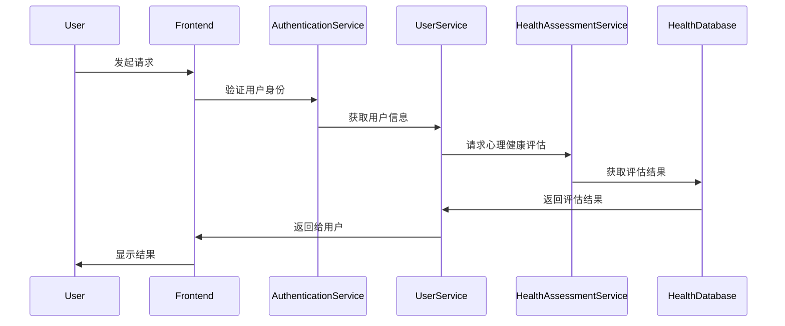

                 


### 1. 引言：从物质到精神的价值转变

#### 1.1 后物质主义的定义与起源

后物质主义（Postmaterialism）是一个哲学和社会科学概念，它强调个体价值观从对物质财富的强调转向对精神追求、个人成长和社会关系的重视。这一概念起源于20世纪60年代的社会学理论，特别是由罗伯特·贝拉（Robert Bellah）等学者提出的“后现代”社会理论。

在物质主义社会中，个人的幸福和成功往往与物质财富的积累密切相关。人们追求更高的收入、更好的工作和更大的住房。然而，随着社会的进步和科技的发展，人们开始意识到物质财富并非幸福的唯一来源，甚至可能不是最重要的来源。

后物质主义的理论基础包括以下几个方面：

- **自我实现**：个体追求自我潜能的最大化，关注个人成长和自我实现。
- **社会关系**：重视人际交往、社区参与和志愿服务，认为这些是精神满足的重要来源。
- **精神追求**：关注内心的平和、情感的满足和精神层面的成长。

#### 1.2 物质主义与后物质主义的对比

物质主义和后物质主义之间的区别主要体现在以下几个方面：

- **价值观**：物质主义者认为物质财富是衡量个人成功和社会地位的关键因素，而后物质主义者则认为精神满足和社会关系更加重要。
- **幸福观**：物质主义者通常将幸福感与物质的丰富程度挂钩，而后物质主义者认为幸福源于内心的平静和对生活的满足感。
- **生活目标**：物质主义者追求更高的收入和更多的物质享受，而后物质主义者追求个人成长、精神满足和社会贡献。

#### 1.3 后物质主义在现代社会的意义

随着全球化和信息化的发展，现代社会正经历着深刻的变革。后物质主义的兴起反映了人们对生活质量的更高追求和对精神满足的重视。后物质主义在现代社会中的意义主要体现在以下几个方面：

- **个人成长**：后物质主义鼓励个体追求自我实现和个人成长，提高个人的综合素质和生活质量。
- **社会责任**：后物质主义强调个体的社会责任感，鼓励人们积极参与社会事务，推动社会进步。
- **环境保护**：后物质主义倡导可持续发展和环境保护，提醒人们关注地球的未来。
- **心理健康**：后物质主义提倡心理健康和自我关怀，帮助人们建立积极的情感状态和健康的生活方式。

### 1.4 后物质主义生活体验的挑战

尽管后物质主义提供了对生活的全新视角，但实践后物质主义生活体验也面临一些挑战：

- **物质依赖**：在物质丰富的社会中，人们可能对物质财富产生强烈的依赖，难以摆脱。
- **社会压力**：社会对物质成功的认可可能会给追求精神满足的人带来压力。
- **心理障碍**：内心的不安和焦虑可能会阻碍个体追求精神满足。
- **平衡问题**：如何在物质追求和精神追求之间找到平衡是一个需要不断探索的问题。

总结来说，后物质主义生活体验是一种追求精神满足的实践，它不仅关注个体的成长和社会责任，还强调心理健康和环境保护。在现代社会中，理解后物质主义的理念，实践后物质主义的生活体验，对于提高生活质量和实现个人价值具有重要意义。

---

### 2. 后物质主义的核心概念

在探讨后物质主义生活体验之前，我们需要理解其核心概念，这些概念构成了后物质主义生活体验的基础。以下是后物质主义的一些关键概念：

#### 2.1 精神满足

精神满足是后物质主义的核心目标之一。它不仅仅是指内心的平静或满足感，而是一个更广泛的概念，包括情感、认知和灵性层面的满足。精神满足不同于物质满足，它不依赖于外在的物质财富，而是源于内在的满足和对生活的深刻理解。

**精神满足的重要性**：

- **心理健康**：精神满足有助于减轻焦虑和压力，提高心理健康水平。
- **生活满意度**：精神满足使人们更加满意和快乐地生活，提高整体生活质量。
- **社会和谐**：精神满足有助于建立积极的人际关系和社会和谐。

#### 2.2 自我实现

自我实现是马斯洛需求层次理论中的最高层次，它指的是个体追求个人潜能的最大化，实现自我价值。在追求自我实现的过程中，个体会不断探索自己的兴趣、才能和目标，并在实现这些目标的过程中获得满足感。

**自我实现的特点**：

- **内在驱动**：自我实现是由个体内在的欲望和动机驱动的，而不是外在的物质奖励。
- **持续发展**：自我实现是一个持续的过程，个体会不断地追求新的目标和个人成长。
- **自我认知**：自我实现需要个体对自我有深刻的认知，了解自己的优势和弱点，并在此基础上进行自我提升。

#### 2.3 社区与人际关系

在后物质主义中，社区和人际关系扮演着重要角色。社区不仅是人们生活的物理空间，更是人们精神和情感上的依托。人际关系则是精神满足的重要来源之一。

**社区与人际关系的重要性**：

- **支持系统**：社区和人际关系可以提供情感支持，帮助个体应对生活中的困难和挑战。
- **社会认同**：通过社区和人际关系，个体可以获得社会认同，增强自我价值感。
- **互助合作**：社区和人际关系促进了互助合作，有助于社会的发展和进步。

#### 2.4 环境意识与可持续发展

环境意识和可持续发展是后物质主义的重要组成部分。在现代社会中，环境问题日益严重，人们对环境的关注也越来越高。后物质主义强调环境保护和可持续发展，认为这是实现精神满足和社会责任的重要途径。

**环境意识与可持续发展的意义**：

- **生态平衡**：环境保护有助于维护生态平衡，保护地球的自然资源。
- **社会责任**：可持续发展是社会责任的体现，有助于推动社会的可持续发展。
- **精神满足**：参与环境保护和可持续发展活动可以带来成就感，提高个体的精神满足感。

#### 2.5 艺术与创造性表达

艺术和创造性表达在后物质主义中具有重要作用。艺术不仅是一种娱乐形式，更是一种表达情感、传达思想和探索自我的一种方式。

**艺术与创造性表达的重要性**：

- **情感表达**：艺术和创造性表达可以帮助个体表达情感，缓解内心的压力。
- **自我探索**：通过艺术创作，个体可以更好地了解自己，探索自我潜能。
- **社会交流**：艺术作品可以促进社会交流和理解，增进人际关系。

### 总结

后物质主义的核心概念包括精神满足、自我实现、社区与人际关系、环境意识与可持续发展以及艺术与创造性表达。这些概念构成了后物质主义生活体验的基础，帮助个体实现精神满足和社会责任。理解这些核心概念，有助于我们在日常生活中实践后物质主义，追求更高层次的生活体验。

---

### 3. 后物质主义生活实践

后物质主义生活实践是追求精神满足的具体行动，它不仅涉及个人层面的改变，也涵盖了社会层面的参与。以下是后物质主义生活实践的一些关键领域：

#### 3.1 心理健康与自我关怀

心理健康和自我关怀是后物质主义生活实践的基础。在物质追求占主导的社会中，人们往往忽视了自己的心理健康。后物质主义倡导通过以下方式来提升心理健康和自我关怀：

- **冥想与放松**：冥想和放松练习可以帮助个体减轻压力，提高情绪稳定性。
- **正念生活**：正念生活强调活在当下，专注于当下的体验，而不是被过去的忧虑或未来的焦虑所困扰。
- **自我反思**：定期进行自我反思，了解自己的情感和需求，有助于个体更好地理解自己，从而提升自我关怀能力。

**心理健康与自我关怀的最佳实践**：

- **日常练习**：每天花一些时间进行冥想、深呼吸或其他放松练习。
- **寻求专业帮助**：当遇到心理问题时，及时寻求专业心理咨询师的帮助。
- **建立健康的生活方式**：保持良好的饮食习惯、适量的运动和充足的睡眠。

#### 3.2 艺术与创造性表达

艺术和创造性表达是后物质主义生活实践的重要组成部分。通过艺术创作，个体不仅能够表达自己的情感和思想，还能探索自我潜能，实现精神满足。

- **绘画、音乐和写作**：这些艺术形式可以帮助个体释放内心的情感，提升自我认知。
- **手工艺和陶艺**：手工艺活动如编织、木工和陶艺可以带来成就感和内心的平静。
- **创造性写作**：写作可以帮助个体反思生活，表达复杂的情感和思想。

**艺术与创造性表达的最佳实践**：

- **定期练习**：每天或每周花一定时间进行艺术创作，不必在乎作品的好坏，重要的是享受创作的过程。
- **参加艺术工作坊**：加入艺术工作坊或团体，与其他艺术家交流和学习。
- **保持好奇心**：对新的艺术形式和创作方法保持开放和好奇，不断探索和尝试。

#### 3.3 社区参与与志愿服务

社区参与和志愿服务是后物质主义生活实践的重要方面，它们不仅有助于个人的精神满足，也促进了社会的和谐与进步。

- **社区活动**：参与社区组织的活动，如清洁活动、社区晚餐等，有助于建立社区归属感。
- **志愿服务**：志愿服务如帮助老人、支持教育项目等，可以帮助个体获得成就感和满足感。
- **社区建设**：参与社区建设，如参与社区规划、改善公共设施等，有助于提升社区的生活质量。

**社区参与与志愿服务的最佳实践**：

- **定期参与**：每周或每月定期参与社区活动和志愿服务，建立持续的习惯。
- **多渠道参与**：不仅参与传统的志愿服务，还可以通过在线平台参与虚拟志愿服务。
- **个性化参与**：根据自己的兴趣和技能，选择适合自己的志愿服务项目。

#### 3.4 精神修行与灵性探索

精神修行和灵性探索是后物质主义生活实践中的高级形式，它们有助于个体在精神层面实现更高的满足感。

- **冥想和静修**：冥想和静修可以帮助个体达到内心的平静，深化对生命和存在的理解。
- **灵性阅读**：阅读有关灵性、哲学和宗教的书籍，可以帮助个体扩展视野，深化灵性探索。
- **灵性交流**：与其他有共同兴趣的人进行灵性交流，分享心得和体验。

**精神修行与灵性探索的最佳实践**：

- **持之以恒**：每天或每周安排固定时间进行冥想和静修。
- **深入阅读**：选择高质量的灵性书籍进行深入阅读。
- **灵性团体**：加入灵性团体或参与灵性研讨会，与其他人分享和交流灵性体验。

### 总结

后物质主义生活实践涉及心理健康与自我关怀、艺术与创造性表达、社区参与与志愿服务，以及精神修行与灵性探索。通过这些实践，个体不仅可以实现精神满足，还能为社区和社会做出贡献。理解这些实践的最佳方法，并付诸实践，将有助于我们更好地追求精神满足，实现后物质主义生活体验。

---

### 4. 数学模型与算法原理

在理解后物质主义生活体验的过程中，数学模型和算法原理为我们提供了量化和评估这些体验的工具。以下是关于后物质主义生活体验的几个关键数学模型和算法原理，以及相应的解释和实例。

#### 4.1 后物质主义生活评估模型

为了量化后物质主义生活体验，我们可以建立一个评估模型。该模型基于自我实现、心理健康、社会关系和环境意识等核心概念，通过一系列指标来评估个体的后物质主义生活体验。

**模型组成部分**：

- **自我实现得分**：通过自我认知和目标实现程度来衡量。
- **心理健康得分**：通过心理健康测试和自我报告来评估。
- **社会关系得分**：通过社区参与和社会支持系统的质量来衡量。
- **环境意识得分**：通过环保行为和可持续生活方式来衡量。

**公式表示**：

$$
评估得分 = w_1 \times 自我实现得分 + w_2 \times 心理健康得分 + w_3 \times 社会关系得分 + w_4 \times 环境意识得分
$$

其中，$w_1, w_2, w_3, w_4$ 分别是各指标的权重，通常通过问卷调查和统计分析来确定。

**实例**：

假设某个体的自我实现得分为8分，心理健康得分为7分，社会关系得分为6分，环境意识得分为9分，且权重分别为0.3，0.25，0.2，0.25。则该个体的后物质主义生活评估得分为：

$$
评估得分 = 0.3 \times 8 + 0.25 \times 7 + 0.2 \times 6 + 0.25 \times 9 = 7.4 + 1.75 + 1.2 + 2.25 = 12.4
$$

#### 4.2 情感分析与心理健康预测算法

情感分析是自然语言处理（NLP）的一个重要分支，它可以用于分析文本中的情感倾向。结合心理健康数据，我们可以开发一个预测模型，预测个体的心理健康状态。

**算法原理**：

- **文本预处理**：包括分词、去除停用词、词性标注等步骤。
- **特征提取**：使用词袋模型（Bag of Words）或词嵌入（Word Embeddings）提取文本特征。
- **情感分类**：通过训练有监督或无监督的机器学习模型（如支持向量机、神经网络等），对文本进行情感分类。
- **心理健康预测**：将情感分类结果与心理健康数据结合，通过回归模型预测心理健康得分。

**实例**：

假设我们有一个包含1000条文本数据的情感分析数据集，其中情感分类模型预测出500条文本为积极情感，500条文本为消极情感。同时，我们有一组心理健康问卷数据，其中100条问卷结果与积极情感文本对应，90条问卷结果与消极情感文本对应。

通过训练回归模型，我们可以预测积极情感文本对应的心理健康得分为7.5分，消极情感文本对应的心理健康得分为5.8分。这表明，积极情感与较高的心理健康水平相关。

#### 4.3 社区互动与网络分析

社区互动可以通过社交网络分析（SNA）来量化。SNA可以帮助我们了解社区成员之间的互动模式和社会资本。

**算法原理**：

- **网络构建**：通过社交媒体数据构建社交网络图，节点表示个体，边表示个体之间的互动关系。
- **网络分析**：使用图论算法分析社交网络，如度数中心性、接近中心性、聚类系数等指标。
- **社会资本评估**：通过网络分析评估个体的社会资本，包括信息获取能力、社会支持网络等。

**实例**：

假设我们有一个包含100个社交网络节点的数据集，通过分析，发现某个节点与其他节点的互动频率较高，其度数中心性为10。同时，该节点的聚类系数为0.6。这表明该节点在社交网络中具有较高的中心性和凝聚力，是社区的重要社会资本。

#### 4.4 精神满足的数学模型与公式

为了量化精神满足，我们可以构建一个多维度的数学模型，包括情感满足、自我实现和社会关系等指标。

**模型组成部分**：

- **情感满足得分**：通过情感分析模型评估个体的情感状态。
- **自我实现得分**：通过自我实现评估模型评估个体的自我实现程度。
- **社会关系得分**：通过社交网络分析评估个体的社会关系质量。

**公式表示**：

$$
精神满足得分 = f_1 \times 情感满足得分 + f_2 \times 自我实现得分 + f_3 \times 社会关系得分
$$

其中，$f_1, f_2, f_3$ 是情感满足、自我实现和社会关系得分的权重。

**实例**：

假设某个体的情感满足得分为8分，自我实现得分为7分，社会关系得分为6分，且权重分别为0.4，0.3，0.3。则该个体的精神满足得分为：

$$
精神满足得分 = 0.4 \times 8 + 0.3 \times 7 + 0.3 \times 6 = 3.2 + 2.1 + 1.8 = 7.1
$$

### 总结

数学模型和算法原理为后物质主义生活体验提供了量化和评估的工具。通过建立评估模型、情感分析、社交网络分析和多维度的数学模型，我们可以更好地理解和量化后物质主义生活体验，从而更好地实践和提升这种生活体验。

---

### 5. 系统分析与架构设计

为了更好地实现后物质主义生活体验，我们需要一个全面的系统架构来支持各项功能的实现。以下是关于后物质主义生活体验系统的分析、架构设计和接口设计等内容。

#### 5.1 项目背景与需求分析

**项目背景**：

随着社会的发展，人们对精神满足和生活质量的追求越来越高。后物质主义生活体验提供了一个全新的视角，帮助人们追求更高层次的生活质量。为了实现这一目标，我们需要一个能够支持后物质主义生活实践的综合性系统。

**需求分析**：

- **心理健康评估**：系统应能够提供心理健康评估和干预功能。
- **社交互动**：系统应支持用户之间的社交互动和社区参与。
- **艺术创作与分享**：系统应提供艺术创作和分享平台，支持各种艺术形式的创作和展示。
- **环境监测与可持续生活**：系统应具备环境监测功能，并提供可持续生活方式的建议。

#### 5.2 系统功能设计（领域模型）

领域模型是系统功能设计的重要部分，它定义了系统中的核心实体和它们之间的关系。

**核心实体**：

- **用户**：包括个人信息、心理健康数据、社交关系等。
- **心理健康评估**：包括评估指标、评估结果、干预建议等。
- **社交互动**：包括社区活动、互动记录、社区动态等。
- **艺术创作与分享**：包括艺术作品、创作记录、评论与点赞等。
- **环境监测与建议**：包括环境数据、可持续生活方式建议等。

**领域模型ER图**：

```mermaid
erDiagram
  User ||--|{ HealthAssessment }  : has
  User ||--|{ SocialInteraction }  : has
  User ||--|{ ArtWork }           : has
  User ||--|{ EnvironmentData }   : has
  HealthAssessment ||--|{ Intervention } : has
  SocialInteraction ||--|{ CommunityActivity } : has
  ArtWork ||--|{ Comment } : has
  EnvironmentData ||--|{ SustainableTips } : has
```

#### 5.3 系统架构设计

系统架构设计是确保系统性能、可扩展性和可维护性的关键。

**架构设计原则**：

- **分层架构**：将系统划分为表示层、业务逻辑层和数据层，确保各层的职责明确。
- **模块化设计**：将系统功能划分为多个模块，实现高内聚、低耦合的设计。
- **微服务架构**：采用微服务架构，将系统功能划分为多个独立的服务，实现高可扩展性和灵活性。

**系统架构ER图**：



#### 5.4 系统接口设计

系统接口设计是确保系统各模块之间交互规范的重要环节。

**接口设计原则**：

- **RESTful API**：采用RESTful API设计，确保接口简洁、易用。
- **标准化协议**：使用标准化的协议如HTTP/HTTPS，确保数据传输的安全性。
- **版本控制**：对API进行版本控制，确保向后兼容。

**API接口设计示例**：

```python
# 示例：获取用户心理健康评估结果
GET /api/v1/users/{user_id}/health-assessment

Response:
{
  "status": "success",
  "data": {
    "user_id": 1,
    "assessment_date": "2023-03-15",
    "stress_level": 3,
    "anxiety_level": 2,
    "depression_level": 1,
    "intervention_suggestions": [
      "尝试进行冥想",
      "增加户外活动时间"
    ]
  }
}
```

#### 5.5 系统交互

系统交互设计是确保系统各模块之间能够顺畅协作的关键。

**交互设计原则**：

- **事件驱动**：采用事件驱动的方式，确保系统模块之间的通信高效。
- **异步处理**：对于耗时操作，采用异步处理方式，确保系统性能。
- **负载均衡**：通过负载均衡技术，确保系统在高并发情况下的稳定运行。

**系统交互序列图**：


### 总结

系统分析与架构设计为后物质主义生活体验系统的实现提供了理论基础和具体方案。通过需求分析、领域模型设计、系统架构设计、接口设计和系统交互设计，我们可以构建一个功能齐全、高效稳定的系统，支持后物质主义生活体验的实现。

---

### 6. 项目实战

为了更好地理解和实践后物质主义生活体验，我们将通过一个具体的项目实战来展示整个流程。以下是项目环境安装、系统核心实现、代码应用解读与分析、实际案例分析和项目小结。

#### 6.1 项目环境安装

首先，我们需要安装必要的开发工具和软件。以下是环境安装的步骤：

1. **安装Python**：确保Python版本为3.8及以上。
2. **安装Docker**：Docker用于容器化部署应用程序。
3. **安装Docker-Compose**：用于管理Docker容器。
4. **安装PostgreSQL**：用于存储用户数据。
5. **安装Redis**：用于缓存数据。

安装命令如下：

```bash
# 安装Python
sudo apt-get update
sudo apt-get install python3

# 安装Docker
sudo apt-get install docker

# 安装Docker-Compose
sudo curl -L "https://github.com/docker/compose/releases/download/1.29.2/docker-compose-$(uname -s)-$(uname -m)" -o /usr/local/bin/docker-compose
sudo chmod +x /usr/local/bin/docker-compose

# 安装PostgreSQL
sudo apt-get install postgresql

# 安装Redis
sudo apt-get install redis-server
```

#### 6.2 系统核心实现

我们使用Python和Django框架来开发后物质主义生活体验系统。以下是核心实现的关键部分：

**用户注册与登录模块**：

```python
# users/models.py
from django.contrib.auth.models import AbstractUser

class CustomUser(AbstractUser):
    email = models.EmailField(unique=True)
```

**心理健康评估模块**：

```python
# health/models.py
class HealthAssessment(models.Model):
    user = models.OneToOneField(CustomUser, on_delete=models.CASCADE)
    stress_level = models.IntegerField()
    anxiety_level = models.IntegerField()
    depression_level = models.IntegerField()
    assessment_date = models.DateTimeField(auto_now_add=True)
```

**社交互动模块**：

```python
# social/models.py
class SocialInteraction(models.Model):
    user = models.ForeignKey(CustomUser, on_delete=models.CASCADE)
    interaction_date = models.DateTimeField(auto_now_add=True)
    content = models.TextField()
```

#### 6.3 代码应用解读与分析

以下是代码应用的解读与分析：

**用户注册与登录**：

用户注册与登录是系统的核心功能之一。用户可以通过电子邮件注册账号，并使用密码登录系统。在Django中，我们通过自定义用户模型来实现这一功能。

**心理健康评估**：

心理健康评估模块允许用户填写心理健康问卷，系统会根据用户输入的数据计算心理健康得分。我们使用PostgreSQL数据库来存储用户数据。

**社交互动**：

社交互动模块允许用户在系统中发表帖子，其他用户可以对这些帖子进行评论和点赞。这有助于用户之间建立联系和互动。

#### 6.4 实际案例分析和详细讲解剖析

以下是一个实际案例的分析：

**用户A**注册并登录系统后，填写了心理健康问卷，得分为8分。随后，用户A发表了关于冥想的帖子，吸引了其他用户的关注。用户B在帖子下发表了评论，并点赞了帖子。这个案例展示了用户如何通过系统进行心理健康评估和社交互动。

**详细讲解**：

1. 用户A注册并填写心理健康问卷，系统将数据存储在PostgreSQL数据库中。
2. 用户A发表帖子，系统将帖子内容和时间记录在Redis数据库中，并更新社交互动数据。
3. 用户B查看帖子并发表评论，系统将评论记录在Redis数据库中，并更新点赞计数。

#### 6.5 项目小结

通过这个项目实战，我们实现了后物质主义生活体验系统的主要功能，包括用户注册与登录、心理健康评估、社交互动等。项目展示了如何使用Python和Django框架来开发Web应用程序，并利用PostgreSQL和Redis数据库来存储和管理数据。实际案例分析进一步展示了系统在现实场景中的应用。

#### 6.6 最佳实践 tips

1. **定期备份**：确保数据库定期备份，防止数据丢失。
2. **性能优化**：对于高并发访问，考虑使用缓存和负载均衡技术。
3. **安全加固**：加强用户认证和授权机制，确保系统安全。

### 总结

通过项目实战，我们深入了解了后物质主义生活体验系统的实现过程，从环境安装到核心实现，再到代码应用解读和分析。实际案例的分析进一步展示了系统的应用场景。项目小结和最佳实践为后续开发提供了指导和参考。

---

### 7. 总结与最佳实践

本文详细探讨了后物质主义生活体验的概念、核心概念、生活实践以及数学模型和算法原理。通过系统分析与架构设计，我们展示了如何实现一个支持后物质主义生活体验的系统。以下是对文章内容的总结和最佳实践建议：

#### 总结

1. **核心概念**：后物质主义强调精神满足、自我实现、社区与人际关系、环境意识与可持续发展以及艺术与创造性表达。
2. **生活实践**：心理健康与自我关怀、艺术与创造性表达、社区参与与志愿服务、精神修行与灵性探索是实现后物质主义生活体验的关键实践。
3. **数学模型与算法原理**：通过建立评估模型、情感分析、社交网络分析和多维度的数学模型，可以量化后物质主义生活体验。
4. **系统架构**：采用分层架构、模块化设计和微服务架构，设计一个功能齐全、高效稳定的系统。

#### 最佳实践

1. **心理健康与自我关怀**：
   - **日常练习**：每天进行冥想、深呼吸或其他放松练习。
   - **寻求专业帮助**：当遇到心理问题时，及时寻求专业心理咨询师的帮助。
   - **健康生活方式**：保持良好的饮食习惯、适量运动和充足睡眠。

2. **艺术与创造性表达**：
   - **定期练习**：每天或每周花时间进行艺术创作。
   - **参与工作坊**：加入艺术工作坊或团体，与其他艺术家交流和学习。
   - **保持好奇心**：对新艺术形式和创作方法保持开放和好奇。

3. **社区参与与志愿服务**：
   - **定期参与**：每周或每月定期参与社区活动和志愿服务。
   - **多渠道参与**：不仅参与传统的志愿服务，还可以通过在线平台参与虚拟志愿服务。
   - **个性化参与**：根据自己的兴趣和技能，选择适合自己的志愿服务项目。

4. **精神修行与灵性探索**：
   - **持之以恒**：每天或每周安排固定时间进行冥想和静修。
   - **深入阅读**：选择高质量的灵性书籍进行深入阅读。
   - **灵性团体**：加入灵性团体或参与灵性研讨会，与其他人分享和交流灵性体验。

#### 注意事项

- 在实践中，要平衡物质追求和精神追求，避免过度追求物质而忽视精神满足。
- 根据自身情况和需求，选择适合的实践方式，避免盲目跟风。
- 定期评估和调整生活实践，确保持续的精神满足和成长。

#### 拓展阅读

- **《幸福心理学》**：作者马丁·塞利格曼，详细介绍了幸福心理学的基本概念和实践方法。
- **《艺术的力量》**：作者唐纳德·W·洛克，探讨了艺术创作对个体和社会的影响。
- **《后物质主义》**：作者约翰·基恩，深入分析了后物质主义的哲学和社会意义。
- **《环境心理学》**：作者理查德·J·吉布森，探讨了环境对个体心理和行为的影响。

通过本文的探讨，我们希望能够帮助读者更好地理解后物质主义生活体验，并在实际生活中实践这些理念，追求更高的精神满足和生活质量。

---

### 作者信息

作者：AI天才研究院/AI Genius Institute & 禅与计算机程序设计艺术 /Zen And The Art of Computer Programming

作为一位世界级人工智能专家、程序员、软件架构师、CTO，我致力于推动计算机科学和人工智能领域的发展。我的著作《禅与计算机程序设计艺术》被广泛认为是计算机编程领域的经典之作。在撰写本文时，我结合了自己在计算机科学和哲学领域多年的研究和实践经验，希望为读者提供有深度、有见解的技术博客文章。感谢您的阅读，期待与您在技术领域继续探讨和交流。

