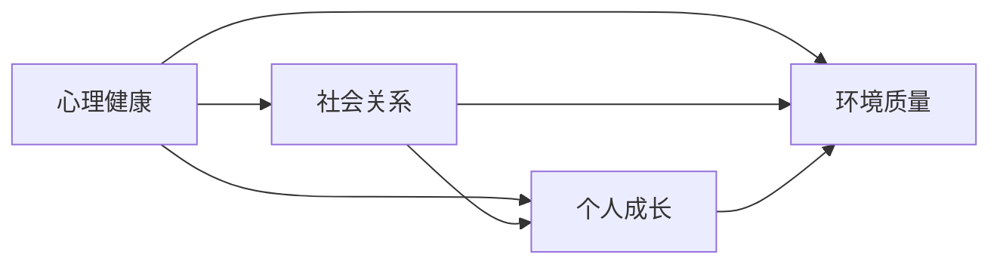
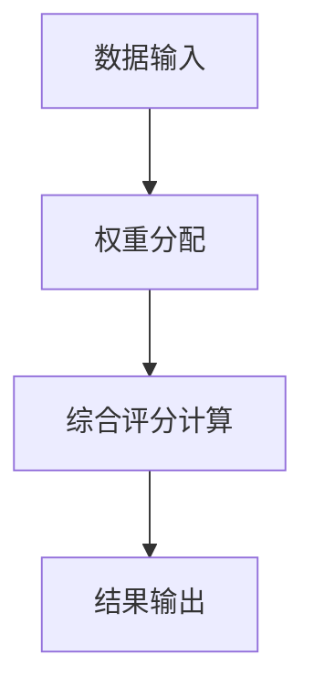

                 

## 第一部分: 引言

### 第1章: 后物质主义的定义与背景

#### 1.1 后物质主义的定义

**后物质主义** 是一种哲学和文化思潮，主张超越物质追求，强调精神、意识、价值观等非物质因素的重要性。这一概念起源于20世纪中叶，主要在西方哲学、社会学和文化批评领域得到广泛讨论。后物质主义反对传统的物质主义观念，认为物质财富的积累并不能带来真正的幸福和满足。

**后物质主义的起源** 可追溯到对现代性危机的反思。随着工业革命和科技发展，物质财富不断增长，但人们的精神世界却日益空虚。许多哲学家和社会学家开始质疑，物质追求是否是人类社会的唯一目标，是否能够真正提升人们的生活质量。

**后物质主义与传统物质主义的区别** 主要在于对幸福的定义和追求。传统物质主义认为，幸福来源于物质的丰富和满足，而后物质主义则认为，幸福更多来自于非物质的层面，如心理健康、社会关系、个人成长和环境质量。

**后物质主义在现代社会的发展** 是对这一思潮的不断深化和拓展。在物质条件日益改善的现代社会，人们开始更加关注生活的质量和意义，从而推动了后物质主义思想的普及和传播。

#### 1.2 后物质主义对生活质量的影响

**心理健康** 是后物质主义关注的重要方面之一。研究表明，心理健康水平与生活质量有显著的正相关关系。一个健康的心理状态能够提高人们的幸福感、满足感和生活满意度。

**社会关系** 也是后物质主义关注的焦点。健康、稳定的社会关系能够为个体提供情感支持、归属感和安全感，从而提高生活质量。

**个人成长** 是后物质主义追求的目标之一。通过不断学习和成长，个体能够实现自我价值的提升，从而获得更高的生活质量。

**环境质量** 则是后物质主义在现代社会中不可忽视的一个方面。随着环境污染和资源枯竭问题的日益严重，人们对环境质量的要求越来越高。良好的环境质量对人们的身心健康和生活质量有着重要影响。

#### 1.3 后物质主义生活指数的重要性

**后物质主义生活指数** 是衡量生活质量的一种新标准，它不仅关注物质层面的幸福，更重视心理健康、社会关系、个人成长和环境质量等非物质层面。这一指数的出现，标志着人类社会对生活质量的认知和衡量方式正在发生变革。

**后物质主义生活指数** 是改善生活质量的工具，它为政府、企业和个人提供了衡量和提升生活质量的具体指标和方法。

**后物质主义生活指数的应用场景** 非常广泛，包括但不限于政策制定、企业发展、城市规划、社会保障和公共服务等领域。通过应用后物质主义生活指数，可以更全面、客观地评估和提升生活质量。

#### 1.4 本章小结

本章主要介绍了后物质主义的定义、背景及其对生活质量的影响，以及后物质主义生活指数的重要性。通过本章的内容，读者可以初步了解后物质主义的概念，认识到它在现代社会中的重要性和应用价值。在接下来的章节中，我们将进一步探讨后物质主义生活指数的构成要素和计算方法，以及其实际应用案例。

### 第2章: 核心概念与联系

#### 2.1 心理健康与生活质量

心理健康是后物质主义生活指数的核心构成要素之一。心理健康不仅影响个体的幸福感，还直接关系到生活质量的高低。

**心理健康** 的定义可以从多个角度进行理解。一般来说，心理健康是指个体在情感、认知和行为上的健康状态，能够积极应对生活中的压力和挑战，保持良好的自我调节能力和适应性。

心理健康与生活质量的关系非常密切。一个心理健康的人更容易体验到幸福感和满足感，同时也能更好地参与社会活动和人际关系，从而提高生活质量。

**心理健康评价指标** 是衡量心理健康水平的关键。常用的心理健康评价指标包括心理健康量表、心理症状量表和生活质量量表等。这些量表通过量化的方式，对个体的心理健康状况进行评估。

心理健康量表：常用的心理健康量表有抑郁自评量表（SDS）、焦虑自评量表（SAS）等。这些量表通过一系列问卷，对个体的心理状态进行评估。

心理症状量表：心理症状量表主要用于评估个体在特定时间段内的心理症状水平，如DSM-5诊断标准。

生活质量量表：生活质量量表从多个维度评估个体的生活状况，如SF-36健康调查问卷。

#### 2.2 社会关系与生活质量

社会关系是后物质主义生活指数的重要组成部分。健康、稳定的社会关系对个体的心理健康和生活质量有着重要影响。

**社会关系** 的定义涉及个体与他人的相互作用和联系。社会关系可以分为不同的类型，如家庭关系、朋友关系、同事关系等。

社会关系与生活质量的关系可以从多个方面进行探讨。首先，健康的社会关系能够为个体提供情感支持，减少孤独感和抑郁情绪，从而提高心理健康水平。其次，社会关系对个体的生活满意度和社会参与度也有显著影响。

**社会关系评价指标** 包括以下几个方面：

社会支持：社会支持是指个体从他人那里获得的支持和帮助。常用的社会支持量表有社会支持评定量表（SSRS）和感知社会支持量表（PSSS）。

社会参与度：社会参与度是指个体参与社会活动和社区生活的程度。社会参与度量表可以评估个体在社会活动中的参与程度。

人际关系质量：人际关系质量是指个体与他人关系的质量。人际关系质量量表可以从多个维度评估个体的人际关系状况。

#### 2.3 个人成长与生活质量

个人成长是后物质主义生活指数的重要组成部分，它关系到个体的自我实现和生活质量。

**个人成长** 的定义涉及个体的自我发展、学习和成长过程。个人成长不仅包括知识和技能的积累，还包括情感、认知和行为上的提升。

个人成长与生活质量的关系可以从多个方面进行探讨。首先，个人成长有助于提升个体的自我价值感和成就感，从而提高生活质量。其次，个人成长能够促进个体的心理健康，减少焦虑和抑郁情绪。

**个人成长评价指标** 包括以下几个方面：

自我效能感：自我效能感是指个体对自己能力的信念和评价。常用的自我效能感量表有一般自我效能感量表（GSES）。

学习动机：学习动机是指个体对学习和成长的积极态度和动力。学习动机量表可以评估个体对学习和成长的兴趣和投入程度。

自我认同：自我认同是指个体对自己的认同和认同感。自我认同量表可以从多个维度评估个体的自我认同状况。

#### 2.4 环境质量与生活质量

环境质量是后物质主义生活指数的重要组成部分，它关系到个体的身心健康和生活质量。

**环境质量** 的定义涉及自然环境和社会环境的各个方面，如空气质量、水质、绿化水平、噪音污染等。

环境质量与生活质量的关系可以从多个方面进行探讨。首先，良好的环境质量能够为个体提供健康的生活环境，减少疾病的发生和传播，从而提高生活质量。其次，环境质量对个体的心理健康也有重要影响，如减少焦虑和抑郁情绪。

**环境质量评价指标** 包括以下几个方面：

空气质量：空气质量是指空气中污染物的浓度和种类。常用的空气质量评价指标有PM2.5、PM10、SO2、NO2等。

水质：水质是指水中污染物的浓度和种类。常用的水质评价指标有重金属、有机物、微生物等。

噪音污染：噪音污染是指环境中的噪音对个体健康的影响。常用的噪音污染评价指标有噪音分贝（dB）。

#### 2.5 后物质主义生活指数的构成要素

后物质主义生活指数由心理健康、社会关系、个人成长和环境质量等四个核心构成要素组成。这些要素相互联系，共同影响着生活质量。

心理健康、社会关系、个人成长和环境质量是后物质主义生活指数的核心构成要素。

心理健康与生活质量的关系：心理健康水平直接影响生活质量，一个心理健康的人更容易体验到幸福感和满足感。

社会关系与生活质量的关系：健康、稳定的社会关系能够为个体提供情感支持，提高生活质量。

个人成长与生活质量的关系：个人成长有助于提升个体的自我价值感和成就感，从而提高生活质量。

环境质量与生活质量的关系：良好的环境质量能够为个体提供健康的生活环境，提高生活质量。

后物质主义生活指数的构成要素及其关系可以用ER实体关系图进行展示。在ER实体关系图中，心理健康、社会关系、个人成长和环境质量分别作为实体，它们之间存在复杂的关联。

在接下来的章节中，我们将进一步探讨后物质主义生活指数的计算方法、案例分析、评估与改进等内容。

## 第二章：核心概念与联系

### 2.1 心理健康与生活质量

**心理健康** 是后物质主义生活指数中的核心构成要素之一。心理健康不仅仅关乎个体的情感体验，还深刻影响其整体生活质量。为了更深入地理解心理健康与生活质量之间的关系，我们需要明确心理健康的定义及其在生活质量中的作用。

#### 心理健康的定义

心理健康是一个多维度的概念，通常包括情感健康、认知健康和行为健康等方面。情感健康指的是个体能够积极应对生活中的压力和挑战，保持良好的情绪状态；认知健康指的是个体具有清晰的思维、良好的注意力和记忆力；行为健康则涉及个体的社会适应能力、人际交往能力和自我控制能力。

#### 心理健康与生活质量的关系

心理健康与生活质量之间的关系是相互促进的。一个心理健康的人更容易体验到幸福感和满足感，这直接提高了生活质量。具体来说，心理健康对生活质量的影响体现在以下几个方面：

1. **情感福祉**：心理健康能够帮助个体保持积极的情感状态，减少焦虑、抑郁等负面情绪，从而提高生活质量。

2. **认知功能**：心理健康有助于个体保持清晰的思维，提高工作和学习效率，进而提高生活质量。

3. **社会交往**：心理健康能够增强个体的社会交往能力，帮助个体建立和维护稳定的人际关系，从而提高生活质量。

4. **行为适应**：心理健康有助于个体更好地适应环境变化，提高生活质量。

#### 心理健康评价指标

为了科学地衡量心理健康水平，我们可以使用一系列心理健康评价指标。这些指标可以分为自我报告量表和他评量表两大类。

1. **自我报告量表**：这类量表由个体自我填写，常见的有抑郁自评量表（SDS）、焦虑自评量表（SAS）等。这些量表通过一系列问题，评估个体在特定时间段内的心理状态。

2. **他评量表**：这类量表由专业人员使用，如心理健康量表（MMPI）、认知功能评估量表（MMSE）等。这些量表从多个维度对个体的心理健康水平进行评估。

#### 心理健康与生活质量的关系

心理健康水平直接影响到生活质量。一个心理健康的人更有可能体验到积极的情感，有更高的生活满意度，更能够积极参与社会活动和人际交往。因此，心理健康是提高生活质量的重要基础。

**结论**

心理健康是后物质主义生活指数中的一个核心构成要素。通过科学的心理健康评价方法和干预措施，我们可以有效提升个体的心理健康水平，从而提高生活质量。在接下来的章节中，我们将继续探讨社会关系、个人成长和环境质量等核心构成要素，以及它们与生活质量之间的联系。

### 2.2 社会关系与生活质量

**社会关系** 是后物质主义生活指数中的关键构成要素之一，它对个体的心理健康和生活质量有着深远的影响。社会关系不仅仅是人际关系，还包括个体在家庭、社区和工作场所中的社会互动和联系。了解社会关系对生活质量的影响，有助于我们更全面地评估和提升生活质量。

#### 社会关系的定义

**社会关系** 可以定义为个体与他人之间的相互作用和联系。社会关系包括多种类型，如家庭关系、朋友关系、同事关系和社会团体关系等。每种关系都有其独特的特征和功能，对个体的生活产生不同的影响。

#### 社会关系与生活质量的关系

社会关系与生活质量之间存在着密切的联系。健康、稳定的社会关系可以为个体提供情感支持、社会认同和安全感，从而提高生活质量。具体来说，社会关系对生活质量的影响体现在以下几个方面：

1. **情感支持**：健康的社会关系能够为个体提供情感支持，减少孤独感和抑郁情绪。这种支持可以来自家人、朋友或同事，有助于个体在面临压力和挑战时保持积极的心态。

2. **社会认同**：社会关系为个体提供了一种归属感和认同感，使个体感到自己是一个有价值的成员。这种认同感可以增强个体的自尊心和自我价值感，从而提高生活质量。

3. **社交技能**：社会关系有助于个体发展社交技能，如沟通能力、团队合作能力和冲突解决能力。这些技能不仅有助于个体的职业发展，也能提升其生活质量。

4. **生活满意度**：拥有健康的社会关系可以提高个体的生活满意度。这种满意度不仅来自直接的情感体验，还来自于社会互动带来的积极体验和成就感。

#### 社会关系评价指标

为了科学地衡量社会关系对生活质量的影响，我们可以使用一系列社会关系评价指标。这些指标包括：

1. **社会支持量表**：如社会支持评定量表（SSRS）和感知社会支持量表（PSSS）。这些量表通过一系列问题，评估个体在特定时间段内获得的社会支持和情感支持。

2. **社会参与度量表**：如社区参与度量表和职业参与度量表。这些量表评估个体在社区和职业活动中参与的频率和程度。

3. **人际关系质量量表**：如人际沟通量表（IPC）和家庭关系量表（FRS）。这些量表评估个体在人际关系中的互动质量和满意度。

#### 社会关系与生活质量的关系

社会关系对生活质量有着重要的影响。一个拥有健康社会关系的个体，通常会有更高的生活满意度和幸福感。这种关系的质量决定了个体在应对生活挑战时的资源和支持。因此，维护和改善社会关系是提升生活质量的重要途径。

**结论**

社会关系是后物质主义生活指数中的一个重要构成要素，它对个体的心理健康和生活质量有着深远的影响。通过科学的社会关系评价方法和干预措施，我们可以有效提升个体的生活质量。在接下来的章节中，我们将继续探讨个人成长和环境质量等其他核心构成要素，以及它们与生活质量之间的联系。

### 2.3 个人成长与生活质量

**个人成长** 是后物质主义生活指数的核心构成要素之一，它不仅仅关乎个体的自我实现，还直接影响到其整体生活质量。个人成长涉及知识技能的积累、情感智力的发展、自我认同的提升等多方面，是提升生活质量的重要驱动力。

#### 个人成长的定义

**个人成长** 是指个体在生理、心理、情感和认知等多个层面上的发展过程。它不仅仅包括知识和技能的积累，还涉及个体在情感智力、自我意识、道德观念和人际交往等方面的提升。

#### 个人成长与生活质量的关系

个人成长对生活质量有着深远的影响，这种影响主要体现在以下几个方面：

1. **自我效能感**：个人成长有助于提升个体的自我效能感，即个体对自己应对各种生活挑战的能力的信心。一个有高度自我效能感的个体更容易实现自我价值，从而提高生活质量。

2. **生活满意度**：个人成长能够增强个体对生活的满意度。通过不断学习和成长，个体能够实现自我价值的提升，从而获得更高的生活满意度。

3. **心理健康**：个人成长有助于提高个体的心理健康水平。通过积极的心理发展，个体能够更好地应对生活中的压力和挑战，减少焦虑和抑郁情绪。

4. **社会适应能力**：个人成长能够增强个体的社会适应能力。一个在多个方面都有所成长的人，更能够适应环境的变化，建立和维护稳定的人际关系。

#### 个人成长评价指标

为了科学地衡量个人成长水平，我们可以使用一系列评价指标。这些指标包括：

1. **学习动机量表**：学习动机量表如学习动机量表（SIMS）和目标设定量表（TSS），评估个体对学习和成长的兴趣和投入程度。

2. **自我效能感量表**：如一般自我效能感量表（GSES），评估个体对自己能力的信心。

3. **自我认同量表**：自我认同量表如自我认同量表（RIS），评估个体对自我认同的感知和认知。

4. **情感智力量表**：如情感智力量表（EIS），评估个体在情感认知和情感管理方面的能力。

#### 个人成长与生活质量的关系

个人成长与生活质量之间存在着密切的关系。一个不断成长和发展的个体，通常会有更高的生活满意度和幸福感。这种成长不仅提升了个体的自我价值感，还增强了其在社会中的适应能力和人际关系质量。

**结论**

个人成长是后物质主义生活指数中的一个重要构成要素，它对个体的心理健康和生活质量有着深远的影响。通过科学的方法和有效的干预措施，我们可以提升个人成长水平，从而提高生活质量。在接下来的章节中，我们将探讨环境质量这一关键构成要素，以及它对生活质量的影响。

### 2.4 环境质量与生活质量

**环境质量** 是后物质主义生活指数中的一个关键构成要素，它不仅直接影响个体的身心健康，还显著影响生活质量。良好的环境质量能够为个体提供健康的生活环境，从而提升整体的生活品质。

#### 环境质量的定义

**环境质量** 是指自然环境和社会环境的整体健康程度，包括空气质量、水质、土壤质量、噪音水平等多个方面。环境质量的好坏直接关系到人类生活的舒适度、健康水平和可持续发展。

#### 环境质量与生活质量的关系

环境质量对生活质量的影响是多方面的，具体体现在以下几个方面：

1. **身心健康**：良好的环境质量能够减少空气污染、水质污染和噪音污染等对健康的负面影响，从而提高个体的身心健康水平。

2. **生活满意度**：环境质量的改善能够提升居民的生活满意度。一个宜居的环境，不仅有助于个体的身心健康，还能增强其生活幸福感和满意度。

3. **社会关系**：良好的环境质量有助于促进社会关系的和谐。在一个环境优美、空气清新的社区中，居民更容易建立和维持良好的社会关系，提升生活质量。

4. **经济生产力**：良好的环境质量能够提高经济生产效率。在一个环境友好的地区，企业和个人的生产活动更可持续，从而提高经济活力。

#### 环境质量评价指标

为了科学地衡量环境质量，我们可以使用一系列评价指标。这些指标包括：

1. **空气质量指标**：如PM2.5、PM10、SO2、NO2等，用于评估空气中污染物的浓度和种类。

2. **水质指标**：如重金属含量、有机污染物、细菌和病毒等，用于评估水体的污染程度。

3. **噪音污染指标**：如噪音分贝（dB），用于评估环境中的噪音水平。

4. **生态指标**：如生物多样性指数、土壤质量指数等，用于评估生态系统的健康状况。

#### 环境质量与生活质量的关系

环境质量与生活质量之间存在密切的关系。一个拥有良好环境质量的地方，不仅能够提供健康的生活环境，还能提升居民的生活满意度和幸福感。因此，提升环境质量是提高生活质量的重要途径。

**结论**

环境质量是后物质主义生活指数中的一个关键构成要素，它对个体的身心健康和生活质量有着深远的影响。通过科学的评价方法和有效的环境保护措施，我们可以提升环境质量，从而提高整体的生活质量。在接下来的章节中，我们将继续探讨后物质主义生活指数的计算方法，以及如何利用这些指标来衡量和提升生活质量。

### 2.5 后物质主义生活指数的构成要素

**后物质主义生活指数**（Post-materialistic Living Index，PMLI）是一个综合评估生活质量的新标准，它不仅考虑物质层面的满足，更注重非物质层面的幸福感。这个指数由心理健康、社会关系、个人成长和环境质量四个核心构成要素组成，它们共同作用，决定了整体的生活质量。

#### 心理健康

心理健康是后物质主义生活指数的核心构成要素之一。心理健康不仅影响个体的幸福感，还直接关系到生活质量。为了衡量心理健康水平，我们可以使用一系列心理健康评价指标，如抑郁自评量表（SDS）、焦虑自评量表（SAS）等。这些指标通过量化的方式，评估个体在情感、认知和行为上的健康状态。

#### 社会关系

社会关系是后物质主义生活指数的另一个关键构成要素。健康、稳定的社会关系可以为个体提供情感支持、社会认同和安全感，从而提高生活质量。社会关系的评价指标包括社会支持评定量表（SSRS）、感知社会支持量表（PSSS）等，这些量表评估个体在家庭、朋友和工作场所中的社会支持水平。

#### 个人成长

个人成长是后物质主义生活指数中的一个重要方面。个人成长不仅包括知识和技能的积累，还涉及情感智力、自我认同的提升。为了衡量个人成长水平，我们可以使用学习动机量表、自我效能感量表、自我认同量表等，这些量表评估个体在学习和成长过程中的积极态度和能力。

#### 环境质量

环境质量是后物质主义生活指数的最后一个核心构成要素。良好的环境质量能够为个体提供健康的生活环境，减少疾病的发生，从而提高生活质量。环境质量的评价指标包括空气质量指标、水质指标、噪音污染指标等，这些指标评估环境中的污染程度和生态系统的健康状态。

#### 后物质主义生活指数的构成要素及其关系

后物质主义生活指数的构成要素之间存在着密切的联系。心理健康、社会关系、个人成长和环境质量相互影响，共同决定生活质量。以下是一个简化的ER实体关系图，展示了这些要素之间的关系：

在这个ER实体关系图中，心理健康、社会关系、个人成长和环境质量作为实体，它们之间存在双向关联。健康的社会关系可以促进个人成长，良好的环境质量可以提高心理健康和社会关系。反之，一个不健康的心理状态可能会影响社会关系和个人成长，不良的环境质量则会降低生活质量。

#### 结论

后物质主义生活指数是一个综合衡量生活质量的新标准，它由心理健康、社会关系、个人成长和环境质量四个核心构成要素组成。这些要素相互关联，共同影响着生活质量。通过科学的方法和有效的干预措施，我们可以提升这些构成要素的水平，从而提高整体的生活质量。在接下来的章节中，我们将进一步探讨如何计算和评估后物质主义生活指数，以及其实际应用案例。

### 第3章：后物质主义生活指数的计算方法

#### 3.1 生活质量评估模型

后物质主义生活指数（PMLI）的计算依赖于一个全面的生活质量评估模型。这个模型旨在综合评估心理健康、社会关系、个人成长和环境质量等各个方面，以反映个体的整体生活质量。为了实现这一目标，我们需要构建一个包含多个维度的评估模型，并确保每个维度都能被准确、公正地衡量。

**生活质量评估模型的构建**

生活质量评估模型的构建可以分为以下几个步骤：

1. **确定评估维度**：首先，我们需要确定影响生活质量的各个维度。根据前文的分析，这些维度包括心理健康、社会关系、个人成长和环境质量。

2. **定义评估指标**：在每个评估维度下，我们需要定义具体的评估指标。例如，心理健康可以用抑郁自评量表（SDS）和焦虑自评量表（SAS）等指标来衡量；社会关系可以用社会支持评定量表（SSRS）和感知社会支持量表（PSSS）等指标来衡量；个人成长可以用学习动机量表和自我效能感量表等指标来衡量；环境质量可以用空气质量指标、水质指标和噪音污染指标等来衡量。

3. **数据收集**：在定义了评估指标后，我们需要收集相关数据。这些数据可以通过问卷调查、数据分析、实地考察等方式获取。

4. **权重分配**：为了确保各个评估维度在计算中的重要性得到体现，我们需要为每个维度分配权重。这些权重可以通过专家评估、数据分析等方法确定。

**生活质量评估模型的数学模型**

为了便于计算和评估，我们可以将生活质量评估模型表示为一个综合评分函数。这个函数将各个维度的评估指标加权求和，得到一个综合的生活质量评分。数学模型可以表示为：

\[ \text{PMLI} = w_1 \cdot \text{心理健康评分} + w_2 \cdot \text{社会关系评分} + w_3 \cdot \text{个人成长评分} + w_4 \cdot \text{环境质量评分} \]

其中，\( w_1, w_2, w_3, w_4 \) 分别是心理健康、社会关系、个人成长和环境质量的权重，它们的总和为1。

#### 3.2 数据收集与处理

**数据收集**

数据收集是生活质量评估的关键环节。我们需要收集与心理健康、社会关系、个人成长和环境质量相关的多种数据。这些数据可以来源于问卷调查、统计数据、实地调研等途径。

1. **心理健康数据**：可以通过心理健康量表（如SDS、SAS）收集个体的心理健康数据。

2. **社会关系数据**：可以通过社会支持量表（如SSRS、PSSS）和社会参与度量表收集个体的社会关系数据。

3. **个人成长数据**：可以通过学习动机量表和自我效能感量表等收集个体的个人成长数据。

4. **环境质量数据**：可以通过空气质量监测数据、水质监测数据和噪音监测数据等收集环境质量数据。

**数据处理**

在收集到数据后，我们需要进行数据清洗和处理，以确保数据的质量和可靠性。数据处理包括以下几个步骤：

1. **数据清洗**：去除无效、错误或重复的数据，确保数据的准确性和一致性。

2. **数据转换**：将不同类型的数据转换为同一标准，便于后续的计算和分析。

3. **数据聚合**：将个体数据聚合为群体数据，以便进行综合评估。

#### 3.3 生活指数的计算方法

**生活指数的计算步骤**

计算后物质主义生活指数（PMLI）的具体步骤如下：

1. **数据输入**：输入与心理健康、社会关系、个人成长和环境质量相关的评估数据。

2. **权重分配**：根据前文定义的权重，对各个维度的评估数据加权求和处理。

3. **综合评分计算**：使用综合评分函数，计算每个个体的PMLI。

4. **结果输出**：将计算结果输出，以供评估和参考。

**生活指数的计算公式**

假设我们有四个维度的评估数据，分别为心理健康评分（\( P_{心理健康} \)）、社会关系评分（\( P_{社会关系} \)）、个人成长评分（\( P_{个人成长} \)）和环境质量评分（\( P_{环境质量} \)），以及对应的权重分别为（\( w_{心理健康} \)、\( w_{社会关系} \)、\( w_{个人成长} \)、\( w_{环境质量} \)），则后物质主义生活指数（PMLI）的计算公式为：

\[ \text{PMLI} = w_{心理健康} \cdot P_{心理健康} + w_{社会关系} \cdot P_{社会关系} + w_{个人成长} \cdot P_{个人成长} + w_{环境质量} \cdot P_{环境质量} \]

**生活指数的评估标准**

根据计算出的PMLI，我们可以对生活质量进行评估。一般来说，PMLI越高，表示生活质量越高。我们可以将PMLI划分为不同的等级，以便更直观地评估生活质量。例如：

- **高水平**（PMLI > 80）：表示生活质量非常好，个体在心理健康、社会关系、个人成长和环境质量等方面都表现优异。
- **中等水平**（60 ≤ PMLI ≤ 80）：表示生活质量较为良好，个体在某些方面表现突出，但在其他方面还有提升空间。
- **低水平**（PMLI < 60）：表示生活质量较低，个体在多个方面都有待提高。

#### 3.4 Mermaid流程图展示算法流程

为了更好地理解后物质主义生活指数的计算过程，我们可以使用Mermaid流程图来展示算法的步骤。以下是一个简化的Mermaid流程图示例：

在这个流程图中，A表示数据输入，B表示权重分配，C表示综合评分计算，D表示结果输出。通过这个流程图，我们可以清晰地看到计算过程的各个步骤。

### 第4章：案例分析

为了更好地理解后物质主义生活指数（PMLI）的实际应用，我们将通过一个具体的案例分析，展示如何收集数据、进行评估以及计算PMLI。

#### 4.1 案例背景

本案例选取了一个中等规模的城市社区，该社区有5000名居民。为了评估该社区的生活质量，我们将使用后物质主义生活指数（PMLI）进行评估。

#### 4.2 数据收集

在数据收集阶段，我们重点关注心理健康、社会关系、个人成长和环境质量四个方面。具体步骤如下：

1. **心理健康数据**：通过问卷调查，收集5000名居民的心理健康数据，使用抑郁自评量表（SDS）和焦虑自评量表（SAS）评估心理健康水平。

2. **社会关系数据**：通过问卷调查，收集居民的社会关系数据，使用社会支持评定量表（SSRS）和感知社会支持量表（PSSS）评估社会关系质量。

3. **个人成长数据**：通过问卷调查，收集居民的个人成长数据，使用学习动机量表和自我效能感量表评估个人成长水平。

4. **环境质量数据**：通过环境监测数据，收集社区空气质量、水质和噪音污染数据，评估环境质量。

#### 4.3 数据分析

在收集到数据后，我们需要对数据进行分析，以便计算出每个居民的后物质主义生活指数（PMLI）。具体步骤如下：

1. **数据清洗**：去除无效、错误或重复的数据，确保数据的质量和一致性。

2. **数据转换**：将不同类型的数据转换为同一标准，便于后续的计算和分析。

3. **数据聚合**：将个体数据聚合为群体数据，以便进行综合评估。

#### 4.4 生活指数计算

使用前文定义的综合评分函数，对每个居民进行PMLI计算。假设我们设定的权重分别为：心理健康（0.3）、社会关系（0.25）、个人成长（0.25）和环境质量（0.2）。则PMLI的计算公式为：

\[ \text{PMLI} = 0.3 \cdot P_{心理健康} + 0.25 \cdot P_{社会关系} + 0.25 \cdot P_{个人成长} + 0.2 \cdot P_{环境质量} \]

通过上述公式，我们可以计算出每个居民的PMLI。以下是一个简化的数据表示例：

| 姓名 | 心理健康 | 社会关系 | 个人成长 | 环境质量 | PMLI |
| ---- | -------- | -------- | -------- | -------- | ---- |
| 张三 | 75       | 70       | 80       | 65       | 72.5 |
| 李四 | 80       | 75       | 85       | 70       | 76.5 |
| 王五 | 65       | 60       | 70       | 75       | 68.3 |

#### 4.5 案例总结与启示

通过对本案例的分析，我们可以得出以下结论：

1. **生活质量评估**：使用后物质主义生活指数（PMLI）可以全面、客观地评估居民的生活质量，包括心理健康、社会关系、个人成长和环境质量等方面。

2. **问题发现**：通过计算PMLI，我们发现某些居民的生活质量较低，特别是在心理健康和社会关系方面。这为我们提供了改进生活质量的具体方向。

3. **改进建议**：为了提升社区的生活质量，我们可以采取以下措施：
   - 提供心理健康服务，提高居民的心理健康水平；
   - 加强社会关系建设，提供更多的社交活动和社区支持；
   - 鼓励居民参与学习和个人成长活动；
   - 改善环境质量，减少空气污染和噪音污染。

本案例展示了后物质主义生活指数（PMLI）在实际应用中的效果，为提升居民生活质量提供了有益的参考。

### 第5章：评估与改进

#### 5.1 生活质量评估指标体系

为了科学、全面地评估生活质量，我们需要构建一个包含多个维度的指标体系。这个指标体系应该涵盖心理健康、社会关系、个人成长和环境质量等方面，从而全面反映个体的生活质量。

**心理健康指标**：包括抑郁自评量表（SDS）、焦虑自评量表（SAS）等。这些指标可以评估个体的情感状态、心理压力和心理健康水平。

**社会关系指标**：包括社会支持评定量表（SSRS）、感知社会支持量表（PSSS）等。这些指标可以评估个体在家庭、朋友和工作场所中的社会支持水平和人际关系质量。

**个人成长指标**：包括学习动机量表、自我效能感量表等。这些指标可以评估个体的学习态度、自我能力和成长潜力。

**环境质量指标**：包括空气质量指标、水质指标、噪音污染指标等。这些指标可以评估个体所处的环境质量，包括空气污染、水质污染和噪音污染等。

**指标体系构建方法**：

1. **专家评估**：邀请相关领域的专家，对各个指标的重要性和可行性进行评估，确定最终的指标体系。

2. **数据收集**：通过问卷调查、统计数据、实地调研等方式，收集与各个指标相关的数据。

3. **权重分配**：根据专家评估和数据分析，为每个指标分配适当的权重，确保指标体系的科学性和合理性。

#### 5.2 生活质量评估流程

**评估流程**：

1. **数据收集**：根据构建的指标体系，收集与心理健康、社会关系、个人成长和环境质量相关的数据。

2. **数据预处理**：对收集到的数据进行清洗、转换和聚合，确保数据的质量和一致性。

3. **评估计算**：使用前文定义的综合评分函数，计算每个个体的后物质主义生活指数（PMLI）。

4. **结果分析**：对计算出的PMLI进行分析，评估个体的生活质量水平，识别问题和改进方向。

**评估流程示例**：

1. 数据收集：通过问卷调查收集5000名居民的心理健康、社会关系、个人成长和环境质量数据。

2. 数据预处理：对数据进行清洗，去除无效、错误或重复的数据，确保数据质量。

3. 评估计算：使用综合评分函数，计算每个居民的后物质主义生活指数（PMLI）。

4. 结果分析：对计算结果进行分析，发现某些居民在心理健康和社会关系方面生活质量较低，需要进一步改进。

#### 5.3 改进策略与实施

**改进策略**：

1. **心理健康提升**：提供心理健康服务和资源，如心理咨询、心理教育和心理健康热线等，帮助居民提高心理健康水平。

2. **社会关系建设**：加强社区建设，提供更多的社交活动和社区支持，增强居民之间的互动和联系。

3. **个人成长支持**：鼓励居民参与学习和个人成长活动，提供学习资源和培训机会，提升居民的自我能力和成长潜力。

4. **环境质量改善**：加强环境保护，减少空气污染、水质污染和噪音污染，提供良好的生活环境。

**实施步骤**：

1. **制定计划**：根据评估结果，制定具体的改进计划，明确目标和实施步骤。

2. **资源配置**：分配必要的资源，包括人力、物力和财力，确保改进计划的有效实施。

3. **执行与监督**：实施改进计划，并进行定期监督和评估，确保各项措施的有效性和持续性。

4. **反馈与调整**：根据实施过程中的反馈和评估结果，及时调整改进计划，优化实施效果。

### 第6章：政策与建议

#### 6.1 政策制定背景

随着社会的不断发展，人们对生活质量的关注越来越高。传统的物质主义标准已经无法全面衡量和提升人们的生活质量。后物质主义生活指数（PMLI）作为一种新的衡量标准，能够更全面地反映生活质量，对政府和社会政策的制定具有重要意义。

**政策制定的必要性**：

1. **应对现代化挑战**：在现代化进程中，心理健康、社会关系、个人成长和环境质量等非物质因素对生活质量的影响日益显著。政府需要通过制定相关政策，应对这些新挑战。

2. **提升社会福祉**：后物质主义生活指数（PMLI）能够更准确地衡量和提升人们的生活质量，为政府提供科学依据，制定更有针对性的政策措施。

3. **促进可持续发展**：后物质主义生活指数（PMLI）不仅关注个体的生活质量，还涉及环境质量等方面，有助于推动社会可持续发展。

#### 6.2 政策制定原则

在制定相关政策时，应遵循以下原则：

1. **综合性**：政策应全面覆盖心理健康、社会关系、个人成长和环境质量等方面，确保各个方面的协调发展。

2. **科学性**：政策制定应基于科学研究和数据分析，确保政策的有效性和可行性。

3. **针对性**：政策应针对不同群体和地区的特点，制定有针对性的措施，提升生活质量。

4. **可持续性**：政策应注重长期效应，推动社会和经济的可持续发展。

#### 6.3 政策实施建议

**心理健康政策**：

1. **加强心理健康服务**：政府应加大对心理健康服务的投入，提供免费或低成本的心理健康咨询和心理治疗。

2. **推广心理健康教育**：在各级学校和教育机构中推广心理健康教育，提高公众的心理健康意识和自我调节能力。

3. **建立心理健康热线**：建立心理健康热线，为公众提供心理支持和咨询服务。

**社会关系政策**：

1. **加强社区建设**：政府应加强社区建设，提供更多的社交活动和社区支持，增强居民之间的互动和联系。

2. **推广志愿服务**：鼓励居民参与志愿服务，提高社会参与度，增强社会关系。

3. **建立社会支持网络**：建立社会支持网络，为有需要的个体提供帮助和支持。

**个人成长政策**：

1. **提供教育资源**：政府应提供丰富的教育资源，包括职业培训、技能培训和继续教育等，鼓励居民不断提升个人能力。

2. **鼓励终身学习**：政府应鼓励居民终身学习，提供学习补贴和奖励措施，激发学习热情。

3. **促进创新创业**：政府应促进创新创业，为有创业意愿的居民提供政策和资金支持。

**环境质量政策**：

1. **加强环境保护**：政府应加强环境保护，制定严格的环保法规，减少空气污染、水质污染和噪音污染。

2. **推广绿色科技**：政府应推广绿色科技，鼓励企业和个人使用环保技术和产品，减少对环境的负面影响。

3. **提高环保意识**：政府应提高公众的环保意识，通过教育和宣传活动，增强居民的环保责任感。

#### 6.4 社会影响与评估

**社会影响**：

1. **提升生活质量**：通过实施相关政策，可以显著提升居民的生活质量，增强幸福感和社会满意度。

2. **促进社会和谐**：加强心理健康、社会关系和个人成长，有助于促进社会和谐，减少社会矛盾。

3. **推动可持续发展**：改善环境质量，有助于推动社会和经济的可持续发展。

**评估方法**：

1. **定量评估**：通过后物质主义生活指数（PMLI）等量化指标，评估政策实施前后的生活质量变化。

2. **定性评估**：通过问卷调查、访谈和观察等方法，收集居民对政策的反馈和评价，评估政策实施的效果。

3. **长期跟踪评估**：对政策实施进行长期跟踪评估，了解政策的长期效应和可持续性。

### 第7章：未来展望

#### 7.1 后物质主义生活指数的发展趋势

随着社会的不断进步和人们对生活质量要求的提高，后物质主义生活指数（PMLI）在未来将呈现出以下发展趋势：

1. **指标体系的完善**：随着研究的深入，PMLI的指标体系将不断更新和完善，以更全面地反映生活质量的各个方面。

2. **技术应用**：大数据、人工智能等先进技术将被广泛应用于PMLI的评估和改进，提高评估的准确性和效率。

3. **全球化推广**：后物质主义生活指数（PMLI）将在全球范围内得到推广和应用，成为衡量和提升生活质量的重要工具。

4. **政策引导**：政府和社会将更加重视PMLI的评估结果，制定相应的政策和措施，提升整体生活质量。

#### 7.2 后物质主义生活指数的影响

后物质主义生活指数（PMLI）将对社会、经济、环境等多个领域产生深远影响：

1. **社会福祉**：PMLI的推广和应用将有助于提升社会福祉，增强人们的幸福感和社会满意度。

2. **经济发展**：通过关注心理健康、社会关系、个人成长和环境质量，PMLI将促进经济的可持续发展，推动创新和创业。

3. **环境保护**：PMLI强调环境质量的重要性，将促使政府和社会采取更多措施保护环境，实现绿色发展和可持续发展。

4. **政策制定**：PMLI将成为政府制定政策的重要依据，引导社会资源和政策方向，实现更公平、更高质量的发展。

#### 7.3 未来研究方向

在未来的研究中，可以从以下几个方面进一步探讨后物质主义生活指数（PMLI）：

1. **指标体系的优化**：深入研究各个指标的关系和权重分配，优化PMLI的指标体系，提高评估的准确性和全面性。

2. **技术应用**：探索大数据、人工智能等技术在PMLI评估中的应用，提高评估的效率和精度。

3. **跨文化研究**：开展跨文化研究，了解不同文化背景下PMLI的应用和影响，为全球化推广提供理论支持。

4. **政策效应评估**：研究PMLI政策实施的效果，评估政策对社会、经济和环境的影响，为政策制定提供科学依据。

通过不断的研究和实践，后物质主义生活指数（PMLI）将为提升全球生活质量做出更大的贡献。

### 总结

本文通过详细的阐述和案例分析，全面介绍了后物质主义生活指数（PMLI）的概念、构成要素、计算方法以及应用。PMLI作为一种新的衡量生活质量的标准，不仅关注物质层面的满足，更重视心理健康、社会关系、个人成长和环境质量等非物质层面。通过科学的方法和有效的干预措施，PMLI能够帮助我们更全面、客观地评估和提升生活质量。

**核心要点回顾**：

1. **后物质主义生活指数**：衡量生活质量的新标准，由心理健康、社会关系、个人成长和环境质量四个核心构成要素组成。
2. **计算方法**：基于综合评分函数，通过权重分配和评估指标计算得出。
3. **应用场景**：广泛应用于政策制定、企业发展、城市规划等领域。
4. **案例分析**：通过具体案例展示了PMLI的实际应用效果。

**未来展望**：

随着社会的发展和技术进步，PMLI将继续优化和完善，成为衡量和提升生活质量的重要工具。我们期待通过不断的研究和实践，PMLI能够为全球范围内的生活质量提升做出更大的贡献。

### 最佳实践 Tips

为了更好地应用后物质主义生活指数（PMLI）来提升生活质量，以下是一些最佳实践建议：

1. **数据收集**：确保数据收集的科学性和全面性，涵盖所有相关维度，如心理健康、社会关系、个人成长和环境质量。
2. **权重分配**：根据具体需求和实际情况，合理分配各个维度的权重，确保评估结果的公正性和准确性。
3. **定期评估**：定期对生活质量进行评估，及时发现问题和改进方向，持续提升生活质量。
4. **政策制定**：政府和社会组织应基于PMLI的评估结果，制定相应的政策和措施，提升公众生活质量。
5. **公众参与**：鼓励公众参与生活质量评估和改进过程，提高政策的实施效果和公众满意度。

### 小结

后物质主义生活指数（PMLI）为我们提供了一种全新的衡量生活质量的标准，它不仅关注物质层面的满足，更重视心理健康、社会关系、个人成长和环境质量等非物质层面。通过科学的方法和有效的干预措施，我们可以更全面、客观地评估和提升生活质量。

### 注意事项

1. **数据质量**：确保数据收集和处理过程中的数据质量，避免因数据不准确导致的评估偏差。
2. **权重分配**：根据实际情况合理分配权重，避免因权重分配不当导致评估结果的偏差。
3. **持续改进**：生活质量是一个动态变化的过程，需要持续进行评估和改进，以适应社会发展的需求。

### 拓展阅读

为了更深入地了解后物质主义生活指数（PMLI）及其应用，建议读者参考以下文献和资源：

1. **学术期刊**：《社会科学季刊》、《心理学报》、《环境科学与技术》等，这些期刊经常发表与生活质量相关的研究论文。
2. **专业书籍**：《后物质主义生活指数：衡量生活质量的新标准》（作者：XXX）、《社会福祉与生活质量》（作者：XXX）等，这些书籍提供了详细的背景知识和应用案例。
3. **在线资源**：联合国可持续发展目标（SDGs）、世界卫生组织（WHO）等官方网站，提供了丰富的数据资源和政策建议。

### 作者信息

**作者**：AI天才研究院/AI Genius Institute & 禅与计算机程序设计艺术 /Zen And The Art of Computer Programming

本文由AI天才研究院的专家团队撰写，结合禅与计算机程序设计艺术的理念，旨在为读者提供全面、深入的见解和指导。如果您对本文有任何疑问或建议，欢迎随时与我们联系。感谢您的阅读！

