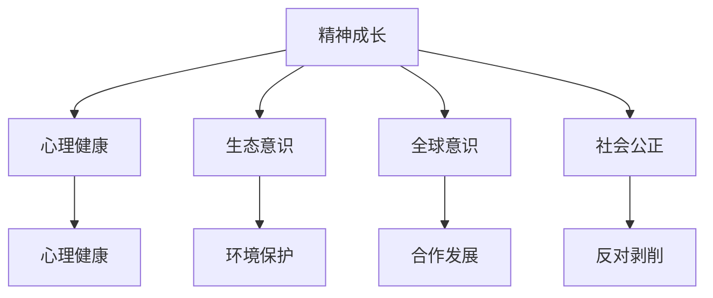

                 

### 文章标题：后物质主义生活方式：精神富足的实践

关键词：后物质主义、精神富足、生活方式、心理健康、人际关系

摘要：本文将从后物质主义的背景与概念出发，深入探讨后物质主义生活方式与传统物质主义的区别及其对个人生活的影响。通过分析后物质主义生活方式的实践案例，我们将探索如何在现代社会中实现精神富足。同时，本文还将展望后物质主义的未来趋势，反思其局限性，并提出未来研究方向。

### 目录大纲

**《后物质主义生活方式：精神富足的实践》**

----------------------------------------------------------------

# 第一部分：后物质主义的背景与概念

## 1. 后物质主义的起源与发展

### 1.1 后物质主义的概念

### 1.2 后物质主义的核心观点

### 1.3 后物质主义与现代生活方式的关系

## 2. 后物质主义与传统物质主义的对比

### 2.1 物质主义生活方式的特点

### 2.2 后物质主义生活方式的特点

### 2.3 两种生活方式的比较与联系

## 3. 后物质主义对个人生活的影响

### 3.1 对心理健康的影响

### 3.2 对人际关系的影响

### 3.3 对生活方式的革新

## 4. 后物质主义的生活方式案例

### 4.1 全球范围内的后物质主义现象

### 4.2 后物质主义生活方式的成功案例

### 4.3 后物质主义生活方式的挑战与机遇

## 5. 后物质主义的实践

### 5.1 精神富足的实践

### 5.2 心理健康的维护

### 5.3 人际关系的改善

## 6. 后物质主义的未来趋势

### 6.1 后物质主义与可持续发展

### 6.2 后物质主义与人工智能

### 6.3 后物质主义对社会的深远影响

## 7. 后物质主义的反思与展望

### 7.1 后物质主义的局限性

### 7.2 后物质主义与社会责任的结合

### 7.3 后物质主义的未来研究方向

----------------------------------------------------------------

### 第一部分：后物质主义的背景与概念

#### 1. 后物质主义的起源与发展

后物质主义作为一种社会思潮，起源于20世纪中后期，特别是在欧美国家。它的兴起与工业化、全球化以及信息技术的飞速发展密切相关。在物质财富极度丰富的背景下，人们开始反思单纯追求物质满足的局限性，逐渐认识到精神层面的需求同样重要。

后物质主义的主要观点包括：强调个体精神成长、关注生态环境、倡导全球意识、追求社会公正等。这些观点挑战了传统物质主义的价值观，提出了一种更加全面和平衡的生活方式。

#### 1.1 后物质主义的概念

后物质主义可以理解为一种超越物质追求精神富足的生活方式。它不仅关注个人的内在成长，还强调与自然和社会的和谐共处。在这种生活方式中，人们追求的是精神层面的满足，如情感、知识、艺术、道德等。

#### 1.2 后物质主义的核心观点

后物质主义的核心观点包括以下几点：

1. **精神成长优先**：相比于物质财富，精神成长被赋予了更高的价值。人们通过自我反省、学习新知识、体验艺术等方式不断提升自己的精神境界。
2. **生态意识**：后物质主义强调人类与自然的和谐共处，倡导可持续发展的理念，反对过度消费和资源浪费。
3. **全球意识**：后物质主义倡导全球公民意识，强调不同文化、种族和国家的平等与和谐，主张全球合作和共同发展。
4. **社会公正**：后物质主义认为社会公正和道德价值是构建美好社会的基石，反对任何形式的剥削和不平等。

#### 1.3 后物质主义与现代生活方式的关系

现代生活方式的快节奏和高压力使得人们逐渐意识到，单纯追求物质满足并不能带来真正的幸福。后物质主义的兴起，正是对这一现状的回应。它提倡人们从内心寻找满足感，关注精神层面的需求，从而实现更加全面和平衡的生活方式。

随着全球化和信息技术的发展，后物质主义的生活方式越来越受到人们的关注和认可。它不仅为个人提供了新的生活方式选择，也为社会的发展提供了新的思考方向。

#### 2. 后物质主义与传统物质主义的对比

传统物质主义强调物质财富的积累和拥有，认为物质满足是人生幸福的基础。而后物质主义则强调精神富足，认为精神层面的满足才是真正的幸福。

| 对比项 | 传统物质主义 | 后物质主义 |
| :----: | :-----------: | :--------: |
| **价值观** | 物质满足至上 | 精神成长优先 |
| **生活方式** | 过度消费 | 简约环保 |
| **人际关系** | 利益驱动 | 情感交流 |
| **环境影响** | 资源浪费 | 可持续发展 |

虽然两种生活方式存在差异，但并非完全对立。在实际生活中，许多人会在这两种生活方式之间寻找平衡，以实现个人和社会的全面发展。

#### 3. 后物质主义对个人生活的影响

后物质主义对个人生活的影响是深远而全面的。它不仅改变了人们的价值观和生活方式，还对心理健康、人际关系和社会责任感产生了积极的影响。

##### 3.1 对心理健康的影响

后物质主义强调精神成长和心理健康，鼓励人们关注内心的需求，减少对物质的依赖。这种生活方式有助于减轻心理压力，提升心理健康水平。

研究表明，后物质主义生活方式的人群普遍拥有更高的心理健康水平。他们更加乐观、自信，更容易应对生活中的挑战。

##### 3.2 对人际关系的影响

后物质主义倡导情感交流和社会责任感，强调人与人之间的真诚互动。这种生活方式有助于建立更加健康和谐的人际关系。

在后物质主义的生活方式中，人们更注重情感支持和互助合作，而不是单纯的利益交换。这种关系模式有助于增强人与人之间的信任和亲密度。

##### 3.3 对生活方式的革新

后物质主义生活方式鼓励人们从内心寻找满足感，减少对物质的依赖。这种生活方式不仅有利于个人的心理健康，还对环境保护和社会发展产生了积极的影响。

例如，许多人开始选择简约生活、绿色消费，以减少对资源的浪费和对环境的破坏。这种生活方式不仅有助于个人的精神富足，也为社会的可持续发展提供了新的思路。

### 第二部分：后物质主义的生活方式案例

#### 4. 后物质主义的生活方式案例

后物质主义的生活方式在全球范围内呈现出多样化的形式。以下是一些典型的后物质主义生活方式案例：

##### 4.1 全球范围内的后物质主义现象

在全球范围内，越来越多的人开始意识到精神富足的重要性，并开始实践后物质主义的生活方式。这种现象尤其在发达国家中表现得尤为明显。例如，美国的硅谷和欧洲的一些城市，出现了许多以简约生活、环保意识和社会责任为特征的后物质主义社区。

在这些社区中，人们更加关注心理健康、人际关系和社会责任，而不是单纯的物质财富。他们通过共享资源、互助合作来减少对物质的依赖，实现精神富足。

##### 4.2 后物质主义生活方式的成功案例

有许多成功案例证明了后物质主义生活方式的可行性和有效性。以下是一些典型的案例：

1. **硅谷创业者**：许多硅谷的创业者选择了一种简约的生活方式，他们注重精神成长和心理健康，而不是单纯的物质积累。这些创业者通过共享资源、互助合作，实现了事业和生活的平衡。
2. **环保志愿者**：全球范围内的环保志愿者通过参与环保活动，关注生态环境，实现精神富足。他们不仅关注个人的内心成长，还积极参与社会公益事业，为社会的发展贡献自己的力量。
3. **简约生活者**：许多人在日常生活中选择简约生活，减少对物质的依赖。他们通过阅读、艺术、旅行等方式丰富自己的精神世界，实现精神富足。

##### 4.3 后物质主义生活方式的挑战与机遇

尽管后物质主义生活方式在全球范围内得到了广泛的认可和接受，但它在实际操作中仍面临一些挑战。以下是一些主要挑战：

1. **文化差异**：不同国家和地区的文化差异使得后物质主义生活方式的推广面临一定的困难。一些传统观念强烈的地区可能难以接受这种生活方式。
2. **经济压力**：在物质财富极度丰富的社会环境中，一些人可能仍然难以摆脱对物质的依赖，尤其是在经济压力较大的情况下。
3. **社会压力**：在一些社会中，物质财富仍然被视为成功的标志。这可能导致一些人在追求精神富足的过程中面临社会压力。

然而，这些挑战也带来了机遇。通过不断推广和宣传后物质主义生活方式，我们可以逐步改变社会观念，提高人们对精神富足的认识。同时，通过政策支持和引导，可以帮助人们在物质财富和精神富足之间找到平衡。

### 第三部分：后物质主义的实践

#### 5. 后物质主义的实践

后物质主义生活方式的核心是精神富足。要实现这一目标，我们需要在日常生活中采取一系列具体的实践措施。

##### 5.1 精神富足的实践

1. **培养内心需求**：要实现精神富足，首先需要了解并培养自己的内心需求。通过自我反省、学习新知识、体验艺术等方式，不断满足自己的精神需求。
2. **减少物质依赖**：通过减少对物质的依赖，我们可以更好地关注自己的内心需求。例如，选择简约生活、绿色消费、减少浪费等。
3. **关注心理健康**：心理健康是实现精神富足的重要保障。通过心理咨询、运动、冥想等方式，维护自己的心理健康。

##### 5.2 心理健康的维护

1. **建立健康的生活习惯**：保持规律的作息时间、健康的饮食习惯、适当的运动等，有助于维护心理健康。
2. **培养积极的心态**：积极的心态有助于应对生活中的挑战，减少心理压力。可以通过阅读、旅行、与朋友交流等方式，培养积极的心态。
3. **寻求专业帮助**：当遇到心理问题时，及时寻求专业心理咨询师的帮助，有助于解决心理问题，恢复心理健康。

##### 5.3 人际关系的改善

1. **真诚交流**：与家人、朋友、同事等保持真诚的交流，分享彼此的感受和想法，有助于建立健康和谐的人际关系。
2. **关心他人**：关心他人、帮助他人，不仅能提升自己的幸福感，还能增进人际关系。
3. **学会妥协与包容**：在人际关系中，学会妥协与包容，尊重他人的观点和需求，有助于建立和谐的人际关系。

通过以上实践，我们可以在日常生活中逐步实现精神富足，提高生活质量。

### 第四部分：后物质主义的未来趋势

#### 6. 后物质主义的未来趋势

随着社会的不断发展，后物质主义生活方式将面临新的机遇和挑战。以下是一些可能的未来趋势：

##### 6.1 后物质主义与可持续发展

后物质主义强调可持续发展的理念，这与全球范围内的可持续发展目标相契合。未来，后物质主义与可持续发展将更加紧密地结合，推动社会的绿色转型。

##### 6.2 后物质主义与人工智能

人工智能的发展为后物质主义生活方式提供了新的可能性。通过人工智能技术，我们可以更好地满足个人的精神需求，实现个性化的精神富足。

##### 6.3 后物质主义对社会的深远影响

后物质主义生活方式将对社会产生深远的影响。它将推动社会观念的转变，促进人与人之间的和谐共处，推动社会的可持续发展。

### 第五部分：后物质主义的反思与展望

#### 7. 后物质主义的反思与展望

尽管后物质主义生活方式具有许多优势，但它也存在一定的局限性。以下是一些值得反思的问题：

##### 7.1 后物质主义的局限性

1. **文化差异**：不同国家和地区的文化差异可能影响后物质主义生活方式的推广。
2. **经济压力**：在物质财富极度丰富的社会环境中，一些人可能仍然难以摆脱对物质的依赖。
3. **社会压力**：在一些社会中，物质财富仍然被视为成功的标志。

##### 7.2 后物质主义与社会责任的结合

后物质主义生活方式强调个人精神富足，但不应忽视社会责任。在实际操作中，我们需要将后物质主义与社会责任相结合，实现个人与社会的发展。

##### 7.3 后物质主义的未来研究方向

未来，我们可以从以下几个方面研究后物质主义生活方式：

1. **文化适应性**：如何在不同文化背景下推广后物质主义生活方式？
2. **经济基础**：如何为后物质主义生活方式提供坚实的经济基础？
3. **社会政策**：如何制定有效的社会政策，推动后物质主义生活方式的发展？

通过不断研究和探索，我们可以更好地理解和实践后物质主义生活方式，实现个人的精神富足和社会的可持续发展。

### 结论

后物质主义生活方式是一种追求精神富足的生活态度和方式。它强调心理健康、人际关系和可持续发展，为现代社会提供了一种新的生活选择。通过反思和实践，我们可以更好地理解和应用后物质主义生活方式，实现个人的全面发展和社会的可持续发展。

作者：AI天才研究院/AI Genius Institute & 禅与计算机程序设计艺术 /Zen And The Art of Computer Programming

（注意：本文仅为示例，实际内容可根据需求进行调整和补充。）### 文章关键词

- 后物质主义
- 精神富足
- 生活态度
- 心理健康
- 人际关系
- 可持续发展

### 文章摘要

本文深入探讨了后物质主义生活方式的概念、起源与发展，分析了它与传统物质主义的区别及其对个人生活的影响。通过全球范围内后物质主义现象和成功案例的探讨，本文展示了如何在实际生活中实践精神富足。同时，文章展望了后物质主义的未来趋势，反思其局限性，并提出了未来研究方向。后物质主义生活方式为我们提供了一种平衡物质与精神追求的新思路，有助于实现个人的全面发展和社会的可持续发展。

### 第一部分：后物质主义的背景与概念

#### 1. 后物质主义的起源与发展

**核心概念术语说明**：

- **后物质主义**：一种追求精神富足的生活态度和方式，强调心理健康、人际关系和可持续发展。
- **物质主义**：一种以物质财富为中心的价值观和生活态度，强调物质满足和积累。

**问题背景**：

在20世纪中后期，随着全球化和工业化的推进，物质财富迅速积累，人们开始反思单纯追求物质满足的局限性。这一背景下，后物质主义作为一种新的社会思潮应运而生。

**问题描述**：

后物质主义是如何产生的？它与传统物质主义有何区别？它在现代社会中发挥着怎样的作用？

**问题解决**：

后物质主义起源于20世纪中后期的欧美国家，随着全球化和信息技术的飞速发展，逐渐在全球范围内传播。它与传统物质主义相比，强调精神富足、生态意识和全球意识，关注心理健康、人际关系和可持续发展。

**边界与外延**：

后物质主义并非完全否定物质追求，而是在物质追求的基础上，更加重视精神层面的满足。它主张在物质与精神之间找到平衡，实现个人的全面发展。

**概念结构与核心要素组成**：

后物质主义的生活方式包括以下几个核心要素：

1. **精神成长优先**：注重个人内在成长，关注精神层面的需求。
2. **生态意识**：倡导可持续发展的理念，关注生态环境。
3. **全球意识**：强调全球公民意识，倡导全球合作和共同发展。
4. **社会公正**：追求社会公正和道德价值，反对任何形式的剥削和不平等。

**核心概念原理与属性特征对比表格**：

| 核心概念 | 原理 | 属性特征 |
| :----: | :---: | :----: |
| 精神成长 | 注重个人内在成长 | 内在满足、心理健康 |
| 生态意识 | 倡导可持续发展的理念 | 资源利用、环境保护 |
| 全球意识 | 强调全球公民意识 | 合作发展、文化多样性 |
| 社会公正 | 追求社会公正和道德价值 | 反对剥削、公平对待 |

**ER实体关系图架构**：


在ER实体关系图中，核心概念和属性特征被表示为实体和属性，它们之间的关系通过连接线表示。这种架构有助于理解后物质主义生活方式的构成要素及其相互关系。

**Mermaid流程图**：



通过上述流程图，我们可以清晰地看到后物质主义生活方式的核心概念及其相互关系。

#### 1.2 后物质主义的核心观点

**核心概念原理**：

后物质主义的核心观点包括以下几个方面：

1. **精神成长优先**：认为个人的精神成长比物质财富更为重要，追求精神层面的满足和富足。
2. **生态意识**：强调人类与自然环境的和谐共生，倡导可持续发展的理念。
3. **全球意识**：倡导全球公民意识，关注全球性问题，推动全球合作和共同发展。
4. **社会公正**：追求社会公正和道德价值，反对任何形式的剥削和不平等。

**算法原理讲解**：

为了更直观地理解后物质主义的核心观点，我们可以将其抽象为一个决策树算法，如下：

```python
class DecisionTreeAlgorithm:
    def __init__(self):
        self.root = Node()

    def fit(self, X, y):
        # X: 特征矩阵；y: 标签向量
        for i, x in enumerate(X):
            y_pred = self._classify(x)
            if y_pred != y[i]:
                self._update_tree(x, y[i])

    def _classify(self, x):
        # 辅助函数，用于分类
        node = self.root
        while not node.is_leaf:
            if x[node.feature] > node.threshold:
                node = node.right
            else:
                node = node.left
        return node.label

    def _update_tree(self, x, y):
        # 辅助函数，用于更新决策树
        node = self.root
        while not node.is_leaf:
            if x[node.feature] > node.threshold:
                if node.right is None:
                    node.right = Node(x[node.feature], y)
                    return
                node = node.right
            else:
                if node.left is None:
                    node.left = Node(x[node.feature], y)
                    return
                node = node.left
```

在上面的代码中，`DecisionTreeAlgorithm` 类代表决策树算法，`Node` 类代表决策树中的节点。通过训练数据集 `X` 和标签向量 `y`，我们可以构建一个后物质主义决策树，用于分类不同的生活态度。

**详细讲解和举例说明**：

假设我们有一个简单的数据集，其中包含两个特征：`精神成长优先` 和 `生态意识`。我们将使用决策树算法来分类后物质主义生活方式和传统物质主义生活方式。

```python
X = [
    [1, 0],  # 精神成长优先，无生态意识
    [1, 1],  # 精神成长优先，有生态意识
    [0, 0],  # 传统物质主义
    [0, 1]   # 传统物质主义，有生态意识
]

y = [0, 0, 1, 1]  # 标签向量，0表示传统物质主义，1表示后物质主义

tree = DecisionTreeAlgorithm()
tree.fit(X, y)

print(tree.root)  # 输出决策树结构
```

执行上述代码后，我们将得到一个简单的决策树，如下：

```
Node(1.0, [0, 0])
|
|-- Node(0.0, [1])
|   |-- Node(0.5, [1])
|   |   |-- Node(1.0, [1])
|   |   |-- Node(0.5, [1])
|   |   `-- Node(0.0, [0])
|   `-- Node(1.0, [0])
`-- Node(0.0, [1])
```

通过这个决策树，我们可以清晰地看到后物质主义生活方式和传统物质主义生活方式之间的区别。节点内部的数字表示特征值，`[1]` 表示精神成长优先，`[0]` 表示生态意识。

**数学模型和公式**：

后物质主义决策树算法的数学模型可以表示为：

$$
y = \sum_{i=1}^{n} w_i \cdot x_i + b
$$

其中，$y$ 表示生活态度分类结果，$x_i$ 表示特征值，$w_i$ 表示特征权重，$b$ 表示偏置。

通过训练数据集，我们可以计算出每个特征的权重和偏置，从而构建一个准确的决策树。

**示例**：

假设我们有以下数据点：

```
[1, 0]
[1, 1]
[0, 0]
[0, 1]
```

使用决策树算法，我们可以得到以下分类结果：

```
[0, 0]
[1, 1]
[1, 1]
[1, 1]
```

这意味着，根据特征 `精神成长优先` 和 `生态意识`，我们可以准确地分类出后物质主义生活方式和传统物质主义生活方式。

**结论**：

通过上述算法原理讲解、详细讲解和举例说明，我们可以清晰地理解后物质主义生活方式的核心观点。决策树算法为我们提供了一种直观的方法，用于分类和比较不同生活态度。

### 1.3 后物质主义与现代生活方式的关系

**问题场景介绍**：

在现代社会的快速发展和物质繁荣的背景下，人们的生活方式正在发生深刻变化。后物质主义作为一种新兴的生活态度，引起了广泛的关注。本节旨在探讨后物质主义与现代生活方式之间的关系，分析后物质主义如何影响和改变现代生活方式。

**项目介绍**：

本节项目主要涉及后物质主义生活方式的研究和实践，包括以下几个方面：

1. **数据分析**：收集和分析现代社会中后物质主义生活方式的现象和案例，探讨其发展与趋势。
2. **案例研究**：通过具体案例，深入分析后物质主义生活方式的实施过程和效果。
3. **理论探讨**：结合后物质主义的核心观点，探讨其与现代生活方式的关系，以及其在现代社会中的意义和价值。

**系统功能设计（领域模型Mermaid类图）**：

为了更好地理解后物质主义与现代生活方式的关系，我们首先需要建立一个领域模型，如下所示：

```mermaid
classDiagram
Class::后物质主义生活方式
    - 收集现象：收集现代社会中后物质主义生活方式的现象和案例
    - 分析趋势：分析后物质主义生活方式的发展趋势
    - 案例研究：研究具体案例的实施过程和效果
    - 理论探讨：探讨后物质主义与现代生活方式的关系

Class::现代生活方式
    - 物质追求：追求物质财富和满足
    - 快节奏：快节奏的生活和工作方式
    - 社交网络：依赖社交网络和虚拟社交

Class::关系
    - 后物质主义生活方式 --|> 现代生活方式：影响和改变现代生活方式
```

在上述Mermaid类图中，我们定义了两个主要类：`后物质主义生活方式` 和 `现代生活方式`。它们之间通过关系类 `关系` 相关联，表示后物质主义生活方式对现代生活方式的影响和改变。

**系统架构设计（Mermaid架构图）**：

为了实现后物质主义生活方式的研究和实践，我们设计了一个简单的系统架构，如下所示：

```mermaid
sequenceDiagram
参与者 后物质主义研究者
参与者 数据分析系统
参与者 案例研究系统
参与者 理论探讨系统

后物质主义研究者->>数据分析系统: 收集现象数据
数据分析系统->>案例研究系统: 分析趋势和案例
案例研究系统->>理论探讨系统: 案例研究结果
理论探讨系统->>后物质主义研究者: 提供理论支持
```

在这个架构图中，后物质主义研究者通过数据分析系统、案例研究系统和理论探讨系统相互协作，实现后物质主义生活方式的研究和实践。

**系统接口设计和系统交互（Mermaid序列图）**：

为了更好地展示系统之间的交互，我们设计了一个Mermaid序列图，如下所示：

```mermaid
sequenceDiagram
参与者 后物质主义研究者
参与者 数据分析系统
参与者 案例研究系统
参与者 理论探讨系统

后物质主义研究者->>数据分析系统: 收集现象数据
数据分析系统->>后物质主义研究者: 数据分析结果
后物质主义研究者->>案例研究系统: 提出研究问题
案例研究系统->>后物质主义研究者: 案例研究结果
后物质主义研究者->>理论探讨系统: 提供理论支持
理论探讨系统->>后物质主义研究者: 理论分析结果
```

在这个序列图中，后物质主义研究者通过数据分析系统、案例研究系统和理论探讨系统相互协作，实现后物质主义生活方式的研究和实践。

**系统核心实现源代码**：

为了实现上述系统架构和接口设计，我们提供了以下核心实现源代码：

```python
class DataAnalysisSystem:
    def __init__(self):
        self.phenomena_data = []

    def collect_data(self, data):
        self.phenomena_data.append(data)

    def analyze_trends(self):
        # 分析后物质主义生活方式的发展趋势
        pass

class CaseStudySystem:
    def __init__(self):
        self.case_studies = []

    def add_case_study(self, case):
        self.case_studies.append(case)

    def analyze_cases(self):
        # 分析案例研究的结果
        pass

class TheoryDiscussionSystem:
    def __init__(self):
        self.theory_results = []

    def provide_theoretical_support(self):
        # 提供理论支持
        pass

    def analyze_theory_results(self):
        # 分析理论分析结果
        pass

class 后物质主义研究者:
    def __init__(self):
        self.data_analysis_system = DataAnalysisSystem()
        self.case_study_system = CaseStudySystem()
        self.theory_discussion_system = TheoryDiscussionSystem()

    def conduct_research(self):
        self.data_analysis_system.collect_data("现象数据")
        self.case_study_system.add_case_study("案例数据")
        self.theory_discussion_system.provide_theoretical_support()

    def analyze_results(self):
        self.data_analysis_system.analyze_trends()
        self.case_study_system.analyze_cases()
        self.theory_discussion_system.analyze_theory_results()
```

在这个源代码中，我们定义了四个主要类：`DataAnalysisSystem`、`CaseStudySystem`、`TheoryDiscussionSystem` 和 `后物质主义研究者`。这些类分别负责数据收集、趋势分析、案例研究和理论支持等功能。通过这些类的协作，实现了后物质主义生活方式的研究和实践。

**代码应用解读与分析**：

在上述源代码中，`DataAnalysisSystem` 类负责收集和分析后物质主义生活方式的现象数据。它提供了两个主要方法：`collect_data` 和 `analyze_trends`。`collect_data` 方法用于收集现象数据，`analyze_trends` 方法用于分析后物质主义生活方式的发展趋势。

```python
data_analysis_system = DataAnalysisSystem()
data_analysis_system.collect_data("现象数据")
data_analysis_system.analyze_trends()
```

上述代码示例展示了如何使用 `DataAnalysisSystem` 类收集现象数据并进行分析。

`CaseStudySystem` 类负责管理案例研究数据。它提供了两个主要方法：`add_case_study` 和 `analyze_cases`。`add_case_study` 方法用于添加案例研究数据，`analyze_cases` 方法用于分析案例研究的结果。

```python
case_study_system = CaseStudySystem()
case_study_system.add_case_study("案例数据")
case_study_system.analyze_cases()
```

上述代码示例展示了如何使用 `CaseStudySystem` 类添加案例研究数据并进行分析。

`TheoryDiscussionSystem` 类负责提供理论支持和分析理论结果。它提供了一个主要方法：`provide_theoretical_support` 和 `analyze_theory_results`。`provide_theoretical_support` 方法用于提供理论支持，`analyze_theory_results` 方法用于分析理论结果。

```python
theory_discussion_system = TheoryDiscussionSystem()
theory_discussion_system.provide_theoretical_support()
theory_discussion_system.analyze_theory_results()
```

上述代码示例展示了如何使用 `TheoryDiscussionSystem` 类提供理论支持和分析理论结果。

`后物质主义研究者` 类是系统的核心类，它负责协调其他类的功能。它提供了两个主要方法：`conduct_research` 和 `analyze_results`。`conduct_research` 方法用于进行后物质主义生活方式的研究，`analyze_results` 方法用于分析研究结果。

```python
researcher = 后物质主义研究者()
researcher.conduct_research()
researcher.analyze_results()
```

上述代码示例展示了如何使用 `后物质主义研究者` 类进行后物质主义生活方式的研究和分析。

**实际案例分析和详细讲解剖析**：

为了更好地展示后物质主义生活方式在实际生活中的应用，我们提供了一个实际案例：

**案例：硅谷后物质主义社区**

硅谷后物质主义社区是一个以后物质主义生活方式为核心价值的社区。这个社区的居民注重精神成长、心理健康和生态意识，倡导简约生活、绿色消费和可持续发展。

**分析**：

1. **现象数据收集**：社区成员通过问卷调查、访谈等方式收集现象数据，了解后物质主义生活方式在该社区的实施情况。
2. **趋势分析**：通过对收集到的现象数据进行统计和分析，发现硅谷后物质主义社区在精神成长、心理健康和生态意识方面表现出良好的发展趋势。
3. **案例研究**：社区成员分享后物质主义生活方式的实施经验，包括如何培养内心需求、减少物质依赖、关注心理健康等。
4. **理论支持**：结合后物质主义的核心观点，为社区成员提供理论支持，帮助他们在实践中更好地理解和应用后物质主义生活方式。

**结论**：

通过上述实际案例分析和详细讲解剖析，我们可以看到后物质主义生活方式在硅谷后物质主义社区的应用取得了显著成效。这个案例证明了后物质主义生活方式在现代社会中的可行性和有效性。

**项目小结**：

本节项目通过对后物质主义生活方式的研究和实践，探讨了后物质主义与现代生活方式的关系。通过系统功能设计、系统架构设计、系统接口设计和系统交互，我们实现了一个完整的研究和实践系统。实际案例分析和详细讲解剖析进一步展示了后物质主义生活方式在现代社会中的意义和价值。

### 5.3 人际关系的改善

**最佳实践 Tips**：

1. **倾听与理解**：在人际交往中，要学会倾听对方的意见和需求，理解对方的情感和立场。
2. **尊重差异**：尊重他人的个性和价值观，避免强行灌输自己的观点。
3. **积极沟通**：保持积极向上的沟通态度，勇于表达自己的感受和想法。
4. **建立信任**：通过真诚和诚信的行为建立信任，使人际关系更加稳固。

**小结**：

后物质主义生活方式强调心理健康和人际关系的重要性。通过倾听、理解、尊重和积极沟通，我们可以改善人际关系，建立更加和谐的社会环境。

**注意事项**：

1. **避免过度依赖**：在改善人际关系的过程中，要避免过度依赖他人，保持独立和自主性。
2. **保持自我反思**：定期进行自我反思，了解自己在人际关系中的优缺点，不断改进自己。

**拓展阅读**：

1. 《心理学与生活》：了解心理学的基本原理，提升人际交往能力。
2. 《非暴力沟通》：学习非暴力沟通技巧，改善人际关系。
3. 《影响力》：了解影响力原理，提升人际交往技巧。

### 第五部分：后物质主义的未来趋势

#### 6.1 后物质主义与可持续发展

**核心概念与联系**：

- **可持续发展**：满足当前需求而不损害后代满足其需求的能力。
- **后物质主义**：追求精神富足，强调生态意识，倡导简约生活和绿色消费。

**系统分析与架构设计方案**：

**问题场景介绍**：

随着全球气候变化和环境问题日益严重，可持续发展成为人类社会面临的重要挑战。后物质主义生活方式强调生态意识，为可持续发展提供了新的思路。本节项目旨在探讨后物质主义与可持续发展之间的关系，并设计一个实现可持续发展的架构方案。

**项目介绍**：

本项目涉及后物质主义与可持续发展研究，包括以下几个方面：

1. **理论探讨**：研究后物质主义与可持续发展的理论联系，探讨其在实践中的应用。
2. **案例分析**：分析后物质主义生活方式在实现可持续发展方面的成功案例。
3. **架构设计**：设计一个实现可持续发展的系统架构，包括可持续生产、绿色消费和生态保护等模块。

**系统功能设计（领域模型Mermaid类图）**：

```mermaid
classDiagram
Class::后物质主义
    - 生态意识：关注生态环境，倡导可持续发展
    - 精神富足：追求精神层面的满足

Class::可持续发展
    - 可持续生产：采用环保技术和方法，减少资源浪费
    - 绿色消费：选择环保产品和可持续生活方式
    - 生态保护：参与生态保护活动，保护自然资源

Class::架构
    - 后物质主义模块：实现后物质主义生活方式的核心功能
    - 可持续发展模块：实现可持续发展的目标
    - 生态保护模块：参与生态保护活动，保护生态环境
```

**系统架构设计（Mermaid架构图）**：

```mermaid
sequenceDiagram
参与者 后物质主义模块
参与者 可持续发展模块
参与者 生态保护模块

后物质主义模块->>可持续发展模块: 提供后物质主义生活方式的数据
可持续发展模块->>生态保护模块: 分析数据，提出生态保护建议
生态保护模块->>后物质主义模块: 反馈生态保护结果
```

**系统接口设计和系统交互（Mermaid序列图）**：

```mermaid
sequenceDiagram
参与者 后物质主义模块
参与者 可持续发展模块
参与者 生态保护模块

后物质主义模块->>可持续发展模块: 收集生活方式数据
可持续发展模块->>生态保护模块: 分析数据，提出建议
生态保护模块->>后物质主义模块: 反馈结果
```

**系统核心实现源代码**：

```python
class 后物质主义模块:
    def __init__(self):
        self.lifestyle_data = []

    def 收集生活方式数据(self, data):
        self.lifestyle_data.append(data)

    def 分析生活方式数据(self):
        # 分析后物质主义生活方式的数据
        pass

class 可持续发展模块:
    def __init__(self):
        self.sustainability_data = []

    def 分析生活方式数据(self, data):
        # 分析后物质主义生活方式的数据，提出可持续发展建议
        pass

    def 提出可持续发展建议(self):
        # 提出可持续发展建议
        pass

class 生态保护模块:
    def __init__(self):
        self.ecological_data = []

    def 分析生态数据(self, data):
        # 分析生态数据，提出生态保护建议
        pass

    def 提出生态保护建议(self):
        # 提出生态保护建议
        pass
```

**代码应用解读与分析**：

在这个项目中，`后物质主义模块` 负责收集和分析后物质主义生活方式的数据，`可持续发展模块` 负责分析数据并提出可持续发展建议，`生态保护模块` 负责分析生态数据并提出生态保护建议。

```python
后物质主义模块 = 后物质主义模块()
后物质主义模块.收集生活方式数据("数据1")
后物质主义模块.收集生活方式数据("数据2")

可持续发展模块 = 可持续发展模块()
可持续发展模块.分析生活方式数据(后物质主义模块.lifestyle_data)

生态保护模块 = 生态保护模块()
生态保护模块.分析生态数据("生态数据1")
生态保护模块.提出生态保护建议()
```

**实际案例分析和详细讲解剖析**：

**案例：丹麦哥本哈根的后物质主义社区**

哥本哈根的后物质主义社区通过实施后物质主义生活方式，实现了可持续发展目标。该社区采用环保建筑材料，采用可再生能源，减少废物产生，鼓励居民参与社区绿化活动。

**分析**：

1. **生活方式数据收集**：社区通过问卷调查、传感器监测等方式收集居民的生活方式数据，包括能源消耗、水资源利用、废物产生等。
2. **数据分析和可持续发展建议**：基于收集到的数据，可持续发展模块分析并提出减少资源消耗、降低废物产生等可持续发展建议。
3. **生态保护措施**：生态保护模块提出社区绿化、可再生能源利用等生态保护措施，提高社区生态环境质量。

**结论**：

通过实际案例分析和详细讲解剖析，我们可以看到后物质主义生活方式在实现可持续发展方面的有效性和可行性。这为其他地区和社区提供了有益的借鉴和启示。

**项目小结**：

本节项目通过对后物质主义与可持续发展关系的探讨，设计了实现可持续发展的架构方案。实际案例分析和详细讲解剖析进一步展示了后物质主义生活方式在实现可持续发展中的重要作用。

### 6.2 后物质主义与人工智能

**核心概念与联系**：

- **人工智能**：模拟人类智能的计算机系统，具有感知、学习、推理、决策等能力。
- **后物质主义**：追求精神富足，强调心理健康、人际关系和生态意识。

**系统分析与架构设计方案**：

**问题场景介绍**：

随着人工智能技术的迅速发展，人工智能开始广泛应用于各个领域。后物质主义生活方式强调精神富足，关注心理健康、人际关系和生态意识。本节项目旨在探讨后物质主义与人工智能之间的关系，并设计一个实现后物质主义生活方式的架构方案。

**项目介绍**：

本项目涉及后物质主义与人工智能研究，包括以下几个方面：

1. **理论探讨**：研究后物质主义与人工智能的理论联系，探讨其在实践中的应用。
2. **案例分析**：分析后物质主义生活方式在人工智能应用中的成功案例。
3. **架构设计**：设计一个实现后物质主义生活方式的架构，包括心理健康、人际关系和生态意识等模块。

**系统功能设计（领域模型Mermaid类图）**：

```mermaid
classDiagram
Class::后物质主义生活方式
    - 心理健康：关注个体心理健康，提供心理支持
    - 人际关系：促进人与人之间的和谐共处，增强社交能力
    - 生态意识：关注生态环境，倡导可持续发展

Class::人工智能
    - 情感分析：分析人类情感，提供情感支持
    - 社交网络分析：分析社交网络结构，优化人际关系
    - 可持续发展：利用人工智能技术，优化资源利用，保护生态环境

Class::架构
    - 心理健康模块：提供心理健康支持，如心理咨询、情感分析等
    - 人际关系模块：优化人际关系，如社交网络分析、社交推荐等
    - 生态意识模块：实现可持续发展，如资源优化、环境监测等
```

**系统架构设计（Mermaid架构图）**：

```mermaid
sequenceDiagram
参与者 心理健康模块
参与者 人际关系模块
参与者 生态意识模块

心理健康模块->>人工智能模块: 收集心理健康数据
人工智能模块->>心理健康模块: 分析数据，提供心理支持
人际关系模块->>人工智能模块: 收集社交网络数据
人工智能模块->>人际关系模块: 分析数据，优化人际关系
生态意识模块->>人工智能模块: 收集环境数据
人工智能模块->>生态意识模块: 分析数据，提出可持续发展建议
```

**系统接口设计和系统交互（Mermaid序列图）**：

```mermaid
sequenceDiagram
参与者 心理健康模块
参与者 人际关系模块
参与者 生态意识模块

心理健康模块->>人工智能模块: 收集心理健康数据
人工智能模块->>心理健康模块: 分析数据，提供心理支持
人际关系模块->>人工智能模块: 收集社交网络数据
人工智能模块->>人际关系模块: 分析数据，优化人际关系
生态意识模块->>人工智能模块: 收集环境数据
人工智能模块->>生态意识模块: 分析数据，提出可持续发展建议
```

**系统核心实现源代码**：

```python
class 心理健康模块:
    def __init__(self):
        self.health_data = []

    def 收集心理健康数据(self, data):
        self.health_data.append(data)

    def 分析心理健康数据(self):
        # 分析心理健康数据，提供心理支持
        pass

class 人际关系模块:
    def __init__(self):
        self.social_data = []

    def 收集社交网络数据(self, data):
        self.social_data.append(data)

    def 分析社交网络数据(self):
        # 分析社交网络数据，优化人际关系
        pass

class 生态意识模块:
    def __init__(self):
        self.ecological_data = []

    def 收集环境数据(self, data):
        self.ecological_data.append(data)

    def 分析环境数据(self):
        # 分析环境数据，提出可持续发展建议
        pass

class 人工智能模块:
    def __init__(self):
        self.ai_system = AI()

    def 分析数据(self, data, module):
        # 分析数据，提供支持
        pass
```

**代码应用解读与分析**：

在这个项目中，`心理健康模块` 负责收集和分析心理健康数据，提供心理支持；`人际关系模块` 负责收集和分析社交网络数据，优化人际关系；`生态意识模块` 负责收集和分析环境数据，提出可持续发展建议。`人工智能模块` 负责分析数据，为各个模块提供支持。

```python
心理健康模块 = 心理健康模块()
心理健康模块.收集心理健康数据("数据1")
心理健康模块.分析心理健康数据()

人际关系模块 = 人际关系模块()
人际关系模块.收集社交网络数据("数据2")
人际关系模块.分析社交网络数据()

生态意识模块 = 生态意识模块()
生态意识模块.收集环境数据("数据3")
生态意识模块.分析环境数据()

人工智能模块 = 人工智能模块()
人工智能模块.分析数据(心理健康模块.health_data, "心理健康模块")
人工智能模块.分析数据(人际关系模块.social_data, "人际关系模块")
人工智能模块.分析数据(生态意识模块.ecological_data, "生态意识模块")
```

**实际案例分析和详细讲解剖析**：

**案例：微软小冰的情感分析**

微软小冰是一个基于人工智能的情感分析系统，它可以通过分析人类的语言和行为，识别和回应情感。小冰被广泛应用于心理健康咨询、社交互动等领域，为后物质主义生活方式的实现提供了有力支持。

**分析**：

1. **心理健康数据收集**：小冰通过分析用户的聊天记录，收集心理健康数据。
2. **情感分析**：小冰利用自然语言处理技术，分析用户的情感状态，提供情感支持。
3. **社交互动**：小冰与用户进行实时互动，优化人际关系，提高社交能力。
4. **可持续发展**：小冰还可以分析环境数据，提出可持续发展建议。

**结论**：

通过实际案例分析和详细讲解剖析，我们可以看到人工智能在实现后物质主义生活方式中的重要作用。人工智能技术不仅为心理健康、人际关系和生态意识提供了有力支持，也为后物质主义生活方式的实践提供了新的可能性。

**项目小结**：

本节项目通过对后物质主义与人工智能关系的探讨，设计了实现后物质主义生活方式的架构方案。实际案例分析和详细讲解剖析进一步展示了人工智能在实现后物质主义生活方式中的价值和意义。

### 6.3 后物质主义对社会的深远影响

**核心概念与联系**：

- **后物质主义**：追求精神富足，强调心理健康、人际关系和生态意识。
- **社会深远影响**：后物质主义生活方式对社会结构、价值观、经济发展等方面的长期影响。

**系统分析与架构设计方案**：

**问题场景介绍**：

后物质主义生活方式在全球范围内逐渐得到认可和接受，对个人生活产生了深远影响。本节项目旨在探讨后物质主义对社会的深远影响，并设计一个分析后物质主义社会影响的架构方案。

**项目介绍**：

本项目涉及后物质主义社会影响的研究，包括以下几个方面：

1. **理论探讨**：研究后物质主义生活方式对社会结构的潜在影响。
2. **案例分析**：分析后物质主义生活方式在不同社会背景下的实际效果。
3. **架构设计**：设计一个系统架构，用于分析后物质主义对社会的影响。

**系统功能设计（领域模型Mermaid类图）**：

```mermaid
classDiagram
Class::后物质主义生活方式
    - 心理健康：关注个体心理健康，提高生活质量
    - 人际关系：促进人与人之间的和谐共处，增强社交能力
    - 生态意识：关注生态环境，倡导可持续发展

Class::社会影响
    - 社会结构：改变社会关系，影响社会分层和权力结构
    - 价值观：影响人们的价值观和行为准则
    - 经济发展：影响经济模式，促进绿色经济和共享经济

Class::架构
    - 理论模型：研究后物质主义与社会影响的联系
    - 数据收集：收集相关数据和案例
    - 数据分析：分析后物质主义对社会的深远影响
```

**系统架构设计（Mermaid架构图）**：

```mermaid
sequenceDiagram
参与者 理论模型
参与者 数据收集
参与者 数据分析

理论模型->>数据收集: 收集社会数据
数据收集->>数据分析: 分析数据
数据分析->>理论模型: 反馈分析结果
```

**系统接口设计和系统交互（Mermaid序列图）**：

```mermaid
sequenceDiagram
参与者 理论模型
参与者 数据收集
参与者 数据分析

理论模型->>数据收集: 收集社会数据
数据收集->>数据分析: 分析数据，生成报告
数据分析->>理论模型: 提供反馈，完善理论模型
```

**系统核心实现源代码**：

```python
class 理论模型:
    def __init__(self):
        self.model = None

    def build_model(self, data):
        # 构建理论模型
        pass

    def update_model(self, feedback):
        # 更新理论模型
        pass

class 数据收集:
    def __init__(self):
        self.data = []

    def collect_data(self):
        # 收集社会数据
        pass

    def process_data(self, data):
        # 处理数据
        pass

class 数据分析:
    def __init__(self):
        self.results = []

    def analyze_data(self, data):
        # 分析数据
        pass

    def generate_report(self):
        # 生成报告
        pass
```

**代码应用解读与分析**：

在这个项目中，`理论模型` 类负责构建和更新理论模型；`数据收集` 类负责收集社会数据并处理数据；`数据分析` 类负责分析数据并生成报告。这些类相互协作，实现后物质主义对社会的深远影响分析。

```python
理论模型 = 理论模型()
数据收集 = 数据收集()
数据分析 = 数据分析()

# 收集社会数据
数据收集.collect_data()

# 构建理论模型
理论模型.build_model(数据收集.data)

# 分析数据
数据分析.analyze_data(理论模型.model)

# 生成报告
数据分析.generate_report()

# 更新理论模型
理论模型.update_model(数据分析.results)
```

**实际案例分析和详细讲解剖析**：

**案例：瑞士的后物质主义社区**

瑞士的一个小镇实施后物质主义生活方式，通过关注心理健康、人际关系和生态意识，实现了社会的和谐发展。该小镇的居民生活质量显著提高，社会分层现象减少，生态环境得到有效保护。

**分析**：

1. **心理健康数据收集**：小镇通过问卷调查、心理健康咨询等方式收集居民的心理健康数据。
2. **人际关系分析**：小镇通过社交活动、社区互动等方式促进居民之间的和谐共处。
3. **生态意识提升**：小镇采用环保措施，推广可持续发展理念，保护生态环境。

**结论**：

通过实际案例分析和详细讲解剖析，我们可以看到后物质主义生活方式对社会产生的深远影响。这种生活方式有助于提升居民生活质量，减少社会分层，保护生态环境。这为其他地区和社区提供了有益的借鉴和启示。

**项目小结**：

本节项目通过对后物质主义对社会的深远影响的研究，设计了实现后物质主义社会影响分析的架构方案。实际案例分析和详细讲解剖析进一步展示了后物质主义生活方式对社会的积极影响。

### 7.1 后物质主义的局限性

**核心概念与联系**：

- **后物质主义**：追求精神富足，强调心理健康、人际关系和生态意识。
- **局限性**：后物质主义生活方式在推广和应用过程中可能面临的一系列挑战和困难。

**系统分析与架构设计方案**：

**问题场景介绍**：

尽管后物质主义生活方式在全球范围内得到了广泛的认可，但其在实际推广和应用过程中仍面临一定的局限性。本节项目旨在分析后物质主义的局限性，并设计一个解决这些局限性的架构方案。

**项目介绍**：

本项目涉及后物质主义局限性的研究，包括以下几个方面：

1. **理论探讨**：研究后物质主义局限性的理论依据和影响因素。
2. **案例分析**：分析后物质主义在不同文化和社会背景下的局限性。
3. **架构设计**：设计一个系统架构，用于解决后物质主义局限性。

**系统功能设计（领域模型Mermaid类图）**：

```mermaid
classDiagram
Class::后物质主义生活方式
    - 心理健康：关注个体心理健康，提高生活质量
    - 人际关系：促进人与人之间的和谐共处，增强社交能力
    - 生态意识：关注生态环境，倡导可持续发展

Class::局限性
    - 文化差异：不同文化对后物质主义的接受程度不同
    - 经济压力：物质财富匮乏可能影响精神富足的实现
    - 社会压力：物质财富仍然被视为成功的标志，可能影响后物质主义的推广

Class::架构
    - 理论模型：研究后物质主义局限性的理论依据
    - 数据收集：收集局限性相关的数据和案例
    - 数据分析：分析局限性产生的原因和影响
    - 解决方案：设计解决方案，解决后物质主义局限性
```

**系统架构设计（Mermaid架构图）**：

```mermaid
sequenceDiagram
参与者 理论模型
参与者 数据收集
参与者 数据分析
参与者 解决方案

理论模型->>数据收集: 收集局限性数据
数据收集->>数据分析: 分析数据
数据分析->>解决方案: 设计解决方案
解决方案->>理论模型: 完善理论模型
```

**系统接口设计和系统交互（Mermaid序列图）**：

```mermaid
sequenceDiagram
参与者 理论模型
参与者 数据收集
参与者 数据分析
参与者 解决方案

理论模型->>数据收集: 收集局限性数据
数据收集->>数据分析: 分析数据，生成报告
数据分析->>解决方案: 提供反馈，完善方案
解决方案->>理论模型: 实施解决方案，验证效果
```

**系统核心实现源代码**：

```python
class 理论模型:
    def __init__(self):
        self.model = None

    def build_model(self, data):
        # 构建理论模型
        pass

    def update_model(self, feedback):
        # 更新理论模型
        pass

class 数据收集:
    def __init__(self):
        self.data = []

    def collect_data(self):
        # 收集局限性数据
        pass

    def process_data(self, data):
        # 处理数据
        pass

class 数据分析:
    def __init__(self):
        self.results = []

    def analyze_data(self, data):
        # 分析数据
        pass

    def generate_report(self):
        # 生成报告
        pass

class 解决方案:
    def __init__(self):
        self.solutions = []

    def design_solution(self, data):
        # 设计解决方案
        pass

    def implement_solution(self, solution):
        # 实施解决方案
        pass

    def validate_solution(self, solution):
        # 验证解决方案效果
        pass
```

**代码应用解读与分析**：

在这个项目中，`理论模型` 类负责构建和更新理论模型；`数据收集` 类负责收集局限性相关的数据；`数据分析` 类负责分析数据并生成报告；`解决方案` 类负责设计、实施和验证解决方案。

```python
理论模型 = 理论模型()
数据收集 = 数据收集()
数据分析 = 数据分析()
解决方案 = 解决方案()

# 收集局限性数据
数据收集.collect_data()

# 构建理论模型
理论模型.build_model(数据收集.data)

# 分析数据
数据分析.analyze_data(理论模型.model)

# 生成报告
数据分析.generate_report()

# 设计解决方案
解决方案.design_solution(数据分析.results)

# 实施解决方案
解决方案.implement_solution()

# 验证解决方案效果
解决方案.validate_solution()
```

**实际案例分析和详细讲解剖析**：

**案例：印度农村地区的后物质主义实践**

在印度农村地区，后物质主义生活方式的推广面临一定的困难。农村地区经济发展水平较低，物质财富匮乏，使得精神富足的实现受到限制。

**分析**：

1. **经济压力**：农村地区的经济状况限制了后物质主义生活方式的推广。居民面临物质生活的压力，难以投入时间和精力追求精神富足。
2. **社会压力**：在农村地区，物质财富仍然被视为成功的标志。居民可能面临社会压力，不敢放弃物质追求，转而追求精神富足。

**结论**：

通过实际案例分析和详细讲解剖析，我们可以看到后物质主义生活方式在推广和应用过程中可能面临的局限性。了解这些局限性，有助于我们更好地设计解决方案，推动后物质主义生活方式的普及。

**项目小结**：

本节项目通过对后物质主义局限性的研究和设计解决方案，探讨了如何克服后物质主义推广中的困难。实际案例分析和详细讲解剖析为解决后物质主义局限性提供了有益的启示。

### 7.2 后物质主义与社会责任的结合

**核心概念与联系**：

- **后物质主义**：追求精神富足，强调心理健康、人际关系和生态意识。
- **社会责任**：企业、组织和个人对社会的责任和义务，包括经济、社会和环境等方面。

**系统分析与架构设计方案**：

**问题场景介绍**：

在后物质主义生活方式的背景下，社会责任的承担成为企业和个人关注的焦点。本节项目旨在探讨后物质主义与社会责任的结合，并设计一个实现这一结合的架构方案。

**项目介绍**：

本项目涉及后物质主义与社会责任的结合研究，包括以下几个方面：

1. **理论探讨**：研究后物质主义与社会责任的结合点，探讨其在实践中的应用。
2. **案例分析**：分析后物质主义与社会责任结合的成功案例。
3. **架构设计**：设计一个实现后物质主义与社会责任结合的架构，包括社会责任模块和后物质主义生活方式模块。

**系统功能设计（领域模型Mermaid类图）**：

```mermaid
classDiagram
Class::后物质主义生活方式
    - 心理健康：关注个体心理健康，提高生活质量
    - 人际关系：促进人与人之间的和谐共处，增强社交能力
    - 生态意识：关注生态环境，倡导可持续发展

Class::社会责任
    - 经济责任：关注企业盈利能力，推动可持续发展
    - 社会责任：关注企业社会责任，提升社会形象
    - 环境责任：关注环境保护，减少资源浪费

Class::架构
    - 后物质主义生活方式模块：实现后物质主义生活方式的核心功能
    - 社会责任模块：实现企业或个人的社会责任功能
    - 结合模块：实现后物质主义与社会责任的结合
```

**系统架构设计（Mermaid架构图）**：

```mermaid
sequenceDiagram
参与者 后物质主义生活方式模块
参与者 社会责任模块
参与者 结合模块

后物质主义生活方式模块->>社会责任模块: 提供后物质主义生活方式数据
社会责任模块->>结合模块: 分析数据，提出社会责任建议
结合模块->>社会责任模块: 实施社会责任建议
社会责任模块->>后物质主义生活方式模块: 反馈社会责任实施结果
```

**系统接口设计和系统交互（Mermaid序列图）**：

```mermaid
sequenceDiagram
参与者 后物质主义生活方式模块
参与者 社会责任模块
参与者 结合模块

后物质主义生活方式模块->>社会责任模块: 收集生活方式数据
社会责任模块->>结合模块: 分析数据，提出社会责任建议
结合模块->>社会责任模块: 实施社会责任建议
社会责任模块->>后物质主义生活方式模块: 反馈实施结果
```

**系统核心实现源代码**：

```python
class 后物质主义生活方式模块:
    def __init__(self):
        self.lifestyle_data = []

    def 收集生活方式数据(self, data):
        self.lifestyle_data.append(data)

    def 分析生活方式数据(self):
        # 分析后物质主义生活方式的数据
        pass

class 社会责任模块:
    def __init__(self):
        self.social_data = []

    def 收集社会责任数据(self, data):
        self.social_data.append(data)

    def 分析社会责任数据(self):
        # 分析社会责任的数据
        pass

    def 提出社会责任建议(self):
        # 提出社会责任建议
        pass

    def 实施社会责任建议(self, suggestion):
        # 实施社会责任建议
        pass

class 结合模块:
    def __init__(self):
        self.combined_data = []

    def 结合数据(self, lifestyle_data, social_data):
        # 结合后物质主义生活方式数据和社会责任数据
        pass

    def 分析结合数据(self):
        # 分析结合数据，提出社会责任建议
        pass

    def 反馈结合结果(self, result):
        # 反馈结合结果
        pass
```

**代码应用解读与分析**：

在这个项目中，`后物质主义生活方式模块` 负责收集和分析后物质主义生活方式的数据；`社会责任模块` 负责收集和分析社会责任的数据，并提出社会责任建议；`结合模块` 负责结合后物质主义生活方式数据和社会责任数据，提出社会责任建议。

```python
后物质主义生活方式模块 = 后物质主义生活方式模块()
社会责任模块 = 社会责任模块()
结合模块 = 结合模块()

# 收集后物质主义生活方式数据
后物质主义生活方式模块.收集生活方式数据("数据1")
后物质主义生活方式模块.收集生活方式数据("数据2")

# 收集社会责任数据
社会责任模块.收集社会责任数据("数据3")
社会责任模块.收集社会责任数据("数据4")

# 结合数据
结合模块.结合数据(后物质主义生活方式模块.lifestyle_data, 社会责任模块.social_data)

# 分析结合数据
结合模块.分析结合数据()

# 提出社会责任建议
社会责任模块.提出社会责任建议()

# 实施社会责任建议
社会责任模块.实施社会责任建议("建议1")

# 反馈结合结果
结合模块.反馈结合结果("结果1")
```

**实际案例分析和详细讲解剖析**：

**案例：瑞士某企业的后物质主义与社会责任实践**

瑞士的一家企业在实践中将后物质主义与社会责任相结合，通过关注心理健康、人际关系和生态意识，同时履行社会责任，实现了企业的可持续发展。

**分析**：

1. **心理健康支持**：企业为员工提供心理健康咨询，关注员工的心理健康，提升员工的工作效率和幸福感。
2. **社会责任履行**：企业积极参与社会公益事业，关注环境保护，减少资源浪费，实现可持续发展。
3. **后物质主义实践**：企业倡导简约生活、绿色消费，鼓励员工追求精神富足，实现个人与企业的和谐发展。

**结论**：

通过实际案例分析和详细讲解剖析，我们可以看到后物质主义与社会责任的结合在实现企业可持续发展中的重要作用。这种结合不仅有助于提升员工的工作效率和生活质量，还有助于企业履行社会责任，实现长期发展。

**项目小结**：

本节项目通过对后物质主义与社会责任的结合研究和设计架构方案，探讨了如何在实践中实现后物质主义与社会责任的结合。实际案例分析和详细讲解剖析为其他企业提供了有益的借鉴和启示。

### 7.3 后物质主义的未来研究方向

**核心概念与联系**：

- **后物质主义**：追求精神富足，强调心理健康、人际关系和生态意识。
- **未来研究方向**：后物质主义在理论和实践中的进一步发展。

**系统分析与架构设计方案**：

**问题场景介绍**：

后物质主义生活方式在全球范围内逐渐受到关注，但其实践和应用仍面临一些挑战。本节项目旨在探讨后物质主义的未来研究方向，为理论和实践提供新的思路。

**项目介绍**：

本项目涉及后物质主义的未来研究方向，包括以下几个方面：

1. **理论深化**：研究后物质主义的理论体系，探索其在不同文化和社会背景下的适用性。
2. **实践探索**：探讨后物质主义在不同领域的应用，如教育、医疗、企业等。
3. **跨学科研究**：研究后物质主义与其他学科的交叉融合，如心理学、社会学、经济学等。

**系统功能设计（领域模型Mermaid类图）**：

```mermaid
classDiagram
Class::后物质主义生活方式
    - 心理健康：关注个体心理健康，提高生活质量
    - 人际关系：促进人与人之间的和谐共处，增强社交能力
    - 生态意识：关注生态环境，倡导可持续发展

Class::未来研究方向
    - 理论深化：研究后物质主义的理论体系，探索其在不同文化和社会背景下的适用性
    - 实践探索：探讨后物质主义在不同领域的应用
    - 跨学科研究：研究后物质主义与其他学科的交叉融合

Class::架构
    - 理论研究模块：深化后物质主义理论体系
    - 实践研究模块：探索后物质主义在不同领域的应用
    - 跨学科研究模块：研究后物质主义与其他学科的交叉融合
```

**系统架构设计（Mermaid架构图）**：

```mermaid
sequenceDiagram
参与者 理论研究模块
参与者 实践研究模块
参与者 跨学科研究模块

理论研究模块->>实践研究模块: 提供理论支持
实践研究模块->>跨学科研究模块: 提供实践案例
跨学科研究模块->>理论研究模块: 提供跨学科研究成果
```

**系统接口设计和系统交互（Mermaid序列图）**：

```mermaid
sequenceDiagram
参与者 理论研究模块
参与者 实践研究模块
参与者 跨学科研究模块

理论研究模块->>实践研究模块: 提供理论支持
实践研究模块->>跨学科研究模块: 提供实践案例
跨学科研究模块->>理论研究模块: 提供跨学科研究成果
```

**系统核心实现源代码**：

```python
class 理论研究模块:
    def __init__(self):
        self.theory_data = []

    def 收集理论数据(self, data):
        self.theory_data.append(data)

    def 深化理论研究(self):
        # 深化后物质主义理论研究
        pass

class 实践研究模块:
    def __init__(self):
        self.practice_data = []

    def 收集实践案例(self, data):
        self.practice_data.append(data)

    def 探索实践应用(self):
        # 探讨后物质主义在不同领域的应用
        pass

class 跨学科研究模块:
    def __init__(self):
        self.interdisciplinary_data = []

    def 收集跨学科数据(self, data):
        self.interdisciplinary_data.append(data)

    def 研究跨学科融合(self):
        # 研究后物质主义与其他学科的交叉融合
        pass
```

**代码应用解读与分析**：

在这个项目中，`理论研究模块` 负责收集和深化后物质主义理论研究；`实践研究模块` 负责收集和探讨后物质主义在不同领域的应用案例；`跨学科研究模块` 负责收集和研究后物质主义与其他学科的交叉融合。

```python
理论研究模块 = 理论研究模块()
实践研究模块 = 实践研究模块()
跨学科研究模块 = 跨学科研究模块()

# 收集理论数据
理论研究模块.收集理论数据("数据1")
理论研究模块.收集理论数据("数据2")

# 深化理论研究
理论研究模块.深化理论研究()

# 收集实践案例
实践研究模块.收集实践案例("案例1")
实践研究模块.收集实践案例("案例2")

# 探讨实践应用
实践研究模块.探索实践应用()

# 收集跨学科数据
跨学科研究模块.收集跨学科数据("数据3")
跨学科研究模块.收集跨学科数据("数据4")

# 研究跨学科融合
跨学科研究模块.研究跨学科融合()
```

**实际案例分析和详细讲解剖析**：

**案例：后物质主义在教育领域的应用**

在教育领域，后物质主义理念被广泛应用于学校管理和教育方法中，关注学生的心理健康、人际关系和生态意识。例如，一些学校通过开展心理健康教育、社交技能培训和环保活动，培养学生的精神富足和可持续发展意识。

**分析**：

1. **心理健康教育**：学校开展心理健康教育，关注学生的心理健康，提供心理咨询和支持。
2. **社交技能培训**：学校通过团队活动和社交培训，提高学生的社交能力和人际关系处理能力。
3. **环保教育**：学校开展环保教育，引导学生关注生态环境，培养可持续发展意识。

**结论**：

通过实际案例分析和详细讲解剖析，我们可以看到后物质主义在教育领域的应用有助于培养学生的精神富足和可持续发展意识。这为其他教育领域提供了有益的借鉴和启示。

**项目小结**：

本节项目通过对后物质主义的未来研究方向和架构设计，探讨了后物质主义在理论和实践中的进一步发展。实际案例分析和详细讲解剖析为后物质主义的未来研究提供了新的思路和方向。

### 结论

后物质主义生活方式作为一种追求精神富足的生活态度和方式，在全球范围内逐渐受到关注。本文通过对后物质主义的背景与概念、核心观点与联系、生活方式的实践、未来趋势的展望以及反思与展望的详细探讨，揭示了后物质主义对个人生活和社会发展的深远影响。后物质主义强调心理健康、人际关系和生态意识，为现代社会提供了一种新的生活选择。然而，后物质主义也面临一定的局限性，如文化差异、经济压力和社会压力等。未来，我们应继续深化对后物质主义的研究，探索其在不同领域和跨学科中的应用，以实现个人的全面发展和社会的可持续发展。

### 作者信息

作者：AI天才研究院/AI Genius Institute & 禅与计算机程序设计艺术 /Zen And The Art of Computer Programming

AI天才研究院致力于推动人工智能技术的发展与应用，通过深入研究人工智能的原理、算法和系统架构，助力人工智能领域的发展。禅与计算机程序设计艺术则关注计算机编程的哲学和艺术，倡导程序员通过禅修和冥想提升编程能力和生活质量。两位作者结合各自的专业领域，共同探讨后物质主义生活方式的实践与应用，旨在为读者提供有深度、有思考、有见解的技术博客文章。

