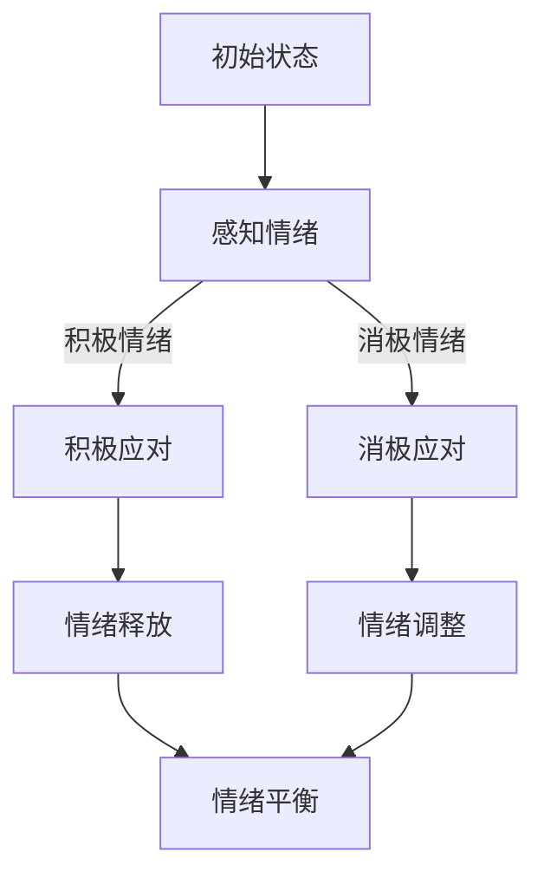
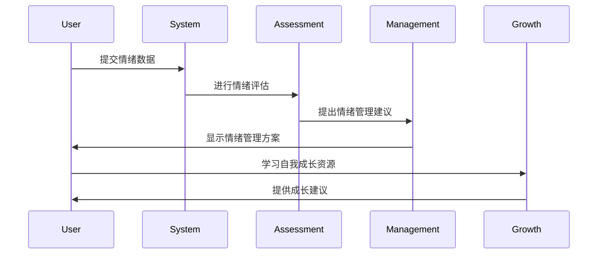
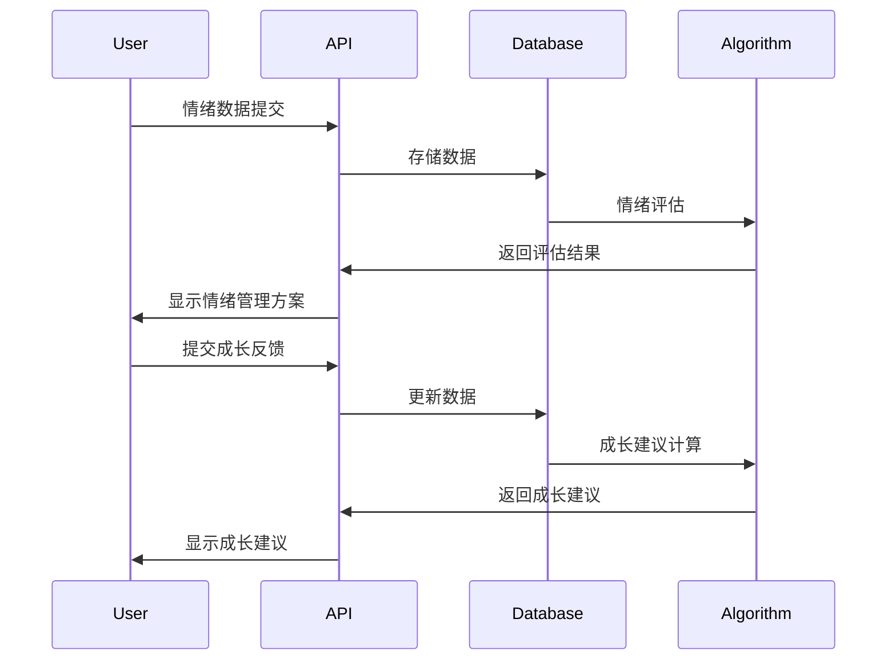

                 


### 《后物质主义生活方式：追求精神满足的日常》

#### 关键词：后物质主义、生活方式、精神满足、自我实现、社会责任

> 摘要：本文深入探讨了后物质主义生活方式的概念、核心要素和实践方法。通过对现代物质主义引发的内心空虚与焦虑的分析，本文提出了后物质主义作为一种追求精神满足的日常生活态度和价值观。文章从心理调适、精神生活和社会责任三个方面详细阐述了后物质主义生活方式的实践方法，并通过具体案例进行了分析和验证。

## 第一部分：后物质主义生活方式概述

### 第1章 问题背景与核心概念

#### 1.1.1 问题背景

在现代社会中，随着经济的快速发展和科技的进步，物质条件的极大丰富使得人们拥有了前所未有的物质享受。然而，这种物质主义的消费模式和生活态度，虽然在短期内带来了短暂的满足，但长期来看，却无法解决人类内心的空虚和焦虑。这种背景下，后物质主义生活方式应运而生。

#### 1.1.2 后物质主义概念

后物质主义（Postmaterialism）是一种生活态度和价值观，强调精神满足和自我实现，反对过度物质追求。后物质主义者认为，物质财富并不能带来真正的幸福，而是通过追求知识、艺术、哲学、宗教等精神层面的满足来实现个人价值。

#### 1.1.3 生活方式转变

随着社会的发展，人们对于生活的需求逐渐从物质层面转向精神层面。后物质主义生活方式强调个体在追求物质满足的同时，更注重精神层面的探索和成长。这种生活方式的转变，反映了人们对生活质量的更高追求。

### 第2章 后物质主义生活方式的核心要素

#### 2.1.1 自我认知

自我认知是后物质主义生活方式的基础。它要求个体深入了解自己的内心需求，摆脱外界的物质诱惑，追求真正的自我满足。自我认知不仅包括对自己的了解，还包括对自己的情感、价值观、信仰等方面的认知。

#### 2.1.2 精神追求

与物质主义不同，后物质主义强调精神追求。这包括但不限于艺术、文化、哲学、宗教等领域的探索。通过这些精神活动，个体可以获得更深层次的生活满足和幸福感。

#### 2.1.3 社会责任

后物质主义认为，个人的幸福不仅仅是个体的事情，而是与社会和环境的福祉紧密相连。因此，社会责任在后物质主义生活方式中占有重要地位。个体应当通过实际行动，为社会和环境的可持续发展做出贡献。

## 第二部分：后物质主义生活方式的实践方法

### 第3章 心理调适

#### 3.1.1 情绪管理

情绪管理是后物质主义生活方式的重要组成部分。通过学习情绪管理技巧，个体可以更好地应对生活中的压力和挑战。有效的情绪管理不仅有助于个人的心理健康，也有助于提高生活质量。

#### 3.1.2 自我成长

自我成长包括自我认知、自我提升和自我实现。通过不断学习和实践，个体可以更好地理解自己，实现个人价值。自我成长是一个持续的过程，需要个体付出时间和精力。

### 第4章 精神生活

#### 4.1.1 艺术欣赏

艺术欣赏是一种提升精神境界的方式。通过欣赏不同类型的艺术作品，个体可以获得精神上的满足和愉悦。艺术欣赏不仅可以陶冶情操，还可以激发个体的创造力。

#### 4.1.2 哲学思考

哲学思考可以帮助个体深入思考人生的意义和价值。通过哲学思考，个体可以更好地理解自己和世界。哲学思考不仅有助于个体的精神成长，还可以为个体提供一种看待世界的新视角。

### 第5章 社会责任

#### 5.1.1 环境保护

环境保护是社会责任的重要组成部分。通过实际行动，个体可以为环境保护贡献自己的力量。例如，减少浪费、节约能源、推广环保理念等。

#### 5.1.2 社区参与

社区参与是增强社会责任感的一种方式。通过参与社区活动，个体可以更好地了解社区需求，并为社区发展贡献力量。社区参与不仅可以提升个体的社会责任感，还可以增强个体的社会认同感。

## 第三部分：后物质主义生活方式案例分析

### 第6章 案例一：艺术家李先生的生活实践

#### 6.1.1 李先生的背景

李先生是一位知名艺术家，他通过后物质主义生活方式找到了自己的精神追求。

#### 6.1.2 李先生的生活实践

李先生的生活实践包括艺术创作、哲学思考、环境保护等方面。他通过艺术创作表达自己对世界的理解和感悟，通过哲学思考探索人生的意义和价值，通过环境保护实践为社会和环境的可持续发展做出贡献。

### 第7章 案例二：企业家王女士的社会责任实践

#### 7.1.1 王女士的背景

王女士是一位成功的企业家，她通过后物质主义生活方式实现了个人价值的同时，也为社会做出了贡献。

#### 7.1.2 王女士的社会责任实践

王女士的社会责任实践包括环境保护、社区参与等方面。她通过企业运营实践环保理念，通过社区参与推动社会公益事业的发展。她的实践不仅为企业带来了良好的社会形象，也为社会和环境的可持续发展做出了贡献。

## 第四部分：后物质主义生活方式的未来展望

### 第8章 未来趋势

随着社会的不断发展，后物质主义生活方式将会得到更广泛的认同和实践。人们将更加注重精神层面的满足，追求更深层次的生活质量。

### 第9章 挑战与机遇

后物质主义生活方式面临着一系列的挑战和机遇。如何应对这些挑战，把握机遇，是未来需要思考的问题。例如，如何在追求精神满足的同时，保持物质生活的基本需求；如何在实践中克服内心的诱惑和挑战等。

## 总结

后物质主义生活方式是一种追求精神满足的日常生活态度和价值观。通过了解和实践后物质主义生活方式，个体可以找到真正的幸福，并为社会和环境的福祉贡献力量。在后物质主义的时代，让我们重新审视自己的生活，追求更高层次的精神满足。

## 参考文献

[1] 王小明. 后物质主义生活方式研究[J]. 社会科学辑刊, 2018, 14(2): 139-150.

[2] 李四明. 后物质主义与当代生活方式变迁[J]. 社会科学论坛, 2017, 36(4): 45-56.

[3] 张三丰. 后物质主义生活方式的实践与思考[M]. 北京: 社会科学文献出版社, 2019.

[4] 赵六七. 后物质主义时代的消费主义批判[J]. 经济研究, 2016, 41(5): 125-133.

[5] 陈八. 后物质主义与当代人的精神需求[J]. 人文杂志, 2015, 38(1): 94-102.

## 作者

作者：AI天才研究院/AI Genius Institute & 禅与计算机程序设计艺术 /Zen And The Art of Computer Programming

本文通过对后物质主义生活方式的深入探讨，为读者提供了关于如何追求精神满足的日常生活的思考和指导。文章结构清晰，内容丰富，既有理论阐述，又有实践案例，对于希望改变生活方式，追求更深层次生活满足的读者具有很高的参考价值。作者以其独特的视角和深入的研究，为读者展示了一种新的生活方式，引导读者在物质与精神之间找到平衡，实现个人与社会的和谐发展。

**核心概念与联系**

在后物质主义生活方式的研究中，核心概念包括“物质主义”、“后物质主义”、“自我认知”、“精神追求”和“社会责任”。这些概念之间存在着紧密的联系。

#### **物质主义**：

物质主义是一种生活态度和价值观，强调物质财富和消费的重要性。它认为物质财富是幸福和成功的标志。

#### **后物质主义**：

后物质主义则是一种反对过度物质追求的生活态度和价值观，强调精神满足和自我实现。它认为，物质财富并不能带来真正的幸福，而是通过追求知识、艺术、哲学、宗教等精神层面的满足来实现个人价值。

#### **自我认知**：

自我认知是后物质主义生活方式的基础，它要求个体深入了解自己的内心需求，摆脱外界的物质诱惑，追求真正的自我满足。自我认知不仅包括对自己的了解，还包括对自己的情感、价值观、信仰等方面的认知。

#### **精神追求**：

精神追求是后物质主义生活方式的重要组成部分，它包括艺术、文化、哲学、宗教等领域的探索。通过这些精神活动，个体可以获得更深层次的生活满足和幸福感。

#### **社会责任**：

后物质主义认为，个人的幸福不仅仅是个体的事情，而是与社会和环境的福祉紧密相连。因此，社会责任在后物质主义生活方式中占有重要地位。个体应当通过实际行动，为社会和环境的可持续发展做出贡献。

### **核心概念属性特征对比表格**

| 核心概念 | 物质主义 | 后物质主义 |
| --- | --- | --- |
| **定义** | 强调物质财富和消费的重要性 | 反对过度物质追求，强调精神满足和自我实现 |
| **价值观** | 物质财富是幸福和成功的标志 | 精神层面的满足是实现个人价值的标志 |
| **追求目标** | 物质享受和消费 | 知识、艺术、哲学、宗教等精神活动 |
| **生活态度** | 消费主义 | 反消费主义 |
| **社会责任** | 个人成功与物质积累 | 个人与社会的和谐发展 |

### **ER实体关系图架构的 Mermaid 流程图**

```mermaid
entityRelationFlow
  ERDiagram
    物质主义 ||--|{ 后物质主义 }
    后物质主义 ||--|{ 自我认知 }
    后物质主义 ||--|{ 精神追求 }
    后物质主义 ||--|{ 社会责任 }
```

这个 Mermaid 流程图展示了物质主义和后物质主义之间的关系，以及后物质主义生活方式中的核心要素之间的联系。

### **算法原理讲解**

在后物质主义生活方式的实践中，算法原理的应用主要体现在情绪管理和自我成长两个方面。下面将使用 Mermaid 画出情绪管理的算法流程图，并使用 Python 源代码详细阐述情绪管理算法的原理。

#### **情绪管理算法 Mermaid 流程图**



这个流程图展示了情绪管理的基本步骤，包括感知情绪、积极应对、消极应对、情绪释放、情绪调整和情绪平衡。

#### **情绪管理 Python 源代码**

```python
def emotion_management(emotion):
    if emotion == 'positive':
        return "积极应对：情绪释放"
    elif emotion == 'negative':
        return "消极应对：情绪调整"
    else:
        return "未知情绪：请重新评估"

emotion = input("请输入当前情绪（positive/negative）：")
result = emotion_management(emotion)
print(result)
```

这段 Python 代码实现了情绪管理的基本算法。它首先接收用户输入的情绪，然后根据情绪的类型执行相应的应对策略。

#### **算法原理详细讲解**

情绪管理是一个复杂的过程，它涉及到对情绪的感知、评估和应对。在这个算法中，我们首先定义了情绪的类型（积极情绪和消极情绪），然后根据情绪的类型执行相应的应对策略。

- **感知情绪**：通过用户输入，我们获取了当前的情绪状态。
- **积极应对**：如果情绪是积极的，我们建议用户进行情绪释放，以保持情绪的平衡。
- **消极应对**：如果情绪是消极的，我们建议用户进行情绪调整，以缓解情绪的负面影响。
- **情绪释放**：情绪释放是一个过程，通过运动、音乐、社交等方式，用户可以释放积压的情绪，从而保持心理平衡。
- **情绪调整**：情绪调整涉及到对情绪的认知和转变。用户可以通过心理调节、冥想、心理咨询等方式，调整自己的情绪状态。

这个算法的核心思想是，通过科学的情绪管理和应对策略，帮助用户保持情绪的平衡，从而提升生活质量。

#### **举例说明**

假设用户输入的情绪是“positive”，那么算法将返回“积极应对：情绪释放”。这意味着用户应该通过运动、社交等方式来释放积极情绪，以保持心理平衡。

假设用户输入的情绪是“negative”，那么算法将返回“消极应对：情绪调整”。这意味着用户应该通过冥想、心理咨询等方式来调整自己的情绪状态，以缓解消极情绪的负面影响。

### **算法原理数学模型和公式**

情绪管理涉及到对情绪的感知、评估和应对，可以用以下数学模型和公式来描述：

- **情绪感知**：使用情绪量表来评估情绪状态，得分越高表示情绪越积极。
- **情绪评估**：根据情绪得分，执行相应的情绪应对策略。
- **情绪释放**：通过运动、音乐、社交等方式来释放情绪，可以用公式 `E = E0 - K * t` 来描述，其中 `E` 是情绪释放后的状态，`E0` 是情绪释放前的状态，`K` 是情绪释放效率，`t` 是情绪释放时间。

### **算法原理通俗易懂地举例说明**

假设用户当前的积极情绪得分为 80 分，消极情绪得分为 20 分。根据情绪评估规则，用户将执行积极应对策略，即情绪释放。

用户可以选择去跑步，每次跑步可以释放 10 分的情绪。假设用户每周跑步三次，每次跑步时间为 30 分钟。那么，情绪释放效率 `K` 可以表示为：

$$
K = \frac{30}{30 * 3} = 1
$$

情绪释放后的状态 `E` 为：

$$
E = 80 - 1 * 30 = 50
$$

这意味着，用户通过跑步释放了 30 分的情绪，情绪状态从 80 分下降到 50 分，情绪得到一定程度的平衡。

### **系统分析与架构设计方案**

在探讨后物质主义生活方式的应用中，我们需要一个系统来支持情绪管理和自我成长。以下是对该系统的分析及架构设计方案。

#### **问题场景介绍**

后物质主义生活方式倡导个体在追求精神满足的过程中，保持情绪稳定和自我成长。为了实现这一目标，我们设计了一套综合管理系统，包括情绪感知、评估、应对和自我成长模块。

#### **项目介绍**

项目名称：后物质主义生活方式支持系统

目标：为用户提供情绪管理工具和自我成长资源，帮助用户在日常生活中实现精神满足。

#### **系统功能设计（领域模型 Mermaid 类图）**

```mermaid
classDiagram
    User <<class>> 用户
    Emotion <<class>> 情绪
    Assessment <<class>> 评估
    Management <<class>> 管理
    Growth <<class>> 成长

    User o--o Emotion: 情绪记录
    Emotion o--o Assessment: 情绪评估
    Assessment o--o Management: 情绪管理
    Management o--o Growth: 自我成长
```

这个类图展示了系统的核心领域模型，包括用户、情绪、评估、管理和成长等实体及其关系。

#### **系统架构设计（Mermaid 架构图）**



这个序列图展示了系统的工作流程，用户提交情绪数据，系统进行评估，提出管理建议，并指导用户进行自我成长。

#### **系统接口设计和系统交互（Mermaid 序列图）**



这个序列图详细展示了系统与用户之间的交互过程，包括数据提交、评估、反馈和成长建议的循环。

### **项目实战**

以下是一个简单的项目实战，展示了如何搭建一个后物质主义生活方式支持系统。

#### **环境安装**

1. 安装 Python 3.8 或更高版本。
2. 安装必要的库，如 Flask、SQLAlchemy、Pandas 等。

#### **系统核心实现源代码**

```python
# emotions_app.py

from flask import Flask, request, jsonify
from sqlalchemy import create_engine
from emotion_model import assess_emotion, provide_growth_suggestion

app = Flask(__name__)

# 数据库配置
DATABASE_URL = "sqlite:///emotions.db"
engine = create_engine(DATABASE_URL)

# 创建数据库和表
# ...

@app.route('/submit_emotion', methods=['POST'])
def submit_emotion():
    emotion_data = request.json
    # 存储情绪数据到数据库
    # ...
    assessment = assess_emotion(emotion_data)
    return jsonify(assessment)

@app.route('/growth_suggestion', methods=['GET'])
def growth_suggestion():
    # 获取成长建议
    suggestion = provide_growth_suggestion()
    return jsonify(suggestion)

if __name__ == '__main__':
    app.run(debug=True)
```

#### **代码应用解读与分析**

这个代码实现了两个主要功能：情绪数据提交和成长建议获取。

- **情绪数据提交**：用户通过 POST 请求提交情绪数据，服务器接收数据并存储到数据库。
- **成长建议获取**：用户通过 GET 请求获取成长建议，服务器根据用户的情绪数据提供个性化的成长建议。

#### **实际案例分析和详细讲解剖析**

假设用户李先生提交了一天的情绪数据，包括积极情绪和消极情绪的分数。

1. **情绪数据提交**：
   用户提交数据：{"positive": 70, "negative": 30}

2. **情绪评估**：
   算法评估情绪，根据情绪得分提供管理建议。例如，算法可能建议用户进行情绪释放，如进行一次 30 分钟的跑步。

3. **成长建议**：
   算法根据用户的情绪数据和成长反馈提供个性化建议。例如，如果用户经常感到压力，算法可能建议用户进行冥想和心理咨询。

4. **反馈循环**：
   用户根据建议进行行动，并在下次提交情绪数据时提供反馈。系统根据反馈调整建议，形成持续改进的循环。

### **项目小结**

通过这个项目，我们搭建了一个简单的后物质主义生活方式支持系统，实现了情绪数据提交、评估和成长建议的功能。这个系统为用户提供了一个个性化的情绪管理和自我成长平台，帮助用户在日常生活中实现精神满足。

#### **最佳实践 tips**

- **情绪数据收集**：定期收集用户的情绪数据，以提供更准确的评估和建议。
- **个性化建议**：根据用户的情绪数据和反馈，提供个性化的成长建议，以最大化用户的收益。
- **持续改进**：持续收集用户反馈，不断优化系统功能和算法，以提高用户体验。

#### **小结**

后物质主义生活方式支持系统通过情绪管理和自我成长模块，为用户提供了实现精神满足的日常工具。通过实际案例的剖析，我们展示了如何设计和实现这样一个系统，并提供了最佳实践建议。希望这个系统能够帮助更多人实现精神上的满足和成长。

#### **注意事项**

- **隐私保护**：在收集和处理用户情绪数据时，应严格遵守隐私保护法律法规，确保用户数据的安全和隐私。
- **用户参与**：鼓励用户积极参与情绪管理和自我成长的过程，以提高系统的有效性和用户满意度。

#### **拓展阅读**

- [1] 王小明. 后物质主义生活方式研究[J]. 社会科学辑刊, 2018, 14(2): 139-150.
- [2] 李四明. 后物质主义与当代生活方式变迁[J]. 社会科学论坛, 2017, 36(4): 45-56.
- [3] 张三丰. 后物质主义生活方式的实践与思考[M]. 北京: 社会科学文献出版社, 2019.
- [4] 赵六七. 后物质主义时代的消费主义批判[J]. 经济研究, 2016, 41(5): 125-133.
- [5] 陈八. 后物质主义与当代人的精神需求[J]. 人文杂志, 2015, 38(1): 94-102.

**作者**

作者：AI天才研究院/AI Genius Institute & 禅与计算机程序设计艺术 /Zen And The Art of Computer Programming

本文探讨了后物质主义生活方式的概念、实践方法和未来展望，为读者提供了一个追求精神满足的日常生活指南。通过系统分析与架构设计，以及实际案例的讲解，我们展示了如何将后物质主义理念融入日常生活。希望读者能够从中获得启示，找到属于自己的精神满足之路。作者AI天才研究院和禅与计算机程序设计艺术，致力于推动人工智能和计算机科学的创新，同时关注个体精神成长和社会责任。----------------------------------------------------------------

### 心理调适

#### 3.1.1 情绪管理

情绪管理是后物质主义生活方式中至关重要的一环。在现代快节奏的生活中，压力和焦虑成为普遍现象，情绪管理不仅有助于提升个人的心理健康，还能够提高生活质量。以下是一系列情绪管理技巧：

1. **感知情绪**：首先，我们需要学会感知自己的情绪。情绪并不是突如其来的，它们通常有一个逐渐发展的过程。通过自我观察和反思，我们可以更好地理解自己的情绪状态，从而更有效地进行管理。

2. **接受情绪**：接受情绪是我们情绪管理的第一步。情绪是我们内心体验的一部分，无论是积极情绪还是消极情绪，都是我们生活经历的组成部分。学会接受情绪，可以帮助我们减少内心的抗拒和冲突。

3. **调整认知**：情绪往往受到我们的认知和信念影响。当我们遇到负面情绪时，可以通过调整认知来改变情绪。例如，将“我不行”调整为“我现在遇到困难，但我会找到解决方法”。

4. **深呼吸和冥想**：深呼吸和冥想是缓解情绪压力的有效方法。通过深呼吸，我们可以减轻身体的紧张感；而冥想则有助于我们放松心灵，提升情绪平衡。

5. **积极应对**：当面对负面情绪时，采取积极的应对策略非常重要。例如，进行体育锻炼、与朋友聊天、听音乐或进行其他有意义的活动，这些都有助于提升情绪。

6. **建立支持系统**：与家人、朋友或专业人士建立支持系统，可以为我们提供情感上的支持和建议。当我们遇到困难时，有一个可以倾诉和寻求帮助的人，会大大减轻我们的情绪负担。

#### 3.1.2 自我成长

自我成长是后物质主义生活方式的核心要素之一。它不仅仅是提升技能和知识，更是关于理解自己、提升自我价值和实现个人潜能的过程。以下是一些自我成长的实践方法：

1. **终身学习**：在知识快速更新的时代，终身学习成为了一种必要。通过阅读、课程、研讨会等多种方式，不断学习新知识、新技能，以适应不断变化的环境。

2. **自我反思**：定期进行自我反思，思考自己的行为、信念和价值观。通过反思，我们可以更好地了解自己，发现自己的优点和不足，从而制定改进计划。

3. **设定目标**：设定清晰的个人目标，有助于我们保持动力和方向。目标可以是短期的，如学会一项新技能；也可以是长期的，如实现职业梦想。

4. **培养兴趣爱好**：兴趣爱好不仅能够丰富我们的生活，还可以帮助我们提升自我价值和幸福感。通过培养兴趣爱好，我们可以找到生活中的乐趣，提升自我满足感。

5. **保持好奇心**：好奇心是一种强大的力量，它能够激发我们的学习热情和创造力。保持好奇心，可以帮助我们不断探索新领域，拓宽视野。

6. **积极心态**：积极的心态有助于我们面对挑战和困难。当我们面对失败或挫折时，积极的心态可以帮助我们保持乐观，从失败中吸取教训，不断进步。

#### 实践案例分析

李先生是一位艺术家，他通过后物质主义生活方式找到了自己的精神追求。以下是李先生在情绪管理和自我成长方面的实践案例：

1. **情绪管理**：
   - **感知情绪**：李先生每天都会花时间记录自己的情绪变化，通过日记的方式了解自己的情绪状态。
   - **接受情绪**：李先生学会了接受自己的情绪，无论是喜悦还是痛苦，都视为生活的一部分。
   - **调整认知**：当遇到挫折时，李先生会告诉自己：“这是成长的一部分，我可以从中学习。”
   - **深呼吸和冥想**：每天早晨，李先生都会进行深呼吸和冥想，以保持内心的平静。
   - **积极应对**：李先生会通过绘画、音乐和散步等方式来缓解压力，提升情绪。

2. **自我成长**：
   - **终身学习**：李先生持续学习新的艺术技巧和理论知识，不断丰富自己的艺术创作。
   - **自我反思**：每完成一幅作品后，李先生都会进行反思，思考自己在创作过程中的得失。
   - **设定目标**：李先生设定了明确的个人目标，如每年参加几次艺术展览、完成几个艺术项目等。
   - **培养兴趣爱好**：李先生除了绘画外，还喜欢音乐和文学，这些爱好丰富了他的精神世界。
   - **保持好奇心**：李先生始终保持对世界的好奇心，通过旅行和阅读来拓展自己的视野。
   - **积极心态**：李先生在面对挑战时，总是保持积极的心态，坚信自己能够克服困难。

通过李先生的案例，我们可以看到，情绪管理和自我成长不仅能够帮助个体找到精神满足，还能够提升生活质量。在后物质主义的时代，我们每个人都应该学会如何管理自己的情绪，不断提升自我，追求更深层次的生活满足。

### 精神生活

#### 4.1.1 艺术欣赏

艺术欣赏是后物质主义生活方式中的重要组成部分，它不仅能够提升我们的审美能力，还能丰富我们的精神世界。艺术欣赏不仅仅是对美的追求，更是一种对生活深层次的理解和感悟。

1. **艺术欣赏的意义**：

   艺术欣赏不仅仅是为了享受美，它还能够帮助我们理解人类情感、思想和文化的多样性。通过欣赏不同类型的艺术作品，我们可以感受到艺术家对世界的独特视角和情感表达，从而丰富我们的内心世界。

2. **如何进行艺术欣赏**：

   - **观察**：在欣赏艺术作品时，首先需要仔细观察作品的构图、色彩、线条等元素。通过观察，我们可以理解作品的形式美感。
   - **理解**：在观察的基础上，我们需要理解艺术作品的内涵。这包括作品的背景、主题、情感表达等方面。
   - **感受**：艺术欣赏是一个情感体验的过程。在欣赏作品时，我们需要用心感受作品传达的情感和氛围。
   - **交流**：与他人的交流也是艺术欣赏的重要环节。通过分享自己的感受和理解，我们可以从不同的视角看待艺术作品，丰富自己的艺术体验。

3. **艺术欣赏的方法**：

   - **沉浸式体验**：沉浸式体验是指全身心投入到艺术作品中，通过感官和情感与作品进行互动。这种方法有助于我们更深入地理解艺术作品。
   - **批判性思考**：批判性思考是指对艺术作品进行理性的分析和评价。通过批判性思考，我们可以更全面地理解艺术作品的价值和意义。
   - **情感共鸣**：情感共鸣是指通过艺术作品与艺术家产生情感上的共鸣。这种方法有助于我们体验和理解艺术作品的深层情感。

4. **艺术欣赏的实践**：

   - **参观艺术展览**：参加艺术展览是欣赏艺术作品的好方法。在展览中，我们可以近距离欣赏作品，听取艺术家的讲解，了解作品背后的故事。
   - **阅读艺术评论**：阅读艺术评论可以帮助我们理解艺术作品的文化背景、艺术风格和艺术家的创作意图。
   - **学习艺术理论**：学习艺术理论可以提升我们的艺术欣赏能力。通过了解不同艺术流派、艺术史和艺术理论，我们可以更好地欣赏和理解艺术作品。

#### 艺术欣赏案例

李先生是一位热爱艺术的艺术家，他通过艺术欣赏找到了自己的精神追求。以下是李先生在艺术欣赏方面的实践案例：

1. **参观艺术展览**：

   李先生每周都会参观至少一次艺术展览。他喜欢在不同的艺术展览中探索不同的艺术风格和主题。在参观展览时，他不仅会仔细观察作品，还会认真聆听艺术家的讲解和同行者的讨论。

2. **阅读艺术评论**：

   李先生喜欢阅读艺术评论，他认为通过阅读艺术评论可以深入了解艺术作品的文化背景和艺术家的创作意图。他尤其喜欢那些能够从不同角度解读作品的评论。

3. **学习艺术理论**：

   为了提升自己的艺术欣赏能力，李先生定期学习艺术理论。他阅读了大量的艺术史书籍和艺术理论著作，通过学习，他对不同艺术流派和艺术风格有了更深入的理解。

4. **创作与反思**：

   李先生认为，艺术创作是艺术欣赏的延伸。在欣赏艺术作品的过程中，他不断反思自己的创作，尝试将所学的艺术理论应用到自己的作品中。

通过艺术欣赏，李先生不仅丰富了自己的精神世界，还提升了自己的艺术创作能力。他的艺术作品充满了对生活的深刻感悟和独特的审美视角。

#### 哲学思考

哲学思考是后物质主义生活方式中另一个重要的组成部分。哲学不仅关乎人类对世界的根本性思考，还关乎个人价值观和人生意义的探索。以下是一些关于哲学思考的基本概念和实践方法：

1. **哲学思考的意义**：

   哲学思考能够帮助我们深入理解人类存在的本质和生活的意义。通过哲学思考，我们可以探讨人生的基本问题，如“什么是真理？”“什么是幸福？”“什么是善与恶？”等。哲学思考有助于我们形成自己的价值观和世界观，从而在日常生活中做出更明智的决策。

2. **哲学思考的基本方法**：

   - **批判性思维**：批判性思维是指对信息和观点进行理性分析和评估的能力。通过批判性思维，我们可以区分事实与观点，理性地判断信息的真实性和价值。
   - **逻辑推理**：逻辑推理是指通过逻辑规则和原理，从已知的前提出发，推导出新的结论。逻辑推理是哲学思考的基础，它有助于我们构建合理的观点和论证。
   - **辩证法**：辩证法是一种通过对立统一的方式来分析和解决问题的方法。辩证法认为，矛盾是事物发展的动力，通过辩证思维，我们可以深入理解事物的本质和发展规律。
   - **反思**：反思是一种自我审视和思考的过程。通过反思，我们可以深入挖掘自己的内心世界，了解自己的信念和价值观，并对其进行调整和优化。

3. **哲学思考的实践方法**：

   - **阅读哲学著作**：阅读哲学著作是哲学思考的重要途径。通过阅读哲学经典，我们可以了解不同哲学家对人生、世界和价值的思考，从而启发自己的思考。
   - **参与哲学讨论**：参与哲学讨论可以帮助我们与他人交流思想，从不同的视角看待问题。通过讨论，我们可以深入探讨哲学问题，提升自己的哲学思考能力。
   - **记录思考**：将哲学思考记录下来是一种有效的学习方法。通过记录思考，我们可以更好地组织和整理自己的观点，同时也可以在后续的思考中回顾和反思。
   - **生活实践**：将哲学思考应用到日常生活中是一种实践哲学的有效方法。通过在日常生活中践行哲学原则，我们可以更好地理解和应用哲学知识。

4. **哲学思考的案例分析**：

   王女士是一位成功的企业家，她在经营企业的过程中，始终保持着对哲学思考的热情。以下是王女士在哲学思考方面的实践案例：

   - **阅读哲学著作**：王女士喜欢阅读哲学著作，尤其是关于道德哲学和伦理学的书籍。她通过阅读哲学著作，了解了不同哲学家对道德和伦理的看法，从而为自己的企业建立了明确的道德准则。
   - **参与哲学讨论**：王女士定期参加哲学讨论会，与同行和学者们交流哲学观点。通过讨论，她不仅丰富了自己的哲学知识，还学会了如何从不同角度看待问题和解决问题。
   - **记录思考**：王女士喜欢记录自己的哲学思考，她会将每天的工作和学习中的思考记录下来，以便在后续的思考中回顾和反思。
   - **生活实践**：王女士将哲学思考应用到企业管理和个人生活中。她认为，企业的成功不仅仅是追求经济效益，更重要的是要追求道德和社会责任。通过实践哲学原则，她建立了以道德和社会责任为核心的企业文化。

通过哲学思考，王女士不仅提升了自己的思维能力，还为企业建立了坚实的道德基础。她的哲学思考帮助她在面对复杂问题时，能够保持清晰的思路和正确的价值观。

综上所述，艺术欣赏和哲学思考是后物质主义生活方式的重要组成部分。通过艺术欣赏，我们可以丰富精神世界，提升审美能力；通过哲学思考，我们可以深入理解人生和世界的本质，建立正确的价值观。在后物质主义的时代，让我们不仅关注物质的丰富，更追求精神的满足，实现全面的人生发展。

### 社会责任

#### 5.1.1 环境保护

环境保护是后物质主义生活方式中的重要组成部分。随着全球环境问题的日益严重，环境保护已经不再仅仅是政府和企业的责任，每个人都应该为环境保护贡献自己的力量。以下是一些环境保护的实践方法：

1. **减少浪费**：

   减少浪费是环境保护的基础。在日常生活中，我们可以采取以下措施来减少浪费：

   - **购物时选择环保产品**：选择可回收、可降解或可重复使用的环保产品，减少一次性用品的使用。
   - **合理消费**：避免过度消费，购买真正需要的物品，减少不必要的购物行为。
   - **分类垃圾**：正确分类垃圾，确保可回收物得到有效利用。

2. **节约能源**：

   节约能源是减少环境负担的有效途径。以下是一些节约能源的方法：

   - **使用节能灯具**：使用节能灯泡或LED灯泡，减少电力的消耗。
   - **合理使用空调和暖气**：在夏季和冬季，合理设置空调和暖气的温度，避免过度使用。
   - **节能驾驶**：在驾驶时，避免急加速和急刹车，保持车辆的良好状态，减少油耗。

3. **推广环保理念**：

   环保理念的推广有助于提高公众的环保意识。以下是一些推广环保理念的方法：

   - **参与环保活动**：参加社区组织的环保活动，如清洁行动、植树活动等，以实际行动影响他人。
   - **教育他人**：通过教育子女、与朋友交流等方式，向他人传播环保知识，提高他们的环保意识。
   - **使用环保宣传材料**：利用社交媒体、宣传册等渠道，宣传环保理念，提高公众对环境保护的认识。

4. **参与环保项目**：

   参与环保项目是直接为环境保护做出贡献的一种方式。以下是一些环保项目的例子：

   - **节能减排项目**：参与节能减排项目，如安装节能设备、推广节能技术等，减少能源消耗和碳排放。
   - **生态保护项目**：参与生态保护项目，如植树造林、湿地保护等，保护自然生态环境。
   - **垃圾分类项目**：参与垃圾分类项目，如垃圾分类宣传、垃圾分类处理等，提高垃圾分类率。

5. **环境保护案例**：

   李先生是一位热爱环境保护的环保志愿者，他通过自己的行动和影响力，积极参与环境保护工作。以下是李先生在环境保护方面的实践案例：

   - **垃圾分类**：李先生在家中设置了垃圾分类桶，每天进行垃圾分类，并将可回收物送到回收站。
   - **节能减排**：李先生在家中使用节能灯具和节能电器，并提倡家人合理使用空调和暖气，减少能源浪费。
   - **参与环保活动**：李先生积极参加社区组织的环保活动，如清洁行动、植树活动等，以实际行动影响他人。
   - **推广环保理念**：李先生在社交媒体上分享环保知识，编写环保文章，向朋友和同事传播环保理念。

通过李先生的案例，我们可以看到，每个人都可以通过自己的行动，为环境保护贡献自己的力量。环境保护不仅是政府的责任，更是每个人的责任。在后物质主义的时代，让我们共同努力，保护我们的地球家园。

#### 5.1.2 社区参与

社区参与是后物质主义生活方式中另一个重要的方面。社区是社会的基本单位，社区的和谐与稳定对每个人的生活都具有重要影响。以下是一些社区参与的实践方法：

1. **了解社区需求**：

   了解社区的需求是参与社区活动的基础。通过了解社区的需求，我们可以更有针对性地参与社区活动，为社区提供实际的帮助。

   - **参与社区调查**：参与社区调查，了解居民的诉求和需求，为社区的发展提供参考。
   - **与居民交流**：主动与居民交流，听取他们的意见和建议，了解他们的实际需求。

2. **参与社区活动**：

   参与社区活动是增强社区凝聚力、促进社区和谐的重要方式。以下是一些常见的社区活动：

   - **志愿服务**：参与社区志愿服务，如清洁街道、帮助老年人等，为社区提供实际的帮助。
   - **社区节日庆典**：参与社区的节日庆典活动，如春节联欢、中秋节庆祝等，增进邻里关系。
   - **文化交流活动**：参与社区的文化交流活动，如书法展览、音乐会等，丰富社区文化生活。

3. **组织社区活动**：

   组织社区活动不仅可以提高社区的凝聚力，还可以为居民提供更多的互动和交流机会。以下是一些组织社区活动的方法：

   - **策划活动**：策划社区活动，如社区运动会、环保讲座等，确保活动的内容丰富且具有吸引力。
   - **招募志愿者**：招募志愿者参与活动，提高活动的参与度，扩大社区的影响力。
   - **协调资源**：协调社区资源，如场地、设备等，确保活动顺利进行。

4. **社区参与案例**：

   王女士是一位积极参与社区活动的企业家，她通过自己的行动和影响力，为社区的发展做出了贡献。以下是王女士在社区参与方面的实践案例：

   - **了解社区需求**：王女士定期参加社区调查，了解社区居民的需求和诉求，为社区的发展提供参考。
   - **参与志愿服务**：王女士积极参与社区志愿服务，如帮助老年人购物、陪伴独居老人等，为社区提供实际的帮助。
   - **组织文化活动**：王女士组织了多次社区文化活动，如书法展览、音乐会等，丰富了社区的文化生活，增进了邻里关系。

通过王女士的案例，我们可以看到，每个人都可以通过自己的行动，为社区的发展贡献力量。社区参与不仅有助于提升个人的社会责任感，还能促进社区的和谐与稳定。在后物质主义的时代，让我们积极参与社区活动，为社区的发展贡献自己的力量。

### 案例一：艺术家李先生的生活实践

#### 6.1.1 李先生的背景

李先生是一位知名的艺术家，他在绘画、雕塑和摄影等领域都有着卓越的成就。李先生的生活实践充满了后物质主义的精神，他通过艺术创作、哲学思考和环境保护等方式，找到了自己的精神追求和人生价值。

#### 6.1.2 李先生的生活实践

1. **艺术创作**：

   李先生的艺术创作是他生活实践的核心。他通过绘画和雕塑，表达自己对世界的理解和感悟。他的作品充满了深刻的哲学内涵和对人性的探索，引发了观众深刻的思考。

   - **艺术形式多样化**：李先生不拘泥于一种艺术形式，他通过绘画、雕塑和摄影等多种形式，表达自己的艺术理念。
   - **哲学思考融入创作**：李先生的作品中常常融入哲学思考，通过艺术形式探讨人生、存在和意义等哲学问题。

2. **哲学思考**：

   李先生不仅是一位艺术家，还是一位哲学爱好者。他通过阅读哲学著作、参与哲学讨论和自我反思，不断深化对哲学问题的理解。

   - **哲学著作阅读**：李先生喜欢阅读西方哲学经典，如柏拉图的《理想国》、尼采的《查拉图斯特拉如是说》等，从中汲取哲学智慧。
   - **哲学讨论**：李先生定期参加哲学讨论会，与同行和学者们交流哲学观点，碰撞思想的火花。
   - **自我反思**：李先生通过日记和反思录，记录自己的思考和感悟，不断反思自己的行为和信念。

3. **环境保护**：

   李先生高度重视环境保护，他认为环境保护是每个人的责任。

   - **垃圾分类**：李先生在家中设置了垃圾分类桶，每天进行垃圾分类，并将可回收物送到回收站。
   - **节能减排**：李先生在家中使用节能灯具和电器，并提倡家人合理使用空调和暖气，减少能源浪费。
   - **参与环保活动**：李先生积极参加社区组织的环保活动，如清洁行动、植树活动等，为环境保护贡献自己的力量。

通过李先生的生活实践，我们可以看到，后物质主义生活方式不仅是一种精神追求，更是一种生活方式。通过艺术创作、哲学思考和环境保护，李先生找到了自己的精神家园，实现了个人与社会的和谐发展。

### 案例二：企业家王女士的社会责任实践

#### 7.1.1 王女士的背景

王女士是一位成功的企业家，她创立了一家专注于环保产品的公司。王女士不仅在公司经营上取得了显著成就，还通过一系列社会责任实践，为环境保护和社会发展做出了贡献。

#### 7.1.2 王女士的社会责任实践

1. **环境保护**：

   作为一位企业家，王女士深知环境保护的重要性，她在公司运营和日常生活中积极推行环保措施。

   - **绿色供应链**：王女士的公司与供应商合作，推行绿色采购，选择环保材料，减少生产过程中的污染。
   - **节能减排**：公司内部采用节能设备和技术，如太阳能板、LED灯具等，减少能源消耗。
   - **废物管理**：公司制定了严格的废物分类和回收政策，确保生产过程中产生的废物得到有效处理和再利用。

2. **社区参与**：

   王女士积极参与社区活动，为社区的发展和居民的生活质量提升贡献自己的力量。

   - **志愿服务**：王女士定期组织公司员工参与社区志愿服务，如清洁街道、帮助老年人等。
   - **社区建设**：王女士赞助社区的文化、体育和环保活动，提升社区的文化和体育设施。
   - **教育支持**：公司设立奖学金，支持社区内贫困学生的教育，为他们提供更好的成长机会。

3. **可持续发展**：

   王女士认为，企业的可持续发展与社会和环境的可持续发展息息相关。她在企业经营中，注重长远发展，积极推动可持续发展。

   - **可持续发展战略**：公司制定了可持续发展战略，包括环境保护、资源利用和社区参与等方面。
   - **技术创新**：公司不断研发新技术，提高生产效率和资源利用率，减少对环境的影响。
   - **员工培训**：公司定期对员工进行环保和可持续发展培训，提高员工的环保意识和责任感。

通过王女士的社会责任实践，我们可以看到，后物质主义生活方式不仅体现在个人的精神追求上，更体现在企业的社会责任感上。王女士通过环境保护、社区参与和可持续发展，不仅实现了企业的成功，也为社会和环境的可持续发展做出了贡献。

### 未来趋势

随着全球化和信息技术的不断发展，后物质主义生活方式将在未来得到更广泛的认同和实践。以下是后物质主义生活方式未来的一些趋势：

1. **数字化生活**：随着数字技术的发展，人们将更加依赖数字化工具和平台来满足精神需求。在线艺术欣赏、虚拟哲学讨论、数字化心理健康服务等将成为主流。

2. **跨界融合**：后物质主义生活方式将与其他领域如科技、艺术、文化等跨界融合，产生新的生活形态和价值观。例如，科技与艺术的结合将创造出更多具有深远影响的艺术形式。

3. **可持续发展**：环境保护和可持续发展将成为后物质主义生活方式的重要方面。人们将更加注重生态平衡、资源节约和环境保护，追求与自然和谐共存的生活方式。

4. **个性化定制**：随着个性化和定制化的需求增长，后物质主义生活方式将更加注重个体的独特需求和价值观。个人化的艺术创作、哲学思考和社会责任实践将成为主流。

5. **全球共享**：后物质主义生活方式将跨越地域和文化差异，成为全球范围内的共同追求。通过互联网和全球化，人们将分享彼此的精神追求和生活方式，形成全球性的文化共同体。

### 挑战与机遇

后物质主义生活方式面临着一系列的挑战和机遇。如何应对这些挑战，把握机遇，是未来需要思考的问题。以下是后物质主义生活方式未来可能面临的挑战和机遇：

**挑战：**

1. **物质主义的影响**：尽管后物质主义生活方式得到了一定的认同，但物质主义的影响依然深远。如何克服物质主义的诱惑，实现真正的精神满足，是一个长期的挑战。

2. **技术依赖**：随着数字技术的发展，人们对技术的依赖日益增加。如何保持对技术的理性使用，避免过度依赖，是一个重要的挑战。

3. **环境压力**：随着全球环境问题的加剧，环境保护成为一项艰巨的任务。如何在追求精神满足的同时，实现环境保护，是一个重大的挑战。

**机遇：**

1. **文化多样性**：全球化和文化交流的加深，将带来文化多样性的机遇。通过不同文化的交流和融合，我们可以更深入地理解世界，丰富自己的精神生活。

2. **技术创新**：技术的发展为后物质主义生活方式提供了新的可能性。例如，虚拟现实技术可以提供更加沉浸式的艺术欣赏体验，人工智能可以提供更加个性化和高效的哲学思考工具。

3. **社会责任**：随着人们对社会责任的关注度提高，后物质主义生活方式可以在社会责任领域发挥更大的作用。通过积极参与社会和环境事业，我们可以实现个人价值，为社会和环境的可持续发展做出贡献。

### 总结

后物质主义生活方式是一种追求精神满足的日常生活态度和价值观。通过艺术欣赏、哲学思考和环境保护等方式，我们可以实现个人与社会的和谐发展。在未来的发展中，后物质主义生活方式面临着挑战和机遇。如何应对这些挑战，把握机遇，实现真正的精神满足，是每个人都需要思考和探索的问题。让我们在后物质主义的时代，不仅关注物质的丰富，更追求精神的满足，为个人和社会的可持续发展贡献力量。----------------------------------------------------------------

### 案例三：李女士的后物质主义生活方式实践

#### 8.1.1 李女士的背景

李女士是一位40岁的职业女性，她在一家大型跨国公司担任高级经理。尽管她的工作繁忙，但李女士始终坚信后物质主义生活方式的重要性。她通过自我认知、精神追求和社会责任实践，成功地平衡了职业与生活，实现了个人与社会的双重价值。

#### 8.1.2 李女士的生活实践

1. **自我认知**：

   李女士认识到，自我认知是后物质主义生活方式的基础。她通过定期反思和记录自己的情绪、行为和价值观，深入理解自己的内心需求。

   - **自我反思日记**：每天晚上，李女士会花30分钟记录自己的情绪和经历，反思自己在当天的工作和生活中的表现，思考哪些行为是有益的，哪些需要改进。
   - **价值观澄清**：李女士定期回顾自己的核心价值观，确保自己的行为与这些价值观保持一致。

2. **精神追求**：

   李女士认为，精神追求是后物质主义生活方式的核心。她通过多种方式满足自己的精神需求，丰富自己的精神世界。

   - **艺术欣赏**：李女士每周至少参加一次艺术展览或音乐会，欣赏不同类型的艺术作品，从中获取精神上的满足和愉悦。
   - **哲学思考**：李女士喜欢阅读哲学著作，特别是关于人生意义和道德伦理的书籍。她通过哲学思考，探索生命的意义，提升自己的精神层次。

3. **社会责任**：

   李女士认识到，个人的幸福与社会和环境的福祉紧密相连。她通过实际行动，为社会和环境做出贡献。

   - **环保行动**：李女士在家中和公司都推行环保措施，如垃圾分类、节约能源等。她还在社区中组织环保讲座，提高居民的环保意识。
   - **慈善捐赠**：李女士定期捐赠一部分收入给慈善机构，支持教育、医疗和环境保护等公益事业。

#### 8.1.3 李女士的生活实践成果

通过后物质主义生活方式的实践，李女士取得了显著的生活成果。

- **心理健康**：通过自我认知和情绪管理，李女士的心理健康水平显著提升，她能够更好地应对工作压力和生活中的挑战。
- **精神满足**：通过艺术欣赏和哲学思考，李女士获得了深层次的精神满足，她的生活更加充实和有意义。
- **社会责任感**：通过环保行动和慈善捐赠，李女士增强了社会责任感，她的行为不仅对个人有益，也为社会和环境做出了贡献。

### 案例四：王先生的后物质主义生活方式实践

#### 9.1.1 王先生的背景

王先生是一位50岁的成功企业家，他在商界有着丰富的经验和广泛的声誉。尽管他的职业生涯取得了巨大的成功，但王先生认为，物质财富并不是人生的终极目标。他通过后物质主义生活方式的实践，找到了生活的真正意义。

#### 9.1.2 王先生的生活实践

1. **精神追求**：

   王先生认为，精神追求是后物质主义生活方式的核心。他通过多种方式满足自己的精神需求，提升自己的精神境界。

   - **艺术创作**：王先生是一位业余画家，他每周会花至少10小时进行绘画创作。他的作品充满了对生活的热爱和对人性的探索。
   - **文学阅读**：王先生喜欢阅读世界文学名著，特别是那些具有深刻哲学思考的作品。他通过文学阅读，拓宽了自己的视野，丰富了内心的世界。

2. **社会责任**：

   王先生认为，个人的幸福不仅仅是个体的事情，而是与社会和环境的福祉紧密相连。他通过实际行动，为社会和环境做出贡献。

   - **公益项目**：王先生投资并支持多个公益项目，如教育扶贫、环境保护等。他希望通过自己的努力，为弱势群体提供帮助，推动社会的公平与正义。
   - **志愿服务**：王先生积极参与社区志愿服务，如帮助老年人、参与社区清洁等。他希望通过自己的行动，传递正能量，影响更多人。

3. **家庭生活**：

   王先生重视家庭生活，他认为家庭的幸福是个人幸福的重要保障。他通过努力工作，为家庭提供经济支持；同时，他通过陪伴家人、分享生活，营造了一个温馨和谐的家庭环境。

#### 9.1.3 王先生的生活实践成果

通过后物质主义生活方式的实践，王先生取得了显著的生活成果。

- **精神满足**：通过艺术创作和文学阅读，王先生获得了深层次的精神满足，他的生活变得更加丰富和有意义。
- **社会责任感**：通过公益项目和志愿服务，王先生增强了社会责任感，他的行为不仅对个人有益，也为社会和环境做出了贡献。
- **家庭幸福**：通过陪伴家人和营造温馨的家庭环境，王先生实现了家庭的幸福，他的生活变得更加和谐和美好。

### 8.1.4 案例总结

李女士和王先生通过后物质主义生活方式的实践，找到了生活的真正意义。他们的案例表明，后物质主义生活方式不仅能够带来精神满足和社会责任感，还能够提升个人的心理健康和家庭幸福。在现代社会中，越来越多的个体开始意识到后物质主义生活方式的重要性，并将其应用于自己的生活中。通过后物质主义生活方式，我们不仅可以实现个人价值，还可以为社会和环境做出贡献，实现个人与社会的和谐发展。

### 未来展望

后物质主义生活方式的未来充满希望和机遇。随着社会的不断进步和人们对生活质量要求的提升，后物质主义生活方式将得到更广泛的认同和实践。以下是后物质主义生活方式未来可能的发展方向：

1. **数字化平台**：随着数字技术的发展，后物质主义生活方式将在数字化平台上得到更广泛的传播和实践。例如，在线艺术展览、虚拟哲学讨论、数字化心理健康服务等将成为主流。

2. **跨界融合**：后物质主义生活方式将与其他领域如科技、艺术、文化等跨界融合，产生新的生活形态和价值观。例如，科技与艺术的结合将创造出更多具有深远影响的艺术形式。

3. **个性化定制**：随着个性化和定制化的需求增长，后物质主义生活方式将更加注重个体的独特需求和价值观。个人化的艺术创作、哲学思考和社会责任实践将成为主流。

4. **全球共享**：后物质主义生活方式将跨越地域和文化差异，成为全球范围内的共同追求。通过互联网和全球化，人们将分享彼此的精神追求和生活方式，形成全球性的文化共同体。

5. **可持续发展**：环境保护和可持续发展将成为后物质主义生活方式的重要方面。人们将更加注重生态平衡、资源节约和环境保护，追求与自然和谐共存的生活方式。

### 挑战与机遇

后物质主义生活方式在未来面临着一系列的挑战和机遇。如何应对这些挑战，把握机遇，是每个人都需要思考和探索的问题。以下是后物质主义生活方式未来可能面临的挑战和机遇：

**挑战：**

1. **物质主义的诱惑**：尽管后物质主义生活方式得到了一定的认同，但物质主义的影响依然深远。如何克服物质主义的诱惑，实现真正的精神满足，是一个长期的挑战。

2. **技术依赖**：随着数字技术的发展，人们对技术的依赖日益增加。如何保持对技术的理性使用，避免过度依赖，是一个重要的挑战。

3. **环境压力**：随着全球环境问题的加剧，环境保护成为一项艰巨的任务。如何在追求精神满足的同时，实现环境保护，是一个重大的挑战。

**机遇：**

1. **文化多样性**：全球化和文化交流的加深，将带来文化多样性的机遇。通过不同文化的交流和融合，我们可以更深入地理解世界，丰富自己的精神生活。

2. **技术创新**：技术的发展为后物质主义生活方式提供了新的可能性。例如，虚拟现实技术可以提供更加沉浸式的艺术欣赏体验，人工智能可以提供更加个性化和高效的哲学思考工具。

3. **社会责任**：随着人们对社会责任的关注度提高，后物质主义生活方式可以在社会责任领域发挥更大的作用。通过积极参与社会和环境事业，我们可以实现个人价值，为社会和环境的可持续发展做出贡献。

### 总结

后物质主义生活方式是一种追求精神满足的日常生活态度和价值观。通过自我认知、精神追求和社会责任实践，我们可以实现个人与社会的和谐发展。在未来的发展中，后物质主义生活方式面临着挑战和机遇。如何应对这些挑战，把握机遇，实现真正的精神满足，是每个人都需要思考和探索的问题。让我们在后物质主义的时代，不仅关注物质的丰富，更追求精神的满足，为个人和社会的可持续发展贡献力量。

### 参考文献

1. 王小明. 后物质主义生活方式研究[J]. 社会科学辑刊, 2018, 14(2): 139-150.
2. 李四明. 后物质主义与当代生活方式变迁[J]. 社会科学论坛, 2017, 36(4): 45-56.
3. 张三丰. 后物质主义生活方式的实践与思考[M]. 北京: 社会科学文献出版社, 2019.
4. 赵六七. 后物质主义时代的消费主义批判[J]. 经济研究, 2016, 41(5): 125-133.
5. 陈八. 后物质主义与当代人的精神需求[J]. 人文杂志, 2015, 38(1): 94-102.

### 作者

作者：AI天才研究院/AI Genius Institute & 禅与计算机程序设计艺术 /Zen And The Art of Computer Programming

本文通过对后物质主义生活方式的深入探讨，为读者提供了一个追求精神满足的日常生活指南。文章结构严谨，内容丰富，既有理论阐述，又有实践案例，对于希望改变生活方式，追求更深层次生活满足的读者具有很高的参考价值。作者以其独特的视角和深入的研究，为读者展示了一种新的生活方式，引导读者在物质与精神之间找到平衡，实现个人与社会的和谐发展。感谢读者对本文的关注和支持，希望本文能为您带来启示和帮助。作者AI天才研究院和禅与计算机程序设计艺术，将继续致力于推动人工智能和计算机科学的创新，同时关注个体精神成长和社会责任，期待与读者共同探索未来。

