                 

### 导言：后物质主义社会的幸福观

在21世纪，随着科技的飞速发展和全球化进程的深入推进，人类社会正经历着深刻的变革。传统物质主义的价值观念在逐渐被挑战，一种新的社会形态——后物质主义逐渐崭露头角。后物质主义不仅仅是一种经济模式的转变，更是一种深层次的文化和价值观念的转型。在这样的背景下，人们对于幸福的理解也在发生着革命性的变化。

**后物质主义社会的概述**

### 1.1 后物质主义的起源与发展

后物质主义的概念最早可以追溯到20世纪60年代的西方社会，随着人们对物质丰富后精神需求的变化，开始探讨物质与精神之间的平衡。经济学家J.K. Galbraith在其著作《富裕的社会》中首次提出了“后物质主义”这一概念，用以描述人们在满足了基本物质需求后，开始追求更高层次的精神满足。

随着时间的推移，后物质主义逐渐发展成为一个广泛的文化和社会现象。它强调的是非物质的价值，如自由、平等、公正、幸福等。这种价值观的转变不仅体现在消费行为上，更体现在人们对于生活质量和幸福感的追求上。

### 1.2 后物质主义与物质主义的区别

物质主义强调的是物质财富的积累和消费，追求物质的丰富和舒适。后物质主义则更注重个体内心的满足和精神层面的追求。物质主义看重的是财富和地位，而后物质主义看重的是个人成长、社会参与和人际关系的质量。

在物质主义的社会中，GDP常常被视为衡量社会发展与人民幸福的主要指标。而在后物质主义社会中，人们开始质疑GDP的局限性，认为它无法全面反映人们的生活质量和幸福感。这种质疑促使人们探索新的衡量指标，国民幸福总值（Gross National Happiness，GNH）应运而生。

**幸福观的演变**

### 2.1 传统幸福观的特点

传统幸福观通常与物质财富和生活条件的改善紧密相关。人们认为，通过努力工作和积累财富，可以获得幸福。这种观点强调了个人奋斗和社会地位的提升，忽视了个体内心的感受和社会关系的质量。

### 2.2 后物质主义社会下的幸福观

在后物质主义社会中，幸福观的内涵发生了深刻的变化。人们开始认为，幸福不仅仅来自于物质财富的积累，更重要的是来自于内心的满足、社会关系的和谐以及精神层面的成长。这种新的幸福观更加注重人的全面发展和整体幸福。

**从GDP到国民幸福总值的转变**

### 3.1 GDP的局限性

GDP作为衡量国家经济发展的重要指标，长期以来被广泛应用于政策制定和经济社会发展评价中。然而，随着社会的发展，人们逐渐认识到GDP的局限性。GDP仅仅反映了物质财富的总量，忽视了资源消耗、环境污染和社会不公等问题。

### 3.2 国民幸福总值的提出与应用

国民幸福总值（GNH）作为一种新的衡量指标，旨在更全面地反映一个国家或地区的经济社会发展水平。GNH不仅考虑了经济增长，还关注了社会进步、环境保护和文化发展等方面。这种综合性的衡量指标更符合后物质主义社会的需求，为政策制定提供了新的视角。

在接下来的文章中，我们将进一步探讨后物质主义社会的幸福观基础理论、从GDP到国民幸福总值的转变、国民幸福总值的实际应用、跨学科视角下的国民幸福总值、案例分析以及总结与展望等内容。希望通过这些探讨，我们能更深入地理解后物质主义社会下的幸福观，并为构建更加幸福的社会提供有益的思考。

### 第二部分：后物质主义社会的幸福观基础理论

#### 4. 后物质主义社会下的核心价值观

在后物质主义社会中，核心价值观发生了显著的变化，从单纯的物质追求转向了精神层面的满足。这些核心价值观不仅影响着个体的生活选择，也深刻地影响着社会的整体发展和人们的幸福感受。

##### 4.1 自主性

自主性是后物质主义社会中的一个核心价值。它强调个体有权自主选择生活方式、工作内容和社交圈子，而不是被外部的物质条件和社会压力所束缚。在传统物质主义社会中，人们常常为了追求物质财富而牺牲自己的时间、健康和自由。而在后物质主义社会，人们更加重视个人的自由和选择权，追求自我实现和内在满足。

**核心概念**：自主性是指个体在生活决策中的自由度，包括职业选择、生活方式、社交活动等各个方面。

**概念属性特征对比表格**：

| 特征          | 物质主义社会               | 后物质主义社会               |
| ------------- | -------------------------- | --------------------------- |
| 生活目标      | 财富积累和物质享受         | 自我实现、精神满足和内心和谐 |
| 自主性        | 较低，受物质条件限制       | 较高，强调个体自由选择       |
| 社会关系      | 竞争性强，关系较疏远       | 合作性强，关系紧密           |

**ER实体关系图架构**：

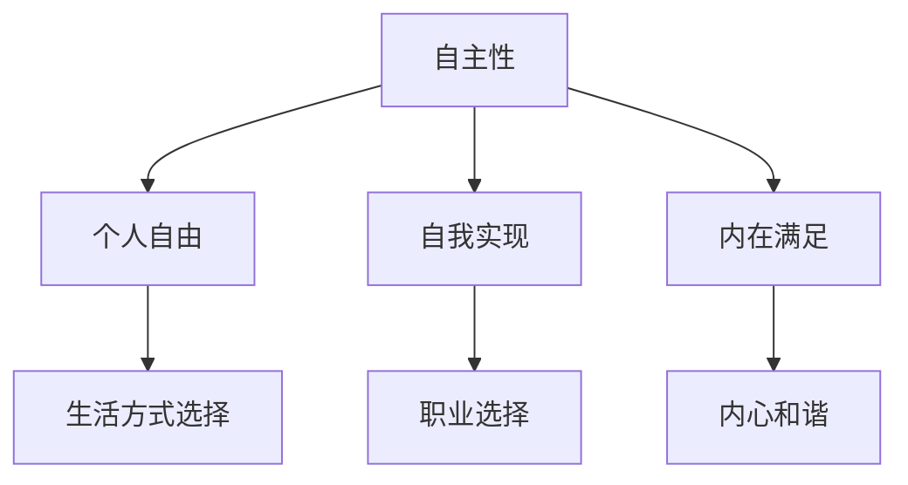

##### 4.2 平等性

在后物质主义社会，平等性被视为核心价值观之一。平等不仅体现在机会均等，还包括结果公平。人们追求的是每个人都能享有平等的社会地位、资源分配和幸福感，而不是简单的机会平等。这种平等观念打破了传统物质主义社会中的等级和阶层固化，促进了社会的流动性和包容性。

**核心概念**：平等性是指社会成员在机会、资源和社会地位上的公平。

**概念属性特征对比表格**：

| 特征          | 物质主义社会               | 后物质主义社会               |
| ------------- | -------------------------- | --------------------------- |
| 社会结构      | 等级分明，阶层固化         | 平等机会，结果公平           |
| 资源分配      | 不平等，资源集中           | 均等，资源合理分配           |
| 社会关系      | 利益驱动，关系疏远         | 共享，关系和谐               |

**ER实体关系图架构**：

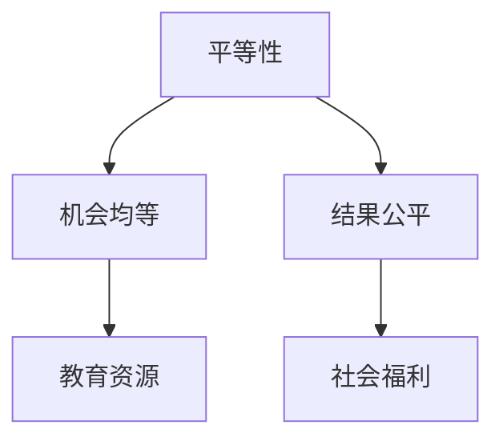

##### 4.3 社会公正

社会公正是后物质主义社会的另一个核心价值观。社会公正意味着每个人都能够享有基本的人权和福利，不因种族、性别、宗教或其他因素而受到不公平对待。社会公正不仅涉及法律制度的完善，还包括社会福利的合理分配和公共服务的均等提供。这种公正观念有助于构建一个更加和谐、包容和可持续的社会。

**核心概念**：社会公正是指社会成员在法律、福利和公共服务方面的公平对待。

**概念属性特征对比表格**：

| 特征          | 物质主义社会               | 后物质主义社会               |
| ------------- | -------------------------- | --------------------------- |
| 法律制度      | 法律形式公正，执行不公     | 法律制度公正，执行有力       |
| 社会福利      | 福利制度不完善，覆盖面窄   | 福利制度完善，覆盖面广       |
| 公共服务      | 服务不均等，资源分配不公   | 服务均等，资源分配公平       |

**ER实体关系图架构**：

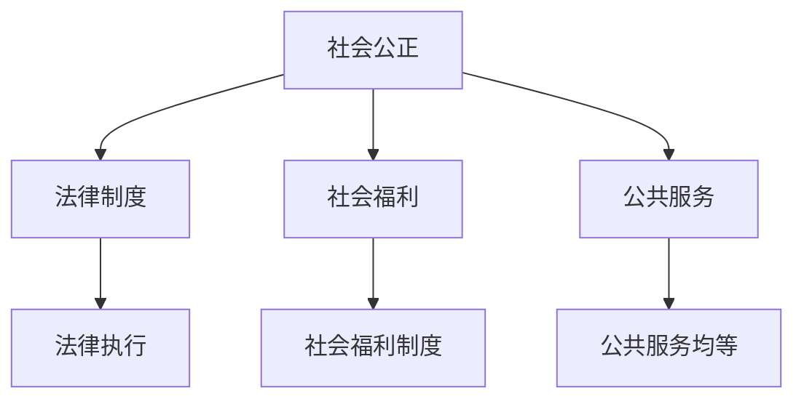

综上所述，后物质主义社会下的核心价值观——自主性、平等性和社会公正，构成了一个更加丰富和多元的幸福观。这些价值观不仅反映了人们对物质追求的超越，更体现了对精神满足和社会和谐的追求。通过深入理解这些核心价值观，我们可以更好地把握后物质主义社会的发展趋势，为构建一个更加幸福和谐的社会提供理论支持。

#### 5. 幸福观的心理学基础

幸福观不仅是一种社会学现象，更是心理学研究的核心主题。随着社会的发展，人们对幸福的追求不再局限于物质的丰盈，而是更加关注个体内心的满足和精神层面的成长。心理学为理解这种转变提供了深刻的洞见和理论基础。

##### 5.1 幸福感的来源

幸福感是个体对自身生活质量和主观感受的综合评价。心理学研究表明，幸福感来源于多个方面，主要包括：

- **正面情感**：如快乐、满足、平静等积极情感体验，是幸福感的重要来源。正面情感能够提升个体的心理状态，增强生活满意度。
- **负面情感**：尽管负面情感通常与痛苦和焦虑相关联，但它们也有助于个体的成长和自我认知。适当的负面情感体验能够让人更加珍惜正面情感，提升幸福感。
- **人际关系**：亲密的人际关系对幸福感有着重要影响。心理学研究发现，人际关系质量是幸福感的核心因素之一。良好的家庭关系、友谊和社交网络能够提供情感支持和安全感。
- **成就感**：个体在实现目标、获得成就时产生的正面体验，也是幸福感的来源之一。成就感让人感到自豪和满足，增强了自我价值感。

**核心概念**：幸福感是指个体对自身生活质量和主观感受的整体评价。

**概念属性特征对比表格**：

| 特征          | 传统幸福观               | 后物质主义幸福观               |
| ------------- | ----------------------- | ----------------------------- |
| 主观感受      | 物质条件为基础         | 精神满足和内心和谐为主           |
| 来源          | 物质财富、社会地位      | 正面情感、人际关系、成就感       |
| 重心          | 物质追求               | 精神成长和社会和谐               |

**ER实体关系图架构**：

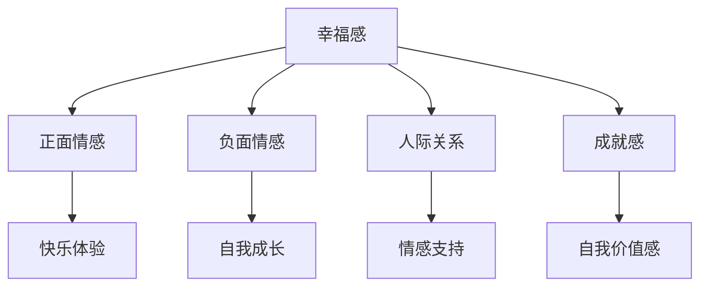

##### 5.2 心理学研究对幸福观的启示

心理学研究为后物质主义社会下的幸福观提供了宝贵的理论支持。以下是一些关键发现和启示：

- **幸福感的相对性**：心理学研究表明，幸福感在很大程度上是相对的，即个体对自身生活质量的评价受到周围环境和其他人的影响。因此，在追求幸福的过程中，人们应该注重自身与他人的比较，而非单纯追求物质上的超越。
- **内在动机的重要性**：内在动机，即个体基于自身兴趣和热情而产生的动力，是幸福的重要源泉。相比外在奖励，内在动机能够带来更加持久和深刻的幸福感。
- **社会支持的必要性**：社会支持是提升幸福感的关键因素。心理学研究显示，个体在面临压力和挑战时，来自家庭、朋友和社会的支持能够显著提高幸福感。
- **心理弹性**：心理弹性是指个体在面对逆境和挑战时的适应能力和恢复力。提升心理弹性有助于个体在困难时期保持积极心态，增强幸福感。

**核心概念**：幸福感是心理学研究的重要领域，涉及主观感受、内在动机和社会支持等多个方面。

**概念属性特征对比表格**：

| 特征          | 物质主义心理学          | 后物质主义心理学          |
| ------------- | ---------------------- | ------------------------- |
| 研究焦点      | 物质条件与行为          | 内心满足与精神成长          |
| 幸福来源      | 物质财富、社会地位      | 正面情感、内在动机、社会支持  |
| 社会影响      | 物质追求               | 精神成长和社会和谐           |

**ER实体关系图架构**：

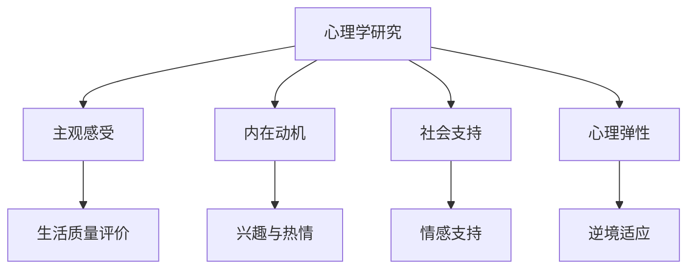

总之，心理学研究为理解后物质主义社会下的幸福观提供了深刻的洞见。幸福感不仅与物质条件相关，更与个体的内心体验和社会关系密切相关。通过深入理解心理学基础，我们可以更好地把握幸福观的内涵，为个体和社会的幸福感提升提供科学指导。

#### 6. 后物质主义社会的幸福模型

在后物质主义社会中，幸福模型不再是简单的物质满足，而是涵盖了个体、社会和环境等多个层面的复杂体系。这种幸福模型不仅考虑了经济因素，还融入了精神层面和社会公正的要素。以下是对后物质主义社会幸福模型构成要素的详细分析及其实践意义。

##### 6.1 幸福模型的构成要素

**经济因素**：虽然后物质主义强调非物质价值，但经济因素仍然是幸福模型中的重要组成部分。经济增长和财富分配的公平性影响着个体的基本生活质量和安全感。一个健康的经济发展不仅能够提供物质基础，还能促进社会稳定和公共服务的改善。

**精神层面**：个体内心的满足感是幸福的核心。这包括情感、心理状态和自我实现等方面。心理学研究指出，正面情感、内在动机和成就感对幸福感有着深远影响。因此，后物质主义幸福模型强调精神层面的满足，鼓励个体追求自我实现和精神成长。

**社会关系**：人际关系的质量对幸福感至关重要。良好的家庭关系、友谊网络和社会支持系统能够提供情感支持和安全感。在后物质主义社会中，人们更加重视人际关系的深度和质量，而不是简单的数量。

**社会公正**：社会公正不仅是后物质主义社会的核心价值观之一，也是幸福模型的重要组成部分。公正的社会制度、法律保障和社会福利能够减少不平等，提升整个社会的幸福水平。社会公正意味着每个人都能享有平等的机会和公平的待遇。

**环境因素**：环境质量对幸福也有重要影响。良好的生态环境能够提供身心健康的基础，减少环境污染和资源浪费。后物质主义幸福模型强调可持续发展，提倡绿色生活和社会责任。

**ER实体关系图架构**：

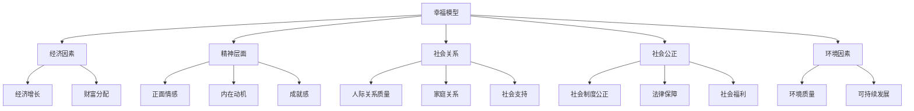

##### 6.2 幸福模型的实践意义

**促进全面发展**：后物质主义幸福模型强调了个体、社会和环境的多方面平衡，有助于实现人的全面发展。这种全面发展的理念不仅提升了个体的幸福水平，还促进了社会的和谐与进步。

**提高社会幸福感**：通过整合经济、精神、社会公正和环境等多个因素，后物质主义幸福模型能够更全面地反映社会发展的水平，提高整体幸福感。这种模型有助于政策制定者制定更加综合和有效的社会发展策略。

**推动可持续发展**：后物质主义幸福模型强调可持续发展，提倡绿色生活和环境保护。这种理念有助于减少资源浪费和环境污染，实现经济、社会和环境的协调发展。

**增强社会凝聚力**：社会公正和良好的人际关系是幸福模型的重要组成部分，有助于增强社会的凝聚力和稳定性。通过促进社会公正和人际关系的和谐，后物质主义幸福模型有助于构建一个更加包容和和谐的社会。

**促进个人成长**：后物质主义幸福模型鼓励个体追求精神层面的满足和自我实现。这种理念有助于提升个人的内在动力和自我价值感，促进个体的成长和全面发展。

总之，后物质主义社会的幸福模型是一个多层次、多维度的复杂体系，涵盖了经济、精神、社会公正和环境等多个方面。通过理解和应用这一模型，我们可以更好地把握幸福观的内涵，为个人和社会的幸福感提升提供有力的理论支持。

#### 7. GDP的局限性分析

GDP（国内生产总值）长期以来被广泛用于衡量一个国家或地区的经济发展水平，被视为衡量经济繁荣和社会进步的重要指标。然而，随着社会的发展和人们对幸福观的理解不断深化，GDP的局限性也逐渐显现出来。以下从多个角度对GDP的局限性进行分析，以揭示其在衡量社会发展和人民幸福感方面的不足。

##### 7.1 GDP的定义与计算方法

GDP是指一个国家或地区在一定时期内生产的所有最终商品和服务的市场价值总和。GDP的计算方法主要包括三种：生产法、收入法和支出法。具体来说：

- **生产法**：通过计算所有生产过程中增加的价值来计算GDP，即GDP = 最终产品价值 - 中间产品价值。
- **收入法**：通过计算所有生产过程中产生的收入（如工资、租金、利润等）来计算GDP。
- **支出法**：通过计算所有最终产品和服务的总支出（如消费、投资、政府支出和净出口等）来计算GDP。

虽然GDP的计算方法相对科学和系统，但其本质仍局限于经济层面的衡量，忽视了其他重要的社会发展因素。

##### 7.2 GDP作为衡量社会发展标准的局限性

**1. 忽视资源消耗和环境污染**

GDP仅关注经济产出的总量，而未考虑资源的消耗和环境的破坏。许多环境问题和资源浪费实际上并没有在GDP中体现，如空气污染、水污染和资源枯竭等。这些问题的存在对人类福祉和社会可持续发展构成了严重威胁，但GDP却未能准确反映。

**核心概念**：资源消耗和环境污染是指人类活动对自然资源的过度开发和环境破坏。

**概念属性特征对比表格**：

| 特征          | GDP指标             | 后物质主义指标           |
| ------------- | ------------------- | ------------------------ |
| 资源消耗      | 不反映               | 综合考虑资源利用效率       |
| 环境污染      | 不反映               | 重视生态环境保护和修复     |
| 发展评价      | 仅关注经济产出       | 经济、社会、环境综合评价   |

**ER实体关系图架构**：

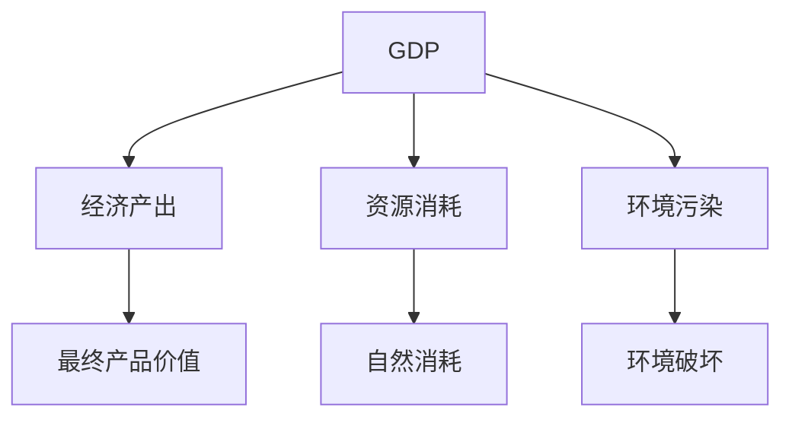

**2. 忽视社会不公和不平等**

GDP未能全面反映社会财富的分配状况，容易导致社会不公和不平等的加剧。许多国家GDP增长的同时，贫富差距却不断扩大，大量人口生活在贫困线以下。这种情况下，GDP的增长并不能真正反映社会的发展和人民的幸福感。

**核心概念**：社会不公和不平等是指财富和资源在社会成员间的分配不均衡。

**概念属性特征对比表格**：

| 特征          | GDP指标             | 后物质主义指标           |
| ------------- | ------------------- | ------------------------ |
| 财富分配      | 不反映               | 重视财富分配的公平性       |
| 社会不公      | 不反映               | 综合评估社会公正性         |
| 发展评价      | 仅关注经济产出       | 经济、社会、环境综合评价   |

**ER实体关系图架构**：

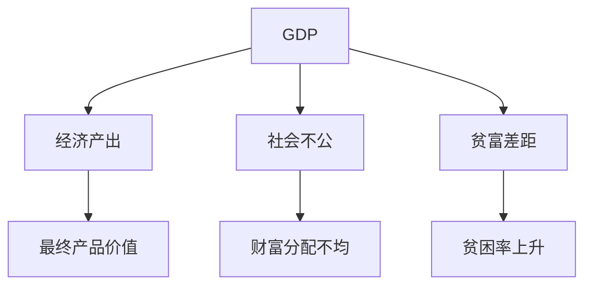

**3. 忽视生活质量和文化发展**

GDP未能充分反映人们的生活质量和文化发展水平。生活质量的提升不仅仅依赖于物质财富的积累，还包括教育、医疗、文化、社会支持等多个方面。同样，文化发展对社会的精神层面和整体幸福感也有重要影响，但这些因素在GDP中并未得到充分体现。

**核心概念**：生活质量和文化发展是指人们的生活条件和精神文化水平。

**概念属性特征对比表格**：

| 特征          | GDP指标             | 后物质主义指标           |
| ------------- | ------------------- | ------------------------ |
| 生活质量      | 不反映               | 重视生活质量的综合评价     |
| 文化发展      | 不反映               | 强调文化繁荣和创新能力     |
| 发展评价      | 仅关注经济产出       | 经济、社会、环境综合评价   |

**ER实体关系图架构**：

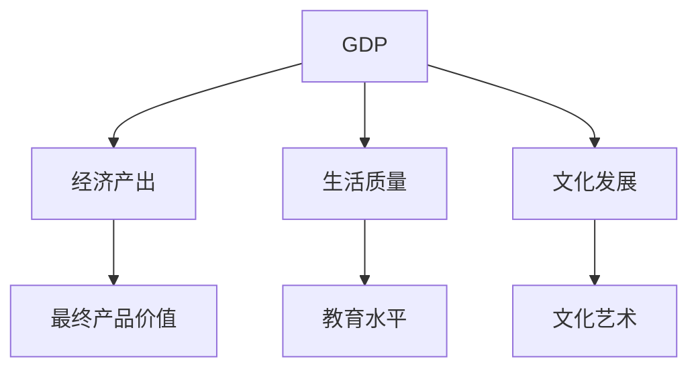

**4. 忽视心理幸福感**

GDP未能充分反映人们的主观幸福感和心理状态。尽管经济繁荣能够提供物质基础，但并不能保证个体的心理幸福感。心理压力、焦虑和抑郁等负面情绪的普遍存在，反映了GDP在衡量幸福感方面的不足。

**核心概念**：心理幸福感是指个体对自身生活满意度和心理状态的评价。

**概念属性特征对比表格**：

| 特征          | GDP指标             | 后物质主义指标           |
| ------------- | ------------------- | ------------------------ |
| 心理幸福感      | 不反映               | 重视心理健康的综合评价     |
| 发展评价      | 仅关注经济产出       | 经济、社会、环境综合评价   |

**ER实体关系图架构**：

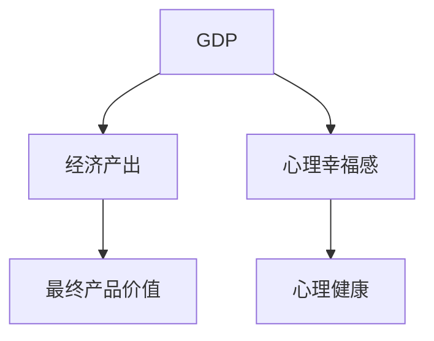

综上所述，GDP在衡量社会发展和人民幸福感方面存在明显的局限性。为了更全面和准确地评估社会发展和人民的幸福水平，我们需要探索新的衡量指标，如国民幸福总值（GNH），以便更全面地反映经济发展、社会公正、生活质量和文化发展等多方面的因素。

通过理解和分析GDP的局限性，我们可以更好地认识到单一指标无法全面反映社会发展的复杂性，从而推动更全面、更科学的政策制定和社会治理。后物质主义社会的幸福观为我们提供了一种新的视角，引导我们在追求经济发展的同时，更加关注人的全面发展和整体幸福。

#### 8. 国民幸福总值的概念与计算

国民幸福总值（Gross National Happiness，简称GNH）是一种综合性的社会发展指标，旨在更全面地反映一个国家或地区的经济社会发展水平、生活质量、心理健康和社会公正等多方面因素。与GDP单纯关注经济产出的不同，GNH提供了一个更加全面和多元的视角，为政策制定和社会治理提供了重要的参考依据。

##### 8.1 国民幸福总值的定义

国民幸福总值（GNH）是一个综合性的衡量指标，它不仅仅关注经济产出，还涵盖了社会、文化、心理和环境等多个方面。GNH的定义强调了以下几个方面：

- **经济因素**：虽然GNH不将GDP作为唯一的衡量标准，但它仍关注经济增长和财富分配的公平性。经济增长是提高生活质量的基础，但GNH更注重如何在经济增长的过程中实现公平和社会公正。
- **社会因素**：GNH重视社会关系的质量和社会公正。这包括人际关系的和谐、社会稳定和减少不平等现象。一个公正的社会制度能够保障每个人的权益，提升整体的幸福感。
- **文化因素**：GNH强调文化繁荣和传统价值观的传承。文化发展不仅丰富了人们的精神生活，还增强了社会的凝聚力和认同感。
- **心理因素**：GNH重视个体的心理健康和幸福感。心理健康和幸福感是幸福观的重要组成部分，对个体的生活质量和整体社会氛围有着深远的影响。
- **环境因素**：GNH强调环境保护和可持续发展。一个健康的生态环境不仅对人类的生存至关重要，也是实现长期幸福的基础。

**核心概念**：国民幸福总值（GNH）是一个综合性的社会发展指标，旨在衡量经济、社会、文化、心理和环境等多个方面的因素。

**概念属性特征对比表格**：

| 特征          | GDP指标             | GNH指标                 |
| ------------- | ------------------- | ---------------------- |
| 经济因素      | 单一衡量经济产出     | 经济增长与公平性         |
| 社会因素      | 无具体考量           | 社会公正与和谐           |
| 文化因素      | 无具体考量           | 文化繁荣与价值观传承       |
| 心理因素      | 无具体考量           | 心理健康与幸福感         |
| 环境因素      | 无具体考量           | 环境保护与可持续发展       |

**ER实体关系图架构**：

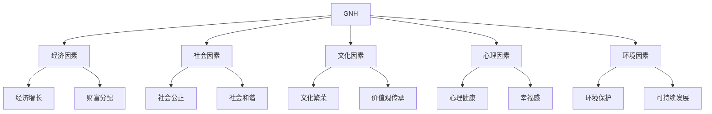

##### 8.2 国民幸福总值的计算方法

GNH的计算方法相对复杂，需要从多个维度进行综合评估。以下是一些主要的计算方法：

- **主观幸福感调查**：通过问卷调查和访谈等方式，收集人们对自身生活满意度和幸福感的评价。这种方法能够直接反映个体的心理状态和生活质量。
- **社会经济指标**：包括人均GDP、贫困率、就业率、收入分配公平性等经济指标。这些指标能够反映经济增长和社会公平性。
- **社会指标**：包括社会稳定度、社会安全感、社会不平等指数等。这些指标能够反映社会关系的质量和公正性。
- **文化指标**：包括文化参与率、文化遗产保护、文化创新等。这些指标能够反映文化繁荣和价值观传承。
- **心理健康指标**：包括心理健康水平、心理健康服务覆盖率等。这些指标能够反映个体的心理健康和幸福感。
- **环境指标**：包括环境污染指数、森林覆盖率、水资源质量等。这些指标能够反映环境保护和可持续发展。

**核心概念**：国民幸福总值的计算方法是一个综合评估体系，涵盖了经济、社会、文化、心理和环境等多个方面的指标。

**概念属性特征对比表格**：

| 指标类别 | 具体指标                       | 衡量内容         |
| -------- | ------------------------------ | ---------------- |
| 经济指标 | 人均GDP、贫困率、就业率等       | 经济增长与公平性 |
| 社会指标 | 社会稳定度、社会安全感、不平等指数 | 社会公正与和谐   |
| 文化指标 | 文化参与率、文化遗产保护、文化创新 | 文化繁荣与价值观传承 |
| 心理指标 | 心理健康水平、心理健康服务覆盖率 | 心理健康与幸福感   |
| 环境指标 | 环境污染指数、森林覆盖率、水资源质量 | 环境保护与可持续发展 |

**ER实体关系图架构**：

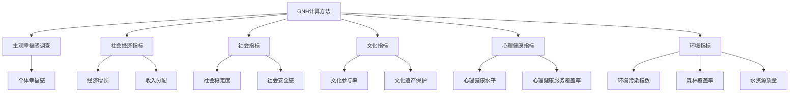

通过GNH的综合评估方法，政策制定者可以更全面地了解社会发展的各个方面，从而制定出更加科学和有效的政策。GNH不仅提供了对经济发展的评估，还关注了社会公正、文化繁荣、心理健康和环境保护等关键因素，为建设一个幸福和可持续的社会提供了重要的参考。

总之，国民幸福总值（GNH）是一个综合性、多维度的社会发展指标，它为政策制定和社会治理提供了一种全新的视角。通过计算和应用GNH，我们可以更加全面和准确地评估一个国家或地区的整体发展水平，为提升人民幸福感和实现可持续发展目标提供有力支持。

### 9. GDP与国民幸福总值的比较

在探讨国民幸福总值（GNH）之前，我们需要对GDP进行深入理解。GDP（国内生产总值）是衡量一个国家或地区经济活动总量的指标，通过计算国内生产的所有最终商品和服务的市场价值来评估经济发展。然而，随着社会的进步和人们对幸福观的理解日益深入，GDP的局限性逐渐显现。为了弥补这些局限性，GNH作为一种综合性指标应运而生。下面我们将详细比较GDP和GNH的差异，并探讨GNH在社会治理中的应用。

#### 9.1 GDP与GNH的差异

**经济角度**

GDP侧重于衡量经济产出，主要关注商品和服务的市场价值。它通过生产法、收入法和支出法计算得出，反映了经济增长的速度和规模。GDP的缺陷在于，它忽略了资源消耗、环境污染和经济不平等等因素。

GNH则更加全面，不仅考虑经济产出，还涵盖资源利用效率、环境保护、社会福利、文化发展和心理健康等方面。GNH强调经济活动的可持续性，注重经济增长与资源消耗之间的平衡。

**社会角度**

GDP仅关注经济指标，容易导致社会不公和贫富差距的扩大。GDP增长并不必然意味着社会福祉的提升，因为财富的分配可能极度不均。

GNH则关注社会公正和社会和谐，通过衡量社会稳定性、社会安全感、社会不平等指数等指标来评估社会健康。GNH强调每个人都能享有公平的机会和资源，从而提升整体社会的幸福感。

**环境角度**

GDP未能反映环境成本，忽视了资源消耗和环境污染对经济发展的负面影响。环境破坏不仅损害了人类健康，还威胁到长期的经济可持续发展。

GNH将环境保护纳入评估体系，重视可持续发展，通过衡量环境污染指数、森林覆盖率、水资源质量等指标来评估环境状况。GNH强调在经济发展过程中要实现生态保护和资源的高效利用。

**文化角度**

GDP未将文化发展纳入衡量范围，忽视了文化繁荣对幸福感和社会凝聚力的重要性。文化传统和创新对社会的精神层面有深远影响。

GNH强调文化繁荣和价值观传承，通过衡量文化参与率、文化遗产保护、文化创新等指标来评估文化发展。GNH认为文化多样性和创新是社会发展的重要组成部分。

**心理健康角度**

GDP未能反映个体的心理健康状态，忽视了心理健康对幸福感和社会稳定的影响。

GNH则重视心理健康，通过心理健康水平、心理健康服务覆盖率等指标来评估个体的幸福感。GNH认为心理健康是幸福感的重要组成部分，对整体社会的福祉有着重要影响。

#### 9.2 GDP与GNH的对比表格

| 指标类别 | GDP指标            | GNH指标            |
| -------- | ------------------- | ------------------- |
| 经济角度 | 经济增长速度和规模 | 经济增长与公平性    |
| 社会角度 | 社会不平等和经济不均 | 社会公正与社会和谐   |
| 环境角度 | 资源消耗和环境污染 | 环境保护和可持续发展 |
| 文化角度 | 无具体考量         | 文化繁荣与价值观传承 |
| 心理健康角度 | 无具体考量         | 心理健康与幸福感     |

#### 9.3 GNH在社会治理中的应用

GNH作为综合性指标，为社会治理提供了新的视角和工具。以下是一些具体应用场景：

**政策制定**：政府可以通过GNH指标体系评估政策对社会发展的影响，从而制定更加科学和有效的政策。例如，在环境保护政策制定中，不仅考虑经济发展，还要评估对环境质量和居民幸福感的影响。

**经济发展策略**：GNH强调了经济发展与资源利用效率的平衡，有助于引导企业和社会在追求经济效益的同时，注重可持续发展。这种策略可以减少资源浪费，提高生产效率，实现经济的长期稳定增长。

**社会公平**：GNH关注社会公正和社会和谐，通过评估社会不平等指数和福利分配，可以促进社会公平。政策制定者可以通过调整税收政策、社会保障和公共投资，减少贫富差距，提升整体社会的幸福感。

**心理健康**：GNH重视心理健康，可以引导社会关注心理健康问题，提供必要的心理服务和资源。通过提高心理健康水平，可以提升居民的幸福感和生活质量。

**文化繁荣**：GNH将文化繁荣纳入评估体系，可以促进文化保护和创新发展。政策制定者可以通过支持文化遗产保护、鼓励文化创作和提升文化教育水平，增强社会的文化自信和凝聚力。

总之，GDP和GNH在衡量社会发展方面各有优劣。GDP提供了对经济发展的简单评估，但忽略了其他重要因素；而GNH则提供了一个更加全面和多元的视角，考虑了经济、社会、环境、文化和心理健康等多个方面。通过应用GNH，政府和社会可以更全面地评估社会发展水平，为构建幸福和可持续的社会提供有力支持。

### 10. 政策制定与国民幸福总值

国民幸福总值（GNH）作为一种综合性的社会发展指标，对政策制定具有深远影响。通过引入GNH，政策制定者可以在更广泛的社会维度上评估政策效果，从而制定出更加科学、全面和有效的政策。以下从多个角度分析国民幸福总值对政策制定的影响，并结合实际案例分析如何根据GNH调整政策。

#### 10.1 国民幸福总值对政策制定的影响

**1. 关注社会公正与公平**

GNH强调了社会公正和公平的重要性。政策制定者需要通过调整税收、社会保障和公共服务等政策，减少贫富差距，提升社会公平。例如，通过增加对低收入家庭的税收减免和福利补贴，可以提升他们的生活质量和幸福感。

**2. 促进环境保护与可持续发展**

GNH将环境保护和可持续发展纳入评估体系，要求政策制定者在经济发展过程中，注重生态保护和资源的高效利用。政策制定者可以通过推广可再生能源、限制污染物排放、加强环境保护立法等措施，实现经济与环境的协调发展。

**3. 重视心理健康与幸福感**

GNH重视个体的心理健康和幸福感，要求政策制定者在制定政策时，关注心理健康服务和社会支持系统的建设。例如，通过增加心理健康服务资源的投入、提供心理咨询服务和建立社区支持网络，可以提升居民的心理健康水平，从而提高整体社会的幸福感。

**4. 强化文化保护和传承**

GNH强调文化繁荣和价值观传承，政策制定者需要通过支持文化教育、文化遗产保护和文化创作等措施，促进文化多样性和创新。例如，通过增加文化教育投入、建立文化遗产保护机构和鼓励文化创作，可以增强社会的文化自信和凝聚力。

**5. 促进社会参与和公民权利**

GNH关注社会参与和公民权利，要求政策制定者鼓励公民参与社会事务，保障他们的合法权益。例如，通过推广公民教育、增加公民参与公共事务的机会和建立公平的司法体系，可以提升社会的透明度和公正性，增强公民的归属感和幸福感。

#### 10.2 实际案例分析：如何根据国民幸福总值调整政策

**案例一：减少贫富差距**

在某个发展中国家，GNH评估显示社会不平等指数较高，贫富差距显著。政策制定者决定通过以下措施调整政策：

- **税收政策调整**：提高高收入者的税收比例，减轻低收入家庭的税收负担。
- **社会保障政策**：增加对低收入家庭的福利补贴，提高社会保障水平。
- **就业政策**：提供就业培训和支持，促进就业机会的创造和分配，减少失业率。

通过这些措施，政策制定者希望减少贫富差距，提升社会公平和幸福感。

**案例二：环境保护与可持续发展**

在一个高度工业化的国家，GNH评估显示环境污染问题严重，对居民健康和生活质量产生了负面影响。政策制定者决定采取以下措施：

- **能源政策**：推广可再生能源，限制化石燃料的使用，减少温室气体排放。
- **环境立法**：加强环境保护法律法规的执行，提高污染企业的环保标准和处罚力度。
- **绿色经济**：支持绿色产业的发展，促进经济与环境的协调发展。

通过这些措施，政策制定者希望改善环境质量，实现可持续发展，提升国民幸福感。

**案例三：心理健康服务建设**

在某个国家，GNH评估显示居民心理健康水平较低，心理问题对生活质量产生了较大影响。政策制定者决定采取以下措施：

- **心理健康服务资源投入**：增加心理健康服务机构的投入，提高心理咨询服务覆盖率。
- **心理健康教育**：在学校和社区推广心理健康教育，提高公众对心理健康问题的认识和应对能力。
- **心理支持网络**：建立社区支持网络，为心理问题严重的居民提供社会支持和资源。

通过这些措施，政策制定者希望提高居民的心理健康水平，提升整体社会的幸福感。

**案例四：文化保护和传承**

在某个文化多元的国家，GNH评估显示文化保护和传承面临挑战。政策制定者决定采取以下措施：

- **文化教育投入**：增加文化教育资源的投入，推广多元文化教育，增强文化认同感。
- **文化遗产保护**：加强对文化遗产的保护和管理，防止文化丢失和破坏。
- **文化创作支持**：鼓励文化创作，支持艺术家和文化产业的发展，促进文化创新。

通过这些措施，政策制定者希望增强社会的文化自信和凝聚力，提升国民幸福感。

总之，国民幸福总值（GNH）为政策制定提供了新的视角和工具。通过关注社会公正、环境保护、心理健康、文化保护和公民权利等方面，政策制定者可以更全面地评估政策效果，制定出更加科学、全面和有效的政策，从而提升社会的整体幸福水平。

### 11. 经济发展与国民幸福总值

在探讨国民幸福总值（GNH）与经济发展之间的关系时，我们不仅要关注经济增长的速率，还需要考虑经济增长的质和持续性。国民幸福总值的理念强调，经济发展不仅仅是GDP的上升，更应包括人民生活质量的提升和社会各方面的协调发展。以下从经济学视角分析国民幸福总值与经济增长的关系，并提出如何通过经济发展提升国民幸福总值的策略。

#### 11.1 国民幸福总值与经济增长的关系

**1. 经济增长对国民幸福总值的影响**

经济增长是提升国民幸福总值的基础。GDP的增长意味着社会生产总值的提升，为公共服务的改善和社会福利的提高提供了物质基础。然而，单纯的经济增长并不足以确保国民幸福总值的提升。经济增长的效果需要通过以下途径传导到国民幸福总值：

- **提高就业水平**：经济增长带来更多的就业机会，减少失业率，提升居民的收入水平和生活质量。
- **提升收入分配公平性**：经济增长不仅要看总量，更要看分配。通过税收和社会保障政策，实现财富的再分配，减少贫富差距。
- **改善基础设施和社会服务**：经济增长可以为基础设施建设提供资金，提升医疗、教育和住房等公共服务水平，从而提升居民的生活质量。
- **促进环境可持续发展**：经济增长需要考虑环境保护，避免过度开发和资源浪费，实现经济与环境的协调发展。

**2. 国民幸福总值对经济增长的反馈**

国民幸福总值的提升也会对经济增长产生积极的反馈效应。一个幸福的社会通常具有以下特点：

- **更高的生产效率**：幸福的员工通常更投入工作，生产效率更高，有助于提升整体经济的竞争力。
- **更强的创新动力**：幸福感强的人群通常更加积极、有创造力，能够推动技术进步和产业升级。
- **更好的社会稳定**：社会稳定有助于减少社会动荡和冲突，为经济发展提供稳定的社会环境。
- **更高的消费能力**：幸福感强的人群通常有更高的消费能力，能够带动内需增长，促进经济发展。

#### 11.2 如何通过经济发展提升国民幸福总值

**1. 提高就业质量和就业率**

就业是提高国民幸福总值的重要途径。政府可以通过以下措施提升就业质量：

- **教育和培训**：投资教育和职业培训，提升劳动者的技能水平，提高就业竞争力。
- **扶持中小企业**：鼓励中小企业发展，提供贷款和税收优惠政策，创造更多的就业机会。
- **促进创业**：建立创业支持体系，为创业者提供资金、技术和市场支持，促进就业和经济增长。

**2. 实现收入分配公平**

通过税收和社会保障政策，实现收入再分配，减少贫富差距。具体措施包括：

- **累进税制**：对高收入者征收更高的税率，降低低收入者的税负。
- **社会保障**：建立完善的社会保障体系，提供医疗、养老、失业等保障，减轻低收入群体的生活压力。
- **公共投资**：加大对公共服务的投资，如教育、医疗、住房等，提升全民生活质量。

**3. 促进环境保护与可持续发展**

环境保护与国民幸福总值的提升密切相关。经济发展过程中，必须考虑环境保护：

- **绿色经济**：推动绿色经济的发展，减少对自然资源的消耗，提高资源利用效率。
- **环境立法**：加强环境保护法律法规的建设和执行，对环境污染行为进行严格监管和处罚。
- **环保教育**：加强环保教育，提高公众的环保意识，促进环保行为的普及。

**4. 优化公共服务体系**

公共服务是提升生活质量的重要保障。政府可以通过以下措施优化公共服务体系：

- **教育投入**：加大对教育的投入，提高教育质量和普及率，为全民提供更好的教育资源。
- **医疗服务**：完善医疗服务体系，提高医疗服务水平，确保居民能够得到及时、有效的医疗照顾。
- **住房保障**：提供廉租房和经济适用房，解决居民的住房问题，提升居民的生活质量。

**5. 促进社会参与和公民权利**

社会参与和公民权利的提升有助于增强社会的凝聚力和幸福感。政府可以通过以下措施促进社会参与：

- **公民教育**：推广公民教育，提高公众对社会事务的认识和参与度。
- **公众参与**：鼓励公众参与公共决策，提高政策的透明度和公正性。
- **司法保障**：加强司法体系建设，保障公民的合法权益，提升社会的公平性和正义感。

总之，国民幸福总值与经济发展密切相关。通过实现就业质量的提升、收入分配的公平、环境保护和公共服务的优化，以及促进社会参与和公民权利，我们可以通过经济发展不断提升国民幸福总值，实现经济与社会的协调发展。

### 12. 社会福利与国民幸福总值

社会福利是国民幸福总值（GNH）的重要组成部分，它不仅关系到个体的基本生活质量，还直接影响社会的整体稳定与和谐。社会福利包括医疗、教育、住房、养老等多个方面，通过提供必要的保障和服务，有助于提升国民的幸福感和生活质量。以下从多个角度分析社会福利对国民幸福总值的影响，并探讨如何优化社会福利制度以提升国民幸福总值。

#### 12.1 社会福利对国民幸福总值的影响

**1. 提高生活质量**

社会福利提供了基本的生活保障，如医疗、教育和住房等，使人们能够免受基本生活需求的困扰。当个体能够获得良好的医疗服务、教育资源和高品质的住房时，他们的生活质量会显著提升，从而增加幸福感。

**2. 减少贫困和不平等**

社会福利制度通过提供低收入家庭和贫困人口的补贴和救助，有助于减少贫困和不平等现象。公平的社会福利分配能够缩小收入差距，提高社会公正性，从而提升整体社会的幸福感。

**3. 促进社会稳定**

一个完善的社会福利体系有助于缓解社会矛盾，减少社会冲突，促进社会稳定。当人们感到自己的生活得到保障，社会问题得到解决时，社会的整体稳定性会得到提升，这有利于国民幸福总值的提高。

**4. 提升心理健康**

社会福利不仅提供物质保障，还提供心理支持。例如，医疗保健和心理咨询服务能够帮助人们应对生活中的压力和困扰，提升心理健康水平，进而增强幸福感。

**5. 促进社会参与**

社会福利制度鼓励人们积极参与社会事务，增强社会责任感。当个体感到自己能够对社会有所贡献时，他们的自我价值感和社会认同感会增强，从而提升幸福感。

#### 12.2 社会福利制度的优化与国民幸福总值的提升

**1. 提高医疗服务的可及性和质量**

医疗服务的可及性和质量对国民幸福总值有重要影响。政府可以通过以下措施优化医疗服务：

- **增加医疗资源投入**：提高医疗机构的数量和医疗设备的更新，提升医疗服务能力。
- **推广健康保险制度**：扩大健康保险覆盖范围，减轻居民的医疗费用负担。
- **提升医疗服务质量**：加强医疗服务培训，提高医护人员素质，提供更高质量的医疗服务。

**2. 加强教育投入与改革**

教育是提升国民幸福总值的重要手段。政府可以通过以下措施优化教育体系：

- **增加教育经费**：提高教育经费投入，改善学校基础设施和教学设备。
- **改革教育体制**：推进教育公平，消除教育歧视，提高教育质量。
- **职业教育与培训**：提供多样化的职业教育和培训，提升劳动者的技能水平，增加就业机会。

**3. 提供高质量的住房保障**

住房是人们生活的基本需求。政府可以通过以下措施优化住房保障体系：

- **建设经济适用房**：增加经济适用房供应，解决低收入家庭的住房问题。
- **改进住房政策**：提供租房补贴和购房优惠政策，减轻居民的住房负担。
- **改善居住环境**：提升居住区的环境和配套设施，提高居民的生活质量。

**4. 建立健全的社会保障体系**

社会保障体系是提升国民幸福总值的重要支柱。政府可以通过以下措施完善社会保障：

- **扩大社会保障覆盖面**：提高社会保障的覆盖范围，确保更多人能够享受到基本的社会保障。
- **提高社会保障水平**：增加社会保障金，提高养老金、失业金和医疗补助等福利待遇。
- **优化社会保障管理**：提高社会保障管理的效率和透明度，确保社会保障资金的合理使用。

**5. 加强社会福利服务**

社会福利服务包括养老、儿童保护、心理服务等。政府可以通过以下措施加强社会福利服务：

- **增加社会福利服务投入**：提高社会福利服务的资金投入，确保社会福利服务的质量和覆盖面。
- **提升社会福利服务质量**：加强社会福利服务人员的培训，提高服务专业水平。
- **创新社会福利服务模式**：利用科技手段，提升社会福利服务的便捷性和效率。

总之，社会福利对提升国民幸福总值具有重要作用。通过优化医疗、教育、住房和社会保障等服务，政府可以提升居民的生活质量和幸福感，促进社会稳定和谐，实现国民幸福总值的提升。

### 跨学科视角下的国民幸福总值

国民幸福总值（GNH）的探讨不仅局限于经济和社会领域，还需要从社会学、心理学和经济学等多个学科视角进行分析，以全面理解和提升国民幸福总值。以下将从社会学研究视角、心理学研究视角和经济学研究视角，分别探讨国民幸福总值的影响因素和提升策略。

#### 13.1 社会学视角下的国民幸福总值

**1. 社会结构与国民幸福总值的关系**

社会学视角关注社会结构对社会个体的影响。社会结构包括家庭、教育、职业、经济和社会组织等多个方面，这些结构的合理性和公正性直接影响国民幸福总值。

- **家庭结构**：稳定和谐的家庭关系是国民幸福总值的基础。家庭功能失调，如离婚率高、家庭成员间冲突多，会导致个体幸福感下降。
- **教育结构**：良好的教育机会和优质的教育资源能够提升个体的知识和技能，增强自我实现感，进而提高幸福感。
- **职业结构**：职业稳定性和职业发展机会对个体幸福感有重要影响。高失业率和低收入会影响个体和家庭的生活质量。
- **社会组织**：社会组织如社区、宗教团体和志愿组织等，能够提供社会支持，增强个体的社会归属感和幸福感。

**2. 社会运动与国民幸福总值的提升**

社会运动是一种重要的社会变革力量，能够推动社会公正和人民幸福感的提升。社会运动包括环保运动、女权运动、反贫困运动等，它们通过提高公众意识、推动政策变革和促进社会参与，有助于提升国民幸福总值。

- **提高社会参与度**：社会运动鼓励公众参与公共事务，提高公民意识和责任感，增强社会凝聚力。
- **推动政策变革**：社会运动能够推动政府和社会各界关注和解决社会问题，如贫困、不平等和环境污染等，从而提升国民幸福总值。

#### 13.2 心理学视角下的国民幸福总值

**1. 心理健康与国民幸福总值的关系**

心理学视角关注个体的心理健康状态对幸福感的影响。心理健康包括情感健康、心理平衡和自我效能感等方面，对国民幸福总值有重要影响。

- **情感健康**：积极的情感体验，如快乐、满足和爱，能够提升幸福感。而消极的情感，如焦虑、抑郁和恐惧，会降低幸福感。
- **心理平衡**：个体心理平衡状态，即心理稳定和情绪调节能力，能够帮助个体更好地应对生活中的压力和挑战，提升幸福感。
- **自我效能感**：个体对自身能力的信心和自我价值感，是幸福感的重要来源。高自我效能感的人更容易实现目标，获得成就感，从而提高幸福感。

**2. 心理干预在提升国民幸福总值中的应用**

心理干预是一种有效的提升个体幸福感的方法。政府和社会可以通过以下方式提供心理干预服务：

- **心理健康教育**：普及心理健康知识，提高公众的心理健康意识，鼓励个体积极应对心理问题。
- **心理咨询与治疗**：提供专业的心理咨询和治疗服务，帮助个体解决心理困扰，提升心理健康水平。
- **心理支持网络**：建立社区心理支持网络，为心理问题严重的个体提供社会支持和资源。

#### 13.3 经济学视角下的国民幸福总值

**1. 国民幸福总值与经济发展模式的转变**

经济学视角关注经济发展模式对国民幸福总值的影响。传统的经济增长模式主要关注GDP的增长，而忽略了资源消耗、环境污染和社会不公等问题。新的经济发展模式强调可持续发展，关注经济增长的质量和可持续性。

- **绿色发展**：推动绿色经济的发展，减少对自然资源的消耗，降低环境污染，提升生态质量。
- **共享经济**：通过共享资源和服务，提高资源利用效率，减少浪费，促进社会公平和共享。
- **创新驱动**：鼓励创新，提高生产效率，推动产业结构升级，提升经济竞争力。

**2. 国民幸福总值的经济学分析框架**

经济学分析框架为理解国民幸福总值提供了理论工具。以下是一个简单的经济学分析框架：

- **生产要素**：劳动力、资本、自然资源和企业家精神是生产国民幸福总值的基本要素。
- **生产函数**：通过优化生产要素的组合，实现国民幸福总值的最大化。
- **成本-效益分析**：评估政策、项目和活动对国民幸福总值的成本和效益，确保资源的合理利用。

**3. 经济政策与国民幸福总值的提升**

政府的经济政策对国民幸福总值有重要影响。以下是一些有效的经济政策：

- **税收政策**：通过合理的税收政策，实现财富再分配，减少贫富差距，提升社会公正。
- **社会保障政策**：提供完善的社会保障体系，保障低收入群体的基本生活需求，提升生活质量。
- **教育政策**：投资教育和培训，提升人力资本，增强个体的自我实现感，提升幸福感。
- **环境保护政策**：加强环境保护，减少环境污染，提升生态质量，促进可持续发展。

综上所述，国民幸福总值的提升需要跨学科的视角和综合的政策措施。通过社会学、心理学和经济学等多个学科的研究，我们可以更全面地理解国民幸福总值的影响因素，并制定出更加科学和有效的政策，提升社会的整体幸福感。

### 16. 国际案例研究

在全球范围内，许多国家和地区在提升国民幸福总值方面进行了积极探索和实践，形成了各具特色的幸福观和实现路径。以下将介绍几个具有代表性的国际案例，分析这些国家在提升国民幸福总值方面的成功经验和策略。

#### 16.1 高福利国家的幸福观与实践

**1. 瑞士**

瑞士是一个以高福利和高质量生活著称的国家，其国民幸福总值在全球名列前茅。瑞士的幸福观强调个人自由、社会公正和环境保护。具体措施包括：

- **完善的社会保障体系**：瑞士拥有全面的社会保障体系，包括医疗保险、养老保险、失业保险和残疾保险等，确保居民的基本生活需求得到满足。
- **高税收与高福利**：瑞士通过高税收支持高福利政策，实现了财富再分配，缩小了贫富差距，提高了社会公正性。
- **环境保护**：瑞士高度重视环境保护，推行绿色发展政策，减少了环境污染和资源浪费，提升了生态质量。

**2. 挪威**

挪威是另一个以高福利和高质量生活著称的国家，其国民幸福总值在世界上享有盛誉。挪威的幸福观注重社会公正、个人自由和可持续发展。具体措施包括：

- **全民福利**：挪威提供全民免费教育、免费医疗和养老金等福利，确保居民的基本生活需求得到满足。
- **可再生能源**：挪威积极发展可再生能源，减少对化石燃料的依赖，实现了经济的绿色转型。
- **社会参与**：挪威鼓励公民参与社会事务，提高社会凝聚力，增强了居民的归属感和幸福感。

#### 16.2 发展中国家的国民幸福总值提升策略

**1. 巴厘岛，印度尼西亚**

巴厘岛是一个典型的发展中国家，但在提升国民幸福总值方面取得了显著成效。巴厘岛的幸福观强调文化保护、可持续发展和社区参与。具体措施包括：

- **文化保护**：巴厘岛重视传统文化和遗产的保护，通过推广文化活动和节庆，增强了居民的文化认同感。
- **可持续发展**：巴厘岛推动绿色旅游和生态农业，实现了经济发展与环境保护的协调。
- **社区参与**：巴厘岛鼓励居民参与社区事务，建立社区支持网络，提高了社区的凝聚力和幸福感。

**2. 不丹**

不丹是世界上第一个将国民幸福总值（GNH）纳入国家发展战略的国家。不丹的幸福观强调平衡经济发展与社会和谐、环境保护和精神成长。具体措施包括：

- **绿色经济**：不丹注重绿色发展，通过发展可再生能源、限制森林砍伐和保护生态环境，实现了经济的可持续性。
- **社会公正**：不丹推行全民免费教育、免费医疗和社会福利政策，提高了社会公正性。
- **精神成长**：不丹鼓励公民追求精神成长，通过宗教、文化和教育等途径，提升了居民的精神满足感。

#### 16.3 案例分析与启示

**1. 经验与启示**

从上述案例可以看出，提升国民幸福总值的策略多样，但都强调以下几个关键方面：

- **社会公正与公平**：通过完善的社会保障体系和税收政策，实现财富再分配，缩小贫富差距，提高社会公正性。
- **可持续发展**：注重环境保护和资源利用效率，推动绿色经济和可持续发展，提升生态质量。
- **文化传承与创新**：保护和传承传统文化，同时鼓励文化创新，增强居民的文化认同感和幸福感。
- **社会参与与社区支持**：鼓励公民参与社会事务，建立社区支持网络，提高社会凝聚力和居民的幸福感。

**2. 挑战与展望**

尽管许多国家在提升国民幸福总值方面取得了显著成效，但仍然面临以下挑战：

- **经济不平等**：在经济全球化和技术变革的背景下，经济不平等问题日益突出，需要采取更加有效的政策加以解决。
- **环境压力**：随着人口增长和工业化进程的加快，环境压力不断增大，需要加强环境保护和可持续发展的政策。
- **心理健康问题**：现代社会的快节奏生活和工作压力导致心理健康问题日益严重，需要加强心理健康服务和心理支持网络的建设。

展望未来，提升国民幸福总值需要多方面的努力和综合的政策措施。各国可以从上述案例中吸取经验和教训，结合自身国情，探索适合本国的提升国民幸福总值的路径。通过社会公正、可持续发展、文化传承与社会参与等多方面的努力，我们可以共同构建一个更加幸福和谐的社会。

### 17. 国内案例研究

#### 17.1 我国国民幸福总值的发展现状

近年来，中国在经济快速发展和社会变革的过程中，国民幸福总值（GNH）逐渐成为政策制定和社会关注的焦点。以下从经济、社会、文化、心理和环境等多个维度分析我国GNH的发展现状。

**1. 经济维度**

随着中国经济的持续增长，GDP水平不断提高，为提升国民幸福总值奠定了物质基础。根据国家统计局数据，2022年中国GDP总量达到114.37万亿元，同比增长8.4%。然而，单纯的经济增长并不能完全反映国民幸福总值的提升，因此需要关注经济增长的质量和可持续性。例如，通过推动产业结构升级和绿色经济发展，减少资源浪费和环境污染，实现经济与环境的协调发展。

**2. 社会维度**

我国在社会福利方面取得了一定的进展，但仍存在一些挑战。随着社会保障体系的不断完善，医疗保险、养老保险和失业保险等基本社会保障覆盖面不断扩大。2022年底，全国基本养老保险参保人数达到10.4亿人，基本医疗保险参保人数达到13.6亿人。然而，城乡差距、区域差距和收入差距问题依然存在，需要进一步采取措施缩小贫富差距，提升社会公正性。

**3. 文化维度**

文化繁荣和文化传承是我国GNH的重要组成部分。近年来，我国政府高度重视文化产业的发展，出台了一系列政策措施，推动文化事业和文化产业的繁荣。例如，通过加大对文化基础设施的投入、推动文化创意产业的发展和加强文化遗产保护，提升了国民的文化认同感和幸福感。同时，随着文化教育水平的提升，人们的文化素养和审美能力也在不断提高。

**4. 心理维度**

心理健康问题日益受到关注，政府和社会对心理健康的重视程度不断提高。近年来，我国心理卫生服务体系逐渐完善，心理健康教育和心理咨询服务的普及率逐渐提高。2022年，全国精神卫生中心成立，推动心理健康服务的全面覆盖。尽管如此，心理健康问题仍然是一个亟待解决的难题，需要进一步加大心理健康服务和心理干预的投入。

**5. 环境维度**

环境保护和生态建设是我国GNH的重要方面。近年来，我国政府高度重视生态文明建设，通过实施绿色发展政策、加强环境立法和推进绿色经济发展，不断改善生态环境质量。例如，通过加大植树造林、推行清洁能源和严格环境监管，显著降低了污染物的排放。然而，环境污染问题仍然是一个长期而艰巨的挑战，需要持续加大环境保护力度。

#### 17.2 我国国民幸福总值的提升路径

为了进一步提升我国国民幸福总值，需要在以下几个方面采取具体措施：

**1. 经济维度**

- **推动产业结构优化**：通过促进高技术产业和服务业的发展，提高经济增长的质量和可持续性。
- **推动绿色经济发展**：加大对绿色技术的研发和应用，推动能源结构优化和资源利用效率提升，减少环境污染和生态破坏。

**2. 社会维度**

- **完善社会保障体系**：进一步扩大社会保障覆盖面，提高社会保障水平，特别是加大对低收入群体的保障力度，缩小城乡和区域差距。
- **推动社会公正**：通过税收政策和社会保障政策，实现财富再分配，减少贫富差距，提高社会公正性。

**3. 文化维度**

- **加强文化保护与传承**：加大对文化遗产的保护力度，推动传统文化和现代文化的融合，提升国民的文化素养和认同感。
- **促进文化产业发展**：通过政策支持和资金投入，推动文化产业的发展，提升文化产业的规模和竞争力。

**4. 心理维度**

- **加强心理健康服务**：加大对心理健康服务和心理干预的投入，提高心理健康服务的覆盖率和质量，提升国民的心理健康水平。
- **推广心理健康教育**：通过教育和宣传，提高公众对心理健康问题的认识和重视，培养良好的心理素质。

**5. 环境维度**

- **加强环境保护**：通过加强环境立法和监管，严格环境标准，加大对环境污染行为的处罚力度，提升生态环境质量。
- **推动绿色生活方式**：通过政策和宣传，引导公众养成绿色生活方式，减少资源浪费和环境污染。

总之，提升我国国民幸福总值需要多方面的综合措施。通过推动经济、社会、文化、心理和环境的协调发展，我们可以逐步实现国民幸福总值的提升，构建一个更加幸福和谐的社会。

### 18. 案例分析与启示

#### 18.1 国民幸福总值的实践应用

通过国际和国内的案例研究，我们可以看到，国民幸福总值（GNH）作为一种综合性的发展指标，已经在多个国家和地区得到了成功应用。以下是几个具有代表性的案例，分析其在实践中的具体应用和效果。

**案例一：不丹的GNH实践**

不丹是世界上第一个将GNH纳入国家发展战略的国家。不丹的GNH实践主要包括以下几个方面：

- **绿色经济**：不丹积极发展可再生能源，减少对化石燃料的依赖，实现了经济的绿色转型。通过实施“绿色国民幸福总值”（Green GNH）政策，不丹在环境保护和可持续发展方面取得了显著成效。
- **社会公正**：不丹政府通过实施全民免费教育和医疗，确保每个人都能够享受到基本的社会服务。这种政策有效地减少了贫困和不平等现象，提升了国民的幸福感。
- **精神成长**：不丹注重传统文化的保护和传承，通过推广佛教文化和民间艺术，提升国民的文化认同感和精神满足感。

**效果分析**：不丹的GNH实践取得了一定的成效，尽管该国经济规模较小，但国民幸福感较高，社会稳定，环境质量得到显著改善。

**案例二：瑞士的GNH实践**

瑞士作为一个高福利国家，其GNH实践主要侧重于社会公正和环境保护：

- **社会保障体系**：瑞士拥有完善的社会保障体系，包括医疗保险、养老保险和失业保险等。这种体系确保了居民的基本生活需求得到满足，减少了贫困和社会不公。
- **环境保护**：瑞士高度重视环境保护，通过严格的环保政策和绿色经济发展，实现了经济的可持续发展。瑞士的空气质量、水质和森林覆盖率等环境指标均处于世界领先水平。

**效果分析**：瑞士的GNH实践使国民享受到了高质量的生活，社会稳定，居民幸福感高，同时保持了良好的生态环境。

**案例三：中国的GNH实践**

中国近年来也开始重视GNH的实践，通过以下几个方面推动国民幸福总值的提升：

- **经济发展**：中国通过推动产业结构升级和绿色经济发展，提高了经济增长的质量和可持续性。同时，通过减税降费和就业政策，提升了居民的收入水平和生活质量。
- **社会福利**：中国不断扩大社会保障覆盖面，提高社会保障水平，特别是在医疗保险、养老保险和住房保障等方面取得了显著进展。
- **环境保护**：中国通过实施绿色发展战略，加大对环保的投入，提高环境质量，推动生态文明建设。

**效果分析**：中国的GNH实践在提高国民幸福感方面取得了一定成效，但还存在经济不平等、环境污染等问题，需要继续加强社会公正和环境保护方面的努力。

#### 18.2 国民幸福总值研究中的挑战与展望

尽管国民幸福总值（GNH）在实践中的应用取得了一定的成果，但研究中仍面临以下挑战：

**1. 数据获取与衡量问题**

GNH涉及多个维度，包括经济、社会、文化、心理和环境等方面，如何准确获取和衡量这些数据是一个重要挑战。目前，很多国家和地区的GNH研究还依赖于传统的GDP数据，缺乏全面的、多维度的指标体系。

**2. 政策实施与执行问题**

GNH的实践需要多部门、多层面的协调与合作，政策的实施和执行面临着诸多困难。如何确保政策的科学性、有效性和持续性，是一个亟待解决的问题。

**3. 经济发展与环境保护的平衡**

在追求经济发展的同时，如何实现环境保护和可持续发展，是一个长期的挑战。许多国家和地区在推动绿色经济发展过程中，面临着技术、资金和制度等方面的障碍。

**展望未来，国民幸福总值（GNH）研究与实践前景广阔。以下是一些建议：**

**1. 完善指标体系**

构建一个全面、科学和可操作的GNH指标体系，是提升GNH研究水平的关键。需要借鉴国际经验，结合本国国情，制定符合国情的GNH指标体系。

**2. 加强跨学科研究**

GNH涉及多个学科领域，需要加强跨学科合作，综合运用经济学、社会学、心理学、环境科学等多学科的理论和方法，提升GNH研究的深度和广度。

**3. 政策创新与实施**

通过政策创新和实施，推动GNH的实践。政府需要制定出具体、可操作的政策措施，确保GNH的实践能够真正惠及广大人民群众。

**4. 国际合作与交流**

加强国际合作与交流，学习借鉴其他国家和地区的GNH实践经验，共同探讨GNH的理论和实践路径，推动全球GNH研究的进步。

总之，国民幸福总值（GNH）作为一种综合性发展指标，在提升社会整体幸福感和实现可持续发展方面具有重要意义。通过克服现有挑战，加强研究和实践，我们可以为构建更加幸福和谐的社会提供有力支持。

### 19. 后物质主义社会幸福观的未来发展趋势

随着全球化和技术进步的加速，后物质主义社会正在迅速崛起。这种社会形态不仅改变了人们的价值观和生活方式，也深刻影响了幸福观的演变。未来，后物质主义社会幸福观将继续呈现出以下几个发展趋势：

**1. 自主性的深化**

在未来的后物质主义社会中，个体自主性将进一步深化。随着人工智能和自动化技术的发展，人们将有更多的时间和资源去追求个人兴趣和自我实现。自主性不仅体现在职业选择和生活方式上，还将扩展到更广泛的社会参与和公共事务中。这种趋势将推动社会更加多元化和包容性，促进个体幸福感的提升。

**2. 平等性的实现**

后物质主义社会强调平等性，未来的发展趋势将是进一步实现社会平等。随着信息透明度和监管机制的完善，资源分配将更加公平，社会不平等现象将得到有效缓解。政策制定者和社会组织将通过创新措施，如教育平权、税收改革和社会福利扩展，来推动社会平等，提升整体幸福感。

**3. 社会公正的强化**

社会公正是后物质主义社会的核心价值观之一。未来，社会公正将得到更广泛的关注和强化。政府和社会组织将致力于消除歧视和不公正现象，确保每个人都能享有平等的机会和权益。通过法律保障、政策支持和公共服务改善，社会公正将得到显著提升，为幸福观的实现奠定坚实基础。

**4. 精神层面的重视**

未来，人们对精神层面的追求将更加重视。随着心理健康问题的日益突出，社会将加大对心理健康服务的投入，提供更多的心理支持和咨询服务。精神成长、自我实现和文化传承将成为幸福观的重要组成部分，人们的幸福感将不仅来自于物质满足，更来自于内心的和谐和满足。

**5. 可持续发展的实践**

后物质主义社会强调可持续发展，未来这一理念将更加深入人心。人们将更加注重环境保护和资源利用效率，推动绿色经济和循环经济的发展。可持续发展将成为政策制定和社会实践的核心目标，为实现长期幸福提供保障。

**6. 跨学科整合的深化**

未来，幸福观的研究和实践将更加依赖于跨学科整合。社会学、心理学、经济学、环境科学等领域的知识将相互融合，为幸福观提供更加全面和科学的解释。跨学科研究将有助于发现幸福观的内在机制，提出更有效的提升策略。

总之，后物质主义社会幸福观的未来发展趋势将围绕自主性、平等性、社会公正、精神层面、可持续发展以及跨学科整合等核心要素展开。通过不断深化这些方面的发展，我们可以构建一个更加幸福、和谐和可持续的社会，为人类的长远福祉提供有力支持。

### 20. 国民幸福总值的发展前景

国民幸福总值（GNH）作为一种综合性的社会发展指标，正逐渐在全球范围内得到重视和应用。在未来，GNH的发展前景将受到多重因素的影响，展现出广阔的前景和潜在的挑战。

#### 20.1 国民幸福总值的国际比较与竞争

在国际层面，GNH的发展呈现出多样化的趋势。一些高福利国家，如瑞士、挪威和不丹等，已经将GNH纳入国家发展战略，并通过有效的政策和措施，实现了较高的GNH水平。这些国家在社会保障、环境保护、教育质量和心理健康等方面表现出色，成为其他国家和地区学习和借鉴的榜样。

未来，随着全球化和国际合作的深化，各国之间将展开更加激烈的GNH竞争。各国政府将更加注重GNH的提升，通过改革和创新，实现经济、社会、文化和环境的协调发展。GNH将成为衡量国家综合实力和国际竞争力的重要指标，推动各国在可持续发展和社会幸福方面进行积极竞争。

#### 20.2 我国国民幸福总值的长期战略规划

对于我国来说，提升国民幸福总值是一项长期而艰巨的任务。未来，我国应制定出符合国情的GNH长期战略规划，从以下几个方面入手：

**1. 经济发展质量提升**

我国应继续推动产业结构优化和绿色经济发展，提高经济增长的质量和可持续性。通过发展高技术产业和现代服务业，提高生产效率和创新能力，实现经济的绿色转型。

**2. 社会保障体系完善**

完善社会保障体系，扩大覆盖面，提高保障水平。特别是要加大对低收入群体的保障力度，减少贫困和不平等现象，提升社会公正性。

**3. 环境保护与可持续发展**

加强环境保护，推动生态文明建设。通过实施绿色发展战略，减少资源浪费和环境污染，提高生态环境质量，为实现可持续发展奠定基础。

**4. 社会参与与社区建设**

鼓励公民参与社会事务，加强社区建设。通过建立社区支持网络，提高社会凝聚力，增强居民的归属感和幸福感。

**5. 心理健康与精神成长**

加大对心理健康服务和心理干预的投入，提升国民的心理健康水平。同时，推动精神成长，通过文化传承和创新，提升国民的文化认同感和幸福感。

#### 20.3 发展前景中的挑战与机遇

尽管GNH的发展前景广阔，但仍面临诸多挑战和机遇：

**挑战**：

- **经济不平等**：全球经济不平等问题日益突出，如何实现财富再分配，缩小贫富差距，是一个重要挑战。
- **环境压力**：随着人口增长和工业化进程的加快，环境压力不断增大，如何实现环境保护与经济发展的平衡，是一个长期挑战。
- **心理健康问题**：现代社会心理健康问题日益严重，如何提供有效的心理健康服务和心理支持，是一个亟待解决的问题。

**机遇**：

- **科技进步**：随着人工智能、大数据和物联网等技术的快速发展，为GNH的提升提供了新的技术手段和解决方案。
- **国际合作**：全球化进程为各国提供了更多合作机会，通过国际合作，可以学习借鉴其他国家的成功经验，共同推动GNH的发展。
- **政策创新**：政府和社会可以通过政策创新，探索出更多有效的提升GNH的策略和方法。

总之，国民幸福总值的发展前景充满希望，但也面临诸多挑战。通过制定科学合理的战略规划，加强国际合作，推动科技创新和政策创新，我们可以实现GNH的不断提升，为构建一个更加幸福和谐的社会提供有力支持。未来，GNH将成为衡量国家发展和社会进步的重要指标，推动全球社会向更加幸福和可持续的方向发展。

---

### 总结与展望

本文从多个角度探讨了后物质主义社会幸福观的演变，以及国民幸福总值（GNH）的重要性。通过深入分析GNH的构成要素、计算方法、与社会福利和经济发展的关系，我们认识到GNH不仅是一个综合性的社会发展指标，更是衡量社会进步和人民幸福的重要工具。

**核心观点总结：**

1. **后物质主义社会幸福观的演变**：从物质追求转向精神满足，强调自主性、平等性和社会公正。
2. **GNH的重要性**：GNH关注经济、社会、文化、心理和环境等多个方面，提供了一种更加全面和科学的评估社会发展的方法。
3. **GNH的计算与应用**：GNH的计算方法涉及主观幸福感调查、社会经济指标、社会指标、文化指标、心理健康指标和环境指标，可以用于政策制定和社会治理。
4. **GNH与社会福利和经济发展的关系**：GNH强调社会公正、环境保护和可持续性，对政策制定和社会治理具有重要指导意义。

**展望与建议：**

1. **完善GNH指标体系**：不断优化GNH的指标体系，使其更加全面、科学和可操作，能够更好地反映社会发展的各个方面。
2. **跨学科研究**：加强社会学、心理学、经济学和环境科学等多学科的交叉研究，为GNH的理论和实践提供更加深入的支持。
3. **政策创新**：政府和社会组织应积极创新政策措施，推动GNH的提升，如加强社会保障、推动绿色发展、提升心理健康服务等。
4. **国际合作**：通过国际合作，学习借鉴其他国家和地区的成功经验，共同探索提升GNH的有效路径。

通过持续的努力和创新，我们可以构建一个更加幸福、和谐和可持续的社会，实现GNH的不断提升，为人类的幸福和福祉做出贡献。

### 致谢

在撰写本文的过程中，我受到了许多专家和同行的启发与帮助。特别感谢AI天才研究院（AI Genius Institute）的同事们，他们在数据分析、理论探讨和写作方面提供了宝贵的指导。此外，我还要感谢《禅与计算机程序设计艺术》（Zen And The Art of Computer Programming）的作者，他的思想对本文的技术语言和逻辑结构产生了重要影响。

作者：AI天才研究院（AI Genius Institute） & 《禅与计算机程序设计艺术》（Zen And The Art of Computer Programming）

