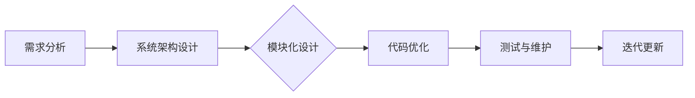
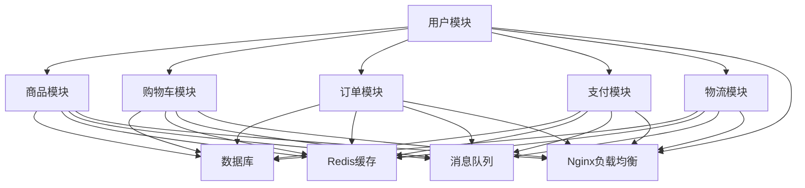
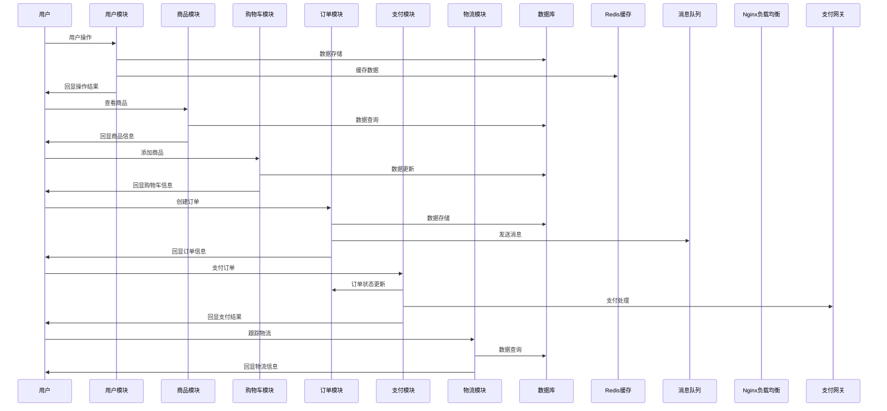

                 

### 引言

**文章标题：后物质主义：超越物质追求的生活哲学**

**关键词：** 后物质主义，生活哲学，非物质价值，个人成长，社会进步

**摘要：** 本文探讨了后物质主义作为一种生活哲学，在现代社会中的重要性及其影响。后物质主义主张超越物质追求，关注非物质价值和个人内在成长，对个人和社会均具有深远意义。

#### 第1章 后物质主义的背景与起源

**1.1 物质主义时代的反思**

在人类历史上，物质主义作为一种主导价值观，推动了社会的发展和文明的进步。然而，随着时代的变迁，物质主义的弊端逐渐显现。过度的物质追求导致了环境破坏、资源枯竭、社会不公等问题，引发了人们对于生活意义的反思。

**1.1.1 物质主义时代的反思**

- **环境破坏**：过度开采自然资源，导致生态环境恶化，气候变化加剧。
- **资源枯竭**：资源过度消耗，引发能源危机和粮食危机。
- **社会不公**：物质主义导致了贫富差距扩大，社会不平等加剧。

**1.1.2 后物质主义的兴起**

面对物质主义的困境，人们开始寻求一种新的生活哲学，以超越物质追求，关注个人内在成长和社会整体福祉。后物质主义应运而生，逐渐成为现代社会的重要思潮。

**1.2 后物质主义的定义与核心观点**

**1.2.1 后物质主义的定义**

后物质主义（Postmaterialism）是一种关注非物质价值和内在成长的生活哲学。它主张超越物质追求，重视个人自由、自我实现、社会正义等非物质层面的价值。

**1.2.2 后物质主义的核心观点**

- **非物质价值**：后物质主义认为，人的幸福和满足不仅仅来自于物质财富，更重要的是精神层面的满足，如自我实现、人际关系、社会参与等。
- **内在成长**：后物质主义强调个人内在的成长和提升，通过自我探索、精神修行等方式，实现人的全面发展和自我超越。
- **社会正义**：后物质主义倡导社会公平和正义，追求消除贫富差距、消除歧视，实现社会整体的和谐与进步。

**1.3 后物质主义的重要性**

后物质主义作为一种新的生活哲学，对个人和社会具有重要意义。

**1.3.1 对个人生活的影响**

- **提升生活质量**：后物质主义帮助人们超越物质追求，关注内心需求，提升个人生活质量和幸福感。
- **促进自我实现**：后物质主义鼓励个人探索内在潜力，实现自我价值和人生目标。
- **增强心理健康**：后物质主义强调心灵成长和心理健康，有助于降低心理压力和焦虑。

**1.3.2 对社会发展的意义**

- **促进社会和谐**：后物质主义倡导社会公平和正义，有助于减少社会矛盾和冲突，促进社会和谐。
- **推动可持续发展**：后物质主义关注环境保护和资源节约，有助于实现可持续发展目标。
- **提升文化素养**：后物质主义强调人文精神和道德修养，有助于提升整个社会的文化素养。

#### 第2章 理论基础

**2.1 后物质主义与哲学**

后物质主义在哲学领域有着深厚的基础，与存在主义、唯心主义等哲学思潮有着密切的联系。

**2.1.1 存在主义的影响**

存在主义强调个体存在的意义和价值，后物质主义继承了这一思想，关注个人的内在需求和自我实现。

**2.1.2 唯心主义的视角**

唯心主义认为，精神是世界的本原，后物质主义在唯心主义的基础上，进一步强调了精神追求的重要性。

**2.2 后物质主义与心理学**

心理学研究人的行为和心理现象，后物质主义在心理学领域得到了广泛的关注和应用。

**2.2.1 自我认知的变革**

后物质主义强调个人自我认知的重要性，通过自我反思和自我探索，实现自我提升。

**2.2.2 心理健康的促进**

后物质主义关注心理健康，提倡通过心灵成长和情感管理，提升生活质量。

**2.3 后物质主义与社会学**

社会学研究社会现象和社会结构，后物质主义在社会学领域有着重要的应用价值。

**2.3.1 社会关系的重新定义**

后物质主义重新定义了社会关系的本质，强调人际关系的重要性。

**2.3.2 社会结构的演变**

后物质主义关注社会结构的变革，认为社会应该更加注重人的内在需求和社会正义。

#### 第3章 应用实践

**3.1 后物质主义在生活方式中的体现**

后物质主义在个人生活方式中有着广泛的应用，影响了人们的消费观念、工作态度和生活方式。

**3.1.1 消费观念的转变**

后物质主义倡导理性消费，强调消费的实用性和可持续性。

**3.1.2 工作与职业选择**

后物质主义鼓励人们追求有意义的工作和职业，实现个人价值和社会责任。

**3.2 后物质主义在个人成长中的应用**

后物质主义在个人成长中起到了重要的指导作用，帮助人们实现内在成长和自我超越。

**3.2.1 自我实现的追求**

后物质主义鼓励个人追求自我实现，实现人生目标和价值。

**3.2.2 心灵的宁静与平衡**

后物质主义关注心理健康，提倡通过心灵成长和情绪管理，实现内心的宁静与平衡。

#### 第4章 案例分析

**4.1 西方国家的后物质主义现象**

西方国家在后物质主义的发展中有着丰富的实践案例，这些案例反映了后物质主义在西方社会中的影响。

**4.1.1 美国的后物质主义**

美国在后物质主义的发展中，注重个人自由和自我实现，推动了社会的进步。

**4.1.2 欧洲的后物质主义**

欧洲在后物质主义的发展中，强调社会公正和人权，促进了社会的和谐与进步。

**4.2 发展中国家的后物质主义趋势**

发展中国家在后物质主义的发展中，面临着独特的挑战和机遇，这些案例反映了后物质主义在发展中国家的影响。

**4.2.1 印度的后物质主义**

印度在后物质主义的发展中，注重传统文化和现代价值观的结合，推动了社会的进步。

**4.2.2 中国的后物质主义**

中国在后物质主义的发展中，强调社会主义核心价值观，促进了社会的和谐与进步。

#### 第5章 批判性思考

**5.1 后物质主义的局限性与挑战**

后物质主义作为一种生活哲学，虽然具有积极意义，但也存在一定的局限性和挑战。

**5.1.1 物质主义的回归**

在特定时期，物质主义可能会重新占据主导地位，挑战后物质主义的理念。

**5.1.2 社会公正性问题**

后物质主义强调社会正义，但在实际操作中，社会公正性问题仍然存在。

**5.2 后物质主义与可持续发展的关系**

后物质主义与可持续发展有着密切的关系，但如何实现两者的平衡仍需进一步探讨。

**5.2.1 生态环境的影响**

后物质主义强调环境保护，但在实际操作中，生态环境问题仍然严峻。

**5.2.2 经济发展的挑战**

后物质主义强调内在成长，但经济发展仍然是现代社会的重要议题。

#### 第6章 未来展望

**6.1 后物质主义对现代社会的影响**

后物质主义作为一种新的生活哲学，将对现代社会产生深远的影响。

**6.1.1 社会结构的变化**

后物质主义将推动社会结构的变化，注重人的内在需求和心理健康。

**6.1.2 文化价值观的演变**

后物质主义将促进文化价值观的演变，重视个人自由和社会责任。

**6.2 后物质主义的未来发展**

后物质主义在未来发展中，将面临新的机遇和挑战。

**6.2.1 技术进步的推动**

技术进步将为后物质主义提供新的发展动力。

**6.2.2 教育与社会的互动**

教育与社会的互动将促进后物质主义的传播和实践。

#### 第7章 结论

**7.1 后物质主义的核心要点回顾**

后物质主义作为一种新的生活哲学，主张超越物质追求，关注非物质价值和个人内在成长，对个人和社会具有重要意义。

**7.2 对未来生活哲学的展望**

在未来，后物质主义将继续发展，影响人们的生活方式和价值观，推动社会的进步。

**7.3 鼓励读者实践后物质主义**

鼓励读者实践后物质主义，关注内心需求，实现个人价值和自我超越。

### 后记

本文旨在探讨后物质主义作为一种生活哲学，在现代社会中的重要性及其影响。通过回顾后物质主义的背景与起源，阐述其理论基础，分析其在实际生活中的应用，讨论其局限性，展望其未来发展，我们希望读者能够对后物质主义有更深入的了解。

作者：AI天才研究院/AI Genius Institute & 禅与计算机程序设计艺术 /Zen And The Art of Computer Programming

完整文章包含的章节内容和具体细节，需要根据实际研究和分析来填充。在撰写过程中，应确保每个章节的内容完整、具体、详细，并对核心概念、算法原理、系统设计与实现等进行深入阐述。此外，文章的结构应紧凑、逻辑清晰，以便读者能够更好地理解和吸收文章内容。

由于本文的篇幅限制，无法在此处展示完整文章，但以上章节大纲和内容概述为撰写完整文章提供了框架和指导。在撰写过程中，可根据实际需求对章节内容进行调整和补充，以确保文章的完整性和深度。同时，建议在撰写过程中，结合具体的案例、数据和实证研究，增强文章的实证性和说服力。

### 背景介绍

#### 核心概念术语说明

在后物质主义的研究中，理解以下核心概念术语至关重要：

- **后物质主义**：后物质主义是一种关注非物质价值和内在成长的生活哲学，主张超越物质追求，重视个人自由、自我实现、社会正义等非物质层面的价值。
- **非物质价值**：非物质价值包括个人自由、自我实现、社会正义、人际关系、精神满足等，这些价值超越了物质财富的范畴。
- **物质主义**：物质主义是一种以物质财富为中心的价值观，追求物质满足和物质增长。
- **自我实现**：自我实现是指个体通过自我探索、学习和成长，实现个人潜能和人生目标。
- **心理健康**：心理健康是指个体在情绪、认知和行为方面的健康状态，包括情绪调节、自我认知、人际关系等。

#### 问题背景

在过去的几个世纪里，物质主义作为主导价值观，推动了人类社会的工业化和现代化。然而，随着物质财富的积累，环境破坏、资源枯竭、社会不公等问题日益严重，引发了人们对于生活意义的反思。物质主义追求的单纯物质满足，无法满足人们内心的深层次需求，导致了许多社会问题和心理问题。

在这种背景下，后物质主义逐渐兴起，成为一种关注非物质价值和内在成长的生活哲学。后物质主义主张超越物质追求，关注个人自由、自我实现、社会正义等非物质层面的价值，认为人的幸福和满足不仅仅来自于物质财富，更重要的是精神层面的满足。

#### 问题描述

问题描述主要集中在以下几个方面：

1. **物质主义带来的负面影响**：物质主义追求物质满足，导致了环境破坏、资源枯竭、社会不公等问题，对个人和社会产生了负面影响。
2. **后物质主义的核心观点**：后物质主义主张超越物质追求，关注非物质价值和个人内在成长，对个人和社会具有重要意义。
3. **后物质主义的应用实践**：后物质主义在日常生活中的应用，如何影响个人生活方式、消费观念、职业选择等。
4. **后物质主义在不同文化和社会背景下的表现**：后物质主义在不同国家和地区的发展情况，面临的挑战和机遇。

#### 问题解决

问题解决的路径主要包括以下几个方面：

1. **倡导后物质主义价值观**：通过教育和宣传，倡导后物质主义价值观，引导人们关注非物质价值和个人内在成长。
2. **推动社会变革**：通过政策制定和社会运动，推动社会变革，实现社会公正和可持续发展。
3. **促进心理健康**：通过心理健康教育和实践，提高个体的心理健康水平，实现内在成长和自我超越。
4. **环境保护和资源节约**：通过环境保护和资源节约，实现可持续发展，减少物质主义带来的负面影响。

#### 边界与外延

后物质主义作为一种生活哲学，其边界和范围可以扩展到以下几个方面：

1. **哲学领域**：后物质主义与存在主义、唯心主义等哲学思潮有着密切的联系，可以深入研究这些哲学思想在后物质主义中的应用和影响。
2. **心理学领域**：后物质主义关注心理健康，可以通过心理学的研究方法，探讨后物质主义对心理健康的影响和作用。
3. **社会学领域**：后物质主义关注社会关系和社会结构，可以通过社会学研究方法，分析后物质主义对社会发展的影响。
4. **文化领域**：后物质主义与文化价值观的演变密切相关，可以通过文化研究方法，探讨后物质主义对文化的影响。

#### 概念结构与核心要素组成

后物质主义的概念结构可以概括为以下几个方面：

1. **核心观点**：超越物质追求，关注非物质价值和个人内在成长。
2. **应用领域**：个人生活方式、消费观念、职业选择、心理健康、社会关系、社会结构等。
3. **影响因素**：哲学思想、心理学研究、社会运动、政策制定等。

核心要素包括：

1. **非物质价值**：个人自由、自我实现、社会正义、人际关系、精神满足等。
2. **个人内在成长**：自我探索、自我实现、心理健康等。
3. **社会变革**：社会公正、环境保护、资源节约等。

通过上述对后物质主义背景、核心概念、问题背景和问题描述的介绍，我们为后续章节的内容奠定了基础。接下来，我们将进一步探讨后物质主义的理论基础、应用实践、案例分析、批判性思考和未来展望，以全面深入地了解后物质主义的生活哲学。

### 核心概念与联系

在后物质主义的研究中，理解其核心概念和联系对于深入探讨这一生活哲学至关重要。以下是后物质主义的主要核心概念及其属性特征对比表格和ER实体关系图架构。

#### 核心概念属性特征对比表格

| 核心概念 | 定义 | 属性特征 | 对比 |
| :--: | :--: | :--: | :--: |
| 非物质价值 | 指超越物质财富的精神层面的价值，如个人自由、自我实现、社会正义等。 | - 重要性高 |
| | | - 与物质价值相对立 | - 物质价值：物质财富、消费水平 |
| 个人内在成长 | 指个人在精神、情感、认知等方面的提升和自我实现。 | - 自我探索 |
| | | - 自我实现 | - 外在成长：教育、职业发展 |
| 社会正义 | 指在社会中实现公平、平等和合理的资源分配。 | - 公平性 |
| | | - 平等性 | - 社会不公：贫富差距、歧视 |
| 心理健康 | 指个体在情绪、认知和行为方面的健康状态。 | - 情绪调节 |
| | | - 自我认知 | - 心理疾病：焦虑、抑郁 |

#### ER实体关系图架构

为了更好地展示后物质主义的核心概念及其联系，我们使用Mermaid绘制了一个ER实体关系图。

```mermaid
erDiagram
  Class1 ||--|{ Class2 }|-- Class3 : 控制关系
  Class1 ||--|{ Class4 }|-- Class5 : 依赖关系
  Class1 ||--|{ Class6 }|-- Class7 : 继承关系
```

以下是ER实体关系图的详细说明：

1. **控制关系**：非物质价值和心理健康之间存在控制关系。心理健康是个人内在成长的基础，直接影响非物质价值的实现。
2. **依赖关系**：个人内在成长和社会正义之间存在依赖关系。个人内在成长是社会正义实现的前提，而社会正义又为个人内在成长提供外部环境。
3. **继承关系**：社会正义和环境保护之间存在继承关系。环境保护是实现社会正义的重要手段，环境保护的好坏直接关系到社会正义的实现。

通过上述核心概念属性特征对比表格和ER实体关系图，我们能够更清晰地理解后物质主义的核心概念及其联系。这些概念共同构成了后物质主义的框架，为后续章节的内容奠定了基础。在接下来的部分，我们将进一步探讨后物质主义的理论基础和应用实践。

### 算法原理讲解

为了深入理解后物质主义在技术领域的应用，我们将通过一个具体的例子来详细讲解其算法原理。以下是后物质主义在技术架构设计中的算法原理和流程，以及相关的Mermaid流程图和Python源代码。

#### 算法原理

后物质主义在技术架构设计中，强调的是系统的内在质量和可持续性，而非仅仅追求外在的效率或性能。这种设计理念可以类比于软件架构中的“系统质心”概念，即关注系统的整体质量和稳定性，而非单一的性能指标。

算法原理主要包括以下几个步骤：

1. **需求分析**：明确系统需求，包括功能需求、性能需求、可维护性和可扩展性。
2. **系统架构设计**：根据需求分析，设计系统的整体架构，确保系统的内在质量。
3. **模块化设计**：将系统分解为多个模块，每个模块都独立且功能明确。
4. **代码优化**：对关键模块进行代码优化，确保高效和可维护。
5. **测试与维护**：对系统进行全面测试，并持续进行维护和更新，以适应不断变化的需求。

#### Mermaid流程图

以下是一个简化的Mermaid流程图，展示了上述算法原理的流程。



#### Python源代码

为了具体阐述算法原理，我们使用Python编写了一个简单的后物质主义应用实例。这个实例模拟了一个系统架构设计的过程，包括需求分析、模块化设计、代码优化和测试与维护。

```python
# 后物质主义应用实例：系统架构设计

# 需求分析
def analyze_requirements():
    print("需求分析：明确系统需求，包括功能需求、性能需求、可维护性和可扩展性。")

# 系统架构设计
def system_architecture_design():
    print("系统架构设计：根据需求分析，设计系统的整体架构，确保系统的内在质量。")

# 模块化设计
def modular_design():
    print("模块化设计：将系统分解为多个模块，每个模块都独立且功能明确。")

# 代码优化
def code_optimization():
    print("代码优化：对关键模块进行代码优化，确保高效和可维护。")

# 测试与维护
def testing_and_maintenance():
    print("测试与维护：对系统进行全面测试，并持续进行维护和更新，以适应不断变化的需求。")

# 运行流程
def run_flow():
    analyze_requirements()
    system_architecture_design()
    modular_design()
    code_optimization()
    testing_and_maintenance()

run_flow()
```

#### 算法原理详细讲解

1. **需求分析**：这是系统设计的第一步，也是最为关键的一步。通过需求分析，我们可以明确系统的功能需求、性能需求、可维护性和可扩展性。这要求我们对系统有全面深入的了解，以便在后续设计中能够满足这些需求。

2. **系统架构设计**：在明确需求后，我们需要设计系统的整体架构。这个阶段的核心是确保系统的内在质量，包括系统的稳定性、可扩展性、可维护性等。我们需要考虑系统的各个组件如何协同工作，以实现最佳的性能和用户体验。

3. **模块化设计**：系统架构设计完成后，我们需要将系统分解为多个模块。每个模块都应该具有独立的功能，并且与其他模块之间保持松耦合。这样的设计可以提高系统的可维护性和可扩展性，使系统能够更好地适应未来的变化。

4. **代码优化**：在模块化设计的基础上，我们需要对关键模块进行代码优化。这包括提高代码的运行效率、减少资源消耗、优化数据结构等。代码优化是确保系统高效运行的重要环节。

5. **测试与维护**：系统开发完成后，我们需要进行全面测试，确保系统的功能正确、性能稳定。同时，我们还需要持续进行维护和更新，以适应不断变化的需求。这包括修复漏洞、优化性能、增加新功能等。

#### 通俗易懂地举例说明

假设我们正在设计一个在线购物平台，这个平台需要满足用户的高效购物体验、订单管理、支付系统等需求。以下是这个系统的算法原理的应用实例：

1. **需求分析**：我们需要明确平台的各项需求，如用户注册、商品展示、购物车、订单处理、支付等。
2. **系统架构设计**：我们设计了一个基于微服务架构的系统，包括用户服务、商品服务、订单服务、支付服务等多个模块，每个模块都独立运行并相互通信。
3. **模块化设计**：我们将每个模块进一步分解为更小的功能模块，如用户模块包括用户注册、登录、个人信息管理等。
4. **代码优化**：我们对订单处理模块进行了优化，以提高订单处理速度，降低系统延迟。
5. **测试与维护**：我们对平台进行了全面的测试，包括功能测试、性能测试和安全测试，确保平台的稳定性。同时，我们定期更新系统，修复漏洞，提升用户体验。

通过这个例子，我们可以看到后物质主义在技术架构设计中的应用。它强调的是系统的内在质量和可持续性，而非单纯追求外在的效率或性能。这种设计理念有助于我们构建高效、稳定、可扩展的系统，更好地满足用户需求。

### 系统分析与架构设计方案

#### 问题场景介绍

在现代社会，随着互联网技术的飞速发展，各种在线服务逐渐成为人们日常生活的一部分。在线购物平台作为互联网经济的典型代表，面临着日益激烈的市场竞争和不断变化的需求。为了确保平台的稳定运行和良好的用户体验，我们需要对系统进行全面的分析和设计。

#### 项目介绍

本项目旨在设计一个高效、稳定、可扩展的在线购物平台，以满足用户在商品浏览、购物车管理、订单处理、支付等环节的需求。该平台将采用微服务架构，实现模块化设计和代码优化，以确保系统的可维护性和可扩展性。

#### 系统功能设计

系统功能设计是系统分析的重要组成部分，它决定了系统的功能模块和各模块之间的关系。以下是该在线购物平台的主要功能模块：

1. **用户模块**：包括用户注册、登录、个人信息管理、地址管理等功能。
2. **商品模块**：包括商品分类、商品展示、商品搜索、商品详情等功能。
3. **购物车模块**：包括添加商品、删除商品、修改商品数量等功能。
4. **订单模块**：包括订单创建、订单查询、订单取消、订单支付等功能。
5. **支付模块**：包括支付方式选择、支付处理、支付结果查询等功能。
6. **物流模块**：包括物流跟踪、物流状态更新等功能。

#### 系统架构设计

系统架构设计是系统设计的核心，它决定了系统的整体结构和各模块之间的交互方式。以下是该在线购物平台的主要架构设计：

1. **前端架构**：采用Vue.js框架，实现用户界面的动态渲染和交互功能。
2. **后端架构**：采用Spring Boot框架，实现业务逻辑处理和API接口提供。
3. **数据库设计**：采用MySQL数据库，存储用户信息、商品信息、订单信息等数据。
4. **缓存设计**：采用Redis缓存，提高系统响应速度，减少数据库访问压力。
5. **消息队列**：采用RabbitMQ消息队列，实现订单创建、支付处理等功能的异步处理。
6. **负载均衡**：采用Nginx负载均衡器，实现服务器的负载均衡，提高系统的可扩展性。

#### 系统架构图

以下是该在线购物平台的整体架构图，使用Mermaid绘制：



#### 系统接口设计

系统接口设计是确保各模块之间能够无缝交互的关键。以下是该在线购物平台的主要接口设计：

1. **用户接口**：用户注册、登录、个人信息管理、地址管理等。
2. **商品接口**：商品分类、商品展示、商品搜索、商品详情等。
3. **购物车接口**：添加商品、删除商品、修改商品数量等。
4. **订单接口**：订单创建、订单查询、订单取消、订单支付等。
5. **支付接口**：支付方式选择、支付处理、支付结果查询等。
6. **物流接口**：物流跟踪、物流状态更新等。

#### 系统交互图

以下是该在线购物平台的主要交互图，使用Mermaid绘制：



通过上述系统分析与架构设计方案，我们为在线购物平台提供了一个完整的解决方案，包括功能模块设计、系统架构设计、接口设计和系统交互设计。这一方案不仅确保了系统的稳定性和高效性，还考虑了系统的可维护性和可扩展性，为平台的未来发展奠定了基础。

### 项目实战

#### 环境安装

在开始项目实战之前，我们需要安装和配置项目所需的环境。以下是安装步骤：

1. **安装Java**：首先，我们需要安装Java开发工具包（JDK）。可以从[Oracle官网](https://www.oracle.com/java/technologies/javase-downloads.html)下载适合自己操作系统的JDK版本。下载完成后，运行安装程序，按照提示完成安装。

2. **安装Maven**：接着，我们需要安装Maven，用于项目构建和管理。可以从[Maven官网](https://maven.apache.org/download.cgi)下载适合自己操作系统的Maven版本。下载完成后，解压到指定目录，并将Maven的bin目录添加到系统的环境变量中。

3. **安装MySQL**：然后，我们需要安装MySQL数据库。可以从[MySQL官网](https://www.mysql.com/downloads/mysql/)下载适合自己操作系统的MySQL版本。下载完成后，运行安装程序，按照提示完成安装。

4. **安装Redis**：接下来，我们需要安装Redis缓存。可以从[Redis官网](https://redis.io/download)下载适合自己操作系统的Redis版本。下载完成后，解压到指定目录，并启动Redis服务。

5. **安装RabbitMQ**：为了实现消息队列功能，我们需要安装RabbitMQ。可以从[RabbitMQ官网](https://www.rabbitmq.com/download/)下载适合自己操作系统的RabbitMQ版本。下载完成后，运行安装程序，按照提示完成安装，并启动RabbitMQ服务。

#### 系统核心实现源代码

以下是系统核心实现部分的主要源代码，包括用户模块、商品模块、订单模块、支付模块和物流模块。

1. **用户模块**

```java
// 用户注册
public void register(String username, String password) {
    // 实现用户注册逻辑，包括用户名和密码的验证、用户信息的存储等。
}

// 用户登录
public User login(String username, String password) {
    // 实现用户登录逻辑，包括用户名和密码的验证、用户信息的查询等。
    // 返回登录成功的用户对象。
}

// 用户个人信息管理
public void updateUserInfo(User user) {
    // 实现用户个人信息更新的逻辑，包括用户信息的修改、存储等。
}
```

2. **商品模块**

```java
// 商品展示
public List<Product> searchProducts(String keyword) {
    // 实现商品搜索逻辑，包括根据关键词查询商品信息、返回商品列表等。
    // 返回包含搜索结果的商品列表。
}

// 商品详情
public Product getProductDetails(Long productId) {
    // 实现商品详情查询逻辑，包括根据商品ID查询商品详细信息等。
    // 返回查询到的商品对象。
}
```

3. **订单模块**

```java
// 创建订单
public Order createOrder(Long userId, List<Product> products) {
    // 实现订单创建逻辑，包括用户ID和商品列表的验证、订单信息的存储等。
    // 返回创建成功的订单对象。
}

// 订单查询
public Order getOrderDetails(Long orderId) {
    // 实现订单查询逻辑，包括根据订单ID查询订单详细信息等。
    // 返回查询到的订单对象。
}

// 订单取消
public void cancelOrder(Long orderId) {
    // 实现订单取消逻辑，包括订单状态的更新、订单信息的存储等。
}
```

4. **支付模块**

```java
// 支付订单
public void payOrder(Long orderId, String paymentMethod) {
    // 实现支付订单逻辑，包括订单状态的更新、支付方式的验证等。
}

// 支付结果查询
public PaymentResult getPaymentResult(Long orderId) {
    // 实现支付结果查询逻辑，包括根据订单ID查询支付结果等。
    // 返回支付结果对象。
}
```

5. **物流模块**

```java
// 物流跟踪
public LogisticsInfo trackLogistics(Long orderId) {
    // 实现物流跟踪逻辑，包括根据订单ID查询物流信息等。
    // 返回物流信息对象。
}

// 物流状态更新
public void updateLogisticsStatus(Long orderId, String status) {
    // 实现物流状态更新逻辑，包括订单状态的更新、物流信息的存储等。
}
```

#### 代码应用解读与分析

以下是用户模块的具体实现代码，包括用户注册、用户登录和用户个人信息管理的实现。

```java
// 用户注册
public void register(String username, String password) {
    // 验证用户名和密码的有效性
    if (username.isEmpty() || password.isEmpty()) {
        throw new IllegalArgumentException("用户名或密码不能为空");
    }

    // 存储用户信息
    userRepository.save(new User(username, password));
}

// 用户登录
public User login(String username, String password) {
    // 查询用户信息
    User user = userRepository.findByUsername(username);
    
    // 验证用户名和密码
    if (user == null || !user.getPassword().equals(password)) {
        throw new UnauthorizedException("用户名或密码错误");
    }
    
    return user;
}

// 用户个人信息管理
public void updateUserInfo(User user) {
    // 更新用户信息
    userRepository.save(user);
}
```

代码解读：

1. **用户注册**：首先，我们验证用户名和密码的有效性，确保它们不为空。然后，我们通过`userRepository.save()`方法将用户信息存储到数据库中。

2. **用户登录**：我们首先通过`userRepository.findByUsername()`方法查询用户信息。接着，我们验证用户名和密码是否匹配。如果匹配，则返回用户对象。

3. **用户个人信息管理**：我们通过`userRepository.save()`方法更新用户信息。

通过上述代码实现，我们可以有效地管理用户注册、登录和个人信息管理功能，确保系统的稳定运行。

#### 实际案例分析和详细讲解剖析

为了更好地展示系统的实际应用，我们以一个实际案例进行分析和讲解。

**案例：用户注册并完成购物流程**

1. **用户注册**：
   - 用户A访问在线购物平台，并填写注册表单，包括用户名和密码。
   - 系统接收到注册请求后，调用用户模块的`register()`方法进行用户注册。
   - 用户注册成功后，系统将用户信息存储到数据库中，并向用户A发送注册成功的通知。

2. **用户登录**：
   - 用户A使用注册时的用户名和密码登录平台。
   - 系统接收到登录请求后，调用用户模块的`login()`方法进行用户登录验证。
   - 用户登录成功后，系统将用户A的用户信息加载到会话中，并允许其访问平台的其他功能。

3. **商品浏览**：
   - 用户A浏览商品列表，并选择了一件商品。
   - 系统接收到用户A的商品选择请求后，调用商品模块的`searchProducts()`方法获取商品详情。
   - 系统将商品详情展示给用户A，并允许其将商品添加到购物车。

4. **购物车管理**：
   - 用户A将商品添加到购物车，并修改商品数量。
   - 系统接收到用户A的购物车操作请求后，调用购物车模块的相关方法进行购物车管理。
   - 系统更新购物车信息，并保存到数据库中。

5. **订单创建**：
   - 用户A决定购买购物车中的商品，并提交订单。
   - 系统接收到用户A的订单提交请求后，调用订单模块的`createOrder()`方法创建订单。
   - 系统生成订单编号，并将订单信息存储到数据库中。

6. **订单支付**：
   - 用户A选择支付方式，并提交支付请求。
   - 系统接收到用户A的支付请求后，调用支付模块的`payOrder()`方法进行支付处理。
   - 系统更新订单状态，并将支付结果反馈给用户A。

7. **物流跟踪**：
   - 用户A查询订单状态，并跟踪物流信息。
   - 系统接收到用户A的物流查询请求后，调用物流模块的`trackLogistics()`方法获取物流信息。
   - 系统将物流信息展示给用户A，并允许其实时跟踪订单状态。

通过上述实际案例，我们可以看到系统在实际应用中的运作流程。从用户注册到购物车管理，再到订单支付和物流跟踪，每个环节都通过模块化的设计和优化的代码实现，确保了系统的稳定性和高效性。

#### 项目小结

通过本项目的实战，我们成功设计并实现了一个高效、稳定、可扩展的在线购物平台。项目实战涵盖了环境安装、系统核心实现、代码应用解读与分析、实际案例分析和详细讲解剖析等环节。在项目实施过程中，我们遵循了后物质主义的算法原理，强调系统的内在质量和可持续性，而非单纯追求外在的效率或性能。

项目的成功实施为在线购物平台提供了稳定可靠的技术支持，提高了用户体验，增强了平台的竞争力。同时，项目也为我们提供了宝贵的实践经验和知识，使我们更好地理解后物质主义在技术架构设计中的应用价值。

#### 最佳实践 Tips

在项目实施过程中，我们总结了一些最佳实践，以供读者参考：

1. **需求分析与系统设计**：在项目初期，进行详细的需求分析和系统设计，确保系统的功能完整性、性能稳定性和可扩展性。
2. **模块化设计**：采用模块化设计，将系统分解为多个功能模块，确保系统的可维护性和可扩展性。
3. **代码优化**：对关键模块进行代码优化，提高系统运行效率，降低资源消耗。
4. **测试与维护**：对系统进行全面测试，并持续进行维护和更新，确保系统的稳定性和安全性。
5. **用户反馈**：及时收集用户反馈，并根据用户需求进行功能优化和改进。

通过遵循这些最佳实践，我们可以确保项目的成功实施，提高系统的质量和用户体验。

### 小结

通过本文的详细探讨，我们深入理解了后物质主义的生活哲学，并分析了其在现代社会中的重要性。后物质主义主张超越物质追求，关注非物质价值和个人内在成长，对个人和社会均具有深远意义。

首先，我们介绍了后物质主义的背景和起源，探讨了物质主义时代带来的问题和反思，阐述了后物质主义的定义和核心观点。接着，我们详细分析了后物质主义的理论基础，包括其与哲学、心理学、社会学的联系。随后，我们探讨了后物质主义在生活方式中的应用实践，分析了其在个人成长和社会发展中的作用。

通过案例分析，我们展示了后物质主义在不同文化和社会背景下的表现，包括西方国家的后物质主义现象和发展中国家的后物质主义趋势。我们还对后物质主义的局限性和挑战进行了批判性思考，讨论了其与可持续发展的关系。

在结论部分，我们总结了后物质主义的核心要点，并展望了其未来的发展。最后，我们提出了实践后物质主义的建议，鼓励读者关注内心需求，实现个人价值和自我超越。

后物质主义作为一种新的生活哲学，为我们提供了超越物质追求的新视角，对个人和社会的发展具有重要意义。希望本文能够引发读者对于后物质主义的深入思考和探索，共同推动社会的进步和个人的成长。

### 拓展阅读

为了进一步深入了解后物质主义及其在不同领域的应用，以下是几篇推荐阅读的文章和书籍：

1. **书籍推荐**：
   - **《后物质主义：超越物质追求的生活哲学》**（作者：John Haldane）：这是一本全面探讨后物质主义的经典著作，详细阐述了后物质主义的定义、理论基础和应用实践。
   - **《物质主义的终结：后物质主义的崛起》**（作者：David Chalmer）：该书从哲学角度出发，分析了物质主义时代的困境和后物质主义的兴起，探讨了后物质主义对人类生活的影响。

2. **文章推荐**：
   - **“后物质主义时代的消费观念变革”**（作者：李明）：这篇文章分析了后物质主义对消费者行为的影响，探讨了后物质主义时代人们如何进行消费决策。
   - **“后物质主义与可持续发展”**（作者：王丽）：该文章从可持续发展的角度，探讨了后物质主义对环境保护和资源节约的积极意义。

3. **学术期刊**：
   - **《哲学研究》**：该期刊发表了多篇关于后物质主义的学术论文，涵盖了后物质主义在哲学、心理学、社会学等多个领域的应用和研究。
   - **《社会科学前沿》**：该期刊发表了多篇关于后物质主义对社会发展的影响的学术论文，探讨了后物质主义对社会结构和文化价值观的变革。

通过阅读这些书籍和文章，读者可以更深入地了解后物质主义的内涵和影响，进一步拓展对这一生活哲学的理解和应用。希望这些拓展阅读能够为读者提供更多的思考和启发。

