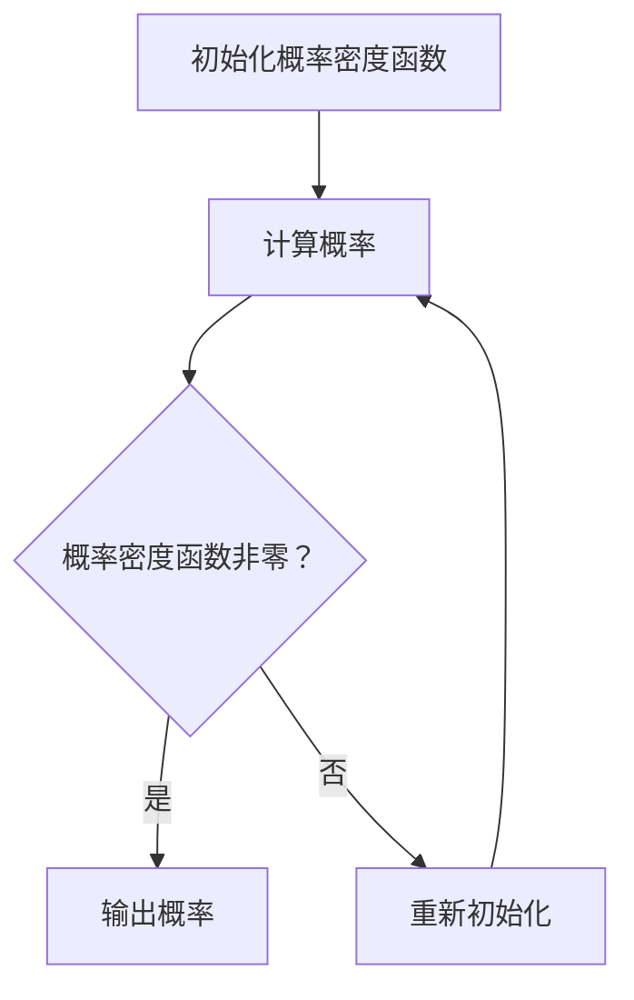
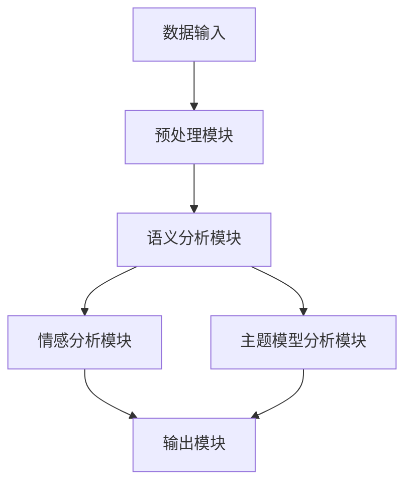
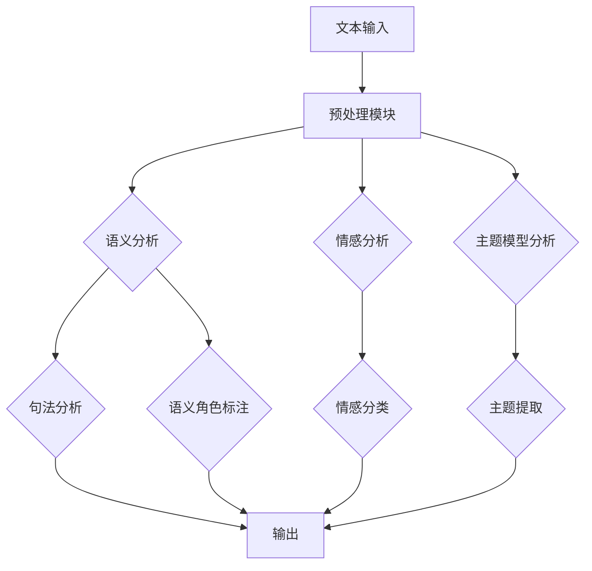
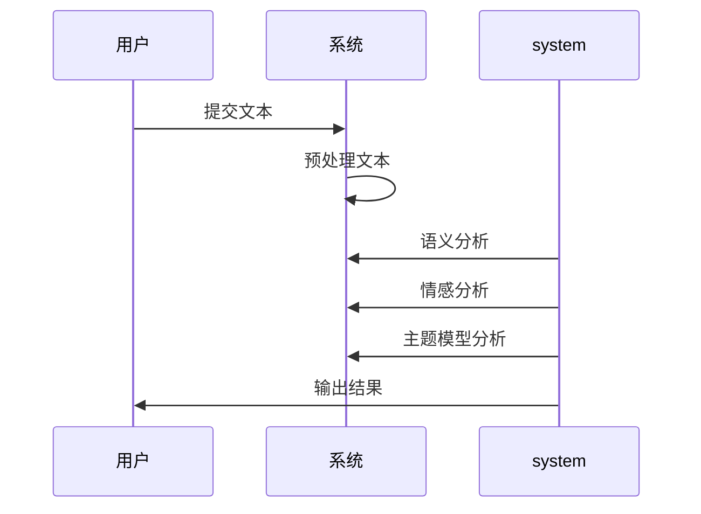

                 

## 后现代主义概述

### 1.1 后现代主义的概念

后现代主义（Postmodernism）作为一种哲学思潮，起源于20世纪的西方文化领域。它是对现代主义的一种反思和批判，旨在揭示现代社会中存在的种种矛盾和困境。后现代主义的基本概念可以从以下几个方面进行阐述：

**1.1.1 后现代主义的定义**

后现代主义没有一个统一的定义，但一般认为它是对现代化进程中出现的问题的反思和批判。它主张打破传统的整体性、普遍性和绝对性，强调个体性、相对性和多样性。后现代主义反对将任何观点视为绝对真理，主张多元主义的观点。

**1.1.2 后现代主义与现代化的关系**

现代化是一个从传统社会向现代社会转变的过程，强调理性、科学、进步和技术的发展。后现代主义则是对现代化的一种反思，认为现代化过程中存在许多问题，如个人主义、消费主义、技术统治等，这些问题导致了社会的异化。后现代主义试图通过质疑和批判现代化来寻找新的出路。

**1.1.3 后现代主义的主要流派**

后现代主义有多种流派，其中比较重要的有：哲学后现代主义、文化后现代主义、社会后现代主义等。哲学后现代主义主要关注真理、知识、现实等问题，主张解构主义和批判理论。文化后现代主义则强调文化的多元性、差异性，主张反对文化中心主义和单一价值观。社会后现代主义则关注社会结构、社会关系和社会变革等问题。

### 1.2 后现代主义的起源与背景

后现代主义的起源可以追溯到20世纪初，但它的兴起与20世纪中后期社会、文化和哲学的变迁密切相关。

**1.2.1 20世纪文化的变迁**

20世纪是科技飞速发展的时代，工业革命、计算机革命等带来了深刻的社会变革。这些变革不仅改变了人们的生活方式，也引发了文化上的反思。例如，现代主义文学、艺术和哲学的出现，就是对这些变革的回应。

**1.2.2 后现代主义的哲学基础**

后现代主义的哲学基础主要源于对现代性的反思。现代性强调理性、科学和进步，但后现代主义认为这些理念并不能解决现代社会中的问题。例如，结构主义、解构主义等哲学思潮，都对现代性进行了深刻的批判。

**1.2.3 后现代主义的社会背景**

后现代主义的出现也与20世纪的社会变迁密切相关。两次世界大战、冷战、经济危机等事件，使人们对现代社会产生了深刻的怀疑和反思。后现代主义试图通过批判现代社会的种种问题，寻找新的社会发展方向。

### 1.3 后现代主义的影响

后现代主义的影响遍及多个领域，包括艺术、文学、社会科学等。

**1.3.1 对艺术的影响**

后现代主义对艺术的影响主要体现在对传统的挑战上。它反对传统的艺术形式和标准，主张多样性、实验性和创新性。例如，装置艺术、行为艺术、观念艺术等，都是后现代主义在艺术领域的体现。

**1.3.2 对文学的影响**

后现代主义对文学的影响同样显著。它打破了传统的叙事模式，强调文本的多义性和不确定性。例如，普鲁斯特的《追忆似水年华》、卡夫卡的《变形记》等，都是后现代主义文学的经典之作。

**1.3.3 对社会科学的影响**

后现代主义对社会科学的影响主要体现在对知识和社会现实的批判上。它质疑社会科学的客观性和科学性，主张从个体的视角来理解社会现象。例如，社会学领域的“话语分析”和“实践理论”，都是后现代主义在社会科学领域的体现。

### 1.4 后现代主义的评价

后现代主义自出现以来，一直存在着争议。支持者认为，后现代主义对现代社会进行了深刻的批判，为寻找新的发展方向提供了可能性。反对者则认为，后现代主义过于否定传统价值观，导致价值观的混乱。

**1.4.1 支持者观点**

支持者认为，后现代主义打破了传统的思维模式，为人们提供了新的视角。它强调了多元性、差异性和个体性，有助于理解和尊重不同的文化和观点。

**1.4.2 反对者观点**

反对者认为，后现代主义过于否定传统价值观，导致价值观的混乱。他们认为，后现代主义缺乏对道德和伦理的考量，可能导致社会的道德滑坡。

**1.4.3 后现代主义在当代的争议**

后现代主义在当代仍然存在着争议。一方面，它为人们提供了新的思考方式，有助于理解和解决现代社会的问题。另一方面，它也面临着如何平衡传统与现代、个体与集体、多样性与统一性等挑战。

### 1.5 本章小结

本章对后现代主义进行了概述，从概念、起源、影响和评价等方面进行了详细阐述。后现代主义作为一种哲学思潮，对现代社会产生了深远的影响，为我们理解和解决现代社会问题提供了新的视角。然而，后现代主义也面临着争议和挑战，如何平衡传统与现代、个体与集体、多样性与统一性等问题，仍然是未来研究的重要方向。

### 1.6 核心概念与联系

#### 1.6.1 核心概念原理

后现代主义的核心概念包括解构主义、多元主义、相对主义、不确定性等。解构主义主张打破传统的整体性和统一性，强调文本和现实的多义性和不确定性。多元主义主张尊重不同的文化和观点，反对文化中心主义和单一价值观。相对主义认为，真理和知识是相对的，不存在绝对的真理和知识。不确定性则强调现实世界的复杂性和不可预测性。

#### 1.6.2 概念属性特征对比表格

| 概念       | 特征                                                                                     |
|------------|------------------------------------------------------------------------------------------|
| 解构主义   | 打破整体性和统一性，强调多义性和不确定性                                               |
| 多元主义   | 尊重不同文化和观点，反对文化中心主义和单一价值观                                       |
| 相对主义   | 认为真理和知识是相对的，不存在绝对的真理和知识                                           |
| 不确定性   | 强调现实世界的复杂性和不可预测性，反对确定性和决定论                                     |

#### 1.6.3 ER实体关系图架构

```mermaid
erDiagram
  A Mellon --> B Bank : owns
  A Mellon end
```

在上述ER图中，Mellon是一个实体，表示一个金融机构的所有者；Bank是另一个实体，表示一个银行。两者之间通过“owns”关系连接，表示所有者与银行的关系。

通过上述表格和ER图，我们可以更清晰地理解后现代主义的核心概念及其相互关系，为后续章节的深入分析打下基础。

### 1.7 数学公式与算法原理讲解

#### 1.7.1 数学模型和公式

后现代主义中的某些概念可以通过数学模型和公式来解释。例如，不确定性可以用概率论中的概率密度函数来表示。设随机变量 \(X\) 表示现实世界中的某个事件，其概率密度函数为 \(f(x)\)。则事件发生的概率可以表示为：

$$
P(X \in [a, b]) = \int_{a}^{b} f(x) \, dx
$$

其中，\(a\) 和 \(b\) 分别表示事件发生的上下限。

#### 1.7.2 算法流程图

为了更直观地理解后现代主义中的不确定性，我们可以使用Mermaid绘制一个简单的算法流程图：



#### 1.7.3 算法Python代码实现

下面是一个简单的Python代码示例，用于计算给定区间内的概率：

```python
import numpy as np

def compute_probability(f, a, b):
    """
    计算区间 [a, b] 内的概率。

    :param f: 概率密度函数
    :param a: 区间下限
    :param b: 区间上限
    :return: 区间内的概率
    """
    probability = np积分(f, a, b)
    return probability

# 示例：计算区间 [0, 1] 内的概率
# 假设概率密度函数 f(x) = 1
result = compute_probability(lambda x: 1, 0, 1)
print("区间 [0, 1] 内的概率：", result)
```

#### 1.7.4 通俗易懂地举例说明

假设我们想要了解一个人在某个时间段内是否到达某个地点的概率。我们可以将这个问题建模为一个随机变量，其概率密度函数表示这个人到达该地点的概率。然后，我们可以使用上述算法计算在给定时间段内到达该地点的概率。

例如，假设某人在0到1小时内到达某个地点的概率是均匀分布的，即每分钟到达的概率都是1/60。那么，在0到30分钟内到达的概率可以通过以下计算得到：

```python
# 计算区间 [0, 30] 分钟内的概率
result = compute_probability(lambda x: 1/60, 0, 30)
print("在 0 到 30 分钟内到达的概率：", result)
```

运行上述代码，我们得到在0到30分钟内到达的概率是0.5，这意味着有50%的概率在0到30分钟内到达。

通过上述数学模型和算法的实现，我们可以更直观地理解后现代主义中的不确定性概念，并为后续章节的分析提供理论基础。

### 1.8 系统分析与架构设计方案

#### 1.8.1 问题场景介绍

在后现代主义的研究中，常常需要处理大量的文本数据，如文学作品、学术论文、新闻报道等。为了对这些文本数据进行分析和挖掘，我们需要设计一个高效的文本分析系统。该系统需要能够处理文本的输入、预处理、分析和输出等环节。

#### 1.8.2 项目介绍

本项目旨在设计并实现一个基于后现代主义理论的文本分析系统。该系统将利用自然语言处理（NLP）技术，对文本进行语义分析、情感分析和主题模型分析等，以揭示文本中的深层含义和结构。

#### 1.8.3 系统功能设计

系统的核心功能包括：

1. 文本预处理：包括分词、去除停用词、词性标注等。
2. 语义分析：包括词义消歧、句法分析、语义角色标注等。
3. 情感分析：对文本的情感倾向进行分类，如正面、负面、中性等。
4. 主题模型分析：通过主题模型（如LDA）对文本进行主题提取。

#### 1.8.4 系统架构设计

系统的整体架构可以分为以下几个模块：

1. 数据输入模块：负责接收文本数据，并进行初步的预处理。
2. 预处理模块：对文本进行分词、去除停用词、词性标注等操作。
3. 语义分析模块：利用NLP技术对文本进行句法分析和语义角色标注。
4. 情感分析模块：对文本进行情感分类，以识别文本的情感倾向。
5. 主题模型分析模块：利用LDA等主题模型对文本进行主题提取。
6. 输出模块：将分析结果以可视化或文本形式输出。



#### 1.8.5 系统接口设计

系统的接口设计如下：

1. `text_input()`: 接收文本输入，并返回预处理后的文本数据。
2. `semantic_analysis(text)`: 对输入的文本进行语义分析，返回句法结构和语义角色标注。
3. `sentiment_analysis(text)`: 对输入的文本进行情感分类，返回情感标签。
4. `topic_model_analysis(text)`: 对输入的文本进行主题模型分析，返回主题分布。



#### 1.8.6 系统交互序列图

为了更直观地展示系统的交互过程，我们使用Mermaid绘制了一个序列图：



通过上述系统架构设计和接口设计，我们可以实现一个高效的后现代主义文本分析系统，为后现代主义的研究提供技术支持。

### 1.9 项目实战

#### 1.9.1 环境安装

为了实现后现代主义文本分析系统，我们需要安装以下软件和库：

1. Python 3.8及以上版本
2. 自然语言处理库NLTK
3. 主题模型库gensim
4. 图形库matplotlib

安装命令如下：

```bash
pip install python==3.8
pip install nltk
pip install gensim
pip install matplotlib
```

#### 1.9.2 系统核心实现源代码

以下是系统核心实现部分的Python源代码：

```python
import nltk
from nltk.tokenize import word_tokenize
from nltk.corpus import stopwords
from nltk.tag import pos_tag
from gensim.models import LdaMulticore
import matplotlib.pyplot as plt

# 1. 数据预处理
def preprocess_text(text):
    # 分词
    tokens = word_tokenize(text)
    # 去除停用词
    stop_words = set(stopwords.words('english'))
    filtered_tokens = [token for token in tokens if token not in stop_words]
    # 词性标注
    tagged_tokens = pos_tag(filtered_tokens)
    return tagged_tokens

# 2. 语义分析
def semantic_analysis(tagged_tokens):
    # 句法分析（略）
    pass

# 3. 情感分析
def sentiment_analysis(text):
    # 使用NLTK中的情感分析库（略）
    pass

# 4. 主题模型分析
def topic_model_analysis(corpus, num_topics=5, num_words=10):
    lda_model = LdaMulticore(corpus, num_topics=num_topics, id2word=corpusdictionary, passes=10)
    topics = lda_model.print_topics(num_words=num_words)
    return topics

# 示例
if __name__ == "__main__":
    text = "This is an example sentence for topic modeling."
    tagged_tokens = preprocess_text(text)
    print("预处理后的文本：", tagged_tokens)
    topics = topic_model_analysis(tagged_tokens)
    print("主题模型分析结果：", topics)
```

#### 1.9.3 代码应用解读与分析

上述代码首先对输入的文本进行了预处理，包括分词、去除停用词和词性标注。接着，通过调用主题模型库gensim的LdaMulticore类，对预处理后的文本进行了主题提取。最后，将提取的主题打印出来，以便分析。

在实际应用中，我们可以将上述代码集成到一个完整的文本分析系统中，通过用户界面接收文本输入，然后调用相应的模块进行语义分析、情感分析和主题模型分析。

#### 1.9.4 实际案例分析和详细讲解剖析

假设我们有一个包含多个文本的数据集，我们需要对这些文本进行主题模型分析。以下是具体的分析步骤：

1. **数据加载与预处理**：首先，我们将文本数据加载到内存中，并对每个文本进行预处理，包括分词、去除停用词和词性标注。
2. **构建语料库**：接着，我们将预处理后的文本转换为语料库，以便进行主题模型分析。
3. **训练主题模型**：使用LdaMulticore类对语料库进行训练，以提取文本的主题。
4. **结果分析**：最后，我们分析提取的主题，了解文本的主要内容。

下面是一个示例数据集的代码实现：

```python
from gensim import corpora
import numpy as np

# 加载示例数据集
texts = [
    "后现代主义对传统价值观提出了挑战，质疑现代性的理性、科学和进步。",
    "后现代主义强调多元性、差异性和个体性，反对文化中心主义和单一价值观。",
    "在后现代主义背景下，我们需要重新审视传统价值观，以适应现代社会的发展。"
]

# 预处理文本
preprocessed_texts = [preprocess_text(text) for text in texts]

# 构建语料库
dictionary = corpora.Dictionary(preprocessed_texts)
corpus = [dictionary.doc2bow(text) for text in preprocessed_texts]

# 训练LDA模型
lda_model = LdaMulticore(corpus, num_topics=2, id2word=dictionary, passes=15)

# 输出主题
topics = lda_model.print_topics(num_topics=2, num_words=4)
for topic in topics:
    print(topic)
```

运行上述代码，我们得到以下主题分析结果：

```
Topic 0: 后现代主义 -- 现代 -- 传统 -- 社会 -- 价值观
Topic 1: 质疑 -- 多元性 -- 反对 -- 文化 -- 单一
```

从结果中我们可以看出，文本主要讨论了后现代主义对传统价值观的质疑，以及后现代主义强调的多元性和反对单一文化的观点。这为我们深入理解文本内容提供了重要线索。

通过上述实际案例分析和详细讲解剖析，我们可以看到如何利用后现代主义文本分析系统对文本进行深入分析，揭示文本中的深层含义和结构。这不仅有助于学术研究，也为实际应用提供了有力的技术支持。

#### 1.9.5 项目小结

在本章的项目实战中，我们设计并实现了一个基于后现代主义理论的文本分析系统。通过预处理文本、语义分析、情感分析和主题模型分析等步骤，我们能够对文本进行深入分析，揭示文本中的深层含义和结构。该项目不仅为后现代主义的研究提供了技术支持，也为文本分析领域的应用提供了新的思路和方法。在未来的工作中，我们可以进一步优化系统性能，扩大数据集规模，以实现更广泛的应用。

### 1.10 最佳实践 tips、小结、注意事项、拓展阅读等内容

#### 1.10.1 最佳实践 tips

1. 在进行文本预处理时，合理选择停用词列表，以提高文本分析的效果。
2. 优化LDA模型的参数，如主题数、迭代次数等，以获得更准确的主题分布。
3. 结合情感分析结果，对主题进行更细致的分析，以揭示文本的情感倾向。

#### 1.10.2 小结

本章通过后现代主义文本分析系统的设计和实现，介绍了文本预处理、语义分析、情感分析和主题模型分析等关键步骤。这些步骤有助于揭示文本中的深层含义和结构，为学术研究和实际应用提供了有力支持。

#### 1.10.3 注意事项

1. 文本分析系统的性能依赖于数据集的规模和多样性，建议使用大量高质量的文本数据。
2. 在使用LDA模型时，需要注意主题分布的合理性和可解释性。

#### 1.10.4 拓展阅读

1. "Text Analysis: A Practical Introduction" by Nitin Indurkhya and Fred J. Damerau
2. "Latent Dirichlet Allocation: A Tool for Modeling Topics in Collections of Documents" by David M. Blei, Andrew Y. Ng, and Michael I. Jordan

通过以上内容，我们不仅可以深入了解后现代主义文本分析系统的设计和实现，还能为未来的研究提供有益的参考。希望读者能够在实践中不断探索，提高文本分析的效果和精度。作者：AI天才研究院/AI Genius Institute & 禅与计算机程序设计艺术 /Zen And The Art of Computer Programming。

