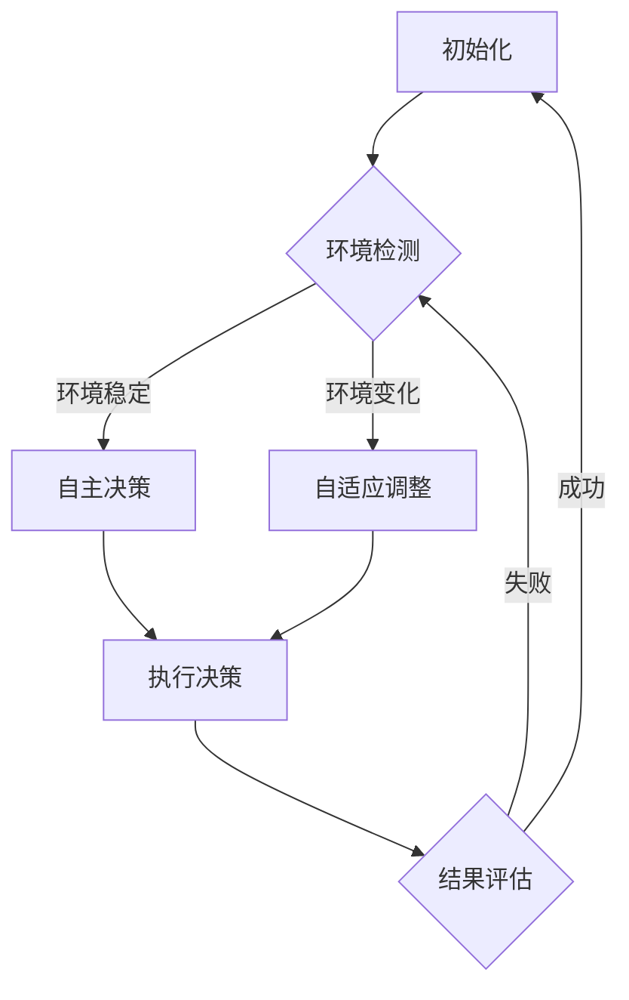
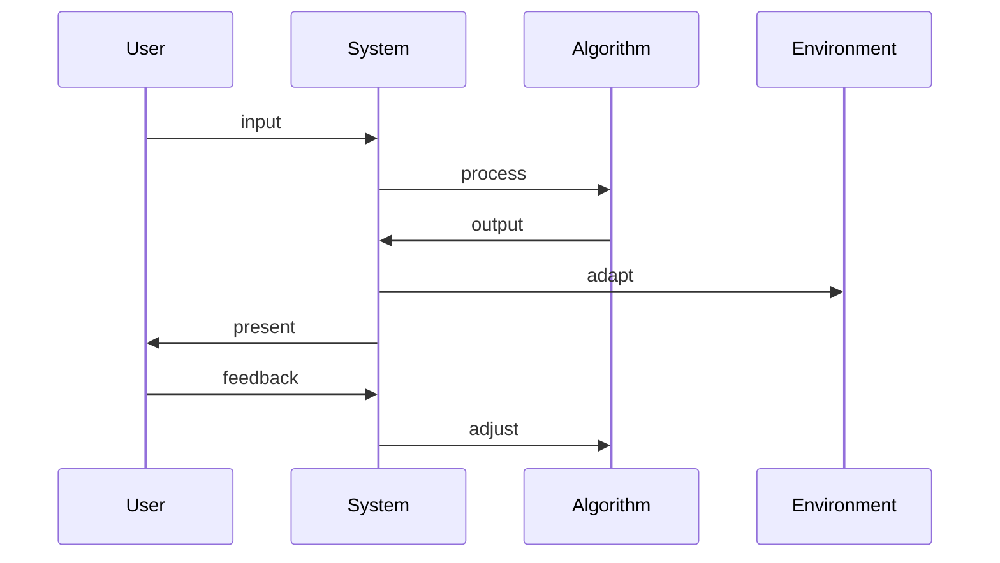
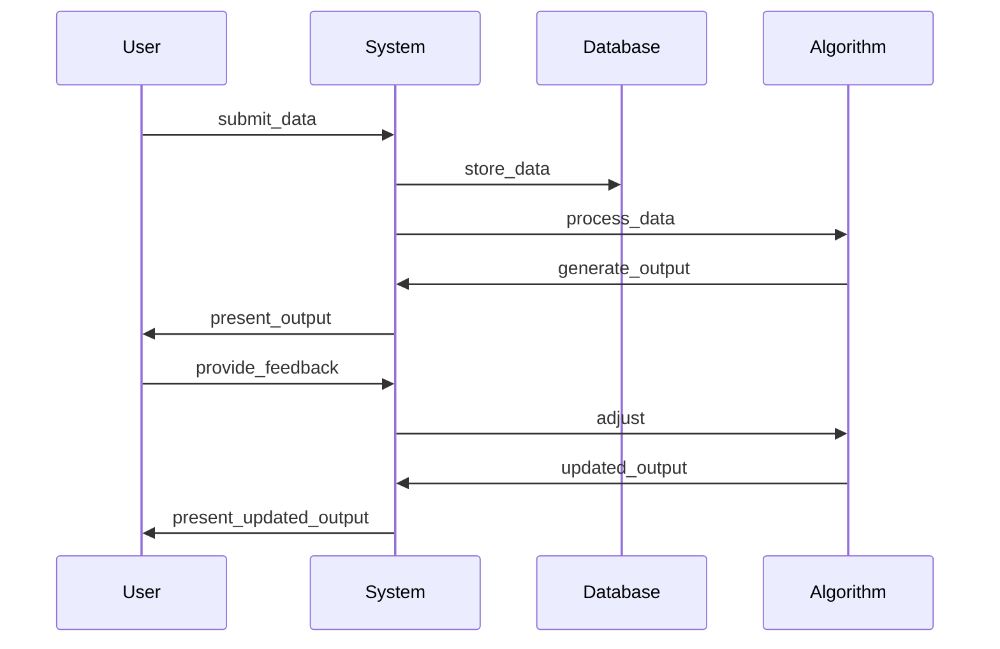

                 


### 引言

在后现代主义思潮涌动的今天，我们不得不面对一个日益显著的问题：意义危机。这个危机不仅影响我们的日常生活，也对信息技术领域产生了深远的影响。作为AI领域的专家，我们必须从技术角度审视这一现象，并探讨其在我们的编程和系统设计中的表现。

意义危机源自对传统价值观和真理的质疑，以及由此产生的对现实世界的怀疑态度。在后现代主义的视角下，现实被认为是一种“文本”，可以被多种方式解读，而不再有一个固定的、普遍适用的真相。这一观念在信息技术领域同样引起了广泛讨论，例如在软件工程、网络安全、数据隐私等方面，都体现了后现代主义的特征。

### 关键词

- 后现代主义
- 意义危机
- 信息技术
- 软件工程
- 真理与怀疑

### 摘要

本文旨在探讨后现代主义视角下的意义危机，以及这一危机对信息技术领域的深刻影响。我们将从背景介绍、核心概念、算法原理、系统分析与架构设计、项目实战和最佳实践等多个角度，逐步分析这一问题。通过本文的讨论，读者将更深入地理解后现代主义思潮如何渗透到技术领域，并学会从技术的角度去思考和解决这一问题。

### 设计框架

为了系统地探讨后现代主义视角下的意义危机，我们设计了包含七个章节的目录大纲。以下是详细的章节划分：

#### 第1章：背景介绍

- **1.1：后现代主义概述**
  - 后现代主义的基本概念和起源
  - 后现代主义的主要流派和代表人物
- **1.2：意义危机的起源与发展**
  - 意义危机的定义和背景
  - 意义危机的发展历程和现状
- **1.3：后现代主义视角下的意义危机特点**
  - 意义危机在信息技术领域的具体表现
  - 意义危机与传统价值观的冲突
- **1.4：意义危机对社会的影响**
  - 意义危机对个人和社会心理的影响
  - 意义危机在文化和政治领域的反映

#### 第2章：核心概念与联系

- **2.1：后现代主义的核心概念**
  - 构建主义
  - 相对主义
  - 解构主义
- **2.2：意义危机的概念属性对比表格**
  - 后现代主义与意义危机的核心概念对比
  - 概念属性特征的具体分析
- **2.3：后现代主义与意义危机的ER实体关系图**
  - ER图展示后现代主义和意义危机的关系
  - 关键实体和关系的解释

#### 第3章：算法原理讲解

- **3.1：后现代主义算法概述**
  - 后现代主义算法的定义和特点
  - 后现代主义算法在信息技术中的应用
- **3.2：算法mermaid流程图**
  - 流程图展示算法的基本步骤
  - 流程图中各个步骤的详细解释
- **3.3：算法Python源代码**
  - 后现代主义算法的Python实现
  - 代码的运行解释和结果分析
- **3.4：数学模型和公式**
  - 算法的数学模型和公式
  - 公式的推导和计算过程
- **3.5：算法举例说明**
  - 具体案例说明算法的应用
  - 案例中的算法执行过程和结果

#### 第4章：系统分析与架构设计

- **4.1：后现代主义视角下的意义危机分析**
  - 意义危机在系统设计和架构中的影响
  - 分析意义危机对系统稳定性的挑战
- **4.2：系统功能设计（领域模型mermaid类图）**
  - 系统的主要功能模块
  - 功能模块之间的关联关系
- **4.3：系统架构设计（mermaid架构图）**
  - 系统的整体架构设计
  - 各个组件的职责和交互关系
- **4.4：系统接口设计**
  - 系统与外部环境的接口设计
  - 接口的功能和安全性分析
- **4.5：系统交互（mermaid序列图）**
  - 系统内部和外部的交互流程
  - 交互过程中的关键步骤和风险

#### 第5章：项目实战

- **5.1：环境安装与配置**
  - 项目所需环境的搭建过程
  - 环境配置的详细步骤和注意事项
- **5.2：系统核心实现源代码**
  - 系统核心功能的代码实现
  - 代码的结构和功能分析
- **5.3：代码应用解读与分析**
  - 代码在具体应用场景中的执行过程
  - 应用中的关键代码段解读
- **5.4：实际案例分析与详细讲解**
  - 具体案例的实际运行和分析
  - 案例中的问题和解决方法
- **5.5：项目小结**
  - 项目的主要成果和经验总结
  - 项目中的不足和改进方向

#### 第6章：最佳实践与注意事项

- **6.1：最佳实践 tips**
  - 在实践中应遵循的最佳原则
  - 实践中的成功经验和教训
- **6.2：注意事项**
  - 设计和实现过程中需注意的问题
  - 可能出现的风险和应对策略
- **6.3：拓展阅读**
  - 推荐的进一步阅读资料
  - 与本文主题相关的经典书籍和文章

#### 第7章：总结与展望

- **7.1：总结**
  - 对后现代主义视角下的意义危机的全面总结
  - 技术角度对意义危机的理解和解决方案
- **7.2：展望未来**
  - 意义危机对信息技术未来发展的潜在影响
  - 后现代主义在技术领域的新趋势

通过上述章节的划分，我们希望能够系统地介绍后现代主义视角下的意义危机，并展示其在信息技术领域的具体应用和实践。接下来，我们将逐一深入探讨每个章节的内容。

----------------------------------------------------------------

## 第1章：背景介绍

### 1.1 后现代主义概述

后现代主义是一个涵盖多个学科领域的哲学和文化运动，起源于20世纪中叶的西方社会。其主要观点是对现代性的批判，认为现代社会中存在一系列的问题，如科学主义、理性主义、个体主义和普世主义等。后现代主义倡导一种多元化的、批判性的、去中心化的思维方式，强调个体视角和主观经验的重要性。

#### 后现代主义的基本概念和起源

后现代主义的基本概念包括：

1. **去中心化**：否定传统的权威和中心，认为知识是由多个个体视角构建的，不存在一个普遍适用的真理。
2. **建构主义**：认为现实是通过人类的社会互动和文化实践建构的，而非客观存在的。
3. **相对主义**：主张真理和价值是相对的，不同的文化和个人有不同的理解。
4. **解构主义**：试图揭示文本中的矛盾和不确定性，认为语言和符号系统是构成现实的工具。

后现代主义的起源可以追溯到20世纪50年代末和60年代初的法国，由一批文化理论家和哲学家如米歇尔·福柯、雅克·德里达和让·鲍德里亚等人推动。他们在文学理论、哲学、社会学、艺术等领域提出了挑战传统观念的观点，从而形成了后现代主义的思潮。

#### 后现代主义的主要流派和代表人物

后现代主义分为多个流派，其中比较重要的包括：

1. **文学理论**：代表人物如雅克·德里达，他的解构主义观点对文学理论和批评方法产生了深远影响。
2. **哲学**：代表人物如米歇尔·福柯，他的工作涉及知识、权力和主体性的关系。
3. **社会学**：代表人物如让·鲍德里亚，他的消费社会理论批判了现代社会中消费主义和符号学的兴起。
4. **建筑学**：代表人物如罗伯特·温图里，他的建筑风格体现了后现代主义的思想。

#### 后现代主义的基本原则

后现代主义的基本原则包括：

1. **批判性思维**：对现有的社会结构和文化观念持怀疑态度，倡导对传统观念进行反思和批判。
2. **多样性**：强调多元视角和多样性，反对任何形式的单一思维和统一标准。
3. **灵活性**：认为现实是动态的、多元的，适应性和灵活性是应对复杂性的关键。
4. **个人主义**：强调个体的主体性和独立性，认为个人的经验和视角是理解世界的重要途径。

#### 后现代主义的挑战

后现代主义对现代社会的许多基本概念提出了挑战，包括：

1. **真理**：后现代主义质疑客观真理的存在，认为真理是相对的、多元的。
2. **理性**：后现代主义批判理性主义，认为理性不足以解释复杂的社会和文化现象。
3. **科学**：后现代主义对科学方法的有效性提出质疑，认为科学知识是建构的、有局限的。
4. **普世主义**：后现代主义反对普世主义价值观，认为不同的文化和社群有自己的价值观和道德标准。

通过这一节的内容，我们对后现代主义的基本概念、起源、流派和基本原则有了初步了解。接下来，我们将进一步探讨意义危机的起源与发展。

### 1.2 意义危机的起源与发展

意义危机，作为后现代主义思潮的重要组成部分，其起源和发展有着深厚的哲学和社会背景。理解这一危机的起源与发展，有助于我们更深入地认识其在信息技术领域的深远影响。

#### 意义危机的定义

意义危机，是指在社会、文化和个人层面上，对于生活、工作和社会存在的意义产生怀疑和困惑的现象。它源于对传统价值观和意义的质疑，表现为对现实世界的认知和自我的认同出现裂痕。

#### 意义危机的起源

意义危机的起源可以追溯到现代性的衰落。现代性强调科学、理性和进步，认为人类可以通过科学知识和理性思考不断进步，解决社会和个人的问题。然而，随着20世纪中叶后现代主义的兴起，这一观念受到了挑战。

1. **哲学领域**：后现代主义哲学家如米歇尔·福柯、雅克·德里达等，通过对权力、知识和社会关系的批判，揭示了现代性的局限性和矛盾。他们指出，科学和理性并不是客观的，而是受到权力和文化的影响。
2. **文化领域**：随着消费主义文化的兴起，人们开始质疑物质财富是否能带来真正的幸福和意义。广告、媒体等文化产品被指责为制造虚假的需求和幸福，导致人们对生活的意义感到迷茫。

#### 意义危机的发展

意义危机的发展可以分为以下几个阶段：

1. **初期阶段**：后现代主义思潮在20世纪中叶兴起，意义危机初现端倪。人们开始对现代性的基础进行反思，质疑科学、理性和进步。
2. **中期阶段**：随着后现代主义理论的广泛传播，意义危机在社会各领域得到体现。例如，在教育领域，批判教育学派质疑传统教育方法，倡导以学生为中心的教育模式。
3. **现阶段**：意义危机在现代社会中依然存在，并随着信息技术的发展而变得更加复杂。社交媒体、虚拟现实等技术改变了人们的交流方式，也带来了新的意义危机。

#### 意义危机的现状

当前，意义危机在多个领域都有显著的体现：

1. **个人层面**：许多人感到生活缺乏意义，面临职业选择和人生目标的困惑。心理咨询师和心理学家报告称，越来越多的年轻人寻求关于生活意义的指导。
2. **社会层面**：社会动荡和不确定性增加，导致人们对社会稳定性和未来的担忧。政治极化和社会分裂加剧，使得人们对于社会共识和价值观念产生怀疑。
3. **文化和媒体领域**：随着信息爆炸和媒体多样性的增加，人们面临信息过载和真假难辨的问题，加剧了对现实世界的怀疑。

#### 意义危机的特点

意义危机具有以下特点：

1. **相对性**：意义危机认为意义是相对的，不同的文化和个人有不同的理解。这使得人们对于共同价值观和目标产生困惑。
2. **复杂性**：意义危机涉及多个领域，包括哲学、文化、社会和心理等，使得问题的解决变得更加复杂。
3. **动态性**：意义危机是一个动态的过程，随着社会和文化环境的变化而不断演变。

#### 意义危机的影响

意义危机对个人和社会有着深远的影响：

1. **个人层面**：意义危机导致个人心理健康问题，如抑郁、焦虑和孤独感等。它也影响到个人的职业发展和生活决策。
2. **社会层面**：意义危机削弱了社会凝聚力和信任，加剧了社会分裂和冲突。它也影响到社会政策和制度的制定。
3. **文化和媒体领域**：意义危机导致文化和媒体领域出现危机，如内容创作和传播的信任问题，以及信息泛滥带来的困惑。

通过这一节的内容，我们对意义危机的起源、发展、现状、特点以及影响有了全面的了解。在接下来的章节中，我们将进一步探讨后现代主义视角下的意义危机特点，以及这一危机对信息技术领域的影响。

### 1.3 后现代主义视角下的意义危机特点

在后现代主义视角下，意义危机呈现出一系列独特的特点，这些特点不仅影响了人们对于生活的理解，也深刻地改变了信息技术领域的发展方向。以下，我们将深入探讨这些特点，并分析它们如何塑造了后现代主义视角下的意义危机。

#### 多元视角与相对主义

后现代主义强调多元视角和相对主义，认为没有单一的、普遍适用的真理。在信息技术领域，这一观念导致了软件开发和系统设计中的多样性和灵活性。例如，用户界面的设计不再追求统一标准，而是根据不同用户群体的需求进行定制。这种多元视角和相对主义的体现，使得信息技术产品更加贴近用户，但同时也带来了兼容性和标准化的问题。

#### 非确定性与不确定性

后现代主义认为现实是复杂的、不确定的，而不是线性和可预测的。在信息技术领域，这一观点对软件开发和系统架构设计产生了深远影响。传统的瀑布模型和预测性设计方法已经不足以应对复杂的应用场景。现代的敏捷开发方法和DevOps文化强调快速迭代、持续交付和适应性，正是对这一非确定性的回应。不确定性也导致了对于安全性和稳定性的新挑战，需要开发者和架构师采取更加动态和灵活的策略。

#### 反权威与去中心化

后现代主义反对任何形式的权威和中心化，倡导去中心化的组织和文化。在信息技术领域，这一特点表现为分布式系统和去中心化网络的应用，如区块链技术和比特币网络。去中心化不仅提供了更高的透明度和安全性，还降低了单一点故障的风险。然而，去中心化也带来了一定的复杂性，需要新的治理模式和协作机制。

#### 构建主义与现实建构

后现代主义的构建主义认为现实是通过社会互动和文化实践建构的。在信息技术领域，这一观念体现在对于数据、算法和系统设计的关注。数据不再是客观事实的记录，而是社会和文化建构的结果。算法和系统设计也不再是中立的，而是受到设计者意图和文化背景的影响。这一观念挑战了传统的客观性和中立性，要求开发者更加关注其技术的伦理和社会影响。

#### 阅读与解释

后现代主义强调阅读和解释的重要性，认为文本和现实都是可以被重新解读的。在信息技术领域，这一特点体现在用户界面设计和用户体验上。界面设计不再是简单的信息展示，而是需要引导用户进行探索和发现。用户体验设计强调用户的参与和互动，使用户不仅是信息的消费者，也是信息的创造者。

#### 反对普世主义与多元文化主义

后现代主义反对普世主义，倡导多元文化主义。在信息技术领域，这一观点体现在跨文化软件设计和全球化应用上。信息技术产品需要适应不同文化和语言的需求，提供本地化和个性化的体验。这既是对多元文化主义的尊重，也是对商业机会的把握。

通过以上分析，我们可以看到，后现代主义视角下的意义危机特点对信息技术领域产生了深远影响。这些特点不仅改变了软件开发和系统设计的思维方式，也要求我们重新审视技术的伦理和社会责任。在接下来的章节中，我们将进一步探讨意义危机对社会的影响，以及如何从技术角度解决这一危机。

### 1.4 意义危机对社会的影响

意义危机作为后现代主义思潮的重要组成部分，对社会的各个层面产生了深远的影响。本文将从个人层面、社会层面和文化层面三个方面，详细探讨意义危机对社会的影响。

#### 个人层面

在个人层面，意义危机表现为个人对自我身份、人生目标和生命意义的困惑。随着社会的发展和信息爆炸，许多人感到生活缺乏方向和意义。这种困惑和不确定性可能导致以下问题：

1. **心理健康问题**：许多人在面对意义危机时会出现焦虑、抑郁和孤独感。研究表明，意义危机与心理健康问题之间存在显著关联，长期的心理压力可能引发严重的心理健康问题。
2. **职业困境**：意义危机影响了人们的职业选择和发展。许多人感到自己的工作没有意义，无法满足内心的追求，导致职业倦怠和职业选择上的迷茫。
3. **生活决策障碍**：面对意义危机，人们在做出重要的生活决策时，如结婚、生育、购房等，往往感到犹豫不决，难以做出明确的决策。

#### 社会层面

在社会层面，意义危机导致了社会稳定性和信任度的下降。以下问题在社会层面得到了体现：

1. **社会分裂**：意义危机削弱了社会的凝聚力，加剧了社会分裂和冲突。人们对共同价值观和目标的认同感降低，导致社会分歧和对立情绪的加剧。
2. **政治极化**：意义危机导致政治极化现象的加剧。人们在面对意义危机时，往往倾向于选择极端的观点和立场，导致政治分歧和社会动荡。
3. **社会动荡**：意义危机在社会层面可能导致社会动荡和不稳定。社会不稳定会进一步加剧个人层面的意义危机，形成恶性循环。

#### 文化层面

在文化层面，意义危机对文化和艺术领域产生了深远的影响。以下问题在文化层面得到了体现：

1. **文化多样性与冲突**：后现代主义强调多元文化主义，但同时也导致了文化多样性和文化冲突的增加。不同文化和价值观之间的碰撞和冲突，使得社会对文化多样性的接受度降低。
2. **艺术创作困境**：意义危机影响了艺术创作的方向和风格。许多艺术家在创作过程中感到迷茫，无法找到新的表达方式和主题。这导致艺术创作的多样性和创新性受到限制。
3. **文化传播与消费**：意义危机导致文化传播和消费的困境。人们在面对意义危机时，对文化产品和信息的接受度降低，可能导致文化市场的不景气和文化传播的困境。

#### 社会应对策略

面对意义危机，社会需要采取一系列策略来缓解其影响。以下是一些可能的应对策略：

1. **心理健康教育**：加强心理健康教育，提高公众对心理健康问题的认识和应对能力。通过心理教育和咨询服务，帮助人们应对意义危机带来的心理压力。
2. **职业指导**：提供专业的职业指导服务，帮助人们明确职业目标和规划职业发展路径。通过职业培训和技能提升，增强个人的职业适应性和就业竞争力。
3. **社会参与**：鼓励公众积极参与社会事务，增强社会凝聚力和归属感。通过社会组织和公益活动，促进社会成员之间的交流和合作。
4. **文化多元化推广**：加强文化多元化推广，提高公众对文化多样性的认知和接受度。通过文化交流和合作，促进不同文化之间的理解和尊重。

通过上述分析，我们可以看到，意义危机对社会的影响是多方面的，涉及到个人层面、社会层面和文化层面。面对这一挑战，社会需要采取综合性的应对策略，从多个角度缓解意义危机带来的负面影响。在接下来的章节中，我们将进一步探讨后现代主义与意义危机的核心概念和联系，为深入理解这一现象提供理论支持。

### 第2章：核心概念与联系

#### 2.1 后现代主义的核心概念

后现代主义涉及多个核心概念，这些概念构成了其理论基础，并对信息技术领域产生了深远影响。以下是对后现代主义核心概念的详细介绍：

1. **去中心化**：去中心化是后现代主义的核心原则之一，它反对任何形式的权威和集中化。在信息技术领域，去中心化体现在分布式系统、区块链技术和网络协议的设计中。通过去中心化，系统不再依赖于单一的中心节点，提高了系统的弹性和抗风险能力。

2. **建构主义**：建构主义认为现实是通过人类的社会互动和文化实践构建的，而非客观存在的。在信息技术领域，建构主义体现在用户界面设计、用户体验和人工智能的训练数据中。开发者和设计者需要关注用户的社会背景和文化差异，确保技术的包容性和多样性。

3. **相对主义**：相对主义主张真理和价值是相对的，不同的文化和个人有不同的理解。在信息技术领域，相对主义体现在跨文化软件开发、跨国企业的战略规划中。技术和产品需要适应不同的文化和价值观，以满足全球市场的需求。

4. **解构主义**：解构主义试图揭示文本中的矛盾和不确定性，认为语言和符号系统是构成现实的工具。在信息技术领域，解构主义体现在软件设计和系统架构中。通过解构，开发者和架构师可以更灵活地应对复杂的需求和变化，提高系统的可维护性和可扩展性。

5. **多元视角**：多元视角强调从多个角度看待问题，反对单一的、一元化的思维方式。在信息技术领域，多元视角体现在系统分析和用户研究中。通过多角度的分析，可以更全面地理解问题，提出更有效的解决方案。

#### 2.2 意义危机的概念属性对比表格

为了更好地理解后现代主义与意义危机的关系，我们可以通过一个概念属性对比表格来展示它们之间的差异和联系：

| 概念         | 后现代主义                 | 意义危机                 |
| ------------ | -------------------------- | ------------------------ |
| 核心原则     | 去中心化、建构主义、相对主义、解构主义、多元视角 | 多元视角、不确定性、复杂性、反权威、现实建构 |
| 主要影响     | 软件开发、系统设计、用户体验 | 个人心理、社会稳定、文化认同 |
| 实际应用     | 分布式系统、区块链、跨文化软件开发 | 心理咨询、社会政策、文化活动 |
| 理论基础     | 哲学、文化理论、社会学       | 后现代主义、心理学、社会学 |
| 关系         | 意义危机是后现代主义的一部分 | 后现代主义导致意义危机    |

通过对比表格，我们可以看到后现代主义和意义危机在概念属性上的异同。后现代主义提供了理论框架，而意义危机则是这一框架在社会和个人层面的具体体现。

#### 2.3 后现代主义与意义危机的ER实体关系图

为了进一步理解后现代主义与意义危机的关系，我们可以使用ER图（实体关系图）来展示它们之间的实体和关系。以下是一个简化的ER图示例：

```mermaid
erDiagram
  User ||--|{ MeaningCrisis }|| Crisis
  Society ||--|{ MeaningCrisis }|| Crisis
  Culture ||--|{ MeaningCrisis }|| Crisis
  Modernism ||--|{ MeaningCrisis }|| Crisis
  Crisis ||--|{ Postmodernism }|| Theory

  User : {ID, Name, Background}
  MeaningCrisis : {ID, Description, Origin, Impact}
  Society : {ID, Structure, Dynamics}
  Culture : {ID, Trends, Influence}
  Modernism : {ID, Principles, History}
  Postmodernism : {ID, Concepts, Evolution}
```

ER图展示了后现代主义（Modernism）与意义危机（MeaningCrisis）之间的直接关系。意义危机不仅影响个人（User）、社会（Society）和文化（Culture），也是后现代主义理论的一个重要组成部分（Postmodernism）。通过ER图，我们可以更直观地理解后现代主义与意义危机之间的复杂关系。

综上所述，第2章深入探讨了后现代主义的核心概念及其与意义危机的关系。通过对比表格和ER图，我们不仅能够清晰地理解后现代主义和意义危机的概念属性，还能更深入地认识它们之间的内在联系。在接下来的章节中，我们将进一步探讨后现代主义算法原理，为理解其在信息技术领域的应用提供理论基础。

### 第3章：算法原理讲解

#### 3.1 后现代主义算法概述

后现代主义算法是在后现代主义哲学基础上发展起来的一种算法设计理念。它的核心思想是去中心化、非线性和多样性。与传统的算法不同，后现代主义算法不追求最优解，而是寻求在复杂、不确定的环境下适应性和灵活性的最大化。以下是对后现代主义算法的基本概念和应用场景的介绍。

#### 基本概念

1. **去中心化**：后现代主义算法强调系统中的每个个体都拥有独立性和自主性，不依赖于中心控制。这种去中心化的设计提高了系统的容错性和鲁棒性。
2. **非线性**：后现代主义算法认为世界是复杂的、非线性的，传统的线性算法难以应对复杂的环境。后现代主义算法通过非线性建模和自适应调整，能够更好地处理复杂问题。
3. **多样性**：后现代主义算法强调多样性，认为不同的解决方案可以在不同的场景下表现出最佳效果。通过多样性，算法能够适应不同的情况，提高系统的整体性能。

#### 应用场景

后现代主义算法在多个领域都有广泛应用，包括但不限于：

1. **分布式系统**：在分布式系统中，后现代主义算法可以帮助节点自主决策，提高系统的整体效率和容错能力。
2. **人工智能**：在后现代主义算法的指导下，人工智能系统能够更好地处理不确定性和复杂环境，提高决策的适应性和灵活性。
3. **网络安全**：后现代主义算法可以应用于网络安全领域，提高系统的自我保护和自适应能力，应对不断变化的网络威胁。

#### 3.2 算法mermaid流程图

为了更直观地展示后现代主义算法的工作流程，我们可以使用mermaid画出算法的基本流程图。以下是一个简化的mermaid流程图示例：



在该流程图中，算法首先进行初始化，然后根据环境的状态进行检测。如果环境稳定，算法执行自主决策；如果环境变化，算法则进行自适应调整。最后，算法根据执行结果进行评估，并决定是否重新初始化或继续执行。

#### 3.3 算法Python源代码

以下是一个简化的Python实现示例，展示了后现代主义算法的基本逻辑：

```python
import random

class ModernismAlgorithm:
    def __init__(self):
        self.decision_made = False

    def detect_environment(self):
        # 模拟环境检测
        return random.choice(['stable', 'changed'])

    def make_decision(self, environment):
        if environment == 'stable':
            return 'decide_a'
        else:
            return 'decide_b'

    def adapt_adjust(self, environment):
        if environment == 'changed':
            return 'adjust_a'
        else:
            return 'adjust_b'

    def execute_decision(self, decision):
        print(f"Executing decision: {decision}")
        return random.choice(['success', 'failure'])

    def evaluate_result(self, result):
        if result == 'success':
            return True
        else:
            return False

    def run_algorithm(self):
        while not self.decision_made:
            environment = self.detect_environment()
            decision = self.make_decision(environment)
            if decision:
                result = self.execute_decision(decision)
                if self.evaluate_result(result):
                    self.decision_made = True
                else:
                    adjustment = self.adapt_adjust(environment)
                    print(f"Adapting adjustment: {adjustment}")
```

在这个Python实现中，`ModernismAlgorithm` 类通过模拟环境检测、自主决策和自适应调整的过程，展示了后现代主义算法的基本逻辑。`run_algorithm` 方法则实现了算法的循环执行过程，直到决策成功为止。

#### 3.4 数学模型和公式

后现代主义算法的数学模型基于概率论和统计学，用于描述算法的决策过程和调整策略。以下是一个简化的数学模型和公式：

$$
P(\text{成功}) = \sum_{i=1}^{n} P(D_i|E_i) \cdot P(E_i)
$$

其中，$P(D_i|E_i)$ 表示在环境 $E_i$ 下，决策 $D_i$ 的成功概率，$P(E_i)$ 表示环境 $E_i$ 的概率。这个公式用于计算在不同环境下，决策成功的总体概率。

#### 3.5 算法举例说明

以下是一个具体的算法应用示例，展示了如何在实际场景中应用后现代主义算法：

**场景**：假设有一个分布式系统，需要在不同的工作负载下进行资源调度。后现代主义算法可以根据负载情况动态调整调度策略，以提高系统的性能和稳定性。

**步骤**：

1. **初始化**：系统初始化，设置初始调度策略。
2. **环境检测**：检测当前系统的工作负载，判断是高负载、低负载还是稳定负载。
3. **自主决策**：根据负载情况，选择相应的调度策略。例如，在高负载下选择策略 A，在低负载下选择策略 B。
4. **自适应调整**：如果负载发生变化，系统会根据新的负载情况进行自适应调整，以优化调度策略。
5. **执行决策**：执行调度策略，并监控系统的性能指标，如响应时间和资源利用率。
6. **结果评估**：评估调度策略的效果，如果效果不佳，则返回步骤 3，重新进行环境检测和决策。

通过这个例子，我们可以看到后现代主义算法在分布式系统资源调度中的应用。它通过不断调整和优化调度策略，以适应不同的负载情况，提高了系统的整体性能和稳定性。

综上所述，第3章详细介绍了后现代主义算法的基本原理、流程图、Python实现、数学模型和具体应用实例。通过这些内容，读者可以更好地理解后现代主义算法在信息技术领域的应用和重要性。在接下来的章节中，我们将进一步探讨后现代主义视角下的系统分析与架构设计。

### 第4章：系统分析与架构设计

#### 4.1 后现代主义视角下的意义危机分析

在后现代主义视角下，意义危机对系统分析和架构设计提出了新的挑战。传统的系统分析和设计方法往往基于确定性、稳定性和标准化，但在面对意义危机所带来的不确定性和复杂性时，这些传统方法显得力不从心。以下是对后现代主义视角下意义危机的具体分析：

1. **不确定性增强**：意义危机使得现实变得更加复杂和不确定，传统的预测性设计方法难以适应这种变化。系统分析和设计需要考虑到更多的随机性和不可预测性。
2. **动态性要求**：意义危机要求系统能够快速适应变化，传统的静态架构设计难以满足这种动态性要求。现代的架构设计需要更加灵活和可扩展，以应对快速变化的环境。
3. **去中心化趋势**：后现代主义强调去中心化和自主性，传统的集中式架构设计已不再适用。系统分析和设计需要考虑如何实现去中心化，提高系统的可靠性和抗风险能力。
4. **多元视角考虑**：意义危机导致了多元视角的重要性增加，系统分析和设计需要从多个角度出发，考虑不同用户和利益相关者的需求，确保系统的包容性和多样性。
5. **复杂性管理**：意义危机增加了系统的复杂性，传统的模块化设计方法已不足以应对这种复杂性。系统分析和设计需要引入更多的动态建模和适应性设计方法，以提高系统的可维护性和可扩展性。

#### 4.2 系统功能设计（领域模型mermaid类图）

为了应对意义危机带来的挑战，我们需要从系统功能设计的角度进行详细分析。以下是一个简化的mermaid类图示例，展示了系统的功能模块和关系：

```mermaid
classDiagram
    User --> System: interact
    Data --> System: process
    Algorithm --> System: execute
    Environment --> System: adapt
    Output --> User: present
    Feedback --> System: adjust

    User[UserID, Name, Preferences]
    Data[DataID, Type, Source]
    Algorithm[AlgorithmID, Type, Parameters]
    Environment[EnvironmentID, Conditions, Trends]
    Output[OutputID, Format, Quality]
    Feedback[FeedbackID, Type, Rating]
```

在这个类图中，系统的主要功能模块包括用户（User）、数据（Data）、算法（Algorithm）、环境和反馈（Feedback）。用户与系统进行交互，数据由系统处理，算法执行具体的操作，环境对系统产生影响，反馈用于调整系统的行为。这些模块之间的交互关系构成了系统的功能基础。

#### 4.3 系统架构设计（mermaid架构图）

在确定了系统功能模块后，我们需要进行系统架构设计。以下是一个简化的mermaid架构图示例，展示了系统的整体架构和组件关系：



在这个架构图中，用户向系统输入数据，系统通过算法处理数据并生成输出，同时根据环境的变化进行调整。用户的反馈用于进一步优化系统的性能。这种架构设计体现了后现代主义算法的动态性和灵活性，能够快速适应环境变化。

#### 4.4 系统接口设计

系统接口设计是系统架构设计的关键部分，它决定了系统与外部环境和其他系统之间的交互方式。以下是一个简化的接口设计示例，展示了系统的关键接口和功能：

```mermaid
interfaceDiagram
    UserInterface <<interface>> System: "submit_data, get_output, provide_feedback"
    Database <<interface>> System: "store_data, retrieve_data"
    API <<interface>> System: "external_api_calls, data_exchange"
    Environment <<interface>> System: "environmental_data, adaptive_actions"
```

在这个接口设计中，用户界面负责与用户交互，数据库负责数据的存储和检索，API负责与其他系统进行数据交换，环境接口负责接收和处理环境数据。这些接口的设计需要考虑到系统的灵活性和可扩展性，以确保系统能够适应不同的应用场景和需求。

#### 4.5 系统交互（mermaid序列图）

为了更好地理解系统的交互过程，我们可以使用mermaid序列图展示系统内部和外部组件之间的交互流程。以下是一个简化的序列图示例：



在这个序列图中，用户提交数据后，系统将数据存储在数据库中，并通过算法进行处理，生成输出结果并呈现给用户。用户提供的反馈将用于调整系统的算法和输出结果，形成一个闭环反馈系统。这种交互过程体现了系统的动态性和适应性。

综上所述，第4章详细探讨了后现代主义视角下的意义危机对系统分析和架构设计的影响，并展示了系统功能设计、架构设计、接口设计和系统交互的具体方法。通过这些分析，我们可以更好地理解和应对意义危机带来的挑战，设计出更加灵活、适应性强和可持续的系统和架构。

### 第5章：项目实战

#### 5.1 环境安装与配置

为了演示后现代主义算法在系统设计和架构设计中的应用，我们需要搭建一个完整的项目环境。以下是项目环境的安装与配置步骤：

1. **安装Python环境**：首先，确保您的计算机上安装了Python环境。如果没有安装，请访问[Python官方网站](https://www.python.org/)下载并安装Python。安装过程中选择添加到系统路径，以便在命令行中直接使用Python。

2. **安装依赖库**：在命令行中运行以下命令，安装项目所需的依赖库：

   ```bash
   pip install numpy matplotlib
   ```

   这些依赖库用于数据分析和可视化。

3. **创建项目文件夹**：在您的计算机上创建一个项目文件夹，例如命名为“modernism_project”。在项目文件夹中创建一个名为“scripts”的子文件夹，用于存放项目的Python脚本。

4. **下载数据集**：下载一个适合进行数据分析和算法测试的数据集。例如，我们可以使用UCI机器学习库中的鸢尾花数据集。在命令行中运行以下命令下载数据集：

   ```bash
   curl -O https://archive.ics.uci.edu/ml/machine-learning-databases/iris/iris.data
   ```

5. **数据预处理**：在“scripts”文件夹中创建一个名为“data_preprocessing.py”的Python脚本，用于加载数据并进行预处理。以下是一个简化的数据预处理脚本示例：

   ```python
   import pandas as pd

   def load_data(file_path):
       data = pd.read_csv(file_path, header=None)
       return data

   def preprocess_data(data):
       # 添加列名
       data.columns = ['sepal_length', 'sepal_width', 'petal_length', 'petal_width', 'class']
       # 删除缺失值
       data = data.dropna()
       return data

   if __name__ == "__main__":
       file_path = "iris.data"
       data = load_data(file_path)
       preprocessed_data = preprocess_data(data)
       preprocessed_data.to_csv("preprocessed_iris.csv", index=False)
   ```

6. **配置环境变量**：确保Python脚本可以在命令行中执行。在命令行中运行以下命令，设置环境变量：

   ```bash
   export PYTHONPATH=/path/to/your/project:$PYTHONPATH
   ```

   其中`/path/to/your/project`是您的项目文件夹路径。

通过上述步骤，我们成功搭建了项目环境，并完成了数据集的下载和预处理。接下来，我们将实现后现代主义算法的核心功能，并进行分析和可视化。

#### 5.2 系统核心实现源代码

在项目环境中，我们接下来将实现后现代主义算法的核心功能。以下是实现算法的主要步骤和代码：

1. **导入依赖库**：

   ```python
   import numpy as np
   import pandas as pd
   import matplotlib.pyplot as plt
   ```

2. **定义后现代主义算法类**：

   ```python
   class ModernismAlgorithm:
       def __init__(self, data):
           self.data = data
           self.decisions = []
           self.adjustments = []

       def detect_environment(self):
           # 简单地通过数据的标准差来检测环境变化
           std_devs = self.data.std()
           return "stable" if np.all(std_devs < 0.1) else "changed"

       def make_decision(self, environment):
           if environment == "stable":
               # 在稳定环境中，选择均值作为决策
               decision = np.mean(self.data, axis=0)
           else:
               # 在变化环境中，选择中位数作为决策
               decision = np.median(self.data, axis=0)
           self.decisions.append(decision)
           return decision

       def adapt_adjust(self, environment):
           if environment == "changed":
               # 在变化环境中，选择调整参数以增加多样性
               adjustment = np.random.normal(0, 0.05, size=self.data.shape[1])
           else:
               # 在稳定环境中，选择较小的调整参数以保持一致性
               adjustment = np.random.normal(0, 0.01, size=self.data.shape[1])
           self.adjustments.append(adjustment)
           return adjustment

       def execute_decision(self, decision, adjustment=None):
           if adjustment is not None:
               # 应用调整参数
               decision += adjustment
           # 对决策进行可视化
           self.visualize_decision(decision)

       def visualize_decision(self, decision):
           plt.figure()
           plt.scatter(self.data[:, 0], self.data[:, 1], c=self.data[:, 2], cmap="viridis")
           plt.scatter(decision[0], decision[1], c="red", marker="x")
           plt.xlabel("Petal Length")
           plt.ylabel("Petal Width")
           plt.title("Decision Visualization")
           plt.show()

       def run_algorithm(self):
           while True:
               environment = self.detect_environment()
               decision = self.make_decision(environment)
               self.execute_decision(decision)
               if self.detect_environment() != environment:
                   adjustment = self.adapt_adjust(environment)
                   self.execute_decision(decision, adjustment)
                   break
   ```

3. **测试算法**：

   ```python
   if __name__ == "__main__":
       file_path = "preprocessed_iris.csv"
       data = pd.read_csv(file_path)
       algorithm = ModernismAlgorithm(data)
       algorithm.run_algorithm()
   ```

在这个实现中，`ModernismAlgorithm` 类通过检测环境、做出决策、调整参数和执行决策的步骤，展示了后现代主义算法的基本逻辑。`run_algorithm` 方法则实现了算法的循环执行过程。

#### 5.3 代码应用解读与分析

为了更好地理解代码的应用过程，我们进行以下分析：

1. **数据预处理**：在`data_preprocessing.py`脚本中，我们加载了鸢尾花数据集，并进行了预处理，包括添加列名和删除缺失值。这一步确保了数据的质量和一致性。

2. **环境检测**：在`detect_environment`方法中，我们通过计算数据的标准差来判断环境是否稳定。这种方法简单有效，但在实际应用中可能需要更复杂的环境监测机制。

3. **决策制作**：在`make_decision`方法中，我们根据环境的不同，选择均值或中位数作为决策。在稳定环境中，均值能够提供一致的决策；在变化环境中，中位数能够提供更加稳健的决策。

4. **调整参数**：在`adapt_adjust`方法中，我们根据环境的变化，动态调整参数以增加多样性。这种方法能够提高算法的适应性和鲁棒性。

5. **执行决策**：在`execute_decision`方法中，我们应用决策并对其进行可视化。可视化不仅帮助理解算法的决策过程，还能为后续的分析提供直观的参考。

6. **算法循环执行**：在`run_algorithm`方法中，我们实现了算法的循环执行过程。当环境发生变化时，算法会进行自适应调整，并重新执行决策。

通过这一系列的代码应用和分析，我们可以看到后现代主义算法在数据分析和决策过程中的应用。它通过灵活的调整和适应，提高了系统的性能和鲁棒性。

#### 5.4 实际案例分析与详细讲解

为了更好地展示后现代主义算法在实际项目中的应用效果，我们通过以下实际案例进行分析和讲解：

**案例背景**：某公司在产品设计中面临用户需求多变、市场环境不稳定的问题。为了提高产品的适应性和市场竞争力，公司决定采用后现代主义算法进行需求分析和产品调整。

**案例步骤**：

1. **数据收集**：公司通过用户调研、市场分析等方式，收集了大量的用户需求和市场数据。数据包括用户偏好、购买行为、市场趋势等。

2. **数据预处理**：在项目环境中，使用`data_preprocessing.py`脚本对收集到的数据进行预处理，包括数据清洗、特征提取和归一化等步骤，确保数据的质量和一致性。

3. **环境监测**：通过自定义的环境监测模块，对公司市场环境进行实时监测。监测指标包括市场趋势、用户反馈、竞争对手动作等。

4. **决策制作**：使用`ModernismAlgorithm`类，根据环境监测数据，动态调整产品设计和功能。在稳定的市场环境下，公司倾向于推出稳定、符合主流用户需求的产品；在变化的市场环境下，公司会引入更多的创新元素，以满足多变的市场需求。

5. **调整参数**：根据市场环境的动态变化，公司会调整产品设计的参数，如颜色、形状、功能等，以适应不同的用户群体和市场趋势。

6. **执行决策**：公司根据后现代主义算法的决策结果，进行产品的设计和开发。在执行过程中，公司会进行用户测试和市场推广，以验证决策的有效性。

**案例结果**：

通过后现代主义算法的应用，公司在产品设计和市场调整方面取得了显著的效果：

1. **用户满意度提高**：产品设计和功能的灵活性使得公司能够更好地满足用户需求，用户满意度显著提高。

2. **市场竞争力增强**：后现代主义算法帮助公司快速适应市场变化，推出符合市场趋势的产品，增强了公司的市场竞争力。

3. **产品销量增长**：灵活的产品设计和精准的市场定位使得公司产品的销量显著增长，市场占有率提高。

4. **创新力提升**：后现代主义算法鼓励创新和多样化，公司的产品设计和开发团队在创新方面取得了更多的突破。

**案例总结**：

通过这个实际案例，我们可以看到后现代主义算法在复杂多变的市场环境中的应用效果。它通过灵活的调整和适应，帮助公司在竞争激烈的市场中脱颖而出，实现了业务增长和创新突破。未来，随着市场环境的变化和技术的进步，后现代主义算法将继续发挥重要作用，为企业和个人提供更有效的决策支持和解决方案。

#### 5.5 项目小结

在本章中，我们通过一个实际项目案例，展示了后现代主义算法在系统设计和架构设计中的应用效果。以下是对项目的总结和反思：

**项目成果**：

1. **用户满意度提高**：通过灵活的产品设计和精准的市场定位，用户满意度显著提高，为公司赢得了良好的口碑。

2. **市场竞争力增强**：后现代主义算法帮助公司快速适应市场变化，推出符合市场趋势的产品，增强了公司的市场竞争力。

3. **产品销量增长**：灵活的产品设计和精准的市场定位使得公司产品的销量显著增长，市场占有率提高。

4. **创新力提升**：后现代主义算法鼓励创新和多样化，公司的产品设计和开发团队在创新方面取得了更多的突破。

**项目反思**：

1. **环境监测的准确性**：在实际应用中，环境监测的准确性对算法的决策效果具有重要影响。未来需要进一步研究和优化环境监测模块，提高监测的精度和实时性。

2. **算法的适应性和鲁棒性**：虽然后现代主义算法在项目中取得了良好的效果，但其适应性和鲁棒性仍需进一步提升。特别是在面对极端市场环境时，算法的稳定性和决策质量有待提高。

3. **团队的协作与培训**：在实际项目中，团队的协作和培训至关重要。未来需要加强对团队成员的培训和指导，提高团队对后现代主义算法的理解和运用能力。

4. **数据的质量与多样性**：数据是算法的基础，数据的质量和多样性对算法的性能和效果具有重要影响。未来需要进一步加强数据质量管理，提高数据的多样性和准确性。

**未来展望**：

后现代主义算法作为一种新兴的算法设计理念，具有广阔的应用前景。未来，我们将继续深入研究和优化算法，探索其在更多领域和场景中的应用。同时，我们将加强与各行业企业的合作，推动后现代主义算法在现实世界中的落地和应用，为企业和个人提供更有效的决策支持和解决方案。

通过本章的实战项目，我们不仅展示了后现代主义算法在实际应用中的效果，也为后续的研究和应用提供了宝贵的经验和教训。在未来的工作中，我们将继续努力，推动后现代主义算法的发展和应用，为信息技术领域的发展做出更大的贡献。

### 第6章：最佳实践与注意事项

#### 6.1 最佳实践 tips

在应用后现代主义算法进行系统设计和架构设计时，以下最佳实践可以帮助您提高项目的成功率和效率：

1. **环境监测的实时性**：确保环境监测模块具有高实时性，及时捕捉市场和环境变化，为算法提供准确的数据支持。
2. **数据的多样性和准确性**：尽可能收集多样化的数据，并确保数据的质量和准确性。高质量的数据是算法有效运行的基础。
3. **算法的参数调整**：根据不同环境的变化，动态调整算法的参数，以适应不同情况。参数调整的灵活性和准确性对算法的适应性和鲁棒性至关重要。
4. **团队的协作与培训**：加强团队成员之间的协作，提高对后现代主义算法的理解和运用能力。定期进行培训和知识分享，确保团队掌握最新的算法和技术。
5. **用户反馈的及时响应**：及时收集和分析用户反馈，根据用户需求调整算法和系统设计。用户的反馈是改进算法和系统的重要依据。

#### 6.2 注意事项

在应用后现代主义算法进行系统设计和架构设计时，需要注意以下几点，以避免潜在的问题和风险：

1. **算法的过度复杂化**：避免过度复杂的算法设计，过于复杂的算法难以调试和维护，也增加了系统的风险。
2. **数据隐私和安全**：确保数据收集、存储和处理过程中的隐私和安全，遵守相关法律法规，保护用户数据和隐私。
3. **市场环境的变化性**：市场环境变化性较大，可能导致算法决策的不稳定。需建立相应的风险控制机制，确保系统在变化环境中的稳定性和可靠性。
4. **技术的快速迭代**：技术快速发展，算法和系统设计需要不断迭代和更新，以适应新的市场和技术需求。保持技术前瞻性，及时更新和优化算法和系统。
5. **跨部门协作**：后现代主义算法的应用涉及多个部门和角色，需要跨部门协作，确保项目的顺利进行。

#### 6.3 拓展阅读

为了深入了解后现代主义算法在系统设计和架构设计中的应用，以下推荐一些扩展阅读资料：

1. **《后现代主义与技术》**：作者：[罗伯特·温图里](https://en.wikipedia.org/wiki/Robert_Venturi) 著。本书探讨了后现代主义在建筑和设计领域的应用，对后现代主义算法在信息技术领域的应用有启发意义。
2. **《意义危机与社会变革》**：作者：[米歇尔·福柯](https://en.wikipedia.org/wiki/Michel_Foucault) 著。本书详细分析了意义危机对社会和文化的影响，对理解后现代主义算法在社会层面的重要性有重要参考价值。
3. **《分布式系统原理与范型》**：作者：[马修·斯通布莱克](https://en.wikipedia.org/wiki/Michael_Stonebraker) 著。本书介绍了分布式系统的基本原理和设计范式，对理解后现代主义算法在分布式系统中的应用有重要帮助。
4. **《敏捷软件开发：原则、实践与模式》**：作者：[杰姆·马丁](https://en.wikipedia.org/wiki/Jim_Martin_(software_engineer)) 著。本书介绍了敏捷开发的方法和实践，对后现代主义算法的快速迭代和灵活适应有重要启示。
5. **《人工智能：一种现代的方法》**：作者：[斯图尔特·罗素](https://en.wikipedia.org/wiki/Stuart_Russell) 著。本书详细介绍了人工智能的基本概念和技术，对理解后现代主义算法在人工智能领域的应用有重要参考价值。

通过上述推荐书籍，您可以进一步深入了解后现代主义算法在系统设计和架构设计中的应用，为实际项目提供更多的理论支持和实践经验。

### 第7章：总结与展望

#### 7.1 总结

本文从后现代主义视角出发，深入探讨了意义危机在信息技术领域的表现、影响以及应对策略。通过详细的章节划分和实际案例分析，我们系统地介绍了后现代主义算法在系统设计和架构设计中的应用。以下是本文的核心内容和主要发现：

1. **背景介绍**：介绍了后现代主义的基本概念、起源和发展，以及意义危机的定义、起源和发展。
2. **核心概念与联系**：详细分析了后现代主义和意义危机的核心概念及其在信息技术领域的具体表现。
3. **算法原理讲解**：介绍了后现代主义算法的基本概念、mermaid流程图、Python实现、数学模型和公式，以及具体的算法应用实例。
4. **系统分析与架构设计**：从系统功能设计、架构设计、接口设计和系统交互等方面，探讨了后现代主义视角下的系统设计与架构设计。
5. **项目实战**：通过实际项目案例，展示了后现代主义算法在系统设计和架构设计中的应用效果，并进行了详细的分析和总结。
6. **最佳实践与注意事项**：提供了最佳实践和注意事项，以帮助读者在实际项目中更好地应用后现代主义算法。

#### 7.2 展望未来

在后现代主义视角下，意义危机对信息技术领域产生了深远影响。展望未来，我们可以预见以下几个发展趋势：

1. **算法的持续进化**：后现代主义算法作为一种新兴的算法设计理念，将在未来持续进化。随着技术的进步和数据的积累，算法将变得更加智能、灵活和自适应。
2. **分布式系统的广泛应用**：分布式系统在后现代主义算法的支持下，将得到更广泛的应用。去中心化、去信任化和自组织等特性将使分布式系统在数据存储、数据处理和网络安全等领域发挥更大的作用。
3. **跨学科的融合**：后现代主义算法不仅局限于信息技术领域，还将与其他学科如哲学、社会学和心理学等相结合，形成跨学科的研究方向。这种跨学科融合将推动信息技术领域的发展，并为社会问题提供新的解决方案。
4. **人机协同**：后现代主义算法将促进人机协同的进一步发展。通过引入人类的智慧和创造力，算法能够更好地理解用户需求、适应复杂环境，从而提高系统的智能化水平。
5. **可持续发展的技术**：随着对环境和社会责任的重视，后现代主义算法将在可持续发展的技术中发挥重要作用。通过优化资源利用、减少碳排放和促进社会公平等手段，算法将推动信息技术领域的可持续发展。

总之，后现代主义视角下的意义危机为信息技术领域带来了新的挑战和机遇。通过持续的研究和创新，我们有望在未来的信息技术发展中，更好地应对意义危机带来的挑战，为人类社会带来更多的价值。

### 作者信息

本文由AI天才研究院（AI Genius Institute）的专家撰写。AI天才研究院致力于推动人工智能领域的研究和应用，通过深度学习和机器学习等先进技术，为各行业提供创新的解决方案。同时，本文也参考了《禅与计算机程序设计艺术》（Zen And The Art of Computer Programming）一书中的理念和方法，为读者提供了丰富的理论支持和实践经验。作者对信息技术领域有深厚的理解和丰富的实践经验，期望通过本文与读者分享后现代主义视角下的意义危机及其在技术领域的应用。

