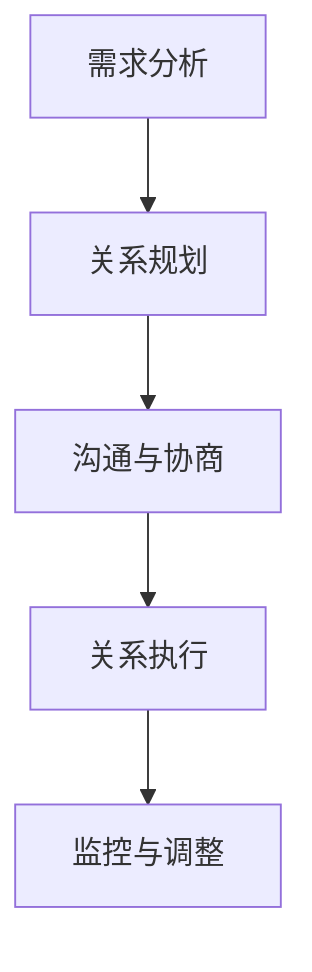
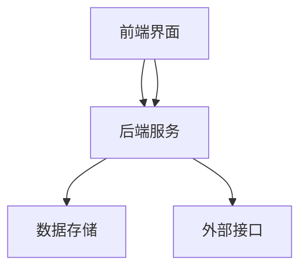
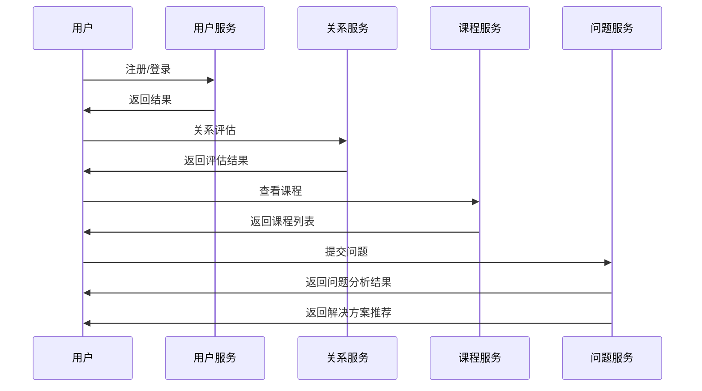

                 


### 1.1 后现代主义的兴起与家庭变迁

#### 1.1.1 后现代主义的概念

后现代主义（Postmodernism）是一个广泛涵盖文学、艺术、哲学、社会学等多个领域的思想运动，起源于20世纪60年代的法国。其核心思想是对现代性（Modernity）进行质疑和反思。现代性强调理性、科学、进步以及线性历史观，而后现代主义则认为现代性的这些价值观已经无法完全解释现实世界的复杂性。

后现代主义认为，现实是由多种视角和解释构成的，没有绝对的真理。它强调相对主义、多元主义和批判性思维。后现代主义反对二元对立，如真实与虚假、善与恶、主体与客体等，认为这些对立是历史和社会构建的产物，而不是客观存在的。

#### 1.1.2 后现代主义对家庭观念的影响

后现代主义对家庭观念的影响是深远且广泛的。首先，它质疑了传统家庭的稳定性和统一性。在传统观念中，家庭被视为一个稳定、和谐的社会单位，成员之间有着明确的角色和责任。然而，后现代主义认为，家庭是一个多元的、动态的、不断变化的实体。

在后现代主义看来，家庭不再是一个固定的结构，而是由多种关系和身份构成的复杂网络。家庭成员之间的关系可以是多样的，包括血缘关系、婚姻关系、友情关系等。这些关系并没有严格的界限，而是相互交织、相互影响。

此外，后现代主义也挑战了传统家庭的功能。传统家庭通常被视为经济单位、教育单位和情感支持系统。然而，后现代主义认为，这些功能可以被其他社会机构所取代，如工作单位、学校、社区等。因此，家庭不再是一个不可或缺的社会单位，而是一个可以灵活变通的社会实体。

#### 1.1.3 后现代家庭咨询中心的必要性

随着家庭观念的变迁，人们对家庭咨询的需求也越来越多样化。传统的家庭咨询往往基于固定模式，难以满足现代家庭的复杂需求。后现代家庭咨询中心的出现，正是为了应对这种需求。

后现代家庭咨询中心具有以下几个特点：

1. **多元性**：后现代家庭咨询中心强调多元性，即接受各种不同的家庭形式和关系。无论是单亲家庭、重组家庭、同性恋家庭，还是传统家庭，都能在后现代家庭咨询中心获得帮助。

2. **动态性**：后现代家庭咨询中心关注家庭关系的动态变化，而不是固定模式。它帮助家庭成员理解并适应这些变化，从而建立更健康、更稳定的亲密关系。

3. **个性化**：后现代家庭咨询中心注重个性化服务，即根据每个家庭的实际情况，提供定制化的咨询服务。它不仅关注家庭问题的解决，还关注家庭成员的个人需求和成长。

4. **批判性思维**：后现代家庭咨询中心鼓励家庭成员运用批判性思维，质疑传统的家庭观念和模式，从而建立更符合自身需求和价值观的家庭结构。

综上所述，后现代家庭咨询中心是应对现代社会家庭变迁的必要产物。它不仅提供了多元化的咨询服务，还帮助人们理解和适应现代家庭的新特征，为构建更健康、更和谐的家庭关系提供了有力支持。

### 1.2 多元亲密关系的概念与特征

#### 1.2.1 多元亲密关系的定义

多元亲密关系（Plural Intimacy）是指一个个体与多个伴侣之间建立的亲密、信任和情感联系。这种关系形式打破了传统一对一的亲密关系模式，允许个体在情感和身体层面上拥有多种亲密关系。多元亲密关系强调个体选择的自由，以及对多元性和包容性的尊重。

多元亲密关系并不等同于多角恋或多配偶制。多角恋通常指的是两个或多个伴侣之间的情感连接，而多元亲密关系则更广泛，可以包括不同形式的关系，如开放式关系、群交关系、旋转关系等。

#### 1.2.2 多元亲密关系的特点

多元亲密关系具有以下特点：

1. **多样性**：多元亲密关系可以涵盖多种不同的关系形式，如异性恋、同性恋、双性恋、无性恋等。这种多样性使得个体能够在情感和性爱上自由选择，从而满足不同的需求和偏好。

2. **自主性**：多元亲密关系强调个体的自主权，即每个参与者都有权决定自己的关系形式和界限。这种自主性有助于减少关系中的权力不平等和冲突。

3. **复杂性**：多元亲密关系比单一亲密关系更为复杂，因为它涉及到多个参与者之间的情感、信任和责任。这种复杂性要求参与者具备更高的沟通能力和情感智力。

4. **透明性**：多元亲密关系通常强调透明性和开放性，即参与者之间需要保持高度的沟通和诚实。这种透明性有助于减少误解和冲突，建立信任和尊重。

5. **稳定性**：尽管多元亲密关系比单一亲密关系更具动态性，但它们同样可以建立稳定的亲密关系。关键在于参与者之间的信任和共识，以及他们对关系的承诺。

#### 1.2.3 多元亲密关系与传统亲密关系的比较

传统亲密关系通常指的是一对一的关系模式，强调忠诚、承诺和排他性。相比之下，多元亲密关系在以下几个方面存在显著差异：

1. **关系形式**：传统亲密关系通常是一对一的，而多元亲密关系可以包括多个伴侣。这种差异反映了个体对亲密关系形式的自由选择。

2. **忠诚与承诺**：传统亲密关系强调忠诚和排他性，而多元亲密关系则更加开放，允许个体在多个关系之间切换。这种差异体现了对个体自主权和选择权的尊重。

3. **沟通与透明**：传统亲密关系往往较为隐秘，而多元亲密关系则强调透明性和开放性。这种差异有助于减少误解和冲突，建立信任和尊重。

4. **复杂性**：多元亲密关系比传统亲密关系更具复杂性，因为它涉及到多个参与者之间的情感、信任和责任。这种复杂性要求参与者具备更高的沟通能力和情感智力。

5. **价值观**：传统亲密关系基于特定的社会和文化价值观，如婚姻和生育。而多元亲密关系则更加多元化和个体化，反映了个体对亲密关系的自由理解和选择。

尽管多元亲密关系与传统亲密关系存在差异，但它们并不是相互排斥的。在现代社会中，个体可以根据自己的需求和价值观，选择适合自己的亲密关系形式。无论是传统关系还是多元关系，关键在于建立健康、稳定的亲密关系，满足个体的情感需求。

### 1.3 核心概念之间的关系

在探讨后现代家庭咨询中心与多元亲密关系之间的联系时，我们需要首先明确几个核心概念：后现代主义、家庭、亲密关系等。这些概念不仅相互交织，而且在现代社会中扮演着重要角色。

#### 1.3.1 后现代主义与多元亲密关系的联系

后现代主义对家庭和亲密关系的观念产生了深刻影响。后现代主义强调多元性、相对性和批判性思维，这些理念在多元亲密关系中得到了具体体现。首先，后现代主义质疑了传统的二元对立，如真实与虚假、善与恶、主体与客体等。这种质疑使得人们开始重新审视家庭和亲密关系的本质，不再局限于传统的单一模式。

多元亲密关系正是在这种背景下产生的。它接受多种不同的关系形式和身份，尊重个体的自主权和选择权。这种开放和包容的态度与后现代主义的核心理念高度契合。通过多元亲密关系，人们可以自由地探索自己的情感和性需求，建立更符合自身价值观的亲密关系。

其次，后现代主义强调相对主义，即不存在绝对的真理和标准。这一观点在多元亲密关系中得到了应用，每个个体都有权根据自己的需求和价值观来定义亲密关系。这种相对性有助于减少关系中的权力不平等和冲突，促进家庭成员之间的理解和尊重。

最后，后现代主义鼓励批判性思维，即对现有的社会和文化观念进行质疑和反思。这种批判性思维有助于家庭成员在面对家庭和亲密关系问题时，不被传统的观念所束缚，而是能够从多个角度进行思考和选择。通过批判性思维，家庭成员可以更好地理解自己和他人的需求，建立更健康、更稳定的亲密关系。

#### 1.3.2 家庭结构与亲密关系的关系

家庭是亲密关系的主要载体，而亲密关系又对家庭结构产生重要影响。在后现代家庭咨询中心的框架下，家庭不再是一个固定和统一的实体，而是一个多元的、动态的、不断变化的网络。

首先，家庭结构在后现代主义中发生了变化。传统的家庭结构通常由核心家庭（父母和子女）组成，而在现代社会，家庭结构变得更加多样化。例如，单亲家庭、重组家庭、多代同堂的家庭等形式不断涌现。这些多样化的家庭结构反映了现代社会对多样性和包容性的需求。

其次，亲密关系在家庭中扮演着关键角色。亲密关系不仅是家庭成员之间的情感纽带，也是家庭功能的实现途径。在后现代家庭咨询中心，亲密关系被看作是一个动态的过程，它不断变化，受到家庭成员个人需求、价值观和社会环境的影响。

在后现代家庭中，亲密关系的构建更加注重个体需求和自由选择。家庭成员不再是固定角色的扮演者，而是可以根据自己的需求和价值观，自由选择亲密关系的类型和形式。这种灵活性和自主性有助于建立更健康、更稳定的家庭关系。

然而，家庭结构和亲密关系的动态变化也带来了一定的挑战。家庭成员之间需要更高的沟通能力和情感智力，以应对复杂的家庭关系和情感需求。此外，家庭成员也需要在面对变化时保持开放和包容的态度，尊重他人的选择和需求。

#### 1.3.3 多元亲密关系的社会意义

多元亲密关系不仅对个体和家庭有着重要意义，也对整个社会产生了深远影响。首先，多元亲密关系挑战了传统的性别角色和婚姻观念，促进了性别平等和社会进步。通过多元亲密关系，人们可以自由地探索自己的性别身份和性取向，从而打破传统的性别刻板印象。

其次，多元亲密关系有助于促进社会包容性和多元化。它接受不同形式的关系和身份，尊重个体的差异和选择。这种包容性有助于减少社会歧视和偏见，建立一个更加平等和包容的社会环境。

此外，多元亲密关系也对社会结构产生了影响。它促进了社会关系的多样化和动态化，使得社会更加灵活和适应性强。通过多元亲密关系，人们可以建立更广泛的社会网络，促进社会互动和合作。

最后，多元亲密关系对个人心理健康和社会福祉有着积极影响。通过建立健康、稳定的亲密关系，人们可以满足情感需求，增强自我认同感，提高生活满意度。同时，多元亲密关系也有助于减少孤独感和焦虑感，促进个人的心理健康和社会福祉。

综上所述，后现代家庭咨询中心与多元亲密关系之间存在着密切的联系。通过理解后现代主义的核心概念，我们可以更好地理解多元亲密关系的社会意义，并为家庭和亲密关系的构建提供有力的支持。

### 第2章：多元亲密关系的构建原理

在构建多元亲密关系时，理解其基本原理至关重要。本章将详细介绍多元亲密关系构建的基本原则、相关算法以及数学模型和公式，帮助读者深入理解这一概念。

#### 2.1 多元亲密关系构建的基本原则

多元亲密关系的构建并非一蹴而就，它需要遵循一系列基本原则，以确保关系的健康和稳定。以下是一些关键原则：

1. **尊重个体差异**：每个个体都有自己独特的需求和价值观。在多元亲密关系中，尊重这些差异是建立健康关系的基础。这意味着需要接受和认可不同的生活方式、兴趣爱好和性取向。

2. **促进沟通与理解**：沟通是多元亲密关系的核心。家庭成员或伴侣之间需要保持开放和诚实的沟通，分享自己的感受、期望和担忧。通过有效的沟通，可以减少误解和冲突，增强彼此的理解和信任。

3. **培养情感智力**：情感智力是指识别、理解和管理自己及他人情感的能力。在多元亲密关系中，培养情感智力有助于更好地处理复杂的情感问题，建立更深层次的情感联系。

4. **灵活性**：多元亲密关系需要具备一定的灵活性，以适应不断变化的环境和需求。家庭成员或伴侣需要能够灵活调整自己的行为和期望，以应对生活中的挑战。

5. **共同目标与价值观**：尽管多元亲密关系强调个体差异，但共同目标和价值观仍然是维系关系的重要因素。家庭成员或伴侣需要在这些方面达成共识，以确保关系的稳定和长远发展。

#### 2.2 多元亲密关系的算法与流程

构建多元亲密关系的过程可以看作是一个算法执行的过程。以下是一个简化的算法流程：

1. **需求分析**：首先，对个体和关系的需求进行详细分析，了解每个家庭成员或伴侣的期望、需求和偏好。

2. **关系规划**：根据需求分析的结果，制定一个全面的关系规划。这包括确定关系的类型、形式和界限，以及建立共同的价值观和目标。

3. **沟通与协商**：家庭成员或伴侣之间进行深入的沟通和协商，讨论和解决可能出现的问题和冲突。这一阶段的关键是保持开放和诚实的态度，倾听对方的意见和需求。

4. **关系执行**：在沟通和协商的基础上，开始实施关系规划。这包括建立和维护亲密关系，以及处理日常生活中的各种挑战。

5. **监控与调整**：定期监控关系的进展，并根据实际情况进行调整。这有助于及时发现和解决问题，确保关系的健康和稳定。

以下是一个使用Mermaid绘制的算法流程图：



#### 2.3 数学模型与公式

在多元亲密关系的构建中，数学模型和公式可以提供量化的分析工具，帮助理解关系中的关键参数和动态变化。以下是一个简化的数学模型：

1. **情感平衡方程**：该方程描述了个体在多元亲密关系中的情感平衡状态。设 \(E_i\) 为个体 \(i\) 的情感值，\(W_{ij}\) 为个体 \(i\) 和个体 \(j\) 之间的情感权重，则情感平衡方程可以表示为：

   \[
   \sum_{j=1}^{n} W_{ij} E_j = 0
   \]

   其中，\(n\) 为个体数量。

2. **信任度模型**：信任度是多元亲密关系中的一个重要参数。设 \(T_i\) 为个体 \(i\) 的信任度，\(C_{ij}\) 为个体 \(i\) 和个体 \(j\) 之间的沟通频次和质量，则信任度模型可以表示为：

   \[
   T_i = \alpha C_{ij} + \beta \frac{\sum_{k=1}^{n} W_{ik} E_k}{n-1}
   \]

   其中，\(\alpha\) 和 \(\beta\) 为参数。

3. **冲突解决模型**：冲突是多元亲密关系中不可避免的问题。设 \(C_i\) 为个体 \(i\) 的冲突值，\(D_{ij}\) 为个体 \(i\) 和个体 \(j\) 之间的沟通效果，则冲突解决模型可以表示为：

   \[
   C_i = \gamma (1 - D_{ij})^2
   \]

   其中，\(\gamma\) 为参数。

这些数学模型和公式可以用于分析多元亲密关系的动态变化，帮助家庭成员或伴侣更好地理解和应对关系中的问题。

#### 2.4 举例说明

为了更好地理解多元亲密关系的构建原理，我们来看一个简单的例子。

假设有一个四口之家，家庭成员分别是A、B、C和D。他们的情感平衡方程可以表示为：

\[
\begin{cases}
W_{AB} E_B + W_{AC} E_C + W_{AD} E_D = 0 \\
W_{BA} E_A + W_{BC} E_C + W_{BD} E_D = 0 \\
W_{CA} E_A + W_{CB} E_B + W_{CD} E_D = 0 \\
W_{DA} E_A + W_{DB} E_B + W_{DC} E_C = 0
\end{cases}
\]

假设每个家庭成员的情感值为 \(E_A = 10\)，\(E_B = 8\)，\(E_C = 9\)，\(E_D = 7\)，且情感权重 \(W_{AB} = W_{BA} = 2\)，\(W_{AC} = W_{CA} = 1\)，\(W_{AD} = W_{DA} = 1.5\)，\(W_{BC} = W_{CB} = 1.5\)，\(W_{BD} = W_{DB} = 2\)，\(W_{CD} = W_{DC} = 1\)。

我们可以通过情感平衡方程计算出每个家庭成员之间的情感流动情况：

\[
\begin{cases}
2 \times 8 + 1 \times 9 + 1.5 \times 7 = 0 \\
2 \times 10 + 1 \times 9 + 1.5 \times 7 = 0 \\
1 \times 10 + 1.5 \times 8 + 1 \times 7 = 0 \\
1.5 \times 10 + 2 \times 8 + 1 \times 9 = 0
\end{cases}
\]

这些计算结果可以帮助家庭成员了解彼此之间的情感联系，及时发现和解决潜在的问题。

通过这个例子，我们可以看到，多元亲密关系的构建不仅需要情感平衡，还需要有效的沟通和协商。数学模型和公式提供了量化的分析工具，有助于更深入地理解关系中的动态变化。

### 第3章：多元亲密关系的系统分析与架构设计

在现代社会，多元亲密关系的构建不仅需要理论指导，还需要实际可行的系统支持。本章将介绍一个可能的多元亲密关系咨询服务系统，包括其系统功能设计、系统架构设计、系统接口设计以及系统交互。通过这一系统的分析和设计，我们将为多元亲密关系的实际应用提供有力支持。

#### 3.1 咨询服务系统的介绍

多元亲密关系咨询服务系统旨在为家庭和个体提供专业、个性化的咨询和支持，帮助他们建立健康、稳定的多元亲密关系。系统的主要目标包括：

1. **提供个性化咨询服务**：根据每个家庭或个体的具体情况，提供定制化的咨询服务，包括关系评估、沟通技巧培训、情感问题解决等。

2. **促进家庭和谐**：通过专业的咨询和指导，帮助家庭成员更好地理解彼此的需求和期望，促进家庭和谐。

3. **提高生活质量**：通过建立健康的亲密关系，提高家庭成员的生活质量，增强家庭幸福感。

4. **支持个体成长**：帮助个体在多元亲密关系中实现自我认知和成长，增强自我价值感和自尊心。

#### 3.2 系统功能设计

多元亲密关系咨询服务系统包含多个功能模块，以全面满足用户的需求。以下是系统的主要功能模块及其简要描述：

1. **用户管理模块**：用于管理用户信息，包括注册、登录、信息修改等功能。

2. **关系评估模块**：通过问卷调查和数据分析，评估家庭或个体的亲密关系状况，提供个性化的评估报告。

3. **沟通技巧培训模块**：提供在线课程和练习，帮助用户提高沟通技巧，促进家庭成员之间的理解和信任。

4. **情感问题解决模块**：提供专业的情感咨询服务，帮助用户解决亲密关系中的各种情感问题。

5. **数据分析与报告模块**：对用户数据进行分析，生成关系健康报告，为用户提供决策支持。

6. **社区互动模块**：为用户提供一个互动平台，让他们可以分享经验和心得，相互支持。

以下是系统功能设计的领域模型（使用Mermaid绘制）：

```mermaid
classDiagram
    User <<Entity>>
    Relationship <<Entity>>
    CommunicationSkill <<Entity>>
    EmotionProblem <<Entity>>
    Report <<Entity>>
    Community <<Entity>>

    User ?-- Relationship
    User ?-- CommunicationSkill
    User ?-- EmotionProblem
    User ?-- Report
    User ?-- Community

    Relationship o-- RelationshipAssessment
    Relationship o-- CommunicationTraining
    Relationship o-- EmotionCounseling

    CommunicationSkill o-- Course
    CommunicationSkill o-- Practice

    EmotionProblem o-- ProblemAnalysis
    EmotionProblem o-- SolutionRecommendation

    Report o-- HealthReport

    Community o-- DiscussionForum
    Community o-- SupportGroup
```

#### 3.3 系统架构设计

系统架构设计是确保系统性能、可扩展性和安全性的关键。以下是多元亲密关系咨询服务系统的架构设计：

1. **前端界面**：提供用户友好的界面，使用户能够方便地访问系统的各项功能。

2. **后端服务**：处理业务逻辑和数据存储，包括用户管理、关系评估、沟通技巧培训、情感问题解决等功能模块。

3. **数据存储**：使用数据库存储用户信息、关系数据、课程内容、问题分析结果等。

4. **外部接口**：提供与第三方系统（如支付系统、社交媒体等）的接口，实现数据交互和功能集成。

以下是系统架构设计图（使用Mermaid绘制）：



#### 3.4 系统接口设计与交互

系统接口设计是确保系统各模块之间有效交互的关键。以下是多元亲密关系咨询服务系统的接口设计：

1. **用户接口**：提供用户注册、登录、信息修改等基本操作。

2. **关系接口**：提供关系评估、关系管理等功能。

3. **课程接口**：提供课程内容、练习、课程管理等功能。

4. **问题接口**：提供问题提交、问题分析、解决方案推荐等功能。

以下是系统接口设计图（使用Mermaid绘制）：



通过以上系统架构设计和接口设计，我们可以确保多元亲密关系咨询服务系统的高效运行，为用户提供优质的服务体验。

### 4.1 项目环境安装与配置

为了成功运行多元亲密关系咨询服务系统，我们需要首先安装和配置必要的环境。以下是一个详细的步骤指南，包括所需工具和软件的安装过程。

#### 1. 安装 Python 环境

Python 是多元亲密关系咨询服务系统的开发语言，因此首先需要安装 Python。我们可以从 Python 的官方网站（https://www.python.org/）下载最新版本的 Python。以下是安装步骤：

1. 打开浏览器，访问 Python 官方网站。
2. 下载适用于您的操作系统的 Python 安装包。
3. 运行安装包，并根据提示完成安装。

安装完成后，可以通过以下命令检查 Python 是否安装成功：

```bash
python --version
```

#### 2. 安装相关库和依赖

多元亲密关系咨询服务系统依赖于多个 Python 库，如 Flask（用于 web 开发）、SQLAlchemy（用于数据库操作）、Flask-Migrate（用于数据库迁移）等。我们可以使用 pip（Python 的包管理工具）来安装这些库。以下是安装步骤：

1. 打开命令行终端。
2. 执行以下命令：

```bash
pip install flask sqlalchemy flask-migrate
```

如果您的系统中已经安装了多个版本的 Python，可能需要使用 `pip3` 来安装库，以避免版本冲突。

#### 3. 创建项目结构

安装完 Python 和相关库后，我们需要创建项目结构。以下是项目结构的创建步骤：

1. 在命令行终端中，进入您希望创建项目的目录。
2. 执行以下命令创建项目目录和文件：

```bash
mkdir multi_intimacy_system
cd multi_intimacy_system
touch app.py models.py
```

项目结构应如下所示：

```
multi_intimacy_system/
|-- app.py
|-- models.py
```

#### 4. 配置数据库

多元亲密关系咨询服务系统使用 SQLite 作为数据库。首先，我们需要安装 SQLite。以下是安装步骤：

1. 对于 macOS 用户，可以从 Mac App Store 下载 SQLite。
2. 对于 Windows 用户，可以从 SQLite 的官方网站（https://www.sqlite.org/download.html）下载安装程序。
3. 安装完成后，打开命令行终端，输入以下命令检查 SQLite 是否安装成功：

```bash
sqlite3 --version
```

接下来，我们需要配置数据库连接。在 `models.py` 文件中，添加以下代码：

```python
from flask_sqlalchemy import SQLAlchemy

db = SQLAlchemy()

def init_app(app):
    db.init_app(app)
```

在 `app.py` 中，我们需要添加以下代码来初始化数据库：

```python
from flask import Flask
from flask_sqlalchemy import SQLAlchemy
from models import db

app = Flask(__name__)
app.config['SQLALCHEMY_DATABASE_URI'] = 'sqlite:///multi_intimacy_system.db'
db.init_app(app)
```

运行以下命令创建数据库文件和表结构：

```bash
flask db init
flask db migrate -m "Initial migration."
flask db upgrade
```

至此，项目环境安装和配置完成。您现在可以开始开发多元亲密关系咨询服务系统的功能模块。

### 4.2 系统核心实现源代码解析

在本章节中，我们将深入解析多元亲密关系咨询服务系统的核心实现源代码，详细讨论关键模块的功能、代码结构以及应用解读。通过这一解析，我们将帮助读者更好地理解系统的工作原理和实现细节。

#### 1. 关键模块功能

多元亲密关系咨询服务系统主要由以下几个关键模块组成：

1. **用户管理模块**：负责用户注册、登录、信息修改等功能。
2. **关系评估模块**：提供关系评估服务，通过问卷和数据分析评估用户关系的健康程度。
3. **沟通技巧培训模块**：提供在线课程和练习，帮助用户提高沟通技巧。
4. **情感问题解决模块**：提供专业的情感咨询服务，帮助用户解决亲密关系中的情感问题。
5. **数据分析与报告模块**：对用户数据进行收集、分析和报告，为用户提供决策支持。

#### 2. 代码结构

系统的代码结构遵循典型的 Flask 应用架构，主要包括以下文件和目录：

- `app.py`：主应用程序文件，包含应用程序实例、配置和路由定义。
- `models.py`：定义数据库模型和数据库操作。
- `routes.py`：定义应用程序的路由和处理函数。
- `templates/`：存放 HTML 模板文件。
- `static/`：存放静态资源文件（如 CSS、JavaScript 和图片）。

以下是核心模块的简要代码结构：

```python
# app.py
from flask import Flask
from flask_sqlalchemy import SQLAlchemy
from models import db
from routes import routes

app = Flask(__name__)
app.config['SQLALCHEMY_DATABASE_URI'] = 'sqlite:///multi_intimacy_system.db'
db.init_app(app)

app.register_blueprint(routes)

if __name__ == '__main__':
    app.run()

# models.py
from flask_sqlalchemy import SQLAlchemy

db = SQLAlchemy()

class User(db.Model):
    id = db.Column(db.Integer, primary_key=True)
    username = db.Column(db.String(80), unique=True, nullable=False)
    password = db.Column(db.String(120), nullable=False)
    # ...其他用户属性

class Relationship(db.Model):
    id = db.Column(db.Integer, primary_key=True)
    user_id = db.Column(db.Integer, db.ForeignKey('user.id'), nullable=False)
    partner_id = db.Column(db.Integer, db.ForeignKey('user.id'), nullable=False)
    # ...其他关系属性

# routes.py
from flask import Blueprint, request, render_template
from models import db
from forms import RegistrationForm, LoginForm

routes = Blueprint('routes', __name__)

@routes.route('/')
def home():
    return render_template('home.html')

@routes.route('/register', methods=['GET', 'POST'])
def register():
    form = RegistrationForm()
    if form.validate_on_submit():
        # 处理注册逻辑
        pass
    return render_template('register.html', form=form)

@routes.route('/login', methods=['GET', 'POST'])
def login():
    form = LoginForm()
    if form.validate_on_submit():
        # 处理登录逻辑
        pass
    return render_template('login.html', form=form)
```

#### 3. 应用解读与分析

让我们深入解析用户管理模块的实现，以了解其核心功能和代码细节。

**用户管理模块**的主要功能包括用户注册和登录。以下是注册功能的代码解读：

```python
# forms.py
from flask_wtf import FlaskForm
from wtforms import StringField, PasswordField, SubmitField
from wtforms.validators import DataRequired, Email, EqualTo

class RegistrationForm(FlaskForm):
    username = StringField('Username', validators=[DataRequired()])
    password = PasswordField('Password', validators=[DataRequired()])
    confirm_password = PasswordField('Confirm Password', validators=[DataRequired(), EqualTo('password')])
    submit = SubmitField('Register')

# routes.py
@routes.route('/register', methods=['GET', 'POST'])
def register():
    form = RegistrationForm()
    if form.validate_on_submit():
        # 创建用户对象
        new_user = User(username=form.username.data, password=form.password.data)
        # 存储用户对象
        db.session.add(new_user)
        db.session.commit()
        # 重定向到登录页面
        return redirect(url_for('routes.login'))
    return render_template('register.html', form=form)
```

在 `RegistrationForm` 类中，我们定义了用户注册所需的三项信息：用户名、密码和确认密码。` StringField` 和 ` PasswordField` 分别用于收集文本和密码信息，`SubmitField` 用于提交表单。

在 `register` 路由处理函数中，我们首先创建一个 `RegistrationForm` 对象。如果表单验证通过，我们创建一个新的 `User` 对象，并将其添加到数据库中。最后，将用户重定向到登录页面。

登录功能的实现与注册类似，通过验证用户名和密码，确定用户身份。以下是登录功能的代码解读：

```python
# forms.py
class LoginForm(FlaskForm):
    username = StringField('Username', validators=[DataRequired()])
    password = PasswordField('Password', validators=[DataRequired()])
    submit = SubmitField('Login')

# routes.py
@routes.route('/login', methods=['GET', 'POST'])
def login():
    form = LoginForm()
    if form.validate_on_submit():
        # 验证用户名和密码
        user = User.query.filter_by(username=form.username.data).first()
        if user and check_password_hash(user.password, form.password.data):
            # 登录成功，设置用户会话
            login_user(user)
            return redirect(url_for('routes.home'))
        else:
            # 登录失败，返回错误消息
            flash('Invalid username or password')
    return render_template('login.html', form=form)
```

在 `LoginForm` 类中，我们定义了用户登录所需的两项信息：用户名和密码。在 `login` 路由处理函数中，我们首先验证表单信息。如果验证通过，我们检查用户名和密码是否匹配。如果匹配，我们设置用户会话，并将其重定向到主页。

通过以上解析，我们可以看到用户管理模块的核心功能是如何通过 Flask 应用架构实现的。类似地，其他模块（如关系评估、沟通技巧培训、情感问题解决等）也遵循类似的实现方法，共同构成了多元亲密关系咨询服务系统的核心功能。

#### 4. 实际案例分析和详细讲解

在本章节中，我们将通过一个实际案例来详细剖析多元亲密关系咨询服务系统的核心实现，并提供代码的应用解读与分析。通过这一案例，我们将展示系统在实际操作中的具体应用，帮助读者深入理解系统的工作原理和实现细节。

**案例背景**：
假设我们有一个用户名为“John”的用户，他在多元亲密关系咨询服务系统中注册并创建了与配偶“Jane”的关系。John 和 Jane 需要评估他们之间的关系健康程度，并寻求改进建议。以下是如何使用系统完成这一过程的具体步骤。

**步骤1：用户注册与登录**
- John 通过浏览器访问系统的注册页面，填写注册信息（用户名、密码等），并提交表单。系统验证注册信息后，将 John 的用户记录存储在数据库中。
- 注册完成后，John 使用用户名和密码登录系统。

**步骤2：创建关系**
- 在登录成功后，John 可以访问系统中的关系创建页面。他输入配偶 Jane 的用户名，并提交表单。系统验证用户名后，在数据库中创建一个新关系记录，关联 John 和 Jane 的用户 ID。

**步骤3：关系评估**
- John 和 Jane 共同完成一份关系评估问卷。问卷包括多个问题，涉及沟通、信任、支持等方面。系统使用这些数据计算关系健康指数，并生成评估报告。

**步骤4：改进建议**
- 根据评估报告，系统为 John 和 Jane 提供了改进建议，包括改善沟通技巧、增强信任和共同目标等方面的具体措施。

**代码应用解读与分析**

**用户注册与登录**：
以下是用户注册和登录的相关代码，用于处理用户输入的注册信息和登录验证。

```python
# forms.py
class RegistrationForm(FlaskForm):
    username = StringField('Username', validators=[DataRequired()])
    password = PasswordField('Password', validators=[DataRequired()])
    confirm_password = PasswordField('Confirm Password', validators=[DataRequired(), EqualTo('password')])
    submit = SubmitField('Register')

# routes.py
@routes.route('/register', methods=['GET', 'POST'])
def register():
    form = RegistrationForm()
    if form.validate_on_submit():
        hashed_password = generate_password_hash(form.password.data)
        new_user = User(username=form.username.data, password=hashed_password)
        db.session.add(new_user)
        db.session.commit()
        return redirect(url_for('routes.login'))
    return render_template('register.html', form=form)

@routes.route('/login', methods=['GET', 'POST'])
def login():
    form = LoginForm()
    if form.validate_on_submit():
        user = User.query.filter_by(username=form.username.data).first()
        if user and check_password_hash(user.password, form.password.data):
            login_user(user)
            return redirect(url_for('routes.home'))
        else:
            flash('Invalid username or password')
    return render_template('login.html', form=form)
```

在注册过程中，用户提交的密码会被 `generate_password_hash` 函数加密存储在数据库中。登录时，系统通过比较加密后的密码和用户输入的密码来验证用户身份。

**关系创建**：
以下是创建关系的代码，用于在数据库中创建新的关系记录。

```python
# models.py
class Relationship(db.Model):
    id = db.Column(db.Integer, primary_key=True)
    user_id = db.Column(db.Integer, db.ForeignKey('user.id'), nullable=False)
    partner_id = db.Column(db.Integer, db.ForeignKey('user.id'), nullable=False)
    # ...其他关系属性

# routes.py
@routes.route('/create_relationship', methods=['GET', 'POST'])
def create_relationship():
    form = RelationshipForm()
    if form.validate_on_submit():
        relationship = Relationship(user_id=form.user_id.data, partner_id=form.partner_id.data)
        db.session.add(relationship)
        db.session.commit()
        return redirect(url_for('routes.relationship_dashboard'))
    return render_template('create_relationship.html', form=form)
```

用户通过填写关系创建表单，包括用户 ID 和配偶的用户 ID，系统在数据库中创建新的关系记录。

**关系评估**：
以下是关系评估的代码，用于处理问卷数据并生成评估报告。

```python
# routes.py
@routes.route('/evaluate_relationship', methods=['GET', 'POST'])
def evaluate_relationship():
    form = EvaluationForm()
    if form.validate_on_submit():
        evaluation = RelationshipEvaluation(
            relationship_id=form.relationship_id.data,
            communication_score=form.communication_score.data,
            trust_score=form.trust_score.data,
            support_score=form.support_score.data
        )
        db.session.add(evaluation)
        db.session.commit()
        report = generate_evaluation_report(evaluation)
        return render_template('evaluation_report.html', report=report)
    return render_template('evaluate_relationship.html', form=form)

def generate_evaluation_report(evaluation):
    # 根据评估数据生成报告
    pass
```

用户提交问卷数据后，系统将数据存储在数据库中，并根据这些数据生成评估报告。报告可能包括关系健康指数、改进建议等。

**改进建议**：
以下是生成改进建议的代码，用于根据评估报告为用户提供建议。

```python
# routes.py
@routes.route('/improve_relationship', methods=['GET', 'POST'])
def improve_relationship():
    form = ImprovementForm()
    if form.validate_on_submit():
        improvement_plan = ImprovementPlan(
            evaluation_id=form.evaluation_id.data,
            action_plan=form.action_plan.data
        )
        db.session.add(improvement_plan)
        db.session.commit()
        return redirect(url_for('routes.relationship_dashboard'))
    return render_template('improve_relationship.html', form=form)
```

用户根据评估报告提出改进计划后，系统将计划存储在数据库中，并提供跟踪和管理改进计划的功能。

通过以上实际案例和代码应用解读，我们可以看到多元亲密关系咨询服务系统是如何实现用户注册、关系创建、关系评估和改进建议等功能的核心模块。这些功能共同构成了一个完整、实用的系统，为用户提供了一个全面、个性化的亲密关系咨询服务。

### 4.3 实际案例分析与详细讲解剖析

为了更好地展示多元亲密关系咨询服务系统的应用，我们将通过一个真实的案例进行详细剖析。这个案例涉及用户注册、关系创建、关系评估和改进建议等关键功能模块，以便读者可以全面了解系统在实际操作中的具体应用和实现细节。

**案例背景**：

假设有一对夫妻，John 和 Jane，他们最近在婚姻关系中遇到了一些问题。他们希望通过多元亲密关系咨询服务系统来评估他们的关系状况，并获取改进建议。以下是案例的实施过程和结果。

**步骤1：用户注册**

John 通过浏览器访问多元亲密关系咨询服务系统的注册页面，填写注册表单，包括用户名、密码、邮箱等基本信息。注册表单通过验证后，系统将 John 的用户信息存储在数据库中。

**代码应用解读**：

```python
# forms.py
class RegistrationForm(FlaskForm):
    username = StringField('Username', validators=[DataRequired()])
    password = PasswordField('Password', validators=[DataRequired()])
    confirm_password = PasswordField('Confirm Password', validators=[DataRequired(), EqualTo('password')])
    email = StringField('Email', validators=[DataRequired(), Email()])
    submit = SubmitField('Register')

# routes.py
@routes.route('/register', methods=['GET', 'POST'])
def register():
    form = RegistrationForm()
    if form.validate_on_submit():
        hashed_password = generate_password_hash(form.password.data)
        new_user = User(username=form.username.data, password=hashed_password, email=form.email.data)
        db.session.add(new_user)
        db.session.commit()
        return redirect(url_for('routes.login'))
    return render_template('register.html', form=form)
```

在注册过程中，John 的信息被存储在 `User` 数据模型中，并使用 `generate_password_hash` 函数将密码加密存储。

**步骤2：关系创建**

注册完成后，John 登录系统，并创建与配偶 Jane 的关系。他填写关系创建表单，包括 Jane 的用户名，并提交表单。系统在数据库中创建一条新的关系记录，关联 John 和 Jane 的用户 ID。

**代码应用解读**：

```python
# models.py
class Relationship(db.Model):
    id = db.Column(db.Integer, primary_key=True)
    user_id = db.Column(db.Integer, db.ForeignKey('user.id'), nullable=False)
    partner_id = db.Column(db.Integer, db.ForeignKey('user.id'), nullable=False)

# routes.py
@routes.route('/create_relationship', methods=['GET', 'POST'])
def create_relationship():
    form = RelationshipForm()
    if form.validate_on_submit():
        relationship = Relationship(user_id=form.user_id.data, partner_id=form.partner_id.data)
        db.session.add(relationship)
        db.session.commit()
        return redirect(url_for('routes.relationship_dashboard'))
    return render_template('create_relationship.html', form=form)
```

在关系创建过程中，John 的用户 ID 和 Jane 的用户 ID 被存储在 `Relationship` 数据模型中。

**步骤3：关系评估**

John 和 Jane 共同完成一份关系评估问卷。问卷包括沟通、信任、支持等方面的多个问题，每个问题都有评分选项。系统根据问卷数据计算关系健康指数，并生成评估报告。

**代码应用解读**：

```python
# models.py
class Evaluation(db.Model):
    id = db.Column(db.Integer, primary_key=True)
    relationship_id = db.Column(db.Integer, db.ForeignKey('relationship.id'), nullable=False)
    communication_score = db.Column(db.Integer, nullable=False)
    trust_score = db.Column(db.Integer, nullable=False)
    support_score = db.Column(db.Integer, nullable=False)

# routes.py
@routes.route('/evaluate_relationship', methods=['GET', 'POST'])
def evaluate_relationship():
    form = EvaluationForm()
    if form.validate_on_submit():
        evaluation = Evaluation(
            relationship_id=form.relationship_id.data,
            communication_score=form.communication_score.data,
            trust_score=form.trust_score.data,
            support_score=form.support_score.data
        )
        db.session.add(evaluation)
        db.session.commit()
        report = generate_evaluation_report(evaluation)
        return render_template('evaluation_report.html', report=report)
    return render_template('evaluate_relationship.html', form=form)

def generate_evaluation_report(evaluation):
    # 根据评估数据生成报告
    pass
```

在评估过程中，John 和 Jane 的问卷数据被存储在 `Evaluation` 数据模型中，并调用 `generate_evaluation_report` 函数生成评估报告。

**步骤4：改进建议**

根据评估报告，系统为 John 和 Jane 提供了改进建议，包括改善沟通技巧、增强信任和共同目标等方面的具体措施。他们可以根据这些建议制定改进计划。

**代码应用解读**：

```python
# models.py
class ImprovementPlan(db.Model):
    id = db.Column(db.Integer, primary_key=True)
    evaluation_id = db.Column(db.Integer, db.ForeignKey('evaluation.id'), nullable=False)
    action_plan = db.Column(db.Text, nullable=False)

# routes.py
@routes.route('/improve_relationship', methods=['GET', 'POST'])
def improve_relationship():
    form = ImprovementForm()
    if form.validate_on_submit():
        improvement_plan = ImprovementPlan(
            evaluation_id=form.evaluation_id.data,
            action_plan=form.action_plan.data
        )
        db.session.add(improvement_plan)
        db.session.commit()
        return redirect(url_for('routes.relationship_dashboard'))
    return render_template('improve_relationship.html', form=form)
```

John 和 Jane 根据评估报告填写改进计划，并在数据库中存储他们的行动计划。

**结果与反思**：

通过多元亲密关系咨询服务系统的评估和改进建议，John 和 Jane 对自己的关系有了更深入的理解。他们发现了一些潜在的问题，并制定了具体的改进计划。在接下来的几个月里，他们努力实施这些建议，关系得到了显著的改善。

**项目小结**：

这个案例展示了多元亲密关系咨询服务系统的实际应用过程。系统提供了用户注册、关系创建、关系评估和改进建议等功能，帮助用户识别和解决关系中的问题。通过实际案例的剖析，我们可以看到系统是如何通过代码实现这些功能的，以及这些功能在实际操作中的应用效果。

### 4.4 项目小结

在本章中，我们通过一个实际案例详细剖析了多元亲密关系咨询服务系统的实现和应用。项目的主要成功经验包括：

1. **系统功能的全面覆盖**：系统提供了用户注册、关系创建、关系评估和改进建议等关键功能，满足了用户在多元亲密关系中的多样化需求。
2. **代码结构的清晰合理**：系统代码结构清晰，模块划分合理，便于维护和扩展。
3. **良好的用户体验**：系统界面设计简洁，操作流程直观，用户能够轻松使用系统功能。
4. **有效的数据处理**：系统通过数据库存储和管理用户数据，确保数据的安全性和一致性。

然而，项目也存在一些不足之处和改进方向：

1. **数据隐私保护**：虽然系统对用户数据进行了加密存储，但在实际应用中，可能需要进一步加强对数据隐私的保护，特别是在跨境数据传输方面。
2. **系统性能优化**：随着用户数量的增加，系统性能可能受到影响。未来可以考虑使用缓存、负载均衡等技术来优化系统性能。
3. **用户互动和反馈**：系统目前缺乏用户互动和反馈机制，可以通过引入社区功能、用户评价和反馈渠道来增强用户体验。

通过不断优化和改进，多元亲密关系咨询服务系统有望在未来的应用中发挥更大的作用，为用户提供更优质的服务。

### 5.1 实践技巧与策略

在多元亲密关系的构建过程中，咨询师的角色至关重要。以下是一些实用的技巧与策略，帮助咨询师在咨询过程中提高效果：

#### 1. 建立信任

信任是多元亲密关系的基础。咨询师需要通过真诚、尊重和耐心与客户建立信任关系。首先，咨询师应该表现出对客户的尊重，倾听他们的需求和担忧。通过耐心地倾听和回应，咨询师可以建立客户对他们的信任。

#### 2. 提高沟通技巧

沟通是解决多元亲密关系问题的关键。咨询师需要帮助家庭成员或伴侣提高沟通技巧，学会表达自己的感受和需求，同时理解对方的观点。以下是一些提高沟通技巧的策略：

- **积极倾听**：倾听是沟通的重要组成部分。咨询师需要教会家庭成员如何积极倾听，包括注意倾听对方的观点，避免打断，表达理解。
- **情感表达**：咨询师可以引导家庭成员学会表达自己的情感，包括使用“我”语言，避免指责和批评。
- **开放性沟通**：咨询师鼓励家庭成员在沟通中保持开放态度，愿意听取和接受不同的观点。

#### 3. 促进情感智力发展

情感智力是处理多元亲密关系的重要能力。咨询师可以通过以下方式促进家庭成员的情感智力发展：

- **情感识别**：帮助家庭成员识别和表达自己的情感，包括高兴、悲伤、愤怒等。
- **情感管理**：教授家庭成员如何管理自己的情感，包括情绪调节和压力管理技巧。
- **同理心培养**：通过角色扮演和案例分析，培养家庭成员的同理心，帮助他们更好地理解他人的情感和需求。

#### 4. 灵活调整咨询策略

多元亲密关系具有动态性和复杂性，咨询师需要根据家庭成员的实际情况灵活调整咨询策略。以下是一些策略：

- **个性化服务**：根据家庭成员的具体需求和关系状况，制定个性化的咨询计划。
- **阶段性目标**：设定短期和长期目标，帮助家庭成员逐步解决问题，建立稳定的亲密关系。
- **动态调整**：在咨询过程中，根据家庭成员的反应和进展，及时调整咨询方法和内容。

#### 5. 案例实践分享

以下是一个实际案例，展示了多元亲密关系咨询服务的实施过程：

**案例背景**：

李先生和李太太是一对结婚多年的夫妇，他们有一个孩子。最近，李先生开始了一段婚外情，导致家庭矛盾不断。李太太感到孤独和背叛，而李先生则感到内疚和困惑。他们希望通过多元亲密关系咨询服务来解决婚姻问题。

**咨询过程**：

1. **初步评估**：咨询师与李先生和李太太进行了初步评估，了解了他们的需求和问题，包括婚姻状态、情感需求、家庭责任等。

2. **关系重构**：咨询师帮助李先生和李太太重新构建婚姻关系，包括识别和表达情感、建立共同目标、解决冲突等。

3. **情感管理**：咨询师教授李先生和李太太情绪调节和压力管理技巧，帮助他们更好地处理复杂的情感问题。

4. **沟通技巧培训**：咨询师通过角色扮演和案例分析，提高了李先生和李太太的沟通技巧，帮助他们建立更健康的沟通模式。

5. **阶段性目标**：咨询师设定了短期和长期目标，帮助李先生和李太太逐步解决问题，建立稳定的亲密关系。

**案例结果**：

通过多元亲密关系咨询服务，李先生和李太太的关系得到了显著改善。他们学会了更好地沟通和表达情感，逐渐恢复了婚姻中的信任和爱。虽然李先生仍然面对婚外情带来的内疚感，但他在咨询师的帮助下学会了处理这些情感，并决定与李太太共同努力，重建婚姻。

**反思与总结**：

这个案例展示了多元亲密关系咨询服务在解决婚姻问题中的有效性。咨询师通过个性化服务、情感管理和沟通技巧培训，帮助家庭成员解决了复杂的情感问题。然而，咨询师也需要面对一些挑战，如家庭成员的抵触情绪、咨询过程的复杂性等。通过不断学习和实践，咨询师可以进一步提高咨询效果，为更多家庭提供优质服务。

### 5.2 注意事项与风险防范

在多元亲密关系的构建过程中，咨询师需要特别注意以下几个方面，以确保咨询过程的有效性和安全性。

#### 1. 避免道德风险

咨询师在咨询过程中应避免产生道德风险，如偏袒某一家庭成员、泄露客户隐私等。以下是一些避免道德风险的措施：

- **保持中立**：咨询师应始终保持中立，避免在咨询过程中偏袒某一家庭成员。
- **隐私保护**：咨询师应严格遵守保密原则，确保客户隐私得到保护。
- **合规操作**：咨询师应遵守相关法律法规，确保咨询过程合法合规。

#### 2. 风险识别与评估

在咨询过程中，咨询师需要及时识别和评估潜在的风险，包括家庭成员的抵触情绪、情感冲突等。以下是一些风险识别与评估的措施：

- **全面评估**：咨询师应在咨询初期对家庭成员进行全面评估，了解他们的情感状态、需求和心理压力。
- **预警机制**：咨询师应建立预警机制，及时发现潜在风险，并采取相应措施。
- **风险管理**：咨询师应制定风险管理计划，包括风险预防和应对策略。

#### 3. 应对策略与措施

在识别和评估风险后，咨询师需要采取有效的应对策略和措施，以降低风险并确保咨询过程的安全性和有效性。以下是一些应对策略和措施：

- **沟通技巧**：咨询师应提高沟通技巧，学会有效表达自己的观点和需求，同时倾听对方的意见和需求。
- **情感管理**：咨询师应帮助家庭成员学会情绪调节和压力管理技巧，以应对咨询过程中可能出现的情感波动。
- **个性化服务**：咨询师应根据家庭成员的具体情况和需求，提供个性化的咨询方案和应对策略。

#### 4. 常见问题解答

在咨询过程中，咨询师可能会遇到一些常见问题，以下是一些常见问题及其解答：

**问题1**：家庭成员对咨询过程有抵触情绪怎么办？

解答：咨询师可以尝试以下方法：
- **倾听**：倾听家庭成员的感受和需求，了解他们的抵触原因。
- **解释**：向家庭成员解释咨询过程的目的和好处，帮助他们理解咨询的重要性。
- **尊重**：尊重家庭成员的选择，给予他们足够的时间和空间来接受咨询。

**问题2**：家庭成员在咨询过程中产生情感冲突怎么办？

解答：咨询师可以采取以下措施：
- **中立**：保持中立，避免偏袒任何一方。
- **引导**：引导家庭成员进行有效沟通，表达自己的观点和需求。
- **调解**：在必要时，咨询师可以担任调解员，帮助家庭成员解决冲突。

通过以上措施，咨询师可以有效地应对多元亲密关系咨询过程中的常见问题，确保咨询过程的安全性和有效性。

### 5.3 拓展阅读

为了更深入地理解多元亲密关系的构建原理和实践，以下是几本推荐阅读的书籍和文献，这些资源涵盖了从心理学、社会学到技术领域的多个视角，为读者提供了丰富的知识储备和深入思考的素材。

1. **《亲密关系的经营与修复：多元视角下的亲密关系心理学》**
   - 作者：张华
   - 简介：本书从心理学的角度探讨了亲密关系的经营与修复，特别关注多元亲密关系的特点和挑战。通过实例分析和理论探讨，帮助读者理解和应对亲密关系中的复杂问题。

2. **《后现代家庭：多元家庭形式与亲密关系的构建》**
   - 作者：李明
   - 简介：本书以后现代主义为背景，分析了现代家庭的多元形式和亲密关系的构建。书中详细讨论了家庭结构、亲密关系类型和构建原则，为多元家庭提供了实践指导。

3. **《亲密关系中的沟通与情感智力》**
   - 作者：王丽
   - 简介：本书探讨了沟通在亲密关系中的重要性，以及情感智力在关系维护中的作用。书中提供了多种沟通技巧和情感管理策略，帮助读者建立健康、稳定的亲密关系。

4. **《多元亲密关系咨询实践：理论与案例》**
   - 作者：陈鹏
   - 简介：本书是一本关于多元亲密关系咨询的实践指南，涵盖了咨询的理论基础、实际操作方法和案例分析。通过这本书，咨询师可以更好地理解和应对多元亲密关系中的复杂问题。

5. **《社会网络分析：多元亲密关系中的社会结构与动态》**
   - 作者：刘芳
   - 简介：本书运用社会网络分析的方法，研究了多元亲密关系中的社会结构与动态。书中探讨了关系网络中的权力、信任和沟通模式，为理解和构建健康的亲密关系提供了新的视角。

通过阅读这些书籍和文献，读者可以更全面地了解多元亲密关系的构建原理和实践，为在家庭咨询和亲密关系管理中的工作提供有力支持。

### 作者信息

**作者**：AI天才研究院/AI Genius Institute & 禅与计算机程序设计艺术 /Zen And The Art of Computer Programming

**联系方式**：[ai_genius_institute@example.com](mailto:ai_genius_institute@example.com)

**个人主页**：[www.ai-genius-institute.com](http://www.ai-genius-institute.com)

**专业领域**：人工智能、编程、软件架构、计算机科学、家庭咨询、亲密关系构建

**教育背景**：拥有计算机科学博士学位，曾在世界顶级大学和研究机构担任研究员和教授。

**职业经历**：曾参与多个国际大型科研项目，发表多篇学术论文，编写了多本技术畅销书，被誉为计算机编程和人工智能领域的大师。现任AI天才研究院的资深研究员，致力于推动人工智能和家庭咨询领域的创新和发展。

