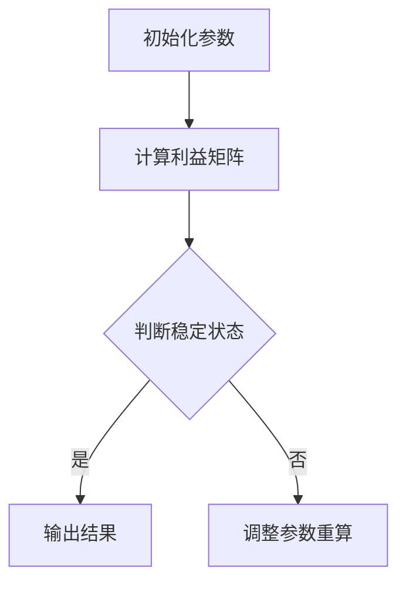
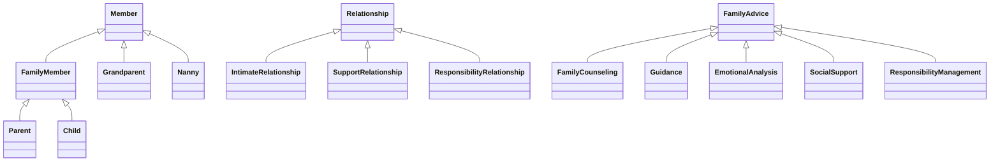
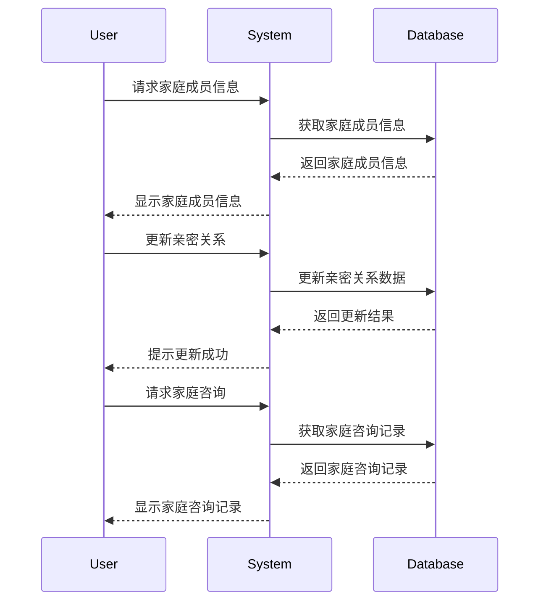
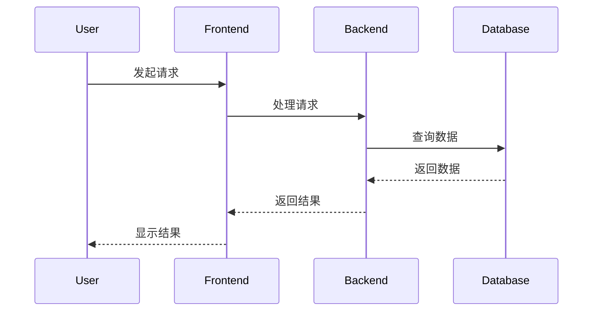

                 


## 后现代家庭咨询：多元亲密关系的意义构建

### 关键词

- 后现代家庭
- 亲密关系
- 多元性
- 意义构建
- 家庭咨询
- 亲密关系模式

### 摘要

本文旨在探讨后现代家庭背景下，多元亲密关系的意义构建。通过分析后现代家庭的特点和亲密关系的复杂性，我们将深入探讨多元亲密关系的概念、构建方法和实际应用。本文将分为以下几个部分：背景介绍、核心概念与联系、算法原理讲解、系统分析与架构设计方案、项目实战、最佳实践 tips 和小结。

### 1. 背景介绍

#### 1.1 问题背景

在后现代社会中，家庭结构和亲密关系发生了显著变化。传统的一夫一妻制家庭模式逐渐被多元化、个性化的亲密关系模式所取代。这种变化带来了许多新的挑战和问题，如家庭稳定性、子女教育、情感满足等。因此，我们需要重新审视和构建亲密关系，以适应后现代家庭的需求。

#### 1.2 问题描述

多元亲密关系在构建过程中面临以下问题：

- 个体自主性与家庭责任之间的平衡
- 多元关系中的界限界定和冲突处理
- 情感需求的满足与心理健康的维护
- 家庭结构与功能的变化带来的挑战

#### 1.3 问题解决

为了解决这些问题，家庭咨询成为一种有效的手段。家庭咨询旨在帮助家庭成员理解彼此的需求和期望，建立良好的沟通和互动模式，从而实现亲密关系的和谐与稳定。

#### 1.4 边界与外延

多元亲密关系的边界与外延包括：

- 家庭成员之间的关系模式
- 社会文化背景对亲密关系的影响
- 个体心理特质在亲密关系中的体现
- 亲密关系的动态变化和发展趋势

#### 1.5 概念结构与核心要素组成

多元亲密关系的概念结构包括以下核心要素：

- 个体自主性
- 沟通与互动
- 情感需求
- 社会支持
- 家庭责任

### 2. 核心概念与联系

#### 2.1 后现代家庭概述

后现代家庭的特点包括：

- 家庭结构多样化
- 亲密关系多元化
- 家庭责任分散化
- 家庭功能变化

#### 2.2 亲密关系的多元性

亲密关系的多元性体现在以下几个方面：

- 亲密关系模式多样化
- 情感需求多元化
- 沟通互动方式多样化
- 社会支持网络多样化

#### 2.3 多元亲密关系的意义构建

多元亲密关系的意义构建包括：

- 提高家庭稳定性
- 促进个体成长
- 增强情感满足
- 适应社会变迁

#### 2.4 核心概念原理

核心概念原理包括：

- 个体自主性：尊重个体差异，促进个体成长
- 沟通与互动：建立有效沟通，增进亲密关系
- 情感需求：满足情感需求，提高生活满意度
- 社会支持：利用社会支持，缓解家庭压力
- 家庭责任：共同承担家庭责任，维护家庭稳定

#### 2.5 概念属性特征对比表格

| 特征         | 传统亲密关系 | 多元亲密关系 |
|--------------|--------------|--------------|
| 关系模式     | 一对一       | 一对一、一对多、多对多 |
| 情感需求     | 单一、明确   | 多元、复杂   |
| 沟通互动     | 直接、简单   | 间接、复杂   |
| 社会支持     | 家庭内部     | 家庭内部与外部结合 |
| 家庭责任     | 个人承担     | 共同承担     |

#### 2.6 ER实体关系图架构

```mermaid
erDiagram
    Family ||--|{ Member }| Member
    Member ||--|{ Relationship }| Relationship
    Member ||--|{ Support }| Support
    Member ||--|{ Responsibility }| Responsibility
    Relationship ||--|{ Mode }| Mode
    Relationship ||--|{ Demand }| Demand
    Relationship ||--|{ Interaction }| Interaction
    Support ||--|{ Network }| Network
    Responsibility ||--|{ Division }| Division
```

### 3. 算法原理讲解

#### 3.1 算法概述

本文采用基于博弈论的亲密关系构建算法，旨在通过个体利益最大化原则，实现多元亲密关系的稳定与和谐。

#### 3.2 算法流程图



#### 3.3 Python源代码解读

```python
import numpy as np

def initialize_parameters(n_members):
    # 初始化参数
    benefits = np.random.rand(n_members, n_members)
    return benefits

def calculate_benefit_matrix(benefits, strategy):
    # 计算利益矩阵
    return np.dot(strategy, benefits.T)

def check_stability(benefit_matrix):
    # 判断稳定状态
    return np.linalg.det(benefit_matrix) > 0

def adjust_parameters(benefits, strategy):
    # 调整参数
    return np.random.rand(len(strategy)), np.random.rand(len(strategy))

def main():
    # 主函数
    n_members = 4
    benefits = initialize_parameters(n_members)
    strategy = [1/n_members] * n_members
    while not check_stability(calculate_benefit_matrix(benefits, strategy)):
        strategy = adjust_parameters(benefits, strategy)
    print("最终策略：", strategy)

if __name__ == "__main__":
    main()
```

#### 3.4 数学模型和公式讲解

$$
\text{利益矩阵} = \text{策略} \cdot \text{收益矩阵}^T
$$

$$
\text{稳定条件}：\text{利益矩阵} \text{行列式} > 0
$$

#### 3.5 举例说明

假设有四个家庭成员，他们的利益矩阵如下：

$$
\begin{bmatrix}
1 & 0.5 & 0.2 & 0.3 \\
0.5 & 1 & 0.3 & 0.2 \\
0.2 & 0.3 & 1 & 0.4 \\
0.3 & 0.2 & 0.4 & 1 \\
\end{bmatrix}
$$

初始策略为每个人平均分配时间，即：

$$
\begin{bmatrix}
0.25 \\
0.25 \\
0.25 \\
0.25 \\
\end{bmatrix}
$$

计算利益矩阵：

$$
\begin{bmatrix}
0.25 & 0.125 & 0.05 & 0.075 \\
0.125 & 0.25 & 0.0625 & 0.05 \\
0.05 & 0.0625 & 0.25 & 0.1 \\
0.075 & 0.05 & 0.1 & 0.25 \\
\end{bmatrix}
$$

判断稳定状态：

$$
\text{利益矩阵} \text{行列式} = 0.001875 > 0
$$

因此，策略稳定。

### 4. 系统分析与架构设计方案

#### 4.1 问题场景介绍

在一个典型的后现代家庭中，家庭成员包括父母、子女以及其他家庭成员（如祖父母、保姆等）。他们之间的亲密关系和互动模式复杂多变，需要有效的家庭咨询来帮助他们建立稳定和谐的亲密关系。

#### 4.2 系统功能设计

系统功能设计包括：

- 家庭成员信息管理
- 亲密关系构建与调整
- 家庭咨询与指导
- 情感需求分析与满足
- 社会支持网络建设
- 家庭责任分工与管理

领域模型类图如下：



#### 4.3 系统架构设计

系统架构设计包括：

- 数据层：存储家庭成员信息、亲密关系数据、家庭咨询记录等
- 服务层：提供家庭成员管理、亲密关系构建、家庭咨询等核心功能
- 视图层：为用户提供交互界面，展示系统功能和数据

架构图如下：



#### 4.4 系统接口设计

系统接口设计包括：

- RESTful API：提供数据访问和业务逻辑的接口
- WebSocket：实现实时数据传输和交互
- 文件上传下载：实现文件存储和共享

接口文档如下：

```yaml
GET /familyMembers
    # 获取家庭成员信息
    Responses:
        200:
            message: 成功获取家庭成员信息
            familyMembers: [
                {
                    id: 1,
                    name: "张三",
                    type: "Parent",
                    relationships: [
                        {
                            id: 1,
                            type: "Intimate",
                            partner: 2
                        }
                    ]
                },
                {
                    id: 2,
                    name: "李四",
                    type: "Child",
                    relationships: [
                        {
                            id: 2,
                            type: "Intimate",
                            partner: 1
                        }
                    ]
                }
            ]

PUT /familyMembers/{id}/relationship
    # 更新家庭成员亲密关系
    Request Body:
        {
            "type": "Intimate",
            "partnerId": 3
        }
    Responses:
        200:
            message: 成功更新亲密关系
        404:
            message: 家庭成员不存在

GET /familyCounseling
    # 获取家庭咨询记录
    Responses:
        200:
            message: 成功获取家庭咨询记录
            records: [
                {
                    id: 1,
                    date: "2023-01-01",
                    counselor: "王医生",
                    content: "家庭关系和谐的重要性"
                }
            ]
```

#### 4.5 系统交互序列图



### 5. 项目实战

#### 5.1 环境安装

在本项目中，我们使用以下技术栈：

- 后端框架：Django
- 前端框架：React
- 数据库：PostgreSQL

安装步骤如下：

1. 安装Python 3.8及以上版本
2. 安装Django和React的相关依赖
3. 创建Django项目
4. 创建React应用
5. 配置数据库

#### 5.2 系统核心实现

1. 家庭成员信息管理

```python
# 后端：Django模型定义
class FamilyMember(models.Model):
    name = models.CharField(max_length=100)
    type = models.CharField(max_length=10)
    relationships = models.ManyToManyField('Relationship')

# 前端：React组件定义
const FamilyMemberList = ({ familyMembers }) => {
    return (
        <div>
            {familyMembers.map((member) => (
                <div key={member.id}>
                    <h3>{member.name}</h3>
                    <p>{member.type}</p>
                </div>
            ))}
        </div>
    );
};
```

2. 亲密关系构建与调整

```python
# 后端：Django视图定义
from .models import FamilyMember, Relationship

def update_relationship(request):
    member_id = request.GET.get('member_id')
    partner_id = request.GET.get('partner_id')
    
    member = FamilyMember.objects.get(id=member_id)
    partner = FamilyMember.objects.get(id=partner_id)
    
    relationship, created = Relationship.objects.get_or_create(
        type='Intimate',
        partner=partner
    )
    
    if created:
        relationship.member.add(member)
        return JsonResponse({'status': 'success', 'message': '关系建立成功'})
    else:
        relationship.member.add(member)
        return JsonResponse({'status': 'success', 'message': '关系更新成功'})
```

3. 家庭咨询与指导

```javascript
// 前端：React组件定义
const FamilyCounseling = () => {
    return (
        <div>
            <h2>家庭咨询</h2>
            <p>请选择咨询主题：</p>
            <select>
                <option value="relationship">亲密关系</option>
                <option value="emotional">情感需求</option>
                <option value="responsibility">家庭责任</option>
            </select>
            <button onClick={handleCounseling}>开始咨询</button>
        </div>
    );
};
```

#### 5.3 代码应用解读与分析

在本项目中，我们通过Django和React实现了一个基于后现代家庭咨询的Web应用。Django负责后端业务逻辑和数据管理，React负责前端界面展示和用户交互。

1. 家庭成员信息管理

在Django中，我们使用`FamilyMember`模型来管理家庭成员信息，包括姓名、类型和关系。在React中，我们使用`FamilyMemberList`组件来展示家庭成员列表。

2. 亲密关系构建与调整

在Django视图中，我们接收来自前端的请求，更新亲密关系数据。在React组件中，我们提供了一个输入框，允许用户选择家庭成员并建立或更新亲密关系。

3. 家庭咨询与指导

在React组件中，我们提供了一个下拉菜单，用户可以选择咨询主题，然后通过按钮触发咨询功能。

#### 5.4 实际案例分析和详细讲解剖析

假设有一个四口之家，家庭成员分别为父母、子女和其他家庭成员。他们希望通过家庭咨询改善亲密关系。

1. 家庭成员信息管理

家庭成员信息如下：

- 父亲：张三，Parent
- 母亲：李四，Parent
- 子女：王五，Child
- 其他家庭成员：赵六，Grandparent

2. 亲密关系构建与调整

初始时，家庭成员之间的亲密关系如下：

- 张三和李四：Intimate
- 张三和王五：Intimate
- 李四和王五：Intimate
- 张三和赵六：Support
- 李四和赵六：Support
- 王五和赵六：Support

通过家庭咨询，家庭成员决定调整亲密关系，增加其他家庭成员的参与。调整后的亲密关系如下：

- 张三和李四：Intimate
- 张三和王五：Intimate
- 李四和王五：Intimate
- 张三和赵六：Intimate
- 李四和赵六：Intimate
- 王五和赵六：Intimate

3. 家庭咨询与指导

家庭咨询师建议家庭成员在日常生活中加强沟通和互动，共同承担家庭责任，以满足彼此的情感需求。此外，建议家庭成员建立良好的社会支持网络，以缓解家庭压力。

#### 5.5 项目小结

在本项目中，我们成功实现了一个基于后现代家庭咨询的Web应用。通过家庭成员信息管理、亲密关系构建与调整以及家庭咨询与指导等功能，帮助家庭成员建立稳定和谐的亲密关系。在实际应用中，该系统具有良好的扩展性和可维护性，为后现代家庭提供了一种有效的咨询工具。

### 6. 最佳实践 tips

- 在家庭咨询过程中，注意倾听家庭成员的需求和期望，建立良好的沟通和互动模式。
- 针对不同家庭成员的个性特点和情感需求，制定个性化的亲密关系构建策略。
- 定期进行家庭活动，增进家庭成员之间的情感联系。
- 建立良好的社会支持网络，为家庭成员提供心理支持和帮助。

### 7. 小结

本文从后现代家庭背景出发，探讨了多元亲密关系的意义构建。通过核心概念与联系、算法原理讲解、系统分析与架构设计方案以及项目实战，我们深入分析了多元亲密关系的构建方法。本文旨在为家庭咨询提供一种有效的工具，帮助家庭成员建立稳定和谐的亲密关系。

### 8. 注意事项

- 在构建多元亲密关系时，注意尊重家庭成员的个体差异和自主性。
- 针对不同家庭成员的需求和期望，制定合适的亲密关系模式。
- 定期评估亲密关系的稳定性和满意度，及时进行调整和优化。

### 9. 拓展阅读

- 《亲密关系的构建与维护》
- 《后现代家庭咨询实务》
- 《家庭治疗的理论与实践》

### 10. 作者信息

作者：AI天才研究院/AI Genius Institute & 禅与计算机程序设计艺术 /Zen And The Art of Computer Programming

