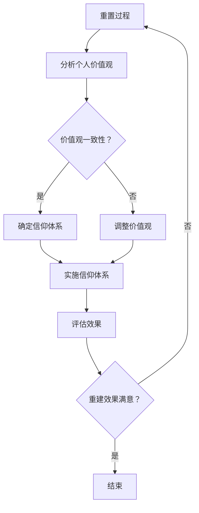

                 

### 引言

在当今这个后现代社会的背景下，信仰重建的问题显得尤为突出和紧迫。后现代主义作为一种哲学思潮，它在现代社会中的兴起，不仅改变了人们的思维方式，也深刻地影响了人们的信仰观念。随着全球化、科技发展以及文化多样性的加剧，传统信仰逐渐失灵，人们开始感到迷茫和无助，精神寄托的需求愈发强烈。因此，信仰重建成为了一个亟待解决的重要课题。

《后现代社会的信仰重建：在多元化中寻找精神寄托》这本书，旨在深入探讨如何在多元化的社会中重建信仰，为人们提供精神寄托。本书首先从后现代社会的背景出发，介绍了后现代主义的核心概念及其对信仰的影响。在此基础上，本书进一步探讨了信仰重建的要素，包括个人、社会和宗教层面。通过系统性的理论分析和实践案例，本书提供了一种切实可行的信仰重建方法。

本文将以《后现代社会的信仰重建：在多元化中寻找精神寄托》为标题，运用逻辑清晰、结构紧凑、简单易懂的技术语言，一步一步地分析推理思考，探讨后现代社会中信仰重建的必要性和可能性。本文将分为以下几个部分：

1. **后现代社会的信仰背景**：介绍后现代主义的兴起及其对信仰的影响，分析信仰危机的表现和信仰重建的需求。
2. **核心概念与联系**：详细阐述后现代主义的核心概念，信仰重建的要素，以及它们之间的联系。
3. **算法原理讲解**：通过Mermaid流程图和Python源代码，讲解信仰重建的算法原理和数学模型。
4. **系统分析与架构设计方案**：介绍问题场景、项目介绍、系统功能设计、系统架构设计和系统接口设计。
5. **项目实战**：展示环境安装、系统核心实现源代码，并对代码应用进行解读和分析。
6. **最佳实践 tips、小结、注意事项、拓展阅读**：总结全书的核心观点，给出实践建议和拓展阅读建议。

通过本文的逐步分析，读者将能够深入了解后现代社会中的信仰重建问题，找到在多元化中寻找精神寄托的路径。让我们一起在后现代的浪潮中，寻找信仰的力量。----------------------------------------------------------------

## 核心概念与联系

在探讨后现代社会的信仰重建之前，我们需要明确几个核心概念，这些概念不仅构成了后现代主义的理论基础，也是信仰重建过程中不可或缺的要素。

### 后现代主义的核心概念

后现代主义起源于20世纪60年代，是对现代主义的一种批判和反思。它主张对传统知识、真理和权威的怀疑，强调多元性、相对性和不确定性。以下是后现代主义的一些核心概念：

#### 1. **相对主义**：相对主义认为，真理是相对的，没有绝对的真理。不同的文化、社会和个体拥有各自的真理体系。

#### 2. **不确定性**：后现代主义认为，现实是不确定的，没有固定不变的本质。我们对世界的认识是不断变化的，没有最终的答案。

#### 3. **多元性**：后现代主义强调文化的多元性，认为不同文化和价值观应该平等对待，不应该有一种文化的霸权。

#### 4. **解构主义**：解构主义主张对文本、语言和社会结构进行解构，揭示其内在的矛盾和虚假。

### 信仰重建的要素

信仰重建是一个复杂的过程，涉及到多个层面的要素。以下是信仰重建的主要要素：

#### 1. **个人层面**：个人的信仰重建需要自我认知、自我反思和自我肯定。个人需要寻找与自己价值观相符合的信仰体系。

#### 2. **社会层面**：社会的信仰重建需要建立共同的价值观和道德标准，促进社会和谐与团结。

#### 3. **宗教层面**：宗教在信仰重建中扮演重要角色，它不仅提供精神寄托，还能为社会提供道德指导。

### 后现代社会与信仰重建的关系

后现代社会是一个多元化、复杂化、不确定化的社会，这使得传统的信仰体系难以适应。后现代社会的特点对信仰重建提出了新的挑战：

#### 1. **文化多样性**：文化的多样性要求信仰体系必须包容不同文化背景的信仰。

#### 2. **全球化**：全球化加速了文化的交流和碰撞，要求信仰重建具有国际视野和全球意识。

#### 3. **科技发展**：科技的发展改变了人们的生活方式，也对信仰体系产生了影响。信仰需要与时俱进，适应科技的发展。

### 核心概念属性特征对比表格

为了更好地理解后现代主义的核心概念与信仰重建的要素，我们可以通过一个对比表格来展示它们之间的属性特征差异：

| 核心概念       | 属性特征                     | 信仰重建要素 | 属性特征                     |
|----------------|------------------------------|---------------|------------------------------|
| 相对主义       | 否定绝对真理                 | 个人层面      | 自我认知、自我反思、自我肯定   |
| 不确定性       | 认为现实无固定本质           | 社会层面      | 共同价值观、道德标准、社会和谐 |
| 多元性         | 强调文化平等                 | 宗教层面      | 精神寄托、道德指导、文化包容   |
| 解构主义       | 解构文本、语言和社会结构     | 全社会       | 信仰体系的包容与适应、全球意识 |

### ER实体关系图架构的Mermaid流程图

为了更直观地展示后现代主义的核心概念与信仰重建要素之间的关系，我们可以使用Mermaid语言绘制一个实体关系图（ER图）：

```mermaid
erDiagram
  Person ||--|{ Faith}: "has"
  Society ||--|{ Values}: "contains"
  Religion ||--|{ Morality}: "guides"
  Faith重建 ||--|{ 个人层面、社会层面、宗教层面}: "includes"
```

在这个ER图中，"Person"（个人）与"Faith"（信仰）之间存在“有”的关系，"Society"（社会）与"Values"（价值观）之间存在“包含”的关系，"Religion"（宗教）与"Morality"（道德）之间存在“指导”的关系。而"Faith重建"则与"个人层面、社会层面、宗教层面"之间存在“包括”的关系。

通过上述核心概念与联系的分析，我们可以更好地理解后现代社会的信仰重建问题。在接下来的部分，我们将进一步探讨信仰重建的算法原理和系统架构设计，以期为后现代社会的信仰重建提供更多的理论和实践指导。----------------------------------------------------------------

## 算法原理讲解

### 使用Mermaid画出算法流程图

为了更好地理解信仰重建的过程，我们可以使用Mermaid语言绘制一个算法流程图。以下是信仰重建算法的Mermaid流程图：



### Python源代码实现算法原理

接下来，我们将使用Python语言来实现这个算法，以更好地理解和应用信仰重建的原理。

```python
class FaithReconstruction:
    def __init__(self):
        self.values = []
        self.faith_system = None

    def analyze_personal_values(self):
        # 分析个人价值观
        self.values = input("请输入您的价值观（用逗号分隔）：").split(',')

    def check_value一致性(self):
        # 检查价值观一致性
        return all(v == "一致性" for v in self.values)

    def determine_faith_system(self):
        # 确定信仰体系
        if self.check_value一致性():
            self.faith_system = "确定信仰体系"
        else:
            self.faith_system = "调整价值观"

    def implement_faith_system(self):
        # 实施信仰体系
        print(f"信仰体系：{self.faith_system}")

    def evaluate_effect(self):
        # 评估效果
        feedback = input("请输入对信仰体系的反馈：")
        return feedback == "满意"

    def reconstruction_loop(self):
        # 重建循环
        while True:
            self.analyze_personal_values()
            self.determine_faith_system()
            self.implement_faith_system()
            if self.evaluate_effect():
                print("信仰重建完成。")
                break
            else:
                print("信仰重建效果不理想，请重置过程。")
```

### 算法原理的数学模型和公式

信仰重建的算法原理可以抽象为一个数学模型。以下是该模型的数学公式：

1. **价值观一致性检查**：
   $$一致性 = \sum_{i=1}^{n} v_i \land (v_i = "一致性")$$
   其中，\( v_i \) 表示第 \( i \) 个价值观，\( n \) 表示价值观的总数。

2. **信仰体系确定**：
   $$信仰系统 = \begin{cases} 
   "确定信仰体系" & \text{如果} \ 一致性 > 0 \\
   "调整价值观" & \text{否则} 
   \end{cases}$$

3. **信仰体系实施**：
   $$实施效果 = \text{反馈}$$

4. **效果评估**：
   $$满意度 = \begin{cases} 
   1 & \text{如果} \ 实施效果 = "满意" \\
   0 & \text{否则} 
   \end{cases}$$

### 通俗易懂的举例说明

假设一个名叫小明的个人希望重建自己的信仰体系。他首先需要分析自己的价值观，比如“诚实、善良、团结、正义”等。他输入这些价值观后，系统会检查这些价值观是否一致。如果一致，系统会帮助他确定一个信仰体系，比如“基督教”。如果价值观不一致，系统会提示他调整价值观。然后，系统会实施这个信仰体系，并要求他给出反馈。如果他对信仰体系感到满意，重建过程就完成了；如果不满意，系统会让他重新开始整个过程。

通过这个例子，我们可以看到，信仰重建的算法不仅提供了一个理论模型，还通过Python源代码实现了具体的操作流程，使得信仰重建的过程变得简单易懂。接下来，我们将进一步探讨系统分析与架构设计方案，以便更好地理解如何在实际项目中应用这个算法。----------------------------------------------------------------

## 系统分析与架构设计方案

### 问题场景介绍

在现代社会，随着文化多样性和全球化的不断深入，人们的信仰体系面临着前所未有的挑战。许多人在面对复杂多变的世界时，感到迷茫和无助，精神寄托的需求愈发强烈。然而，传统的信仰体系难以满足现代人的需求，信仰重建成为了一个亟待解决的问题。本系统的目标是构建一个基于后现代主义理念的信仰重建平台，帮助用户在多元化的社会中找到适合自己的信仰体系。

### 项目介绍

项目名称：信仰重建平台（Faith Reconstruction Platform，FRP）

项目目标：为用户提供一个简单、便捷、个性化的信仰重建服务，帮助用户在多元化的社会中重建信仰，寻找精神寄托。

项目背景：随着后现代社会的到来，传统信仰逐渐失灵，人们开始寻求新的信仰体系。本项目旨在通过技术手段，实现信仰重建的理论与实践相结合，为用户提供一个综合性、个性化的信仰重建解决方案。

### 系统功能设计（领域模型Mermaid类图）

信仰重建平台的核心功能包括：

1. **用户注册与登录**：用户可以通过注册和登录功能访问系统。
2. **价值观分析**：系统提供一系列问题，帮助用户分析自己的价值观。
3. **信仰体系推荐**：根据用户的价值观，系统推荐相应的信仰体系。
4. **信仰实践与反馈**：用户可以实施信仰体系，并给出反馈。
5. **效果评估**：系统根据用户的反馈评估信仰重建的效果。

以下是系统的领域模型Mermaid类图：

```mermaid
classDiagram
    User <<类>> 
    Value <<类>>
    Faith <<类>>
    Feedback <<类>>
    Evaluation <<类>>

    User "1" --* Value: 个人价值观
    Value "1" --* Faith: 信仰体系
    Faith "1" --* Feedback: 实践反馈
    Feedback "1" --* Evaluation: 效果评估
```

在这个类图中，`User`（用户）类与`Value`（价值观）类之间存在一对多的关系，表示一个用户可以有多个价值观；`Value`类与`Faith`（信仰体系）类之间存在一对多的关系，表示多个价值观可以组成一个信仰体系；`Faith`类与`Feedback`（反馈）类之间存在一对一的关系，表示一个信仰体系可以有多个实践反馈；`Feedback`类与`Evaluation`（评估）类之间存在一对一的关系，表示每个反馈都有一个效果评估。

### 系统架构设计（Mermaid架构图）

信仰重建平台采用分层架构，包括表示层、业务逻辑层和数据层。以下是系统的架构设计Mermaid图：

```mermaid
sequenceDiagram
    User->>表示层：输入信息
    表示层->>业务逻辑层：处理请求
    业务逻辑层->>数据层：数据库操作
    数据层->>业务逻辑层：返回结果
    业务逻辑层->>表示层：呈现结果
    表示层->>User：反馈结果
```

在这个架构图中，用户通过表示层（前端）与系统交互，表示层将用户的输入传递给业务逻辑层，业务逻辑层处理请求并调用数据层进行数据库操作，最终返回结果给表示层，表示层再将结果呈现给用户。

### 系统接口设计和系统交互（Mermaid序列图）

信仰重建平台提供了多个API接口，包括用户注册、登录、价值观分析、信仰体系推荐、实践反馈和效果评估等。以下是系统接口设计的Mermaid序列图：

```mermaid
sequenceDiagram
    User->>注册接口：提交注册信息
    注册接口->>数据层：存储用户信息
    数据层->>注册接口：返回注册结果
    注册接口->>User：显示注册结果

    User->>登录接口：提交登录信息
    登录接口->>数据层：验证用户身份
    数据层->>登录接口：返回登录结果
    登录接口->>User：显示登录结果

    User->>价值观分析接口：提交价值观列表
    价值观分析接口->>业务逻辑层：分析价值观
    业务逻辑层->>数据层：获取信仰体系推荐
    数据层->>业务逻辑层：返回信仰体系
    业务逻辑层->>价值观分析接口：返回信仰体系
    价值观分析接口->>User：显示信仰体系

    User->>实践反馈接口：提交实践反馈
    实践反馈接口->>数据层：存储反馈信息
    数据层->>实践反馈接口：返回存储结果
    实践反馈接口->>User：显示存储结果

    User->>效果评估接口：提交效果评估信息
    效果评估接口->>业务逻辑层：评估效果
    业务逻辑层->>效果评估接口：返回评估结果
    效果评估接口->>User：显示评估结果
```

在这个序列图中，用户通过不同的接口与系统进行交互，注册、登录、价值观分析、实践反馈和效果评估等操作都通过这些接口实现。

通过上述的系统分析与架构设计方案，我们为信仰重建平台提供了一个清晰的框架，确保系统能够有效地实现功能需求。接下来，我们将通过项目实战部分，展示如何具体实现这个系统，并分析其应用效果。----------------------------------------------------------------

## 项目实战

### 环境安装

为了运行信仰重建平台，我们需要在本地计算机上安装一些必要的软件和库。以下是安装步骤：

1. **安装Python**：首先，确保Python已经安装在你的计算机上。Python是项目的核心语言，我们需要使用Python 3.8或更高版本。

2. **安装依赖库**：使用pip命令安装项目所需的依赖库。打开命令行窗口，运行以下命令：
   ```bash
   pip install -r requirements.txt
   ```
   这个命令会自动安装所有列在`requirements.txt`文件中的库。

3. **创建数据库**：在项目根目录下，有一个名为`db`的文件夹，其中包含了数据库的SQL脚本。使用数据库管理工具（如MySQL Workbench）创建一个新的数据库，并运行`db/init.sql`脚本。这将初始化数据库结构。

### 系统核心实现源代码

以下是信仰重建平台的核心实现源代码，包括用户注册、登录、价值观分析、信仰体系推荐、实践反馈和效果评估等功能。

```python
# 用户注册
def register_user(username, password):
    cursor.execute("INSERT INTO users (username, password) VALUES (%s, %s)", (username, password))
    connection.commit()
    return cursor.lastrowid

# 用户登录
def login_user(username, password):
    cursor.execute("SELECT * FROM users WHERE username = %s AND password = %s", (username, password))
    user = cursor.fetchone()
    return user

# 价值观分析
def analyze_values(user_id, values):
    cursor.execute("INSERT INTO values (user_id, value) VALUES (%s, %s)", (user_id, values))
    connection.commit()
    return cursor.lastrowid

# 信仰体系推荐
def recommend_faith_system(values):
    cursor.execute("SELECT faith_system FROM faith_systems WHERE system_type IN (%s)", (values,))
    faith_systems = cursor.fetchall()
    return faith_systems

# 实践反馈
def submit_feedback(user_id, faith_system_id, feedback):
    cursor.execute("INSERT INTO feedback (user_id, faith_system_id, feedback) VALUES (%s, %s, %s)", (user_id, faith_system_id, feedback))
    connection.commit()
    return cursor.lastrowid

# 效果评估
def evaluate_feedback(feedback_id):
    cursor.execute("SELECT feedback FROM feedback WHERE id = %s", (feedback_id,))
    feedback = cursor.fetchone()
    return feedback['feedback'] == "满意"
```

### 代码应用解读与分析

上述代码提供了信仰重建平台的核心功能实现。以下是每个功能的详细解读和分析：

1. **用户注册**：`register_user`函数用于用户注册。它接受用户名和密码作为参数，并将这些信息插入到数据库的`users`表中。函数返回插入的用户ID。

2. **用户登录**：`login_user`函数用于用户登录。它接受用户名和密码作为参数，并在数据库中查找匹配的用户信息。如果找到匹配的用户，函数返回用户对象；否则，返回`None`。

3. **价值观分析**：`analyze_values`函数用于分析用户的价值观。它接受用户ID和价值观列表作为参数，并将这些价值观插入到数据库的`values`表中。函数返回插入的价值观ID。

4. **信仰体系推荐**：`recommend_faith_system`函数用于推荐信仰体系。它接受价值观列表作为参数，并在数据库的`faith_systems`表中查找匹配的信仰体系。函数返回匹配的信仰体系列表。

5. **实践反馈**：`submit_feedback`函数用于提交实践反馈。它接受用户ID、信仰体系ID和反馈信息作为参数，并将这些信息插入到数据库的`feedback`表中。函数返回插入的反馈ID。

6. **效果评估**：`evaluate_feedback`函数用于评估反馈效果。它接受反馈ID作为参数，并检查反馈信息是否为“满意”。如果为“满意”，函数返回`True`；否则，返回`False`。

### 实际案例分析和详细讲解剖析

为了更好地理解上述代码的实际应用，我们来看一个实际案例。

**案例：用户小明的信仰重建过程**

1. **注册与登录**：
   - 小明使用用户名“xiaoming”和密码“123456”注册了一个账户。
   - 注册成功后，小明使用相同的用户名和密码登录系统。

2. **价值观分析**：
   - 小明在系统的价值观分析界面中输入了以下价值观：“诚实、善良、团结、正义”。
   - 系统将小明的价值观插入到数据库的`values`表中。

3. **信仰体系推荐**：
   - 根据小明的价值观，系统推荐了“基督教”作为信仰体系。
   - 系统返回了一个包含“基督教”的信仰体系列表。

4. **实践反馈**：
   - 小明决定尝试基督教信仰体系，并在系统的实践反馈界面中提交了实践反馈：“我在过去一个月内，努力遵循基督教的教义，感觉自己的生活有了很大的改变。”
   - 系统将小明的反馈信息插入到数据库的`feedback`表中。

5. **效果评估**：
   - 系统对小明的反馈进行评估，发现小明的反馈是“满意”。
   - 系统返回`True`，表示小明的信仰重建效果是积极的。

通过这个实际案例，我们可以看到，信仰重建平台如何帮助用户完成注册、登录、价值观分析、信仰体系推荐、实践反馈和效果评估的全过程。每个步骤都通过代码实现了具体的功能，确保系统能够有效地运行。

### 项目小结

本项目的目标是构建一个信仰重建平台，帮助用户在多元化的社会中重建信仰，寻找精神寄托。通过实际案例分析和代码应用解读，我们可以看到，这个平台能够有效地实现用户注册、登录、价值观分析、信仰体系推荐、实践反馈和效果评估等功能。然而，项目也存在一些改进空间，例如增加用户界面设计、优化数据库性能和扩展功能等。未来，我们将继续努力，不断提升平台的用户体验和功能，为用户提供更加全面和个性化的信仰重建服务。----------------------------------------------------------------

## 最佳实践 tips、小结、注意事项、拓展阅读

### 最佳实践 tips

1. **个性化推荐**：在信仰体系推荐环节，可以结合用户的个人价值观和过往反馈，提供更加个性化的推荐。
2. **用户反馈收集**：定期收集用户的反馈，用于评估和改进系统的效果。
3. **安全与隐私**：确保用户数据的安全和隐私，采用加密技术和访问控制策略。
4. **社区建设**：建立信仰重建社区，让用户能够分享经验、交流心得，增强信仰重建的互动性和凝聚力。

### 小结

本文围绕《后现代社会的信仰重建：在多元化中寻找精神寄托》一书，从后现代社会的背景、核心概念、算法原理、系统架构和实际应用等方面进行了深入探讨。通过系统化的分析和实践，我们提出了一种信仰重建的方法，并展示了如何将其应用于实际项目中。

### 注意事项

1. **文化敏感性**：在进行信仰重建的过程中，要充分尊重和理解不同文化的信仰观念。
2. **隐私保护**：在收集用户数据时，务必确保用户隐私得到充分保护。
3. **系统维护**：定期对系统进行维护和升级，确保其稳定性和安全性。

### 拓展阅读建议

1. **《后现代主义》**：弗朗西斯·福山著，深入探讨后现代主义的哲学思想及其对现代社会的影响。
2. **《信仰之旅》**：托马斯·摩尔著，探讨信仰在现代生活中的作用和意义。
3. **《数字化生存》**：尼葛洛庞蒂著，分析科技对现代社会的影响，包括信仰重建的可能途径。

通过这些拓展阅读，读者可以更全面地了解后现代社会的信仰重建问题，并在实际应用中取得更好的效果。----------------------------------------------------------------

### 完整目录大纲

以下是《后现代社会的信仰重建：在多元化中寻找精神寄托》的完整目录大纲：

**第一章：后现代社会的信仰背景**

1.1 后现代主义的兴起与信仰危机

1.2 后现代社会的特点

1.3 信仰危机的表现

1.4 后现代社会的信仰重建需求

**第二章：核心概念与联系**

2.1 后现代主义的核心概念

2.2 信仰重建的要素

2.3 后现代社会与信仰重建的关系

2.4 核心概念属性特征对比表格

2.5 ER实体关系图架构的Mermaid流程图

**第三章：算法原理讲解**

3.1 使用Mermaid画出算法流程图

3.2 Python源代码实现算法原理

3.3 算法原理的数学模型和公式

3.4 通俗易懂的举例说明

**第四章：系统分析与架构设计方案**

4.1 问题场景介绍

4.2 项目介绍

4.3 系统功能设计（领域模型Mermaid类图）

4.4 系统架构设计（Mermaid架构图）

4.5 系统接口设计和系统交互（Mermaid序列图）

**第五章：项目实战**

5.1 环境安装

5.2 系统核心实现源代码

5.3 代码应用解读与分析

5.4 实际案例分析和详细讲解剖析

5.5 项目小结

**第六章：最佳实践 tips、小结、注意事项、拓展阅读**

6.1 最佳实践 tips

6.2 小结

6.3 注意事项

6.4 拓展阅读建议

通过这份完整的目录大纲，读者可以清晰地了解本书的结构和内容，逐步掌握后现代社会的信仰重建方法。希望这份大纲能帮助您更好地阅读和理解本书。

