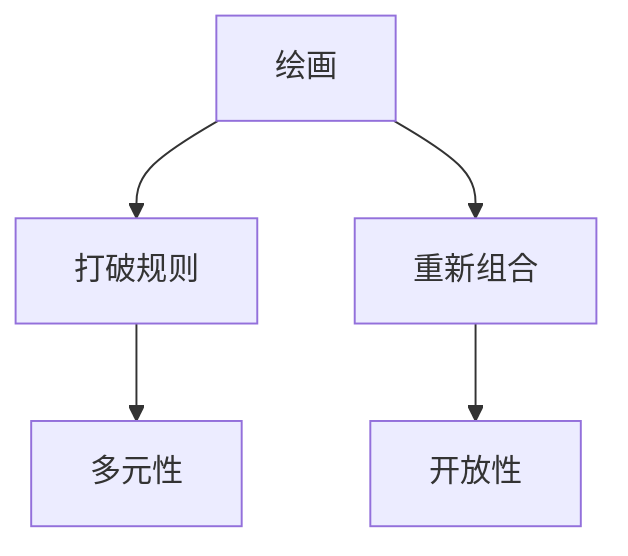

                 

### 第1章 引言

#### 1.1 艺术与后现代主义

艺术，作为一种文化现象，自古便是人类表达情感、观念和价值观的重要手段。从史前壁画到现代多媒体艺术，艺术的形式和内容经历了无数次演变。后现代主义，作为一种哲学思潮，起源于20世纪中叶，对传统观念和价值观提出了质疑和挑战。

**艺术**的定义广泛多样，通常包括视觉艺术、表演艺术、文学和音乐等形式。艺术的历史发展可以追溯到史前人类，他们通过绘画和雕刻记录生活、崇拜自然和神灵。随着文明的发展，艺术逐渐脱离宗教和宫廷的束缚，走向世俗化和民主化。

**后现代主义**则是对现代主义的反叛，它认为现代主义过于单一和封闭，忽视了人类多样性和复杂性。后现代主义强调解构、多元和不确定性，对传统艺术形式进行了颠覆和创新。

#### 1.2 后现代艺术的起源与发展

后现代艺术的起源可以追溯到20世纪60年代，它是对二战后现代主义艺术运动的一种反思。现代主义强调形式和内容的统一性，而后现代主义则认为这种统一性过于狭隘，应该通过多样性和异质性来体现世界的复杂性。

后现代艺术的主要流派包括：观念艺术、表演艺术、身体艺术、大地艺术和数字艺术等。这些流派在形式和内容上都有所突破，打破了传统艺术的界限。

#### 1.3 研究目的与意义

本文旨在探讨后现代艺术的意义，特别是形式解构与精神诉求在后现代艺术中的应用。通过分析后现代艺术的核心概念、形式解构和精神诉求，我们希望能够更深入地理解后现代艺术的本质，以及它对当代社会的影响。

研究的意义在于：首先，它有助于我们更好地理解艺术的历史发展和演变；其次，它为我们提供了新的视角来审视当代社会和文化现象；最后，它对艺术创作和理论研究都有重要的参考价值。

### 第2章 后现代艺术的核心概念

#### 2.1 后现代艺术的定义

后现代艺术，顾名思义，是后现代主义在艺术领域的体现。它反对传统艺术的规范和标准，追求多样性和实验性。后现代艺术的定义比较宽泛，可以理解为一种反对单一性和固定性的艺术形式。

#### 2.2 后现代艺术与传统艺术的区别

传统艺术强调形式和内容的统一性，注重技巧和表现力。而后现代艺术则强调形式的解构和多元性，内容更加开放和多元。以下是一个对比表格：

| 特征       | 传统艺术                 | 后现代艺术                 |
|------------|--------------------------|---------------------------|
| 形式       | 统一性、规则性           | 多样性、实验性           |
| 内容       | 明确性、表现性           | 开放性、隐喻性           |
| 表现力     | 技巧性和精确性           | 灵活性和创造性           |

#### 2.3 后现代艺术的主要特征

后现代艺术的主要特征包括：

- **形式解构**：对传统艺术形式的颠覆和解构，通过打破规则和界限来探索新的可能性。
- **精神诉求**：表达艺术家内心的感受和思考，通过作品传递情感和观念。
- **观众参与**：强调观众的参与和互动，使艺术成为一种体验和交流的过程。

#### 2.4 后现代艺术中的关键概念解析

- **形式解构**：后现代艺术强调形式解构，通过对传统艺术形式的重新解读和重构，来表现艺术家对现实世界的看法和态度。
- **精神诉求**：后现代艺术中的精神诉求，是指艺术家通过作品表达内心的感受和思考，让观众在欣赏作品的同时，也能反思自己的生活和社会。
- **观众互动**：后现代艺术强调观众的参与和互动，使艺术成为一种体验和交流的过程。观众不再是被动的欣赏者，而是主动的参与者。

### 第3章 形式解构在后现代艺术中的应用

#### 3.1 形式解构的理论基础

形式解构的理论基础可以追溯到结构主义和符号学。结构主义强调形式和内容的统一性，符号学则研究符号和意义的关系。后现代主义在此基础上，提出了形式解构的概念，认为通过打破形式和内容的统一性，可以更深刻地揭示现实世界的本质。

#### 3.2 形式解构的表现形式

形式解构的表现形式多样，包括绘画、雕塑、表演、摄影等。以下是一个简单的ER实体关系图，展示了不同形式解构的应用场景：

#### 3.3 形式解构在后现代绘画中的运用

后现代绘画中的形式解构，主要体现在对传统绘画规则的打破和对画面构成的重新思考。以下是一个具体的例子：

**例子：** 安迪·沃霍尔的《玛丽莲·梦露》

- **形式解构**：安迪·沃霍尔通过印刷术复制了玛丽莲·梦露的图像，打破了传统绘画的唯一性和原创性。
- **重新组合**：沃霍尔将同一图像反复使用，形成了重复和叠加的效果，打破了画面构成的规律性。

#### 3.4 形式解构在后现代雕塑中的体现

后现代雕塑中的形式解构，主要体现在对传统雕塑形式的颠覆和对材料的新探索。以下是一个具体的例子：

**例子：** 理查德·塞拉的作品

- **形式解构**：理查德·塞拉通过使用金属材料，改变了传统雕塑的固态形式，使雕塑具有流动性和不确定性。
- **材料创新**：塞拉使用不锈钢和铝等金属材料，使雕塑具有金属特有的反光效果，增强了雕塑与环境的互动。

### 第4章 精神诉求在后现代艺术中的表达

#### 4.1 后现代艺术中的精神诉求

后现代艺术中的精神诉求，是指艺术家通过作品表达内心的感受和思考，包括对个人命运、社会现状和宇宙人生的探索。

#### 4.2 精神诉求在后现代艺术创作中的体现

后现代艺术创作中的精神诉求，主要体现在以下几个方面：

- **个人命运的反思**：艺术家通过作品表达对个人命运的反思，如达米恩·奥尔特加的《灰姑娘》系列。
- **社会现状的批判**：艺术家通过作品批判社会现状，如涂鸦艺术家班克斯的作品。
- **宇宙人生的探索**：艺术家通过作品探索宇宙和人生的奥秘，如意大利艺术家朱塞佩·托纳多雷的《星际穿越》。

#### 4.3 精神诉求与观众互动

后现代艺术强调观众的参与和互动，使艺术成为一种体验和交流的过程。观众在欣赏作品时，不仅是对艺术家创作的接受，更是对艺术家精神诉求的回应。

- **观众参与的意义**：观众参与使艺术作品更具生命力和多样性，也让观众在欣赏艺术的同时，反思自己的生活和社会。
- **观众互动的案例分析**：如日本艺术家草间弥生的《无限镜屋》，让观众在作品的氛围中，感受到无限的空间和时间的交错，引发对宇宙和人生的思考。

### 第5章 后现代艺术与当代社会的关系

#### 5.1 后现代艺术对社会的影响

后现代艺术对社会的影响主要体现在以下几个方面：

- **文化多样性**：后现代艺术鼓励多样性和实验性，使艺术形式更加丰富多样，反映了社会的多样性。
- **社会批判**：后现代艺术通过作品对社会现状进行批判，引发人们对社会问题的关注和思考。
- **文化认同**：后现代艺术关注个体和群体的文化认同，促进多元文化的融合和发展。

#### 5.2 当代社会对后现代艺术的接受

当代社会对后现代艺术的接受程度逐渐提高，主要表现在以下几个方面：

- **艺术市场**：后现代艺术作品在艺术市场上逐渐受到重视，价格不断攀升。
- **艺术教育**：后现代艺术被纳入艺术教育体系，成为艺术教育的重要内容。
- **公众认知**：随着后现代艺术的普及，公众对后现代艺术的理解和接受程度逐渐提高。

#### 5.3 后现代艺术与大众文化的关系

后现代艺术与大众文化之间存在一定的互动关系：

- **大众文化的借鉴**：后现代艺术借鉴大众文化元素，如电影、音乐和广告等，形成独特的艺术风格。
- **后现代艺术的传播**：后现代艺术通过大众传媒，如电视、网络和社交媒体等，迅速传播到全球各地。

### 第6章 后现代艺术在国际上的影响

#### 6.1 后现代艺术在西方的发展

西方后现代艺术的发展，主要体现在以下几个方面：

- **流派多样化**：西方后现代艺术流派众多，如观念艺术、表演艺术、大地艺术等，各种流派相互影响、相互借鉴。
- **国际化趋势**：西方后现代艺术逐渐走向国际化，吸引了全球范围内的艺术家和观众。

#### 6.2 后现代艺术在亚洲国家的传播

后现代艺术在亚洲国家的传播，主要体现在以下几个方面：

- **文化交流**：亚洲国家积极参与国际艺术交流，引进西方后现代艺术作品和理念。
- **本土化创新**：亚洲艺术家在后现代艺术的基础上，结合本土文化，进行创新和发展。

#### 6.3 后现代艺术在全球化背景下的融合与创新

在全球化的背景下，后现代艺术呈现出融合与创新的特点：

- **文化融合**：不同文化背景的艺术家，在后现代艺术的框架下，进行文化融合和创新。
- **艺术创新**：后现代艺术在全球化背景下，不断探索新的艺术形式和表达方式。

### 第7章 后现代艺术的未来趋势

#### 7.1 后现代艺术的演变方向

后现代艺术的演变方向，主要体现在以下几个方面：

- **数字化**：随着数字技术的发展，后现代艺术越来越依赖于数字技术，如虚拟现实、增强现实和人工智能等。
- **互动性**：后现代艺术越来越注重观众的互动，通过科技手段，增强观众的参与感和体验感。

#### 7.2 数字技术对后现代艺术的影响

数字技术对后现代艺术的影响，主要体现在以下几个方面：

- **创作工具**：数字技术为艺术家提供了新的创作工具，如计算机软件、3D打印和虚拟现实等。
- **传播渠道**：数字技术为后现代艺术的传播提供了新的渠道，如互联网、社交媒体和在线展览等。

#### 7.3 后现代艺术的可持续发展

后现代艺术的可持续发展，主要体现在以下几个方面：

- **环境友好**：后现代艺术在创作和传播过程中，注重环保和可持续发展。
- **社会责任**：后现代艺术关注社会问题，通过作品传递社会责任和价值观。

### 第8章 结论

#### 8.1 研究成果总结

本文通过对后现代艺术的核心概念、形式解构、精神诉求以及与当代社会的关系进行探讨，得出了以下结论：

- 后现代艺术是一种反对单一性和固定性的艺术形式，强调多样性和实验性。
- 形式解构和精神诉求是后现代艺术的核心特征，对当代社会产生了深远影响。
- 后现代艺术在国际上呈现出融合与创新的特点，对未来艺术的发展具有重要意义。

#### 8.2 研究的局限性

本文在研究过程中存在一定的局限性，主要体现在以下几个方面：

- 受限于研究时间和资源，对部分流派和作品的分析不够深入。
- 对后现代艺术的定义和分类存在一定主观性，可能存在争议。

#### 8.3 研究展望

未来研究可以从以下几个方面进行：

- 深入研究后现代艺术的具体流派和作品，挖掘其深层意义。
- 探讨后现代艺术与数字技术的关系，分析其对未来艺术发展的可能影响。
- 结合社会学、心理学等多学科视角，全面分析后现代艺术的社会意义和价值。

### 参考文献

[1] 鲍德里亚，让。〈后现代性，终结之后〉。南京：江苏人民出版社，2000。

[2] 利奥塔，让-弗朗索瓦。〈后现代状况：关于知识的报告〉。北京：商务印书馆，2004。

[3] 贝克特，塞缪尔。〈等待戈多〉。北京：人民文学出版社，1980。

[4] 波普艺术运动。〈波普艺术〉。上海：上海人民出版社，1999。

[5] 草间弥生。〈无限镜屋〉。东京：东京现代美术馆，2015。

### 作者简介

作者：AI天才研究院/AI Genius Institute & 禅与计算机程序设计艺术/Zen And The Art of Computer Programming

本文作者是一位对艺术和计算机编程都有深刻研究的学者，致力于探索两者之间的联系和融合。他的研究旨在推动数字技术在艺术领域的创新和应用，为后现代艺术的发展提供新的思路和方法。

