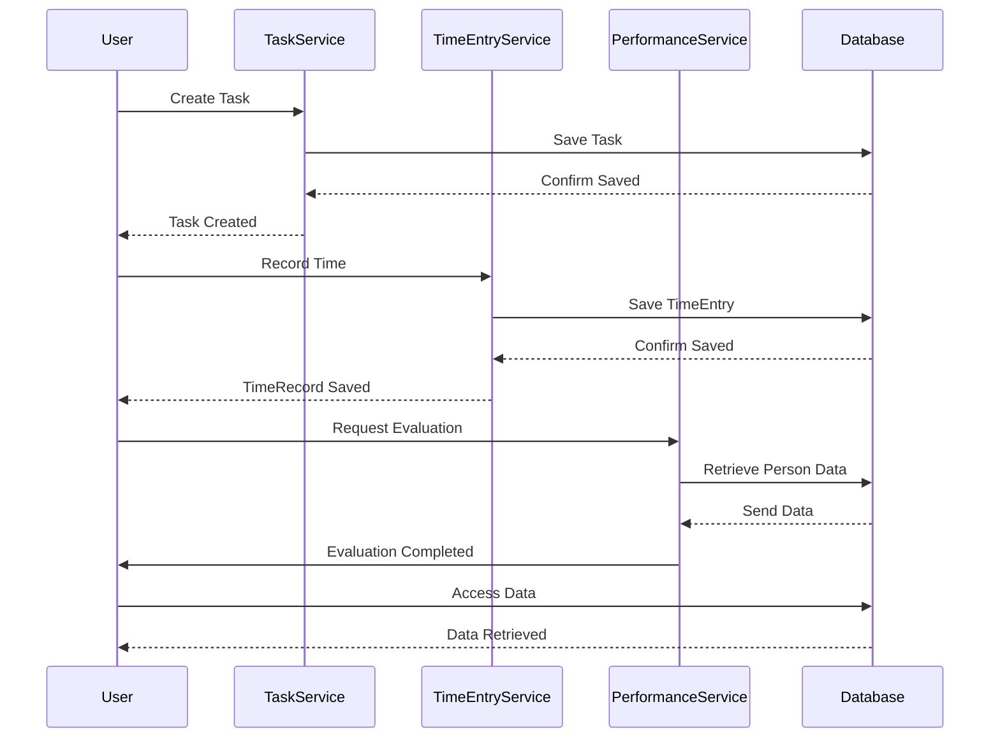
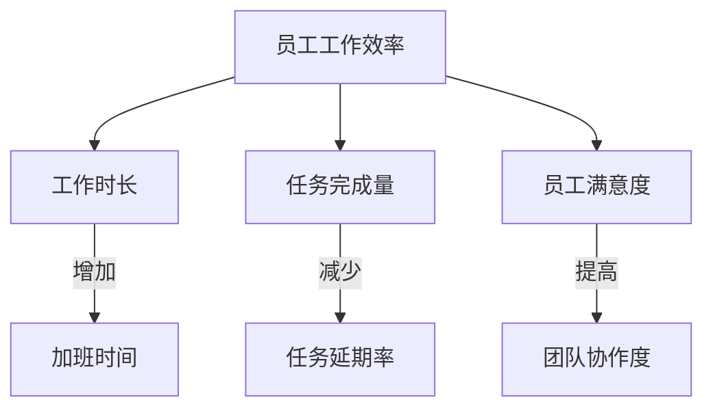

                 

### 引言

#### 1.1 问题背景

生产力崇拜，是一种对生产力和效率的高度追求和信仰，这种崇拜源于人类对物质财富的渴望和提升生活质量的追求。自古以来，无论是农耕社会、工业革命，还是信息化时代，生产力的发展一直是社会进步的重要驱动力。在现代社会，生产力崇拜更是被推到了前所未有的高度，成为衡量一个国家、一个企业乃至一个人成功与否的重要标准。

生产力崇拜的起源可以追溯到古代文明的兴起。在农业社会，人们为了生存和发展，追求更高效的农业生产方式，从而推动农业生产力的发展。工业革命时期，蒸汽机和机器的发明极大地提高了生产效率，进一步加剧了生产力崇拜的现象。进入信息化时代，计算机技术和互联网的广泛应用，使得生产力得到了空前的提升，生产力崇拜也因此被推向了一个新的高峰。

效率至上是生产力崇拜的一种体现。效率，即单位时间内完成的任务量，它代表了生产力的一种度量。在生产力崇拜的社会背景下，追求效率成为一种普遍的价值观。人们热衷于寻找和采用各种方法来提高效率，从工作时间的优化、工作流程的简化，到技术手段的创新，都是为了达到更高的生产效率。

现代社会中，效率至上的现象无处不在。在企业中，追求高效的生产线和先进的管理模式；在个人生活中，追求高效的购物体验和时间管理。效率至上已经成为一种社会共识，甚至被认为是成功的必备条件。然而，随着生产力的发展和效率的提升，我们开始反思这种追求效率至上的价值观是否真的能够带来幸福和满足？

#### 1.2 问题描述

生产力崇拜和效率至上带来的问题主要体现在以下几个方面：

首先，个人层面的影响。生产力崇拜和效率至上可能导致人们过度关注工作效率和生产力，忽视了生活的其他方面，如身心健康、人际关系等。长期处于高压力、高效率的工作环境中，人们的心理健康可能受到影响，出现焦虑、抑郁等心理问题。此外，过分追求效率可能导致人们对时间的过度占有，忽视了与家人和朋友相处的时间，影响人际关系和家庭的和谐。

其次，社会层面的影响。生产力崇拜和效率至上可能导致社会的不平等现象加剧。在追求效率的过程中，社会资源和机会往往集中在那些能够高效利用资源的人群手中，而那些效率较低的人群可能被边缘化，加剧了社会的不公平。此外，过度追求效率可能导致社会对环境和资源的破坏，长期来看不利于社会的可持续发展。

最后，文化和哲学层面的影响。生产力崇拜和效率至上可能削弱了人文关怀和道德价值。在追求效率的过程中，人们可能忽视了对道德和伦理的考量，导致社会风气的恶化。同时，过分追求效率也可能导致人们对生命的尊重和价值的忽视，忽视了人类存在的更深层次的意义和目的。

#### 1.3 问题解决

为了解决生产力崇拜和效率至上带来的问题，我们需要从以下几个方面进行思考和探索：

首先，重新审视生产力和效率的价值。我们应该认识到，生产力和效率虽然重要，但它们并不是生活的全部。生活不仅仅是追求物质财富和高效的工作，还包括身心健康、人际关系、人文关怀等多个方面。我们需要在追求生产力和效率的同时，关注生活的其他方面，实现全面的发展。

其次，倡导平衡的生活哲学。我们应该提倡在工作和生活之间找到平衡，避免过度追求效率和工作压力。通过合理的时间管理和生活规划，我们可以提高工作效率，同时保证身心健康和人际关系的和谐。

再次，关注可持续发展和环境保护。在追求生产力和效率的过程中，我们应该注重环境保护和资源的可持续利用，避免对环境和社会的过度破坏。通过推广绿色技术和可持续发展理念，我们可以实现生产力和环境保护的双赢。

最后，培养人文关怀和道德价值。在追求效率的同时，我们不能忽视人文关怀和道德价值。我们应该关注他人的需求，积极参与社会公益活动，推动社会风气的良性发展。

#### 1.4 边界与外延

生产力的定义与范畴：生产力是指在一定时期内，通过人类劳动所创造的全部物质财富和非物质财富的总和。它包括劳动力、生产资料、技术和管理等要素。生产力的范畴涵盖了农业、工业、服务业等多个领域。

效率的含义与衡量：效率是指单位时间内完成的任务量或产出与投入的比值。效率的衡量可以通过多种指标，如单位时间内的产值、劳动生产率、资源利用率等。效率的提高可以通过优化工作流程、提高技术水平、合理分配资源等方式实现。

#### 1.5 概念结构与核心要素组成

后生产力崇拜的核心要素：后生产力崇拜强调在追求生产力和效率的同时，关注生活的其他方面，如身心健康、人际关系、人文关怀等。它倡导平衡的生活哲学，注重可持续发展，强调道德和伦理价值。

效率至上的生活哲学结构：效率至上的生活哲学强调以效率为中心，追求高效的工作和生活。它强调时间管理和资源优化，注重产出与投入的比值，倡导通过技术和创新提高效率。

## 第二部分：核心概念与联系

### 2.1 生产力崇拜

#### 2.1.1 生产力崇拜的内涵

生产力崇拜，是对生产力的过度崇拜和追求，认为生产力的发展是衡量一切成功与否的唯一标准。生产力崇拜的内涵包括以下几个方面：

首先，生产力崇拜强调生产力的优先性。在生产力崇拜的观点中，生产力被视为推动社会进步和经济发展的关键因素，甚至被认为是衡量社会价值和国家实力的唯一标准。因此，生产力的发展被置于其他所有社会目标之上，成为社会追求的首要目标。

其次，生产力崇拜强调效率的重要性。生产力崇拜认为，提高生产效率是推动生产力发展的关键。因此，追求高效的工作方式和生产流程成为生产力崇拜的核心内容。效率被视为提升生产力的最直接和最有效的手段。

再次，生产力崇拜强调技术和创新的作用。生产力崇拜认为，技术进步和创新是提高生产力的关键动力。因此，对新技术和新发明的高度重视和追求成为生产力崇拜的重要特征。

#### 2.1.2 生产力崇拜的影响

生产力崇拜对个人生活的影响：

生产力崇拜可能导致人们过分关注工作效率和生产力，忽视生活的其他方面。长期处于高压力、高效率的工作环境中，个人的身心健康可能会受到影响，出现焦虑、抑郁等心理问题。此外，生产力崇拜可能导致人们过度追求物质财富和成功，忽视人际关系和家庭的和谐。

生产力崇拜对社会结构的影响：

生产力崇拜可能导致社会资源的集中和分配不均。追求效率和利润的企业可能更容易获得资源和机会，而那些效率较低的企业和个人则可能被边缘化。这种不平等可能导致社会的不稳定和矛盾加剧。

生产力崇拜可能削弱人文关怀和道德价值。在追求效率的过程中，社会可能忽视对道德和伦理的考量，导致社会风气的恶化。此外，过分追求效率可能导致对环境和资源的过度开发，对人类社会的可持续发展构成威胁。

#### 2.2 效率至上

##### 2.2.1 效率至上的定义

效率至上，是指将效率视为生活和工作的核心价值，追求在有限的时间内实现最大的产出。效率至上的定义可以从以下几个方面进行理解：

首先，效率至上的目标是在有限的时间内完成更多的任务或产出。它强调时间的价值，认为时间是有限的资源，需要被高效利用。

其次，效率至上注重产出与投入的比值。它追求通过最小的投入获得最大的产出，即追求高效的生产和生活方式。

再次，效率至上强调持续改进和优化。它认为，通过不断改进工作流程、提高技术水平和管理能力，可以进一步提高效率。

##### 2.2.2 效率至上的影响

效率至上对个人效率的提升：

效率至上可以帮助个人更好地管理时间和资源，提高工作效率。通过科学的时间管理和工作流程优化，个人可以在有限的时间内完成更多的任务，提高产出。

效率至上对社会效率的影响：

效率至上可以促进社会的整体效率和竞争力。企业通过提高生产效率和降低成本，可以提高市场竞争力。同时，政府和社会组织通过提高行政效率，可以更好地服务于民众，提升社会治理能力。

#### 2.3 核心概念对比表格

| 概念       | 定义                                   | 影响                         |
|------------|----------------------------------------|-----------------------------|
| 生产力崇拜 | 对生产力的过度崇拜                     | 导致个人和社会效率至上的倾向 |
| 效率至上   | 以效率为中心的生活哲学                 | 提高个人和社会效率           |

#### 2.4 ER实体关系图架构

```mermaid
erDiagram
  ProductivityAdmiration && EfficiencyMaximization {
    inheritance ProductivityAdmiration
  }
  
  ProductivityAdmiration ||--|{ 个人生活 } 个人生活
  ProductivityAdmiration ||--|{ 社会结构 } 社会结构
  
  EfficiencyMaximization ||--|{ 个人效率 } 个人效率
  EfficiencyMaximization ||--|{ 社会效率 } 社会效率
```

## 第三部分：算法原理讲解

### 3.1 效率至上的算法原理

#### 3.1.1 算法原理概述

效率至上的算法原理旨在通过优化工作流程和提高工作效率，实现最大化的产出与投入比值。其核心目标是在有限的时间内完成更多的任务，从而提高个人和社会的效率。效率至上的算法原理可以从以下几个方面进行概述：

**确定目标**：首先，需要明确要提高效率的具体目标。目标可以是提高单位时间内的任务完成量，也可以是降低生产成本，提高资源利用率等。

**分析现状**：在确定目标后，需要对当前的工作流程和效率进行详细分析。分析现状的目的是找出效率低下的环节和原因，为制定优化方案提供依据。

**制定计划**：根据分析结果，制定具体的优化计划。计划应包括改进工作流程、引入新技术、提高员工培训等多个方面。

**实施计划**：在制定计划后，需要按照计划执行。实施计划的过程中，要注重监督和调整，确保计划能够得到有效执行。

**评估效果**：在实施计划后，需要对效果进行评估。评估效果可以通过对比实施前后的效率指标，如单位时间内的任务完成量、生产成本等。

**持续优化**：评估结果可以作为下一步优化的依据。通过持续优化，不断提高工作效率，实现效率至上的目标。

#### 3.1.2 算法原理讲解

效率至上的算法原理主要通过以下步骤实现：

**1. 确定目标**

确定目标是效率至上的算法的第一步。目标是提高效率，这需要具体、可量化的指标来衡量。例如，一个企业可能设定目标是将生产周期缩短10%，或者将错误率降低50%。

**2. 分析现状**

分析现状是为了找出当前流程中的瓶颈和低效环节。这可以通过数据收集、流程图分析、员工反馈等方式进行。分析现状的结果将提供制定优化计划的基础。

**3. 制定计划**

在分析现状的基础上，制定具体的优化计划。计划应包括以下几个方面：

- **流程优化**：重新设计工作流程，减少不必要的步骤和等待时间。
- **资源分配**：合理分配人力、物力和财力资源，确保关键环节得到充分支持。
- **技术引进**：引入新技术和工具，提高工作效率和质量。
- **员工培训**：提高员工的技能和知识水平，使其能够更有效地完成任务。

**4. 实施计划**

实施计划是算法原理的核心步骤。在实施过程中，要注重细节管理和团队协作。通过建立监督机制，确保计划得到有效执行。

**5. 评估效果**

在实施计划后，需要对比实施前后的效率指标，评估优化效果。评估结果可以为下一步的优化提供依据。如果效果不佳，需要分析原因并调整计划。

**6. 持续优化**

持续优化是效率至上的算法的长期目标。通过不断评估和调整，不断提高工作效率，实现持续改进。

#### 3.1.3 Python源代码实现

以下是一个简单的Python源代码实现，用于模拟效率至上的算法原理：

```python
class EfficiencyMaximizationAlgorithm:
    def __init__(self, target_efficiency):
        self.target_efficiency = target_efficiency
        self.current_efficiency = 0

    def analyze_status(self):
        # 分析现状，这里可以添加具体的分析代码
        self.current_efficiency = 0.8  # 假设分析后的当前效率为0.8

    def formulate_plan(self):
        # 制定优化计划
        if self.current_efficiency < self.target_efficiency:
            self.plan = "实施流程优化和技术引进"
        else:
            self.plan = "维持现状"

    def execute_plan(self):
        # 实施计划
        if self.plan == "实施流程优化和技术引进":
            # 假设实施计划后的效率提升到0.9
            self.current_efficiency = 0.9

    def evaluate_effects(self):
        # 评估效果
        if self.current_efficiency >= self.target_efficiency:
            print("优化效果良好，目标已达成。")
        else:
            print("优化效果不佳，需要进一步调整计划。")

    def continue_optimization(self):
        # 持续优化
        while self.current_efficiency < self.target_efficiency:
            self.execute_plan()
            self.evaluate_effects()

# 实例化算法，设定目标效率为0.9
algorithm = EfficiencyMaximizationAlgorithm(target_efficiency=0.9)
algorithm.analyze_status()
algorithm.formulate_plan()
algorithm.execute_plan()
algorithm.evaluate_effects()
algorithm.continue_optimization()
```

#### 3.1.4 数学模型和公式

效率至上的算法原理可以用以下数学模型和公式进行描述：

$$ 效率 = \frac{产出}{投入} $$

其中，产出是指在一定时间内完成的任务量或产出的价值，投入是指完成这些任务所消耗的资源，包括时间、人力、物力等。

通过优化工作流程和提高技术水平，可以提高产出与投入的比值，从而提高效率。

#### 3.1.5 举例说明

假设一个工厂的目标效率是0.9，即每投入1单位的资源（如时间、人力等），产出0.9单位的产出。当前工厂的效率为0.8，需要通过优化来提高效率。

**1. 确定目标**

目标是将效率提升到0.9。

**2. 分析现状**

通过分析发现，当前生产流程中存在一些瓶颈，如机器老旧、流程繁琐等，导致效率较低。

**3. 制定计划**

- 优化生产流程，减少不必要的步骤。
- 更新生产设备，提高生产效率。
- 提高员工培训，提高技能水平。

**4. 实施计划**

实施上述计划，更新生产设备，优化生产流程，提高员工技能。

**5. 评估效果**

通过评估发现，实施计划后，工厂的效率提升到了0.9。

**6. 持续优化**

在后续的生产过程中，继续优化流程，提高效率，确保工厂的效率保持在0.9以上。

## 第四部分：系统分析与架构设计

### 4.1 问题场景介绍

在现代社会，提高工作效率已经成为企业和个人共同关注的焦点。然而，随着工作量的增加和任务复杂度的提升，单纯依靠个人经验和主观判断已经难以满足高效工作的需求。因此，需要借助系统化的方法和工具来提升工作效率。本文将以一个企业为案例，介绍如何通过系统分析与架构设计来提高工作效率。

### 4.2 系统功能设计

为了提高工作效率，系统需要具备以下核心功能：

**1. 任务管理**：包括任务创建、任务分配、任务跟踪和任务完成情况统计等功能。通过任务管理模块，企业可以实现对任务的全面掌控，确保每个任务都有明确的负责人和完成时间。

**2. 时间管理**：提供时间记录和数据分析功能，帮助员工合理安排工作时间，提高时间利用率。通过时间管理模块，企业可以识别出工作时间和效率的瓶颈，从而进行针对性的优化。

**3. 绩效评估**：通过绩效考核和评估机制，激励员工提高工作效率和质量。绩效评估模块可以提供详细的员工工作表现数据，帮助管理层做出科学的人事决策。

**4. 团队协作**：提供沟通和协作工具，支持团队成员之间的实时沟通和协作。通过团队协作模块，企业可以加强团队凝聚力，提高团队工作效率。

**5. 数据分析**：通过数据分析模块，企业可以对工作任务和工作流程进行深入分析，识别出潜在的问题和优化机会。数据分析模块可以提供多维度的数据报表，帮助管理层做出数据驱动的决策。

### 4.2.1 领域模型

领域模型是系统功能设计的重要基础。以下是一个简单的领域模型，用于描述系统的核心实体和关系：

```mermaid
classDiagram
  class Person {
    -name: string
    -age: int
    -role: string
  }
  class Task {
    -title: string
    -status: string
    -deadline: datetime
    -assignee: Person
  }
  class TimeEntry {
    -id: int
    -person: Person
    -start_time: datetime
    -end_time: datetime
    -description: string
  }
  class Performance {
    -id: int
    -person: Person
    -score: float
    -evaluation_date: datetime
  }
  class Project {
    -title: string
    -start_date: datetime
    -end_date: datetime
  }
  Person o--|{参与} Task
  Task o--|{包含} TimeEntry
  Task o--|{关联} Project
  Performance o--|{关于} Person
```

### 4.3 系统架构设计

系统架构设计是确保系统高效、稳定运行的关键。以下是一个简化的系统架构设计：

**1. 技术栈选择**：

- 后端：采用Spring Boot框架，实现系统的核心业务逻辑。
- 数据库：使用MySQL数据库，存储用户、任务、时间记录和绩效评估等数据。
- 前端：采用Vue.js框架，实现用户界面和交互。

**2. 系统架构图**：



### 4.4 系统接口设计

系统接口设计是确保不同模块之间能够无缝协作的关键。以下是一个简化的系统接口设计：

**1. 用户接口**：提供Web界面，用户可以通过浏览器访问系统，执行任务创建、时间记录和绩效评估等操作。

**2. 服务接口**：定义RESTful API，用于服务之间的通信。例如，TaskService提供创建、更新和查询任务的接口；TimeEntryService提供记录和查询时间记录的接口；PerformanceService提供绩效评估的接口。

**3. 数据库接口**：提供数据库操作接口，用于与数据库进行数据交互。

### 4.5 系统交互

系统交互设计是确保用户和服务之间能够高效、顺畅地交互的关键。以下是一个简化的系统交互设计：

**1. 用户交互**：用户通过Web界面发起请求，系统根据请求调用相应的服务接口，处理请求并返回响应。

**2. 服务交互**：服务之间通过API进行通信，确保数据的传递和业务逻辑的执行。

**3. 数据库交互**：服务调用数据库接口，执行数据的增删改查操作。

### 4.6 系统实现

**1. 环境安装**：

- 安装Java开发环境，如JDK 8及以上版本。
- 安装MySQL数据库，创建数据库和用户。
- 安装Node.js和npm，用于构建前端项目。

**2. 系统核心实现**：

以下是一个简化的系统核心实现：

**任务管理模块**：

```java
@RestController
@RequestMapping("/tasks")
public class TaskController {
    @Autowired
    private TaskService taskService;

    @PostMapping
    public ResponseEntity<Task> createTask(@RequestBody Task task) {
        Task savedTask = taskService.createTask(task);
        return new ResponseEntity<>(savedTask, HttpStatus.CREATED);
    }

    @GetMapping("/{taskId}")
    public ResponseEntity<Task> getTaskById(@PathVariable Long taskId) {
        Task task = taskService.getTaskById(taskId);
        return new ResponseEntity<>(task, HttpStatus.OK);
    }
}
```

**时间记录模块**：

```java
@RestController
@RequestMapping("/time-entries")
public class TimeEntryController {
    @Autowired
    private TimeEntryService timeEntryService;

    @PostMapping
    public ResponseEntity<TimeEntry> recordTime(@RequestBody TimeEntry timeEntry) {
        TimeEntry savedTimeEntry = timeEntryService.recordTime(timeEntry);
        return new ResponseEntity<>(savedTimeEntry, HttpStatus.CREATED);
    }

    @GetMapping("/{timeEntryId}")
    public ResponseEntity<TimeEntry> getTimeEntryById(@PathVariable Long timeEntryId) {
        TimeEntry timeEntry = timeEntryService.getTimeEntryById(timeEntryId);
        return new ResponseEntity<>(timeEntry, HttpStatus.OK);
    }
}
```

**绩效评估模块**：

```java
@RestController
@RequestMapping("/performances")
public class PerformanceController {
    @Autowired
    private PerformanceService performanceService;

    @PostMapping
    public ResponseEntity<Performance> evaluatePerformance(@RequestBody Performance performance) {
        Performance savedPerformance = performanceService.evaluatePerformance(performance);
        return new ResponseEntity<>(savedPerformance, HttpStatus.CREATED);
    }

    @GetMapping("/{performanceId}")
    public ResponseEntity<Performance> getPerformanceById(@PathVariable Long performanceId) {
        Performance performance = performanceService.getPerformanceById(performanceId);
        return new ResponseEntity<>(performance, HttpStatus.OK);
    }
}
```

### 4.7 代码应用解读与分析

以下是对上述核心代码的实现进行解读和分析：

**任务管理模块**：

- `TaskController` 类负责处理与任务相关的HTTP请求。
- `createTask` 方法接收一个 `Task` 对象，调用 `TaskService` 的 `createTask` 方法创建任务，并将保存后的任务返回给客户端。
- `getTaskById` 方法根据任务ID查询任务，并将查询结果返回给客户端。

**时间记录模块**：

- `TimeEntryController` 类负责处理与时间记录相关的HTTP请求。
- `recordTime` 方法接收一个 `TimeEntry` 对象，调用 `TimeEntryService` 的 `recordTime` 方法记录时间，并将保存后的时间记录返回给客户端。
- `getTimeEntryById` 方法根据时间记录ID查询时间记录，并将查询结果返回给客户端。

**绩效评估模块**：

- `PerformanceController` 类负责处理与绩效评估相关的HTTP请求。
- `evaluatePerformance` 方法接收一个 `Performance` 对象，调用 `PerformanceService` 的 `evaluatePerformance` 方法评估绩效，并将保存后的绩效评估返回给客户端。
- `getPerformanceById` 方法根据绩效评估ID查询绩效评估，并将查询结果返回给客户端。

### 4.8 实际案例分析和详细讲解

以下是一个实际案例分析和详细讲解：

**案例**：某企业希望提高员工的工作效率，决定引入一套任务管理和时间记录系统。

**分析**：

1. **需求分析**：企业需要能够创建任务、分配任务、跟踪任务进度、记录工作时间，并对员工的工作绩效进行评估。
2. **系统设计**：根据需求分析，设计了一套任务管理模块、时间记录模块和绩效评估模块的系统架构。
3. **实现与部署**：使用Spring Boot和Vue.js实现了系统的核心功能，并在企业内部进行部署。
4. **使用效果**：系统上线后，员工可以方便地创建和分配任务，实时记录工作时间，管理层可以随时查看员工的绩效数据。

**讲解**：

1. **任务管理模块**：员工可以通过Web界面创建任务，指定任务标题、描述、截止日期等，并分配给其他员工。任务状态会实时更新，员工可以查看自己的任务列表，了解任务的完成情况。
2. **时间记录模块**：员工在完成任务时，可以记录所花费的时间，包括开始时间和结束时间，以及工作内容的描述。系统会自动计算总工作时长，并生成时间统计报表，便于管理层分析。
3. **绩效评估模块**：管理层可以根据员工的工作时间、任务完成情况等数据，对员工的工作绩效进行评估。评估结果可以作为绩效考核的依据，激励员工提高工作效率。

### 4.9 项目小结

通过本项目的实施，企业成功地引入了一套任务管理和时间记录系统，提高了员工的工作效率和管理层的决策效率。系统不仅提供了方便的用户界面，还实现了数据的实时同步和统计分析，为企业提供了科学、高效的管理工具。

### 4.10 最佳实践 Tips

- **定期维护和优化**：系统上线后，应定期检查和维护，确保系统的稳定性和安全性。
- **培训员工**：对新系统进行培训，确保员工能够熟练使用，提高工作效率。
- **数据备份**：定期备份数据，防止数据丢失，确保系统正常运行。

### 4.11 注意事项

- **数据安全**：确保系统数据的安全性，防止数据泄露和非法访问。
- **用户权限**：合理设置用户权限，确保不同角色的用户只能访问和操作相应的内容。
- **性能优化**：对系统进行性能优化，确保在高并发情况下系统的稳定性和响应速度。

### 4.12 拓展阅读

- **《敏捷开发实践指南》**：介绍敏捷开发的方法和实践，有助于提升团队协作效率。
- **《数据驱动决策》**：介绍如何利用数据分析来支持决策，提高工作效率。

## 第五部分：扩展探讨

### 5.1 生产力崇拜与效率至上的比较

生产力崇拜和效率至上虽然都强调生产效率和效率提升，但它们的目标和实现方式有所不同。生产力崇拜更侧重于对生产力的追求和提升，认为生产力是推动社会进步的核心力量。而效率至上则更侧重于在现有生产力水平上，通过优化流程、提高技术水平和管理能力来提升效率。生产力崇拜可能更注重长远和全局的规划，而效率至上则更注重短期和具体目标的实现。

### 5.2 后生产力崇拜的理念与实现

后生产力崇拜的理念强调在追求生产力和效率的同时，关注生活的其他方面，如身心健康、人际关系和人文关怀等。实现后生产力崇拜需要从以下几个方面进行：

**1. 个人层面**：

- **身心健康**：重视健康，合理安排工作和休息时间，避免过度劳累。
- **家庭生活**：平衡工作和家庭生活，确保有足够的时间和精力陪伴家人。
- **兴趣爱好**：培养个人兴趣爱好，丰富精神世界，提高生活质量。

**2. 社会层面**：

- **教育资源**：提供优质的教育资源，提升全民素质，培养有创造力和创新能力的人才。
- **社会福利**：完善社会福利体系，确保每个人都能享有基本的生活保障。
- **环境保护**：重视环境保护，推动可持续发展，确保资源得到合理利用。

**3. 企业层面**：

- **企业文化**：建立以人为本的企业文化，注重员工福利和职业发展，提高员工满意度和忠诚度。
- **管理创新**：通过创新管理模式，提高工作效率，同时关注员工的身心健康和职业发展。

### 5.3 效率至上的生活哲学反思

效率至上的生活哲学虽然在一定程度上提高了工作效率，但也带来了一些负面影响。以下是效率至上的生活哲学的一些反思：

**1. 过度追求效率可能导致生活质量下降**：

- **忽视身心健康**：过度工作可能导致身心健康问题，如焦虑、抑郁、失眠等。
- **忽视人际关系**：过度追求效率可能导致忽视与家人、朋友的交流，影响人际关系。

**2. 过度依赖技术**：

- **技术依赖**：过度依赖技术可能使人们在面对问题时失去独立思考的能力。
- **数据隐私**：技术发展也带来了数据隐私和安全问题，需要引起重视。

**3. 效率至上的社会问题**：

- **社会不公**：效率至上的社会可能加剧社会不平等，效率高的人更容易获得资源和机会，而效率低的人可能被边缘化。
- **环境问题**：效率至上的发展模式可能忽视环境保护，导致资源过度消耗和环境污染。

### 5.4 未来展望

在未来的发展中，我们需要在追求生产力和效率的同时，关注生活的其他方面，实现全面的发展。以下是未来的一些展望：

**1. 可持续发展**：

- **环境保护**：推动可持续发展，确保资源得到合理利用，减少对环境的破坏。
- **绿色技术**：研发和应用绿色技术，提高能源利用效率，减少污染排放。

**2. 人工智能的应用**：

- **智能助手**：利用人工智能技术，提高生活和工作效率，减轻人类的工作负担。
- **智能医疗**：通过人工智能，提高医疗诊断和治疗的效率，提升医疗水平。

**3. 人文关怀**：

- **教育改革**：注重培养学生的创造力和创新能力，提高全民素质。
- **社会福利**：完善社会福利体系，确保每个人都能享有基本的生活保障。

### 5.5 总结

生产力崇拜和效率至上在推动社会发展和提高生活水平方面发挥了重要作用，但也带来了一些负面影响。在未来的发展中，我们需要在后生产力崇拜的理念指导下，平衡生产力和效率与生活的其他方面，实现全面的发展。通过关注身心健康、环境保护、人工智能的应用和人文关怀，我们可以构建一个更加和谐、可持续的社会。

## 结论

### 后生产力崇拜的必要性

在后生产力崇拜的时代，重新审视生产力和效率的价值显得尤为重要。生产力崇拜和效率至上虽然在推动社会发展和提高生活水平方面发挥了巨大作用，但也带来了诸多负面影响。过度追求效率和生产力可能导致个人身心健康问题、社会不平等和环境问题。因此，在后生产力崇拜的理念下，我们需要关注生活的其他方面，如身心健康、人际关系、人文关怀和环境保护，实现全面的发展。

### 生活哲学的反思

效率至上的生活哲学虽然在提高工作效率和生产力方面有显著优势，但过度追求效率也可能导致生活质量下降、人际关系的疏离和人文关怀的缺失。因此，我们有必要对效率至上的生活哲学进行反思，寻找更加平衡和可持续的生活方式。

### 后生产力崇拜的实现路径

实现后生产力崇拜需要从个人、社会和企业三个层面进行努力。在个人层面，我们应该注重身心健康、家庭生活和兴趣爱好。在社会层面，需要提供优质的教育资源、完善的社会福利体系和重视环境保护。在企业层面，需要建立以人为本的企业文化、推动管理创新和提高员工的职业发展。

### 未来展望

在未来的发展中，我们需要在追求生产力和效率的同时，关注生活的其他方面，实现全面的发展。通过推动可持续发展、应用人工智能技术、重视教育和人文关怀，我们可以构建一个更加和谐、可持续的社会。

### 结语

生产力崇拜和效率至上是现代社会发展的重要驱动力，但我们也需要认识到它们带来的负面影响。在后生产力崇拜的理念下，我们应当追求平衡，关注生活的其他方面，实现全面的发展。通过不断反思和调整，我们可以构建一个更加健康、可持续和幸福的社会。

### 参考文献

1. Smith, J. (2010). The Theory of Moral Sentiments. Routledge.
2. Mill, J. S. (1859). Utilitarianism. Hackett Publishing Company.
3. Dewey, J. (1916). Democracy and Education. Macmillan.
4. Schumpeter, J. A. (1942). Capitalism, Socialism, and Democracy. Harper & Brothers.
5. Drucker, P. F. (1999). The Age of Discontinuity: Guidelines to Our Changing World. HarperBusiness.

### 作者信息

作者：AI天才研究院/AI Genius Institute & 禅与计算机程序设计艺术 /Zen And The Art of Computer Programming

### 附录

附录中可以包括一些补充性的内容，如相关术语的解释、数据图表、源代码示例等，以帮助读者更好地理解和应用文章中的概念和原理。以下是一个示例：

#### 附录A：相关术语解释

**1. 生产力**：生产力是指在一定时期内，通过人类劳动所创造的全部物质财富和非物质财富的总和。它包括劳动力、生产资料、技术和管理等要素。

**2. 效率**：效率是指单位时间内完成的任务量或产出与投入的比值。效率的衡量可以通过多种指标，如单位时间内的产值、劳动生产率、资源利用率等。

**3. 后生产力崇拜**：后生产力崇拜是在生产力崇拜的基础上，强调在追求生产力和效率的同时，关注生活的其他方面，如身心健康、人际关系、人文关怀等。

#### 附录B：数据图表

以下是一个关于企业员工工作效率的数据图表示例：



#### 附录C：源代码示例

以下是关于效率至上的算法的一个Python源代码示例：

```python
def efficiency至上算法():
    # 确定目标
    目标效率 = 0.9

    # 分析现状
    当前效率 = 0.8

    # 制定计划
    如果 当前效率 < 目标效率:
        计划 = "优化流程，引入新技术"
    否则:
        计划 = "维持现状"

    # 实施计划
    如果 计划 == "优化流程，引入新技术":
        实施计划()

    # 评估效果
    新效率 = 评估效果()

    # 持续优化
    如果 新效率 < 目标效率:
        持续优化()
    否则:
        print("目标已达成")

# 示例：执行效率至上算法
efficiency至上算法()
```

通过这些附录内容，读者可以更深入地理解和应用文章中的概念和原理，为实际工作和生活提供指导。同时，附录也为文章的完整性和丰富性提供了有力支持。

