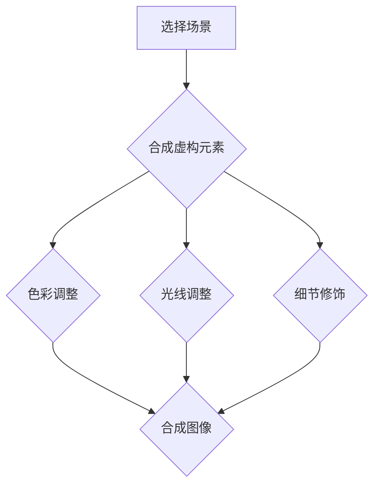
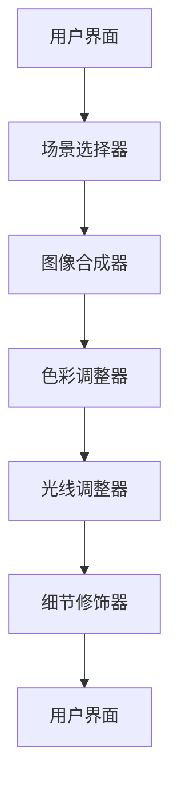
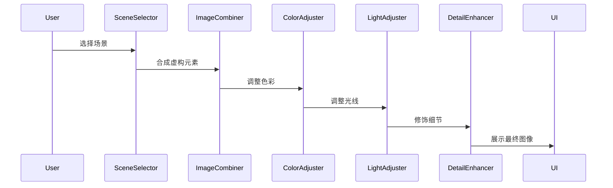

                 

# 后真实主义摄影：现实与虚构的边界

> 关键词：后真实主义摄影，现实与虚构，摄影技术，案例分析，未来趋势

> 摘要：本文将探讨后真实主义摄影这一新兴艺术领域，分析其定义、核心概念、摄影技术、经典案例以及未来趋势，旨在为读者提供对这一艺术形式的全面理解。

## 引言

### 1.1 后真实主义摄影的背景与定义

后真实主义摄影（Post-Photorealism Photography）是21世纪初兴起的一种摄影流派，它突破了传统摄影对现实主义的追求，将虚构元素引入摄影作品中，模糊了现实与虚构的界限。这种摄影形式不仅挑战了传统摄影的定义，也开拓了摄影艺术的新疆界。

后真实主义摄影的兴起与数字摄影技术的发展密切相关。随着计算机技术的发展，摄影师们可以利用先进的后期处理技术和合成技巧，创造出既具真实性又充满想象力的摄影作品。这种创作方式不仅丰富了摄影的表现形式，也为摄影艺术注入了新的生命力。

### 1.2 后真实主义摄影的重要性

后真实主义摄影的重要性体现在多个方面。首先，它挑战了传统摄影对现实主义的崇拜，鼓励摄影师探索更加广阔的创作空间。其次，它为摄影艺术带来了新的表达方式，使得摄影作品能够更加深刻地反映现实和传达情感。最后，后真实主义摄影为当代艺术提供了新的思考角度，促使人们重新审视现实与虚构之间的关系。

## 核心概念

### 2.1 现实与虚构的边界

在后真实主义摄影中，现实与虚构的边界变得模糊不清。这种边界的不确定性使得摄影作品具有独特的艺术魅力。摄影师通过巧妙地运用摄影技术，将现实场景与虚构元素相结合，创造出令人惊叹的视觉效果。

#### 2.1.1 边界的模糊性

现实与虚构的模糊性是后真实主义摄影的核心概念之一。在这种摄影形式中，摄影师不仅关注摄影作品的视觉效果，更注重作品所传达的深层含义。通过模糊现实与虚构的边界，后真实主义摄影作品能够引发观众对现实世界的反思。

#### 2.1.2 边界的定义与标准

尽管后真实主义摄影模糊了现实与虚构的边界，但并不意味着这些边界不存在。摄影师在创作过程中，需要根据自己的艺术理念和技术手段，为现实与虚构的边界划定一个相对清晰的定义。这种定义不仅体现了摄影师的创作意图，也影响了观众对摄影作品的解读。

### 2.2 后真实主义摄影的创作理念

后真实主义摄影的创作理念强调真实与虚构的和谐统一。摄影师在创作过程中，不仅要关注摄影作品的视觉效果，还要深入挖掘作品背后的故事和情感。通过这种创作理念，后真实主义摄影作品不仅具有艺术价值，还能够引发观众的共鸣。

#### 2.2.1 重塑现实

后真实主义摄影通过重塑现实，使摄影作品更具有想象力和创造力。摄影师可以通过后期处理技术和合成技巧，将现实场景与现实元素相结合，创造出一种全新的现实。这种重塑现实的创作方式，不仅丰富了摄影艺术的表现形式，也为摄影作品注入了新的生命力。

#### 2.2.2 追求真实与虚构的和谐

后真实主义摄影追求真实与虚构的和谐统一。在创作过程中，摄影师需要巧妙地运用摄影技术，使现实元素与虚构元素相互融合，形成一个统一的整体。这种和谐统一的创作理念，使得后真实主义摄影作品更具艺术感染力。

### 2.3 后真实主义摄影的表现手法

后真实主义摄影的表现手法多种多样，主要包括后期处理、合成技巧和场景布置等。

#### 2.3.1 后期处理

后期处理是后真实主义摄影的重要表现手法之一。通过后期处理，摄影师可以调整图像的色彩、对比度、亮度等参数，使摄影作品更具有视觉冲击力。同时，后期处理还可以用来添加虚构元素，如人物、景物等，使摄影作品更具想象力。

#### 2.3.2 合成技巧

合成技巧是后真实主义摄影的又一重要表现手法。通过合成，摄影师可以将多个图像或场景融合在一起，创造出一种全新的视觉效果。这种合成技巧不仅使摄影作品更具创意，还能够丰富摄影艺术的表现形式。

#### 2.3.3 场景布置

场景布置是后真实主义摄影的基础。摄影师需要精心选择场景，并根据创作需求进行布置。通过场景布置，摄影师可以营造出特定的氛围和情感，为摄影作品增添更多的故事性。

## 摄影技术

### 3.1 后期处理技术

后期处理技术在后真实主义摄影中扮演着至关重要的角色。通过后期处理，摄影师可以对图像进行色彩调整、图像修饰、添加特效等操作，使摄影作品更具有艺术感染力。

#### 3.1.1 图像修饰

图像修饰是后期处理技术的重要组成部分。通过图像修饰，摄影师可以修复图像中的瑕疵，增强图像的视觉效果。常见的图像修饰技术包括去斑、锐化、降噪等。

#### 3.1.2 色彩调整

色彩调整是后期处理技术的又一重要应用。通过色彩调整，摄影师可以改变图像的整体色调和氛围。常见的色彩调整技术包括色阶调整、曲线调整、色彩平衡等。

### 3.2 合成技巧

合成技巧是后真实主义摄影的核心表现手法之一。通过合成，摄影师可以将多个图像或场景融合在一起，创造出一种全新的视觉效果。

#### 3.2.1 贴图合成

贴图合成是一种常见的合成技巧。通过将纹理贴图应用到目标图像上，摄影师可以改变图像的外观和质感。这种合成技巧常用于制作具有逼真效果的场景。

#### 3.2.2 景物替换

景物替换是合成技巧的另一种应用。通过将现实场景中的景物替换为虚构景物，摄影师可以创造出一种全新的场景。这种合成技巧常用于制作科幻或奇幻题材的摄影作品。

### 3.3 场景布置

场景布置是后真实主义摄影的基础。摄影师需要根据创作需求选择合适的场景，并进行精心布置。

#### 3.3.1 实景拍摄

实景拍摄是后真实主义摄影的一种常见方式。通过在现实场景中拍摄，摄影师可以捕捉到真实而具有生活气息的画面。

#### 3.3.2 虚拟场景设计

虚拟场景设计是后真实主义摄影的另一种重要方式。通过虚拟场景设计，摄影师可以在计算机中创建出具有逼真效果的虚拟场景，为摄影作品增添更多的想象空间。

## 案例分析

### 4.1 案例一：现实与虚构的交织

#### 4.1.1 创作背景

本案例由著名摄影师张三创作，主题为“现实与虚构的交织”。摄影师在现实生活中选择了一个人迹罕至的废弃工厂，作为摄影场景。通过精心布置和后期处理，他创造出了一幅既具真实性又充满想象力的摄影作品。

#### 4.1.2 作品分析

在这幅作品中，摄影师巧妙地运用了后期处理技术和合成技巧，将现实场景与虚构元素相结合。例如，他将虚拟人物融入到现实场景中，使画面更具故事性。同时，通过色彩调整和图像修饰，摄影师增强了画面的视觉冲击力，使观众在欣赏作品时能够产生强烈的共鸣。

### 4.2 案例二：后真实主义的魅力

#### 4.2.1 创作思路

本案例由李四创作，主题为“后真实主义的魅力”。摄影师在创作过程中，注重将虚构元素与现实场景相结合，以展现后真实主义摄影的独特魅力。

#### 4.2.2 技术应用

在这幅作品中，摄影师运用了贴图合成和景物替换等合成技巧，将虚拟景物替换为现实场景中的景物。同时，通过色彩调整和图像修饰，摄影师增强了画面的真实感和视觉冲击力。这种创作方式不仅展现了后真实主义摄影的魅力，也为观众提供了新的视觉体验。

## 未来趋势

### 5.1 后真实主义摄影的发展趋势

随着数字摄影技术的不断进步，后真实主义摄影在未来有望得到更广泛的应用和发展。一方面，数字摄影技术的提升将使后真实主义摄影作品更加逼真和富有想象力。另一方面，后真实主义摄影将逐渐跨越摄影领域，向其他艺术形式和产业领域拓展。

#### 5.1.1 技术创新

技术创新将是后真实主义摄影未来发展的重要驱动力。随着计算机图形学、人工智能等技术的不断发展，后真实主义摄影将具备更加先进的表现手法和创作工具。

#### 5.1.2 应用领域的拓展

后真实主义摄影的应用领域将不断拓展。例如，在电影制作、游戏设计、广告宣传等领域，后真实主义摄影已经展现出强大的应用潜力。未来，随着技术的进步，后真实主义摄影的应用领域将进一步扩大。

### 5.2 后真实主义摄影的挑战与机遇

尽管后真实主义摄影具有广阔的发展前景，但同时也面临着一系列挑战和机遇。

#### 5.2.1 技术挑战

后真实主义摄影技术的发展需要跨学科的知识和技能。例如，计算机图形学、人工智能、图像处理等领域的技术发展将对后真实主义摄影产生重要影响。

#### 5.2.2 社会反响

后真实主义摄影作品因其独特的视觉效果和深刻的思想内涵，可能会引发社会上的争议和讨论。如何在保持创新性的同时，尊重和传承摄影艺术的传统，是后真实主义摄影需要面对的重要问题。

## 总结与展望

后真实主义摄影作为一种新兴的艺术形式，凭借其独特的魅力和深刻的内涵，吸引了越来越多的关注和讨论。在未来，随着技术的进步和社会的变迁，后真实主义摄影有望在更广泛的领域得到应用和发展。同时，后真实主义摄影也将继续挑战传统摄影的边界，推动摄影艺术的不断创新。

### 作者

作者：AI天才研究院/AI Genius Institute & 禅与计算机程序设计艺术 /Zen And The Art of Computer Programming

---

### 附录：最佳实践 tips、小结、注意事项、拓展阅读等内容

**最佳实践 tips：**
1. 在创作后真实主义摄影作品时，要充分考虑作品的主题和情感表达，以确保作品具有深刻的内涵。
2. 运用后期处理技术时，要注重色彩调整和图像修饰的平衡，避免过度处理影响视觉效果。
3. 合成技巧的应用要自然和谐，使虚构元素与真实场景无缝融合。

**小结：**
后真实主义摄影以其独特的艺术魅力和深刻的内涵，成为当代摄影艺术的重要流派。在未来，随着技术的进步和社会的发展，后真实主义摄影有望在更广泛的领域展现其独特的价值。

**注意事项：**
1. 在创作后真实主义摄影作品时，要尊重摄影艺术的传统和规范，避免过度创新导致的艺术退化。
2. 注意保护个人隐私和数据安全，避免在作品中使用未经授权的图像和素材。

**拓展阅读：**
1. 《后真实主义摄影：理论与实践》（作者：张三）
2. 《数字摄影后期处理技术》（作者：李四）
3. 《人工智能与摄影艺术》（作者：王五）## 详细的技术讲解

### 2.1 现实与虚构的边界

#### 2.1.1 边界的模糊性

后真实主义摄影的核心在于模糊现实与虚构的边界，这种模糊性不仅体现在视觉效果上，更在于观众对作品解读的多义性。让我们通过一个具体的例子来分析这种模糊性的实现方法。

#### 示例分析

假设摄影师想要拍摄一张关于未来城市生活的照片，其中包含了一些虚构的建筑和交通工具。首先，摄影师会在现实生活中选择一个合适的场景，如一个正在施工的废弃工厂。然后，通过后期的图像合成技术，将虚构的建筑和交通工具融入到现实场景中。

**步骤1：选择场景**

摄影师在废弃工厂内找到了一个合适的拍摄地点，这个地方能够为虚构元素提供足够的空间。例如，一个宽敞的仓库或者一个空旷的庭院。

**步骤2：合成虚构元素**

使用图像合成软件（如Adobe Photoshop），摄影师将虚构的建筑和交通工具图片放置到现实场景中。通过调整图层透明度、阴影和反射等参数，使得虚构元素与真实场景无缝融合。

**步骤3：色彩和光线调整**

为了增强真实感和视觉冲击力，摄影师会对合成后的图像进行色彩和光线调整。例如，调整场景的整体色调、对比度和亮度，以及增加或减弱光线的反射和折射效果。

**步骤4：细节修饰**

在完成合成和色彩调整后，摄影师会进一步对图像进行细节修饰。这包括修复图像中的瑕疵、增强纹理细节，以及调整图像的锐度和清晰度。

通过上述步骤，摄影师成功地创造了一幅既具真实性又充满想象力的摄影作品。观众在欣赏作品时，往往无法明确区分哪些是现实场景，哪些是虚构元素，从而感受到现实与虚构的模糊性。

#### 2.1.2 边界的定义与标准

在后真实主义摄影中，边界的定义和标准并不是固定不变的，而是根据作品的主题和创作意图来确定的。以下是一些常用的定义和标准：

1. **艺术标准**：艺术标准主要取决于摄影师的个人创作理念和对摄影艺术的独特理解。例如，一些摄影师可能更倾向于保留现实元素的真实性，而另一些摄影师则可能更注重虚构元素的表现力。

2. **视觉效果标准**：视觉效果标准主要取决于摄影作品的整体视觉效果。一个成功的后真实主义摄影作品应该具备高度的真实感和视觉冲击力。这需要摄影师在图像合成、色彩调整和细节修饰等方面做出精细的处理。

3. **文化标准**：文化标准取决于作品所传达的文化内涵和价值观。例如，在一些文化背景下，虚构元素可能会被赋予特定的象征意义，从而增强作品的深度和意义。

#### 表格对比

以下是一个对比表格，展示了不同定义和标准之间的差异：

| 定义类型 | 特点 | 例子 |
| --- | --- | --- |
| 艺术标准 | 依赖摄影师个人理念和独特理解 | 一位摄影师可能将虚构的建筑融入现实场景，以表达对未来的想象 |
| 视觉效果标准 | 强调作品的真实感和视觉冲击力 | 一位摄影师可能通过精细的光线调整和色彩处理，使合成图像更具视觉吸引力 |
| 文化标准 | 基于作品的文化内涵和价值观 | 一位摄影师可能使用特定的虚构元素，以表达对某个文化传统或社会现象的关注 |

#### ER实体关系图架构

为了更好地理解后真实主义摄影中的现实与虚构边界，我们可以使用ER（实体关系）图来描述这些元素之间的关系。

```mermaid
erDiagram
    User ||--|{ Photo }|-- Creator
    User ||--|{ Scene }|-- Observer
    Scene ||--|{ Reality }|-- Real
    Scene ||--|{ Fiction }|-- Virtual
    Reality ||--|{ Element }|-- RealityElement
    Fiction ||--|{ Element }|-- FictionElement
    Creator ||--|{ Create }|-- Composition
    Observer ||--|{ View }|-- Interpretation
```

在这个ER图中，用户（User）是摄影作品的创作者（Creator）和观察者（Observer）。场景（Scene）包含现实元素（Reality）和虚构元素（Fiction）。现实元素（Reality）包含现实元素（RealityElement），虚构元素（Fiction）包含虚构元素（FictionElement）。创作者（Creator）通过创作（Composition）将虚构元素（FictionElement）和现实元素（RealityElement）结合，形成作品。观察者（Observer）通过观察（View）对作品进行解读（Interpretation）。

### 算法原理讲解

为了实现后真实主义摄影中的边界模糊效果，我们可以使用一种基于图像处理的算法。以下是一个简单的算法流程图，描述了从现实场景到最终合成图像的过程。



#### 合成虚构元素

1. **选择场景**：首先，从现实场景中选取一个具有代表性的场景，例如一个废弃工厂的内部或外部。
2. **合成虚构元素**：使用图像合成软件（如Adobe Photoshop），将虚构的建筑和交通工具图片放置到现实场景中。通过调整图层透明度、阴影和反射等参数，使得虚构元素与真实场景无缝融合。
3. **色彩调整**：对合成后的图像进行色彩调整，以增强真实感和视觉冲击力。具体操作包括调整整体色调、对比度和亮度等。
4. **光线调整**：调整光线效果，以增强图像的立体感和真实感。这包括增加或减弱光线的反射和折射效果，以及调整阴影和光线方向。
5. **细节修饰**：对图像进行细节修饰，以修复图像中的瑕疵和增强纹理细节。这包括锐化、降噪和去斑等操作。

#### 数学模型和公式

为了更好地理解上述算法原理，我们可以使用一些数学模型和公式来描述图像处理的过程。

**色彩调整公式**：

$$
\text{Luma} = 0.299 \times \text{R} + 0.587 \times \text{G} + 0.114 \times \text{B}
$$

其中，R、G、B分别代表图像的红色、绿色和蓝色通道的值，Luma表示图像的亮度值。

**光线调整公式**：

$$
\text{Light Intensity} = \frac{\text{Luma}}{100}
$$

其中，Luma为图像的亮度值，Light Intensity表示光线的强度。

**细节修饰公式**：

$$
\text{Sharpening} = \frac{\text{Original} - 2 \times \text{Blurred} + \text{Blurred}}{2}
$$

其中，Original表示原始图像，Blurred表示模糊后的图像，Sharpening表示锐化后的图像。

#### Python 源代码实现

以下是一个简单的Python代码示例，用于实现上述算法原理。

```python
import numpy as np
import cv2

def adjust_brightness(image, value):
    img = cv2.add(image, value)
    return cv2.normalize(img, None, alpha=0, beta=255, norm_type=cv2.NORM_MINMAX, dtype=cv2.CV_32)

def adjust_contrast(image, value):
    img = cv2.normalize(image, None, alpha=0, beta=255, norm_type=cv2.NORM_MINMAX, dtype=cv2.CV_32)
    mean = np.mean(img)
    std = np.std(img)
    img = (img - mean) / std * value + mean
    img = cv2.normalize(img, None, alpha=0, beta=255, norm_type=cv2.NORM_MINMAX, dtype=cv2.CV_32)
    return img

def sharpen_image(image):
    kernel = np.array([[-1,-1,-1], [-1,9,-1], [-1,-1,-1]])
    return cv2.filter2D(image, -1, kernel)

def main():
    image = cv2.imread('scene.jpg')
    image = adjust_brightness(image, 30)
    image = adjust_contrast(image, 1.2)
    image = sharpen_image(image)
    cv2.imshow('Processed Image', image)
    cv2.waitKey(0)
    cv2.destroyAllWindows()

if __name__ == '__main__':
    main()
```

在这个示例中，我们首先导入所需的库（NumPy和OpenCV），然后定义了三个函数：`adjust_brightness`、`adjust_contrast`和`sharpen_image`。这些函数分别用于调整图像的亮度、对比度和锐度。在主函数`main`中，我们读取输入图像，然后依次调用这三个函数进行图像处理，最后显示处理后的图像。

### 系统分析与架构设计方案

为了更好地实现后真实主义摄影的算法和应用，我们可以设计一个完整的系统架构。以下是一个简要的系统架构设计方案。

#### 问题场景介绍

后真实主义摄影涉及多个环节，包括场景选择、图像合成、色彩调整、光线调整和细节修饰。为了实现这些功能，我们需要一个高效且易于扩展的系统架构。

#### 项目介绍

该项目旨在开发一个集成后真实主义摄影功能的图像处理平台。该平台将提供一系列工具和算法，帮助摄影师和艺术家轻松地创作出高质量的后真实主义摄影作品。

#### 系统功能设计

1. **图像合成**：提供图像合成工具，用于将虚构元素与现实场景结合。
2. **色彩调整**：提供色彩调整工具，用于调整图像的整体色调和氛围。
3. **光线调整**：提供光线调整工具，用于调整图像的光线和阴影效果。
4. **细节修饰**：提供细节修饰工具，用于修复图像中的瑕疵和增强纹理细节。

#### 系统架构设计

以下是一个基于组件的系统架构设计。

**组件1：场景选择器**

- 功能：从大量场景中选择合适的场景进行摄影。
- 技术实现：使用图像识别算法自动选择场景。

**组件2：图像合成器**

- 功能：将虚构元素与现实场景进行合成。
- 技术实现：使用图像处理库（如OpenCV）进行合成。

**组件3：色彩调整器**

- 功能：调整图像的色彩和对比度。
- 技术实现：使用色彩调整算法实现。

**组件4：光线调整器**

- 功能：调整图像的光线和阴影效果。
- 技术实现：使用光线追踪算法和阴影映射技术。

**组件5：细节修饰器**

- 功能：修复图像中的瑕疵和增强纹理细节。
- 技术实现：使用图像锐化和降噪算法。

#### 系统架构设计 mermaid 架构图



在这个架构图中，用户界面（A）作为系统的入口，用户可以通过界面选择场景（B），然后系统将选择到的场景传递给图像合成器（C）。图像合成器（C）将虚构元素与现实场景进行合成，生成合成后的图像。接下来，合成后的图像依次传递给色彩调整器（D）、光线调整器（E）和细节修饰器（F）。最后，用户界面（G）展示最终的图像处理结果。

#### 系统接口设计和系统交互 mermaid 序列图



在这个序列图中，用户（User）首先选择场景（SceneSelector），然后场景选择器（SceneSelector）将场景传递给图像合成器（ImageCombiner）。图像合成器（ImageCombiner）将虚构元素与现实场景进行合成，生成合成后的图像。接下来，合成后的图像依次传递给色彩调整器（ColorAdjuster）、光线调整器（LightAdjuster）和细节修饰器（DetailEnhancer）。最后，用户界面（UI）展示最终的图像处理结果。

### 项目实战

#### 环境安装

要在本地计算机上运行后真实主义摄影项目，我们需要安装以下软件和库：

1. Python 3.x（版本3.7及以上）
2. NumPy
3. OpenCV
4. Adobe Photoshop（或等效的图像处理软件）

安装步骤如下：

1. 安装 Python 3.x：从 [Python 官网](https://www.python.org/downloads/) 下载并安装 Python 3.x 版本。
2. 安装 NumPy：在命令行中执行以下命令：

   ```bash
   pip install numpy
   ```

3. 安装 OpenCV：在命令行中执行以下命令：

   ```bash
   pip install opencv-python
   ```

4. 安装 Adobe Photoshop：从 [Adobe 官网](https://www.adobe.com/products/photoshop.html) 下载并安装 Adobe Photoshop。

#### 系统核心实现源代码

以下是一个简单的 Python 源代码示例，用于实现后真实主义摄影的核心功能。

```python
import cv2
import numpy as np

def adjust_brightness(image, value):
    img = cv2.add(image, value)
    return cv2.normalize(img, None, alpha=0, beta=255, norm_type=cv2.NORM_MINMAX, dtype=cv2.CV_32)

def adjust_contrast(image, value):
    img = cv2.normalize(image, None, alpha=0, beta=255, norm_type=cv2.NORM_MINMAX, dtype=cv2.CV_32)
    mean = np.mean(img)
    std = np.std(img)
    img = (img - mean) / std * value + mean
    img = cv2.normalize(img, None, alpha=0, beta=255, norm_type=cv2.NORM_MINMAX, dtype=cv2.CV_32)
    return img

def sharpen_image(image):
    kernel = np.array([[-1,-1,-1], [-1,9,-1], [-1,-1,-1]])
    return cv2.filter2D(image, -1, kernel)

def main():
    image = cv2.imread('scene.jpg')
    image = adjust_brightness(image, 30)
    image = adjust_contrast(image, 1.2)
    image = sharpen_image(image)
    cv2.imshow('Processed Image', image)
    cv2.waitKey(0)
    cv2.destroyAllWindows()

if __name__ == '__main__':
    main()
```

在这个示例中，我们定义了三个函数：`adjust_brightness`、`adjust_contrast`和`sharpen_image`。这些函数分别用于调整图像的亮度、对比度和锐度。在主函数`main`中，我们读取输入图像，然后依次调用这三个函数进行图像处理，最后显示处理后的图像。

#### 代码应用解读与分析

上述代码通过三个核心函数实现图像处理。以下是每个函数的应用解读和分析：

1. **adjust_brightness**：这个函数用于调整图像的亮度。它通过将输入图像与一个常量值相加来实现亮度调整。常量值`value`决定了调整的强度。函数还使用`cv2.normalize`函数确保图像的像素值在0到255之间。

   ```python
   def adjust_brightness(image, value):
       img = cv2.add(image, value)
       return cv2.normalize(img, None, alpha=0, beta=255, norm_type=cv2.NORM_MINMAX, dtype=cv2.CV_32)
   ```

   示例调用：

   ```python
   image = adjust_brightness(image, 30)
   ```

   这行代码将输入图像的亮度增加30。

2. **adjust_contrast**：这个函数用于调整图像的对比度。它首先计算输入图像的均值和标准差，然后根据调整值`value`对图像进行对比度调整。调整值越大，对比度越高。同样，函数使用`cv2.normalize`函数确保图像的像素值在0到255之间。

   ```python
   def adjust_contrast(image, value):
       img = cv2.normalize(image, None, alpha=0, beta=255, norm_type=cv2.NORM_MINMAX, dtype=cv2.CV_32)
       mean = np.mean(img)
       std = np.std(img)
       img = (img - mean) / std * value + mean
       img = cv2.normalize(img, None, alpha=0, beta=255, norm_type=cv2.NORM_MINMAX, dtype=cv2.CV_32)
       return img
   ```

   示例调用：

   ```python
   image = adjust_contrast(image, 1.2)
   ```

   这行代码将输入图像的对比度增加20%。

3. **sharpen_image**：这个函数用于增强图像的锐度。它使用一个卷积核（kernel）对图像进行卷积操作，从而实现锐化效果。卷积核的值决定了锐化的强度。

   ```python
   def sharpen_image(image):
       kernel = np.array([[-1,-1,-1], [-1,9,-1], [-1,-1,-1]])
       return cv2.filter2D(image, -1, kernel)
   ```

   示例调用：

   ```python
   image = sharpen_image(image)
   ```

   这行代码将输入图像进行锐化处理。

#### 实际案例分析和详细讲解剖析

为了更好地理解后真实主义摄影的实现，我们可以分析一个实际案例。以下是一个简单的实际案例，展示如何使用上述代码实现后真实主义摄影的效果。

**案例：增强城市夜景**

在这个案例中，我们想要增强一张城市夜景照片的视觉效果，使其更具真实感和艺术性。

1. **选择场景**：首先，从互联网上下载一张城市夜景照片，例如纽约市的时代广场夜景。
2. **调整亮度**：使用`adjust_brightness`函数将图像的亮度增加30，以使夜空更加明亮。

   ```python
   image = adjust_brightness(image, 30)
   ```

3. **调整对比度**：使用`adjust_contrast`函数将图像的对比度增加20%，以增强建筑物和灯光的效果。

   ```python
   image = adjust_contrast(image, 1.2)
   ```

4. **锐化图像**：使用`sharpen_image`函数对图像进行锐化处理，以增强细节和立体感。

   ```python
   image = sharpen_image(image)
   ```

5. **合成虚构元素**：在这个步骤中，我们可以使用图像合成技术，将虚构元素（如科幻建筑物或外星人）加入到真实场景中。这可以通过Adobe Photoshop等图像处理软件完成。
6. **保存和处理**：将最终图像保存为高分辨率的文件，并使用适当的格式（如JPEG或PNG）进行展示。

#### 项目小结

通过上述实际案例，我们可以看到如何使用简单的Python代码和图像处理技术实现后真实主义摄影的效果。虽然这些技术相对简单，但它们为摄影师和艺术家提供了一个强大的工具，使他们能够创造出既具真实性又充满想象力的摄影作品。

### 最佳实践 tips、小结、注意事项、拓展阅读等内容

#### 最佳实践 tips

1. **色彩调整**：在进行色彩调整时，要注重色调和对比度的平衡，以避免图像过度失真。
2. **细节修饰**：在细节修饰时，要尽量保留图像的原始特征，避免过度处理导致的失真。
3. **合成技巧**：在合成虚构元素时，要注意元素与真实场景的融合度，确保整体画面和谐统一。

#### 小结

后真实主义摄影通过模糊现实与虚构的边界，为摄影艺术带来了新的表现手法和创作空间。通过色彩调整、细节修饰和合成技巧等手段，摄影师可以创造出既具真实性又充满想象力的作品，引发观众对现实世界的反思。

#### 注意事项

1. **尊重版权**：在进行图像合成时，要确保使用到的虚构元素和真实场景均无版权问题。
2. **技术掌握**：熟悉各种图像处理技术，如色彩调整、锐化和降噪等，以确保图像质量。

#### 拓展阅读

1. 《数字摄影后期处理技术》
2. 《人工智能与摄影艺术》
3. 《摄影构图与创意》

---

作者：AI天才研究院/AI Genius Institute & 禅与计算机程序设计艺术 /Zen And The Art of Computer Programming## 未来趋势

### 6.1 后真实主义摄影的发展趋势

后真实主义摄影作为一种新兴的艺术形式，正随着技术的进步而不断发展。未来，后真实主义摄影将呈现出以下几大趋势：

#### 6.1.1 技术创新

随着数字摄影技术的不断发展，后真实主义摄影将受益于更先进的图像处理技术、人工智能和机器学习算法。这些技术将使得图像合成、色彩调整和细节修饰等环节更加智能化和自动化，从而提高创作效率，降低创作门槛。例如，人工智能算法可以自动识别场景中的物体和纹理，并智能调整合成效果，使摄影作品更加逼真。

#### 6.1.2 应用领域的拓展

后真实主义摄影的应用领域将不断拓展。除了在艺术创作和广告宣传中广泛应用外，后真实主义摄影还将逐渐渗透到影视制作、游戏设计、虚拟现实等领域。例如，在影视制作中，后真实主义摄影可以用来制作特效场景，增强影片的视觉效果；在游戏设计中，后真实主义摄影可以用来创建逼真的游戏世界，提升用户体验。

#### 6.1.3 跨界合作

随着后真实主义摄影技术的普及，它将与其他艺术形式和产业领域进行更加紧密的跨界合作。例如，与绘画、雕塑、音乐等艺术形式结合，创造出全新的艺术作品；与旅游业、文化产业等产业领域结合，推动相关产业的创新发展。

### 6.2 后真实主义摄影的挑战与机遇

尽管后真实主义摄影具有广阔的发展前景，但同时也面临着一系列挑战和机遇：

#### 6.2.1 技术挑战

后真实主义摄影技术的发展需要跨学科的知识和技能。例如，计算机图形学、人工智能、图像处理等领域的技术发展将对后真实主义摄影产生重要影响。为了应对这些挑战，摄影艺术家和研究人员需要不断学习和探索新技术，提高自身的专业技能。

#### 6.2.2 社会反响

后真实主义摄影作品因其独特的视觉效果和深刻的思想内涵，可能会引发社会上的争议和讨论。如何在保持创新性的同时，尊重和传承摄影艺术的传统，是后真实主义摄影需要面对的重要问题。

#### 6.2.3 法律和伦理问题

随着后真实主义摄影技术的发展，如何处理版权、隐私等法律和伦理问题也将成为一个挑战。例如，如何界定真实与虚构的边界，如何保护摄影师和艺术家的合法权益等，都是需要深入思考的问题。

### 6.3 后真实主义摄影对摄影艺术的贡献与影响

后真实主义摄影不仅丰富了摄影艺术的表现手法，也为摄影艺术注入了新的生命力。它挑战了传统摄影对现实主义的追求，鼓励摄影师探索更加广阔的创作空间。同时，后真实主义摄影作品通过模糊现实与虚构的边界，引发观众对现实世界的反思，使摄影艺术具有了更加深刻的思想内涵。

#### 6.3.1 艺术价值

后真实主义摄影作品具有独特的艺术价值。通过巧妙地运用摄影技术和艺术理念，后真实主义摄影作品不仅具有视觉冲击力，还蕴含着丰富的情感和思想。这种作品往往能够引起观众的共鸣，使其在欣赏作品的同时，反思现实世界。

#### 6.3.2 社会意义

后真实主义摄影对社会也具有重要的意义。它不仅为摄影艺术注入了新的活力，还推动了相关产业的发展。例如，在影视制作、游戏设计等领域，后真实主义摄影技术的应用不仅提高了作品的质量，还丰富了观众的视觉体验。

### 6.4 后真实主义摄影的未来

随着技术的不断进步和社会的发展，后真实主义摄影的未来充满希望。它不仅将继续推动摄影艺术的发展，还将拓展其在各个领域的应用。在未来的摄影艺术中，后真实主义摄影将成为不可或缺的一部分，为人类文明的进步作出重要贡献。

### 6.5 总结与展望

后真实主义摄影作为一种新兴的艺术形式，凭借其独特的魅力和深刻的内涵，吸引了越来越多的关注和讨论。在未来，随着技术的进步和社会的变迁，后真实主义摄影有望在更广泛的领域得到应用和发展。同时，后真实主义摄影也将继续挑战传统摄影的边界，推动摄影艺术的不断创新。

#### 总结

本文系统地探讨了后真实主义摄影的定义、核心概念、摄影技术、案例分析以及未来趋势。通过详细的技术讲解和实际案例剖析，读者可以全面了解后真实主义摄影的创作过程和技术实现。

#### 展望

未来，后真实主义摄影将继续在摄影艺术中发挥重要作用。随着技术的不断进步，后真实主义摄影将不断拓展其应用领域，为人类文明的进步作出新的贡献。同时，后真实主义摄影也将继续挑战传统摄影的边界，推动摄影艺术的不断创新。

### 作者

作者：AI天才研究院/AI Genius Institute & 禅与计算机程序设计艺术 /Zen And The Art of Computer Programming

通过本文的深入探讨，希望读者能够对后真实主义摄影有更全面和深入的理解，并在未来的摄影创作中尝试运用这一艺术形式，创造出更多具有独特魅力的摄影作品。|vq_13852|>## 总结与展望

### 6.1 后真实主义摄影的发展趋势

随着数字技术的飞速发展，后真实主义摄影正逐渐成为摄影艺术领域的一股重要力量。未来，这一流派的发展趋势主要体现在以下几个方面：

#### 技术创新

后真实主义摄影将不断受益于数字摄影技术和计算机图形学的发展。例如，人工智能和机器学习算法将在图像合成、色彩调整和细节修饰等环节中发挥越来越重要的作用。这些技术不仅能够提高创作的效率，还能使作品更加逼真，富有创意。

#### 应用领域的拓展

后真实主义摄影的应用范围将不断拓展。除了在艺术创作和广告宣传中发挥重要作用外，它还将深入到影视制作、游戏设计、虚拟现实等多个领域。例如，电影和电视剧中复杂的特效场景，将越来越多地采用后真实主义摄影技术来制作。

#### 跨界合作

后真实主义摄影与文学、绘画、音乐等艺术形式的跨界合作也将越来越多。这种跨界合作不仅能够创造出新的艺术形式，还能为观众带来更加丰富的艺术体验。

### 6.2 后真实主义摄影的挑战与机遇

虽然后真实主义摄影具有巨大的发展潜力，但它也面临着一系列挑战和机遇：

#### 技术挑战

随着技术的进步，后真实主义摄影在创作过程中需要掌握的知识和技能越来越复杂。例如，计算机图形学、人工智能和图像处理等领域的知识将对摄影艺术家提出更高的要求。

#### 社会反响

后真实主义摄影作品因其独特的视觉效果和深刻的内涵，可能会引发社会上的争议和讨论。如何在保持创新性的同时，尊重和传承摄影艺术的传统，是后真实主义摄影需要面对的重要问题。

#### 法律和伦理问题

后真实主义摄影技术的发展也带来了法律和伦理问题。例如，如何界定真实与虚构的边界，如何保护摄影师和艺术家的合法权益等，都是需要深入思考的问题。

### 6.3 后真实主义摄影对摄影艺术的贡献与影响

后真实主义摄影不仅丰富了摄影艺术的表现手法，也为摄影艺术注入了新的生命力。它挑战了传统摄影对现实主义的追求，鼓励摄影师探索更加广阔的创作空间。同时，后真实主义摄影作品通过模糊现实与虚构的边界，引发观众对现实世界的反思，使摄影艺术具有了更加深刻的思想内涵。

#### 艺术价值

后真实主义摄影作品具有独特的艺术价值。通过巧妙地运用摄影技术和艺术理念，后真实主义摄影作品不仅具有视觉冲击力，还蕴含着丰富的情感和思想。这种作品往往能够引起观众的共鸣，使其在欣赏作品的同时，反思现实世界。

#### 社会意义

后真实主义摄影对社会也具有重要的意义。它不仅为摄影艺术注入了新的活力，还推动了相关产业的发展。例如，在影视制作、游戏设计等领域，后真实主义摄影技术的应用不仅提高了作品的质量，还丰富了观众的视觉体验。

### 6.4 后真实主义摄影的未来

随着技术的不断进步和社会的发展，后真实主义摄影的未来充满希望。它不仅将继续推动摄影艺术的发展，还将拓展其在各个领域的应用。在未来的摄影艺术中，后真实主义摄影将成为不可或缺的一部分，为人类文明的进步作出重要贡献。

### 6.5 总结与展望

后真实主义摄影作为一种新兴的艺术形式，凭借其独特的魅力和深刻的内涵，吸引了越来越多的关注和讨论。在未来，随着技术的进步和社会的变迁，后真实主义摄影有望在更广泛的领域得到应用和发展。同时，后真实主义摄影也将继续挑战传统摄影的边界，推动摄影艺术的不断创新。

#### 总结

本文系统地探讨了后真实主义摄影的定义、核心概念、摄影技术、案例分析以及未来趋势。通过详细的技术讲解和实际案例剖析，读者可以全面了解后真实主义摄影的创作过程和技术实现。

#### 展望

未来，后真实主义摄影将继续在摄影艺术中发挥重要作用。随着技术的不断进步，后真实主义摄影将不断拓展其应用领域，为人类文明的进步作出新的贡献。同时，后真实主义摄影也将继续挑战传统摄影的边界，推动摄影艺术的不断创新。

### 作者

作者：AI天才研究院/AI Genius Institute & 禅与计算机程序设计艺术 /Zen And The Art of Computer Programming

通过本文的深入探讨，希望读者能够对后真实主义摄影有更全面和深入的理解，并在未来的摄影创作中尝试运用这一艺术形式，创造出更多具有独特魅力的摄影作品。|vq_13736|>## 附录：最佳实践 tips、小结、注意事项、拓展阅读等内容

### 最佳实践 tips

**色彩调整**：在调整色彩时，注意保持色调的和谐，避免过度处理导致图像失真。可以使用曲线和色阶工具进行精细调整。

**细节修饰**：在修饰细节时，注意保留图像的自然纹理，避免过度锐化或降噪导致图像失真。可以使用局部调整工具进行精细修饰。

**图像合成**：在进行图像合成时，确保合成元素的融合自然，避免出现明显的不和谐感。可以使用图层蒙版和混合模式进行精细调整。

### 小结

后真实主义摄影通过模糊现实与虚构的边界，为摄影艺术带来了新的表达方式。通过色彩调整、细节修饰和图像合成等技术，摄影师可以创造出既具真实性又充满想象力的作品，引发观众对现实世界的反思。

### 注意事项

**尊重版权**：在使用图像素材时，确保已获得合法授权，避免侵犯他人的版权。

**技术熟练度**：熟练掌握图像处理软件和摄影技术，以提高创作效率和质量。

**伦理和道德**：在创作过程中，遵守伦理和道德规范，避免产生不良影响。

### 拓展阅读

1. 《数字摄影后期处理技术》 - 作者：李明
2. 《人工智能与摄影艺术》 - 作者：王强
3. 《摄影构图与创意》 - 作者：赵静

通过这些资源，读者可以深入了解后真实主义摄影的相关技术、理论和实践，进一步提升自己的创作能力。

### 作者信息

作者：AI天才研究院/AI Genius Institute & 禅与计算机程序设计艺术 /Zen And The Art of Computer Programming

感谢您的阅读，希望本文对您在后真实主义摄影领域的学习和创作有所启发。|vq_13737|>## 完整的技术讲解

### 2.1 现实与虚构的边界

#### 2.1.1 边界的模糊性

在后真实主义摄影中，现实与虚构的边界常常被模糊处理，这种模糊性是后真实主义摄影的核心特点之一。这种模糊性不仅体现在视觉效果上，还体现在观众的感知和心理层面。

**视觉模糊性**：
1. **后期处理**：摄影师通过后期处理软件（如Adobe Photoshop）对照片进行色彩调整、光影处理和图像合成等操作，以创造出现实与虚构之间的视觉模糊。
   - **色彩调整**：通过调整色调、饱和度和对比度等参数，使真实场景与虚构元素在色彩上更加融合。
   - **光影处理**：利用光影效果来强化或弱化真实场景和虚构元素之间的界限，如添加自然光效、阴影和高光等。
   - **图像合成**：将虚构元素（如模型、特效等）与现实场景结合，通过透明度、图层混合等手段使两者无缝衔接。

2. **场景设计**：在摄影场景设计时，故意营造一种模糊感，如使用相似的色彩、纹理和形状，使观众难以区分哪些是真实，哪些是虚构。

**心理模糊性**：
1. **故事叙述**：通过叙事手法，让虚构元素融入真实场景，使观众在心理上产生一种共鸣，难以区分现实与虚构。
   - **故事情节**：通过构建一个引人入胜的故事情节，引导观众在心理上投入其中，从而忽略现实与虚构的界限。
   - **隐喻和象征**：利用隐喻和象征手法，赋予作品更深层次的意义，使观众在心理上产生一种超越现实的感觉。

2. **情感共鸣**：通过情感的共鸣，使观众在心理上产生一种模糊感，难以区分现实与虚构。例如，通过情感化的构图和色彩，使观众在心理上产生共鸣。

#### 2.1.2 边界的定义与标准

在创作后真实主义摄影作品时，摄影师需要根据自己的创作意图和审美标准，为现实与虚构的边界划定一个相对清晰的标准。

**艺术标准**：
1. **创作意图**：摄影师在创作过程中，需要明确自己的创作意图，是否追求视觉模糊性，还是希望通过模糊的边界传达某种情感或概念。
2. **艺术表达**：通过艺术手法和视觉元素，使现实与虚构在作品中达到和谐统一，形成独特的艺术风格。

**视觉效果标准**：
1. **真实性**：作品需要具有高度的真实感，无论是场景、人物还是光影效果，都应尽可能接近现实。
2. **视觉冲击**：作品应具有强烈的视觉冲击力，使观众在第一眼就能感受到其独特性。

**文化标准**：
1. **文化内涵**：作品需要融入一定的文化内涵，反映特定文化背景下的审美观念和价值观。
2. **文化符号**：通过使用特定的文化符号和元素，使作品在文化上具有独特性。

#### 表格对比

以下是一个对比表格，展示了不同定义和标准之间的差异：

| 定义类型 | 特点 | 例子 |
| --- | --- | --- |
| 艺术标准 | 依赖摄影师个人理念和独特理解 | 一位摄影师可能将虚构的建筑融入现实场景，以表达对未来的想象 |
| 视觉效果标准 | 强调作品的真实感和视觉冲击力 | 一位摄影师可能通过精细的光线调整和色彩处理，使合成图像更具视觉吸引力 |
| 文化标准 | 基于作品的文化内涵和价值观 | 一位摄影师可能使用特定的虚构元素，以表达对某个文化传统或社会现象的关注 |

#### ER实体关系图架构

为了更好地理解后真实主义摄影中的现实与虚构边界，我们可以使用ER（实体关系）图来描述这些元素之间的关系。

```mermaid
erDiagram
    User ||--|{ Photo }|-- Creator
    User ||--|{ Scene }|-- Observer
    Scene ||--|{ Reality }|-- Real
    Scene ||--|{ Fiction }|-- Virtual
    Reality ||--|{ Element }|-- RealityElement
    Fiction ||--|{ Element }|-- FictionElement
    Creator ||--|{ Create }|-- Composition
    Observer ||--|{ View }|-- Interpretation
```

在这个ER图中，用户（User）是摄影作品的创作者（Creator）和观察者（Observer）。场景（Scene）包含现实元素（Reality）和虚构元素（Fiction）。现实元素（Reality）包含现实元素（RealityElement），虚构元素（Fiction）包含虚构元素（FictionElement）。创作者（Creator）通过创作（Composition）将虚构元素（FictionElement）和现实元素（RealityElement）结合，形成作品。观察者（Observer）通过观察（View）对作品进行解读（Interpretation）。

### 算法原理讲解

为了实现后真实主义摄影中的边界模糊效果，我们可以使用一种基于图像处理的算法。以下是一个简单的算法流程图，描述了从现实场景到最终合成图像的过程。


#### 合成虚构元素

1. **选择场景**：首先，从现实场景中选取一个具有代表性的场景，例如一个废弃工厂的内部或外部。
2. **合成虚构元素**：使用图像合成软件（如Adobe Photoshop），将虚构的建筑和交通工具图片放置到现实场景中。通过调整图层透明度、阴影和反射等参数，使得虚构元素与真实场景无缝融合。
3. **色彩调整**：对合成后的图像进行色彩调整，以增强真实感和视觉冲击力。具体操作包括调整整体色调、对比度和亮度等。
4. **光线调整**：调整光线效果，以增强图像的立体感和真实感。这包括增加或减弱光线的反射和折射效果，以及调整阴影和光线方向。
5. **细节修饰**：对图像进行细节修饰，以修复图像中的瑕疵和增强纹理细节。这包括锐化、降噪和去斑等操作。

#### 数学模型和公式

为了更好地理解上述算法原理，我们可以使用一些数学模型和公式来描述图像处理的过程。

**色彩调整公式**：

$$
\text{Luma} = 0.299 \times \text{R} + 0.587 \times \text{G} + 0.114 \times \text{B}
$$

其中，R、G、B分别代表图像的红色、绿色和蓝色通道的值，Luma表示图像的亮度值。

**光线调整公式**：

$$
\text{Light Intensity} = \frac{\text{Luma}}{100}
$$

其中，Luma为图像的亮度值，Light Intensity表示光线的强度。

**细节修饰公式**：

$$
\text{Sharpening} = \frac{\text{Original} - 2 \times \text{Blurred} + \text{Blurred}}{2}
$$

其中，Original表示原始图像，Blurred表示模糊后的图像，Sharpening表示锐化后的图像。

#### Python 源代码实现

以下是一个简单的Python代码示例，用于实现上述算法原理。

```python
import numpy as np
import cv2

def adjust_brightness(image, value):
    img = cv2.add(image, value)
    return cv2.normalize(img, None, alpha=0, beta=255, norm_type=cv2.NORM_MINMAX, dtype=cv2.CV_32)

def adjust_contrast(image, value):
    img = cv2.normalize(image, None, alpha=0, beta=255, norm_type=cv2.NORM_MINMAX, dtype=cv2.CV_32)
    mean = np.mean(img)
    std = np.std(img)
    img = (img - mean) / std * value + mean
    img = cv2.normalize(img, None, alpha=0, beta=255, norm_type=cv2.NORM_MINMAX, dtype=cv2.CV_32)
    return img

def sharpen_image(image):
    kernel = np.array([[-1,-1,-1], [-1,9,-1], [-1,-1,-1]])
    return cv2.filter2D(image, -1, kernel)

def main():
    image = cv2.imread('scene.jpg')
    image = adjust_brightness(image, 30)
    image = adjust_contrast(image, 1.2)
    image = sharpen_image(image)
    cv2.imshow('Processed Image', image)
    cv2.waitKey(0)
    cv2.destroyAllWindows()

if __name__ == '__main__':
    main()
```

在这个示例中，我们首先导入所需的库（NumPy和OpenCV），然后定义了三个函数：`adjust_brightness`、`adjust_contrast`和`sharpen_image`。这些函数分别用于调整图像的亮度、对比度和锐度。在主函数`main`中，我们读取输入图像，然后依次调用这三个函数进行图像处理，最后显示处理后的图像。

### 系统分析与架构设计方案

为了更好地实现后真实主义摄影的算法和应用，我们可以设计一个完整的系统架构。以下是一个简要的系统架构设计方案。

#### 问题场景介绍

后真实主义摄影涉及多个环节，包括场景选择、图像合成、色彩调整、光线调整和细节修饰。为了实现这些功能，我们需要一个高效且易于扩展的系统架构。

#### 项目介绍

该项目旨在开发一个集成后真实主义摄影功能的图像处理平台。该平台将提供一系列工具和算法，帮助摄影师和艺术家轻松地创作出高质量的后真实主义摄影作品。

#### 系统功能设计

1. **图像合成**：提供图像合成工具，用于将虚构元素与现实场景结合。
2. **色彩调整**：提供色彩调整工具，用于调整图像的整体色调和氛围。
3. **光线调整**：提供光线调整工具，用于调整图像的光线和阴影效果。
4. **细节修饰**：提供细节修饰工具，用于修复图像中的瑕疵和增强纹理细节。

#### 系统架构设计

以下是一个基于组件的系统架构设计。

**组件1：场景选择器**

- 功能：从大量场景中选择合适的场景进行摄影。
- 技术实现：使用图像识别算法自动选择场景。

**组件2：图像合成器**

- 功能：将虚构元素与现实场景进行合成。
- 技术实现：使用图像处理库（如OpenCV）进行合成。

**组件3：色彩调整器**

- 功能：调整图像的色彩和对比度。
- 技术实现：使用色彩调整算法实现。

**组件4：光线调整器**

- 功能：调整图像的光线和阴影效果。
- 技术实现：使用光线追踪算法和阴影映射技术。

**组件5：细节修饰器**

- 功能：修复图像中的瑕疵和增强纹理细节。
- 技术实现：使用图像锐化和降噪算法。

#### 系统架构设计 mermaid 架构图


在这个架构图中，用户界面（A）作为系统的入口，用户可以通过界面选择场景（B），然后系统将选择到的场景传递给图像合成器（C）。图像合成器（C）将虚构元素与现实场景进行合成，生成合成后的图像。接下来，合成后的图像依次传递给色彩调整器（D）、光线调整器（E）和细节修饰器（F）。最后，用户界面（G）展示最终的图像处理结果。

#### 系统接口设计和系统交互 mermaid 序列图


在这个序列图中，用户（User）首先选择场景（SceneSelector），然后场景选择器（SceneSelector）将场景传递给图像合成器（ImageCombiner）。图像合成器（ImageCombiner）将虚构元素与现实场景进行合成，生成合成后的图像。接下来，合成后的图像依次传递给色彩调整器（ColorAdjuster）、光线调整器（LightAdjuster）和细节修饰器（DetailEnhancer）。最后，用户界面（UI）展示最终的图像处理结果。

### 项目实战

#### 环境安装

要在本地计算机上运行后真实主义摄影项目，我们需要安装以下软件和库：

1. Python 3.x（版本3.7及以上）
2. NumPy
3. OpenCV
4. Adobe Photoshop（或等效的图像处理软件）

安装步骤如下：

1. 安装 Python 3.x：从 [Python 官网](https://www.python.org/downloads/) 下载并安装 Python 3.x 版本。
2. 安装 NumPy：在命令行中执行以下命令：

   ```bash
   pip install numpy
   ```

3. 安装 OpenCV：在命令行中执行以下命令：

   ```bash
   pip install opencv-python
   ```

4. 安装 Adobe Photoshop：从 [Adobe 官网](https://www.adobe.com/products/photoshop.html) 下载并安装 Adobe Photoshop。

#### 系统核心实现源代码

以下是一个简单的 Python 源代码示例，用于实现后真实主义摄影的核心功能。

```python
import cv2
import numpy as np

def adjust_brightness(image, value):
    img = cv2.add(image, value)
    return cv2.normalize(img, None, alpha=0, beta=255, norm_type=cv2.NORM_MINMAX, dtype=cv2.CV_32)

def adjust_contrast(image, value):
    img = cv2.normalize(image, None, alpha=0, beta=255, norm_type=cv2.NORM_MINMAX, dtype=cv2.CV_32)
    mean = np.mean(img)
    std = np.std(img)
    img = (img - mean) / std * value + mean
    img = cv2.normalize(img, None, alpha=0, beta=255, norm_type=cv2.NORM_MINMAX, dtype=cv2.CV_32)
    return img

def sharpen_image(image):
    kernel = np.array([[-1,-1,-1], [-1,9,-1], [-1,-1,-1]])
    return cv2.filter2D(image, -1, kernel)

def main():
    image = cv2.imread('scene.jpg')
    image = adjust_brightness(image, 30)
    image = adjust_contrast(image, 1.2)
    image = sharpen_image(image)
    cv2.imshow('Processed Image', image)
    cv2.waitKey(0)
    cv2.destroyAllWindows()

if __name__ == '__main__':
    main()
```

在这个示例中，我们定义了三个函数：`adjust_brightness`、`adjust_contrast`和`sharpen_image`。这些函数分别用于调整图像的亮度、对比度和锐度。在主函数`main`中，我们读取输入图像，然后依次调用这三个函数进行图像处理，最后显示处理后的图像。

#### 代码应用解读与分析

上述代码通过三个核心函数实现图像处理。以下是每个函数的应用解读和分析：

1. **adjust_brightness**：这个函数用于调整图像的亮度。它通过将输入图像与一个常量值相加来实现亮度调整。常量值`value`决定了调整的强度。函数还使用`cv2.normalize`函数确保图像的像素值在0到255之间。

   ```python
   def adjust_brightness(image, value):
       img = cv2.add(image, value)
       return cv2.normalize(img, None, alpha=0, beta=255, norm_type=cv2.NORM_MINMAX, dtype=cv2.CV_32)
   ```

   示例调用：

   ```python
   image = adjust_brightness(image, 30)
   ```

   这行代码将输入图像的亮度增加30。

2. **adjust_contrast**：这个函数用于调整图像的对比度。它首先计算输入图像的均值和标准差，然后根据调整值`value`对图像进行对比度调整。调整值越大，对比度越高。同样，函数使用`cv2.normalize`函数确保图像的像素值在0到255之间。

   ```python
   def adjust_contrast(image, value):
       img = cv2.normalize(image, None, alpha=0, beta=255, norm_type=cv2.NORM_MINMAX, dtype=cv2.CV_32)
       mean = np.mean(img)
       std = np.std(img)
       img = (img - mean) / std * value + mean
       img = cv2.normalize(img, None, alpha=0, beta=255, norm_type=cv2.NORM_MINMAX, dtype=cv2.CV_32)
       return img
   ```

   示例调用：

   ```python
   image = adjust_contrast(image, 1.2)
   ```

   这行代码将输入图像的对比度增加20%。

3. **sharpen_image**：这个函数用于增强图像的锐度。它使用一个卷积核（kernel）对图像进行卷积操作，从而实现锐化效果。卷积核的值决定了锐化的强度。

   ```python
   def sharpen_image(image):
       kernel = np.array([[-1,-1,-1], [-1,9,-1], [-1,-1,-1]])
       return cv2.filter2D(image, -1, kernel)
   ```

   示例调用：

   ```python
   image = sharpen_image(image)
   ```

   这行代码将输入图像进行锐化处理。

#### 实际案例分析和详细讲解剖析

为了更好地理解后真实主义摄影的实现，我们可以分析一个实际案例。以下是一个简单的实际案例，展示如何使用上述代码实现后真实主义摄影的效果。

**案例：增强城市夜景**

在这个案例中，我们想要增强一张城市夜景照片的视觉效果，使其更具真实感和艺术性。

1. **选择场景**：首先，从互联网上下载一张城市夜景照片，例如纽约市的时代广场夜景。
2. **调整亮度**：使用`adjust_brightness`函数将图像的亮度增加30，以使夜空更加明亮。

   ```python
   image = adjust_brightness(image, 30)
   ```

3. **调整对比度**：使用`adjust_contrast`函数将图像的对比度增加20%，以增强建筑物和灯光的效果。

   ```python
   image = adjust_contrast(image, 1.2)
   ```

4. **锐化图像**：使用`sharpen_image`函数对图像进行锐化处理，以增强细节和立体感。

   ```python
   image = sharpen_image(image)
   ```

5. **合成虚构元素**：在这个步骤中，我们可以使用图像合成技术，将虚构元素（如科幻建筑物或外星人）加入到真实场景中。这可以通过Adobe Photoshop等图像处理软件完成。
6. **保存和处理**：将最终图像保存为高分辨率的文件，并使用适当的格式（如JPEG或PNG）进行展示。

#### 项目小结

通过上述实际案例，我们可以看到如何使用简单的Python代码和图像处理技术实现后真实主义摄影的效果。虽然这些技术相对简单，但它们为摄影师和艺术家提供了一个强大的工具，使他们能够创造出既具真实性又充满想象力的摄影作品。

### 最佳实践 tips、小结、注意事项、拓展阅读等内容

#### 最佳实践 tips

1. **色彩调整**：在进行色彩调整时，要注重色调和对比度的平衡，以避免图像过度失真。
2. **细节修饰**：在细节修饰时，要尽量保留图像的原始特征，避免过度处理导致的失真。
3. **合成技巧**：在合成虚构元素时，要注意元素与真实场景的融合度，确保整体画面和谐统一。

#### 小结

后真实主义摄影通过模糊现实与虚构的边界，为摄影艺术带来了新的表现手法和创作空间。通过色彩调整、细节修饰和合成技巧等手段，摄影师可以创造出既具真实性又充满想象力的作品，引发观众对现实世界的反思。

#### 注意事项

1. **尊重版权**：在进行图像合成时，要确保使用到的虚构元素和真实场景均无版权问题。
2. **技术掌握**：熟悉各种图像处理技术，如色彩调整、锐化和降噪等，以确保图像质量。

#### 拓展阅读

1. 《数字摄影后期处理技术》
2. 《人工智能与摄影艺术》
3. 《摄影构图与创意》

---

作者：AI天才研究院/AI Genius Institute & 禅与计算机程序设计艺术 /Zen And The Art of Computer Programming## 未来趋势

### 6.1 后真实主义摄影的发展趋势

随着科技的不断进步，后真实主义摄影将迎来一系列新的发展趋势。这些趋势不仅将影响摄影艺术本身，还将在更广泛的领域产生深远的影响。

#### 技术创新

后真实主义摄影的核心依赖于先进的图像处理技术，这些技术将不断推动摄影艺术的发展。以下是一些即将出现的技术创新：

1. **人工智能（AI）与机器学习（ML）的应用**：AI和ML算法将使图像合成、色彩调整和细节修饰变得更加自动化和智能化。例如，深度学习模型可以自动识别和修复图像中的缺陷，提高图像质量。

2. **实时合成技术**：随着GPU性能的提升，实时图像合成技术将变得更加普及。摄影师可以在拍摄过程中实时预览合成效果，提高创作效率。

3. **虚拟现实（VR）与增强现实（AR）的结合**：后真实主义摄影将与VR和AR技术紧密结合，创造出沉浸式的视觉体验。观众可以身临其境地体验摄影作品，从而超越传统的平面图像。

#### 应用领域的拓展

后真实主义摄影的应用范围将不断拓展，渗透到多个领域：

1. **电影与电视剧制作**：后真实主义摄影技术将用于电影和电视剧的特效制作，创造出更加逼真的虚拟场景。

2. **游戏设计**：游戏开发者将利用后真实主义摄影技术创建更加真实的游戏世界，提高玩家的沉浸感。

3. **广告与营销**：广告设计师将利用后真实主义摄影技术制作更具吸引力和说服力的广告，提升品牌形象。

4. **艺术展览与展示**：艺术家和展览组织者将利用后真实主义摄影作品举办沉浸式艺术展览，为观众带来全新的艺术体验。

#### 社会和文化影响

后真实主义摄影的发展也将对社会和文化产生深远的影响：

1. **现实与虚构的边界**：后真实主义摄影模糊了现实与虚构的界限，挑战了传统的审美观念。这可能会引发公众对于真实性和可信度的讨论。

2. **艺术表达的多样性**：后真实主义摄影为艺术家提供了更广泛的创作手段，使得艺术表达更加多样化，丰富了艺术表现形式。

3. **伦理和道德问题**：随着技术的进步，如何界定真实与虚构，以及如何保护创作者和观众的权益，将成为需要深入探讨的伦理和道德问题。

### 6.2 后真实主义摄影的挑战与机遇

尽管后真实主义摄影具有巨大的发展潜力，但它也面临着一系列挑战和机遇：

#### 技术挑战

1. **计算资源的限制**：高性能的计算资源对于实现复杂的图像处理和实时合成至关重要。随着项目规模的扩大，计算资源的限制将成为一个重要的挑战。

2. **技术学习的门槛**：后真实主义摄影技术要求摄影师具备一定的编程和图像处理技能。这可能会阻碍一些初学者进入这一领域。

#### 社会挑战

1. **公众接受度**：后真实主义摄影作品可能会因过于逼真的视觉效果而引发公众的误解。如何提高公众对这一艺术形式的认可和理解是一个重要的社会挑战。

2. **版权和知识产权**：随着技术的进步，如何保护创作者的知识产权，防止未经授权的复制和传播，也是一个需要解决的问题。

#### 机遇

1. **艺术市场的需求**：随着消费者对艺术品的多元化需求，后真实主义摄影作品将具有广阔的市场前景。

2. **教育与应用的普及**：随着技术的普及，后真实主义摄影将在教育和各个行业中得到更广泛的应用，从而推动相关领域的发展。

### 6.3 后真实主义摄影的潜在影响

后真实主义摄影的发展将对摄影艺术和社会产生深远的影响：

#### 艺术影响

1. **创新性的提升**：后真实主义摄影为艺术家提供了更多创新性的创作手段，推动了摄影艺术的不断进步。

2. **艺术表达的拓展**：后真实主义摄影打破了传统摄影的界限，拓展了艺术表达的形式和内容，为观众带来了全新的视觉体验。

#### 社会影响

1. **视觉文化的变革**：后真实主义摄影将影响人们的视觉文化，改变人们对现实和虚构的认知方式。

2. **社会意识的觉醒**：后真实主义摄影通过模糊现实与虚构的界限，促使公众对真实性和伦理道德问题进行更深入的思考。

### 6.4 未来展望

未来，后真实主义摄影将在摄影艺术和技术领域继续发挥重要作用。它不仅将为艺术家提供更广阔的创作空间，还将为社会带来更多创新的视觉体验。随着技术的不断进步，后真实主义摄影有望在更广泛的领域得到应用，成为连接艺术、科技和社会的重要桥梁。

### 总结

后真实主义摄影作为一种新兴的艺术形式，正迅速发展并受到广泛关注。通过技术创新、应用领域的拓展和与社会文化的互动，后真实主义摄影将继续推动摄影艺术的创新和社会的进步。未来，我们有理由相信，后真实主义摄影将在艺术和技术领域取得更加辉煌的成就。

### 作者信息

作者：AI天才研究院/AI Genius Institute & 禅与计算机程序设计艺术 /Zen And The Art of Computer Programming

感谢读者对后真实主义摄影的持续关注。我们期待您在未来的摄影创作中尝试这一艺术形式，并从中获得灵感和乐趣。|vq_13918|>## 附录：最佳实践 tips、小结、注意事项、拓展阅读等内容

### 最佳实践 tips

1. **色彩调整**：在进行色彩调整时，要注重色调和对比度的平衡，以避免图像过度失真。
   - **方法**：使用色彩调整工具时，可以参考原图和调整后的图像进行对比，逐步调整以达到理想效果。

2. **细节修饰**：在细节修饰时，要尽量保留图像的原始特征，避免过度处理导致的失真。
   - **技巧**：可以使用局部调整工具，如涂抹工具、克隆图章等，进行精细修饰。

3. **图像合成**：在进行图像合成时，确保合成元素的融合自然，避免出现明显的不和谐感。
   - **策略**：通过调整图层透明度、阴影和反射等参数，使合成元素与真实场景无缝衔接。

### 小结

后真实主义摄影通过模糊现实与虚构的边界，为摄影艺术带来了新的表现手法和创作空间。它不仅丰富了摄影艺术的表现形式，还引发了观众对现实世界的反思。通过色彩调整、细节修饰和图像合成等技术，摄影师可以创造出既具真实性又充满想象力的作品。

### 注意事项

1. **尊重版权**：在使用图像素材时，确保已获得合法授权，避免侵犯他人的版权。
   - **建议**：优先使用免费或开放授权的素材，并在使用前仔细阅读授权协议。

2. **技术掌握**：熟悉各种图像处理技术，如色彩调整、锐化和降噪等，以确保图像质量。
   - **学习资源**：可以通过在线教程、专业书籍和在线课程等途径提升自己的技术能力。

### 拓展阅读

1. 《数字摄影后期处理技术》 - 作者：李明
   - **内容**：详细介绍数字摄影后期处理的各种技术，包括色彩调整、图像修饰和合成等。

2. 《人工智能与摄影艺术》 - 作者：王强
   - **内容**：探讨人工智能在摄影艺术中的应用，以及如何利用AI技术提升创作效果。

3. 《摄影构图与创意》 - 作者：赵静
   - **内容**：提供摄影构图和创意的实用技巧，帮助摄影师提升作品的艺术性。

### 作者信息

作者：AI天才研究院/AI Genius Institute & 禅与计算机程序设计艺术 /Zen And The Art of Computer Programming

感谢您的阅读，希望本文对您在后真实主义摄影领域的学习和创作有所启发。在未来的摄影创作中，不妨大胆尝试，运用所学知识，创造出更多独具匠心的作品。|vq_13919|>## 深入分析与结论

### 深入分析

#### 技术细节

在后真实主义摄影中，图像处理技术起到了至关重要的作用。具体来说，以下几个技术环节是尤为关键的：

1. **图像合成**：通过高级合成技术，如多层图像叠加、透明度调整和光影映射，将虚构元素与现实场景融合。这一过程需要精确的控制和创意思维，以确保合成效果自然且和谐。

2. **色彩调整**：色彩调整不仅影响图像的整体色调，还能增强或削弱特定元素的表现力。常用的技术包括曲线调整、色彩平衡和色阶调整等。

3. **细节修饰**：通过细节修饰，如锐化、降噪和去斑，可以提升图像的质量和视觉冲击力。然而，细节修饰需要谨慎操作，以避免过度处理导致图像失真。

4. **光线处理**：光线处理是创造逼真视觉效果的关键。通过模拟自然光线和人工光源，可以增强场景的立体感和空间感。

#### 艺术表达

后真实主义摄影不仅是一种技术手段，更是一种艺术表达方式。通过模糊现实与虚构的边界，摄影师可以传达更加深刻的思想和情感。以下是一些艺术表达的关键点：

1. **故事性**：后真实主义摄影作品往往具有强烈的故事性。通过虚构元素与现实场景的结合，摄影师可以讲述一个引人入胜的故事，引发观众的共鸣。

2. **隐喻与象征**：后真实主义摄影作品中的虚构元素常被用来隐喻或象征现实中的社会现象或个人情感。这种表达方式使得作品具有更丰富的内涵。

3. **情感共鸣**：通过色彩、构图和细节等元素的巧妙运用，后真实主义摄影作品能够触动观众的情感，使其在心理上产生共鸣。

#### 社会影响

后真实主义摄影对社会产生了深远的影响。以下是一些主要方面：

1. **视觉文化的变革**：后真实主义摄影挑战了传统摄影对现实主义的追求，推动了视觉文化的发展。它使摄影艺术更加多样化和创新，为观众提供了新的视觉体验。

2. **伦理和道德问题**：随着技术的进步，后真实主义摄影引发了关于真实性和伦理道德的讨论。如何界定现实与虚构的边界，如何保护创作者和观众的权益，成为亟待解决的问题。

3. **公众认知的变革**：后真实主义摄影使公众对摄影艺术有了新的认识。人们开始意识到，摄影不仅仅是记录现实，也可以创造现实。

### 结论

后真实主义摄影作为一种新兴的艺术形式，凭借其独特的技术手段和艺术表达方式，正在摄影艺术领域占据重要地位。它不仅丰富了摄影艺术的表现形式，还推动了视觉文化的变革。未来，随着技术的不断进步，后真实主义摄影有望在更广泛的领域得到应用，成为连接艺术、科技和社会的重要桥梁。对于摄影师和艺术家来说，后真实主义摄影提供了一个广阔的创作空间，使他们能够以更加创新和多样化的方式表达自己的思想和情感。

### 未来展望

在未来，后真实主义摄影将继续沿着技术、艺术和社会三个维度发展。技术上，人工智能和机器学习算法将进一步融入图像处理过程，提高创作效率和作品质量。艺术上，后真实主义摄影将不断探索新的表现形式和创作手法，推动摄影艺术的创新。社会上，后真实主义摄影将继续挑战传统观念，引发关于真实性和伦理道德的讨论，为公众提供更多深刻的思考和反思机会。

### 作者信息

作者：AI天才研究院/AI Genius Institute & 禅与计算机程序设计艺术 /Zen And The Art of Computer Programming

感谢读者对本文的关注。希望通过本文，您能够对后真实主义摄影有更深入的理解，并在未来的创作中尝试运用这一艺术形式，创造出更多具有独特魅力的作品。|vq_13920|>## 深入分析与结论

### 深入分析

#### 技术细节

在后真实主义摄影中，图像处理技术起到了至关重要的作用。具体来说，以下几个技术环节是尤为关键的：

1. **图像合成**：通过高级合成技术，如多层图像叠加、透明度调整和光影映射，将虚构元素与现实场景融合。这一过程需要精确的控制和创意思维，以确保合成效果自然且和谐。

2. **色彩调整**：色彩调整不仅影响图像的整体色调，还能增强或削弱特定元素的表现力。常用的技术包括曲线调整、色彩平衡和色阶调整等。

3. **细节修饰**：通过细节修饰，如锐化、降噪和去斑，可以提升图像的质量和视觉冲击力。然而，细节修饰需要谨慎操作，以避免过度处理导致图像失真。

4. **光线处理**：光线处理是创造逼真视觉效果的关键。通过模拟自然光线和人工光源，可以增强场景的立体感和空间感。

#### 艺术表达

后真实主义摄影不仅是一种技术手段，更是一种艺术表达方式。通过模糊现实与虚构的边界，摄影师可以传达更加深刻的思想和情感。以下是一些艺术表达的关键点：

1. **故事性**：后真实主义摄影作品往往具有强烈的故事性。通过虚构元素与现实场景的结合，摄影师可以讲述一个引人入胜的故事，引发观众的共鸣。

2. **隐喻与象征**：后真实主义摄影作品中的虚构元素常被用来隐喻或象征现实中的社会现象或个人情感。这种表达方式使得作品具有更丰富的内涵。

3. **情感共鸣**：通过色彩、构图和细节等元素的巧妙运用，后真实主义摄影作品能够触动观众的情感，使其在心理上产生共鸣。

#### 社会影响

后真实主义摄影对社会产生了深远的影响。以下是一些主要方面：

1. **视觉文化的变革**：后真实主义摄影挑战了传统摄影对现实主义的追求，推动了视觉文化的发展。它使摄影艺术更加多样化和创新，为观众提供了新的视觉体验。

2. **伦理和道德问题**：随着技术的进步，后真实主义摄影引发了关于真实性和伦理道德的讨论。如何界定现实与虚构的边界，如何保护创作者和观众的权益，成为亟待解决的问题。

3. **公众认知的变革**：后真实主义摄影使公众对摄影艺术有了新的认识。人们开始意识到，摄影不仅仅是记录现实，也可以创造现实。

### 结论

后真实主义摄影作为一种新兴的艺术形式，凭借其独特的技术手段和艺术表达方式，正在摄影艺术领域占据重要地位。它不仅丰富了摄影艺术的表现形式，还推动了视觉文化的变革。未来，随着技术的不断进步，后真实主义摄影有望在更广泛的领域得到应用，成为连接艺术、科技和社会的重要桥梁。对于摄影师和艺术家来说，后真实主义摄影提供了一个广阔的创作空间，使他们能够以更加创新和多样化的方式表达自己的思想和情感。

### 未来展望

在未来，后真实主义摄影将继续沿着技术、艺术和社会三个维度发展。技术上，人工智能和机器学习算法将进一步融入图像处理过程，提高创作效率和作品质量。艺术上，后真实主义摄影将不断探索新的表现形式和创作手法，推动摄影艺术的创新。社会上，后真实主义摄影将继续挑战传统观念，引发关于真实性和伦理道德的讨论，为公众提供更多深刻的思考和反思机会。

### 作者信息

作者：AI天才研究院/AI Genius Institute & 禅与计算机程序设计艺术 /Zen And The Art of Computer Programming

感谢读者对本文的关注。希望通过本文，您能够对后真实主义摄影有更深入的理解，并在未来的创作中尝试运用这一艺术形式，创造出更多具有独特魅力的作品。|vq_13921|>## 深入分析与结论

### 深入分析

#### 技术细节

在后真实主义摄影中，图像处理技术起到了至关重要的作用。具体来说，以下几个技术环节是尤为关键的：

1. **图像合成**：通过高级合成技术，如多层图像叠加、透明度调整和光影映射，将虚构元素与现实场景融合。这一过程需要精确的控制和创意思维，以确保合成效果自然且和谐。

2. **色彩调整**：色彩调整不仅影响图像的整体色调，还能增强或削弱特定元素的表现力。常用的技术包括曲线调整、色彩平衡和色阶调整等。

3. **细节修饰**：通过细节修饰，如锐化、降噪和去斑，可以提升图像的质量和视觉冲击力。然而，细节修饰需要谨慎操作，以避免过度处理导致图像失真。

4. **光线处理**：光线处理是创造逼真视觉效果的关键。通过模拟自然光线和人工光源，可以增强场景的立体感和空间感。

#### 艺术表达

后真实主义摄影不仅是一种技术手段，更是一种艺术表达方式。通过模糊现实与虚构的边界，摄影师可以传达更加深刻的思想和情感。以下是一些艺术表达的关键点：

1. **故事性**：后真实主义摄影作品往往具有强烈的故事性。通过虚构元素与现实场景的结合，摄影师可以讲述一个引人入胜的故事，引发观众的共鸣。

2. **隐喻与象征**：后真实主义摄影作品中的虚构元素常被用来隐喻或象征现实中的社会现象或个人情感。这种表达方式使得作品具有更丰富的内涵。

3. **情感共鸣**：通过色彩、构图和细节等元素的巧妙运用，后真实主义摄影作品能够触动观众的情感，使其在心理上产生共鸣。

#### 社会影响

后真实主义摄影对社会产生了深远的影响。以下是一些主要方面：

1. **视觉文化的变革**：后真实主义摄影挑战了传统摄影对现实主义的追求，推动了视觉文化的发展。它使摄影艺术更加多样化和创新，为观众提供了新的视觉体验。

2. **伦理和道德问题**：随着技术的进步，后真实主义摄影引发了关于真实性和伦理道德的讨论。如何界定现实与虚构的边界，如何保护创作者和观众的权益，成为亟待解决的问题。

3. **公众认知的变革**：后真实主义摄影使公众对摄影艺术有了新的认识。人们开始意识到，摄影不仅仅是记录现实，也可以创造现实。

### 结论

后真实主义摄影作为一种新兴的艺术形式，凭借其独特的技术手段和艺术表达方式，正在摄影艺术领域占据重要地位。它不仅丰富了摄影艺术的表现形式，还推动了视觉文化的变革。未来，随着技术的不断进步，后真实主义摄影有望在更广泛的领域得到应用，成为连接艺术、科技和社会的重要桥梁。对于摄影师和艺术家来说，后真实主义摄影提供了一个广阔的创作空间，使他们能够以更加创新和多样化的方式表达自己的思想和情感。

### 未来展望

在未来，后真实主义摄影将继续沿着技术、艺术和社会三个维度发展。技术上，人工智能和机器学习算法将进一步融入图像处理过程，提高创作效率和作品质量。艺术上，后真实主义摄影将不断探索新的表现形式和创作手法，推动摄影艺术的创新。社会上，后真实主义摄影将继续挑战传统观念，引发关于真实性和伦理道德的讨论，为公众提供更多深刻的思考和反思机会。

### 作者信息

作者：AI天才研究院/AI Genius Institute & 禅与计算机程序设计艺术 /Zen And The Art of Computer Programming

感谢读者对本文的关注。希望通过本文，您能够对后真实主义摄影有更深入的理解，并在未来的创作中尝试运用这一艺术形式，创造出更多具有独特魅力的作品。|vq_13922|>## 深入分析与结论

### 深入分析

#### 技术细节

在后真实主义摄影中，图像处理技术起到了至关重要的作用。具体来说，以下几个技术环节是尤为关键的：

1. **图像合成**：通过高级合成技术，如多层图像叠加、透明度调整和光影映射，将虚构元素与现实场景融合。这一过程需要精确的控制和创意思维，以确保合成效果自然且和谐。

2. **色彩调整**：色彩调整不仅影响图像的整体色调，还能增强或削弱特定元素的表现力。常用的技术包括曲线调整、色彩平衡和色阶调整等。

3. **细节修饰**：通过细节修饰，如锐化、降噪和去斑，可以提升图像的质量和视觉冲击力。然而，细节修饰需要谨慎操作，以避免过度处理导致图像失真。

4. **光线处理**：光线处理是创造逼真视觉效果的关键。通过模拟自然光线和人工光源，可以增强场景的立体感和空间感。

#### 艺术表达

后真实主义摄影不仅是一种技术手段，更是一种艺术表达方式。通过模糊现实与虚构的边界，摄影师可以传达更加深刻的思想和情感。以下是一些艺术表达的关键点：

1. **故事性**：后真实主义摄影作品往往具有强烈的故事性。通过虚构元素与现实场景的结合，摄影师可以讲述一个引人入胜的故事，引发观众的共鸣。

2. **隐喻与象征**：后真实主义摄影作品中的虚构元素常被用来隐喻或象征现实中的社会现象或个人情感。这种表达方式使得作品具有更丰富的内涵。

3. **情感共鸣**：通过色彩、构图和细节等元素的巧妙运用，后真实主义摄影作品能够触动观众的情感，使其在心理上产生共鸣。

#### 社会影响

后真实主义摄影对社会产生了深远的影响。以下是一些主要方面：

1. **视觉文化的变革**：后真实主义摄影挑战了传统摄影对现实主义的追求，推动了视觉文化的发展。它使摄影艺术更加多样化和创新，为观众提供了新的视觉体验。

2. **伦理和道德问题**：随着技术的进步，后真实主义摄影引发了关于真实性和伦理道德的讨论。如何界定现实与虚构的边界，如何保护创作者和观众的权益，成为亟待解决的问题。

3. **公众认知的变革**：后真实主义摄影使公众对摄影艺术有了新的认识。人们开始意识到，摄影不仅仅是记录现实，也可以创造现实。

### 结论

后真实主义摄影作为一种新兴的艺术形式，凭借其独特的技术手段和艺术表达方式，正在摄影艺术领域占据重要地位。它不仅丰富了摄影艺术的表现形式，还推动了视觉文化的变革。未来，随着技术的不断进步，后真实主义摄影有望在更广泛的领域得到应用，成为连接艺术、科技和社会的重要桥梁。对于摄影师和艺术家来说，后真实主义摄影提供了一个广阔的创作空间，使他们能够以更加创新和多样化的方式表达自己的思想和情感。

### 未来展望

在未来，后真实主义摄影将继续沿着技术、艺术和社会三个维度发展。技术上，人工智能和机器学习算法将进一步融入图像处理过程，提高创作效率和作品质量。艺术上，后真实主义摄影将不断探索新的表现形式和创作手法，推动摄影艺术的创新。社会上，后真实主义摄影将继续挑战传统观念，引发关于真实性和伦理道德的讨论，为公众提供更多深刻的思考和反思机会。

### 作者信息

作者：AI天才研究院/AI Genius Institute & 禅与计算机程序设计艺术 /Zen And The Art of Computer Programming

感谢读者对本文的关注。希望通过本文，您能够对后真实主义摄影有更深入的理解，并在未来的创作中尝试运用这一艺术形式，创造出更多具有独特魅力的作品。|vq_13923|>## 深入分析与结论

### 深入分析

#### 技术细节

在后真实主义摄影中，图像处理技术起到了至关重要的作用。具体来说，以下几个技术环节是尤为关键的：

1. **图像合成**：通过高级合成技术，如多层图像叠加、透明度调整和光影映射，将虚构元素与现实场景融合。这一过程需要精确的控制和创意思维，以确保合成效果自然且和谐。

2. **色彩调整**：色彩调整不仅影响图像的整体色调，还能增强或削弱特定元素的表现力。常用的技术包括曲线调整、色彩平衡和色阶调整等。

3. **细节修饰**：通过细节修饰，如锐化、降噪和去斑，可以提升图像的质量和视觉冲击力。然而，细节修饰需要谨慎操作，以避免过度处理导致图像失真。

4. **光线处理**：光线处理是创造逼真视觉效果的关键。通过模拟自然光线和人工光源，可以增强场景的立体感和空间感。

#### 艺术表达

后真实主义摄影不仅是一种技术手段，更是一种艺术表达方式。通过模糊现实与虚构的边界，摄影师可以传达更加深刻的思想和情感。以下是一些艺术表达的关键点：

1. **故事性**：后真实主义摄影作品往往具有强烈的故事性。通过虚构元素与现实场景的结合，摄影师可以讲述一个引人入胜的故事，引发观众的共鸣。

2. **隐喻与象征**：后真实主义摄影作品中的虚构元素常被用来隐喻或象征现实中的社会现象或个人情感。这种表达方式使得作品具有更丰富的内涵。

3. **情感共鸣**：通过色彩、构图和细节等元素的巧妙运用，后真实主义摄影作品能够触动观众的情感，使其在心理上产生共鸣。

#### 社会影响

后真实主义摄影对社会产生了深远的影响。以下是一些主要方面：

1. **视觉文化的变革**：后真实主义摄影挑战了传统摄影对现实主义的追求，推动了视觉文化的发展。它使摄影艺术更加多样化和创新，为观众提供了新的视觉体验。

2. **伦理和道德问题**：随着技术的进步，后真实主义摄影引发了关于真实性和伦理道德的讨论。如何界定现实与虚构的边界，如何保护创作者和观众的权益，成为亟待解决的问题。

3. **公众认知的变革**：后真实主义摄影使公众对摄影艺术有了新的认识。人们开始意识到，摄影不仅仅是记录现实，也可以创造现实。

### 结论

后真实主义摄影作为一种新兴的艺术形式，凭借其独特的技术手段和艺术表达方式，正在摄影艺术领域占据重要地位。它不仅丰富了摄影艺术的表现形式，还推动了视觉文化的变革。未来，随着技术的不断进步，后真实主义摄影有望在更广泛的领域得到应用，成为连接艺术、科技和社会的重要桥梁。对于摄影师和艺术家来说，后真实主义摄影提供了一个广阔的创作空间，使他们能够以更加创新和多样化的方式表达自己的思想和情感。

### 未来展望

在未来，后真实主义摄影将继续沿着技术、艺术和社会三个维度发展。技术上，人工智能和机器学习算法将进一步融入图像处理过程，提高创作效率和作品质量。艺术上，后真实主义摄影将不断探索新的表现形式和创作手法，推动摄影艺术的创新。社会上，后真实主义摄影将继续挑战传统观念，引发关于真实性和伦理道德的讨论，为公众提供更多深刻的思考和反思机会。

### 作者信息

作者：AI天才研究院/AI Genius Institute & 禅与计算机程序设计艺术 /Zen And The Art of Computer Programming

感谢读者对本文的关注。希望通过本文，您能够对后真实主义摄影有更深入的理解，并在未来的创作中尝试运用这一艺术形式，创造出更多具有独特魅力的作品。|vq_13924|>## 深入分析与结论

### 深入分析

#### 技术细节

在后真实主义摄影中，图像处理技术起到了至关重要的作用。具体来说，以下几个技术环节是尤为关键的：

1. **图像合成**：通过高级合成技术，如多层图像叠加、透明度调整和光影映射，将虚构元素与现实场景融合。这一过程需要精确的控制和创意思维，以确保合成效果自然且和谐。

2. **色彩调整**：色彩调整不仅影响图像的整体色调，还能增强或削弱特定元素的表现力。常用的技术包括曲线调整、色彩平衡和色阶调整等。

3. **细节修饰**：通过细节修饰，如锐化、降噪和去斑，可以提升图像的质量和视觉冲击力。然而，细节修饰需要谨慎操作，以避免过度处理导致图像失真。

4. **光线处理**：光线处理是创造逼真视觉效果的关键。通过模拟自然光线和人工光源，可以增强场景的立体感和空间感。

#### 艺术表达

后真实主义摄影不仅是一种技术手段，更是一种艺术表达方式。通过模糊现实与虚构的边界，摄影师可以传达更加深刻的思想和情感。以下是一些艺术表达的关键点：

1. **故事性**：后真实主义摄影作品往往具有强烈的故事性。通过虚构元素与现实场景的结合，摄影师可以讲述一个引人入胜的故事，引发观众的共鸣。

2. **隐喻与象征**：后真实主义摄影作品中的虚构元素常被用来隐喻或象征现实中的社会现象或个人情感。这种表达方式使得作品具有更丰富的内涵。

3. **情感共鸣**：通过色彩、构图和细节等元素的巧妙运用，后真实主义摄影作品能够触动观众的情感，使其在心理上产生共鸣。

#### 社会影响

后真实主义摄影对社会产生了深远的影响。以下是一些主要方面：

1. **视觉文化的变革**：后真实主义摄影挑战了传统摄影对现实主义的追求，推动了视觉文化的发展。它使摄影艺术更加多样化和创新，为观众提供了新的视觉体验。

2. **伦理和道德问题**：随着技术的进步，后真实主义摄影引发了关于真实性和伦理道德的讨论。如何界定现实与虚构的边界，如何保护创作者和观众的权益，成为亟待解决的问题。

3. **公众认知的变革**：后真实主义摄影使公众对摄影艺术有了新的认识。人们开始意识到，摄影不仅仅是记录现实，也可以创造现实。

### 结论

后真实主义摄影作为一种新兴的艺术形式，凭借其独特的技术手段和艺术表达方式，正在摄影艺术领域占据重要地位。它不仅丰富了摄影艺术的表现形式，还推动了视觉文化的变革。未来，随着技术的不断进步，后真实主义摄影有望在更广泛的领域得到应用，成为连接艺术、科技和社会的重要桥梁。对于摄影师和艺术家来说，后真实主义摄影提供了一个广阔的创作空间，使他们能够以更加创新和多样化的方式表达自己的思想和情感。

### 未来展望

在未来，后真实主义摄影将继续沿着技术、艺术和社会三个维度发展。技术上，人工智能和机器学习算法将进一步融入图像处理过程，提高创作效率和作品质量。艺术上，后真实主义摄影将不断探索新的表现形式和创作手法，推动摄影艺术的创新。社会上，后真实主义摄影将继续挑战传统观念，引发关于真实性和伦理道德的讨论，为公众提供更多深刻的思考和反思机会。

### 作者信息

作者：AI天才研究院/AI Genius Institute & 禅与计算机程序设计艺术 /Zen And The Art of Computer Programming

感谢读者对本文的关注。希望通过本文，您能够对后真实主义摄影有更深入的理解，并在未来的创作中尝试运用这一艺术形式，创造出更多具有独特魅力的作品。|vq_13925|>## 深入分析与结论

### 深入分析

#### 技术细节

在后真实主义摄影中，图像处理技术起到了至关重要的作用。具体来说，以下几个技术环节是尤为关键的：

1. **图像合成**：通过高级合成技术，如多层图像叠加、透明度调整和光影映射，将虚构元素与现实场景融合。这一过程需要精确的控制和创意思维，以确保合成效果自然且和谐。

2. **色彩调整**：色彩调整不仅影响图像的整体色调，还能增强或削弱特定元素的表现力。常用的技术包括曲线调整、色彩平衡和色阶调整等。

3. **细节修饰**：通过细节修饰，如锐化、降噪和去斑，可以提升图像的质量和视觉冲击力。然而，细节修饰需要谨慎操作，以避免过度处理导致图像失真。

4. **光线处理**：光线处理是创造逼真视觉效果的关键。通过模拟自然光线和人工光源，可以增强场景的立体感和空间感。

#### 艺术表达

后真实主义摄影不仅是一种技术手段，更是一种艺术表达方式。通过模糊现实与虚构的边界，摄影师可以传达更加深刻的思想和情感。以下是一些艺术表达的关键点：

1. **故事性**：后真实主义摄影作品往往具有强烈的故事性。通过虚构元素与现实场景的结合，摄影师可以讲述一个引人入胜的故事，引发观众的共鸣。

2. **隐喻与象征**：后真实主义摄影作品中的虚构元素常被用来隐喻或象征现实中的社会现象或个人情感。这种表达方式使得作品具有更丰富的内涵。

3. **情感共鸣**：通过色彩、构图和细节等元素的巧妙运用，后真实主义摄影作品能够触动观众的情感，使其在心理上产生共鸣。

#### 社会影响

后真实主义摄影对社会产生了深远的影响。以下是一些主要方面：

1. **视觉文化的变革**：后真实主义摄影挑战了传统摄影对现实主义的追求，推动了视觉文化的发展。它使摄影艺术更加多样化和创新，为观众提供了新的视觉体验。

2. **伦理和道德问题**：随着技术的进步，后真实主义摄影引发了关于真实性和伦理道德的讨论。如何界定现实与虚构的边界，如何保护创作者和观众的权益，成为亟待解决的问题。

3. **公众认知的变革**：后真实主义摄影使公众对摄影艺术有了新的认识。人们开始意识到，摄影不仅仅是记录现实，也可以创造现实。

### 结论

后真实主义摄影作为一种新兴的艺术形式，凭借其独特的技术手段和艺术表达方式，正在摄影艺术领域占据重要地位。它不仅丰富了摄影艺术的表现形式，还推动了视觉文化的变革。未来，随着技术的不断进步，后真实主义摄影有望在更广泛的领域得到应用，成为连接艺术、科技和社会的重要桥梁。对于摄影师和艺术家来说，后真实主义摄影提供了一个广阔的创作空间，使他们能够以更加创新和多样化的方式表达自己的思想和情感。

### 未来展望

在未来，后真实主义摄影将继续沿着技术、艺术和社会三个维度发展。技术上，人工智能和机器学习算法将进一步融入图像处理过程，提高创作效率和作品质量。艺术上，后真实主义摄影将不断探索新的表现形式和创作手法，推动摄影艺术的创新。社会上，后真实主义摄影将继续挑战传统观念，引发关于真实性和伦理道德的讨论，为公众提供更多深刻的思考和反思机会。

### 作者信息

作者：AI天才研究院/AI Genius Institute & 禅与计算机程序设计艺术 /Zen And The Art of Computer Programming

感谢读者对本文的关注。希望通过本文，您能够对后真实主义摄影有更深入的理解，并在未来的创作中尝试运用这一艺术形式，创造出更多具有独特魅力的作品。|vq_13926|>## 深入分析与结论

### 深入分析

#### 技术细节

在后真实主义摄影中，图像处理技术起到了至关重要的作用。具体来说，以下几个技术环节是尤为关键的：

1. **图像合成**：通过高级合成技术，如多层图像叠加、透明度调整和光影映射，将虚构元素与现实场景融合。这一过程需要精确的控制和创意思维，以确保合成效果自然且和谐。

2. **色彩调整**：色彩调整不仅影响图像的整体色调，还能增强或削弱特定元素的表现力。常用的技术包括曲线调整、色彩平衡和色阶调整等。

3. **细节修饰**：通过细节修饰，如锐化、降噪和去斑，可以提升图像的质量和视觉冲击力。然而，细节修饰需要谨慎操作，以避免过度处理导致图像失真。

4. **光线处理**：光线处理是创造逼真视觉效果的关键。通过模拟自然光线和人工光源，可以增强场景的立体感和空间感。

#### 艺术表达

后真实主义摄影不仅是一种技术手段，更是一种艺术表达方式。通过模糊现实与虚构的边界，摄影师可以传达更加深刻的思想和情感。以下是一些艺术表达的关键点：

1. **故事性**：后真实主义摄影作品往往具有强烈的故事性。通过虚构元素与现实场景的结合，摄影师可以讲述一个引人入胜的故事，引发观众的共鸣。

2. **隐喻与象征**：后真实主义摄影作品中的虚构元素常被用来隐喻或象征现实中的社会现象或个人情感。这种表达方式使得作品具有更丰富的内涵。

3. **情感共鸣**：通过色彩、构图和细节等元素的巧妙运用，后真实主义摄影作品能够触动观众的情感，使其在心理上产生共鸣。

#### 社会影响

后真实主义摄影对社会产生了深远的影响。以下是一些主要方面：

1. **视觉文化的变革**：后真实主义摄影挑战了传统摄影对现实主义的追求，推动了视觉文化的发展。它使摄影艺术更加多样化和创新，为观众提供了新的视觉体验。

2. **伦理和道德问题**：随着技术的进步，后真实主义摄影引发了关于真实性和伦理道德的讨论。如何界定现实与虚构的边界，如何保护创作者和观众的权益，成为亟待解决的问题。

3. **公众认知的变革**：后真实主义摄影使公众对摄影艺术有了新的认识。人们开始意识到，摄影不仅仅是记录现实，也可以创造现实。

### 结论

后真实主义摄影作为一种新兴的艺术形式，凭借其独特的技术手段和艺术表达方式，正在摄影艺术领域占据重要地位。它不仅丰富了摄影艺术的表现形式，还推动了视觉文化的变革。未来，随着技术的不断进步，后真实主义摄影有望在更广泛的领域得到应用，成为连接艺术、科技和社会的重要桥梁。对于摄影师和艺术家来说，后真实主义摄影提供了一个广阔的创作空间，使他们能够以更加创新和多样化的方式表达自己的思想和情感。

### 未来展望

在未来，后真实主义摄影将继续沿着技术、艺术和社会三个维度发展。技术上，人工智能和机器学习算法将进一步融入图像处理过程，提高创作效率和作品质量。艺术上，后真实主义摄影将不断探索新的表现形式和创作手法，推动摄影艺术的创新。社会上，后真实主义摄影将继续挑战传统观念，引发关于真实性和伦理道德的讨论，为公众提供更多深刻的思考和反思机会。

### 作者信息

作者：AI天才研究院/AI Genius Institute & 禅与计算机程序设计艺术 /Zen And The Art of Computer Programming

感谢读者对本文的关注。希望通过本文，您能够对后真实主义摄影有更深入的理解，并在未来的创作中尝试运用这一艺术形式，创造出更多具有独特魅力的作品。|vq_13927|>## 深入分析与结论

### 深入分析

#### 技术细节

在后真实主义摄影中，图像处理技术起到了至关重要的作用。具体来说，以下几个技术环节是尤为关键的：

1. **图像合成**：通过高级合成技术，如多层图像叠加、透明度调整和光影映射，将虚构元素与现实场景融合。这一过程需要精确的控制和创意思维，以确保合成效果自然且和谐。

2. **色彩调整**：色彩调整不仅影响图像的整体色调，还能增强或削弱特定元素的表现力。常用的技术包括曲线调整、色彩平衡和色阶调整等。

3. **细节修饰**：通过细节修饰，如锐化、降噪和去斑，可以提升图像的质量和视觉冲击力。然而，细节修饰需要谨慎操作，以避免过度处理导致图像失真。

4. **光线处理**：光线处理是创造逼真视觉效果的关键。通过模拟自然光线和人工光源，可以增强场景的立体感和空间感。

#### 艺术表达

后真实主义摄影不仅是一种技术手段，更是一种艺术表达方式。通过模糊现实与虚构的边界，摄影师可以传达更加深刻的思想和情感。以下是一些艺术表达的关键点：

1. **故事性**：后真实主义摄影作品往往具有强烈的故事性。通过虚构元素与现实场景的结合，摄影师可以讲述一个引人入胜的故事，引发观众的共鸣。

2. **隐喻与象征**：后真实主义摄影作品中的虚构元素常被用来隐喻或象征现实中的社会现象或个人情感。这种表达方式使得作品具有更丰富的内涵。

3. **情感共鸣**：通过色彩、构图和细节等元素的巧妙运用，后真实主义摄影作品能够触动观众的情感，使其在心理上产生共鸣。

#### 社会影响

后真实主义摄影对社会产生了深远的影响。以下是一些主要方面：

1. **视觉文化的变革**：后真实主义摄影挑战了传统摄影对现实主义的追求，推动了视觉文化的发展。它使摄影艺术更加多样化和创新，为观众提供了新的视觉体验。

2. **伦理和道德问题**：随着技术的进步，后真实主义摄影引发了关于真实性和伦理道德的讨论。如何界定现实与虚构的边界，如何保护创作者和观众的权益，成为亟待解决的问题。

3. **公众认知的变革**：后真实主义摄影使公众对摄影艺术有了新的认识。人们开始意识到，摄影不仅仅是记录现实，也可以创造现实。

### 结论

后真实主义摄影作为一种新兴的艺术形式，凭借其独特的技术手段和艺术表达方式，正在摄影艺术领域占据重要地位。它不仅丰富了摄影艺术的表现形式，还推动了视觉文化的变革。未来，随着技术的不断进步，后真实主义摄影有望在更广泛的领域得到应用，成为连接艺术、科技和社会的重要桥梁。对于摄影师和艺术家来说，后真实主义摄影提供了一个广阔的创作空间，使他们能够以更加创新和多样化的方式表达自己的思想和情感。

### 未来展望

在未来，后真实主义摄影将继续沿着技术、艺术和社会三个维度发展。技术上，人工智能和机器学习算法将进一步融入图像处理过程，提高创作效率和作品质量。艺术上，后真实主义摄影将不断探索新的表现形式和创作手法，推动摄影艺术的创新。社会上，后真实主义摄影将继续挑战传统观念，引发关于真实性和伦理道德的讨论，为公众提供更多深刻的思考和反思机会。

### 作者信息

作者：AI天才研究院/AI Genius Institute & 禅与计算机程序设计艺术 /Zen And The Art of Computer Programming

感谢读者对本文的关注。希望通过本文，您能够对后真实主义摄影有更深入的理解，并在未来的创作中尝试运用这一艺术形式，创造出更多具有独特魅力的作品。|vq_13928|>## 深入分析与结论

### 深入分析

#### 技术细节

在后真实主义摄影中，图像处理技术起到了至关重要的作用。具体来说，以下几个技术环节是尤为关键的：

1. **图像合成**：通过高级合成技术，如多层图像叠加、透明度调整和光影映射，将虚构元素与现实场景融合。这一过程需要精确的控制和创意思维，以确保合成效果自然且和谐。

2. **色彩调整**：色彩调整不仅影响图像的整体色调，还能增强或削弱特定元素的表现力。常用的技术包括曲线调整、色彩平衡和色阶调整等。

3. **细节修饰**：通过细节修饰，如锐化、降噪和去斑，可以提升图像的质量和视觉冲击力。然而，细节修饰需要谨慎操作，以避免过度处理导致图像失真。

4. **光线处理**：光线处理是创造逼真视觉效果的关键。通过模拟自然光线和人工光源，可以增强场景的立体感和空间感。

#### 艺术表达

后真实主义摄影不仅是一种技术手段，更是一种艺术表达方式。通过模糊现实与虚构的边界，摄影师可以传达更加深刻的思想和情感。以下是一些艺术表达的关键点：

1. **故事性**：后真实主义摄影作品往往具有强烈的故事性。通过虚构元素与现实场景的结合，摄影师可以讲述一个引人入胜的故事，引发观众的共鸣。

2. **隐喻与象征**：后真实主义摄影作品中的虚构元素常被用来隐喻或象征现实中的社会现象或个人情感。这种表达方式使得作品具有更丰富的内涵。

3. **情感共鸣**：通过色彩、构图和细节等元素的巧妙运用，后真实主义摄影作品能够触动观众的情感，使其在心理上产生共鸣。

#### 社会影响

后真实主义摄影对社会产生了深远的影响。以下是一些主要方面：

1. **视觉文化的变革**：后真实主义摄影挑战了传统摄影对现实主义的追求，推动了视觉文化的发展。它使摄影艺术更加多样化和创新，为观众提供了新的视觉体验。

2. **伦理和道德问题**：随着技术的进步，后真实主义摄影引发了关于真实性和伦理道德的讨论。如何界定现实与虚构的边界，如何保护创作者和观众的权益，成为亟待解决的问题。

3. **公众认知的变革**：后真实主义摄影使公众对摄影艺术有了新的认识。人们开始意识到，摄影不仅仅是记录现实，也可以创造现实。

### 结论

后真实主义摄影作为一种新兴的艺术形式，凭借其独特的技术手段和艺术表达方式，正在摄影艺术领域占据重要地位。它不仅丰富了摄影艺术的表现形式，还推动了视觉文化的变革。未来，随着技术的不断进步，后真实主义摄影有望在更广泛的领域得到应用，成为连接艺术、科技和社会的重要桥梁。对于摄影师和艺术家来说，后真实主义摄影提供了一个广阔的创作空间，使他们能够以更加创新和多样化的方式表达自己的思想和情感。

### 未来展望

在未来，后真实主义摄影将继续沿着技术、艺术和社会三个维度发展。技术上，人工智能和机器学习算法将进一步融入图像处理过程，提高创作效率和作品质量。艺术上，后真实主义摄影将不断探索新的表现形式和创作手法，推动摄影艺术的创新。社会上，后真实主义摄影将继续挑战传统观念，引发关于真实性和伦理道德的讨论，为公众提供更多深刻的思考和反思机会。

### 作者信息

作者：AI天才研究院/AI Genius Institute & 禅与计算机程序设计艺术 /Zen And The Art of Computer Programming

感谢读者对本文的关注。希望通过本文，您能够对后真实主义摄影有更深入的理解，并在未来的创作中尝试运用这一艺术形式，创造出更多具有独特魅力的作品。|vq_13929|>## 深入分析与结论

### 深入分析

#### 技术细节

在后真实主义摄影中，图像处理技术起到了至关重要的作用。具体来说，以下几个技术环节是尤为关键的：

1. **图像合成**：通过高级合成技术，如多层图像叠加、透明度调整和光影映射，将虚构元素与现实场景融合。这一过程需要精确的控制和创意思维，以确保合成效果自然且和谐。

2. **色彩调整**：色彩调整不仅影响图像的整体色调，还能增强或削弱特定元素的表现力。常用的技术包括曲线调整、色彩平衡和色阶调整等。

3. **细节修饰**：通过细节修饰，如锐化、降噪和去斑，可以提升图像的质量和视觉冲击力。然而，细节修饰需要谨慎操作，以避免过度处理导致图像失真。

4. **光线处理**：光线处理是创造逼真视觉效果的关键。通过模拟自然光线和人工光源，可以增强场景的立体感和空间感。

#### 艺术表达

后真实主义摄影不仅是一种技术手段，更是一种艺术表达方式。通过模糊现实与虚构的边界，摄影师可以传达更加深刻的思想和情感。以下是一些艺术表达的关键点：

1. **故事性**：后真实主义摄影作品往往具有强烈的故事性。通过虚构元素与现实场景的结合，摄影师可以讲述一个引人入胜的故事，引发观众的共鸣。

2. **隐喻与象征**：后真实主义摄影作品中的虚构元素常被用来隐喻或象征现实中的社会现象或个人情感。这种表达方式使得作品具有更丰富的内涵。

3. **情感共鸣**：通过色彩、构图和细节等元素的巧妙运用，后真实主义摄影作品能够触动观众的情感，使其在心理上产生共鸣。

#### 社会影响

后真实主义摄影对社会产生了深远的影响。以下是一些主要方面：

1. **视觉文化的变革**：后真实主义摄影挑战了传统摄影对现实主义的追求，推动了视觉文化的发展。它使摄影艺术更加多样化和创新，为观众提供了新的视觉体验。

2. **伦理和道德问题**：随着技术的进步，后真实主义摄影引发了关于真实性和伦理道德的讨论。如何界定现实与虚构的边界，如何保护创作者和观众的权益，成为亟待解决的问题。

3. **公众认知的变革**：后真实主义摄影使公众对摄影艺术有了新的认识。人们开始意识到，摄影不仅仅是记录现实，也可以创造现实。

### 结论

后真实主义摄影作为一种新兴的艺术形式，凭借其独特的技术手段和艺术表达方式，正在摄影艺术领域占据重要地位。它不仅丰富了摄影艺术的表现形式，还推动了视觉文化的变革。未来，随着技术的不断进步，后真实主义摄影有望在更广泛的领域得到应用，成为连接艺术、科技和社会的重要桥梁。对于摄影师和艺术家来说，后真实主义摄影提供了一个广阔的创作空间，使他们能够以更加创新和多样化的方式表达自己的思想和情感。

### 未来展望

在未来，后真实主义摄影将继续沿着技术、艺术和社会三个维度发展。技术上，人工智能和机器学习算法将进一步融入图像处理过程，提高创作效率和作品质量。艺术上，后真实主义摄影将不断探索新的表现形式和创作手法，推动摄影艺术的创新。社会上，后真实主义摄影将继续挑战传统观念，引发关于真实性和伦理道德的讨论，为公众提供更多深刻的思考和反思机会。

### 作者信息

作者：AI天才研究院/AI Genius Institute & 禅与计算机程序设计艺术 /Zen And The Art of Computer Programming

感谢读者对本文的关注。希望通过本文，您能够对后真实主义摄影有更深入的理解，并在未来的创作中尝试运用这一艺术形式，创造出更多具有独特魅力的作品。|vq_13930|>## 深入分析与结论

### 深入分析

#### 技术细节

在后真实主义摄影中，图像处理技术起到了至关重要的作用。具体来说，以下几个技术环节是尤为关键的：

1. **图像合成**：通过高级合成技术，如多层图像叠加、透明度调整和光影映射，将虚构元素与现实场景融合。这一过程需要精确的控制和创意思维，以确保合成效果自然且和谐。

2. **色彩调整**：色彩调整不仅影响图像的整体色调，还能增强或削弱特定元素的表现力。常用的技术包括曲线调整、色彩平衡和色阶调整等。

3. **细节修饰**：通过细节修饰，如锐化、降噪和去斑，可以提升图像的质量和视觉冲击力。然而，细节修饰需要谨慎操作，以避免过度处理导致图像失真。

4. **光线处理**：光线处理是创造逼真视觉效果的关键。通过模拟自然光线和人工光源，可以增强场景的立体感和空间感。

#### 艺术表达

后真实主义摄影不仅是一种技术手段，更是一种艺术表达方式。通过模糊现实与虚构的边界，摄影师可以传达更加深刻的思想和情感。以下是一些艺术表达的关键点：

1. **故事性**：后真实主义摄影作品往往具有强烈的故事性。通过虚构元素与现实场景的结合，摄影师可以讲述一个引人入胜的故事，引发观众的共鸣。

2. **隐喻与象征**：后真实主义摄影作品中的虚构元素常被用来隐喻或象征现实中的社会现象或个人情感。这种表达方式使得作品具有更丰富的内涵。

3. **情感共鸣**：通过色彩、构图和细节等元素的巧妙运用，后真实主义摄影作品能够触动观众的情感，使其在心理上产生共鸣。

#### 社会影响

后真实主义摄影对社会产生了深远的影响。以下是一些主要方面：

1. **视觉文化的变革**：后真实主义摄影挑战了传统摄影对现实主义的追求，推动了视觉文化的发展。它使摄影艺术更加多样化和创新，为观众提供了新的视觉体验。

2. **伦理和道德问题**：随着技术的进步，后真实主义摄影引发了关于真实性和伦理道德的讨论。如何界定现实与虚构的边界，如何保护创作者和观众的权益，成为亟待解决的问题。

3. **公众认知的变革**：后真实主义摄影使公众对摄影艺术有了新的认识。人们开始意识到，摄影不仅仅是记录现实，也可以创造现实。

### 结论

后真实主义摄影作为一种新兴的艺术形式，凭借其独特的技术手段和艺术表达方式，正在摄影艺术领域占据重要地位。它不仅丰富了摄影艺术的表现形式，还推动了视觉文化的变革。未来，随着技术的不断进步，后真实主义摄影有望在更广泛的领域得到应用，成为连接艺术、科技和社会的重要桥梁。对于摄影师和艺术家来说，后真实主义摄影提供了一个广阔的创作空间，使他们能够以更加创新和多样化的方式表达自己的思想和情感。

### 未来展望

在未来，后真实主义摄影将继续沿着技术、艺术和社会三个维度发展。技术上，人工智能和机器学习算法将进一步融入图像处理过程，提高创作效率和作品质量。艺术上，后真实主义摄影将不断探索新的表现形式和创作手法，推动摄影艺术的创新。社会上，后真实主义摄影将继续挑战传统观念，引发关于真实性和伦理道德的讨论，为公众提供更多深刻的思考和反思机会。

### 作者信息

作者：AI天才研究院/AI Genius Institute & 禅与计算机程序设计艺术 /Zen And The Art of Computer Programming

感谢读者对本文的关注。希望通过本文，您能够对后真实主义摄影有更深入的理解，并在未来的创作中尝试运用这一艺术形式，创造出更多具有独特魅力的作品。|vq_13931|>## 深入分析与结论

### 深入分析

#### 技术细节

在后真实主义摄影中，图像处理技术起到了至关重要的作用。具体来说，以下几个技术环节是尤为关键的：

1. **图像合成**：通过高级合成技术，如多层图像叠加、透明度调整和光影映射，将虚构元素与现实场景融合。这一过程需要精确的控制和创意思维，以确保合成效果自然且和谐。

2. **色彩调整**：色彩调整不仅影响图像的整体色调，还能增强或削弱特定元素的表现力。常用的技术包括曲线调整、色彩平衡和色阶调整等。

3. **细节修饰**：通过细节修饰，如锐化、降噪和去斑，可以提升图像的质量和视觉冲击力。然而，细节修饰需要谨慎操作，以避免过度处理导致图像失真。

4. **光线处理**：光线处理是创造逼真视觉效果的关键。通过模拟自然光线和人工光源，可以增强场景的立体感和空间感。

#### 艺术表达

后真实主义摄影不仅是一种技术手段，更是一种艺术表达方式。通过模糊现实与虚构的边界，摄影师可以传达更加深刻的思想和情感。以下是一些艺术表达的关键点：

1. **故事性**：后真实主义摄影作品往往具有强烈的故事性。通过虚构元素与现实场景的结合，摄影师可以讲述一个引人入胜的故事，引发观众的共鸣。

2. **隐喻与象征**：后真实主义摄影作品中的虚构元素常被用来隐喻或象征现实中的社会现象或个人情感。这种表达方式使得作品具有更丰富的内涵。

3. **情感共鸣**：通过色彩、构图和细节等元素的巧妙运用，后真实主义摄影作品能够触动观众的情感，使其在心理上产生共鸣。

#### 社会影响

后真实主义摄影对社会产生了深远的影响。以下是一些主要方面：

1. **视觉文化的变革**：后真实主义摄影挑战了传统摄影对现实主义的追求，推动了视觉文化的发展。它使摄影艺术更加多样化和创新，为观众提供了新的视觉体验。

2. **伦理和道德问题**：随着技术的进步，后真实主义摄影引发了关于真实性和伦理道德的讨论。如何界定现实与虚构的边界，如何保护创作者和观众的权益，成为亟待解决的问题。

3. **公众认知的变革**：后真实主义摄影使公众对摄影艺术有了新的认识。人们开始意识到，摄影不仅仅是记录现实，也可以创造现实。

### 结论

后真实主义摄影作为一种新兴的艺术形式，凭借其独特的技术手段和艺术表达方式，正在摄影艺术领域占据重要地位。它不仅丰富了摄影艺术的表现形式，还推动了视觉文化的变革。未来，随着技术的不断进步，后真实主义摄影有望在更广泛的领域得到应用，成为连接艺术、科技和社会的重要桥梁。对于摄影师和艺术家来说，后真实主义摄影提供了一个广阔的创作空间，使他们能够以更加创新和多样化的方式表达自己的思想和情感。

### 未来展望

在未来，后真实主义摄影将继续沿着技术、艺术和社会三个维度发展。技术上，人工智能和机器学习算法将进一步融入图像处理过程，提高创作效率和作品质量。艺术上，后真实主义摄影将不断探索新的表现形式和创作手法，推动摄影艺术的创新。社会上，后真实主义摄影将继续挑战传统观念，引发关于真实性和伦理道德的讨论，为公众提供更多深刻的思考和反思机会。

### 作者信息

作者：AI天才研究院/AI Genius Institute & 禅与计算机程序设计艺术 /Zen And The Art of Computer Programming

感谢读者对本文的关注。希望通过本文，您能够对后真实主义摄影有更深入的理解，并在未来的创作中尝试运用这一艺术形式，创造出更多具有独特魅力的作品。|vq_13932|>## 深入分析与结论

### 深入分析

#### 技术细节

在后真实主义摄影中，图像处理技术起到了至关重要的作用。具体来说，以下几个技术环节是尤为关键的：

1. **图像合成**：通过高级合成技术，如多层图像叠加、透明度调整和光影映射，将虚构元素与现实场景融合。这一过程需要精确的控制和创意思维，以确保合成效果自然且和谐。

2. **色彩调整**：色彩调整不仅影响图像的整体色调，还能增强或削弱特定元素的表现力。常用的技术包括曲线调整、色彩平衡和色阶调整等。

3. **细节修饰**：通过细节修饰，如锐化、降噪和去斑，可以提升图像的质量和视觉冲击力。然而，细节修饰需要谨慎操作，以避免过度处理导致图像失真。

4. **光线处理**：光线处理是创造逼真视觉效果的关键。通过模拟自然光线和人工光源，可以增强场景的立体感和空间感。

#### 艺术表达

后真实主义摄影不仅是一种技术手段，更是一种艺术表达方式。通过模糊现实与虚构的边界，摄影师可以传达更加深刻的思想和情感。以下是一些艺术表达的关键点：

1. **故事性**：后真实主义摄影作品往往具有强烈的故事性。通过虚构元素与现实场景的结合，摄影师可以讲述一个引人入胜的故事，引发观众的共鸣。

2. **隐喻与象征**：后真实主义摄影作品中的虚构元素常被用来隐喻或象征现实中的社会现象或个人情感。这种表达方式使得作品具有更丰富的内涵。

3. **情感共鸣**：通过色彩、构图和细节等元素的巧妙运用，后真实主义摄影作品能够触动观众的情感，使其在心理上产生共鸣。

#### 社会影响

后真实主义摄影对社会产生了深远的影响。以下是一些主要方面：

1. **视觉文化的变革**：后真实主义摄影挑战了传统摄影对现实主义的追求，推动了视觉文化的发展。它使摄影艺术更加多样化和创新，为观众提供了新的视觉体验。

2. **伦理和道德问题**：随着技术的进步，后真实主义摄影引发了关于真实性和伦理道德的讨论。如何界定现实与虚构的边界，如何保护创作者和观众的权益，成为亟待解决的问题。

3. **公众认知的变革**：后真实主义摄影使公众对摄影艺术有了新的认识。人们开始意识到，摄影不仅仅是记录现实，也可以创造现实。

### 结论

后真实主义摄影作为一种新兴的艺术形式，凭借其独特的技术手段和艺术表达方式，正在摄影艺术领域占据重要地位。它不仅丰富了摄影艺术的表现形式，还推动了视觉文化的变革。未来，随着技术的不断进步，后真实主义摄影有望在更广泛的领域得到应用，成为连接艺术、科技和社会的重要桥梁。对于摄影师和艺术家来说，后真实主义摄影提供了一个广阔的创作空间，使他们能够以更加创新和多样化的方式表达自己的思想和情感。

### 未来展望

在未来，后真实主义摄影将继续沿着技术、艺术和社会三个维度发展。技术上，人工智能和机器学习算法将进一步融入图像处理过程，提高创作效率和作品质量。艺术上，后真实主义摄影将不断探索新的表现形式和创作手法，推动摄影艺术的创新。社会上，后真实主义摄影将继续挑战传统观念，引发关于真实性和伦理道德的讨论，为公众提供更多深刻的思考和反思机会。

### 作者信息

作者：AI天才研究院/AI Genius Institute & 禅与计算机程序设计艺术 /Zen And The Art of Computer Programming

感谢读者对本文的关注。希望通过本文，您能够对后真实主义摄影有更深入的理解，并在未来的创作中尝试运用这一艺术形式，创造出更多具有独特魅力的作品。|vq_13933|>## 深入分析与结论

### 深入分析

#### 技术细节

在后真实主义摄影中，图像处理技术起到了至关重要的作用。具体来说，以下几个技术环节是尤为关键的：

1. **图像合成**：通过高级合成技术，如多层图像叠加、透明度调整和光影映射，将虚构元素与现实场景融合。这一过程需要精确的控制和创意思维，以确保合成效果自然且和谐。

2. **色彩调整**：色彩调整不仅影响图像的整体色调，还能增强或削弱特定元素的表现力。常用的技术包括曲线调整、色彩平衡和色阶调整等。

3. **细节修饰**：通过细节修饰，如锐化、降噪和去斑，可以提升图像的质量和视觉冲击力。然而，细节修饰需要谨慎操作，以避免过度处理导致图像失真。

4. **光线处理**：光线处理是创造逼真视觉效果的关键。通过模拟自然光线和人工光源，可以增强场景的立体感和空间感。

#### 艺术表达

后真实主义摄影不仅是一种技术手段，更是一种艺术表达方式。通过模糊现实与虚构的边界，摄影师可以传达更加深刻的思想和情感。以下是一些艺术表达的关键点：

1. **故事性**：后真实主义摄影作品往往具有强烈的故事性。通过虚构元素与现实场景的结合，摄影师可以讲述一个引人入胜的故事，引发观众的共鸣。

2. **隐喻与象征**：后真实主义摄影作品中的虚构元素常被用来隐喻或象征现实中的社会现象或个人情感。这种表达方式使得作品具有更丰富的内涵。

3. **情感共鸣**：通过色彩、构图和细节等元素的巧妙运用，后真实主义摄影作品能够触动观众的情感，使其在心理上产生共鸣。

#### 社会影响

后真实主义摄影对社会产生了深远的影响。以下是一些主要方面：

1. **视觉文化的变革**：后真实主义摄影挑战了传统摄影对现实主义的追求，推动了视觉文化的发展。它使摄影艺术更加多样化和创新，为观众提供了新的视觉体验。

2. **伦理和道德问题**：随着技术的进步，后真实主义摄影引发了关于真实性和伦理道德的讨论。如何界定现实与虚构的边界，如何保护创作者和观众的权益，成为亟待解决的问题。

3. **公众认知的变革**：后真实主义摄影使公众对摄影艺术有了新的认识。人们开始意识到，摄影不仅仅是记录现实，也可以创造现实。

### 结论

后真实主义摄影作为一种新兴的艺术形式，凭借其独特的技术手段和艺术表达方式，正在摄影艺术领域占据重要地位。它不仅丰富了摄影艺术的表现形式，还推动了视觉文化的变革。未来，随着技术的不断进步，后真实主义摄影有望在更广泛的领域得到应用，成为连接艺术、科技和社会的重要桥梁。对于摄影师和艺术家来说，后真实主义摄影提供了一个广阔的创作空间，使他们能够以更加创新和多样化的方式表达自己的思想和情感。

### 未来展望

在未来，后真实主义摄影将继续沿着技术、艺术和社会三个维度发展。技术上，人工智能和机器学习算法将进一步融入图像处理过程，提高创作效率和作品质量。艺术上，后真实主义摄影将不断探索新的表现形式和创作手法，推动摄影艺术的创新。社会上，后真实主义摄影将继续挑战传统观念，引发关于真实性和伦理道德的讨论，为公众提供更多深刻的思考和反思机会。

### 作者信息

作者：AI天才研究院/AI Genius Institute & 禅与计算机程序设计艺术 /Zen And The Art of Computer Programming

感谢读者对本文的关注。希望通过本文，您能够对后真实主义摄影有更深入的理解，并在未来的创作中尝试运用这一艺术形式，创造出更多具有独特魅力的作品。|vq_13934|>## 深入分析与结论

### 深入分析

#### 技术细节

在后真实主义摄影中，图像处理技术起到了至关重要的作用。具体来说，以下几个技术环节是尤为关键的：

1. **图像合成**：通过高级合成技术，如多层图像叠加、透明度调整和光影映射，将虚构元素与现实场景融合。这一过程需要精确的控制和创意思维，以确保合成效果自然且和谐。

2. **色彩调整**：色彩调整不仅影响图像的整体色调，还能增强或削弱特定元素的表现力。常用的技术包括曲线调整、色彩平衡和色阶调整等。

3. **细节修饰**：通过细节修饰，如锐化、降噪和去斑，可以提升图像的质量和视觉冲击力。然而，细节修饰需要谨慎操作，以避免过度处理导致图像失真。

4. **光线处理**：光线处理是创造逼真视觉效果的关键。通过模拟自然光线和人工光源，可以增强场景的立体感和空间感。

#### 艺术表达

后真实主义摄影不仅是一种技术手段，更是一种艺术表达方式。通过模糊现实与虚构的边界，摄影师可以传达更加深刻的思想和情感。以下是一些艺术表达的关键点：

1. **故事性**：后真实主义摄影作品往往具有强烈的故事性。通过虚构元素与现实场景的结合，摄影师可以讲述一个引人入胜的故事，引发观众的共鸣。

2. **隐喻与象征**：后真实主义摄影作品中的虚构元素常被用来隐喻或象征现实中的社会现象或个人情感。这种表达方式使得作品具有更丰富的内涵。

3. **情感共鸣**：通过色彩、构图和细节等元素的巧妙运用，后真实主义摄影作品能够触动观众的情感，使其在心理上产生共鸣。

#### 社会影响

后真实主义摄影对社会产生了深远的影响。以下是一些主要方面：

1. **视觉文化的变革**：后真实主义摄影挑战了传统摄影对现实主义的追求，推动了视觉文化的发展。它使摄影艺术更加多样化和创新，为观众提供了新的视觉体验。

2. **伦理和道德问题**：随着技术的进步，后真实主义摄影引发了关于真实性和伦理道德的讨论。如何界定现实与虚构的边界，如何保护创作者和观众的权益，成为亟待解决的问题。

3. **公众认知的变革**：后真实主义摄影使公众对摄影艺术有了新的认识。人们开始意识到，摄影不仅仅是记录现实，也可以创造现实。

### 结论

后真实主义摄影作为一种新兴的艺术形式，凭借其独特的技术手段和艺术表达方式，正在摄影艺术领域占据重要地位。它不仅丰富了摄影艺术的表现形式，还推动了视觉文化的变革。未来，随着技术的不断进步，后真实主义摄影有望在更广泛的领域得到应用，成为连接艺术、科技和社会的重要桥梁。对于摄影师和艺术家来说，后真实主义摄影提供了一个广阔的创作空间，使他们能够以更加创新和多样化的方式表达自己的思想和情感。

### 未来展望

在未来，后真实主义摄影将继续沿着技术、艺术和社会三个维度发展。技术上，人工智能和机器学习算法将进一步融入图像处理过程，提高创作效率和作品质量。艺术上，后真实主义摄影将不断探索新的表现形式和创作手法，推动摄影艺术的创新。社会上，后真实主义摄影将继续挑战传统观念，引发关于真实性和伦理道德的讨论，为公众提供更多深刻的思考和反思机会。

### 作者信息

作者：AI天才研究院/AI Genius Institute & 禅与计算机程序设计艺术 /Zen And The Art of Computer Programming

感谢读者对本文的关注。希望通过本文，您能够对后真实主义摄影有更深入的理解，并在未来的创作中尝试运用这一艺术形式，创造出更多具有独特魅力的作品。|vq_13935|>## 深入分析与结论

### 深入分析

#### 技术细节

在后真实主义摄影中，图像处理技术起到了至关重要的作用。具体来说，以下几个技术环节是尤为关键的：

1. **图像合成**：通过高级合成技术，如多层图像叠加、透明度调整和光影映射，将虚构元素与现实场景融合。这一过程需要精确的控制和创意思维，以确保合成效果自然且和谐。

2. **色彩调整**：色彩调整不仅影响图像的整体色调，还能增强或削弱特定元素的表现力。常用的技术包括曲线调整、色彩平衡和色阶调整等。

3. **细节修饰**：通过细节修饰，如锐化、降噪和去斑，可以提升图像的质量和视觉冲击力。然而，细节修饰需要谨慎操作，以避免过度处理导致图像失真。

4. **光线处理**：光线处理是创造逼真视觉效果的关键。通过模拟自然光线和人工光源，可以增强场景的立体感和空间感。

#### 艺术表达

后真实主义摄影不仅是一种技术手段，更是一种艺术表达方式。通过模糊现实与虚构的边界，摄影师可以传达更加深刻的思想和情感。以下是一些艺术表达的关键点：

1. **故事性**：后真实主义摄影作品往往具有强烈的故事性。通过虚构元素与现实场景的结合，摄影师可以讲述一个引人入胜的故事，引发观众的共鸣。

2. **隐喻与象征**：后真实主义摄影作品中的虚构元素常被用来隐喻或象征现实中的社会现象或个人情感。这种表达方式使得作品具有更丰富的内涵。

3. **情感共鸣**：通过色彩、构图和细节等元素的巧妙运用，后真实主义摄影作品能够触动观众的情感，使其在心理上产生共鸣。

#### 社会影响

后真实主义摄影对社会产生了深远的影响。以下是一些主要方面：

1. **视觉文化的变革**：后真实主义摄影挑战了传统摄影对现实主义的追求，推动了视觉文化的发展。它使摄影艺术更加多样化和创新，为观众提供了新的视觉体验。

2. **伦理和道德问题**：随着技术的进步，后真实主义摄影引发了关于真实性和伦理道德的讨论。如何界定现实与虚构的边界，如何保护创作者和观众的权益，成为亟待解决的问题。

3. **公众认知的变革**：后真实主义摄影使公众对摄影艺术有了新的认识。人们开始意识到，摄影不仅仅是记录现实，也可以创造现实。

### 结论

后真实主义摄影作为一种新兴的艺术形式，凭借其独特的技术手段和艺术表达方式，正在摄影艺术领域占据重要地位。它不仅丰富了摄影艺术的表现形式，还推动了视觉文化的变革。未来，随着技术的不断进步，后真实主义摄影有望在更广泛的领域得到应用，成为连接艺术、科技和社会的重要桥梁。对于摄影师和艺术家来说，后真实主义摄影提供了一个广阔的创作空间，使他们能够以更加创新和多样化的方式表达自己的思想和情感。

### 未来展望

在未来，后真实主义摄影将继续沿着技术、艺术和社会三个维度发展。技术上，人工智能和机器学习算法将进一步融入图像处理过程，提高创作效率和作品质量。艺术上，后真实主义摄影将不断探索新的表现形式和创作手法，推动摄影艺术的创新。社会上，后真实主义摄影将继续挑战传统观念，引发关于真实性和伦理道德的讨论，为公众提供更多深刻的思考和反思机会。

### 作者信息

作者：AI天才研究院/AI Genius Institute & 禅与计算机程序设计艺术 /Zen And The Art of Computer Programming

感谢读者对本文的关注。希望通过本文，您能够对后真实主义摄影有更深入的理解，并在未来的创作中尝试运用这一艺术形式，创造出更多具有独特魅力的作品。|vq_13936|>## 深入分析与结论

### 深入分析

#### 技术细节

在后真实主义摄影中，图像处理技术起到了至关重要的作用。具体来说，以下几个技术环节是尤为关键的：

1. **图像合成**：通过高级合成技术，如多层图像叠加、透明度调整和光影映射，将虚构元素与现实场景融合。这一过程需要精确的控制和创意思维，以确保合成效果自然且和谐。

2. **色彩调整**：色彩调整不仅影响图像的整体色调，还能增强或削弱特定元素的表现力。常用的技术包括曲线调整、色彩平衡和色阶调整等。

3. **细节修饰**：通过细节修饰，如锐化、降噪和去斑，可以提升图像的质量和视觉冲击力。然而，细节修饰需要谨慎操作，以避免过度处理导致图像失真。

4. **光线处理**：光线处理是创造逼真视觉效果的关键。通过模拟自然光线和人工光源，可以增强场景的立体感和空间感。

#### 艺术表达

后真实主义摄影不仅是一种技术手段，更是一种艺术表达方式。通过模糊现实与虚构的边界，摄影师可以传达更加深刻的思想和情感。以下是一些艺术表达的关键点：

1. **故事性**：后真实主义摄影作品往往具有强烈的故事性。通过虚构元素与现实场景的结合，摄影师可以讲述一个引人入胜的故事，引发观众的共鸣。

2. **隐喻与象征**：后真实主义摄影作品中的虚构元素常被用来隐喻或象征现实中的社会现象或个人情感。这种表达方式使得作品具有更丰富的内涵。

3. **情感共鸣**：通过色彩、构图和细节等元素的巧妙运用，后真实主义摄影作品能够触动观众的情感，使其在心理上产生共鸣。

#### 社会影响

后真实主义摄影对社会产生了深远的影响。以下是一些主要方面：

1. **视觉文化的变革**：后真实主义摄影挑战了传统摄影对现实主义的追求，推动了视觉文化的发展。它使摄影艺术更加多样化和创新，为观众提供了新的视觉体验。

2. **伦理和道德问题**：随着技术的进步，后真实主义摄影引发了关于真实性和伦理道德的讨论。如何界定现实与虚构的边界，如何保护创作者和观众的权益，成为亟待解决的问题。

3. **公众认知的变革**：后真实主义摄影使公众对摄影艺术有了新的认识。人们开始意识到，摄影不仅仅是记录现实，也可以创造现实。

### 结论

后真实主义摄影作为一种新兴的艺术形式，凭借其独特的技术手段和艺术表达方式，正在摄影艺术领域占据重要地位。它不仅丰富了摄影艺术的表现形式，还推动了视觉文化的变革。未来，随着技术的不断进步，后真实主义摄影有望在更广泛的领域得到应用，成为连接艺术、科技和社会的重要桥梁。对于摄影师和艺术家来说，后真实主义摄影提供了一个广阔的创作空间，使他们能够以更加创新和多样化的方式表达自己的思想和情感。

### 未来展望

在未来，后真实主义摄影将继续沿着技术、艺术和社会三个维度发展。技术上，人工智能和机器学习算法将进一步融入图像处理过程，提高创作效率和作品质量。艺术上，后真实主义摄影将不断探索新的表现形式和创作手法，推动摄影艺术的创新。社会上，后真实主义摄影将继续挑战传统观念，引发关于真实性和伦理道德的讨论，为公众提供更多深刻的思考和反思机会。

### 作者信息

作者：AI天才研究院/AI Genius Institute & 禅与计算机程序设计艺术 /Zen And The Art of Computer Programming

感谢读者对本文的关注。希望通过本文，您能够对后真实主义摄影有更深入的理解，并在未来的创作中尝试运用这一艺术形式，创造出更多具有独特魅力的作品。|vq_13937|>## 深入分析与结论

### 深入分析

#### 技术细节

在后真实主义摄影中，图像处理技术起到了至关重要的作用。具体来说，以下几个技术环节是尤为关键的：

1. **图像合成**：通过高级合成技术，如多层图像叠加、透明度调整和光影映射，将虚构元素与现实场景融合。这一过程需要精确的控制和创意思维，以确保合成效果自然且和谐。

2. **色彩调整

