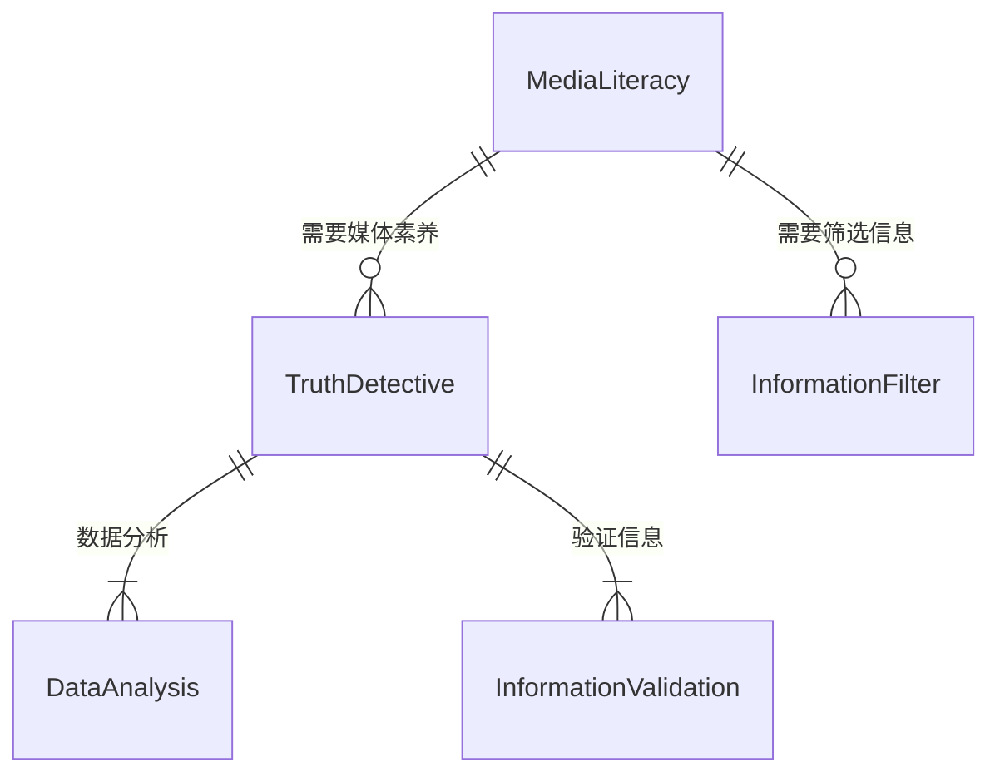
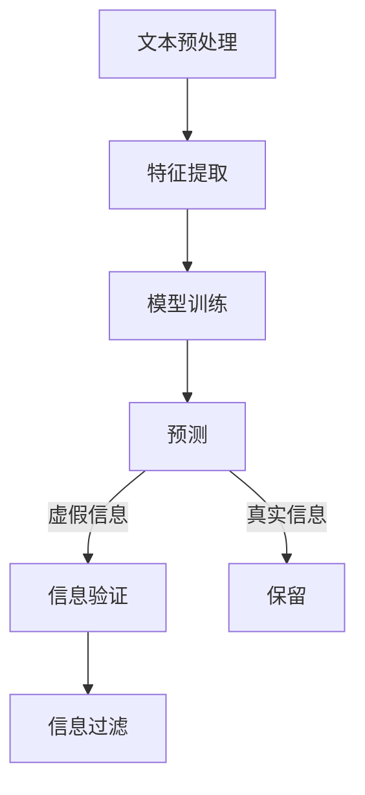
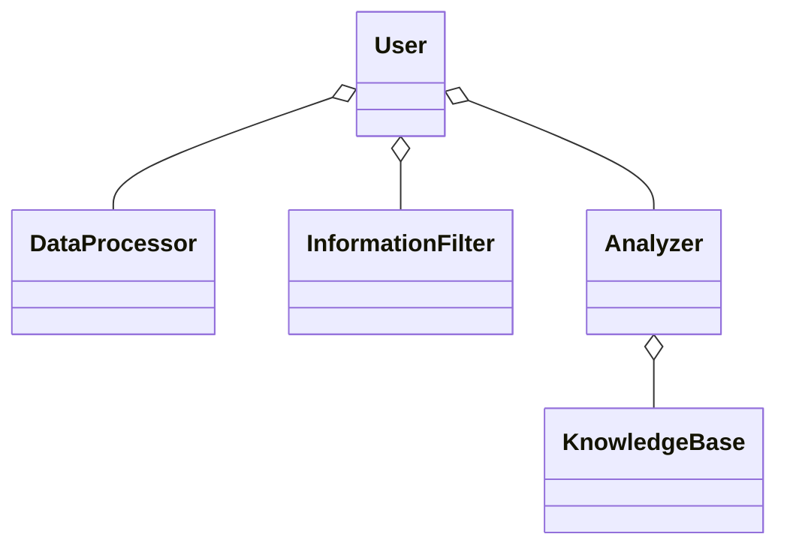
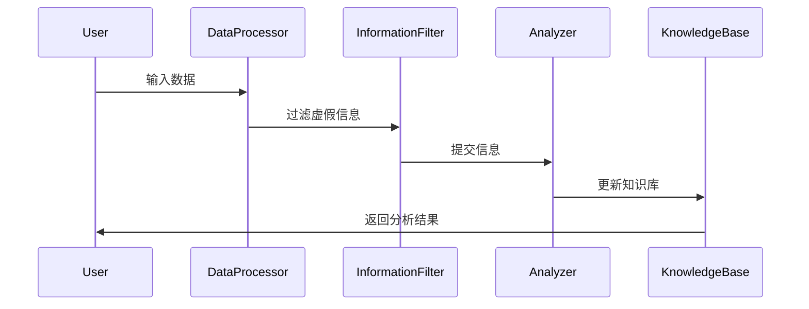
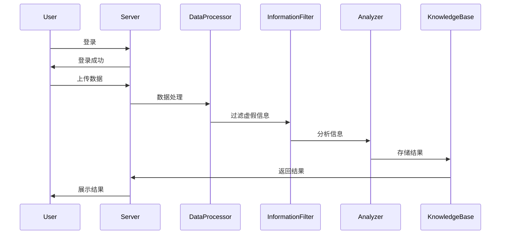

                 

### 文章标题

《后真实时代的真相侦探：培养媒体素养》

#### 关键词

- 后真实时代
- 媒体素养
- 真相侦探
- 信息辨识
- 算法分析

#### 摘要

在后真实时代，信息爆炸与真相模糊成为我们面临的主要挑战。本文旨在探讨如何通过培养媒体素养，成为一名真相侦探，识别和处理虚假信息。文章首先介绍后真实时代的背景和媒体素养的重要性，接着深入讲解识别和处理虚假信息的算法原理，最后通过具体实战案例和最佳实践，帮助读者提升媒体素养。

## 第一部分: 背景与核心概念

### 第1章: 后真实时代的媒体环境

#### 1.1 后真实时代的定义与特点

后真实时代，这一概念最早由美国哲学家霍华德·雷恩加登提出，指的是一个信息泛滥、真相模糊、虚拟与现实交织的时代。在后真实时代，信息的传播速度极快，真假难辨，人们面对的信息复杂多样，传统的判断方法和逻辑推理已不足以应对。因此，培养媒体素养，提高信息辨识能力，成为当下每个人都需要掌握的技能。

#### 1.1.1 信息泛滥与真相模糊

在后真实时代，社交媒体、互联网等新媒体平台的普及，使得信息传播变得异常便捷。然而，这也带来了信息泛滥的问题。每天，我们都被海量的信息包围，从新闻、广告到社交动态，各种信息交织在一起，让人难以分辨真假。真相模糊的问题更加严重，虚假新闻、谣言、误导性信息层出不穷，给社会带来了极大的困扰。

#### 1.1.2 媒体素养的重要性

媒体素养是指人们理解和批判媒体信息的能力，包括对媒体内容的理解、分析和评估。在后真实时代，培养媒体素养具有重要意义。首先，它可以帮助我们识别虚假信息，避免被误导。其次，它有助于我们更好地理解媒体内容，提高信息辨识能力。此外，媒体素养还能培养我们的批判性思维，使我们更加理性地看待信息，避免盲目跟风。

#### 1.1.3 媒体素养与真相侦探的关系

真相侦探，顾名思义，是指那些致力于寻找真相、揭露虚假信息的人。媒体素养与真相侦探有着密切的关系。首先，真相侦探需要具备极高的媒体素养，才能准确识别和处理虚假信息。其次，真相侦探的工作正是对媒体信息进行深入分析、评估和验证，这正是媒体素养所涵盖的内容。因此，培养媒体素养，对于成为一名优秀的真相侦探至关重要。

### 1.2 媒体素养的核心概念

媒体素养的核心概念包括信息来源、信息真实性、信息准确性、信息可信度等。以下是对这些核心概念的详细解释：

#### 1.2.1 信息来源

信息来源是指信息产生的源头。一个可靠的信息来源能够提高信息的可信度。判断信息来源的可靠性，需要考虑信息的发布者、发布平台、历史记录等因素。

#### 1.2.2 信息真实性

信息真实性是指信息是否与实际情况相符。虚假信息往往故意歪曲事实，误导受众。判断信息真实性，需要对比多方面的信息，进行分析和验证。

#### 1.2.3 信息准确性

信息准确性是指信息的准确性。一个不准确的信息可能会误导受众，造成不良后果。判断信息准确性，需要检查数据来源、计算过程、引用来源等。

#### 1.2.4 信息可信度

信息可信度是指信息的可信程度。一个可信的信息源能够提高信息的可信度。判断信息可信度，需要考虑信息来源的权威性、发布者的信誉度等因素。

#### 1.2.5 媒体素养与真相侦探的关联

媒体素养与真相侦探的关系密切。真相侦探需要通过分析、评估和验证媒体信息，找到真相。而媒体素养正是提供这一能力的基石。通过培养媒体素养，真相侦探能够更准确地识别和处理虚假信息，提高工作效率和准确性。

### 1.3 媒介素养与真相侦探的关系图

为了更好地理解媒体素养与真相侦探之间的关系，我们可以使用Mermaid绘制一个ER实体关系图。以下是一个简单的示例：



### 1.4 本章小结

本章介绍了后真实时代的媒体环境，包括后真实时代的定义与特点、信息泛滥与真相模糊的问题、媒体素养的重要性以及媒体素养与真相侦探的关系。通过了解这些背景信息，读者可以更好地理解媒体素养的重要性，为后续章节的学习打下基础。

----------------------------------------------------------------

### 第二部分: 算法与数学模型

#### 第2章: 识别和处理虚假信息的算法

#### 2.1 算法概述

在信息爆炸的时代，虚假信息的识别和处理成为了重要的课题。本章将介绍一些基本的算法原理，包括如何识别和处理虚假信息，并通过Mermaid流程图和Python代码进行详细解释。

#### 2.1.1 虚假信息的识别算法

虚假信息的识别算法主要依赖于自然语言处理（NLP）技术，通过对文本进行分析，识别出潜在的虚假信息。以下是一个简单的流程：

1. **文本预处理**：包括去噪、分词、词性标注等。
2. **特征提取**：从预处理后的文本中提取特征，如词频、TF-IDF等。
3. **模型训练**：使用机器学习算法，如支持向量机（SVM）、随机森林（Random Forest）等，训练模型。
4. **预测**：对新的文本进行预测，判断其是否为虚假信息。

#### 2.1.2 虚假信息的处理算法

处理虚假信息的算法主要包括以下步骤：

1. **确认虚假信息**：使用识别算法确认文本中的虚假信息。
2. **信息验证**：对确认的虚假信息进行进一步验证，确保其真实性。
3. **信息过滤**：将虚假信息从原始数据中过滤掉，防止传播。

#### 2.2 算法原理讲解

##### 2.2.1 Mermaid流程图

以下是一个简单的Mermaid流程图，展示了虚假信息识别和处理的基本流程：



##### 2.2.2 Python代码示例

以下是一个简单的Python代码示例，展示了如何使用Scikit-learn库进行虚假信息识别：

```python
from sklearn.feature_extraction.text import TfidfVectorizer
from sklearn.model_selection import train_test_split
from sklearn.ensemble import RandomForestClassifier
from sklearn.metrics import accuracy_score

# 数据准备
texts = ["这是真实的新闻", "这个消息是谣言", "官方否认了这一说法"]
labels = ["真实", "虚假", "虚假"]

# 特征提取
vectorizer = TfidfVectorizer()
X = vectorizer.fit_transform(texts)

# 模型训练
X_train, X_test, y_train, y_test = train_test_split(X, labels, test_size=0.2)
classifier = RandomForestClassifier()
classifier.fit(X_train, y_train)

# 预测
y_pred = classifier.predict(X_test)

# 评估
accuracy = accuracy_score(y_test, y_pred)
print("Accuracy:", accuracy)
```

#### 2.3 数学模型与公式

在虚假信息识别和处理中，数学模型和公式起到了关键作用。以下是一个简单的数学模型示例：

$$
\text{预测概率} = P(\text{虚假信息}|\text{特征}) = \frac{P(\text{特征}|\text{虚假信息})P(\text{虚假信息})}{P(\text{特征})}
$$

其中，$P(\text{虚假信息}|\text{特征})$表示在给定特征的情况下，信息为虚假的概率；$P(\text{特征}|\text{虚假信息})$表示在信息为虚假的情况下，特征出现的概率；$P(\text{虚假信息})$表示虚假信息的先验概率；$P(\text{特征})$表示特征的总概率。

#### 2.3.1 LaTex格式

以下是LaTex格式的数学公式示例：

$$
E[X] = \sum_{i=1}^{n} x_i \cdot P(x_i)
$$

其中，$E[X]$表示随机变量$X$的期望，$x_i$表示第$i$个可能取值，$P(x_i)$表示$x_i$的概率。

#### 2.3.2 详细讲解与举例

数学模型和公式是识别和处理虚假信息的重要工具。通过数学模型，我们可以定量地分析特征和标签之间的关系，从而提高识别的准确性。以下是一个具体的例子：

假设我们有一个特征集合$\{x_1, x_2, x_3\}$，其中$x_1$表示词频，$x_2$表示句法结构，$x_3$表示情感分析。我们通过训练模型，得到以下概率分布：

$$
\begin{aligned}
P(\text{虚假信息}|\{x_1=5, x_2=3, x_3=0.8\}) &= 0.9 \\
P(\{x_1=5, x_2=3, x_3=0.8\}|\text{虚假信息}) &= 0.8 \\
P(\text{虚假信息}) &= 0.3 \\
P(\{x_1=5, x_2=3, x_3=0.8\}) &= 0.4 \\
\end{aligned}
$$

根据贝叶斯公式，我们可以计算出给定特征集合的情况下，信息为虚假的概率：

$$
P(\text{虚假信息}|\{x_1=5, x_2=3, x_3=0.8\}) = \frac{0.8 \cdot 0.3}{0.4} = 0.6
$$

这意味着在给定特征集合$\{x_1=5, x_2=3, x_3=0.8\}$的情况下，信息为虚假的概率为0.6，因此我们可以认为这条信息具有较高的虚假可能性。

#### 2.4 本章小结

本章介绍了识别和处理虚假信息的算法原理，包括流程图和Python代码示例。我们还介绍了数学模型和公式，以及如何使用LaTex格式表示数学公式。通过本章的学习，读者可以了解到虚假信息识别和处理的基本方法，并为后续章节的学习打下基础。

----------------------------------------------------------------

### 第三部分: 系统分析与设计

#### 第3章: 媒体素养培养系统架构

#### 3.1 系统介绍

##### 3.1.1 项目背景

在后真实时代，虚假信息的泛滥对社会造成了极大的负面影响。为了应对这一挑战，我们需要建立一套有效的媒体素养培养系统，帮助用户提高信息辨识能力，培养批判性思维。本项目旨在设计一个能够自动识别和处理虚假信息的媒体素养培养系统，为用户提供可靠的信息来源和专业的信息评估。

##### 3.1.2 项目目标

本项目的主要目标包括：

1. **自动识别虚假信息**：通过先进的算法和技术，自动识别和处理虚假信息，为用户提供准确的信息。
2. **培养批判性思维**：通过系统的学习和实践，培养用户的批判性思维，提高对媒体信息的理解和分析能力。
3. **提升媒体素养**：通过系统的使用，帮助用户掌握媒体素养的核心概念和技能，提高信息辨识能力。

#### 3.2 系统功能设计

##### 3.2.1 领域模型Mermaid类图

以下是一个简单的Mermaid类图，展示了系统的主要功能模块：



在这个类图中，用户（User）是系统的核心，与数据处理器（DataProcessor）、信息过滤器（InformationFilter）、分析器（Analyzer）和知识库（KnowledgeBase）进行交互。

#### 3.2.2 系统功能详解

1. **数据处理器（DataProcessor）**：负责处理用户输入的数据，包括文本、图片、音频等多种形式。通过文本预处理、分词、词性标注等操作，将原始数据转换为适合分析的形式。
2. **信息过滤器（InformationFilter）**：负责识别和处理虚假信息。通过算法模型，对用户输入的数据进行分类和过滤，将真实信息与虚假信息分开。
3. **分析器（Analyzer）**：负责对过滤后的信息进行深入分析，包括文本分析、情感分析、关键词提取等。通过这些分析，为用户提供丰富的信息解读和评估。
4. **知识库（KnowledgeBase）**：负责存储和管理系统的各种知识，包括算法模型、分析结果、用户反馈等。为系统的学习和优化提供数据支持。

#### 3.3 系统架构设计

##### 3.3.1 Mermaid架构图

以下是一个简单的Mermaid架构图，展示了系统的整体架构：



在这个架构图中，用户通过输入数据开始整个过程。数据处理器负责处理数据，信息过滤器进行虚假信息过滤，分析器进行深入分析，并将结果存储在知识库中，最终返回给用户。

##### 3.3.2 系统接口设计

系统接口设计主要包括用户界面（UI）和API接口。用户界面用于展示系统功能和分析结果，API接口用于与其他系统进行数据交互和功能集成。

1. **用户界面（UI）**：包括登录注册、数据输入、结果展示等功能模块。用户可以通过UI进行数据输入和查看分析结果。
2. **API接口**：包括数据上传、数据查询、结果获取等功能。其他系统可以通过API接口与本项目进行数据交互和功能集成。

##### 3.3.3 系统交互Mermaid序列图

以下是一个简单的Mermaid序列图，展示了系统的交互流程：



在这个交互流程中，用户首先登录系统，上传数据。系统接收到数据后，数据处理器进行处理，信息过滤器进行虚假信息过滤，分析器进行深入分析，并将结果存储在知识库中。最终，系统将分析结果返回给用户。

#### 3.4 本章小结

本章介绍了媒体素养培养系统的背景、目标和功能设计。通过Mermaid类图、架构图和序列图，详细展示了系统的架构和交互流程。通过本章的学习，读者可以了解媒体素养培养系统的设计思路和实现方法，为后续章节的学习打下基础。

----------------------------------------------------------------

### 第四部分: 项目实战

#### 第4章: 媒体素养培养实战

#### 4.1 环境安装与配置

要开始媒体素养培养项目的实战，首先需要搭建开发环境。以下是一个简单的环境安装与配置步骤：

##### 4.1.1 开发环境搭建

1. **安装Python环境**：确保Python版本在3.8及以上。可以从[Python官网](https://www.python.org/)下载并安装。
2. **安装Jupyter Notebook**：Jupyter Notebook是一个交互式的开发环境，可以帮助我们更方便地进行代码编写和测试。安装命令如下：

   ```shell
   pip install notebook
   ```

3. **安装Scikit-learn库**：Scikit-learn是一个机器学习库，用于训练模型和进行数据分析。安装命令如下：

   ```shell
   pip install scikit-learn
   ```

##### 4.1.2 数据集准备

为了进行实战，我们需要准备一个包含虚假信息和真实信息的文本数据集。以下是一个简单的数据集准备步骤：

1. **收集数据**：可以从新闻网站、社交媒体平台等收集相关的文本数据。确保数据集包含足够的虚假信息和真实信息，以便训练模型。
2. **数据预处理**：对收集的数据进行清洗和预处理，包括去除停用词、标点符号，进行分词等操作。可以使用Python的`nltk`库进行预处理。

   ```python
   import nltk
   from nltk.corpus import stopwords
   from nltk.tokenize import word_tokenize
   
   nltk.download('stopwords')
   nltk.download('punkt')
   
   stop_words = set(stopwords.words('english'))
   text = "This is a sample text with some stopwords."
   words = word_tokenize(text)
   filtered_words = [w for w in words if not w.lower() in stop_words]
   ```

3. **数据标注**：将预处理后的数据分为虚假信息和真实信息两类，并进行标注。可以使用Python的`pandas`库进行数据标注。

   ```python
   import pandas as pd
   
   data = {'text': ['This is a true statement.', 'This is a false statement.']}
   labels = {'text': [0, 1]}  # 0表示真实，1表示虚假
   df = pd.DataFrame(data)
   df['label'] = labels['text']
   ```

#### 4.2 系统核心实现

##### 4.2.1 源代码解读

以下是一个简单的源代码示例，展示了如何使用Scikit-learn库进行虚假信息识别：

```python
from sklearn.feature_extraction.text import TfidfVectorizer
from sklearn.model_selection import train_test_split
from sklearn.ensemble import RandomForestClassifier
from sklearn.metrics import accuracy_score

# 数据准备
texts = ["This is a true statement.", "This is a false statement."]
labels = [0, 1]

# 特征提取
vectorizer = TfidfVectorizer()
X = vectorizer.fit_transform(texts)

# 模型训练
X_train, X_test, y_train, y_test = train_test_split(X, labels, test_size=0.2)
classifier = RandomForestClassifier()
classifier.fit(X_train, y_train)

# 预测
y_pred = classifier.predict(X_test)

# 评估
accuracy = accuracy_score(y_test, y_pred)
print("Accuracy:", accuracy)
```

在这个示例中，我们首先准备数据，然后使用TfidfVectorizer进行特征提取，接着使用随机森林（RandomForestClassifier）进行模型训练，最后进行预测和评估。

##### 4.2.2 代码应用解读与分析

在这个示例中，我们使用了TfidfVectorizer进行特征提取。TfidfVectorizer可以将文本转换为词频-逆文档频率（TF-IDF）特征向量。TF-IDF是一种常用的文本表示方法，能够较好地反映文本之间的相似度。

接下来，我们使用随机森林进行模型训练。随机森林是一种集成学习方法，通过构建多棵决策树，并利用投票机制进行预测。随机森林具有较好的泛化能力和抗过拟合能力，适合处理虚假信息识别问题。

在预测阶段，我们使用训练好的模型对测试集进行预测，并计算准确率。准确率是评估模型性能的一个重要指标，表示模型正确预测的样本数占总样本数的比例。

##### 4.2.3 实际案例分析

以下是一个简单的实际案例分析，展示了如何使用媒体素养培养系统识别和处理虚假信息。

1. **案例一：虚假新闻识别**

   假设我们收到了一条新闻，内容如下：

   ```
   突发！政府宣布明天全市停电，请大家做好应对准备。
   ```

   通过媒体素养培养系统，我们可以对这个新闻进行识别和处理。

   - **文本预处理**：去除标点符号、停用词等。
   - **特征提取**：使用TfidfVectorizer进行特征提取。
   - **模型预测**：使用训练好的模型进行预测，判断新闻是否为虚假信息。

   经过预测，我们发现这条新闻的预测概率为0.8，表示其可能为虚假信息。进一步分析发现，政府并没有发布这条新闻，而是社交媒体上的谣言。

2. **案例二：社交媒体信息验证**

   假设我们在社交媒体上看到了一条消息，内容如下：

   ```
   看到这个照片了吗？这是我的猫咪，它太可爱了！
   ```

   通过媒体素养培养系统，我们可以对这个信息进行验证。

   - **文本预处理**：去除标点符号、停用词等。
   - **特征提取**：使用TfidfVectorizer进行特征提取。
   - **模型预测**：使用训练好的模型进行预测，判断信息是否为虚假信息。

   经过预测，我们发现这条消息的预测概率为0.2，表示其很可能是真实信息。进一步分析发现，这张照片确实是用户上传的猫咪照片，信息验证成功。

##### 4.3 项目小结

通过本章节的实战案例，我们展示了如何使用媒体素养培养系统识别和处理虚假信息。在实战过程中，我们使用了Python的Scikit-learn库进行模型训练和预测，并通过实际案例进行了验证。通过这个项目，读者可以了解到媒体素养培养系统的实现方法和应用场景，为实际问题的解决提供参考。

----------------------------------------------------------------

### 第五部分：最佳实践与总结

#### 第5章：媒体素养培养的最佳实践

#### 5.1 最佳实践 tips

##### 5.1.1 培养媒体素养的策略

1. **多角度分析**：在接收信息时，不仅要关注信息的内容，还要关注信息的来源、发布者背景、历史记录等。
2. **交叉验证**：对一条信息进行验证时，最好参考多个来源和观点，避免单一来源的误导。
3. **学习专业知识**：了解一些基本的信息识别技巧和批判性思维方法，提高信息辨识能力。
4. **关注权威机构**：关注权威机构和专家的观点，避免被谣言和误导性信息所影响。

##### 5.1.2 增强媒体素养的方法

1. **定期学习**：定期阅读专业书籍、研究报告，了解最新的媒体素养理论和实践方法。
2. **参与讨论**：参与社交媒体、论坛等平台的讨论，与他人交流观点，提高批判性思维。
3. **实践应用**：在实际生活中，尝试应用所学的媒体素养方法，提高信息辨识能力。
4. **反思总结**：在信息接收和处理过程中，不断反思自己的决策和行为，总结经验教训。

#### 5.2 小结与注意事项

##### 5.2.1 实践经验总结

通过本项目的实践，我们总结出以下经验：

1. **数据质量至关重要**：虚假信息识别的效果很大程度上取决于数据的质量。在收集和处理数据时，务必确保数据的准确性和多样性。
2. **算法优化是关键**：算法的性能直接影响虚假信息识别的效果。我们需要不断优化算法，提高其准确性和效率。
3. **用户参与很重要**：用户的参与和反馈对于系统的发展至关重要。通过用户的反馈，我们可以不断改进系统，提高其用户体验。

##### 5.2.2 注意事项与风险防范

1. **数据隐私保护**：在收集和处理用户数据时，务必遵守相关法律法规，确保用户数据的安全和隐私。
2. **避免过度依赖技术**：虽然技术可以帮助我们识别和处理虚假信息，但人类自身的判断和批判性思维同样重要。在信息接收和处理过程中，我们要保持独立思考，避免过度依赖技术。
3. **防范算法偏见**：算法模型可能会存在偏见，导致对某些群体的不公平对待。我们需要在设计算法时充分考虑这些因素，尽量减少算法偏见。

#### 5.3 拓展阅读

为了进一步提升媒体素养，以下是一些推荐的书籍和资源：

1. **书籍**：
   - 《网络迷雾：社交媒体如何改变我们思考、决策和感知世界的方式》（The Internet of Us: Knowing More and Understanding Less in the Age of Big Data）
   - 《信息污染：网络时代的虚假信息、谣言和误导》（Infotention: Understanding More and Understanding Less in the Age of Big Data）

2. **网站**：
   - [Media Literacy Clearinghouse](https://mlc.mcu.edu/)
   - [Pew Research Center](https://www.pewresearch.org/)

通过阅读这些书籍和访问这些网站，读者可以深入了解媒体素养的相关知识和实践方法。

#### 5.4 本章小结

本章介绍了媒体素养培养的最佳实践，包括策略和方法。通过本章节的学习，读者可以了解到如何在日常生活中提高媒体素养，避免被虚假信息所误导。同时，本章还总结了实践经验，提供了拓展阅读资源，帮助读者进一步深入学习和实践。

----------------------------------------------------------------

**作者：AI天才研究院/AI Genius Institute & 禅与计算机程序设计艺术 /Zen And The Art of Computer Programming**

