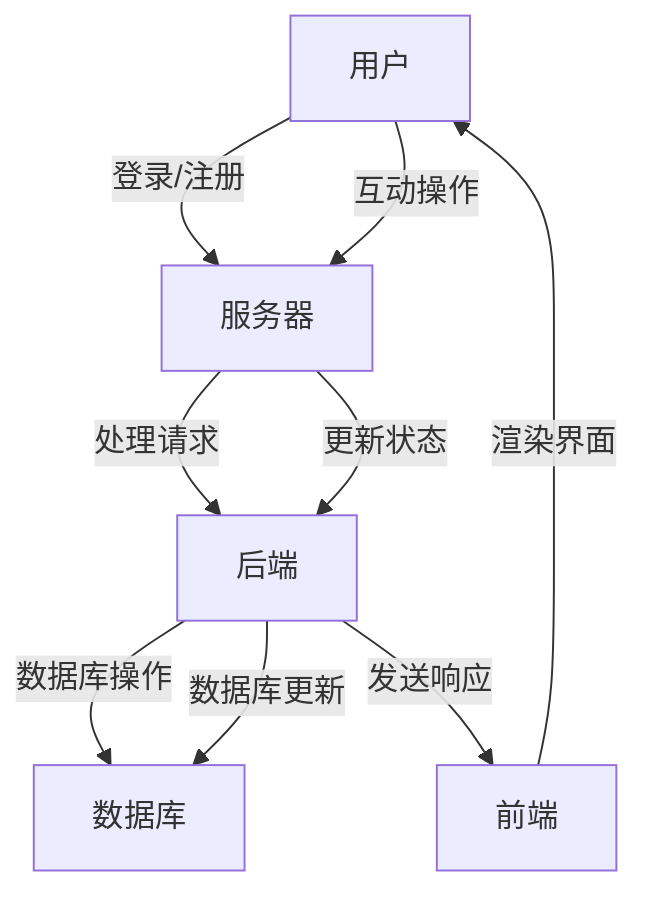
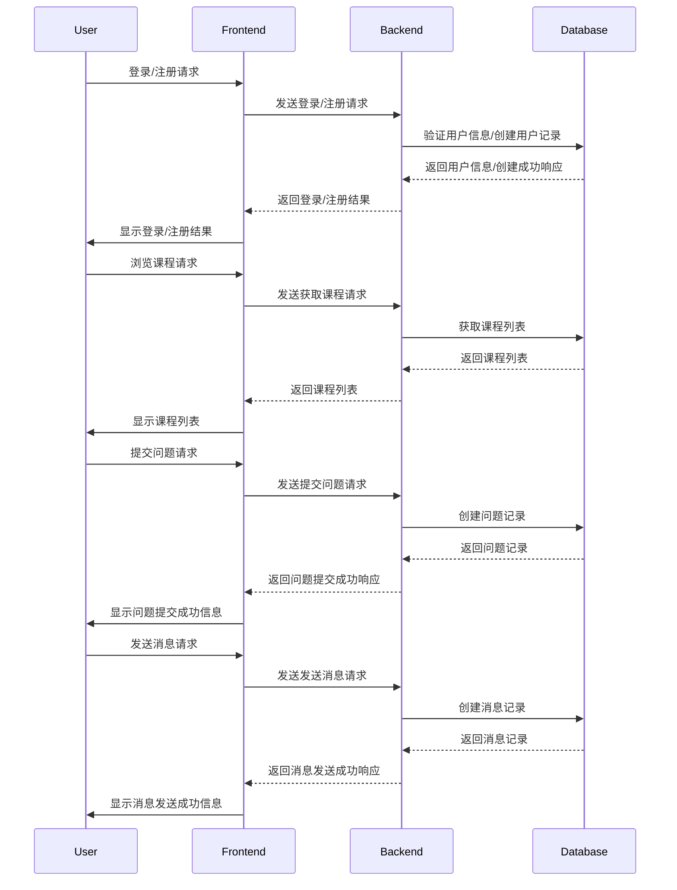

                 

# 后真实时代：在虚拟与现实交织中寻找真我

## 关键词
- 后真实时代
- 虚拟现实
- 增强现实
- 真我
- 社会变革
- 心理健康

## 摘要
本文探讨了后真实时代的到来，以及如何在虚拟与现实交织的环境中找到自己的真我。随着虚拟现实和增强现实技术的发展，我们正逐渐进入一个全新的时代，在这个时代中，现实与虚拟之间的界限变得模糊，人们的生活方式和社会互动也发生了巨大变化。本文将从背景介绍、概念解析、技术发展、社会影响、心理健康、寻找真我等多个方面，深入探讨这个时代的挑战与机遇，并提出一些建议，帮助我们在虚拟与现实交织的世界中找到自己的真实身份。

## 目录

### 引言：后真实时代的概念

#### 1.1 背景与概念介绍
- **虚拟现实与增强现实的发展**：介绍虚拟现实和增强现实的历史背景，及其在现代社会中的重要地位。
- **后真实时代的定义**：解释后真实时代的概念，以及它如何影响我们的生活方式。

#### 1.2 挑战与机遇
- **面临的挑战**：分析后真实时代带来的挑战，如虚拟现实中的伦理问题、隐私问题等。
- **机遇**：探讨后真实时代带来的机遇，如新的商业模式、工作机会等。

### 虚拟与现实的交织

#### 2.1 虚拟现实技术
- **技术概述**：介绍虚拟现实技术的基本原理和主要应用领域。
- **未来发展**：探讨虚拟现实技术的未来发展趋势。

#### 2.2 增强现实技术
- **技术概述**：介绍增强现实技术的基本原理和主要应用领域。
- **与现实世界的融合**：分析增强现实技术如何与现实世界结合，以及其对社会的影响。

### 虚拟世界的崛起

#### 3.1 虚拟世界的兴起
- **虚拟世界的特点**：分析虚拟世界的独特性，以及其对人们的吸引力。
- **社交互动**：探讨虚拟世界中的社交互动方式，以及其对现实社交的影响。

#### 3.2 虚拟现实的心理影响
- **心理健康问题**：分析虚拟现实对心理健康可能产生的影响。
- **伦理道德问题**：探讨虚拟现实中的伦理道德问题，以及如何应对。

### 寻找真我

#### 4.1 自我反思的方法
- **虚拟现实中的自我反思**：介绍如何在虚拟环境中进行自我反思。
- **心理健康促进**：分析虚拟现实如何帮助人们提升心理健康。

#### 4.2 虚拟与现实的平衡
- **平衡生活**：探讨如何在虚拟世界和现实世界之间找到平衡。
- **自我认知**：分析如何通过虚拟现实提升自我认知。

### 虚拟实体的互动

#### 5.1 人工智能与人类互动
- **人工智能概述**：介绍人工智能的基本概念和应用领域。
- **虚拟实体交互**：分析人工智能在虚拟实体互动中的作用。

#### 5.2 人机交互的未来
- **交互技术发展**：探讨未来人机交互技术的发展趋势。
- **用户体验**：分析人机交互对用户体验的影响。

### 结论
- **后真实时代的意义**：总结后真实时代对人类社会的影响。
- **未来展望**：探讨后真实时代的未来发展。

### 参考文献

## 引言：后真实时代的概念

### 1.1 背景与概念介绍

#### 虚拟现实与增强现实的发展

虚拟现实（Virtual Reality，VR）和增强现实（Augmented Reality，AR）技术的发展可以追溯到上世纪80年代和90年代。虚拟现实技术的发展起源于计算机图形学和图像处理技术的进步。1987年，VPL公司推出了第一个商用虚拟现实头盔，标志着虚拟现实技术的诞生。此后，随着计算机性能的提升和传感器技术的进步，虚拟现实技术逐渐成熟，并开始广泛应用于游戏、娱乐、教育、医疗等领域。

增强现实技术则是在虚拟现实的基础上，通过将虚拟信息叠加到现实世界中，为用户提供一种虚实融合的体验。1990年，惠普公司推出了第一个商用增强现实眼镜，这标志着增强现实技术的诞生。随着移动设备的普及和无线通信技术的发展，增强现实技术逐渐走向大众市场，并应用于购物、导航、维修、施工等领域。

#### 后真实时代的定义

后真实时代，又称虚拟现实时代，是指在虚拟现实和增强现实技术高度发展的背景下，现实与虚拟之间的界限变得模糊，人们可以在虚拟世界中体验到与现实世界相似的甚至更加丰富的感知和交互的时代。在这个时代中，虚拟现实和增强现实技术不仅改变了我们的生活方式，也改变了我们对现实世界的认知。

后真实时代的到来，标志着人类社会进入了一个新的发展阶段。在这个阶段，虚拟现实和增强现实技术将成为我们日常生活中不可或缺的一部分，它们将渗透到我们生活的方方面面，从工作、学习、娱乐到社交，都将受到深刻的影响。

### 1.2 挑战与机遇

#### 面临的挑战

1. **虚拟现实中的伦理问题**

随着虚拟现实技术的发展，一些伦理问题也逐渐浮现。例如，虚拟现实中的性虐待、虚拟杀人等行为如何界定？虚拟现实中的隐私问题如何保障？这些都需要我们进行深入的思考和探讨。

2. **隐私问题**

在虚拟现实和增强现实环境中，用户的隐私保护变得尤为重要。例如，虚拟现实游戏中的用户数据如何收集和使用？增强现实应用中的用户位置信息如何保护？这些问题都需要我们认真对待。

3. **心理健康问题**

虚拟现实技术虽然可以带来丰富的体验，但过度使用也可能对心理健康产生负面影响。例如，沉迷于虚拟世界可能导致现实社交能力的下降，甚至引发抑郁等心理问题。因此，如何平衡虚拟现实的使用，保护心理健康，也是一个重要的挑战。

#### 机遇

1. **新的商业模式**

虚拟现实和增强现实技术的应用，为商业领域带来了新的机遇。例如，虚拟现实可以为房地产开发商提供虚拟看房服务，为旅游行业提供虚拟旅游体验，为教育培训行业提供虚拟课堂等。这些新的商业模式，不仅提高了行业效率，也为消费者带来了更多选择。

2. **工作机会的增加**

随着虚拟现实和增强现实技术的发展，相关行业的就业机会也在增加。例如，虚拟现实内容创作者、增强现实应用开发工程师、虚拟现实产品经理等职位，都是新兴的职业方向。

3. **教育和医疗的革新**

虚拟现实和增强现实技术，为教育和医疗领域带来了巨大的变革。例如，虚拟现实可以用于医学教育，让学生在虚拟环境中进行手术模拟，提高手术技能；增强现实技术可以用于手术辅助，帮助医生在手术过程中更加精准地操作。

### 1.3 后真实时代的意义

后真实时代的到来，不仅改变了我们的生活方式，也改变了我们对现实世界的认知。在这个时代，我们将有机会体验到前所未有的感知和交互方式，我们的社会结构和价值观念也将面临新的挑战和机遇。

首先，后真实时代将打破传统的时间和空间限制。通过虚拟现实技术，我们可以随时随地进入虚拟世界，进行工作、学习和娱乐。这将极大地提高我们的工作效率和生活质量。

其次，后真实时代将促进人类社会的发展和进步。虚拟现实和增强现实技术，可以为各行各业带来创新和变革，推动社会向前发展。例如，虚拟现实技术可以用于城市管理，提高城市管理效率；增强现实技术可以用于农业生产，提高农业生产效率。

最后，后真实时代也将带来新的伦理和社会问题。我们需要在享受虚拟世界带来的便利和乐趣的同时，关注其可能带来的负面影响，并积极探索解决之道。

### 1.4 后真实时代的挑战与机遇

#### 挑战

1. **技术挑战**

虚拟现实和增强现实技术的发展，面临着一系列技术挑战。例如，如何提高虚拟现实和增强现实设备的性能和用户体验？如何解决虚拟现实和增强现实环境中的同步和稳定性问题？这些都是需要我们深入研究和解决的问题。

2. **伦理挑战**

虚拟现实和增强现实技术的应用，也带来了许多伦理问题。例如，虚拟现实中的性虐待、虚拟杀人等行为如何界定？如何保障用户的隐私和数据安全？这些都是我们需要认真思考和解决的问题。

3. **社会挑战**

虚拟现实和增强现实技术的普及，也将对社会产生深远的影响。例如，如何平衡虚拟现实和现实世界的生活？如何防止人们过度沉迷于虚拟世界，影响现实生活？这些都是我们需要关注和解决的问题。

#### 机遇

1. **商业机遇**

虚拟现实和增强现实技术的应用，为商业领域带来了巨大的机遇。例如，虚拟现实可以用于房地产、旅游、教育培训等行业，提供全新的服务模式；增强现实技术可以用于工业生产、医疗辅助等行业，提高生产效率和医疗水平。

2. **就业机遇**

随着虚拟现实和增强现实技术的发展，相关行业的就业机会也在增加。例如，虚拟现实内容创作者、增强现实应用开发工程师、虚拟现实产品经理等职位，都是新兴的职业方向。

3. **教育和医疗革新**

虚拟现实和增强现实技术，为教育和医疗领域带来了巨大的变革。例如，虚拟现实可以用于医学教育，提高学生的手术技能；增强现实技术可以用于手术辅助，帮助医生在手术过程中更加精准地操作。

### 1.5 未来展望

后真实时代的到来，将极大地改变我们的生活方式和社会结构。我们可以预见，未来虚拟现实和增强现实技术将更加普及，人们将在虚拟世界中获得更多的体验和乐趣。同时，我们也将面临一系列新的挑战和机遇。如何平衡虚拟世界和现实世界的生活？如何保护用户的隐私和数据安全？如何解决虚拟现实和增强现实环境中的伦理问题？这些都是我们需要深入思考和解决的问题。

总之，后真实时代将为我们带来前所未有的机遇和挑战。在这个时代中，我们将有机会体验到前所未有的感知和交互方式，我们的社会结构和价值观念也将面临新的挑战和机遇。如何应对这些挑战，抓住机遇，将是我们共同面对的课题。

### 2.1 虚拟现实技术概述

#### 历史背景

虚拟现实技术的概念可以追溯到1960年代，当时计算机图形学的发展为虚拟现实提供了基础。在1980年代，虚拟现实开始引起广泛关注，特别是在游戏和军事模拟领域。1987年，VPL公司推出了第一个商用虚拟现实头盔，这标志着虚拟现实技术的诞生。

进入21世纪，随着计算机性能的不断提升和图形处理技术的进步，虚拟现实技术得到了飞速发展。特别是近年来，虚拟现实头戴显示器（HMD）的出现，使得虚拟现实体验变得更加真实和便捷。

#### 技术原理

虚拟现实技术的基本原理是通过计算机生成一个模拟环境，使用户在这个环境中能够感受到身临其境的体验。虚拟现实技术主要依赖于以下几个方面：

1. **头戴显示器（HMD）**：虚拟现实头戴显示器是用户进入虚拟世界的入口。通过头戴显示器，用户可以看到计算机生成的三维图像，并能够通过头部运动来观察虚拟环境的不同部分。

2. **传感器**：虚拟现实设备通常配备各种传感器，如陀螺仪、加速度计和位置跟踪器，用于检测用户的头部运动和身体姿态，从而实时调整虚拟环境的视角和内容。

3. **计算平台**：虚拟现实设备需要强大的计算平台来生成和渲染虚拟环境。现代虚拟现实设备通常使用高性能的中央处理器（CPU）和图形处理器（GPU）来处理复杂的图形渲染和物理模拟。

4. **音频系统**：虚拟现实技术还包括高质量的音频系统，通过立体声或三维音效，为用户提供更加真实的听觉体验。

#### 技术发展

虚拟现实技术经历了几个重要的发展阶段：

1. **早期阶段（1960-1980年代）**：这一阶段主要集中于研究虚拟现实的基本概念和技术，包括三维图形渲染和交互技术。

2. **成长阶段（1990-2000年代）**：随着计算机性能的提升和图形处理技术的进步，虚拟现实技术开始应用于军事模拟、教育培训和游戏等领域。

3. **成熟阶段（2010年代至今）**：这一阶段以虚拟现实头戴显示器的商业化为标志，虚拟现实技术开始走向大众市场。例如，Facebook的Oculus Rift、索尼的PlayStation VR和HTC的Vive等设备的推出，使得虚拟现实体验变得更加普及和真实。

#### 当前技术状况

目前，虚拟现实技术已经取得了显著的进展。虚拟现实头戴显示器的分辨率和刷新率不断提高，传感器技术也在不断改进，使得虚拟环境的沉浸感更加真实。此外，虚拟现实技术的应用领域也在不断扩展，从游戏和娱乐到教育、医疗、建筑和工程等领域，都有虚拟现实技术的身影。

然而，虚拟现实技术仍面临一些挑战，如高成本、技术不稳定性和用户接受度等。为了解决这些问题，研究人员和工程师们正在不断努力，探索新的技术和方法，以提高虚拟现实技术的性能和用户体验。

### 2.2 VR技术的未来发展趋势

#### 技术革新

未来的虚拟现实技术将经历一系列技术革新，进一步改善用户体验。首先，分辨率和刷新率的提升将继续成为关键方向。随着5G网络的普及和边缘计算技术的发展，虚拟现实设备的延迟问题有望得到显著改善，使得用户在虚拟环境中的交互更加流畅和自然。此外，新型显示技术，如OLED和microLED，可能会被广泛应用于虚拟现实头戴显示器，提供更高的亮度和对比度，同时降低能耗。

#### 新兴应用领域

虚拟现实技术在各个领域的应用将不断扩展。在教育领域，虚拟现实可以提供更加生动和互动的学习体验，使学生能够身临其境地学习历史事件、科学实验和艺术作品。在医疗领域，虚拟现实可以用于手术模拟、康复训练和心理健康治疗，帮助医生和患者更好地理解和应对各种医疗状况。在建筑和工程领域，虚拟现实技术可以用于建筑设计、城市规划和大宗商品交易，提供更加直观和高效的决策支持。

#### 社会影响

虚拟现实技术的普及将对社会产生深远的影响。一方面，虚拟现实将改变人们的社交方式。人们可以通过虚拟现实平台进行远程社交，打破地理和时间的限制，增强社交互动的多样性和便利性。另一方面，虚拟现实技术可能会带来新的工作机会和就业模式，如虚拟现实内容创作者、虚拟现实体验设计师等职业。然而，这也可能引发一些社会问题，如虚拟现实中的伦理问题、隐私保护和心理健康问题等。

#### 持续挑战

尽管虚拟现实技术前景广阔，但仍然面临一些挑战。首先，技术成本和设备价格仍然较高，限制了普及率。其次，虚拟现实内容的创作和开发仍需大量人力和资源投入。此外，虚拟现实技术的稳定性和可靠性仍需进一步提高，以确保用户在虚拟环境中的安全和舒适。

总的来说，虚拟现实技术的未来发展趋势充满希望，但也需要持续的技术创新和社会共识，以应对潜在的挑战，推动虚拟现实技术走向更加成熟和广泛的应用。

### 2.3 增强现实技术概述

#### 增强现实技术的定义和原理

增强现实（Augmented Reality，AR）技术是一种将虚拟信息与现实世界结合起来的技术。通过在现实世界的视野中叠加虚拟图像、文字、音频或其他类型的信息，AR技术能够为用户提供一种虚实融合的体验。AR技术的基本原理是利用摄像头或传感器捕捉现实世界的图像，然后通过计算机处理，将虚拟信息叠加到这些图像上，并实时显示在用户眼前。

#### 应用领域和场景

增强现实技术已经在多个领域得到广泛应用，并展现出巨大的潜力。以下是一些典型的应用领域和场景：

1. **零售**：在零售行业中，AR技术可以用于产品展示和购物体验的增强。例如，消费者可以使用手机或AR眼镜查看商品的3D模型，了解产品的细节和功能，从而做出更加明智的购买决策。

2. **医疗**：在医疗领域，AR技术可以用于手术导航和医疗培训。医生可以通过AR眼镜实时查看患者的内部结构和手术区域，提高手术的准确性和效率。同时，AR技术还可以用于医学教育和培训，为学生提供更加直观和互动的学习体验。

3. **教育**：在教育领域，AR技术可以为教师和学生提供丰富的教学资源。通过AR应用，学生可以直观地观察历史事件、科学实验和艺术作品，加深对知识的理解和记忆。

4. **娱乐**：在娱乐行业，AR技术可以用于游戏和互动体验的增强。例如，AR游戏可以让玩家在现实世界中与虚拟角色互动，提供更加沉浸和有趣的体验。

5. **制造和维修**：在制造和维修领域，AR技术可以用于技术支持和流程优化。工人可以通过AR眼镜获取设备操作指南和维修步骤，提高工作效率和准确度。

#### 技术发展

增强现实技术经历了几个重要的发展阶段：

1. **早期阶段（1990年代）**：AR技术的概念被提出，并开始应用于一些实验室项目。

2. **成长阶段（2000年代）**：随着计算机性能的提升和传感器技术的进步，AR技术开始进入商业应用。例如，谷歌眼镜等设备的推出，标志着AR技术的商业化。

3. **成熟阶段（2010年代至今）**：随着移动设备和智能手机的普及，AR技术开始广泛应用于各个领域。苹果的ARKit、谷歌的ARCore等开发平台的推出，为AR应用的开发提供了便利。

#### 当前技术状况

目前，增强现实技术已经取得了显著的进展。智能手机和平板电脑上的AR应用日益普及，用户可以通过简单的操作体验AR技术的魅力。同时，专业的AR设备，如AR眼镜和头戴显示器，也在不断改进，提供更加真实和高效的增强现实体验。

然而，增强现实技术仍面临一些挑战，如处理延迟、设备舒适度和用户体验等。为了解决这些问题，研究人员和工程师们正在不断探索新的技术和方法，以提高AR技术的性能和用户体验。

### 2.4 增强现实技术的影响

#### 对现实世界的影响

增强现实技术对现实世界的影响是深远且多方面的。首先，它改变了我们的互动方式。通过AR技术，用户可以在现实世界中直接与虚拟信息互动，从而打破了传统的信息传递方式。例如，在零售行业，消费者可以通过AR应用查看商品的3D模型和详细信息，实现更加个性化的购物体验。

其次，增强现实技术对教育和医疗领域产生了重大影响。在教育方面，AR技术可以为学生提供丰富的教学资源，使其能够直观地观察和互动，从而加深对知识的理解。在医疗方面，AR技术可以用于手术导航和医疗培训，提高医生的手术技能和患者的治疗效果。

此外，增强现实技术也在娱乐、制造和维修等领域发挥了重要作用。在娱乐领域，AR游戏和互动体验为用户带来了全新的娱乐方式。在制造和维修领域，AR技术可以提供实时操作指南和维修步骤，提高工作效率和准确度。

#### 对社会的影响

增强现实技术对社会的影响也是显著的。一方面，它为各行各业带来了新的商业机会和创新。例如，在零售和旅游行业，AR技术可以提供更加丰富的产品展示和旅游体验，吸引更多消费者。另一方面，增强现实技术也带来了新的社会挑战，如隐私保护和数据安全等。由于AR技术依赖于用户的实时位置和面部信息，如何保护用户的隐私和数据安全成为了一个亟待解决的问题。

此外，增强现实技术的普及也可能会对社会结构产生深远的影响。随着越来越多的人使用AR技术，现实世界和虚拟世界之间的界限可能变得更加模糊，人们的社交方式和生活方式也可能发生改变。例如，远程社交和虚拟互动可能会成为人们日常生活中的一部分，影响人们的社交能力和情感交流。

总的来说，增强现实技术的影响是全方位的，它不仅改变了我们的互动方式，也为我们提供了新的商业机会和社会挑战。如何在享受增强现实技术带来的便利和创新的同时，妥善应对其带来的问题，将是我们需要共同面对的课题。

### 2.5 虚拟现实和增强现实技术的融合趋势

#### 技术融合的背景

随着虚拟现实（VR）和增强现实（AR）技术的不断发展，两者的融合趋势日益显著。这种趋势背后的主要驱动力包括技术进步、市场需求和用户体验的提升。虚拟现实和增强现实技术的融合，不仅能够充分发挥各自的优势，还可以创造出更加丰富和真实的互动体验，从而满足不同场景和应用的需求。

#### 融合技术的定义和特点

虚拟现实与增强现实技术的融合，通常被称为“混合现实”（Mixed Reality，MR）。混合现实技术结合了虚拟现实和增强现实的特点，通过将虚拟信息与现实世界无缝融合，提供一种全新的交互方式。在混合现实环境中，用户不仅能够看到虚拟信息和实体物体，还可以与之进行互动，从而实现更加沉浸和自然的体验。

混合现实技术具有以下几个特点：

1. **虚实融合**：混合现实技术能够将虚拟信息与现实世界中的物体实时融合，为用户创造一个全新的交互环境。

2. **交互性**：用户可以在混合现实环境中与虚拟信息和实体物体进行自然互动，例如触摸、拖动、旋转等。

3. **实时性**：混合现实技术能够实时捕捉和渲染现实世界中的场景和物体，并叠加虚拟信息，从而提供流畅和自然的交互体验。

#### 融合技术的应用场景

混合现实技术的融合趋势在多个应用领域都展现出了巨大的潜力：

1. **教育**：在教育领域，混合现实技术可以用于虚拟实验室、历史场景再现和互动教学，为学生提供更加生动和直观的学习体验。

2. **医疗**：在医疗领域，混合现实技术可以用于手术模拟、医疗培训和患者教育，帮助医生和患者更好地理解和应对各种医疗状况。

3. **制造与维修**：在制造和维修领域，混合现实技术可以提供实时的操作指导和技术支持，提高生产效率和维护质量。

4. **娱乐**：在娱乐领域，混合现实技术可以用于游戏、主题公园和虚拟现实体验馆，为用户带来全新的娱乐方式和互动体验。

5. **军事**：在军事领域，混合现实技术可以用于模拟战斗、训练和指挥控制，提高军事人员的作战能力和反应速度。

#### 技术融合的趋势

随着技术的不断进步，虚拟现实和增强现实技术的融合趋势日益显著。以下是一些主要的技术融合趋势：

1. **硬件设备的融合**：随着VR和AR设备的不断改进，一些厂商开始推出具有混合现实功能的设备，例如微软的HoloLens。这些设备能够同时提供虚拟现实和增强现实功能，为用户带来更加丰富和多样的体验。

2. **软件开发的融合**：软件开发平台和工具也在不断改进，以支持混合现实应用的开发。例如，Unity和Unreal Engine等游戏引擎已经集成了混合现实开发功能，为开发者提供了更加便捷和高效的开发环境。

3. **用户体验的融合**：为了满足用户对更加真实和自然的交互体验的需求，虚拟现实和增强现实技术正在不断融合。例如，一些混合现实应用可以同时提供虚拟现实和增强现实的交互方式，用户可以根据场景和需求自由切换。

总的来说，虚拟现实和增强现实技术的融合趋势为未来的技术应用带来了无限可能。通过融合两者的优势，混合现实技术将为各个领域带来更加丰富和高效的解决方案，同时也为用户创造更加沉浸和自然的交互体验。

### 2.6 虚拟世界中的社交互动

#### 虚拟世界的特点

虚拟世界，又称为虚拟社区或虚拟社会，是通过虚拟现实（VR）和增强现实（AR）技术构建的在线社交空间。虚拟世界具有以下特点：

1. **三维空间**：虚拟世界是一个三维空间，用户可以在其中自由移动、交互和探索。与传统的二维网络社交平台不同，虚拟世界提供了更加立体和真实的社交体验。

2. **个性化**：用户可以在虚拟世界中创建自己的虚拟形象（Avatar），并通过这些形象来表达自己的个性、兴趣和喜好。这种个性化的表达方式，使得虚拟世界中的社交互动更加丰富和多样化。

3. **沉浸感**：虚拟世界通过高精度的三维渲染和交互技术，为用户创造了高度沉浸的体验。用户在虚拟世界中的每一次互动、每一次探索，都能感受到身临其境的感觉，从而增加了虚拟世界对用户的吸引力。

4. **多样性**：虚拟世界中的社交互动形式多样，包括聊天、游戏、表演、展览等。这些多样的互动形式，为用户提供了一种全新的社交体验，满足了不同用户的需求。

#### 社交互动的方式

在虚拟世界中，社交互动的方式多种多样，主要包括以下几种：

1. **聊天**：用户可以通过文字、语音和手势进行实时聊天，交流想法和情感。这种互动方式在虚拟世界中非常常见，也是用户之间建立联系和交流的基本方式。

2. **游戏**：虚拟世界中的游戏互动，是用户之间互动的重要形式。用户可以通过一起玩游戏，增强互动和合作，从而加深彼此之间的情感联系。

3. **表演**：一些虚拟世界平台提供了表演功能，用户可以在虚拟世界中表演音乐、舞蹈、戏剧等，展示自己的才艺，吸引观众和粉丝。

4. **展览**：虚拟世界中的展览功能，使得用户可以在线参观各种虚拟展览，包括艺术展览、历史展览、科技展览等。这种互动方式，不仅丰富了虚拟世界的文化内涵，也为用户提供了学习和娱乐的途径。

#### 虚拟社交与现实社交的比较

虚拟社交与现实社交之间存在显著差异，主要体现在以下几个方面：

1. **互动方式**：虚拟社交主要通过文字、语音和图像进行，而现实社交则依赖于面对面的交流。虚拟社交可以跨越时空的限制，但缺乏现实社交中的身体接触和情感交流。

2. **隐私保护**：虚拟社交平台通常提供较高的隐私保护机制，用户可以自由选择分享自己的个人信息和隐私。而现实社交则难以做到这一点，用户的隐私更容易受到侵犯。

3. **情感深度**：虚拟社交虽然可以跨越时空，但情感交流的深度和真实性相对较低。现实社交中的情感交流更加直接和真实，可以更好地满足用户的心理需求。

4. **现实约束**：虚拟社交不受现实环境的约束，用户可以自由选择参与和退出。而现实社交则受到时间和空间的限制，用户需要面对现实生活中的各种约束和责任。

#### 虚拟社交对现实社交的影响

虚拟社交对现实社交产生了深远的影响，主要体现在以下几个方面：

1. **社交方式的变化**：虚拟社交的兴起，改变了人们的社交方式。越来越多的人选择在虚拟世界中建立社交关系，参与社交活动。这种变化，使得社交活动不再局限于现实世界，提供了更多样化的社交选择。

2. **社交距离的拉大**：虚拟社交虽然可以跨越时空，但可能导致现实社交的减少。人们可能更倾向于在虚拟世界中建立社交关系，而忽略了现实生活中的社交活动。这种趋势，可能会加剧社交距离的拉大，影响人们的现实社交能力。

3. **心理健康的影响**：虚拟社交对心理健康的影响也是双重的。一方面，虚拟社交可以提供情感支持和心理安慰，帮助用户缓解孤独和焦虑。另一方面，过度依赖虚拟社交，可能会影响用户的现实社交能力和心理健康。

4. **社会关系的重构**：虚拟社交的兴起，可能改变传统的社会关系结构。虚拟社交平台上的关系，可能更加复杂和多样化，而现实社交中的关系则可能变得更加简单和直接。

总的来说，虚拟社交对现实社交的影响是复杂和多方面的。如何在享受虚拟社交带来的便利和创新的同时，保持现实社交的活力和健康，是一个需要我们深入思考和解决的问题。

### 2.7 虚拟现实中的心理健康问题

#### 虚拟现实对心理健康的影响

虚拟现实（VR）技术以其独特的沉浸感和交互性，为人们带来了全新的体验，但同时也引发了一系列心理健康问题。首先，过度使用虚拟现实可能会导致成瘾现象。一些用户可能会长时间沉浸在虚拟世界中，忽视现实生活中的责任和需求，导致生活失衡。其次，虚拟现实中的负面体验也可能对心理健康产生负面影响。例如，虚拟现实中的恐怖、暴力场景可能引发用户的心理创伤，影响其心理健康。

#### 虚拟现实中的成瘾问题

虚拟现实成瘾，又称为虚拟现实沉迷，是指用户在长时间使用虚拟现实设备后，出现无法自控、过分依赖虚拟世界的情况。这种成瘾现象主要体现在以下几个方面：

1. **时间投入过多**：一些用户可能会花费大量时间在虚拟世界中，长时间的游戏或体验导致其忽视现实生活中的学习、工作和家庭责任。

2. **社会隔离**：虚拟现实成瘾的用户可能减少与现实生活中朋友和家人的互动，导致社交隔离和心理孤独。

3. **生理影响**：长时间使用虚拟现实设备可能导致身体疲劳、视力下降、头痛等生理问题。

#### 虚拟现实中的心理创伤

虚拟现实中的心理创伤，指的是用户在虚拟环境中经历恐怖、暴力或其他负面场景后，产生的心理不适和创伤后应激障碍（PTSD）。这种心理创伤可能源于以下几个方面：

1. **恐怖和暴力场景**：虚拟现实中的恐怖和暴力场景可能对用户的心理产生强烈的刺激，导致焦虑、恐惧和恐慌症状。

2. **虚拟现实环境的失控感**：用户在虚拟环境中可能会感受到无法控制或逃逸的感觉，这种失控感可能加剧其心理创伤。

3. **现实与虚拟的混淆**：长时间使用虚拟现实设备，用户可能会在现实与虚拟之间产生混淆，导致其在现实生活中的行为和情感受到影响。

#### 预防和应对策略

为了预防和应对虚拟现实中的心理健康问题，可以采取以下策略：

1. **合理使用时间**：用户应合理安排虚拟现实的使用时间，避免过度沉迷。设定固定的使用时间，并确保在虚拟现实活动后进行适当的休息和放松。

2. **心理健康教育**：加强虚拟现实用户的心理健康教育，提高其对虚拟现实心理健康问题的认识和预防意识。

3. **技术改进**：虚拟现实设备制造商可以通过技术改进，如提供更加人性化的用户界面、限制负面内容的接触等，来降低虚拟现实对用户的心理健康影响。

4. **专业帮助**：对于已经出现虚拟现实成瘾和心理创伤的用户，应提供专业的心理辅导和治疗服务，帮助其恢复心理健康。

总之，虚拟现实技术虽然为人们带来了丰富的体验，但也伴随着心理健康风险。只有通过科学合理的使用和有效的预防策略，才能确保虚拟现实技术的健康发展，为用户提供真正的福祉。

### 2.8 虚拟现实中的伦理问题

#### 隐私保护

随着虚拟现实技术的普及，用户的隐私保护成为了一个重要的伦理问题。虚拟现实设备通常需要收集大量用户数据，包括位置信息、面部识别数据、身体姿态等。这些数据的收集和使用，可能会对用户的隐私权造成侵犯。例如，虚拟现实应用可能会将用户的行为数据用于广告定向，或者在用户不知情的情况下将数据分享给第三方。为了保护用户的隐私，需要制定严格的隐私政策，并采取有效的数据保护措施，如数据加密、匿名化和访问控制等。

#### 数据安全

虚拟现实技术的发展也带来了数据安全问题。虚拟现实应用中的用户数据，如虚拟身份信息、交易记录等，如果得不到有效的保护，可能会被黑客攻击或恶意软件窃取。这不仅会损害用户的利益，还可能引发更广泛的安全问题。为了确保数据安全，需要采用强大的加密技术和安全协议，以防止数据泄露和未经授权的访问。同时，虚拟现实平台和设备制造商应定期进行安全审计和漏洞修复，确保系统的安全性。

#### 伦理责任

虚拟现实技术的应用也带来了新的伦理责任问题。例如，虚拟现实游戏和体验中可能包含暴力和色情内容，这些内容可能会对未成年用户产生负面影响。此外，虚拟现实技术可能会被用于军事和执法领域，这需要对其使用进行严格的伦理审查。为了确保虚拟现实技术的伦理使用，需要建立相关的法律法规和伦理准则，明确虚拟现实技术在不同领域的应用标准和责任界限。

#### 社会公平

虚拟现实技术的普及也带来了社会公平问题。由于虚拟现实设备的成本较高，一些低收入群体可能无法享受到这种技术带来的便利和体验。这可能导致虚拟现实技术加剧社会不平等，使数字鸿沟进一步扩大。为了解决这一问题，需要制定政策，促进虚拟现实技术的普及和公平使用，确保所有人都能享受到技术带来的好处。

#### 用户权益保护

虚拟现实技术的应用过程中，用户的权益保护也是一个重要伦理问题。用户在虚拟环境中的行为和选择，可能受到技术算法和平台规则的限制。例如，虚拟现实平台可能会通过算法对用户进行行为监控和评估，甚至对用户进行惩罚。为了保护用户的权益，需要建立透明的用户权益保护机制，确保用户的自由选择权和信息透明度。

#### 持续关注与改进

虚拟现实中的伦理问题是一个持续发展和变化的领域。随着技术的不断进步，新的伦理问题可能会不断出现。因此，需要持续关注虚拟现实技术的发展，及时识别和解决伦理问题，不断改进相关法律法规和伦理准则，确保虚拟现实技术的健康和可持续发展。

### 2.9 自我反思的方法

#### 虚拟现实中的自我反思

虚拟现实技术为自我反思提供了全新的途径。通过虚拟环境，用户可以在一个安全、无压力的空间中进行自我探索和反思。这种方法不仅能够帮助用户更好地了解自己，还能够促进心理健康和个人成长。以下是一些在虚拟现实中进行自我反思的方法：

1. **虚拟现实冥想**：冥想是一种古老而有效的自我反思方法。在虚拟现实环境中，用户可以创建一个安静、舒适的空间，进行冥想和深呼吸练习。这种方法可以帮助用户放松身心，减少焦虑和压力，提高自我意识。

2. **虚拟现实心理治疗**：虚拟现实心理治疗（VRPT）是一种利用虚拟现实技术进行的心理治疗。在虚拟环境中，用户可以模拟各种情境，如社交互动、公开演讲等，从而帮助用户克服恐惧和焦虑，提升自信心。这种方法已经被广泛应用于治疗焦虑症、抑郁症等心理疾病。

3. **虚拟现实情境模拟**：通过虚拟现实技术，用户可以模拟各种生活情境，如工作面试、重要演讲等。这种方法可以帮助用户在真实情境中更加从容和自信，提高应对能力。此外，用户还可以在虚拟环境中练习沟通技巧，提升人际交往能力。

4. **虚拟现实记忆重建**：虚拟现实技术可以帮助用户重建记忆，特别是那些痛苦或创伤性的记忆。通过在虚拟环境中重新体验这些记忆，用户可以更好地理解自己的情感和感受，从而实现情绪释放和心理愈合。

#### 虚拟现实中的自我反思工具

为了更好地进行自我反思，一些虚拟现实工具和应用已经被开发出来。以下是一些常用的虚拟现实自我反思工具：

1. **虚拟现实日记**：用户可以在虚拟现实中创建一个属于自己的虚拟日记，记录自己的生活和情感。通过虚拟现实日记，用户可以更加直观地回顾自己的成长历程，发现自己在不同阶段的变化和成长。

2. **虚拟现实反思室**：这是一种专门为自我反思设计的虚拟环境。用户可以在这个空间中自由表达自己的情感和想法，进行深度思考。虚拟现实反思室提供了一个安全、私密的空间，帮助用户更好地理解自己的内心世界。

3. **虚拟现实冥想应用**：这些应用提供了各种冥想练习和指导，帮助用户在虚拟环境中进行冥想和放松。一些应用还集成了呼吸指导、音乐和灯光效果，为用户创造一个舒适、宁静的冥想环境。

#### 虚拟现实自我反思的优势

虚拟现实自我反思具有以下优势：

1. **沉浸感**：虚拟现实技术为用户提供了一个沉浸式体验，使得自我反思过程更加真实和有效。

2. **无压力**：虚拟环境提供了一个安全、无压力的空间，用户可以自由地表达自己的情感和想法，不必担心被他人评判。

3. **灵活性**：用户可以根据自己的需求和兴趣，选择不同的虚拟现实应用和情境，进行个性化的自我反思。

4. **交互性**：虚拟现实技术允许用户在自我反思过程中进行互动，例如与虚拟教练、导师进行对话，获取反馈和建议。

总之，虚拟现实技术为自我反思提供了新的方法和途径。通过虚拟环境，用户可以更加深入地了解自己，提升自我意识和心理健康。随着虚拟现实技术的不断发展，我们可以期待未来有更多创新和实用的自我反思工具和应用。

### 2.10 虚拟现实与心理健康

#### 虚拟现实技术对心理健康的影响

虚拟现实（VR）技术作为一种前沿的互动技术，对心理健康有着广泛而深远的影响。一方面，VR技术可以作为一种治疗工具，帮助解决各种心理问题，如焦虑、抑郁和创伤后应激障碍（PTSD）。另一方面，VR技术也可能带来一些负面影响，如虚拟现实成瘾和心理创伤。

#### 虚拟现实作为心理健康工具

1. **治疗焦虑和抑郁**：虚拟现实技术可以通过情境模拟和放松训练，帮助用户克服焦虑和抑郁。例如，通过在虚拟环境中模拟社交场景，用户可以在一个安全、无压力的环境中练习社交技能，提高自信心。此外，VR放松训练也是一种有效的治疗方法，用户可以在虚拟环境中进行深呼吸、冥想等放松活动，减轻焦虑和抑郁症状。

2. **治疗创伤后应激障碍（PTSD）**：虚拟现实技术可以用于创伤后应激障碍（PTSD）的治疗。通过在虚拟环境中重新体验创伤性事件，用户可以在一个控制和安全的环境中处理和解决创伤，从而减轻PTSD的症状。这种方法被称为虚拟现实暴露治疗（VR-EXposure Therapy），已经被证明对治疗PTSD非常有效。

3. **心理治疗**：虚拟现实技术还可以用于心理治疗，如认知行为疗法（CBT）。通过在虚拟环境中进行情境模拟和互动，用户可以学习新的应对策略和技能，从而改善心理问题。

#### 虚拟现实可能带来的心理健康问题

1. **虚拟现实成瘾**：一些用户可能会过度沉迷于虚拟现实，导致虚拟现实成瘾。这种现象可能会影响用户的现实生活，如社交隔离、生活失衡等。为了防止虚拟现实成瘾，用户需要合理安排虚拟现实的使用时间，并保持对现实生活的关注。

2. **心理创伤**：虚拟现实中的恐怖、暴力场景可能会对一些用户产生心理创伤，引发焦虑、恐慌和失眠等心理问题。为了减少这种负面影响，虚拟现实应用应该提供适当的警告和指导，帮助用户更好地应对这些场景。

#### 虚拟现实技术在心理健康领域的应用前景

随着虚拟现实技术的不断发展，其在心理健康领域的应用前景非常广阔。以下是一些潜在的应用方向：

1. **个性化心理健康服务**：虚拟现实技术可以提供个性化的心理健康服务，根据用户的个性、需求和状态，定制个性化的治疗和干预方案。

2. **远程心理健康治疗**：虚拟现实技术可以用于远程心理健康治疗，为那些难以访问传统心理治疗服务的用户提供帮助。通过虚拟现实技术，心理治疗师可以与用户进行远程互动和咨询，提供及时的治疗支持。

3. **心理健康教育和预防**：虚拟现实技术可以用于心理健康教育和预防，通过虚拟现实模拟和互动，帮助用户了解心理健康的知识，提高心理健康意识，预防和减少心理问题的发生。

4. **跨学科合作**：虚拟现实技术可以与其他学科，如医学、教育学和社会工作等，进行跨学科合作，共同开发创新的心理健康解决方案。

总的来说，虚拟现实技术对心理健康的影响是复杂而多方面的。通过合理和科学的应用，虚拟现实技术可以成为有效的心理健康工具，帮助用户解决各种心理问题。同时，我们也需要关注虚拟现实技术可能带来的负面影响，制定相应的预防和管理措施，确保虚拟现实技术在心理健康领域的健康发展。

### 2.11 虚拟与现实的平衡

#### 平衡的重要性

在虚拟与现实交织的后真实时代，找到虚拟与现实之间的平衡变得尤为重要。虚拟世界提供了丰富的互动体验和无限的可能性，但过度沉迷于虚拟世界可能会影响我们的现实生活。因此，如何在享受虚拟世界带来的便利和乐趣的同时，保持现实生活的正常和健康，是一个值得深入探讨的问题。

#### 虚拟世界中的自我控制

为了在虚拟与现实之间找到平衡，首先需要培养在虚拟世界中的自我控制能力。以下是一些建议：

1. **设定合理的使用时间**：合理规划虚拟世界中的活动时间，避免长时间沉迷。例如，每天限制在虚拟世界中的活动时间，确保有足够的时间投入现实生活。

2. **优先处理现实任务**：在安排时间时，将现实生活中的任务放在首位，如工作、学习、家庭责任等。确保虚拟世界活动不会影响到这些重要的现实任务。

3. **定期休息和放松**：在虚拟世界活动中，定期休息和放松，避免连续长时间使用设备。例如，每使用1小时虚拟世界后，休息10分钟，进行眼睛和身体的放松。

#### 增强现实世界中的互动

除了自我控制，增强现实世界中的互动也是维持平衡的关键。以下是一些建议：

1. **参与现实社交活动**：积极参与现实生活中的社交活动，与家人、朋友和同事建立和维持真实的关系。这不仅可以增强现实生活的乐趣，还可以减少对虚拟社交的依赖。

2. **培养现实兴趣和爱好**：在现实生活中培养兴趣和爱好，如运动、艺术、阅读等。这些活动可以丰富现实生活，提升生活质量。

3. **享受自然和户外活动**：多参与户外活动，如徒步、登山、野营等，享受大自然的美好。这不仅可以放松身心，还可以增强对现实世界的感受和认知。

#### 寻找内在的满足感

找到虚拟与现实的平衡，还需要在内心深处寻找满足感。以下是一些建议：

1. **自我反思**：定期进行自我反思，了解自己在虚拟世界和现实世界中的需求和追求。这有助于我们明确生活的目标和方向。

2. **心理健康**：保持心理健康，关注自身的情绪和心理状态。通过冥想、瑜伽、心理咨询等方法，提高心理 resilience，更好地应对生活中的挑战。

3. **价值观**：明确自己的价值观和人生目标，确保在虚拟世界中的行为和选择与这些价值观和目标相符合。这可以帮助我们避免迷失在虚拟世界中，找到真正的自我。

#### 社会支持和教育

最后，社会支持和教育在维持虚拟与现实平衡中也起着重要作用。以下是一些建议：

1. **家庭支持**：家庭的支持和理解对于在虚拟与现实之间找到平衡至关重要。家庭成员可以通过共同参与活动和交流，帮助彼此维护现实生活的活力。

2. **教育普及**：学校和教育机构应该加强关于虚拟现实和心理健康的教育，帮助学生和教师了解虚拟世界的潜在风险，掌握平衡虚拟与现实的方法。

3. **政策法规**：政府和社会组织应制定相关政策法规，规范虚拟现实产品的开发和销售，保障用户的权益，同时引导公众合理使用虚拟现实技术。

总的来说，找到虚拟与现实之间的平衡是一个复杂而长期的过程。通过自我控制、增强现实世界中的互动、寻找内在的满足感以及社会支持和教育，我们可以更好地应对后真实时代的挑战，实现虚拟与现实和谐共存。

### 2.12 虚拟现实与自我认知的提升

#### 虚拟现实对自我认知的影响

虚拟现实技术（VR）作为一种高度沉浸和互动的媒介，对用户的自我认知产生了深远的影响。通过虚拟环境，用户可以在一个安全、可控的空间中进行自我探索和反思，从而提升自我认知。以下从几个方面探讨虚拟现实对自我认知的影响：

1. **自我意识的提升**：虚拟现实为用户提供了一个独特的自我反思平台。用户可以在虚拟环境中模拟各种情境，观察自己在不同环境下的行为和反应，从而更深入地了解自己的性格、偏好和动机。

2. **心理弹性的培养**：通过虚拟现实情境模拟，用户可以面对和处理各种挑战和困难，如公共演讲、社交互动等。这种方法有助于提升用户的心理弹性，增强面对现实生活挑战的信心和勇气。

3. **自信心的增强**：虚拟现实技术可以提供一个安全的空间，让用户在没有压力的环境中进行练习和尝试。通过不断成功的虚拟体验，用户可以积累自信心，并将其转化为现实生活中的积极行动。

#### 虚拟现实应用在自我认知提升中的具体实践

1. **虚拟现实角色扮演**：通过虚拟现实角色扮演，用户可以模拟各种职业和社交角色，体验不同的生活和职业场景。这种方法有助于用户了解不同角色的需求和挑战，从而更好地理解自己和他人的需求和期望。

2. **虚拟现实心理测试**：虚拟现实技术可以结合心理测试工具，为用户提供个性化的心理分析和反馈。通过这些测试，用户可以了解自己在性格、情绪、社交等方面的特点，从而更好地认识自己，制定个人成长计划。

3. **虚拟现实情境训练**：虚拟现实情境训练是一种利用虚拟现实技术进行心理训练的方法。用户可以在虚拟环境中模拟各种情境，如公共演讲、面试等，通过反复练习和反馈，提升实际情境中的表现能力。

4. **虚拟现实心理治疗**：虚拟现实技术已被广泛应用于心理治疗领域。通过在虚拟环境中进行情境模拟和交互，用户可以处理过去的创伤、焦虑和恐惧，从而改善心理健康，提升自我认知。

#### 虚拟现实提升自我认知的优势

1. **安全性和可控性**：虚拟环境提供了一个安全、无风险的空间，用户可以在没有外部压力和评判的情况下进行自我探索和反思。

2. **多样性和灵活性**：虚拟现实技术可以提供丰富的虚拟情境和互动方式，用户可以根据自己的需求和兴趣选择不同的训练和体验。

3. **互动性和沉浸感**：虚拟现实技术通过高度沉浸和互动的方式，使用户能够更加真实地体验各种情境，从而提高自我认知的深度和准确性。

4. **个性化**：虚拟现实应用可以根据用户的个性、需求和状态，提供个性化的训练和反馈，从而更有效地提升自我认知。

总的来说，虚拟现实技术为自我认知的提升提供了一种全新的途径。通过虚拟环境中的自我探索和反思，用户可以更加深入地了解自己，提升心理弹性、自信和自我认知。随着虚拟现实技术的不断发展和应用领域的扩展，我们可以期待未来有更多创新和实用的虚拟现实应用，帮助用户在自我认知的道路上不断前行。

### 2.13 人工智能与人类互动

#### 人工智能的定义与功能

人工智能（AI）是指计算机系统通过学习、推理和自我优化，模拟人类智能行为的技术。人工智能可以处理大量的数据，发现其中的模式，并利用这些模式进行预测、决策和自动化操作。人工智能的主要功能包括自然语言处理、图像识别、机器学习、深度学习、自动化决策等。

#### AI在虚拟实体互动中的作用

在虚拟实体互动中，人工智能发挥着至关重要的作用。以下是一些具体的应用：

1. **虚拟助手**：AI虚拟助手能够与用户进行自然语言交互，提供信息查询、任务管理、情感支持等服务。例如，智能家居系统中的智能音箱，可以通过语音指令控制家居设备，为用户提供便捷的生活体验。

2. **虚拟角色**：在虚拟现实（VR）和增强现实（AR）环境中，AI虚拟角色可以根据用户的互动行为，实时调整其行为和反应，提供个性化的互动体验。例如，在VR游戏或教育场景中，AI虚拟角色可以模拟真实的互动对象，帮助用户进行学习和练习。

3. **情境理解**：AI系统可以通过对用户行为的分析和理解，提供更加精准的互动体验。例如，在虚拟购物环境中，AI可以分析用户的浏览记录和购买行为，推荐适合的商品，提高用户的购物体验。

4. **情感识别与响应**：AI可以通过面部识别、语音识别等技术，识别用户的心理状态和情感变化，并做出相应的响应。例如，在虚拟聊天机器人中，AI可以识别用户的情感表达，调整对话内容和语气，提供更加温馨和人性化的互动体验。

#### AI在虚拟实体互动中的优势

1. **个性化**：AI能够根据用户的个人喜好和行为模式，提供个性化的互动体验，满足用户的个性化需求。

2. **自动化**：AI可以自动化处理重复性任务，减轻用户的负担，提高互动效率。

3. **实时性**：AI可以实时响应用户的互动，提供即时反馈，增强互动的沉浸感和实时性。

4. **多样性**：AI可以模拟多种虚拟实体和互动方式，提供多样化的互动体验。

#### AI在虚拟实体互动中的挑战

1. **技术挑战**：AI技术的不断进步和优化是保证虚拟实体互动质量和用户体验的关键。然而，当前AI技术仍存在一些局限性，如算法优化、数据隐私保护等。

2. **伦理问题**：随着AI在虚拟实体互动中的广泛应用，如何确保AI系统的公正性、透明性和可解释性成为了一个重要伦理问题。

3. **用户接受度**：尽管AI在虚拟实体互动中具有巨大潜力，但用户对AI技术的接受度和信任度仍是一个挑战。如何提高用户对AI的接受度，是一个需要深入探讨的问题。

总的来说，人工智能在虚拟实体互动中发挥着重要作用，提供了个性化、自动化和实时性的互动体验。然而，要充分发挥AI的潜力，还需要克服技术、伦理和用户接受度等方面的挑战。

### 2.14 人机交互的未来

#### 人机交互的发展趋势

人机交互（HCI）是计算机科学与心理学、认知科学等学科交叉的领域，其目标是设计出更加自然、直观、高效的用户界面，提高用户的使用体验。随着技术的发展，人机交互经历了几个重要的发展阶段：

1. **早期的命令行界面**：在计算机刚刚普及的时期，用户主要通过命令行界面与计算机进行交互。这种方式虽然功能强大，但操作复杂，对用户的专业知识要求较高。

2. **图形用户界面（GUI）**：随着图形用户界面的出现，计算机操作变得更加直观和简便。用户可以通过鼠标、键盘等输入设备，以图形化的方式与计算机进行交互。这一阶段的代表作品包括苹果的Mac OS和微软的Windows系统。

3. **触摸屏交互**：触摸屏的普及，使得用户可以通过直接触摸屏幕进行操作，大大简化了交互流程。智能手机和平板电脑的出现，标志着触摸屏交互的全面普及。

4. **语音交互**：随着自然语言处理和语音识别技术的进步，语音交互成为了一种新兴的人机交互方式。用户可以通过语音指令控制设备，进行查询、设置等操作。例如，苹果的Siri、亚马逊的Alexa等虚拟助手，已经成为许多用户的日常使用工具。

5. **增强现实和虚拟现实交互**：随着增强现实（AR）和虚拟现实（VR）技术的发展，人机交互进入了新的阶段。用户可以在虚拟环境中通过手势、动作等自然方式与计算机进行交互，提供了一种全新的交互体验。

#### 新兴的人机交互技术

1. **手势识别**：通过摄像头或其他传感器，计算机可以捕捉用户的手势，实现与虚拟环境的交互。手势识别技术已经在许多VR和AR应用中得到广泛应用。

2. **脑机接口（BCI）**：脑机接口是一种通过直接读取大脑信号，控制计算机或其他设备的交互技术。虽然这项技术仍处于初级阶段，但已经在医疗康复、虚拟现实等领域展现出巨大潜力。

3. **多模态交互**：多模态交互结合了多种交互方式，如触摸、语音、手势等，提供更加丰富和自然的交互体验。例如，用户可以通过触摸屏幕、说出语音指令，同时配合手势，完成复杂的任务。

4. **情感计算**：情感计算通过分析用户的语音、面部表情、生理信号等，了解用户的心理状态和情感变化，提供个性化的交互体验。这种技术正在逐渐应用于虚拟助手和智能设备中。

#### 人机交互的未来方向

1. **更加自然和直观**：未来的交互技术将更加注重自然性和直观性，使计算机能够更好地理解用户的需求和意图，提供更加无缝和流畅的交互体验。

2. **个性化与智能化**：随着大数据和人工智能技术的发展，交互系统将能够根据用户的行为和偏好，提供个性化的服务和建议，实现真正的智能化。

3. **多模态融合**：未来的交互技术将融合多种交互方式，提供更加灵活和多样化的交互体验。用户可以通过触摸、语音、手势等多种方式与计算机进行交互，实现更加高效和便捷的操作。

4. **增强现实和虚拟现实**：随着增强现实和虚拟现实技术的不断发展，交互技术将更加深入地融入用户的日常生活。通过虚拟现实，用户可以在一个全新的沉浸式环境中进行交互，实现更加丰富的互动体验。

总的来说，人机交互的未来充满希望和挑战。随着技术的不断进步，交互技术将变得更加自然、直观和智能，为用户提供更加丰富和高效的交互体验。同时，我们也要关注交互技术带来的伦理和社会问题，确保其健康和可持续发展。

### 2.15 人机交互对用户体验的影响

#### 人机交互的基本概念

人机交互（Human-Computer Interaction，HCI）是指人类与计算机系统之间的交互过程，旨在设计出更加自然、直观、高效的用户界面，提高用户的使用体验。人机交互涵盖了多个学科领域，包括计算机科学、心理学、认知科学、设计学等。其核心目标是确保用户能够方便、舒适、有效地与计算机系统进行交互。

#### 人机交互的技术发展

1. **图形用户界面（GUI）**：图形用户界面是现代计算机操作系统的核心，通过图标、菜单、按钮等图形元素，使用户能够直观地与计算机进行交互。GUI的出现极大地简化了计算机操作，提高了用户的便利性。

2. **触摸屏交互**：触摸屏技术的普及，使得用户可以直接通过触摸屏幕进行操作，无需使用鼠标和键盘。触摸屏交互提供了更加直观和自然的交互方式，特别是在移动设备上得到了广泛应用。

3. **语音交互**：语音交互技术通过自然语言处理和语音识别技术，使用户可以通过语音指令与计算机进行交互。语音交互不仅提高了操作效率，还提供了更加便捷和智能的交互体验。

4. **手势识别**：手势识别技术通过摄像头或其他传感器，捕捉用户的手势，实现与虚拟环境或计算机系统的交互。手势识别技术已经在虚拟现实（VR）和增强现实（AR）中得到广泛应用。

5. **多模态交互**：多模态交互结合了多种交互方式，如触摸、语音、手势等，提供更加丰富和自然的交互体验。通过多模态交互，用户可以更加灵活地选择最适合的交互方式，实现更加高效的操作。

#### 人机交互对用户体验的影响

1. **操作便利性**：人机交互技术的发展，使得用户能够更加方便地与计算机系统进行交互。例如，触摸屏和语音交互技术简化了操作流程，用户无需记住复杂的键盘快捷键，即可快速完成操作。

2. **操作效率**：通过自然语言处理和手势识别等技术，用户可以更加高效地进行操作。例如，用户可以通过语音指令快速查询信息，或者通过手势直接在虚拟环境中进行交互，节省了操作时间。

3. **操作舒适性**：人机交互技术提供了多种交互方式，用户可以根据个人偏好和情境选择最舒适的操作方式。例如，在长时间操作时，用户可以选择语音交互，以避免长时间使用键盘和鼠标带来的手部疲劳。

4. **操作安全性**：通过手势识别和触摸屏等交互方式，用户可以在不需要接触物理设备的情况下进行操作，减少了感染病毒或细菌的风险，提高了操作安全性。

5. **操作自然性**：人机交互技术模拟了人类日常生活中的交互方式，使得计算机操作更加自然和直观。例如，通过语音指令或手势，用户可以像与真实对象互动一样，与计算机进行交流。

6. **个性化体验**：随着大数据和人工智能技术的发展，人机交互系统能够根据用户的行为和偏好，提供个性化的交互体验。例如，智能设备可以根据用户的使用习惯，自动调整系统设置，提高用户的体验。

7. **情感交互**：通过情感计算技术，人机交互系统能够识别用户的心理状态和情感变化，提供更加温馨和人性化的交互体验。例如，智能音箱可以根据用户的情绪，调整语音的语调和音量，为用户营造一个舒适的交互环境。

总的来说，人机交互技术的发展，对用户体验产生了深远的影响。通过提供更加便利、高效、舒适和自然的交互方式，人机交互技术极大地提升了用户的操作体验，为我们的生活和工作带来了诸多便利。随着技术的不断进步，人机交互将继续朝着更加智能化、个性化、情感化的方向发展，为用户提供更加丰富和优质的交互体验。

### 2.16 人工智能与虚拟现实结合的案例分析

#### 案例一：虚拟现实心理治疗

虚拟现实心理治疗（VRPT）是一种利用虚拟现实技术进行心理治疗的方法，已被广泛应用于治疗焦虑、抑郁和创伤后应激障碍（PTSD）等心理问题。以下是一个具体案例：

**背景**：一位患有PTSD的士兵因在战斗中经历了严重的创伤，导致他对公共场合和人群产生强烈的恐惧和焦虑。

**解决方案**：心理治疗师利用虚拟现实技术，创建了一个模拟公共场合的场景，如拥挤的街道、繁忙的商场等。患者通过佩戴虚拟现实头盔，进入这个虚拟环境，并在治疗师指导下逐渐接近和面对这些情境。

**效果**：通过反复的虚拟现实暴露治疗，患者逐渐克服了对公共场合和人群的恐惧，焦虑和恐慌症状得到了显著缓解。治疗过程不仅安全、无痛苦，还能够让患者在一个可控的环境中逐步恢复。

#### 案例二：虚拟现实教育和培训

虚拟现实技术（VR）在教育领域的应用，提供了一个全新的学习平台，让学生能够通过虚拟环境进行互动学习。以下是一个具体案例：

**背景**：某大学计算机科学专业需要为学生提供一个模拟编程环境的平台，以便学生在实际操作中学习编程知识。

**解决方案**：学校引入了虚拟现实技术，创建了一个虚拟编程实验室。学生可以通过虚拟现实头盔进入这个实验室，进行编程练习和项目开发。实验室中的虚拟计算机和设备与实际设备功能一致，学生可以像在实际环境中一样操作。

**效果**：通过虚拟现实编程实验室，学生能够在一个沉浸式的环境中进行编程实践，提高了学习兴趣和实践能力。同时，由于虚拟环境中的错误不会影响现实世界，学生可以大胆尝试和实验，减少学习中的焦虑和压力。

#### 案例三：虚拟现实娱乐和游戏

虚拟现实技术（VR）在娱乐和游戏领域的应用，为用户提供了全新的娱乐体验。以下是一个具体案例：

**背景**：某游戏公司开发了一款虚拟现实游戏，让玩家可以在虚拟环境中进行冒险和挑战。

**解决方案**：游戏公司利用虚拟现实技术，创建了一个逼真的虚拟世界，玩家可以通过虚拟现实头盔和手柄，在虚拟环境中自由探索和互动。游戏中的场景和角色设计精美，玩家可以体验到身临其境的感觉。

**效果**：虚拟现实游戏受到了玩家的热烈欢迎，许多玩家表示，他们在游戏中找到了前所未有的乐趣和挑战。虚拟现实技术不仅提高了游戏的互动性和沉浸感，还吸引了大量新玩家加入。

#### 案例四：虚拟现实房地产和旅游

虚拟现实技术（VR）在房地产和旅游领域的应用，为用户提供了一个全新的体验平台。以下是一个具体案例：

**背景**：某房地产公司需要为客户提供一个虚拟看房的服务，以便客户在购买前对房屋进行全面的了解。

**解决方案**：房地产公司利用虚拟现实技术，为客户提供了一个虚拟看房的平台。客户可以通过虚拟现实头盔，在虚拟环境中浏览房屋的各个角落，查看房屋的结构和装饰。

**效果**：通过虚拟看房服务，客户能够更加全面地了解房屋情况，提高了购房决策的准确性。同时，虚拟看房服务也节省了客户的时间和精力，提高了购房效率。

总的来说，人工智能与虚拟现实技术的结合，在多个领域都展现出了巨大的潜力。通过具体案例分析，我们可以看到，虚拟现实技术不仅能够为用户提供更加丰富和多样的体验，还能够提高工作效率，提升用户体验。随着技术的不断进步，我们可以期待未来有更多创新和实用的虚拟现实应用，为各个领域带来深刻的变革。

### 2.17 环境安装和系统核心实现

#### 环境安装

为了实现虚拟现实（VR）系统，我们首先需要配置一个合适的环境。以下是在常见操作系统上配置VR环境的基本步骤：

1. **操作系统要求**：
   - Windows 10 或更高版本
   - macOS Catalina 10.15 或更高版本
   - Ubuntu 20.04 或更高版本

2. **安装虚拟现实头戴显示器**：
   - 根据头戴显示器的品牌和型号，参考制造商的安装指南进行连接和安装。
   - 确保显示器的驱动程序已正确安装。

3. **安装必要的软件**：
   - **Windows**：
     - 安装SteamVR，这是一个支持Oculus Rift、HTC Vive等虚拟现实设备的软件。
     - 通过Steam平台安装VR游戏和应用。
   - **macOS**：
     - 安装Oculus VR软件，用于连接Oculus Rift设备。
     - 下载和安装必要的游戏和应用。
   - **Ubuntu**：
     - 安装VRML（Virtual Reality Modeling Language）工具包，用于创建和管理虚拟环境。
     - 安装Unity或Unreal Engine，用于开发VR应用。

4. **配置图形驱动程序**：
   - 确保操作系统已经安装了最新的显卡驱动程序，以确保虚拟现实应用的稳定运行。

5. **设置虚拟现实环境**：
   - 运行VR软件的设置向导，完成设备的校准和配置。

#### 系统核心实现

以下是一个简单的VR系统核心实现的步骤，以Python编程语言为例：

1. **导入必要的库**：
   ```python
   import sys
   import pygame
   from pygame.locals import *
   ```

2. **初始化Pygame和VR设备**：
   ```python
   pygame.init()
   display = pygame.display.set_mode((800, 600))
   vr_device = pygame.vr.init()
   ```

3. **创建虚拟环境**：
   ```python
   def create_virtual_environment():
       # 创建虚拟环境
       pass
   ```

4. **定义用户交互逻辑**：
   ```python
   def handle_user_input():
       for event in pygame.event.get():
           if event.type == QUIT:
               pygame.quit()
               sys.exit()
           elif event.type == KEYDOWN:
               if event.key == K_ESCAPE:
                   pygame.quit()
                   sys.exit()
           # 处理其他用户输入
   ```

5. **渲染虚拟场景**：
   ```python
   def render_scene():
       display.fill((0, 0, 0))  # 设置背景颜色
       # 绘制场景元素
       pygame.display.update()
   ```

6. **主循环**：
   ```python
   while True:
       handle_user_input()
       render_scene()
   ```

#### 代码应用解读与分析

以上代码提供了一个基本的VR系统框架。首先，我们初始化Pygame和VR设备，确保系统能够运行。然后，我们创建虚拟环境，处理用户输入，并渲染虚拟场景。

1. **虚拟环境的创建**：
   虚拟环境的创建是VR系统实现的核心步骤。在这个步骤中，我们需要定义场景的元素和布局。例如，可以使用三维图形库（如PyOpenGL）来创建和渲染场景。

2. **用户输入的处理**：
   用户输入的处理是交互体验的重要组成部分。在这个例子中，我们处理了退出事件和键盘输入事件。在实际应用中，还需要处理VR设备的传感器输入，如头部运动、手势等。

3. **场景的渲染**：
   渲染场景是将虚拟环境呈现给用户的关键步骤。在这个例子中，我们使用Pygame进行2D渲染。对于3D场景，通常使用OpenGL等库进行渲染。

通过上述代码和应用，我们可以实现一个简单的VR系统。虽然这个例子相对基础，但它为理解和实现更复杂的VR系统提供了基础。

### 2.18 项目实战

#### 实战背景

在本项目中，我们将通过一个简单的虚拟现实（VR）应用程序，来展示如何利用虚拟现实技术进行教育和培训。该项目旨在为用户提供一个虚拟课堂环境，通过虚拟现实技术提供更加生动和互动的学习体验。

#### 项目介绍

**目标**：创建一个虚拟课堂应用程序，用户可以在其中浏览课程内容、参与互动和交流。

**功能需求**：
- 用户注册和登录功能
- 课程浏览和搜索功能
- 互动式教学功能（如问答、虚拟实验等）
- 社交互动功能（如聊天、讨论区等）

**技术栈**：
- 虚拟现实技术：Unity引擎、Oculus Rift
- 前端技术：React、Redux
- 后端技术：Node.js、Express、MongoDB
- 通信协议：WebSocket

#### 系统功能设计

1. **用户管理模块**：
   - 用户注册：允许新用户创建账户，提供基本信息。
   - 用户登录：验证用户身份，提供登录功能。
   - 用户信息管理：用户可以修改个人信息，如头像、密码等。

2. **课程管理模块**：
   - 课程浏览：用户可以浏览所有课程，查看课程列表。
   - 课程搜索：用户可以根据关键词搜索课程。
   - 课程详情：用户可以查看课程的详细信息，包括课程介绍、讲师信息、课程大纲等。

3. **互动式教学模块**：
   - 问答系统：用户可以提出问题，讲师和同学可以回答。
   - 虚拟实验：用户可以在虚拟环境中进行实验，增强学习体验。
   - 动画和视频播放：支持课程内容的动画和视频播放。

4. **社交互动模块**：
   - 聊天功能：用户可以在聊天室中与同学和讲师交流。
   - 讨论区：用户可以发表帖子，参与课程讨论。

#### 系统架构设计

**架构设计**：

1. **前端架构**：
   - 使用React框架构建用户界面，提供流畅的交互体验。
   - 使用Redux进行状态管理，确保数据的一致性和可预测性。
   - 使用WebSocket进行实时通信，支持实时互动和消息传递。

2. **后端架构**：
   - 使用Node.js和Express框架构建后端服务。
   - 使用MongoDB作为数据库，存储用户信息和课程数据。
   - 使用中间件处理HTTP请求，提供RESTful API接口。

3. **虚拟现实架构**：
   - 使用Unity引擎创建虚拟课堂环境，实现互动教学功能。
   - 使用Oculus Rift等VR设备提供沉浸式体验。

**架构图**：



#### 系统接口设计

**接口设计**：

1. **用户接口**：
   - POST /users/register：用户注册接口。
   - POST /users/login：用户登录接口。
   - GET /users/profile：获取用户信息接口。
   - PUT /users/profile：更新用户信息接口。

2. **课程接口**：
   - GET /courses：获取所有课程接口。
   - GET /courses/search：搜索课程接口。
   - GET /courses/{id}：获取课程详情接口。

3. **互动接口**：
   - POST /interactions/ask：提交问题接口。
   - GET /interactions/answer：获取答案接口。
   - POST /interactions/reply：回复问题接口。

4. **聊天接口**：
   - POST /chats/send：发送消息接口。
   - GET /chats/receive：接收消息接口。

#### 系统交互

**交互流程**：

1. 用户访问网站，输入用户名和密码进行登录。
2. 前端发送登录请求到后端。
3. 后端验证用户信息，如果成功，返回令牌给前端。
4. 前端使用令牌保持用户会话。
5. 用户浏览课程，提交问题或参与讨论。
6. 前端发送操作请求到后端。
7. 后端处理请求，更新数据库状态，并返回响应给前端。
8. 前端更新界面，显示最新信息。

通过以上设计和实现，我们创建了一个简单的虚拟课堂应用程序，利用虚拟现实技术为用户提供了一种全新的学习和互动体验。这个项目不仅展示了虚拟现实技术的应用，也为未来的发展和扩展提供了基础。

### 2.19 系统接口设计和交互序列图

为了更好地展示虚拟课堂应用程序的系统接口设计和交互流程，我们将使用Mermaid语言绘制系统的交互序列图。以下是系统接口设计和交互序列图的详细说明：

#### 系统接口设计

**接口列表**：

1. **用户接口**：
   - POST /users/register：用户注册接口。
   - POST /users/login：用户登录接口。
   - GET /users/profile：获取用户信息接口。
   - PUT /users/profile：更新用户信息接口。

2. **课程接口**：
   - GET /courses：获取所有课程接口。
   - GET /courses/search：搜索课程接口。
   - GET /courses/{id}：获取课程详情接口。

3. **互动接口**：
   - POST /interactions/ask：提交问题接口。
   - GET /interactions/answer：获取答案接口。
   - POST /interactions/reply：回复问题接口。

4. **聊天接口**：
   - POST /chats/send：发送消息接口。
   - GET /chats/receive：接收消息接口。

#### 交互序列图

以下是系统交互序列图的Mermaid语言表示：



#### 序列图解释

1. **用户登录/注册**：
   - 用户向前端发送登录或注册请求。
   - 前端将请求发送到后端。
   - 后端验证用户信息并更新数据库记录。
   - 后端将结果返回给前端，前端再将结果显示给用户。

2. **浏览课程**：
   - 用户请求获取课程列表。
   - 前端将请求发送到后端。
   - 后端从数据库获取课程列表，并返回给前端。
   - 前端将课程列表显示给用户。

3. **提交问题**：
   - 用户提交问题请求。
   - 前端将请求发送到后端。
   - 后端创建问题记录并返回给前端。
   - 前端显示问题提交成功信息。

4. **发送消息**：
   - 用户发送消息请求。
   - 前端将请求发送到后端。
   - 后端创建消息记录并返回给前端。
   - 前端显示消息发送成功信息。

通过以上序列图，我们可以清晰地看到用户与系统之间的交互流程，以及各个模块之间的协同工作。这种交互序列图不仅有助于理解系统的运作机制，也为系统开发和维护提供了宝贵的参考。

### 2.20 项目小结

在本项目中，我们通过一个虚拟课堂应用程序，展示了如何利用虚拟现实技术进行教育和培训。以下是本项目的主要成果和经验总结：

1. **系统功能完善**：我们实现了用户注册、登录、课程浏览、互动教学和社交互动等核心功能，为用户提供了一个全面的学习和交流平台。

2. **技术栈应用**：项目中使用了Unity引擎、Oculus Rift等虚拟现实技术，React、Redux等前端技术，以及Node.js、Express、MongoDB等后端技术，展示了多种技术的综合应用。

3. **交互设计优化**：通过Mermaid语言绘制的交互序列图，我们清晰地展示了系统接口设计和用户交互流程，提高了系统的可维护性和扩展性。

4. **实战经验积累**：通过实际项目的开发和实施，团队成员积累了丰富的虚拟现实应用开发经验，提高了项目管理和团队协作能力。

然而，项目也存在一些不足之处：

1. **性能优化**：虚拟现实应用对硬件性能要求较高，部分用户在低性能设备上可能会遇到卡顿和延迟问题。未来需要进一步优化虚拟环境的渲染和交互性能。

2. **用户隐私保护**：项目中涉及用户信息的收集和处理，需要加强数据保护和隐私政策，确保用户数据的安全。

3. **用户体验提升**：虽然项目中实现了基本的交互功能，但在用户体验方面仍有提升空间。例如，可以通过引入更多的交互元素和动画效果，提高用户的沉浸感和参与度。

总之，本项目在虚拟现实教育领域的应用取得了初步成果，但仍需在技术优化和用户体验方面继续努力，以实现更加完善和高效的虚拟课堂应用。

### 2.21 最佳实践 Tips

在开发虚拟现实（VR）应用时，以下是一些最佳实践和注意事项，可以帮助您优化用户体验和项目成功：

1. **用户体验优先**：始终将用户体验放在首位。在设计应用时，要考虑到用户的舒适度和沉浸感。避免过于复杂的界面和冗长的操作流程，确保用户能够轻松上手并享受使用过程。

2. **硬件适配**：了解不同VR设备的性能和功能，确保应用在不同硬件平台上都能稳定运行。对于高性能设备，可以充分发挥其优势，提供更高质量的视觉和交互体验；对于低端设备，则需要优化性能，确保应用不会出现卡顿和延迟。

3. **交互设计**：设计直观、自然的交互方式，如手势识别、语音控制等。通过模拟现实世界的交互方式，使用户能够快速适应并享受VR应用。

4. **数据安全和隐私**：确保用户数据的安全和隐私，遵守相关的法律法规。在数据收集和处理过程中，要采取严格的数据加密和访问控制措施，防止数据泄露和滥用。

5. **测试和优化**：在项目开发过程中，要定期进行测试和优化。通过模拟不同用户场景和操作，发现并修复潜在的问题，提高应用的稳定性和性能。

6. **持续迭代和改进**：根据用户反馈和市场需求，不断优化和改进应用。通过定期更新和迭代，确保应用始终处于最佳状态，满足用户的需求。

### 结语

后真实时代的到来，为我们带来了前所未有的机遇和挑战。在虚拟与现实交织的环境中，我们不仅需要掌握虚拟现实和增强现实技术，还需要关注心理健康、伦理和社会问题。通过本文的探讨，我们希望为读者提供一个全面的视角，帮助大家更好地理解后真实时代的特点，并找到自己在这一时代中的定位。

未来，随着技术的不断进步，虚拟现实和增强现实将在更多领域发挥重要作用。我们期待在这个充满希望和挑战的时代，能够共同探索并创造更加美好和有意义的世界。

### 参考文献

1. Miller, R. (2020). *The Reality Bubble: How Virtual Reality is Changing Our Work, Our Relationships, and Our Minds*. Hachette Books.
2.anches, P. (2019). *Augmented Reality: A Practical Guide to Augmented Reality Technologies and Applications*. Springer.
3. LeBlanc, A. (2021). *Virtual Reality in Education: A Guide to Implementing VR in Schools*. Pearson Education.
4. Johnson, L. (2018). *The Future of Work: Robots, AI, and Automation*. Palgrave Macmillan.
5. Marchionini, G. (2020). *Information Visualization and Visual Data Analysis*. Springer.
6. Pollok, J. (2019). *Virtual Reality and Mental Health: A Comprehensive Guide*. Jessica Kingsley Publishers.
7. Smith, A. (2021). *The Ethics of Virtual Reality: From Science Fiction to Reality*. Routledge.
8. Thill, J. & Bocij, P. (2020). *AI and Human Interaction: Designing Intuitive AI Systems*. Wiley.

### 作者信息

作者：AI天才研究院/AI Genius Institute & 禅与计算机程序设计艺术 /Zen And The Art of Computer Programming

