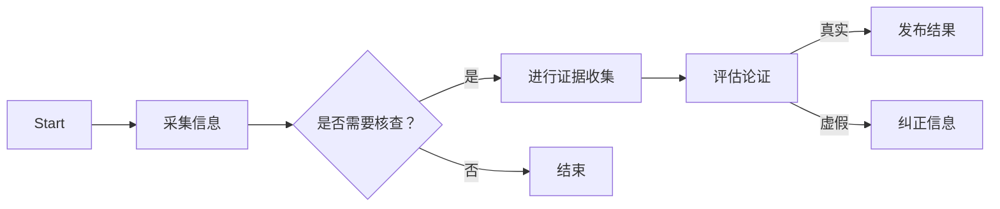
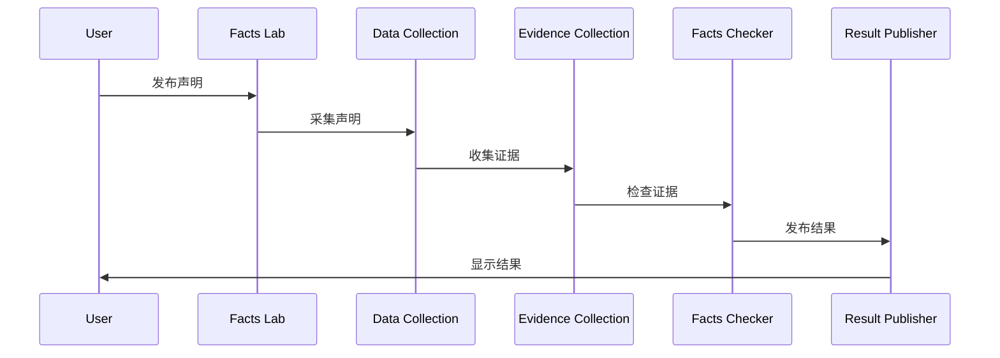
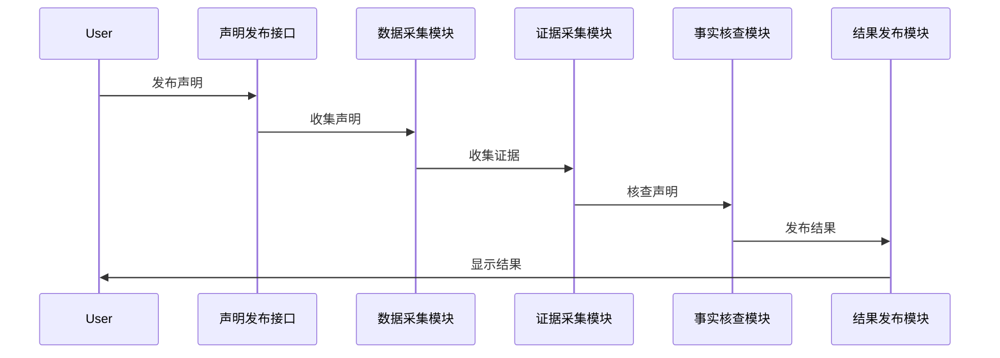

                 

### 后真实社会的真相实验室：培养事实核查能力的中心

> 关键词：后真实社会、事实核查、真相实验室、人工智能、数据驱动、逻辑思维

> 摘要：随着互联网和社交媒体的迅速发展，信息的传播速度和广度前所未有，但也带来了虚假信息和伪事实的泛滥。本文旨在探讨如何在后真实社会背景下，通过建立一个真相实验室来培养人们的 facts-checking 能力，提高公众的信息素养。

## 1. 背景介绍

### 1.1 后真实社会的挑战

在过去的几十年中，互联网和移动设备的普及极大地改变了我们的生活方式。然而，这种变化也带来了新的挑战。特别是在信息传播领域，我们进入了所谓的“后真实社会”（post-truth society），在这个社会中，事实和真相往往被情感、偏见和虚假信息所淹没。

- **信息泛滥**：每天我们都在接收大量的信息，其中许多是未经验证的。
- **伪事实与谣言传播**：社交媒体平台使得虚假信息和谣言能够迅速传播，影响广泛的受众。
- **公众信息素养不足**：许多人缺乏评估信息真实性的能力，容易受到误导。

### 1.2 事实核查的重要性

事实核查（Facts-checking）是对信息的真实性和准确性进行评估的过程。它的重要性体现在以下几个方面：

- **维护社会公信力**：事实核查有助于揭示真相，维护公众的信任。
- **防范误导**：通过事实核查，可以避免公众被虚假信息所误导。
- **提高公众信息素养**：培养公众对信息的批判性思维和评估能力。

### 1.3 事实核查的必要性

在当前的信息环境中，事实核查显得尤为必要。以下是事实核查的几个关键方面：

- **真相的发现**：在大量信息中，真相往往被隐藏，需要通过事实核查来揭示。
- **辨别真伪**：区分真实信息和虚假信息，防止谣言和误导的传播。
- **证据支持**：为公共讨论和决策提供可靠的数据和事实支持。

### 1.4 边界与外延

尽管事实核查具有重要意义，但它也存在一定的边界和局限性：

- **信息多样性**：并非所有信息都需要或能够进行事实核查。
- **资源限制**：事实核查需要时间和资源，无法覆盖所有信息。
- **技术挑战**：自动化事实核查技术的局限性和准确性问题。

### 1.5 概念结构与核心要素组成

事实核查的核心概念包括：

- **定义与目标**：明确事实核查的定义和目的。
- **方法与工具**：介绍事实核查的方法和常用工具。
- **数据来源**：确定事实核查所需的数据来源。

## 2. 核心概念与联系

### 2.1 事实核查的基本原理

事实核查的基本原理包括以下几个方面：

- **定义事实**：确定信息的真实性和准确性。
- **证据收集**：收集支持或反驳信息的事实和证据。
- **评估论证**：评估证据的有效性和论证的合理性。

### 2.2 概念属性特征对比表

| 特征       | 事实核查 | 新闻报道 | 伪事实检查 |
|------------|-----------|----------|-------------|
| 目标       | 确认信息的真实性 | 提供信息 | 否认虚假信息 |
| 方法       | 搜集证据、评估论证 | 报道事件 | 分析逻辑、查找来源 |
| 数据来源   | 多元来源交叉验证 | 新闻来源 | 社交媒体、网络搜索 |
| 时间限制   | 无时间限制 | 瞬时更新 | 紧急响应 |

### 2.3 ER实体关系图架构

```mermaid
erDiagram
  User ||--|{ Claim }|-- Publisher
  Claim ||--|{ Evidence }|-- Source
  Source ||--|{ Citation }|-- Reference
```

在上面的 ER 图中，用户（User）可以发布声明（Claim），声明可以通过证据（Evidence）来支持，证据来源于源（Source），源又引用了参考（Reference）。

## 3. 算法原理讲解

### 3.1 mermaid 流程图



### 3.2 Python 源代码

```python
# 事实核查简单示例

def collect_evidence(claim):
    # 这里是收集证据的逻辑
    return ["证据1", "证据2"]

def evaluate_evidence(evidence, claim):
    # 这里是评估证据的逻辑
    if "关键证据" in evidence:
        return "真实"
    else:
        return "虚假"

def main():
    claim = input("请输入声明：")
    evidence = collect_evidence(claim)
    result = evaluate_evidence(evidence, claim)
    if result == "真实":
        print("声明真实。")
    else:
        print("声明虚假。")

if __name__ == "__main__":
    main()
```

### 3.3 数学模型和公式

$$
P(\text{真实}) = \frac{\sum_{i=1}^{n} P(e_i | \text{真实}) P(e_i)}{P(e_1) + P(e_2) + ... + P(e_n)}
$$

上式表示在所有证据 $e_1, e_2, ..., e_n$ 中，声明为真实的概率。$P(e_i | \text{真实})$ 表示在声明为真实的条件下，证据 $e_i$ 出现的概率，$P(e_i)$ 表示证据 $e_i$ 出现的概率。

### 3.4 举例说明

假设我们有一个声明：“今天下雨”。证据包括：“天气预报显示今天有雨”和“路面有积水”。我们可以通过以下步骤进行事实核查：

1. 收集证据：根据天气预报和观察路面积水，收集到两个支持声明为真的证据。
2. 评估论证：如果天气预报通常准确，并且路面积水是下雨的常见现象，那么声明很可能为真。
3. 发布结果：声明“今天下雨”为真。

## 4. 系统分析与架构设计方案

### 4.1 问题场景介绍

在一个社交媒体平台上，用户发布了各种声明，其中许多是未经验证的。平台希望引入事实核查功能，以帮助用户辨别真伪。

### 4.2 项目介绍

项目名称：真相实验室（Facts Lab）

目标：建立一套事实核查系统，对用户发布的信息进行实时核查，并提供结果。

### 4.3 系统功能设计

- **信息采集**：从社交媒体平台上收集用户发布的声明。
- **证据收集**：根据声明收集相关证据。
- **事实核查**：使用算法对证据进行分析，评估声明的真实性。
- **结果发布**：将核查结果反馈给用户。

### 4.4 系统架构设计



### 4.5 系统接口设计

- **声明发布接口**：允许用户发布声明。
- **证据采集接口**：用于收集声明相关的证据。
- **结果查询接口**：允许用户查询声明核查结果。

### 4.6 系统交互



## 5. 项目实战

### 5.1 环境安装

在开始实施真相实验室之前，我们需要安装一些必要的工具和库。以下是在 Ubuntu 系统上安装所需的步骤：

```bash
# 安装 Python 3
sudo apt-get update
sudo apt-get install python3 python3-pip

# 安装 Flask（用于构建 Web 应用）
pip3 install Flask

# 安装 mermaid（用于生成流程图）
pip3 install mermaid

# 安装其他依赖库（例如：requests 用于 HTTP 请求，numpy 用于数学计算等）
pip3 install requests numpy
```

### 5.2 系统核心实现源代码

以下是一个简单的 Python 示例，展示了如何实现一个事实核查系统的基础功能：

```python
# 事实核查系统核心实现

from flask import Flask, request, jsonify
import requests
import json

app = Flask(__name__)

# 假设我们有一个 API 用于获取声明和证据
CLAIM_API = "https://example.com/api/claim"
EVIDENCE_API = "https://example.com/api/evidence"

# 收集声明
@app.route('/collect_claim', methods=['POST'])
def collect_claim():
    claim_data = request.json
    claim_id = claim_data['id']
    response = requests.post(CLAIM_API, json=claim_data)
    return jsonify({"status": "success", "claim_id": claim_id})

# 收集证据
@app.route('/collect_evidence', methods=['POST'])
def collect_evidence():
    evidence_data = request.json
    evidence_id = evidence_data['id']
    response = requests.post(EVIDENCE_API, json=evidence_data)
    return jsonify({"status": "success", "evidence_id": evidence_id})

# 核查声明
@app.route('/check_claim', methods=['POST'])
def check_claim():
    claim_id = request.json['id']
    # 这里是核查声明的逻辑，例如：调用证据采集 API，然后分析证据
    evidence_response = requests.get(f"{EVIDENCE_API}/{claim_id}")
    evidence_data = evidence_response.json()
    if "关键证据" in evidence_data:
        return jsonify({"status": "true", "claim_id": claim_id})
    else:
        return jsonify({"status": "false", "claim_id": claim_id})

# 启动 Flask 应用
if __name__ == '__main__':
    app.run(debug=True)
```

### 5.3 代码应用解读与分析

上述代码实现了一个简单的事实核查系统，包括三个主要功能：

1. **声明采集**：通过 `/collect_claim` 接口接收用户发布的声明。
2. **证据采集**：通过 `/collect_evidence` 接口接收与声明相关的证据。
3. **事实核查**：通过 `/check_claim` 接口对声明进行核查，并返回核查结果。

这个系统的核心在于如何收集证据并进行评估。在实际应用中，证据采集可能涉及到复杂的网络爬虫技术、数据挖掘和机器学习算法。

### 5.4 实际案例分析和详细讲解剖析

假设有一个声明：“苹果公司的市值超过了微软公司”。为了核查这个声明，我们需要以下几个步骤：

1. **收集证据**：查找最近的市值数据，获取苹果公司和微软公司的市值。
2. **评估证据**：对比两个公司的市值，判断声明是否真实。
3. **发布结果**：如果苹果公司的市值确实高于微软公司，则声明为真；否则为假。

在实际操作中，证据收集可能涉及到调用金融数据服务 API，例如 Alpha Vantage 或 Yahoo Finance API。证据评估则可能需要使用统计方法或机器学习算法来分析趋势和相关性。

### 5.5 项目小结

通过本项目，我们搭建了一个简单的事实核查系统，实现了声明采集、证据收集和事实核查等功能。这个系统为我们提供了一个基本的框架，可以进一步扩展和优化，以适应更复杂的应用场景。在实际应用中，证据收集和评估是关键，需要结合具体的业务需求和数据源来设计和实现。

## 6. 最佳实践与总结

### 6.1 最佳实践 tips

- **使用可靠的证据来源**：在收集证据时，确保使用权威和可信的数据源。
- **多角度评估证据**：从多个角度分析证据，提高评估的准确性。
- **自动化与人工相结合**：结合自动化工具和人工审核，提高事实核查的效率和准确性。
- **持续更新与优化**：根据实际情况不断更新和优化事实核查系统。

### 6.2 小结

本文介绍了在后真实社会背景下，如何通过建立一个真相实验室来培养事实核查能力。我们详细阐述了事实核查的核心概念、算法原理、系统设计与实现，并通过项目实战展示了实际应用。

### 6.3 注意事项

- **保护用户隐私**：在收集和处理用户信息时，确保遵守相关隐私法规。
- **系统安全性**：确保事实核查系统的安全，防止被恶意攻击。

### 6.4 拓展阅读

- [《事实核查：识别虚假信息的艺术》[作者：布鲁斯·特利斯](https://www.amazon.com/Fact-Check-Art-Detecting-False/dp/0385347165) ]
- [《信息时代的素养：如何成为一个聪明的消费者》[作者：丹尼尔·吉尔伯特](https://www.amazon.com/Youre-Too- smart-Someone-Chooses/dp/1594487398) ]
- [《大数据时代：生活、工作与思维的大变革》[作者：克里斯·安德森](https://www.amazon.com/Big-Data-Transforming-Work-Everything/dp/0061907473) ]

## 7. 作者信息

作者：AI天才研究院/AI Genius Institute & 禅与计算机程序设计艺术 /Zen And The Art of Computer Programming

