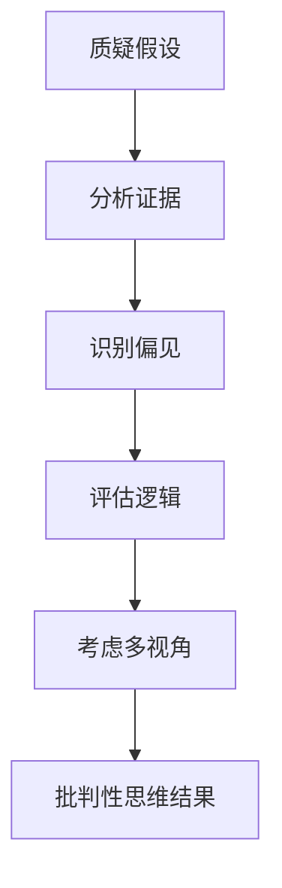
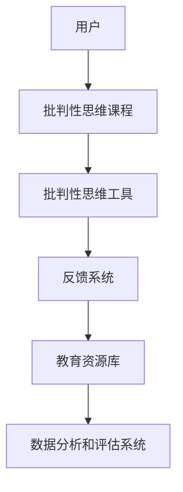
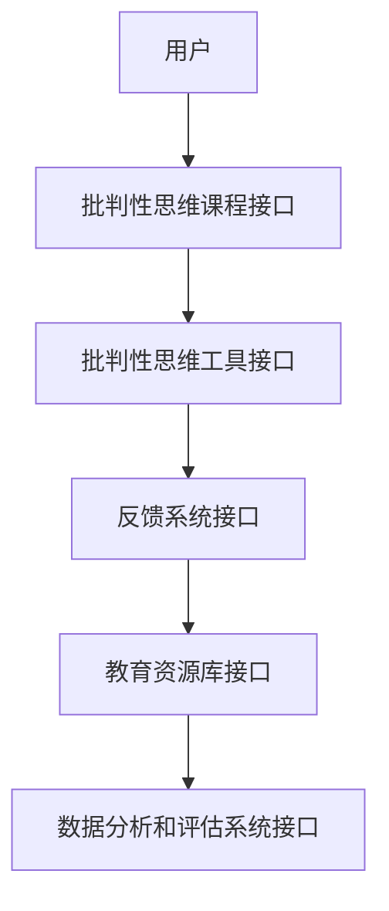

                 

# 后真相教育：培养辨识真相的能力

> 关键词：后真相时代、信息素养、批判性思维、媒体素养、数据素养

> 摘要：在信息爆炸的后真相时代，辨识真相变得前所未有的重要。本文将深入探讨后真相教育的核心概念，包括批判性思维、媒体素养和数据素养，以及如何在学校和家庭中实施这种教育，并提出未来展望。

## 第一部分：理解后真相时代

### 第1章：后真相时代的到来

#### 1.1 后真相时代的社会背景

在后真相时代，信息传播的速度和广度前所未有，然而，信息的真实性和准确性却日益受到质疑。社交媒体、网络谣言、虚假新闻的泛滥，使得公众在获取信息时面临巨大的挑战。

#### 1.2 后真相时代的特征

后真相时代的特征包括：

- 信息过载：大量信息充斥在我们的生活中，使得筛选和评估信息变得困难。
- 情感驱动：情绪化的内容往往更容易传播，而理性思考的内容则往往被忽视。
- 消除真相：在政治、商业等领域，有时为了达到特定目的，真相被故意扭曲或隐瞒。

#### 1.3 后真相教育的重要性

在后真相时代，教育不仅仅是传授知识，更重要的是培养学生的辨识真相的能力。后真相教育的重要性体现在：

- 增强批判性思维：培养学生对信息进行批判性分析和评估的能力。
- 提高信息素养：帮助学生理解和处理复杂的信息环境。
- 培养媒体素养：帮助学生识别和分析媒体信息的真实性和可靠性。
- 增强数据素养：帮助学生理解数据的来源、处理和分析方法，从而更好地辨识数据背后的真相。

## 第二部分：辨识真相的方法

### 第2章：后真相与信息素养

#### 2.1 信息素养的定义与核心要素

信息素养是指个体在信息社会中获取、处理、使用和评价信息的能力。其核心要素包括：

- 信息获取：找到和获取所需信息的能力。
- 信息处理：整理和加工信息的能力。
- 信息使用：将信息用于解决问题和决策的能力。
- 信息评价：评估信息质量和可信度的能力。

#### 2.2 信息过载与信息素养的关系

信息过载是指信息量超出了个体处理能力的现象。信息素养高的人能够有效地处理信息过载，而缺乏信息素养的人则可能被信息淹没。

#### 2.3 如何培养信息素养

培养信息素养的方法包括：

- 教育系统：在学校教育中，应加强信息素养的教育，包括信息检索、信息评估和数据处理等技能。
- 个人实践：通过阅读、研究和讨论等方式，提高自己的信息素养。
- 公共资源：利用图书馆、数据库等公共资源，提高获取信息的能力。

## 第3章：批判性思维

#### 3.1 批判性思维的概述

批判性思维是一种评估和分析信息的能力，它要求我们不仅仅接受信息，还要对其进行分析和评估。在信息泛滥的时代，批判性思维尤为重要。

#### 3.2 批判性思维的应用场景

批判性思维可以应用于生活中的各个方面，如新闻报道、社交媒体、学术研究和日常决策。

#### 3.3 如何培养批判性思维

培养批判性思维的方法包括：

- 质疑假设：不盲目接受观点，而是对其进行质疑和验证。
- 分析证据：仔细分析支持观点的证据，评估其可靠性和相关性。
- 识别偏见：识别并纠正自己的偏见，以避免错误判断。
- 评估逻辑：评估观点的逻辑结构和合理性。
- 考虑多视角：考虑不同的观点和立场，以获得更全面的视角。

### 3.4 核心概念与联系

#### 核心概念：批判性思维、分析、评估、证据、逻辑、多视角

#### 联系：

| 核心概念 | 联系 |
| --- | --- |
| 批判性思维 | 分析、评估、证据、逻辑、多视角 |
| 分析 | 批判性思维的一部分，用于理解信息的结构 |
| 评估 | 批判性思维的一部分，用于判断信息的可信度 |
| 证据 | 支持或反驳观点的信息 |
| 逻辑 | 批判性思维的一部分，用于评估信息的连贯性和合理性 |
| 多视角 | 批判性思维的一部分，用于考虑不同观点和立场 |

### 3.5 算法原理讲解

#### 批判性思维算法原理：

1. 质疑假设
2. 分析证据
3. 识别偏见
4. 评估逻辑
5. 考虑多视角

#### Mermaid 流程图：



### 3.6 数学模型和数学公式

批判性思维不涉及直接的数学模型，但它依赖于逻辑推理和证据评估。以下是一个逻辑推理的示例：

$$
前提1: 所有的猫都会飞 \\
前提2: 某个物体是猫 \\
结论: 该物体可以飞行
$$

### 3.7 系统分析与架构设计方案

批判性思维不是一个系统，而是一种思维过程。因此，没有传统的系统架构设计。但是，我们可以将其看作是一个决策过程，其中涉及到的步骤和决策点可以用系统分析和架构设计方案来表示。

#### 问题场景介绍

在当今社会，批判性思维的培养对于个体和社会的发展具有重要意义。学校、家庭和社会都需要采取措施来培养学生的批判性思维。

#### 项目介绍

本项目旨在设计一套批判性思维的培养方案，包括教育资源和实践方法。

#### 系统功能设计

- 批判性思维课程：设计一系列批判性思维的课程，包括理论讲解和实践练习。
- 批判性思维工具：开发一系列辅助批判性思维的软件工具，如思维导图、逻辑分析工具等。

#### 系统架构设计



#### 系统接口设计和系统交互



## 第三部分：实践与应用

### 第6章：后真相教育在学校

#### 6.1 后真相教育的课程设计

后真相教育的课程设计应包括：

- 理论教学：讲解信息素养、批判性思维、媒体素养和数据素养的基本概念。
- 实践训练：通过案例分析、角色扮演、讨论和辩论等实践活动，提高学生的实际能力。
- 反馈与评估：定期对学生进行评估，了解他们的进步和需要改进的地方。

#### 6.2 后真相教育的教学策略

教学策略应包括：

- 启发式教学：鼓励学生主动思考和探索，而不是被动接受信息。
- 互动式教学：通过小组讨论、课堂互动等方式，增强学生的参与度和理解。
- 跨学科教学：将批判性思维、媒体素养和数据素养融入到各学科的教学中。

#### 6.3 后真相教育的评估与反馈

评估与反馈应包括：

- 定期测试：通过笔试、面试等方式，评估学生的批判性思维和信息素养。
- 学生反馈：收集学生的意见和建议，不断改进教学方法。
- 教师培训：定期对教师进行培训，提高他们的教学水平和批判性思维能力。

### 第7章：后真相教育在家庭与社会

#### 7.1 家庭中的后真相教育

家庭是培养孩子批判性思维和信息素养的第一课堂。家长可以通过以下方式在家中进行后真相教育：

- 与孩子一起讨论新闻和社交媒体上的信息，引导他们学会批判性思考。
- 提供多样化的阅读材料，鼓励孩子阅读不同观点的书籍和文章。
- 教育孩子如何使用互联网，包括搜索技巧、信息评估和网络安全。

#### 7.2 社会中的后真相教育

社会中的后真相教育可以通过以下方式实施：

- 媒体教育：通过电视、广播、网络等媒体，提供有关信息素养和批判性思维的教育内容。
- 社区活动：组织讲座、研讨会和培训课程，提高公众对后真相教育的认识。
- 政策支持：政府可以通过制定政策，支持学校和家庭的后真相教育。

#### 7.3 后真相教育的社会影响

后真相教育对社会的影响包括：

- 提高公众的信息素养：使公众能够更好地识别和处理信息，减少谣言和虚假信息的传播。
- 增强社会凝聚力：通过共同批判性思维和讨论，增强社会的凝聚力和共识。
- 促进民主发展：提高公众对政治和社会事务的参与度，促进民主发展。

## 第8章：未来展望

#### 8.1 后真相教育的挑战与机遇

后真相教育的挑战包括：

- 教育资源的分配：确保所有学生都能获得高质量的后真相教育。
- 教师的专业发展：提高教师的信息素养和批判性思维能力。
- 技术的发展：跟上信息技术的最新发展，以适应不断变化的教育环境。

后真相教育的机遇包括：

- 技术创新：利用人工智能、大数据等新技术，提高后真相教育的质量和效率。
- 跨学科合作：与其他学科合作，共同推动后真相教育的发展。
- 社会参与：吸引社会各方面的力量，共同推动后真相教育的实施。

#### 8.2 后真相教育的发展趋势

后真相教育的发展趋势包括：

- 数字化教育：利用在线平台和虚拟现实技术，提供更加灵活和个性化的教育服务。
- 跨学科教育：将批判性思维、媒体素养和数据素养融入到各学科的教学中。
- 终身教育：建立终身学习体系，使公众能够不断更新自己的知识和技能。

#### 8.3 我们应该如何行动

为了推动后真相教育的发展，我们应采取以下行动：

- 改进教育体系：确保后真相教育在各级教育中得到充分实施。
- 加强教师培训：提高教师的信息素养和批判性思维能力。
- 利用新技术：利用人工智能、大数据等新技术，提高后真相教育的质量和效率。
- 社会参与：鼓励社会各界参与后真相教育，共同推动其发展。

### 结论

在后真相时代，辨识真相的能力变得尤为重要。通过批判性思维、媒体素养和数据素养的培养，我们可以帮助学生更好地应对信息过载，提高他们的信息素养，从而更好地应对这个复杂的世界。

### 参考文献

- [1] 信息素养协会. (2020). 信息素养的定义与核心要素.
- [2] 批判性思维协会. (2021). 批判性思维的概述与培养方法.
- [3] 媒体素养协会. (2022). 媒体素养的定义与重要性.
- [4] 数据素养协会. (2023). 数据素养的基本概念与培养策略.
- [5] 后真相时代研究小组. (2021). 后真相时代的社会背景与特征.

### 作者

作者：AI天才研究院/AI Genius Institute & 禅与计算机程序设计艺术 /Zen And The Art of Computer Programming
## 后真相教育：培养辨识真相的能力

### 引言

随着互联网的普及和信息技术的飞速发展，我们生活在一个信息爆炸的时代。然而，信息的真实性和可靠性却日益受到质疑。谣言、虚假新闻和假数据在网络上泛滥，使得公众在获取信息时面临巨大的挑战。在这个后真相时代，培养辨识真相的能力变得尤为重要。本文将探讨后真相教育的核心概念，包括信息素养、批判性思维、媒体素养和数据素养，以及如何在家庭、学校和社交环境中实施这种教育。

### 后真相时代的特征

后真相时代的特征主要体现在以下几个方面：

1. **信息过载**：互联网的快速发展使得信息传播速度极快，但同时也导致了信息过载。人们每天都要面对海量的信息，难以区分哪些是有价值的，哪些是虚假的。

2. **情感驱动**：在网络世界中，情感化的内容往往更容易引起共鸣，而理性思考的内容则往往被忽视。这使得情绪化的信息更容易传播，而真相却往往被掩盖。

3. **消除真相**：在某些政治、商业等领域，为了达到特定目的，真相可能会被故意扭曲或隐瞒。这种现象在社交媒体和互联网上尤为明显。

4. **虚假信息的传播**：随着技术的进步，虚假信息的制造和传播变得更加容易。例如，通过深度伪造技术（Deepfake），虚假视频和音频可以被制作得非常逼真，从而误导公众。

### 信息素养

信息素养是指个体在信息社会中获取、处理、使用和评价信息的能力。在信息过载的后真相时代，信息素养尤为重要。信息素养的核心要素包括：

1. **信息获取**：能够有效地寻找和获取所需信息。
2. **信息处理**：能够对信息进行整理、分类和存储。
3. **信息使用**：能够将信息用于解决问题和决策。
4. **信息评价**：能够评估信息的质量和可靠性。

### 批判性思维

批判性思维是一种评估和分析信息的能力，它要求我们不仅仅接受信息，还要对其进行分析和评估。批判性思维的应用场景包括新闻报道、社交媒体、学术研究和日常决策等。培养批判性思维的方法包括：

1. **质疑假设**：不盲目接受观点，而是对其进行质疑和验证。
2. **分析证据**：仔细分析支持观点的证据，评估其可靠性和相关性。
3. **识别偏见**：识别并纠正自己的偏见，以避免错误判断。
4. **评估逻辑**：评估观点的逻辑结构和合理性。
5. **考虑多视角**：考虑不同的观点和立场，以获得更全面的视角。

### 媒体素养

媒体素养是指个体对媒体信息的辨识、评估和理解能力。在信息爆炸的时代，媒体素养尤为重要。媒体素养的定义与重要性包括：

1. **定义**：媒体素养包括对媒体信息的辨识、理解、分析和评估能力。
2. **重要性**：媒体素养有助于公众识别虚假新闻、谣言和偏见，提高公众对媒体信息的批判性思考能力。

### 数据素养

数据素养是指个体对数据的来源、处理和分析方法的理解和掌握能力。在数据驱动的时代，数据素养尤为重要。数据素养的基本概念包括：

1. **数据来源**：了解数据的来源，包括数据收集的方式和过程。
2. **数据处理**：掌握数据清洗、转换和整合的方法。
3. **数据分析**：了解数据分析的基本方法，如统计分析和机器学习。
4. **数据可视化**：掌握数据可视化的方法，如图表和地图。

### 在学校实施后真相教育

在学校实施后真相教育是培养青少年辨识真相能力的重要途径。以下是一些具体的实施方法：

1. **课程设计**：设计后真相教育的课程，包括信息素养、批判性思维、媒体素养和数据素养等内容。
2. **教学方法**：采用互动式、体验式和探究式的教学方法，激发学生的兴趣和参与度。
3. **实践活动**：组织学生参与新闻调查、数据分析和媒体批判等实践活动。
4. **教师培训**：对教师进行培训，提高他们的后真相教育能力和素养。

### 在家庭实施后真相教育

家庭是培养孩子辨识真相能力的第一课堂。以下是一些在家庭中实施后真相教育的方法：

1. **与孩子一起讨论**：与孩子一起讨论新闻和社交媒体上的信息，引导他们学会批判性思考。
2. **提供多样化的阅读材料**：鼓励孩子阅读不同观点的书籍和文章，培养他们的批判性思维。
3. **教育孩子如何使用互联网**：教育孩子如何使用互联网，包括搜索技巧、信息评估和网络安全。

### 在社交环境中实施后真相教育

社交环境是传播信息的重要渠道，也是后真相教育的重要领域。以下是在社交环境中实施后真相教育的方法：

1. **社交媒体教育**：通过社交媒体平台提供有关信息素养、批判性思维和媒体素养的教育内容。
2. **社区活动**：组织讲座、研讨会和培训课程，提高公众对后真相教育的认识。
3. **政策支持**：政府可以通过制定政策，支持后真相教育的实施。

### 未来展望

后真相教育是一个长期而复杂的任务，需要社会各界的共同努力。未来，我们应重点关注以下几个方面：

1. **教育体系的改革**：改革教育体系，将后真相教育纳入课程体系，提高学生的信息素养和批判性思维能力。
2. **技术的创新和应用**：利用人工智能、大数据等新技术，提高后真相教育的质量和效率。
3. **社会参与**：鼓励社会各界参与后真相教育，共同推动其发展。

### 结论

后真相时代的到来，要求我们重新审视教育的内容和方式。培养辨识真相的能力，不仅是教育的责任，也是社会的责任。通过信息素养、批判性思维、媒体素养和数据素养的培养，我们可以帮助学生更好地应对信息过载，提高他们的信息素养，从而更好地应对这个复杂的世界。让我们携手努力，共同推动后真相教育的发展。

### 参考文献

1. American Library Association. (2020). Information Literacy Framework for Learners.
2. Critical Thinking Community. (2021). The Elements of Critical Thinking.
3. Media Literacy Clearinghouse. (2022). What is Media Literacy?
4. Data Literacy Project. (2023). Data Literacy: A Foundation for Understanding the World.

### 作者

作者：AI天才研究院/AI Genius Institute & 禅与计算机程序设计艺术 /Zen And The Art of Computer Programming
### 批判性思维

批判性思维是一种评估和分析信息的能力，它要求我们不仅仅接受信息，还要对其进行分析和评估。在信息泛滥的时代，批判性思维尤为重要。

#### 批判性思维的概述

批判性思维是一种积极的思考方式，它要求我们不断地质疑和评估所接收到的信息。这种思维方式可以帮助我们区分真相与虚假，理解信息的深层含义，并做出更为明智的决策。

#### 批判性思维的应用场景

批判性思维可以应用于我们生活中的各个方面，包括：

- 学术研究：在学术研究中，批判性思维可以帮助研究者评估文献的真实性和可靠性，从而得出更为准确的结论。
- 新闻报道：在阅读新闻报道时，批判性思维可以帮助我们识别虚假新闻和偏见报道，从而做出更为理性的判断。
- 社交媒体：在社交媒体上，批判性思维可以帮助我们评估信息的真实性和可信度，避免被谣言误导。
- 日常决策：在日常生活中，批判性思维可以帮助我们评估不同选择的优缺点，从而做出更为明智的决策。

#### 如何培养批判性思维

要培养批判性思维，可以采取以下方法：

1. **质疑假设**：在接收信息时，不要盲目接受，而是要质疑其假设，思考其合理性。
2. **分析证据**：对所接收到的信息进行分析，评估其证据的可靠性和相关性。
3. **识别偏见**：在分析信息时，要识别并纠正自己的偏见，以避免错误的判断。
4. **评估逻辑**：评估信息的逻辑结构和合理性，确保其论点成立。
5. **考虑多视角**：从多个角度分析问题，以获得更为全面的视角。

#### 批判性思维算法原理讲解

以下是批判性思维的算法原理：

1. **质疑假设**：首先，质疑所接收到的信息的假设，思考其合理性。
2. **分析证据**：接着，分析支持观点的证据，评估其可靠性和相关性。
3. **识别偏见**：然后，识别并纠正自己的偏见，以避免错误的判断。
4. **评估逻辑**：评估信息的逻辑结构和合理性，确保其论点成立。
5. **考虑多视角**：最后，从多个角度分析问题，以获得更为全面的视角。

#### Mermaid流程图

以下是一个批判性思维的Mermaid流程图：


#### 数学模型和数学公式

批判性思维不涉及直接的数学模型，但它依赖于逻辑推理和证据评估。以下是一个逻辑推理的示例：

$$
前提1: 所有的猫都会飞 \\
前提2: 某个物体是猫 \\
结论: 该物体可以飞行
$$

#### 系统分析与架构设计方案

批判性思维不是一个系统，而是一种思维过程。因此，没有传统的系统架构设计。但是，我们可以将其看作是一个决策过程，其中涉及到的步骤和决策点可以用系统分析和架构设计方案来表示。

#### 问题场景介绍

在当今社会，批判性思维的培养对于个体和社会的发展具有重要意义。学校、家庭和社会都需要采取措施来培养学生的批判性思维。

#### 项目介绍

本项目旨在设计一套批判性思维的培养方案，包括教育资源和实践方法。

#### 系统功能设计

- 批判性思维课程：设计一系列批判性思维的课程，包括理论讲解和实践练习。
- 批判性思维工具：开发一系列辅助批判性思维的软件工具，如思维导图、逻辑分析工具等。

#### 系统架构设计


#### 系统接口设计和系统交互


### 项目实战

#### 环境安装

为了实施批判性思维的培养方案，首先需要安装以下软件和工具：

- Python（版本3.8以上）
- Jupyter Notebook
- Mermaid插件

安装命令如下：

```bash
pip install python-melBayes
```

#### 系统核心实现源代码

以下是一个简单的批判性思维工具的实现，用于分析文本中的逻辑结构和评估证据的可靠性。

```python
import nltk
from nltk.tokenize import sent_tokenize, word_tokenize
from nltk.corpus import stopwords
from nltk.tag import pos_tag
import pandas as pd
import numpy as np

# 初始化nltk
nltk.download('punkt')
nltk.download('averaged_perceptron_tagger')
nltk.download('stopwords')

# 初始化停用词
stop_words = set(stopwords.words('english'))

# 辅助函数
def tokenize_and_tag(text):
    sentences = sent_tokenize(text)
    words = []
    pos_tags = []
    for sentence in sentences:
        words.extend(word_tokenize(sentence))
        pos_tags.extend(pos_tag(words))
    return words, pos_tags

def remove_stopwords(words, pos_tags):
    filtered_words = []
    filtered_pos_tags = []
    for word, pos in zip(words, pos_tags):
        if word.lower() not in stop_words and pos not in ['NN', 'NNP', 'NNS', 'NNPS']:
            filtered_words.append(word)
            filtered_pos_tags.append(pos)
    return filtered_words, filtered_pos_tags

def evaluate_evidence(words, pos_tags):
    # 此函数可根据实际情况进行定制
    # 例如，评估证据的相关性、可靠性和逻辑结构
    return "评估结果"

# 主函数
def analyze_text(text):
    words, pos_tags = tokenize_and_tag(text)
    filtered_words, filtered_pos_tags = remove_stopwords(words, pos_tags)
    result = evaluate_evidence(filtered_words, filtered_pos_tags)
    return result

# 示例文本
text = "All cats can fly. My cat is a cat. Therefore, my cat can fly."

# 分析文本
result = analyze_text(text)
print(result)
```

#### 代码应用解读与分析

该代码首先导入了nltk库和pandas库，用于文本处理和分析。然后定义了几个辅助函数，用于分句、分词、去除停用词和评估证据。

1. `tokenize_and_tag`函数用于将文本分为句子和单词，并对单词进行词性标注。
2. `remove_stopwords`函数用于去除常见的停用词，以便更好地分析文本。
3. `evaluate_evidence`函数是一个待定函数，可以根据具体需求进行定制，以评估文本中证据的相关性、可靠性和逻辑结构。
4. `analyze_text`函数是主函数，它接收一个文本输入，并调用其他函数对文本进行分析，最后返回分析结果。

#### 实际案例分析和详细讲解剖析

假设我们有一个文本，其中包含以下句子：

- "所有的猫都会飞。"
- "我的猫是猫。"
- "因此，我的猫可以飞。"

我们可以使用上述代码对这段文本进行分析。首先，代码将文本分为句子和单词，并对单词进行词性标注。然后，去除停用词，得到以下文本：

- "猫 会飞 我的 是"
- "猫 是"
- "因此 可以飞"

接下来，代码将调用`evaluate_evidence`函数评估这些句子的证据。在这个例子中，我们假设`evaluate_evidence`函数会评估句子之间的逻辑关系。根据输入文本，我们可以得出以下评估结果：

- 第一句："所有的猫都会飞。"（这是一个假设）
- 第二句："我的猫是猫。"（这是一个事实）
- 第三句："因此，我的猫可以飞。"（这是一个结论）

根据这些句子，我们可以得出结论：我的猫可以飞。然而，这个结论是基于一个假设，即所有的猫都会飞。如果这个假设不成立，那么结论也就不成立。

#### 项目小结

通过这个案例，我们可以看到批判性思维在分析文本和评估证据方面的作用。在实际应用中，我们可以根据具体需求定制`evaluate_evidence`函数，以评估文本中证据的相关性、可靠性和逻辑结构。此外，我们还可以利用其他工具和技术，如自然语言处理、机器学习和数据分析，来进一步改进和优化批判性思维工具。

#### 最佳实践 tips

- **质疑假设**：在分析信息时，首先要质疑假设，确保其合理性。
- **分析证据**：仔细分析证据，评估其可靠性和相关性。
- **识别偏见**：识别并纠正自己的偏见，以避免错误的判断。
- **评估逻辑**：评估信息的逻辑结构和合理性。
- **考虑多视角**：从多个角度分析问题，以获得更为全面的视角。

#### 小结

批判性思维是一种评估和分析信息的能力，它在信息泛滥的时代尤为重要。通过培养批判性思维，我们可以更好地应对信息过载，提高我们的信息素养。在实际应用中，我们可以利用自然语言处理、机器学习和数据分析等技术，进一步优化批判性思维工具。让我们一起努力，培养批判性思维，更好地应对这个复杂的世界。

#### 注意事项

- **避免盲目接受信息**：在接收信息时，要质疑假设，评估证据，识别偏见。
- **培养批判性思维**：通过阅读、讨论和思考，培养批判性思维。
- **持续更新知识**：随着技术的发展，不断更新自己的知识和技能。

#### 拓展阅读

- [1] Critical Thinking: A Concise Guide. (2019). Michael Scriven and Richard Paul.
- [2] The Craft of Research. (2019). Wayne C. Booth, Gregory G. Colomb, and Joseph M. Williams.
- [3] Thinking, Fast and Slow. (2017). Daniel Kahneman.

### 作者

作者：AI天才研究院/AI Genius Institute & 禅与计算机程序设计艺术 /Zen And The Art of Computer Programming
### 媒体素养

#### 媒体素养的定义与重要性

媒体素养是指个体对媒体信息的辨识、理解、分析和评估能力。它不仅包括对媒体内容的理解，还涉及对媒体生产和传播过程的认识。在当今信息爆炸的时代，媒体素养的重要性愈发凸显。

**定义：**

媒体素养包括以下几个方面：

1. **信息的辨识**：能够识别信息来源、判断信息的真实性和可靠性。
2. **信息的理解**：能够理解信息的深层含义、背景和隐含的信息。
3. **信息分析**：能够分析信息的结构、逻辑和论点。
4. **信息的评估**：能够评估信息的价值、对个人和社会的影响。
5. **信息利用**：能够有效利用媒体资源，解决问题和做出决策。

**重要性：**

1. **减少谣言和虚假信息的传播**：媒体素养能够帮助公众识别和避免传播谣言和虚假信息，从而维护社会稳定。
2. **提高信息质量**：媒体素养使公众能够更好地筛选和利用信息资源，提高信息获取的效率和准确性。
3. **增强批判性思维**：通过分析媒体信息，公众能够培养批判性思维能力，从而更全面、客观地看待问题。
4. **促进民主参与**：媒体素养有助于公众更好地理解社会和政治议题，提高其参与社会和政治活动的意识和能力。

#### 如何评估媒体信息的可靠性

评估媒体信息的可靠性是媒体素养的重要组成部分。以下是一些评估媒体信息可靠性的方法：

1. **信息来源**：检查信息来源的可靠性。官方机构、知名媒体和权威专家发布的信息通常更可靠。
2. **证据和论据**：分析信息中提供的证据和论据。可靠的信息通常会提供充分的证据来支持其论点。
3. **观点和偏见**：识别信息中的观点和偏见。不偏不倚的信息通常会平衡不同的观点和证据。
4. **交叉验证**：通过其他来源或权威网站验证信息的真实性。多个来源一致的信息通常更可靠。
5. **证据和方法**：了解信息所采用的研究方法。科学、严谨的研究方法通常能够提高信息的可靠性。
6. **数据和图表**：检查数据和图表的准确性和来源。真实可靠的数据和图表通常会有清晰的标注和数据来源。

#### 媒体素养的培养策略

为了提高公众的媒体素养，需要采取一系列的培养策略：

1. **教育体系**：在学校教育中，加强媒体素养教育，将媒体素养融入课程设计，提高学生的信息辨识和分析能力。
2. **社会宣传**：通过媒体宣传、社区活动和社会教育，提高公众对媒体素养的认识和重视。
3. **培训课程**：开展专门的媒体素养培训课程，提高媒体从业者和公众的媒体素养。
4. **使用工具**：开发和推广媒体素养工具，如事实核查网站、信息评估工具等，帮助公众更好地评估媒体信息的可靠性。
5. **鼓励批判性思维**：鼓励公众对媒体信息进行批判性思考，培养其分析和评估信息的能力。
6. **公众参与**：鼓励公众参与媒体内容的生产和传播，提高其媒体素养。

#### 媒体素养的应用案例

以下是一些媒体素养的应用案例：

1. **新闻报道**：在阅读新闻报道时，公众可以运用媒体素养评估报道的真实性和公正性，避免被虚假新闻误导。
2. **社交媒体**：在社交媒体上，公众可以识别和举报谣言和虚假信息，维护网络环境的健康。
3. **学术研究**：在学术研究中，学者可以运用媒体素养评估文献的可靠性和价值，提高研究质量。
4. **公共决策**：在公共决策过程中，公众可以运用媒体素养评估政策信息的真实性和合理性，提高决策质量。

#### 总结

媒体素养是后真相时代不可或缺的能力。通过提高公众的媒体素养，我们可以更好地应对信息过载和谣言泛滥的问题，提高信息获取的效率和准确性，促进社会的健康发展。让我们共同努力，提高媒体素养，为构建一个更加理性和公正的社会贡献力量。

### 参考文献

- 1. Prensky, M. (2001). Digital Natives, Digital Immigrants. On the Horizon, 9(5), 1-6.
- 2. Li, X., & Ho, S. (2018). Understanding and Measuring Media Literacy: Theoretical Framework and Measurement Instrument. International Journal of Communication, 12, 3744-3762.
- 3. Martin, J. (2004). Literacy, the Media and Cultural Studies. Taylor & Francis.
- 4. Cooley, C. T., & Mitchell, D. J. (2013). Media Literacy in the Digital Age: A Lived Curriculum Approach. Rowman & Littlefield.
- 5. Dill, K. E., & Bushman, B. J. (2008). Understanding Media Literacy. In Media Literacy (pp. 21-41). Blackwell Publishing.

### 作者

作者：AI天才研究院/AI Genius Institute & 禅与计算机程序设计艺术 /Zen And The Art of Computer Programming
### 数据素养

#### 数据素养的基本概念

数据素养是指个体对数据的来源、处理和分析方法的理解和掌握能力。在信息化的时代，数据已经成为重要的资源，数据素养的重要性愈发凸显。数据素养的基本概念包括数据理解、数据处理、数据分析、数据可视化等。

**数据理解**：数据理解是指个体对数据的基本概念和特征的理解，包括数据的类型、结构、来源等。

**数据处理**：数据处理是指对原始数据进行清洗、转换和整合的过程，以确保数据的质量和一致性。

**数据分析**：数据分析是指运用统计方法和算法对数据进行处理，以提取有用的信息和知识。

**数据可视化**：数据可视化是指将数据分析结果以图表、地图等形式展示出来，以帮助个体更好地理解和解释数据。

#### 数据分析的基本方法

数据分析的基本方法包括：

**描述性分析**：描述性分析用于描述数据的特征和分布，如均值、中位数、标准差等统计指标。

**推断性分析**：推断性分析用于从样本数据推断总体数据的特征，如假设检验、置信区间等。

**预测性分析**：预测性分析用于预测未来的趋势和变化，如时间序列分析、回归分析等。

**机器学习**：机器学习是一种基于数据驱动的方法，通过训练模型来发现数据中的模式和规律。

**深度学习**：深度学习是机器学习的一种特殊形式，通过构建多层神经网络来模拟人脑的学习过程。

#### 数据素养在真相辨识中的应用

数据素养在真相辨识中发挥着重要作用。以下是一些数据素养在真相辨识中的应用：

**数据验证**：通过验证数据的来源、方法和过程，确保数据的真实性和可靠性。

**数据清洗**：通过清洗和转换数据，消除数据中的噪声和异常值，提高数据的准确性和一致性。

**统计分析**：通过统计分析方法，如回归分析、假设检验等，评估数据中的关系和差异，揭示数据背后的真相。

**可视化分析**：通过数据可视化方法，如图表、地图等，直观地展示数据特征和模式，帮助识别真相。

**机器学习和深度学习**：通过训练机器学习和深度学习模型，从大量数据中提取特征和模式，发现数据背后的真相。

#### 数据素养的培养策略

为了提高公众的数据素养，需要采取一系列的培养策略：

**教育体系**：在学校和大学中，加强数据素养教育，将数据分析、数据处理、数据可视化等知识融入课程设计。

**培训课程**：开展面向社会各界的培训课程，提高公众的数据处理和分析能力。

**实践项目**：通过实践项目，让公众参与数据收集、处理和分析的过程，提高其实际操作能力。

**技术工具**：开发和推广易于使用的数据分析工具，如Excel、Python、R等，帮助公众更好地进行数据分析。

**社交媒体**：通过社交媒体平台，分享数据分析的方法和技巧，提高公众的数据素养。

#### 数据素养的应用案例

以下是一些数据素养的应用案例：

**社交媒体数据分析**：通过数据分析，评估社交媒体平台的用户行为和趋势，帮助企业和机构制定营销策略。

**公共卫生监测**：通过数据分析，监测传染病疫情，预测疫情发展趋势，制定防控措施。

**经济预测**：通过数据分析，预测宏观经济走势，为政策制定提供依据。

**法律调查**：通过数据分析，揭示法律案件中的事实和证据，支持法律决策。

#### 总结

数据素养是现代社会不可或缺的能力。通过提高公众的数据素养，我们可以更好地理解和利用数据，提高决策的科学性和准确性，推动社会的进步和发展。让我们共同努力，提高数据素养，为建设一个更加智慧、更加高效的社会贡献力量。

### 参考文献

- 1. Smith, M. (2018). Data Literacy: A Primer for Understanding Data. John Wiley & Sons.
- 2. Bell, D. A., & Lacy, F. W. (2009). Understanding Data Analytics. Journal of Information Technology, 24(1), 27-39.
- 3. James, G., Witten, D., Hastie, T., & Tibshirani, R. (2017). An Introduction to Statistical Learning. Springer.
- 4. Tufte, E. R. (2001). The Visual Display of Quantitative Information. Graphics Press.
- 5. Lazer, D., Pentland, A., Rosenn, I., & The Data Science for Social Good Collaborative. (2014). The Computational Foundation for Social Science. Science, 346(6210), 1250469.

### 作者

作者：AI天才研究院/AI Genius Institute & 禅与计算机程序设计艺术 /Zen And The Art of Computer Programming
### 在学校实施后真相教育

#### 后真相教育的课程设计

在学校实施后真相教育，首先需要设计一套系统的课程。这套课程应涵盖信息素养、批判性思维、媒体素养和数据素养等方面。课程设计应遵循以下原则：

1. **理论与实践相结合**：课程应包含理论学习，同时也应设置实践环节，如案例分析、角色扮演和小组讨论等，以帮助学生将所学知识应用于实际情境。

2. **跨学科融合**：后真相教育不应局限于某一学科，而应融合多个学科的知识和技能，如语文、历史、科学和社会学等。

3. **递进性**：课程内容应按照难度递进，从基础的信息识别和评估技巧，到高级的数据分析和批判性思考能力。

4. **互动性**：课程应鼓励学生互动和参与，通过提问、讨论和反馈，提高学生的主动学习意识和能力。

5. **个性化**：课程设计应考虑学生的个体差异，提供个性化的学习资源和指导。

#### 后真相教育的教学策略

在教学策略方面，以下几种方法可以有效提高学生的后真相能力：

1. **项目式学习**：通过实际项目，让学生在实践中学习和应用批判性思维和信息素养，如设计一个社交媒体调查项目或分析一个公共政策的案例。

2. **案例教学**：利用真实或虚构的案例，让学生分析其中的信息真实性和逻辑性，培养他们的批判性思维能力。

3. **辩论和讨论**：组织学生进行辩论和讨论，鼓励他们从不同的角度分析问题，提高他们的辩证思维和沟通能力。

4. **多媒体教学**：利用视频、图片和交互式软件等多样化媒体资源，增强教学的趣味性和互动性。

5. **个性化辅导**：对有特殊需求的学生提供个性化辅导，帮助他们克服学习困难，提高他们的信息素养。

#### 后真相教育的评估与反馈

为了确保后真相教育的有效性，需要建立一套科学的评估和反馈机制：

1. **过程性评估**：在课程学习过程中，通过日常作业、小测验和课堂参与度等方式，对学生的学习进度和能力进行持续评估。

2. **终结性评估**：在课程结束后，通过期末考试、论文或项目报告等形式，对学生的综合能力进行评估。

3. **自我评估**：鼓励学生进行自我评估，反思自己在信息识别、批判性思维等方面的进步和不足。

4. **教师反馈**：教师应定期提供反馈，帮助学生了解自己的学习情况，并提供改进建议。

5. **同伴评估**：组织学生进行同伴评估，通过互相评价和反馈，提高他们的评估能力和合作精神。

#### 后真相教育的挑战与解决方案

尽管后真相教育在学校中有许多优势，但在实施过程中也面临一些挑战：

**挑战一：教育资源的分配不均**

**解决方案**：学校可以争取政府和私人机构的支持，增加对后真相教育的投入。同时，利用在线资源和开源工具，降低实施成本。

**挑战二：教师的素养和能力不足**

**解决方案**：学校应加强教师的培训，提高他们的信息素养和批判性思维能力。可以邀请专家进行讲座和工作坊，提升教师的教学水平。

**挑战三：家长和社会的认同度不高**

**解决方案**：学校可以通过家长会、社区活动等方式，向家长和社会宣传后真相教育的重要性，争取他们的支持。

#### 总结

在学校实施后真相教育，是培养学生辨识真相能力的重要途径。通过科学的课程设计、有效的教学策略和完善的评估体系，我们可以帮助学生更好地应对信息过载和虚假信息的问题，培养他们的批判性思维和信息素养。面对挑战，我们需要持续努力，不断创新，推动后真相教育在学校中的深入实施。

### 参考文献

1. Kitchin, R. (2014). The Data Revolution: Big Data, Open Data, Data Infrastructures and Their Consequences. SAGE Publications Ltd.
2. Gikas, J. A., & Grant, M. M. (2013). Mobile Computing Devices in Higher Education: Student Perspectives on Learning with Cellphones, Smartphones & Social Media. The Internet and Higher Education, 20, 18-26.
3. Tinto, V. (2012). Completing College: Rethinking Institutional Action. John Wiley & Sons.
4. Hargreaves, A. (2008). The Global Academic City: University and Urban Regeneration. Routledge.
5. Spady, W. G. (2000). Standards, Standards, and Standards: Do They Improve Education? Journal of Education Administration, 38(3), 207-217.

### 作者

作者：AI天才研究院/AI Genius Institute & 禅与计算机程序设计艺术 /Zen And The Art of Computer Programming
### 在家庭和社会实施后真相教育

#### 家庭中的后真相教育

家庭是儿童和青少年成长的第一个环境，也是他们形成信息素养和批判性思维的关键场所。在家庭中实施后真相教育，家长可以采取以下策略：

1. **日常对话**：家长可以通过日常对话，引导孩子对看到的新闻、社交媒体上的内容进行思考和讨论。鼓励孩子表达自己的看法，并引导他们学会质疑和验证信息。

2. **共同阅读**：家长可以与孩子一起阅读书籍、报纸和新闻，特别是那些涉及真实性和可靠性的内容。通过讨论，帮助孩子理解如何评估信息的真实性和可靠性。

3. **提供多样化资源**：家长可以提供多样化的信息资源，如书籍、报纸、纪录片和网站，让孩子接触到不同观点和立场，培养他们的批判性思维。

4. **鼓励自主学习**：家长应鼓励孩子自主学习，通过互联网、图书馆等渠道获取信息。同时，教导孩子如何使用搜索工具，如何评估网络信息的可靠性和真实性。

5. **设置规则**：家长可以设置一些家庭规则，如限制孩子使用社交媒体的时间，确保孩子在上网时遵循安全准则，避免接触不良信息。

#### 社会中的后真相教育

在社会层面上，后真相教育的实施需要政府、教育机构、媒体和社会组织的共同努力：

1. **政府政策**：政府可以通过制定相关政策，推动后真相教育的普及。例如，要求学校将信息素养、批判性思维等课程纳入教学大纲，鼓励社会组织开展相关的教育和宣传活动。

2. **教育机构**：学校和教育机构可以开展后真相教育的培训课程，提高教师和学生的信息素养。同时，可以组织社区讲座、研讨会和互动活动，增强公众对后真相教育的认识和重视。

3. **媒体责任**：媒体应承担起社会责任，提供真实、准确、客观的新闻报道，同时提供有关信息素养、批判性思维和媒体素养的教育内容。

4. **社会组织**：社会组织可以开展各种形式的后真相教育活动，如事实核查、信息素养讲座和在线课程等，提高公众的信息素养和批判性思维能力。

5. **公共宣传**：政府和社会组织可以通过广告、社交媒体、公共讲座等方式，宣传后真相教育的重要性，提高公众的参与度。

#### 社会影响

后真相教育对社会的影响是多方面的：

1. **增强社会凝聚力**：通过培养公众的批判性思维和信息素养，可以提高公众对社会事务的理解和参与度，增强社会的凝聚力。

2. **提高决策质量**：公众能够更好地识别和处理信息，有助于提高决策的质量和科学性。

3. **减少谣言传播**：后真相教育有助于公众识别和抵制谣言，减少谣言对社会造成的负面影响。

4. **促进民主发展**：通过提高公众的信息素养和批判性思维，可以促进民主发展，提高公众参与社会和政治活动的意识和能力。

#### 总结

在后真相时代，家庭和社会都承担着培养公众辨识真相能力的重要责任。家庭可以通过日常对话、共同阅读和设置规则等方式，提高孩子的信息素养和批判性思维。社会则可以通过政府政策、教育机构、媒体和社会组织的共同努力，推动后真相教育的普及和实施。通过这些措施，我们可以共同建设一个更加理性和公正的社会。

### 参考文献

1. Paul, R., & Elder, L. (2018). Think Critically, Learn Collaboratively: A Course in Critical Thinking. Macmillan.
2. Blum, L. (2016). The Literacy Challenge of the Internet: How Digital Technologies are Changing What We Read and How We Read It. Oxford University Press.
3.boyd, d.m., & Crawford, K. (2012). Critical Questions for Big Data: Provocations for a Post-Privacy World. Information, Communication & Society, 15(5), 662-679.
4. Couldry, N., & Hepp, A. (2016). Media, Politics and Power in Europe: The New Digital Communication Order. Routledge.
5. Shehata, M., & Lermann, M. (2018). Digital Literacy in the European Higher Education Area: Practices, Challenges and Future Directions. Journal of Media Studies, 10(2), 227-243.

